## 第二章：组合逻辑**

在 1967 年《星际迷航》剧集《永恒之边》的“城市边缘”一集中，斯波克先生说：“女士，我正在努力用石刀和熊皮构建一个记忆电路。”像斯波克先生一样，人们也想出了各种巧妙的方式，利用现有资源构建计算设备。很少有基础技术是专门为计算而发明的；大多数技术是为其他目的发明的，然后被*改编*为计算用途。本章将介绍这一演变过程，直到电力这一方便但相对较新的创新出现。

在第一章中，你了解到现代计算机使用二进制容器，称为*位*，作为其内部语言。你可能会想，既然十进制对人类来说很有效，为什么计算机要使用位呢？本章开始时，我们将通过研究一些早期不使用位的计算设备，来了解为什么位是今天技术的正确选择。位在自然界中并不以对计算有用的形式存在，因此我们将讨论制造位所需的条件。我们将研究一些较旧、更简单的技术，比如继电器和真空管，然后将它们与使用电力和集成电路的现代硬件实现位进行比较。

第一章中关于位（bits）的讨论比较抽象。在这里，我们将进入更具体的内容。物理设备，包括那些基于位操作的设备，通常被称为*硬件*。我们将讨论实现*组合逻辑*的硬件，组合逻辑是第一章中讨论的布尔代数的另一种说法。正如你在该章节中所做的那样，这里你将首先学习简单的构建模块，然后我们将把它们组合起来，以实现更复杂的功能。

### 数字计算机的论据

让我们从一些基于齿轮的机械计算设备开始，这些设备比现代计算机早。两颗齿轮相互啮合时，每个齿轮的齿数比决定了它们的相对速度，使其适用于乘法、除法和其他计算。一种基于齿轮的机械设备是安提凯希拉机械装置，这是已知最古老的计算机实例，出土于希腊的一个岛屿，追溯到公元前 100 年左右。它执行天文计算，用户通过旋转旋钮输入日期，然后转动曲柄，得到当天太阳和月亮的位置。另一个例子是二战时期的火炮射击控制计算机，它们通过许多形状奇特的齿轮和复杂的设计来执行三角学和微积分运算，这些齿轮设计得如此精美，也成了艺术品。

一个不使用齿轮的机械计算机例子是*滑尺*，由英国牧师和数学家威廉·奥特雷德（William Oughtred，1574–1660）发明。它是对由苏格兰物理学家、天文学家和数学家约翰·纳皮尔（John Napier，1550–1617）发现的对数的巧妙应用。滑尺的基本功能是通过利用对数的性质 log(*x* × *y*) = log(*x*) + log(*y*) 来进行乘法运算。

滑尺有固定和移动的刻度，这些刻度标记着对数。它通过将固定的*x*刻度与移动的*y*刻度对齐来计算两个数字的乘积，如图 2-1 所示。

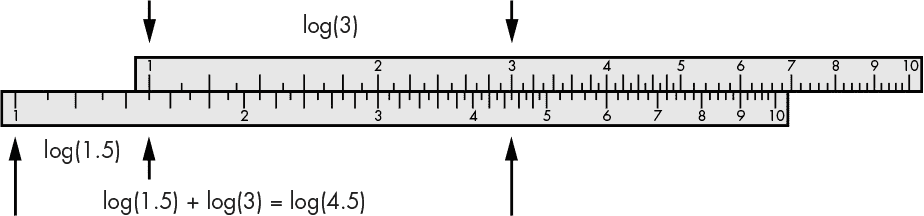

*图 2-1：滑尺加法*

被许多人认为是第一个大规模生产的计算设备，滑尺是一个很好的例子，展示了人们如何利用当时可用的技术解决问题。今天，飞机飞行员仍然使用一种圆形版本的滑尺，称为*飞行计算机*，作为备份设备进行与导航相关的计算。

计数是计算设备一个历史上重要的应用。由于我们手指的数量有限——而且我们还需要它们做其他事情——刻痕骨头和棒子被称为*计数棒*，早在公元前 18,000 年就被用作计算辅助工具。甚至有一种理论认为埃及的荷鲁斯之眼被用来表示二进制分数。

英国博学家查尔斯·巴贝奇（Charles Babbage，1791–1871）说服英国政府资助建造一台复杂的十进制机械计算器，称为*差分机*，该机最初由黑森军队工程师约翰·赫尔弗里希·冯·穆勒（Johann Helfrich von Müller，1746–1830）构思。差分机因威廉·吉布森和布鲁斯·斯特林的小说而广为人知，该小说以其命名，差分机超越了其时代，因为当时的金属加工技术无法精确制造所需的零部件。

然而，简单的十进制机械计算器是可以制造的，因为它们不需要同等水平的金属加工技术。例如，用于记账和会计的加法机在 17 世纪中期就已被发明出来，可以进行十进制数字的加法。许多不同型号的加法机都已大规模生产，后来的加法机版本用电动机取代了手动杠杆，使操作更加简便。事实上，经典的老式收银机就是一台加法机，配有一个钱箱。

所有这些历史例子可以分为两种截然不同的类别，正如我们接下来要讨论的。

#### *模拟与数字的区别*

在设备之间，如滑尺与计数棒或加法机之间，有一个重要的区别。图 2-2 展示了与一组标记手指对比的滑尺刻度之一，来源于图 2-1。

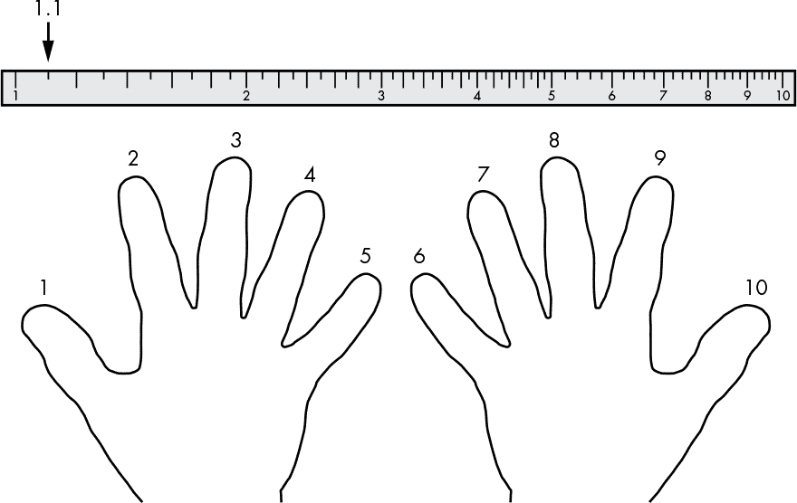

*图 2-2：连续与离散度量*

滑尺刻度和手指的范围都从 1 到 10。我们可以在刻度上表示 1.1 这样的值，这非常方便，但如果用手指表示就不行了，除非使用一些巧妙的魔术（如快速变换手势）。这是因为刻度是数学家所称的*连续*的，意味着它可以表示实数。而手指则是数学家所称的*离散*的，只能表示整数。在整数之间没有其他值，它们像手指一样，从一个整数跳到另一个整数。

当我们谈论电子学时，我们使用*模拟*这个词来表示连续的，而*数字*则表示离散的（记住手指是数字的，源于拉丁词*digitus*）。你可能听说过模拟和数字这两个术语。你当然一直在使用数字计算机进行编程，但你可能没有意识到，模拟计算机，比如滑尺，实际上也存在。

一方面，模拟看起来是计算的更好选择，因为它可以表示实数。但存在精度问题。例如，我们可以在图 2-2 的滑尺刻度上找出数字 1.1，因为这一部分的刻度较为空旷，并且有标记。但找到 9.1 就难多了，因为这一部分的刻度更加拥挤，数字位于 9.0 和 9.2 的刻度之间。即使用显微镜，也很难分辨 9.1 和 9.105 之间的差异。

当然，我们可以把刻度做得更大。例如，如果刻度是足球场那么长，我们的精度会更高。但如果刻度长达 120 码，做成便携计算机将非常困难，更别提操控这么大的物体需要大量的能源了。我们希望计算机既小巧，又快速，并且功耗低。接下来我们会了解另一个尺寸重要的原因。

#### *硬件中为何尺寸很重要*

假设你必须开车送孩子们上下学，学校距离 10 英里，平均速度是 40 英里每小时。距离和速度的组合意味着每小时只能来回两次。你不能更快地完成这趟行程，除非你开得更快或离学校更近。

现代计算机驱动电子流动，而不是孩子们。电流的传播速度是光速，大约每秒 3 亿米（除了在美国，电流的速度大约是每秒十亿英尺）。由于我们尚未发现绕过这一物理限制的方法，我们能在计算机中最小化旅行时间的唯一方法就是将各个部件放得更近一些。

现在的计算机时钟速度大约为 4 GHz，这意味着它们每秒可以做四十亿件事情。电流在四十亿分之一秒内大约只能传播 75 毫米。

图 2-3 显示了一款典型的 CPU，边长约为 18 毫米。在四十亿分之一秒的时间里，刚好足够完成两次完整的往返穿越这款 CPU。因此，事物做得更小可以实现更高的性能。

*图 2-3：CPU 光学显微照片（感谢英特尔公司提供）*

同样，就像接送孩子上下学一样，旅行需要能量，而仅仅喝咖啡是不够的。将事物做得更小可以减少所需的旅行距离，从而减少所需的能量。这意味着更低的功耗和更少的热量产生，从而防止手机把你的口袋烤穿。这也是计算设备历史上一直致力于使硬件更小的原因之一。但把事物做得非常小也会带来其他问题。

#### *数字化使设备更稳定*

尽管把东西做得更小可以提高速度和效率，但它也很容易干扰到非常小的事物。德国物理学家沃纳·海森堡（1901-1976）对此非常确定。

想象一个玻璃量杯，杯身上标有从 1 到 10 盎司的刻度线。如果你往杯子里加水并举起来，可能很难确定杯子里有多少盎司，因为你的手会稍微颤抖。现在想象一下，如果量杯小一亿倍。没有人能将它保持静止到足以获得准确的读数。事实上，即使你把这个微小的杯子放在桌子上，它仍然无法正常工作，因为在那个尺度下，原子运动会使它无法静止。在极小的尺度下，宇宙是一个充满噪声的地方。

量杯和计算尺都是模拟（连续）设备，稍微晃动一下就可能产生不准确的读数。像宇宙辐射这样的干扰足以在微观量杯中产生波动，但它们不太可能影响像手指、计数棒或机械计算器这样的离散设备。因为离散设备采用了*决策标准*。当你用手指计数时，没有“中间”的数值。如果我们在计算尺的整数位置加上*定位点*（某种机械的卡位），我们就可以将其改造为包含决策标准的设备。但一旦我们这样做，它就变成了一个离散设备，失去了表示实数的能力。实际上，决策标准会阻止某些范围的数值被表示出来。从数学上讲，这类似于将数字四舍五入到最接近的整数。

到目前为止，我们讨论的干扰仿佛来自外部，所以你可能认为我们可以通过某种屏蔽来最小化它。毕竟，铅保护超人免受氪石的影响。但还有另一个更隐蔽的干扰来源。电力像引力一样远距离影响物体——这很好，否则我们就不会有无线电了。但这也意味着信号沿着芯片上的导线传播时，可能会影响到其他导线上的信号，特别是当它们非常靠近时。现代计算机芯片上的导线相距几纳米（10^(-9)米）。相比之下，一根人类头发的直径大约是 100,000 纳米。这种干扰有点像两辆车在路上擦身而过时你感受到的风。由于没有简单的方法可以防止这种*串扰*效应，因此使用决策标准具有更高*噪声免疫力*的数字电路至关重要。当然，我们可以通过让物体变得更大，以使导线之间的距离更远，从而减少干扰的影响，但这与我们的其他目标相悖。跨越决策标准的额外能量使我们获得了一定程度的免疫力，能够抵抗我们使用连续设备时无法获得的噪声干扰。

事实上，使用决策标准所带来的稳定性是我们构建数字（离散）计算机的主要原因。但正如你可能注意到的，世界是一个模拟（连续）的地方，只要我们远离那些微小到量子物理适用的事物。在接下来的部分，你将学习如何操作模拟世界，以获得构建稳定计算设备所需的数字行为。

#### *数字化的模拟世界*

很多工程涉及到科学家发现的自然发生的*传输函数*的巧妙应用。这些函数就像你在数学课上学到的函数，只不过它们表示的是现实世界中的现象。例如，图 2-4 展示了数字相机传感器（或老式模拟相机中的胶片）的传输函数图。

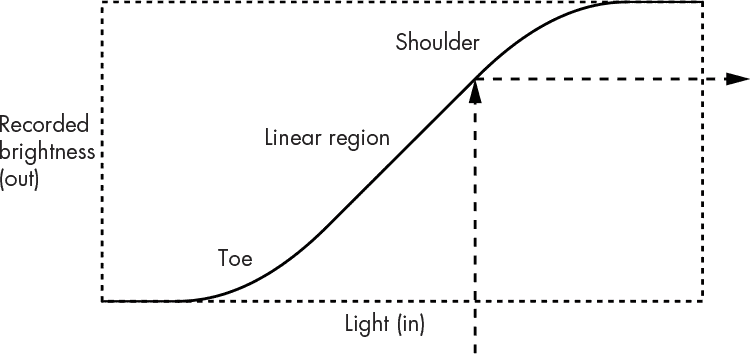

*图 2-4：相机传感器或胶片传输函数*

x 轴表示进入的光线量（输入），y 轴表示记录的亮度或传感器注册的光线量（输出）。曲线表示它们之间的关系。

让我们通过将输入球弹到曲线上来玩传递函数池，从而得到输出。你可以看到，传递函数对于不同的光照值产生不同的记录亮度值。请注意，曲线并不是一条直线。如果光线过多地打到曲线的*肩部*，图像将会曝光过度，因为记录的亮度值将比实际场景中的亮度值更接近。类似地，如果光线打到曲线的*脚部*，则图像会曝光不足。目标是（除非你在追求特殊效果）调整曝光量，使其落在*线性区域*，这将提供最忠实的现实表现。

工程师们已经开发出各种技巧来利用传递函数，例如调整相机的快门速度和光圈，使光线落入线性区域。放大器电路，比如驱动你音乐播放器中的扬声器或耳机的电路，就是另一个例子。

图 2-5 展示了改变音量对放大器传递函数的影响。

*图 2-5：增益对放大器传递函数的影响*

音量控制调整*增益*，即曲线的陡峭程度。如你所见，增益越高，曲线越陡，输出也越大声。但如果我们有一个 1984 年电影《This Is Spinal Tap》中的特殊放大器，增益可以调到 11 呢？那样信号就不再局限于线性区域了。这就会导致*失真*，因为输出不再是输入的忠实再现，听起来会很糟糕。你可以在图 2-6 中看到，输出看起来不像输入，因为输入已经超出了传递函数的线性区域。

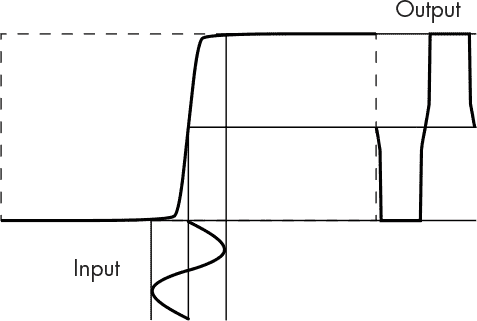

*图 2-6：放大器削波*

输入的一个小变化会在曲线的陡峭部分导致输出的跳跃。这就像从一个手指跳到另一个手指——这就是我们所追求的决策标准，称为*阈值*。这种失真是一个有用的现象，因为输出值要么落在阈值的一侧，要么落在另一侧；很难落在两者之间。这将连续空间划分为离散区域，这对于稳定性和抗噪声性很重要——即在干扰存在的情况下仍能正常工作。你可以将模拟信号看作是瞄准一个大的线性区域，而数字信号则希望拥有一个小的线性区域。

你可能在小时候玩跷跷板时（如果你幸运地成长在一个教育游乐设施尚未被认为危险的时代）直觉地发现了这个现象。处于脚部区域（完全下沉）或肩部区域（完全上升）要比试图在两者之间平衡要稳定得多。

#### *为什么使用比特而不是数字*

我们已经讨论过为什么数字技术比模拟技术更适合计算机。但为什么计算机使用位而不是数字呢？毕竟，人类使用数字，我们非常擅长数到 10，因为我们有 10 根手指。

显而易见的原因是计算机没有手指。如果有手指，那会很吓人。一方面，依靠手指来计数可能是直观的，但这不是一种高效的使用手指的方法，因为每个数字都用一个手指。另一方面，如果你用每根手指来表示一个值，就像处理位一样，你可以数到超过 1,000。这并不是一个新想法；实际上，中国人早在公元前 9 年就使用 6 位数字来表示《易经》中的卦象。使用位代替手指提高了效率，效率提高了 100 倍以上。即使使用四根手指来表示十进制数，采用我们在第一章中看到的二进制编码十进制（BCD）表示法，效率也要比我们正常的计数方法高。

另一个位比数字更适合硬件的原因是，使用数字时，没有简单的方法来调整传输函数，以获得 10 个不同的阈值。我们可以构建实现图 2-7 左侧的硬件，但它比 10 个实现图右侧的硬件要复杂和昂贵得多。

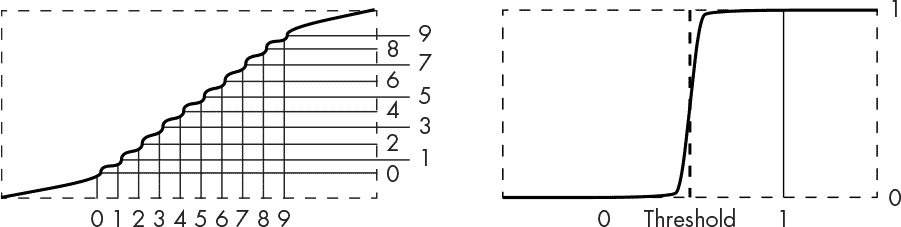

*图 2-7：十进制与二进制阈值*

当然，如果我们*能够*在与一个阈值相同的空间中构建 10 个阈值，我们会这么做。但是，正如我们所看到的，使用 10 个位比使用一个数字更好。这就是现代硬件的工作方式。我们利用传输函数的脚部和肩部区域，在电气工程语言中称之为*截止*和*饱和*。这里有足够的自由空间；要获得错误的输出需要很多干扰。传输函数曲线非常陡峭，输出会迅速从一个值跳跃到另一个值。

### 电力简明入门

现代计算机通过操控电力来运作。电力使得计算机比其他当前技术更快速、更容易构建。本节将帮助你了解足够的电力知识，以便你能够理解它是如何在计算机硬件中被使用的。

#### *通过水管来理解电力*

电力是不可见的，这使得它很难被直观地理解，所以让我们假设它是水。电力来自像电池这样的能源，就像水来自水箱一样。电池会耗尽能量，需要充电，就像水箱会空掉，需要重新加水一样。太阳是我们唯一的主要能源；对于水来说，太阳的热量会导致蒸发，形成雨水，重新填满水箱。

让我们从一个简单的水阀开始，就像图 2-8 所示那样。

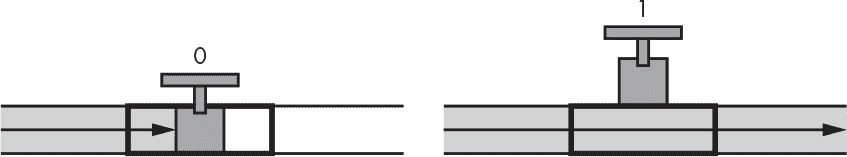

*图 2-8：一个水阀*

正如你所看到的，阀门上有一个手柄用来打开和关闭阀门。图 2-9 展示了一个现实生活中的门阀，它得名于通过手柄开启和关闭的门。阀门打开时，水可以流过。我们假设 0 代表关闭，1 代表打开。

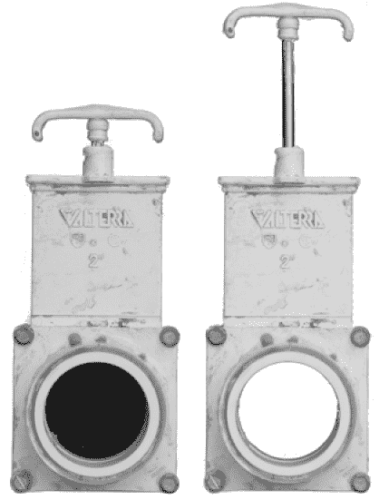

*图 2-9：闭合和打开的门阀*

我们可以用两个阀门和一些管道来说明 AND 操作，如图 2-10 所示。

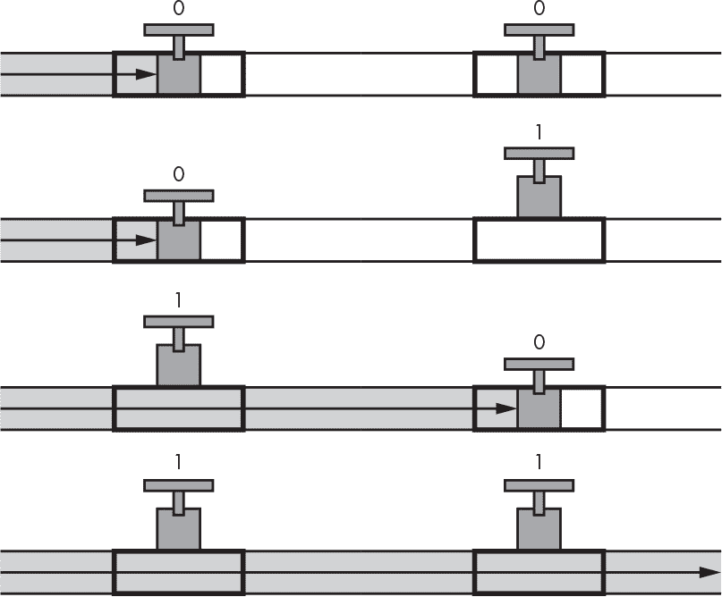

*图 2-10：与 AND 操作相关的管道布置*

正如你所看到的，水只有在两个阀门都打开，或者说等于 1 时才会流动，这就是你在第一章中学到的 AND 操作的定义。当一个阀门的输出连接到另一个阀门的输入时，如图 2-10 所示，这叫做*串联连接*，它实现了 AND 操作。*并联连接*，如图 2-11 所示，是通过将阀门的输入和输出连接在一起实现的，它实现了 OR 操作。

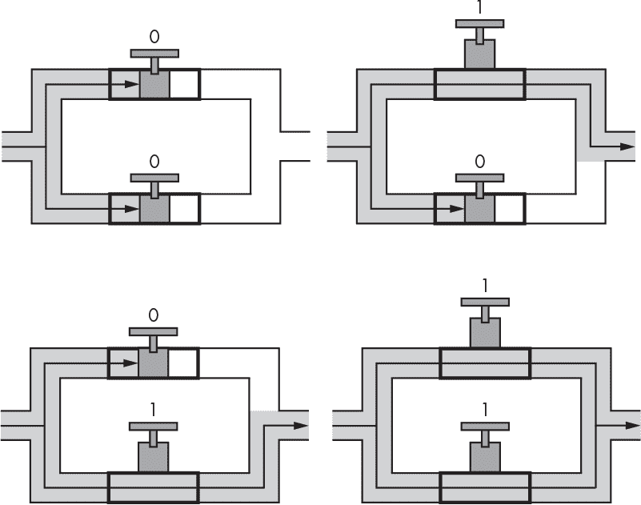

*图 2-11：与 OR 操作相关的管道布置*

就像电流需要时间通过计算机芯片一样，水流通过管道也需要时间。你可能在洗澡时经历过这种现象，当你调节水龙头后，需要等待水温发生变化。这种现象被称为*传播延迟*，我们稍后会详细讨论。这个延迟不是恒定的；在水流中，温度会导致管道膨胀或收缩，从而改变流速，进而影响延迟时间。

电流通过电线的方式就像水流过管道一样。它是电子的流动。电线有两个部分：内部的金属，像管道内部的空间一样，是*导体*；外部的覆盖层，像水管本身一样，是*绝缘体*。通过阀门可以控制电流的开启和关闭。在电力世界中，阀门被称为*开关*。它们非常相似，甚至一个几乎过时的设备——真空管，也曾被称为热电子阀。

水流并非只是被动地通过管道，它是由*压力*推动的，压力的强度可以变化。水压的电学对应物是*电压*，其单位是*伏特 (V)*，以意大利物理学家亚历山德罗·伏打（Alessandro Volta，1745–1827）的名字命名。流量的大小称为*电流 (I)*，其单位是*安培*，以法国数学家安德烈-玛丽·安培（André-Marie Ampère，1775–1836）的名字命名。

水可以通过宽管道或窄管道流动，但管道越窄，阻力就越大，从而限制了水流的量。即使你有很高的电压（水压），如果使用的导体（管道）太窄，电流（流量）也无法很大。*电阻（R）*的单位是*欧姆（Ω）*，以德国数学家和物理学家 Georg Simon Ohm（1789–1854）的名字命名。

这三种变量——电压、电流和电阻——都通过*欧姆定律*相关联，该定律表示为*I* = *V*/*R*，可以解读为“电流等于电压除以电阻（欧姆）”。因此，像水管一样，更多的电阻意味着更小的电流。电阻还会将电能转化为热能，这就是烤面包机和电热毯等设备的工作原理。图 2-12 展示了电阻如何使电压更难推动电流。

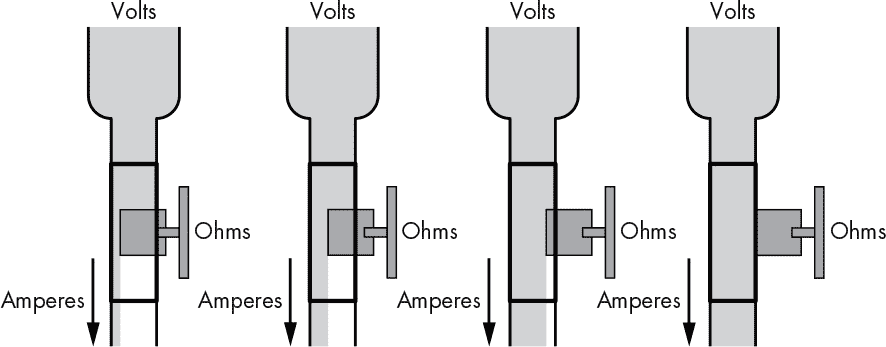

*图 2-12：欧姆定律*

理解欧姆定律的一个简单方法是通过吸管吸奶昔。

#### *电气开关*

制造一个电气开关（阀门）实际上只是将一个绝缘体插入或移除在导体之间的过程。可以想象手动操作的电灯开关。它们包含两块金属片，通过操作开关的把手使两块金属片接触或分开。事实证明，空气是一个相当好的绝缘体；如果两块金属片不接触，电流就无法流动。（注意，我说空气是“相当好的”绝缘体；在足够高的电压下，空气会电离并变成导体。想想闪电。）

建筑物中的水管系统可以通过蓝图展示。电气系统被称为*电路*，它们通过*示意图*记录，示意图使用符号表示每个组件。图 2-13 显示了一个简单开关的符号。

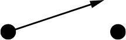

*图 2-13：单极单刀开关示意图*

这种开关就像是吊桥：当图示中的箭头（桥）抬起时，电流（汽车）无法从一侧流向另一侧。这个原理在老式的*刀刀开关*中很容易看到，如图 2-14 所示，它们常出现在一些低成本的科幻电影中。刀刀开关现在仍用于一些像电力切断箱这样的设备，但如今它们通常被隐藏在保护容器内，以防止你不小心触电。

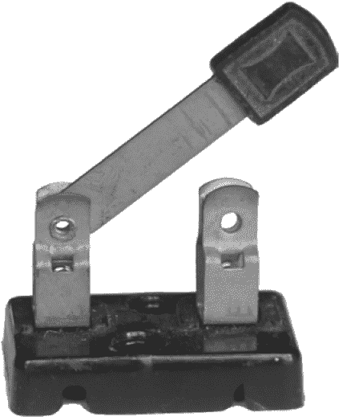

*图 2-14：单极单刀刀开关*

图 2-13 和 2-14 都展示了*单极单投（SPST）*开关。*极*是指连接在一起的开关数量，这些开关一起移动。在前一部分的水阀中，我们使用的是单极阀；我们可以通过在一对阀门的手柄之间焊接一根杠杆来制作一个*双极*阀，这样当你移动杠杆时，它们会一起移动。开关和阀门可以有任意数量的极。*单投*意味着只有一个接触点：某个设备要么开，要么关，但不能同时开和关。要做到这一点，我们需要一个*单极双投（SPDT）*设备。图 2-15 展示了这种设备的符号。

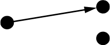

*图 2-15: SPDT 开关原理图*

这就像是一个铁路道岔，把火车引到一条轨道上，或者像图 2-16 所示的管道，分成两条管道。

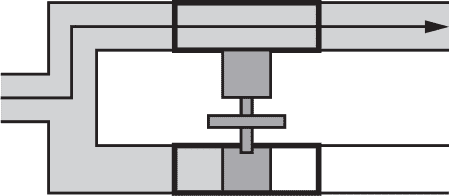

*图 2-16: SPDT 水阀*

如你所见，当手柄被按下时，水会通过上方的阀门流动。如果手柄被推上去，水则会通过下方的阀门流动。

开关术语可以扩展到描述任何数量的极和投掷。例如，*双极双投（DPDT）*开关将在图 2-17 中绘制，虚线表示极是*联动*的，意味着它们一起移动。

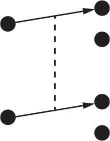

*图 2-17: DPDT 开关原理图*

图 2-18 显示了现实中 DPDT 刀开关的样子。

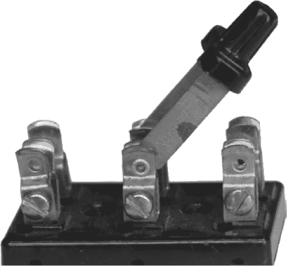

*图 2-18: DPDT 刀开关*

我在之前的水务部分略去了几个细节：系统无法正常工作，除非水有去处。如果排水口堵塞，水就进不去。而且必须有某种方式将水从排水口引回水箱，否则系统将会干涸。

电气系统类似。电力从能源源通过各个组件流动并返回源头。这就是为什么它被称为电气*电路*。或者你可以这么想：一个人跑步时必须回到起跑线才能进行下一圈。

看一下图 2-19 中的简单电路。它引入了两个新符号，一个表示电压源（在左侧），另一个表示灯泡（在右侧）。如果你构建了这样的电路，你就可以通过开关打开和关闭灯光。

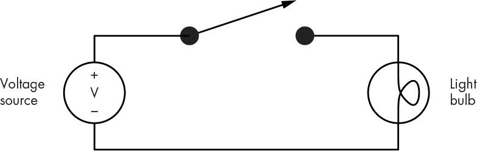

*图 2-19: 简单电路*

当开关打开时，电流无法流动。当开关闭合时，电流从电压源流过开关，经过灯泡，然后回到电压源。串联和并联开关的安排就像它们的水阀对应物一样工作。

现在你已经了解了一些关于电力和基本电路元件的知识。虽然它们可以用于实现一些简单的逻辑功能，但它们本身的能力不足以做更多的事情。在下一节中，你将了解一个额外的设备，它使早期的电力驱动计算机成为可能。

### 为比特构建硬件

现在你已经了解了为什么我们在硬件中使用比特，你可以开始学习它们是如何构建的。直接进入现代电子实现技术可能会让人觉得有些难以理解，因此我会从其他历史技术开始，逐步展开讨论，这些技术更容易理解。虽然这些例子在今天的计算机中没有被使用，但你可能会在与计算机配套工作的系统中遇到它们，因此了解它们还是很有价值的。

#### *继电器*

早在电子学发明之前，电力就已经被用来为计算机提供动力。丹麦物理学家汉斯·克里斯蒂安·厄尔斯特（Hans Christian Ørsted，1777–1851）在 1820 年发现了电与磁之间的关系。只要将一捆电线缠绕起来并通电，就能形成一个*电磁铁*。电磁铁可以开启和关闭，并且可以用来移动物体。它们还可以用来控制水阀，这也是大多数自动喷灌系统的工作原理。利用电磁学的原理可以巧妙地制造电动机。用磁铁围绕电线线圈旋转会产生电流，这就是发电机的工作原理；事实上，这就是我们获得大多数电力的方式。如果你有兴趣尝试这些东西，切断电磁铁的电流相当于快速地将磁铁在电线圈附近挥动。这可能会带来非常强烈的电击感，但这种效应被称为*反电动势（back-EMF）*，非常有用；这就是汽车点火线圈制造火花塞火花的方式。它也是电围栏工作的原理。

*继电器*是一种利用电磁铁来移动开关的装置。图 2-20 展示了一个单刀双掷继电器的符号，你可以看到它看起来像是一个开关符号与电线圈结合的样子。

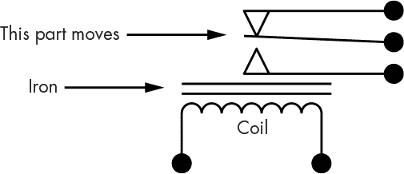

*图 2-20：SPDT 继电器原理图*

图 2-21 展示了一个实际的单刀单掷继电器的例子。当线圈没有电时，开关部分是断开的，所以它被称为*常开*继电器。如果没有电时开关是闭合的，那它就是*常闭*继电器。

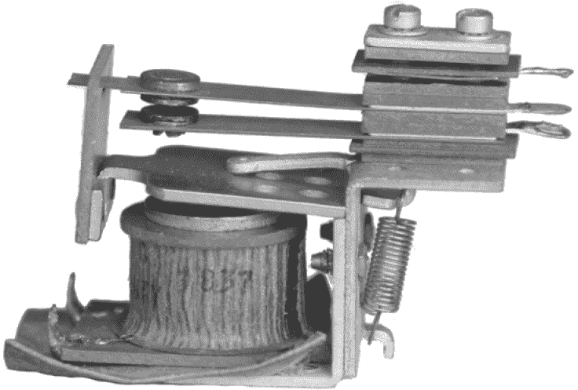

*图 2-21：常开 SPST 继电器*

底部的连接线连接到电线线圈；其余部分看起来很像是开关的变体。中间的触点会根据线圈是否通电而移动。我们可以使用继电器实现逻辑功能，如图 2-22 所示。

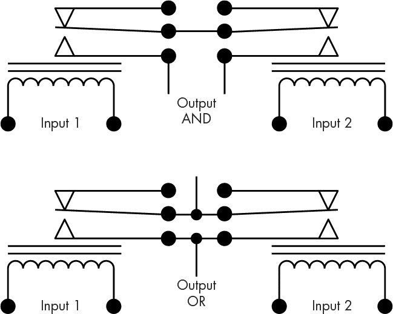

*图 2-22：用于 AND 和 OR 功能的继电器电路*

在图 2-22 的顶部，你可以看到，只有*当两个*继电器都被激活时，两根输出线才会连接在一起，这就是我们对“与”功能的定义。同样地，在底部，如果*任意一个*继电器被激活，线才会连接在一起，这就是“或”功能。请注意图中的小黑点。这些点表示电路图中线与线之间的连接；没有小黑点的交叉线是没有连接的。

继电器让我们能够做一些开关无法完成的事情。例如，我们可以构建*逆变器*，实现“非”功能，没有它，我们的布尔代数选项将非常有限。我们可以使用顶部“与”电路的输出驱动底部“或”电路的输入。正是这种使开关控制其他开关的能力，让我们能够构建计算机所需的复杂逻辑。

人们使用继电器做出了令人惊叹的事情。例如，有一种单极 10 档*步进继电器*，它有两个线圈。一个线圈在每次通电时将触点移到下一个位置，另一个线圈则通过将触点复位到第一个位置来重置继电器。曾经有很多装满步进继电器的大楼，它们在拨打电话时根据拨号的数字来计数，连接电话。电话交换机曾经是非常嘈杂的地方。步进继电器也是老式弹球机所具有的魅力之一。

另一个关于继电器的有趣事实是，传输函数的阈值是垂直的；无论你多慢地增加线圈上的电压，开关总是会从一个位置快速切换到另一个位置。这让我小时候感到困惑；直到大学三年级学习拉格朗日-哈密顿方程时，我才明白，传输函数在阈值处的值是未定义的，这就导致了“咔嚓”声的发生。

继电器的主要问题在于它们速度慢、耗电量大，而且如果开关接触点上有脏物（或昆虫），它们就无法工作。事实上，*bug*这一术语是由美国计算机科学家格雷斯·霍普于 1947 年普及的，当时哈佛 Mark II 计算机的一个故障被追溯到继电器里困住的一只飞蛾。另一个有趣的问题是，当使用开关接触点来控制其他继电器时，记住突然断开线圈的电源会瞬间产生非常高的电压，而且在高电压下空气会变得导电。这个现象常常导致开关接触点之间产生火花，从而使它们磨损。由于这些缺点，人们开始寻找一些没有移动部件的装置，以代替继电器执行相同的工作。

#### *真空管*

英国物理学家和电气工程师约翰·安布罗斯·弗莱明爵士（1849–1945）发明了真空管。他基于一种叫做*热电子发射*的原理，解释了如果你将某物加热到足够的程度，电子会跳出来。真空管有一个*加热器*，用来加热*阴极*，阴极就像棒球中的投手。在真空中，电子（棒球）从阴极流向*阳极*（捕手）。一些真空管的例子显示在图 2-23 中。

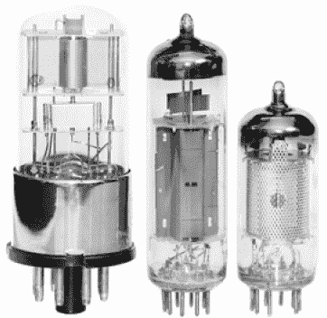

*图 2-23：真空管*

电子具有与磁铁相似的某些特性，包括相反的电荷相互吸引，类似的电荷相互排斥。真空管可以包含一个额外的“电池”元件，叫做*栅极*，它可以排斥来自阴极的电子，防止它们到达阳极。包含三个元件（阴极、栅极和阳极）的真空管叫做*三极管*。图 2-24 显示了三极管的示意符号。

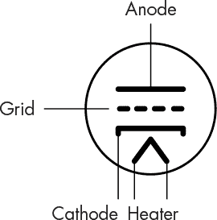

*图 2-24：三极管示意图*

这里，加热器加热阴极，使得电子跳出来。除非栅极将它们弹回，否则它们会落到阳极上。因此，你可以将栅极看作开关的把手。

真空管的优点是它们没有活动部件，因此比继电器快得多。缺点是它们会变得非常热，而且像灯泡一样脆弱。加热器像灯泡的灯丝一样会烧坏。但真空管仍然比继电器有很大改进，能够构建更快速、更可靠的计算机。

#### *晶体管*

现如今，晶体管占主导地位。*晶体管*是“转移电阻”（*transfer resistor*）的缩写，类似于真空管，但使用了一种特殊类型的材料，叫做*半导体*，它能够在导体和绝缘体之间变化。事实上，这一特性正是制造无需加热器且没有活动部件的电流阀所需的。然而，晶体管当然并不完美。我们可以将它们做得非常非常小，这是好事，但细小的导体会有更多的电阻，这会产生热量。如何消除晶体管中的热量是一个真正的问题，因为半导体很容易熔化。

你不需要了解晶体管内部的所有细节。重要的是要知道，晶体管是由某种半导体材料（通常是硅）制成的，它是在一个*基板*或平板上制造的。与齿轮、阀门、继电器和真空管等其他技术不同，晶体管不是单独制造的物体。它们是通过一种叫做*光刻*的工艺制造的，该工艺将晶体管的图像投射到硅片上并进行显影。这个过程适合大规模生产，因为大量晶体管可以被投射到一块硅片基板上，然后显影，再切割成独立的组件。

有许多不同类型的晶体管，但主要有两种类型：*双极型接面晶体管（BJT）*和*场效应晶体管（FET）*。制造过程中涉及到*掺杂*，即通过将砷等有害化学物质注入基材，改变其特性。掺杂过程创造了*p*型和*n*型材料的区域。晶体管的构造包括制作*p*型和*n*型的三明治。图 2-25 展示了某些晶体管类型的原理图符号。

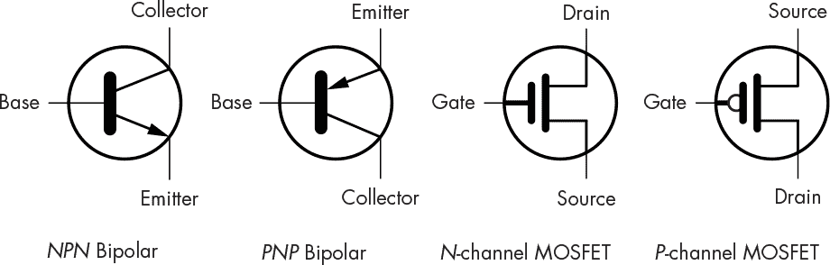

*图 2-25：晶体管原理图符号*

*NPN*、*PNP*、*N*型通道和*P*型通道这些术语指的是晶体管的三明治结构。你可以将晶体管想象成一个阀门或开关；*栅极*（或*基极*）是手柄，当手柄被抬起时，电流从上到下流动，类似于继电器中的线圈移动接触点。但与我们之前见过的开关和阀门不同，双极型晶体管只能允许电流单向流动。

从场效应晶体管的符号中可以看到，栅极与晶体管的其他部分之间有一个间隙。这个间隙象征着场效应晶体管通过静电原理工作；它就像用静电吸附来移动开关。

*金属氧化物半导体场效应晶体管*，或称*MOSFET*，是场效应晶体管（FET）的一种变体，由于其低功耗，广泛应用于现代计算机芯片中。*N*型通道和*P*型通道变体通常成对使用，这就是术语*CMOS*（互补金属氧化物半导体）的来源。

#### *集成电路*

晶体管使得更小、更快速、更可靠的逻辑电路得以实现，而且功耗更低。但即使是构建一个简单的电路，比如实现与门功能的电路，仍然需要许多组件。

这一切在 1958 年发生了变化，当时美国电气工程师杰克·基尔比（1923–2005）和美国数学家、物理学家以及费尔柴尔德半导体和英特尔共同创始人罗伯特·诺伊斯（1927–1990）发明了*集成电路*。有了集成电路，复杂的系统可以以大致相同的成本构建，而不是仅仅构建一个单独的晶体管。由于集成电路的外观，后来它们被称为*芯片*。

如你所见，许多相同类型的电路可以使用继电器、真空管、晶体管或集成电路来构建。随着每项新技术的出现，这些电路变得更小、更便宜、且更节能。下一节将讨论为组合逻辑设计的集成电路。

### 逻辑门

在 1960 年代中期，Jack Kilby 所在的公司德州仪器（Texas Instruments）推出了 5400 和 7400 系列集成电路。这些芯片包含了已经做好逻辑运算的电路。这些电路被称为*逻辑门*，简称*门电路*，是我们所说的组合逻辑的布尔函数的硬件实现。德州仪器销售了成千上万的这些芯片，它们今天仍然可以买到。

逻辑门电路对硬件设计师来说是一个巨大的福音：他们不再需要从零开始设计一切，可以像安装复杂管道一样轻松地构建复杂的逻辑电路。就像水管工可以在五金店找到管件、弯头和接头一样，逻辑设计师可以找到“门电路盒”，其中有与门、或门、异或门和*反相器*（执行非操作的电路）。图 2-26 展示了这些门电路的符号。

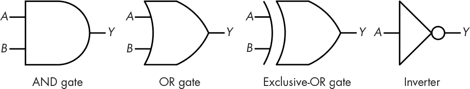

*图 2-26：门电路原理图*

正如你所预料的那样，*Y*输出的与门（AND gate）只有在*A*和*B*两个输入都为真时才为真。（你可以从图 1-1 中展示的真值表得到其他门电路的操作方式。）

在图 2-26 中，反相器符号的关键部分是○（圆圈），而不是它所连接的三角形。没有圆圈的三角形被称为*缓冲器*（buffer），它仅仅将输入传递到输出。反相器符号几乎只在反相器未与其他元件组合使用的地方使用。

使用 5400 和 7400 系列的*晶体管-晶体管逻辑（TTL）*技术来构建与门和或门并不高效，因为简单门电路的输出天然是反向的，因此需要一个反相器来将输出恢复为正确的方向。这样会使得电路变得更加昂贵、速度变慢且功耗更大。因此，基本的门电路使用了*NAND*（非与）和*NOR*（非或）门，它们使用了反相圆圈，样式如图 2-27 所示。

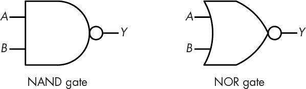

*图 2-27：NAND 门和 NOR 门*

幸运的是，这种额外的反转不会影响我们设计逻辑电路的能力，因为我们有德摩根定律。图 2-28 应用了德摩根定律，显示 NAND 门等同于带有反相输入的或门（OR gate）。

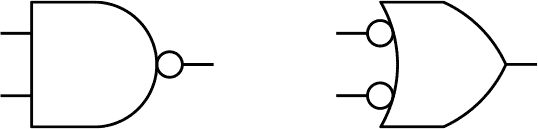

*图 2-28：使用德摩根定律重绘 NAND 门*

到目前为止，我们看到的所有门电路都只有两个输入，排除反相器之外，实际上门电路可以有多个输入。例如，一个三输入与门（AND gate）如果每个输入都为真，那么输出为真。现在你已经知道了门电路的工作原理，让我们来看一些使用门电路时可能出现的复杂问题。

#### *通过滞后提高噪声免疫性*

你之前看到过，使用数字（离散）设备时，由于决策标准，我们能获得更好的抗噪声能力。但也有一些情况，单凭这个标准是不够的。我们很容易假设逻辑信号从 0 到 1 或从 1 到 0 会瞬间变化。大多数情况下，这是一个不错的假设，特别是当我们将门电路相互连接时。但许多实际世界中的信号变化得更慢。

让我们看看当信号缓慢变化时会发生什么。图 2-29 显示了两个信号，它们从 0 慢慢上升到 1。

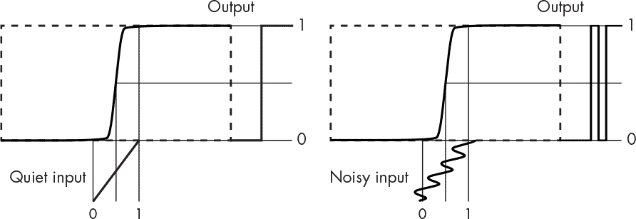

*图 2-29：噪声毛刺*

左边的输入安静且没有噪声，但右边的信号有一些噪声。你可以看到，噪声信号导致输出出现*毛刺*，因为噪声使得信号多次越过阈值。

我们可以通过使用*滞回*来解决这个问题，在这种情况下，决策标准受到历史的影响。正如你在图 2-30 中看到的，传递函数是不对称的；实际上，上升信号（从 0 到 1 的信号）和下降信号（从 1 到 0 的信号）有不同的传递函数，正如箭头所示。当输出为 0 时，应用右侧的曲线，反之亦然。

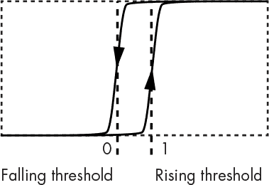

*图 2-30：滞回传递函数*

这给我们带来了两个不同的阈值：一个用于上升信号，一个用于下降信号。这意味着，当一个信号跨越其中一个阈值时，它在跨越另一个阈值之前需要经过更长的距离，这就转化为更强的抗噪声能力。

包含滞回的门电路是有的。它们被称为*施密特触发器*，以美国科学家奥托·H·施密特（1913–1998）的名字命名，他发明了这种电路。由于它们比普通门电路更复杂且昂贵，因此只在真正需要的地方使用。它们的原理图符号表示了滞回的加入，正如图 2-31 中反相器的所示。

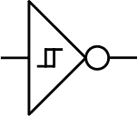

*图 2-31：施密特触发器门电路原理图符号*

#### *差分信号传输*

有时噪声非常强大，即使是滞回也不足以应对。想象一下你在走人行道。假设人行道的右边缘是*正向阈值*，左边缘是*负向阈值*。你可能正在专心走路，这时一个推着双人推车的人把你撞到人行道的右边缘，然后一群慢跑者又把你推回到左边。我们在这种情况下也需要保护。

到目前为止，我们是根据绝对阈值，或在施密特触发器情况下的两个阈值来测量信号。但也有一些情况，噪声非常强大，以至于两个施密特触发器阈值都会被跨越，从而使它们失效。

让我们试试伙伴系统。现在想象你正和一个朋友一起走在人行道上。如果你的朋友在你左边，我们叫它 0；如果你的朋友在你右边，我们叫它 1。当婴儿车和那些慢跑者经过时，你和你的朋友都会被推到一旁。但你们并没有改变位置，所以如果我们测量的是这个，那么噪音没有影响。当然，如果你们只是彼此靠近随便走动，其中一个人可能会被推走，而另一个人没有。这就是为什么牵手更好，或者把手臂绕在对方腰间。是的，拥抱能带来更强的噪声免疫力！这叫做*差分信号*，因为我们测量的是一对*互补*信号之间的*差异*。图 2-32 展示了一个差分信号电路。

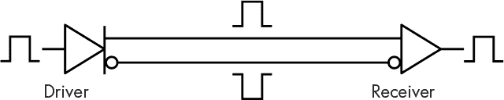

*图 2-32：差分信号*

你可以看到有一个*驱动器*将输入信号转换为*互补输出*，而一个*接收器*将互补输入转换回*单端*输出。接收器通常包括一个施密特触发器，以提供额外的噪声免疫力。

当然，这也有局限性。过多的噪声可能会将电子组件推到其指定的工作范围之外——想象一下，旁边有一座建筑，你和你的朋友都被推到了墙上。*共模抑制比（CMRR）*是组件规格的一部分，表示能够处理的噪声量。之所以叫“共模”，是因为它特指对一对信号中都共有的噪声。

差分信号在许多地方都有应用，比如电话线路。这一应用在 1880 年代变得尤为必要，当时电动有轨电车首次亮相，因为它们产生了大量的电噪声，干扰了电话信号。苏格兰发明家亚历山大·格雷厄姆·贝尔（1847–1922）发明了*双绞线*电缆，将一对导线扭在一起，提供了电气上类似于拥抱的效果（见图 2-33）。他还获得了电话的专利。今天，双绞线无处不在；你会在 USB、SATA（磁盘驱动器）和以太网电缆中看到它。

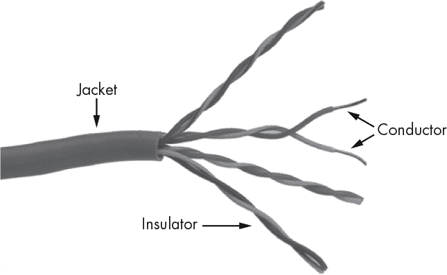

*图 2-33：双绞线以太网电缆*

差分信号的一种有趣应用可以在美国乐队“感恩的死”（The Grateful Dead，1965–1995）使用的“声音墙”演唱会音响系统中找到。它通过使用一对麦克风，将一个麦克风的输出信号从另一个麦克风的输出信号中减去，从而解决了人声麦克风反馈问题。这样，任何同时打到两个麦克风的声音就变成了共模信号并被取消掉。歌手会对着其中一个麦克风唱歌，这样他们的声音就能通过该麦克风传输。该系统的一个副作用，在乐队的现场录音中可以听到，就是观众噪音听起来会显得刺耳。原因是低频声音的波长比高频声音更长，低频噪音更容易成为共模噪音。

#### *传播延迟*

我在《用管道来理解电流》一文中曾提到过传播延迟，见第 41 页。*传播延迟*是输入变化反映到输出所需的时间。由于制造工艺和温度的差异，加上连接到门输出的元件数量和类型，传播延迟是一个统计量度。门有最小和最大延迟；实际延迟在这两者之间。传播延迟是限制逻辑电路能达到的最大速度的因素之一。设计师必须使用*最坏情况*的值来确保电路的正常工作。这意味着他们必须假设最短和最长的延迟时间。

在图 2-34 中，灰色区域表示我们不能依赖输出的地方，因为传播延迟的存在。

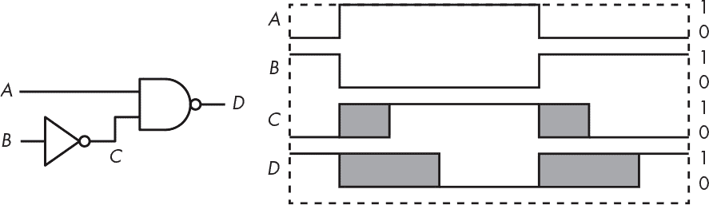

*图 2-34：传播延迟示例*

输出可能在灰色区域的左边缘就发生变化，但直到右边缘才有可能确保输出变化。而且随着更多的门被串联在一起，灰色区域的长度会增加。

传播延迟时间的范围非常广泛，取决于工艺技术。个别元件，例如 7400 系列部件，延迟可以在 10 纳秒范围内（即十亿分之一秒）。现代大型元件内部的门延迟，例如微处理器，可能在皮秒（万亿分之一秒）级别。如果你正在阅读一个元件的规格说明，传播延迟通常会指定为 t[PLH]和 t[PHL]，分别表示从低电平到高电平和从高电平到低电平的传播时间。

现在我们已经讨论了输入和到达输出的过程，是时候看看输出了。

#### *输出变化*

我们已经讨论了一些关于门输入的内容，但我们还没有详细说输出部分。有几种不同类型的输出设计用于不同的应用。

##### 托特姆极性输出

正常的门输出被称为*托特姆极*，因为一种晶体管堆叠在另一种晶体管之上，类似于托特姆极的结构。我们可以使用开关模型来表示这种类型的输出，如图 2-35 所示。

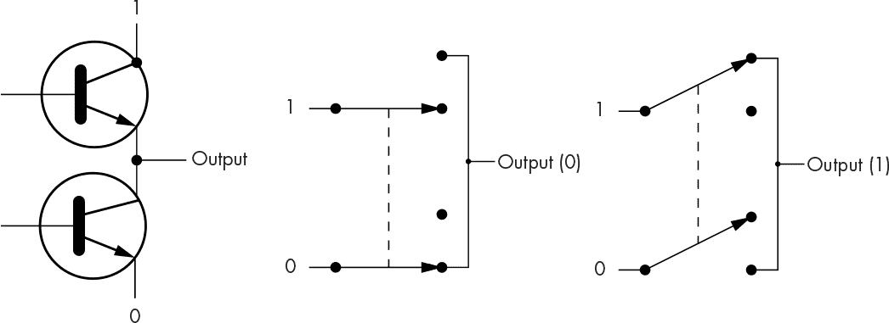

*图 2-35：托特姆极输出*

左侧的原理图说明了什么是“托特姆极”输出。图中的上方开关被称为*主动拉升*，因为它将输出连接到高逻辑电平，从而在输出端得到 1。托特姆极输出不能相互连接。正如在图 2-35 中所示，如果你将一个 0 输出连接到一个 1 输出，那么你就将正负电源连接在了一起——这就像是 1984 年电影*捉鬼敢死队*中的电流交叉场景一样，可能会烧毁组件。

##### 开集电极输出

另一种类型的输出称为*开集电极*或*开漏*，具体取决于所使用的晶体管类型。该输出的原理图和开关模型如图 2-36 所示。

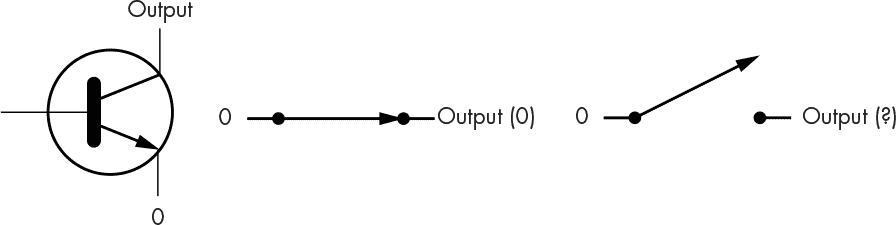

*图 2-36：开集电极/开漏输出*

乍一看，这似乎有些奇怪。如果我们需要 0 输出，没问题，但当输出不为 0 时，输出会*浮空*，因此我们不知道它的值。

由于开集电极和开漏版本没有主动拉升，我们可以将它们的输出连接在一起而不会造成损害。我们可以使用*被动拉升*，这只是一个*拉升电阻*，它将输出连接到电源电压，这是 1 的源。这种电压在双极晶体管中称为 V[CC]，在金属氧化物半导体（MOS）晶体管中称为 V[DD]。被动拉升的效果就是创建一个*线性与*，如图 2-37 所示。

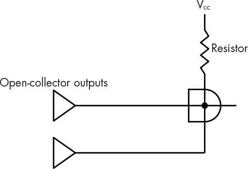

*图 2-37：线性与*

这里发生的情况是，当没有任何开集电极输出为低时，电阻将信号拉升至 1。电阻限制了电流，以防电路过热。只要有任何一个开集电极输出为低，输出就是 0。通过这种方式，你可以将多个设备连接在一起，消除了需要多个输入的与门。

开集电极和开漏输出的另一个用途是驱动像 LED（发光二极管）这样的设备。开集电极和开漏设备通常设计为支持这种用途，并且能够处理比托特姆极设备更高的电流。一些版本允许输出拉升到比逻辑 1 更高的电压水平，从而使我们能够与其他类型的电路接口。这一点非常重要，因为尽管在 7400 系列等门电路的同一系列内，阈值是一致的，但其他系列的阈值可能不同。

##### 三态输出

虽然开路集电极电路允许输出连接在一起，但它们的速度不如主动上拉电路。因此，让我们摆脱两态解决方案，引入*三态*输出。第三种状态是关闭。还有一个额外的*使能*输入，用于打开和关闭输出，如图 2-38 所示。

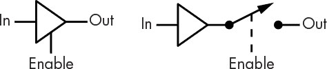

*图 2-38：三态输出*

关闭状态被称为*高阻抗（hi-Z）*状态，*Z* 是*阻抗*的符号，它是电阻的数学复杂版本。你可以将三态输出想象成图 2-35 中的电路。分别控制基极可以得到四种组合：0，1，高阻抗（hi-Z）和熔断。显然，电路设计师必须确保熔断组合不能被选择。

三态输出允许将大量设备连接在一起。需要注意的是，每次只能启用一个设备。

### 构建更复杂的电路

门电路的引入极大简化了硬件设计过程。人们不再需要从离散元件开始设计一切。例如，构建一个两输入的 NAND 门需要约 10 个元件，而 7400 芯片则将四个这样的门集成在一个封装中，称为*小规模集成（SSI）*部件，从而使一个封装可以替代 40 个部件。

硬件设计师可以像使用离散元件一样，通过 SSI 门电路构建任何东西，这使得设计更加便宜和紧凑。由于某些门电路组合被频繁使用，引入了*中规模集成（MSI）*部件，这些部件包含了这些组合，进一步减少了所需的元件数量。后来出现了*大规模集成（LSI）*、*超大规模集成（VLSI）*等。

在接下来的章节中，你将学习一些门电路组合，但这不是终点。我们使用这些更高级的功能性构件来构建更高阶的组件，就像复杂的计算机程序是由更小的程序构建而成一样。

#### *构建加法器*

让我们构建一个二的补码加法器。你可能永远不需要设计这样的加法器，但这个例子将演示如何通过巧妙地操作逻辑来提高性能——这对硬件和软件都适用。

我们在第一章中看到，两个比特的和是这两个比特的异或（XOR），而进位是这两个比特的与（AND）。图 2-39 展示了门电路的实现。

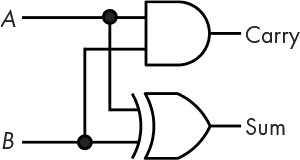

*图 2-39：半加器*

你可以看到，XOR 门提供了和，而 AND 门提供了进位。图 2-39 被称为*半加器*，因为它缺少了一些东西。它适用于两个二进制位相加，但需要第三个输入来实现进位。这意味着每一位的和需要两个加法器。当至少有两个输入为 1 时，我们就会发生进位。表 2-1 显示了这个*全加器*的真值表。

**表 2-1：** 全加器的真值表

| **A** | **B** | **C** | **和** | **进位** |
| --- | --- | --- | --- | --- |
| 0 | 0 | 0 | 0 | 0 |
| 0 | 0 | 1 | 1 | 0 |
| 0 | 1 | 0 | 1 | 0 |
| 0 | 1 | 1 | 0 | 1 |
| 1 | 0 | 0 | 1 | 0 |
| 1 | 0 | 1 | 0 | 1 |
| 1 | 1 | 0 | 0 | 1 |
| 1 | 1 | 1 | 1 | 1 |

全加器的构建稍微复杂一些，形状如图 2-40 所示。

*图 2-40：全加器*

如你所见，这需要更多的门。但现在我们有了全加器，我们可以用它来构建多位加法器。图 2-41 展示了一种称为*波纹进位加法器*的配置。

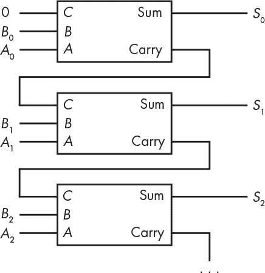

*图 2-41：波纹进位加法器*

这种*波纹进位加法器*得名于进位从一个位传递到下一个位的方式，就像做波浪动作一样。这种方式工作良好，但可以看到每一位都有两个门延迟，如果我们要构建一个 32 位或 64 位加法器，延迟会迅速累积。我们可以使用*进位预先加法器*来消除这些延迟，利用一些基本的算术方法就能弄明白如何工作。

我们可以在图 2-40 中看到，位*i*的全加器进位输出被送入位*i* + 1 的进位输入：

*C*[*i*+1] = (*A[i]* AND *B[i]*) OR (*A[i]* AND *C[i]*) OR (*B[i]* AND *C[i]*)

这里的关键问题是我们需要*C[i]*才能得到*C[i]*[+1]，这导致了波纹现象。你可以在下面的*C[i]*[+2]方程中看到这一点：

*C*[*i*+2] = (*A*[*i*+1] AND *B*[*i*+1]) OR (*A*[*i*+1] AND *C*[*i*+1]) OR (*B*[*i*+1] AND *C*[*i*+1])

我们可以通过将第一个方程代入第二个方程来消除这种依赖关系，具体如下：

*C*[*i*+2] = (*A*[*i*+1] AND *B*[*i*+1])

OR(*A*[*i*+1] AND ((*A[i]* AND *B[i]*) OR (*A[i]* AND *C[i]*) OR (*B[i]* AND *C[i]*)))

OR(*B*[*i*+1] AND ((*A[i]* AND *B[i]*) OR (*A[i]* AND *C[i]*) OR (*B[i]* AND *C[i]*)))

请注意，尽管有更多的 AND 和 OR 操作，但传播延迟仍然只有两个门的延迟。*C[n]*仅依赖于*A*和*B*输入，因此进位时间，从而加法时间，并不依赖于位数。*C[n]*总是可以从*C[n]*[–1]生成，随着*n*的增加，所需的门数量也越来越多。尽管门便宜，但它们会消耗电力，因此在速度和功耗之间存在权衡。

#### *构建解码器*

在“使用比特表示整数”的第 6 页中，我们从比特中构建或*编码*数字。译码器则执行相反的操作，将编码的数字转换回一组单独的比特。译码器的一种应用是驱动显示器。你可能在老式科幻电影中看到过*霓虹管*（如图 2-42 所示）；它们是一种非常酷的复古数字显示方式。它们本质上是一组霓虹灯标志，每个数字都有一个独立的显示器。每根发光的电线都有自己的连接，这要求我们将一个 4 位的数字转换成 10 个独立的输出。

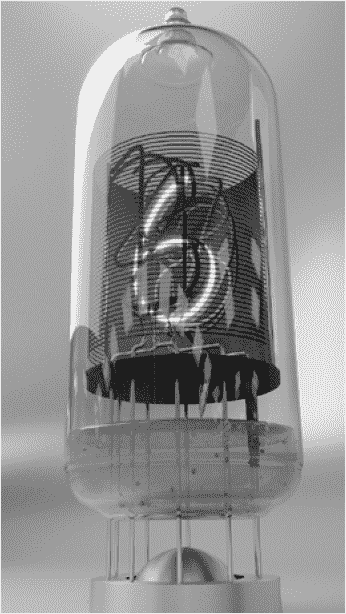

*图 2-42：一个真空管数字显示器*

请回想一下，八进制表示法包含八个不同的值，并将它们编码为 3 位。图 2-43 展示了一个 3:8 译码器，将八进制值转换回一组单独的比特。

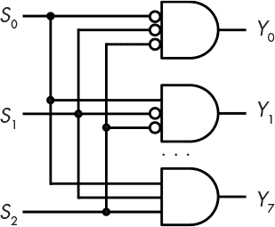

*图 2-43：一个 3:8 译码器*

当输入为 000 时，*Y*[0]输入为真；当输入为 001 时，*Y*[1]为真；依此类推。译码器的名称通常由输入和输出的数量命名。图 2-43 中的例子有三个输入和八个输出，因此它是一个 3:8 译码器。这个译码器通常会像图 2-44 中那样绘制。

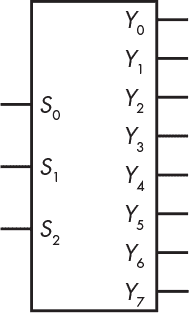

*图 2-44：3:8 译码器电路符号*

#### *构建解复用器*

你可以使用译码器构建一个*解复用器*，通常缩写为*dmux*，它允许将输入信号引导到多个输出之一，就像你在分配霍格沃茨学生到各个学院时所做的那样。解复用器将译码器与一些附加的门电路结合起来，如图 2-45 所示。

*图 2-45：一个 1:4 解复用器*

解复用器根据译码器输入*S*[0–1]将输入信号*D*定向到四个输出之一*Y*[0–3]。图 2-46 中的符号用于解复用器的电路图。

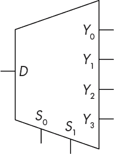

*图 2-46：解复用器电路符号*

#### *构建选择器*

从多个输入中选择一个输入是另一个常见的操作。例如，我们可能有多个加法器的操作数源，并需要选择其中一个。通过使用门电路，我们可以创建另一个功能模块，称为*选择器*或*多路复用器（mux）*。

一个选择器将译码器与一些附加的门电路结合起来，如图 2-47 所示。

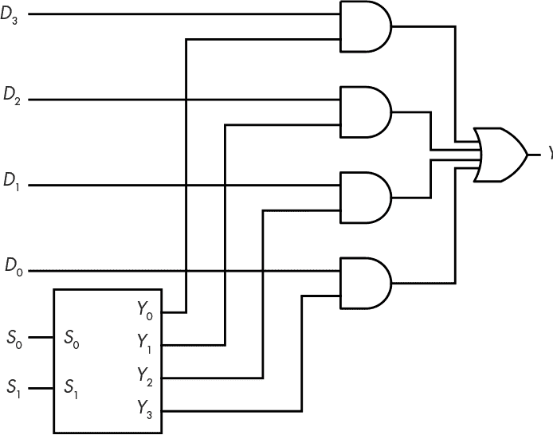

*图 2-47：一个 4:1 选择器*

选择器也使用得很频繁，并且有自己的电路符号。图 2-48 展示了一个 4:1 选择器的符号，这几乎是译码器符号的反转。

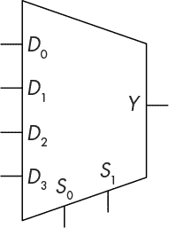

*图 2-48：4:1 选择器电路符号*

你可能对选择器很熟悉，但可能没有意识到。你可能有一台烤面包炉，它的旋钮上标有“关”、“烤面包”、“烘烤”和“烤焙”位置。这就是一个具有四个位置的*选择开关*。烤面包炉有两个加热元件，一个在顶部，一个在底部。烤面包炉的逻辑如表 2-2 所示。

**表 2-2：** 烤面包炉逻辑

| **设置** | **顶部元件** | **底部元件** |
| --- | --- | --- |
| 关 | 关 | 关 |
| 烘烤 | 关 | 开 |
| 烤面包 | 开 | 开 |
| 烤焙 | 开 | 关 |

我们可以使用一对 4:1 选择器组合来实现这个逻辑，如图 2-49 所示。

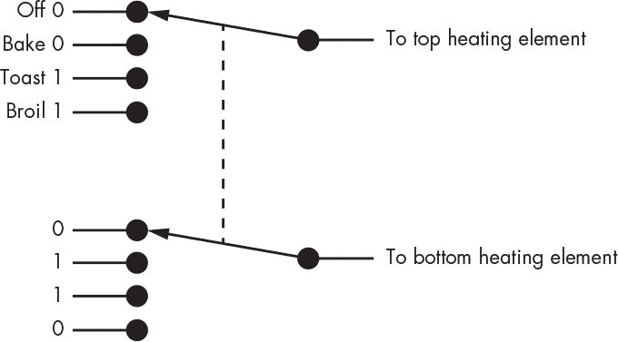

*图 2-49：烤面包炉选择开关*

### 总结

在本章中，你学习了为什么我们使用位而不是数字来构建硬件。你还了解了技术的某些发展，这些发展使我们能够实现位和组合逻辑电路。你学习了现代逻辑设计符号，以及如何将简单的逻辑元件组合成更复杂的设备。我们探讨了组合设备的输出如何是其输入的函数，但由于输出会根据输入的变化而变化，因此无法记住任何东西。记忆需要能够“冻结”输出，以使其在响应输入时不发生变化。第三章讨论了时序逻辑，这使我们能够随着时间的推移记住事情。
