## 第三章：**顺序逻辑**

你在上一章中学习的组合逻辑是“随流而动”。换句话说，输出会响应输入而变化。但我们不能仅仅用组合逻辑来构建计算机，因为它没有提供任何从流中移除某物并记住它的方法。例如，你无法加总从 1 到 100 的所有数字，除非你能够跟踪自己处于何处。

本章将介绍*顺序逻辑*。该术语来自于*序列*一词，意为“时间中一个接一个的事物”。作为人类，你对时间有直观的认识，就像你知道如何用手指计数一样，但这并不意味着时间对数字电路来说是自然的。我们必须以某种方式创造它。

组合逻辑仅处理输入的当前状态。然而，顺序逻辑既处理当前状态，也处理过去的状态。在本章中，你将学习用于生成时间和记忆的电路。我们将追溯一些自早期至今用于这些目的的各种技术。

### 表示时间

我们使用某种*周期性*函数来测量时间，比如地球的旋转。我们把一次完整的旋转叫做一天，并将其划分为小时、分钟和秒等更小的单位。我们可以将一秒定义为地球旋转的 1/86,400^(th)，因为一天有 86,400 秒。

除了使用地球旋转这样的外部事件，我们还可以通过应用物理学的某些元素来生成我们自己的周期性函数，例如摆钟摆动所需的时间。这种技术在古老的挂钟中产生了“滴答滴答”的声音。当然，要有用，摆钟必须根据秒的测量长度进行校准。

在计算机中，我们处理的是电子学，因此我们需要一个周期性的电信号。我们可以通过设置一个开关，让它被摆钟敲击，从而生成一个周期信号。但除非你是一个狂热的蒸汽朋克迷，否则你可能不希望计算机是由摆钟驱动的。我们将在下一节学习更现代的解决方法。

#### *振荡器*

让我们看一下用反相器能做的一个技巧：我们可以将输出连接到输入，如图 3-1 所示。

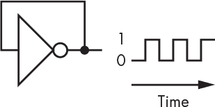

*图 3-1：一个振荡器*

这会产生*反馈*，就像麦克风太靠近扬声器时的情况一样。反相器的输出会在 0 和 1 之间来回*振荡*。它振荡的速度是传播延迟的函数（参见“传播延迟”在第 57 页的内容），而且通常会随着温度的变化而变化。拥有一个稳定频率的振荡器会非常有用，这样我们就能生成准确的时间参考。

一种经济高效的方法是使用晶体。没错，非常现代。像磁铁一样，晶体与电有关系。如果你将*电极*（导线）连接到晶体上并对其施加压力，它会产生电力。如果你给这些导线施加一些电流，晶体就会弯曲。这就是所谓的*压电效应*，它是由保罗-雅克（1855–1941）和皮埃尔（1859–1906）居里兄弟在 19 世纪末发现的。压电效应有各种各样的应用。晶体可以拾取声音振动，制造麦克风。通过施加电流到晶体产生的声音振动是许多家电发出烦人“嘀嘀声”的原因。在电路图中，你可以通过图 3-2 中显示的符号找到晶体。

*图 3-2：晶体的示意符号*

晶体振荡器交替地向晶体施加电流并接收回电，使用电子单极双掷开关。晶体完成这个过程的时间是可以预测的，而且非常精确。石英是最好的晶体材料之一。这就是为什么你会看到关于精确石英时钟的广告。记住，当你看到一款豪华手表的价格标签时，一块真正好的晶体零售价仅约为 25 美分。

#### *时钟*

振荡器为我们提供了测量时间的方法，正如你所见。计算机需要保持时间，这有显而易见的原因，例如能够以一致的速度播放视频。但还有一个更低级的原因，说明时间为什么很重要。在第二章中，我们讨论了传播延迟如何影响电路完成任务的时间。时间为我们提供了一种等待的方法，例如，在查看加法器结果之前，等待最坏情况下的延迟，以确保结果稳定且正确。

振荡器为计算机提供时钟。计算机的时钟就像行进乐队中的鼓手；它为电路定下节奏。最大时钟速度或最快节奏由传播延迟决定。

组件制造涉及大量的统计数据，因为不同零件之间有很大的差异。*分选*过程根据测量的特性将组件分到不同的桶或堆中。最快的零件，价格最高的，进入一个桶；较慢的、价格较低的零件进入另一个桶；依此类推。没有实际可行的方法可以有无限数量的桶，所以同一桶中的零件仍然会有差异，尽管比整个批次的差异要小。这也是为什么传播延迟通常被指定为一个范围的原因；制造商提供最小值、最大值以及典型值。一个常见的逻辑电路设计错误是使用典型值而不是最小值和最大值。当你听说有人*超频*他们的计算机时，意味着他们在赌博，假设他们的零件在其分选桶的中间位置，且他们的时钟可以在不导致零件失败的情况下增加一定量。

#### *触发器*

现在我们有了时间源，让我们尝试记住一个单一的位信息。我们可以通过反馈来实现这一点，例如将或门的输出反馈到输入，如图 3-3 所示。这并没有像图 3-1 中看到的那样创建一个振荡器，因为没有反向作用。假设在图 3-3 中的电路中，*out*一开始是 0。如果*in*变为 1，*out*也会变为 1，且由于它连接到另一个输入，它会保持这一状态，即使*in*回到 0。换句话说，它记住了。

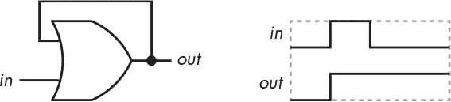

*图 3-3: 或门触发器*

当然，这个方案需要一些改进，因为无法将*out*再设为 0。我们需要一种通过断开反馈来重置它的方法，如图 3-4 所示。

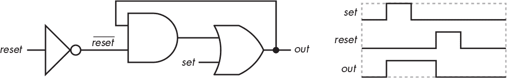

*图 3-4: 与或门触发器*

请注意，我们已将反相器的输出标记为*reset*。符号上加一条线是硬件术语，表示“相反”。这意味着当信号为 0 时它为真，信号为 1 时它为假。有时这被称为*低电平有效*，与*高电平有效*相对，意味着它在信号为 0 时才起作用，而不是在信号为 1 时。“条”字是指线，所以在口语中该信号会被称为“reset 条”。

当*reset*为低电平时，*reset*为高电平，因此来自或门的输出反馈到输入。当*reset*变为高电平时，*reset*变为低电平，断开反馈，使得*out*变为 0。

图 3-5 展示了一种*S-R 触发器*，这是一种稍微聪明一些的内存构建方式。*S-R*代表*设置-复位*。它具有低电平有效的输入和*互补*输出，意味着一个是低电平有效，另一个是高电平有效。你可以通过使用 NOR 门构建一个具有高电平有效输入的版本，但 NOR 门通常比 NAND 门消耗更多电力，而且比 NAND 门更复杂、制造成本更高。

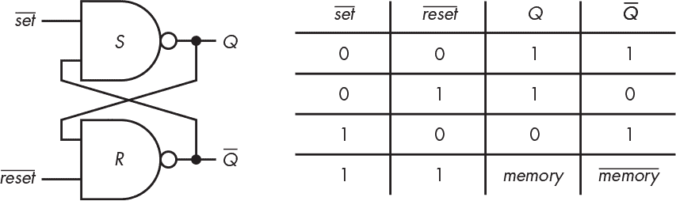

*图 3-5：S-R 锁存器*

当*set*和*reset*都处于活动状态时的情况很奇怪，并且不建议使用，因为两个输出都为真。此外，如果两个输入同时变为非活动状态（即，从 0 到 1 的过渡），输出的状态是不可预测的，因为它依赖于传播延迟。

图 3-5 中的电路具有图 3-4 所没有的一个优点，那就是它的设计是对称的。这意味着*set*和*reset*信号的传播延迟是相似的。

#### *带门控的锁存器*

现在我们已经有了一些记忆信息的方法，让我们来看看在某个时刻记住某些东西需要什么。图 3-6 中的电路在输入端增加了一对额外的门。

*图 3-6：带门控的 S-R 锁存器*

如你所见，当*门*输入处于非活动状态（高电平）时，*set*和*reset*的状态就不重要了；输出不会改变，因为 S 和 R 门的输入都会是 1。

因为我们想要记住一个位的信息，接下来的改进是在线*set*和*reset*输入之间添加一个反相器，这样我们只需要一个数据输入，我们将其缩写为*D*。这个修改在图 3-7 中展示了出来。

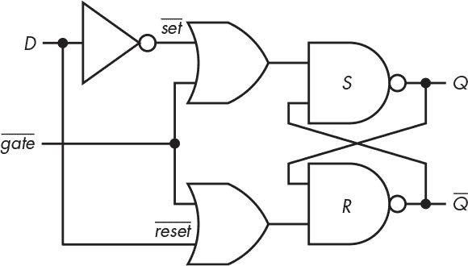

*图 3-7：带门控的* D *锁存器*

现在，如果*D*在*门*为低电平时是 1，*Q*输出将被设置为 1。同样，如果*D*在*门*为低电平时是 0，*Q*输出将被设置为 0。当*门*为高电平时，*D*上的变化不会产生任何影响。这意味着我们可以记住*D*的状态。你可以在图 3-8 所示的时序图中看到这一点。

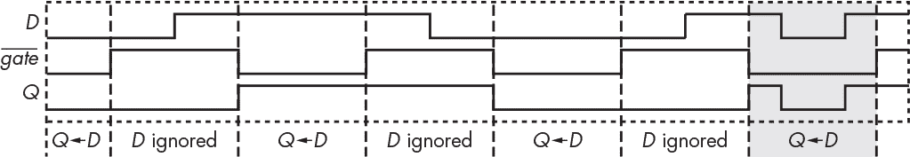

*图 3-8：带门控的* D *锁存器时序图*

这个电路的问题在于，当*门*为低电平时，*D*的变化会通过，正如你在阴影部分看到的那样。这意味着我们必须依赖于*D*在“门”是“打开”时不发生变化。如果我们能让开关变得瞬时，那就更好了。我们将在下一节看到如何做到这一点。

#### *触发器*

正如我们在上一节讨论的那样，我们希望尽量减少因数据变化而导致错误结果的可能性。通常的做法是利用逻辑电平之间的过渡来抓取数据，而不是在逻辑电平具有特定值时抓取数据。这些过渡被称为*边缘*。你可以把边缘看作是时间的决策标准。在图 3-8 中，你可以看到逻辑电平之间几乎是瞬时的过渡。边沿触发的锁存器被称为*触发器*。

锁存器是构建触发器的基础模块。我们可以通过巧妙地将三个 S-R 锁存器组合，构建一个叫做*D 触发器*的正沿触发触发器，如图 3-9 所示。*正沿触发*意味着触发器在逻辑 0 到逻辑 1 的过渡时操作；而*负沿触发*触发器则在逻辑 1 到逻辑 0 的过渡时操作。

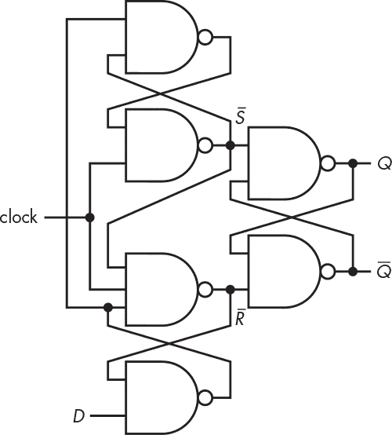

*图 3-9：一个* D *触发器设计*

这个电路可能有点令人费解。右边的两个门形成了一个 S-R 锁存器。我们从图 3-5 知道，除非*S*或*R*变为低电平，否则这些输出不会变化。

图 3-10 展示了电路在不同*D*和*时钟*值下的行为。细线表示逻辑 0；粗线表示逻辑 1。

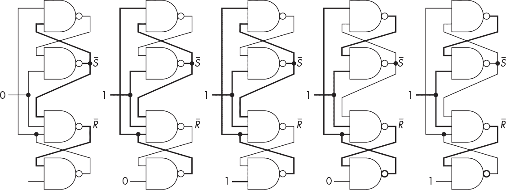

*图 3-10：一个* D *触发器操作*

从左边开始，你可以看到，当时钟为 0 时，*D*的值无关紧要，因为*S*和*R*都为高电平，因此图 3-9 右侧的锁存器状态不变。向右移动，你可以看到接下来的两个图示中，如果*R*为低电平，改变*D*的值没有效果。同样，最右边的两个图示显示，如果*S*为低电平，改变*D*的值也没有效果。结果是，当时钟为高电平或低电平时，对*D*的改变不会产生影响。

现在，让我们看看当时钟从低变高时发生了什么，如图 3-11 所示。

*图 3-11：一个* D *触发器正沿操作*

你可以看到左侧，当时钟为低电平且*D*为高电平时，*S*和*R*为高电平，因此没有变化。但当时钟变为 1 时，*S*变为低电平，触发器的状态发生变化。在右侧，你可以看到当*D*为低电平且时钟变高时，*R*变为低电平，触发器状态发生变化。你在图 3-10 中看到，其他的变化都不重要。

1918 年，英国物理学家 William Eccles 和 Frank Jordan 发明了第一个电子版的触发器，该触发器使用了真空管。图 3-12 展示了一个稍微不那么古老的*D 触发器*，称为 7474。

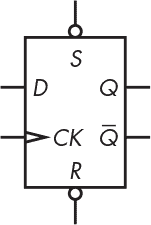

*图 3-12：一个 D 触发器*

D 触发器有互补的*Q*和*Q*（输出）以及*S*（置位）和*R*（复位）输入。它有点让人困惑，因为图中显示了*S*和*R*；它们与○的组合使它们成为*S*和*R*。因此，除了左侧的神秘部分外，它与我们的 S-R 锁存器完全相同。那两个神秘部分是两个额外的输入，*D*用于数据，*CK*用于时钟，由三角形表示。它是正沿触发的，因此每当*CK*信号从 0 变为 1 时，*D*输入的值就会被存储。

边沿触发设备除了传播延迟之外还有其他时序考虑因素。还有*建立时间*，即在时钟边沿之前，信号必须保持稳定的时间；以及*保持时间*，即在时钟边沿之后，信号必须保持稳定的时间。这些在图 3-13 中有所展示。

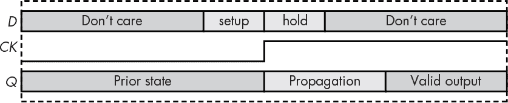

*图 3-13：建立时间和保持时间*

如你所见，我们不必关心除时钟边沿周围的建立和保持时间外，*D*输入上发生了什么。而且，像所有其他逻辑一样，输出在传播延迟时间后是稳定的，并且保持稳定，不受*D*输入的影响。建立时间和保持时间通常用 t[setup]和 t[hold]表示。

触发器的边沿行为与时钟配合得很好。我们将在下一节中看到一个示例。

#### *计数器*

计数是触发器的一个常见应用。例如，我们可以从振荡器计数时间，并通过解码器驱动显示器来制作一个数字时钟。图 3-14 展示了一个电路，它产生一个 3 位数字（C[2]，C[1]，C[0]），该数字表示*信号*从 0 到 1 变化的次数。*复位*信号可用于将计数器设置为 0。

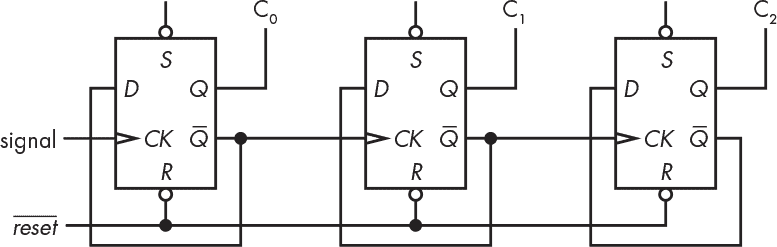

*图 3-14：一个 3 位的波纹计数器*

这个计数器被称为*波纹计数器*，因为结果是从左到右传播的，而不是因为它对计算便宜葡萄酒瓶子的数量有用。C[0]改变 C[1]，C[1]改变 C[2]，如果有更多位的话就如此类推。由于每个触发器的*D*输入连接到其*Q*输出，它将在每个*CK*信号的正向跃变时改变状态。

这也被称为*异步*计数器，因为一切事情都是在它有空时发生的。异步系统的问题是很难知道何时查看结果。在波纹传递期间，输出（C[2]，C[1]，C[0]）是无效的。你可以在图 3-15 中看到，随着每个位的连续推进，得到结果的时间变得更长，其中灰色区域代表由于传播延迟导致的未定义值。

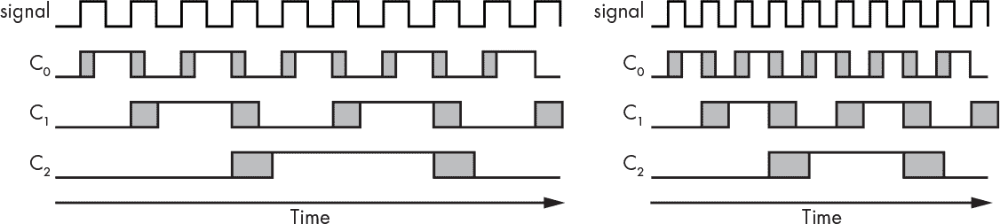

*图 3-15：波纹计数器时序*

左侧的*时序图*显示，我们在传播延迟稳定后获得一个有效的 3 位数字。但是在右侧，你可以看到我们试图以超过传播延迟允许的速度进行计数，因此有时没有产生有效的数字。

这是我们在图 2-41 中看到的波纹进位加法器问题的变种。正如我们通过进位预见设计解决了那个问题一样，我们也可以通过*同步*计数器设计来解决波纹问题。

与波纹计数器不同，同步计数器的所有输出同时变化（同步）。这意味着所有触发器是并行时钟的。在图 3-16 中展示了一个 3 位同步计数器。

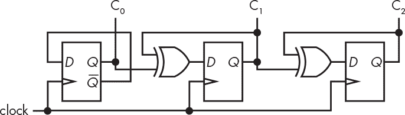

*图 3-16：一个 3 位同步计数器*

你可以看到计数器中的所有触发器同时改变状态，因为它们在同一时刻都被时钟驱动。尽管传播延迟仍然是决定输出何时有效的一个因素，但级联效应已经被消除。

计数器是另一种功能性构建模块，这意味着它们有自己的电路符号。在这种情况下，它还是另一个矩形框，如你在图 3-17 中看到的那样。

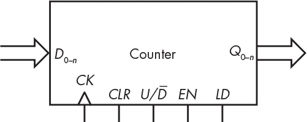

*图 3-17：计数器的电路符号*

该图包括一些我们之前没有见过的输入。市场上有带有这些输入的计数器。大多数计数器都有一个*CLR*输入，用来清除计数器，将其设置为 0。另一个常见的输入是*EN*，它使能计数器——计数器只有在启用时才会计数。某些计数器可以向上或向下计数；*U/**D*输入选择向上或向下计数。最后，一些计数器有数据输入*D*[0–n]和一个加载信号*LD*，允许将计数器设置为特定值。

现在我们有了计数器，可以用它们来跟踪时间。但这并不是我们可以用触发器做的唯一事情。我们将在下一节开始学习如何记住大量的信息。

#### *寄存器*

D 触发器适用于记忆数据。它是一个常见的应用，你可以得到*寄存器*，它们是将多个 D 触发器集成在一个封装中的部件，共享一个时钟。图 3-18 展示了一个寄存器的例子，它保存了使用前面讨论的加法器电路的加法结果。

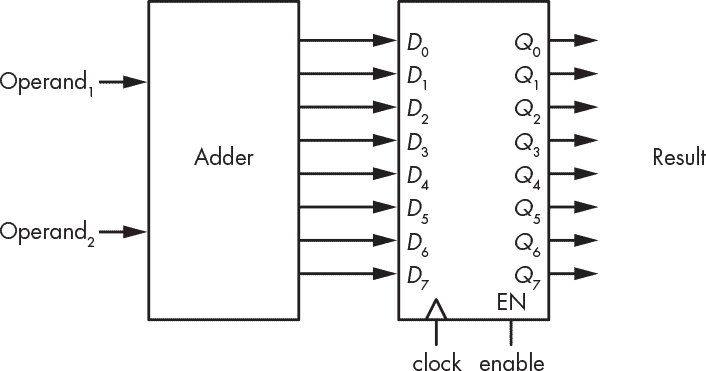

*图 3-18：一个保存加法器结果的寄存器*

一旦加法器的输出被时钟信号输入到寄存器中，操作数就可以发生变化而不改变结果。注意，寄存器通常具有类似于我们在计数器中看到的*使能*输入。

### 内存组织和寻址

我们已经看到，当我们需要记住一个比特时，触发器很有用；当我们需要记住一组比特时，寄存器很方便。那么当我们需要记住更多信息时该怎么办呢？例如，如果我们希望能够存储多个不同的加法结果呢？

好的，我们可以从一堆寄存器开始。但是现在我们面临一个新问题：如何指定我们想要使用的寄存器。这个情况看起来像是图 3-19。

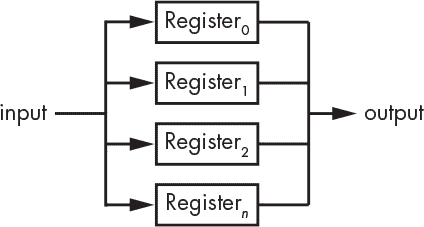

*图 3-19：多个寄存器*

解决这个问题的一种方法是为每个寄存器分配一个编号，如图所示。我们可以使用这个编号或*地址*通过我们标准的构建模块之一——来自“构建解码器”的解码器来指定寄存器，解码器的输出连接到寄存器的使能输入端。

接下来，我们需要能够选择来自目标寄存器的输出。幸运的是，我们在第 65 页的“构建选择器”中学习了如何构建选择器，它们正是我们需要的。

系统通常有多个内存组件需要连接在一起。是时候用我们的标准构建模块之一：*三态*输出了。

将所有内容整合起来，一个内存组件看起来像图 3-20。

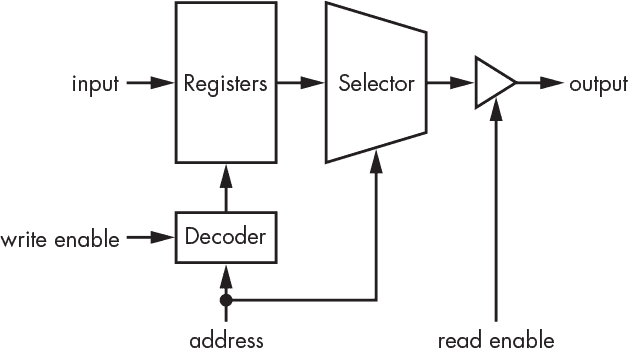

*图 3-20：内存组件*

内存组件有很多电气连接。如果我们要处理 32 位数字，我们需要为输入和输出各自提供 32 个连接，同时还需要地址、控制信号和电源的连接。程序员不需要担心如何将电路适配到封装中或如何布线，但硬件设计师需要考虑这些问题。我们可以通过意识到内存很少需要同时进行读取和写入来减少连接数量。我们可以使用一组数据连接，再加上*读/* *写*控制来满足需求。图 3-21 显示了一个简化版内存芯片的原理图。*使能*控制用来开启和关闭整个系统，以便可以将多个内存芯片连接在一起。

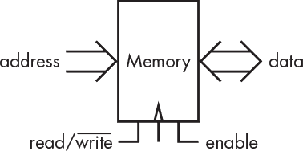

*图 3-21：简化的内存芯片*

你会注意到，图中使用了粗大的箭头来表示地址和数据，而不是显示单个信号。我们将相关信号组称为*总线*，因此内存芯片有一个*地址总线*和一个*数据总线*。没错，这就像是位的公共交通系统。

内存芯片封装中的下一个挑战是，当内存大小增加，需要连接大量地址位时。参考第一章中的表 1-2，我们需要 32 个地址连接来连接一个 4-GiB 的内存组件。

内存设计师和道路规划者处理着类似的交通管理问题。许多城市按网格组织，这也是内存芯片内部布局的方式。在图 2-3 中显示的 CPU 显微照片中，你可以看到几个矩形区域，这些区域是内存的一部分。地址被划分为两部分：*行*地址和*列*地址。内存位置通过行和列的交点来寻址，如图 3-22 所示。

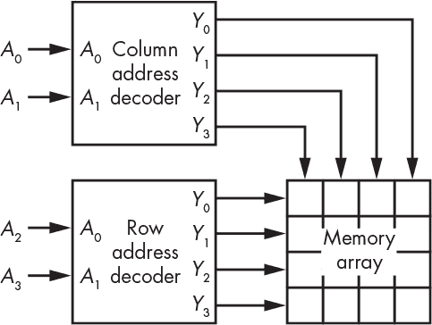

*图 3-22：行和列寻址*

显然，我们不需要担心图中显示的 16 个内存位置的地址线数量。但如果有更多内存位置呢？我们可以通过*复用*行和列地址来减少地址线数量。我们所需要的只是内存芯片上的寄存器来保存这些地址，如图 3-23 所示。

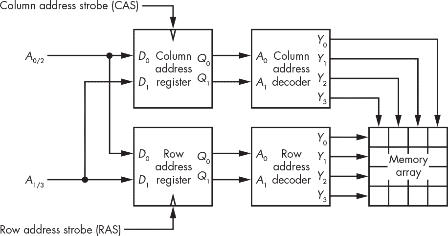

*图 3-23：带地址寄存器的内存*

由于地址分为两部分，因此如果我们只需要改变其中一部分（例如先设置行地址，再变化列地址），性能会更好。这正是今天大型内存芯片的实现方式。

内存芯片的大小通常以深度 × 宽度的格式来描述。例如，256 × 8 的芯片将有 256 个 8 位宽的内存位置；64 Mib × 1 的芯片将包含 64 兆比特。

#### *随机存取存储器*

到目前为止，我们讨论的内存称为 *随机存取存储器*（*RAM*）。使用 RAM 时，任何内存位置的整个宽度都可以按任意顺序进行读写。

*静态随机存储器*（*SRAM*）虽然昂贵，但速度非常快。每个比特需要六个晶体管。由于晶体管占用空间，SRAM 并不是存储数十亿或数万亿比特的最佳选择。

*动态存储器（DRAM）*是一种巧妙的技术。电子被存储在叫做 *电容器* 的微小桶中，仅用一个晶体管作为桶盖。问题在于，这些桶会漏水，因此必须定期 *刷新* 内存，即定期填充桶中的电子。你必须小心刷新操作不要发生在访问内存的关键时刻；这是最早的基于 DRAM 的计算机之一——DEC LSI-11 的问题之一。DRAM 的一个有趣副作用是，当光照射到这些桶时，它们的漏电现象会加剧，这使得它们可以用作数字相机。

由于 DRAM 具有高密度（单位面积内的比特数），它被用于大型内存芯片。大型内存芯片意味着有大量地址，因此 DRAM 芯片使用前一部分讨论的复用地址方案。由于其他内部设计因素，最优的方式是通过行地址选通来保存行地址，然后通过列地址选通来变化列地址。这个术语被过度使用，但行有时被称为 *页面*。这就像读一本书；扫描一页要比翻页容易得多。或者，正如伟大的性能先驱吉米·杜兰特所说的那样，最佳性能就是 a-ras-a-ma-cas。这在编程中是一个非常重要的考虑因素：将经常一起使用的内容放在同一行，可以显著提高性能。

SRAM 和 DRAM 都是*易失性*内存，这意味着当电源中断时，数据可能会丢失。*核心*内存是一种过时的*非易失性* RAM 类型，它将位存储在*环形*（甜甜圈形状的）铁块中，您可以在图 3-24 中看到它们。环形磁体的一个方向表示 0，另一个方向表示 1。环形磁体的物理特性非常酷，因为它们对外界电磁干扰非常抗干扰。在这种内存类型中，磁芯被排列在一个网格中，称为*平面*，通过它们有行和列的电线。还有一根第三根线，叫做*感应*线，因为读取位的状态的唯一方法是尝试改变它，然后感应发生了什么。当然，如果你感应到它发生了变化，你必须将它恢复，否则数据将丢失，导致该位变得无用。这需要大量的电路，此外还需要大量的缝合。核心内存实际上是三维内存，因为平面被组装成砖块。

虽然核心内存是过时的技术，但它的非易失性特性仍然受到重视，且研究仍在继续，开发出结合核心内存和 RAM 优点的商业化*磁阻*内存。

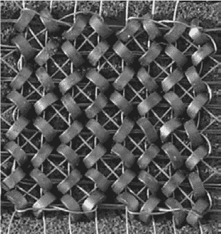

*图 3-24：核心内存*

#### *只读存储器*

*只读存储器*（*ROM*）这个名称并不十分准确。只有可以读取而不能写入的内存并没有什么用。尽管这个名字沿用至今，但更准确的说法是，ROM 是一次写入型内存。ROM 可以被写入一次，然后多次读取。ROM 对于需要内建程序的设备非常重要，例如微波炉；你可不想每次需要爆米花时都重新编程你的微波炉。

早期的只读存储器（ROM）形式之一是霍勒里斯卡片，后来被称为*IBM 卡片*，如图 3-25 所示。位被打孔到纸片上。真的！它们相当便宜，因为美国发明家赫尔曼·霍勒里斯（1860–1929）非常注重节省成本。霍勒里斯在 19 世纪末发明了这种卡片，尽管更准确地说，他是从 1801 年由约瑟夫·玛丽·雅卡尔发明的雅卡尔织布机中借用了这一概念。雅卡尔织布机使用打孔卡片来控制织布模式。当然，雅卡尔借鉴了巴希尔·布雄（Basile Bouchon）的创意，他在 1725 年发明了一种用打孔纸带控制的织布机。有时候，很难区分发明和借用，因为未来是建立在过去的基础上的。当你听到有人为更长时间和更严格的专利及版权法辩论时，记住这一点；如果我们不能在过去的基础上进行创新，进步将会放缓。

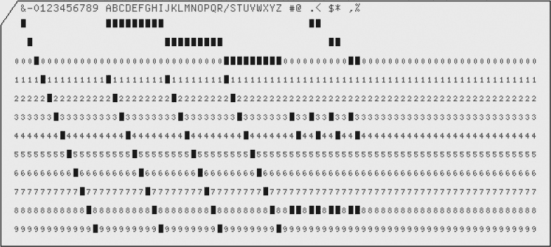

*图 3-25：IBM 卡片*

早期的 IBM 卡片读取器通过开关来读取数据位。卡片会被滑入一排弹簧状的金属丝下，这些金属丝穿过孔洞并与另一侧的金属片接触。后来版本的工作原理是通过将光线照射到孔洞上，照射到另一侧的*光电探测器*上，这种方式要快得多。

*打孔纸带*是相关的 ROM 技术；打孔的纸带卷被用来表示比特（见图 3-26）。与卡片相比，纸带有一个优势，那就是掉落卡片堆会使数据混乱。但另一方面，纸带可能会撕裂并且难以修复；许多用胶带修复的工作导致了阻塞。

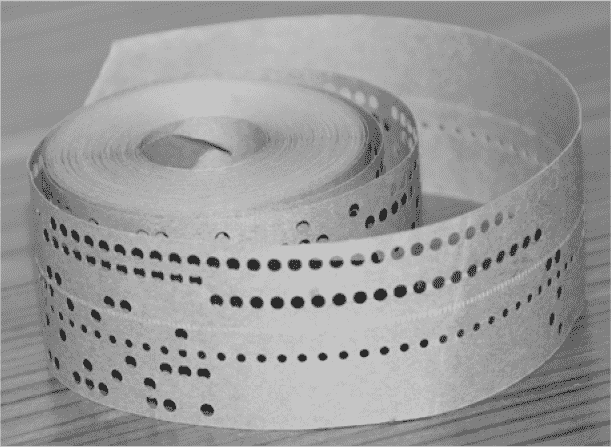

*图 3-26：打孔纸带*

卡片和纸带非常慢，因为它们必须物理移动才能被读取。

一种名为*核心绳记忆*的 ROM 变体被应用于阿波罗飞行计算机（见图 3-27）。由于它只能通过缝制来写入，它对干扰具有很强的抵抗力——这在太空的恶劣环境中至关重要。

*图 3-27：阿波罗导航计算机的核心绳记忆*

IBM 卡片和纸带是*顺序*存储；也就是说，数据是按顺序读取的。卡片读取器不能向后读取，因此它们实际上只适用于长期存储数据。内容必须读取到某种类型的 RAM 中才能使用。1971 年，Intel 4004 发布了第一个商业化的单芯片微处理器，这推动了对更好的程序存储技术的需求。这些第一代微处理器用于像计算器这样的设备，这些设备运行固定程序。随之而来的是*掩模可编程*ROM。*掩模*是集成电路制造过程中的一种模板。你会编写程序并将比特模式发送给半导体制造商，并附上一个非常大的支票。他们将其转化为掩模，你会收到一个包含你程序的芯片。它是只读的，因为没有办法在不支付另一笔大额费用并制作不同的掩模的情况下更改它。掩模可编程 ROM 可以以随机访问的方式进行读取。

面罩如此昂贵，只有在大规模应用中才能得到合理的使用。随后出现了*可编程只读存储器（PROM）*，这是一种你自己可以编程，但只能编程一次的 ROM 芯片。PROM 的最初工作原理是通过熔化镍铬合金（镍铬合金）熔丝来实现的。镍铬合金就是让你烤面包机中的加热丝发光的物质。

在开发程序时，人们会快速使用大量的 PROM 芯片。工程师不喜欢麻烦，因此接下来就出现了*可擦写可编程只读存储器（EPROM）*。这些芯片与 PROM 类似，不同之处在于它们顶部有一个石英窗口，可以通过将其放置在特殊的紫外线灯下进行擦除。

引入*电可擦编程只读存储器*（真是个大口头禅！），或*EEPROM*，使生活变得更好了。这是一种可以电擦除的 EPROM 芯片——不需要光，不需要石英窗。然而，擦除 EEPROM 相对较慢，所以你不希望频繁进行。EEPROM 技术上是 RAM，因为可以按任意顺序读取和写入内容。但由于写入速度慢且比 RAM 更昂贵，它们通常作为 ROM 的替代品使用。

### 块设备

与内存进行通信是需要时间的。想象一下，每次需要一杯面粉时，你都必须去商店。一次去商店买一大袋面粉要比每次都去方便得多。较大的内存设备使用了这个原理。就像是为位进行批量购物。

*磁盘驱动器*，也称为*大容量存储*，非常适合存储大量数据。在本书编写时，一个 8TB 的硬盘价格不到 200 美元。它们通常被称为*大容量存储*。一些宗教机构在仪式之间使用大容量存储。磁盘驱动器将位存储在旋转的磁性盘片上，类似于转盘。位周期性地经过你的位置，你用手将它们摘下或放上。在磁盘驱动器中，你的手被*磁头*所取代。

与其他类型的内存相比，磁盘驱动器相对较慢。如果你想要获取刚刚经过磁头的内容，你必须等到它再次经过，几乎要等整整一圈的时间。现代磁盘以每分钟 7200 转的速度旋转，这意味着每转一圈大约需要 8 毫秒的时间。磁盘驱动器的一个大问题是它们是机械设备，会磨损。轴承磨损是磁盘故障的主要原因之一。商业设备与消费者级设备的区别主要在于轴承中的润滑油量——制造商能够为一种成本不到一美分的东西收取数百美元的费用。磁盘驱动器通过磁化盘片上的区域来存储数据，这使得它们像核心内存一样具有非易失性。

磁盘驱动器在速度和密度之间存在权衡。它们之所以慢，是因为需要时间让你想要显示的位出现在磁头下，但由于数据被带到磁头，不像例如 DRAM 那样需要地址和数据连接的空间。图 3-28 展示了磁盘驱动器内部的结构。它们被制造在密封的容器中，因为灰尘和污垢会导致它们失效。

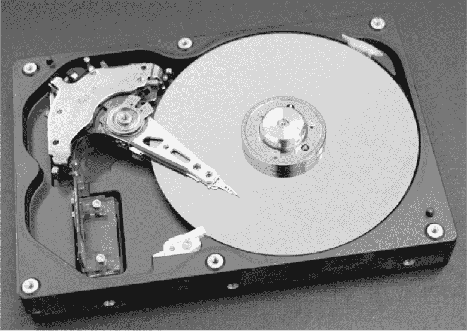

*图 3-28：磁盘驱动器*

磁盘是基于块寻址而非字节寻址的。*块*（历史上称为*扇区*）是可以访问的最小单位。磁盘历史上通常使用 512 字节的扇区，尽管新设备使用 4,096 字节的扇区。这意味着为了改变磁盘上的一个字节，你必须先读取整个块，修改字节，然后再将整个块写回。磁盘包含一个或多个*盘片*，它们的布局如图 3-29 所示。

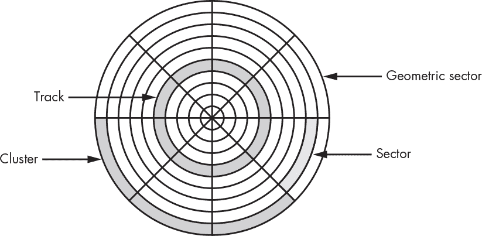

*图 3-29：磁盘布局*

由于所有扇区包含相同数量的比特，因此*比特密度*（bits/mm²）在每个盘片的中心比在外缘更高。这是浪费，因为显然外部轨道还有更多空间可以装载比特。新型磁盘通过将磁盘分为一组*径向区*来解决这个问题，实际上在外部区域比内部分区有更多的扇区。

有几个数字描述了磁盘驱动器的性能。现代磁盘在执行器臂上安装有磁头，该磁头会在磁盘上径向移动；磁头的位置将磁盘划分为不同的轨道。*寻道时间*是指将磁头从一个轨道移动到另一个轨道所需要的时间。当然，如果每个轨道有一个磁头，那么就不需要寻道了，这样会更快；你在早期的磁盘驱动器上可以得到这种设计，但现代磁盘的轨道太密集，无法实现这种做法。除了寻道时间外，还有一个时间是磁盘上你感兴趣的部分旋转至磁头下方的时间，称为*旋转延迟*，如上所述，这通常在毫秒范围内。

磁盘驱动器通常被称为*硬盘*。最初，所有的磁盘驱动器都是硬盘。这个区分出现是在便宜的可移动存储设备——*软盘*——问世之后。软盘是可以弯曲的，因此把另一种类型的磁盘称为“硬盘”，这样它们更容易区分。

一种过时的磁盘存储形式是*磁鼓*存储，顾名思义：它是一个旋转的磁鼓，上面有一条条的磁头。

*磁带*是另一种使用磁化带卷的非易失性存储技术。它比磁盘驱动器慢得多，并且将磁带缠绕到请求位置可能需要很长时间。早期的苹果计算机使用消费级音频磁带作为磁带存储。

*光盘*类似于磁盘，只不过它们使用光而不是磁力。你知道的这些就是 CD 和 DVD。光盘的一大优点是它们可以通过印刷大规模生产。预印的光盘是 ROM。也有一次性可写的 PROM 等效版本（CD-R，DVD-R），还有可擦写和重写的版本（CD-RW）。图 3-30 显示了光盘部分区域的特写。

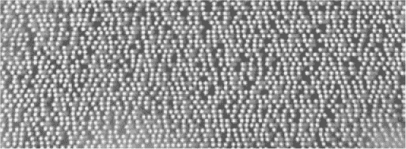

*图 3-30：光盘数据*

### 闪存和固态硬盘

*闪存*是最新形式的 EEPROM。它是一些应用场景中的好选择，比如音乐播放器和数码相机。它通过像 DRAM 一样将电子存储在桶中来工作。在这种情况下，这些桶更大且更结实，因此不会泄漏。但如果这些桶的盖子被反复打开和关闭，最终会磨损。闪存比 EEPROM 擦除速度更快，且生产成本更低。它像 RAM 一样用于读取，也可以写入一个填充 0 的空设备。但尽管 0 可以变为 1，1 却无法恢复为 0，除非先擦除。闪存内部分为多个块，只有块能被擦除，不能擦除单个位置。闪存设备是随机访问的用于读取，但对于写入则是块访问的。

磁盘驱动器正逐渐被*固态硬盘*所取代，固态硬盘实际上只是将闪存包装成类似磁盘驱动器的形式。目前它们每比特的价格远高于旋转磁盘，但这一点预计会发生变化。由于闪存会磨损，固态硬盘包含一个处理器，用来跟踪不同块的使用情况，并试图均衡各块的磨损速度，确保所有块的磨损速度相同。

### 错误检测与纠正

你永远不知道什么时候一个流浪的宇宙射线会击中一块内存并破坏数据。知道发生这种情况的时候会很好，甚至能够修复损坏会更好。当然，这些改进需要花费金钱，因此通常不会出现在消费级设备中。

我们希望能够在不存储完整副本数据的情况下检测错误。这样做本来也不行，因为我们无法知道哪个副本是正确的。我们可以存储两个额外的副本，并假设匹配的那一对（如果有的话）是正确的。专为恶劣环境设计的计算机通常会这样做。它们还使用一种更昂贵的电路设计，这种设计在遇到质子冲击时不会烧毁。例如，航天飞机就有冗余计算机和投票系统，以防检测到错误。

我们可以通过一种叫做*奇偶校验*的方法来检测 1 位错误。其原理是将所有为 1 的比特加起来，并使用一个额外的比特来存储这个和是奇数还是偶数。我们可以通过对比特进行异或运算来实现这一点。奇偶校验有两种形式：在*偶校验*中，使用比特和本身，而在*奇校验*中，使用比特和的补码。这个选择可能看起来有些奇怪，但这个命名法来源于包括奇偶校验比特在内的 1 或 0 的数量。

图 3-31 的左半部分显示了偶校验的计算；这里有四个 1，因此校验位是 0。右半部分显示了校验的过程；输出 0 表示数据是好的，或者至少根据奇偶校验可以判断数据是好的。奇偶校验的一个大问题是，它是一个两个错误看起来像一个正确的地方；它只能捕捉到奇数个错误。

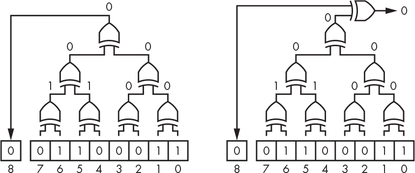

*图 3-31：偶校验生成与检查*

有更复杂的方法，比如汉明码，它是由美国数学家理查德·汉明（1915–1998）发明的，采用更多的比特，并能检测到更多的错误，甚至能够纠正一些错误。*错误检测与纠正（ECC）*内存芯片包含了这一电路。它们通常用于大型数据中心，而非消费类设备。

像奇偶校验这种方法适用于不断变化的数据。对于静态块数据（如计算机程序），有一些更便宜的方法可以进行验证。最简单的就是*校验和*，其中每个数据位置的内容都被加和成某个*n*比特值，溢出的比特会被丢弃。校验和可以与程序进行比较，通常是在程序运行之前。校验和值越大（即*n*越大），误报的概率就越低。

*循环冗余检验*，或称*CRC*，是校验和的数学上更好的替代方法。哈希码是另一种方法。目标是计算一个唯一的验证数值，使得对于大多数变化，校验将不再正确。

### 硬件与软件

用于制造 PROM、EEPROM 和闪存的技术不仅仅限于内存。我们很快就会看到计算机硬件是如何由逻辑电路构成的。而既然你正在学习编程，你也知道程序中包含逻辑，而你可能知道计算机通过指令集将逻辑暴露给程序。那么，在硬件和软件之间做逻辑的区别是什么呢？这是一个模糊的界限。在很大程度上，二者几乎没有区别，除了硬件构建需要额外的成本，而软件只需要设计时间。

你可能听过*固件*这个术语，最初它只是指存在于 ROM 中的软件。但现在大多数固件存储在闪存甚至 RAM 中，所以它们之间的区别微乎其微。实际上，情况比这更复杂。曾几何时，芯片是由极客设计的，他们通过将彩色遮光胶带粘在透明 Mylar 大张纸上来布局电路。1979 年，美国科学家和工程师卡弗·米德（Carver Mead）和林恩·康威（Lynn Conway）发布了《VLSI 系统导论》，这本书帮助启动了电子设计自动化（EDA）行业。芯片设计变成了软件。今天，芯片是使用专门的编程语言（如 Verilog、VHDL 和 SystemC）进行设计的。

大多数时候，计算机程序员只是被提供了一块硬件来使用。但你可能有机会参与设计一个包括硬件和软件的系统。硬件与软件之间接口的设计至关重要。有无数的例子表明，有些芯片带有不可用、不可编程和不必要的功能。

集成电路制造成本高。在早期，所有芯片都是*全定制*设计。芯片是分层构建的，实际组件位于底部，上面是金属层，用来连接它们。*门阵列*曾试图为某些应用降低成本；提供了一组预设计的组件，仅有金属层是定制的。就像内存一样，这些被可以自行编程的 PROM 等效版本所取代。而且还有一种可以擦除并重新编程的 EPROM 等效版本。

现代的*现场可编程门阵列（FPGA）*是闪存的等效物；它们可以通过软件重新编程。在许多情况下，使用 FPGA 比使用其他组件更便宜。FPGA 具有非常丰富的功能；例如，你可以获得一个包含多个 ARM 处理器核心的大型 FPGA。英特尔最近收购了 Altera，并可能会在其处理器芯片中包含 FPGA。你很有可能会参与一个包含这些设备的项目，所以要准备好将你的软件转化为硬件。

### 摘要

在本章中，你了解了计算机如何获取时间感知。你被介绍到顺序逻辑，它与来自第二章的组合逻辑一起，为我们提供了所有基本的硬件构建块。你还学到了一些关于内存如何构建的知识。我们将在第四章中将这些知识结合起来，构建一台计算机。
