## 第四章：**计算机解剖学**

你在第一章中了解了比特的属性以及如何使用它们来表示事物。在第二章和第三章中，你了解了为什么使用比特以及它们如何在硬件中实现。你还学习了许多基本的构建块，以及如何将它们组合成更复杂的配置。在本章中，你将学习如何将这些构建块组合成一个能够操作比特的电路。这个电路就是*计算机*。

构建计算机有很多种方式。我们在本章中将要构建的计算机是为了便于讲解而选择的，并不是因为它是最好的设计。尽管简单的计算机可以工作，但要使它们工作得*好*，需要加入许多额外的复杂性。本章专注于简单的计算机；接下来的两章将介绍一些额外的复杂性。

现代计算机有三个主要组成部分。这些是*内存*、*输入输出（I/O）*和*中央处理单元（CPU）*。本节将介绍这些部分如何相互关联。第三章介绍了内存，第五章将更详细地讨论计算机和内存。I/O 是第六章的主题。CPU 则位于本章所称的“城市中心”。

### 内存

计算机需要一个地方来存储它们正在操作的比特。这地方就是内存，正如你在第三章中所学的。现在是时候了解计算机如何使用内存了。

内存就像是一条长长的街道，街道上有许多房子。每栋房子的大小完全相同，都有足够的空间来存放一定数量的比特。建筑规范大多已经确定每栋房子存储 1 字节。就像现实中的街道一样，每栋房子都有一个*地址*，也就是一个数字。如果你的计算机有 64 MiB 的内存，那么就是 64 × 1,024 × 1,024 = 67,108,864 字节（或 536,870,912 比特）。这些字节的地址从 0 到 67,108,863。这个编号方式是合理的，不像许多现实街道的编号那样混乱。

通常我们会提到*位置*，即某个特定地址的内存，比如“3 Memory Lane”（参见图 4-1）。

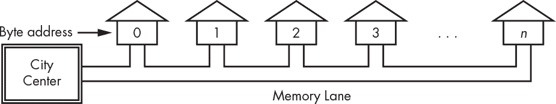

*图 4-1: Memory Lane*

仅仅因为内存的基本单位是字节，并不意味着我们总是以这种方式来看待它。例如，32 位计算机通常以 4 字节为一个单元来组织内存，而 64 位计算机通常以 8 字节为一个单元来组织内存。为什么这很重要？这就像有四车道或八车道的高速公路，而不是单车道的道路。更多的车道能处理更多的交通，因为更多的比特可以进入数据总线。当我们寻址内存时，我们需要知道自己在寻址什么。寻址长字与寻址字节不同，因为在 32 位计算机中，1 个长字包含 4 个字节，而在 64 位计算机中，1 个长字包含 8 个字节。例如，在图 4-2 中，长字地址 1 包含字节地址 4、5、6 和 7。

另一种看法是，在 32 位计算机中，街道上包含的是四连体住宅，而不是单独的房子，每个四连体住宅包含两个双拼住宅。这意味着我们可以单独寻址一个单元、一个双拼住宅或整个建筑。

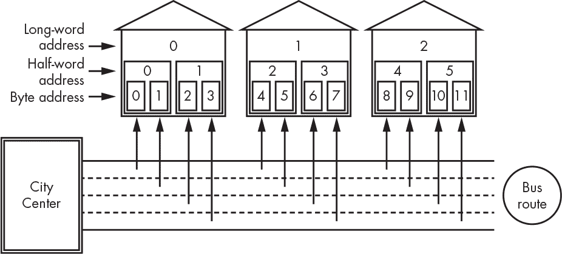

*图 4-2：内存高速公路*

你可能已经注意到，每栋建筑都跨越了高速公路，每个字节都有自己分配的车道，而一个长字占据了整条路。比特通过一辆有四个座位的巴士往返于市中心，每个字节一个座位。门口的设置是每条车道都有一个座位。在大多数现代计算机中，巴士在从市中心出发时每次只停靠一个建筑物。这意味着我们不能像从字节 5、6、7 和 8 形成一个长字那样操作，因为那样巴士必须进行两次旅行：一次去建筑 0，一次去建筑 1。较早的计算机有一个复杂的装载码头，允许这样做，但规划者注意到这并不那么有用，因此在新型号中将其从预算中削减掉了。试图同时进入两个建筑物，如图 4-3 所示，被称为*非对齐访问*。

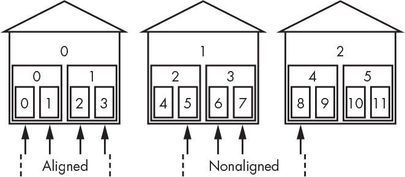

*图 4-3：对齐与非对齐访问*

我们看到，在上一章中有很多不同种类的内存。每种内存都有不同的*性价比*。例如，SRAM 速度快且昂贵，就像政治家居住附近的高速公路。磁盘便宜且速度慢——内存中的土路。

谁能坐在哪个座位上乘坐巴士通勤？当一个长字进入城市时，字节 0 还是字节 3 能坐在最左边的座位上？这取决于你使用的处理器，因为设计师有两种方式来设计它们。两者都能工作，所以这基本上是一个神学辩论。事实上，*字节序*一词——源于乔纳森·斯威夫特的《格列佛游记》中关于如何正确打开软煮蛋的皇家法令——用来描述这一差异。

在小端机器中，如英特尔处理器，字节 0 放入最右侧的座位。在大端机器中，如摩托罗拉处理器，字节 0 放入最左侧的座位。图 4-4 比较了这两种存储方式。

*图 4-4：大端和小端存储方式*

在从一个设备向另一个设备传输信息时，字节序是需要注意的，因为你不希望无意中打乱数据。一个著名的例子发生在 UNIX 操作系统从 PDP-11 移植到 IBM Series/1 计算机时。一个原本应该打印“Unix”的程序，却打印出了“nUxi”，因为 16 位字中的字节顺序被交换了。这个问题非常幽默，以至于“nuxi 综合症”这个术语被创造出来，用来指代字节顺序问题。

### 输入和输出

一台无法与外界通信的计算机是没什么用的。我们需要某种方式将信息输入和输出到计算机中。这被称为 *I/O*（输入/输出）。与 I/O 连接的设备被称为 *I/O 设备*。由于它们位于计算机的外围，它们也常被称为 *外围设备* 或简称 *外设*。

计算机过去有一个独立的 I/O 通道，如图 4-5 所示，类似于内存通道。当计算机体积庞大时，这种设计是合理的，因为那时计算机并不像现在这样被压缩进有限连接数的小型包装中。此外，内存通道的长度不长，因此没必要仅为了支持 I/O 限制地址的数量。

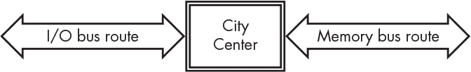

*图 4-5：独立的内存和 I/O 总线*

现在 32 位和 64 位计算机已经普及，内存通道（Memory Lane）变得更长了。它如此之长，以至于每个地址并没有对应一座“房子”；许多空地可供使用。换句话说，有些地址没有与之关联的内存。因此，现在更合理的做法是将 Memory Lane 的一部分留给 I/O 设备。这就像城镇边缘的工业区。此外，随着更多电路被压缩到一个有限连接数的封装中，I/O 和内存放在同一个总线中显得更为合理。

许多计算机设计了标准的输入/输出 *插槽*，以便 I/O 设备可以以统一的方式连接。这就像旧西部的财产分配一样；未并入的领土被划分为一系列土地赠予，如图 4-6 所示。每个插槽的拥有者可以使用直到其边界的所有地址。通常，每个插槽中都有一个特定的地址，里面包含某种标识符，这样 City Center 就能进行人口普查，确定每个插槽中的“住户”。

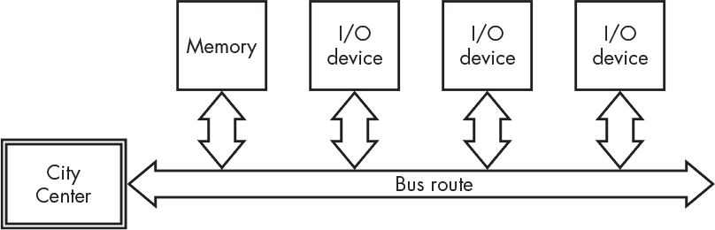

*图 4-6：共享内存和 I/O 总线*

我们常用运输的比喻，说某些东西被连接到 *I/O 端口*。

### 中央处理单元

*中央处理单元（CPU）* 是计算机中执行实际计算的部分。它就像我们类比中的城市中心。其他部分则是支持角色。CPU 由多个独立的部分组成，我们将在本节中学习这些部分。

#### *算术与逻辑单元*

*算术逻辑单元（ALU）*是 CPU 的主要组成部分之一。它负责进行算术运算、布尔代数和其他操作。图 4-7 展示了 ALU 的简图。

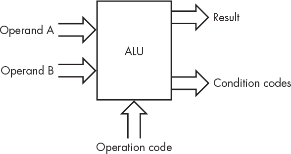

*图 4-7：样例 ALU*

*操作数*只是表示数字的位。操作码，或称*opcode*，是告诉 ALU 应该对操作数应用哪个*运算符*的数字。*结果*，当然，就是我们在应用运算符于操作数后得到的结果。

*条件码*包含关于结果的额外信息。它们通常存储在*条件码寄存器*中。我们在第三章中看到的寄存器，就是一种特殊的内存，它位于内存的不同“街道”上——那条有着昂贵定制住宅的街道。一个典型的条件码寄存器如图 4-8 所示。盒子上方的数字是位号，这是便于引用它们的一种方式。请注意，有些位没有使用；这并不罕见。

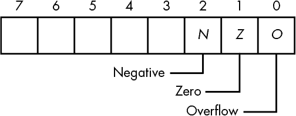

*图 4-8：条件码寄存器*

*N* 位如果上次操作的结果是负数则置为 1。*Z* 位如果上次操作的结果是 0，则置为 1。*O* 位如果上次操作的结果发生溢出或下溢，则置为 1。

表 4-1 展示了 ALU 可能执行的操作。

**表 4-1：** 样例 ALU 操作码

| **操作码** | **助记符** | **描述** |
| --- | --- | --- |
| `0000` | clr | 忽略操作数；将结果的每一位设为 0（清零）。 |
| `0001` | set | 忽略操作数；将结果的每一位设为 1。 |
| `0010` | not | 忽略 B；将 A 的 0 转为 1，1 转为 0。 |
| `0011` | neg | 忽略 B；结果是 A 的二补数，即 -A。 |
| `0100` | shl | 将 A 左移 B 的低 4 位（见下一节）。 |
| `0101` | shr | 将 A 右移 B 的低 4 位（见下一节）。 |
| `0110` |  | 未使用。 |
| `0111` |  | 未使用。 |
| `1000` | load | 将操作数 B 传递给结果。 |
| `1001` | 和 | 对每一位操作数，结果是 A 与 B 的按位与。 |
| `1010` | or | 结果是 A 或 B 的按位或。 |
| `1011` | xor | 结果是 A 与 B 的按位异或。 |
| `1100` | add | 结果是 A + B。 |
| `1101` | sub | 结果是 A - B。 |
| `1110` | cmp | 根据 B - A （比较）设置条件码。 |
| `1111` |  | 未使用。 |

ALU 可能看起来神秘，但它其实就是一些逻辑门连接到一个选择器，这些你之前见过。图 4-9 展示了 ALU 的总体设计，为了简化，省略了一些更复杂的功能。

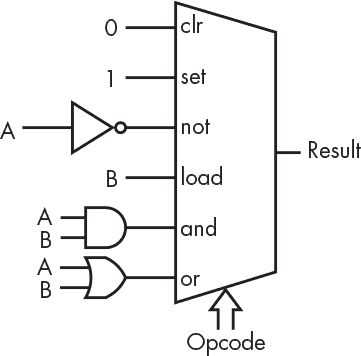

*图 4-9：ALU 部分内部结构*

#### *移位性*

你可能已经注意到表 4-1 中的移位操作。左移将每一位向左移动一位，丢弃最左边的位，并将 0 移动到空出来的最右边位置。如果我们将 01101001（105[10]）左移 1 位，我们将得到 11010010（210[10]）。这是非常方便的，因为将一个数左移一位实际上是乘以 2。

右移将每一位向右移动一位，丢弃最右边的位，并将 0 移动到空出来的最左边位置。如果我们将 01101001（105[10]）右移 1 位，我们将得到 00110100（52[10]）。这相当于将一个数除以 2，丢弃余数。

当执行左移时，丢失的最高有效位（MSB）或右移时丢失的最低有效位（LSB）通常是需要保存的，因此它会被保存在条件码寄存器中。我们假装我们的 CPU 将它保存在*O*位中。

你可能已经注意到，ALU 中的所有内容看起来都可以通过组合逻辑实现，除了这些移位指令。你可以通过触发器构建*移位寄存器*，其中内容每个时钟周期向右或向左移动一位。

顺序移位寄存器（如图 4-10 所示）较慢，因为在最坏的情况下，每一位需要一个时钟周期。

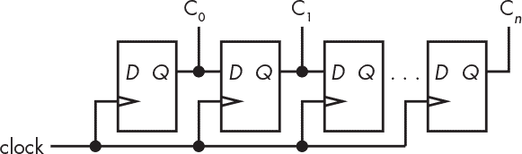

*图 4-10：一个顺序移位寄存器*

我们可以通过使用我们的逻辑构建模块——选择器（请参考图 2-47）来完全用组合逻辑构建一个*桶形移位器*。要构建一个 8 位移位器，我们需要八个 8:1 选择器。

每一位都有一个选择器，如图 4-11 所示。

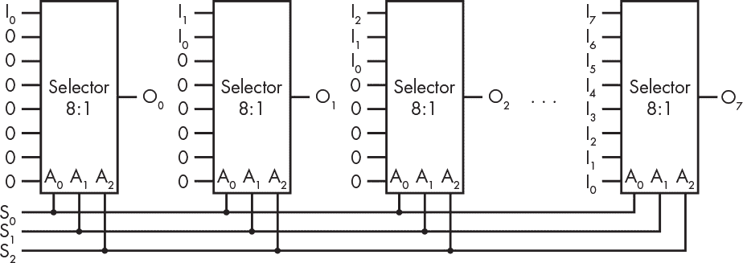

*图 4-11：一个组合式桶形移位器*

右移的位数由 S[0-2]提供。你可以看到，在没有移位（S 为 000）的情况下，输入位 0（I[0]）被传递到输出位 0（O[0]），输入位 1（I[1]）到输出位 1（O[1]），以此类推。当 S 为 001 时，输出会向右移动一位，因为输入是通过选择器接线的。当 S 为 010 时，输出会向右移动两位，依此类推。换句话说，我们已经将所有八种可能性接线，只需要选择我们想要的那个。

你可能会想，为什么我一直在展示这些逻辑图，好像它们是由旧的 7400 系列元件构建的。像门、复用器、解复用器、加法器、锁存器等功能在集成电路设计系统中作为预定义组件提供。它们的使用方式与旧元件相似，不同之处在于，我们现在使用设计软件将类似的组件组装成一个单一的芯片，而不是像在第二章中提到的那样将许多 7400 系列元件贴在电路板上。

你可能已经注意到，我们简单的算术逻辑单元（ALU）中缺少乘法和除法操作。这是因为它们要复杂得多，而且并没有给我们展示什么我们还没有见过的东西。你知道乘法可以通过重复加法来实现；那是顺序版本。你还可以通过级联桶移位器和加法器来构建一个组合型乘法器，同时记住左移操作会将数字乘以 2。

移位器是实现浮点运算的关键元素；指数用于将尾数移位，以对齐二进制点，从而使得它们可以相加、相减，等等。

#### *执行单元*

计算机的*执行单元*，也叫*控制单元*，是总指挥。毕竟，仅有算术逻辑单元（ALU）本身并没有太大用处——必须有一个东西来告诉它该做什么。执行单元从内存中的正确位置获取操作码和操作数，告诉 ALU 执行哪些操作，并将结果放回内存中。希望它能以某种有用的顺序完成这些操作。（顺便说一句，我们这里使用的是“执行”作为*执行*的定义。并没有实际消耗任何位。）

执行单元怎么做到这一点呢？我们给它一份指令清单，比如“将位置 10 中的数字加到位置 12 中的数字，并将结果放到位置 14 中。”执行单元从哪里找到这些指令呢？从内存中！我们所拥有的技术名称是*存储程序计算机*。它源自英国天才艾伦·图灵（1912–1954）的研究。

没错，我们有另一种查看和解释位的方式。*指令*是告诉计算机该做什么的位模式。这些位模式是特定 CPU 设计的一部分。它们不是某种通用标准，就像数字一样，所以英特尔 Core i7 CPU 的`inc A`指令的位模式可能与 ARM Cortex-A CPU 的位模式不同。

执行单元如何知道去哪里找内存中的指令呢？它使用*程序计数器*（通常缩写为*PC*），这就像一个邮递员，或者像一个标有“你在这里”的大箭头。如图 4-12 所示，程序计数器是另一个寄存器，是位于特殊内存“旁路”上的一部分。它由计数器（参见计数器在第 77 页）构成，而不是普通的寄存器（参见寄存器在第 78 页）。你可以将计数器视为一个带有附加计数功能的寄存器。

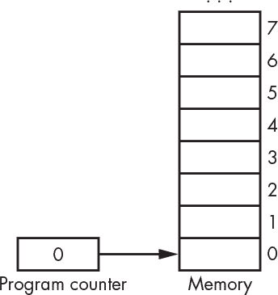

*图 4-12：程序计数器*

程序计数器包含一个内存地址。换句话说，它指向或*引用*内存中的某个位置。执行单元从程序计数器引用的位置取出一条指令。有一些特殊的指令可以改变程序计数器的值，我们稍后会看到。除非我们正在执行这些特殊指令，否则程序计数器在指令执行后会被*递增*（也就是加上一个指令的大小），这样下一条指令就会从下一个内存位置取出。请注意，CPU 在开机时会有一个初始的程序计数器值，通常是 0。图 3-17 中的计数器支持所有这些功能。

这一切有点像寻宝游戏。计算机到达内存中的某个位置，找到一张便条。它读取便条，按照便条上写的去做，然后去其他地方拿到下一张便条，依此类推。

### 指令集

计算机在内存中进行寻宝时找到的笔记叫做*指令*。本节将深入探讨这些指令的内容。

#### *指令*

为了查看我们在 CPU 中可能找到什么样的指令，以及我们如何选择它们的比特模式，我们的示例假设计算机的指令宽度为 16 位。

让我们尝试将指令分成四个字段——操作码，加上两个操作数和结果的地址——如图 4-13 所示。

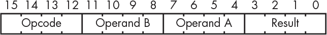

*图 4-13：三地址指令布局*

这看起来是个不错的主意，但实际上并不好用。为什么呢？因为我们每个操作数和结果只有 4 位地址空间。当只有 16 个地址时，想要访问大量内存是很困难的。我们可以把指令做得更大，但即便我们使用 64 位宽的指令，也只有 20 位地址，这样只能访问到 1 MiB 的内存，而现代计算机的内存是 GiB 级别的。

另一种方法是重复我们在图 3-23 中看到的 DRAM 地址技巧。我们可以有一个*地址扩展寄存器*，并使用单独的指令将高位地址位加载到该寄存器中。英特尔使用此技术，使其 32 位计算机能够访问超过 4 GiB 的内存。英特尔称其为 PAE，即*物理地址扩展*。当然，加载此寄存器需要额外的时间，如果我们需要在此方法所创建的边界两侧都访问内存，还需要大量的寄存器加载。

然而，三地址格式无法正常工作有一个更重要的原因：它依赖于某种神奇的、不存在的内存形式，允许同时访问三个不同的位置。图 4-14 中的所有三个内存块都是相同的内存设备；并没有三个地址总线和三个数据总线。

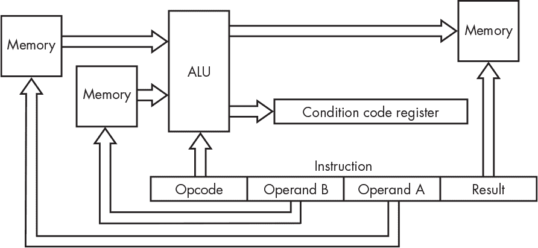

*图 4-14：无法实现的计算机架构*

我们可以通过让一个寄存器保存操作数 A 的内容，另一个寄存器保存操作数 B 的内容来使其工作。硬件需要执行以下操作：

1.  使用程序计数器中的地址从内存加载指令。

1.  使用指令中操作数 A 部分的地址加载操作数 A 寄存器。

1.  使用指令中操作数 B 部分的地址加载操作数 B 寄存器。

1.  使用指令结果部分的地址将结果存储在内存中。

这需要许多复杂的硬件。如果这些步骤每个都需要一个时钟周期，那么光是完成一项操作就需要四个周期。我们应该从只能一次访问一个内存位置的事实中获取提示，并相应地设计我们的指令集。如果我们只试图一次只访问一项内容，那么可以使用更多的地址位。

我们可以通过向寄存器街道添加另一个“房子”来做到这一点。我们称这个寄存器为*累加器*，简称*A*寄存器，它将保存来自 ALU 的结果。我们不再在两个内存位置之间执行操作，而是在一个内存位置和累加器之间执行操作。当然，我们还需要添加一个*存储*指令，将累加器的内容存储到内存位置中。现在，我们可以按照图 4-15 所示来布局我们的指令。

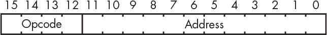

*图 4-15：单地址指令布局*

这让我们获得了更多的地址位，但需要更多的指令才能完成操作。我们曾经能够有一条指令，它说：

*C* = *A* + *B*

但现在我们需要三条指令：

累加器 = *A*

累加器 = 累加器 + *B*

*C* = 累加器

你可能注意到，我们只是用三条指令替换了一条指令，实际上使得指令变得更大，这与我们之前的做法相矛盾。这对于这个简单的情况来说是正确的，但在一般情况下并不成立。假设我们需要计算这个：

*D* = *A* + *B* + *C*

即使可以访问三个地址，我们也无法通过单条指令实现这一点，因为现在我们需要四个地址。我们得像这样做：

中间值 = *A* + *B*

*D* = 中间值 + *C*

假设使用 12 位地址，我们需要 40 位的指令来处理三个地址加操作码。为了计算 *D*，我们需要两个这样的指令，总共 80 位。而使用单地址版本的指令需要四条指令，总共 64 位。

累加器 = *A*

累加器 = 累加器 + *B*

累加器 = 累加器 + *C*

*D* = 累加器

#### *寻址模式*

使用累加器使我们能够使用 12 位地址，虽然能够寻址 4,096 字节比 16 字节好多了，但仍然不够。这种寻址方式被称为*直接寻址*，意味着地址就是指令中给定的地址。

我们可以通过增加*间接寻址*来寻址更多的内存。在间接寻址中，我们从指令中包含的内存位置获取地址，而不是直接从指令本身获取地址。例如，假设内存位置 12 包含值 4321，而内存位置 4321 包含值 345。如果使用直接寻址，从位置 12 加载会得到 4321，而使用间接寻址会得到 345，即位置 4321 的内容。

这对于处理内存来说没问题，但有时我们只是需要获取常数值。例如，如果我们需要计数到 10，我们需要某种方式加载这个数字。我们可以通过另一种寻址模式来实现，叫做*立即寻址模式*。在这种模式下，地址仅被视为一个数字，因此，使用前面的例子，立即寻址模式加载 12 将得到 12。图 4-16 对比了这些寻址模式。

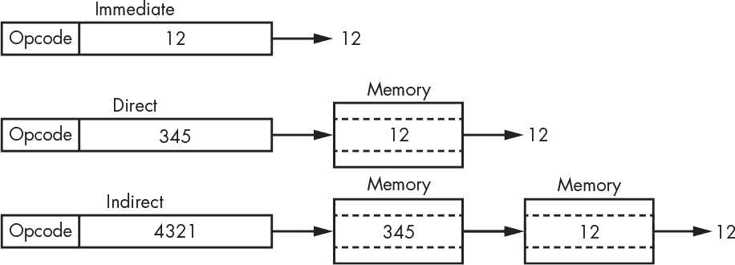

*图 4-16：寻址模式*

很明显，直接寻址比立即寻址要慢，因为它需要第二次内存访问。间接寻址则更慢，因为它需要第三次内存访问。

#### *条件码指令*

我们的 CPU 仍然缺少一些东西，比如能处理条件码的指令。我们已经看到，这些条件码是通过加法、减法和比较来设置的。但我们需要一种方法将它们设置为已知值，并且还需要一种方法查看这些值。我们可以通过增加一个`cca`指令来实现，它将条件码寄存器的内容复制到累加器中，另外还可以使用`acc`指令将累加器的内容复制到条件码寄存器。

#### *分支*

现在我们有了可以做各种事情的指令，但我们能做的只是从头到尾执行它们的列表。这并不太有用。我们真正希望的是能够编写可以做出决策并选择要执行的代码片段的程序。为了实现这一点，我们需要一些能改变程序计数器值的指令。这些被称为*分支*指令，它们会将程序计数器加载到一个新的地址。仅仅如此，它并不比能够执行一个指令列表更有用。但分支指令并不总是进行跳转；它们会查看条件码，只有满足条件时才会跳转。否则，程序计数器会正常递增，接着执行分支指令后的下一条指令。分支指令需要几个比特位来存储条件，如表 4-2 所示。

**表 4-2：** 分支指令条件

| **代码** | **助记符** | **描述** |
| --- | --- | --- |
| `000` | bra | 始终跳转。 |
| `001` | bov | 如果 O（溢出）条件码位被设置，则跳转。 |
| `010` | beq | 如果 Z（零）条件码位被设置，则跳转。 |
| `011` | bne | 如果 Z 条件码位未被设置，则跳转。 |
| `100` | blt | 如果 N（负值）被设置且 Z 为清零，则跳转。 |
| `101` | ble | 如果 N 或 Z 被设置，则跳转。 |
| `110` | bgt | 如果 N 为清零且 Z 为清零，则跳转。 |
| `111` | bge | 如果 N 为清零或 Z 被设置，则跳转。 |

有时我们需要显式地改变程序计数器的内容。我们有两个特殊的指令来帮助实现这一点：`pca`，它将当前的程序计数器值复制到累加器中，以及`apc`，它将累加器的内容复制到程序计数器中。

#### *最终指令集*

让我们将所有这些功能整合到我们的指令集中，如图 4-17 所示。

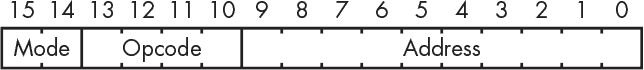

*图 4-17：最终的指令布局*

我们有三种*寻址模式*，这意味着我们需要 2 位来选择模式。未使用的第四位组合用于不涉及内存的操作。

寻址模式和操作码解码成指令，正如你在表 4-3 中看到的那样。请注意，分支条件已经并入到操作码中。寻址模式 3 的操作码用于仅涉及累加器的操作。完整实现的一个副作用是，操作码并不完全与我们在表 4-1 中看到的 ALU 匹配。这并不罕见，并且需要一些额外的逻辑。

**表 4-3：** 寻址模式和操作码

| **操作码** | **寻址模式** |
| --- | --- |
| **直接寻址 (00)** | **间接寻址 (01)** | **立即数 (10)** | **无 (11)** |
| --- | --- | --- | --- |
| `0000` | load | load | load |  |
| `0001` | and | and | and | set |
| `0010` | or | or | ore | not |
| `0011` | xor | xor | xor | neg |
| `0100` | add | add | add | shl |
| `0101` | sub | sub | sub | shr |
| `0110` | cmp | cmp | cmp | acc |
| `0111` | store | store |  | cca |
| `1000` | bra | bra | bra | apc |
| `1001` | bov | bov | bov | pca |
| `1010` | beq | beq | beq |  |
| `1011` | bne | bne | bne |  |
| `1100` | blt | blt | blt |  |
| `1101` | ble | bge | ble |  |
| `1110` | bgt | bgt | bgt |  |
| `1111` | bge | bge | bge |  |

左移和右移指令将一些原本未使用的位用作位移次数的计数器，如图 4-18 所示。

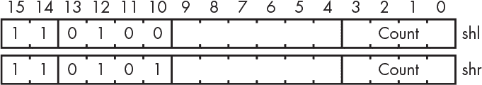

*图 4-18：移位指令布局*

现在我们可以通过编写一个*程序*来实际指示计算机执行某些任务，程序只是一个执行某些任务的指令列表。我们将计算所有小于 200 的斐波那契（意大利数学家，1175–1250）数。斐波那契数非常有趣；例如，花朵的花瓣数就是斐波那契数。前两个斐波那契数是 0 和 1。通过将它们相加，我们得到下一个数。我们不断地将新数加到前一个数中，以得到序列，即 0、1、1、2、3、5、8、13，依此类推。该过程如图 4-19 所示。

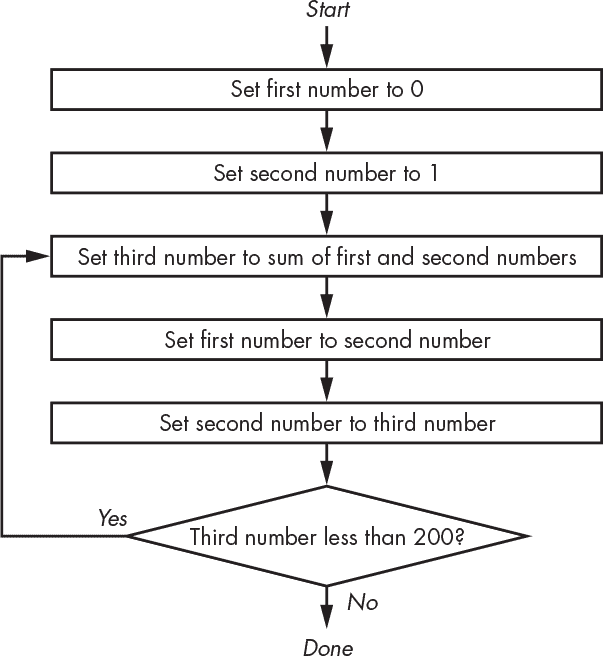

*图 4-19：斐波那契数列程序的流程图*

表 4-4 中显示的简短程序实现了这一过程。指令列根据图 4-17 被分为多个字段。注释中的地址是十进制数。

**表 4-4：计算斐波那契数列的机器语言程序**

| **地址** | **指令** | **描述** |
| --- | --- | --- |
| `0000` | `10 0000 0000000000` | 清空累加器（立即加载 0）。 |
| `0001` | `00 0111 0001100100` | 将累加器（0）存储在内存位置 100。 |
| `0010` | `10 0000 0000000001` | 将 1 加载到累加器中（立即加载 1）。 |
| `0011` | `00 0111 0001100101` | 将累加器（1）存储在内存位置 101。 |
| `0100` | `00 0000 0001100100` | 从内存位置 100 加载累加器。 |
| `0101` | `10 0100 0001100101` | 将内存位置 101 的内容加到累加器中。 |
| `0110` | `00 0111 0001100110` | 将累加器存储在内存位置 102。 |
| `0111` | `00 0000 0001100101` | 从内存位置 101 加载累加器。 |
| `1000` | `00 0111 0001100100` | 将其存储在内存位置 100。 |
| `1001` | `00 0000 0001100110` | 从内存位置 102 加载累加器。 |
| `1010` | `00 0111 0001100101` | 将其存储在内存位置 101。 |
| `1011` | `10 0110 0011001000` | 将累加器的内容与数字 200 进行比较。 |
| `1100` | `00 0111 0000000100` | 如果上一个数小于 200，则通过跳转到地址 4（0100）执行另一个数字。 |

### 最终设计

让我们把到目前为止看到的所有部分组合成一个实际的计算机。我们需要一些“粘合剂”来使这一切工作起来。

#### *指令寄存器*

你可能会被误导，以为计算机只是逐条执行斐波那契程序。然而，背后发生的事情比这复杂。执行一条指令需要什么？有一个*状态机*在做这两步操作，如图 4-20 所示。

*图 4-20：获取-执行周期*

我们需要做的第一件事是从内存中获取一条指令。一旦我们得到了这条指令，就可以开始执行它。

执行指令通常涉及访问内存。这意味着我们需要一个地方来保存当前指令，以便在使用内存执行其他任务时可以随时使用。在图 4-21 中，我们向 CPU 添加了一个*指令寄存器*来保存当前指令。

*图 4-21：添加指令寄存器*

#### *数据路径和控制信号*

接下来是复杂的部分。我们需要一种方法将程序计数器的内容传输到内存地址总线，并且将内存数据传输到指令寄存器。我们可以做类似的操作，确定所有不同的连接，来实现我们指令集中的每一项，如表 4-4 所详细描述的那样。最终我们得到了图 4-22，看起来可能很复杂。但其实这只是我们之前看到的一些东西：一些寄存器，一些选择器，算术逻辑单元（ALU）和一个三态缓冲器。

虽然这看起来相当复杂，但其实就像一张路线图。比起真实的城市地图，它要简单得多。地址选择器就像一个三路交叉口，而数据选择器是一个四路交叉口。地址总线和数据总线上的连接会涉及一些设备，如我们将在第六章中讨论的 I/O 设备。

*图 4-22：数据路径和控制信号*

唯一的新部分是*间接地址寄存器*。我们需要这个寄存器，因为我们需要一个地方来存储从内存中获取的间接地址，类似于指令寄存器存储从内存中获取的指令。

为了简化，图 4-22 省略了所有寄存器和内存的系统时钟。在简单的寄存器情况下，只需假设寄存器在下一个时钟周期被加载（如果已启用）。同样，程序计数器和内存会按照它们的控制信号在每个时钟周期执行任务。所有其他组件，如选择器，都是纯组合逻辑，并不使用时钟。

#### *流量控制*

现在你已经熟悉了所有的输入和输出，接下来是时候构建我们的流量控制单元了。让我们看几个例子，了解它需要如何工作。

获取操作是所有指令的共同操作。以下信号会涉及到：

+   `地址源`必须设置为选择程序计数器。

+   必须启用内存，并且读写信号`r/w`必须设置为读取（1）。

+   必须启用指令寄存器。

对于我们的下一个示例，我们将把累加器的内容存储到指令中包含的地址所指向的内存地址——换句话说，使用间接寻址。获取过程与之前相同。

从内存中获取间接地址：

+   必须设置`address source`以选择指令寄存器，这样我们就可以得到指令的地址部分。

+   启用内存，并将`r/w`设置为读取（1）。

+   启用间接地址寄存器。

将累加器存储到该地址：

+   必须设置`address source`以选择间接地址寄存器。

+   必须设置数据总线`enable`。

+   启用内存并将`r/w`设置为写入（0）。

+   程序计数器递增。

由于获取和执行指令涉及多个步骤，我们需要一个计数器来跟踪它们。计数器的内容加上指令的操作码和模式部分，就是我们生成所有控制信号所需的内容。我们需要 2 位计数器，因为执行我们最复杂的指令需要三种状态，如图 4-23 所示。

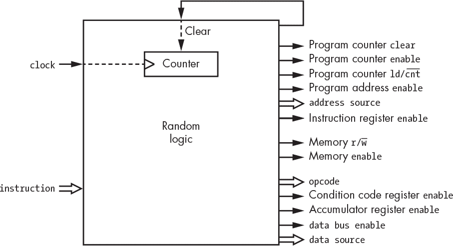

*图 4-23：随机逻辑交通控制*

这是一个充满所谓*随机逻辑*的大盒子。到目前为止，我们看到的所有逻辑图都遵循某种规律模式。功能模块，如选择器和寄存器，是由简单模块以清晰的方式组装而成的。有时，比如在实现交通控制单元时，我们有一组输入必须映射到一组输出，以完成一个没有规律的任务。电路图看起来像是老鼠窝般的连接——因此称之为“随机”。

但是，我们可以通过另一种方式实现我们的交通控制单元。与随机逻辑不同，我们可以使用一块内存。地址将由计数器输出加上指令的操作码和模式部分组成，如图 4-24 所示。

*图 4-24：基于内存的交通控制*

每个 19 位的存储字如图 4-25 所示布局。

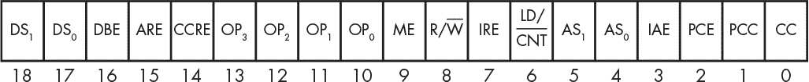

*图 4-25：微代码字的布局*

这可能让你觉得有点奇怪。一方面，它只不过是另一种状态机，使用内存而不是随机逻辑实现。另一方面，它看起来确实像一台简单的计算机。这两种解释都是正确的。它是一个状态机，因为计算机本身就是状态机。但它也是一台计算机，因为它是可编程的。

这种实现方式称为*微编码*，内存的内容称为*微代码*。是的，我们正在使用一个小型计算机作为我们大型计算机实现的一部分。

让我们来看一下在图 4-26 中显示的*微指令*部分，这些微指令实现了我们之前讨论的示例。

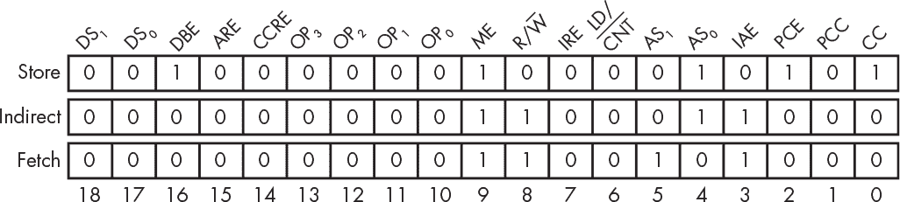

*图 4-26：微代码示例*

正如你所料，很难避免滥用一个好的想法。有些机器拥有*纳米编码*区块，它实现了一个*微编码*区块，再由该区块实现指令集。

使用 ROM 作为微码存储器是有一定道理的，因为如果不使用 ROM，我们就需要在其他地方保留一份微码副本，并且需要额外的硬件来加载微码。然而，在某些情况下，RAM 或 ROM 和 RAM 的混合使用是合理的。一些 Intel CPU 具有可写的微码，可以通过修补程序来修复错误。一些机器，比如 HP-2100 系列，拥有*可写控制存储器*，它是可以用来扩展基本指令集的微码 RAM。

现在，拥有可写微码的机器很少允许用户修改它，原因有几个。制造商不希望用户依赖他们自己为应用程序编写的微码，因为一旦用户依赖它，制造商就很难进行更改。此外，错误的微码可能会损坏机器——例如，它可能会同时打开内存*使能*和数据总线*使能*，这样就会将输出引脚连接在一起，可能会烧毁晶体管。

### RISC 与 CISC 指令集

设计师曾经为计算机创建看似有用的指令，但这些指令导致了相当复杂的机器。在 1980 年代，美国计算机科学家 David Patterson（伯克利大学）和 John Hennessey（斯坦福大学）对程序进行了统计分析，发现许多复杂的指令很少使用。他们开创了只包含大多数程序时间所需指令的机器设计；使用较少的指令被删除，并由其他指令的组合替代。这些被称为*RISC*机器，即*精简指令集计算机*。较早的设计则被称为*CISC*机器，即*复杂指令集计算机*。

RISC 机器的一个显著特点是它们采用*加载-存储架构*。这意味着有两类指令：一种用于访问内存，另一种用于其他所有操作。

当然，计算机的使用随着时间的推移发生了变化。Patterson 和 Hennessey 的最初统计数据是在计算机广泛用于音频和视频等任务之前进行的。对新程序的统计数据促使设计者为 RISC 机器添加新指令。今天的 RISC 机器实际上比过去的 CISC 机器更复杂。

其中一款对计算机架构影响深远的 CISC 机器是来自数字设备公司的 PDP-11。这台机器有八个通用寄存器，而不是我们在示例中使用的单一累加器。这些寄存器可以用于间接寻址。此外，还支持*自动递增*和*自动递减*模式。这些模式允许在使用前或使用后对寄存器中的值进行递增或递减操作，从而实现非常高效的程序。例如，假设我们想将从源地址开始的*n*字节内存复制到从目标地址开始的内存中。我们可以将源地址放入寄存器 0，目标地址放入寄存器 1，计数放入寄存器 2。我们将跳过实际的位操作，因为学习 PDP-11 指令集并非必要。表 4-5 展示了这些指令的功能。

**表 4-5：** PDP-11 复制内存程序

| **地址** | **描述** |
| --- | --- |
| 0 | 将寄存器 0 中地址指向的内存位置的内容复制到寄存器 1 中地址指向的内存位置，然后将每个寄存器的值加 1。 |
| 1 | 从寄存器 2 的内容中减去 1，然后将结果与 0 进行比较。 |
| 2 | 如果结果不为 0，则跳转到位置 0。 |

为什么我们应该关注这个？C 编程语言是 B 语言的后继（B 语言又是 BCPL 的后继），它是在 PDP-11 上开发的。C 语言使用的*指针*是间接寻址的高级抽象，与 B 语言的特性，如自动递增和自动递减运算符，结合得很好，适配了 PDP-11 架构。C 语言影响深远，对许多其他编程语言的设计产生了影响，包括 C++、Java 和 JavaScript。

### 图形处理单元

你可能听说过*图形处理单元*，即 GPU。它们大多超出了本书的范围，但值得简要提及。

图形处理是一项庞大的按数字涂色的任务。如果你希望视频效果良好，通常需要涂上 800 万种颜色点，并且每秒涂 60 次。这意味着每秒大约要进行五亿次内存访问。

图形处理是专业化的工作，不需要通用 CPU 的所有功能。而且它是一项能够很好地并行化的任务：同时绘制多个点可以提高性能。

GPU 有两个显著特征。首先，它们拥有大量简单的处理器。其次，它们的内存总线比 CPU 宽得多，这意味着它们可以更快速地访问内存。GPU 就像喷火管，而不是花园水管。

随着时间的推移，图形处理单元（GPU）获得了更多的通用功能。为了使其可编程，已进行了一些工作，将它们与标准编程语言的变种结合使用，现在它们已被用于某些可以充分利用其架构的应用程序。写这本书时 GPU 短缺，因为它们都被抢购用于比特币挖矿。

### 总结

在本章中，我们使用前几章介绍的基本构件创建了一个实际的计算机。尽管简单，但我们在本章设计的机器实际上是可以构建和编程的。它缺少一些真实计算机中存在的元素，比如堆栈和内存管理硬件。我们将在第五章中学习这些内容。
