## 第五章：计算机架构**


第四章 介绍了简单计算机系统的设计，并讨论了 CPU 如何通过地址总线和数据总线与内存和 I/O 设备进行通信。然而，这还不是故事的全部。多年来，许多改进使得计算机运行得更快，同时需要更少的功率，并且更易于编程。这些改进增加了设计的复杂性。

*计算机架构* 指的是将各种组件组合成一台计算机的方式——而不是计算机是否有多立柱或像美国企业家史蒂夫·乔布斯（1955–2011）为原版 Macintosh 计算机设计的那种自定义米色。多年来，已经尝试了许多不同的架构。哪些有效，哪些无效，都是非常引人入胜的话题，许多书籍已经出版，专门讨论这一主题。

本章主要关注涉及内存的架构改进。一张现代微处理器的光学显微照片显示，绝大部分芯片区域都用于内存处理。它如此重要，以至于值得专门用一章来讲解。我们还将涉及架构中的一些其他差异，例如指令集设计、额外的寄存器、电源控制和更先进的执行单元。我们还将讨论对 *多任务处理* 的支持，即能够同时运行多个程序，或者至少提供这样的假象。运行多个程序意味着存在某种名为 *操作系统（OS）* 的监督程序来控制它们的执行。

### 基本架构元素

两种最常见的架构是 *冯·诺依曼*（以匈牙利裔美国巫师约翰·冯·诺依曼（1903–1957）命名）和 *哈佛*（以哈佛 Mark I 计算机命名，这当然是一台哈佛架构的机器）。我们已经看到这些部分；图 5-1 显示了它们的组织方式。

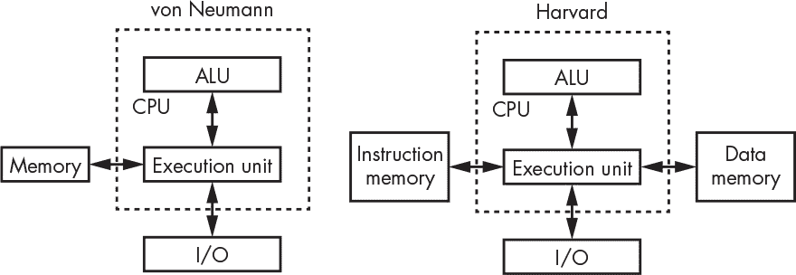

*图 5-1：冯·诺依曼和哈佛架构*

请注意，它们之间唯一的区别是内存的排列方式。在其他条件相同的情况下，冯·诺依曼架构略慢，因为它无法同时访问指令和数据，因为只有一个内存总线。哈佛架构解决了这个问题，但需要额外的硬件来支持第二个内存总线。

#### *处理器核心*

图 5-1 中的两种架构都有一个单独的 CPU，正如我们在第四章中看到的，CPU 是 ALU、寄存器和执行单元的组合。*多处理器*系统具有多个 CPU，于 1980 年代首次问世，旨在实现比单个 CPU 更高的性能。然而，事实证明，这并不那么简单。将一个单一的程序分割成可以*并行化*以利用多个 CPU 的形式是一个尚未解决的普遍问题，尽管它在某些事情上表现良好，比如特定类型的重数学计算。然而，当你同时运行多个程序时，这种方式非常有用，尤其是在图形工作站的早期阶段，X Window System 由于过度占用资源，拥有一个单独的处理器来运行它成为了救命稻草。

降低制造几何尺寸能够降低成本。因为芯片是由硅晶圆制造的，尺寸越小，意味着更多的芯片可以放置在一个晶圆上。过去，提高性能通常通过加快 CPU 速度来实现，这意味着提高时钟速度。但更快的机器需要更多的功率，而这与更小的几何尺寸结合起来，会导致每单位面积的功率产生更多热量。大约在 2000 年，处理器遇到了*功率墙*，因为功率密度无法进一步增加而不超过熔点。

一种类似的拯救来自更小的制造几何尺寸。CPU 的定义发生了变化；我们曾经称之为 CPU 的东西现在被称为*处理器核心*。*多核*处理器现在已经非常普遍。甚至有一些系统，主要在数据中心中，可以找到多个多核处理器。

#### *微处理器与微型计算机*

另一个正交的架构区分基于机械封装。图 5-1 展示了连接到内存和 I/O 的 CPU。当内存和 I/O 不与处理器核心在同一个物理封装中时，我们称之为*微处理器*，而当所有组件都集成在一个芯片上时，我们使用术语*微型计算机*。这些术语并不十分明确，使用上存在很多模糊之处。有些人认为微型计算机是围绕微处理器构建的计算机系统，并用*微控制器*一词来指代我刚才定义的微型计算机。

微型计算机往往比微处理器的性能差，因为像片上内存这样的东西占据了大量空间。我们在这一章中不会过多关注微型计算机，因为它们没有那么复杂的内存问题。然而，一旦你学会了编程，学习像 Arduino 这样的东西是很值得的，它是一款基于 Atmel AVR 微型计算机芯片的小型哈佛架构计算机。Arduino 非常适合制作各种玩具和闪烁的物品。

总结一下：微处理器通常是更大系统的一部分，而微型计算机则是你在像洗碗机这样的设备中找到的东西。

另有一种变种叫做*系统级芯片（SoC）*。一种尚可接受但仍模糊的定义是，SoC 是一种更复杂的微型计算机。与相对简单的片上 I/O 不同，SoC 可能包括 Wi-Fi 电路等组件。SoC 常见于手机等设备中。甚至有一些 SoC 包含现场可编程门阵列（FPGAs），允许额外的定制。

### 过程、子程序和函数

许多工程师有一种特殊的懒惰变种。如果他们不想做某件事，他们会把精力投入到创造一个能替他们做这件事的工具中，即使这比原始任务需要更多的工作。程序员希望避免的一件事是重复写同一段代码。除了懒惰之外，这样做有很多好处。其中之一是，它可以节省代码空间，而且如果代码中有 bug，也只需要在一个地方修复。

*函数*（或*过程*或*子程序*）是代码重用的基石。对于你来说，这些术语的意思是一样的；它们只是语言上的地区差异。我们将使用*函数*，因为它最接近你在数学课上可能学到的内容。

大多数编程语言有类似的结构。例如，在 JavaScript 中，我们可以编写如 清单 5-1 所示的代码。

```
function

cube(x)

{

        return (x * x * x);

}
```

*清单 5-1：一个示例 JavaScript 函数*

这段代码创建了一个名为 `cube` 的函数，它接受一个名为 `x` 的参数并返回它的立方。键盘不包括乘号（×），因此许多编程语言用 * 代替乘法符号。现在我们可以编写像 清单 5-2 中那样的程序片段。

```
y = cube(3);
```

*清单 5-2：一个示例 JavaScript 函数调用*

这里的好处是，我们可以多次调用 `cube` 函数，而无需再次编写它。我们可以计算 `cube(4) + cube(6)`，而不需要重复编写求立方的代码。这是一个简单的示例，但想象一下，对于更复杂的代码块，这种能力会多么方便。

这如何实现呢？我们需要一种方法来运行函数代码，然后返回到原来的位置。为了能够返回，我们需要知道来自哪里，即程序计数器的内容（你在 图 4-12 中看到过，在 第 101 页）。表 5-1 显示了如何使用我们在 “指令集” 中讨论的示例指令集，在 第 102 页 中进行函数调用。

**表 5-1：** 调用函数

| **地址** | **指令** | **操作数** | **备注** |
| --- | --- | --- | --- |
| 100 | pca |  | 程序计数器 → 累加器 |
| 101 | add | 5 (立即数) | 返回地址（100 + 5 = 105） |
| 102 | store | 200 (直接) | 将返回地址存储到内存中 |
| 103 | load | 3 (立即数) | 将立方数（3）放入累加器 |
| 104 | bra | 300（直接） | 调用 `cube` 函数 |
| 105 |  |  | 函数后继续 |
| ... |  |  |  |
| 200 |  |  | 保留的内存位置 |
| ... |  |  |  |
| 300 | ... | ... | `cube` 函数 |
| ... |  |  | `cube` 函数的其余部分 |
| 310 | bra | 200（间接） | 跳转到存储的返回地址 |

这里发生了什么？我们首先计算从 `cube` 函数返回后，执行继续的位置地址。这需要我们几条指令；另外，我们还需要加载必须立方运算的数字。那是五条指令之后的事，所以我们将那个地址存储在内存位置 200。我们跳转到函数，函数完成后，我们通过 200 间接跳转，这样我们就回到了位置 105。这个过程如 图 5-2 所示。

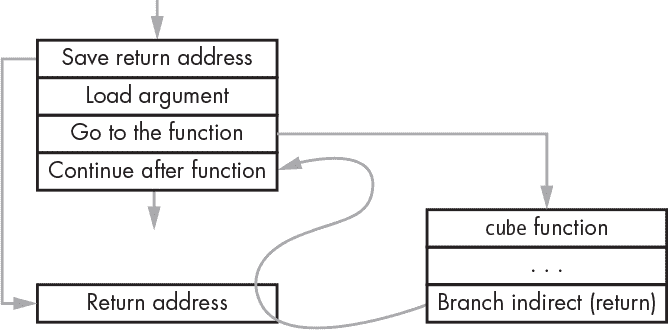

*图 5-2：一个函数调用流程*

这是一项重复性很高的工作，因此许多机器增加了辅助指令。例如，ARM 处理器有一个 *带链接的分支（BL）* 指令，它将跳转到函数与保存下一个指令地址结合在一起。

### 栈

函数不仅仅限于我们刚才看到的简单代码块。函数调用其他函数，甚至是自己调用自己，这是很常见的。

等等，那是什么？一个函数调用它自己？那叫做 *递归*，它非常有用。我们来看看一个例子。你的手机可能使用 *JPEG（联合图像专家组）压缩* 来减少照片的文件大小。为了理解压缩是如何工作的，我们从一张黑白方形图像开始，如 图 5-3 所示。

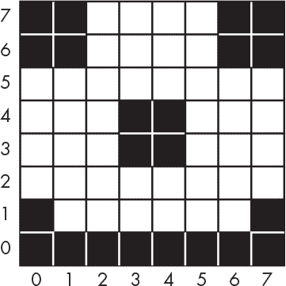

*图 5-3：一个粗略的笑脸*

我们可以通过 *递归细分* 来解决压缩问题：我们查看图像，如果它不是单一颜色，我们就将它分成四块，然后再次检查，直到这些块变成一个像素大小为止。

清单 5-3 显示了一个处理图像一部分的 `subdivide` 函数。它是用 *伪代码* 编写的，这是一种类似英语的编程语言，专门用来做示例。它 *接受* 方形左下角的 x 和 y 坐标以及 *大小*（由于图像是正方形的，因此我们不需要宽度和高度两个参数）。 “接受” 是数学中所说的 *函数的参数* 的简写。

```
function

subdivide(x, y, size)

{

    IF (size ≠ 1 AND the pixels in the square are not all the same color) {

        half = size ÷ 2

        subdivide(x, y, half) lower          left quadrant

        subdivide(x, y + half, half)         upper left quadrant

        subdivide(x + half, y + half, half)  upper right quadrant

        subdivide(x + half, y, half)         lower right quadrant

    }

    ELSE {

        save the information about the square

    }

}
```

*清单 5-3：一个细分函数*

`subdivide` 函数将图像划分为相同颜色的块，从左下象限开始，然后是左上、右上，最后是右下。图 5-4 显示了需要细分的部分是灰色的，而已经是单一颜色的部分是黑色或白色的。

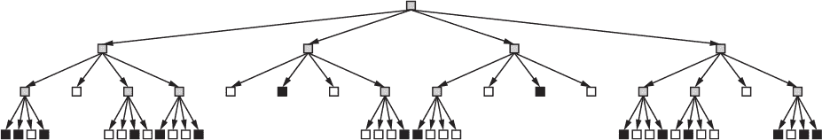

*图 5-4：图像细分*

我们这里的结构看起来像是计算机极客称之为*树*，而数学极客称之为*有向无环图（DAG）*。你按照箭头的指示走。在这个结构中，箭头不指向上方，因此不会有循环。没有箭头指向外部的东西叫做*叶节点*，它们是终点，就像树枝上的叶子是终点。如果你眯眼看并在图 5-4 中数一数，你可以看到有 40 个实心方块，少于原始图像中的 64 个方块，这意味着需要存储的信息减少了。这就是压缩。

由于某些原因，可能是因为更容易绘制（或者可能是因为他们很少外出），计算机极客总是把树的根放在顶部，并向下生长。这个特别的变种被称为*四叉树*，因为每个节点被分成四个部分。四叉树是*空间数据结构*。Hanan Samet 将这些作为自己毕生的工作，并写了几本关于这个主题的优秀书籍。

在前一节中所示的函数实现方法中存在一个问题。由于只有一个地方可以存储返回值，像这样的函数无法自我调用，因为该值会被覆盖，我们将失去返回的路径。

我们需要能够存储多个返回地址，以便使递归工作。我们还需要一种方法将返回地址与相应的函数调用关联起来。让我们看看我们如何细分图像，看看是否能找到某种模式。我们尽可能向下走树，只有在没有更多向下选项时才横向移动。这被称为*深度优先遍历*，与之相对的是先横向再纵向的*广度优先遍历*。每当我们向下走一层时，我们需要记住我们的当前位置，以便我们可以回到那里。一旦我们返回，我们就不再需要记住那个位置。

我们需要的是像自助餐厅里那些用来堆放盘子的设备。当我们调用一个函数时，我们把返回地址放在一个盘子上，并把它放在堆的顶部。当我们从调用中返回时，我们移除那个盘子。换句话说，这就是一个*栈*。你可以通过称它为*LIFO*（"后进先出"）结构来显得很重要。我们将东西*压入*栈中，并从栈中*弹出*它们。当我们试图将东西压入一个没有空间的栈时，这就叫做*栈溢出*。试图从一个空栈中弹出东西叫做*栈下溢*。

我们可以在软件中实现这个功能。在我们之前在表 5-1 中的函数调用示例中，每个函数可以将其存储的返回地址压入栈中，以便稍后取回。幸运的是，大多数计算机都支持栈的硬件支持，因为栈非常重要。这种支持包括*限制寄存器*，这样软件就不必不断检查可能的溢出。我们将在下一节讨论处理器如何处理*异常*，例如超出限制的情况。

栈不仅仅用于返回地址。我们的 `subdivide` 函数包含一个 *局部变量*，我们计算了一次大小的一半，然后八次使用它来加快程序的速度。我们不能每次调用函数时都覆盖它。相反，我们也把局部变量存储在栈上。这使得每次函数调用都独立于其他函数调用。为每次调用存储的所有内容就是 *栈帧*。图 5-5 展示了我们在 列表 5-3 中的一个函数例子。

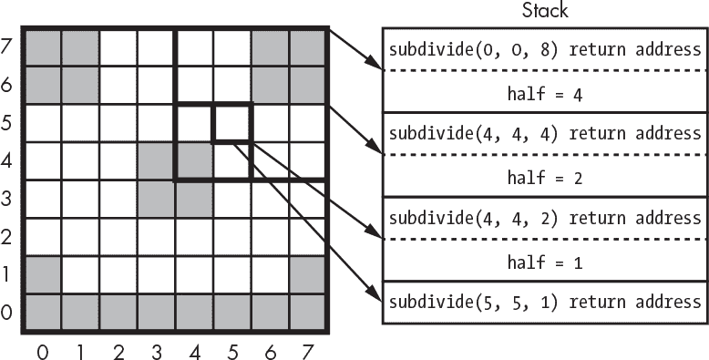

*图 5-5：栈帧*

我们遵循由粗黑方块显示的路径。你可以看到，每次调用都会生成一个新的栈帧，其中包含返回地址和局部变量。

一些计算机语言，如 *forth* 和 *PostScript*，是基于栈的（参见 “不同的方程表示法”，还有一些经典的 HP 计算器也是如此。栈不仅限于计算机语言，日语也是基于栈的：名词被推入栈中，动词对它们进行操作。尤达的神秘话语也遵循这个模式。

不同的方程表示法

操作符和操作数可以有很多种排列方式。你可能已经习惯了使用所谓的 *中缀表示法* 来做数学题。中缀表示法将操作符放在操作数之间，例如 4 + 8。中缀表示法需要括号来进行分组——例如，(1 + 2) × (3 + 4)。

波兰逻辑学家 Jan Łuskasiewicz 于 1924 年发明了 *前缀表示法*。由于他的国籍，这种表示法也被称为 *波兰表示法*。前缀表示法将操作符放在操作数之前——例如，+ 4 8。波兰表示法的优势在于不需要括号。前面的中缀例子将写成 × + 1 2 + 3 4。

美国数学家 Arthur Burks 于 1954 年提出了 *逆波兰表示法 (RPN)*，也叫 *后缀表示法*。RPN 将操作符放在操作数之后，例如 4 8 +，因此之前的例子会写成 1 2 + 3 4 + ×。

使用栈来实现 RPN 很容易。操作数被推入栈中。操作符从栈中弹出操作数，执行操作，然后将结果再次推入栈中。

HP RPN 计算器有一个 ENTER 键，在模糊情况下将操作数推入栈中；没有它，就无法知道 1 和 2 是独立的操作数，而不是数字 12。使用这样的计算器，我们可以通过按键顺序 1 `ENTER` 2 + 3 `ENTER` 4 + × 来解决方程。中缀表示法计算器则需要更多的按键输入。

这个例子方程在 PostScript 语言中会写成 `1 2 add 3 4 add mul`。不需要特别的 ENTER，因为空格就能起作用。

### 中断

想象一下你正在厨房里准备一批巧克力饼干。你在按照食谱做，而食谱就像是给厨师的程序。你是家里唯一的一个，所以你需要知道有没有人来敲门。我们将通过*流程图*来表示你的活动，流程图是一种用来表达事情如何运作的图示，见图 5-6。

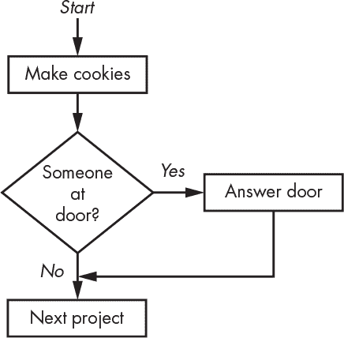

*图 5-6：家里独自做饼干 #1*

如果有一个非常有耐心的人来敲门，这可能会奏效。但假设有一个需要你签名的包裹送达。送货员是不会等 45 分钟的，除非他们能闻到饼干的香味，并希望能尝一块。我们试试不同的方法，比如图 5-7。

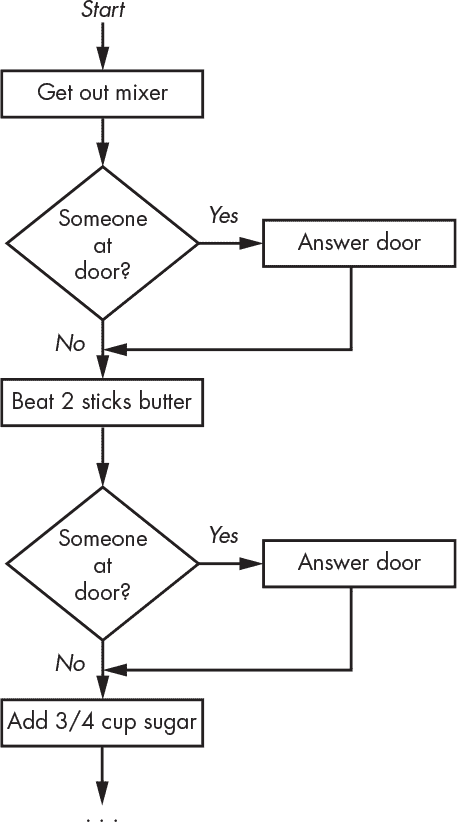

*图 5-7：家里独自做饼干 #2*

这个技术叫做*轮询*。它有效，但不是很理想。你不太可能错过包裹，但你会花很多时间检查门口。

我们可以将每一个做饼干的任务拆分成更小的子任务，并在它们之间检查门口。那样可以提高收到包裹的几率，但到某个时候，你会花更多的时间检查门口，而不是做饼干。

这是一个常见且重要的问题，实际上没有软件解决方案。通过重新排列程序结构无法使其有效运作。需要的是某种方式来*中断*一个正在运行的程序，使其能够响应外部需要关注的事情。现在是时候为执行单元添加一些硬件特性了。

几乎所有今天制造的处理器都包括一个*中断*单元。通常，它有一些引脚或电连接，当适当摆动时会生成一个中断。*引脚*是连接到芯片的电连接的俗称。以前的芯片上有像引脚一样的部分，但随着设备和工具变小，出现了许多不同的变种。许多处理器芯片，尤其是微型计算机，都有*集成外设*（片上 I/O 设备），这些设备在内部连接到中断系统。

它是这样工作的。当需要注意的外设产生*中断请求*时，处理器（通常）会完成当前正在执行的指令。然后它会暂停当前执行的程序，转而执行一个完全不同的程序，称为*中断处理程序*。中断处理程序会做它需要做的事情，然后主程序会从暂停的地方继续执行。中断处理程序是函数。

对于饼干项目，等效的机制是门铃。你可以高高兴兴地做饼干，直到被门铃打断，尽管被推销员打断可能很烦人。需要考虑几件事。首先是你对中断的*响应时间*。如果你花很长时间和送货员闲聊，你的饼干可能会烤焦；你需要确保可以及时处理中断。其次，你需要一些方法来保存*状态*，在响应中断时，这样你就可以在*处理*完中断后继续之前的工作。例如，如果被打断的程序有某些内容保存在寄存器中，那么中断处理程序在使用这些内容时必须保存寄存器的内容，并在返回主程序之前恢复它。

中断系统使用堆栈来保存中断程序的位置。中断处理程序的工作是保存它可能需要使用的任何内容。这样，处理程序就可以保存绝对最少的内容，以便快速执行。

计算机如何知道在哪里找到中断处理程序？通常，会有一组保留的内存地址用于中断向量，每个支持的中断都有一个对应的地址。*中断向量*只是一个指针，指向一个内存位置的地址。它类似于数学或物理中的向量——一个箭头，表示“从这里到那里”。当中断发生时，计算机会查找该地址并将控制转移到那里。

许多机器包含用于异常的中断向量，包括堆栈溢出和使用无效地址（例如超出物理内存范围的地址）。将异常转到中断处理程序通常可以让中断处理程序修复问题，以便程序可以继续运行。

通常，还有各种其他特殊的中断控制，例如打开和关闭特定中断的方式。通常有一个*屏蔽*，这样你就可以说“在烤箱门打开时暂时屏蔽我的中断”。在有多个中断的机器上，通常会有某种*优先级*排序，以便最重要的事情先处理。这意味着较低优先级的中断处理程序可能会被打断。大多数机器都有一个或多个内建的*定时器*，可以配置为生成中断。

操作系统（在下一节讨论）通常将对*物理*（硬件）中断的访问限制在大多数程序无法触及的地方。它们用某种*虚拟*或软件中断系统代替。例如，UNIX 操作系统有一个*信号*机制。最近开发的系统将这些称为*事件*。

### 相对寻址

那么，如何让多个程序同时运行呢？首先，我们需要有某种主管程序，知道如何在它们之间切换。我们将这个程序称为操作系统或操作系统*内核*。我们将通过将操作系统称为*系统*程序，其他所有程序称为*用户*程序或*进程*，来区分操作系统和它所监督的程序。一个简单的操作系统可能类似于图 5-8 的工作方式。

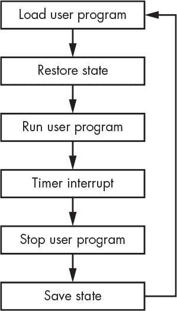

*图 5-8：一个简单的操作系统*

这里的操作系统使用定时器来告诉它何时在用户程序之间切换。这种调度技术叫做*时间切片*，因为它给每个程序分配了一个时间片来运行。用户程序的*状态*或*上下文*指的是寄存器的内容以及程序使用的任何内存，包括栈。

这可以工作，但速度相当慢。加载程序需要时间。如果能够根据空间允许将程序加载到内存中并保持在那里，效率会高得多，如图 5-9 所示。

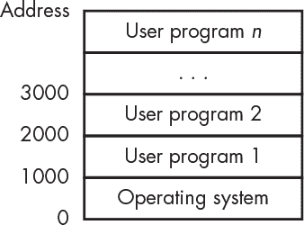

*图 5-9：内存中的多个程序*

在这个例子中，用户程序是一个接一个加载到内存中的。但是等一下，这怎么能工作呢？正如在“寻址模式”一节中解释的那样，在第 104 页，我们的示例计算机使用了*绝对寻址*，这意味着指令中的地址指向了特定的内存位置。运行一个期望位于地址 1000 的程序，在不同的地址（如 2000）上运行是行不通的。

一些计算机通过添加*索引寄存器*来解决这个问题（图 5-10）。这是一个寄存器，其内容会被加到地址中，形成*有效地址*。如果用户程序期望在地址 1000 上运行，操作系统可以在运行时将索引寄存器设置为 2000，然后在地址 3000 上运行它。


*图 5-10：一个索引寄存器*

解决这个问题的另一种方法是使用*相对寻址*——这与给你阿姨寄生日卡无关。指令中的地址不是相对于 0（大多数机器中的内存起始位置），而是相对于其指令的地址。回去查看表 4-4 和第 108 页的内容。你可以看到第二条指令包含地址 100（在二进制中为 110100）。使用相对寻址时，这将变为+99，因为该指令位于地址 1，而地址 100 距离它有 99 个地址。同样，最后一条指令是跳转到地址 4，使用相对寻址时，它将变成跳转到-8。这种操作在二进制中是噩梦般的，但现代语言工具为我们完成了所有的算术运算。相对寻址允许我们*重新定位*程序到内存中的任何位置。

### 内存管理单元

多任务已经从一种奢侈变成了基本需求，尤其是在一切都连接到互联网的今天，因为通信任务始终在*后台*运行——也就是说，它们在用户执行的任务之外。索引寄存器和相对寻址有所帮助，但它们远远不够。如果这些程序中的一个包含错误会发生什么呢？例如，如果用户程序 2（图 5-9）中的一个错误导致它覆盖了用户程序 1 中的某些内容——或者更糟糕的是，操作系统中的内容？如果有人故意写了一个程序来窃取或改变系统上运行的其他程序呢？我们非常希望将每个程序隔离开来，使这些情况变得不可能。为此，现代大多数微处理器都包含提供这种能力的*内存管理单元（MMU）*硬件。MMU 是非常复杂的硬件。

带有 MMU 的系统将*虚拟地址*和*物理地址*区分开来。MMU 将程序使用的虚拟地址转换为内存使用的物理地址，如图 5-11 所示。


*图 5-11：MMU 地址转换*

这与索引寄存器有什么不同呢？嗯，这里不仅仅是一个寄存器。而且 MMU 并不是地址的全部位宽。这里发生的事情是我们将虚拟地址分成两部分。下半部分与物理地址相同。上半部分通过一块称为*页表*的 RAM 进行*转换*，你可以在图 5-12 中看到一个示例。

在这个例子中，内存被划分为 256 字节的*页面*。页表的内容控制每个页面在物理内存中的实际位置。这使得我们可以将一个预期从地址 1000 开始的程序放置在地址 2000 或其他任何位置，只要它在*页边界*上对齐。而且，尽管虚拟地址空间对程序来说是连续的，它不需要映射到连续的物理内存页上。我们甚至可以在程序运行时将它移到物理内存的不同位置。通过将它们的虚拟地址空间的一部分映射到相同的物理内存，我们可以为一个或多个协作程序提供*共享内存*。请注意，页表的内容成为程序上下文的一部分。

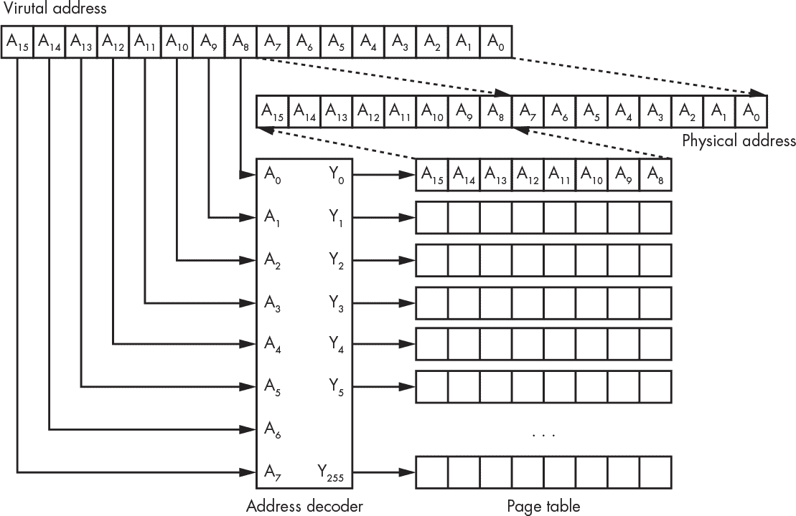

*图 5-12：16 位机器的简单页表*

现在，如果你一直在关注，你可能会注意到页表看起来就像一块内存。你是对的。而且你可能会期待我告诉你，这并没有那么简单。你又是对的。

我们的例子使用的是 16 位地址。如果我们有一台现代机器，使用 64 位地址会怎么样呢？如果我们将地址分成两部分，我们需要 4 GiB 的页表，而页大小也将是 4 GiB——这就不太有用了，因为那是许多系统所没有的内存。我们可以将页大小缩小，但那样会增加页表的大小。我们需要一种解决方案。

现代处理器中的 MMU 具有有限的页表大小。完整的*页表项*集保存在主内存中，或者如果内存不足，则保存在磁盘上。MMU 会根据需要将部分页表项加载到其页表中。

一些 MMU 设计在其页表中添加了更多的控制位，例如*不可执行位*。当这个位在某个页面上设置时，CPU 将不会执行该页面的指令。这可以防止程序执行它们自己的数据，这是一个安全风险。另一个常见的控制位是将页面设置为*只读*。

当程序尝试访问未映射到物理内存的地址时，MMU 会产生*页面错误*异常。这在某些情况下很有用，例如在堆栈溢出时。操作系统可以让 MMU 映射一些额外的内存来扩展堆栈空间，然后继续执行用户程序，而不是中止正在运行的程序。

MMU 使冯·诺依曼架构和哈佛架构之间的区分变得不那么重要。这样的系统具有冯·诺依曼架构的单一总线，但可以提供独立的指令和数据内存。

### 虚拟内存

操作系统管理竞争程序之间稀缺硬件资源的分配。例如，我们在图 5-8 中看到操作系统如何管理对 CPU 本身的访问。内存也是一种受管理的资源。操作系统使用 MMU 为用户程序提供*虚拟内存*。

我们之前看到，MMU 可以将程序的虚拟地址映射到物理内存。但虚拟内存不仅仅是这样。页面错误机制使得程序能够认为它们可以拥有任意数量的内存，即使超出了物理内存的容量。当请求的内存超出可用内存时，会发生什么？操作系统将不需要的内存页内容移动到更大但更慢的存储设备上，通常是磁盘。当程序尝试访问已被*换出*的内存时，操作系统会做出必要的操作以腾出空间，然后将请求的页面复制回来。这被称为*按需分页*。图 5-13 展示了一个虚拟内存系统，其中有一页已经被换出。

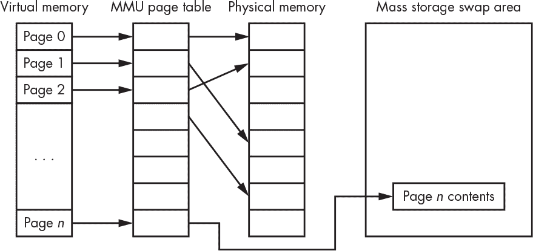

*图 5-13：虚拟内存*

当发生换页时，系统性能会受到较大影响，但这仍然比因为内存不足无法运行程序要好。虚拟内存系统采用了多种技巧来最小化性能损失。其中之一是*最久未使用（LRU）*算法，它跟踪页面的访问情况。最频繁使用的页面保留在物理内存中；最久未使用的页面被换出。

### 系统和用户空间

多任务系统让每个进程产生它是计算机上唯一运行程序的错觉。内存管理单元（MMU）通过为每个进程提供独立的地址空间，帮助营造这种错觉。但当涉及到 I/O 设备时，这种错觉就难以维持。例如，操作系统使用一个定时器设备来告诉它何时在图 5-8 中切换程序。操作系统决定将定时器设置为每秒中断一次，但如果某个用户程序将其更改为每小时中断一次，系统就无法按预期工作。同样，如果任何用户程序都能修改 MMU 的配置，MMU 就无法为程序之间提供有效的隔离。

许多 CPU 包括额外的硬件来解决这个问题。寄存器中有一个位，表示计算机是否处于*系统*模式或*用户*模式。某些指令，如处理 I/O 的指令，是*特权*指令，只能在系统模式下执行。特殊指令叫做*陷阱*或*系统调用*，它们允许用户模式程序向系统模式程序发出请求，即操作系统。

这种安排有几个优点。首先，它保护了操作系统免受用户程序的影响，并且也保护了用户程序不受彼此的干扰。其次，由于用户程序不能触及像 MMU 这样的某些内容，操作系统可以控制资源分配给程序。系统空间是处理硬件异常的地方。

你为手机、笔记本电脑或台式机编写的任何程序都会在用户空间运行。在你接触运行在系统空间的程序之前，你需要变得非常熟练。

### 内存层次结构与性能

曾几何时，CPU 和内存的工作速度相同，那时一切都是和平的。然而，CPU 变得越来越快，尽管内存也在加速，但它始终跟不上。计算机架构师们想出了各种技巧，确保那些快速的 CPU 不会因为等待内存而浪费时间。

虚拟内存和交换引入了*内存层次结构*的概念。尽管所有内存对用户程序来说看起来都是一样的，但背后发生的事情对系统性能有着巨大的影响。或者，用乔治·奥威尔的话来说，所有内存访问都是平等的，但有些内存访问比其他访问更平等。

计算机非常快。它们每秒可以执行数十亿条指令。但如果 CPU 必须等待指令到达，或者等待数据被检索或存储，那么几乎什么也做不成。

我们已经看到，处理器包含一些非常快速、昂贵的内存，称为寄存器。早期的计算机只有少量的寄存器，而一些现代机器则包含数百个寄存器。但总体来说，寄存器与内存的比例变得越来越小。处理器与*主内存*（通常是 DRAM）进行通信，而主内存的速度只有处理器的十分之一。大容量存储设备如磁盘驱动器的速度可能只有处理器的*百万分之一*。

让我们用一个食物类比来解释一下，感谢我的朋友 Clem 的贡献。寄存器就像冰箱：里面空间不大，但你可以很快找到内容。主内存就像一个超市：它有更多的存储空间，但去那儿需要一些时间。大容量存储就像一个仓库：它有更多的空间来存储东西，但距离远得多。

让我们继续发挥这个类比的作用。你经常去冰箱拿一样东西。而当你去超市时，你会填满几个购物袋。仓库通过卡车向商店供应物品。计算机也是如此。小块的东西在 CPU 和主内存之间传输。较大的块则在主内存和磁盘之间传输。想了解更多关于这一切是如何运作的幽默解释，可以看看 Jeff Berryman 的*分页游戏*。

跳过一些繁琐的细节，我们假设 CPU 的速度大约是主内存的 10 倍。这意味着大量时间被花在等待内存，因此额外的硬件（更快的片上内存）被添加进来，作为食品储藏室或*缓存*。它比超市小得多，但当运行在满处理器速度时，速度要快得多。

我们如何从超市填充食品储藏室呢？早在《随机存取存储器》第 82 页上，我们就看到 DRAM 在访问一行中的列时表现最佳。当你观察程序的运行方式时，你会发现它们会顺序访问内存位置，除非遇到分支。而程序使用的相当一部分数据通常是聚集在一起的。这一现象被利用来提升系统性能。CPU 的*内存控制器*硬件通过访问一行中的连续列来填充缓存，因为大多数情况下，数据是来自顺序位置的。与其拿一盒麦片，我们会把几盒一起装进袋子带回家。通过使用最高速的内存访问模式，CPU 通常能够领先一步，即使由于非顺序访问发生了缓存未命中的情况。*缓存未命中*并不是一场“错过缓存”选美大赛；它是指当 CPU 在缓存中查找某些内容而找不到时，必须从内存中获取。类似地，*缓存命中*是指当 CPU 在缓存中找到了它需要的东西。好东西也不能过多。

缓存内存有几个层级，它们距离 CPU 越远（即使在同一个芯片上），就越大越慢。这些被称为*L1*、*L2*和*L3*缓存，*L*代表*层级*。没错，这就像车库里的备用冰箱和储藏室一样。而且还有一个调度员，能够让空中交通管制相形见绌。还有一整套逻辑电路，负责打包和解包各种大小的购物袋、箱子和货车，确保这一切顺利运作。实际上，它占据了芯片相当大的一块面积。内存层次结构概述见图 5-14。

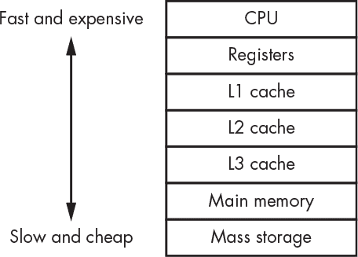

*图 5-14：内存层次结构*

一些额外的复杂调整进一步提高了性能。机器中包括*分支预测*电路，它通过猜测条件分支指令的结果，从而预先将正确的数据*预取*到内存和缓存中，做好准备。甚至还有电路处理*乱序执行*，允许 CPU 以最有效的顺序执行指令，即使这不是程序中指令出现的顺序。

维护*缓存一致性*是一个特别棘手的问题。想象一个包含两个处理器芯片的系统，每个芯片有四个核心。某个核心向内存位置写入数据——实际上是写入缓存，最终数据会进入内存。那么，另一个核心或处理器如何知道它从该内存位置获取的是数据的正确版本呢？最简单的方法叫做*直写（write through）*，即写入操作直接写入内存，不经过缓存。但这会消除缓存的许多好处，因此需要额外的缓存管理硬件，这些内容超出了本书的范围。

### 协处理器

处理器核心是一个相当复杂的电路单元。你可以通过将常见操作卸载到称为*协处理器*的简化硬件上，来释放处理器核心用于通用计算。过去，协处理器的存在是因为没有足够的空间将所有功能集成在一个芯片上。例如，当处理器本身没有空间容纳浮点指令硬件时，就会有浮点协处理器。今天，许多功能都有片上协处理器，包括专门的图形处理。

在本章中，我们讨论了将程序加载到内存中运行，通常意味着这些程序来自某些慢速且便宜的存储介质，比如磁盘驱动器。我们也看到，虚拟内存系统可能会在交换过程中从磁盘读取和写入数据。而在“块设备”一节中，我们在第 85 页看到，磁盘不是字节可寻址的——它们传输的是 512 字节或 4096 字节的块。这意味着在主内存和磁盘之间有大量的数据复制，而这项工作是直接的，因为不需要其他计算。将数据从一个地方复制到另一个地方是 CPU 时间的最大消耗之一。一些协处理器仅执行数据搬运操作，这些被称为*直接内存访问（DMA）*单元。它们可以配置为执行类似“把这些数据从这里移动到那里，等你完成后告诉我”的操作。CPU 将大量繁琐的工作卸载到 DMA 单元上，从而释放 CPU 去执行更有用的操作。

### 内存中的数据排列

我们从表 4-4 中的程序中学到，内存不仅用于存储指令，也用于存储数据。在这个例子中，数据是*静态*数据，意味着在编写程序时就已知所需的内存量。我们在本章前面看到，程序还使用内存来存储栈。这些数据区域需要在内存中进行合理安排，以避免它们发生冲突。

图 5-15 展示了没有 MMU 的冯·诺依曼和哈佛架构机器的典型安排。你可以看到，唯一的区别是哈佛架构机器中的指令存储在独立的内存中。

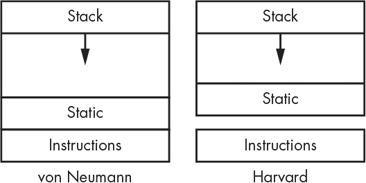

*图 5-15：内存安排*

程序使用内存的方式还有一种。大多数程序必须处理*动态*数据，这些数据的大小在程序运行之前是未知的。例如，一个即时通讯系统无法预先知道需要存储多少条消息，或者每条消息需要多少存储空间。动态数据通常被堆放在静态区域上方的内存中，称为*堆*，如图 5-16 所示。随着动态数据需要更多空间，堆会向上增长，而栈则向下增长。确保它们不发生碰撞是非常重要的。这里有一些小的变种；某些处理器会在内存的开始或结束处预留内存地址，用于中断向量和控制片上 I/O 设备的寄存器。

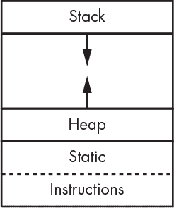

*图 5-16：带有堆的内存安排*

你会在使用微型计算机时看到这种内存布局，因为它们通常没有 MMU。若涉及 MMU，则指令、数据和栈会映射到不同的物理内存页中，这些页的大小可以根据需要进行调整。但同样的内存布局也用于呈现给程序的虚拟内存。

### 运行程序

你已经看到计算机程序包含了许多部分。在这一节中，你将学习它们是如何组合在一起的。

之前我提到过程序员使用函数来实现代码复用。这并不是故事的全部。实际上，有许多函数是多个程序都需要用到的——例如，比较两个文本字符串。如果我们能直接使用这些第三方函数，而不必每次都写自己的函数，那该多好。实现这一点的一种方法是将相关函数组合成*库*。目前有大量的库，涵盖了从字符串处理到复杂数学运算，再到 MP3 解码的各类需求。

除了库之外，复杂的程序通常是分块构建的。虽然你可以将整个程序放在一个文件中，但将其拆分成多个部分有几个很好的理由。最主要的原因是，这样可以更方便地让多人同时处理同一个程序。

但将程序分解意味着我们需要某种方式将不同的部分*链接*在一起。我们通过将每个程序部分处理成一种为此目的设计的中间格式，并运行一个特殊的*链接器*程序来实现这些连接。多年来，已经开发出许多中间文件格式。目前，*可执行和可链接格式（ELF）*是最流行的一种。这种格式包括类似于招聘广告的部分。在“出售”部分，可能会看到类似“我有一个名为`cube`的函数”的内容。同样，我们也可能在“需求”部分看到“我在寻找一个名为`date`的变量”。

链接器是一个*解析*所有广告的程序，最终生成一个可以实际运行的程序。当然，出于性能考虑，这里也有一些复杂的情况。过去，你会将库当作一个包含函数的文件，像其他文件一样将其链接到程序中。这种方式叫做*静态链接*。然而，在 1980 年代，大家注意到许多程序使用了相同的库。这很能证明这些库的价值。但它们也增加了每个使用它们的程序的大小，并且有许多库副本占用了宝贵的内存。于是出现了*共享库*。内存管理单元（MMU）可以用来让多个程序共享同一份库副本，如图 5-17 所示。

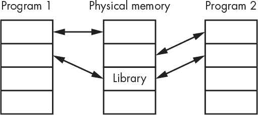

*图 5-17：共享库*

请记住，来自共享库的指令是多个程序共享的。库函数必须设计成使用调用程序的堆和栈。

程序有一个*入口点*，它是程序中第一条指令的地址。虽然这有些违反直觉，但这条指令并不是程序运行时首先执行的指令。当程序的各个部分链接形成*可执行文件*时，会包含一个额外的*运行时库*。这个库中的代码在到达入口点之前会先执行。

运行时库负责设置内存。这意味着要建立栈和堆。它还会为静态数据区域中的项目设置初始值。这些值存储在可执行文件中，必须在从系统获取内存后复制到静态数据区域。

运行时库执行更多的功能，尤其是对于复杂的语言。幸运的是，你现在不需要了解更多相关内容。

### 内存电力

到目前为止，我们是从性能角度来探讨内存的。但还有一个需要考虑的因素。内存中数据的移动需要消耗*电力*。对于桌面计算机来说，这并不是什么大问题。但对于移动设备来说，这是一个巨大的问题。尽管在像大型互联网公司使用的数据中心中，电池寿命不是问题，但在成千上万台机器上使用额外的电力会累积成一个大问题。

平衡功耗和性能是具有挑战性的。在编写代码时，要牢记这两者。

### 总结

你已经了解到，处理内存并不像你在阅读第四章时想象的那么简单。你已经感受到，为了提高内存使用效率，简单的处理器需要加入多少额外的复杂性。除了输入/输出（I/O）之外，你现在对现代计算机的构成有了相当完整的了解，而 I/O 是第六章的主题。
