## 第六章：通信中断**


计算机并不是为了纯粹的娱乐而进行计算的。它们从各种来源接收输入，进行计算，然后输出结果供各种设备使用。计算机可能在与人沟通、相互交流，或者运行工厂。让我们进一步探讨一下。

我在 “输入与输出” 中简要提到了输入和输出（I/O），指的是将数据传入和传出处理器核心。在这方面并不难；我们所需要的只是一些*锁存器*（参见 “锁存器” 在 第 71 页）用于输出，以及*三态缓冲器*（参见 图 2-38）用于输入。过去，每个 I/O 设备的每个方面都要连接到锁存器或缓冲器的某个位，而计算机则是负责控制每个“肢体”的木偶操纵者。

处理器成本的降低改变了这一点。许多以前复杂的 I/O 设备现在都包含了自己的微处理器。例如，你可以购买一个三轴加速度计或温度传感器，几美元就能得到一个不错的数字输出。我不会多谈这种设备，因为它们在编程角度上并不有趣——接口就是按照设备规格描述来读取和写入字节。但这并不意味着你可以完全置身事外。你可能会为一个集成处理器的设备编写代码。如果你正在设计一个下一个互联网连接的发刷，你可能会对它毛发般复杂的控制算法感到头疼。

本章探讨了与一些仍然在编程角度上有趣的 I/O 设备进行交互的技术。它还涵盖了*采样*，因为这是将现实世界的模拟数据转换为计算机可用的数字形式，反之亦然。

### 低级 I/O

最简单的 I/O 形式涉及将设备连接到 CPU 可以读取和写入的位。当这些形式被广泛使用时，它们开始发展为更复杂的设备。本节将探讨几个例子。

#### *I/O 端口*

让计算机与其他设备进行通信的最简单方法是将它连接到 I/O*端口*。例如，Atmel 生产 AVR 系列小型处理器，它们包括大量内建的 I/O 设备。在图 6-1 中，我们将一些设备连接到*B 端口*。

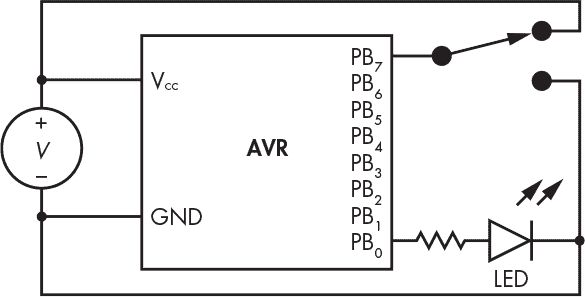

*图 6-1：端口 B 上的灯光和开关*

你应该从图 6-1 中认出这个开关，它来自第二章。*LED*是发光二极管。*二极管*是一种半导体设备，它像游乐园的旋转门一样，只允许电流朝一个方向流动，方向由空心箭头指示。LED 有一个很好的副作用，就是它们会发光。

请注意，与 LED 串联的电阻器。它的作用是限制通过 LED 的电流，以防止 LED 或 PB[0] 被烧坏。你可以使用欧姆定律来计算电阻值，欧姆定律在第二章中介绍。假设*V*为 5 伏特。正如在第 51 页中提到的“晶体管”一节，硅三明治的特点之一是其电压降为 0.7 伏特。AVR 处理器的数据表指出，当*V*为 5 伏特时，逻辑 1 的输出电压为 4.2 伏特。我们希望将电流限制为 10 毫安（0.01 安），因为这是 LED 所期望的；而 AVR 能承受的最大电流为 20 毫安。根据欧姆定律，电阻等于电压除以电流，因此（4.2 – 0.7）÷ 0.01 = 350Ω。正如你所见，PB[7] 可以在 0 和 1 的电压之间切换。当 PB[0] 设置为 0 时，不会有电流流过；而当 PB[0] 设置为 1 时，电流流经 LED，使其发光。确保你阅读所有使用的 LED 或其他组件的数据表，因为电压降等特性可能会有所不同。

Port B 由三个寄存器控制，如图 6-2 所示。*DDRB* 是数据方向寄存器，用于确定每个引脚是输入还是输出。*PORTB* 是一个锁存器，用于保持输出数据。*PINB* 用于读取引脚的值。

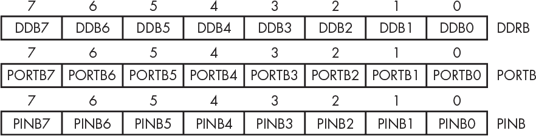

*图 6-2：AVR PORTB 寄存器*

这看起来可能很复杂，但正如你在图 6-3 中看到的，它只是我们标准构建模块的另一种组合：解复用器、触发器和三态缓冲器。

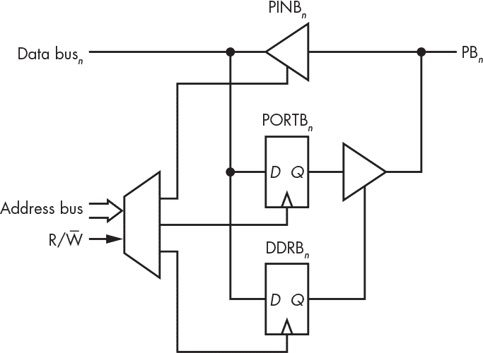

*图 6-3：AVR Port B 构造*

DDRB 是 Port B 的数据方向寄存器。将任何位设置为 1 会将相关引脚设置为输出；如果设置为 0，则为输入。PORTB 是端口的输出部分。向任何位写入 0 或 1 会将相关输出设置为低电压或高电压。读取 PINB 可提供相关引脚的状态，因此，如果引脚 6 和 0 被拉高，其余引脚被拉低，则读取值为 01000001，或 0x41。

正如你所见，将数据输入和输出到芯片是相当简单的。你可以通过查看 PINB[7] 来读取开关的状态，该值存在于 PINB 寄存器中。你可以通过写入 PORTB[0] 来控制 LED 的开关。你甚至可以编写一个简单的程序，让 LED 闪烁，以便你和你所有的朋友享受永久的娱乐。

#### *按我的按钮*

很多设备都有某种按钮或开关。它们并不像你想象的那样容易被计算机读取，这与它们的设计方式有关。一个简单的按钮由一对电接触和一块金属组成，当按钮被按下时，金属连接两者。请看看图 6-4 中的电路。

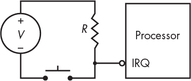

*图 6-4：简单的按钮电路*

*R* 是所谓的*上拉*电阻，就像我们之前在图 2-37 中看到的那样。当按钮没有被按下时，电阻将处理器的*中断请求（IRQ）*引脚上的电压拉升至由*V*提供的电压，使其成为逻辑 1。当按钮被按下时，电阻限制来自*V*的电流，防止烧坏，从而将逻辑 0 呈现给 IRQ。

看起来很简单，但图 6-5 显示事实并非如此。你可能认为，当你按下并释放按钮时，IRQ 上的信号应该像左边的图那样，但实际上它更像右边的图。

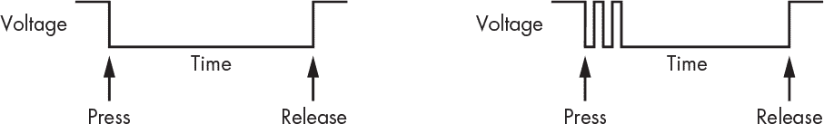

*图 6-5：按钮弹跳*

这里发生了什么？当连接到按钮的金属片接触到触点时，它会*弹跳*并从触点上弹开一小段时间。它可能会弹跳几次才稳定下来。由于我们将按钮连接到了处理器的中断生成引脚，因此一次按钮按下可能会触发多个中断，这可能不是我们想要的。我们需要对按钮进行*去抖动*。（你可以购买无弹跳的按钮，但它们通常更贵。）

一种简单的去抖动方法是让中断处理程序设置一个定时器，然后在定时器到期后测试按钮的状态，如图 6-6 所示。我们可以通过两种不同的方式来实现：在第一次中断时设置定时器，或者在每次中断时用一个新的定时器替代现有的定时器。

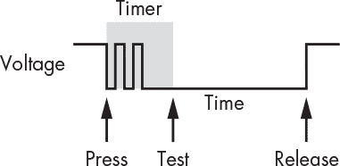

*图 6-6：按钮去抖动定时器*

这种方法有效，但不一定是最佳的。选择定时器值很难，因为按钮的弹跳时间会随着时间的推移由于机械磨损而变化。你可能曾经遇到过令人讨厌的闹钟，按钮磨损到设置时间变得非常困难。而且，大多数设备有多个按钮，处理器不太可能有足够的中断引脚可用。我们可以设计电路共享中断，但我们更倾向于通过软件以较低成本实现。大多数系统都有某种定时器，可以生成周期性的中断。我们可以利用这个中断来进行按钮的去抖动。

假设我们有八个按钮连接到某个 I/O 端口，就像我们在图 6-1 中看到的那样，并且 I/O 端口的状态保存在一个名为`INB`的变量中，它是一个 8 位的`unsigned char`。我们可以用一个数组构造一个*有限脉冲响应（FIR）*滤波器，如图 6-7 所示。FIR 是一个队列；每当定时器时钟滴答时，我们丢弃最旧的元素，并将一个新的元素移入队列。我们将数组元素做“或”运算，形成`current`状态作为双元素队列的一部分；在计算新的`current`之前，`current`会被移到`previous`。现在，我们只需要对`current`和`previous`状态做异或运算，以找出哪些按钮的状态发生了变化。

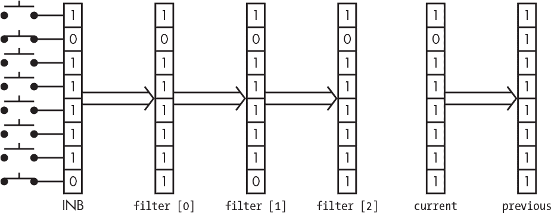

*图 6-7：FIR 滤波器按钮去抖动器*

这段代码非常简单，如 C 语言中的清单 6-1 所示。

```
unsigned char   filter[FILTER_SIZE];

unsigned char   changed;

unsigned char   current;

unsigned char   previous;

previous = current;

current = 0;

for (int i = FILTER_SIZE - 1; i > 0; i--) {

        filter[i] = filter[i - 1];

        current |= filter[i];

}

filter[0] = INB;

current |= filter[0];

changed = current ^ previous;
```

*清单 6-1：FIR 按钮去抖动器*

`FILTER_SIZE`是滤波器中元素的数量，选择这个值时要考虑按钮的噪声大小和定时器中断的频率。

#### *让灯光亮起*

很多小部件都配有某种显示器。我指的不是计算机屏幕那类设备，而是像闹钟和洗碗机这种东西。通常会有几个指示灯，也许还会有一些简单的数字显示。

一种常见的简单指示器是图 6-8 中显示的七段显示器。这些显示器有七个 LED，按 8 字形排列，可能还包括一个额外的小数点。

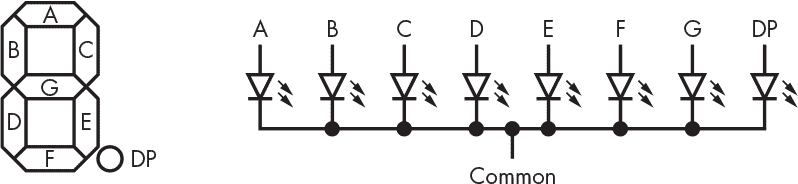

*图 6-8：七段显示器*

一个显示器中的八个 LED 需要 16 个电气连接（引脚）。但通常它们并不是这样构造的；每个 LED 有一个引脚连接在一端，另一端有一个公共连接。由于我们只需要控制一端来开关 LED，因此这个公共连接节省了引脚，降低了成本。图 6-8 显示了一个*共阴极*显示器，其中所有阴极连接在一起，阳极则各自有单独的引脚。

我们可以将阳极直接连接到处理器的输出引脚，将阴极连接到*地*或电源的负端，或者*电源*。如果引脚上有高电压（1），则相应的 LED 会亮起。实际上，大多数处理器提供的电流不足以直接驱动 LED，所以需要额外的驱动电路。通常使用开漏输出（如图 2-36 中所示）。

驱动这些显示器的软件非常简单。我们只需要一个表格，将数字（或许还包括字母）映射到适当的段上来点亮它们。不过，事情并不总是这么简单，通常我们不会只有一个显示器。例如，一个闹钟就有四个显示器。虽然我们可以将每个显示器连接到自己的 I/O 端口，但这种端口数量通常不够。解决方法是通过连接阳极到端口 A、阴极到端口 B 来对显示器进行*多路复用*，如图 6-9 所示。

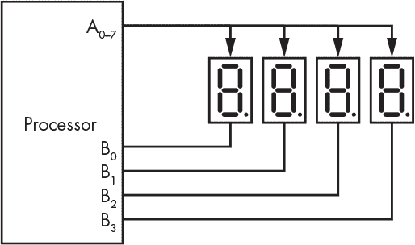

*图 6-9：多路复用显示器*

显示器的阳极是并联接线的；所有 A 段连接在一起，所有 B 段连接在一起，以此类推。每个显示器的阴极连接到它自己的输出引脚。只有当一个显示段的阳极为 1 且阴极为 0 时，该显示段才能点亮。你可能会好奇，例如，如果 A 为 1 而 B 为 0，为什么 A 段和 B 段不会点亮？请记住，*LED*中的*D*代表*二极管*，二极管是电流的单向通道。

我们利用人眼的*视觉持久性*来让显示屏工作。显示屏并不需要一直亮着才能让我们感觉它在亮。我们的眼睛和大脑会告诉我们，当显示屏亮起时间短至 1/24 秒时，我们已经感知到它亮了。这和电影和视频的原理是一样的。我们所要做的，就是通过将相关的阴极引脚设置为 0，并将段阳极设置为我们想要显示的内容来切换显示屏。我们可以像在之前的按键示例中那样，在定时器中断处理程序中切换显示屏。

#### *灯光，行动，。。。*

设备通常包括按钮和显示屏。事实证明，我们可以通过多路复用按钮和显示屏来节省一些引脚。假设除了四个显示屏外，我们还有一个 12 键电话式键盘，如图 6-10 所示。

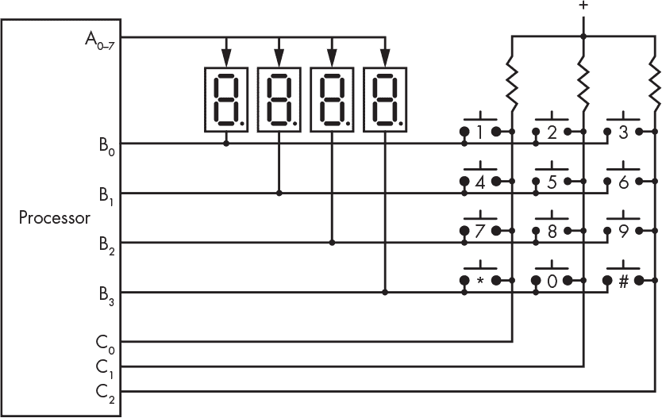

*图 6-10：多路复用按钮和显示屏*

我们通过所有这些复杂性取得了什么成就？我们只需为 12 个按键额外使用三个引脚，而不是 12 个引脚。所有的按键都通过上拉电阻拉至逻辑 1。当没有选择显示屏时，按下按钮不会有任何效果，因为 B 输出也是全为 1。当选择最左边的显示屏时，B[0]为低，按下上排的任何按钮都会使相应的 C 输入变为低，依此类推。由于显示屏和按键是通过相同的信号集合进行扫描的，进行扫描的代码可以与定时器中断处理程序结合。

请注意，图 6-10 是一个简化的图示。实际上，B 引脚需要是开集电极或*开漏*（参见 “输出变化” 第 58 页）设备；否则，如果按下了位于不同排但同一列的两个按钮，我们将把 1 和 0 连接在一起，这可能会损坏部件。不过，通常不会以这种方式实现，因为前面提到的显示驱动电路会为我们处理这个问题。

你可以通过同时按下多个按钮并观察显示屏，来判断某个设备是否采用了类似于图 6-10 的结构。显示屏会显得很奇怪。思考一下为什么会这样。

#### *亮点创意*

你的闹钟可能有显示屏亮度调节功能。那是如何工作的呢？通过调节显示屏的*占空比*，如图 6-11 所示。


*图 6-11：占空比*

在图 6-11 的左侧部分，每个显示器每次亮起四分之一的时间。右侧部分则显示每个显示器每次亮起八分之一的时间；没有显示器每次亮起一半的时间。结果是，右侧的显示器看起来大约只有左侧的一半亮度。“亮度”与显示器开启的平均时间有关。请注意，占空比与感知亮度之间的关系可能并非线性。

#### *2^n 种灰度*

一个常见的传感器任务是确定旋转轴的位置——比如电动机、车轮和旋钮。我们可以通过轴上的开关或通过黑白相间的点，利用光电传感器读取这些点，来确定位置。不管我们采用哪种方法，我们都会将每个轴的位置编码为一个二进制数。如果我们关心八个不同的位置，编码器可能像图 6-12 那样。如果白色区域是 0，黑色区域是 1，那么你就能理解如何读取位置值。径向线并不是编码器的一部分，它们只是为了让图示更易理解。


*图 6-12：二进制旋转编码器*

像往常一样，这看起来很简单，但实际上并不如此。在这个例子中，问题出在机械公差上。即使编码器对准得非常完美，我们仍然会遇到由于电路在读取每一位时传播延迟差异而产生的问题。如果编码器没有完美对准，就像在图 6-13 中那样，会发生什么情况？

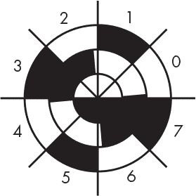

*图 6-13：二进制旋转编码器对准误差*

我们本来期望读取 01234567，但实际上得到的是 201023645467。美国物理学家弗兰克·格雷（Frank Gray，1887–1969）在贝尔电话实验室研究了这个问题，提出了一种不同的编码方式，其中每个位置只有一个位的值发生变化。对于我们正在查看的 3 位编码器，名字命名为*格雷码*，其顺序是 000、001、011、010、110、111、101、100。这个编码可以通过一个小表格轻松转换为二进制。图 6-14 展示了我们编码器轮盘的格雷码版本。

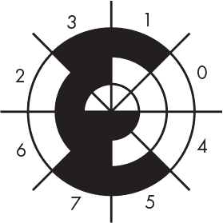

*图 6-14：格雷码旋转编码器*

#### *正交编码*

在不需要知道物体的绝对位置，而只需要知道位置何时变化以及变化方向时，我们可以使用 2 位格雷码的变体。你车上的一些旋钮，比如音响的音量控制，可能就采用这种方式。如果你在熄火时转动旋钮，启动后却没有任何效果，那是一个很好的指示。这个变体叫做*正交编码*，因为它有四个状态。2 位格雷码模式会重复多次。例如，有些便宜的正交编码器可以精确到 1/4,096 转。正交编码只需要两个传感器，每个位一个。一个绝对位置为 4,096 的编码器需要 12 个传感器。

正交波形如 图 6-15 所示。

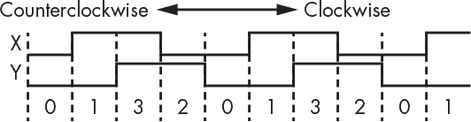

*图 6-15：正交波形*

如你所见，当轴顺时针旋转时，产生的序列为 0132；逆时针旋转则产生 2310。我们可以通过当前位置信息和前一位置组合形成一个 4 位数字，这个数字告诉我们旋转的方向，如 表 6-1 所示。

**表 6-1：正交旋转检测**

| **当前** | **先前** | **组合** | **意义** |
| --- | --- | --- | --- |
| `00` | `00` | 0 | 非法 |
| `00` | `01` | 1 | 顺时针 |
| `00` | `10` | 2 | 逆时针 |
| `00` | `11` | 3 | 非法 |
| `01` | `00` | 4 | 逆时针 |
| `01` | `01` | 5 | 非法 |
| `01` | `10` | 6 | 非法 |
| `01` | `11` | 7 | 顺时针 |
| `10` | `00` | 8 | 顺时针 |
| `10` | `01` | 9 | 非法 |
| `10` | `10` | a | 非法 |
| `10` | `11` | b | 逆时针 |
| `11` | `00` | c | 非法 |
| `11` | `01` | d | 逆时针 |
| `11` | `10` | e | 顺时针 |
| `11` | `11` | f | 非法 |

请注意，这是一个状态机，其中组合值表示状态。

当你拿一对正交编码器，将它们相互旋转 90 度，并在中间放入一个橡胶球时，结果是什么？一只计算机鼠标。

#### *并行通信*

并行通信是我们之前在点亮 LED 时看到的功能的扩展。我们可以将八个 LED 连接到 B 端口，闪烁 ASCII 字符编码。*并行* 意味着我们为每个组件都有一根电缆，并可以同时控制它们。

如果你的电脑是旧款，可能配有 IEEE 1284 *并行端口*。在 *通用串行总线（USB）* 出现之前，这些端口通常用于打印机和扫描仪。没错，并行端口上有八条数据线，这样你就可以发送 ASCII 字符编码。

然而，这一切存在一个问题：你如何知道数据是否有效？假设你发送字符 *ABC*。你怎么知道它什么时候是下一个字符？你不能仅仅通过变化来判断，因为可能是 *AABC*。一种方法是使用另一个“看着我”的信号。IEEE 1284 就有一个 *触发* 信号用于此目的。在 图 6-16 中，当触发信号为低或 0 时，位 0 到 7 上的数据是有效的。

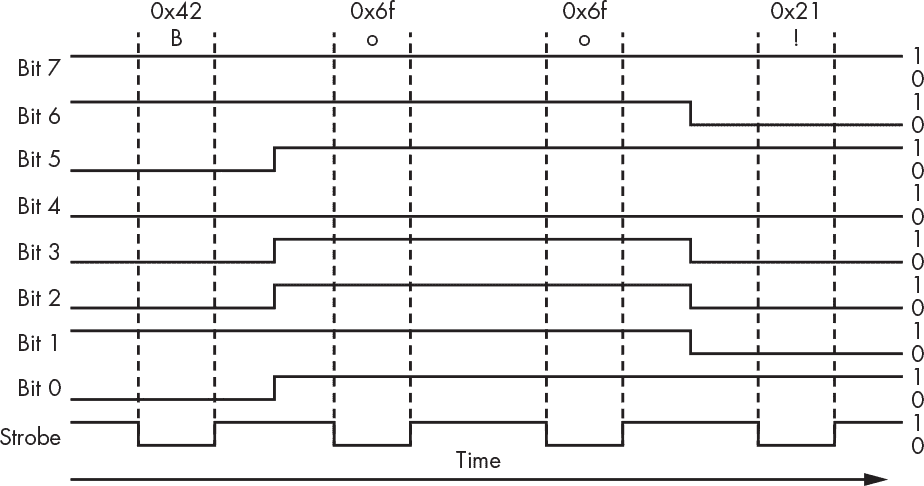

*图 6-16：并行数据触发时序*

另一个已经基本被淘汰的并行接口是 *IDE*。它用于与较旧的磁盘驱动器进行通信。

并行接口成本较高，因为它们需要许多 I/O 引脚、连接器引脚和电缆。并行端口有一个 25 针连接器和一条粗大的电缆。IDE 有 40 根电缆。信号传输的速度是有限的，超过这个速度时，就需要多条电缆。

#### *串行通信*

能够使用更少的电缆进行通信会很不错，因为电缆是需要花费金钱的，尤其是在长距离通信时，成本更高。两根电缆是最少需要的数量，因为我们需要一个电流的返回信号路径，正如你在第二章中学到的那样。为了简便起见，我们在图示中不会展示这个返回路径。

我们如何通过一根电缆传送八个信号呢？我们可以通过查看图 6-16 中的时序图来获得一些线索。即使每个比特都有自己的电缆，字符之间仍然是按时间间隔排列的。我们也可以按时间间隔发送这些比特。

我在“Shiftiness”一文中讲到过移位寄存器，在第 99 页中有详细介绍。在发送端，时钟信号将所有位向右移动一位，并将溢出端的位发送到线路上。在接收端，时钟信号将所有位向右移动一位，并将数据线的状态放入新的空位中，如图 6-17 所示。

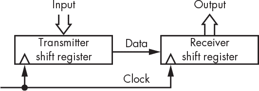

*图 6-17：使用移位寄存器的串行通信*

我们会使用一个计数器来告诉我们何时到达 8 位，然后我们就可以处理这个值。这个方法需要两根电缆，而不是一根，并且容易出错。它要求发送端和接收端必须同步，或称*同步*——这与男孩乐队无关。只要错过一个时钟信号，所有信息就会乱掉。我们可以增加第三根电缆，表示我们何时开始传送一个新的字符，但我们的目标是尽量减少电缆数量。

很久以前（20 世纪初），电报与打字机结合，形成了*电传打字机*，这是一种能够将打字内容传送到远距离打印机的设备。电传打字机最初被用于通过电报线路发送股市信息。

数据是通过一种串行*协议*（一套规则）发送的，它仅使用一根电缆，外加返回路径。这种协议的巧妙之处在于，它的工作方式类似于游泳比赛中的计时器。每个人在起跑枪响时启动自己的计时器，并且它们足够接近，所以能够正常工作。图 6-18 展示了这一协议。


*图 6-18：标志-空白信号*

在这里，当没有任何事情发生时，线路处于 1 或*高*电平状态。高电平状态叫做*标记*，低电平状态叫做*空格*，这个名称源自早期电报设备，它们通过在纸带上留下标记或空白来表示信息。图 6-18 中，线路降到低电平就是启动信号，它被称为*起始位*。在起始位之后，发送 8 个数据位。字符以一对高电平的*停止位*结束。每个位都分配了相同的时间。可能会发生同步错误，但发射端只需保持静默一个*字符时间*，接收端就会重新同步。我们在划分时间，使每个位都有一个时间槽，然后将数据复用到单根线上。这种技术叫做*时分复用*，它可以使用选择器（参见“构建选择器”第 65 页）而非移位寄存器来实现。顺便提一下，位每秒的传输速率被称为*波特率*，以法国工程师埃米尔·波多（Émile Baudot，1845–1903）的名字命名。

电传打字机是很棒的机器。它们不包含任何电子元件，通过一个马达转动轴来工作。当开始位到来时，一个电磁铁释放了轴，使其能够旋转。在旋转的每一个位置，所有的凸轮、杠杆和推杆会运动，最终将一个金属字符击打到有墨带的色带上，然后转印到纸上。当东西开始从架子上发出叮当声时，你就知道有信息正在传入。键盘的工作方式也类似。按下一个键会启动一个轴的旋转，这个旋转会根据按下的键位，移动一个电接点，生成一个 ASCII 码。

另一个酷的技巧叫做*半双工*连接，其中每端的发射器和接收器共享同一根电缆。每次只能一个设备传输，否则会出现乱码。这就是无线电操作员说“完毕”的原因。如果你曾经使用过对讲机，你一定了解半双工通信。当多个发射器同时处于工作状态时，会发生*冲突*，导致数据混乱。*全双工*连接则是当有两根电缆时，每根电缆分别传输不同方向的数据。

实现这一切的电路最终被集成到一个名为*UART*的集成电路中，*UART*代表的是*通用异步接收发送器*。软件也可以通过一种叫做*位碰撞*的方法来实现 UART。

一个名为 RS-232 的标准定义了旧串行端口上用于标记和空格的电压水平，以及许多附加的控制信号。它现在几乎已被 USB 替代，尽管一种叫做*RS-485*的变种（使用差分信号传输，参见图 2-32，以增强抗干扰能力）在工业环境中仍在使用。并行的 IDE 硬盘接口已经被* SATA*，串行接口所取代。如今，电子设备的速度足够快，许多以前需要并行处理的任务现在可以串行处理。此外，电线仍然很贵。世界上从地球中提取的铜资源正在减少，而铜是电线中的导体材料。回收现有的铜产品现在成为了铜的主要来源。芯片大多数是硅制的，硅存在于沙子中，资源非常丰富。

有许多串行接口用于将外设连接到小型微型计算机。这些接口包括*SPI*、*I2C*、*TWI* 和 *OneWire*。

#### *捕捉波浪*

标记-空格信号传输存在一个大问题，那就是它不适合用于长距离通信。它无法通过电话线传输，这个原因超出了本书的讨论范围。这是一个大问题，因为一旦电报被更好的技术所替代，唯一剩下的远程通信技术就是电话和无线电。这一标记-空格信号传输问题通过与无线电相同的技巧得以解决。

宇宙中包含各种不同的波。海洋中有波浪，声波，光波，微波，以及所有其他介于其中的东西。基本的波是*正弦波*。所有其他的波形都可以通过正弦波的组合来构造。你可以通过绘制圆上某一点的高度与角度的关系来得到正弦波。它看起来像图 6-19。

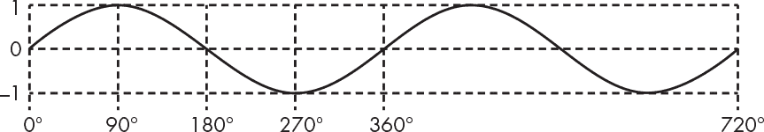

*图 6-19：正弦波*

正弦波的高度是*振幅*。每秒钟同向零交叉的次数是*频率*，单位为*赫兹*，以德国物理学家海因里希·赫兹（Heinrich Hertz，1857–1894）命名。赫兹的缩写是*Hz*，它与*每秒周期数*同义。两个同向零交叉之间的距离是*波长*。它们之间的关系如下：

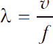

在这个方程中，λ是波长，单位为米，*f*是频率，单位为赫兹（Hertz），*v*是波在介质中的传播速度。对于无线电波来说，速度就是光速。频率越高，波长越短。作为参考点，中音 C 大约是 261 Hz。

如果你停下来思考一下，你会意识到不同的波具有不同的特性。声波传播的距离不远，且在真空中无法传播，但它能绕过障碍物。光波可以传播很远，但会被墙壁阻挡。某些频率的无线电波能穿透墙壁，而其他频率则无法。介于它们之间，有很多不同的变化。

是时候冲浪了。让我们找到一波符合我们需求的浪，并搭乘它。我们将这波浪称为*载波*，而我们想要做的就是基于我们关心的信号，如标记-空白*波形*，对其进行*调制*或改变。

AT&T 在 1960 年代初推出了 Bell 103A 数据集。它通过四个音频频率，在电话线上提供了高达 300 Baud 的全双工通信；每端连接都有自己的一对标记和空白音调。这就是*频移键控（FSK）*，因为频率随着标记和空白而变化。你可以在图 6-20 中看到它。

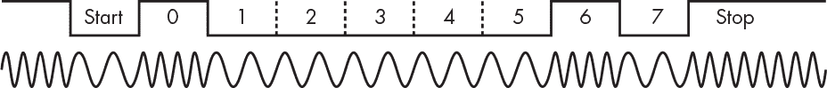

*图 6-20：频移键控——ASCII 字母 A*

接收端必须将音频转回标记和空白，这个过程叫做*解调*，是调制的反向过程。执行这一操作的设备叫做*调制解调器*。你在电影里看到某人用拨号上网或者发送传真时听到的奇怪噪音，就是调制解调器使用的频率。

#### *Universal Serial Bus*

USB 本身可能不太引人注目，但值得一提的是它如此普遍。它比任何其他标准都拥有更多不兼容和难以使用的连接器，而且可以说它在设备充电方面比在数据传输方面更为重要。

USB 替代了 1990 年代中期计算机上大量增长的笨重连接器，如 PS/2、RS-232 和并行端口，采用了一个四线连接器。这个连接器有两根电源线和一对扭曲的传输数据线，用于差分信号。USB 重复了我们很快就会看到的“不能止步于此”的模式，所以现在的 USB Type-C 已经有 24 根线，接近旧版并行端口的水平。

USB 不是一个完全开放的系统。它有一个*控制器*，负责管理所有的*端点*，与每个设备拥有平等地位不同。数据传输是有结构的；它不仅仅是将未解释的比特数据随意传输。它使用了一种常见的技术：数据以*数据包*的形式传输，这些数据包就像通过邮件发送的包裹一样。数据包包含一个*头部*和可选的*有效载荷*。头部本质上是你在包裹外面看到的信息——它来自哪里，要去哪里，邮寄类别等等。有效载荷是包裹的内容。

USB 通过*同步传输*处理音频和视频。一个端点可以请求保留一定量的*带宽*（数据传输速率），从而保证数据可以被传输。如果带宽不足，控制器会拒绝该请求。

### 网络

如果不了解现代网络的起源，就很难清楚地看到它的全貌。每当我女儿说“Wi-Fi 坏了”或者“互联网不能用了”时，我就觉得很疯狂，因为它们根本不是同一回事。尝试向她解释这些差异时，总是会收到她标志性的青少年翻白眼和甩头反应。

描述网络时，通常使用两种分类。一种是*局域网（LAN）*，它覆盖一个小的地理区域，如家庭或办公室。另一种是*广域网（WAN）*，它覆盖较大的地理区域。这些术语有些模糊，因为*小*和*大*没有精确的定义。

最初的网络是电报网络，后来发展成电话网络。它最初并不是一个计算机网络，因为在那时计算机并不存在。最初的电话网络是一个*电路交换*网络。当两方之间拨打电话时，它们的电线实际上连接在一起，形成一个电路。之所以称其为*交换*，是因为这种连接只存在于通话期间。一旦通话结束，新的电路就可以被建立。

除少数例外（如剩余的固定电话线路）外，电话系统现在是一个*分组交换*网络。我在上一节提到过分组。通信被分割成包含发送方和接收方地址的分组。通过时分复用（在《串行通信》中第 152 页有详细介绍），分组可以共享电线，从而更有效地使用电路；这一切在可以通过电线发送的数据量超过仅仅为语音服务所需的量时才成为可能。

最早的计算机网络之一是*半自动地面环境（SAGE）*的一部分，这是冷战时期的防御系统。它使用电话网络上的调制解调器进行站点间的通信。

许多组织在 20 世纪 60 年代末开始尝试局域网。例如，我在贝尔实验室的实验室正在开发图形终端，这些终端通过一种叫做*环网*（ring）的局域网连接到我们部门的 Honeywell DDP-516 计算机。当时，外部设备如磁带驱动器和打印机非常昂贵，大多数部门并没有自己的外设。但这些设备在主计算机中心是有的。我们的计算机通过调制解调器连接，当它需要的东西在本地没有时，它就会拨打计算机中心的电话。它实际上是一个广域网（WAN）。我们不仅可以将东西发送去打印，还可以发送程序让计算机中心运行，计算机中心会把结果通过回拨传送给我们。

类似的活动正在许多研究实验室和公司中进行。许多不同的局域网（LAN）被发明出来。尽管每个局域网都是一个独立的私有宇宙，但它们无法相互通信。调制解调器和电话线构成了广域通信的基础。

贝尔实验室开发的一套计算机程序称为*UUCP*（即*UNIX 到 UNIX 复制*），于 1979 年发布到外部世界。UUCP 允许计算机彼此呼叫，以传输数据或远程运行程序。它为早期的电子邮件和新闻系统（如 USENET）奠定了基础。这些系统是一个有趣的黑客手段。如果你想将数据发送到全国范围，它将从一台机器跳到另一台机器，直到到达目的地。这通常能避免长途电话费用。

与此同时，美国国防部的高级研究计划局（ARPA）资助了 ARPANET 的开发，ARPANET 是一个分组交换广域网（WAN）。ARPANET 在 1990 年代发展成了互联网。如今，大多数人认为互联网是理所当然的，像我的女儿一样，他们可能认为它与网络就是同义词。但它的真正性质正如名字所示。它是*inter*和*net*的缩写。互联网是一个网络的网络——它是连接局域网（LAN）的广域网（WAN）。

#### *现代局域网（LAN）*

许多我们今天认为理所当然的东西，都是在 1970 年代中期的施乐帕洛阿尔托研究中心（PARC）发明的。例如，一位名叫 Bob Metcalfe 的美国电气工程师发明了*以太网*，它是一个局域网（LAN），因为它并不设计用于长距离传输。

**注意**

*查看阿黛尔·戈德堡的书籍*《个人工作站的历史》（*Addison-Wesley, 1988*），了解更多有关 PARC 历史的信息。

最初的以太网是一个半双工系统。每台计算机都连接到同一根电缆上。每台计算机的网络接口都有一个唯一的 48 位地址，称为*媒体访问控制（MAC）*地址，这一点至今依然如此。数据被组织成数据包，称为*帧*，大约为 1,500 字节。帧有一个*头部*，其中包括发送者地址、接收者地址，以及一些错误检测（例如，“错误检测与纠正”一节在第 88 页讨论的循环冗余校验（CRC））以及数据有效负载。

通常，一台计算机会发话，其他计算机会监听。那些与接收者 MAC 地址不匹配的计算机会忽略数据。每台计算机都在监听发生的事情，并且如果有其他计算机正在传输，它不会发射数据。当计算机同时开始传输时，碰撞会导致数据包损坏，就像之前描述的半双工碰撞一样。Metcalfe 使用了*随机回退重试*，这是一项由 ALOHA 网络首创的创新技术，ALOHA 网络是夏威夷大学开发的一个分组交换无线网络。每台尝试发话的计算机会等待一段随机时间，然后再尝试重新发送。

以太网至今仍在使用，不过不是半双工版本。现在，机器连接到*路由器*，路由器跟踪每台机器的位置，并将数据包路由到正确的位置。碰撞问题已经不再发生。Wi-Fi 本质上是以太网的一个版本，它使用无线电而非电缆。蓝牙是另一种流行的局域网系统。可以把它看作是去除了电缆而使用无线电的 USB 版本。

#### *互联网*

如你所知，互联网其实并不是一个物理网络；它是由一组层次化的协议组成。其设计方式使得指定物理网络的下层可以在不影响上层的情况下被替换。这种设计使得互联网可以通过电线、无线电、光纤以及未来的新技术运行。

##### TCP/IP

*传输控制协议/互联网协议 (TCP/IP)* 是互联网的基础协议对。IP 负责将数据包从一个地方传送到另一个地方。这些数据包被称为*数据报*，就像是计算机的电报。与真实的电报一样，发送方并不知道接收方是否在某个时刻收到消息。TCP 建立在 IP 之上，确保数据包能够可靠地传送。这是一项相当复杂的工作，因为大的消息需要通过多个数据包传输，而这些数据包可能不会按顺序到达，因为它们可能走了不同的路径——这就像你订购物品，货物被分装成多个箱子，可能不会在同一天到达，甚至可能通过不同的运输公司送达。

##### IP 地址

每台计算机在互联网上都有一个唯一的地址，称为*IP 地址*。与 MAC 地址不同，IP 地址不与硬件绑定，可以更改。IP 地址系统是一个层次化的系统，某人分配出一块地址，接着再有人分配一块地址，依此类推，直到最后给到你的设备分配地址。

互联网几乎完全依赖于*IPv4*，即 IP 的第 4 版，使用 32 位地址。地址以*八位字节*表示，格式为*xxx.xxx.xxx.xxx*，其中每个*xxx*表示 32 位中的 8 位，以十进制形式表示。这意味着有超过 40 亿个地址，但这还不够。现在每个人都有一个桌面电脑、笔记本电脑、平板电脑、手机和其他设备的地址，但地址已经用完了。因此，全球正在慢慢过渡到*IPv6*，它有 128 位的地址。

##### 域名系统

如果你的地址可以变化，怎么找到你呢？这个问题由*域名系统 (DNS)* 解决，它就像是一本电话簿，给那些还记得电话簿的人。DNS 将名字映射到地址。它知道*whitehouse.gov*的 IP 地址是 23.1.225.229，在我写这篇文章时就是这个地址。它有点像你手机里的通讯录，只不过你需要保持更新；而 DNS 会在任何人更换地址时自动处理这一切。

##### 万维网

许多其他协议都是建立在 TCP/IP 之上的，比如使电子邮件工作的*简单邮件传输协议（SMTP）*。最常用的协议之一是*HTTP*，即*超文本传输协议*，它用于网页传输，以及*HTTPS*，其中*S*代表*安全*。

超文本只是带有链接的文本。美国工程师范内瓦·布什（Vannevar Bush，1890-1974）在 1945 年提出了这一概念。直到欧洲核子研究组织（CERN）的科学家蒂姆·伯纳斯-李（Tim Berners-Lee）发明了万维网，物理学家们才得以分享信息，这一概念才真正起飞。

HTTP 标准定义了*网页浏览器*与*网页服务器*的交互方式。网页浏览器是你用来查看网页的工具。网页服务器在请求时将这些页面发送给你。网页是通过*统一资源定位符（URL）*找到并获取的，即浏览器地址栏中的网站地址。它是你定位所需信息的方式，包括互联网上机器的域名和描述该机器上信息存放位置的内容。

网页通常以*HTML*（即*超文本标记语言*）的形式开始，它是编写网页最常用的语言。随着时间的推移，HTML 上增加了许多内容，现在已经变得相当复杂。更多内容请参见第九章。

### 数字世界中的模拟

计算机出现在许多娱乐设备中，从音频播放器到电视机。你可能已经注意到，数字照片在放大到某个程度后看起来并不好。我们对声音和光的现实世界体验是连续的，但计算机无法存储连续的东西。数据必须进行*采样*，这意味着我们必须在时间和/或空间的某些点进行读取。然后，必须根据这些采样点重建一个模拟（连续）信号以进行播放。

**注意**

*有一个很好的视频，叫做“第 1 集：极客的数字媒体入门”，你可以在网上找到，它是采样的一个很好的入门教程。还有第二集，也是不错的，但它非常具有误导性。尽管所说的一切在技术上都是正确的，但它只适用于单声道，而非立体声。讲解者暗示它适用于立体声，但其实并不是。*

采样并不是新事物；早在无声电影时代，场景的采样率就大约是每秒 16 帧。实际上有一个领域叫做*离散数学*，专门研究采样。当然，采样是以离散的方式进行的。

我们在第二章中讨论过模拟与数字之间的差异。本书主要讲数字计算机，而许多现实世界的应用需要计算机生成模拟信号、解释模拟信号或两者兼而有之。接下来的章节将讨论计算机如何完成这些任务。

#### *数字到模拟转换*

我们如何基于数字数值生成模拟电压？简单且正确的回答是：通过使用数字到模拟转换器。我们如何构建一个这样的设备呢？

让我们回到图 6-1，在这里我们将 LED 连接到 I/O 端口。在图 6-21 中，我们将一个 LED 连接到端口 B 的每个引脚。


*图 6-21：使用 LED 的数字转模拟转换器*

现在我们可以生成九个不同的光照级别——从没有 LED 亮起到八个 LED 亮起。但 8 位产生 9 个级别并不是一个很好的位数利用方式；使用 8 位，我们应该能够获得 256 个不同的级别。怎么做到呢？就像我们处理数字一样。图 6-22 将一个 LED 连接到位 0，两个 LED 连接到位 1，四个 LED 连接到位 2，以此类推。

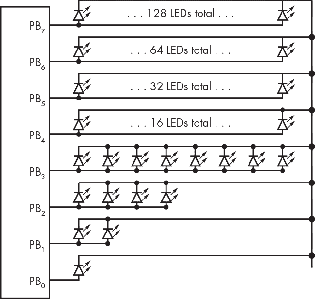

*图 6-22：使用 LED 的更好的数字转模拟转换器*

那真是好多 LED 啊。你可以将这个电路挂在气球上，制作一个 LED 飞艇。接下来，你可以看到这与我们二进制表示数字的方式相似。位 1 产生的光是位 0 的两倍，位 2 产生的光是位 0 的四倍，以此类推。

我们使用 LED 示例来说明数字转模拟转换器的工作原理。一个真实的数字转模拟转换器（D/A 或 DAC）产生的是电压而不是光。术语*分辨率*通常用来描述 DAC 能产生的“步数”。我说“通常”是因为通常会说一个 DAC 具有 10 位分辨率，这实际上意味着它的分辨率是 2¹⁰中的 1 个部分。严格来说，分辨率是 DAC 能够产生的最大电压除以步数。例如，如果一个 10 位的 DAC 能产生 5V 的最大电压，那么它的分辨率大约是 0.005V。

图 6-23 展示了 DAC 的符号。

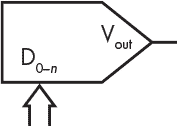

*图 6-23：DAC 示意符号*

我们可以使用 DAC 生成模拟波形。这就是音频播放器和音乐合成器的工作原理。我们只需要按规律改变 DAC 的输入。例如，如果我们有一个连接到端口 B 的 8 位 DAC，我们就可以生成图 6-24 所示的锯齿波形。

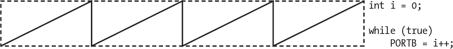

*图 6-24：合成的锯齿波*

对于更复杂的波形，设备通常会包含可以写入数据的内存，然后通过额外的电路读取数据。这确保了一个恒定的数据速率，与 CPU 正在做的其他操作无关。实现这一点的典型方法是创建一个*FIFO*（先进先出）配置，如图 6-25 所示。请注意，FIFO 与软件队列是一样的。

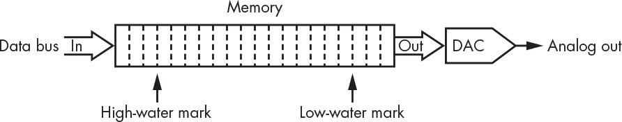

*图 6-25：具有高水位和低水位标记的 FIFO*

FIFO 存储器与两个触发器相关：*高水位线*和*低水位线*，它们借用了潮汐的术语。低水位线在 FIFO 快要空时触发中断；高水位线在 FIFO 快要满时触发。这样，高层软件就可以保持内存填充，从而保证输出是连续的。虽然它不完全是 FIFO，因为新加的水会与旧水混合，但这就是水塔的工作原理；当水位低于低水位线时，水泵启动来填充水箱；当达到高水位线时，水泵关闭。FIFO 对于连接不同速度的设备非常有用。

#### *模拟到数字转换*

模拟到数字转换，即相反的过程，是使用 A/D 或 ADC 完成的，这比 DAC 更为复杂。出现的第一个问题是让模拟信号保持静止，因为如果信号在晃动，我们就无法测量它。（如果你曾试图给小孩量体温，你就会知道这个问题。）在图 6-26 中，我们需要对输入波形进行*采样*——如果我们希望数字化版本接近模拟原始信号，就需要多次采样。我们通过使用一个叫做*采样和保持*的电路来做到这一点，它是数字锁存器的模拟等效物（见第三章第 71 页的“锁存器”部分）。

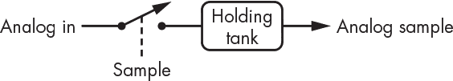

*图 6-26：采样和保持*

当我们通过闭合开关来采样时，模拟信号的电流值被存储在保持池中。现在我们已经在保持池中获得了稳定的信号，我们需要对其进行测量，以便生成数字值。我们需要一些东西来将信号与阈值进行比较，类似于我们在图 2-7 的右半部分所看到的，回到第二章。幸运的是，一个叫做*比较器*的模拟电路可以告诉我们一个电压是否大于另一个电压。它就像一个逻辑门，只不过我们可以选择阈值。

比较器的电路符号如图 6-27 所示。

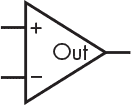

*图 6-27：模拟比较器*

如果+输入的信号大于或等于-输入的信号，则输出为 1。

我们可以使用一堆具有不同*参考电压*的比较器，将其连接到负输入端，以构建一个*闪光转换器*，如图 6-28 所示。

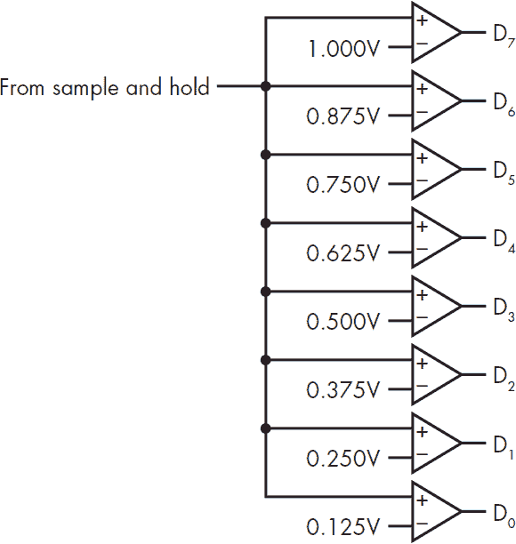

*图 6-28：闪光转换器*

它被称为闪烁转换器，因为它生成结果很快，眨眼间就完成。如你所见，当电压小于 0.125V 时，输出为 00000000；当电压在 0.125V 和 0.250V 之间时，输出为 00000001；当电压在 0.250V 和 0.375V 之间时，输出为 00000011，依此类推。这个方法有效，但它和我们在图 6-25 中的 DAC 有相同的问题：它没有高效使用位。闪烁转换器也因比较器数量较多而相对昂贵，但当需要极高速度时，它们是理想选择。那么，我们如何构建一个更便宜且能更好利用位的 ADC 呢？

我们的闪烁转换器使用了一组固定的参考电压，每个比较器有一个参考电压。如果我们有一个可调参考电压，我们可以使用单个比较器。那我们可以从哪里得到这种参考电压呢？通过一个 DAC！

在图 6-29 中，你可以看到我们正在使用比较器测试保持池中采样值与 DAC 值的关系。一旦清除，计数器开始递增，直到 DAC 值达到采样值，此时计数器被禁用，转换完成。计数器包含了样本的数字化值。

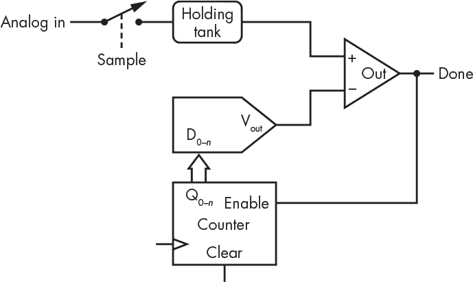

*图 6-29：模数转换器*

一旦清除，计数器会递增，直到 DAC 值达到采样值，此时计数器被禁用，转换完成。计数器包含了样本的数字化值。

你可以在图 6-30 中看到它是如何工作的。模拟信号会在一定范围内波动，但一旦采样完成，保持池的输出就会稳定。然后清除计数器，计数器开始递增，直到 DAC 输出达到采样值，此时计数器停止，转换完成。

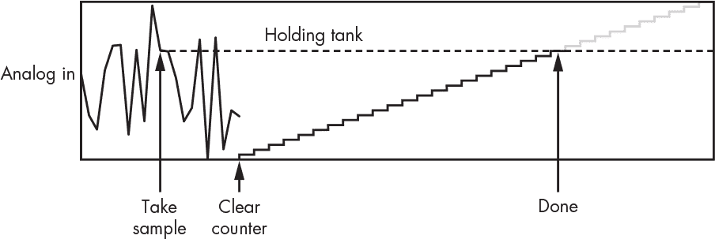

*图 6-30：ADC 操作示意图*

这个 ADC 被称为*ramp 转换器*，因为 DAC 输出生成一个斜坡。ramp 转换器的一个问题是，它可能需要很长时间，因为转换时间是采样信号值的线性函数。如果采样信号达到最大值，并且我们有一个*n*位的 ADC，转换可能需要 2^(*n*)个时钟周期。

一种解决方法是使用*逐次逼近*转换器，它在硬件中执行*二分查找*，正如你在图 6-31 中看到的那样。

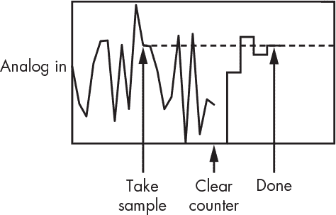

*图 6-31：逐次逼近 ADC 操作示意图*

第一个时钟将 DAC 设置为全范围的一半。由于这小于采样信号，它会按全范围的四分之一向上调整。调整过头了，因此接下来会按全范围的八分之一向下调整。还不够低，因此它再按全范围的十六分之一向上调整，直到匹配。这是最坏情况，它需要 log[2] *n*个时钟。这是一个相当大的改进。

“分辨率”这个术语用于 ADC 的方式与用于 DAC 时相似。原理图符号如图 6-32 所示。

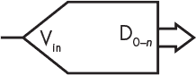

*图 6-32：ADC 原理图符号*

#### *数字音频*

音频涉及*采样*，即在时间点上测量信号的*振幅*或高度。看看图 6-33 中的正弦波。我们有一个*方波*，具有一定的*采样频率*，我们使用 A/D 转换器记录信号在每个*上升沿*时的高度。

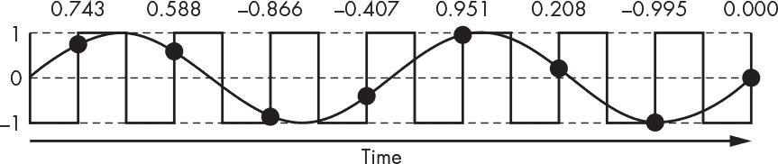

*图 6-33：采样正弦波*

现在我们已经有了一组样本，应该可以通过将它们输入到 D/A 转换器中来重建原始信号。让我们试试看，如图 6-34 所示。


*图 6-34：从样本重建的正弦波*

哇，这看起来完全扭曲了。看起来我们需要更多的样本来改善结果，让它看起来更像图 6-35。

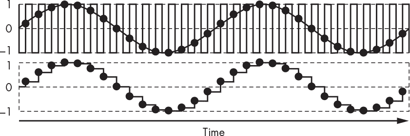

*图 6-35：高频采样与重建*

但我们不需要这么做。图 6-33 和图 6-34 中的采样和重建实际上是可以的。我将告诉你原因，但请注意，接下来有一些深奥的理论。

正弦波相对容易描述，正如在“捕捉波形”中所提到的，位于第 154 页。但我们需要一种方法来描述更复杂的波形，例如图 6-31 中的波形。

到目前为止，图表是绘制振幅与时间的关系，但我们也可以从其他角度来看待它。看看图 6-36 中的乐谱。

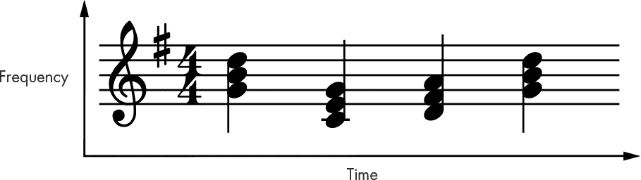

*图 6-36：乐谱*

你可以看到，乐谱将音符与时间进行绘制，但还有更多内容。我们不仅在每个时间点都有音符；我们还有*和弦*，它们是由多个音符构成的。让我们来看一下第一个和弦，它包含了音符 G[4]（400 Hz）、B[4]（494 Hz）和 D[5]（587 Hz）。假设我们正在使用合成器弹奏这个和弦，合成器能为这些音符生成正弦波。你可以在图 6-37 中看到，尽管每个音符都是正弦波，但和弦本身是一个更复杂的波形，它是这三个音符的总和。事实证明，任何波形都可以表示为一组正弦波的加权和（每个正弦波乘以一个比例因子）。例如，如果图 6-33 中的方波频率为*f*，它可以表示为正弦波的总和：

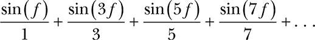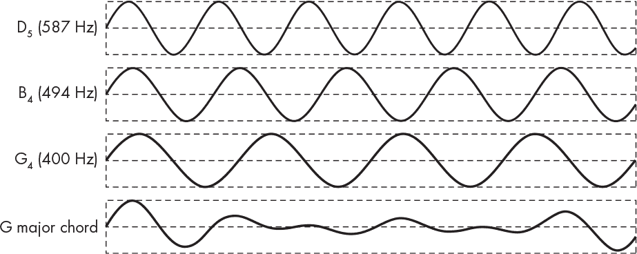

*图 6-37：G 大调和弦波形*

如果你有一副好耳朵，你可以听到像这样的和弦，并分辨出其中的组成音符。音盲的人则不得不依赖一种叫做*傅里叶变换*的数学技巧，这一方法由法国数学家和物理学家让-巴蒂斯特·约瑟夫·傅里叶（1768–1830）发明，他也发现了温室效应。到目前为止，我们在这一节中看到的所有图表都是将振幅与时间作图。傅里叶变换允许我们将振幅与频率作图。这是一种不同的观察事物的方式。我们 G 大调和弦的傅里叶变换图会像图 6-38 一样。

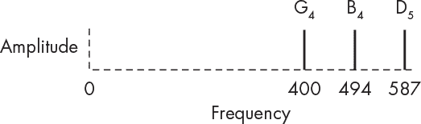

*图 6-38：G 大调和弦傅里叶变换图*

你可能以前见过这种东西，只是你没意识到。许多媒体播放器都有频谱分析器的炫酷效果，显示不同频率带的音量，这就是傅里叶变换的应用。频谱分析器最初是复杂的电子设备，现在可以通过*快速傅里叶变换（FFT）*算法在计算机上实现。傅里叶分析的一个最酷的应用就是哈蒙德 B-3 风琴。

哈蒙德 B-3 风琴

哈蒙德 B-3 是电磁学和傅里叶分析的惊人应用。它的工作原理是，一个电动机驱动一根轴，上面装有 91 个“音轮”。每个音轮都有一个关联的拾音器，类似于电吉他上的拾音器，它根据音轮上的凸起产生特定的频率。由于所有音轮都装在同一根轴上，它们之间无法失去音准。

按下 B-3 上的一个键，不仅仅是生成由音轮产生的频率。它有九个八位“拉杆”，用于将“基音”（正在演奏的音符）产生的信号与其他音轮的信号混合。拉杆设置了子八度、五度、基音、第八度、第十二度、第十五度、第十七度、第十九度和第二十二度谐波的音量。

产生的声音是这九个信号的加权和，这些信号的设置方式类似于我们在图 6-37 中生成 G 大调和弦的方式。

许多媒体播放器的另一个特性是*图形均衡器*，它让你根据个人喜好调整音效。图形均衡器是一组可调节的*滤波器*，这些设备可以包括或排除某些频率。它们类似于我们在《模拟世界中的数字》中看到的传递函数，区别在于它们是处理频率，而不是电压或光。滤波器主要有两种类型：*低通*，通过所有低于某一频率的信号；*高通*，通过所有高于某一频率的信号。它们可以组合成*带通*滤波器，允许通过低频和高频之间的所有信号，或者*陷波*滤波器，排除某一特定频率。你可以在图 6-39 中看到，滤波器的边缘并不锋利，它们会*逐渐衰减*。完美的滤波器是不存在的。请注意，图 6-7 中的按钮去抖动器就是一个低通滤波器。

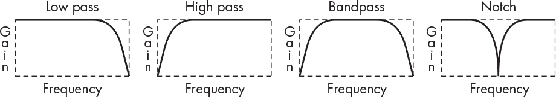

*图 6-39: 滤波器*

比如说，我们可以对我们的 G 大调和弦应用一个低通滤波器，如图 6-40 所示。应用滤波器实际上是对曲线进行乘法运算；滤波器调整不同频率下的声音水平。

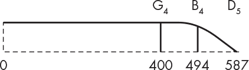

*图 6-40: 低通滤波的 G 大调和弦傅里叶变换图*

如你所想，它听起来不再一样了。B[4] 稍微安静了些，D[5] 几乎消失了。

为什么这一切很重要？图 6-41 展示了我们从图 6-34 重建的正弦波的傅里叶变换。我在那个图中没有完全指定所有内容，所以我们假设它是一个 400 Hz 的正弦波，以 3 kHz 采样。

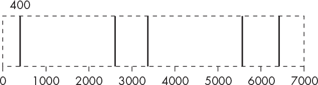

*图 6-41: 重建正弦波傅里叶变换图*

请注意，x 轴延伸到无穷远，频率以采样频率的倍数为单位加减采样信号的频率。

如果我们对那个重建的正弦波应用低通滤波器，如图 6-42 所示，会发生什么呢？

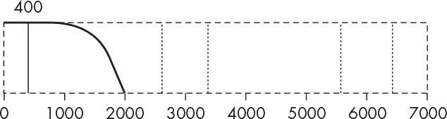

*图 6-42: 低通滤波的重建正弦波傅里叶变换图*

所有的失真消失了；剩下的就是我们的 400 Hz 正弦波。看起来采样是有效的，只要我们有适当的滤波。我们该如何选择采样率和滤波器呢？

哈里·奈奎斯特（1889–1976），一位瑞典电子工程师，提出了一个定理，认为如果你想准确捕捉信号，必须至少以最高频率的两倍速率进行采样。这是一个很好的理论，但由于电子学并不遵循理想数学，所以最好以更快的速度采样，这样结果听起来才好。人类的听觉范围大约是 20 到 20,000 Hz。

基于这些，我们应该能够以 40 kHz 的采样率捕捉到我们能听到的任何声音。如果我们不小心获得了 21 kHz 的声音，根据奈奎斯特定理，这属于*欠采样*。在这种情况下，我们会得到*折叠*或*混叠*。假设采样频率是一面镜子，任何超过该频率的信息都会被反射。回到图 6-41，你可以看到在采样频率的正负范围内存在*伪影*。由于采样频率远大于被采样频率，这些伪影距离很远。一个 21 kHz 的输入以 40 kHz 采样会产生一个 19 kHz 的伪影（40–21）。这个错误信号被称为*混叠*。我们得到的输出与输入不一致。为了避免混叠，必须在采样之前应用低通滤波器。

压缩光盘以 44,100 Hz 的采样率采集 16 位样本——当然，是双倍采样，因为是立体声。这样每秒产生超过 175KB 的数据。这是大量的数据。一些标准的音频采样率包括 44.1 kHz、48 kHz、96 kHz 和 192 kHz。既然采样率越高产生的数据就越多，而奈奎斯特定理认为没有必要这样做，那我们为什么还要使用更高的采样率呢？

尽管可以重建接近奈奎斯特频率的信号的频率和振幅，但*相位*是无法重建的。又一个新词！把相位看作是时间上的微小偏移。你可以在图 6-43 中看到，较胖的信号相对于较细的信号*滞后* 45 度（而不是*提前*），使得它稍微滞后一些。

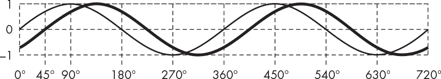

*图 6-43：信号的相位差*

为什么这很重要呢？嗯，除了立体声外，它并不重要。*相位差*在信号到达你左右耳之间造成了时间延迟，从而帮助你判断声音在空间中的位置，如图 6-44 所示。

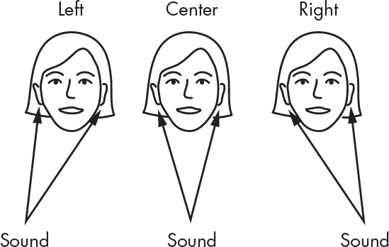

*图 6-44：现实生活中的相位差*

高频信号能更好地处理，因为它们的波长相对于头部的厚度较短。如果你的头部狭窄到耳朵位置相同，那么就不会有时间延迟。大脑袋的人更适合听立体声！这也是你能只用一个低音炮的原因之一：因为波长相比头部厚度较长，导致相位差无法被感知，你无法准确判断声音来自哪里。

当你听立体声音时，扬声器发出的声音之间的相位差产生了*图像*，也就是能“看到”音乐人在空间中的位置。如果没有准确的相位，图像就会变得“模糊”。因此，更高采样率的理论基础是更好的相位和立体声图像重现。如果你的听音体验是用手机上的廉价耳塞来实现的，你可能永远不会注意到这一点。

FM 立体声的采样与滤波

FM 立体声是采样和滤波的一个有趣应用。它也是一个很好的例子，展示了如何将新功能嵌入一个原本没有为此设计的系统中，同时保持向后兼容性，也就是说，旧系统仍然能够正常工作。

在图 6-20 中，你看到了如何利用比特来调制频率。FM 代表*频率调制*。FM 广播通过模拟信号而不是数字信号调制载波频率。

FM 广播电台的载波频率每 100 kHz 分配一次。你在图 6-41 中看到过，采样会生成额外的频率，直到无限大；调制也会发生同样的情况。因此，必须对调制信号应用低通滤波器，否则会与其他电台发生干扰。你在图 6-39 中看到了滤波器的衰减。衰减越陡峭，滤波器对相位的干扰越大，这对声音有负面影响。这在图 6-45 中的一部分无线电频谱中得到了体现。

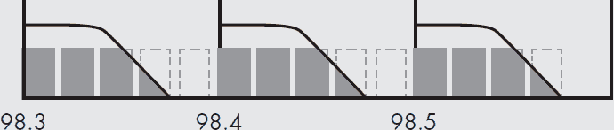

*图 6-45：无线电频谱*

在立体声出现之前，单声道 FM 信号中的音频信息占据了载波频率之上的大约 15 kHz。接收器移除了载波，恢复了原始音频。这个特性在向立体声过渡时必须保留，否则所有现有接收器将无法工作。

图 6-46 概述了 FM 立体声的工作原理。使用 38 kHz 方波来交替采样左、右声道。生成一个 19 kHz 的引导音，与采样方波同步。引导音的混合级别很低，几乎无法在音乐中听到，并与样本信号合成，形成复合信号进行广播。

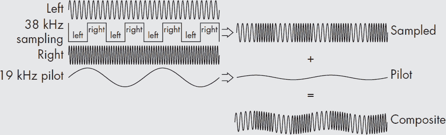

*图 6-46：FM 信号生成*

聪明之处在于，如果我们查看图 6-47 中的傅里叶分析结果，左侧的第一组频率是左声道和右声道的总和——这正是我们所需要的单声道效果。对于旧接收器没有问题。接下来的频率组是左声道和右声道之间的差异，这些差异不会被旧的单声道接收器接收。然而，立体声接收器可以利用简单的算术将左、右声道分开，从而产生立体声。

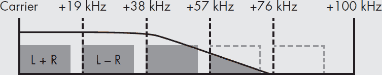

*图 6-47：FM 立体声频谱*

我之前提到过，音频涉及大量数据。如果能够压缩这些数据，让它占用更少的空间，那就太好了。压缩有两种类别：*无损压缩*和*有损压缩*。无损压缩保留所有原始数据。因此，它只能将数据压缩到原始大小的约一半。目前最流行的无损压缩格式是*FLAC*，即*自由无损音频编码*。*编码器-解码器*（*codec*）类似于一种调制解调器，能够将一种编码系统的内容转换为另一种编码系统。

*MP3*、*AAC*、*Ogg*及类似格式是有损压缩编解码器。一些音质会丢失。它们基于心理声学原理。研究耳朵和大脑工作机制的人们认为，有些声音是无法听到的，比如在大鼓一击后发生的微弱声音。这些编解码器通过去除这些声音来工作，这使得它们比 FLAC 具有更好的压缩比。但并不是每个人的听力都一样。我认为 MP3 的音质很糟糕。

#### *数字图像*

图像比音频更复杂，因为我们需要对二维空间进行采样。数字图像通过矩形阵列的像素（*pixels*）来表示。每个彩色图像的像素由红、绿、蓝三种光组成。如今常见的显示器每种颜色有 8 位。我们在图 1-20 中看到过一种常用的表示方式。

计算机显示器使用*加法*色彩系统，通过组合（或加法，因此得名）红、绿和蓝三种*基色*，几乎可以产生任何颜色。这与用于印刷的*减法*色彩系统不同，后者通过混合不同量的青色、品红和黄色基色来生成颜色。

对图像进行采样就像在图像上放一块窗户网，并记录每个方格中的颜色。由于*点采样*的存在，这个过程稍微复杂一些，意味着我们并不记录整个方格，只记录每个方格中心的一个点。图 6-48 展示了使用三种不同分辨率的屏幕进行采样的图像。

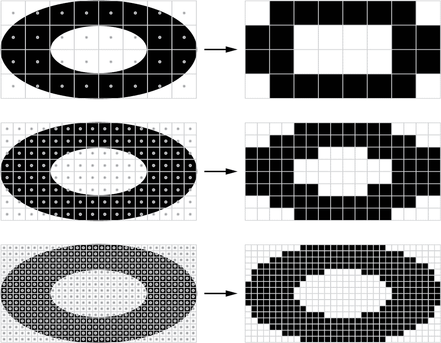

*图 6-48：以不同分辨率采样图像*

你可以看到，使用更精细、更高分辨率的屏幕，采样后的图像看起来更好，但这当然会大大增加数据量。然而，即使是高分辨率的屏幕，我们仍然会看到锯齿状的边缘。这是由于欠采样和混叠现象所致，按照奈奎斯特定理，尽管这个数学原理对于本书来说过于复杂。就像音频一样，或许过滤可以有所帮助。我们可以通过*超采样*来进行过滤，即每个方格进行多次采样并将其平均，如图 6-49 所示。

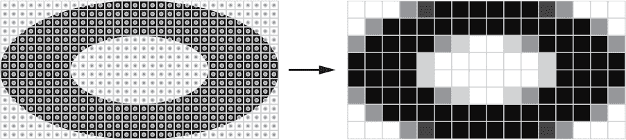

*图 6-49：超采样*

如果把它放大来看并不太好，但如果把它从脸部远离一些，你会发现它看起来不那么糟糕。如果你仔细想想，超采样相当于提高采样率，就像我们在图 6-35 中看到的音频一样。

图像越来越大，占用了大量空间。目前尚不清楚是否会有足够的存储来容纳全球的猫咪照片和视频。与音频类似，我们希望图像占用更少的空间，这样就能在相同的内存中存储更多图像，并且它们通过网络传输时也会更快。这一问题通过压缩再次得以解决。

目前最常见的图像压缩格式是*JPEG*，这是由联合图像专家组制定的标准。它涉及大量复杂的数学运算，这里我不打算详细讨论。JPEG 的工作原理粗略地说，就是它会寻找相邻像素的颜色非常接近的区域，并存储该区域的描述，而不是存储这些像素本身。你可能会发现相机有一个图像质量设置；该设置会调整“非常接近”这个定义的标准。这是我们在《堆栈》中示例的颜色版本，出现在第 122 页。

JPEG 使用关于人类感知的知识，方式与有损音频编解码器类似。例如，它利用了我们的大脑对亮度变化比对颜色变化更敏感的事实。

#### *视频*

在多维空间中的又一步，视频是一系列按固定时间间隔采样的二维图像。时间间隔是根据人类视觉系统的需求来确定的。旧电影每秒 24 帧（fps）就能勉强应付；如今大多数人对于每秒 48 帧的视频已经相当满意。

采样视频与采样图像没有太大区别，唯一的不同是不同的伪影在视觉上令人不悦，因此需要尽量减少。问题在于沿边缘的采样伪影，如我们在图 6-48 中看到的那样，当物体移动时，这些伪影并不会静止。

为了更好地理解这一点，看看图 6-50，它展示了一条对角线随时间从左到右移动。它每帧只移动一个像素的极小部分，这意味着它每次的采样结果都不完全相同。它看起来依然像是线的近似，但每一条都是不同的近似。这使得边缘看起来在“游动”，视觉上令人困扰。使用超采样进行滤波是减少这种不愉快视觉伪影的一种方式。


*图 6-50：游动的边缘*

视频产生的数据量远远超过图像或音频。超高清（UHD）视频的分辨率为 3,840×2,160 像素。乘以每个像素 3 个字节，再乘以每秒 60 帧，你得到的结果是每秒 1,492,992,000 字节！显然，压缩非常重要。

帧与帧之间通常只有部分图像发生变化的观察结果是视频压缩的关键。看一下图 6-51，其中西格玛先生正前往取包裹的路上。


*图 6-51：帧间运动*

如你所见，帧与帧之间的图像变化非常少。如果我们只需要变更区域的数据，所需存储或传输的数据将大大减少。这种技术称为*运动压缩*。

将视频表示为从原始图像的变化集合有一个问题，那就是有时数据会被损坏。你可能在数字电视或播放损坏的视频光盘时见过一些块状伪影。

我们需要一种方法来恢复数据。这是通过定期在数据中包含*关键帧*来实现的。关键帧是完整的图像，因此即使由于损坏的变更数据导致积累了损坏，当遇到下一个关键帧时，恢复过程也会发生。

检测帧之间差异的算法非常复杂且计算密集。像 MPEG4 这样的新压缩标准支持*分层*，这利用了这样一个事实：如今许多视频是计算机生成的。分层就像我们在第一章讨论过的传统手绘动画，透明纸上画的物体被移到静态的背景图像上。

### 人机接口设备

计算机很像拿着手机的青少年。它们大部分时间都在互相发消息，但偶尔也有时间与人交流。本节内容涵盖了计算机与人互动的某些方式。

#### *终端*

不久前，你习惯使用的键盘、鼠标、显示器或触摸屏曾是不可想象的奢侈品。

曾几何时，你与计算机的交互方式是将程序或数据写在纸上，使用特殊的编码表单。你会把这些交给别人，别人会用打孔机将这些表单转化成一堆穿孔卡片（参见图 3-25）。你小心地拿着这些卡片，确保不要掉落，然后交给计算机操作员，操作员将它们放入卡片读取器，读取器会将卡片内容读入计算机并运行程序。这种方法被称为*批处理*，之所以使用它，是因为计算机速度非常慢且昂贵，使得计算机时间非常宝贵，因此在你打卡片的时候，其他人的程序也在运行。

计算机变得更快、更小、更便宜。到了 1960 年代末期，企业或部门可以拥有一台小型计算机。它小得像一辆房车。计算机时间变得不那么稀缺。显而易见的事情发生了，人们开始将它们连接到*电传打字机*上。电传打字机被称为*终端*，因为它们位于线路的末端。一款特别受欢迎的型号，Teletype ASR-33，配有键盘、打印机、纸带(Figure 3-26)打孔机和纸带阅读器。纸带相当于一个 USB 记忆棒。ASR-33 的速度令人吃惊，能够达到*每秒 10 个字符*！tty 这个术语至今仍在使用，代表电传打字机。

*分时*系统的发明就是为了让这些小型计算机保持忙碌。是的，它们真的像分时度假租赁。你可以假装它是你的地方，在你使用时它确实是你的，但当轮到别人时，他们也会使用它。

分时系统有一个*操作系统*程序在计算机上运行。操作系统程序就像分时租赁的预定代理人。它的工作是将计算机的各种资源分配给每个用户。当轮到你使用计算机时，其他用户的程序会被交换到磁盘上，而你的程序会被加载到内存中并运行一段时间。所有这些操作发生得足够快，你会觉得自己拥有了计算机，至少在事情变得忙碌之前是这样。到了某个时刻，操作系统会花费更多的时间在交换数据而不是运行用户程序上，情况开始变得*抖动*。

当用户数量很多时，抖动（Thrashing）使得分时系统的运行变得相当缓慢。程序员开始在深夜工作，因为在其他人都下班后，他们可以独占计算机资源。

分时系统是*多任务*的，因为计算机给人一种它同时做多件事情的错觉。突然间，许多终端连接到了同一台计算机上。于是出现了*用户*的概念，计算机可以知道哪些资源属于谁。

时间推移，类似电传打字机的更好版本出现了，每一代都更快、更安静。但它们仍然是在纸上打印东西，或者*硬拷贝*。而且它们基本上只适合用于文本打印。Teletype 37 型增加了希腊字符，以便科学家打印数学公式。IBM Selectric 终端具有可互换的*键球*，允许用户更换字体。包括一种带有不同位置点阵的字体，能够绘制图表。

#### *图形终端*

移开硬拷贝终端有很多原因，包括速度、可靠性和噪音。屏幕已经存在于雷达和电视等设备上；现在是时候让它们与计算机一起工作了。由于电子技术的不断发展，这一过程进展缓慢，因为内存当时既昂贵又慢。

图形终端最初是围绕一种真空管的变种构建的（参见“真空管”第 50 页），这种变种被称为*阴极射线管（CRT）*。玻璃内部涂有化学磷光体，当电子射线击中它时会发光。通过使用多个网格或*偏转板*，就可以在磷光体上绘制图像。这就像是拥有一个非常有才华的击球手，能够用球击中任何目标。

其实有两种方式可以让这个显示工作。偏转板版本，叫做*静电偏转*，使用与让你讨厌的静电吸附相同的原理。另一种选择是电磁版本，叫做*电磁偏转*。无论哪种方式，信息都需要转换成电压，这又是我们 D/A 构建模块的一个应用。

如今，CRT 大多已经成为遗物，被*液晶显示（LCD）*所取代。液晶是能够在施加电压时改变其光传输特性的物质。典型的平面显示屏与 CRT 非常相似，在每个光栅点上都有三块液晶，分别带有红色、绿色和蓝色滤光片，并且背面有光源通过它们照射。我们仍然像对待 CRT 那样与 LCD 设备沟通，但这仅仅是历史遗物。LCD 现在无处不在，并且已经取代了大多数应用中的 CRT；LCD 使得手机、笔记本电脑和平板电视成为可能。

早期的基于屏幕的终端被称为*玻璃 tty*，因为它们只能显示文本。这些终端显示 24 行，每行 80 个字符，总共 1,920 个字符。由于每个字符占用一个字节，这相当于不到 2 KiB 的内存，在当时是可以负担得起的。随着时间的推移，增加了更多的功能，如屏幕编辑和光标移动，这些功能最终被标准化为 ANSI X3.64 的一部分。

#### *矢量图形*

CRT 的工作原理非常像一张图表纸。电子束根据 x 轴和 y 轴的电压移动到某个点。还有一个 z 轴决定亮度。最初没有颜色，因此这些显示器是黑白的，或*灰度*显示。每英寸的坐标位置数被称为*分辨率*。

*矢量图形*完全是关于绘制线条，或*矢量*。你通过从这里到那里画一组线来制作一幅图。图 6-52 中的细箭头是通过将亮度调到最低或关闭来绘制的。

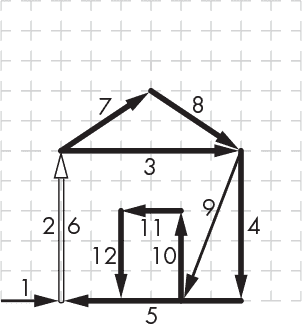

*图 6-52：矢量图形的家*

那个有黑色轮廓的白色箭头被画了两次，一次是亮度打开时，再次是亮度关闭时。亮度打开时画同一条线两次会使它变得更亮两倍，但我们并不希望仅仅因为改变位置就这样做。

图 6-52 中的房子是从*显示列表*中绘制的，显示列表是绘图指令的列表。它看起来像图 6-53。

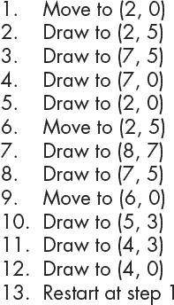

*图 6-53: 显示列表*

注意最后一条指令。我们重新开始，因为屏幕上的图像会很快褪色。之所以能这样做，是因为 CRT 荧光粉的*持久性*，即当光束移开后，荧光粉能持续发光的时间，以及人眼的慢反应速度。我们必须不断重复这一过程，才能保持图像在屏幕上显示。

然而，这个指令还有更多内容。因为美国交流电的频率是 60Hz（在一些国家是 50Hz），所以我们周围有很多 60Hz 的辐射。尽管我们尽力屏蔽这些辐射，但它仍然影响我们的显示，使其产生波动。因此，像贝尔电话实验室开发的*GLANCE G*图形终端，具有“在下次电力线从正到负穿过 0 时，从第 1 步重新开始”的指令。这使得绘图与干扰同步，以便它总是以完全相同的方式波动，因此不易察觉。

绘制图像需要时间，而一个不太好的副作用是，所有东西看起来都很好，直到显示列表变长，以至于它无法在 1/60 秒内完成绘制。当绘制每 1/30 秒一次时，它会突然变得非常闪烁。

一家公司叫 Tektronix，提出了一种有趣的解决闪烁问题的方法，称为*存储管*。这相当于电子版的*电子画板*。你可以绘制非常复杂的图像，但你必须通过电子方式摇晃它来擦除图像。由于需要大量的矢量，且会导致显示闪烁，在 Glance G 上绘制稳定的图像非常困难。存储管可以处理稳定图像，因为矢量数量没有限制，但实心区域的中心往往会褪色。在 Glance G 上，你可以通过从显示列表中删除单一的线条来擦除它。这在存储管上是不可能的。当屏幕被擦除时，存储管会发出明亮的绿色闪光，这已经被许多年老的程序员深深烙印在眼睛里。

#### *光栅图形*

*光栅图形*与矢量图形完全不同。这是电视最初的工作原理。光栅是一种持续绘制的图案，如图 6-54 所示。

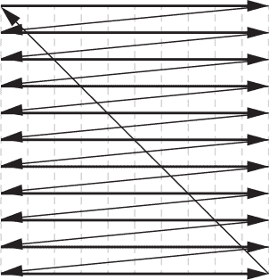

*图 6-54: 光栅*

光栅从屏幕的左上角开始，沿着屏幕横向绘制。然后，*水平重绘*将其带回到下一行的起始位置。最后，*垂直重绘*在绘制完最后一行后将其带回到起始位置。

这与我在讨论串行通信时用的起跑枪类比非常相似。一旦光栅启动并运行，你所要做的就是在正确的时机调整亮度，就能得到你想要的图像，正如你在图 6-55 中看到的那样。

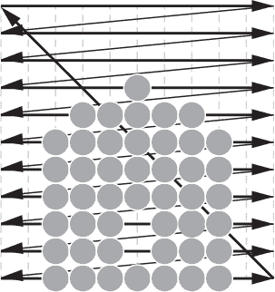

*图 6-55: 光栅图形之家*

我还在《数字图像》中使用了窗纱的类比，在第 173 页上提到过。光栅显示是一个*实际*的屏幕，这意味着我们不能在点与点之间进行绘制。这可能会导致不愉快的视觉伪影，例如屋顶看起来不太对劲。那是因为典型的光栅显示的分辨率相对较低——大约每英寸 100 个点。低分辨率会导致欠采样和类似数字图像中的别名效应。现在，足够的计算能力使得使用超采样等技术让*抗锯齿*成为常见做法。

光栅扫描也用于传真机、激光打印机和扫描仪等设备。打开扫描仪的盖子，看它的运作。记得戴上太阳镜。以前打印机有更多活动部件，声音也更大，人们通过精心选择打印内容，发明了如何在打印机上播放*光栅音乐*的技巧。

光栅显示器不使用显示列表，尽管显示列表仍然在光栅显示器的背后使用。正如我们稍后将看到的，网页就是显示列表。OpenGL 图形语言包含显示列表，且通常在图形硬件中支持该语言。单色显示器使用一块内存，每个光栅位置对应 1 位。这在当时是一个巨大的内存量；现在，它已经不算什么大事了。当然，这块内存也能快速变得非常大。如果你想要一个能够显示 256 种不同灰度的光栅显示，你就需要为每个光栅位置准备 8 位内存。

颜色是在奥兹国发现的，并迅速进入了屏幕显示。单色或灰度显示很简单：你只需要在屏幕内部涂上一层磷光物质。彩色显示需要每个位置上都有三种不同的颜色点——红色、绿色和蓝色——以及三束能够精准打击这些位置的电子束。这意味着你需要为一个典型的显示器准备三倍的显示内存。

#### *键盘与鼠标*

终端不仅有显示功能，还可以输入数据。你所知道的键盘和鼠标、笔记本上的触控板、手机和平板电脑上的触摸屏，都是其中的一部分。

键盘相当简单。它们只是一些开关和一些逻辑。构建键盘的常见方式是将按键开关放置在一个网格上，通过多路复用的方式进行操作，就像在图 6-10 中那样。电源依次施加到网格的行上，列的值被读取出来。

我们所知道的鼠标是由美国工程师道格拉斯·恩格尔巴特（1925-2013）在斯坦福研究所发明的。我在“正交”中提到过，在第 150 页，你可以使用一对正交编码器来制作鼠标，每个编码器分别用于 *x* 和 *y* 方向。

有很多触摸板和触摸屏技术。主要区别在于，触摸屏必须是透明的，以便显示内容可以被看到。触摸设备是行列扫描设备，就像键盘一样，只是规模要精细得多。

### 总结

在这一章中，你学习了中断系统，它允许处理器高效地处理输入/输出操作。我们讨论了各种类型的输入/输出设备如何工作以及它们如何与计算机互动。我们还讨论了采样模拟数据这一复杂领域，以便它可以通过数字计算机进行处理。到此为止，你已经了解了足够的计算机工作原理，因此从下一章开始，我们将探讨硬件与软件之间的关系，目的是学习如何编写在硬件上运行良好的软件。
