## 第七章：数据组织**


如果你一直在关注，你可能会注意到，处理内存时有些“执着”。在第三章中，你学到过，像 DRAM、闪存和磁盘驱动器等内存设备的访问顺序会影响它们的速度。而在第五章中，你学到过，性能也取决于你需要的数据是否在缓存内存中。将内存系统的这些特性考虑进来，在组织数据时能带来更好的性能。为了帮助你做到这一点，本章我们将探讨多种*数据结构*，或标准的数据组织方式。许多数据结构的存在是为了支持不同类型内存的高效使用。这通常涉及一个空间/时间的权衡，其中使用更多的内存以加速某些操作。（请注意，高级数据结构是由编程语言提供的，而非计算机硬件本身。）

*引用局部性*这个术语充分总结了本章所讨论的内容，完全符合流行术语的要求。或者可以说是“把你需要的数据放得近一些，把你很快就需要的数据放得更近一些。”

### 原始数据类型

编程语言提供了多种原始数据*类型*。这些类型有两个方面：它们的大小（位数）和它们的解释（有符号、无符号、浮动点、字符、指针、布尔值）。图 7-1 展示了通过 C 编程语言，程序员在典型现代计算机上可用的数据类型。即使在同一台机器上，不同的 C 实现以及其他语言，如 Pascal 或 Java，可能会以不同的方式呈现这些数据类型。一些语言环境包括允许程序员查询字节序（见图 4-4 在第 96 页），每字节的位数等的功能。


*图 7-1：典型 C 语言原始数据类型*

我们在第一章中看到过这些内容，除了指针；唯一的不同是这里我们使用了 C 语言的名称。

美国工程师哈罗德·劳森（Harold Lawson）在 1964 年为 PL/I（编程语言一）发明了指针。*指针*只是某种架构相关大小的无符号整数，但它被解释为内存地址。它就像你家的地址——它不是房子本身，但可以用来找到你的房子。我们之前已经看到过它是如何工作的；这就是“寻址模式”中提到的间接寻址，见第 104 页。一个值为零的，或者说*NULL*，指针通常不被认为是有效的内存地址。

C 语言使指针变得流行。一些语言实现了更抽象的*引用*，以试图避免因指针使用不当而导致的问题，这一点我将在本章稍后讨论。指针通常与机器上的自然字长相同，以便在一个周期内可以访问它们。

芯片技术的进步促使了 1980 年代大量新机器的发展，其中包括从 16 位计算机过渡到 32 位计算机。许多在 1970 年代和 1980 年代早期编写的代码对指针使用非常随意；例如，它假设指针和整数的大小相同，并将它们互换使用。当这些代码移植到新机器上时，经常会出现难以调试的问题，从而催生了两种独立的修复方法。首先，人们开始更加关注可移植性问题。这个解决方案非常成功；如今，可移植性和指针问题已经不再是大问题。其次，开发了消除了指针的语言，例如 Java。这种方法在某些地方有所帮助，但并不总是值得付出代价。

### 数组

你在上一节中看到的数据类型是简单的；你可以把它们看作是房子。语言还支持*数组*，可以将其比作公寓楼。公寓楼有一个地址，每个公寓有单元号。程序员将单元号称为*索引*（从 0 开始，与大多数公寓不同），而各个公寓则称为数组*元素*。典型的计算机建筑规范要求建筑中的所有公寓都是相同的。图 7-2 展示了一座包含十个 16 位公寓的 C 语言建筑。


*图 7-2：十元素的 16 位数字数组*

图 7-2 中的每个方框代表一个字节。因此，在这个由 16 位元素组成的数组中，每个元素占据两个 8 位字节。元素下标表示数组的索引。

查看数组的另一种方式是通过相对寻址的视角（参见“相对寻址”在第 128 页的内容）。每个元素都是相对于第 0 个元素的地址，或者说是*基地址*的偏移量。因此，element[1]距离 element[0]有 2 个字节。

图 7-2 中的数组是一个*一维*数组——一座丑陋的单层建筑，所有的公寓都在一个走廊上。编程语言也支持*多维*数组——例如，一座四层楼的建筑，每层有三个字节大小的公寓。这将是一个二维数组，具有两个索引，一个表示楼层号，另一个表示该楼层的公寓号。我们甚至可以构建三维建筑，索引分别用于区翼、楼层和公寓；四维建筑使用四个索引，依此类推。

了解多维数组在内存中的布局非常重要。假设我们要在一个 4×3 的公寓大楼下每个门放一张传单。我们可以用两种方式之一来做。我们可以从 0 楼开始，把传单放到 0 号公寓，然后去 1 楼把传单放到 0 号公寓，以此类推。或者我们可以从 0 楼开始，把每一层的所有门下都放传单，然后对 1 楼做同样的事情，依此类推。这是一个*引用局部性*问题。第二种方法（在一层楼做所有门的操作）具有更好的引用局部性，对腿部的负担也较小。你可以在图 7-3 中看到这一点，其中括号中的数字是相对于数组起始位置的地址。

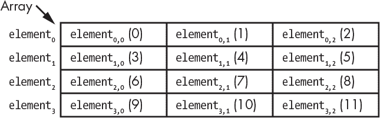

*图 7-3: 二维数组布局*

列索引在相邻的列之间移动，而行索引在地址空间中更远的行之间移动。

这种方法可以扩展到更高维度。如果我们有一个五座大楼组成的复合体，每座楼有四层，每层有三个公寓，图 7-3 将会被复制五次，每座楼一次。在地址空间中，相邻的楼栋比相邻的行更远，而相邻的行又比相邻的列更远。

回到图 7-2，想象一下如果你尝试访问 element[10]会发生什么。一些编程语言（如 Pascal）会检查数组索引是否在数组的范围内，但许多其他语言（包括 C）不会。如果没有检查，element[10]会将我们指向相对于数组起始位置的第 20 和 21 字节。如果该地址没有内存，这可能会崩溃程序，或者它可能成为一个安全漏洞，允许访问数组末尾之后的数据。作为程序员，如果语言没有为你做这项工作，你的责任是确保操作在合法范围内。

### 位图

你已经看到如何使用原始数据类型构建数组，但有时没有足够小的原始数据类型来满足需求。例如，假设圣诞老人需要跟踪大量无辜孩子的“乖”与“淘气”状态。两个值意味着我们每个孩子只需要 1 位。我们本可以为每个值轻松使用一个字节，但这效率较低——这会导致北极变暖，给雪人弗罗斯特带来坏消息，因为融化被认为是一种已有的健康状况，不予覆盖。我们真正需要的是一个位数组，或者称作*位图*。

位图是很容易创建的。例如，假设我们想跟踪 35 个位。我们知道五个 8 位字节的数组足够存储这些位，正如图 7-4 所示。

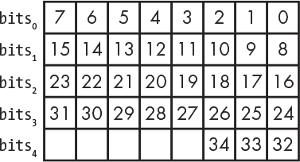

*图 7-4: 数组作为位图*

我们可以在位图上执行四种基本操作：设置一个位，清除一个位（将其设为 0），测试一个位查看它是否已设置，以及测试一个位查看它是否已清除。

我们可以使用整数除法来查找包含特定比特的字节；我们只需要除以 8。对于具有桶形移位器的机器（参见 “移位性” 在 第 99 页）来说，这一步可以通过将目标比特的编号右移 3 位来快速完成。例如，比特编号 17 将位于第三个字节，因为 17 ÷ 8 在整数除法中是 2，而字节 2 是从 0 开始数的第三个字节。

下一步是为比特位置制作掩码。类似于其物理对应物，*掩码* 是一种具有孔洞的比特模式，我们可以通过这些孔“看到”。我们通过将所需的比特编号与 0x07 掩码进行与操作，获取低三位；对于 17，结果是 00010001 AND 00000111，得到 00000001，即比特位置 1。然后，我们将 1 左移这么多位，得到掩码 00000010，这就是字节 2 中比特 17 的位置。

使用数组索引和比特掩码，我们可以轻松执行以下操作：

| **设置一个比特** | bits[index] = bits[index] OR mask |
| --- | --- |
| **清除一个比特** | bits[index] = bits[index] AND (NOT mask) |
| **测试是否为设置的比特** | (bits[index] AND mask) ≠ 0 |
| **测试是否为清除的比特** | (bits[index] AND mask) = 0 |

位图还有另一个有用的应用：指示资源是否可用或忙碌。如果一个设置的比特表示一个忙碌的资源，我们可以扫描数组，寻找一个不是全 1 的字节。这允许我们一次测试八个比特。当然，一旦找到一个包含 1 的字节，我们需要找到清除的比特，但这比单独测试每个比特要高效得多。请注意，在像这种情况下，使用最大原始数据类型的数组（例如 C 的 `unsigned long long`）比使用字节数组更为高效。

### 字符串

你在第 22 页的 “表示文本” 中学到了关于字符编码的内容。像这句话中的字符序列就是一个 *字符串*。

和数组一样，我们经常需要知道一个字符串的长度，以便能够对其进行操作。通常，单单为每个字符串创建一个数组是不够的，因为许多程序处理的是可变长度的字符串数据；当字符串的长度无法预先确定时，通常使用较大的数组。由于数组大小与字符串长度无关，我们需要其他方法来跟踪字符串的长度。最方便的做法是将字符串长度与字符串数据捆绑在一起。

一种方法是将长度存储在字符串本身中——例如，存储在第一个字节中。这种方法效果不错，但将字符串的最大长度限制为 255 个字符，这对于许多应用程序来说是不够的。可以使用更多的字节来支持更长的字符串，但在某些情况下，开销（记录字节）的数量会超过许多字符串的长度。此外，由于字符串是字节，它们可以有任意对齐方式，但如果需要多字节计数，字符串必须按这些边界对齐。

C 使用了不同的方法，这种方法借鉴了 PDP-11 汇编语言中的 `.ASCIZ` 伪指令，该语言不像某些语言那样为字符串提供专门的数据类型。它只是使用一维字节数组；字符串是字符数组的事实说明了 C 中字节大小的数据类型是 `char`。但有一个变化：C 不存储字符串的长度。相反，它在字符数组的末尾添加一个额外的字节作为 NUL 终止符。C 使用 ASCII 的 NUL 字符（参见 表 1-11），其值为 0，作为 *字符串终止符*。换句话说，NUL 终止符用于标记字符串的结束。这对于 ASCII 和 UTF-8 都适用，效果如 图 7-5 所示。

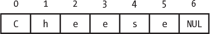

*图 7-5：C 字符串存储和终止*

如你所见，C 使用 7 字节的内存来存储字符串，尽管字符串只有六个字符长，因为需要额外的一个字节来存储终止符。

NUL 作为终止符是一个不错的选择，因为大多数机器都包含一种指令来测试某个值是否为 0。任何其他选择都需要额外的指令来加载我们要测试的值。

使用字符串终止符而不是显式长度有其优缺点。一方面，存储紧凑，这一点很重要，而且执行像“打印字符串中的每个字符直到末尾”这样的操作几乎没有开销。但当你需要字符串的长度时，你必须扫描字符串直到找到末尾，计算字符数。此外，采用这种方法时，字符串中不能包含 NUL 字符。

### 复合数据类型

虽然简单的房间适合做一些事情，但市场通常要求更为豪华的住宿，例如套房。大多数现代编程语言都提供了允许你自定义数据类型的功能——这些“套房”，通常被称为 *结构体*。每个套房中的各种房间就是它的 *成员*。

假设我们正在编写一个日历程序，包含一个事件列表（数组），其中每个事件有其开始和结束的日期和时间。如果我们用 C 来实现，日期、月份、小时、分钟和秒会分别存储在一个 `unsigned char` 中，而年份则需要存储在一个 `unsigned short` 中。图 7-6 创建了一个用于日期和时间的结构体。


*图 7-6：日期和时间的结构体*

请注意，这并非绝对必要；我们可以只使用小时、分钟等的数组。但将日期时间结构数组结合在一起显然更为方便，这样也让程序更易于阅读和理解。英国计算机科学家彼得·兰丁（Peter Landin）在 1964 年创造了“*语法糖*”这个术语，用来形容那些让程序变得“更甜”的结构。当然，一个人的甜味剂往往是另一个人必不可少的功能，这也引发了激烈的哲学辩论。许多人认为，语法糖仅限于像将`a = a + 1`替换为`a += 1`或`a++`之类的改写，而较少有人认为结构数组是集合数组的语法糖。时间进一步复杂化了这一模糊的定义：当`a += 1`和`a++`首次出现时，它们并非语法糖，因为当时的编译器不够强大，这些构造生成了更高效的机器语言。另一方面，当结构首次出现时，它们是更具“甜味”的，因为之前的代码使用了数组；而现在，结构在程序设计中更为重要。

我们可以像使用基本数据类型一样使用复合数据类型，比如我们的日期时间结构。图 7-7 将一对日期时间结构与一个小数组结合在一起，用来存储事件名称字符串，从而构成一个完整的日历事件结构。

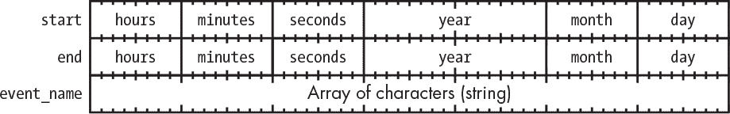

*图 7-7：日历条目的结构*

结构通常比你预期的占用更多的内存空间。我在“内存”一节中讨论了对齐和非对齐内存，具体见第 94 页。假设我们将日期时间结构构建在为 32 位计算机预留的区域中，如图 4-2 所示，位于第 95 页。编程语言会根据程序员指定的顺序保持结构成员的位置，因为这可能很重要。但编程语言还必须遵守对齐要求（见图 4-3，位于第 95 页），这意味着它不能将年份放置在第四和第五字节中，如图 7-7 所示，因为这会跨越边界。语言工具通过根据需要自动添加*填充*来解决这个问题。我们结构的实际内存布局会像图 7-8 所示。


*图 7-8：带有填充的日期时间结构*

你可以重新排列结构成员，以确保最终得到一个没有填充的 7 字节结构。当然，当你将一对这样的结构合并成日历结构时，语言工具可能会将它们填充到 8 字节。

值得一提的是，这是一个人为构造的例子，实际上你不必以这种方式处理日期和时间。许多系统的标准，尤其是源自 UNIX 的系统，采用 32 位数字来表示自“UNIX 纪元”开始以来的秒数，即 1970 年 1 月 1 日。这种方案将在 2038 年耗尽位数，但许多系统已经为此扩展到 64 位。

图 1-21 展示了一种使用四个 8 位值表示带透明度的颜色的方法。这是结构体的一个很好的应用，但它并不总是查看这些数据的最佳方式。例如，如果我们需要复制一个颜色，直接复制所有 32 位会比进行四次 8 位复制更高效。另一个复合数据类型来帮忙。

不仅我们可以像在上一节看到的那样有套房，我们还可以有带活动隔断的办公室，这在 C 语言中被称为*联合体*。联合体允许对同一空间或内容进行多种视图。结构体和联合体的区别在于，结构体中的每一部分都需要占用内存，而联合体中的所有部分共享同一块内存。图 7-9 将 RGBα结构体与无符号长整型结合，形成了一个联合体。

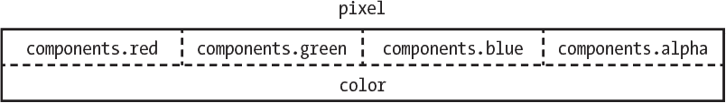

*图 7-9：像素联合体*

使用联合体和 C 语言语法，我们可以将`pixel.color`设置为`0x12345678`，然后`pixel.components.red`就是`0x12`，`pixel.components.green`就是`0x34`，依此类推。

### 单链表

数组是存储列表数据最高效的方式。它们只存储实际数据，不需要任何额外的管理信息。但它们并不适用于任意数量的数据，因为如果我们没有预留足够大的数组，就必须创建一个更大数组并将所有数据复制进去。如果我们将数组做得比实际需要的大，它们也会浪费空间。同样的，如果你需要将元素插入到列表的中间或删除元素，也需要进行复制。

*链表*在你不知道将跟踪多少个元素时，相比数组可能会表现得更好。使用结构体实现的单链表，看起来像图 7-10。

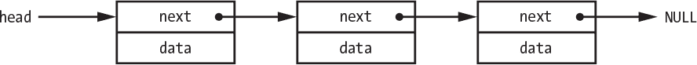

*图 7-10：单链表*

请注意，`next`是一个指针，保存链表中下一个元素的地址。链表中的第一个元素称为*头*，最后一个元素称为*尾*。我们可以通过`next`是一个不能指向其他链表元素的值来识别尾部，通常是`NULL`指针。

图 7-10 中展示的链表和数组之间的一个大区别是，所有数组元素在内存中是连续的，而链表元素可以在内存中的任何地方，形态更像是图 7-11。

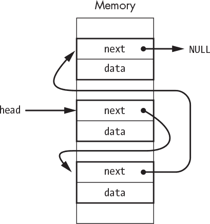

*图 7-11：内存中的单链表*

向链表中添加元素很简单；只需将其放到头部，如图 7-12 所示。

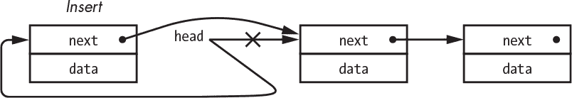

*图 7-12：单链表插入*

删除元素要复杂一些，因为我们需要使前一个元素的`next`指针指向下一个元素，如图 7-13 所示。


*图 7-13：单链表删除*

一种方法是使用一对指针，如图 7-14 所示。

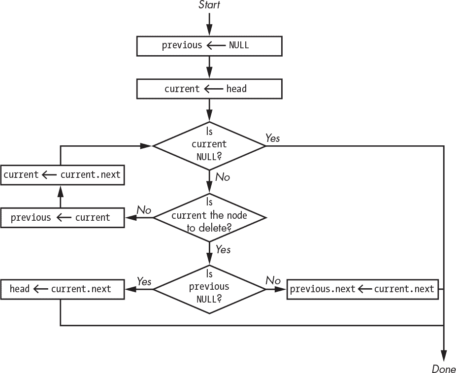

*图 7-14：使用一对指针进行单链表删除*

`current`指针遍历列表，寻找要删除的节点。`previous`指针让我们可以调整要删除节点之前节点的`next`。我们使用点号（`.`）表示结构体的成员，因此`current.next`表示当前节点的下一个成员。

**注意**

*图 7-14 并不是一个很好的例子；不过公平地说，在写这一节时，我上网查找了，发现有些算法更糟糕。这里代码的问题在于，它很复杂，因为需要为列表头进行特殊测试。*

图 7-15 中的算法展示了*双重间接寻址*如何消除特殊情况，从而简化代码。

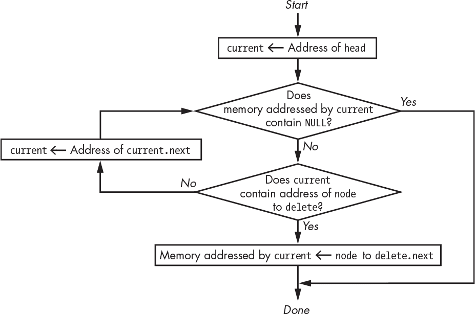

*图 7-15：使用间接寻址进行单链表删除*

让我们更详细地检查一下这个算法的工作原理。看看图 7-16。下标显示了随着算法的执行，`current`是如何变化的。

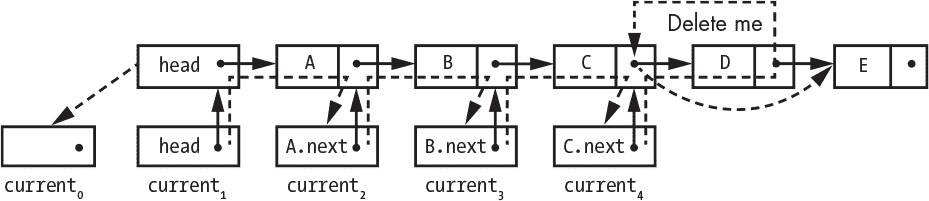

*图 7-16：单链表删除的实际操作*

图 7-16 中显示的步骤比较复杂，我们来逐步分析一下。

1.  我们从将`current`[`0`]设置为`head`的地址开始，这样得到`current`[`1`]，而`current`[`1`]又指向`head`。这意味着`current`指向`head`，而`head`指向列表元素`A`。

1.  我们并不寻找元素`A`，所以继续向前移动。

1.  如虚线箭头所示，我们将`current`设置为`current`指向的元素的`next`指针的地址。由于`current`[`1`]指向`head`，而`head`指向元素`A`，因此`current`[`2`]最终指向`A.next`。

1.  这仍然不是我们想要删除的元素，所以我们重新执行一遍，导致`current`[`3`]引用`B.next`。

1.  这仍然不是我们想要删除的元素，所以我们重新执行一遍，导致`current`[`4`]引用`C.next`。

1.  `C.next`指向元素`D`，这是我们想要删除的元素。沿着浅虚线箭头，我们通过`current`指向`C.next`，到达`D`，并将`C.next`替换为`D.next`的内容。由于`D.next`指向元素`E`，现在`C.next`指向`E`，如粗虚线箭头所示，成功将`D`从列表中移除。

我们可以修改之前的算法，将链接插入到列表的中间。如果我们想要按日期、名称或其他标准对列表进行排序，这可能会很有用。

之前我提到过，第二种算法生成了更好的代码。让我们比较一下以 C 语言编写的两个版本。你不需要理解这些代码就能看到清单 7-1 和清单 7-2 之间的区别。

```
struct node {

    struct node *next;

    // data

};

struct node *head;

struct node *node_to_delete;

struct node *current;

struct node *previous;

previous = (struct node *)0;

current = head;

while (current != (struct node *)0) {

    if (current == node_to_delete) {

        if (previous == (struct node *)0)

            head = current->next;

        else

            previous->next = current->next;

        break;

    }

    else {

            previous = current;

            current = current->next;

    }

}
```

*清单 7-1：使用一对指针的单向链表删除的 C 语言代码*

```
struct node {

    struct node *next;

    // data

};

struct node *head;

struct node *node_to_delete;

struct node **current;

for (current = &head; *current != (struct node *)0; current = &((*current)->next))

    if (*current == node_to_delete) {

            *current = node_to_delete->next;

            break;

    }

}
```

*清单 7-2：使用双重间接寻址的单向链表删除的 C 语言代码*

如你所见，清单 7-2 中的间接寻址版本的代码比清单 7-1 中使用一对指针的代码要简单得多。

### 动态内存分配

我们讨论的链表插入方便地忽略了一些重要的内容。我展示了如何插入一个新节点，但没有说明该节点的内存是从哪里来的。

我们在图 5-16 中看到，程序的数据空间从一个静态分配的数据段开始，接着是运行时库为程序设置的堆。这是程序可以使用的所有数据内存（除了栈和中断向量），适用于没有内存管理单元（MMU）的机器。在有 MMU 的系统上，运行时库会请求它认为需要的内存量，因为占用所有主内存没有意义。*break*是程序可用内存的结束位置，并且有一些系统调用可以增大或缩小可用内存的量。

变量如数组的内存是静态的；也就是说，它被分配了一个不会改变的地址。像链表节点这样的东西是动态的；它们根据需要出现和消失。我们从堆中为它们分配内存。

程序需要某种方式来管理堆内存。它需要知道哪些内存正在使用，哪些内存是可用的。为此有库函数，这样你就不需要自己编写。在 C 语言中，它们是`malloc`和`free`函数。让我们看看它们是如何实现的。

`malloc`的一个实现通过使用单向链表数据结构来工作。堆被划分为多个块，每个块都有一个大小和指向下一个块的指针，如图 7-17 所示。

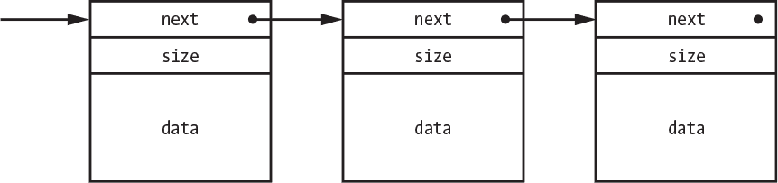

*图 7-17：堆管理的 malloc 结构*

最初堆内存只有一个块。当程序请求内存时，`malloc`会查找一个足够大的块，返回指向请求空间的指针，并调整块的大小以反映它已分配的内存。当程序使用`free`函数释放内存时，它只是将该块重新放回链表中。

在不同的时刻，`malloc`会扫描链表中的相邻空闲块，并将它们合并为一个更大的块。做到这一点的一种方式是在分配内存时（调用`malloc`），因为分配内存时需要通过链表查找足够大的块。随着时间的推移，内存空间可能会变得*碎片化*，即使所有内存没有用完，也没有足够大的内存块可以满足请求。在具有 MMU（内存管理单元）的系统中，如果需要，可以调整断点来获取更多内存。

你可以看到，这种方法有一定的开销：`next`和`size`在 64 位机器上为每个块增加了 16 字节的开销。

释放未分配的内存是一个经验不足的程序员常犯的错误。另一个错误是继续使用已经释放的内存。正如在图 7-17 中所看到的，如果你在分配的内存边界外写入数据，可能会破坏`size`和`next`字段。这特别狡猾，因为这个问题可能直到后续操作需要使用这些字段中的信息时才会显现出来。

技术进步的一个副作用是，小型计算机通常配备的内存远远超过程序的需求。在这些情况下，最好直接静态分配所有内存，因为这样可以减少开销并消除内存分配错误。

### 更高效的内存分配

包含文本字符串的链表很常见。假设我们有一个链表，其中每个节点包含一个指向字符串的指针，如图 7-18 所示。

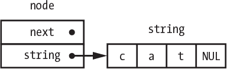

*图 7-18：包含字符串的链表节点*

我们不仅需要为每个节点分配内存，还需要为附加在节点上的字符串分配内存。`malloc`的开销可能会很大，特别是在 64 位机器上，我们需要为 16 字节的节点分配 16 字节的开销，然后再为字符串（如图 7-18 中的 4 字节字符串`cat`）分配 16 字节的开销。

我们可以通过同时分配节点和字符串来减少开销。与其先分配节点再分配字符串，我们可以分配节点和字符串大小的总和，再加上可能需要的对齐填充空间。这意味着节点的大小是可变的，这样没问题。这个技巧将开销减半。最终结果如下图图 7-19，其中包含字符串`cat`。

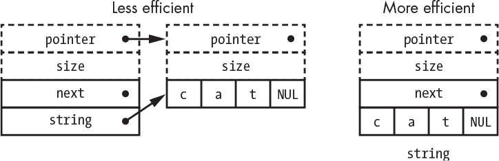

*图 7-19：更高效的内存分配*

当你删除节点时，这种方法也更高效。在效率较低的情况下，需要两次调用`free`，一次释放字符串，另一次释放节点。而在效率较高的情况下，两者可以通过一次调用同时释放。

### 垃圾回收

显式的动态内存管理可能会引发两个问题，这实际上是指针使用不当的问题。记住，指针只是一个表示内存地址的数字。但并非所有的数字都是有效的内存地址。使用指针尝试访问不存在的内存，或访问不符合处理器对齐规则的内存，可能会引发异常并导致程序崩溃。

你可能正在学习一种像 Java 或 JavaScript 这样的编程语言，这些语言没有指针，但支持动态内存分配，没有类似于`malloc`和`free`的对应功能。这些语言实现了*垃圾回收*，这项技术由美国计算机和认知科学家约翰·麦卡锡（John McCarthy，1927–2011）于 1959 年为 LISP 编程语言发明。垃圾回收经历了一次复兴，部分原因是它被认为是解决不良指针使用的有效方法。

像 Java 这样的语言使用引用而不是指针。*引用*是指针的抽象，提供了与指针相同的功能，但不会暴露内存地址。

垃圾回收语言通常有一个`new`操作符，用于创建项目并为其分配内存（该操作符也出现在非垃圾回收语言如 C++ 中）。没有与删除项目对应的操作符。相反，语言的运行时环境跟踪变量的使用，并自动删除那些它认为不再使用的变量。有许多方式可以实现这一点，其中一种方式是保持对变量的引用计数，以便在没有引用时删除变量。

垃圾回收是一种权衡；它并非没有问题。一个问题类似于 LSI-11 刷新问题（参见《随机存取存储器》在第 82 页的描述），即程序员对垃圾回收系统没有太多控制权，垃圾回收系统可能会决定运行，即使程序需要做更重要的事情。此外，程序通常占用大量内存，因为很容易留下不必要的引用，导致内存无法被回收。这使得程序运行缓慢，而不是因为错误的指针直接崩溃。事实证明，尽管旨在解决指针问题，但追踪不必要的引用实际上更难调试。

### 双向链表

我们的单向链表`删除`函数可能相当慢，因为我们必须找到我们想要删除元素之前的那个元素，以便调整其指针。这可能涉及遍历一个非常长的列表。幸运的是，有一种不同类型的链表可以通过增加一些额外的内存来解决这个问题。

双向链表不仅包括指向下一个元素的链接，还包括指向上一个元素的链接，正如你在图 7-20 中看到的那样。这增加了每个节点的开销，但它消除了在`删除`操作中遍历列表的需要，因此这是一个空间/时间的权衡。


*图 7-20：双向链表*

双向链表的优点在于你可以在任何位置进行插入和删除，而无需花时间遍历链表。图 7-21 展示了如何在元素 A 后插入一个新节点。

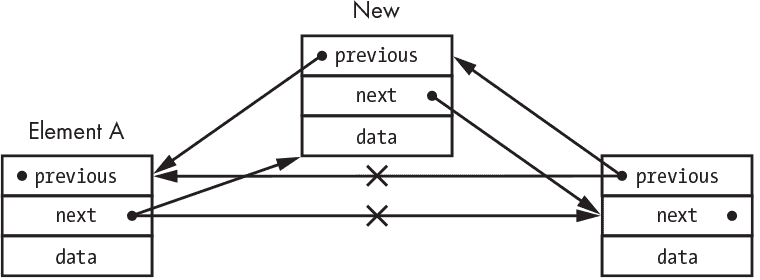

*图 7-21：双向链表插入*

图 7-22 显示了删除一个元素也同样简单。

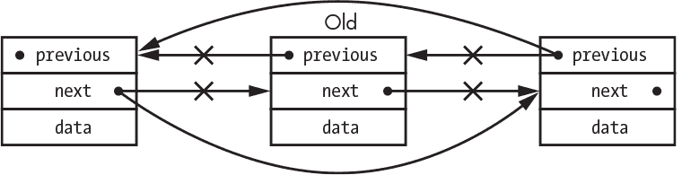

*图 7-22：双向链表删除*

如你所见，操作双向链表元素时不需要遍历。

### 层级数据结构

到目前为止，我们只看过*线性*数据结构。它们在许多应用中非常有用，但它们的线性结构有时也会带来问题。这是因为存储数据只是工作的其中一半；我们还需要能够高效地检索数据。假设我们有一个存储在链表中的事物列表。我们可能需要遍历整个列表才能找到某个特定项；对于长度为*n*的列表，可能需要进行*n*次查找。对于少量的数据，这没有问题，但对于大量的*n*来说，这就不切实际了。

之前我们看到如何使用指针将节点连接成链表。我们不受指针数量的限制，因此我们组织数据的方式仅受我们的想象力和内存空间的限制。例如，我们可以想出一个节点的层级结构，如在图 5-4 中的示例。

最简单的层级数据结构是*二叉树*——“二进制”并不是指二进制数字，而是因为一个节点可以连接到两个其他节点。让我们创建一个节点，其中包含一个数字，按图 7-23 所示排列。


*图 7-23：包含数字的二叉树节点*

*根*是树形结构中相当于链表头部的部分。

我们将去一个宾果厅，记录二叉树中被叫出的数字。然后我们可以查找这些数字，看看它们是否已经被叫出。图 7-24 展示了一个将数字插入树中的算法。它的工作方式类似于我们在单向链表删除时使用的间接寻址。

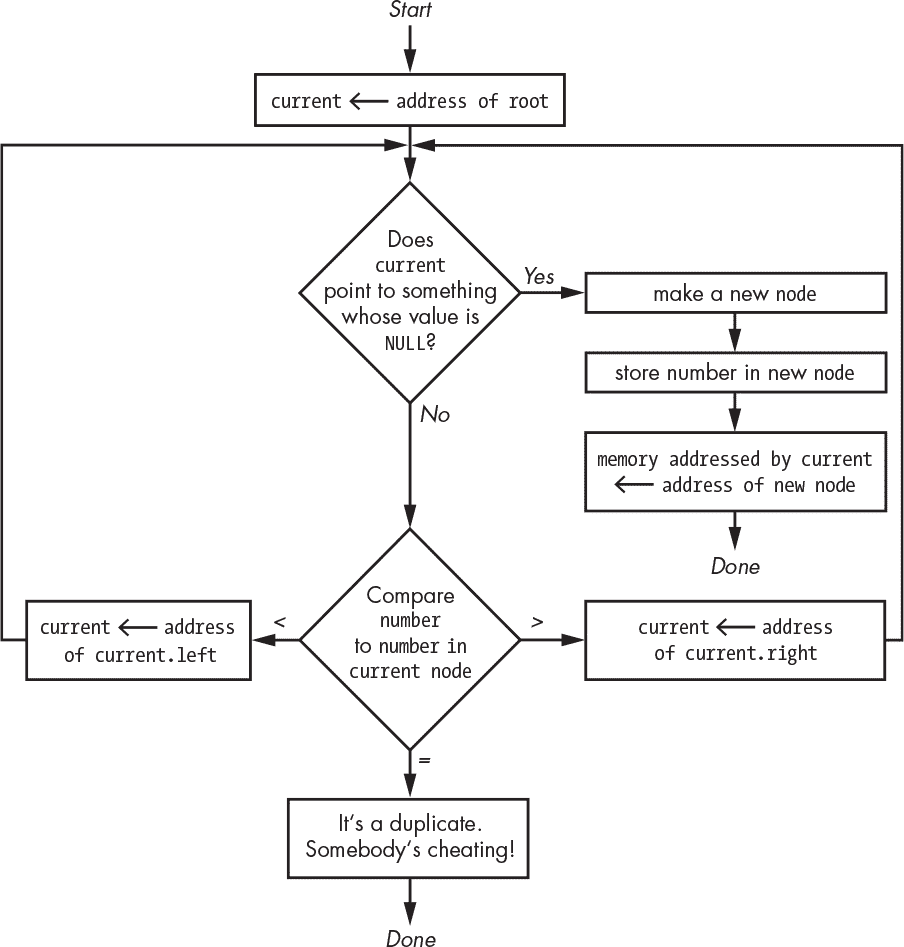

*图 7-24：二叉树插入算法*

我们通过插入数字 8、6、9、4 和 5 来看看这个过程的实际操作。当我们插入 8 时，根节点处没有任何节点，所以我们把它插入到那里。当插入 6 时，根节点位置已被占用，因此我们比较当前节点；因为 6 小于 8，我们走到左侧。左侧为空，于是我们将一个新节点放在那里。9 放在 8 的右侧，4 放在 6 的左侧，依此类推，如图 7-25 所示。

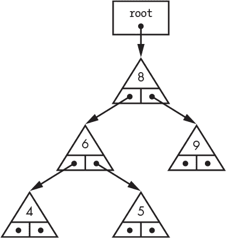

*图 7-25：二叉树*

你可以看到，尽管这个数据结构中有五个元素，但在最坏的情况下，我们只需要检查三个节点就能找到一个。这比链表要好，因为链表可能需要检查所有五个元素。在二叉树中查找某个元素很容易，如图 7-26 所示。请注意，由于我们不需要修改树，因此这里不需要指向节点的指针。

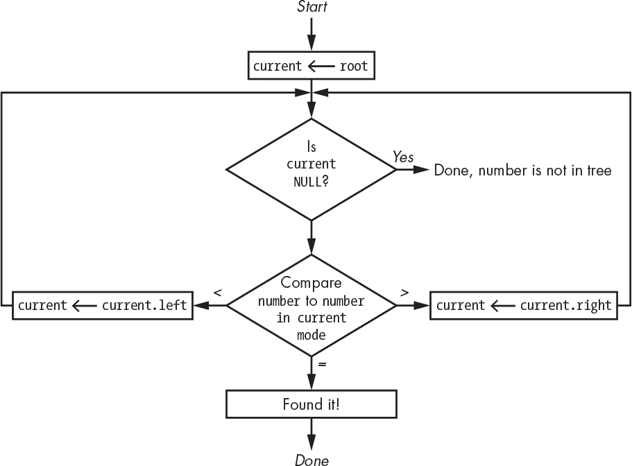

*图 7-26：二叉树查找算法*

你可能已经注意到，树的排列方式取决于插入顺序。图 7-27 展示了如果按顺序插入数字：4、5、6、8 和 9，会发生什么。

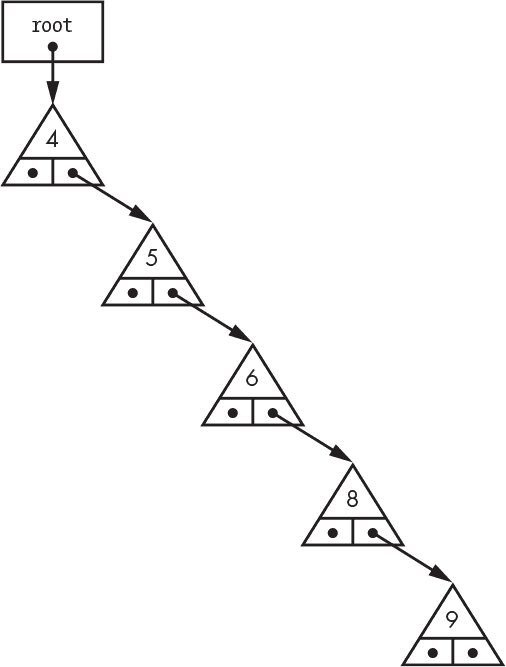

*图 7-27：平衡不佳的二叉树*

这种退化的情况看起来很像一个单链表。不仅我们失去了二叉树的优势，而且现在还有未使用的左指针的额外开销。我们确实希望我们的树能够像图 7-28 右侧的那棵树一样。

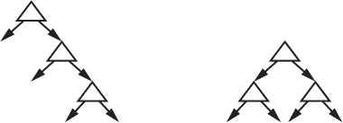

*图 7-28：不平衡与平衡二叉树*

在二叉树中搜索某个元素的时间与树的深度相关；如果它位于* n *层深的位置，那么需要进行* n *次测试来找到它。在平衡二叉树中，查找时间是 log[2]*n*，而在链表中则是*n*。从这个角度看，在最坏的情况下，如果链表有 1,024 个节点，你需要访问所有 1,024 个节点，而在平衡二叉树中，你只需要访问 10 个节点。

有许多树平衡算法，我在这里不会详细讲解。重新平衡树需要时间，因此在算法速度、插入/查找时间和重新平衡时间之间存在权衡。树平衡算法有更多的计算开销，有些还会增加额外的存储开销。然而，随着树的大小增加，这些开销很快就被克服，因为 log[2]*n*远小于*n*。

### 面向大众的存储

我们在“块设备”一节中提到过磁盘驱动器，在第 85 页中讨论过。现在让我们更详细地了解它们，以便理解它们的数据组织特性。警告：我们将在这里疯狂使用指针！

我提到过，磁盘上的基本单位是 *块*，连续的块称为 *簇*。如果我们能仅仅将数据存储在簇中——簇是轨道上的连续扇区——那该多好。虽然在某些需要高性能的情况下会这么做，但这不是一个好的通用解决方案，而且可能会有比一条轨道能容纳的数据还多的情况。相反，数据被存储在可用的任何扇区中；操作系统的设备驱动程序提供了连续存储的假象。现在，我们进入了一个熟悉的领域，但有一个变化：我们不再是找到一个存储块来容纳一个对象，而是需要找到足够的固定大小的块来容纳一个对象，并将对象分割到这些块中。

链表并不是跟踪哪些磁盘块是空闲的，哪些是已使用的好方法，因为遍历列表会太慢。一块 8 TiB 的磁盘有近 20 亿个块，在最差的情况下，每秒可以访问 250 个块。这加起来超过 15 年，这使得它不可行。这听起来很糟糕，但请记住，那是每秒 1 MiB 的数据。

当我们在内存中管理数据时，只需使用指针引用它即可。但这些是临时的，因为磁盘用于长期数据存储，我们需要更持久的解决方案。你已经看到了答案：*文件名*。我们需要某种方式将这些文件名存储在磁盘上，并将它们与用于存储文件数据的块关联起来。

管理这一切的方式来自——没错，你猜对了——UNIX。若干块被作为 *inode* 留出来，inode 是磁盘块 *索引*（index）和 *节点*（node）的缩写；因此，inode 就是索引节点。一个 inode 包含关于文件的各种信息，如其所有者、大小和权限。它还包含存储文件数据的块的索引，正如你在图 7-29 中看到的那样。

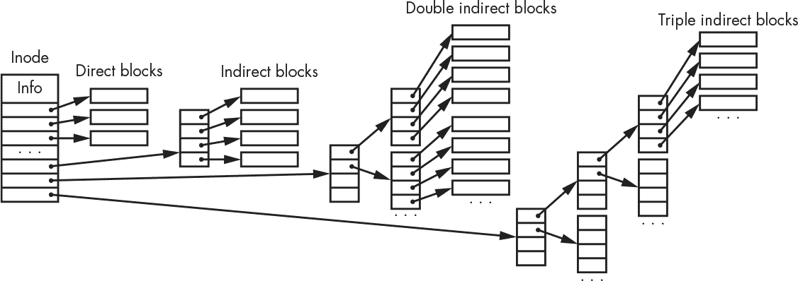

*图 7-29：文件系统数据结构*

这看起来很复杂，但其实并不复杂。一个 inode 通常有 12 个 *直接块* 指针（它们实际上不是指针，只是块索引），这些指针支持最大 4,096 × 12 = 49,152 字节的文件。这对于大多数文件来说足够了。如果文件更大，它将使用 *间接块*。假设是 32 位索引（尽管这些很快会需要 64 位），1,024 个间接块，每个间接块 4 字节，适合在一个块中，将最大文件大小再增加 4 MiB。如果这还不够，还可以通过 *双重间接* 块提供 4 GiB，最后通过 *三重间接* 块提供 4 PiB 的空间。

inode 表示的一个信息是这些块是否包含*目录*信息，而不是其他数据。目录将文件名映射到引用文件数据的 inode。UNIX 的一个好处是，目录实际上只是另一种类型的文件。这意味着目录可以引用其他目录，这正是我们熟悉的树状*层次文件系统*的来源。

到此为止，你可能会觉得这一切看起来像是一个任意的树形结构，过去的确如此。这种安排的一个特点是多个 inode 可以引用相同的块。每个引用称为*链接*。链接使得同一个文件可以出现在多个目录中。事实证明，能够链接到目录也是非常方便的，因此发明了*符号链接*来实现这一点。但符号链接允许文件系统图中出现循环，因此我们需要特别的代码来检测这种情况，以防止无限循环。无论如何，我们有了这个复杂的结构来跟踪已使用的块，但我们仍然缺乏一种有效的方法来跟踪*空闲空间*。

实现这一点的一种方法是使用位图（参见 “位图” 在 第 187 页），每个磁盘块占用 1 个位。位图可能非常大：一个 8TB 的硬盘需要近 20 亿个位，这将消耗约 256 MiB 的空间。这仍然是一个合理的选择——它只占总磁盘空间的不到 0.01%，并且不需要一次性将其全部加载到内存中。

使用位图工作相当简单和高效，特别是当它们存储在 64 位字中时。假设 1 表示正在使用的块，0 表示空闲块，我们可以很容易地查找不全是 1 的字，从而找到空闲块。

但这种方法存在一个问题：文件系统图和空闲空间位图可能会不同步。例如，电力中断可能会发生在数据写入磁盘时。在计算机前面板有开关和闪烁指示灯的黑暗时代，你必须通过前面板开关输入 inode 号来修复损坏的文件系统。这个问题通过如`fsck`之类的程序得到解决，它遍历文件系统图并将其与空闲块数据进行比较。这是一种更好的方法，但随着硬盘容量的增大，这也变得越来越耗时。新的日志记录文件系统设计使得损坏控制更加高效。

### 数据库

二叉树是存储内存中数据的好方法，但在存储大量不适合放入内存的数据时效果并不好。这部分是因为树节点通常较小，因此不容易映射到磁盘扇区。

*数据库*只是以某种方式组织的数据集合。*数据库管理系统 (DBMS)*是一个允许信息存储在数据库中并从中检索的程序。一个 DBMS 通常包含许多接口，这些接口位于底层存储机制之上。

数据库是*B 树*数据结构的常见应用，该结构由德国计算机科学家鲁道夫·拜尔（Rudolf Bayer）和美国计算机科学家埃德·麦克雷特（Ed McCreight）于 1971 年在波音公司发明。B 树是一种平衡树，但不是二叉树。它的空间效率稍逊于平衡二叉树，但性能更好，特别是在数据存储在磁盘上的时候。这又是一个理解内存架构可以导致更高效代码的例子。

假设我们有一个按字母顺序排序的平衡二叉树。它看起来像是图 7-30 所示。

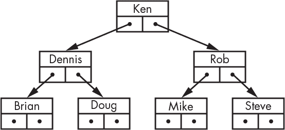

*图 7-30: 平衡二叉树*

B 树节点比二叉树节点有更多的“腿”（子节点）。子节点的数量被选择为使一个节点恰好适合一个磁盘块，如图 7-31 所示。

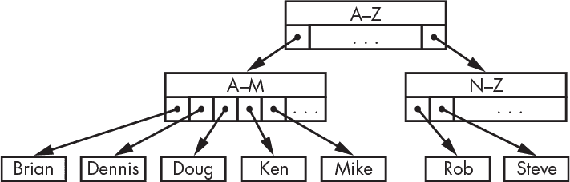

*图 7-31: B 树*

如你所见，内部节点是平衡的，这保证了可预测的查找时间。图 7-31 中存在未使用的子链接，这些链接会消耗空间。当子链接用尽时，你可以通过改变节点覆盖的范围来轻松地重新平衡树。例如，如果 A-M 节点用尽了子节点，可以将其细分为 A-G 和 H-M 节点。这不是一个很好的例子，因为通常使用的是 2 的幂次划分，但这里我们没有偶数个要划分的内容。

每个节点的键更多意味着更少的节点提取。较大的节点并不成问题，因为它们的大小与磁盘块相同，磁盘块是作为一个单元被提取的。由于未使用的子链接，会有一些空间浪费，但这是一个合理的权衡。

### 索引

访问已排序的数据效率很高，但我们通常需要以多种方式访问数据。我们可能需要同时有名字和姓氏，或者名字和最喜欢的乐队。

图 7-31 展示了按名称组织的节点。这些节点通常被称为*主索引*。但我们可以有多个索引，正如图 7-32 所示，这使我们能够以不同的方式高效地搜索数据。


*图 7-32: 多重索引*

索引的权衡在于它们需要维护。每次数据更改时，必须更新每个索引。当查找比修改更为常见时，这是一项值得的成本。

### 移动数据

我之前提到过，使用数组代替链表时，如果数组需要增长，就需要复制数据。为了将页面表从 MMU 中移进移出，或将磁盘位图在磁盘上释放并重新加载，就需要复制数据。程序花费大量时间在不同位置之间移动数据，因此提高效率非常重要。

我们先从一个折中的方法开始：将`length`大小的内存块设置为全 0，如图 7-33 所示。

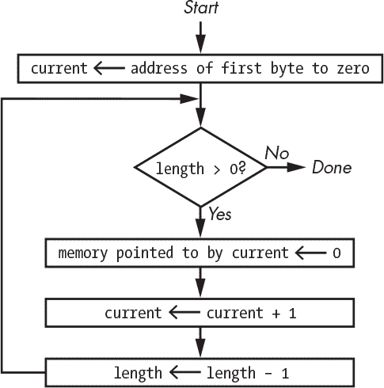

*图 7-33：清零内存块*

这个算法运行得不错，但效率不是很高。假设图 7-33 中的每个框执行的时间相同，我们花更多时间做记账而不是清零内存位置。*循环展开*技术可以提高效率，如图 7-34 所示。例如，假设`length`是一个偶数，我们可以展开循环，使得更多的时间用于清零，而不是做其他事情。

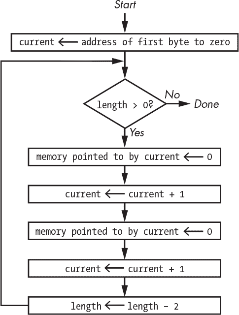

*图 7-34：通过循环展开清零内存块*

如果能有一个更通用的实现那就太好了，幸运的是，确实有。加拿大程序员 Tom Duff 在 Lucasfilm 工作时发明了*Duff 设备*，用于加速数据复制；图 7-35 展示了一个用于清零内存的变体。此方法只有在`length`大于零时才能工作。

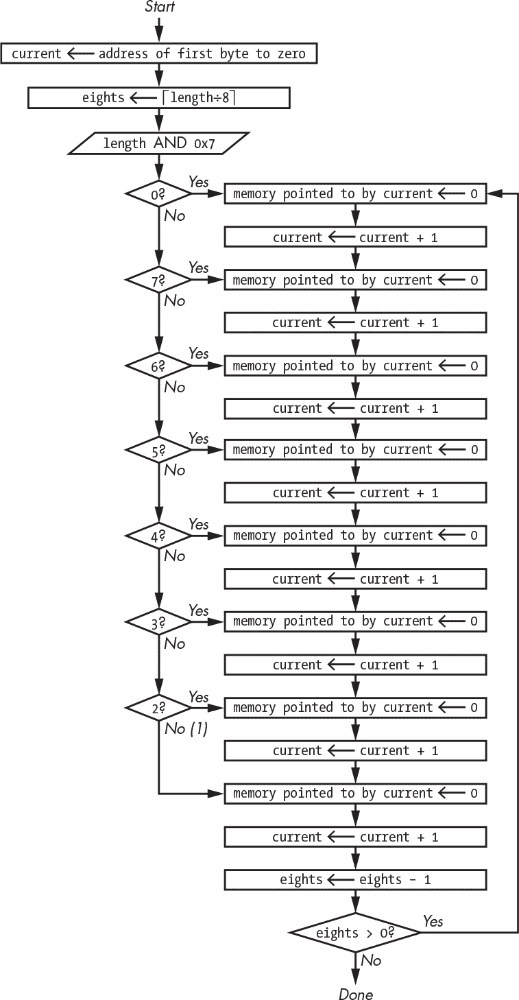

*图 7-35：使用修改版的 Duff 设备清零内存块*

Duff 设备将循环展开八次，并跳转到中间部分处理剩余字节。尽管你可能会想进一步展开循环，但这种方法必须与代码大小平衡，因为将代码放入指令缓存是非常重要的，它带来了显著的速度提升。

你可以看到图中的循环部分，内存清零时间与记账时间的比例得到了大幅改善。尽管最初的设置和跳转到循环中的正确位置看起来很复杂，但实际上并不复杂。它不需要大量的条件分支，只需一些地址操作，如下所示：

1.  通过与 0x7 进行按位与操作，屏蔽掉`length`中除最低 3 位外的所有位。

1.  从 8 中减去结果。

1.  通过与 0x7 进行按位与操作，屏蔽掉除最低 3 位外的所有位。

1.  乘以清零指令之间的字节数。

1.  添加第一个清零指令的地址。

1.  跳转到那个地址。

提高效率的另一种方法是认识到，例如，在 64 位机器上，一次可以清零 8 个字节。当然，需要额外的代码来处理开头和结尾的剩余字节。我们需要使用图 7-36 中的算法，但不在`eights`上进行循环展开，开头和结尾部分需要特殊处理。中间部分我们尽可能多地清零 8 字节一组的数据。

当我们复制数据块而不仅仅是将其设置为某个值时，事情变得更复杂，因为源数据和目标数据通常不会具有相同的字节对齐方式。在这种情况下，值得测试源和目标是否都已按字对齐，因为这是一个相当常见的情况。

复制还面临另一个复杂性，即常常使用复制将数据在内存区域中移动。例如，我们可能有一个充满空格分隔单词的缓冲区，需要读取第一个单词并将其余的内容向下移动，为更多数据腾出空间。复制重叠区域时必须小心；有时需要向后复制，以避免覆盖已有数据。

一个有趣的历史案例是早期的光栅图形终端（请参阅《光栅图形》在第 180 页）被称为*blit*，由加拿大程序员 Rob Pike 在 1980 年代初期于贝尔电话实验室设计，那时还没有为此类操作制造定制集成电路的技术成熟。源数据和目标数据可以重叠，例如在拖动窗口的情况下，数据可以是任何位对齐方式。由于当时的处理器速度相较于今天并不快，因此性能非常重要；blit 使用了 Motorola 68000 处理器。没有 MMU（内存管理单元），所以 Pike 编写了代码，查看源和目标数据，并动态生成最优代码以执行最快的复制。我在一个使用 Motorola 68020 的系统上实现了类似的功能。由于 68020 有指令缓存，生成的代码可以适配其中，因此不必每次都访问指令内存，从而实现了更好的性能。请注意，这也是许多虚拟机中使用的 JIT（即时编译）技术的先驱，包括 Java。

### 矢量化 I/O

高效复制数据对于系统性能很重要，但完全避免复制则更加有效。大量数据在操作系统中传输，进出用户空间程序，这些数据通常不在连续的内存中。

例如，假设我们正在生成一些希望写入音频设备的 mp3 格式音频数据。像许多文件格式一样，mp3 文件由多个*帧*组成，每一帧都包括一个*头部*，后面跟随一些数据。典型的音频文件包含多个帧，在许多情况下，这些帧的头部是相同的，如图 7-36 所示。

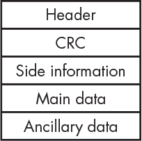

*图 7-36：mp3 帧布局*

我们可以通过将所有数据复制到一个缓冲区来构建每一帧，但当我们将数据写入音频设备时，还需要再次复制这些数据。另一种方法是将每一帧的每个部分单独写入，但这会增加上下文切换的开销，并且如果只写入了部分帧，可能会导致音频设备出现问题。

如果我们能直接将一组指向框架每个部分的指针交给系统，并让系统在写入时将这些部分聚集起来，那将更高效，如图 7-37 所示。这是非常值得的，因此值得支持系统调用（`readv`，`writev`）。

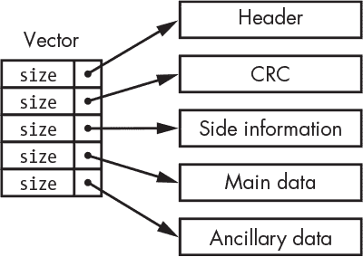

*图 7-37：数据收集*

这个思路是将一个大小和数据指针的向量交给操作系统，然后操作系统按顺序将它们组装起来。读取和写入都有不同的版本：写入被称为*聚集*，因为数据是从多个地方收集过来的，而读取被称为*散布*，因为数据被分散到多个地方。这个概念被称为*scatter/gather*。

Scatter/gather（散点/聚集）成为主流，源于伯克利网络代码，这些代码成为了互联网的基础。我在“TCP/IP”一章中提到过，第 158 页指出，IP 数据是通过数据包发送的，而 TCP 负责确保数据包到达并且顺序正确。从通信端点（好吧，对你来说可能是通信端点，但对我来说是套接字）到达的数据包被收集成一个连续的数据流，以便呈现给用户程序。

### 面向对象的陷阱

由于你正在学习编程，你可能正在学习像 Java、C++、Python 或 JavaScript 这样的*面向对象*语言。面向对象编程是一种很好的方法论，但如果不加以审慎使用，它可能会导致性能问题。

面向对象编程首次在 C++中获得了真正的关注。C++是一个有趣的案例，因为它最初是建立在 C 语言之上的，这让我们有机会看到它是如何工作的。

*对象*具有*方法*，相当于函数，还有*属性*，相当于数据。对象所需的一切都可以汇集到一个单一的数据结构中。C 语言对类型转换和指针的支持，尤其是对指向函数的指针的支持，在这里起到了重要作用。一个用于对象的 C 结构可能类似于图 7-38 所示。

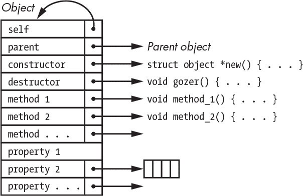

*图 7-38：用于对象的 C 结构*

一些属性，比如具有整数值的（`property 1`），驻留在对象结构本身中，而其他属性则需要额外的内存分配（`property 2`），由对象结构引用。

显然，这种结构可能会变得相当庞大，尤其是在方法很多的情况下。我们可以通过将方法分离到一个单独的结构中来解决这个问题——这是一种空间/时间的权衡——如图 7-39 所示。

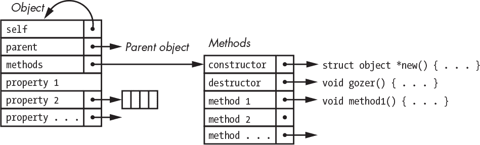

*图 7-39：单独的方法结构*

程序员在丹麦程序员比约恩·斯特劳斯特鲁普发明 C++之前很久就开始使用这种面向对象编程的方法。最初的 C++是 C 语言的一个封装，做了类似这样的事情。

为什么这很重要？面向对象的理想主义者认为对象是万灵药。但正如你在前面的图中看到的那样，使用对象会带来一定的开销。对象必须携带自己的方法，而不是使用全局可用的函数。结果是，对象不像纯数据类型那样紧凑，所以当性能至关重要时，还是应该坚持使用经典的数组。

### 排序

排序数据有很多原因。有时我们只是想要排序结果，比如当我们按字母顺序排列名字以便让别人更容易找到它们。很多时候，我们希望以排序的形式存储数据，因为这样可以通过减少内存访问次数来加速搜索。

我这里不打算深入讲解排序算法，因为这是一个非常成熟的话题，已经在许多书籍中讨论过了。而且有很多优秀的排序函数可用，因此你不太可能需要自己编写，除非是作为作业题目。但有几个重要的要点需要记住。

其中一点是，如果你要排序的对象的大小大于指针的大小，你应该通过重新排列指向数据的指针来排序，而不是直接移动数据本身。

此外，排序的约定已经逐渐发展。我们的宾果厅树示例使得基于算术比较做出决策成为可能；我们根据一个数字是否小于、等于或大于另一个数字来做决策。这种决策方法源自 1956 年的 FORTRAN 编程语言，该语言包含了类似于清单 7-3 的语句。

```
IF (expression) branch1, branch2, branch3
```

*清单 7-3：一个 FORTRAN 算术 IF 语句*

这个`IF`语句评估了`expression`，如果结果小于零就跳转到`branch1`，如果是零就跳转到`branch2`，如果大于零就跳转到`branch3`；这些分支类似于我们在《分支结构》中看到的内容，出现在第 105 页。

排序数字是直接的。将相同的方法应用于排序其他事物也是很好的选择。我们在图 7-10 中看到，列表节点可以包含任意数据；树节点和其他数据结构也是如此。

UNIX 版本 III 引入了一个库函数，叫做`qsort`，它实现了一种变种的经典*快速排序*算法。关于`qsort`实现的有趣之处在于，虽然它知道如何排序，但它并不知道如何进行比较。因此，它利用了 C 语言的函数指针；当你调用`qsort`并传入一个待排序的列表时，你还需要提供一个比较函数，该函数返回`<0`、`0`或`>0`，分别表示小于、等于或大于，就像 FORTRAN 算术中的`IF`语句。这种方法使得调用者可以通过`qsort`按照自己的需求进行排序。例如，如果一个节点包含名字和年龄，提供的比较函数可以先按年龄比较，再按名字比较，这样`qsort`就会按照年龄和名字的顺序进行排序。这种方法效果很好，已经被许多其他系统复制。

标准 C 库字符串比较函数`strcmp`就是在考虑到这一点的情况下设计的；它返回一个小于、等于或大于零的值。这也成为了事实上的标准做法。

原始的 ASCII 版本的`strcmp`只是在字符串之间逐个字符地进行减法比较。如果字符相同，继续比较，直到字符串末尾，返回`0`。否则，返回减法结果。

如果你只是要排序以分发数据到树形结构中，这样做很好，但如果你是为了按字母顺序排序，它就会出问题。在 ASCII 时代它是有效的——你可以在表 1-10 中看到，数字顺序和字母顺序是一样的。问题出在对其他*地区设置*的支持上。随着对其他语言的支持逐步加入，只有 ASCII 字符在数字排序上符合正确的*排序顺序*，即符合特定语言的排序规则。

例如，德国字母*β*，即锐音*S*（*Eszett* 或 *scharfes S*）应该赋予什么值呢？它的 Unicode 值是 0x00DF。由于这一点，单纯的字符串比较会把单词*Straβe*排在*Strasse*之后。但这实际上是同一个词的不同表示形式。*β*等同于*ss*。如果字符串比较考虑到地区设置，它会认为这两个词是相等的。

### 制作哈希

到目前为止，我们看到的所有查找方法都涉及在遍历数据结构时反复测试。还有另一种方法在某些情况下性能更好，叫做*哈希*。哈希有很多应用。我们在这里讨论的是内存中的存储和检索，而不是大规模存储。一般概念是对搜索键应用某种*哈希函数*，将它们均匀地“溅射”到某个位置。如果哈希函数易于计算，并且能够将一个键转换成在唯一位置的“溅射”，那么单步查找应该非常快。当然，还是有一些实际问题需要考虑。

每个分裂符号代表与键相关联的对象的存储。哈希函数必须产生适合内存的值。而且它不应该将数据分散到过多的内存中，否则性能会受到影响，既因为使用了过多内存，也因为缺乏局部性引用。因为我们无法预先了解键的情况，设计一个完美的哈希函数实际上是不可能的。

限制存储的一种方法是使用一个哈希函数，将键映射到数组索引。这个数组被称为*哈希表*，如图 7-40 所示。数组元素被称为*桶*。

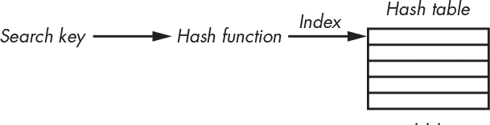

*图 7-40：哈希*

一个好的哈希函数有什么特点？它需要易于计算，并且需要将键均匀地分布到桶中。一个对于文本效果不错的简单哈希函数就是将字符值相加。这还不够，因为和可能会产生一个超出哈希表末尾的索引，但我们可以通过将索引设置为和对哈希表大小取模来轻松解决这个问题。让我们来看一下这个方法在实践中的效果。我们将使用一个大小为 11 的表；素数是一个好的表大小，因为和的倍数最终会落入不同的桶，从而改善分布模式。

假设我们有一个应用程序，它记录我们最喜欢的即兴乐队音乐会中播放的歌曲。也许它会存储最后播放的日期。我们将只使用每首歌曲名称的第一个词。

如图 7-41 所示，我们从桶中放入*Hell*，在这种情况下是桶 4。接下来是桶 9 中的*Touch*，然后是桶 3 中的*Scarlet*。但是当我们遇到*Alligator*时，我们遇到了一个问题，因为哈希函数的值与*Scarlet*的值相同。这叫做*碰撞*。

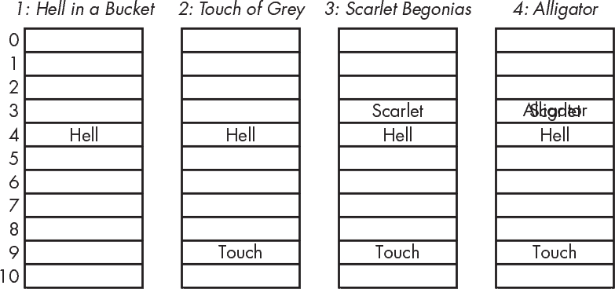

*图 7-41：哈希碰撞*

我们通过将桶替换为*哈希链*来解决这个问题，哈希链在最简单的形式下是单向链表，如图 7-42 所示。

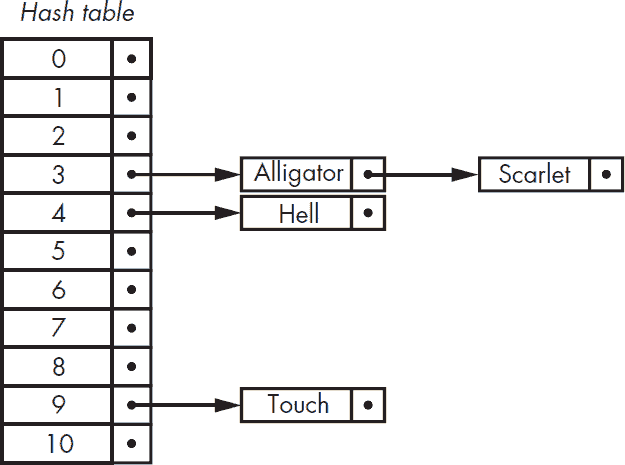

*图 7-42：哈希链*

哈希链管理中存在许多权衡。我们可以像图 7-42 中那样将冲突插入链的头部，因为这种方法很快。但当链变长时，查找可能会变慢，因此我们也可以进行插入排序，虽然需要更多时间，但这样我们就不必遍历整个链来判断一个项目是否存在。还有许多不同的冲突处理方法——例如，消除哈希链并使用某些算法在表中找到一个空槽。

在不知道预期符号数量的情况下，很难选择合适的哈希表大小。如果链的长度过长，可以通过跟踪链的长度并扩展哈希表来解决。这可能是一个昂贵的操作，但它的回报是值得的，因为它不需要频繁执行。

哈希函数有很多种变体。哈希函数的“圣杯”是*完美哈希*，它将每个键映射到一个独特的桶中。除非事先知道所有的键，否则几乎不可能创建一个完美的哈希函数，但数学家们已经想出了比本例中使用的哈希函数更好的函数。

### 效率与性能

很多努力都投入到了高效搜索算法的研究中。大部分工作是在计算机昂贵的时代进行的。性能和效率是紧密相关的。

电子产品的成本已经急剧下降，以至于几乎不可能购买任何不包含多余蓝色 LED 的产品。性能和效率已被解耦；有时，通过在更多处理器上使用效率较低的算法，而不是在更少的处理器上使用更高效的算法，可以实现更好的性能。

这种解耦的一种应用是数据库*分片*，也叫做*水平分区*。分片是将一个数据库拆分成多个分片，每个分片都存储在自己的机器上，如图 7-43 所示。

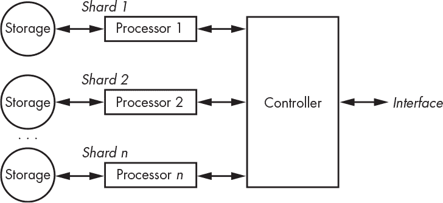

*图 7-43：数据库分片*

通过接口请求的数据库操作会被发送到所有分片，然后由控制器组装结果。这种技术提高了性能，因为操作被分配到多个工作者上。

分片的一种变体被称为*MapReduce*，它本质上允许你向控制器提供代码，用于汇总中间结果。这使得像“计算所有数学课学生人数”这样的操作成为可能，而无需先请求学生名单然后再统计他们的数量。

数据库并不是这种多处理器方法的唯一应用。一个历史上有趣的应用是 1998 年电子前沿基金会开发的 DES（数据加密标准）破解器；详情请参阅《Cracking DES》一书（O'Reilly，1998）。这台机器使用了 1,856 个定制的处理器芯片，每个芯片尝试一系列的密钥来破解加密数据。任何“有趣”的结果都会被转发到控制器进行进一步分析。这台机器每秒可以测试 900 亿个密钥。

### 总结

本章介绍了数据可以如何组织，以利用你迄今为止了解的计算机硬件知识。在下一章中，你将看到你的程序是如何被转换为计算机硬件可以理解的形式的。
