## 第八章：**语言处理**


很明显，只有疯子才会尝试编写计算机程序。这个一直都是真的，但*编程语言*至少让这项工作变得容易了很多。

本章探讨了编程语言是如何实现的。其目的是帮助你理解代码发生了什么。你还将了解你编写的代码是如何转换为可执行的*机器语言*。

### 汇编语言

我们在表 4-4 的第 108 页看到过一个用机器语言实现的计算斐波那契数的程序。正如你想象的那样，搞清楚所有的位组合指令是相当痛苦的。原始的计算机程序员厌倦了这种方式，发明了一种更好的编写计算机程序的方法，称为*汇编语言*。

汇编语言做了几件了不起的事情。它让程序员可以使用*助记符*来表示指令，这样他们就不必记住所有的位组合。它允许程序员为地址命名或使用*标签*。还允许程序员加入*注释*，帮助其他人阅读和理解程序。

一个名为*汇编器*的程序读取汇编语言程序，并从中生成*机器代码*，在这个过程中填充标签或*符号*的值。这特别有帮助，因为它能防止因移动内容而导致的愚蠢错误。

清单 8-1 展示了表 4-4 中的斐波那契程序在假设的汇编语言中的样子，来自第四章。

```
          load     #0         ; zero the first number in the sequence

          store    first

          load     #1        ; set the second number in the sequence to 1

          store    second

again:    load     first     ; add the first and second numbers to get the

          add      second    ; next number in the sequence

          store    next

                             ; do something interesting with the number

          load     second    ; move the second number to be the first number

          store    first

          load     next      ; make the next number the second number

          store    second

          cmp      #200      ; are we done yet?

          ble      again     ; nope, go around again

first:    bss      1         ; where the first number is stored

second:   bss      1         ; where the second number is stored

next:     bss      1         ; where the next number is stored
```

*清单 8-1：计算斐波那契数列的汇编语言程序*

`bss`（代表*以符号开始的块*）*伪指令*预留了一块内存——在此例中是一个地址——但并没有在该位置存放任何内容。伪指令与机器语言指令没有直接的对应关系；它们是对汇编器的指令。正如你所看到的，汇编语言比机器语言更容易处理，但它仍然是非常繁琐的内容。

早期的程序员必须依靠自己的力量。最初的计算机没有汇编器可用，因此程序员不得不通过手动计算所有的位来编写第一个汇编器。这个第一个汇编器非常原始，但一旦它能工作，就可以用它来制作更好的版本，依此类推。

“*引导*”这个术语一直沿用至今，尽管它常常缩写为*引导*。启动计算机通常涉及加载一个小程序，该程序再加载一个更大的程序，然后再加载一个更大的程序。在早期的计算机上，人们必须通过手动输入初始引导程序，使用面板上的开关和指示灯。

### 高级语言

汇编语言帮助了很多，但正如你所看到的，用它做简单的事情仍然需要很多工作。我们真的希望能够用更少的单词描述更复杂的任务。弗雷德·布鲁克斯（Fred Brooks）在 1975 年的书《人月神话：软件工程的论文》（Addison-Wesley）中指出，平均而言，一个程序员每天可以编写 3 到 10 行已文档化、调试完毕的代码。所以，如果一行代码能做更多的事情，会有更多的工作完成。

于是，*高级语言*应运而生，它们在比汇编语言更高的抽象层次上运行。高级语言中的源代码通过一个叫做*编译器*的程序运行，编译器将其翻译或*编译*成机器语言，也就是*目标*代码。

数以千计的高级语言被发明出来。有些是非常通用的，有些是专门为特定任务设计的。最早的高级语言之一是 FORTRAN，代表“公式翻译器”。你可以用它轻松地编写求解公式的程序，如*y* = *m* × *x* + *b*。列表 8-2 展示了我们斐波那契数列程序在 FORTRAN 中的样子。

```
C   SET THE INITIAL TWO SEQUENCE NUMBERS IN I and J

    I=0

    J=1

C   GET NEXT SEQUENCE NUMBER

5   K=I+J

C   DO SOMETHING INTERESTING WITH THE NUMBER

C   SHIFT THE SEQUENCE NUMBERS TO I AND J

    I=J

    J=K

C   DO IT AGAIN IF THE LAST NUMBER WAS LESS THAN 200

    IF (J .LT. 200) GOTO 5

C   ALL DONE
```

*列表 8-2：FORTRAN 中的斐波那契数列程序*

比汇编语言简单多了，不是吗？请注意，以字母`C`开头的行是注释。尽管我们有标签，它们必须是数字。另外，注意我们不需要显式声明我们想要使用的内存——当我们使用像*I*和*J*这样的*变量*时，它们会自动出现。FORTRAN 做了一件有趣（或者说丑陋，取决于你的观点）且至今仍然影响深远的事情。任何以字母*I*、*J*、*K*、*L*、*M*或*N*开头的变量都是整数，这是借鉴了数学家写证明的方式。以其他字母开头的变量则是浮点数，或者在 FORTRAN 中称为 REAL。几代曾经的 FORTRAN 程序员仍然使用*i*、*j*、*k*、*l*、*m*和*n*或它们的大写形式作为整数变量的名称。

FORTRAN 是一种相当笨重的语言，运行在当时的巨大机器上。随着更小、更便宜的机器问世（也就是只占一个小房间的机器），人们发明了其他语言。这些新语言大多数是 FORTRAN 风格的变种。例如 BASIC（代表“初学者通用符号指令码”）。所有这些语言都有一个共同的问题。随着程序复杂度的增加，行号和 `GOTO` 的网络变得难以管理。人们编写程序时，会将标签号码按顺序排列，但一旦需要修改，就会导致混乱。许多程序员起初会把标签间隔设置为 10 或 100，以便以后有空间补充，但即便如此，也并非总能奏效。

### 结构化编程

像 FORTRAN 和 BASIC 这样的语言被称为 *非结构化*，因为它们的标签和 `GOTO` 排列没有结构。你不能通过把一堆木材扔在地上来建造房屋，但在 FORTRAN 中你可以。我说的是原始的 FORTRAN；随着时间的推移，这种语言已经演变并融合了结构化编程。它仍然是最受欢迎的科学计算语言。

*结构化* 编程语言的出现是为了通过消除恶心的 `GOTO` 来解决 *意大利面条代码* 问题。有些语言走得太远。例如，Pascal 完全去除了 `GOTO`，结果它成为了一种仅用于教学基础结构化编程的编程语言。公平地说，这其实就是它的设计目的。C 语言是 Ken Thompson 的 B 语言的继任者，最初由 Dennis Ritchie 在贝尔电话实验室开发。它非常务实，并成为最广泛使用的编程语言之一。大量后来的编程语言——包括 C++、Java、PHP、Python 和 JavaScript——都从 C 语言中复制了许多元素。

清单 8-3 展示了我们的 Fibonacci 程序在 JavaScript 中的实现。请注意没有显式的分支结构。

```
var first;   // first number

var second;  // second number

var next;    // next number in sequence

first = 0;

second = 1;

while ((next = first + second) < 200) {

    // do something interesting with the number

    first = second;

    second = next;

}
```

*清单 8-3：用 JavaScript 计算 Fibonacci 数列的程序*

大括号 `{}` 内的语句会在括号内的 `while` 条件为真时执行。当条件变为假时，执行会在 `}` 后继续。控制流更加清晰，使得程序更易于理解。

### 词法分析

现在让我们来看一下处理语言需要什么。我们从 *词法分析* 开始，这个过程是将 *符号*（字符）转换为 *符号*（单词）。

一种简单的词法分析方式是说，一个语言有两种类型的符号：单词和分隔符。例如，按照上面的规则，*Lex Luthor*（所有邪恶编程语言的作者）有两个单词符号（*lex* 和 *luthor*）和一个分隔符符号（空格）。图 8-1 展示了一个简单的算法，用于将输入分割成符号。

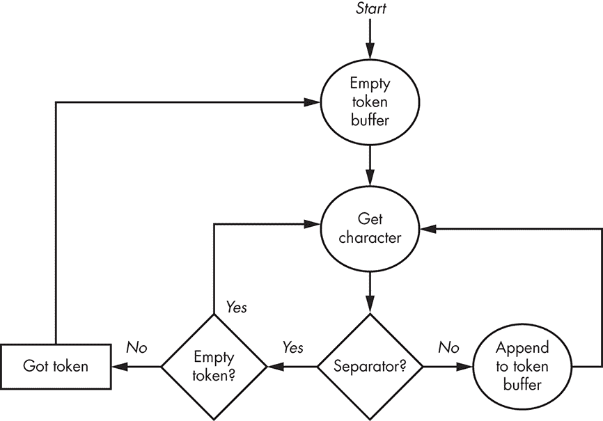

*图 8-1：简单的词法分析*

仅仅提取符号是不够的；我们需要对它们进行分类，因为实际的编程语言有许多不同类型的符号，如名称、数字和运算符。语言通常有运算符和操作数，就像数学一样，操作数可以是变量或常量（数字）。许多语言的自由形式性质也使得事情更加复杂——例如，当分隔符是隐含的，如 `A+B` 和 `A + B`（注意空格）的区别。两种形式的含义相同，但第一种形式没有显式的分隔符。

数值常量异常难以分类，即使我们忽略八进制、十六进制、整数和浮点数之间的区别。让我们画出构成合法浮点数的示意图。有许多方法可以表示浮点数，包括`1.`、`.1`、`1.2`、`+1.2`、`–.1`、`1e5`、`1e+5`、`1e–5`和`1.2E5`，如图 8-2 所示。

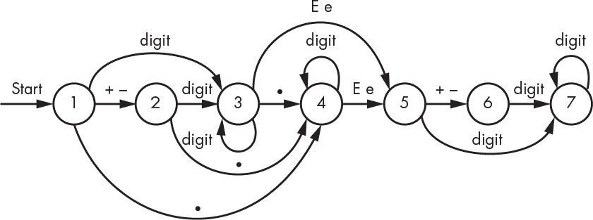

*图 8-2：浮点数的示意图*

我们从标记为 1 的气泡开始。一个`+`或`–`字符将我们带到气泡 2，而一个`.`将我们带到气泡 4。当我们收到`.`字符时，我们从气泡 2 转移到气泡 4，但当我们接收到一个数字时，我们转移到气泡 3。气泡 3 和气泡 4 积累数字。如果接收到没有显示转换的字符，我们就结束了。例如，如果我们在任何气泡处收到一个空格，我们就结束了。当然，如果没有数字或小数点离开气泡 2，或者没有数字离开气泡 6，或者没有符号或数字离开气泡 5，都会出错，因为这不能产生一个完整的浮点数。为了简化起见，这些路径在图中没有显示。

这就像是用海盗地图找宝藏一样。只要你按照指示走，你就可以从一个地方到另一个地方。如果你不按照指示走——例如，在气泡 1 处有一个 Z——你就会掉出地图，迷失方向。

你可以将图 8-2 视为浮点数的规范，并编写软件来实现它。然而，还有其他更正式的写法来描述规范，比如巴克斯-诺尔范式。

巴克斯-诺尔范式

*巴克斯-诺尔范式（BNF）* 起源于印度梵文学者巴尼尼（公元前五世纪左右）的研究。BNF 以美国计算机科学家约翰·巴克斯（1924–2007）的名字命名，他还是 FORTRAN 的发明者，以及丹麦计算机科学家彼得·诺尔（1928–2016）。它是一种正式的语言规范方法。我们在这里不会深入探讨它，但你应该熟悉它，因为它在定义互联网协议等内容的*RFC*（请求评论）文档中得到了使用。下面是浮点数的 BNF：

```
<digit>              ::= "0" | "1" | "2" | "3" | "4" | "5" | "6" | "7" | "8" | "9"

<digits>             ::= <digit> | <digits> <digit>

<e>                  ::= "e" | "E"

<sign>               ::= "+" | "-"

<optional-sign>      ::= <sign> | ""

<exponent>           ::= <e> <optional-sign> <digits>

<optional-exponent>  ::= <exponent> | ""

<mantissa>           ::= <digits> | <digits> "." | "." <digits> | <digits> "." <digits>

<floating-point>     ::= <optional-sign> <mantissa> <optional-exponent>
```

`::=` 左边的内容可以替换为右边的内容。`|` 表示选择，括号中的内容是字面量，意味着它们必须完全按照写法出现。

#### *状态机*

仅从数字的复杂性来看，你可以想象，从输入中提取语言标记需要大量的特殊案例代码。图 8-2 给了我们一个提示，表明还有另一种方法。我们可以构建一个*状态机*，它由一组状态和导致从一个状态过渡到另一个状态的条件组成——这正是我们在图 8-2 中看到的内容。我们可以按表 8-1 所示的方式安排这些信息。

**表 8-1：** 浮点数状态表

| **输入** | **状态** |
| --- | --- |
| **1** | **2** | **3** | **4** | **5** | **6** | **7** |
| --- | --- | --- | --- | --- | --- | --- |
| 0 | 3 | 3 | 3 | 4 | 7 | 7 | 7 |
| 1 | 3 | 3 | 3 | 4 | 7 | 7 | 7 |
| 2 | 3 | 3 | 3 | 4 | 7 | 7 | 7 |
| 3 | 3 | 3 | 3 | 4 | 7 | 7 | 7 |
| 4 | 3 | 3 | 3 | 4 | 7 | 7 | 7 |
| 5 | 3 | 3 | 3 | 4 | 7 | 7 | 7 |
| 6 | 3 | 3 | 3 | 4 | 7 | 7 | 7 |
| 7 | 3 | 3 | 3 | 4 | 7 | 7 | 7 |
| 8 | 3 | 3 | 3 | 4 | 7 | 7 | 7 |
| 9 | 3 | 3 | 3 | 4 | 7 | 7 | 7 |
| e | error | error | 5 | 5 | error | error | done |
| E | error | error | 5 | 5 | error | error | done |
| + | 2 | error | done | done | 6 | error | done |
| – | 2 | error | done | done | 6 | error | done |
| . | 4 | 4 | 4 | done | error | error | done |
| other | error | error | done | done | error | error | done |

从表格中可以看出，当我们处于状态 1 时，数字将我们移到状态 3，`e`或`E`将我们移到状态 5，`+`或`–`将我们移到状态 2，而`.`将我们移到状态 4——其他任何情况都是错误。

使用状态机可以让我们通过一段简单的代码来对输入进行分类，如示例 8-4 所示。我们将使用表 8-1，将`done`替换为`0`，将`error`替换为`-1`。为了简化起见，我们将为表格中的每个其他字符添加一行`other`。

```
state = 1;

while (state > 0)

    state = state_table[state][next_character];
```

*示例 8-4：使用状态机*

这种方法可以很容易地扩展到其他类型的令牌。我们可以为每种令牌类型设置不同的`done`值，而不是使用单一的值。

#### *正则表达式*

通过将表 8-1 这样的表格从图 8-2 这样的图形中构建出来，对于复杂语言来说既繁琐又容易出错。解决方案是创建一种指定语言的语言。美国数学家斯蒂芬·科尔·克莱尼（1909–1994）在 1956 年提出了这一方法的数学基础。肯·汤普森于 1968 年首次将其转化为软件，作为文本编辑器的一部分，随后在 1974 年创建了 UNIX 的`grep`（表示“全局搜索正则表达式并打印”）工具。这使得“正则表达式”这一术语广为人知，现在它已经无处不在。正则表达式本身就是一种语言，当然现在也有几种不兼容的正则表达式语言。正则表达式是*模式匹配*的主力。图 8-3 展示了一个匹配浮点数模式的正则表达式。

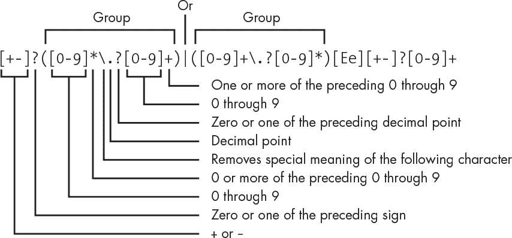

*图 8-3：浮点数的正则表达式*

这看起来像是胡言乱语，但实际上只依赖于几个简单的规则。它是从左到右处理的，这意味着表达式`abc`会匹配字符`abc`序列。如果模式中的某个部分后面跟着`?`，表示零个或一个这样的东西，`*`表示零个或多个，`+`表示一个或多个。方括号`[]`内的字符集匹配该集合中的任意单个字符，因此`[abc]`匹配`a`、`b`或`c`。`.`匹配任意单个字符，因此需要用反斜杠（`\`）进行*转义*，这样它就只匹配`.`字符。`|`表示左边的东西或右边的东西。圆括号`()`用于分组，就像数学中的分组一样。

从左到右读取，我们首先是一个可选的加号或减号。接下来是零个或多个数字，一个可选的小数点，和一个或多个数字（处理`1.2`和`.2`的情况），或者是一个或多个数字，一个可选的小数点，和零个或多个数字（处理`1`和`1.`的情况）。接下来是指数部分，它以`E`或`e`开头，后面跟着一个可选的符号和一个或多个数字。看起来没那么可怕了，是吗？

如果有一种正则表达式语言能将输入处理成词法单元（token），并且自动生成状态表，那将更加有用。幸运的是，我们正是有这样的一种语言，再次感谢贝尔电话实验室的研究。1975 年，美国物理学家迈克·莱斯克（Mike Lesk）——以及当时的实习生埃里克·施密特（Eric Schmidt），如今是谷歌母公司 Alphabet 的执行董事长——编写了一个名为`lex`的程序，简称“词法分析器”。正如披头士在《Penny Lane》中所唱的：“它是一个*Kleene*机器。”稍后，GNU 项目制作了一个名为`flex`的开源版本。这些工具正是我们需要的。它们生成一个由状态表驱动的程序，当输入与正则表达式匹配时，执行用户提供的程序片段。例如，清单 8-5 中的简单`lex`程序片段会在遇到`ar`或`er`时打印`ah`，在遇到单词结尾的`a`时打印`er`。

```
[ae]r       printf("ah");

a/[ .,;!?]  printf("er");
```

*清单 8-5：波士顿口音词法程序片段*

第二个模式中的`/`表示“只有在左边的东西后面跟着右边的东西时，才匹配左边的东西。”未匹配的部分将直接打印。你可以使用这个程序将标准的美式英语转换为波士顿口音：例如，输入文本`Park the car in Harvard yard and sit on the sofa`，输出将是`Pahk the cah in Hahvahd yahd and sit on the sofer`。

在`lex`中，标记分类非常简单。例如，列表 8-6 展示了匹配我们所有数字形式、变量名和一些运算符的`lex`代码。我们不是输出我们找到的内容，而是为每种类型的标记返回在其他地方定义的值。请注意，几个字符在`lex`中有特殊意义，因此需要使用反斜杠转义字符，以便将其视为字面量。

```
0[0-7]*                                                       return (INTEGER);

[+-]?[0-9]+                                                   return (INTEGER);

[+-]?(([0-9]*\.?[0-9]+)|([0-9]+\.?[0-9]*))([Ee][+-]?[0-9]+)?  return (FLOAT);

0x[0-9a-fA-F]+                                                return (INTEGER);

[A-Za-z][A-Za-z0-9]*                                          return (VARIABLE);

\+                                                            return (PLUS);

-                                                             return (MINUS);

\*                                                            return (TIMES);

\/                                                            return (DIVIDE);

=                                                             return (EQUALS);
```

*列表 8-6：使用 lex 对标记进行分类*

列表中没有展示的是`lex`如何提供实际标记值的机制。当我们找到一个数字时，我们需要知道它的值；同样，当我们找到一个变量名时，我们需要知道那个名字。

请注意，`lex`并不适用于所有语言。正如计算机科学家斯蒂芬·C·约翰逊（稍后介绍）所解释的，“`Lex`可以很容易地用于生成相当复杂的词法分析器，但仍然有一些语言（如 FORTRAN）不符合任何理论框架，其词法分析器必须手动编写。”

### 从单词到句子

到目前为止，我们已经看到如何将字符序列转换为单词。但这对于语言来说还不够。我们现在需要根据某些*语法*将这些单词转换为句子。

让我们使用列表 8-6 中的标记来创建一个简单的四则运算计算器。像`1 + 2`和`a = 5`这样的表达式是合法的，而`1 + + + 2`则不是。我们再次需要模式匹配，但这次是针对标记类型。也许有人已经考虑过这个问题。

那个人正是斯蒂芬·C·约翰逊，他也——不出所料——曾在贝尔实验室工作。他在 1970 年代初创建了`yacc`（“又一个编译器生成器”）。这个名字应该能让你明白当时有多少人都在玩这些东西。它至今仍在使用；一个名为`bison`的开源版本可以从 GNU 项目中获取。就像`lex`一样，`yacc`和`bison`都生成状态表及其操作代码。

程序`yacc`生成的是一个使用栈的*移进-归约*解析器（请参阅《栈》第 122 页）。在此上下文中，*移进*意味着将一个标记推入栈中，而*归约*意味着用一个标记替换栈中匹配的标记集合。查看列表 8-7 中的计算器 BNF——它使用了列表 8-6 中`lex`生成的标记值。

```
<operator>     ::= PLUS | MINUS | TIMES | DIVIDE

<operand>      ::= INTEGER | FLOAT | VARIABLE

<expression>   ::= <operand> | <expression> PLUS <operand>

                             | <expression> MINUS <operand>

                             | <expression> TIMES <operand>

                             | <expression> DIVIDE <operand>

<assignment>   ::= <variable> EQUALS <expression>

<statement>    ::= <expression> | <assignment>

<statements>   ::= "" | <statements> <statement>

<calculator>   ::= <statements>
```

*列表 8-7：简单计算器的 BNF*

一旦你看到移位归约的实际应用，它就容易理解了。看看当我们的简单计算器接收到输入 `4 + 5 – 3` 时会发生什么，如图 8-4 所示。回顾一下第 125 页的“不同的方程表示法”一节，你可以看到，处理中缀表示法方程式需要比后缀表示法（RPN）更多的栈，因为更多的符号（如括号）必须被移位才能进行归约。

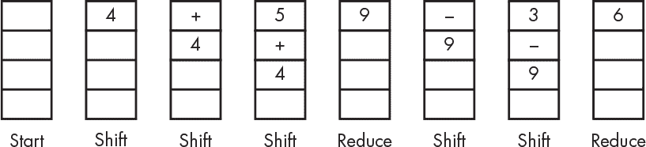

*图 8-4：移位归约的实际应用*

清单 8-8 展示了我们的计算器在 `yacc` 中的编码样式。注意与 BNF 的相似性。这仅仅是为了说明；它并不是一个完全工作的示例，因为那样会引入太多的细枝末节，分散注意力。

```
calculator  : statements

            ;

statements  : /* empty */

            | statement statements

            ;

operand     : INTEGER

            | FLOAT

            | VARIABLE

            ;

expression  : expression PLUS operand

            | expression MINUS operand

            | expression TIMES operand

            | expression DIVIDE operand

            | operand

            ;

assignment  : VARIABLE EQUALS expression

            ;

statement   : expression

            | assignment

            ;
```

*清单 8-8：简单计算器的部分 yacc 示例*

### 今日语言俱乐部

语言曾经是很困难的。1977 年，加拿大计算机科学家 Alfred Aho 和美国计算机科学家 Jeffrey Ullman 在贝尔实验室出版了《编译原理》一书，这是第一本使用 `troff` 排版语言出版的计算机排版书籍。可以用以下话来总结这本书：“语言是困难的，你最好深入研究数学、集合论等内容。”第二版在 1986 年出版，由印度计算机科学家 Ravi Sethi 合著，给人完全不同的感觉。它的态度更像是“语言已经是定型的了，下面是如何做它们。”而人们也的确这样做了。

这本书的版本使得 `lex` 和 `yacc` 广为流传。突然间，出现了许多不同的语言——不仅仅是编程语言。我最喜欢的小型语言之一是加拿大计算机科学家 Brian Kernighan 在贝尔实验室开发的 `chem`，它能根据像 `C double bond O` 这样的输入绘制漂亮的化学结构图。事实上，你正在阅读的这本书中的图表，正是使用 Brian Kernighan 的图形绘制语言 `pic` 创建的。

创造新语言是有趣的。当然，人们在不了解其历史的情况下开始创造新语言，并重新引入了旧有的错误。例如，许多人认为 Ruby 语言中对*空白字符*（单词间的空格）的处理是对原始 C 语言中一个早已修复的错误的重演。（请注意，处理错误的经典方法之一是将其称为功能特性。）

这一切历史的结果是，现在有大量的编程语言可供使用。大多数语言并没有真正增加太多价值，只是设计者品味的展示。值得关注的是*领域特定*语言，尤其是像`pic`和`chem`这样的*小型语言*，看看它们是如何解决特定应用问题的。美国计算机科学家 Jon Bentley 在 1986 年在《ACM 通讯》上发表了一篇关于小型语言的精彩专栏，名为《编程珍珠》。这些专栏在 1999 年被收集并更新出版为《编程珍珠》一书（由 Addison-Wesley 出版）。

### 解析树

我之前提到过编译高级语言，但这并不是唯一的选择。高级语言可以被*编译*或*解释*。选择哪种方式并不是语言设计的函数，而是它的实现方式。

编译语言会生成像你在表 4-4 第 108 页看到的机器代码。编译器将源代码转换成特定机器的机器语言。许多编译器允许你为不同的目标机器编译相同的程序。程序一旦被编译，就可以运行了。

解释型语言不会生成真实机器（“真实”的意思是硬件）上的机器语言。相反，解释型语言运行在*虚拟机*上，虚拟机是通过软件编写的计算机。虚拟机可能有自己的机器语言，但它并不是硬件实现的计算机指令集。需要注意的是，*虚拟机*这个术语最近被过度使用；在这里我使用它指的是一种抽象的计算机。一些解释型语言是由*解释器*直接执行的，其他语言则会被编译成*中间语言*，以便后续解释。

一般来说，编译后的代码执行更快，因为一旦它被编译，它就是机器语言。就像是翻译一本书，一旦完成，任何懂这种语言的人都能阅读它。解释型代码则是短暂的，就像有人边读书边将其翻译成听众的语言。如果之后另一个人想让这本书以自己的语言读给他听，那么它必须重新翻译。然而，解释型代码允许语言拥有一些硬件上很难实现的特性。计算机足够快，我们通常可以承受解释器带来的速度损失。

图 8-4 展示了计算器直接执行输入的过程。虽然这种方式对于像计算器这样的应用是可以接受的，但它跳过了编译器和解释器使用的一个重要步骤。在这些情况下，我们构建一个*解析树*，这是一个从计算器语法生成的 DAG（有向无环图）数据结构。我们将根据图 8-5 中所示的节点结构来构建这棵树。

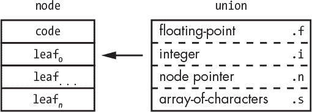

*图 8-5：解析树节点布局*

每个节点包含一个`code`，表示节点的类型。还有一个叶子数组；每个`leaf`的解释由`code`决定。每个`leaf`是一个联合体，因为它可以存储多种类型的数据。我们使用 C 语言语法来命名成员，因此，例如，`.i`表示我们将`leaf`解释为一个整数。

我们假设存在一个`makenode`函数，用于创建新的节点。它的第一个参数是`leaf`数量，第二个参数是`code`，后续是每个`leaf`的值。

让我们稍微扩展一下清单 8-8 中的代码，同时仍然省略一些细节。为了简化起见，我们只处理整数。之前缺少的是匹配语法规则时执行的代码。在`yacc`中，右侧每个元素的值都可以通过`$1`、`$2`等来访问，而`$$`是规则返回的值。清单 8-9 展示了我们更完整的`yacc`计算器版本。

```
calculator      : statements                    { do_something_with($1); }

                ;

statements      : /* empty */

                | statement statements          { $$.n = makenode(2, LIST, $1, $2); }

                ;

operand         : INTEGER                       { $$ = makenode(1, INTEGER, $1); }

                | VARIABLE                      { $$ = makenode(1, VARIABLE, $1); }

                ;

expression      : expression PLUS operand       { $$.n = makenode(2, PLUS, $1, $3); }

                | expression MINUS operand      { $$.n = makenode(2, MINUS, $1, $3); }

                | expression TIMES operand      { $$.n = makenode(2, TIMES, $1, $3); }

                | expression DIVIDE operand     { $$.n = makenode(2, DIVIDE, $1, $3); }

                | operand                       { $$ = $1; }

                ;

assignment      : VARIABLE EQUALS expression    { $$.n = makenode(2, EQUALS, $1, $3); }

                ;

statement       : expression                    { $$ = $1; }

                | assignment                    { $$ = $1; }

                ;
```

*清单 8-9：使用 yacc 构建简单计算器语法树*

在这里，所有简单规则仅返回它们的值。更复杂的规则，如`statements`、`expression`和`assignment`，会创建一个节点，附加子节点，并返回该节点。图 8-6 展示了对一些示例输入产生的结果。

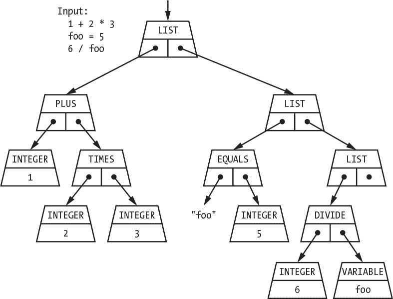

*图 8-6：简单计算器语法树*

如你所见，代码生成了一棵树。在最顶层，我们使用`calculator`规则将树节点转换为一个包含语句的链表。其余的树由包含`operator`和`operand`的`statement`节点组成。

### 解释器

清单 8-9 包括一个神秘的`do_something_with`函数调用，它将解析树的根传递给该函数。该函数使解释器“执行”解析树。执行的第一部分是链表遍历，如图 8-7 所示。

第二部分是评估，我们通过深度优先遍历递归执行此操作。该函数在图 8-8 中进行了示意。

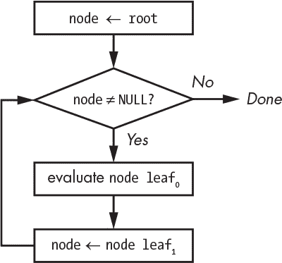

*图 8-7：解析树链表遍历*

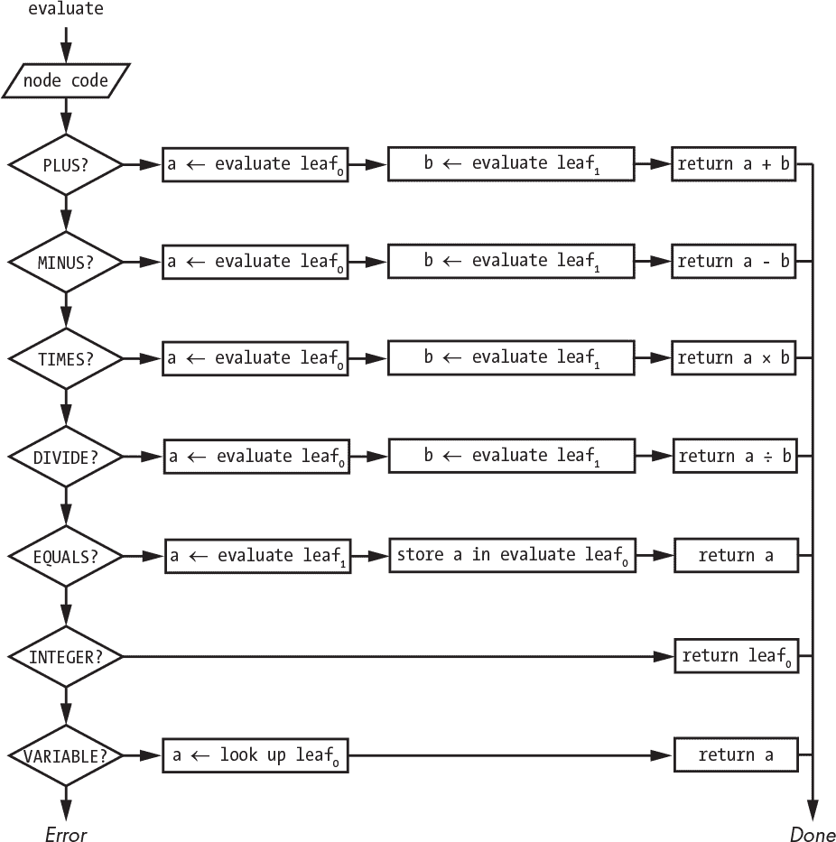

*图 8-8：语法树评估*

如你所见，决定做什么很容易，因为我们在`node`中有一个`code`。请注意，我们需要一个额外的函数来在*符号表*中存储变量（符号）名称和值，另一个函数用于查找与变量名称相关联的值。这些通常使用哈希表实现（参见“制作哈希表”，第 213 页）。

将列表遍历和评估代码与`yacc`结合在一起，使我们能够立即执行解析树。另一种选择是将解析树保存在文件中，以便以后读取并执行。这就是 Java 和 Python 等语言的工作方式。从实际用途来看，这是一组机器语言指令，但它是由软件实现的，而不是硬件。执行已保存解析树的程序必须为每个目标机器存在。通常，相同的解释器源代码可以编译并用于多个目标。

图 8-9 总结了解释器。

前端生成语法分析树，这些树用某种*中间语言*表示，后端则为不同的机器提供执行该语言的功能，以便在其目标环境中运行。

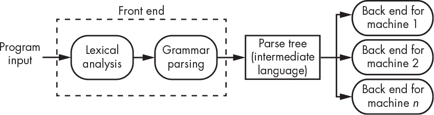

*图 8-9：解释器结构*

### 编译器

编译器看起来很像解释器，但它们有代码生成器，而不是后端执行代码，如图 8-10 所示。

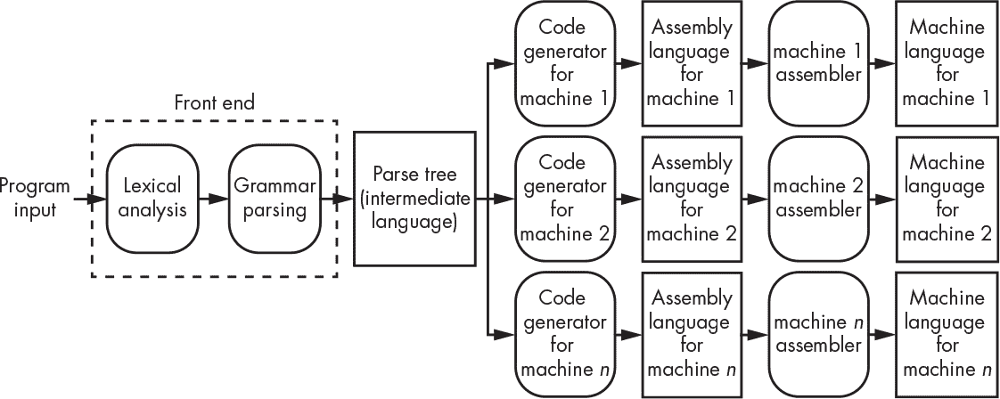

*图 8-10：编译器结构*

*代码生成器*为特定的目标机器生成机器语言。一些语言的工具，如 C，能够为目标机器生成实际的汇编语言（参见“汇编语言”，在第 217 页），然后将汇编语言通过该机器的汇编器处理，生成机器语言。

代码生成器的工作原理与我们在图 8-7 和图 8-8 中看到的语法分析树遍历和求值完全相同。不同之处在于，图 8-8 中的矩形被替换成了生成汇编语言的矩形，而不是执行语法分析树。图 8-11 中展示了一个简化版的代码生成器；加粗的等宽字体（如 add tmp）表示我们从第四章中得到的玩具机器指令。请注意，那里机器没有乘法和除法指令，但为了这个例子，我们假设它有。

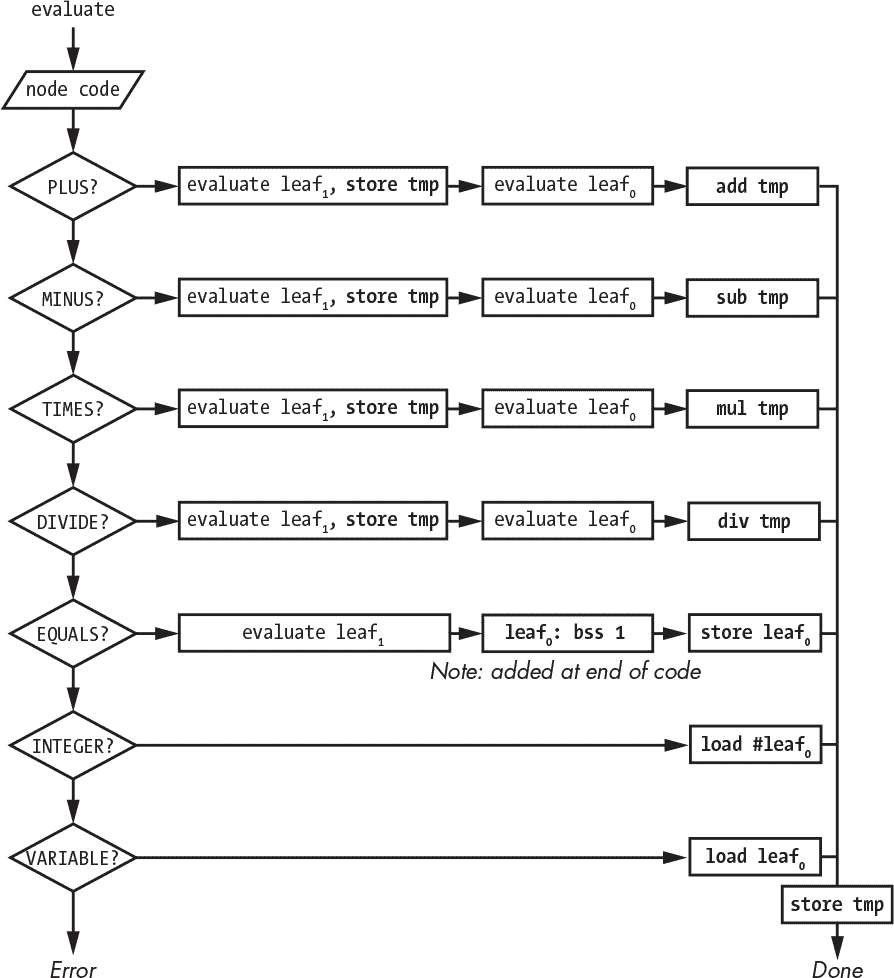

*图 8-11：从语法分析树生成汇编器*

将图 8-11 应用于图 8-6 中的语法分析树，我们得到在清单 8-10 中显示的汇编语言程序。

```
                           ; first list element

       load      #3        ; grab the integer 3

       store     tmp       ; save it away

       load      #2        ; grab the integer 2

       mul       tmp       ; multiply the values subtree nodes

       store     tmp       ; save it away

       load      #1        ; grab the integer 1

       add       tmp       ; add it to the result of 2 times 3

       store     tmp       ; save it away

                           ; second list element

       load      #5        ; grab the integer 5

       store     foo       ; save it in the space for the "foo" variable

       store     tmp       ; save it away

                           ; third list element

       load      foo       ; get contents of "foo" variable

       store     tmp       ; save it away

       load      #6        ; grab the integer 6

       div       tmp       ; divide them

       store     tmp       ; save it away

tmp:   bss       1         ; storage space for temporary variable

foo:   bss       1         ; storage space for "foo" variable
```

*清单 8-10：代码生成器生成的机器语言输出*

如你所见，这段代码生成得相当不好看；存在许多不必要的加载和存储操作。但你能从一个人为设计的简单示例中期待什么呢？通过优化，这段代码将得到很大改进，优化内容将在下一节中讨论。

一旦这段代码被汇编成机器语言，它就可以执行。与解释型版本相比，它的运行速度会快得多，因为它是一段更小、更高效的代码。

### 优化

许多语言工具在语法分析树和代码生成器之间加入了一个额外的步骤，称为*优化器*。优化器分析语法分析树并执行转换，产生更高效的代码。例如，优化器可能会注意到图 8-12 中左侧的语法分析树的所有操作数都是常量。它可以在编译时提前计算表达式，这样在运行时就不需要再计算了。

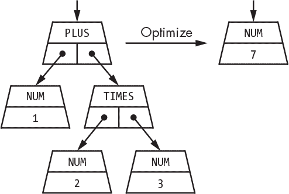

*图 8-12：优化语法分析树*

上面的例子很简单，因为我们的示例计算器没有包括任何条件分支的实现。优化器有许多技巧。例如，考虑清单 8-11 中的代码（它恰好是用 C 语言写的）。

```
for (i = 0; i < 10; i++) {

    x = a + b;

    result[i] = 4 * i + x * x;

}
```

*清单 8-11：带有循环赋值的 C 语言循环代码*

清单 8-12 展示了优化器可能会如何重构这段代码。

```
x = a + b;

optimizer_created_temporary_variable = x * x;

for (i = 0; i < 10; i++) {

    result[i] = 4 * i + optimizer_created_temporary_variable;

}
```

*清单 8-12：带有循环不变优化的循环代码*

这个例子给出了与清单 8-11 相同的结果，但更加高效。优化器确定`a + b`是*循环不变的*，意味着它在循环中不会改变。优化器将其移到循环外部，这样它只需要计算一次，而不是计算 10 次。它还确定`x * x`在循环中是常量，并将其移到外部。

清单 8-13 展示了另一个优化器技巧，叫做*强度减少*，它是通过用更便宜的操作替代昂贵的操作——在这个例子中，是用加法代替乘法。

```
x = a + b;

optimizer_created_temporary_variable = x * x;

optimizer_created_4_times_i = 0;

for (i = 0; i < 10; i++) {

    result[i] = optimizer_created_4_times_i + optimizer_created_temporary_variable;

    optimizer_created_4_times_i = optimizer_created_4_times_i + 4;

}
```

*清单 8-13：包含循环不变优化和强度减少的 C 语言循环代码*

强度减少还可以利用相对寻址来使得`result[i]`的计算更加高效。回到图 7-2，`result[i]`是`result`的地址加上`i`乘以数组元素的大小。就像`optimizer_created_4_times_i`一样，我们可以从`result`的地址开始，并在每次循环迭代时加上数组元素的大小，而不是使用更慢的乘法。

### 小心硬件

优化器很棒，但它们可能会导致处理硬件的代码出现意外问题。清单 8-14 展示了一个变量，实际上是一个硬件寄存器，当第 0 位被设置时，它会打开灯光，正如我们在图 6-1 中看到的那样。

```
void

lights_on()

{

    PORTB = 0x01;

    return;

}
```

*清单 8-14：不应该优化的代码示例*

这看起来很好，但优化器会怎么做呢？它会说，“嘿，这个变量被写入但从未读取，所以我可以把它去掉。”同样，假设我们有清单 8-15 中的代码，它打开了灯光，然后测试是否已经打开。优化器很可能会直接重写这个函数，使其返回 0x01，而不将值存储到 PORTB。

```
unsigned int

lights_on()

{

    PORTB = 0x01;

    return (PORTB);

}
```

*清单 8-15：另一个不应该优化的代码示例*

这些例子表明，在某些情况下，你需要能够关闭优化。传统上，你会通过将软件拆分为通用文件和硬件特定文件，然后只对通用文件运行优化器。然而，现在一些语言提供了机制，允许你告诉优化器某些内容不需要优化。例如，在 C 语言中，`volatile`关键字表示不要优化对变量的访问。

### 总结

到目前为止，在本书中，你已经学习了计算机是如何工作的，以及它们是如何运行程序的。在本章中，你看到了程序是如何被转换的，以便能够在机器上运行，并且学到了程序可以是编译的或解释的。

在下一章，你将遇到一个叫做*网页浏览器*的解释器怪物，以及它所解释的语言。
