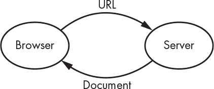
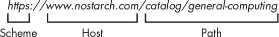
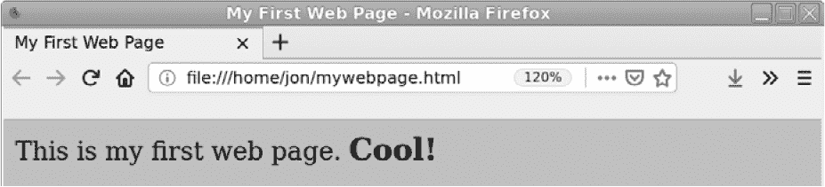
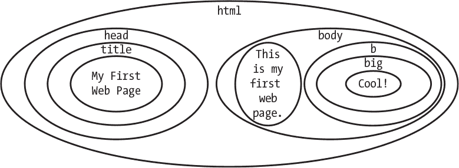
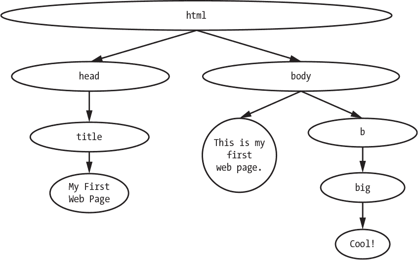
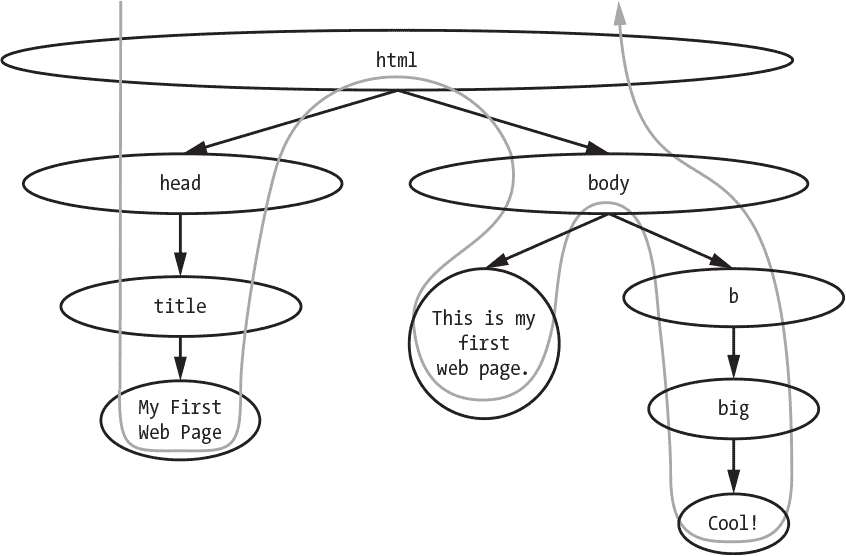
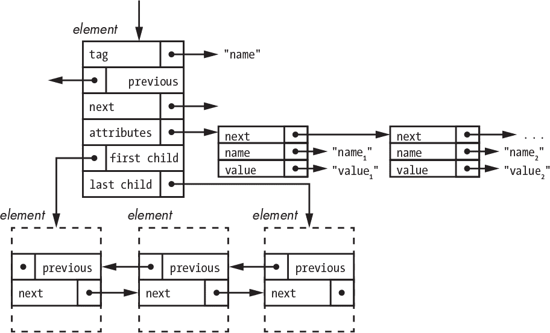
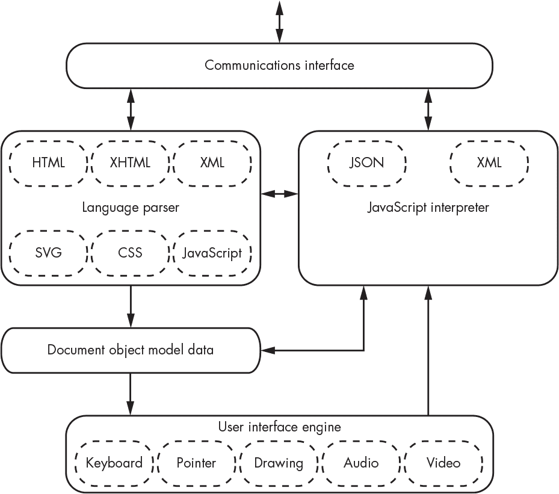

## 第九章：网页浏览器**


你可能没这样想过，但你每天使用的网页浏览器实际上是一个*虚拟机*——一个具有极其复杂指令集的抽象计算机，完全通过软件实现。换句话说，它就是你在上一章学到的那种解释器。

在这一章中，你将学习到一些关于这个虚拟机的功能。你将了解输入语言以及浏览器如何解析它。浏览器是极其复杂的东西，因此我无法覆盖所有功能。

让浏览器变得有趣的一点是，它们一方面是庞大而复杂的应用程序，另一方面，它们是你可以编程的软件实现的计算机。浏览器有一个*开发者控制台*，你可以在使用本章示例时通过它来查看浏览器的实时操作。

了解网页浏览器也教会我们一些关于系统设计的知识，而系统设计可能比编程更为重要（第十五章更详细地讲解了系统设计）。网页的流行使得浏览器成为新功能的吸引力源。这些功能中的许多通过向原始指令集添加扩展来兼容地扩展浏览器功能。还有一些功能以不兼容的方式重复了现有功能，结果是浏览器现在支持多个指令集，并且在任何一个浏览器中都无法获得完整的功能集。在本章中你应该能清楚地看到，我对后者类别的功能并不感到兴奋——那些只是不同而没有增加价值的功能。

首先，拥有多种方式做事意味着作为程序员的你需要学习更多的内容，而这些功能并没有增加价值，因此这并不是一个很好的时间利用。而且你需要花费精力选择该采用哪种方式来编写代码。增加多种方法也增加了程序的复杂性。行业统计数据显示，程序中代码的数量与程序中的错误数量之间有直接关系。浏览器经常崩溃。而且，正如第十三章更详细讨论的那样，更复杂的代码更容易包含安全问题。

以不兼容的方式做事让程序员更容易出错。这就像一个美国人在新西兰开车：由于新西兰人是左侧行驶，部分控制按钮的位置不同。来自右侧行驶国家的人很容易被认出来，因为他们在转弯时会打开挡风玻璃雨刷。你不希望在一个容易造成这些可避免错误的环境中进行编程。

在我看来，许多网络标准已经成为 *活文档* 这一事实，明显表明了问题的存在。如果你不熟悉这个术语，我指的是那些不断更新的在线文档。标准的存在是为了提供稳定性和互操作性，而活文档则不是；充其量，它们只捕捉了一个特定时刻。随着规格不断变化，很难进行编程。在这种情况下，活文档让少数文档创作者的生活变得更轻松（因为这些文档和它们所引用的软件永远不需要“完成”），但却使更多消费者的生活变得更困难。

### 标记语言

如果这本书是在 15 年前写的，本章将以对 HTML（超文本标记语言）的介绍开始。但正如我之前提到的，浏览器与太平洋垃圾带有很多相似之处：它通过吸引附着在其上的功能不断膨胀。其中之一就是多种标记语言，所以我们将从它们的概述开始。

*标记* 是一种为文本添加注释或标记的系统，这些标记与文本本身区分开来——就像老师在作业上用红色铅笔写的刻薄评论。

标记语言并不新鲜；它们在计算机出现之前就已经存在。它们是印刷机的副产品，旨在帮助作者和编辑向“排版工”描述他们想要的内容。当计算机自动化排版时，这一有用的概念得以延续。今天的标记语言只是这一古老思想的最新表现。

标记语言的种类繁多。例如，我最初是用一种名为 `troff` 的排版标记语言写这本书的。此段落的源代码如 清单 9-1 所示。

```
.PP

There are a large number of markup languages.

For example, I originally wrote this book in a markup language for

typesetting, called \fCtroff\fP.

The source for this paragraph is shown in Listing 9-1.
```

*清单 9-1：上述段落的 troff 示例*

如你所见，大部分内容只是文本，但其中有三个标记元素。`.PP` 告诉 `troff` 开始一个段落。`\fC` 告诉 `troff` 将当前字体推入堆栈，并用字体 `C`（即 Courier 字体）替换它。`\fP` 告诉 `troff` 弹出字体堆栈（参见 “堆栈” 在 第 122 页），恢复先前的字体。

网页是常规的文本文件，就像 `troff` 示例一样。你不需要复杂的程序来创建它们；你可以在任何文本编辑器中完成。事实上，复杂的网页创建程序会产生冗余的结果，而你完全可以通过手工制作来轻松超越它们。

当唯一可用的工具还是更多文本时，你如何对常规文本文件进行标记？通过赋予某些字符超级能力，就像超人即使是一个温文尔雅的记者，也拥有超能力一样。例如，`troff` 赋予任何以 `.` 或 `'` 开头的行以及任何以 `\` 开头的内容超级能力。

IBM 推出了自家标记语言，名为*GML*（即*通用标记语言*的缩写，尽管它实际上是为其开发者 Goldfarb、Mosher 和 Lorie 命名的），该公司用于其 ISIL 出版工具。这项工作后来扩展为*标准通用标记语言（SGML）*，并在 1980 年代被国际标准化组织采纳。SGML 如此“通用”，以至于尚不清楚是否有人能够完全实现该标准。

*可扩展标记语言（XML）*是 SGML 的一个更实用的子集。浏览器对其的支持是后来的新增功能。

HTML 和 XML 都源自 SGML。它们借用了相同的语法，但并不完全符合标准。

XHTML 是符合 XML 规则的 HTML 修改版。

### 统一资源定位符

第一个网页浏览器（名为 WorldWideWeb），由英国工程师兼计算机科学家蒂姆·伯纳斯-李爵士于 1990 年发明，其工作方式相当直接，如图 9-1 所示。浏览器使用*统一资源定位符（URL）*通过 HTTP 协议从服务器请求文档，HTTP 协议在“万维网”一节中讨论过，见第 159 页。服务器将文档发送给浏览器，浏览器显示文档。文档曾经是用 HTML 编写的，但现在可以用多种语言编写。



*图 9-1：网页浏览器与网页服务器的交互*

URL 是具有一定结构的文本字符串。现在我们只关心结构中的三个部分，如图 9-2 所示。



*图 9-2：URL 的结构*

*方案*表示通信机制——例如，`https`选择超文本传输协议（安全）。我们想要通信的服务器是*主机*。它可以是数字互联网地址（参见“IP 地址”在第 159 页）但最常见的是作为域名指定（参见“域名系统”在第 159 页）。要检索的文档位置是*路径*，它看起来就像文件系统路径。

一种方案是`file`。当它被使用时，URL 中的主机/路径部分是本地文件名——即浏览器运行所在系统上的文件名。换句话说，`file`方案指向你计算机上的文件。

有越来越多的方案，如`bitcoin`用于加密货币，`tv`用于电视广播。这些方案与我们在“万维网”一节中看到的协议非常相似，甚至在很多情况下是相同的。

### HTML 文档

如前所述，最早的网页是用 HTML 编写的文档。HTML 利用了*超文本*—即链接到其他内容的文本，例如其他网页。科幻迷可以把它看作是将超空间与文本结合：你点击一个链接，*嗖*，你就到了另一个地方。超文本已经存在了一段时间，但网络是它最具吸引力的应用。

看看清单 9-2 中的简单 HTML 文档。

```
<html>

    <head>

        <title>

            My First Web Page

        </title>

    </head>

    <body>

        This is my first web page.

        <b>

            <big>

                Cool!

            </big>

        </b>

    </body>

</html>
```

*清单 9-2：我的第一个网页*

将清单 9-2 中的 HTML 代码输入到一个文件中，并在浏览器中打开。你应该会看到类似于图 9-3 的内容。



*图 9-3：浏览器显示我的第一个网页*

你会看到，图 9-3 中的显示内容看起来与清单 9-2 中的文本不太一样。这是因为小于号（`<`）是一个具有超能力的字符。在这种情况下，它开始了一个*元素*的标记。你可能会注意到，元素是成对出现的；每个开始的`<tag>`都有一个匹配的结束`</tag>`。

标签决定了浏览器如何解释标记元素。标签本质上是虚拟机指令。例如，`<title>`将其内容—即开始和结束标签之间的内容—显示到浏览器的标题栏中。`<b>`和`<big>`元素将单词“Cool!”变为粗体和大号，它是网页的`<body>`部分的一部分。

由于`<`具有超能力，你可能会想知道如何使用这个字符而不触发它的超能力——例如，如果你想显示`This is my first web page with a <`。HTML 包含了它自己的一种克星，称为*实体引用*，它是字符的替代形式。在这种情况下，序列`&lt;`表示小于号（`<`）字符，而不会触发其超能力。（当然，现在有了一个新的超级字符`&`，它本身可以使用`&amp;`序列表示。）使用实体引用，你可以输入`This is my first web page with a &lt;`，它看起来就正确了。

HTML 元素并不完全简单。有一些随机的例外情况，其中不需要结束标签，而且对于没有内容的元素，有一种`<tag/>`的形式。XHTML 消除了这些例外。我们这里关心的唯一复杂问题是*属性*，即一组可选的名称/值对，如清单 9-3 所示。

```
<tag name1="value1" name2="value2" ...>

    element content

</tag>
```

*清单 9-3：带有属性的 HTML 元素*

一些属性`名称`有预定义的行为；对于那些没有预定义行为的，你可以包含任意的属性值。属性值的处理方式是相同的，唯一例外的是`class`，它的值被视为一个由空格分隔的值列表。

### 文档对象模型

Web 浏览器根据 *文档对象模型（DOM）* 来处理文档。你可以把网页看作一系列包含其他元素的元素，如列表 9-2 中的 HTML 所示的缩进所示。图 9-4，看起来有点像一个扭曲的*俄罗斯套娃*（matryoshka）的航拍剖面图，展示了列表 9-2 中的代码结构。



*图 9-4：HTML 文档中的嵌套元素*

我们可以将图片从 HTML 边缘抓取并倾斜，使得所有内部部分悬挂在底部，如图 9-5 所示。

看起来熟悉吗？它是我们的老朋友，定向无环图（DAG），来自“栈”章节中的第 122 页，也是一种树形结构（参见“层级数据结构”章节中的第 199 页）。不仅如此，HTML 可以通过第八章中的技术进行处理，结果是一个解析树（参见“解析树”章节中的第 228 页）。



*图 9-5：HTML 文档作为树形结构*

#### *树形词汇表*

像 DOM 这样的树形结构非常常见，已经形成了完整的词汇表。表 9-1 中的例子来自图 9-5。

**表 9-1：** 树形词汇表

| **术语** | **定义** | **示例** |
| --- | --- | --- |
| 节点 | 树中的一个元素 | `html`、`head`、`body` |
| 内部节点 | 树中有箭头进出其内部的元素 | `title` |
| 终端节点 | 树中没有箭头指向其他节点的元素 | `Cool!` |
| 根节点 | 树的顶部 | `html` |
| 父节点 | 其箭头直接指向其他节点的节点 | `html` 是 `head` 和 `body` 的父节点 |
| 子节点 | 直接由其他节点指向的节点 | `head` 和 `body` 是 `html` 的子节点 |
| 后代节点 | 直接或间接被其他节点指向的节点 | `title` 是 `html` 的后代节点 |
| 祖先节点 | 直接或间接指向某节点的节点 | `body` 是 `big` 的祖先节点 |
| 同级节点 | 有共同父节点的节点 | `head` 是 `body` 的同级节点 |

树中的节点是有序的。例如，`head` 是 `html` 的第一个子节点，`body` 是 `html` 的第二个并且也是最后一个子节点。

#### *解释 DOM*

浏览器如何处理文档树？虽然有人可能构建了与 HTML 元素对应的计算硬件指令，但至今没有人这么做过。这排除了将 DOM 解析树编译为机器语言的可能。另一种选择是使用*深度优先遍历*来解释它，如图 9-6 所示。



*图 9-6：HTML 文档遍历顺序*

如你所见，浏览器从根节点开始，下降到第一个子节点，然后到它的第一个子节点，依此类推，直到到达终端节点。然后它会回到最近的有其他子节点的祖先节点，并从那里开始做同样的事情，直到树中的每个节点都被访问。请注意，遍历顺序遵循 HTML 的书写方式。深度优先遍历是栈的又一应用。

### 层叠样式表

HTML 的原始理念是，作者编写网页，而浏览器负责确定如何显示这些页面。这是合理的，因为作者无法知道浏览器窗口的大小、屏幕分辨率或可用的颜色和字体数量。

一旦网络变得流行，营销人员也开始介入。华丽的效果变得重要。各种各样的内容被加入其中（主要通过创建新的 CSS 规范），以便作者能精确控制网页的显示方式。当然，这完全违背了最初的设计意图。结果变得混乱。

HTML 网页最初包括样式信息。例如，`font` 元素用于选择文本字体，并且有一个 `size` 属性来控制字体大小。当页面在从桌面到手机等各种设备上显示时，这种方法并不奏效。*层叠样式表 (CSS)* 将样式与 HTML 分离，这样就可以写一次 HTML，并根据目标设备应用不同的样式。

图 9-7 显示了一个可以用来表示 HTML 元素在内存中数据结构。



*图 9-7：HTML 元素数据结构*

这个图看起来非常复杂，但它只是将你已经学过的一些内容结合在一起。元素有一个复合数据类型（参见 “复合数据类型” 章节中的 第 189 页），属性也有一个类似的类型。属性被组织成一个单链表（参见 “单链表” 章节中的 第 191 页）。元素以树状结构排列（参见 “层次数据结构” 章节中的 第 199 页）。由于可能有任意数量的子元素且顺序很重要，它们通过双链表进行组织（参见 “双链表” 章节中的 第 198 页）。

这个组织结构很重要，因为 CSS 使用了一种正则表达式的变体（参见 “正则表达式” 章节中的 第 224 页），称为 *选择器*，用于定位 DOM 中的元素，类似于 `yacc` 在堆栈上匹配符号的方式。然后，CSS 允许将属性与选中的元素关联。例如，这使得网页设计师能够根据目标设备调整文本大小，或者将侧边菜单折叠成适用于小屏幕设备的下拉菜单。

CSS 混淆了术语。它定义了大量的*属性*——例如颜色、字体大小等。一旦这些属性与 DOM 元素关联，它们就被称为*属性*。

表 9-2 展示了一些 CSS 选择器。最初只有少数几个，但现在新增的选择器正在以惊人的速度增加。

**表 9-2:** CSS 选择器

| **模式** | **含义** |
| --- | --- |
| `*` | 匹配任何元素 |
| `E` | 匹配任何类型为 `E` 的元素（即 `<E>`...`</E>`） |
| `F` | 匹配任何类型为 `F` 的元素（即 `<F>`...`</F>`） |
| `E F` | 匹配任何是 `E` 元素的后代的元素 `F` |
| `E > F` | 匹配任何是 `E` 元素子元素的元素 `F` |
| `E + F` | 匹配任何与 `E` 元素具有直接兄弟关系的元素 `F` |
| `E - F` | 匹配任何由兄弟元素 `E` 前置的元素 `F` |
| `E[name]` | 匹配任何具有 `name` 属性的 `E` 元素 |
| `E[name=value]` | 匹配任何具有 `name` 属性且值为 `value` 的 `E` 元素 |
| `E[name~="value"]` | 匹配任何 `E` 元素，其 `name` 属性是一个由空格分隔的单词列表，其中一个单词匹配 `value` |
| `E#id` | 匹配任何具有 `id` 值为 `id` 的 ID 属性的 `E` 元素 |
| `E.class` | 匹配任何具有 `class` 属性值为 `class` 的 `E` 元素 |
| `E:first-child` | 如果元素 `E` 是其父元素的第一个子元素，则匹配该元素 |
| `E:last-child` | 如果元素 `E` 是其父元素的最后一个子元素，则匹配该元素 |
| `E:nth-child(n)` | 如果元素 `E` 是其父元素的第 *n* 个子元素，则匹配该元素 |
| `E:empty` | 如果元素 `E` 没有子元素，则匹配该元素 |
| `E:link` | 如果元素 `E` 是一个超链接锚点（例如 `<a>`），则匹配该元素 |
| `E:visited` | 如果元素 `E` 是一个超链接锚点（如 `<a>`）且已访问过，则匹配该元素 |
| `E:hover` | 当鼠标悬停在元素 `E` 上时匹配该元素 |
| `E:active` | 匹配鼠标按下时的元素 `E` |
| `E:focus` | 如果元素 `E` 获得输入焦点（即它在监听键盘输入），则匹配该元素 |

HTML 包含一个 `<link>` 元素，可以用来将包含 CSS 的独立文件与网页关联。这是首选的用法，因为它符合将内容与样式分开的原则。但对于我们这里的工作来说，这是过于复杂的。HTML 还包含一个 `<style>` 元素，允许将 CSS 直接嵌入 HTML 文档中。这就是我们在示例中使用的方式。

让我们修改来自 列表 9-1 的网页，添加一些简单的样式，在 列表 9-4 中以粗体显示。

```
<html>

    <head>

        <title>

            My First Web Page

        </title>

        <style>

            body {

                color:     blue;

            }

            big {

                color:     yellow;

                font-size: 200%;

            }

        </style>

    </head>

    <body>

        This is my first web page.

        <b>

            <big>

                Cool!

            </big>

        </b>

    </body>

</html>
```

*列表 9-4: 带嵌入式 CSS 的网页*

你可以看到在清单 9-4 中有两个选择器：`body` 和 `big`。每个选择器后面跟着一组属性名称和值；冒号分隔每个名称和它的值，值后面有一个分号，每个选择器的名称和值列表都被花括号括起来。首先，我们将文档主体中所有文本的 `color` 设置为 `blue`。接下来，我们将 `<big>` 元素中文本的 `color` 设置为 `yellow`，并将 `font-size` 设置为正常大小的 `200%`。试试看吧！

CSS 是一个事后想法；在开发 HTML 时并没有考虑到它。结果也因此有一些奇怪的地方。HTML 有各种元素，其含义是定义好的。例如，`<b>` 元素使文本变为 **粗体**，`<i>` 元素则用于 *斜体*。但是，清单 9-5 中的 CSS 代码片段改变了它们的含义，使它们变得相反。

```
b {

    font-style:  italic;

    font-weight: normal;

}

i {

    font-style:  normal;

    font-weight: bold;

}
```

*清单 9-5：使用 CSS 交换粗体和斜体*

就所有实际目的而言，CSS 消除了许多 HTML 元素之间的区别。你可以把 HTML 元素看作是有一个默认的样式集，但一旦通过 CSS 更改了这些样式，元素名称可能就不再与其原本的用途相关。

CSS 最初只是提供了一种更灵活的机制来将属性附加到元素上，但后来它开始添加新的属性。这些新属性并没有被回溯到 HTML 中。因此，一些属性可以在 HTML 和 CSS 中都指定，而其他属性则只能在 CSS 中指定。编程社区中有一种看法，认为旧的方法不再使用，但这忽略了维护现有代码的问题。

### XML 与朋友们

XML 看起来很像 HTML。然而，像 SGML 一样，它要求元素是 *格式正确的*。这意味着每个 `<tag>` 都必须有一个匹配的 `</tag>`。不允许使用隐式结束标签。HTML 和 XML 之间的一个重大区别是，HTML 是为特定的应用程序（即网页）创建的，而 XML 是一种通用的标记语言，可以用于许多不同的应用。

大多数 XML 标签没有预先分配的含义。你可以为它们分配任何你想要的含义。XML 提供了结构，你可以利用它来创建你自己的应用特定的标记语言。例如，假设你想跟踪你花园中的蔬菜。你可以创建一个看起来像清单 9-6 那样的蔬菜标记语言（VML）。

```
<xml>

    <garden>

        <vegetable>

            <name>tomato</name>

            <variety>Cherokee Purple</variety>

            <days-until-maturity>80</days-until-maturity>

        </vegetable>

        <vegetable>

            <name>rutabaga</name>

            <variety>American Purple Top</variety>

            <days-until-maturity>90</days-until-maturity>

        </vegetable>

        <vegetable>

            <name>rutabaga</name>

            <variety>Helenor</variety>

            <days-until-maturity>100</days-until-maturity>

        </vegetable>

        <vegetable>

            <name>rutabaga</name>

            <variety>White Ball</variety>

            <days-until-maturity>75</days-until-maturity>

        </vegetable>

        <vegetable>

            <name>rutabaga</name>

            <variety>Purple Top White Globe</variety>

            <days-until-maturity>45</days-until-maturity>

            </vegetable>

    </garden>

</xml>
```

*清单 9-6：基于 XML 的标记语言示例*

然而，允许人们创建自己的标记语言可能会引发冲突。例如，假设除了 VML 之外，还有人创建了一个包含 `<name>` 元素的食谱标记语言（RML），就像在清单 9-7 中所示。

```
<xml>

    <garden>

        <vegetable>

            <name>tomato</name>

            <variety>Cherokee Purple</variety>

            <days-until-maturity>80</days-until-maturity>

            <name>Purple Tomato Salad</name>

        </vegetable>

    </garden>

</xml>
```

*清单 9-7：具有名称冲突的基于 XML 的标记语言示例*

我们无法判断 `<name>` 元素是蔬菜名称还是食谱名称。我们需要一个机制来允许我们结合 VML 和 RML，而不混淆 `<name>` 元素。这个机制就是一个被称为 *命名空间* 的元素标签前缀。

正如你从与浏览器相关的内容中所预期的那样，指定命名空间有多种方式，但这里仅介绍其中一种。每个命名空间都与一个 URL 相关联，尽管没有要求它必须是有效的 URL；它只需与其他命名空间区分开来即可。`xmlns` 属性用于在 `<xml>` 元素上将命名空间前缀与 URL 关联。 清单 9-8 显示了我们结合的花园和食谱标记，并区分了命名空间。

```
<xml  >

    <vml:garden>

        <vml:vegetable>

            <vml:name>tomato</vml:name>

            <vml:variety>Cherokee Purple</vml:variety>

            <vml:days-until-maturity>80</vml:days-until-maturity>

            <rml:name>Purple Tomato Salad</rml:name>

        </vml:vegetable>

    </vml:garden>

</xml>
```

*清单 9-8：带有命名空间的基于 XML 的标记语言示例*

你可以看到来自两个虚构标记语言的元素已被结合，并通过前缀进行区分。命名空间前缀是任意的，取决于将不同标记语言结合在一起的方式。没有要求 `rml` 必须是食谱标记语言的前缀；如果我们需要将这段代码与另一个 RML（例如荒谬标记语言）结合使用，也可以选择 `recipe`。

有许多工具可以帮助你编写理解自定义标记语言（如上述描述的标记语言）的应用程序。许多编程语言也有库，可以从 XML 文档中创建并操作解析树。

一种工具是 *文档类型定义（DTD）*。你可以将其视为元标记。DTD 是一个看起来像 XML 的文档（出于某些原因没有结束标签），它定义了标记语言中的合法元素。XML 包含一个机制，允许 XML 文档引用 DTD。例如，你可以制作一个 DTD，规定一个或多个 `<vegetable>` 元素可以出现在 `<garden>` 元素中，并且 `<vegetable>` 只能包含 `<name>`、`<variety>` 和 `<days-until-maturity>` 元素。XML 解析器可以验证 XML 是否符合 DTD。尽管这很有用，但它没有做最重要的部分。例如，虽然 DTD 可以确保必需的 `<variety>` 存在，但它不能测试 `variety` 是否有效。

*XML 路径语言（XPath）* 通过创建另一种不兼容的语法，提供了用于 XML 文档的选择器；它本质上具有 CSS 选择器的相同功能，但语法完全不同，你可能需要学习它。XPath 本身并不是特别有用，但它是 *可扩展样式表语言转换（XSLT）* 的重要组成部分。

XSLT 是另一种基于 XML 的语言。当与 XPath 结合使用时，它允许你编写一段 XML，通过搜索和修改解析树将 XML 文档转换为其他形式。 清单 9-9 显示了一个简单的示例，其中使用 XPath 表达式匹配花园中的任何蔬菜，然后输出每个蔬菜的名称和品种，并用空格分隔。

```
<xsl:stylesheet  version="1.0">

    <xsl:template match="/garden/vegetable">

        <xsl:value-of select="variety"/>

        <xsl:text> </xsl:text>

        <xsl:value-of select="name"/>

    </xsl:template>

</xsl:stylesheet>
```

*清单 9-9：使用 XSLT 和 XPath 调用任意蔬菜*

将清单 9-9 中的 XSLT 应用于清单 9-6 中的 XML，生成的结果如清单 9-10 所示。

```
Cherokee Purple tomato

American Purple Top rutabaga

Helenor rutabaga

White Ball rutabaga

Purple Top White Globe rutabaga
```

*清单 9-10：调用任何蔬菜的结果*

另一个例子是清单 9-11 中所示的例子，当名称的值为`rutabaga`时，它只选择蔬菜。

```
<xsl:stylesheet  version="1.0">

    <xsl:template match="/garden/vegetable[name/text()='rutabaga']">

        <xsl:value-of select="name"/>

        <xsl:text> </xsl:text>

    </xsl:template>

    <xsl:template match="text()"/>

</xsl:stylesheet>
```

*清单 9-11：按名称调用*

将清单 9-11 中的 XSLT 应用于清单 9-6 中的 XML，生成的结果如清单 9-12 所示。

```
rutabaga rutabaga rutabaga rutabaga
```

*清单 9-12：按名称调用结果*

XSLT 特别适用于将包含任意数据的标记转换为 HTML 以在浏览器中显示。

### JavaScript

我们的示例网页是静态的——也就是说，它只显示一些格式化的文本。回到图 9-1，唯一改变显示内容的方法是发送另一个 URL 到 web 服务器以获取新文档。这不仅是一个缓慢的过程，而且还浪费资源。如果你在表单中输入了电话号码，数据必须发送到服务器以确定它是否包含所有数字，如果没有，服务器还必须返回一个带有错误信息的页面。

1993 年，马克·安德森（Mark Andreesen）创造了图形化的 Mosaic 网页浏览器，这推动了消费互联网的繁荣。他随后创办了 Netscape，并于 1994 年发布了 Netscape Navigator 浏览器。意识到需要更多交互式网页，Netscape 于 1995 年推出了 JavaScript 编程语言。此后，JavaScript 被国际标准化组织 Ecma International（前身为欧洲计算机制造商协会）标准化为 ECMA-262。它也被称为 ECMAScript，这个名字听起来像是一种皮肤病，而且已经被证明会让浏览器变得不稳定。JavaScript 借鉴了 C 编程语言和 Java，而 Java 本身也借鉴了 C。

JavaScript 允许网页包含在你的计算机上运行的实际程序，而不是在服务器上运行。这些程序可以修改 DOM，并可以直接与 web 服务器通信，如图 9-8 所示。


*图 9-8：Web 浏览器与 JavaScript 和 Web 服务器的交互*

JavaScript 程序与服务器之间的交互不同于我们在图 9-1 中看到的浏览器/服务器通信。相反，它通过*异步 JavaScript 和 XML（AJAX）*进行。我们来逐一解析。*异步*与我们在第 77 页中“计数器”一节看到的涟漪计数器相关；在此情况下，它意味着浏览器无法控制服务器何时（以及是否）做出响应。*JavaScript* 部分则意味着它由 JavaScript 程序控制。我不打算解释*和*的含义。最后，服务器到 JavaScript 程序的数据最初使用*XML*编码，而不是 HTML。

你可以通过将 JavaScript 包裹在 `<script>` 元素中，将其包含在 HTML 文档中。让我们在清单 9-4 中增加一些内容，再次显示以粗体表示的更改，如清单 9-13 所示。

```
<html>

    <head>

        <title>

            My First Web Page

        </title>

        <style>

            body {

                color: blue;

            }

            big {

                color:     yellow;

                font-size: 200%;

            }

        </style>

        <script>

            window.onload = function() {

                var big = document.getElementsByTagName('big');

                big[0].style.background = "green";

            }

        </script>

    </head>

    <body>

        This is my first web page.

        <b>

            <big>

                Cool!

            </big>

        </b>

    </body>

</html>
```

*清单 9-13：嵌入了 JavaScript 的网页*

让我们看看这段代码的效果，而不深入所有的细节。浏览器的定义之一是有一个 `window.onload` 变量，可以设置为一个函数，当初始页面加载完成时执行。定义的另一部分提到有一个 `document.getElementsByTagName` 函数，它返回 DOM 中所有匹配元素的数组。在这里，它返回唯一的 `<big>` 元素。最后，它允许我们更改各种元素的属性。在这种情况下，我们将背景色设置为绿色。

有大量定义好的函数用于 DOM 操作。它们允许我们做的不仅仅是从程序中更改 CSS 样式。还有一些函数可以让你重新排列 DOM 树，包括添加和删除元素的能力。

### jQuery

使用上一节中的浏览器 DOM 函数有两个问题。首先，DOM 函数在不同浏览器上的行为并不完全相同。其次，它们使用起来非常繁琐——并不是一个用户友好的接口。

进入*jQuery*，这是美国软件工程师 John Resig 在 2006 年推出的一个库。它解决了刚才提到的两个问题。它平滑了浏览器之间的不兼容问题，使得使用它的程序员不必自己处理这些问题。同时，它还提供了一个更容易使用的 DOM 操作接口。

jQuery 库将选择器与*操作*结合起来。清单 9-14 中的代码与清单 9-13 中的代码完全相同，只是用一种更适合程序员的方式表达。

```
<html>

  <head>

    <title>

      My First Web Page

    </title>

    <style>

      body {

        color:      blue;

      }

      big {

        color:      yellow;

        font-size:  200%;

      }

    </style>

    <script type="text/javascript" src="https://code.jquery.com/jquery-3.2.1.min.js"> </script>

    <script>

      $(function() {

        $('big').css('background', 'green');

      });

    </script>

  </head>

  <body>

    This is my first web page.

      <b>

        <big>

       Cool!

     </big>

    </b>

  </body>

</html>
```

*清单 9-14：嵌入了 JavaScript 和 jQuery 的网页*

第一个`<script>`元素导入了 jQuery 库；第二个包含了我们的代码。浏览器在页面加载时调用的“文档就绪”函数包含一个简单的 jQuery 语句。它的第一部分，`$('big')`，是一个选择器。它与我们在表格 9-2 中看到的 CSS 选择器类似。语句的其余部分，`.css('background', 'green')`，是在选中的元素上执行的操作。在这种情况下，`css`函数修改了`background`属性，将其设置为`green`。

让我们将示例 9-15 中的 jQuery 代码添加到文档就绪函数中，增加一些交互性。

```
$('big').click(function() {

    $('big').before('<i>Very</i>');

    $('big').css('font-size', '500%');

});
```

*示例 9-15: jQuery 事件处理器*

这段简单的代码将一个*事件处理器*附加到`<big>`元素上，当鼠标点击该元素时会执行。这个处理器做了两件事：它在`<big>`元素前插入一个新的`<i>`元素，并且增加了`<big>`的字体大小。

正如你在这个示例中看到的，jQuery 使得使用 JavaScript 操作 DOM 变得简单。你可以打开浏览器的调试控制台，点击时观察这些变化发生。

jQuery 开辟了一条道路，而且是一条非常流行的道路；这个库被广泛使用。然而，正如在网页社区中常见的情况，有些程序员决定创建并行的、不兼容的路径。现在有许多 JavaScript 库做着相同的事情，只是方式不同。

### SVG

*可缩放矢量图形 (SVG)* 是浏览器附加功能中的一个异类。它是另一种完全不同的语言，允许你以完全不兼容其他所有方式生成美观的图形和文本。

约翰·沃诺克和查克·盖什基于 1982 年创立了 Adobe 公司，并开发了 PostScript 语言。沃诺克多年来一直在研究 PostScript 理念的更复杂版本，PostScript 的发展类似于过于复杂的 SGML 被简化为 HTML 的过程。当史蒂夫·乔布斯要求他们使用 PostScript 驱动激光打印机时，这对二人组来说是一次幸运的突破。基于 PostScript 的 Apple LaserWriter 是桌面出版行业形成的一个重要因素，并为 Adobe 的成功奠定了基础。

PostScript 在*可移植性*上存在一些问题——无法在不同环境中得到相同的结果。基于 PostScript 的*可移植文档格式（PDF）*被创建来解决这些问题。SVG 或多或少是 PDF 嵌入到浏览器中的形式。当然，SVG 和 PDF 并不完全兼容，因为那样太有意义了。

一般来说，SVG 比最近新增的 canvas（将在下一节讨论）更具自动化。你可以指示它执行任务，它就会做，而在 canvas 上，你必须编写程序来操作它。将示例 9-16 的内容添加到网页的`body`中并试试，因为每个网页都需要一个红色脉动的圆圈。

```
<br>

<svg  width="400" height="400">

  <circle id="c" r="10" cx="200" cy="200" fill="red"/>

  <animate xlink:href="ch09.xhtml#c" attributeName="r" from="10" to="200" dur="5s" repeatCount="indefinite"/>

</svg>
```

*示例 9-16: SVG 动画圆形*

### HTML5

正如我在本章开头提到的，在浏览器的世界里，似乎没有什么想法是只需要实现一次的。HTML5 是 HTML 的最新版本。除了其他内容外，它增加了一大堆*语义化*元素，包括 `<header>`、`<footer>` 和 `<section>`，如果按预期使用，它们将为文档增加一致的结构。

HTML5 引入了 *canvas*，它提供了几乎与 SVG 相同的功能，但以完全不同的方式。主要的区别在于，canvas 只能通过一组新的 JavaScript 函数进行操作，而不像 SVG 那样可以使用现有的 DOM 函数。换句话说，你必须编写一个 JavaScript 程序，才能使用 canvas 重现 列表 9-16 中的内容。

HTML5 还增加了 `<audio>` 和 `<video>` 元素，提供了某种标准机制来处理音频和视频。

### JSON

我在 “JavaScript” 一节中提到了 AJAX，并且提到异步的 XML 格式数据从服务器发送到浏览器的 JavaScript 程序。好吧，那已经是*四个章节前的事*了。AJAX 中的 *X* 现在变成了 *J*，代表 JSON。虽然 AJAJ 这个缩写有时也会出现，但这项技术仍然被称为 AJAX。

*JSON* 代表 JavaScript 对象表示法。它本质上是一种人类可读的文本格式，用于表示 JavaScript 的 *对象*，它是 JavaScript 的复合数据类型之一。理论上，这种格式的数据可以以互操作的方式交换，尽管由于规范的问题，这种交换只有在遵循某些未指定的规则（例如避免使用某些字符）时才能实现。程序员还需要绕过 JSON 不支持所有 JavaScript 数据类型的限制。

列表 9-17 构建了一个 JavaScript 对象并将其转换为 JSON 格式。然后，它展示了存储在变量 the_quest 中的结果，以下内容为粗体显示。

```
var argonauts = {};

argonauts.goal = "Golden Fleece";

argonauts.sailors = [];

argonauts.sailors[0] = { name: "Acastus", father: "Pelias" };

argonauts.sailors[1] = { name: "Actor", father: "Hippasus" };

argonauts.sailors[2] = { name: "Admentus", father: "Pheres" };

argonauts.sailors[3] = { name: "Amphiarus", father: "Oicles" };

argonauts.sailors[4] = { name: "Ancaeus", father: "Poseidon" };

var the_quest = JSON.stringify(argonauts);

"{

    "goal": "Golden Fleece",

    "sailors": [

        { "name": "Acastus", "father": "Pelias" },

        { "name": "Actor", "father": "Hippasus" },

        { "name": "Admentus", "father": "Pheres" },

        { "name": "Amphiarus", "father": "Oicles" },

        { "name": "Ancaeus", "father": "Poseidon" }

    ]

}"
```

*列表 9-17：JSON 和阿尔戈英雄*

在使用 JavaScript 时，JSON 相较于 XML 有一个优势，这不仅仅是因为将 JavaScript 对象转换为 JSON 很简单，如在 列表 9-17 中所示。配套的 JavaScript `eval` 函数可以直接执行 JSON，因为它是数据，就像它是一个 JavaScript 程序一样。JSON 之所以受欢迎，是因为它消除了处理数据导入和导出的额外代码需求。

然而，仅仅因为 JSON 易于使用，并不意味着你可以对此掉以轻心。随意使用 `eval` 导入 JSON 数据可能会让攻击者在浏览器中执行任意代码。最近，新增了一个配套的 `JSON.parse` 函数，它可以安全地将 JSON 转换回 JavaScript 对象。

### 总结

在这一章中，你已经学习了构成网页浏览器的许多组件是如何工作的。图 9-9 展示了我们讨论过的各个部分。当然，浏览器还包含许多不太引人注目的功能，比如书签和历史记录。



*图 9-9：浏览器模块图*

这个图看起来可能相当复杂，但它只是由你已经见过的一些部分组成。这些部分包括语言解析器、解析树、正则表达式、解释器、网络、输入和输出。

它还说明了硬件和软件设计之间的区别。设计硬件比设计软件更为昂贵。硬件设计师不太可能在早餐前就构建一个使用六种不同、不兼容方法来完成相同任务的系统。但是，由于软件的前期成本较低，软件设计师往往不够谨慎。结果通常是一个更大、更复杂的系统，前期成本可能较低，但由于需要维护许多复杂的互操作部件，后期的成本通常更高。

现在你已经了解了一些关于这个复杂解释器的工作原理，下一章我们将为它编写一些程序。你将看到一个为浏览器编写的 JavaScript 程序和一个用 C 语言编写的相同程序。这将说明一些对网页程序员隐藏的，但对系统级编程至关重要的系统级考虑因素。
