## 第十章：应用程序与系统编程**


第九章介绍了网页浏览器是如何工作的。你了解到浏览器是复杂的应用程序，提供了软件实现的“计算机”，支持非常高级的“指令”。在本章中，我们将编写一个在浏览器中运行的程序，接着是一个不使用浏览器的类似程序。这两个程序的结构如图 10-1 所示。

操作系统隐藏了大部分 I/O 设备的复杂性，不让用户程序感知。同样，像浏览器这样的复杂用户程序，也将大部分操作系统的复杂性隐藏在其上构建的应用程序面前。如果你只打算做一个高级应用程序开发者，这没问题。但如果你想成为系统程序员，你需要了解更多。

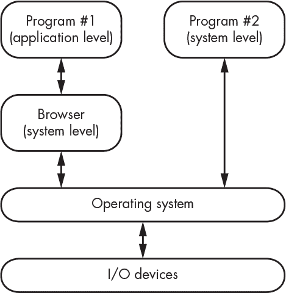

*图 10-1：两种程序场景*

本章包含比你之前见过的更长的 JavaScript 和 C 代码示例。如果你对这些语言不熟悉，不用担心——你无需掌握所有细节就能跟上。

让我们看一个游戏，其中计算机向用户提出一系列问题，试图猜测一个动物。根据需要，新的动物和用于区分它们的问题会被添加到程序中。程序通过构建一个知识的二叉树来“学习”。

*计算机*（`literal`文本）与*用户*（粗体文字）之间的互动大致如下：

```
Think of an animal.

Does it bark? Yes

Is it a dog?

Yes

I knew it!

Let's play again.

Think of an animal.

Does it bark?

Yes

Is it a dog?

No

I give up. What is it?

giant purple snorklewhacker

What's a question that I could use to tell a giant purple snorklewhacker from a dog?

Does it live in an anxiety closet?

Thanks. I'll remember that.

Let's play again.

Think of an animal.

Does it bark?

Yes

Is it a dog?

No

Does it live in an anxiety closet?

Yes

Is it a giant purple snorklewhacker?

Yes

I knew it!

Let's play again.
```

图 10-2 显示了实现计划。

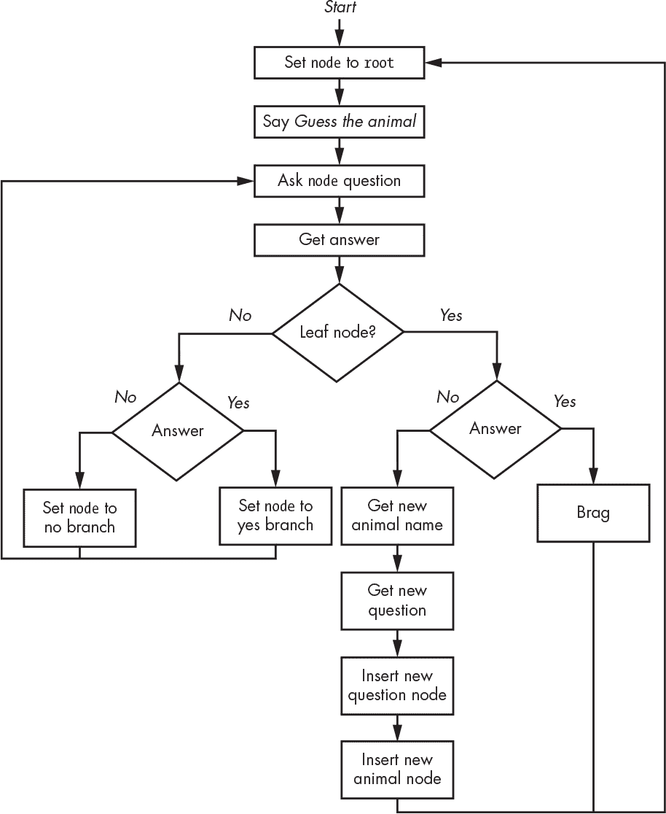

*图 10-2：猜动物流程图*

如你所见，我们提出问题，指导我们沿着知识树下降。当我们猜对时，我们会自我庆祝。否则，我们会要求用户提供答案和一个问题，将它们加入树中，然后重新开始。

程序沿着知识树的左侧路径前进。当它到达右侧路径的末端时，它要么炫耀，要么添加到知识库中。

### 猜动物版本 1：HTML 和 JavaScript

进入程序部分。我们将以一种方便但可能让我的一些同事感到不满的方式进行。这是一个*巧妙的黑客技术*——虽然能工作，但有点曲折且不美观。正如你在前一章中看到的，DOM 是一个树形结构，是 DAG 的一个子集——与二叉树相同。我们将在 DOM 中构建一个知识的二叉树，作为一组嵌套的、不可见的`<div>`元素。我们可以在 JavaScript 中创建一个数据结构，但浏览器已经有了一个简单可用的解决方案。如图 10-3 所示，我们的程序从一个初始问题和两个答案开始，位于知识树中。

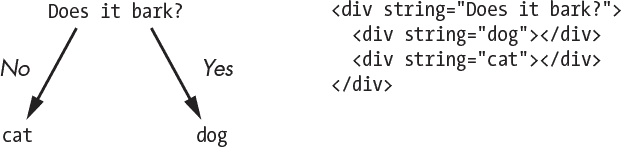

*图 10-3：初始知识树*

让我们开始玩这个游戏。当程序问`Does it bark?`时，我们回答`yes`，当程序猜到`Is it a dog?`时，我们回答`no`。接着程序问`What is it?`，我们回答`giant purple snorklewhacker`。然后，程序问我们，什么问题能区分巨型紫色潜水鱼与狗，我们用`Does it live in an anxiety closet?`作为答案，程序根据我们的回答修改了知识树，具体如下所示 Figure 10-4。

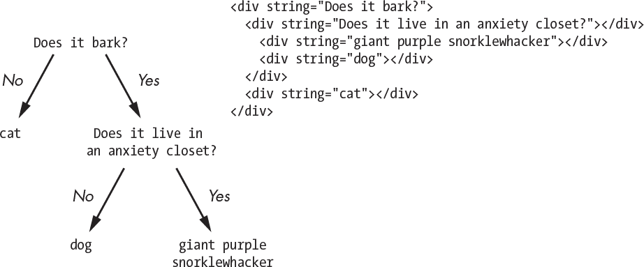

*Figure 10-4: 修改后的知识树*

#### *应用层骨架*

Listing 10-1 展示了我们将添加代码的网页骨架。纯粹主义者可能会对此感到非常不满，因为它将 HTML、CSS 和 JavaScript 结合在一个文件中。但我们正在构建一个简单的程序，而不是一个网站，因此将所有内容集中在一个地方非常方便。

```
 1 <html>

 2   <head>

 3     <!-- include jQuery -->

 4     <script type="text/javascript" src="https://code.jquery.com/jquery-3.1.1.min.js"> </script>

 5

 6     <title>Web Page Skeleton</title>

 7

 8     <style>

 9       <!-- CSS goes here -->

10     </style>

11

12     <script type="text/javascript">

13

14       <!-- JavaScript goes here -->

15

16       $(function() {

17         <!-- JavaScript to run when document ready -->

18       });

19

20     </script>

21   </head>

22

23   <body>

24     <!-- HTML goes here -->

25   </body>

26 </html>
```

*Listing 10-1: 网页骨架*

你可以自行将`title`更改为例如`猜猜是什么动物`之类的内容。

上一章你了解了网页浏览器的组成部分（参见 Figure 9-9）。现在我们将实际使用其中的一些。

#### *网页主体*

让我们从 Listing 10-2 中查看程序的`<body>`部分。这部分代码替换了 Listing 10-1 第 24 行中的`<!-- HTML goes here -->`。

```
 1 <!-- This is the knowledge tree that is never visible -->

 2

 3 <div id="root" class="invisible">

 4   <div string="Does it bark">

 5     <div string="dog"></div>

 6     <div string="cat"></div>

 7  </div>

 8 </div>

 9

10 <div id="dialog">

11   <!-- The conversation will go here -->

12 </div>

13

14 <!-- Get new animal name dialog -->

15

16 <div id="what-is-it" class="start-hidden">

17   <input id="what" type="text"/>

18   <button id="done-what">Done</button>

19 </div>

20

21 <!-- Get new animal question dialog -->

22

23 <div id="new-question" class="start-hidden">

24   What's a good question that I could use to tell a

25   <span id="new"></span> from a <span id="old"></span>?

26   <input id="question" type="text"/>

27   <button id="done-question">Done</button>

28 </div>

29

30 <!-- Yes and no buttons -->

31

32 <div id="yesno" class="start-hidden">

33   <button id="yes">Yes</button>

34   <button id="no">No</button>

35 </div>
```

*Listing 10-2: 猜猜是什么动物 HTML*

你可以看到第 3 到 8 行，知识树已预加载了一个初始问题和答案。`string`属性是问题，除了叶子节点外，它是动物名称。问题包含两个`<div>`，第一个用于`yes`答案，第二个用于`no`答案。整个树被包裹在一个`<div>`中，样式设置为不可见。

第 10 到 12 行的`dialog`包含计算机与玩家之间的对话。接着`what-is-it`（第 16 到 19 行）包含一个文本框，用于输入新动物的名称，并且有一个按钮，玩家点击完成后即可提交。之后，`new-question`（第 23 到 28 行）包含一个文本框，用于输入新问题，并且有一个按钮，玩家点击完成后即可提交。`yesno`（第 32 到 35 行）包含“是”和“否”按钮。三个用户输入的`<div>`（第 16、23、32 行）都有一个`start-hidden`类，用于在游戏开始时将这些元素设为不可见。

#### *JavaScript*

接下来，我们进入实际的 JavaScript 部分。第一部分显示在 Listing 10-3 中。

我们首先声明一个变量`node`，它位于 Listing 10-1 第 14 行的骨架中，内容为`<!-- JavaScript goes here -->`。虽然它可以放在文档就绪函数内部，但将其放在外部可以更方便地通过浏览器开发者工具访问。我们还在文档就绪函数外声明了两个函数，因为它们不依赖于页面是否加载完成。

```
 1 var node; // current position in tree of knowledge

 2

 3 // Append the supplied html to the dialog. Bail if the new node has

 4 // no children because there is no question to ask. Otherwise, make

 5 // the new node the current node and ask a question using the string

 6 // attribute of the node. Turn the animal name into a question if a

 7 // leaf node. Returns true if the new node is a leaf node.

 8

 9 function

10 question(new_node, html)

11 {

12    $('#dialog').append(html);     // add the html to the dialog

13

14    if ($(new_node).length == 0) { // no question if no children

15      return (true);

16    }

17    else {

18      node = new_node;             // descend to new node

19

20      if ($(node).children().length == 0)

21        $('#dialog').append('Is it a ' + $(node).attr('string') + '?');

22      else

23        $('#dialog').append($(node).attr('string') + '?');

24

25      return (false);

26    }

27 }

28

29 // Restarts the game. Hides all buttons and text fields, clears

30 // the text fields, sets the initial node and greeting, asks the

31 // first question, displays the yes/no buttons.

32

33 function

34 restart()

35 {

36    $('.start-hidden').hide();

37    $('#question,#what').val('');

38    question($('#root>div'), '<div><b>Think of an animal.</b></div>');

39    $('#yesno').show();

40 }
```

*Listing 10-3: 猜猜是什么动物 JavaScript 变量与函数*

接下来，Listing 10-1 第 17 行中的`<!-- JavaScript to run when document ready -->`会获取 Listing 10-4 中显示的五个元素。

```
 1 restart(); // Sets everything up the first time through.

 2

 3 // The user has entered a new question. Make a node with that

 4 // question and put the old no-node into it. Then, make a node

 5 // with the new animal and put it into the new question node ahead

 6 // of the old no-node so that it becomes the yes choice. Start over.

 7

 8 $('#done-question').click(function() {

 9   $(node).wrap('<div string="' + $('#question').val() + '"></div>');

10   $(node).parent().prepend('<div string="' + $(what).val() + '"></div>');

11   $('#dialog').append("<div>Thanks! I'll remember that.</div><p>");

12   restart();

13 });

14

15 // The user has entered a new animal name and clicked done. Hide

16 // those items and make the new-question text field and done button

17 // visible. Plug the old and new animal names into the query.

18

19 $('#done-what').click(function() {

20    $('#what-is-it').hide();

21    $('#new').text($('#what').val());

22    $('#old').text($(node).attr('string'));

23    $('#new-question').show();

24    $('#dialog div:last').append(' <i>' + $('#what').val() + '</i>');

25 });

26

27 // The user clicked yes in answer to a question. Descend the tree

28 // unless we hit bottom in which case we boast and start over.

29

30 $('#yes').click(function() {

31    if (question($(node).children(':first-child'), ' <i>yes</i><br>')) {

32      $('#dialog').append("<div>I knew it! I'm so smart!</div><p>");

33      restart();

34    }

35 });

36

37 // The user clicked no in answer to a question. Descend the tree

38 // unless we hit bottom, in which case we hide the yes/no buttons

39 // and make the what-is-it text field and done button visible.

40

41 $('#no').click(function() {

42    if (question($(node).children(':last-child'), ' <i>no</i><br>')) {

43      $('#yesno').hide();

44      $('#dialog').append('<div>I give up. What is it?</div>');

45      $('#what-is-it').show();

46    }

47 });
```

*Listing 10-4: 猜动物文档就绪函数 JavaScript*

我们调用`restart`函数（第 1 行）来启动游戏。其他四个是*事件处理程序*，它们是第五章中介绍的中断处理程序的 JavaScript 等效物。每个`button`元素都有一个事件处理程序。每个处理程序在关联的按钮被按下时调用一个匿名函数（一个没有名称的内联函数）。

通过输入程序来练习你的文本编辑技能。将结果保存在一个名为*gta.html*的文件中，然后在浏览器中打开该文件。玩这个游戏。打开浏览器中的开发者工具，找到 HTML 检查器；它允许你查看构成网页的 HTML。随着游戏进行，观察知识树是如何建立的。

#### *CSS*

正如我们在第九章中提到的，类给我们提供了一种为元素打标签的方式，以便可以轻松选择它们。CSS 主要用于声明属性的静态声明；它通过编程操作变得动态。Listing 10-2 中的 HTML 有两个 CSS 类：`start-hidden`是动态的，`invisible`是静态的。

`class`属性用于将 Listing 10-5 中多个 HTML 元素归类为`start-hidden`类。这不仅是为了让我们的程序看起来更有格调；它是为了给我们一种通过简单的选择器来定位这些元素的方式。这些元素在程序启动或重启时被隐藏。当程序运行时，它们变得可见，而`start-hidden`允许我们简单地重置所有内容。

带有`invisible`类的元素始终不可见，因为它代表了知识树。因此，Listing 10-5 中显示的 CSS 会替换 Listing 10-1 第 9 行中的`<!-- CSS goes here -->`。

```
1 invisible {

2   display: none; /* elements with this class are not displayed */

3 }
```

*Listing 10-5: 猜动物 CSS*

请注意，你可以使用*内联样式*来代替简单的 CSS，因为浏览器中当然必须有不止一种方法来完成同一任务。将 Listing 10-2 的第 3 行写成`<div id="root" style="display: none">`也会产生相同的效果。

### 猜动物版本 2：C

正如我之前提到的，浏览器是高级虚拟机——它们的所有功能都是通过软件实现的。这使我们能够通过隐藏一些重要的底层实现，快速而轻松地构建程序。我们可以用 C 语言重写程序，以便更多浏览器隐藏的原始操作能够暴露出来。这个讨论假设使用的是类 UNIX 操作系统。

#### *终端和命令行*

我们的 C 程序将非常复古，因为它不会有任何花哨的按钮或图形界面。它将以类似于古老游戏*冒险*的方式使用命令行。这是一个学习输入输出工作原理的绝佳机会，而不是依赖浏览器内置的花哨小部件。

我所说的“复古”和“命令行”是什么意思？正如第一章中提到的，人类语言可能最初是通过声音和手势开始的，书写是在*很久*以后才发明的。计算机语言则恰恰相反。虽然最初与计算机的互动是通过按按钮和拨动开关来进行的，当时计算机还有前面板，但它迅速演变为书面语言，手势和声音识别则是在之后才出现的。人类通过键盘输入，计算机则在终端上“回键”（见第六章的终端部分，第 176 页）。

你可能使用*图形用户界面（GUI）*与计算机进行交流。如果你仔细想想，它其实挺原始的。*“呃！看！按钮！按！朋友！猫视频！点赞！发推！发推！”* GUI 主要使用手势语言，这对普通计算机用户来说非常有效，因为它不太依赖于用户的记忆——至少在所有图标都改成了普遍无法识别之前是这样的。

大多数计算机系统仍然支持在所有花哨的图形背后使用书面命令行接口。现在，终端是通过软件实现的，而不再是计算机外部的硬件组件。如果你打开计算机上的终端应用程序，你会看到一个*命令提示符*；你可以在里面输入命令，它会作出响应。

我们程序的 C 版本并不使用按钮来表示是与否，而是要求玩家在终端程序中键入 `y` 或 `n`，然后按下 ENTER、RETURN 或 ↵ 键（取决于键盘）。玩家同样键入新的动物名称和问题。程序还接受 `q` 退出。

#### *构建程序*

因为 C 是一种编译语言，我们不能像运行解释型的 JavaScript 那样直接“运行”源代码。我们必须先将其转换为机器语言。我们可以通过命令行轻松完成这一过程。如果源代码保存在一个名为 *gta.c* 的文件中，你可以通过在终端中输入图 10-5 所示的命令，生成一个名为 *gta* 的机器语言文件。

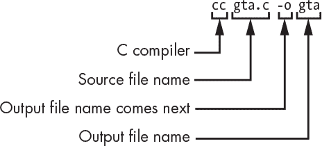

*图 10-5：构建程序*

一旦你拥有了输出文件，你通常只需要键入文件名来运行它。

#### *终端与设备驱动程序*

终端是一个输入输出设备，正如在第五章的“系统与用户空间”部分中提到的，用户程序并不直接与输入输出设备通信；操作系统充当中介，正如图 10-6 所示。

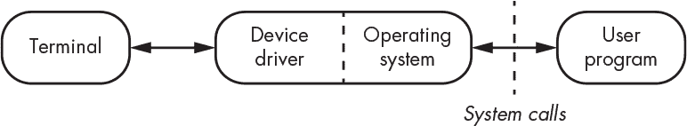

*图 10-6：输入输出设备中介*

在终端曾是独立设备的时代，计算机和终端通过 RS-232 串行连接相连（参见《串行通信》，见第 152 页）。终端和计算机之间有物理连接的电缆。操作系统至今仍假装这种连接方式存在，通过软件模拟它，以便老旧程序可以继续正常工作。

#### *上下文切换*

设备驱动程序比看起来更复杂，因为操作系统的一个主要作用就是让多个用户程序能够同时运行。由于计算机只有一组寄存器，操作系统在切换用户程序时必须保存并恢复这些寄存器的内容。实际上，还有很多内容需要保存和恢复，不仅仅是 CPU 寄存器，包括 MMU 寄存器和任何 I/O 的状态。这些内容统称为*进程上下文*，或简称*上下文*。我们不想轻率地进行*上下文切换*，因为上下文的大小使得切换代价较高。图 10-7 展示了系统调用过程。

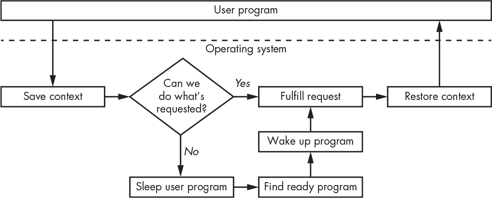

*图 10-7：上下文切换*

如你所见，在进行系统调用时，后台发生了很多工作。而正如在《相对寻址》中提到的那样，系统有时会*挂起*用户程序，即使它能够满足请求，也会挂起，以便给其他用户程序提供执行机会。

我们不希望每次用户按下一个键时都进行上下文切换。在这种情况下，减少上下文切换的一种方式是意识到，通常我们并不关心用户正在输入什么，直到他们按下 ENTER 键。用户程序通过系统调用表明它希望*从终端读取*数据。这样用户程序就会被挂起，因为在等待期间它无法做任何事情，这使得操作系统可以执行其他操作，比如切换到运行另一个程序。处理物理设备特性的*设备驱动程序*可以将字符保存在一个*缓冲区*中，并且只有在用户按下 ENTER 时才*唤醒*用户程序，而不是在每次按键时都唤醒。

什么是缓冲区？我们在图 6-25 中看到过一个；它是一个*先进先出（FIFO）*的数据结构，至少在软件领域是这样的。（在硬件领域，缓冲区通常是用来保护精密组件免受愚蠢操作影响的电路。）图 10-8 展示了一个 FIFO，也称为*队列*，这类似于在超市排队。与栈一样，FIFO 也可能会因空间不足而溢出，或因从空队列取数据而发生下溢。

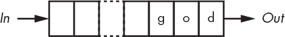

*图 10-8：排队中的狗*

终端通常以全双工模式工作（参见“串行通信”，第 152 页），这意味着键盘和显示器之间没有直接连接；键盘将数据发送到计算机，显示器从计算机接收数据。如前所述，最初每个方向都有单独的物理线路。那么，终端设备驱动程序仅仅缓存输入是不够的，因为如果用户输入的内容没有被*回显*，他们将会感到困惑，这样他们才能看到自己输入了什么。而且终端的速度通常比写入它们的程序要慢，因此除了*输入缓冲区*，还会使用*输出缓冲区*。如果程序尝试向已满的输出缓冲区写入数据，它会被挂起。如果输入缓冲区已满，驱动程序可能会向用户提供一些反馈，例如发出哔声。我们讨论的这部分驱动程序看起来像是图 10-9。

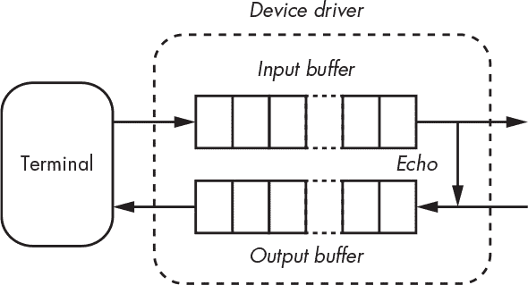

*图 10-9：终端设备驱动程序的缓冲和回显*

实际的设备驱动程序要复杂得多。需要使用额外的系统调用来修改驱动程序设置。回显功能可以开启或关闭。缓冲功能可以关闭，这被称为*原始模式*，而开启缓冲则被称为*烹饪模式*。还可以设置唤醒用户程序的按键，以及更多内容，比如哪个键用于删除字符（通常是 BACKSPACE 或 DELETE）。

#### *标准输入/输出*

设备驱动程序中的缓冲只解决了问题的一部分。用户程序也有类似的问题。仅仅让设备驱动程序缓存输入，而用户程序每次为每个字符进行系统调用，是没有用的。如果用户程序每次为每个字符进行系统调用来写入输出缓冲区，那么输出缓冲区也帮助不大。这种情况足够常见，因此促成了*标准输入/输出*库（`stdio`）的创建，该库为用户程序提供了缓冲输入输出功能。

`stdio` 库支持缓冲输入，其中尽可能多的输入通过一次系统调用从设备驱动程序读取并放入缓冲区。用户程序从缓冲区获取字符，直到缓冲区为空，然后尝试获取更多字符。在输出方面，字符会被缓冲，直到缓冲区满或出现重要字符（如换行符）。合起来看像是图 10-10。

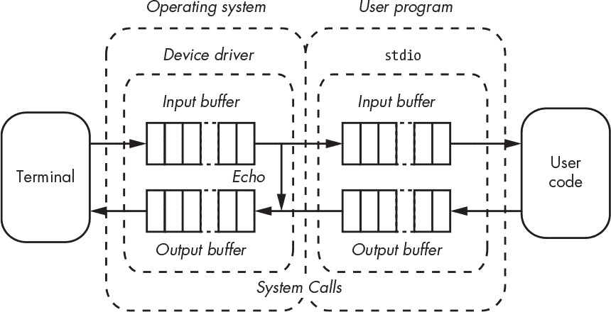

*图 10-10：带有 stdio 缓冲的用户程序*

看起来要做很多工作才能让事情高效运行！而我们还没有完成呢。用户程序是如何连接到终端设备驱动程序的呢？

引用某人的名字比提供他们的完整描述要容易得多，操作系统在访问文件时采取了类似的方式。`open` 系统调用将文件名转换为一个 *句柄* 或 *文件描述符*，可以在文件关闭前通过 `close` 系统调用引用该文件。这类似于你在博物馆存放背包时获得一个领取票。`stdio` 库包含类似的 `fopen` 和 `fclose` 函数，它们使用系统调用，并且还设置和销毁缓冲系统。由于 UNIX 的抽象方式将设备视为文件，因此你可以打开类似 */dev/tty* 的特殊文件来访问终端设备。

#### *循环缓冲区*

我之前提到过，队列就像是在杂货店排队。虽然它们确实有这种外观，但像 `stdio` 输出缓冲区（见图 10-10）这样的缓冲区，实际上并不是这样实现的。

想想在杂货店排队时会发生什么。当前面的人排完队，其他人都必须往前移动一个位置。让我们排一个 `frog`，如图 10-11 所示。正如你所看到的，我们需要跟踪队列的末尾，以便知道在哪里插入新的元素。

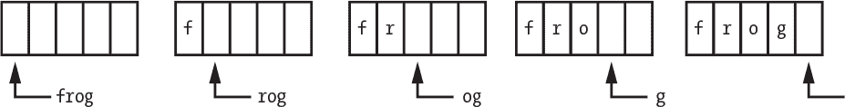

*图 10-11：向队列中插入*

现在让我们看看当 `frog` 从队列中移除时会发生什么（见图 10-12）。

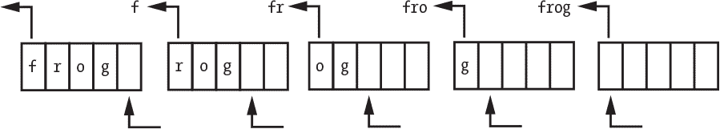

*图 10-12：从队列中移除*

如你所见，这需要做很多工作。当 `f` 被移除时，`r` 必须复制到 `f` 的位置，然后 `o` 复制到 `r` 的位置，依此类推。让我们试试另一种方法。与其让队列中的每个人都移动，不如让检查器在图 10-13 中做些运动。

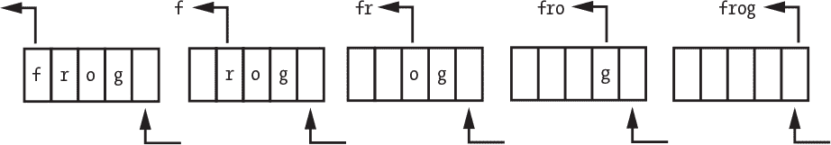

*图 10-13：通过移动检查器从队列中移除*

这要轻松得多，除了检查器之外。但它也带来了一个新问题。某一时刻，队列会排到门口，尽管前面还有空间。此时，其他人无法再加入队列。

我们需要的是一种方法，将新的人引导到队列前端的空间中。我们可以通过将队列弯曲成一个循环的方式来实现这一点，如图 10-14 所示。

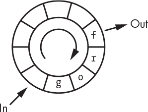

*图 10-14：循环缓冲区*

如你所见，数据可以按顺时针方向加入队列，只要 *入队* 箭头位于 *出队* 箭头的顺时针方向。同样，数据可以按逆时针方向从队列中移除，只要出队箭头位于入队箭头的逆时针方向。为了从缓冲区的末尾回绕到开头，需要做一些算术运算。下一个位置是当前的位置加 1，取模缓冲区大小。

这些结构有很多名字，包括 *循环缓冲区*、*循环队列* 和 *环形缓冲区*。它们是一种相当标准的方法，不仅在 `stdio` 或设备驱动中使用。

#### *通过良好的抽象实现更好的代码*

每次我们玩猜动物游戏时，我们都从一个只知道猫和狗的程序开始。如果我们能记住我们的游戏进度并从中断的地方继续，那该多好。对于 C 程序来说，这是很容易做到的；它是文件抽象带来的附带好处。

向 JavaScript 版本添加这样的功能要困难得多。图 10-15 说明了为什么。

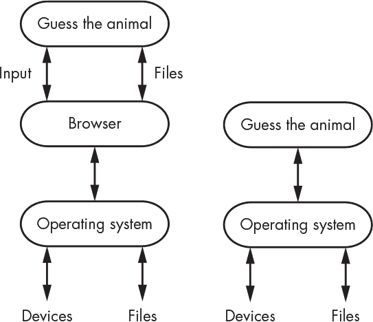

*图 10-15：浏览器和操作系统接口*

你可以看到操作系统有一个单一的接口，既适用于设备，也适用于文件。左侧的浏览器和右侧的 C 版本程序都使用这个接口。这意味着 C 程序像浏览器一样，可以使用相同的代码从文件中读取输入，就像从设备中读取用户输入一样。但浏览器并没有将这一抽象传递给 JavaScript 程序员。相反，要在浏览器中添加这个新功能，需要一段完全独立的代码，使用一个完全不同的接口。接口的选择会对编程的难易程度和结果的清晰度产生巨大影响。

#### *一些机制*

回到我们的 C 程序。准备好 C 程序运行需要先编译它，然后将它与其他代码（例如 `stdio` 库） *链接* 在一起。第 137 页 的 “运行程序” 章节提到，运行时库也包含其中；C 版本通常命名为 `crt0`。它负责一些任务，比如设置栈和堆以便它们可以使用。它还会打开一对文件，这些文件默认与终端设备驱动程序相连接，一个用于输入，一个用于输出。

`stdio` 库将系统文件描述符映射到 *文件指针*，这些地址引用了它用于缓冲和记录的相关数据结构。它一开始有三个：`stdin`（标准输入）、`stdout`（标准输出）和 `stderr`（标准错误）。其目的是将重要的信息发送到 `stderr` 而不是 `stdout`；虽然它们都指向同一个地方，但 `stderr` 是无缓冲的，而 `stdout` 是有缓冲的。如果你将错误消息发送到 `stdout`，它们会被缓冲，且如果程序崩溃，你可能永远也看不到这些消息。文件指针 `stdout` 和 `stderr` 共享相同的文件描述符，如 图 10-16 所示，除非被更改。

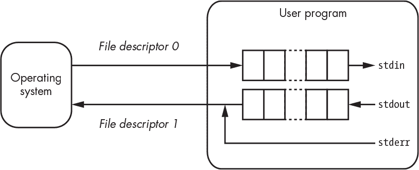

*图 10-16：文件指针 stdin、stdout 和 stderr*

发明通常源于一些奇怪的事件。根据 Steve Johnson 的说法，`stderr`并不是`stdio`库的原始部分；它是在开发第一款计算机排版软件（`troff`，由 Joseph Ossanna 编写，1928–1977 年）时，作为副作用被添加到 C/A/T 排版机中。你可能理所当然地认为激光和喷墨打印已经很普及，但这台机器将图像投射到银色的摄影纸上，然后再进行显影。当 Hunt 兄弟控制了银市时，打印费用变得非常昂贵，因此人们被要求减少排版机的使用。将作业送去排版机后，经常收到一页漂亮的格式化页面，上面写着`无法打开文件`的错误信息。为了节省开支，`stderr`文件指针应运而生，使得错误信息可以输出到终端，而不是排版机。

#### *缓冲区溢出*

既然我们提到了`stdio`，那么就来谈谈一种非常严重的系统编程错误——*缓冲区溢出*。当`stdio`最初被编写时，它包含了一个名为`gets`的函数，用来从`stdin`读取一个字符串，直到遇到下一个换行符，并将其存储到用户提供的缓冲区中。我们可以像清单 10-6 中所示，使用它来读取`y`、`n`或`q`的响应；`buffer`中为字符和 NUL 终止符提供了足够的空间。

```
1 char buffer[2];

2

3 gets(buffer);
```

*清单 10-6：使用 gets 读取输入*

为什么这会是一个问题呢？因为`gets`没有检查输入是否超出了缓冲区的末尾。假设我们有一个更复杂的程序，其中也有一个名为`launch_missiles`的变量，而它恰好是内存中的下一个位置（见图 10-17）。

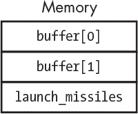

*图 10-17：内存中的缓冲区溢出*

恶意用户可能会发现，回答`yyy`会将一个`y`存储到`launch_missiles`中，这实际上就相当于不存在的`buffer[2]`。这可能会引发严重问题。事实上，很多被发现的安全问题正是由这种缓冲区溢出漏洞引起的。这一问题通过在`stdio`中添加`fgets`函数进行了解决，`fgets`会检查缓冲区边界。但是要小心——缓冲区溢出漏洞有很多种发生方式。*永远不要假设缓冲区大小足够大！*关于缓冲区溢出的更多细节请参见第十三章。

#### *C 程序*

除了`stdio`，还有许多其他 C 语言库。例如，`string`库包括用于比较和复制字符串的函数，而通用的标准库`stdlib`则包括用于内存管理的函数。

清单 10-7 显示了我们游戏的前言部分的 C 语言程序。第一部分引入了我们需要的库信息（第 1 到 3 行）。接下来，声明了一个节点结构体（第 5 到 9 行），其中包含指向两个叶子节点的指针以及一个占位符，用于存储问题或动物的字符串。请注意，我们在 JavaScript 版本中不需要做这样的事，因为我们利用了现有的 HTML `<div>`；如果我们没有这样做，JavaScript 中也会有等效的方式。注意，节点结构体的定义使我们可以将节点和字符串一起分配内存，就像在 《更高效的内存分配》 中的 第 196 页 所示那样。

```
1 #include <stdio.h>  // standard I/O library

2 #include <stdlib.h> // standard library for exit and malloc

3 #include <string.h> // string library

4

5 struct node {

6   struct node *no;  // references no answer node

7   struct node *yes; // references yes answer node

8   char string[1];   // question or animal

9 };
```

*清单 10-7：用 C 语言猜动物：前言*

接下来，我们定义了一个帮助进行内存分配的函数（清单 10-8）。虽然内存分配并不复杂，但我们需要在多个地方进行内存分配，每次都检查错误会变得很繁琐。更新的编程语言包括异常处理构造，使得这种操作变得更简单。

由于我们只在创建新 `node` 时需要分配内存，因此我们使用一个函数，该函数接受要安装到 `node` 中的 `string`。除了分配内存外，`string` 还会被复制到 `node` 中，并初始化 `yes` 和 `no` 指针。

```
10 struct  node    *

11 make_node(char *string)

12 {

13     struct  node    *memory;        // newly allocated memory

14

15     if ((memory = (struct node *)malloc(sizeof (struct node) + strlen(string))) == (struct node *)0) {

16         (void)fprintf(stderr, "gta: out of memory.\n");

17         exit(-1);

18     }

19

20     (void)strcpy(memory->string, string);

21     memory->yes = memory->no = (struct node *)0;

22

23     return (memory);

24 }
```

*清单 10-8：用 C 语言猜动物：内存分配器*

我们在 `stdio` 中使用 `fprintf` 函数来输出错误信息，因为如前所述，发送到 `stderr` 的内容是无缓冲的，这使得我们在程序意外失败时更有可能看到该信息。

注意，第 16 行使用了类型转换运算符将 `fprintf` 转换为 `void`。当 `fprintf` 返回一个我们忽略的值时，类型转换告诉编译器我们是故意这么做的，而不是忘记检查某个东西，这样它就不会生成警告信息。它还告诉阅读代码的人，返回值是故意被忽略的，因此这不是一个错误。最近一些编译器的更新消除了这些警告，除非明确要求。

第 17 行对 `exit` 的调用终止了程序。当没有足够的内存可供程序继续运行时，这是唯一合理的选择。

`printf`（*格式化输出*）函数是 `stdio` 的一部分，并且已经进入了许多其他语言。第一个参数是一个 *格式字符串*，它决定了其余参数的解释方式。一个 `%` 后面跟着一个代码表示“用下一个参数根据该代码替换我”。在这种情况下，`%s` 表示“将下一个参数视为字符串”。

程序的其余部分显示在 清单 10-9 中。

```
 25 int

 26 main(int argc, char *argv[])

 27 {

 28     char            animal[50];     // new animal name buffer

 29     char            buffer[3];      // user input buffer

 30     int             c;              // current character from buffer

 31     struct  node    **current;      // current tree traversal node

 32     FILE            *in;            // input file for training data or typing

 33     struct  node    *new;           // newly created node

 34     FILE            *out;           // output file for saving training data

 35     char            *p;             // newline removal pointer

 36     char            question[100];  // new question buffer

 37     struct  node    *root;          // root of the tree of knowledge

 38

 39     //  Process the command line arguments.

 40

 41     in = out = (FILE *)0;

 42

 43     for (argc--, argv++; argc > 1 && argc % 2 == 0; argc -= 2, argv += 2) {

 44         if (strcmp(argv[0], "-i") == 0 && in == (FILE *)0) {

 45             if ((in = fopen(argv[1], "r")) == (FILE *)0) {

 46                 (void)fprintf(stderr, "gta: can't open input file `%s'.\n", argv[1]);

 47                 exit(-1);

 48             }

 49         }

 50

 51         else if (strcmp(argv[0], "-o") == 0 && out == (FILE *)0) {

 52             if ((out = fopen(argv[1], "w")) == (FILE *)0) {

 53                 (void)fprintf(stderr, "gta: can't open output file `%s'.\n", argv[1]);

 54                 exit(-1);

 55             }

 56         }

 57

 58         else

 59             break;

 60     }

 61

 62     if (argc > 0) {

 63         (void)fprintf(stderr, "usage: gta [-i input-file-name] [-o output-file-name]\n");

 64         exit(-1);

 65     }

 66

 67     //  Read from standard input if no input file was specified on the command line.

 68

 69     if (in == (FILE *)0)

 70         in = stdin;

 71

 72     //  Create the initial tree of knowledge.

 73

 74     root = make_node("Does it bark");

 75     root->yes = make_node("dog");

 76     root->no = make_node("cat");

 77

 78     for (;;) {      // play games until the user quits.

 79

 80         if (in == stdin)

 81             (void)printf("Think of an animal.\n");

 82

 83         current = &root;    //  start at the top

 84

 85         for (;;) {          // play a game

 86

 87             for (;;) {      // get valid user input

 88                 if (in == stdin) {

 89                     if ((*current)->yes == (struct node *)0)

 90                         (void)printf("Is it a ");

 91

 92                     (void)printf("%s?[ynq] ", (*current)->string);

 93                 }

 94

 95                 if (fgets(buffer, sizeof (buffer), in) == (char *)0 || strcmp(buffer, "q\n") == 0) {

 96                     if (in != stdin) {

 97                         (void)fclose(in);

 98                         in = stdin;

 99                     }

100                     else {

101                         if (in == stdin)

102                             (void)printf("\nThanks for playing.  Bye.\n");

103                         exit(0);

104                     }

105                 }

106                 else if (strcmp(buffer, "y\n") == 0) {

107                     if (out != (FILE *)0)

108                         fputs("y\n", out);

109

110                     current = &((*current)->yes);

111

112                     if (*current == (struct node *)0) {

113                         (void)printf("I knew it!\n");

114                         break;

115                     }

116                 }

117                 else if (strcmp(buffer, "n\n") == 0) {

118                     if (out != (FILE *)0)

119                         fputs("n\n", out);

120

121                     if ((*current)->no == (struct node *)0) {

122                         if (in == stdin)

123                             (void)printf("I give up.  What is it? ");

124

125                         fgets(animal, sizeof (animal), in);

126

127                         if (out != (FILE *)0)

128                             fputs(animal, out);

129

130                         if ((p = strchr(animal, '\n')) != (char *)0)

131                             *p = '\0';

132

133                         if (in == stdin)

134                             (void)printf(

135                              "What's a good question that I could use to tell a %s from a %s? ",

136                               animal, (*current)->string);

137                         fgets(question, sizeof (question), in);

138

139                         if (out != (FILE *)0)

140                             fputs(question, out);

141

142                         if ((p = strchr(question, '\n')) != (char *)0)

143                             *p = '\0';

144

145                         new = make_node(question);

146                         new->yes = make_node(animal);

147                         new->no = *current;

148                         *current = new;

149

150                         if (in == stdin)

151                             (void)printf("Thanks!  I'll remember that.\n");

152

153                         break;

154                     }

155

156                     else

157                         current = &((*current)->no);

158                 }

159                 else {

160                     if (in == stdin)

161                         (void)printf("Huh?  Please answer y for yes, n for no, or q for quit.\n");

162

163                     while ((c = getc(in)) != '\n' && c != EOF)

164                         ;

165                 }

166             }

167

168             break;

169         }

170

171         if (in == stdin)

172             (void)printf("Let's play again.\n\n");

173     }

174 }
```

*清单 10-9：用 C 语言猜动物：主程序*

这段代码没有什么特别之处，除了内存管理，因为它与 JavaScript 版本几乎做了相同的事情。第 28 到 37 行声明了变量。第 74 到 76 行创建了 图 10-18 中所示的初始节点。请注意，所有字符串都是以 NUL 终止（`'\0'`）。

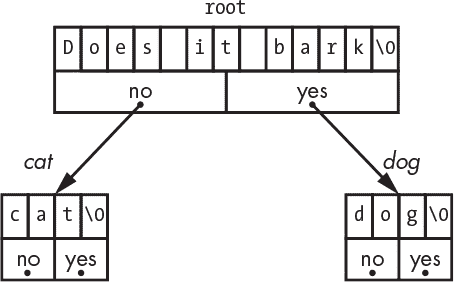

*图 10-18：用 C 语言猜动物：初始节点*

让我们像之前在 “猜动物版本 1：HTML 和 JavaScript” 中一样玩这个游戏，位于 第 262 页。当玩家提供一个新问题后，会为其分配一个新节点。这里有几点值得注意。使用 `strlen` (*字符串长度*) 函数时要小心。它返回的是字符串的实际长度，而不是占用的内存量，后者多了一个字节来表示 NUL 终止符。但请注意，在为字符串分配内存时，我们没有加 1，因为我们是以分配节点的方式来分配内存的，这已经包括了额外的字节。

每当我们根据是或否的回答下降到树的下一级时，我们会保持一个 `current` 指针，以便轻松插入新的问题节点。我们需要分离 `yes` 或 `no`，我们通过让 `current` 指向正在被替换的节点指针来做到这一点。因为 `current` 指向一个节点指针，它是指向指针的指针。当我们说 `*current = new;` 时，我们正在解引用指针，并表示“替换指针所指向的内容。”在 图 10-19 中，`new` 节点中的 `no` 指针被设置为 `current`，这是旧的答案，而 `current` 指向 `root` 节点中的 `yes` 指针，后者被替换为指向 `new` 节点的指针。

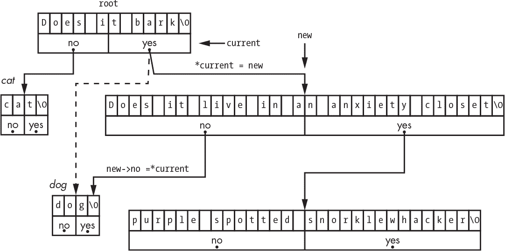

*图 10-19：用 C 语言猜动物：添加新节点*

#### *训练*

回想一下，我们的 C 程序可以通过命令行选项来读取和写入训练数据。我们可以如下运行程序：

```
prompt> gta -o training

Think of an animal.

Does it bark?

n

Is it a dog?

n

I give up. What is it?

giant purple snorklewhacker

What's a question that I could use to tell a giant purple snorklewhacker from a dog?

Does it live in an anxiety closet?

Thanks. I'll remember that.

Let's play again.

Think of an animal.

Does it bark?

q

Thanks for playing. Bye.
```

现在，如果你查看 `training` 文件，你会看到它包含了你输入的内容：

```
n

n

giant purple snorklewhacker

Does it live in an anxiety closet?
```

如果我们重新运行程序，如下所示：

```
prompt> gta -i training
```

`training` 文件的内容将被读取，以便程序从我们上次停止的地方继续。

很久以前，在 “什么是计算机编程？” 中的 第 xxix 页，我提到过，要成为一名优秀的程序员，你需要了解很多东西。我们的程序在语法上并不完美。如果动物是狗，它会正常工作，因为它会问 `Is it a dog?`。但如果是大象呢？问 `Is it a elephant?` 在语法上是错误的。那么，如何确保语法正确呢？你能修改代码让它在语法上更正确吗？

### 总结

在本章中，你已经看到了两种编写程序的方式：一次是作为高层应用程序，一次是作为低层系统程序。一方面，编写高层应用程序可能更简单，因为许多小细节会自动处理。另一方面，某些功能，如录制和回放，在不包含统一接口的环境中实现起来要困难得多。

此外，使用非常复杂的应用环境来处理简单应用程序会增加错误的可能性。错误的概率是应用程序代码和运行环境代码的总和。你的浏览器有多少次开始变得非常慢并且需要重启，通常是由于内部内存管理错误？你的浏览器又有多少次直接崩溃了？

你已经看到，系统编程涉及更多的细节管理，如字符串、内存和缓冲区的管理。但这些细节在目标是编写简洁且安全的代码时非常重要。在下一章中，我们将探讨另一种类型的细节：如何构建问题，使其更容易解决。
