## 第十一章：**捷径和近似**


到目前为止，我们已经花费了大量时间研究如何高效计算，特别是在内存使用方面。但有一件事比高效计算更好，那就是根本不计算。本章将讨论避免计算的两种方法：走捷径和近似。

我们认为计算机是非常精确的。但是，正如我们在《表示实数》一节中所看到的，计算机并不是那么精确。我们可以编写代码做到尽可能精确。例如，UNIX 中的`bc`工具是一个任意精度计算器，如果你需要大量精度，它是完美的，但它并不是一种高效的方法，因为计算机硬件并不支持任意精度。这就引出了一个问题，对于特定应用，精确到什么程度才算足够好呢？有效利用计算资源意味着不要做多余的工作。在使用π之前计算出所有的数字，显然是不理性的！

### 查表法

很多时候，通过查表来获取某些值比进行计算更简单、更快捷。在接下来的子节中，我们将看看这种方法的一些例子。查表法与第八章中讨论的循环不变优化类似，即如果某个值会被频繁使用，提前计算一次通常是有意义的。

#### *转换*

假设我们需要读取一个温度传感器，并以十分之一摄氏度（°C）为单位显示结果。一位聪明的硬件设计师为我们提供了一个电路，它根据测量的温度输出一个电压，我们可以通过 A/D 转换器读取这个电压（参见《模拟到数字转换》一节，第 162 页）。曲线如图 11-1 所示。

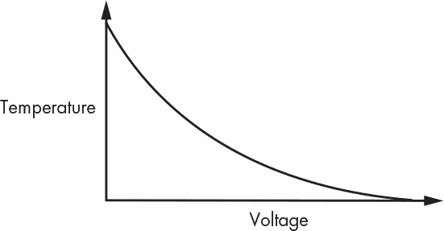

*图 11-1：温度传感器曲线*

你可以看到这条曲线并不是一条方便的直线。我们可以使用以下公式根据电压（v）来计算温度（t），其中 *A*、*B* 和 *C* 是由特定传感器型号决定的常数：

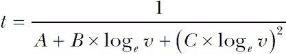

如你所见，这里涉及了大量的浮点运算，包括自然对数，而这些都是比较昂贵的运算。所以我们决定跳过这些计算。相反，我们可以构建一个查表，将电压值映射到温度值。假设我们有一个 10 位的 A/D 转换器，且 8 位足以表示我们的温度值。这意味着我们只需要一个 1,024 字节的表格，就可以避免所有计算，如图 11-2 所示。

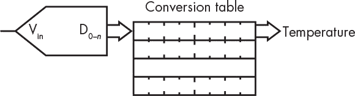

*图 11-2：查表转换*

#### *纹理映射*

表格查找是*纹理映射*的一个主要组成部分，这项技术有助于在视频游戏和电影中提供逼真的图像。其背后的思路是，将图像粘贴到物体（如墙壁）上，比通过算法生成所有细节要少得多的计算量。这听起来没问题，但它也有自己的问题。假设我们有一个砖墙纹理，像图 11-3 中那样。

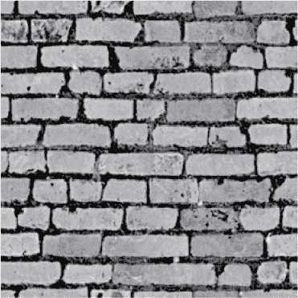

*图 11-3：砖墙纹理*

看起来不错。但视频游戏不是静态的。你可能因为被僵尸追赶而高速逃离一堵砖墙。砖墙的外观需要根据你与它的距离变化。图 11-4 展示了从远处看墙壁（左侧）和从近处看墙壁（右侧）的样子。

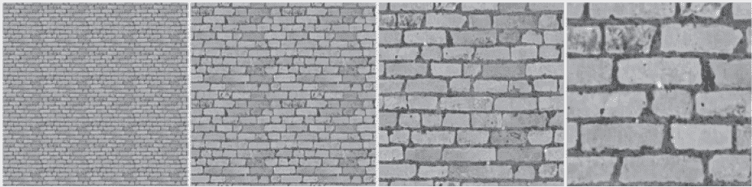

*图 11-4：不同距离下的砖墙纹理*

正如你可能预期的那样，调整远距离的纹理是非常繁琐的工作。当视点远离纹理时，邻近的像素必须进行平均处理。能够快速进行这种计算非常重要，以确保图像不会出现跳动现象。

兰斯·威廉姆斯（1949–2017）在纽约理工学院图形语言实验室提出了一种巧妙的方法，称为*MIP 映射*（这个名字源于拉丁语*multum in parvo*，意思是“在小地方放许多东西”）。他关于这个主题的论文《金字塔参数化》于 1983 年 7 月的 SIGGRAPH 会议记录中发表。他的方法至今仍在使用，不仅在软件中，也在硬件中得到了应用。

正如我们在《颜色表示》一节中看到的，第 27 页提到，一个像素有三个 8 位的分量，分别代表红色、绿色和蓝色。威廉姆斯注意到，在 32 位系统上，当这些分量以矩形形式排列时，会留下四分之一的空余空间，正如图 11-5 所示。

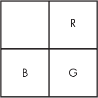

*图 11-5：颜色分量排列与剩余空间*

他不能让这块空间白白浪费掉，于是他采用了一种与 Tom Duff 和 Thomas Porter 不同的方式来加以利用（参见《添加透明度》在第 29 页）。威廉姆斯注意到，因为它是四分之一的空间，所以他可以将图像的四分之一大小副本放入这块空间，再将另一个四分之一大小的副本放入*那个*空间，依此类推，正如图 11-6 所示。他称这种排列为 MIP 图。

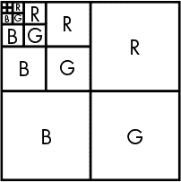

*图 11-6：多重图像布局*

将我们的砖墙纹理制作成 MIP 图，最终结果就是图 11-7 中所示的图像（你需要想象这张灰度图中的颜色分量）。

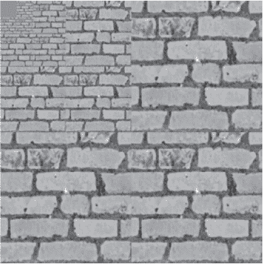

*图 11-7：MIP 映射纹理*

如你所见，近距离的图像包含更多的细节，这在关键位置很重要。这很有趣，但除了作为一个巧妙的存储机制，它有什么用途呢？看看图 11-8，它将 MIP 映射的一个颜色展开成金字塔形状。

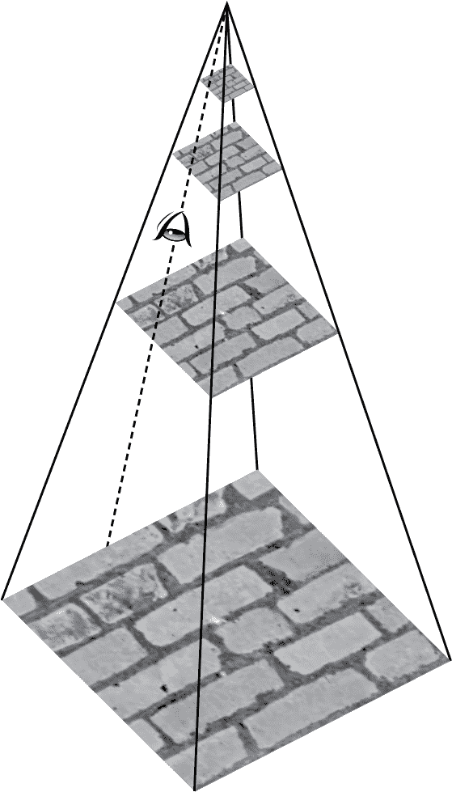

*图 11-8：MIP 映射金字塔*

金字塔顶部的图像展示的是远处的样子，随着我们向底部移动，细节逐渐增多。当我们需要计算显示给定眼睛位置的实际纹理时，在图 11-8 中，我们不需要将底部图像中的所有像素平均化；我们只需使用最接近的一层像素。这可以节省大量时间，尤其是在视点很远的情况下。

预计算将被频繁使用的信息——在这种情况下，低分辨率版本的纹理——相当于循环不变优化。

#### *字符分类*

表格查找方法对 C 语言中库的加入产生了很大的影响。在第八章中，我们看到*字符分类*——决定哪些字符是字母、数字等——是词法分析中的一个重要部分。回顾表 1-10 中的 ASCII 码表，你可以轻松编写代码实现分类，如清单 11-1 中所示。

```
int

isdigit(int c)

{

  return (c >= '0' && c <= '9');

}

int

ishexdigit(int c)

{

  return (c >= '0' && c <= '9' || c >= 'A' && c <= 'F' || c >= 'a' && c <= 'f');

}

int

isalpha(int c)

{

  return (c >= 'A' && c <= 'Z' || c >= 'a' && c <= 'z');

}

int

isupper(int c)

{

  return (c >= 'A' && c <= 'Z');

}
```

*清单 11-1：字符分类代码*

贝尔实验室的一些人建议将常用的函数，如清单 11-1 中的函数，放入*库*中。Dennis Ritchie（1941–2011）认为人们可以很容易地编写自己的代码。但计算机中心的 Nils-Peter Nelson 编写了一个实现这些例程的程序，使用了一个表格而不是一系列 `if` 语句。该表格通过字符值进行索引，表格中的每个条目包含表示大写、小写、数字等方面的位，如图 11-9 所示。

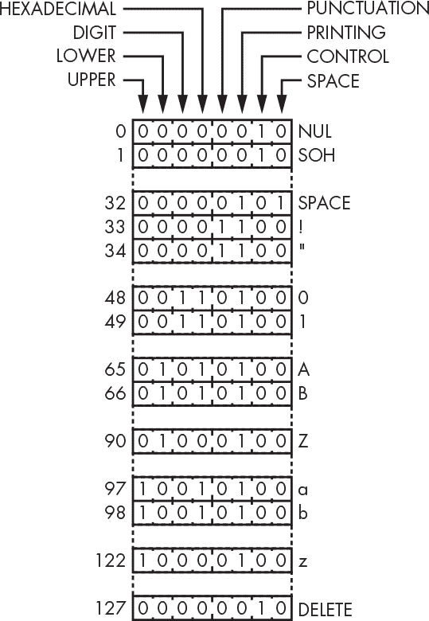

*图 11-9：字符分类表*

在这种情况下，分类涉及查找表中的值并检查位，如清单 11-2 所示。

```
unsigned char table[128] = [ ... ];

#define isdigit(c)    (table[(c) & 0x7f] & DIGIT)

#define ishexdigit(c) (table[(c) & 0x7f] & HEXADECIMAL)

#define isalpha(c)    (table[(c) & 0x7f] & (UPPER | LOWER))

#define isupper(c)    (table[(c) & 0x7f] & UPPER)
```

*清单 11-2：基于表格的字符分类代码*

如你所见，清单 11-2 中的函数比清单 11-1 中的函数简单。而且它们有一个很好的特性，那就是它们本质上是相同的代码；唯一的区别是与表格内容进行与运算的常量值。这种方法比其他任何方法快了 20 倍，因此 Ritchie 妥协了，这些函数被作为库加入，铺垫了更多库的出现。

**注意**

*您会注意到，我在 清单 11-2 中使用了* 宏 *，但在 清单 11-1 中使用了* 函数 *。如果您之前没见过宏，它们是一种语言结构，用于将右侧的代码替换为左侧的代码。例如，如果您的源代码包含 isupper('a')，那么语言*预处理器*会将其替换为 table[('a') & 0x7f] & UPPER。这对于小块代码很有用，因为没有函数调用的开销。但是，像 清单 11-1 中的代码，使用宏来实现是不可行的，因为我们必须处理像 isupper(*p++) 这样的情况。如果 清单 11-1 中的代码被实现为宏，那么例如在 ishexdigit 中，p 会被递增六次，这对调用者来说是个意外。而 清单 11-2 中的版本仅引用了参数一次，因此不会发生这种情况。*

### 整数方法

从前面的硬件讨论中应该很明显，一些操作在速度和功耗方面比其他操作更便宜。整数加法和减法是便宜的。乘法和除法成本较高，尽管我们可以通过移位操作便宜地进行乘 2 和除 2。浮动点运算要贵得多。复杂的浮动点运算，如三角函数和对数函数的计算，要贵得多。与本章的主题一致，最好我们能找到避免使用更昂贵操作的方法。

我们来看一些视觉示例。清单 11-3 修改了 清单 10-1 中的网页框架，新增了 `style`、`script` 片段和 `body`。

```
 1 <style>

 2    canvas {

 3      border: 5px solid black;

 4    }

 5 </style>

 6 ...

 7 <script>

 8    $(function() {

 9      var canvas = $('canvas')[0].getContext('2d');

10

11      // Get the canvas width and height.  Force them to be numbers

12      // because attr yields strings and JavaScript often produces

13      // unexpected results when using strings as numbers.

14

15      var height = Number($('canvas').attr('height'));

16      var width = Number($('canvas').attr('width'));

17

18      canvas.translate(0, height);

19      canvas.scale(1, -1);

20    });

21 </script>

22 ...

23 <body>

24   <canvas width="500" height="500"></canvas>

25 </body>
```

*清单 11-3：基础画布*

我在 “HTML5” 一节中简要提到过画布，位于 第 255 页。*canvas* 是一种元素，您可以在上面进行自由形式的绘图。您可以将其视为一张图表纸。

画布“图表纸”并不像您习惯的那样，因为默认情况下它不使用标准的笛卡尔坐标系。这是电视上栅格绘制方向的产物（参见 “栅格图形” 第 180 页）；栅格从左上角开始。x 坐标表现正常，但 y 坐标从顶部开始并向下增加。当电视显示器被重新用于计算机图形时，这种坐标系统被保留下来。

现代计算机图形系统支持任意坐标系，图形硬件通常包括对其的支持。*变换* 会应用到您指定的每个 (*x*, *y*) 坐标，并通过以下公式将您的坐标映射到屏幕坐标 (*x′*, *y′*)：

*x*′ = *Ax* + *By* + *C*

*y*′ = *Dx* + *Ey* + *F*

*C*和*F*项提供*平移*，这意味着它们移动事物的位置。*A*和*E*项提供*缩放*，这意味着它们让事物变大或变小。*B*和*D*项提供*旋转*，这意味着它们改变方向。这些通常以矩阵形式表示。

现在，我们只关心平移和缩放，以将画布坐标系统转换为一个熟悉的坐标系统。我们在第 13 行通过画布的高度向下平移，然后在第 14 行翻转 y 轴的方向。顺序很重要；如果我们反过来执行这些平移，原点将位于画布的上方。

图形实际上是通过将基本颜色的斑点放置在一张图表纸上来创建的（参见 “表示颜色” 第 27 页）。那么，我们需要多精细的图表纸？我们对颜色斑点的组成需要多少控制？

第 19 行中的`width`和`height`属性设置`canvas`的像素大小（参见 “数字图像” 第 173 页）。显示器的*分辨率*是每英寸（或每厘米）的像素数量。屏幕上的画布大小取决于屏幕的分辨率。除非它是一个真正的古董，否则你可能看不见单个像素。（请注意，人眼的分辨率在视野范围内并不是恒定的；参见《人眼的光子精确模型》，Michael Deering，SIGGRAPH 2005。）即使是当前的超高清显示器也很棒，但仍然需要像超采样这样的技术，才能让画面看起来真的很棒。

我们将从在非常低的分辨率下绘制图形开始，这样我们就能看到细节。我们通过添加一个 JavaScript 函数来清除画布并绘制网格，来制作一些图表纸，如清单 11-4 所示。我们还将使用缩放变换来获得整数值的网格交点。缩放应用于画布上的所有绘制内容，因此我们必须将线条宽度调整得更小。

```
 1  var grid = 25;                                // 25 pixel grid spacing

 2

 3  canvas.scale(grid, grid);

 4  width = width / grid;

 5  height = height / grid;

 6  canvas.lineWidth = canvas.lineWidth / grid;

 7  canvas.strokeStyle = "rgb(0, 0, 0)";          // black

 8

 9  function

10  clear_and_draw_grid()

11  {

12    canvas.clearRect(0, 0, width, height);      // erase canvas

13    canvas.save(); // save canvas settings

14    canvas.setLineDash([0.1, 0.1]);             // dashed line

15    canvas.strokeStyle = "rgb(128, 128, 128)";  // gray

16    canvas.beginPath();

17

18    for (var i = 1; i < height; i++) {          // horizontal lines

19      canvas.moveTo(0, i);

20      canvas.lineTo(height, i);

21    }

22

23    for (var i = 1; i < width; i++) {           // vertical lines

24      canvas.moveTo(i, 0);

25      canvas.lineTo(i, width);

26    }

27

28    canvas.stroke();

29    canvas.restore();                           // restore canvas settings

30  }

31

32  clear_and_draw_grid();                        // call on start-up
```

*清单 11-4：绘制网格*

#### *直线*

现在，让我们通过在清单 11-5 中的网格上放置彩色圆圈来绘制几条线。一条线是水平的，另一条线的斜率是 45 度。对角线的斑点稍微大一点，这样我们就能看到它们相交的点。

```
 1  for (var i = 0; i <= width; i++) {

 2    canvas.beginPath();

 3    canvas.fillStyle = "rgb(255, 255, 0)";     // yellow

 4    canvas.arc(i, i, 0.25, 0, 2 * Math.PI, 0);

 5    canvas.fill();

 6

 7    canvas.beginPath();

 8    canvas.fillStyle = "rgb(255, 0, 0)";       // red

 9    canvas.arc(i, 10, 0.2, 0, 2 * Math.PI, 0);

10    canvas.fill();

11  }
```

*清单 11-5：水平和对角线*

正如你在图 11-10 中看到的，或者通过运行程序，你会发现对角线上的像素比水平线上的像素更远（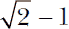，根据毕达哥拉斯定理更远）。这有什么影响呢？因为这两条线的像素数相同，都会发出光线，但当对角线上的像素更分散时，光的密度会较低，使其看起来比水平线暗。对此你几乎无能为力；显示器设计者会调整像素的形状以尽量减少这种效果。对于便宜的显示器来说，这个问题更为明显，而在桌面显示器和手机上相对较少。

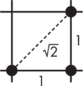

*图 11-10：像素间距*

水平线、垂直线和对角线是简单的情况。我们怎么决定为其他线条照亮哪些像素呢？让我们写一个绘制线条的程序。我们将从在 `body` 中的 `canvas` 元素后添加一些控件开始，如列表 11-6 所示。

```
1  <div>

2    <label for="y">Y Coordinate: </label>

3    <input type="text" size="3" id="y"/>

4    <button id="draw">Draw</button>

5    <button id="erase">Erase</button>

6  </div>
```

*列表 11-6：基本的绘制线条程序主体*

然后，在列表 11-7 中，我们将用 `draw` 和 `erase` 按钮的事件处理程序替换列表 11-5 中的代码。`draw` 函数使用的是那个让人头疼的 *y* = *mx* + *b*，在我们的例子中，*b* 总是 0。惊讶吧！一些数学知识实际上被应用了。

```
 1  $('#draw').click(function() {

 2    if ($('#y').val() < 0 || $('#y').val() > height) {

 3      alert('y value must be between 0 and ' + height);

 4    }

 5    else if (parseInt($('#y').val()) != $('#y').val()) {

 6      alert('y value must be an integer');

 7    }

 8    else {

 9      canvas.beginPath();                  // draw ideal line

10      canvas.moveTo(0, 0);

11      canvas.setLineDash([0.2, 0.2]);      // dashed line

12      canvas.lineTo(width, $('#y').val());

13      canvas.stroke();

14

15      var m = $('#y').val() / width;       // slope

16

17      canvas.fillStyle = "rgb(0, 0, 0)";

18

19      for (var x = 0; x <= width; x++) {   // draw dots on grid

20        canvas.beginPath();

21        canvas.arc(x, Math.round(x * m), 0.15, 0, 2 * Math.PI, 0);

22        canvas.fill();

23      }

24

25      $('#y').val('');                     // clear y value field

26    }

27  });

28

29  $('#erase').click(function() {

30    clear_and_draw_grid();

31  });
```

*列表 11-7：浮点线条绘制与擦除函数*

让我们试试 y 坐标为 15 的情况。结果应该类似于图 11-11。

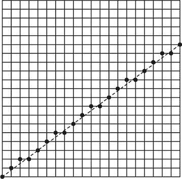

*图 11-11：使用浮点运算绘制的线条*

看起来相当糟糕，但如果你站得远一点看，它看起来就像一条线。这是我们能做到的最接近的效果。这不仅仅是一个计算机图形学问题，任何做十字绣的人都会告诉你这一点。

尽管我们刚刚写的程序运行得很好，但它的效率并不高。它在每一个点上都在进行浮点乘法和舍入运算。即使在现代计算机上，这比整数运算慢了至少一个数量级。我们确实从提前计算一次斜率（第 15 行）中获得了一些性能提升。它是一个循环不变式，因此优化器（参见“优化”在第 234 页）很有可能会自动为你处理这一点。

早在 1962 年，当浮点运算成本过高时，IBM 的 Jack Bresenham 想出了一个巧妙的方法，通过不使用浮点运算来绘制直线。Bresenham 将他的创新带到了 IBM 专利局，但专利局并未看出其价值，拒绝了申请专利的请求。幸运的是，后来这被证明是一个基础的计算机图形学算法，而没有专利意味着每个人都可以使用它。Bresenham 意识到，绘制直线问题可以通过逐步逼近来解决。因为我们在每个连续的`x`值上计算`y`，我们只需每次加上斜率（在 Listing 11-8 中的第 9 行），这样就消除了乘法运算。这种优化器不太可能察觉，它本质上是一个复杂的强度减少。

```
 1  var y = 0;

 2

 3  canvas.fillStyle = "rgb(0, 0, 0)";

 4

 5  for (var x = 0; x <= width; x++) {         // draw dots on grid

 6    canvas.beginPath();

 7    canvas.arc(x, Math.round(y), 0.15, 0, 2 * Math.PI, 0);

 8    canvas.fill();

 9    y = y + m;

10  }
```

*Listing 11-8: 逐步计算 y*

我们需要浮点运算，因为斜率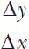是一个分数。但除法可以通过加法和减法来代替。我们可以有一个*决策变量*`d`，并在每次迭代中加上Δ*y*。每当`d` ≥ Δ*x*时，`y`值会增加，然后我们从`d`中减去Δ*x*。

最后一个问题是：四舍五入。我们希望选择像素中间的点，而不是像素底部的点。这可以通过将`d`的初始值设置为½*m*而不是 0 来轻松处理。但我们不想引入分数。没问题：我们只需通过将其及其他内容乘以 2，使用 2Δ*y*和 2Δ*x*来去掉½。

将绘制网格上点的代码替换为 Listing 11-9 的“仅限整数”版本（我们无法控制 JavaScript 是否在内部使用整数，这与像 C 这样的语言不同）。请注意，这段代码仅适用于斜率在 0 到 1 之间的直线。如何让它适用于所有斜率，作为一个练习留给你自己去完成。

```
 1  var dx = width;

 2  var dy = $('#y').val();

 3  var d = 2 * dy - dx;

 4  var y = 0;

 5

 6  dx *= 2;

 7  dy *= 2;

 8

 9  canvas.fillStyle = "rgb(255, 255, 0)";

10  canvas.setLineDash([0,0]);

11

12  for (var x = 0; x <= width; x++) {

13    canvas.beginPath();

14    canvas.arc(x, y, 0.4, 0, 2 * Math.PI, 0);

15    canvas.stroke();

16

17    if (d >= 0) {

18      y++;

19      d -= dx;

20    }

21    d += dy;

22  }
```

*Listing 11-9: 整数线条绘制*

从 Listing 11-9 中引出的一个有趣问题是，为什么决策算术不按 Listing 11-10 中显示的那样编写？

```
1  var dy_minus_dx = dy - dx;

2

3  if (d >= 0) {

4    y++;

5    d -= dy_minus_dx;

6  }

7  else {

8    d += dy;

9  }
```

*Listing 11-10: 替代决策代码*

一开始，这种方法似乎更好，因为每次迭代只对决策变量进行一次加法操作。Listing 11-11 显示了这在某些假设的汇编语言中可能的表现，类似于第四章中的语言。

```
        load    d                       load    d

        cmp     #0                      cmp     #0

        blt     a                       blt     a

        load    y                       load    y

        add     #1                      add     #1

        store   y                       store   y

        load    d                       load    d

        sub     dx_plus_dy              sub     dx

        bra     b

a:      add     dy              a:      add     dy

        store   d                       store   d

b:      ...                             ...
```

*Listing 11-11: 替代决策代码汇编语言*

请注意，替代版本比原始版本多了一条指令。而在大多数计算机中，整数加法所需的时间与分支操作相同。因此，我们原本认为更好的代码实际上在每次需要增加`y`时，反而多了一条指令的时间。

Bresenham 线算法中使用的技术可以应用于许多其他问题。例如，您可以通过将 `y` 替换为颜色值，生成平滑变化的颜色 *渐变*，如 图 11-12 所示。

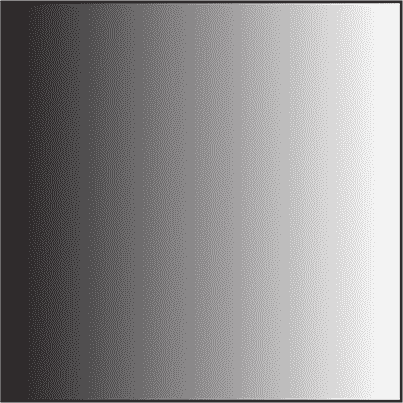

*图 11-12: 颜色渐变*

图 11-12 中的渐变是使用文档中 列表 11-12 所示的代码在文档准备函数中生成的。

```
 1  var canvas = $('canvas')[0].getContext('2d');

 2  var width = $('canvas').attr('width');

 3  var height = $('canvas').attr('height');

 4

 5  canvas.translate(0, height);

 6  canvas.scale(1, -1);

 7

 8  var m = $('#y').val() / width;

 9

10  var dx = width;

11  var dc = 255;

12  var d = 2 * dc - dx;

13  var color = 0;

14

15  for (var x = 0; x <= width; x++) {

16    canvas.beginPath();

17    canvas.strokeStyle = "rgb(" + color + "," + color + "," + color + ")";

18    canvas.moveTo(x, 0)

19    canvas.lineTo(x, height);

20    canvas.stroke();

21

22    if (d >= 0) {

23      color++;

24      d -= 2 * dx;

25    }

26    d += 2 * dc;

27  }
```

*列表 11-12: 颜色渐变代码*

#### *前方曲线*

整数方法不限于直线。让我们画一个椭圆。我们将坚持使用简单情况，即椭圆的轴与坐标轴对齐且中心位于原点。它们由以下方程定义，其中 *a* 是宽度的一半，*b* 是高度的一半：

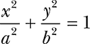

假设我们位于 图 11-13 中的实心黑点，我们需要决定下一个三个可能点中，哪个点最接近理想的椭圆。

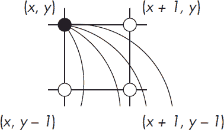

*图 11-13: 椭圆决策点*

定义 *A* = *b*² 和 *B* = *a*²，我们可以将椭圆方程重新排列为 *Ax*² + *By*² – *AB* = 0。我们大多数时候无法满足这个方程，因为我们需要绘制的点不太可能与理想椭圆上的点相同。当我们处于 (*x*, *y*) 时，我们希望选择下一个点，使得 *Ax*² + *By*² – *AB* 最接近 0。我们希望能够做到这一点，而不需要方程中的七次乘法运算。

我们的方法是计算三个可能点上方程的值，然后选择方程值最接近 0 的点。换句话说，我们将使用 *d* = *Ax*² + *By*² – *AB* 计算每个点的距离变量 *d*。

让我们首先弄清楚如何在没有乘法的情况下计算 (*x* + 1, *y*) 处的 *d*。我们可以将 (*x* + 1) 代入 *x* 的方程，如下所示：

*d*[*x*+1] = *A*(*x* + 1)² + *By*² – *AB*

当然，平方某个数就是将它乘以自身：

*d*[*x*+1] = *A*(*x* + 1)(*x* + 1) + *By*² – *AB*

将其展开，我们得到：

*d*[*x*+1] = *x*² + 2*Ax* + *A* + *By*² – *AB*

现在，如果我们将其从原始方程中减去，我们可以看到方程在 *x* 和 *x* + 1 之间的差异为：

*dx* = 2*Ax* + *A*

我们可以将 *dx* 加到 *d* 上，得到 *d[x]* [+ 1]。但这还不能完全解决问题，因为仍然存在乘法运算。所以让我们在 *x* + 1 处评估 *dx*：

*dx*[*x*+1] = 2*A*(*x* + 1) + *A*

*dx*[*x*+1] = 2*Ax* + 2*A* + *A*

就像之前一样，减法给我们带来：

*d*2*x* = 2*A*

这会得到一个常数，使得可以在不进行乘法运算的情况下，使用中间变量 *dx* 和 *d*2*x* 计算 (*x* + 1, *y*) 处的 *d*：

2*A*[*x*+1] = 2*Ax* + *d*2*x*

这给了我们水平方向——垂直方向几乎是相同的，唯一的不同是符号，因为我们是在 -*y* 方向上：

*dy* = –2*By* + *B*

*d*2*y* = 2*B*

现在我们有了这些术语，决定哪一个点最接近理想曲线变得简单了。我们计算到点 (*x* + 1, *y*) 的水平方向差 *dh*，到点 (*x*, *y* – 1) 的垂直方向差 *dv*，以及到点 (*x* + 1, *y* – 1) 的对角线差 *dd*，然后选择最小的一个。请注意，虽然 *dx* 总是正数，*dv* 和 *dd* 可能是负数，所以我们需要取它们的绝对值再进行比较，如 图 11-14 所示。

我们的椭圆绘制算法只在第一象限绘制椭圆。这没关系，因为我们还可以使用另一个技巧：对称性。我们知道椭圆的每个象限看起来都和第一个一样，只是水平、垂直或两者都翻转。我们可以通过绘制 (–*x*, *y*)、(–*x*, –*y*) 和 (*x*, –*y*) 来绘制整个椭圆，除此之外还绘制 (*x*, *y*)。请注意，如果我们绘制的是圆形，我们可以使用八向对称性。

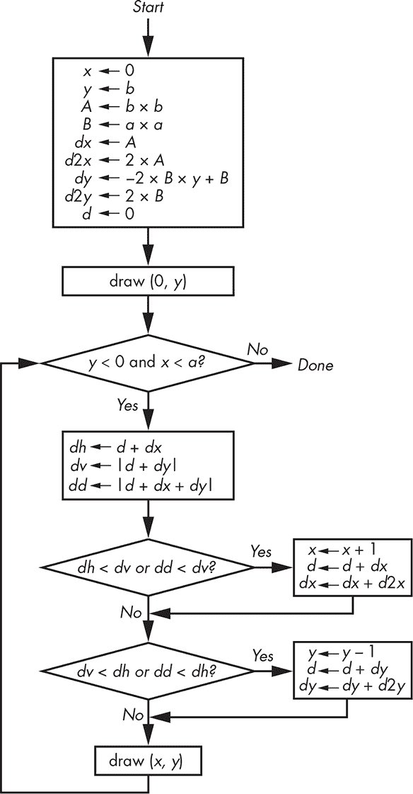

*图 11-14：椭圆绘制算法*

这个算法包括一些可以简化的比较，这些比较源于绘制椭圆的四分之一部分。四分之一椭圆可以在曲线斜率为 1 的点处划分为两部分。通过这种方法，我们将有一段代码只需要在水平方向和对角线方向之间做出选择，另一段则需要在垂直方向和对角线方向之间做出选择。哪个先执行取决于 *a* 和 *b* 的值。但更多的时间是在循环中做决策，而不是在设置时，因此这是一个不错的折衷方案。

前面的算法有一个严重的缺陷：因为它是从半宽度 (*a*) 和半高度 (*b*) 开始的，所以它只能绘制宽度和高度是奇数像素的椭圆，因为结果是 2*a* 宽，2*b* 高，再加 1 用于轴。

#### *多项式*

我们用来绘制椭圆的通过增量计算差异的方法，在圆锥曲线（平方类的东西）之外不太适用。因为高阶方程会做出奇怪的事情，例如在单个像素的空间内多次改变方向——这是很难高效检测的。

但逐步计算差分可以推广到任何形式的多项式，如*y* = *Ax*⁰ + *Bx*¹ + *Cx*² + ... *Dx^n*。我们要做的就是生成*n*组差分，使得我们的累积加法从常数开始。这之所以有效，是因为与椭圆绘制代码不同，多项式只有一个独立变量。你可能还记得查尔斯·巴贝奇的差分引擎，它出现在《数字计算机的案例》一章的第 34 页中。它的设计就是为了实现这一点：使用增量差分来评估方程。

### 递归细分

我们在《堆栈》一章的第 122 页中简单提到过*递归细分*。这是一种用途广泛的技术。在本节中，我们将探讨如何使用它，以便在最少的工作量下实现目标。

#### *螺旋线*

我们的线条绘制代码可以用于更复杂的曲线。我们可以计算一些点并通过线条将它们连接起来。

你们数学课可能讲过角度的度量方法，你知道一个圆有 360 度。你可能不知道的是，还有其他的度量系统。一种常用的系统是*弧度*。一个圆有 2π弧度。因此，360 度等于 2π弧度，180 度等于π弧度，90 度等于π/2 弧度，45 度等于π/4 弧度，依此类推。你需要了解这一点，因为许多数学库中的三角函数，比如 JavaScript 中的函数，期望的角度是以弧度表示的，而不是度数。

我们将使用极坐标绘制的曲线作为示例，因为它们很漂亮。以防你还没有学习过，*极坐标*使用半径*r*和角度θ，而不是*x*和*y*。转换为笛卡尔坐标很简单：*x* = *r*cosθ* 和 *y* = *r*sinθ*。我们的第一个示例绘制了一个螺旋线，使用*r* = θ × 10；当我们扫过角度时，绘制的点逐渐远离中心。我们将输入角度值，而不是弧度值，因为对于很多人来说，角度的概念比弧度更直观。列表 11-13 显示了控件的主体部分。

```
<canvas width="500" height="500"></canvas>

<div>

  <label for="degrees">Degrees: </label>

  <input type="text" size="3" id="degrees"/>

  <button id="draw">Draw</button>

  <button id="erase">Erase</button>

</div>
```

*列表 11-13：螺旋体*

我们这里跳过了网格，因为我们需要绘制更多细节。由于我们使用的是极坐标，列表 11-14 将(0, 0)设为中心。

```
canvas.scale(1, -1);

canvas.translate(width / 2, -height / 2);

$('#erase').click(function() {

  canvas.clearRect(-width, -height, width * 2, height * 2);

});

$('#draw').click(function() {

  if (parseFloat($('#degrees').val()) == 0)

    alert('Degrees must be greater than 0');

  else {

    for (var angle = 0; angle < 4 * 360; angle += parseFloat($('#degrees').val())) {

      var theta = 2 * Math.PI * angle / 360;

      var r = theta * 10;

      canvas.beginPath();

      canvas.arc(r * Math.cos(theta), r * Math.sin(theta), 3, 0, 2 * Math.PI, 0);

      canvas.fill();

    }

  }

});
```

*列表 11-14：点状螺旋 JavaScript*

输入 10 作为角度值，然后点击“绘制”。你应该会看到类似于图 11-15 的结果。

注意到随着我们远离原点，点之间的间距变大，尽管它们在中心附近重叠。我们可以将角度值设得足够小，使得曲线看起来比较好看，但这意味着我们会有许多重叠的点，这会变得非常慢，而且很难为一个任意函数猜出所需的角度值。

让我们尝试在这些点之间绘制线条。将列表 11-15 中的绘制代码替换进去。

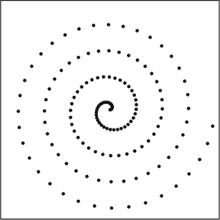

*图 11-15：虚线螺旋*

```
canvas.beginPath();

canvas.moveTo(0, 0);

for (var angle = 0; angle < 4 * 360; angle += parseFloat($('#degrees').val())) {

  var theta = 2 * Math.PI * angle / 360;

  var r = theta * 10;

  canvas.lineTo(r * Math.cos(theta), r * Math.sin(theta));

}

canvas.stroke();
```

*清单 11-15：螺旋线 JavaScript*

输入 20 作为度数值，然后点击绘制。图 11-16 展示了你应该看到的结果。

不是很美观。再次强调，它在中心附近看起来不错，但随着我们向外推进，它变得越来越差。我们需要一种方法来根据需要计算更多的点——这时我们的老朋友递归细分方法派上了用场。我们使用螺旋函数在两个角度 θ[1] 和 θ[2] 之间绘制线条。我们将设定一个*足够接近*的标准，如果一对点之间的距离不够接近，我们将把角度差一分为二并重试，直到足够接近为止。我们将使用*距离公式* 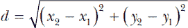来计算点之间的距离，正如清单 11-16 所示。

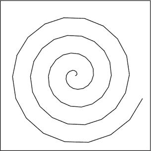

*图 11-16：螺旋线*

```
var close_enough = 10;

function

plot(theta_1, theta_2)

{

  var r;

  r = theta_1 * 10;

  var x1 = r * Math.cos(theta_1);

  var y1 = r * Math.sin(theta_1);

  r = theta_2 * 10;

  var x2 = r * Math.cos(theta_2);

  var y2 = r * Math.sin(theta_2);

  if (Math.sqrt(((x2 - x1) * (x2 - x1) + (y2 - y1) * (y2 - y1))) < close_enough) {

    canvas.moveTo(x1, y1);

    canvas.lineTo(x2, y2);

  }

  else {

    plot(theta_1, theta_1 + (theta_2 - theta_1) / 2);

    plot(theta_1 + (theta_2 - theta_1) / 2, theta_2);

  }

}

$('#draw').click(function() {

  if (parseFloat($('#degrees').val()) == 0)

    alert('Degrees must be greater than 0');

  else {

    canvas.beginPath();

    for (var angle = 0; angle < 4 * 360; angle += parseFloat($('#degrees').val())) {

      var old_theta;

      var theta = 2 * Math.PI * angle / 360;

      if (angle > 0)

        plot(old_theta, theta);

      old_theta = theta;

    }

  }

  canvas.stroke();

});
```

*清单 11-16：递归螺旋线 JavaScript*

你会注意到，只要`close_enough`足够小，增量的大小就无关紧要，因为代码会自动生成所需的所有中间角度。你可以尝试不同的`close_enough`值，也许可以添加一个输入框，让操作更方便。

足够接近的判定对于某些应用非常重要。尽管这超出了本书的范围，但你可以想象电影中你看到的曲面物体。照射光线使它们看起来更逼真。现在，想象一个镜面球体，它由一些平面来近似，就像螺旋由线段近似一样。如果这些平面不够小，它就变成了一个迪斯科球（由一组平面表面近似的球体），它反射光线的方式完全不同。

#### *构造几何*

第五章简要介绍了四叉树并展示了它们如何表示形状。它们是递归的明显应用，因为它们是分割空间的层次结构机制。

我们可以对四叉树执行布尔运算。假设我们想设计类似于图 11-17 中发动机垫圈的东西。

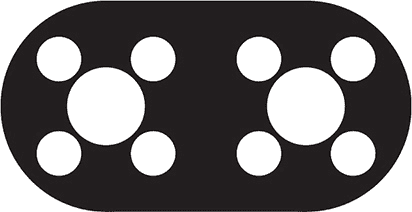

*图 11-17：发动机垫圈*

我们需要一个四叉树节点的数据结构，并且需要两个特殊的叶子值——一个为 0，表示白色，另一个为 1，表示黑色。图 11-18 展示了一个结构以及它所表示的数据。每个节点可以引用其他四个节点，这在像 C 这样的语言中是指针的良好应用。

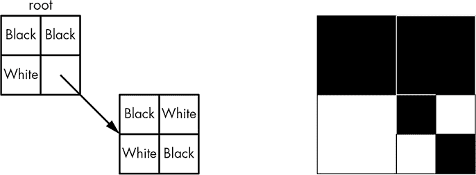

*图 11-18：四叉树节点*

我们不需要跟踪节点的大小。所有操作从根节点开始，根节点的大小是已知的，每个子节点的大小是其父节点的四分之一。图 11-19 向我们展示了如何获取树中某个位置的值。

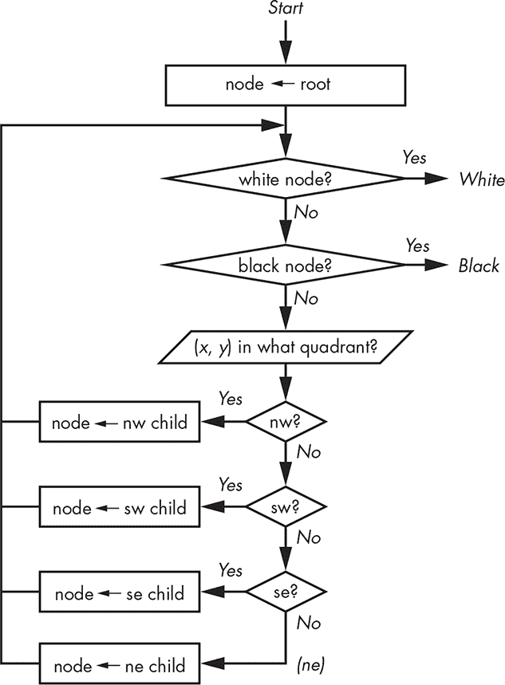

*图 11-19：在四叉树中获取（*x, y*）坐标的值*

图 11-20 展示了我们如何设置四叉树中 (*x*, *y*) 坐标的值（即将其设置为黑色）。请注意，“done”意味着“从函数返回”，因为这是递归的。

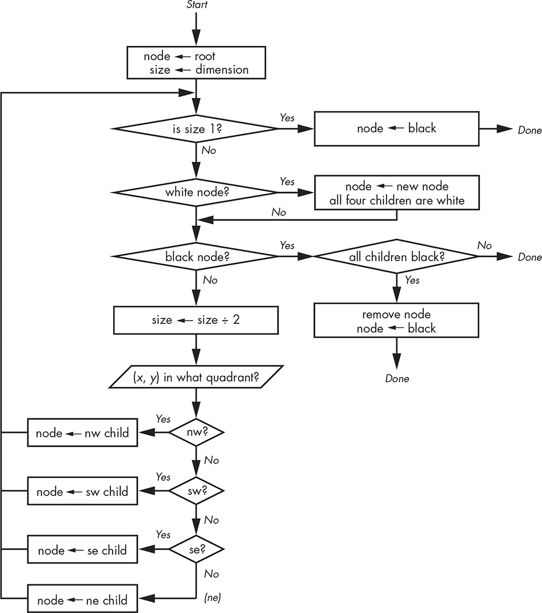

*图 11-20：设置四叉树中 (*x, y*) 坐标的值*

这与图 11-19 中的值获取代码类似。从高层次来看，它会遍历树，并在下降时进行细分，直到达到 (*x*, *y*) 坐标的 1×1 方块并将其设置为黑色。每当遇到白色节点时，它会用一个新的节点替换它，该节点有四个白色子节点，以便继续遍历树。在回溯时，任何所有子节点都是黑色的节点会被替换为一个黑色节点。每当一个有三个黑色子节点的节点将第四个子节点设置为黑色时，就会发生这种情况，如图 11-21 所示。


*图 11-21：合并节点*

合并节点不仅减少了树的内存占用，还因为树的深度变浅而加快了许多操作的速度。

我们需要一种方法来清除（即，将其设置为白色）四叉树中 (*x*, *y*) 坐标的值。答案与设置算法非常相似。不同之处在于，我们对黑色节点进行分割，而不是白色节点，并且合并的是白色节点，而不是黑色节点。

我们可以在值设置函数的基础上构建一些更复杂的绘制函数。通过调用设置函数来为每个坐标绘制矩形非常容易。我们也可以利用“曲线前行”算法和对称性，用同样的方法绘制椭圆，具体见第 298 页。

现在是有趣的部分了。让我们为第一章中的一些布尔逻辑函数创建四叉树版本。NOT 函数很简单：只需遍历树，替换任何黑色节点为白色节点，反之亦然。图 11-22 中的 AND 和 OR 函数则更有意思。这些算法并非用于执行 *C* = *a* AND *b* 和 *C* = *a* OR *b* 的等价操作。相反，它们实现了 *dst* &= *src* 和 *dst* |= *src*，类似于许多语言中的赋值操作符。*dst* 操作数是被修改的对象。

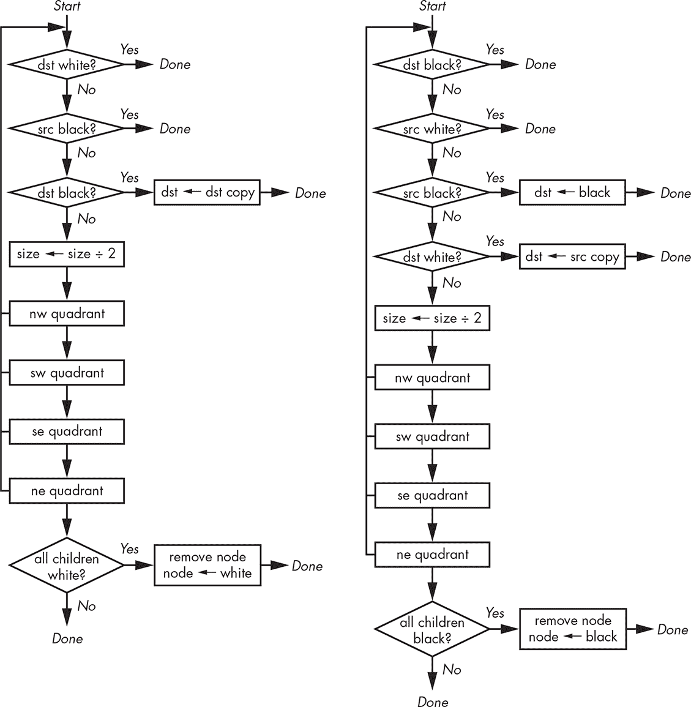

*图 11-22：四叉树的与运算和或运算*

现在我们有了所有这些工具，来构建我们的垫片。我们将以低分辨率进行绘制，以便能够看到细节。我们从左边的一个空白垫片四叉树开始，在中央的一个临时四叉树中绘制一个大圆形。将临时四叉树与垫片进行 OR 运算，产生右边的结果，如图 11-23 所示。注意，合并操作使得细分的数量保持在最小值。

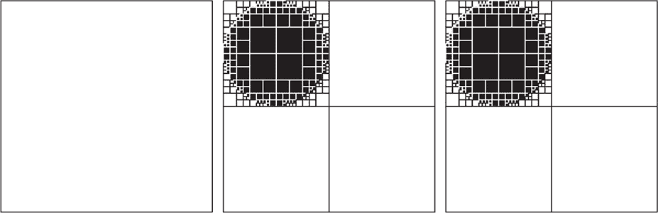

*图 11-23：垫片、圆形、圆形 OR 垫片*

接下来，我们将在不同的位置制作另一个圆，并将其与部分完成的垫圈合并，如图 11-24 所示。

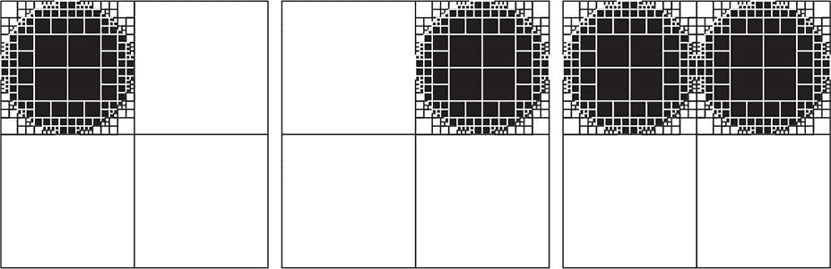

*图 11-24：添加到垫圈中*

接下来，我们将制作一个黑色矩形，并将其与垫圈合并，如图 11-25 所示。

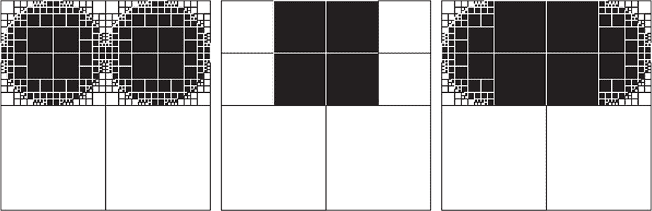

*图 11-25：添加矩形*

下一步是制作一个孔。通过制作一个黑色圆圈，然后使用非操作将其反转为白色，就可以完成这一操作。然后将结果与部分完成的垫圈进行与操作，最终得到图 11-26 中看到的孔。

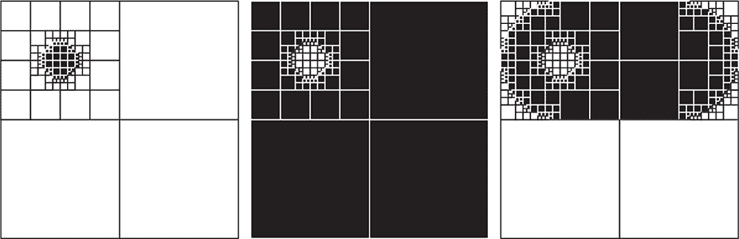

*图 11-26：与非操作的孔*

到这个阶段已经有些无聊了。我们需要以与图 11-26 中所示相同的方式合并另一个孔，然后再以类似的方式合并八个更小的孔。你可以在图 11-27 中看到结果。

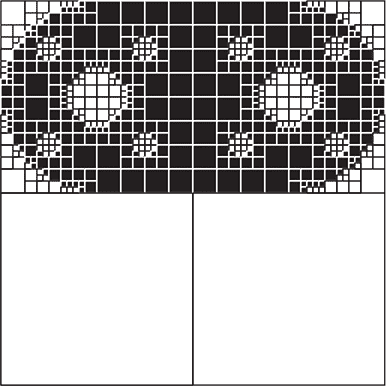

*图 11-27：完成的垫圈*

如你所见，我们可以使用四叉树上的布尔函数，将简单的几何形状拼合成复杂的物体。虽然我们使用的是二维垫圈作为示例，但这种方法在三维中更为常见。三维需要的节点数是二维的两倍，因此四叉树被扩展为*八叉树*，其示例见图 11-28。

使用前述技术在三维空间中构建复杂物体叫做*构造实体几何*。三维中的像素对应物叫做*体素*，可以理解为“体积像素”。

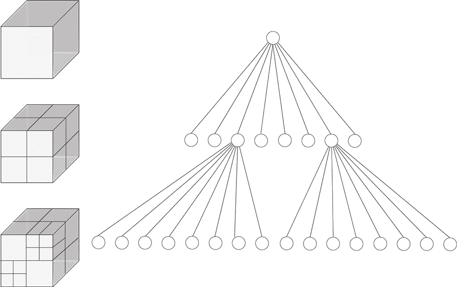

*图 11-28：八叉树*

八叉树是 CAT 扫描和 MRI 数据的常见存储方法。这些机器生成一系列的二维切片。分层剖析以获得切割视图是件简单的事。

#### *移位与遮罩*

四叉树的一个缺点是数据在内存中分散；它们的引用局部性很差。仅仅因为两个方块在树中彼此相邻，并不意味着它们在内存中也很接近。当我们需要将数据从一种内存组织转换到另一种时，这就成为了一个问题。我们当然可以每次移动 1 位数据，但那会涉及大量的内存访问——而我们希望最小化内存访问，因为它们的速度较慢。

这种情况出现的一个任务是显示数据。这是因为显示内存的组织由硬件决定。正如在“光栅图形”中提到的，在第 180 页，每一行光栅都按特定的顺序逐行绘制。一行光栅称为*扫描线*，所有扫描线的集合称为*帧缓冲区*。

假设我们想要在显示器上绘制来自图 11-27 的完成的垫片。为了简化起见，我们将使用一个单色显示器，每个像素有 1 位，并使用 16 位宽的内存。这意味着最左上角的 16 个像素位于第一个字中，接下来的 16 个像素位于第二个字中，以此类推。

图 11-27 中的左上方的方块是 4×4 像素大小，且为白色，这意味着我们需要清除帧缓冲区中的位。我们将使用四叉树方块的坐标和大小来构建掩码，如图 11-29 所示。

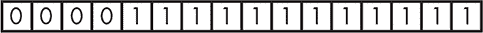

*图 11-29：AND 掩码*

然后，我们可以将这个掩码与所有受影响的行进行 AND 操作，每行仅需要两次内存访问：一次读取和一次写入。我们可以采取类似的方法来设置帧缓冲区中的位；掩码在需要设置的区域中为 1，而我们将使用 OR 而不是 AND 操作。

另一个应用场景是绘制文本字符时。大多数文本字符以 *位图* 的形式存储，即二维位数组，如图 11-30 所示。字符位图被打包在一起，以最小化内存使用。这就是过去文本字符的提供方式；现在它们以几何描述的形式提供。但出于性能原因，它们通常在使用前会被转换为位图，并且这些位图通常会被缓存，假设字符会被重复使用。

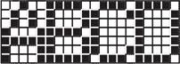

*图 11-30：位图文本字符*

假设我们想要在显示器上将图 11-31 中显示的字符 *B* 替换为 *C*。

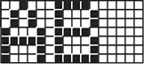

*图 11-31：位图文本字符*

*C* 位于第 10 到第 14 位之间，需要移到第 6 到第 10 位之间。对于每一行，我们需要获取 *C*，然后将字中的其他部分屏蔽掉。接着我们需要将其移到目标位置。必须读取目标数据，并在将其与移位后的 *C* 结合并写入之前，先屏蔽掉我们希望覆盖的部分，如图 11-32 所示。

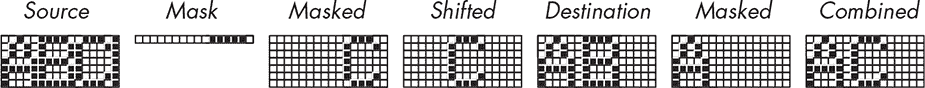

*图 11-32：绘制字符*

这个例子每行使用三次内存访问：一次获取源数据，一次获取目标数据，一次写入结果。如果逐位进行操作，将需要五倍的时间。

请记住，当源或目标跨越字边界时，通常会有额外的复杂性。

### 更多数学避免

我们在“整数方法”一节中讨论了一些避免昂贵数学计算的简单方法，在第 290 页中有介绍。现在我们有了背景知识，让我们讨论几种更复杂的数学避免技巧。

#### *幂级数近似*

这里有另一种方法来接近所需结果。假设我们需要生成正弦函数，因为我们没有为我们提供该功能的硬件。实现这种功能的一种方法是使用 *泰勒级数*：

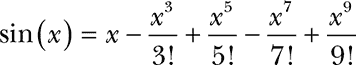

图 11-33 展示了正弦波及不同项数的泰勒级数近似值。正如你所看到的，项数越多，结果越接近理想的正弦值。

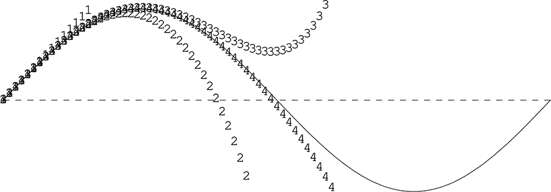

*图 11-33：正弦的泰勒级数*

只需不断添加项，直到达到所需的精度即可。值得注意的是，对于小于 90 度的角度所需的项较少，因此通过利用对称性，你可以在计算其他角度时提高效率。

请注意，通过将*积*初始化为*x*，预先计算–*x*²，并将*积*与–*x*²相乘以获得每一项，我们可以减少所需的乘法运算次数。所有的分母都是常数，可以存储在一个小表格中，由指数索引。此外，我们不必计算所有项。如果只需要两位数的精度，当计算更多项不再改变这些数字时，我们可以停止。

#### *CORDIC 算法*

Jack Volder 在 Convair 公司于 1956 年发明了*坐标旋转数字计算机（CORDIC）*算法。CORDIC 的发明是为了替代 B-58 轰炸机导航系统中的模拟部分，以提供更高的精度。CORDIC 可以利用整数运算生成三角函数和对数函数。它被用于 1972 年发布的第一款便携式科学计算器 HP-35，也应用于 Intel 80x87 系列浮点协处理器中。

CORDIC 的基本思想在图 11-34 中有说明。由于它是单位圆（半径为 1），箭头末端的 x 和 y 坐标分别为角度的余弦和正弦。我们希望将箭头从其原始位置沿 x 轴旋转，通过越来越小的步长直到到达所需的角度，然后获取坐标。

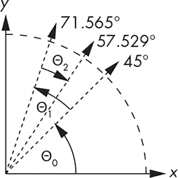

*图 11-34：CORDIC 算法概述*

假设我们想求 sin(57.529°)。如你所见，我们首先尝试 45 度，但这还不够，因此我们采取了另一步 25.565 度，得到 71.565 度，这又太大了。然后我们回退 14.036 度，最终得到了所需的 57.529 度。我们显然在进行某种细分操作，但角度的数值是有些奇怪的。

我们在 “整数方法” 中曾经看到过转换方程式，当时我们只关心平移和缩放。CORDIC 算法是基于旋转的。以下方程式的通用形式已经展示过，说明了如何通过旋转角度θ将(*x*, *y*)旋转，从而获得一组新的坐标(*x′*, *y′*)：

*x*′ = *x* × cos(θ) – *y* × sin(θ)

*y*′ = *x* × sin(θ) + *y* × cos(θ)

虽然这在数学上是正确的，但看起来没什么用处，因为如果正弦和余弦已经可用，我们就不会讨论一种生成正弦和余弦的算法了。

让我们在改善之前使问题变得更糟，通过将方程式用正切形式重写，利用三角恒等式：

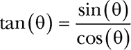

因为我们在除以 cos(θ)，所以需要将结果乘以相同的值：

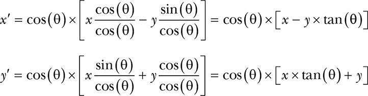

这看起来相当难看。我们正把糟糕的情况弄得更糟，但这是因为我们还没有讨论那个技巧，这个技巧回到那些奇怪的角度。事实证明，tan(45°) = 1，tan(26.565°) = ½，tan(14.036°) = ¼。这看起来就像是一些简单的整数除以 2，或者像 Maxell Smart 可能会说的，“老式的右移技巧”。这是对角度切线的二分查找。

让我们看看这个在图 11-34 中的例子是如何表现的。从原始坐标到最终坐标有三个旋转。请记住，根据图 11-34，*x*[0] = 1 且 *y*[0] = 0：

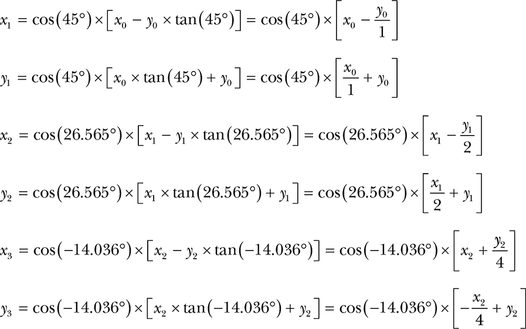

注意在最后一组方程中符号的变化，这是由于我们改变了方向（顺时针方向）。当我们顺时针旋转时，切线的符号是负的。将方程 (*x*[1], *y*[1]) 代入 (*x*[2], *y*[2]) 的方程中，然后再代入 (*x*[3], *y*[3]) 的方程，并提取出余弦（并清除乘以 1 的部分）后，得到以下结果：

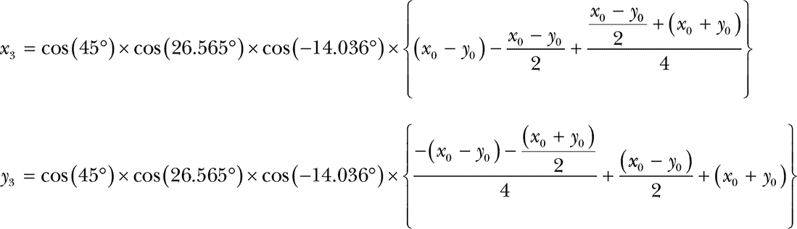

那么这些余弦呢？略去数学证明，事实证明，只要我们有足够多的项：

cos(45°) × cos(26.565°) × cos(–14.036°) × . . . = 0.607252935008881

这是一个常数，我们喜欢常数。我们称之为 *C*。我们可以像这样在最后进行乘法运算：

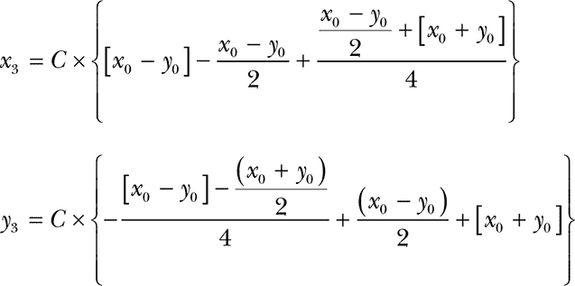

但我们可以通过直接使用常数 *x*[0] 来避免那次乘法，如下所示。我们还将去掉 *y*[0]，因为它是 0。最终结果如下所示：

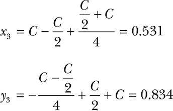

如果你检查一下，你会发现 *x*[3] 和 *y*[3] 的值非常接近 57.529 度的余弦和正弦值。而这仅仅用了三项；更多的项会让结果更接近。请注意，这一切都通过加法、减法和除以 2 完成。

让我们将这个转换为一个程序，这样我们就有机会介绍一些额外的技巧。首先，我们将使用一个略微不同版本的 CORDIC，称为 *矢量模式*；到目前为止，我们讨论的都是 *旋转模式*，因为它稍微容易理解一些。我们已经看到，在旋转模式中，我们从沿 x 轴的一个向量（箭头）开始，旋转它直到达到所需的角度。矢量模式几乎是相反的；我们从目标角度开始，旋转它直到我们得到一个沿 x 轴的向量（角度为 0）。这样做的好处是，我们可以直接通过测试角度的符号来确定旋转的方向，从而省去了两个数值的比较。

其次，我们将使用查表法。我们将预先计算出一个角度表，包含了 1、½、¼ 等的切线值。我们只需要做这一步一次。最终的算法见图 11-35。

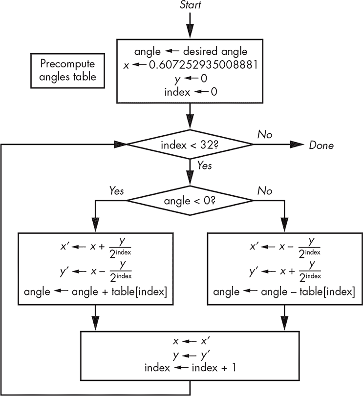

*图 11-35：CORDIC 流程图*

现在，让我们编写一个 C 程序，使用更多的技巧来实现这个算法。首先，我们将角度表示为弧度，而不是度数。

第二个技巧与第一个有关。你可能已经注意到，我们没有遇到任何大于 1 的数字。我们可以将程序设计为仅在第一象限（0 到 90 度之间）工作，然后通过对称性得到其他象限的结果。90 度的角度是 π/2，约等于 1.57。由于我们没有很宽的数字范围，我们可以使用定点整数系统，而不是浮点数。

我们将基于 32 位整数来实现示例。因为我们需要大约 ±1.6 的范围，我们可以让第 30 位表示 1，第 29 位表示 0.5，第 28 位表示 0.25，第 27 位表示 0.125，以此类推。我们将使用 MSB（第 31 位）作为符号位。我们可以通过将浮点数（只要它们在范围内）乘以我们版本的 1（即 0x40000000）并将其转换为整数，从而将浮点数转换为定点表示。同样，我们可以通过将结果强制转换为浮点数并除以 0x40000000 来将其转换回浮点数。

列表 11-17 展示了代码，它相当简单。

```
 1  const int angles[] = {

 2    0x3243f6a8, 0x1dac6705, 0x0fadbafc, 0x07f56ea6, 0x03feab76, 0x01ffd55b, 0x00fffaaa, 0x007fff55,

 3    0x003fffea, 0x001ffffd, 0x000fffff, 0x0007ffff, 0x0003ffff, 0x0001ffff, 0x0000ffff, 0x00007fff,

 4    0x00003fff, 0x00001fff, 0x00000fff, 0x000007ff, 0x000003ff, 0x000001ff, 0x000000ff, 0x0000007f,

 5    0x0000003f, 0x0000001f, 0x0000000f, 0x00000008, 0x00000004, 0x00000002, 0x00000001, 0x00000000

 6  };

 7

 8  int angle = (desired_angle_in_degrees / 360 * 2 * 3.14159265358979323846) * 0x40000000;

 9

10  int x = (int)(0.6072529350088812561694 * 0x40000000);

11  int y = 0;

12

13  for (int index = 0; index < 32; index++) {

14    int x_prime;

15    int y_prime;

16

17    if (angle < 0) {

18      x_prime = x + (y >> index);

19      y_prime = y - (x >> index);

20      angle += angles[index];

21    }

22    else {

23      x_prime = x - (y >> index);

24      y_prime = y + (x >> index);

25      angle -= angles[index];

26    }

27

28    x = x_prime;

29    y = y_prime;

30  }
```

*列表 11-17：CORDIC 在 C 中的实现*

实现 CORDIC 使用了我们不断增长的技巧包中的许多好东西：递归细分、预计算、表查找、用于二的幂次除法的位移、整数定点运算和对称性。

### 一些随机的东西

在计算机上做完全随机的事情非常困难，因为它们必须根据某个公式生成随机数，这使得它是可重复的。然而，这种“随机性”对大多数计算任务来说已经足够了，除了加密学，我们将在 第十三章 中讨论。在本节中，我们将探索一些基于 *伪随机性* 的近似方法。我们选择视觉示例是因为它们既有趣又便于打印。

#### *填充空间曲线*

意大利数学家朱塞佩·皮亚诺（Giuseppe Peano，1858–1932）在 1890 年提出了第一个 *填充空间曲线* 的例子。它的三次迭代如 图 11-36 所示。

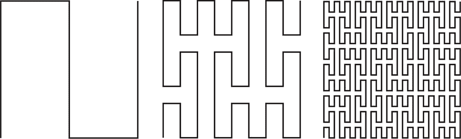

*图 11-36：皮亚诺曲线*

如你所见，曲线是一个简单的形状，经过缩放和在不同方向上的重复。每次这样做时，它会填充更多的空间。

填充空间曲线表现出 *自相似性*，这意味着它们无论是近距离还是远距离看起来差不多。它们是 *分形* 的一个子集，分形在 Benoit Mandelbrot（1924–2010）出版《自然的分形几何学》（W. H. Freeman and Company，1977）一书后变得广为人知。许多自然现象是自相似的；例如，海岸线无论从卫星上观察还是用显微镜观察，其锯齿状都很相似。

*分形*这个词源自*分数*。几何学中包括许多整数关系。例如，正方形边长的两倍会使其面积增加四倍。但是，在分形中，边长的整数变化可能会使面积发生分数变化，因此得名。

Koch 雪花是一个易于生成的曲线，最早由瑞典数学家赫尔格·冯·科赫（Helge von Koch，1870–1924）于 1904 年描述。它以一个等边三角形开始，每条边被分成三等份，中间的三分之一被一个三角形替代，三角形的大小是原三角形的三分之一，边与原始边对齐，缺失的边被省略，如图 11-37 所示。

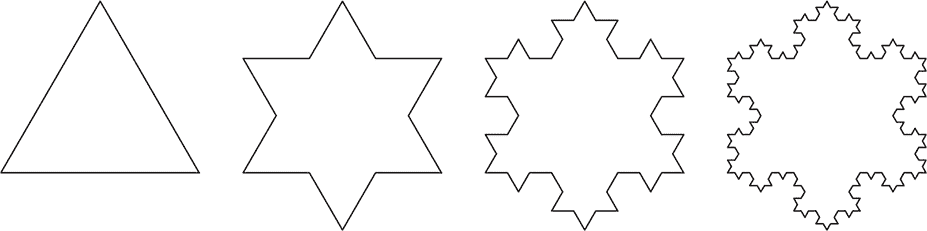

*图 11-37：Koch 雪花的四次迭代*

你可以看到，复杂有趣的形状可以通过极少的代码和递归生成。让我们来看一个稍微复杂一点的例子：Hilbert 曲线，最早由德国数学家大卫·希尔伯特（David Hilbert，1862–1943）于 1891 年描述，如图 11-38 所示。

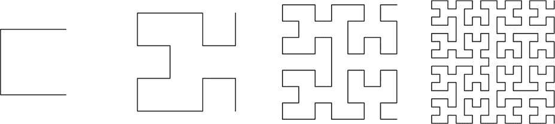

*图 11-38：Hilbert 曲线的四次迭代*

Hilbert 曲线的下一次迭代规则比 Koch 雪花更复杂，因为我们并不是在每个地方做相同的事情。这里有四个不同方向的“杯”形状，它们会被较小版本所替代，如图 11-39 所示。有一个图形表示法，还有一个使用字母表示右、上、左、下的表示法。每次迭代时，左边形状的每个角都会被右边的四个形状（按顺序）替换，大小为左边形状的四分之一，并通过直线连接。

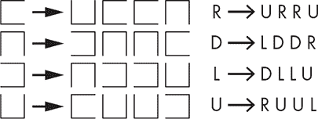

*图 11-39：Hilbert 曲线规则*

#### *L 系统*

图 11-39 中的规则类似于我们在《正则表达式》第 224 页中看到的正则表达式，但方向相反。这些规则不是定义匹配哪些模式，而是定义可以生成哪些模式。它们被称为*L 系统*或*林登梅耶系统*，得名于匈牙利植物学家阿里斯蒂德·林登梅耶（Aristid Lindenmayer，1925–1989），他在 1968 年开发了这些系统。由于它们定义了可以生成的内容，它们也被称为*生成文法*。

从图 11-39 中可以看到，将*R*替换为序列*U R R U*会将图 11-38 中最左边的曲线转换为其旁边的曲线。

关于生成文法的一个好处是它们既简洁又易于指定和实现。它们可以用来建模许多现象。当阿尔维·雷·史密斯（Alvy Ray Smith）在卢卡斯影业发布《植物、分形与形式语言》（SIGGRAPH，1984）时，这一方法变得非常流行；你走到哪里都能碰到由 L 系统生成的灌木丛。林登梅耶的工作成为了如今许多电影中计算机图形的基础。

让我们做一些树木，这样这本书就可以实现碳中和。我们的语法中有四个符号，如清单 11-18 所示。

```
E draw a line ending at a leaf

B draw a branch line

L save position and angle, turn left 45°

R restore position and angle, turn right 45°
```

*清单 11-18：树语法的符号*

在清单 11-19 中，我们创建了一个包含两个规则的语法。

```
B → B B

E → B L E R E
```

*清单 11-19：树语法规则*

你可以将符号和规则看作是一种遗传代码。图 11-40 展示了从*E*开始的语法的多个迭代。请注意，我们没有在分支的末端画出叶子。此外，除了前三个外，定义树的符号集太长，无法展示。

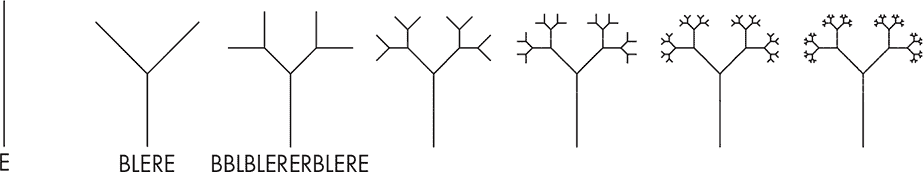

*图 11-40：简单的 L 系统树*

如你所见，我们只需要稍微做些工作就能得到相当漂亮的树。L 系统是生成自然外观物体的一个极好方法。

生产语法在计算机出现之前就已经被用来生成物体了。例如，编织说明就是一种生产语法，如清单 11-20 所示。

```
k = knit

p = purl

s = slip first stitch purl wise

row1 → s   p  k k p p k k p p  k  p p k k p p k k   p   k k p p k k p p  k  p p k k p p k k   p   k

row2 → s   k  p p k k p p k k  p  k k p p k k p p   k   p p k k p p k k  p  k k p p k k p p   k   k

row5 → s   p p k k p p k k   p p p k k p p k k   p p p k k p p k k   p p p k k p p k k   p p k

row6 → s   k k p p k k p p   k k k p p k k p p   k k k p p k k p p   k k k p p k k p p   k k k

section → row1 row2 row1 row2 row5 row6 row5 row6 row2 row2 row2 row2 row6 row5 row6 row5

scarf → section ...
```

*清单 11-20：围巾的生产语法，图 11-41 所示*

使用清单 11-20 中的语法并通过编织针 I/O 设备执行若干部分后，得到一条围巾，如图 11-41 所示。

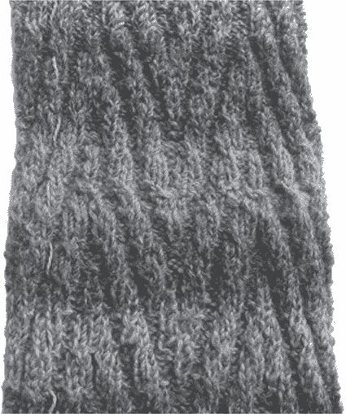

*图 11-41：由生产语法生成的围巾*

#### *走向随机化*

*随机*是一个很好的词，当你想显得复杂而*随机*的感觉不足以表达时可以使用。1980 年，德克萨斯大学达拉斯分校的 Alan Fournier 和 Don Fussell 提出了将随机性引入计算机图形学的概念。适量的随机性增加了多样性。例如，图 11-42 展示了上一节中 L 系统树的随机修改。

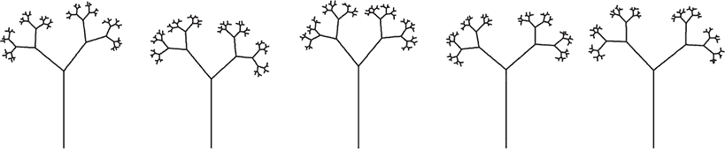

*图 11-42：随机 L 系统树*

如你所见，它生成了一组看起来相似的树。森林看起来更逼真当树木不完全相同时。

Loren Carpenter 在波音公司发布了一篇论文，开创了一种生成分形的简单方法（《分形曲线与表面的计算机渲染》，SIGGRAPH，1980）。在 SIGGRAPH 1983 上，Carpenter 和 Mandelbrot 就 Carpenter 的结果是否真的是分形展开了一场激烈的讨论。

Carpenter 离开了波音公司，继续在卢卡斯影业工作。他的分形山脉为《星际迷航 II：可汗的愤怒》中的行星提供了素材。一个有趣的事实是，这个行星的生成花费了大约六个月的计算机时间。由于它是使用随机数生成的，斯波克的棺材最终在几帧中飞过山的一侧。艺术家们不得不手动在山脉中切割一个缺口来修复这个问题。

Carpenter 的方法很简单。他随机选择了一条线上的一点，然后将该点随机移动一定的距离。然后他递归地重复这个过程，直到两段线段足够接近。这有点像给 Koch 曲线生成器添加随机性。图 11-43 展示了几个随机的峰值。

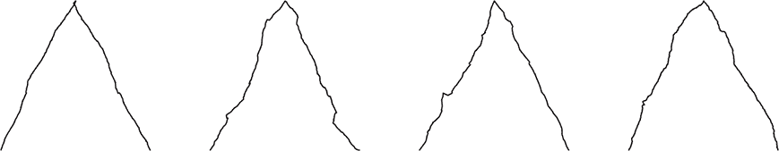

*图 11-43: 分形山脉*

再次来看，做得不错，几乎没有多少工作。

#### *量化*

有时我们没有选择，只能尽最大努力进行近似。例如，我们可能有一张需要在黑白报纸上打印的彩色照片。让我们看看如何进行这种转换。我们将使用图 11-44 中的灰度图像，因为本书并不是彩色印刷的。由于是灰度图像，每个颜色组件都是相同的，且范围在 0 到 255 之间。

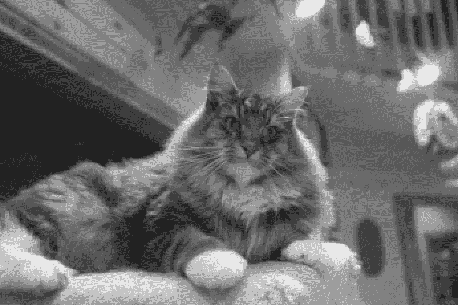

*图 11-44: 托尼猫*

我们需要执行一个叫做*量化*的过程，这意味着将原始图像中可用的颜色映射到变换后的图像中的颜色。这又是一个采样问题，因为我们必须将一个模拟信号（或者在我们这里说是*更*模拟的信号）分配到一组固定的桶中。我们该如何将 256 个值映射到 2 个值呢？

让我们从一种简单的方法开始，叫做*阈值处理*。正如你从名字中可以猜到的那样，我们选择一个阈值，并将所有比这个阈值亮的部分设为白色，所有比这个阈值暗的部分设为黑色。列表 11-21 将大于 127 的部分设为白色，其他部分设为黑色。

```
for (y = 0; y < height; y++)

  for (x = 0; x < width; x++)

    if (value_of_pixel_at(x, y) > 127)

      draw_white_pixel_at(x, y);

    else

      draw_black_pixel_at(x, y);
```

*列表 11-21: 阈值伪代码*

在图 11-44 上的图像上运行这个伪代码，得到了图 11-45 中的图像。

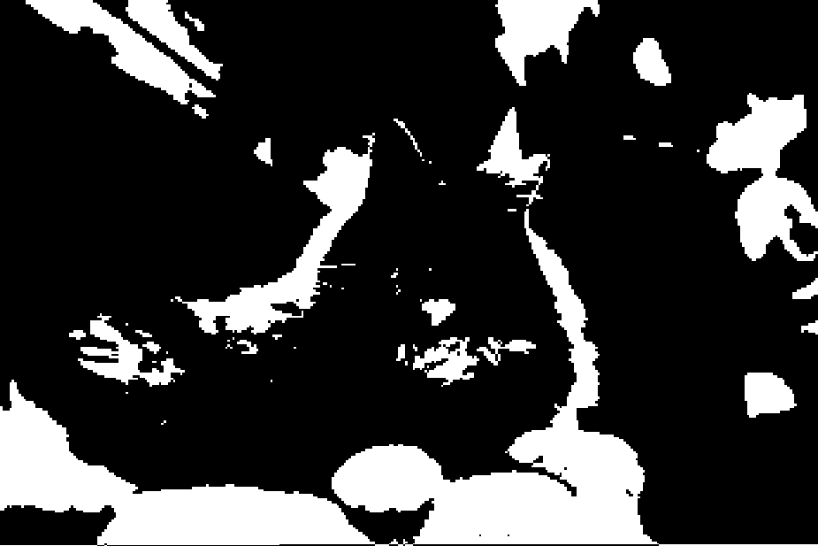

*图 11-45: 阈值算法*

这看起来不太好。但我们没什么能做的；我们可以调试阈值，但那只会给我们不同的糟糕结果。我们会尝试使用光学错觉来获得更好的效果。

英国科学家亨利·塔尔博特（1800–1877）在 1850 年代发明了*半色调印刷*，正是为了解决这个问题；当时的摄影是灰度的，而印刷是黑白的。半色调印刷将图像分解为不同大小的点，如图 11-46 中左侧放大的图像所示。正如你在右侧看到的那样，你的眼睛将其解读为灰度。

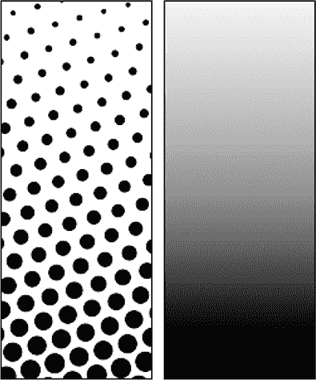

*图 11-46: 半色调图案*

我们无法在计算机屏幕上改变点的大小，但我们希望获得相同类型的效果。让我们探索一些不同的方法来实现这一目标。我们不能改变单个点的特性，单个点只能是黑色或白色，因此我们需要以某种方式调整周围的点，以呈现出你的眼睛会看到的灰度效果。我们实际上是在用图像分辨率换取更多的阴影或颜色感知。

这个过程的名称叫做*抖动*，它有一个有趣的来源，追溯到二战时期的模拟计算机。有人注意到，这些计算机在飞行中的表现比在地面上更好。原来，飞机引擎的随机振动防止了齿轮、轮子、齿轮和类似物品的卡住。于是，振动马达被添加到地面上的计算机中，通过抖动来改善性能。这种随机振动被称为*dither*，源自中古英语动词*didderen*，意思是“颤抖”。有许多抖动算法；我们这里只讨论其中几个。

基本思路是对不同像素使用不同阈值的模式。1970 年代中期，美国科学家布莱斯·贝尔（Bryce Bayer，1929–2012）在伊士曼柯达公司发明了一项关键技术——数字相机的同名*贝尔滤镜*。*贝尔矩阵*是一个变体，我们可以用来实现这一目的。图 11-47 展示了一些示例。

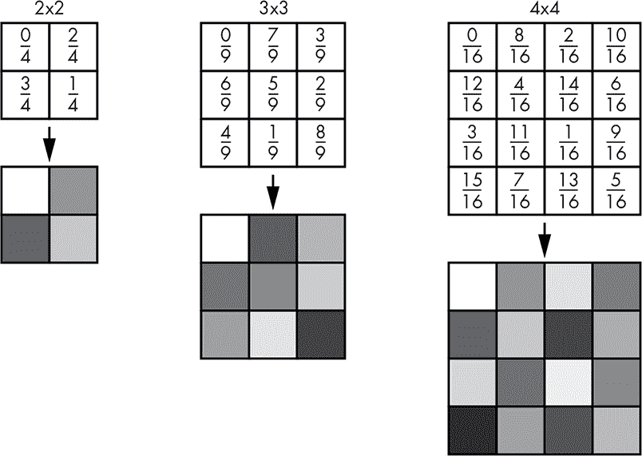

*图 11-47: 贝尔矩阵*

这些矩阵是*平铺*在图像上的，意味着它们在 x 和 y 方向上都重复，如图 11-48 所示。使用平铺模式的抖动称为*有序抖动*，因为它基于图像中的位置有一个可预测的模式。

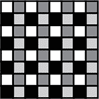

*图 11-48: 2×2 Bayer 矩阵平铺模式*

清单 11-22 展示了图 11-47 中的贝尔矩阵的伪代码。

```
for (y = 0; y < height; y++)

 for (x = 0; x < width; x++)

  if (value_of_pixel_at(x, y) > bayer_matrix[y % matrix_size][x % matrix_size])

    draw_white_pixel_at(x, y);

  else

    draw_black_pixel_at(x, y);
```

*清单 11-22: 贝尔有序抖动伪代码*

进入一个重要问题：Tony Cat 对此怎么看？图 11-49 到图 11-51 显示了他使用刚才展示的三种矩阵抖动的效果。

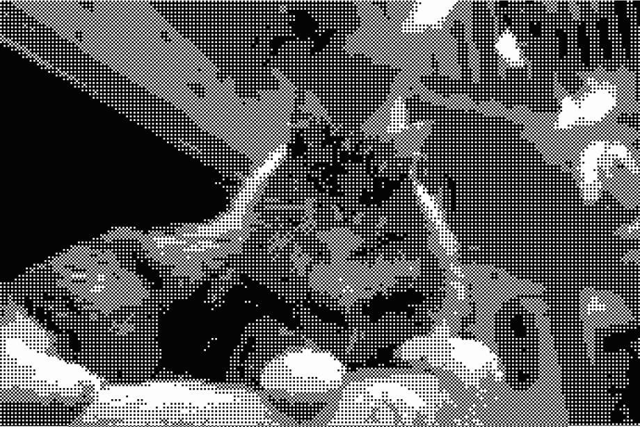

*图 11-49: Tony 使用 2×2 Bayer 矩阵抖动*

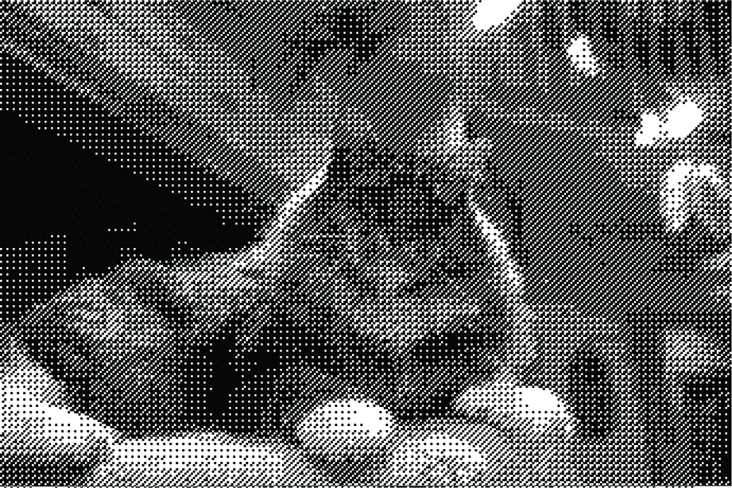

*图 11-50: Tony 使用 3×3 Bayer 矩阵抖动*


*图 11-51: Tony 使用 4×4 Bayer 矩阵抖动*

如你所见，这些如果你眯着眼看是可以接受的，随着矩阵的增大，它们会变得更好。虽然不完全是完美的效果，但比阈值处理好得多。通过使用更大的矩阵做更多的工作可以获得更好的结果。但是，平铺模式仍然可见。而且，它可能会在某些图像上产生称为*莫尔条纹*的奇异伪影。如果你曾经拿过一堆窗纱，可能见过这些效果。

我们如何消除一些这些筛选伪影呢？不使用模式，我们可以将每个像素与一个随机数进行比较，使用清单 11-23 中的伪代码。结果如图 11-52 所示。

```
for (y = 0; y < height; y++)

  for (x = 0; x < width; x++)

    if (value_of_pixel_at(x, y) > random_number_between_0_and_255())

      draw_white_pixel_at(x, y);

    else

      draw_black_pixel_at(x, y);
```

*清单 11-23: 随机数抖动伪代码*

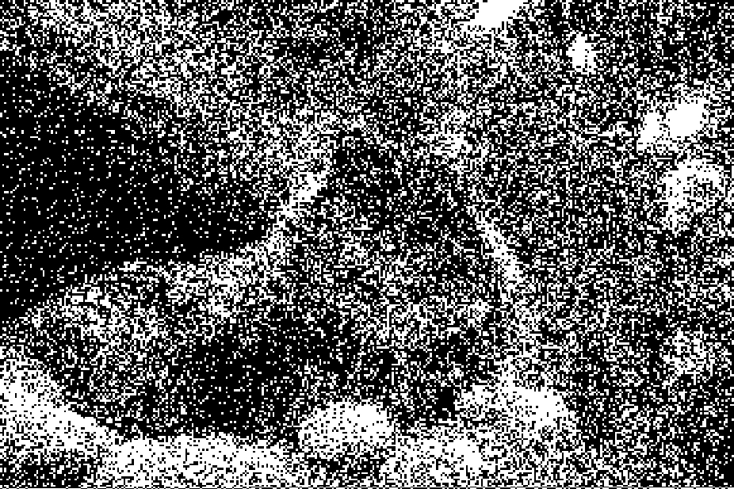

*图 11-52: Tony 使用随机数抖动*

这消除了图案伪影，但效果相当模糊，对于猫咪来说这并不算异常。这不如有序抖动效果好。

所有这些方法背后的根本问题是，我们在逐像素的基础上做决策只能做这么多。想想原始像素值和处理后像素值之间的区别。对于任何在原始图像中不是黑色或白色的像素，都有一定量的*误差*。我们不再像以前那样丢弃这些误差，而是尝试将其扩散到周围的其他像素。

让我们从一个非常简单的例子开始。我们将当前像素的误差应用到下一个水平像素。伪代码见列表 11-24，结果如图 11-53 所示。

```
for (y = 0; y < height; y++)

  for (error = x = 0; x < width; x++)

    if (value_of_pixel_at(x, y) + error > 127)

      draw_white_pixel_at(x, y);

      error = -(value_of_pixel_at(x, y) + error);

    else

      draw_black_pixel_at(x, y);

      error = value_of_pixel_at(x, y) + error;
```

*列表 11-24：一维误差传播伪代码*

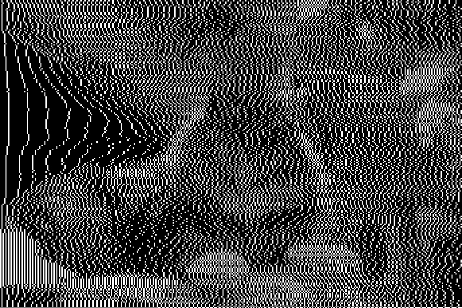

*图 11-53：Tony 使用一维误差传播进行抖动*

虽然效果不是很好，但也不算糟糕——比阈值化和随机数方法好得多，并且在某种程度上与 2×2 矩阵的效果相当；它们各自有不同类型的伪影。如果仔细想想，你会发现误差传播其实就是我们早些时候用来绘制线条和曲线的决策变量技巧。

美国计算机科学家罗伯特·弗洛伊德（1936–2001）和路易斯·斯坦伯格在 1970 年代中期提出了一种方法，你可以把它看作是误差传播与 Bayer 矩阵的结合体。这个思路是通过一组权重将像素的误差传播到周围的像素，如图 11-54 所示。

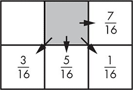

*图 11-54：Floyd-Steinberg 误差分布权重*

列表 11-25 展示了 Floyd-Steinberg 伪代码。注意，我们必须保留两行的误差值。我们将每一行做得比需要的长 2 个单位，并将索引偏移 1，这样在处理第一列或最后一列时，我们就不必担心越界。

```
for (y = 0; y < height; y++)

  errors_a = errors_b;

  errors_b = 0;

  this_error = 0;

  for (x = 0; x < width; x++)

    if (value_of_pixel_at(x, y) > bayer_matrix[y % matrix_size][x % matrix_size])

      draw_white_pixel_at(x, y);

      this_error = -(value_of_pixel_at(x, y) + this_error + errors_a[x + 1]);

    else

      draw_black_pixel_at(x, y);

      this_error = value_of_pixel_at(x, y) + this_error + errors_a[x + 1];

    this_error = this_error * 7 / 16;

    errors_b[x] += this_error * 3 / 16;

    errors_b[x + 1] += this_error * 5 / 16;

    errors_b[x + 2] += this_error * 1 / 16;
```

*列表 11-25：Floyd-Steinberg 误差传播代码*

这要做的工作多得多，但结果，如图 11-55 所示，看起来相当不错。（请注意，这与 20 世纪 70 年代用于制作专辑封面的 Pink Floyd–Steinberg 算法无关。）

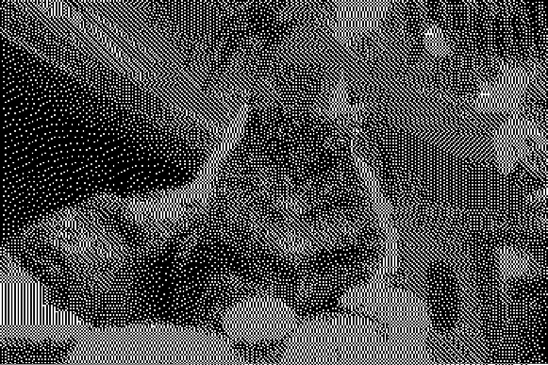

*图 11-55：Tony 使用 Floyd-Steinberg 算法进行抖动*

在 Floyd-Steinberg 之后，提出了许多其他的分布方案，其中大多数做了更多的工作，并将误差分配到更多的相邻像素。

让我们再试一种方法，这种方法由荷兰软件工程师 Thiadmer Riemersma 于 1998 年发布。他的算法做了几件有趣的事情。首先，它回到了只影响一个相邻像素的方法。但它会跟踪 16 个像素的误差。它计算加权平均值，使得最近访问的像素比最久未访问的像素有更大的影响。图 11-56 展示了加权曲线。

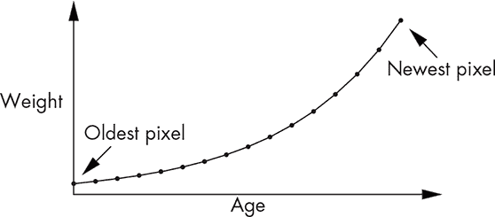

*图 11-56: Riemersma 像素权重*

Riemersma 算法没有使用我们之前见过的典型相邻像素网格（见清单 11-26）。相反，它沿着 Hilbert 曲线的路径前进，这在图 11-38 中展示过。

```
for (each pixel along the Hilbert curve)

  error = weighted average of last 16 pixels

  if (value_of_pixel_at(x, y) + error > 127)

    draw_white_pixel_at(x, y);

  else

    draw_black_pixel_at(x, y);

  remove the oldest weighted error value

  add the error value from the current pixel
```

*清单 11-26: Riemersma 误差传播伪代码*

结果如图 11-57 所示。虽然仍然不是完美无缺，但在这一点上，我们已经看到了足够多的“猫”。你可以尝试在类似图 11-12 中的渐变上运行示例代码。你已经了解到，在现实生活的情况下，需要采用多种不同的方式来处理近似问题。

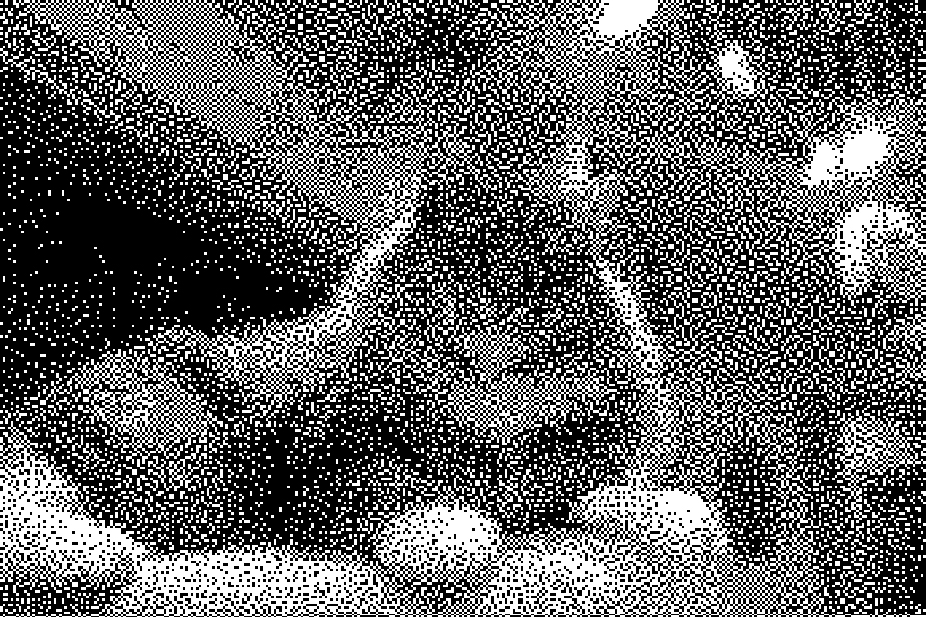

*图 11-57: Tony 使用 Riemersma 算法进行抖动*

### 总结

在本章中，我们考察了许多可以用来提高性能和效率的技巧，方法是避免或最小化计算。正如计算机图形学领域的巨头 Jim Blinn 所说：“一种技巧只是你多次使用的窍门。”就像你在硬件构建模块中看到的那样，这些技巧可以结合起来解决复杂问题。
