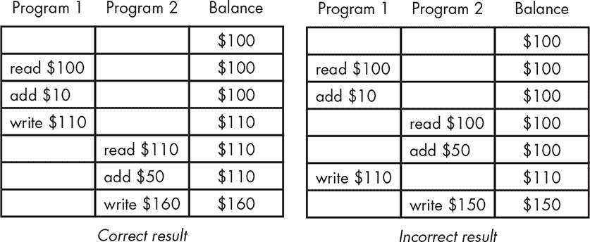
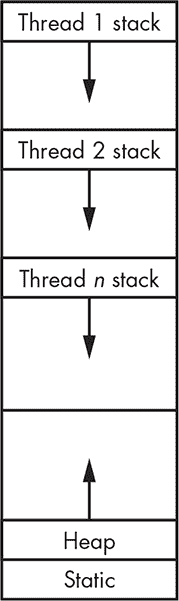
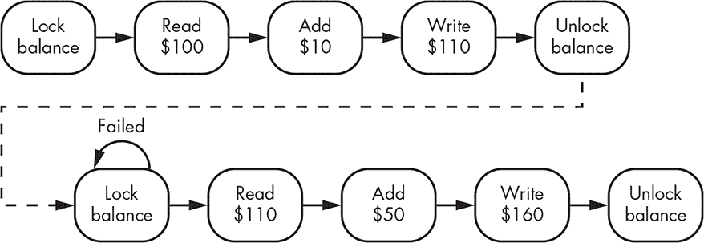
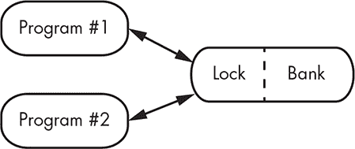
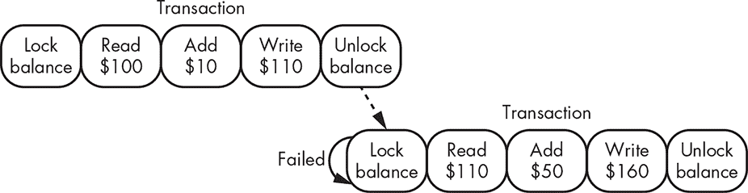
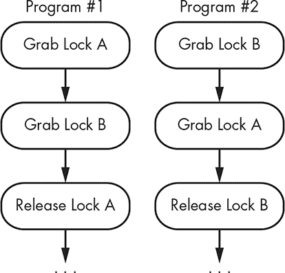
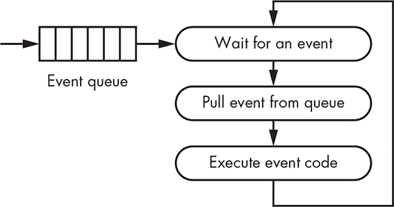
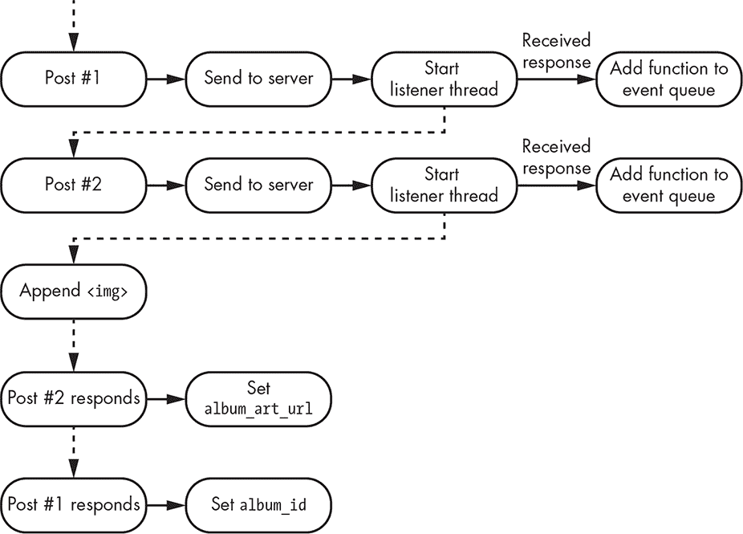

## 第十二章：**12  

死锁与竞态条件  

  

我们之前谈到过*多任务处理*，即计算机同时执行多项任务。最初，我们只是装作计算机能够做到这一点，因为实际上只有一台计算机在任务之间切换。但现在多核处理器已成为常态，计算机*确实*可以同时做多件事。多处理器并不是一个特别新的概念；单核处理器早已被连接起来以提高性能。现在只是更容易实现、更常见了。多处理器系统不再是昂贵的专用机器——它就是你的手机。  

有时候，事情的执行顺序非常重要。例如，假设你有一个联名银行账户（你与他人共享），账户余额为 100 美元。另一个账户持有人去自动取款机取款 75 美元，而你同时去银行取款 50 美元。这就是所谓的*竞态条件*。银行软件需要能够*锁定*其中一个人，以便一次只处理一个取款操作，从而防止账户透支。这本质上意味着在某些操作中关闭多任务处理。然而，正如本章所展示的那样，在不失去多任务处理的好处的情况下做到这一点是非常棘手的。  

### 什么是竞态条件？  

竞态条件发生在两个（或更多）程序访问相同的资源时，且结果取决于时机。请查看图 12-1，其中两个程序试图将钱存入银行账户。

  

*图 12-1：竞态条件示例*  

这个例子中的*共享资源*是账户余额。如你所见，结果取决于两个程序访问该资源的时机。  

另一种看待问题的方式最好通过图 12-2 中的 T 恤来表达。  

  

*图 12-2：竞速服装*  

### 共享资源  

什么资源可以共享？几乎任何东西。在前一节中，我们看到了内存共享。即使共享的最终结果不是内存，内存总是与共享相关的。因为必须有某种方式表明某个共享资源正在使用中。这些内存可能并不是我们通常所认为的内存，它可能只是某个输入/输出（I/O）设备硬件中的一个位。  

共享 I/O 设备也是很常见的——例如，分享打印机。如果将不同文档的部分混合在一起，显然效果不会很好。我在“系统空间与用户空间”中提到过，在第 133 页，操作系统为用户程序处理 I/O。这实际上只适用于机器本身的一些 I/O 设备，如 USB 控制器。虽然操作系统确保 USB 连接的设备能够正确通信，但它通常将这些设备的控制交给用户程序。  

*现场可编程门阵列*（*FPGAs*）（参见 “硬件与软件” 的 第 90 页）是资源共享的一个令人兴奋的前沿领域。你可能希望编程一个 FPGA 来提供一个特殊的硬件功能，从而加速某个特定的软件。你需要确保不会有任何东西替代软件所期望的硬件编程。

程序运行在不同计算机上时，它们之间的通信也能共享资源，这一点不那么明显。

### 进程与线程

多个程序如何访问相同的数据？我们在 “相对寻址” 的 第 128 页 中简要提到过操作系统。操作系统的一个功能是管理多个任务。

操作系统管理*进程*，即在*用户空间*中运行的程序（参见 “系统与用户空间” 的 第 133 页）。在多核处理器上，多个程序可以同时运行，但这本身并不足以产生竞争条件——程序必须有共享资源。

至少自从托尔把宇宙魔方带回阿斯加德后，就没有魔法方法让进程共享资源；它们必须有某种方式来实现这一点。这意味着共享资源的进程必须以某种方式进行通信，而这种通信可以采取多种形式。它必须是预先安排好的，可能是通过内置于程序中或通过某种配置信息来实现。

有时候，进程需要同时关注多个事项。一个很好的例子是*打印服务器*——一个其他程序可以与之通信以进行打印的程序。在网络出现之前，使用没有连接到你想要打印的机器上的 I/O 端口的打印机是很困难的。1980 年代加利福尼亚大学伯克利分校开发的网络代码使得计算机之间的通信变得更加容易，通过添加几个系统调用。实质上，一个程序可以等待来自多个来源的活动，并运行相应的处理代码。这种方法运作得相当好，主要是因为处理代码相对简单，并且在等待下一次活动之前运行。打印服务器代码可以在担心下一个任务之前完成整个文档的打印。

带有图形用户界面的交互式程序改变了这一切。活动处理器不再是简单的从头到尾运行的任务；它们可能需要在多个地方暂停并等待用户输入。尽管程序可以作为合作进程的群体来实现，但这相当繁琐，因为它们需要共享大量数据。

需要的是一种让处理程序可以被中断的方法——也就是说，它们能够在当前位置停下，保存其状态，以便稍后能够从停下的地方恢复执行。这个想法并不新鲜。那么，这个状态在哪呢？就在栈上。问题是，每个进程只有一个栈，而我们似乎需要为每个处理程序在进程中都准备一个栈。于是，执行线程应运而生。我们在第 136 页的“内存中的数据布局”一节中看到，操作系统是如何安排进程内存的。一个*线程*是程序的一部分，它共享静态数据和堆，但有自己的栈，如图 12-3 所示。每个线程都认为它对 CPU 寄存器有独占访问权限，因此*线程调度程序*在从一个线程切换到另一个线程时，必须保存和恢复这些寄存器，方式类似于操作系统在进程之间切换时的做法。线程也被称为*轻量级进程*，因为它们的上下文比常规进程少得多，所以在线程之间切换比在进程之间切换要快。



*图 12-3：线程的内存布局*

线程的早期实现涉及一些特定机器的自定义汇编语言代码。后来，线程被证明非常有用，以至于标准化了一个与机器无关的 API。线程在这里对我们很重要，因为它们使得在单一进程中可能出现竞争条件。这不仅是低级 C 程序中的问题，JavaScript 事件处理程序也是线程。

但是，仅仅因为线程存在，并不意味着它们是解决所有问题的正确方案。线程滥用是许多糟糕用户体验的根源。当微软首次推出 Windows 时，它是一个运行在 MS-DOS 之上的程序，而 MS-DOS 并不是一个支持多任务的现代操作系统。因此，微软将操作系统的部分功能集成到每个应用程序中，例如，用户可以同时打开多个文档。不幸的是，一些人将这种方法带到了完全的操作系统上。这种方法出现在带标签的应用程序（例如 LibreOffice 和 Firefox）和用户界面（例如 GNOME）中。

为什么这不是一个好主意？首先，线程共享数据，这就带来了安全问题。其次，正如你可能经历过的，一个标签页中的错误或问题往往会导致整个进程崩溃，造成本不相关任务的工作丢失。第三，正如你可能也经历过的，一个长时间运行的线程会阻止其他线程的执行，例如，一个加载缓慢的网页往往会使多个浏览器实例挂起。

故事的寓意是，聪明地编写代码。使用操作系统；它存在的目的就是为了这个。如果它没有按预期执行，或者缺少关键特性，就去修复它。不要把其他的事情搞得一团糟。

### 锁

当前的问题并不完全是共享资源，而是如何使操作*原子化*（即不可分割、不可中断），当这些操作由一系列较小的操作组成时。

如果计算机有类似`调整银行余额`的指令，我们就不需要讨论这些问题了。但显然没有这样的指令，因为我们需要无限多的这类指令。相反，我们必须通过某种*互斥*机制，使关键代码部分看起来像是原子操作。我们通过创建*顾问锁*来实现这一点，程序通过这些锁避免冲突（参见图 12-4）。



*图 12-4: 顾问锁*

如图 12-4 所示，上面的程序首先获取了锁，因此下面的程序必须等到锁被释放才能继续。这个锁是*顾问性*的，因为是否遵循锁规则取决于程序本身；没有强制执行机制。这看起来可能没什么用，因为它无法阻止任何人抢劫银行。但问题在于锁的位置。如图 12-5 所示，锁是在银行，由银行进行执行，因此这就能起作用。



*图 12-5: 锁的位置*

这解决了一个问题，但也带来了其他问题。如果程序 #1 与银行之间的通信很慢，怎么办？显然，程序 #2 将不得不等待一段时间，这意味着我们失去了一些多任务处理的好处。那么如果程序 #1 崩溃或行为异常，永远不释放锁，该怎么办？程序 #2 在等待时该做什么？

我们将在接下来的几个部分讨论这些问题。

#### *事务和粒度*

程序 #1 在图 12-5 中执行的每个操作都需要与银行进行某种形式的通信。这需要双向通信，因为我们需要知道每个操作是否成功，才能进行下一个操作。提高性能的简单方法是将一组操作捆绑成一个*事务*，它是一个要么全部成功，要么全部失败的操作集合（参见图 12-6）。术语*事务*源自数据库领域。我们不会单独发送每个操作，而是将它们捆绑在一起。



*图 12-6: 事务*

一个明显的准则是尽量减少锁定的时间，因为这会减少并发性。然而，有一个不太明显的准则是减少锁的*粒度*——即锁覆盖的内容量。在我们的例子中，我们锁定的是余额；这里隐含的是我们只是锁定一个账户的余额。如果每次一个客户需要更新余额时都锁定整个银行，那将不是一个很好的解决方案。X 窗口系统就是一个锁定设计不良的例子。尽管它有许多种锁，但有很多情况下，锁定所有内容是唯一的选择，这样会消除并发性。

覆盖系统小部分的锁称为*细粒度*锁；覆盖较大部分的锁称为*粗粒度*锁。

**注意**

*处理器中断处理包括一种锁机制。当接收到中断时，*掩码* *会被设置，防止处理器接收任何相同类型的中断，除非明确允许，直到中断处理程序完成。*

#### *等待锁*

如果一个程序在等待锁时不能做任何有用的事情，那么使用事务和细粒度锁并没有太大意义。毕竟，“多任务”就是多任务的核心所在。

有时在等待锁时没有什么有用的事情可以做，这就是为什么你得站在雨中等待 ATM 机响应的原因。不过，做“什么都不做”有两种方式。我们可以*旋转*，这意味着我们可以反复尝试锁，直到成功获取它。旋转通常涉及使用定时器来间隔尝试。在机器上全速运转会不必要地消耗大量电力。在网络上全速运行可能就像黑色星期五时一群人涌入商店。在某些情况下——这就是做“什么都不做”的第二种方式——请求锁的实体可以*注册*这个请求，并在请求被授予时*收到通知*。这样，请求者可以在等待时去做更有用的事情。这种方法扩展性不强，且显然不被互联网架构所支持，尽管它可以被加层使用。

我们在第六章中了解到，以太网采取了一种有趣的等待方式。它没有使用锁，但如果多个设备在尝试访问共享资源（电缆）时发生冲突，它们会各自等待一段随机时间，然后再试一次。

一些操作系统提供锁定功能，通常与类似于文件描述符的句柄相关联。锁定可以在阻塞模式或非阻塞模式下进行。*阻塞*意味着系统会暂停调用程序（即停止它的执行），直到锁可用。*非阻塞*意味着程序会继续运行，并收到未获得锁的提示。

#### *死锁*

你已经看到，当程序需要锁而锁不可用时，必须进行某种形式的等待。然而，复杂的系统通常有多个锁，那么在图 12-7 所示的情况下会发生什么呢？

程序 #1 成功获取锁 A，程序 #2 成功获取锁 B。接下来，程序 #1 尝试获取锁 B，但因为程序 #2 已经拥有它，所以无法获得。类似地，程序 #2 尝试获取锁 A，但因为程序 #1 已经拥有它，因此无法获得。两个程序都无法继续到释放它们所持有的锁的步骤。这种情况被称为*死锁*，这不是一种多线程的发型。



*图 12-7：死锁*

除了编写良好的代码之外，解决死锁问题几乎没有其他伟大的解决方案。在某些情况下，可以手动清除锁而不会造成太大损害。你可能遇到过某种情况，程序因为无法获取锁而拒绝运行，并询问你是否希望清除该锁。这个情况通常发生在持有锁的程序意外崩溃且没有释放锁时。

#### *短期锁实现*

实际上，只有一种方式来实现锁，但有许多方法可以将锁呈现给程序。锁的实现需要硬件支持，通常是通过特殊指令来支持锁定。几十年前设计的软件解决方案如今已经不再有效，因为处理器技术的进步，如乱序执行和多核处理。

许多处理器都有一个*测试并设置*指令，专门用于锁定。该指令是一个原子操作，测试某个内存位置是否为 `0`，如果不是，则将其设置为 `1`。如果成功更改值，它返回 `1`，否则返回 `0`。因此，它直接实现了锁。

在许多程序争夺锁的情况下，一种更有效的替代实现方式是*比较与交换*。该指令类似于测试并设置，但不同的是，调用者不仅提供一个旧值，还提供一个新值。如果旧值与内存位置中的值匹配，则用新值替换，并且锁被抢占。

这些指令的使用通常仅限于系统模式，因此用户程序无法使用。一些较新的语言标准，如 C11，已经为原子操作提供了用户级支持。各种锁操作也已被标准化，并在库中提供。

可以在锁上附加额外的代码以提高其效率。例如，可以将队列与锁关联，以注册等待锁的程序。

#### *长期锁实现*

我们大多数时候讨论的是尽可能短时间内持有的锁，但有时我们需要长时间持有一个锁。这通常出现在多个程序无法同时访问的情况——例如，设计用来防止多人同时编辑同一文档的文字处理软件。

长期锁需要保存在比内存更持久的存储中。它们通常通过文件实现。存在系统调用，允许独占文件创建，先到的程序成功。这相当于获得一个锁。需要注意的是，系统调用是一种高级抽象，底层使用原子指令。

### 浏览器 JavaScript

编写在浏览器中运行的 JavaScript 程序是新程序员最初可能需要注意并发的地方。如果你读过任何 JavaScript 文档，这可能会让你感到惊讶，因为 JavaScript 被定义为单线程的。那么并发问题怎么可能存在呢？

原因是 JavaScript 最初并不是为了现在的用途而设计的。它最初的目的是提供更快的用户反馈并减少互联网流量，那时互联网速度较慢。例如，想象一个包含信用卡号码字段的网页。在没有 JavaScript 之前，号码必须发送到一个 web 服务器，该服务器会验证号码是否仅包含数字，并在号码合格时进行进一步处理，或者如果有错误则返回错误响应。JavaScript 使得可以在网页浏览器中检查信用卡号码是否为数字。这意味着用户在输入错误时不必等待，并且无需通过互联网流量来检测和报告错误。当然，仍然有很多糟糕的 JavaScript 无法处理卡号中的空格，正如你可能已经发现的那样。

由于 JavaScript 是为响应用户事件运行短小程序而创建的，它采用了 *事件循环* 模型，其工作原理如图 12-8 所示。



*图 12-8：JavaScript 事件循环*

发生的情况是，待执行的任务被添加到 *事件队列* 中。JavaScript 会一次从队列中拉取一个任务并执行。这些任务是不可中断的，因为 JavaScript 是单线程的。但作为程序员的你无法控制事件加入队列的顺序。例如，假设你为每个鼠标按钮都有一个事件处理程序。你不能控制鼠标按钮点击的顺序，因此也无法控制事件的顺序。你的程序必须能够可靠地处理任何顺序的事件。

当 JavaScript 在 1995 年首次发布时，并未设计异步通信。在那之前，浏览器提交表单，服务器返回网页。两件事改变了这一点。首先是 1997 年发布的文档对象模型（DOM），尽管它直到 2004 年左右才稳定（或多或少）。DOM 允许现有的网页进行修改，而不仅仅是替换。第二个变化是在 2000 年出现了 XMLHttpRequest（XHR），它成为了 AJAX 的基础。它提供了超出“加载页面”模型的浏览器与服务器之间的后台通信。

这些变化引发了网页复杂性的急剧增加。写了更多的 JavaScript，使其成为了一种主流编程语言。网页越来越依赖与服务器的后台异步通信。由于这不是 JavaScript 设计之初的目标，尤其是因为单线程模型与异步通信存在冲突，导致了许多成长的痛苦。

让我们设计一个简单的 web 应用来显示艺术家的专辑封面。我们将使用一个假设的网站，该网站首先要求我们将专辑和艺术家的名称转换为专辑标识符，然后使用该标识符来获取专辑封面。你可以尝试编写如 Listing 12-1 中所示的程序，其中斜体部分是用户提供的代码。

```
var album_id;

var album_art_url;

// Send the artist name and album name to the server and get back the album identifier.

$.post("some_web_server", { artist: artist_name, album: album_name }, function(data) {

  var decoded = JSON.parse(data);

  album_id = decoded.album_id;

});

// Send the album identifier to the server and get back the URL of the album art image.

// Add an image element to the document to display the album art.

$.post("some_web_server", { id: album_id }, function(data) {

  var decoded = JSON.parse(data);

  album_art_url = decoded.url;

});

$(body).append('');
```

*Listing 12-1：第一次尝试的专辑封面程序*

jQuery 的 `post` 函数将第二个参数的数据发送到第一个参数指定的 URL，并在收到响应时调用第三个参数指定的函数。需要注意的是，它并不是直接调用这个函数，而是将该函数添加到事件队列中，以便当队列中的函数到达队首时被调用。

这看起来是一个不错、简单、井然有序的程序。但是它并不会可靠地工作。为什么呢？让我们仔细看看发生了什么。请查看 图 12-9。



*图 12-9：专辑封面程序流程*

正如你所看到的，程序并不是按顺序执行的。`post` 操作会在内部启动线程，等待服务器响应。当响应到达时，回调函数会被添加到事件队列中。程序首先显示第二个 `post` 响应，但也可能是第一个 `post` 先响应；这超出了我们的控制范围。

因此，我们的程序很有可能在获取第一个 `post` 的 `album_id` 之前请求专辑封面。几乎可以肯定的是，它会在获取 `album_art_url` 之前就将图片附加到网页上。这是因为，尽管 JavaScript 本身是单线程的，但我们与 web 服务器的交互是并发的。换句话说：尽管 JavaScript 解释器向程序员展示的是单线程模型，但它在内部实际上是多线程的。

Listing 12-2 展示了一个工作版本。

```
$.post("some_web_server", { artist: artist_name, album: album_name }, function(data) {

  var decoded = JSON.parse(data);

  $.post("some_web_server", { id: decoded.id }, function(data) {

    var decoded = JSON.parse(data);

    $(body).append('');

  });

});
```

*Listing 12-2: 第二次尝试的专辑封面程序*

现在我们已将图像的 `append` 移动到第二个 `post` 回调内部，并且将第二个 `post` 回调移动到第一个 `post` 回调内部。这意味着我们不会在第一个 `post` 完成之前发出第二个 `post`。

如你所见，嵌套是确保依赖关系满足的必要条件。而且，错误处理会使其变得更加难看，我没有展示这一点。下一节将介绍另一种处理此问题的方法。

### 异步函数和 Promises

在 Listing 12-2 中的程序完全没有问题。它运行正常，因为 jQuery 正确实现了 `post` 函数。但仅仅因为 jQuery 做得对，并不意味着其他库也能做到，特别是在 Node.js 世界中，糟糕的库正以惊人的速度涌现。使用那些没有正确实现回调的库的程序非常难以调试。这已经成为一个问题，因为正如我在本书的介绍中提到的那样，现在很多编程都被教导成将函数在库中拼接的过程。

JavaScript 最近通过添加一种新的构造体，叫做 *promise*，解决了这个问题。promise 的计算概念源自上世纪 70 年代中期，自从被加入到 JavaScript 中后，正经历着一场复兴。Promises 将异步回调的机制引入到语言本身，这样库就无法搞砸它们。当然，这仍然是一个不断变化的目标，因为你不能每次程序员犯错时就修改语言。然而，这个特定的情况似乎足够常见，值得解决。

JavaScript promises 的解释可能很难理解，因为两个独立的东西被混合在一起。如果将这些组件分开，promises 会更容易理解。重要的一点是，如果异步操作的库使用 promises，它们更有可能正确地工作。次要的部分，更常被提到的是编程范式的变化。编程范式中有很多“宗教”色彩，我在最后一章中会更多地讨论。某种程度上，promise 构造体是 *语法糖*，一种甜味剂，它使某些类型的编程变得更容易，但以让编程语言变得更臃肿为代价。

如果推至极限，JavaScript 异步请求的代码开始看起来像某些人所称的 *毁灭金字塔*，如 Listing 12-3 所示。我个人认为用这种方式编写代码并没有问题。如果缩进让你不悦，那就远离 Python 编程语言吧，它会让你头痛。

```
$.post("server", { parameters }, function() {

  $.post("server", { parameters }, function() {

    $.post("server", { parameters }, function() {

      $.post("server", { parameters }, function() {

        ...

      });

    });

  });

});
```

*Listing 12-3: 毁灭金字塔*

当然，这部分内容的产生与程序的编写方式有关。匿名函数要求所有的代码都必须内联编写。正如在清单 12-4 中所示，这些匿名函数可以被消除，从而消除了“死亡金字塔”，但代码变得更难理解。

```
$.post("some_web_server", { artist: artist_name, album: album_name }, got_id);

function

got_id(data)

{

  var decoded = JSON.parse(data);

  $.post("some_web_server", { id: decoded.id }, got_album_art);

}

function

got_album_art(data)

{

  var decoded = JSON.parse(data);

  $(body).append('');

}
```

*清单 12-4：重写以消除匿名函数*

程序员真正希望的是一种更直接的写代码方式。许多其他编程语言中这很容易实现，但在 JavaScript 中却很困难，因为它是单线程模型。如果有一个假设中的多线程 JavaScript 版本，我们只需创建一个新的线程来运行清单 12-5 中的代码。这个代码假设 `post` 会阻塞直到完成；它是同步的，而非异步的。代码清晰且易于理解。

```
var data = $.post("some_web_server", { artist: artist_name, album: album_name } );

var decoded = JSON.parse(data);

var data = $.post("some_web_server", { id: decoded.id }, got_album_art);

var decoded = JSON.parse(data);

$(body).append('');
```

*清单 12-5：假设的阻塞 JavaScript 示例*

如果你在 JavaScript 中能够像这样编写代码，它将无法正常工作。JavaScript 的单线程特性会阻止其他代码在 `post` 等待期间执行，这意味着鼠标点击和其他用户交互的事件处理程序将无法及时运行。

JavaScript 的 Promise 与清单 12-4 有一些相似之处，因为 Promise 的定义类似于函数定义；Promise 的定义被分离出来，与其执行分开。

如清单 12-6 所示，创建一个 Promise。虽然这看起来与其他 JavaScript 代码（例如接受函数作为参数的 jQuery `post`）没有太大区别，但这个函数并不会立即执行。这是 Promise 的设置阶段。

```
var promise = new Promise(function(resolve, reject) {

  if (whatever it does is successful)

    resolve(return_value);

  else

    reject(return_value);

});
```

*清单 12-6：Promise 创建*

让我们更详细地看一下。你为 Promise 提供一个执行某些异步操作的函数。这个函数有两个参数，它们也是函数：一个是 (`resolve` 在清单 12-6 中)，当异步操作成功完成时，该函数会被添加到 JavaScript 事件队列中；另一个是 (`reject` 在清单 12-6 中)，当异步操作失败时，该函数会被添加到 JavaScript 事件队列中。

程序通过 `then` 方法执行 Promise，如清单 12-7 所示。此方法接受一对函数作为参数，这些函数与在 Promise 创建时提供的 `resolve` 和 `reject` 函数相匹配。

```
promise.then(

  function(value) {

    do something with the return_value from resolve

  },

  function(value) {

    do something with the return_value from reject

  }

);
```

*清单 12-7：Promise 执行*

这并不令人兴奋。我们本可以在不使用 Promise 的情况下编写代码，正如我们之前做的那样。那么为什么还要使用 Promise 呢？Promise 带有一些语法糖，称为 *链式调用*。它允许代码以 something`().`then`().`then`().`then`()` . . . 的风格编写。之所以能够这样工作，是因为 `then` 方法会返回另一个 Promise。请注意，类似于异常的处理方式，`then` 的第二个参数可以省略，错误可以通过 `catch` 来捕获。清单 12-8 展示了使用 Promise 链式调用重写的专辑艺术程序。

```
function

post(host, args)

{

  return (new Promise(function(resolve, reject) {

    $.post(host, args, function(data) {

      if (success)

        resolve(JSON.parse(data));

      else

        reject('failed');

    });

  }));

}

post("some-web-server, { artist: artist_name, album: album_name } ).then(function(data) {

  if (data.id)

    return (post("some-web-server, { id: data.id });

  else

    throw ("nothing found for " + artist_name + " and " + album_name);

}).then(function(data) {

  if (data.url)

    $(body).append('');

  else

    throw (`nothing found for ${data.id}`);

}).catch(alert);
```

*清单 12-8：使用 promise 链接的专辑封面程序*

现在，我不觉得这段代码比“死亡金字塔”式的代码更易于理解，但你可能有不同的看法。清单 12-2 和 12-8 中的代码版本提出了编程艺术的另一个问题：在代码开发的简易性与可维护性之间进行权衡。在产品生命周期的宏观视角下，可维护性比写出某种个人偏好风格的代码更为重要。我在第十五章中对此进行了更多讨论。Promise 链接使你能够以 `().`function`().`function`()` . . .` 的方式编写代码，而不是“死亡金字塔”式的代码风格。虽然第一种风格在保持括号跟踪方面稍微更容易，但 JavaScript——与 Ruby 等语言不同——是为了第二种风格设计的，并且在同一语言中同时使用两种风格可能会增加混乱，导致程序员生产力下降。尽管 promises 可能减少某类编程错误的发生，但不要误以为它们是解决编写不良代码的万能法宝。

Promises 是一种语法糖，可以减少嵌套的数量。但如果我们真的希望代码更易于理解，我们希望采用更像是清单 12-5 的方式。JavaScript 还提供了另一种编写“异步”程序的方式，它建立在 promises 的基础上，但模仿同步编码风格：`async` 和 `await`。

清单 12-9 展示了使用 `async` 和 `await` 实现专辑封面程序的代码。

```
function

post(host, args)

{

  return (new Promise(function(resolve, reject) {

    $.post(host, args, function(data) {

      if (success)

        resolve(JSON.parse(data));

      else

        reject('failed');

    });

  }));

}

async function

get_album_art()

{

  var data = await post("some-web-server, { artist: artist_name, album: album_name } );

  if (data.id) {

    var data = await post("some-web-server, { id: data.id });

    if (data.url)

      $(body).append('');

  }

}
```

*清单 12-9：使用 async 和 await 的专辑封面程序*

对我来说，这看起来比清单 12-8 更直接。

当然，这里发生的事情是，单线程的 JavaScript 模型已经被严重扭曲，甚至可以说是被破坏了。异步函数本质上是不可中断的线程。

### 总结

在本章中，你了解了使用共享资源时可能会遇到的一些问题。你学习了竞争条件和死锁，以及进程和线程的概念。你还了解了一些 JavaScript 中的并发概念，以及它如何以新的方式被实现。目前为止，我们已经覆盖了基础内容。在下一章中，我们将讨论两个高级话题之一——安全性——其中涉及了你目前为止学习的许多技术。
