## 第十三章：**13  

安全**


安全是一个高级话题。特别是密码学部分，涉及大量深奥的数学内容。但它是一个非常重要的话题。与其深入探讨所有复杂的细节，本章将为你概述该领域的全貌。虽然这些内容不足以让你成为安全专家，但应该能帮助你提出有关安全实现可行性的问题。而且有许多事情，即使你不是安全专家，也能做出改进，让你和你的代码更加安全。

在大多数情况下，计算机安全与常见的安全问题（例如家庭安全）没有太大区别。在许多方面，联网计算机的出现将安全问题从小型公寓所需的安全措施，转变为保护大型城堡所需的安全措施。正如你能想象的那样，大城堡有更多的入口需要防守，更多的居民可能会破坏防御。而且它更大，因此积累的垃圾更多，导致清理更加困难，也给虫子提供了更多的藏身之处。

从本质上讲，安全是通过*你*对*安全*的定义来保护你和你的财物。这不仅仅是一个技术问题——它还是一个社会问题。你和你的财物，以及你对安全的定义，必须与其他所有人、他们的财物和他们的定义进行平衡。

安全与隐私是相互交织的，部分原因在于安全来自于保持信息的私密性。例如，如果每个人都有密码，那么你的银行账户就不安全。鉴于我们必须与一些组织互动，隐私变得越来越难以维持。每次我看新医生时，他们的办公室都会要求我提供所有个人身份信息。我总是问他们：“你们为什么需要这些信息？”他们总是回答：“为了保护您的隐私。”对此，我总是问：“为什么向你们和所有其他要求的人提供我的个人信息能保护我的隐私？”他们只是叹口气，说：“我们就是需要这些信息。”无论他们是否需要，事实上，他们并不被要求给你一个真实的答案。如今，隐私也受到了信息拼接便利性的影响（下章将详细讨论），而这种拼接得益于普遍的数据收集，包括监控摄像头、自动车牌识别（ALPR）、手机监控（如 IMSI 捕捉器/StingRays）、互联网监控（如 641A 房间）、面部识别等等。保护隐私变得越来越困难，进而影响了你的安全。

良好的安全性是难以实现的。那句“链条的强度等于最弱环节”恰如其分地描述了这种情况。想一想网上银行。涉及的组件有很多，从计算机硬件、软件和通信网络，到人员。如果你把密码写在电脑旁边，最好的技术也无法保护你！

### 安全性和隐私概述

本节提供了关于安全性和隐私问题的非技术性介绍。它定义了许多后续章节中会更深入讨论的术语。

#### *威胁模型*

如果没有威胁，我们就不会谈论安全问题。如果每个人都表现得很好，也就没有安全顾虑了。但事实并非如此。

安全性并非孤立存在；它相对于一个*威胁模型*，该模型列出了需要保障的事物，并列举了可能对这些事物造成攻击的方式，从而可以设计出适当的防御措施。与“智能设备”如互联网连接电视、监控摄像头、灯泡等的行为相反，"可能出什么问题呢？"并不是一个有效的威胁模型。

例如，在撰写本文时，Fender 公司刚刚推出了一款蓝牙吉他放大器。但该公司并没有实现蓝牙配对协议，这本应当保障表演者吉他与放大器之间的无线连接安全。这意味着，一位机智的观众如果足够接近，可以通过手机连接到舞台上的放大器，广播任何他们想要的内容。（这可能成为一种新的艺术形式，但显然这不是 Fender 的意图。）

理解威胁模型很重要，因为没有什么是百分之百安全的。你必须设计适合威胁模型的防御措施。例如，拥有一个私人武装保镖来保护你上课时的背包可能看起来不错，但这既不划算，也可能不被学校管理层接受。在这种情况下，使用储物柜是一种更合适的防御措施。

另一个例子是：我住在一个偏远的农场。我可以在门上装上所有昂贵的锁，但如果有人想用链锯砍穿墙壁或用炸药闯入，没人会注意到，因为这些都是乡村里常见的声音。当然，我确实有锁，但在这种情况下，购买良好的保险是我的安全保障的重要组成部分，因为我在保护我的财产价值，而通过物理手段来保护它将变得过于昂贵。

我的许多邻居实际上并不理解这一点，反而采取一些降低安全性的做法。不幸的是，很多人搬到乡村后，立刻就在自己的财产上安装路灯。我问过许多人为什么要安装这些路灯，因为住在乡村的一部分乐趣就是能在晚上看到星星，而光污染会干扰这一点。他们的回答总是“为了安全”。我曾尝试解释，这些路灯不过是一个大广告，告诉别人这里有值得偷的东西，而且家里没人。

在计算机世界中，自我败坏的安全措施也很常见。例如，许多组织选择制定密码的组成规则和更改频率。结果是，人们要么选择容易猜到的密码，要么因为记不住密码而写下来。

结果是，没有定义威胁模型，你无法进行有效的安全防护。必须在威胁与防御之间找到平衡。目标是拥有便宜的防御，但攻击成本却很高。互联网的副作用是，它大大降低了攻击成本，却没有降低防御成本。

#### *信任*

在确定威胁模型时，最难做的事情之一就是决定你可以*信任*什么。过去，信任来自面对面的互动，尽管人们仍然会被富有魅力的骗子所欺骗。在现代社会，决定信任谁和什么要困难得多。你能通过盯着 Wi-Fi 接入点看它的眼睛来识别它是否诚实吗？即使你知道如何找到它的眼睛，可能也不太容易。

如果你曾经要求朋友保守秘密，你就知道信任有多重要。朋友违反你信任的几率是 50/50。概率学告诉我们，如果你告诉两个朋友你的秘密，你的秘密泄露的概率是 75%。随着朋友数的增加，秘密泄露的几率也增加；三个朋友是 87%，四个朋友是 94%，五个朋友是 97%，以此类推。你可以看到，把信任寄托在你无法控制的事物上会降低安全性；一开始就不好，后面只会更糟。

对于朋友，你可以决定谁值得信任。在网络化的计算机世界中，你做出这个选择的能力是非常有限的。例如，如果你是那种在接受之前会阅读条款和条件的少数人之一，你可能已经注意到，几乎所有的条款都说类似“您的隐私对我们非常重要。因此，您将不会因为隐私泄露而追究我们的责任。”这听起来不太可信。但如果你想使用这项服务，你别无选择。

在计算机安全领域，*信任*是指那些你无法选择、只能依赖的组件。你的安全性取决于这些组件的安全性。正如你之前看到的，你希望将这些依赖降到最低，以确保最大的安全性。

当你使用计算机时，你依赖于大量第三方硬件和软件。你无法访问这些硬件或软件，只能依赖它们，尽管它们并没有做任何事情来赢得你的信任。即使你能访问，你真的有时间和知识来审查它们吗？

信任的概念在安全领域中反复出现。现在，考虑三类信任违反：

**故意** 故意的例子包括 2005 年索尼 BMG 在客户电脑上安装的*rootkit*（一类绕过保护的软件集合），以及几年前联想笔记本中弹出的广告传播的*恶意软件*（有害软件）。这些并不是用户意外安装的程序，而是由计算机供应商安装的。

**无能** 无能的例子包括未加密的无线轮胎压力传感器，这使得你的车可能成为攻击目标；美国新护照中的未加密 RFID 标签，使得携带者很容易被发现；以及正在讨论中的“安全”车与车之间通信标准，这些标准可能允许车辆受到错误信息的攻击。攻击者已找到一种方法，能够在无需知道管理员密码的情况下获取并更改大量 Wi-Fi 路由器的设置。在极其危险的类别中，西门子在其一些工业控制系统中硬编码了密码，这意味着任何拥有该密码的人都可以访问本应安全的设备。思科的某些产品中也发现了硬编码的密码。迄今为止，最大的 DDoS（稍后讨论）攻击利用了杭州雄迈公司生产的 IoT 设备中的默认密码。这些不幸的事件都回到了“有什么可能出错呢？”的威胁模型，以及“安全性通过模糊性”心态（稍后会详细讨论）。

**不诚实** 这指的是人们直接撒谎。我在《社会背景》一章中详细讨论了这一点，参见第 359 页。一个好的例子是，当美国国家标准与技术研究所（NIST）与美国国家安全局（NSA）的“专家”合作制定加密标准时，结果是 NSA 的专家故意削弱了该标准，而不是加强它。这使得他们更容易进行间谍活动，同时也使得别人更容易入侵你的银行账户。信任违规行为如此普遍，以至于有了“*窃密*”这一术语，用来描述敌人秘密且安全地窃取信息的行为。

*安全性通过模糊性*这一短语用来描述一种观点，即事物之所以安全，是因为其秘密手段，嗯，就是秘密。实际上，这种观点已经被多次证明是错误的。事实上，更好的安全性来自于*透明性*和*开放性*。当尽可能多的人了解正在使用的安全方法时，它会促进讨论和发现缺陷。历史告诉我们，没有任何一个人是完美的，或者能想到所有的事情。在计算机编程中，我们有时将其称为*千人眼睛原则*。这一点在业内统计数据中得到了体现：Windows 的关键漏洞比 Linux 多出一百倍。

这些问题并不容易解决；有时候即使是聪明的人也需要花费多年，甚至几十年的时间，才能发现安全问题。例如，最近的“幽灵”（Spectre）和“熔断”（Meltdown）漏洞，其根源可以追溯到 1960 年代在 CPU 架构设计中的决策。

#### *物理安全*

想象一下一个学校的储物柜。你把个人物品放在里面，以防被其他人拿走。它是由相当重的钢铁制成的，设计上很难被撬开。安全人员会称这个门为*攻击面*，因为它是别人试图破坏你储物柜时可以攻击的部分。对于盗窃威胁来说，这是一种相当不错的防御措施，因为你无法在不发出很大声音的情况下撬开它。白天有很多人在周围，当你的东西在储物柜里时，他们可能会注意到。如果有人在非上课时间偷溜进去，东西也很可能没有在柜子里。

门上的密码锁只有在输入正确的密码时才能打开，而你知道这个密码。当学校给你密码时，他们授予了你*授权*，允许你打开这个特定的储物柜。锁也是另一种攻击面。这个锁的设计使得撬掉旋转盘并不会让它打开，而且在储物柜关闭的情况下，很难接触到锁的内部。当然，现在有些新问题出现了。你需要保密密码。你可以把它写在纸上，但别人可能会发现它。你还得确保别人不会通过看你打开柜子来学到你的密码。而且，正如你在电影里看到的，开锁专家能够打开密码锁，而学校也不可能花大钱购买非常好的锁。可以通过设备叫做*自动拨号器*，将其连接到密码锁上，尝试所有可能的组合。以前这些设备是专用的，但人们已经用小型、廉价的微型计算机（如 Arduino）和便宜的步进电机，自己动手制作了这类设备。但就像门一样，走廊里有足够多的人，一旦有人尝试破门而入，很可能会被注意到。这可能需要一个有才华的开锁专家，或者是一个不够坚固的锁设计（因为许多“看起来坚固”的锁其实都是空有其表）。值得注意的是，有一种流行的密码锁品牌，任何人只需具备一些容易获得的知识，就能在不到一分钟的时间内轻松打开它。

还有第三个攻击面，可能你没有注意到。锁的中间有个钥匙孔。这就是安全人员所说的*后门*，尽管在这个情况下，它是在前门。这是另一种进入你储物柜的方式，不受你控制。为什么它在那里？显然学校知道你储物柜的密码，否则他们不可能把密码告诉你。这个后门是为了他们的便利，方便他们快速打开每个人的储物柜。但它降低了每个人的安全性。带有钥匙孔的锁很容易在几秒钟内被撬开。而且因为一把钥匙能打开每个人的储物柜，如果有人拿到了钥匙副本，大家都会变得脆弱，这并不像你想的那么难。

当学校给你储物柜的密码时，他们授予了你一个*特权*——也就是你可以进入你的储物柜的能力。拥有钥匙的人有更高的*特权等级*，因为他们有权限打开所有储物柜，而不仅仅是一个。获得钥匙的副本会提高你的特权等级。许多年轻的工程师，包括本文作者，在青春期时发现了锁匠技术，并找到了“获得特权”的方法。

#### *通信安全*

现在我们已经学了一些如何保护东西的知识，接下来我们要解决一个更难的问题。如何把你的一些东西转交给别人？我们从一个简单的例子开始。你有一个关于猎户座的作业，但你因为要去看医生而不能上课。你在走廊上看到你的朋友艾德加，便请求他代你交作业。看起来很简单。

这个过程的第一步是*认证*。这就是你确认你交作业的对象确实是艾德加。但在你匆忙之中，你可能忘记了艾德加有一个邪恶的双胞胎兄弟，或者“艾德加”可能是穿着艾德加衣服的某个东西。你可不想不小心认证了一个有问题的东西（参见 1997 年电影《*黑衣人*》）！

艾德加的冒充者并不是唯一的攻击面。一旦你的作业离开了你的手，你就把信任交给了艾德加，让他代表你行事。但艾德加可能会分心，忘记交作业。邪恶的艾德加可能会篡改你的作业，弄错一些答案，或者更糟的是，他可能会让作业看起来像是你抄袭了别人的工作。无法证明*真实性*——无法证明艾德加交了你交给他的作业。如果你提前做好准备，你可以把作业放进一个用蜡封住的信封里。当然，这些信封通常可以在不留下痕迹的情况下被打开并重新封好。

当你没有一个经过身份认证的、*可信任的* 快递员送交你的作业时，这个问题就变得更加困难了。也许你因为突发情况缺席了，老师说你可以邮寄作业过去。不知道多少陌生人可能会处理你的信件，这使得它容易受到 *中间人攻击* 的威胁，这种攻击是指攻击者在两个通信方之间插入并截取和/或修改它们的通信。你不知道谁在处理你的邮件，而且，与埃德加不同的是，你甚至没有机会进行身份验证。

这些问题的解决方案是 *密码学*。你可以使用只有你和预期接收者知道的秘密代码来 *加密* 你的通信，接收者可以用该代码来 *解密* 它。当然，就像你的储物柜组合密码一样，秘密代码必须保密。密码是可以被破解的，而你无法知道是否有人知道或破解了你的代码。一个设计良好的 *密码系统* 可以减少在各方之间信任组件的需求；泄露的无法阅读的通信并不会带来如此大的风险。

当用户发现它们已经被破解时，代码就会发生变化。二战期间密码破译的一个有趣方面是为了掩盖因破译密码而引起的行动而编造的各种诡计。例如，派出一架飞机“意外地”发现舰队的移动，以便进攻，隐藏了舰队位置实际上是通过密码破译确定的事实。尼尔·斯蒂芬森的小说 *Cryptonomicon* 十分有趣地讲述了这种信息安全类型。

#### *现代时代*

“联网计算机”时代结合了物理安全和通信安全的问题。迷幻牛仔、诗人、作词家和未来学家约翰·佩里·巴洛（1947-2018）在 1990 年 SIGGRAPH 小组讨论中曾说过“网络空间就是你的钱”。而且不仅仅是你的钱。人们过去购买唱片或 CD 上的音乐，以及录像带或 DVD 上的电影。现在，这些娱乐内容大多只是计算机上的数据。当然，银行业务也已经搬到了网上。

如果这些数据仅仅保存在你的各种计算机上，那就没什么大不了的。但是你的计算机，包括手机，都连接到全球互联网。这是一个如此巨大的攻击面，以至于你必须假设信任至少会在某一个地方被违反。而且攻击者基本上是看不见的。

在古代，想要惹恼你的人可以按门铃然后逃跑。如果你在合适的时间和地点能看到他们，你有很大机会抓住他们。而且一个人一天能这样做的次数是有限的。但是在互联网上，即使你能看到这个惹人讨厌的攻击者，你也无能为力。攻击者现在很少是真正的人，它们是程序。因为它们是程序，它们可以每秒尝试成千上万次地入侵你的机器。这是一个完全不同的游戏。

攻击者不需要破坏机器才能制造问题。如果我们的门铃足够顽固，它们会阻止其他人到达你的门口。这种攻击被称为*拒绝服务（DoS）*攻击，因为它使合法用户无法访问。这种攻击如果发生在商店运营中，可能会让你破产。如今，大多数这类攻击是*分布式拒绝服务（DDoS）*攻击，成千上万的门铃铃声协调一致地行动。

使追踪攻击者大多无效的原因之一是攻击者通常使用*代理*。从他们自己的计算机发起数百万次攻击会留下容易追踪的痕迹。相反，攻击者会侵入几台机器，安装他们的软件（通常称为*恶意软件*），然后让这些机器替他们做脏活。这通常表现为一个多层次的树状结构，包含数百万台被攻陷的机器。捕捉这些相对较少的*指挥与控制*信息（告诉其他被攻陷机器该做什么）要困难得多。而且攻击结果不必返回给攻击者；它们可以以加密形式发布到某个公共网站，攻击者可以随时方便地取回。

这一切怎么可能发生呢？主要是因为全球有大量机器运行微软的软件，而微软为错误百出的不安全软件设定了标准。这不是偶然的。在 1995 年 10 月的*Focus*杂志采访中，比尔·盖茨曾说：“我说的是我们不发布新版本来修复漏洞。我们不会。没有足够多的人会为此购买它。”微软最近做了一些改进，而且它在不安全软件领域的市场主导地位正在被物联网设备所取代，许多物联网设备拥有的处理能力甚至超过了不久前台式计算机的能力。

有两类主要的攻击方式。第一类是破解加密系统，这在设计良好的系统中相对较少且困难。更常见的是“社交”攻击，即用户被欺骗安装某些软件到系统中。如果你安装了某个恶意代码，它在监听你输入密码时，即使是最好的加密技术也无法保护你。一些常见的社交攻击机制代表了那些自认为聪明的人所做的最愚蠢的事情——例如，运行通过电子邮件发送的任意程序或你在地上捡到的任何 USB 驱动器上的程序，或者将手机插入随机的 USB 端口。可能会有什么问题呢？这些可以避免的攻击方式正在被通过浏览器的攻击所取代。记得在第九章中提到这些攻击有多复杂吗？

一个极其巧妙且危险的攻击例子是 2009 年的在线银行攻击。当有人登录到他们的银行账户时，攻击会将他们账户中的一部分钱转移出去。然后，它会重写从银行返回的网页，使得账户持有者无法发现这笔转账。这使得盗窃行为几乎无法察觉，除非你还收到纸质账单并仔细检查。

另一个现代问题是，操控比特数据可能会带来物理后果。以进步或便利的名义，所有类型的关键基础设施如今都连接到互联网。这意味着攻击者可以让发电厂瘫痪，或者仅仅是在冬天关闭你家里的暖气，让管道冻结。而随着机器人技术和物联网的发展，攻击者甚至可能编程你的吸尘器去吓唬你的猫，或者在你不在时触发防盗警报。

最后，现代技术极大地增加了判断某物是否真实的复杂性。制作*深度* *伪造*——逼真的虚假照片、音频和视频，已经变得相当容易。有一种理论认为，目前大量的自动拨号电话只是用来收集声音样本，以便在其他地方使用。多久之后，语音搜索数据会被转化为自动拨打电话，听起来就像是你的朋友在打电话给你呢？

#### *元数据与监控*

现代技术带来了另一个巨大的变化。即使加密技术能够保持通信内容的机密性，通过观察通信模式，你仍然能获得大量信息。正如已故的尤吉·贝拉所说：“光是观察，你就能学到很多。”例如，即使没人打开你的信件，通过检查你写给谁以及谁给你写信，就能获得很多信息，更不用说信封的大小、重量以及它们发送的频率。这在美国是不可避免的，因为邮局会拍摄每一封邮件的照片。

信封外部的信息被称为*元数据*。它是关于数据的数据，而不是数据本身。有人可以利用这些信息推断出你的朋友圈。如果你生活在一个现代西方社会，这可能听起来不算什么问题。但试想一下，如果你和你的朋友生活在一个更压迫的社会里，知道这些信息可能会危及你们的朋友。中国的“社会信用”分数就是一个例子。

当然，几乎没有人再需要通过追踪邮件来做这些事情了。他们只需要查看你的社交媒体朋友，这样工作变得轻松多了。此外，追踪你和你的人再也不需要大量的人力了。当你离开家时，没有人需要跟踪你，因为你的在线活动可以远程追踪，而你在现实世界中的行动也可以通过日益增多的监控摄像头进行追踪。当然，如果你携带手机，你随时都在被追踪，因为用于使手机系统正常运行的信息也是元数据。

#### *社会背景*

讨论安全问题时，很难不涉及政治。这是因为安全问题有两个方面。一方面是建立强大安全防护的技术；另一方面是将个人安全与社会整体安全之间做权衡。正是在这点上问题变得复杂，因为在没有社会目标的背景下，很难讨论技术手段。

安全不仅是一个社会问题，而且因为不同国家的法律和规范不同，它在国家间存在差异。在一个通讯轻松跨越国界并且受不同法规约束的时代，这种问题变得尤为复杂。这里没有意图引发政治争论；问题在于，你无法仅从技术角度讨论安全。本章的政治部分主要是从美国的视角写的。

认为“国家安全”是美国宪法中所规定的权利是一个常见的误解。这是可以理解的，因为法院通常在政府官员提到“国家安全”和“国家机密”时驳回关于宪法权利的案件。美国宪法第四修正案在表达国家安全时最为明确，其中写道：“人民在其人身、住宅、文件和物品上的安全，不得受不合理搜查和扣押的侵犯。”不幸的是，*不合理*没有被定义，可能是因为当时理智的人们已经理解了这个意思。请注意，这一修正案赋予的是人民的安全，而不是国家的安全——那种“为人民，来自人民”的精神。

问题的核心在于，政府保护人民的责任是否比人民的权利更重要。

大多数人希望能放松心情，知道有人在保护他们的安全。这可以被视为一种社会契约。不幸的是，这种社会契约已经因为信任被侵犯而受到削弱。

存在一种完全没有事实依据的偏见，认为政府中的人“比其他人更好”或“更诚实”。充其量，他们和世界上其他地方的人一样；有些人好，有些人坏。已经有足够多的证据记录了执法人员犯罪的行为。一个令人恼火的因素是保密性；缺乏监督和问责制的职位往往会吸引不良人员，这正是透明性和开放性作为良好信任模型基础的原因。例如，作为 1960 年代的精神控制实验的一部分，CIA 非法给男性服用了 LSD 并观察他们的反应。这个项目被称为 MKUltra，缺乏监督，导致至少一名无知的测试对象死亡。MKUltra 被关闭后，特工乔治·怀特曾说：“还有哪里可以让一个充满活力的美国男孩，在最高的授权和祝福下撒谎、杀人、作弊、偷窃、强奸和掠夺？”而由 J.埃德加·胡佛领导的 FBI 则有着相当复杂的政治滥用历史——不仅仅是出于政治目的的间谍行为，还包括积极破坏他们认为的敌人。

如果你最近没注意到，越来越多的信任滥用行为曝光出来，而且这些曝光的只是实际滥用行为的一个小部分，考虑到保密性和缺乏监督，实际的滥用可能更严重。与本章最相关的是爱德华·斯诺登关于非法政府监控的揭露。

没有监督的情况下，很难判断政府的保密行为是掩盖非法活动还是仅仅因为无能。早在 1998 年，美国政府就鼓励使用一种名为数据加密标准（DES）的加密方案。电子前沿基金会（EFF）花费约 25 万美元（*远远*低于 NSA 的预算）构建了一台名为 Deep Crack 的机器，成功破解了 DES 代码。他们这么做的部分原因，是为了能够指出无论是政府专家无能，还是他们在关于算法安全性的问题上撒谎。EFF 试图揭露出为了美国间谍的方便而进行的不诚实的信任侵犯。虽然这种做法并没有改变政府专家的行为，但它确实促使了替代 DES 的高级加密标准（AES）的发展。

很容易说“这是一个危险的世界”。但是如果这些秘密程序真能抓住大量坏人，我们肯定会听说的。相反，我们听到的是“无知且贫困”的人被陷害，他们根本不是威胁。另一个常有人说的是，“我不在乎政府查看我的东西；我没什么可隐瞒的。”这也许是真的，但可以合理猜测，讲这种话的人*确实*希望隐藏自己的银行账户密码。似乎那些提出最可怕论点的人，实际上是那些行为不端的人。

信任侵犯具有国际影响。人们不愿购买那些安全性可能受到威胁的产品。外包也带来威胁。虽然在你的国家可能有保护你信息的法律，但其他地方的人可能能访问这些数据。曾经有外包数据被出售的案例。最近有迹象表明，外部人员获取的个人数据已被用于干预政治过程，这可能意味着“威斯特伐利亚主权”的终结。

信任侵犯还会影响自由。当人们在与他人在线交流或会面时，因担心被追踪而进行自我审查，或感到害怕时，就会产生“寒蝉效应”。有大量历史证据表明，寒蝉效应对政治运动有深远影响。

现代手机有多种解锁方式：密码或图案、指纹识别、面部识别。你应该选择哪种方式？至少在美国，我推荐使用密码或图案，尽管它们略微不那么方便。这有三个原因。首先，一些法院解读了第五修正案中的部分内容：“任何人……不得在任何刑事案件中被强迫成为对自己不利的证人”，意思是你不能被强迫提供存在你脑海中的“证词”信息。换句话说，你不能被强迫透露密码、密码图案、图案等。但一些法院裁定，你*可以*被迫提供指纹或面部信息。第二，存在信任问题。即使你不介意在别人要求下解锁手机，你怎么知道你的手机在处理你的指纹或面部数据时在做什么？它仅仅是解锁你的手机，还是将其上传到数据库中，供未来未公开的用途使用？你会不会在走过商店时，开始看到那些识别你面部的商店向你推送定向广告？第三，塑料指纹和假眼角膜，这些曾经是低劣电影的常见情节，实际上在现实生活中已经被证明是可行的。生物识别数据比密码更容易伪造。

#### *身份验证和授权*

我提到过身份验证和授权。*身份验证*是证明某人或某物确实是它所声称的那样。*授权*则是限制对某些东西的访问，除非提供了适当的“凭证”。

授权无疑是两者中更简单的一种；它需要适当设计和实施的硬件和软件。身份验证则要复杂得多。一个软件怎么判断是你自己输入的密码，还是别人输入的？

目前，许多系统都提供*双重认证（2FA）*。*因素*是独立的验证手段。因素包括一些希望是独一无二的东西（例如指纹）、你所拥有的东西（例如手机）以及你所知道的东西（例如密码或 PIN）。因此，双重认证使用其中的两种。例如，使用银行卡和 PIN，或者输入一个密码后，系统会向你的手机发送一条消息，让你输入一次性密码。这些系统中有些比其他的更有效；显然，将信息发送到别人也能访问的手机上并不安全。手机基础设施的某些部分使得依赖 2FA 变得危险。攻击者可以利用你的电子邮件地址和其他容易获取的信息，将你的电话号码转移到他们控制的 SIM 卡上。这不仅让他们能够访问你的数据，还能将你锁在外面。

### 加密术

如我之前提到的，加密技术允许发送方对通信进行加扰，使得只有指定的接收者能够解码。当你从银行账户中取钱时，这非常重要；你肯定不希望别人也能做同样的事。

然而，加密技术不仅仅对隐私和安全重要。加密签名允许验证数据的真实性。以前，如果有人质疑信息的来源，可以查阅物理原件。但对于文档、音频、视频等来说，原件通常不存在，因为这些原件是在计算机上创建的，并未转化为物理形式。加密技术可以用来防止和检测伪造。

然而，仅靠加密技术并不能将你的城堡变成一座坚不可摧的堡垒。它是安全系统的一部分，而所有部分都很重要。

#### *隐写术*

将一种事物隐藏在另一种事物中的做法被称为*隐写术*。这是一种非常好的秘密通讯方式，因为发送者和接收者之间没有可追踪的联系。以前通过报纸上的分类广告来实现，但现在在网上做这件事要容易得多，因为可以发布的地方几乎是无限的。

隐写术在技术上并不是加密术，但对于我们的目的来说，它足够接近了。看看图 13-1。左边是一张鸭先生和猫托尼的照片。中间是包含隐藏秘密信息的同一张照片。你能分辨出这两张照片吗？右侧是秘密信息。


*图 13-1：隐藏在图像中的秘密信息*

这是如何实现的？左侧是一个 8 位灰度图像。中间的图像是通过将每个像素的最低有效位替换为右侧秘密信息中对应的最低有效位制作的。因此，恢复秘密信息的过程就是从中间图像中去除七个最高有效位。

这不是隐藏信息的最佳方法。如果秘密信息以 ASCII 字符代码而不是字符图像的形式呈现，可能会更不显眼。而且，如果秘密信息的位被分散在图像中或加密，那几乎不可能被发现。最近，哥伦比亚大学的研究人员常晓、张成和郑昌熙发布了一种新的方法，通过稍微改变文本字符的形状来编码信息。这并不是一个完全新颖的想法；“美国第一位女性密码破译专家”伊丽莎白·史密斯·弗里德曼（1892-1980）就使用过类似的技术，在她丈夫的墓碑上加入了一个秘密信息。

隐写术也被广告商用于追踪你访问的网页，因为他们在你屏蔽广告时并不理解“拒绝就是拒绝”的意思。许多网站会在网页上隐藏一个单像素图像，并将其链接到一个标识 URL。这并不总是无害的；这种类型的追踪软件在 2016 年被滥用，在土耳其指控成千上万的人犯有叛国罪。

这种技术不仅限于图像。秘密信息甚至可以通过博客文章或网页评论中的空行数来编码。信息还可以像之前的单像素示例一样，散布在视频的帧之间或隐藏在数字音频中。后一种情况的一个听起来疯狂的例子是*狗哨营销*，即网页和广告播放超声波，这些声音超出了人类听觉范围。这些声音可以被手机的麦克风拾取，从而让广告商能够追踪你不同设备之间的连接，并确定你看过哪些广告。

隐写术还有其他用途。例如，一个工作室可能会在未发布的电影中嵌入独特的标识符，发送给评论员。这将允许他们在电影被泄露时追踪源头。这种用法类似于在纸张上使用水印的做法。

隐写术在几乎每台计算机打印机中都有应用。EFF 收到了一份文件，作为信息自由法案请求的回应，文件暗示了政府和制造商之间存在一项秘密协议，以确保所有打印的文档都可以追溯。例如，彩色打印机会在每页上添加一些小的黄色点，以编码打印机的序列号。EFF 分发了特制的 LED 手电筒，用户可以用它来找到这些点。这可以被视为隐私侵犯。

#### *替代密码*

如果你曾经拥有过一个秘密解码环，它可能实现了一种替代*密码*。这个想法很简单：你创建一个表，将每个字符映射到另一个字符，就像图 13-2 中所示的那样。你通过用表中的对应字符替换每个原始字符来*加密*信息，然后通过反向操作来*解密*。原始消息称为*明文*，加密后的版本称为*密文*。

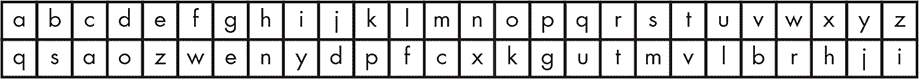

*图 13-2：替代密码*

这个密码将 *c* 映射到 *a*，*r* 映射到 *t*，*y* 映射到 *j*，依此类推，因此单词 *cryptography* 会被加密为 *atjgvketqgnj*。反向映射（*a* 到 *c*，*t* 到 *r*，依此类推）可以解密密文。这被称为 *对称* 密码，因为相同的密码既用于加密也用于解密消息。

为什么这不是一个好主意？替换密码很容易通过统计学破解。人们已经分析过各种语言中字母出现的频率。例如，在英语中，最常见的五个字母是 *e*、*t*、*a*、*o*、*n*，按这个顺序排列——至少在赫伯特·齐姆（Herbert Zim，1909–1994）于 1948 年出版的《密码与秘密写作》一书中是这样说的。破解替换密码涉及到寻找密文中最常见的字母，并猜测它是 *e*，以此类推。一旦猜对了几个字母，猜出一些单词就变得容易，这也使得猜出其他字母变得简单。让我们以 清单 13-1 中的明文段落为例。我们将其全部转为小写字母，并去掉标点符号，以简化操作。

```
theyre going to open the gate at azone at any moment

amazing deep untracked powder meet me at the top of the lift
```

*清单 13-1：明文示例*

这是使用 图 13-2 中的代码对同一段落进行加密后的密文：

```
vnzjtz ekyxe vk kgzx vnz eqvz qv qikxz qv qxj ckczxv

qcqiyxe ozzg lxvtqapzo gkrozt czzv cz qv vnz vkg kw vnz fywv
```

清单 13-2 展示了段落在加密版本中的字母分布。它按字母出现频率排序，出现最频繁的字母排在最上面。

```
zzzzzzzzzzzzzzzz

vvvvvvvvvvvvvv

qqqqqqqqq

kkkkkkkk

xxxxxxx

ccccc

eeee

gggg

nnnn

ooo

ttt

yyy

ii

jj

ww

a

f

l

p

r
```

*清单 13-2：字母频率分析*

一名密码破译者可以利用这一分析推测密文中的字母 `z` 对应于明文中的字母 `e`，因为在密文中它的出现频率高于其他字母。沿着这个思路，我们还可以推测 `v` 代表 `t`，`q` 代表 `a`，`k` 代表 `o`，`x` 代表 `n`。我们可以用大写字母来做这些替换，以便区分它们。

```
TnEjtE eOyNe TO OgEN TnE eATE AT AiONE AT ANj cOcENT

AcAiyNe oEEg lNTtAapEo gOroEt cEET cE AT TnE TOg Ow TnE fywT
```

从这里我们可以基于对英语的基本了解做一些简单的猜测。很少有三字母单词以 *t* 开头并以 *e* 结尾，而 *the* 是最常见的，所以我们可以猜测 `n` 代表 `h`。这可以通过我的 Linux 系统轻松验证，因为它有一个单词字典和一个模式匹配工具；`grep '^t.e$' /usr/share/dict/words` 可以找到所有以 `t` 开头并以 `e` 结尾的三字母单词。此外，`c` 在 `cEET cE` 中唯一符合语法的选择是 `m`。

```
THEjtE eOyNe TO OgEN THE eATE AT AiONE AT ANj MOMENT

AMAiyNe oEEg lNTtAapEo gOroEt  MEET ME AT THE TOg Ow THE fywT
```

只有四个单词与 `o□`en 匹配：`omen`、`open`、`oven` 和 `oxen`；只有 `open` 合乎逻辑，所以 `g` 必须是 `p`。同样，`to open the □`ate 中唯一合乎逻辑的单词是 `gate`，因此 `e` 必须是 `g`。只有一个以 `o` 开头的两字母单词，所以 `ow` 必须是 `of`，使得 `w` 成为 `f`。`j` 必须是 `y`，因为 `and` 和 `ant` 不合适。

```
THEYtE GOyNG TO OPEN THE GATE AT AiONE AT ANY MOMENT

AMAiyNG oEEP lNTtAapEo POroEt MEET ME AT THE TOP OF THE fyFT
```

我们不需要完全解码信息，也能看到统计学和语言知识可以帮助我们做到这一点。到目前为止，我们只使用了简单的方法。我们还可以利用常见字母对的知识，例如`th`、`er`、`on`和`an`，这些被称为*双字母组*。还有关于常见重复字母（如`ss`）的统计数据，以及许多其他技巧。

如你所见，简单的替代密码虽然有趣，但并不安全。

#### *换位密码*

另一种编码信息的方法是打乱字符的位置。一种古老的换位密码系统，据说是由希腊人使用的*斯凯塔尔*，它听起来很复杂，但其实只是一个圆棒。羊皮纸带被绕在棒上，信息沿着棒写成一行，其他行则写上额外的虚假信息。因此，带子包含了一组看似随机的字符。解码信息时，接收者需要将带子绕在与编码时相同直径的棒上。

我们可以通过写出一个特定大小的网格来轻松生成换位密码，网格的大小就是密钥。例如，我们可以在一个 11 列的网格中写出示例 13-1 中的明文，并移除空格，如图 13-3 所示。我们将在底部行的空隙中填入一些以斜体显示的随机字母。为了生成底部显示的密文，我们将按列读取而不是按行读取。

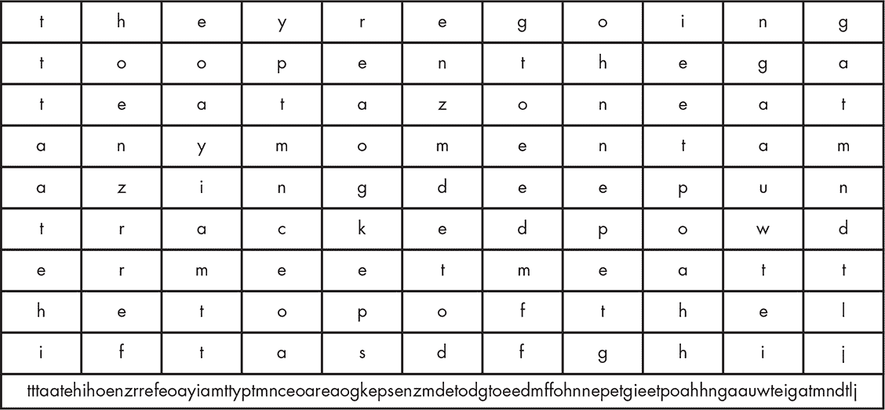

*图 13-3：换位密码网格*

换位密码中的字母频率与明文相同，但由于单词中字母的顺序也被打乱，这并没有多大帮助。然而，像这样的密码仍然相对容易破解，尤其是在如今计算机能够尝试不同网格大小的情况下。

#### *更复杂的密码*

复杂的密码种类繁多，包括替代密码、换位密码或两者的组合。通常会将字母转换为数字值，然后对这些数字进行某些数学操作后再转换回字母。一些密码还包括额外的数字表格，用来抑制字母频率分析。

第二次世界大战期间的破译历史令人着迷。破译密码的一种方法是监听通过无线电传输的信息。这些*拦截*的信息经过了详尽的统计分析，最终被破解。人类大脑识别模式的能力也是一个关键因素，巧妙的诡计同样起到了作用。

线索还来自于关于已知事件的消息。美国人在中途岛战役中取得了重大胜利，因为他们知道日本人会发动攻击，但不知道攻击的地点。他们破解了密码，但日本人用代号表示目标，这个例子中为`AF`。美国人安排了一条消息从中途岛发送出去，故意让其被截获，内容是该岛缺乏淡水。很快，日本人用密码重新发送了这条消息，确认`AF`就是中途岛。

密码的复杂性受限于人的速度。尽管美国有一些打孔卡制表机来帮助破译密码，但那是在计算机时代之前。密码必须简单，以便消息能够快速编码和解码，才能有效使用。

#### *一次性密码本*

最安全的加密方法被称为*一次性密码本*，它可以追溯到美国密码学家弗兰克·米勒（Frank Miller，1842–1925）在 1882 年的工作。一种一次性密码本是由一组独特的替换密码组成，每个密码只使用一次。这个名字来源于密码被印在纸张上，这样使用完后，最上面的一页就可以撕掉。

假设我们要编码我们之前的消息。我们从我们的密码本中取出一页，看起来像是列表 13-3。

```
FGDDXEFEZOUZGBQJTKVAZGNYYYSMWGRBKRATDSMKMKAHBFGRYHUPNAFJQDOJ

IPTVWQWZKHJLDUWITRQGJYGMZNVIFDHOLAFEREOZKBYAMCXCVNOUROWPBFNA
```

*列表 13-3：一次性密码本*

它的工作原理是：原始消息中的每个字母都转换为 1 到 26 之间的一个数字，密码本中相应的字母也同样如此。然后用 26 进制算术将这些值相加。例如，消息中的第一个字母是`T`，它的值为`20`。它与密码本中的第一个字母`F`配对，`F`的值为`6`。它们加在一起得到`26`，所以编码后的字母是`Z`。类似地，第二个字母`H`的值为`8`，与`G`（值为`7`）配对，编码后的字母就是`O`。消息中的第四个字母是`Y`，它的值为`24`，与`D`（值为`4`）配对时，得到`28`。然后，减去`26`，剩下`2`，所以编码后的字母是`B`。解密时使用的是减法而不是加法。

一次性密码本是完全安全的，只要正确使用，但也有一些问题。首先，通信的双方必须拥有相同的密码本。其次，双方必须同步；他们必须使用相同的密码。如果有人忘记撕掉一页或不小心撕掉多页，通信将变得不可能。第三，密码本的长度必须至少与消息相同，以防止出现重复的模式。

一次性密码本的一个有趣应用是第二次世界大战时期的 SIGSALY 语音加密系统，该系统于 1943 年投入使用。它使用存储在唱片上的一次性密码本来加密和解密音频。这些设备并不便于携带；每个设备重达 50 多吨！

#### *密钥交换问题*

对称加密系统的一个问题是通信双方必须使用相同的密钥。你可以将一次性密码本邮寄给某人，或者使用可信的信使，但你无法知道它是否在途中被截获并制作了副本。如果它丢失或损坏，就毫无用处。这就像是将房屋钥匙邮寄给朋友，你无法知道途中是否有人复制了钥匙。换句话说，它容易受到中间人攻击的威胁。

#### *公钥密码学*

*公钥密码学*解决了我们迄今讨论的许多问题。它使用一对*相关*的密钥。就像一个房子，前门上有一个邮件投递口。第一个密钥，叫做*公钥*，可以交给任何人，允许他们把邮件投递进去。但只有你，使用第二个或*私钥*的人，才能*读取*这些邮件。

公钥密码学是一个*非对称*系统，即加密和解密的密钥不同。这解决了密钥交换问题，因为即使别人拥有你的公钥，也无法用它解密消息。

公钥密码学依赖于*陷门函数*，这是一种数学函数，计算一个方向很容易，但如果没有某些秘密信息，反方向的计算就非常困难。这个术语的来源是，掉进陷门很容易，但没有梯子就很难爬出来。举一个非常简单的例子，假设我们有一个函数 *y* = *x*²。很容易根据 *x* 计算出 *y*。但是使用 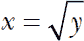 从 *y* 计算 *x* 就要困难得多。虽然这个例子很简单，但你可能已经发现，乘法比求平方根要简单。这个函数没有数学上的秘密，但你可以把计算器当做秘密，因为有了它，解决 *x* 就和解决 *y* 一样容易。

这个概念是公共密钥和私密钥通过某种复杂的数学函数相关联，公共密钥是陷门，私密钥是梯子，这样使得信息容易加密，但解密却非常困难。从高层次来看，密钥是一个非常大的随机数的因子。

非对称加密计算开销很大。因此，它通常仅用于秘密生成一个对称的*会话密钥*，该密钥用于实际的消息内容。常见的做法是使用*Diffie-Hellman 密钥交换*，这是美国密码学家惠特菲尔德·迪菲和马丁·赫尔曼命名的。

迪菲（Diffie）和赫尔曼（Hellman）在 1976 年发表了一篇关于公钥加密的论文。但直到 1977 年才有了实现，因为尽管“陷门函数”的概念相对简单，发明它却非常困难。这个问题是由密码学家罗纳德·里维斯特（Ronald Rivest）在 1977 年解决的，据说是在一次饮用曼尼舍维茨酒后解决的，从而证明了数学才能与味蕾无关。里维斯特与以色列密码学家阿迪·沙米尔（Adi Shamir）和美国科学家伦纳德·阿德尔曼（Leonard Adleman）共同开发了*RSA*算法，其名称来源于每个贡献者姓氏的首字母。不幸的是，在政府承包商泄密者爱德华·斯诺登揭露的信任违规事件中，发现他们的公司 RSA 安全公司从 NSA 那里收取了资金，在默认的随机数生成器中安装了一个窃取性后门。这使得 NSA 以及任何了解此事的人更容易破解 RSA 编码的消息。

#### *前向保密*

使用对称加密会话密钥进行实际通信的一个问题是，如果该密钥被发现，所有消息都可以被读取。我们知道许多政府具备录制和存储通信的技术能力。例如，如果你是一个依赖通信安全的人权活动家，你不希望冒险让你的密钥被发现，从而使所有消息都被解码。

避免这种情况的方法是使用*前向保密*，即为每条消息创建一个新的会话密钥。这样，发现单个密钥仅对解码一条消息有用。

#### *加密哈希函数*

我们在第七章中提到过哈希函数，它是一种用于快速搜索的技术。哈希函数也被用于加密，但只有具有特定属性的函数才适用。就像常规哈希函数一样，加密哈希函数将任意输入映射到固定大小的数字。用于搜索的哈希函数将其输入映射到比加密哈希函数小得多的输出范围，因为前者用于内存位置，而后者仅用作数字。

加密哈希函数的一个关键特性是它们是*单向*函数。这意味着，尽管从输入生成哈希值很容易，但从哈希值生成输入是不现实的。

另一个重要特性是，输入数据的微小变化会生成不相关的哈希值。在第七章中，我们使用了一个哈希函数，该函数将字符值模某个素数相加。使用这样的函数，字符串`b`的哈希值比字符串`a`大 1。这对于加密目的来说太可预测了。表 13-1 显示了三个仅在一个字母上有所不同的字符串的 SHA-1（安全哈希算法#1）哈希值。如你所见，输入与哈希值之间没有明显的关系。

**表 13-1:** 咸牛肉哈希

| **输入** | **SHA-1 哈希值** |
| --- | --- |
| Corned Beef | 005f5a5954e7eadabbbf3189ccc65af6b8035320 |
| Corned Beeg | 527a7b63eb7b92f0ecf91a770aa12b1a88557ab8 |
| Corned Beeh | 34bc20e4c7b9ca8c3069b4e23e5086fba9118e6c |

密码学哈希函数必须难以伪造；给定一个哈希值，应该非常难以找到生成该值的输入。换句话说，它应该很难产生碰撞。在第七章中使用质数 13 的哈希算法时，对于输入 `Corned Beef`，我们会得到 4 作为哈希值。但是对于输入 `Tofu Jerky Tastes Weird`，我们也会得到相同的哈希值。

很长一段时间，MD5 哈希函数是最广泛使用的算法。但是在 1990 年代末，研究人员发现可以生成*碰撞*，你可以在 “Making a Hash of Things” 一节中看到。当本文写作时，MD5 已经被 SHA 算法的变种所取代。不幸的是，SHA-0 和 SHA-1 这两个算法是由美国国家安全局（NSA）开发的，因此它们不值得信任。

#### *数字签名*

密码学可以通过*数字签名*帮助验证数据的真实性，数字签名提供了完整性、不可否认性和身份验证。

*完整性*验证意味着我们可以确定消息是否被篡改。例如，在古代，成绩单是实际的打印纸卡片，列出了课程和成绩，学生将其带回家给父母看。我记得有个四年级的同学，将他的*F*成绩的右边添加了竖线，变成了*A*。他的父母无法察觉消息已被篡改。

完整性验证通过附加数据的密码学哈希来完成。但是，当然，任何人都可以将哈希附加到消息上。为了防止这种情况，发送者使用他们的私钥加密哈希，接收者则可以使用对应的公钥解密哈希。请注意，在数字签名中，公钥和私钥的角色是相反的。

私钥的使用提供了不可否认性和身份验证。*不可否认性*意味着发送者很难声称他们没有用私钥签署某个消息。*身份验证*意味着接收者知道是谁签署了消息，因为他们的公钥与签署者的私钥是配对的。

#### *公钥基础设施*

公钥加密存在一个重大漏洞。假设你使用网页浏览器通过安全（HTTPS）连接访问银行。银行将其公钥发送给你的浏览器，以便你的浏览器加密数据，这样银行就可以使用其私钥解密。但是，你怎么知道这个公钥是来自银行，而不是某个第三方窃听了你的通信？你的浏览器如何验证这个密钥？如果它不能信任这个密钥，它还能信任谁？

尽管这种方法不算是一个完美的解决方案，但今天使用的是*公钥基础设施（PKI）*。这种基础设施的一部分是一个名为*证书授权机构（CA）*的可信第三方，用于担保密钥的真实性。理论上，CA 确保某方身份的真实性，并发放一个经过加密签名的文档，称为*证书*，可以用来验证其密钥。这些证书采用 X.509 格式，这是国际电信联盟（ITU）定义的标准。

虽然 PKI 通常能够正常工作，但它最终还是回到了信任问题上。CA（证书授权机构）曾被黑客攻击。CA 的疏忽错误导致它们的私钥被意外公开，这使得任何人都有可能签发虚假的证书（幸运的是，存在一种机制可以*撤销*证书）。一些 CA 被发现存在安全漏洞，因为它们没有验证请求证书的各方身份。可以合理地假设，政府认为它们有权强迫 CA 生成虚假的证书。

#### *区块链*

*区块链*是加密技术的另一个应用。它是一个相当简单的概念，背后有许多复杂的数学支持。大多数媒体对区块链在比特币和其他加密货币中的讨论，更多关注它的应用，而非它是如何工作的。

你可以将区块链看作是一种管理账本的机制，类似于你的银行账户对账单。账本的一个问题是它们很容易在纸面上篡改，甚至在电子账本中篡改也更容易，因为计算机不会留下擦除的痕迹。

账本通常由一组记录组成，每条记录位于后续的行上。区块链中账本行的等价物是*区块*。区块链会将前一个区块（行）的加密哈希值和区块创建时间戳添加到下一个区块中。这使得通过哈希值和时间戳将区块链（因此得名）连接在一起，如图 13-4 所示。

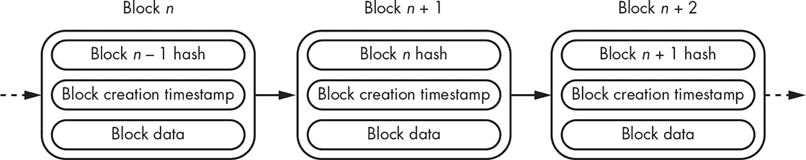

*图 13-4：简化的区块链*

正如你所看到的，如果区块*n*的内容被修改，它的哈希值将发生变化，因此不会与存储在区块*n* + 1 中的哈希值匹配。加密哈希的特性使得修改区块以使其哈希保持不变几乎不可能。每个区块实际上都包括前一个区块的数字签名。

攻击区块链的唯一有效方式是妥协管理区块链的软件，而这种方式可以通过将区块链数据设为公开且在多个系统中复制来一定程度上减轻。攻击这种分布式系统需要多方人员的共谋。

#### *密码管理*

另一个加密技术的应用是*密码管理*。在过去的好时光里，计算机会以*明文*的形式保存密码文件。当有人登录时，输入的密码会与文件中存储的密码进行比较。

这种方法很糟糕，主要因为任何能够访问文件的人都知道每个人的密码。请记住，这不一定是计算机遭到攻击的结果。许多组织将其备份发送给第三方进行存储（最好至少有三个远离彼此的备份，最好分布在不同的构造板块上）。我们又回到了信任问题，因为有人可能会访问这些备份中的密码文件或任何其他数据。你可以加密备份，但这有点脆弱，因为小型存储介质的缺陷（例如硬盘驱动器坏道）可能会使整个备份无法恢复。在保护数据和能够恢复数据之间存在权衡。

解决这个问题的一个简单方法是将密码以加密格式（例如加密哈希）存储。当用户尝试登录时，他们的密码会被转换为加密哈希，然后与文件中的哈希进行比较。加密哈希的属性使得猜测密码的可能性非常小。作为额外的预防措施，大多数系统都会防止普通用户访问密码文件。

即使采取了这些做法，密码仍然是一个问题。在共享计算的早期，你可能只需要为少数系统设置密码。但现在，你需要为银行账户、学校网站、许多不同的在线商店等设置无数密码。许多人通过在所有地方使用相同的密码来应对这种情况；事实证明，最常见的密码是`password`，其次是`password123`，用于要求密码中包含数字的网站。重复使用密码等同于不使用前向保密性；如果一个网站被攻破，你的密码可以在其他所有网站上使用。你可以为每个网站设置不同的密码，但那样你就得记住所有密码。你可以使用*密码管理器*，将所有不同的密码存储在一个地方，并由一个主密码保护，但如果主密码或密码管理器本身被攻破，那么所有其他密码也都会受到威胁。可能最有效但又有问题的方法是前面提到的双因素认证。但这通常依赖于像手机这样的设备，并且在没有手机信号的地方，你就无法访问账户了。此外，这也很麻烦，导致人们保持登录状态。

### 软件卫生

现在你对安全和密码学有了一些了解，作为程序员，你能做些什么呢？你不需要成为密码学专家或安全高手，也能避免许多常见的陷阱。绝大多数现实中的安全漏洞源于一些可以轻松避免的情况，其中许多都可以在亨利·斯宾塞的*《C 程序员的十诫》*中找到。我们将在这一节中探讨其中的一些。

#### *保护正确的东西*

在设计一个确保系统安全的方案时，可能会有让系统保持全方位安全的诱惑。但这并不总是一个好主意。例如，如果你要求用户登录才能查看那些不需要安全保护的内容，用户就必须登录并保持登录状态。由于登录用户可以访问“安全”内容，这增加了其他人获取访问权限的机会——例如，如果用户暂时离开电脑。

这一点可以通过许多手机的工作方式来说明。大多数情况下，手机上的一切都被锁定，除了可能是相机。某些东西*应该*被锁定；如果你丢失手机，你可能不希望有人能以你的名义发送信息。但假设你和朋友们在听音乐。如果他们挑选歌曲，你就得把解锁的手机交给他们，从而让他们访问你手机上的一切。向手机发送验证码是双重身份验证中的常见第二因素，把这个因素交给第三方就等于破坏了验证的目的。

#### *三重检查你的逻辑*

编写一个你*认为*能完成某些事情的程序其实并不难，但事实是它根本没有做到。逻辑错误可能被利用，特别是当攻击者能够访问源代码并发现你没有注意到的漏洞时。一种有效的方法是和别人一起大声逐行检查你的代码。朗读能够迫使你比默读时更慢地审视内容，而你总会惊讶地发现一些问题。

#### *检查错误*

你编写的代码将使用系统调用并调用库函数。大多数这些调用如果出现问题会返回错误代码。不要忽视它们！例如，如果你尝试分配内存并且分配失败，就不要使用该内存。如果读取用户输入失败，不要假设输入有效。这类情况很多，处理每个错误可能会很繁琐，但仍然要坚持处理。

避免使用可能会悄悄失败或溢出边界的库函数。确保在你的语言工具中启用了错误和警告报告。将内存分配错误视为致命错误，因为许多库函数依赖于已分配的内存，并且它们在其他地方发生分配失败后可能会以神秘的方式失败。

#### *最小化攻击面*

本节内容改编自 2016 年 4 月 19 日加密学研究员 Matt Blaze 在美国众议院小组委员会就圣贝纳迪诺枪击案作证时的部分陈述。值得阅读完整内容。

我们必须假设所有软件都有缺陷，因为它太复杂了。研究人员曾尝试提出类似数学证明的“形式化方法”，用来证明计算机程序是“正确的”。不幸的是，到目前为止，这是一个未解决的问题。

由此可见，每个新增的功能都会为软件带来一个新的攻击面。我们甚至无法证明某一个攻击面是百分之百安全的。但我们知道，每一个新的攻击面都会增加新的漏洞，并且这些漏洞会累积起来。

这是实际安全专家（而非政治人物）反对为执法部门安装后门的根本原因。这不仅使软件变得更加复杂，增加了攻击面，而且就像本章早些时候提到的保险箱例子一样，未经授权的人员很有可能找到访问该后门的方法。

事实证明，Matt Blaze 确实知道他在这里说的是什么。NSA 在 1993 年宣布开发了 Clipper 芯片。NSA 的目的是要求将其用于加密，并且它包含了一个政府访问的后门。这是一个很难推销的政治议题，因为其他国家的人们会不愿意使用可能对他们进行间谍监视的美国产品。Clipper 项目失败的原因既有政治反对，也因为 Blaze 在 1994 年发表了一篇名为《加密标准中的协议失败》的论文，展示了如何轻易地利用这个后门。顺便提一句，Blaze 发现自己完全没有准备好被召唤到国会作证，但现在他在这方面非常擅长。那是他当时不了解的一个领域。考虑学习如何在公共场合演讲，因为有一天它可能会派上用场。

良好的安全实践是尽可能保持代码简洁，从而最小化攻击面数量。

#### *保持边界*

第十章介绍了缓冲区溢出概念。这是攻击者可以利用的一类漏洞示例，这些漏洞可能在程序中长期未被发现。

总结一下，缓冲区溢出发生在软件未检查边界时，可能会导致覆盖其他数据。例如，如果“你已授权”变量存在于密码缓冲区的末尾，长密码可能会导致授权，即使密码不正确。栈上的缓冲区溢出尤其棘手，因为它们可以让攻击者修改函数调用的返回地址，从而使程序的其他部分以非预期的方式执行。

缓冲区溢出不仅限于字符串。你还必须确保数组索引在边界范围内。

另一个边界问题是变量的大小。不要仅仅假设一个整数是 32 位的。例如，它可能是 16 位的，设置第 17 位可能会导致意外的结果。小心用户输入，确保检查任何用户提供的数字是否适合你的变量。大多数系统都包含定义文件，供你的代码使用，以确保你使用的是正确的大小。在最坏的情况下，你应该使用这些定义文件来防止代码在大小不正确时无法编译。在最好的情况下，你可以使用这些定义文件来自动选择正确的大小。定义文件存在用于数字大小，甚至字节中的位数。不要做假设！

另外，保持内存边界也很重要。如果你使用动态分配的内存并分配了*n*字节，确保你的访问在 0 到*n-1*的范围内。我曾经调试过这样的代码：内存被分配后，内存地址被递增，因为算法方便引用`memory[-1]`。然后代码释放了`memory`而不是`memory[-1]`，从而导致了问题。

许多为嵌入式应用设计的微型计算机，包含的内存远远超过程序所需的内存。在这种情况下，避免使用动态内存分配，直接使用静态数据；这样可以避免许多潜在的问题。当然，确保你的代码遵循数据存储的边界。

另一个边界问题是时序。确保你的程序能够处理输入速度超过中断处理程序响应速度的情况。避免让中断处理程序被中断，这样你就不会把栈溢出。

有一种叫做*fuzzing*的测试技术，有工具可以帮助捕捉这类错误。但它是一种统计技术，并不能替代编写良好的代码。Fuzzing 涉及对代码进行大量合法输入的变种测试。

#### *生成良好的随机数是困难的*

良好的随机数对于加密非常重要。你怎么获得它们呢？

最常见的随机数生成器实际上生成的是*伪随机*数。这是因为逻辑电路无法生成真正的随机数。如果它们从同一个地方开始，它们将总是生成相同的数字序列。一个叫做*线性反馈移位寄存器（LFSR）*的简单电路，如图 13-5 所示，可以用作伪随机数生成器（PRNG）。

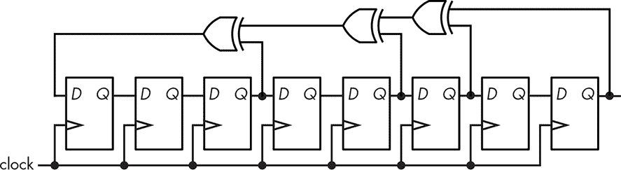

*图 13-5：线性反馈移位寄存器*

你可以看到，当数字向右移动时，一个新的比特从左边进入，它是从其他一些比特中生成的。图中的版本只生成 8 位数字，但也可以构建更大的版本。这里有两个问题。第一个是数字是周期性重复的。第二个是，如果你知道最近的随机数，你总是知道下一个是什么；如果它刚生成了 0xa4，那么下一个总是 0x52。请注意，虽然这是加密学中的问题，但在调试程序时，它是有用的。

寄存器中的初始值被称为*种子*。许多软件实现允许设置种子。LFSR 有很多改进版本，比如梅森旋转算法，但最终它们都存在我提到的两个问题。没有真正的随机性。

现代软件通过从各种来源收集熵来解决这个问题。*熵*这个术语来源于热力学，指的是自然界普遍的随机化趋势。

第一个熵源之一，叫做 LavaRand，是在 1997 年由 SGI 发明的。它通过将网络摄像头对准两个熔岩灯来工作。它每秒可以生成近 200KB 的随机数据。熵源的性能很重要；如果你是一个为大量客户生成会话标识符的网站，你就需要快速生成大量的好随机数。

虽然为每台计算机配备一对熔岩灯会很酷，但显然这不实际。一些芯片制造商已经在他们的硬件中增加了随机数生成器。英特尔在 2012 年增加了一个芯片内热噪声生成器随机数生成器，每秒可生成 500MB 的随机数。但由于它是在斯诺登泄密事件后发布的，许多人不再信任它，因此拒绝使用。

依赖芯片上的随机数生成器还有一个因素。制造商可以发布其设计，以便进行审查。你甚至可以*拆解*芯片，或者去掉芯片的盖子，使用电子显微镜检查它，确认它与设计一致。但在制造过程中，它可能会被无声无息地更改。这相当于硬件领域的兴奋剂丑闻。第二章在我们讨论晶体管时提到了兴奋剂；*掺杂物*是用于创造*p*区和*n*区的有害化学物质。通过微调掺杂物的浓度，可以改变电路的行为。即使通过显微镜也无法检测出这种变化。

安全专家已经意识到，他们不能信任硬件随机数生成器。熵是从与计算机程序无关的随机事件中获取的，比如鼠标移动、键盘点击之间的时间、磁盘访问速度等等。这种方法效果不错，但快速生成大量随机数是非常困难的。

熵收集在一些重大错误中遭遇了麻烦，尤其是在基于 Linux 的 Android 操作系统中。事实证明，Android 手机生成熵的速度很慢，因此在启动后不久使用的随机数并不那么随机。而且，某些早期实现的代码复制了从磁盘访问时间中收集熵的方式。当然，手机没有磁盘；它们使用闪存，访问时间是可预测的，从而产生了可预测的熵。

如果你的安全依赖于良好的随机数，请确保你理解生成这些随机数的系统。

#### *了解你的代码*

大型项目往往包含*第三方代码*，这些代码并非项目团队成员编写。在许多情况下，你的团队甚至无法访问源代码；你只能相信供应商的话，认为他们的代码能正常工作并且安全。到底可能会出什么问题呢？

首先，你如何知道这段代码真的能正常工作并且安全？你怎么知道有人在这段代码上工作时没有安装一个秘密后门？这可不是假设性的问题；2015 年，一家主要的网络设备厂商的产品中就发现了一个秘密后门。2016 年，又有另一家厂商的产品中发现了一个带硬编码密码的额外账户。这样的例子还有很多，并且只要不改掉这些坏习惯，未来的事件将比已知的更严重。

Ken Thompson 在 1984 年的图灵奖演讲《反思信任的信任》给出了一个关于恶意行为者能造成多少损害的例子。

使用第三方代码会导致另一个更微妙的问题，这个问题在物理基础设施软件中频繁出现——这些软件是让发电厂等设施运转的核心。你可能认为像这样的关键软件应该由工程师设计，但这种情况比较少见。工程师们可能会指定软件，但通常是由“系统集成商”来构建的。这些人的培训背景与“学习编程”类似；系统集成基本上就是导入别人写的代码并将功能调用粘合在一起。结果是，产品代码最终会像图 13-6 那样。

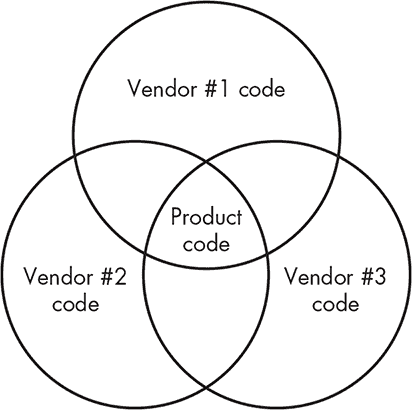

*图 13-6：未使用的供应商代码与产品代码*

这意味着很多未使用的代码被包含进了产品；在图中，非产品代码比产品代码还要多。我曾经做过一系列关于这个话题的讲座，称其为“数字疱疹”，因为这些代码像病毒一样盘踞在你产品的中枢神经系统，等待外部刺激后才会爆发，就像人类版本的病毒一样。

这让开发者处于一个艰难的境地。你如何判断哪些第三方代码是安全的？并不是每个在发电厂工作的人都是密码学或网络协议的专家。

首先，这是一个开源代码具有优势的领域。你实际上可以查看开源代码，而因为你可以查看，其他人也很可能在查看它。这种“更多眼球”原则意味着，至少比只有少数人能看到的闭源代码，找到漏洞的机会要大一些。当然，这并不是万能的。在 2014 年，流行的 OpenSSL 加密库就发现了一个重大漏洞。从积极的一面来看，这个漏洞的发现使得大量的人开始关注这段代码和其他安全关键的包。

另一个好的做法是关注你在第三方包中实际使用的代码与整个包大小的比例。我曾经参与过一个医疗仪器项目，管理层说：“我们使用这个我们可以以优惠价格获得的酷操作系统吧。”但这个操作系统包含了我们根本不会使用的各种功能。我反对了，最终我们自己编写了所需的代码。这是二十多年前的事，现在在一些使用该操作系统的部署中已经发现了漏洞。

另一个需要注意的领域是调试代码。在产品开发过程中，常常会包括额外的调试代码。确保它在发布前被移除！这也包括密码。如果你在调试过程中包含了默认密码或其他快捷方式来简化代码，确保它们已经被删除。

#### *极端聪明是你的敌人*

如果你在使用第三方代码，避免使用晦涩且巧妙的功能。这是因为供应商通常会停止支持那些他们的客户不常使用的功能。当这种情况发生时，你通常会被锁定在无法升级的路径上。供应商通常只对其产品的最新版本提供修复，因此，如果你的代码依赖于一个不再支持的功能，你可能无法安装关键的安全修复。

#### *了解什么是可见的*

思考一下敏感数据如何被其他程序访问——不仅是数据，还有元数据。谁还能看到你程序的数据？这是定义威胁模型的重要部分。如果有人窃取了你原本完全安全的系统，可能会被泄露什么？攻击者是否可以通过拔出设备中的内存芯片并直接访问它们，绕过保护机制？

除了确保你的代码安全外，还需要警惕*侧信道攻击*——基于实现的元数据或副作用的利用。例如，假设你有一段检查密码的代码。如果一个接近正确的密码运行时间比错误密码长，这就给攻击者提供了线索。这种情况叫做*时间攻击*。

对准自动取款机（ATM）键盘的摄像头就是一种侧信道攻击。

基于电磁辐射的攻击已有文献记录。一种有趣的攻击方式叫做*van Eck phreaking*，它使用天线捕捉显示器的辐射信号，从而生成远程复制的显示图像。已经证明，某些电子投票系统中的选票保密性可能因此受到威胁。

边信道攻击非常隐秘，需要严谨的系统思维来缓解；仅仅知道如何写代码是不够的。类似的例子比比皆是，尤其是在第二次世界大战时期，这是现代密码学的开端。德国人能够通过发现数百本 Sears 目录都邮寄到同一个邮政信箱，推断出洛斯阿拉莫斯国家实验室的存在。而英国化工厂的位置则通过当地报纸上公布的工厂足球队比赛成绩被推测出来。

一般来说，确保你的关键安全代码的外部可见行为与它实际做的事情无关。避免通过边信道泄露信息。

#### *不要过度收集*

这显而易见，我不需要多说什么，但经验表明，很少有人能理解这一点。保持事物安全的最佳方式是根本不去保留它们。除非真的需要，否则不要收集敏感信息。

一个经典的例子出现在许多医疗表单中。当表单要求同时填写我的出生日期和年龄时，我总是感到困惑。我真的想要一个连这两个东西都分不清楚的医生吗？如果你都收集了，那么你就得保护这两项信息，所以只收集你需要的那一项。

#### *不要囤积*

仅仅因为你收集了敏感信息，并不意味着你应该永远保留它。尽快将其清除。例如，你可能需要某人的密码来登录某个系统。等你核对完密码后，就不再需要它了。把它清除掉。你留下它的时间越长，被他人发现的机会就越大。

随着世界在努力理解欧盟的《通用数据保护条例》（GDPR），清理工作变得越来越具有法律重要性，该条例对泄露个人信息的行为增添了后果。

#### *动态内存分配不是你的朋友*

第七章讨论了使用堆进行动态内存分配。在本节中，我们将探讨 C 标准库函数`malloc`、`realloc`和`free`，它们可能引发一些不同的问题。

我们首先来看一下当动态分配的内存被释放时会发生什么；见图 13-7。

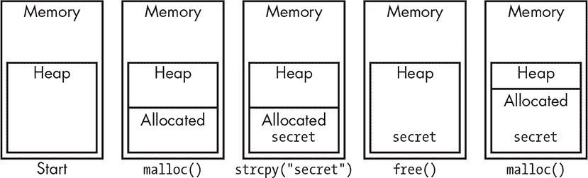

*图 13-7：释放内存*

在图 13-8 的左侧，您可以看到堆内存坐落在内存中。向右移动，堆内存中的一块内存被分配给程序使用。继续向右，`secret`信息被复制到已分配的内存中。在稍后的某个时刻，那块内存不再需要，因此被释放并返回到堆中。最后，在最右侧，堆中为其他目的分配了内存。但秘密仍然存在于那块内存中，仍然可以被读取。使用动态内存的规则#1 是确保在释放内存之前擦除任何敏感信息。

`realloc`函数允许您增大或缩小已分配内存的大小。查看图 13-8 中的缩小情况。

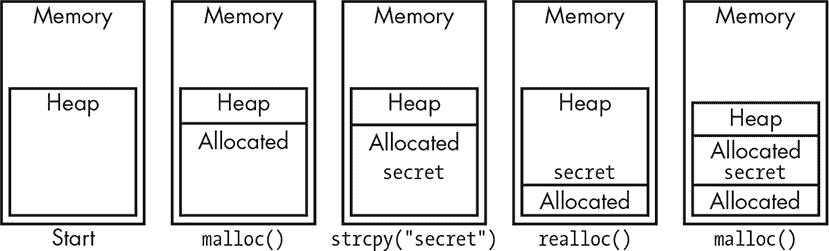

*图 13-8：内存缩小*

第一步和前一个例子一样。但随后分配的内存量被缩小。秘密就在多余的内存中，因此它回到了堆中。然后，稍后分配的内存块包含了这个秘密。使用动态内存的规则#2 是确保任何因内存缩小而返回堆的内存都被擦除。这与规则#1 类似。

使用`realloc`来增加分配内存块大小时，有两种情况需要考虑。第一种情况很简单，并且不是安全问题。如图 13-9 所示，如果堆上已有分配块上方有空闲空间，则内存块的大小会被增加。

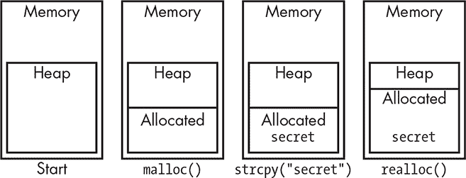

*图 13-9：良好的内存增长*

图 13-10 显示了可能导致安全问题的情况。

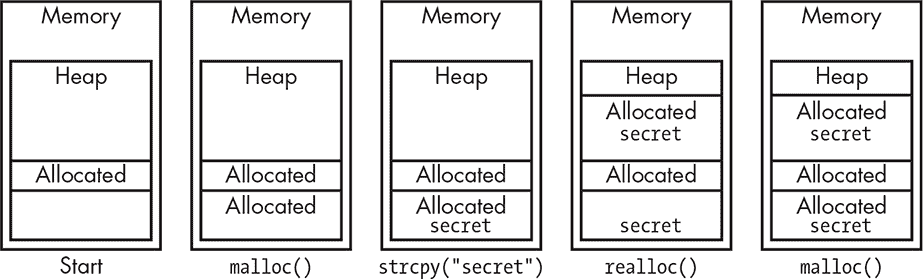

*图 13-10：不良的内存增长*

在这个例子中，另有一块内存已经被分配用于其他目的。当我们尝试增加分配的内存块的大小时，由于其他内存块的存在，空间不足，因此堆内存会被搜索以找到足够大的连续内存块。内存被分配，旧内存块的数据被复制进去，旧内存块被释放。现在内存中有两个副本的秘密，其中一个在未分配的内存中，这块内存可以被重新分配。这里的最大问题是，`realloc`的调用者无法看到发生了什么。唯一判断内存块是否移动的方法是比较其地址与原始地址。但是即使它被移动了，发现也已经太晚，因为旧内存块不再由你控制。这导致了规则#3：当安全性至关重要时，不要使用`realloc`。使用`malloc`来分配新的内存，将旧数据复制到新的内存中，擦除旧内存，再调用`free`。虽然效率较低，但安全性更高。

#### *垃圾回收也不是你的朋友*

我曾谈到过在不再需要时擦除关键信息。前面的章节展示了，使用显式内存管理时，这并不像听起来那么容易。垃圾回收系统有自己的一套独特问题。假设我们有一个包含“敏感信息”的 C 程序，如 图 13-11 所示。

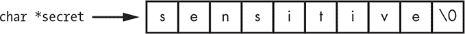

*图 13-11：敏感数据的 C 字符串*

我们完成之后如何清理这些数据呢？由于 C 字符串是以 NUL 终止的，我们可以通过将第一个字符设置为 NUL 来使其变为空字符串，如 图 13-12 所示。

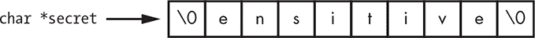

*图 13-12：未完全擦除的敏感数据 C 字符串*

对恶意人士来说，猜测内容并不困难。我们真的需要覆盖整个字符串。

这个字符串可能位于内存数组中，或者它可能是通过 `malloc` 动态分配的内存。确保将字符串设置为 NUL 或某个易于在调试时识别的值，在调用 `free` 前擦除每个字符；否则，敏感数据就会重新出现在堆上，并且可能会在后续的 `malloc` 调用中被分配出去。

如果我们使用的是一种使用垃圾回收而非显式内存管理的语言呢？像 `secret = "xxxxxxxxxxxxxxx"` 这样的代码，在 JavaScript、PHP 和 Java 等语言中并不会按你想的那样工作。这些语言可能不会覆盖敏感数据，而是为你创建一个新字符串，并将敏感数据字符串加入垃圾回收队列。敏感数据并没有被擦除，你也无法强制让它被擦除。

如果这些问题仅限于编程语言和环境，那还不算太糟，但事实并非如此。闪存正被越来越多的地方使用。一个例子就是固态硬盘（SSD）。由于闪存会磨损，这些硬盘使用 *负载均衡* 来平衡各个闪存芯片的使用情况。这意味着，写入这些设备的内容并不保证旧版本已被擦除。这就像是释放已分配的内存后，它仍然留在堆中一样。

如你所见，即使是安全地擦除某些内容，也比你在“学习编程”时所学到的任何东西都要复杂。为了做好这项工作，你需要全面了解环境的各个方面，这也是你正在阅读本书的原因。

#### *数据即代码*

你现在应该意识到，“代码”只是计算机理解的特定格式的数据。最初这意味着计算机硬件，但现在许多程序，比如网页浏览器，也执行包括 JavaScript 程序在内的数据。而 JavaScript 也能执行数据；它的 `eval` 语句将任何字符串当作程序并执行它。

在 第五章 中，我们讨论了一些硬件，它们可以防止计算机将任意数据当作代码来执行。内存管理单元或哈佛架构的机器将代码和数据分开，从而防止数据被执行。能够执行数据的程序没有这种保护，因此你必须自己提供这种保护。

一个经典的例子是 *SQL 注入*。SQL 是结构化查询语言（Structured Query Language）的简称，它是许多数据库系统的接口。*结构化* 部分允许数据被组织成，例如，人员记录。*查询* 部分允许访问这些数据。当然，*语言* 部分就是用来实现这一过程的。

SQL 数据库将数据组织为一组 *表*，这些表是由行和列构成的矩阵。程序员可以创建表并指定列。查询可以插入、删除、修改或返回表中的行。

你不需要了解 SQL 的所有细节，就能理解以下示例。你需要知道的是，SQL 语句以分号（`;`）结束，且注释以数字或井号（`#`）开头。

你的学校可能有一个网站，你可以用来查看成绩。我们的示例使用了一个 SQL 数据库，其中包括一个名为 students 的表，如 表 13-2 所示。

**表 13-2：** 数据库中的学生表

| **学生** | **班级** | **成绩** |
| --- | --- | --- |
| David Lightman | 生物学 2 | F |
| David Lightman | 英语 11B | D |
| David Lightman | 世界历史 11B | C |
| David Lightman | 三角学 2 | B |
| Jennifer Mack | 生物学 2 | F |
| Jennifer Mack | 英语 11B | A |
| Jennifer Mack | 世界历史 11B | B |
| Jennifer Mack | 几何 2 | D |

该网站提供了一个 HTML 文本框，学生可以在其中输入课程名称。一点 JavaScript 和 jQuery 会将课程名称发送到 Web 服务器，并显示返回的成绩。Web 服务器中有一些 PHP 代码，可以在数据库中查找成绩并将其发送回网页。当学生登录时，`$student` 变量被设置为他们的姓名，以便他们只能访问自己的成绩。Listing 13-4 显示了代码。

```
HTML

<input type="text" id="class"></input>

JavaScript

$('#class').change(function() {

 $.post('school.php', { class: $('#class').val() }, function(data) {

  // show grades

 });

});

PHP

$grade = $db->queryAll("SELECT * FROM students

 WHERE class='{$_REQUEST['class']}' && student='$student'");

header('Content-Type: application/json');

echo json_encode($grade);
```

*Listing 13-4: 学生网站代码片段*

数据库查询非常简单。它从 `students` 表中选择所有（`*`）列的所有行，其中 `class` 列与网页上的 `class` 字段匹配，`student` 列与包含登录学生姓名的变量匹配。可能出什么问题呢？

好吧，David 可能没怎么关注生物学，但他很擅长电脑。他登录了自己的账户。并没有输入 `Biology 2` 作为课程，而是输入了 `Biology 2' || 1=1 || '; #`。这将 `select` 语句转变成 Listing 13-5 中显示的内容。

```
SELECT * FROM students WHERE class='Biology 2' || 1=1 || ''; # && student='David Lightman'
```

*Listing 13-5: SQL 注入*

这段话的意思是“从学生表中选择所有列，条件是班级为`Biology 2`或 1 等于 1 或为空字符串。”分号早早结束了查询，剩下的部分变成了注释。因为 1 总是等于 1，David 就这样获得了整个学生成绩的数据集。我可以继续给你演示 David 是如何通过改变 Jennifer 的生物成绩来给她留下深刻印象，但你可以直接观看 1983 年上映的电影*战争游戏*。作为一个小插曲，他可以在字段中输入内容，并在后面加上一个分号，然后紧接着是一个数据库更新命令。

这些不仅仅是理论上的科幻电影情节；请参考 xkcd 漫画#327。直到 2017 年，在流行的 WordPress 网站软件中发现了一个重大 SQL 注入漏洞，这个软件被大量网站使用。这进一步证明了当你依赖第三方代码时可能会出现的问题。

另一个例子是，许多网站允许用户提交评论。你必须小心地清理每条评论，确保它不包含 JavaScript 代码。否则，观看这些评论的用户可能会不小心执行那段代码。而且，如果你没有防止用户提交 HTML 格式的评论，你可能会发现评论里充满了广告和指向其他网站的链接。确保用户输入永远不会被误解为代码。

### 总结

在本章中，你对安全性原则有了基本的了解。你了解了一些关于密码学的知识，密码学是计算机安全技术的一个关键领域。你还学到了一些方法，可以让你的代码更加安全。

此外，希望你已经了解到安全性非常难掌握，并非业余爱好者能够轻松做到的事情。在你成为专家之前，务必咨询专家。不要单打独斗。

就像安全性一样，机器智能是另一个值得了解的高级话题。我们将在下一章讨论它。
