## 第十四章：机器智能**


你一天会多少次向搜索引擎提交类似“cats and meetloafs”的内容，结果却返回“Did you mean *cats and meatloaves*?”你可能对此视为理所当然，却从未停下来思考搜索引擎是如何知道你的输入不仅有错误，而且知道如何修正它的。很难想象有人写了一个程序来匹配所有可能的错误并给出修正。而是某种*机器智能*在发挥作用。

机器智能是一个高级话题，包含了*机器学习*、*人工智能*和*大数据*等相关领域。这些都是你作为程序员可能会遇到的概念，因此本章为你提供了一个高层次的概述。

*人工智能*在 1956 年达特茅斯学院的一个研讨会上首次被提出。当时，*机器学习*紧随其后，1957 年提出的*感知机*便是其中之一，我们将很快讨论这一点。如今，机器学习遥遥领先，这在一定程度上归功于两个趋势。首先，技术进步大幅增加了存储空间，同时降低了存储成本，还使得处理器和网络速度得到了提升。其次，互联网促进了大量数据的收集，人们无法抗拒对这些数据的探索。例如，一家大型公司的图书扫描和翻译项目中的数据被用来显著改善另一个语言翻译项目。另一个例子是一个地图项目，它为自动驾驶汽车的开发提供了支持。这些项目及其他项目的成果如此令人信服，以至于机器学习现在被应用于大量的应用场景。最近，人们还意识到，这两大趋势——更便宜的存储、更强大的计算能力，以及大量数据的收集——也有助于复兴人工智能，促使该领域出现了许多新的工作。

然而，急于采用机器智能的做法模仿了计算机安全领域中“有什么可能出错？”的哲学思想。我们尚未足够了解如何避免产生像 1968 年电影《2001 太空漫游》中的 HAL 那样的精神错乱系统。

### 概述

你现在应该知道，编程是实现问题解决方案所需的繁重工作。定义问题及其解决方案才是有趣且更具挑战性的部分。许多人宁愿将整个职业生涯都投入到让计算机完成这些工作的工作中，而不是自己亲自去做（这也是第五章中提到的“独特的工程懒惰”现象的另一个例子）。

如前所述，一切始于人工智能；机器学习和大数据则是后来出现的。虽然这个术语直到 1956 年的达特茅斯研讨会才被创造出来，但人工智能的概念早在古希腊神话中就有了。自那以后，许多哲学家和数学家致力于开发能够编码人类思维的正式系统。尽管这一努力尚未导致真正的人工智能，但它为此奠定了大量基础。例如，乔治·布尔（George Boole）在第一章中为我们提供了代数，他于 1854 年出版了*《思维法则的研究：逻辑学和概率数学理论的基础》*。

我们已经积累了大量关于人类决策过程的信息，但仍然不真正了解人类是如何思考的。例如，你和你的朋友们可能能够区分猫和肉饼，但你们可能采取了不同的路径来得出这一区分。仅仅因为相同的数据得出相同的结果，并不意味着我们处理这些数据的方式相同。我们知道输入和输出，我们理解部分“硬件”，但对将二者转化的“编程”知之甚少。因此，计算机识别猫和肉饼的路径也会有所不同。

我们认为关于人类思维处理的一个已知事实是，我们在无意识中非常擅长统计分析——这与在“统计学”课堂上有意识地受苦是两回事。例如，语言学家研究了人类是如何习得语言的。婴儿在学习从环境中提取重要声音、将其分解成音素，并将这些音素组合成单词和句子的过程中，进行大量的统计分析。至于人类是否有专门的设备来处理这种情况，还是我们仅仅使用通用处理机制来完成，这仍然是一个持续的争论话题。

婴儿通过统计分析来学习，至少部分原因是因为有大量数据可以分析。除非有特殊情况，婴儿不断接触到声音。同样，婴儿也会不断接收到视觉信息和其他感官输入。婴儿通过处理大量数据来学习，或者说是*大数据*。

计算能力、存储容量和各种类型的网络连接传感器（包括手机）的巨大增长，导致了大量数据的收集，而这些数据并不仅仅是上章所提到的坏人收集的。这些数据中有些是有组织的，有些则没有。组织好的数据可能是来自海上浮标的波浪高度测量数据。无组织的数据可能是环境声音。我们该如何处理这些数据呢？

统计学是数学中一个定义明确的分支，这意味着我们可以编写执行统计分析的程序。我们也可以编写可以使用数据进行训练的程序。例如，实现垃圾邮件过滤器的一种方法（我们稍后会更详细地讨论）是将大量收集到的垃圾邮件和非垃圾邮件输入统计分析器，同时告诉分析器哪些是垃圾邮件，哪些不是。换句话说，我们将有组织的*训练数据*输入程序，并告诉程序这些数据意味着什么（即，什么是垃圾邮件，什么不是）。我们称之为*机器学习（ML）*。有点像哈克贝里·芬，我们是“要让机器学会”，而不是“教它”。

在许多方面，机器学习系统类似于人类的自主神经系统功能。对于人类来说，大脑不会积极参与许多低级过程，例如呼吸；它主要负责更高级的功能，比如决定晚餐吃什么。低级功能由自主神经系统处理，只有当某些事情需要注意时，才会打扰到大脑。目前，机器学习在识别方面表现良好，但这并不等同于采取行动。

非组织化数据是一个完全不同的难题。我们所说的是大数据，这意味着没有辅助工具，人类无法理解这些数据。在这种情况下，会使用各种统计技术来寻找模式和关系。例如，这种方法——有时被称为*数据挖掘*——可以用来从环境声音中提取音乐（毕竟，正如法国作曲家埃德加·瓦雷兹所说，音乐就是有组织的声音）。

这一切本质上是在寻找将复杂数据转化为更简单内容的方法。例如，可以训练一个机器学习系统来识别猫和肉饼。它会将非常复杂的图像数据转化为简单的猫和肉饼的片段。这是一个*分类*过程。

在第五章中，我们讨论了指令与数据的分离。在第十三章中，我提醒过不要让数据被当作指令处理，出于安全考虑。但有时这样做是有意义的，因为数据驱动的分类只能带我们走到一定程度。

例如，仅凭分类是无法创建自动驾驶汽车的。必须编写一套复杂的程序来处理分类器输出，实现“不要撞到猫，但可以且可能对社会有益地压过肉饼”等行为。这种行为可以通过多种方式来实现，包括转向和改变速度的组合。需要考虑大量的变量，例如其他交通情况、障碍物的相对位置等等。

人们并不是通过复杂且详细的指令来学习驾驶，比如“将方向盘向左转动一度，并在刹车踏板上施加一克压力，保持三秒钟，以避免撞到猫”或者“向右转三度并踩到底，以确保准确撞到肉饼”。相反，他们的目标是“不要撞到猫”。人们会“编程”自己，正如前面提到的，我们目前还无法检查这些编程，以确定他们选择如何完成目标。如果你观察交通情况，你会发现人们完成相同基本任务的方式有很多变化。

人们在这种情况下不仅仅是在完善他们的分类器；他们还在编写新的程序。当计算机执行这些任务时，我们称之为*人工智能（AI）*。人工智能系统会编写自己的程序来完成目标。实现这一点的一种方法是给人工智能系统提供模拟输入，当然，也有像 1974 年电影《黑暗之星》中的 Bomb 20 这样的哲学性恒星热力学装置，显示出这并不总是能取得良好的效果。

机器学习与人工智能的一个重大区别在于是否能够检查一个系统并“理解”其“思维过程”。目前，在机器学习系统中这是不可能的，但在人工智能中是可行的。当人工智能系统变得庞大时，这是否能继续下去仍不确定，尤其是在这些系统的过程可能与人类思维完全不同的情况下。

### 机器学习

让我们看看能否想出一种方法，区分猫的照片和肉饼的照片。这比人类面对真实猫和肉饼时能获取的信息要少得多。例如，人类发现猫通常会在被追赶时逃跑，而肉饼并没有这种行为。我们将尝试创建一个流程，当给定一张照片时，它能告诉我们它是否“看到”了一只猫、一块肉饼，或者都没有。图 14-1 显示了左侧看起来像肉饼的托尼猫和右侧的真正肉饼的原始图像。

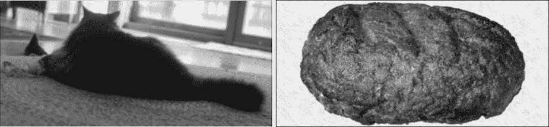

*图 14-1：原始托尼猫和肉饼*

你很可能会在机器智能的各个层面遇到统计学问题，所以我们将从回顾一些基本概念开始。

#### *贝叶斯*

英国牧师托马斯·贝叶斯（1701–1761）一定非常关心他的信徒能否进入天堂，因为他思考了很多关于概率的内容。特别是，贝叶斯对不同事件概率的结合方式很感兴趣。例如，如果你是一个掷双骰子的西洋跳棋玩家，你可能很清楚掷出一对六面骰子的概率分布。他是著名的*贝叶斯*定理的提出者。

他工作中与此相关的部分是所谓的*朴素贝叶斯分类器*。将我们的肉饼暂时留给猫一会儿，让我们尝试将垃圾邮件与非垃圾邮件区分开来。消息是由单词组成的。某些单词在垃圾邮件中更常见，基于这一点我们可以推断出，未包含这些单词的消息可能不是垃圾邮件。

我们将从收集一些简单的统计数据开始。假设我们有一个代表性的消息样本，其中 100 条是垃圾邮件，另外 100 条不是垃圾邮件。我们将这些消息分解成单词，并计算每个单词出现的消息数量。由于我们使用了 100 条消息，这就自动给出了百分比。部分结果显示在表 14-1 中。

**表 14-1：消息中的单词统计**

| **单词** | **垃圾邮件百分比** | **非垃圾邮件百分比** |
| --- | --- | --- |
| meatloaf | 80 | 0 |
| hamburger | 75 | 5 |
| catnip | 0 | 70 |
| onion | 68 | 0 |
| mousies | 1 | 67 |
| 这 | 99 | 98 |
| 和 | 97 | 99 |

你可以看到，一些词语在垃圾邮件和非垃圾邮件中都是常见的。让我们将这个表格应用到一个包含“hamburger 和 onion”的未知消息中：垃圾邮件的概率分别是 75、97 和 68，非垃圾邮件的概率是 5、97 和 0。这个消息是垃圾邮件的概率是多少，或者说它不是垃圾邮件的概率是多少？

贝叶斯定理告诉我们如何结合概率（*p*），其中*p*[0]是包含词语*meatloaf*的消息是垃圾邮件的概率，*p*[1]是包含词语*hamburger*的消息是垃圾邮件的概率，依此类推：

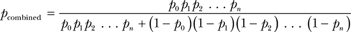

如图 14-2 所示，可以将其可视化。像表 14-1 中的事件和概率这样的数据被输入到分类器中，分类器给出这些事件描述我们想要的概率。

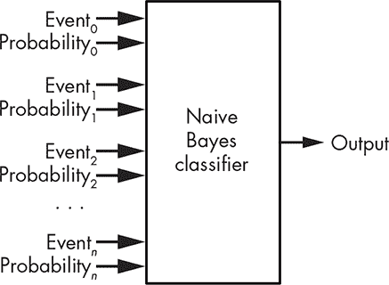

*图 14-2：朴素贝叶斯分类器*

我们可以构建一对分类器，一个用于垃圾邮件，另一个用于非垃圾邮件。将上述例子中的数字代入，得出的结果是该消息是垃圾邮件的概率为 99.64%，而不是垃圾邮件的概率为 0%。

你可以看到，这个技巧相当有效。统计学规则！当然，制作一个好的垃圾邮件过滤器需要很多其他技巧。例如，理解“naive”（朴素）的含义。这并不意味着贝叶斯不知道他在做什么，而是说，就像掷骰子一样，所有的事件是相互独立的。我们可以通过观察单词之间的关系来改进垃圾邮件过滤，例如，“and and”这个词组仅出现在布尔代数相关的消息中。许多垃圾邮件发送者试图通过在消息中加入大量“乱七八糟”的词汇来绕过过滤器，而这些内容通常语法上不正确。

#### *高斯*

德国数学家约翰·卡尔·弗里德里希·高斯（1777–1855）是另一位在统计学上重要的人物。你可以把*钟形曲线*、也叫做*正态分布*或*高斯分布*归咎于他。它的形状如图 14-3 所示。

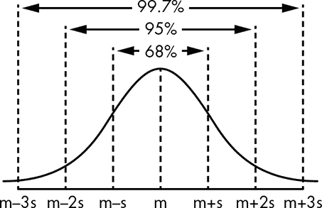

*图 14-3：钟形曲线*

钟形曲线之所以有趣，是因为观测现象的样本符合这条曲线。例如，如果我们在公园里测量篮球运动员的身高并确定平均身高μ，一些球员会更高，而一些则会更矮。（顺便说一下，μ发音为“mew”，这也使得它成为猫的首选希腊字母。）在这些球员中，68%的球员的身高会在一个*标准差*（σ）之内，95%的球员会在两个标准差之内，依此类推。更准确的说法是，随着样本数量的增加，身高分布会收敛到钟形曲线，因为单个球员的身高并不能告诉我们太多信息。经过精心抽样的来自明确人口的数据可以用于对更大人群做出假设。

虽然这些都很有趣，但钟形曲线还有很多其他应用，有些我们可以应用到我们的猫和肉饼问题中。美国漫画家伯纳德·克里班（1935–1990）教导我们，猫本质上是一个带耳朵和尾巴的肉饼。因此，如果我们能从照片中提取出耳朵、尾巴和肉饼等特征，就可以将它们输入到分类器中，由它来识别主题。

我们可以通过追踪物体的轮廓使其特征更加可识别。当然，除非我们能找到它们的边缘，否则无法做到这一点。这是困难的，因为猫和许多肉饼都是模糊的。尤其是猫，它们有许多独特的毛发，这些毛发本身就是边缘，但不是我们想要的边缘。虽然这看起来有些违反直觉，但我们的第一步是轻微模糊图像，以消除一些这些不需要的特征。模糊图像意味着应用一个低通滤波器，就像我们在第六章中看到的音频处理一样。图像中的细节属于“高频”部分。如果你想到细节变化越快，图像的扫描也会越快速，就会觉得这一点很直观。

让我们看看高斯能为我们做些什么。让我们取图 14-3 中的曲线，将其围绕μ旋转，形成一个三维版本，如图 14-4 所示。

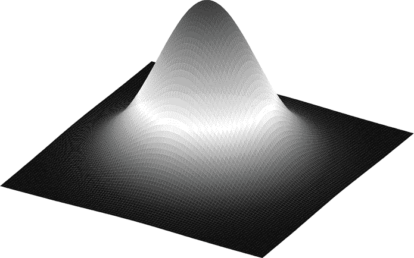

*图 14-4：三维高斯分布*

我们将沿着图像拖动这个操作，将μ依次定位在每个像素上。你可以想象，曲线的部分会覆盖到中心像素周围的其他像素。我们将通过将曲线下方像素的值与曲线的值相乘，然后将结果加起来，来为每个像素生成一个新值。这就是所谓的*高斯模糊*。你可以在图 14-5 中看到它的工作原理。中间的图像是左侧图像中方框内内容的放大复制。在右侧的图像中，你可以看到高斯模糊如何对中心图像的像素进行加权。

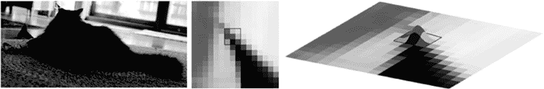

*图 14-5：高斯模糊*

将一个像素的值与其邻居的值结合的过程可能对你来说有点复杂，实际上它在数学上被称为*卷积*。这些权重数组被称为*核*或*卷积核*。让我们看一些例子。

图 14-6 展示了 3×3 和 5×5 的卷积核。请注意，所有的权重加起来总和为 1，以保持亮度。

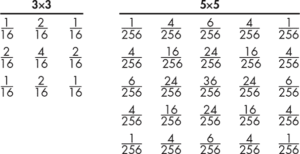

*图 14-6：高斯卷积核*

图 14-7 展示了左侧的原始图像。即使有许多空隙，你的眼睛仍然可以追踪到树干的轮廓。中间的图像展示了 3×3 卷积核的结果。虽然它更模糊，但边缘更容易辨认。右侧的图像展示了 5×5 卷积核的结果。

你可以将图像看作一个数学函数，形式为*亮度* = *f*(*x*, *y*)。这个函数的值是每个坐标位置的像素亮度。请注意，这是一个*离散*函数；*x*和*y*的值必须是整数。当然，它们必须在图像的边界内。类似地，你可以将卷积核看作一个小图像，其值为*权重* = *g*(*x*, *y*)。因此，执行卷积的过程包括遍历被卷积核覆盖的相邻像素，将像素值与权重相乘，然后将它们加起来。

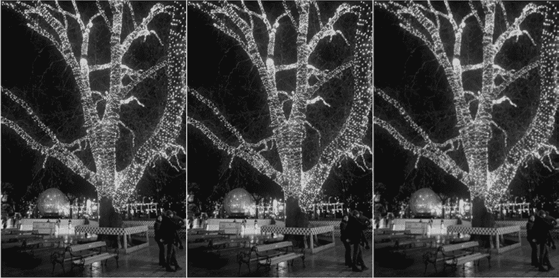

*图 14-7：高斯模糊示例*

图 14-8 展示了使用 5×5 高斯核模糊处理的原始图像。

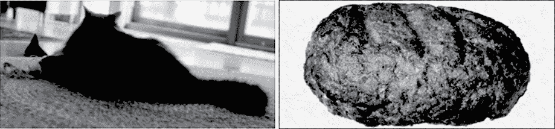

*图 14-8：模糊的猫和肉饼*

请注意，由于卷积核大于 1 个像素，它们会超出图像的边缘。处理这种情况有很多方法，例如避免过于接近边缘（使结果变小）以及通过在图像周围绘制边框来增大图像大小。

#### *Sobel*

在图 14-1 中有很多信息，对于我们识别主题并不是特别必要，比如颜色。例如，在他的书《理解漫画：隐形的艺术》(Tundra)中，Scott McCloud 展示了我们可以仅通过一个圆形、两个点和一条线来识别一张脸；其余的细节都是不必要的，可以忽略。因此，我们将简化我们的图像。

现在，让我们尝试寻找边缘，既然我们已经通过模糊使它们更容易看到。对于*边缘*有很多定义。我们的眼睛对亮度变化最为敏感，因此我们将使用这个定义。亮度的变化就是一个像素与其邻近像素之间的亮度差异。

微积分的一半内容就是关于变化的，所以我们可以在这里应用它。一个函数的*导数*就是由该函数生成的曲线的斜率。如果我们想要得到一个像素到下一个像素的亮度变化，那么公式就是*brightness* = *f*(*x* + 1, *y*) – *f*(*x*, *y*)。

看看图 14-9 中的水平像素行。亮度水平绘制在下面，下面是亮度变化的图示。你可以看到它看起来是尖锐的。这是因为它只有在变化时才有非零值。

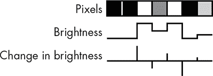

*图 14-9：边缘是亮度的变化*

通过这种方式测量亮度变化有一个问题——变化发生在像素之间的空隙中。我们希望变化发生在像素的中间。让我们看看高斯是否能帮助我们解决这个问题。当我们进行模糊处理时，我们将μ集中在一个像素上。我们将采用相同的方法，但不是使用钟形曲线，而是使用它的第一次导数，如图 14-10 所示，该图绘制了图 14-3 中曲线的斜率。

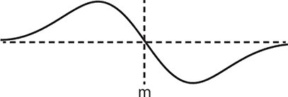

*图 14-10：来自图 14-3 的高斯曲线斜率*

如果我们将曲线的正峰和负峰分别标记为+1 和–1，并将它们集中在相邻的像素上，那么一个像素的亮度变化可以表示为Δbrightness[*n*] = 1 × pixel[*n* – 1] – 1 × pixel[*n* + 1]。你可以在图 14-11 中看到这一变化。

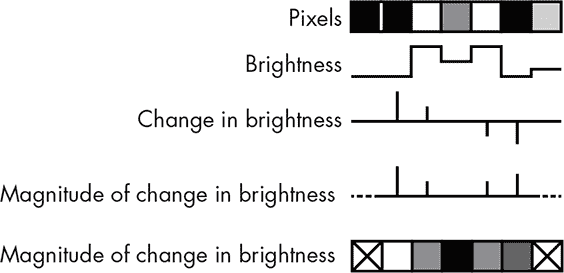

*图 14-11：以像素为中心的亮度变化*

当然，这和上一节中看到的图像边缘问题一样，所以我们没有端点像素的值。目前，我们不关心变化的方向，只关心变化的量，因此我们通过取绝对值来计算*大小*。

通过这种方式检测边缘效果很好，但很多人尝试对其进行改进。一个成功的方法是*Sobel 算子*，它由美国科学家 Irwin Sobel 与 Gary Feldman 在 1968 年的一篇论文中提出。

类似于我们使用高斯模糊卷积核时所做的，我们利用高斯曲线的斜率值生成了一个 Sobel 边缘检测卷积核。我们在图 14-10 中看到了二维版本，而图 14-12 展示了三维版本。

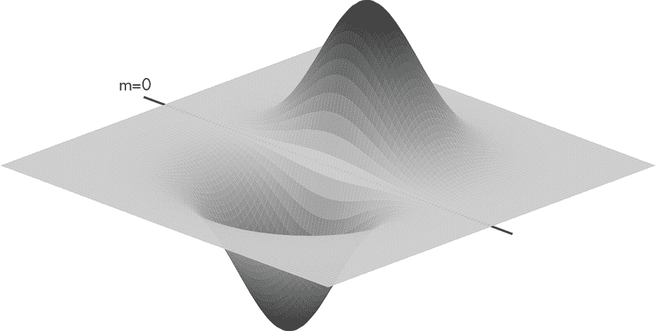

*图 14-12：来自图 14-10 的高斯曲线的三维斜率*

由于这在两个轴上并不对称，Sobel 使用了两个版本——一个用于水平方向，另一个用于垂直方向。图 14-13 展示了这两个卷积核。

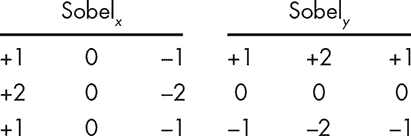

*图 14-13：Sobel 卷积核*

应用这些卷积核会为每个像素产生一对*梯度*，G*[x]* 和 G*[y]*；你可以将梯度视为斜率。由于我们在每个笛卡尔方向上都有一个梯度，我们可以利用三角学将其转换为极坐标，从而得到*大小 G*和*方向*θ，如图 14-14 所示。

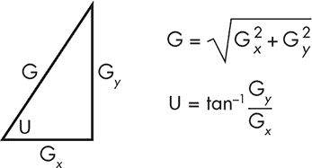

*图 14-14：梯度的大小和方向*

梯度的大小告诉我们边缘的“强度”，而方向则告诉我们其方向。请记住，方向是垂直于物体的；水平边缘的梯度是垂直方向的。

你可能已经注意到，大小和方向的计算实际上只是我们在第十一章中看到的从笛卡尔坐标到极坐标的转换。坐标系的变化是一种便捷的技巧。在这种情况下，一旦我们进入极坐标，我们就不必担心分母为零或分母很小时出现的巨大数值问题。大多数数学库都有一种形式为`atan2(y, x)`的函数，它可以计算反正切而无需进行除法运算。

图 14-15 展示了两幅图像的梯度大小。

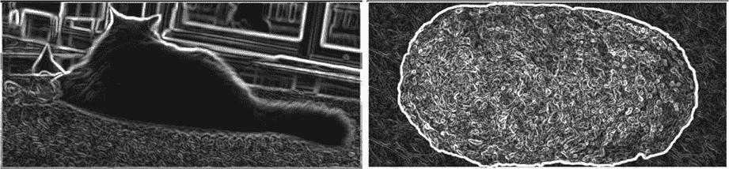

*图 14-15：模糊的猫和肉饼的 Sobel 梯度大小*

方向上还有一个额外的问题，那就是它包含了比我们能使用的更多的信息。请看图 14-16。


*图 14-16：像素邻居*

正如你所看到的，由于一个像素只有八个邻居，实际上只有四个方向是我们关心的。图 14-17 展示了方向是如何被量化为四个“箱子”的。


*图 14-17：梯度方向箱子*

图 14-18 展示了模糊图像的 Sobel 方向。你可以看到方向和大小之间的对应关系。第一行是水平方向的箱子，接下来是上对角线方向箱子、垂直方向箱子，以及下对角线方向箱子。

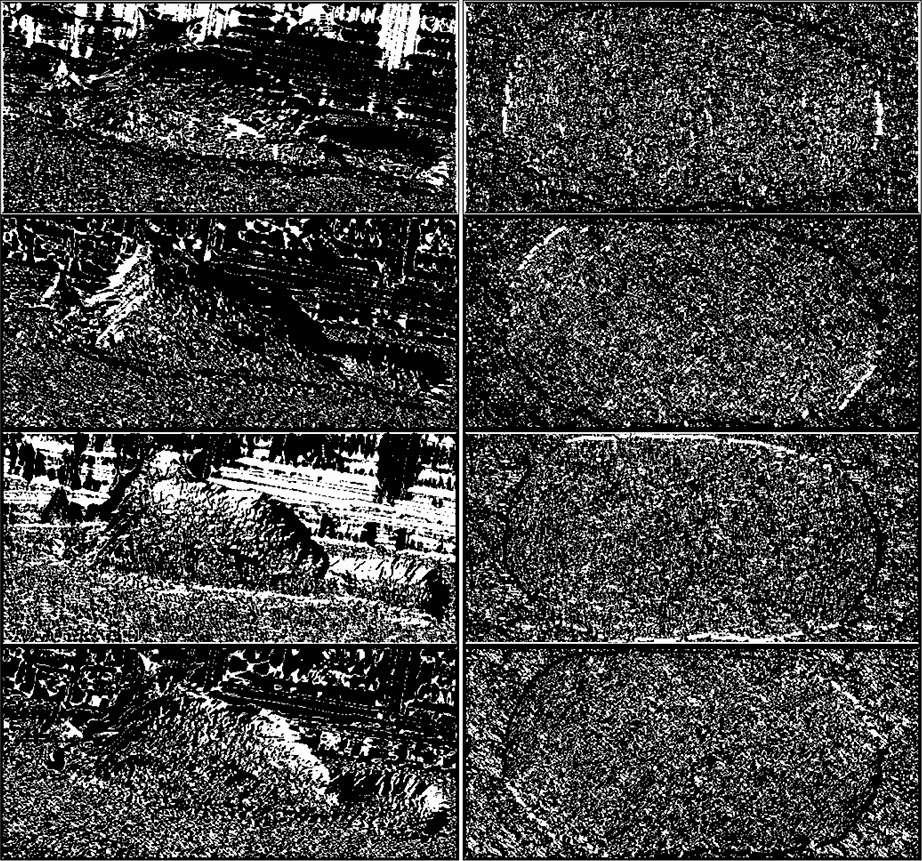

*图 14-18：模糊的猫和肉饼的 Sobel 方向*

正如你所看到的，Sobel 算子能找到边缘，但这些边缘并不完美。它们很粗，这可能会让人误将它们当作物体的特征。细边缘可以消除这个问题，而且我们可以利用 Sobel 方向来帮助找到它们。

#### *凯尼*

澳大利亚计算机科学家约翰·凯尼（John Canny）在 1986 年通过在 Sobel 结果中增加一些额外的步骤，改进了边缘检测。第一个步骤是*非最大值抑制*。回顾图 14-15，你可以看到一些边缘很粗且模糊；如果边缘更细，稍后我们将更容易提取图像中的特征。非最大值抑制是一种*边缘细化*技术。

这是计划。我们将每个像素的梯度大小与其邻居在梯度方向上的梯度大小进行比较。如果它的梯度大小大于邻居的，就保留该值；否则，将其设为 0，从而抑制该值（见图 14-19）。


*图 14-19：非最大值抑制*

你可以在图 14-19 中看到，左侧的中心像素被保留，因为它的梯度大小大于邻居（即，它比较亮），而右侧的中心像素则被抑制，因为它的邻居具有更大的梯度大小。

图 14-20 展示了非最大值抑制如何细化由 Sobel 算子产生的边缘。

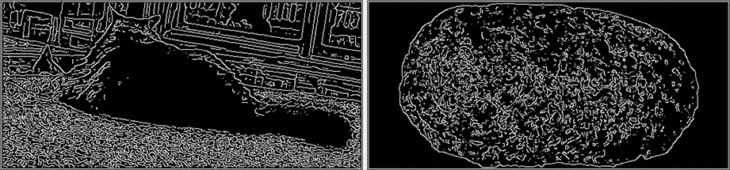

*图 14-20：非最大值抑制猫和肉饼结果*

这看起来相当不错，尽管这也为避免肉饼提供了有力的理由。非最大值抑制发现了图像中的很多边缘。如果你回头看看图 14-15，你会看到这些边缘中的许多具有较低的梯度大小。凯尼处理的最后一步是*使用滞后效应的边缘追踪*，它去除了“弱边缘”，只留下了“强边缘”。

在第二章中，你学过滞后效应涉及与一对阈值的比较。我们将扫描非最大值抑制结果，寻找梯度大小大于高阈值的边缘像素（见图 14-20 中的白色像素）。当我们找到一个时，将其标记为最终的边缘像素。然后，我们会检查它的邻居。任何梯度大小大于低阈值的邻居，也将被标记为最终的边缘像素。我们会使用递归沿着这些路径进行追踪，直到遇到梯度大小小于低阈值的地方。你可以把它想象成从一个明显的边缘开始，并追踪它的连接，直到它们逐渐消失。你可以在图 14-21 中看到结果。强边缘是白色的，被拒绝的弱边缘是灰色的。

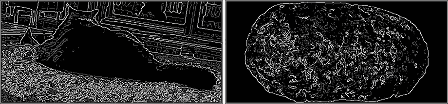

*图 14-21：使用滞后效应的边缘追踪*

你可以看到，许多非最大值抑制后的边缘消失了，物体边缘变得更明显。

有一个非常棒的计算机视觉开源库，叫做*OpenCV*，你可以使用它来进行各种图像处理，包括我们在本章中讨论的内容。

#### *特征提取*

下一步对人类来说很容易，但对计算机却很困难。我们希望从图 14-21 中的图像提取特征。我不会详细讲解特征提取，因为它涉及很多你可能还没接触过的数学，但我们会触及一些基础内容。

有大量的特征提取算法。有些像*霍夫变换*，适合提取几何形状，如直线和圆形。对于我们的问题，这不是很有用，因为我们并不寻找几何形状。我们来做一些简单的事。我们将扫描图像中的边缘，并沿着它们提取物体。如果我们发现交叉的边缘，将选择最短路径。

这给了我们斑点、耳朵、猫玩具和曲线，正如图 14-22 所示。这里只展示了一个代表性的样本。

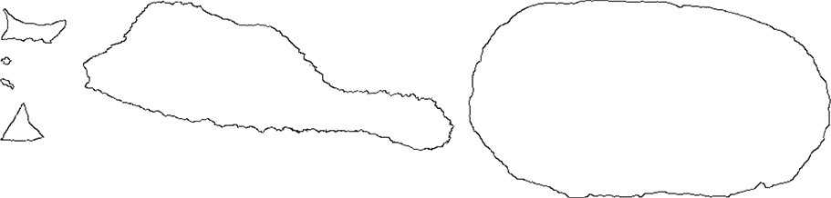

*图 14-22：提取的特征*

现在我们拥有了这些特征，我们可以做和之前的垃圾邮件检测示例相同的事情：将它们输入到分类器中（如图 14-23 所示）。分类器输入中标记为+表示该特征有可能指示我们期望的结果，而-表示它是相反的，0 则表示它没有任何贡献。

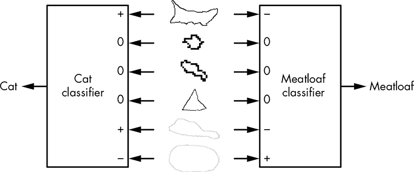

*图 14-23：特征分类*

请注意，我们的图像中有些信息可以用来改进简单的分类，比如猫玩具。它们通常出现在猫附近，但很少与肉饼有关。

这个示例除了展示特征分类的步骤外，几乎没有其他用途，这些步骤总结在图 14-24 中。

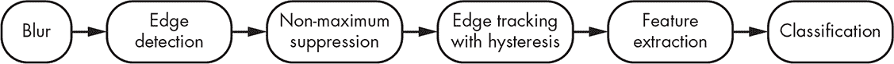

*图 14-24：图像识别管道*

尽管肉饼大多数时间都静止不动，猫却四处奔走，并且有各种各样可爱的姿势。我们的示例只适用于样本图像中的物体；它不会将图 11-44 中的图像（见第 323 页）识别为猫。而且由于上下文问题，它几乎不可能识别图 14-25 中的猫*就是*肉饼。

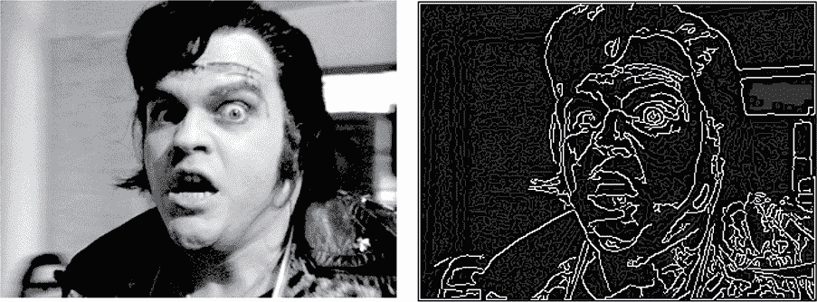

*图 14-25：猫还是肉饼？*

#### *神经网络*

在某个层面上，使用什么数据来表示物体并不重要。我们需要能够处理世界上大量的变化。就像人类一样，计算机不能改变输入。我们需要更好的分类器来处理这些变化。

人工智能中的一种方法是模仿人类行为。我们相当确定*神经元*在其中起着重要作用。人类大约有 860 亿个神经元，尽管它们并不全在“大脑”中——神经细胞也是神经元，这可能就是为什么有些人会用直觉来思考。

你可以把神经元想象成第二章中的逻辑门和第六章中的模拟比较器的结合体。神经元的简化图示见图 14-26。

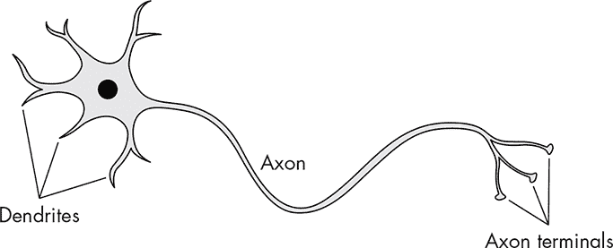

*图 14-26：神经元*

*树突*是输入，而*轴突*是输出。*轴突末端*只是轴突与其他神经元的连接；神经元只有一个输出。神经元不同于像与门（AND gate）这样的逻辑门，因为并非所有输入都会被同等对待。请查看图 14-27。

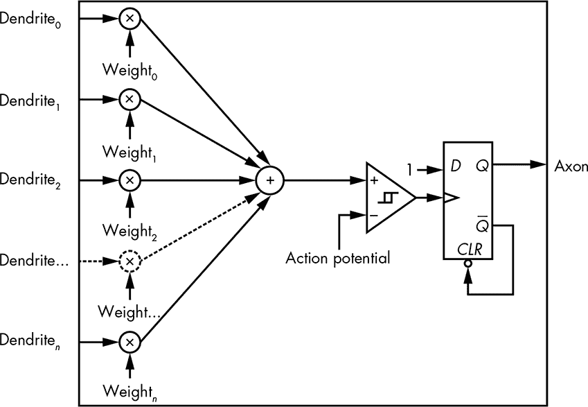

*图 14-27：神经元的简化门模型*

每个树突输入的值都会乘以某个*权重*，然后所有加权后的值会被加在一起。这类似于贝叶斯分类器。如果这些值小于*动作电位*，比较器输出为`false`；否则，输出为`true`，使得神经元通过将触发器输出设置为`true`来*激活*。轴突输出是一个*脉冲*；一旦它变为`true`，触发器会被重置并回到`false`。或者，如果你是从宫崎老师那里学的神经科学：轴开，轴关。神经科学家可能会对比较器具有滞后的表现提出异议；真实的神经元确实有，但它是时间依赖的，而这个模型并没有考虑这一点。

神经元像逻辑门一样，它们是“简单”的，但可以连接在一起形成复杂的“电路”，即*神经网络*。从神经元中可以得出的关键结论是，它们基于加权输入触发。多个输入组合可以导致神经元激活。

第一个人工神经元的尝试是由美国心理学家弗兰克·罗森布拉特（1928–1971）发明的*感知机*。在图 14-28 中展示了一个示意图。感知机的一个重要方面是其输入和输出是二进制的；它们只能取`0`或`1`的值。权重和阈值是实数。

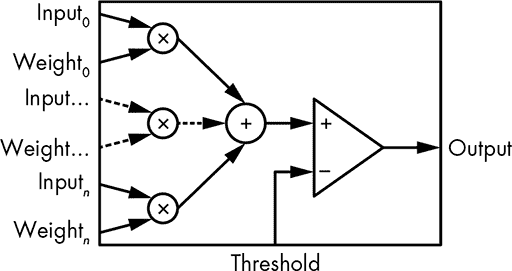

*图 14-28：感知机*

感知机在人工智能领域引起了极大的关注。但随后人们发现它们无法解决某些问题类别。这一发现，加上其他因素，导致了所谓的“人工智能冬天”，期间资金支持枯竭。

事实证明，问题出在感知机的使用方式上。它们被组织成一个单一的“层”，如图 14-29 所示，其中每个圆圈都是一个感知机。

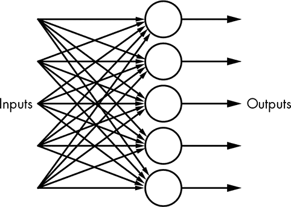

*图 14-29：单层神经网络*

输入可以传递给多个感知器，每个感知器做出一个决策并产生一个输出。感知器的许多问题通过多层神经网络的发明得到了解决，如图 14-30 所示。

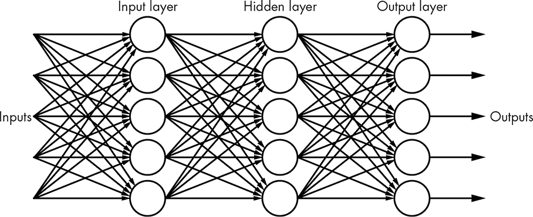

*图 14-30：多层神经网络*

这也被称为*前馈网络*，因为每一层的输出会传递到下一层。可以有任意数量的*隐藏层*，之所以这样命名是因为它们既不与输入层相连，也不与输出层相连。虽然图 14-30 显示了每层相同数量的神经元，但这并不是必要条件。确定特定问题所需的层数和每层神经元数量是一门黑科技，超出了本书的讨论范围。像这样的神经网络比简单的分类器要强大得多。

神经科学家目前还不知道树突的权重是如何确定的。计算机科学家必须想出一种方法，否则人工神经元将毫无用处。感知器的数字化特性使得这一点变得困难，因为权重的微小变化不会导致输出的比例性变化；它是一个全或无的问题。另一种神经元设计，*sigmoid 神经元*，通过用一个*sigmoid 函数*替换感知器比较器来解决这个问题，sigmoid 函数其实只是一个 S 形曲线的函数。 图 14-31 展示了感知器的传输函数和 sigmoid 函数。看起来很像我们在第二章中讨论的模拟与数字的区别，对吧？

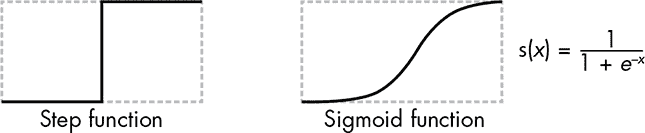

*图 14-31：人工神经元传输函数*

图 14-32 展示了一个 sigmoid 神经元的内部结构。

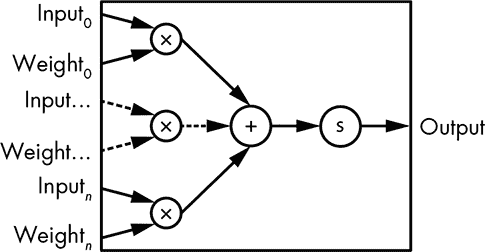

*图 14-32：Sigmoid 神经元*

这里一个不太显眼的地方是，sigmoid 神经元的输入和输出是“模拟”的浮动点数。为了准确起见，sigmoid 神经元中还有一个偏置，但它对我们这里的理解并不是必需的。

基于 sigmoid 神经元构建的神经网络的权重可以通过一种叫做*反向传播*的技术来确定，这项技术曾多次被遗忘并重新发现，最近一次是在 1986 年由 David Rumelhart（1942–2011）、Geoffrey Hinton 和 Roland Williams 的论文中提出。反向传播涉及大量的线性代数，因此我们将略过具体细节。你可能已经学会了如何解代数中的联立方程；当方程和变量的数量都很大时，线性代数就会派上用场。

反向传播的基本思想是，我们提供一些已知的输入，例如猫的特征。然后检查输出，如果我们知道这些输入代表猫，我们希望输出是`1`或者非常接近它。接下来，我们可以计算一个*误差函数*，即实际输出减去期望输出。然后调整权重，以使误差函数值尽可能接近`0`。

这通常通过一种叫做*梯度下降法*的算法来完成，如果你不喜欢数学的话，它就像但丁的地狱之旅。让我们通过一个简单的例子来理解它。记住，“梯度”只是“斜率”的另一种说法。我们将尝试不同的权重值，并绘制误差函数的值。它可能看起来像图 14-33，类似于那种展示山脉、山谷等的地形图。

梯度下降法所涉及的只是将一个球在地图上滚动，直到它落入最深的山谷。那就是误差函数值最小的地方。我们将权重设置为代表球的位置的值。这个算法之所以有个 fancy 名字，是因为我们在处理非常多的权重，而不仅仅是我们示例中的两个。当权重存在于多个层时，情况变得更加复杂，就像我们在图 14-30 中看到的那样。


*图 14-33: 梯度拓扑*

你可能注意到了在图 14-27 中看到的输出脉冲机制神秘消失的现象。到目前为止，我们看到的神经网络本质上是组合逻辑，而非顺序逻辑，并且实际上是有向无环图（DAG）。有一种顺序逻辑的变种叫做*递归神经网络*。它不是一个 DAG，这意味着层中的神经元的输出可以连接回早期层中神经元的输入。存储输出并对整个过程进行时钟控制是防止它崩溃的关键。这种类型的网络在处理输入序列时表现良好，比如手写和语音识别中所遇到的输入。

还有一种特别适合图像处理的神经网络变种：*卷积神经网络*。你可以将它想象成输入是一个像我们之前看到的卷积核一样的像素值数组。

神经网络的一个大问题是，它们可能会受到糟糕训练数据的“污染”。我们无法知道看了太多电视的孩子在成年后会表现出什么不寻常的行为，机器学习系统也是如此。未来可能需要机器心理治疗师，尽管很难想象坐在机器旁边，跟它说，“那么，告诉我你对猫咪的图片究竟是怎么想的。”

神经网络的关键在于，它们是非常有能力的分类器。它们可以被训练将大量输入数据转换为更少的输出，以我们期望的方式描述这些输入。复杂一些的说法是，这叫做*降维*。现在我们需要搞清楚如何利用这些信息。

#### *使用机器学习数据*

我们如何利用分类器的输出构建一个像自动驾驶的番茄酱瓶这样的物体？我们将使用图 14-34 中展示的测试场景。我们将把番茄酱瓶按棋盘上的国王方式，一次移动一个方格，目标是击中肉饼，同时避开猫。

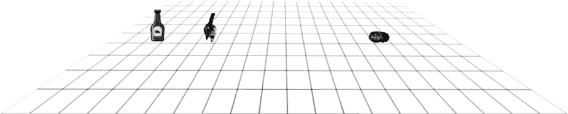

*图 14-34：测试场景*

在这个“教科书示例”中，分类器给出了猫和肉饼的位置。由于两点之间的最短距离是一条直线，而且我们是在整数网格上，最有效的到达肉饼的方式是使用“直线”中的布雷森汉姆直线算法，第 292 页。当然，它必须按照图 14-35 所示进行修改，因为猫和调味品不太搭配。

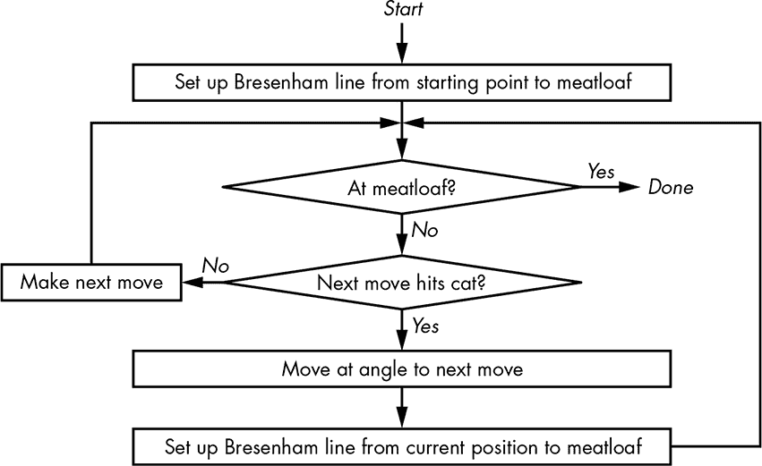

*图 14-35：自动化番茄酱瓶算法*

如你所见，这很简单。我们直奔肉饼，如果猫挡道，我们就绕开它，继续朝肉饼前进。当然，在现实世界中，这会变得更加复杂，因为猫可以移动，而且可能还会有其他障碍物。

现在让我们来看一下另一个机器智能的子领域，看看如何以不同的方式解决这个问题。

### 人工智能

早期的人工智能成果，如学习下跳棋和解决各种逻辑问题，令人兴奋并且获得了大量资金支持。不幸的是，这些早期的成功并未扩展到更困难的问题，资金也因此枯竭。

1956 年达特茅斯研讨会的与会者之一是美国科学家约翰·麦卡锡（John McCarthy，1927–2011），他在麻省理工学院设计了 LISP 编程语言。这种语言广泛用于早期的人工智能工作，LISP 正式代表*列表处理器*（List Processor），但任何熟悉该语言语法的人都会知道它也被称为*大量无聊的括号*。

LISP 为高级编程语言引入了几个新概念。当然，在 1958 年那时这并不困难，因为当时只有另一种高级语言（FORTRAN）。特别地，LISP 包括了单链表（见第七章）作为一种数据类型，并且程序是由指令的列表构成。这意味着程序可以修改自身，这是与机器学习系统的一个重要区别。神经网络可以调整权重，但不能改变其算法。由于 LISP 可以生成代码，它可以修改或创建新的算法。虽然不如干净，但 JavaScript 也支持*自修改代码*，尽管在网页这一约束最小的环境中这样做是很危险的。

早期的人工智能系统很快就受限于当时可用的硬件技术。那时最常用于研究的机器之一是 DEC PDP-10，其地址空间最初仅限于 256K 36 位字，后来扩展到 4M。但这不足以运行本章中的机器学习示例。美国程序员理查德·格林布拉特和计算机工程师汤姆·奈特在 1970 年代初期开始在麻省理工学院开发*Lisp 机器*，这是一种优化运行 LISP 的计算机。然而，即使在它们的鼎盛时期，也只制造了几千台这样的机器，可能是因为通用计算机的发展速度更快。

人工智能在 1980 年代重新崛起，随着*专家系统*的出现。这些系统通过提问和引导用户（如医疗专业人员）浏览知识数据库来提供帮助。这对你来说应该很熟悉；它是我们在第十章中“猜动物”游戏的一个实际应用。不幸的是，专家系统似乎已经发展成了令人讨厌的电话菜单。

我们将使用*遗传算法*来解决自动驾驶番茄酱瓶的问题，这是一种模仿进化过程的技术（见图 14-36）。

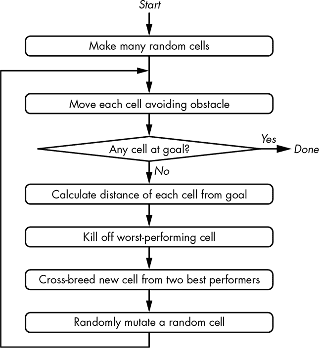

*图 14-36：遗传算法*

我们随机创建一组具有位置和运动方向的汽车*单元*。每个单元移动一步，然后计算一个“好坏”评分，在这种情况下使用距离公式。我们繁殖两个表现最好的单元来创建一个新单元，然后淘汰表现最差的单元。由于这是进化过程，我们还随机突变其中一个单元。我们不断地执行这些步骤，直到某个单元到达目标。单元到达目标所走的步骤就是生成的程序。

让我们看看用 20 个单元运行算法的结果。我们运气不错，在仅仅 36 次迭代中就找到了图 14-37 中显示的解决方案。

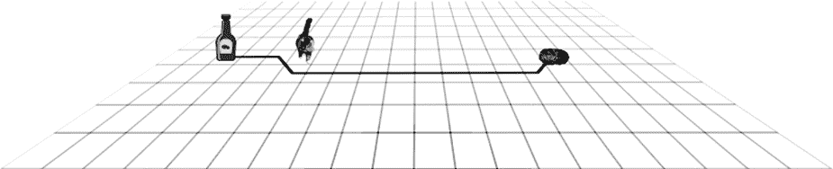

*图 14-37：良好的遗传算法结果*

我们的算法在清单 14-1 中创建了这个简单的程序来完成目标。重要的点是，这个程序不是由程序员编写的；是我们的 AI 为我们做的。变量`x`和`y`是番茄酱瓶的位置。

```
x++;

x++;

x++; y++;

x++;

x++;

x++;

x++;

x++;

x++;

x++;

x++;

x++;

x++; y--;
```

*清单 14-1: 生成的代码*

当然，作为基因学，它是随机的，并不总是那么干净利落。程序的另一次运行花费了 82 次迭代才找到图 14-38 中的解决方案。这或许可以为“智能设计”辩护。

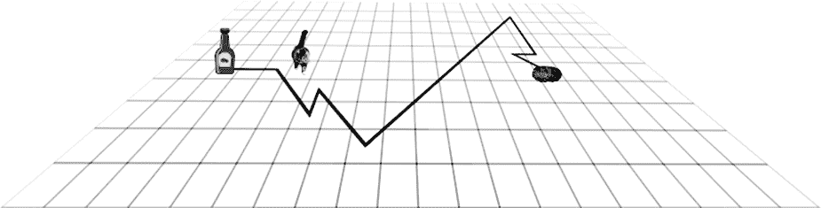

*图 14-38: 奇怪的遗传算法结果*

你可以看到，AI 程序可以生成令人惊讶的结果。但它们与孩子们在探索世界时得出的结果并没有太大不同；只不过现在人们关注得更多了。事实上，许多让一些人感到惊讶的 AI 结果早在很久之前就已经被预测过了。例如，当一家公司的 AI 系统创造了自己的私人语言相互交流时，媒体报道了大量内容。对于任何看过 1970 年科幻电影*《巨像：福尔宾计划》*的人来说，这个想法并不新鲜。

### 大数据

如果从目前的例子中还不明显的话，我们正在处理大量的数据。一台高清（1920×1080）摄像机每秒钟产生大约三分之一 GB 的数据。大型强子对撞机每秒钟产生大约 25 GiB 的数据。估计网络连接的设备每秒钟产生大约 50 GiB 的数据，而 25 年前大约只有 1 MiB/秒。大部分信息是垃圾；挑战在于如何挖掘出有用的部分。

大数据是一个动态的目标；它指的是那些过于庞大和复杂，无法使用当时技术的蛮力方式处理的数据。25 年前产生的数据使用当前技术处理是相当简单的，但当时并非如此。数据收集往往总是超过数据分析的能力，因此需要聪明的办法。

*大数据*一词不仅指分析，还包括数据的收集、存储和管理。就我们而言，我们关心的是分析部分。

很多收集到的数据都是个人性质的。与陌生人分享你的银行账户信息或病史并不是一个好主意。而且，为一个目的收集的数据往往被用于另一个目的。例如，纳粹曾利用人口普查数据识别并定位犹太人进行迫害，美国的人口普查数据也曾被用于定位并关押日裔美国人，尽管法律中有一项条款规定，这些数据中的个人身份信息应保密 75 年。

许多数据以“匿名化”形式发布用于研究，这意味着任何个人身份信息都已被移除。但事情并不像看起来那么简单。大数据技术通常能够从匿名化数据中重新识别出个人。而许多旨在使重新识别变得困难的政策，实际上反而使它变得更容易。

在美国，社会安全号码（SSN）常常被误用为个人身份标识符。它从未设计用于这个用途。事实上，社会安全卡上写有“非身份识别用途”的字样，这是原始法律的一部分——这部分法律很少被执行，并且现在有许多例外。

社会安全号码（SSN）有三个字段：一个三位数的区域编号（AN），一个两位数的组编号（GN），以及一个四位数的序列号（SN）。区域编号是根据申请表中邮寄地址的邮政编码分配的。组编号按照一个定义的、但不是连续的顺序分配。序列号是按顺序分配的。

一组卡内基梅隆大学的研究人员在 2009 年发表了一篇论文，展示了一种成功猜测 SSN 的方法。有两个因素使得这变得容易。首先是死亡主文件的存在。（那是“死亡” “主文件”，而不是“死亡主” “文件”）它是一个由社会保障局提供的已故人员名单，名义上是为了防止欺诈。它方便地包含了姓名、出生日期、死亡日期、社会安全号码（SSN）和邮政编码。死者名单怎么帮助我们猜测活人的 SSN 呢？

其实，这并不是唯一的数据来源。选民登记名单也包括出生数据，许多在线个人资料也是如此。

对死亡主文件中区域编号（AN）和邮政编码进行统计分析，可以将区域编号与地理区域关联。组编号和序列号的分配规则很简单。因此，死亡主文件中的信息可以用来将区域编号与邮政编码关联。单独获得的出生数据也可以与邮政编码关联。这两个信息来源可以交替使用，按出生日期排序。死亡主文件中的任何 SSN 序列的空白都代表一个活着的人，他们的 SSN 介于前后死亡主文件条目之间。一个例子见于表 14-2。

**表 14-2：** 合并来自邮政编码 89044 的数据

| **死亡主文件** | **猜测的社会安全号码（SSN）** | **出生记录** |
| --- | --- | --- |
| **姓名** | **出生日期（DOB）** | **社会安全号码（SSN）** |  | **出生日期（DOB）** | **姓名** |
| --- | --- | --- | --- | --- | --- |
| John Many Jars | 1984-01-10 | 051-51-1234 |  |  |  |
| John Fish | 1984-02-01 | 051-51-1235 |  |  |  |
| John Two Horns | 1984-02-12 | 051-51-1236 |  |  |  |
|  |  |  | 051-51-1237 | 1984-02-14 | Jon Steinhart |
| John Worfin | 1984-02-20 | 051-51-1238 |  |  |  |
| John Bigboote | 1984-03-15 | 051-51-1239 |  |  |  |
| John Ya Ya | 1984-04-19 | 051-51-1240 |  |  |  |
|  |  |  | 051-51-1241 | 1984-04-20 | John Gilmore |
| John Fledgling | 1984-05-21 | 051-51-1242 |  |  |  |
|  |  |  | 051-51-1243 | 1984-05-22 | John Perry Barlow |
| John Grim | 1984-06-02 | 051-51-1244 |  |  |  |
| John Littlejohn | 1984-06-03 | 051-51-1245 |  |  |  |
| John Chief Crier | 1984-06-12 | 051-51-1246 |  |  |  |
|  |  |  | 051-51-1247 | 1984-07-05 | John Jacob Jingleheimer Schmidt |
| John Small Berries | 1984-08-03 | 051-51-1250 |  |  |  |

当然，这个例子并不像看起来这么简单，但也没有比这更难。例如，只有当死亡主数据中出现间隙时，我们才能知道 SSN SN 的范围，像约翰·首席报信人（John Chief Crier）和约翰·小浆果（John Small Berries）之间的间隙一样。许多组织通常会要求你提供 SSN 的最后四位数字作为身份验证。如你从示例中看到的，这些是最难猜到的数字，所以不要轻易提供这些信息。要求使用其他身份验证方式。

这里有另一个例子。麻省集团保险委员会（GIC）发布了匿名化的医院数据，目的是改善医疗保健和控制成本。麻省州长威廉·威尔德向公众保证，患者的隐私得到了保护。你可能已经能猜到接下来会发生什么了，教训就是他应该保持沉默。

威尔德州长在 1996 年 5 月 18 日的一个仪式上倒下，并被送往医院。麻省理工学院的研究生拉塔尼亚·斯威尼（Latanya Sweeney）知道州长住在剑桥市，于是她花了 20 美元购买了该市的完整选民名单。她将 GIC 数据与选民数据结合，就像我们在表 14-2 中做的一样，并轻松地将州长的数据去匿名化。她将他的健康记录，包括处方和诊断，发送到了他的办公室。

尽管这是一个相对简单的案例，因为州长是公众人物，但你的手机可能拥有比 1996 年斯威尼使用的计算能力更多的计算资源。如今的计算资源使得处理更复杂的案例成为可能。

### 总结

我们在本章中讨论了很多非常复杂的内容。你了解到机器学习、大数据和人工智能是相互关联的。你还了解到，如果你想从事这个领域，你将面临更多的数学课程。制作本章时，没有任何猫受到伤害。
