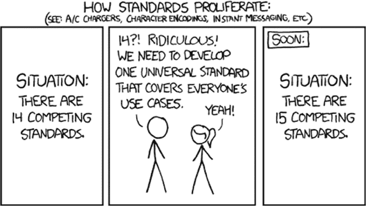
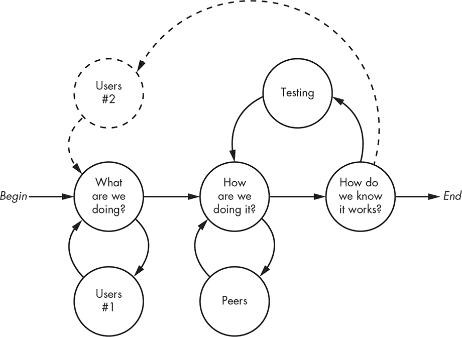
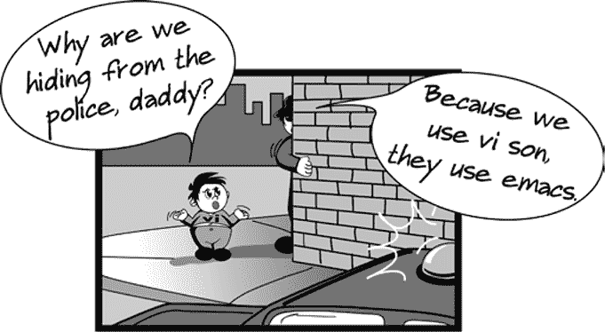

# 第十五章：**现实世界的考量**


由于本书旨在作为学习编程者的伴侣，你此时应该对软件有所了解，也对其运行所需的硬件有所认识。你可能认为自己已经准备好成为一名程序员。但编程不仅仅是了解硬件和编写代码。你如何知道该写什么代码，又如何编写它？你如何知道它是否有效？

这些并不是你面临的唯一重要问题。别人能理解如何使用你的代码吗？别人能多容易地添加功能或发现并修复错误？让你的代码在其他硬件上运行有多难，而这些硬件并不是最初编写代码时所用的硬件？

本章涵盖了与软件创建相关的各种主题。虽然你可以一个人完成小项目，坐在昏暗的房间里，吃着足够的垃圾食品，但大多数项目是团队合作，涉及与人打交道。这比你想象的要难——我们所称之为人的硬件/软件系统，比起最可怕的物联网怪物更容易出问题。而且，文档别指望了；即使你能找到，它也会是过时的。

这就是为什么本章还涵盖了作为程序员的一些哲学和实践问题。没错，这就是那个老顽固试图传递一些辛苦得来的智慧的地方。

### 价值主张

在进行项目时，有一个总体性的问题你应该时刻牢记：“我在增加价值吗？”我这里说的不是完成某项任务的内在价值；而是说提升生产力的价值。

如果你是为了谋生而编程，你需要达成雇主设定的目标。当然，达成这些目标的方式不止一种。你可以只是做你需要做的事情以应付过去。或者，你可以多花点心思考虑一些管理层可能没想到的事情。例如，你可能意识到你的代码在另一个项目中也能派上用场，于是你会将其结构化，便于重用。或者，你可能会察觉到你被要求实现某个更一般问题的一个特例，而你选择解决那个更一般的问题，为未来的增强奠定基础。当然，你应该和管理层讨论这些，以免他们感到意外。

你可以通过确保自己精通多种技术来为自己增值。副项目是获得经验的常见方式；它等同于做作业，但更有趣。

人们尝试增加价值的经典方式之一是创建工具。这比看起来更棘手，因为有时候，为自己增加的价值可能会减少他人的价值。人们常常创造新工具，是因为他们认为现有工具缺少某些他们需要的功能。一个很好的例子是`make`工具（由 Stuart Feldman 于 1976 年在贝尔实验室发明），它用于构建大型软件包。随着时间的推移，需要新功能。有些功能被添加到了`make`中，但在许多其他情况下，人们创造了出于好意但不兼容的新工具，执行类似的功能。（例如，我曾为一家公司提供咨询服务，他们自己写了一个工具，仅仅因为他们没有完全阅读`make`的文档，没意识到`make`已经能完成他们需要的工作。）现在有了`make`、`cmake`、`dmake`、`imake`、pick-a-letter-`make`等多个程序，它们都以不兼容的方式做着类似的事情。结果是，像你这样的从业者需要学习每个类别中的多个工具。这让每个人的工作变得更难，而不是更容易。它没有增加价值，反而减少了。图 15-1 很好地总结了这一情况。



*图 15-1：没有增加价值（图源：Randall Munroe，* xkcd.com*)*

给别人制造负担并不会增加价值。经验丰富的程序员知道，以他们个人偏好的方式去做已经有人做过的事情，通常不会增加价值。相反，这往往显示出程序员的成熟度不足。在可能的情况下，改进现有工具，因为更多的人将能够使用这一成果。把创造新工具留给真正需要的地方。确保你完全理解现有工具，因为它们可能比你最初认为的更强大。

破坏你发布代码的生态系统并不会增加价值。许多开发者表现得就像是刻板印象中的美国人到另一个国家度假，或者更确切地说，像我岳父来访一样——“我刚到你们这里，所以按照我的方式做”的态度。

例如，UNIX 系统有一个命令，用于显示程序的手册页。你可以输入`man foo`，它会显示`foo`命令的页面。还有一个约定，真正复杂的命令，比如`yacc`，不仅有手册页，还有一份更长、更深入的文档，详细描述该程序。当 GNU 项目（我稍后会讨论）向 UNIX 添加命令时，使用了自己的`texinfo`手册系统，这与`man`系统不兼容。结果是，用户需要同时尝试`man`和`info`命令来查找文档。即使某些人认为 GNU 的方法更优，但任何可能的好处都被 UNIX 社区由于生态系统碎片化所带来的巨大生产力损失所抵消。

还有许多其他的例子，比如将`init`系统替换为`systemd`。正如本章后面讨论的，UNIX 哲学的一个重要部分是模块化设计，但`systemd`用一个庞大的单体系统替代了模块化的`init`系统。没有尝试将新功能加到现有系统中。整个用户群体的生产力下降，因为他们不得不学习一个新的系统，而这个新系统大部分功能和旧系统一样。如果将多线程和其他新功能添加到现有系统中，可能会带来更多的价值。

另一个例子是`jar`工具，它是 Java 编程环境的一部分。`tar`工具是在 1970 年代创建的，用于将多个文件打包成一个文件。这解决了使用磁带存储时产生的问题。磁带是一个块设备，将文件打包在一起可以充分利用整个块，从而提高效率。ZIP 文件首次出现在 Windows 系统中，类似于这个思路。然而，Java 并没有使用这两种现有格式，而是创造了自己的格式。结果是，用户现在需要学习另一个命令，但并没有什么特别好的理由。

所以，不要成为程序员版的“丑陋的美国人”。要与生态系统合作，而不是与之对立。以“最小惊讶原则”为指导。如果你的工作看起来是现有环境的自然延伸，那么你就创造了价值。

### 我们是如何走到今天的

在我们继续讨论更多实际问题之前，先看看我们是如何走到今天的。这个领域发生了很多事情，我们在这里无法完全覆盖，所以我们将简单地提及一些重要的历史节点和一些较新的发展。

#### *简短的历史*

很久以前，人们通过出售计算机来赚钱，而计算机的价格非常昂贵。软件是为了帮助销售计算机而编写并免费提供的。当时有一种分享和合作改进软件的文化。随着计算机变得越来越普及，越来越多的人开始编写和分享软件。

*Multics*操作系统运行在庞大的 GE645 大型主机上，1960 年代由贝尔电话实验室、通用电气和麻省理工学院共同开发。贝尔从该项目中退出，一些曾在项目中工作的人员——最著名的包括肯·汤普森和丹尼斯·里奇——离开后开始尝试在开发 Multics 时想到的一些文件系统想法，并使用数字设备公司（DEC）生产的小型计算机进行实验。他们的工作最终导致了一个创新性的操作系统 UNIX 的诞生，UNIX 体现了一种新的极简和模块化的软件哲学。尽管这一点最初并未计划，但它成为了第一个*可移植*的操作系统，意味着它可以在多种类型的计算机上运行。本书中的*UNIX*一词指的是所有类似的系统，包括 Linux、FreeBSD、NetBSD、OpenBSD 和现代的 macOS。微软 Windows 是唯一的主要例外，但即便如此，它也在逐步纳入越来越多的 UNIX 特性——例如，网络套接字模型。

贝尔实验室并不是唯一一个走自己道路的 Multics 参与者。不可兼容的分时系统（ITS）是在麻省理工学院（MIT）开发的。尽管 ITS 包含了许多开创性的特性，但其最具影响力的贡献无疑是 Emacs（Editor MACroS）文本编辑器，它最初是 DEC TECO（文本编辑器和校正器）文本编辑器的一组宏命令。ITS 和 Emacs 的用户界面影响了 GNU 项目，后者也是在 MIT 启动的。

肯·汤普森（Ken Thompson）于 1975 年带着一份 UNIX 副本，在休假一年期间前往加利福尼亚大学伯克利分校教学。这一举措产生了巨大影响，至今仍在回响。学生们可以接触到一个真正的工作系统，查看代码了解系统如何运作，并且可以进行修改。不仅如此，他们也接触到了 UNIX 的哲学思想。伯克利开发了自己的 UNIX 版本，称为*BSD*（伯克利软件分发版）。

学生们为系统增加了许多重要的新功能。BBN 的网络堆栈——互联网的基础——被集成到了伯克利的 UNIX 系统中，诞生了如今无处不在的套接字接口。大学毕业生开始使用 BSD 版本的 UNIX 并创办了像 Sun Microsystems 这样的公司，开发商业化的 UNIX 基础系统。

个人计算机改变了这一切。突然间，编写软件的人不再是卖电脑的人，因此他们需要对软件收费。但当时仍然存在一种“我们通过做这些酷事谋生真是太棒了”的心态。直到比尔·盖茨（Bill Gates）登场，这种情况才发生了剧变。正如许多法庭证词中所显示的，他的关注点在于赚钱。如果为了赚钱需要做一些酷的事情，他会去做，但他的优先级与行业中其他人的完全相反。这一变化如何影响了整个行业呢？

软件开发开始更多地受到政治、律师和有时不正当行为的驱动，而非卓越的工程技术。这种方法经常集中在压制与现有产品竞争的创新。例如，微软从其开发者——美国计算机程序员蒂姆·帕特森手中购买了 MS-DOS 程序，并让该程序处于停滞状态，因为他们从中赚取了大量的利润。名为 Digital Research 的公司推出了一个改进版本，称为 DR-DOS。当微软发布 Windows 时，最初版本是运行在 DOS 之上的，他们在其中加入了一段隐藏的加密代码，用以检查系统是否在运行 MS-DOS 或 DR-DOS，如果发现 DR-DOS，就会产生虚假的错误信息。尽管 DR-DOS 在性能上可能更为优秀，但由于这个做法，它在市场上并未成功。

然而，这不仅仅是微软的行为。苹果也因其在一款名为 GEM 的产品中“抄袭”了他们的用户界面，起诉了 Digital Research。Digital Research 可能最终会胜诉，但过程中会因为苹果有更深的财力而破产。想想看，苹果的用户界面实际上在很大程度上是抄袭了施乐公司的 Xerox Alto，这其中有些讽刺意味。

不幸的是，这种思维模式至今依然存在，受到威胁的大公司继续诉诸法院，而不是通过创新来解决自己的困境。类似的例子屡见不鲜，比如 SCO 诉 IBM、甲骨文诉谷歌、苹果诉三星、三星诉苹果、Intellectual Ventures 壳公司与全世界等。

个人计算机在 1980 年代中期开始流行。当时在这些计算机上运行 UNIX 并不实际，因为硬件缺乏内存管理单元（见第五章），尽管有一个叫 Xenix 的变种能在最初的 IBM PC 硬件上运行。

大学开始使用运行微软 Windows 的个人计算机来教授计算机科学，因为它们更便宜。然而，与 UC 伯克利和其他学校的 UNIX 时代毕业生不同，这些学生无法查看他们所使用的系统的源代码。而且，他们熟悉的系统远不如 UNIX 先进。因此，这一代毕业生的素质往往不如前辈。

作为对源代码封闭性质的回应，理查德·斯托曼于 1983 年启动了 GNU（Gnu's Not Unix）项目。除了其他目标外，这个项目的目标是创建一个自由可用且没有法律限制的 UNIX 版本。今天我们称之为“自由和开源软件”，或*FOSS*。*开源*意味着源代码可以供他人查看，更重要的是可以修改和改进。斯托曼与他的律师合作，创建了*copyleft*，这是一种版权变体，用于保护他人的软件。copyleft 基本上意味着，只要他人按照相同条款提供修改版代码，便可以自由使用和修改这些代码。换句话说，“我们会与你分享我们的代码，只要你也与他人分享你的代码。”GNU 项目成功地重新创造了许多 UNIX 工具，如`cp`，以及可能最重要的`gcc` C 编译器。但该项目团队在创建操作系统方面的进展较慢。

林纳斯·托瓦兹（Linus Torvalds）于 1991 年开始着手开发如今被称为*Linux*的操作系统，部分原因是当时没有 GNU 操作系统。在很大程度上，这项工作得以实现，是因为 GNU 工具（如 C 编译器）和新兴的互联网存在，后者促进了合作。Linux 已经变得非常流行。它被广泛用于数据中心（云计算），是 Android 设备的底层软件，并且被许多家电所使用。这本书就是在 Linux 系统上编写的。

大公司最初对使用开源软件持怀疑态度。谁来修复漏洞呢？这有些荒谬；如果你曾向微软、苹果或任何其他大公司报告过漏洞，你就会知道它们会得到多少关注。1989 年，John Gilmore、DV Henkel-Wallace（也就是 Gumby）和 Michael Tiemann 成立了*Cygnus Support*，为开源软件提供商业支持。它的存在大大增加了公司使用开源软件的意愿。

在许多方面，Linux 和 GNU 为我们带来了类似于 Berkeley UNIX 时代的一个新的黄金时代。不过，它并不像当时那样*光辉灿烂*，因为一些来自个人电脑时代的人们在没有真正理解其哲学的情况下做出了改变。尤其是一些没有在 UNIX 环境中成长起来的程序员，通过用巨大的单体程序替代小而模块化的组件，降低了生态系统的价值。

#### *开源软件*

尽管一些传统的闭源公司进行危言耸听的宣传，开源软件仍然取得了广泛的成功。例如，微软高级人员曾声称：“开源是知识产权的毁灭者。我无法想象有什么比这更糟糕的事情会发生在软件行业和知识产权行业。”然而，实际上他们在内部却在秘密使用开源工具。开源软件的一个主要优势是有更多的眼睛能够审视代码，这转化为更高的安全性和可靠性等好处。另一个优势是，它允许程序员在他人完成的工作基础上进行开发，而无需重新发明所有内容。即便你使用的是闭源计算机系统，仍然有很大的可能性你正在使用一些开源组件。甚至微软最近似乎也意识到了这一点，并且在他们的系统上提供了许多 UNIX 工具。

开源软件的发展得到了互联网和云服务的极大推动。现在找开源项目或启动自己的项目是非常简单的。但——这是一个大但——大多数开源项目和它们的闭源对等物一样，都是垃圾。

很多开源软件来自学生项目。由于这些通常是学生的第一项目，作者还未掌握编写优秀代码的艺术。而且许多这类软件都未完成，因为学生程序员完成了课程、毕业了或仅仅是离开了。通常，重写某个东西比解读别人写得差且没有文档的代码更容易。这是一个恶性循环，因为重写工作往往没有完成，所以会有多个版本以不同的方式无法工作。例如，我最近需要从 MP3 文件中提取标签，尝试了六个不同的开源程序，每个都以不同的方式失败了。很难确定某个东西是否有一个好的可用版本，因为到处都是垃圾。

当理查德·斯托曼开始 GNU 项目时，他认为世界上充满了像他和他的同行一样质量的程序员。但这个假设并没有成立。现在依然有人认为开源软件的一个优势是你可以添加功能并修复你发现的漏洞。不幸的是，很多这类软件编写得很糟糕，且完全没有文档，这使得对于普通用户甚至经验丰富的程序员来说，投入的努力过于巨大。

仅仅因为某样东西是开源的，并不意味着它是工艺的典范。但你可以通过查看别人写的代码，学到什么不该做的事，就像学到该做什么一样。

这里有两个指标，一个是正面的，一个是负面的，你可以用它们来帮助判断一段代码的质量。

正面指标是项目是否在积极开发中，并且有超过一个贡献者。这不适用于那些已经存在了很长时间并且实际上“完成”的项目。如果一个项目得到了某个组织的支持，通常会有帮助。许多主要的开源项目最初来自那些仍然支持其开发的公司。然而，你必须警惕那些由公司创建的开源项目，这些公司后来被其他具有不同理念的公司收购。例如，Sun Microsystems 曾是开源软件的主要开发者，包括 OpenOffice、Java 和 VirtualBox。然而，Sun 被 Oracle 收购，后者结束了对这些项目的支持，并尝试找办法控制和变现其他项目；有关详情请参见 Oracle 诉谷歌的诉讼。还有一些项目是由公司捐赠给支持其开发的基金会，这通常会带来一个一致的愿景，使项目保持在正轨上。这个指标并非完全可靠，所以要谨慎看待。例如，Firefox 浏览器的代码库就是一团糟，且文档不完善。

负面指标是你在各种程序员“自助”网站上看到的对话类型和数量。如果你看到很多“我不知道怎么让这个工作”以及“我该从哪里开始进行这个修改？”之类的问题，那么这段代码可能就不怎么样。此外，如果回答大多是无用的空洞回答，或者带有讽刺性和不友好的态度，那么这个项目很可能缺乏优秀的开发者。那些将责任归咎于提问者、却未能提供高质量工作的开发者并不是好的榜样。当然，如果根本没有评论或问题，那也是一个不好的信号，这意味着代码可能没有被使用。

警示故事撇开不谈，开源是一件好事。只有在合适的时候才将代码开源。但首先，要学会如何做好工作，这样你的代码才能成为他人的好榜样。

#### *创意共享*

版权反向保护对软件来说非常有效，但软件并不是唯一一个从能够在过去的基础上构建的能力中受益的领域。当版权反向保护首次创建时，大多数计算机应用程序都是基于文本的；图形、图像、音频和视频对于普通消费者来说过于昂贵。今天，程序中的声音和视觉效果可以说和程序本身一样重要。

美国律师和学者劳伦斯·莱西格认识到艺术作品的重要性，并为这些作品创建了一套类似于“版权反向保护”的许可证，称为*创意共享*。这些许可证有很多变体，就像软件有各种开源许可证一样。它们的范围从“你可以做任何你想做的事”到“你必须给创作者署名”再到“你必须分享所有的修改”以及“仅限非商业使用”到“禁止衍生作品”。

创意共享（Creative Commons）法律框架极大地增强了我们在他人工作基础上进行创新的能力。

#### *可移植性的崛起*

*可移植性*在软件领域有着特定的含义。可移植的代码可以在不同于其开发环境的环境中运行。这个环境可能是不同的软件环境、不同的硬件，或者两者都有。早期计算机时代，计算机厂商不多，因此可移植性不是问题，尽管像 COBOL 和 FORTRAN 这样的标准语言允许程序在不同的机器上运行。但在 1980 年代，随着 EDA 行业的崛起（参见 “硬件与软件” 第 90 页）和 UNIX 的普及，计算机公司数量大增，才使得可移植性变得更加重要。

这些新的计算机厂商将 UNIX 移植到他们的产品上；他们的客户不需要担心这个问题。但大约在同一时期，另一个变化发生了，即这些低成本的 UNIX 系统开始进入商业市场，而不再仅限于学术界。这些系统没有随附源代码，因为最终用户通常不会自己编写程序。而且，为了增加利润，一些公司开始对某些 UNIX 工具收费，比如 C 编译器。需要这些工具的人们开始转向 GNU 工具，因为它们是免费的，而且通常至少与原版 UNIX 工具一样好——在许多情况下甚至更好。

但是现在，用户必须自己将这些工具移植到不同的系统上，这很快成为了一个巨大的痛点。不同的系统在不同位置有头文件和库，许多库函数在行为上有细微差异。这个问题通过两种不同的方法得到了解决。首先，创建了像 POSIX（可移植操作系统接口）这样的标准，以便为 API 和用户环境带来一些一致性。其次，GNU 项目创建了一套*构建工具*，如 `automake`、`autoconf` 和 `libtool`，用于自动化一些系统依赖项的检查。不幸的是，这些工具极其晦涩，难以使用。而且，它们有自己的依赖项，因此用某个特定版本构建的代码往往不能用另一个版本构建。

这是当今世界的现状。现代系统比以前更为相似，因为这个世界基本上都是基于 UNIX 的。而且，尽管这些工具笨拙，GNU 构建工具大多数时候还是能完成任务。

#### *包管理*

开源软件，尤其是 Linux，恶化了软件分发的问题。虽然人们通常把 Linux 看作是一个单一的系统，但实际上它有许多不同的配置——从数据中心使用的系统到桌面系统，再到 Android 手机和平板的基础系统。即便所有系统配置相同，每个系统也有很多不同的版本。虽然源代码是开放的，但如今许多代码都以预编译、即开即用的形式进行分发。

我们在 “运行程序” 章节中讨论过共享库，见 第 137 页。如果系统中没有包含程序所依赖的正确版本的库，预编译的程序将无法运行。有些大型程序使用大量的库，而且所有这些库都需要存在，并且是程序所期待的版本。

尽管早期曾尝试过一些方法，*软件包管理* 真正开始流行是在 Linux 上。软件包管理工具可以将程序打包成包含依赖关系列表的 *包*。像 `apt`、`yum` 和 `dnf` 这样的包管理工具，不仅可以下载并安装软件，还能检查目标系统的依赖关系，必要时下载并安装它们。

这些工具在很多时候能够正常工作。但当不同的程序需要同一个依赖的不同版本时，它们往往会遇到问题。而且，由于包管理工具之间不兼容，要将软件准备好安装到不同的系统上需要付出大量的工作。

#### *容器*

*容器* 是一种更新且不同的解决包管理问题的方法。其理念是将一个应用程序及其所有依赖项打包成一个容器。然后，在一个环境中运行这个容器，确保它的所有部分，如数据文件，都与系统的其他部分隔离开来。

容器简化了软件部署，因为它们将应用程序所需的所有依赖项（库和其他程序）打包成一个单独的包。这意味着，只要你的容器类型被支持，你就可以安装一个容器化的应用程序，而不必担心它需要其他的东西。此方法的一个缺点是，它实际上消除了共享库（见 “运行程序” 章节，第 137 页），导致内存利用效率较低。容器的体积也通常大于单独的应用程序。

容器的安全性被宣传为一种优势。其理念是，在同一个操作系统上运行多个应用程序可能会通过利用操作系统漏洞相互干扰。虽然这可能是事实，但这意味着需要利用不同类别的漏洞。

在许多 Linux 系统中，容器化应用程序被称为 *snaps*。*CoreOS*，现在的 *Container Linux*，是主要的 Linux 容器项目之一。其开发者之一曾是第一批经历本书基础课程笔记的人员，因此你在这里并不孤单。

#### *Java*

Java 编程语言由 Sun Microsystems 的一个团队创建，团队由 James Gosling 领导，始于 1991 年。Gosling 一直以在技术发生变化到可以采用不同方法时做出正确判断而闻名。在这个案例中，他意识到机器足够快，以至于在许多情况下，解释型语言是编译代码的一个实用替代方案。Java 语言与 C 和 C++ 非常相似。

Java 背后的一个理念是，与其为每个目标机器重新编译代码，不如让某个人为 Java 解释器做这件事，这样你的代码就可以直接运行。你只需编写一次代码并在任何地方运行。这并不是一个完全原创的概念，因为 Java 并不是第一个解释型语言。

Java 最初是为电视机顶盒设计的（当时它被称为 Oak）。它被重新设计为一种可以在浏览器中运行的代码方式，且与浏览器运行的机器无关。在这个环境中，Java 在一定程度上被 JavaScript 取代，尽管它仍然被使用。JavaScript 与 Java 无关，且并不像 Java 那样是一种优雅的语言，但它更容易编写，因为它不需要任何特殊工具。

Java 很重要，因为它已成为一种流行的教学语言。这部分归因于它使用垃圾回收机制，解除了初学者对于显式内存管理的复杂性困扰。它是一个很好的起点，只要你不要止步于此。

Java 已不再只是一个语言；它已经发展成了一个围绕它的庞大软件生态系统。这个生态系统包括了许多自定义工具和文件格式，这使得程序员的生活更加困难。生态系统的复杂性和碎片化如此严重，以至于常常能听到程序员抱怨，虽然他们只需要编写一次代码，但让整个生态系统安装并正常运行，进而使代码能够真正执行，往往是非常困难的。

Java 的另一个缺点是围绕它形成的编程文化。Java 程序员往往会用数百行代码来实现一个本可以用一行代码完成的任务。在查看别人写的 Java 代码时，你常常会想，究竟哪里才是那行真正做事的代码。这其中部分原因是 Java 是一门优秀的面向对象语言。狂热者们过于执着于拥有一个漂亮的类层次结构，往往把这个优先于完成任务。

一个好的例子是一个名为 *Hibernate* 的 Java 数据库工具，按照我所了解，它试图解决两个“问题”。第一个问题是，Java 类和子类非常擅长 *数据隐藏*，或者限制内部变量的可见性。但尽管有数据隐藏，类层次结构底部的代码还是会访问一个全局数据库，这让一些人在哲学上产生了恐慌。Hibernate 使用 Java 中的特殊注释提供数据库操作，将现实隐藏在程序员面前。当然，所有这些都很好，直到某些东西坏了，这时就不得不面对现实。

Hibernate 做的第二件事是提供一个叫做 HQL（Hibernate 查询语言）的抽象，位于底层数据库 API（通常是 SQL）之上。从理论上讲，这允许程序员执行数据库操作，而无需担心数据库系统之间的差异。

在 C 编程语言正式标准化之前，编译器之间存在许多不兼容问题。人们并没有发明一种“元 C”，而是提出了像“不要使用这个特性”这样的编程指南。通过遵循这些指南，代码就可以在任何编译器上运行。

SQL 实现之间的差异可以通过类似的方式处理，而不必引入新的机制。值得注意的是，大多数严肃的 SQL 项目都包含一种叫做 *存储过程* 的东西，而在不同的实现之间没有兼容性。而 HQL 并不提供对存储过程的支持，因此错过了它本可以非常有用的一个地方。

隐藏底层数据库系统的让人感觉良好的价值，并不能抵消学习一种无法满足所有需求的新语言所带来的负担。

#### *Node.js*

正如你在本书中所看到的，JavaScript 最初是作为浏览器脚本语言诞生的。*Node.js* 是最新的环境，它允许 JavaScript 在浏览器外运行。它的主要吸引力之一是，它允许客户端和服务器端的应用程序都用相同的编程语言编写。

尽管这个想法很好，但结果却有所不同。我避免使用 Node.js 有几个原因。首先，Node.js 发明了自己的包管理器。真是每个人都需要的东西——又一个不兼容的方法，使得维护系统变得更加困难。与此对比，尽管 Perl 有自己的包管理器，但它通过让其包可以通过系统包管理器（如 `apt` 和 `dnf`）来获取，避免了降低价值。

第二，Node.js 有成千上万的包，它们之间有复杂的相互依赖关系。绝大多数并不适合用于严肃的工作。出于某种原因，Node.js 吸引了许多糟糕的代码。

#### *云计算*

云计算意味着通过网络使用他人的计算机。这并不是什么新概念；它是 1960 年代时间共享发明的更新版。使得云计算有趣的有两个因素：

+   网络变得更加普及，速度也显著提高。这使得流媒体音视频等功能成为可能，更不用说将存储卸载到如电子邮件等应用上了。

+   硬件价格已经降低到足以提供惊人的计算能力和存储空间的程度。这促使了新的算法和解决问题的方式，这些方式在之前是不切实际的。当然，台式计算机也有类似的变化。我现在的机器有八个处理器核心，64GB 的 RAM 和 28TiB 的硬盘。当我开始编程时，这样的配置既不实用也不经济。从另一个角度看，我现在写这本书的机器，其 RAM 比我 20 年前使用的计算机的硬盘总容量还要大。

云计算并没有什么神奇之处；它只是硬件和软件的结合。它为租赁计算资源创造了新的商业模式。

云计算激发了硬件包装方面的许多创新。数据中心有着完全不同的规模经济，可靠性也至关重要。将大量机器压缩进一个空间意味着必须非常注意电力和散热问题。Sun Microsystems 公司开创了一种富有创意的方案，即将数据中心建在集装箱中，而不是建造传统的建筑物。

#### *虚拟机*

过去，一个程序通常只能在一台计算机上运行。操作系统使得通过时间共享可以运行多个程序。但并非所有用户想要的应用程序都能在所有操作系统上运行，尤其是在封闭源代码系统成为常态时。许多用户不得不使用多台运行不同操作系统的计算机，或者重启机器来运行不同的操作系统。

硬件现在足够快速，以至于整个操作系统可以被视为应用程序，使得多个操作系统之间的时间共享变得实用。需要注意的是，这可能需要解释与底层物理机器不同的指令集。另外，仅仅能够运行指令集还不够——预期的硬件环境也必须到位。

由于这些操作系统不一定直接运行在物理机器硬件上，因此它们被称为*虚拟机*。虚拟机除了消除专有操作系统的锁定之外，还提供了许多其他优势。它们对于开发非常有用，尤其是操作系统开发。这是因为当开发中的系统崩溃时，它不会同时崩溃你的开发系统。

虚拟机是云计算世界中的主要支柱。你可以在云中租用空间，并运行你所需要的任何操作系统组合。

支持虚拟机的操作系统通常被称为*虚拟机监控器（Hypervisor）*。

#### *便携设备*

就像云计算一样，通信技术和硬件的性价比提高使得构建具备强大功率和功能的便携设备成为可能。如今一部现代手机的计算能力和存储量超过了几十年前全世界所有计算机的总和。除了便携性外，这些设备没有什么新奇或神奇之处。每个设备都有自己的生态系统和工具。

可移植设备编程的一个巨大挑战是电源管理。由于可移植设备是电池供电的，因此必须非常小心，以最小化诸如内存访问等操作，因为它们消耗电力并且会耗尽电池。

### 编程环境

以编程为生与从事个人或学校项目是两回事。作为程序员工作意味着要从别人那里接受指导、向别人提供指导，并与他人协作。在学校里，几乎没有教授关于这一领域的这一方面的知识。这通常是通过一系列奇怪的工作经验学到的。

#### *你有经验吗？*

所以，你现在是一名经验很少或没有经验的新程序员。什么是经验，如何获得经验？

雇主总是寻找“有经验的专业人士”。这是什么意思？最简单的定义是，候选人具备了所需的技能。但这并不是真正很好的定义，而且往往不切实际。例如，我在 1995 年接到一位招聘人员的电话，他在找一位拥有五年 Java 编程经验的人。我不得不解释说，即使是 Java 的作者也没有那么多经验，因为它还没有出现那么长时间。

编程的一大满足感在于，你可以做一些前所未做过的事情。那么，如何从那些直到你完成之前都不会具备的技能开始呢？什么是经验的好定义？

首先，你需要扎实的基础。如果你只知道如何构建一个网站，你很可能无法成功地为外科手术机器人项目做出贡献。但更重要的是，经验就是知道自己能做什么，不能做什么。当你还没做过某件事时，如何知道自己能做什么呢？你需要学会估算。这不仅仅是猜测，而是启发式的方法。

#### *学习估算*

作为项目团队的一员，最有害的事情之一就是未能按时交付工作且没有提前警告。关键在于*没有提前警告*；没人能够百分之百按时交付所有任务，但如果迟交让人感到意外，那么其他团队成员就很难做好调整。

你如何学习估算？通过实践。首先可以从这个开始：在你做某项任务之前，比如作业，先记录下你估计它将花费的时间。然后跟踪这项任务实际花费的时间。过一段时间后，你可能会发现自己在估算上变得更加准确了。这是一个好的练习，因为作业就像编程一样，你总是在做一些之前没做过的事情。

一个常被滥用但却值得采用的管理技巧是状态报告：你定期生成一份简短的清单，列出自上次报告以来你完成了什么，出现了什么问题，以及你对下一个报告期的计划。这只是一种更正式的跟踪你作业预测的方法。当一份状态报告显示计划未达成，但没有遇到问题时，这就是一个警示信号。状态报告为你提供了一种通过将估算与实际结果进行比较来调整估算的方法。

#### *项目排期*

编程项目通常比你的作业更复杂（可能唯一的例外是你的编程课作业）。你如何估算一个更复杂的项目？

一个相当简单的方法是列出项目中的所有组成部分。将它们分成三个适当大小的类别，比如 1 小时、1 天和 1 周。然后将结果加起来。你可能会在大多数猜测上出错，但总体估算会非常接近。状态报告在这里至关重要，因为它展示了某些事情花费的时间比预期的更多，而其他事情则花费的时间更少，这使得追踪最初的估算成为可能。

像这样的做法是一个重要的权衡，因为为一个复杂项目生成一个完整且准确的时间表通常比直接做项目还要花时间。而且它仍然无法考虑到像雪天这样的因素。

与此相关的是，项目在行业中实际上是如何规划的，这一点我在 2004 年在俄勒冈州立大学的 ACM 讲座中回答观众提问时做了解释。很难传达那时随之而来的目瞪口呆的沉默。证明了你并不能在课堂上学到所有需要知道的东西。实际上，发生的情况是，你会通过在某个项目上做出出色的工作来脱颖而出。你的经理会把你拉到一边说：“嘿，做得不错。我们在考虑做一个新项目。你能告诉我需要多长时间，以及它会花费多少吗？”你会感到非常荣幸，以至于你会暂时放弃社交生活，仔细研究所有细节。你会这么做，而并不知道（除非你看过这篇文章，你会知道）在你的经理和你交谈之前，他们已经有了一些数字，可能是他们的经理给的。你会把结果展示给经理，经理会回应说：“哦。如果它需要这么长时间并且花费这么多，我们就不做了。”你脑袋里会突然亮起一盏灯，你会问自己：“下周我还想有工作吗？”你会说：“嗯，这个估算很保守，我可以在某些地方收紧一下。”现在，发生了一件非常有趣的事情。你在对经理撒谎，而经理知道你在撒谎。经理也知道你最初的数字是正确的，并且如果允许使用这些数字，项目将按时完成并且不会超预算。此外，他们知道，强迫你使用更激进的数字将导致项目延迟并超出预算。但遗憾的是，这通常就是常见的做法。

尽管这个场景可能难以置信，但请记住*迪尔伯特*漫画的受欢迎程度。

正如这个例子所示，一个常见的调度挑战是管理层拒绝接受计划和真实成本。非工程师通常将计划视为可以协商的东西；经理们往往觉得工程师在调度时过于保守，并试图将估计时间压低。这几乎总是会导致后续更大的问题。唯一合法的减少时间的方式是去掉某些功能。

#### *决策制定*

大多数项目有许多可能的实施方式。可以选择的编程语言、数据结构等等。工程师以激烈争论“正确”做法而著称。有时项目因无法停止争论而无法进行，最终导致人们失业。激烈的讨论常常让管理层感到不安。

一位原本并不特别出色的经理教会了我一些关于解决这类问题的非常有用的东西。在一个项目开始时，他把我们所有人带进会议室，告诉我们他是如何工作的。他说，决定将首先基于技术原因来做出。但他说，很多时候，没有技术上的理由去做事的某种方式。他说，在这种情况下，说“我想这么做，因为我喜欢”是完全可以的。他解释说，只要没有人偏好另一种方式，那么他就会同意。他不想听到复杂的伪技术性论证，因为那些实际上只是某人在为自己的偏好辩解，却不直接说出来。若是那样的话，不仅那个人不会如愿，可能还会丢掉工作。这个故事的道德是：将技术需求与个人偏好分开。

你已经在第十二章中初步了解过这种行为，在那里你学到了 JavaScript promises 的实际原理和好处常常被“末日金字塔”式的合理化所掩盖。

#### *与不同性格的人合作*

我在本章前面提到过，编程通常涉及与他人合作。

许多“学习编程”的倡导者强调“编程是有趣的”。我不同意；我的观点更倾向于意大利研究员沃尔特·瓦尼尼在其文章《编程不是‘有趣’的，它在技术和伦理上都很复杂》中表达的看法。回想一下本书介绍中的两步编程过程。第二步，向三岁小孩解释（也就是进行实际的编程），需要对细节进行细致的关注。你可能正处于一个很难保持房间整洁的阶段；但这并不等同于编程。我会说编程是*令人满足的*。乐趣出现在第一步，即理解问题。但即使如此，也并不是件轻松的事。

各行各业的人有着各种各样的性格，其中并非所有都可以用“心理调适良好”来形容。程序员也不例外。虽然许多程序员的性格比较平衡，但也有一些人更注重技术能力，而忽视社交技能。从理查德·斯托尔曼到丹尼斯·里奇之间，有着一个广泛的跨度，而林纳斯·托瓦兹则介于其中。这可能成为问题的根源，尤其是在如今人们对措辞非常敏感的时代。

近年来，媒体中关于职场暴力行为的讨论非常多。让我明确一点：职场暴力是绝对不可接受的，所以不要成为施暴者，也不要让自己成为被虐待者。但有时候，确定什么算是暴力行为，什么又不是，可能会很困难。这是因为人们的世界观不同，一些对某个人来说没问题的事情，可能对另一个人来说就不行。经典的例子是苹果创始人史蒂夫·乔布斯。

你可能认为这个问题可以通过一些简单的规则来解决。的确是可以，但也有权衡。许多年前，我曾和一个经理一起工作，他对这一点表达得非常好。他说，虽然他可以强迫团队成员“表现得更好”，比如减少争论，但这样做的结果是会失去他当初聘用这些人时所希望看到的那种创造性、狂热的能量。他认为自己工作的一大部分就是缓和性格上的差异，以便让团队更具生产力。

一个大问题来源是，热爱自己工作的人可能会对别人工作的表现产生强烈的批评。一个艰难的教训是，这并不是针对个人。我曾经有一个员工——我后来才知道——如果我指出他代码中的一个 bug，他会认为我在告诉他他是一个糟糕的人。相反，当这个员工高兴地指出我代码中的 bug 时，我的反应是：“我们来修复它，因为我们希望这个项目成功。”从根本上讲，这与人们是否对自己有信心有关。尽量培养你团队成员的信心，因为有信心的人不太可能把事情看得太个人化。

与此相关的是，我曾经为一个人工作，这个人经常告诉我我做的事情很愚蠢。最终，我弄明白了发生了什么，并说了以下的话：“你知道吗，我终于意识到，当你告诉我我做的事情很愚蠢时，实际上是在说你不理解我在做什么。现在我知道了，我会尽量忽视你。但我也是人，每次你说‘愚蠢’时，接下来的几天我都会做得更少。所以，如果你想让自己得到物有所值的回报，你可能可以直接告诉我你不理解这些事情。”

沟通非常重要。不安全感强的人往往试图通过说一些超出他人理解范围的话或表现出居高临下的态度来让别人感到自卑。一个有安全感的人应该学会如何与别人以他们能理解的方式进行沟通。举个例子，我曾在 1989 年 SIGGRAPH（计算机图形学特别兴趣小组）会议的一个聚会上，听到有人请求另一个人帮助理解洛伦·卡彭特（Loren Carpenter）写的论文——他是第一个获得奥斯卡奖的极客。那个人耐心地解释了论文内容。之后，那个请求帮助的人说：“嘿，谢谢。真的很有帮助。我叫乔，你叫什么名字？”那人回答：“我是洛伦。”要像洛伦一样。

如果你最终陷入了职场的困境，还需要记住一件事：人力资源部不是你的朋友。他们的工作不是保护你，而是保护公司免于承担责任。

#### *职场文化导航*

每个职场都有其独特的文化。找到一个与你个性匹配的文化是拥有成功且愉快职业生涯的关键。以结果为导向的文化和以个性为导向的文化是两种截然不同的极端。

Amy Wrzesniewski、Clark McCauley、Paul Rozin 和 Barry Schwartz 于 1997 年发表的文章《工作、职业与使命：人们与工作关系》将人们的工作分为文章标题中的三类。简而言之，人们从工作中获得经济回报，从职业中获得晋升，从使命中获得享受。将你的类别和个性与工作环境匹配是成功的关键因素。

工作和职业在基于个性化的文化中运作得更好。这些文化奖励无戏剧性的个人互动。人们彼此对待得很好，至少在面对面的情况下是如此。

使命感和基于结果的文化是相辅相成的。即使完成工作时涉及激烈的争论和深入的讨论，得到最佳的工作成果仍然是奖励。

举个例子，本书的技术编辑和我花了一个月的时间就 第七章中的一个段落进行激烈的争论。我们都很高兴达成了一个很好的解决方案，而这种高兴弥补了所有的争吵。我们都感到烦恼的是找到解决方案花了这么长时间，但事实就是如此；有时解决方案并不显而易见。如果这种过程和结果让你感到高兴，那么你就应该找到一个重视这种行为的工作场所。

当一个解决方案难以找到时，退后一步重新审视问题是值得的。然而，在热烈的讨论中很难记得去做这件事。

#### *做出明智的选择*

你可能注意到，我并没有对技术领域中的某些部分（例如互联网）有过多的赞美。这可能让你疑惑，为什么你会想在这个领域工作。很多事情取决于你想从工作中获得什么，正如前一部分所提到的。请记住，所有的事业都有其好与坏。睁开眼睛选择你的工作环境。

有时，做有趣的工作和赚很多钱之间存在权衡。拥有使命感的人倾向于选择有趣的工作，并且如果有必要，会愿意免费做这份工作。拥有工作或职业的人则常常因使用笨重或损坏的技术而获得丰厚的报酬。一个典型的例子是许多人记得如何用 COBOL 编程，他们发现并修复了 Y2K 错误。这些错误出现在过时的代码中，涉及日期并只保留年份的最后两位数字。1999 年到 2000 年的过渡将会破坏这些代码，而这些代码在许多关键基础设施中使用。

### 开发方法论

看起来每个领域的努力都会催生出“方法论专家”。编程也不例外，甚至可能有着更强烈的热情，以至于*理念*这个词比*方法论*更为合适。每一种方法论似乎都有自己的制服、发型、术语和秘密握手。很大程度上，这让信徒更容易将非信徒排除在外，这正好与之前提到的 Loren Carpenter 的例子相反。而且这可能变得荒谬：我曾与一个客户讨论方法论，最终他脱口而出：“只要我们有一个完全敏捷的 pivot scrum，一切就应该没问题。”

我的专家建议是不要把任何理念当作绝对真理。没有哪个理念是完美适用的；你需要挑选出那些对你项目有意义的思想。如何决定哪些理念适用于你的项目呢？我们来看看开发的各个阶段（图 15-2）。



*图 15-2：项目开发周期*

我们从这一章开始时提出的三个问题仍然有效。各种理念的一个重要区别在于用户的角色。

与你通过观察周围的世界可能会相信的不同，软件的编写不仅仅是为了娱乐。适用于网站或视频游戏的理念，可能不适用于卫星、电厂、起搏器或汽车。

对于那些失败代价高的项目，确切知道自己在做什么非常重要，因此需要尽早让用户（#1）参与进来，形成明确的定义。一旦有了定义，就可以开始编写代码，这通常——也应该——经过同侪的审查。最终的结果会根据定义进行测试。

当失败的代价较低时，提前明确地定义并没有太大的动力。通常会采取一种“看到时我们就知道”的态度。用户（#2）在查看结果并决定是否做对了方面扮演更重要的角色。测试是否代码能正常工作，往往会和测试用户是否喜欢当前定义混淆。

懒惰和无能不是好的开发方法。很多人不编写规范，因为他们不知道怎么做。首先为项目选择合适的开发方法，其次再考虑团队成员的适应性。

### 项目设计

一个项目从一个想法开始。它可能是你的想法，也可能来自别人。那么这个想法是如何转化为代码的呢？

当然，你可以直接开始编写代码。这对于小型个人项目是完全可以的。但对于任何较为重要的项目，存在一些流程可以遵循，从而带来更好的结果。

#### *写下它*

开始时先把想法写下来。你会惊讶于它能让你填补许多遗漏的细节。

你的文档必须处于正确的层级。谈论你打算做什么，而不是你将如何做。

作为如何避免做法的一个例子，我曾经被要求参与一个设计新的血压监测仪的项目。客户寄给我大约 5000 页的文档，并要求我估算成本，但我无法做到。原来，由于先前的问题，公司管理层发布了一项命令，要求在没有文档的情况下不能编写任何代码。听起来不错，但他们忽略了一个事实，那就是他们的员工根本不知道如何编写文档，也没有提供任何培训。于是，工程师们在没有通知管理层的情况下编写代码，然后用长篇的英语描述他们的代码。在他们的文档中，甚至没有提到该产品是血压监测仪。

另一个例子是 Apache Web 服务器。是个不错的软件，有大量关于如何设置这个或那个配置参数的文档。却从未说明它是一个 Web 服务器，或者描述各部分之间的关系。

#### *快速原型设计*

一种值得提及的开发方法论是*快速原型设计*。这涉及到快速制作一个部分可用的项目版本。就像写东西一样，原型设计有助于你更深入地理解你的想法。原型也可以作为一个有用的工具，帮助你向别人解释你的想法。

小心这些陷阱：

+   不要把你的原型当作生产代码。扔掉它，并基于你从原型中学到的知识编写新代码。

+   不要让自己被迫为原型制定一个严格的时间表。毕竟，进行原型设计的一个重要原因是你对项目的了解还不够，无法生成一个现实的时间表。

+   最困难的一点是，别让你的管理层把你的原型当作可以交付的产品。

已经交付的原型代码的一个标志性特征就是缺乏连贯性。在他的书《思想的本质》（Penguin）中，史蒂文·平克讨论了与操作模块块和操作控制这些模块行为的原则之间的区别。在原型设计中，你主要是在操作模块块。原型功能实现后，重要的是退后一步，观察这些控制原则，然后重新实现代码，以一致地运用这些原则。

#### *接口设计*

你的项目将在*软件堆栈*中占据某个位置；你在图 1 中看到了这个概览，位于第 xxxiii 页。软件就像三明治中的馅料，和上下层的内容进行通信。你的应用程序使用的接口构成了底层的那片面包。你需要定义顶部的那片面包。

系统编程位于硬件和应用程序之间。系统程序通过使用设备厂商数据表中详细说明的寄存器和位的任意组合与硬件进行通信。但系统程序也需要与应用程序进行通信。它们之间的界线被称为 *应用程序接口（API）*。如果 API 被人使用而不是其他程序使用，它就被称为 *用户界面（UI）*。由于程序是分层构建的，所以有许多 API；底层可能有一个操作系统，操作系统提供的 API 被库使用，而库又被应用程序使用。那么，如何设计 API 呢？一个好的 API 是怎样的？

一个好的起点是记录 *用例*，即使用 API 来完成某项任务或一组任务的情境。你可以通过询问程序的最终用户来收集用例。但要记住，用户往往会给出目光短浅的回答，因为他们已经在使用某些东西。他们的反馈很多都是“像这样做，换成那个”这种类型。而一堆离散的需求并不会得到一个干净的结果。

现在，你可以只按照用户的要求去做，这可能暂时有效。但要让一个 API 具有生命力，你需要抽象用户需求，并合成一个优雅的解决方案。我们来看几个例子。

原始的 Apple Macintosh API 于 1985 年发布，包含一本名为 *Inside Macintosh* 的三卷本书（Addison-Wesley）。这套书超过了 1200 页，已经完全过时；现代的（基于 UNIX 的）Mac 不再使用其中的任何内容。为什么这个 API 设计没有持续下来？

Mac API 可以被描述为非常广泛且浅薄。它有大量的功能，每个功能都只做一件事。可以说，这个接口没有持续下来是因为它过于具体；缺乏抽象或概括，使得在出现新用例时无法扩展。当然，可以添加更多的功能，让它变得更加广泛，但这并不是一个很实用的方法。

相比之下，UNIX 操作系统的第 6 版在 1975 年发布，距离现在已经有 10 年，它有一本 321 页的手册。它体现了一种完全不同的方法，拥有一个狭窄而深刻的 API。狭窄和深刻得以实现，得益于良好的抽象集合。什么是抽象？它是一个广泛的类别；例如，与其分别谈论猫、狗、马、牛等，不如使用抽象的“动物”来统一表达。这些抽象不仅体现在系统调用中（参见 “系统与用户空间” 在 第 133 页），还体现在应用程序中。

例如，你可能熟悉将文件作为存储数据的地方的概念。许多操作系统为每种类型的文件提供不同的系统调用。UNIX 则只有一种类型的文件，并提供少数几个系统调用。例如，`creat` 系统调用可以创建任何类型的文件。（当被问到如果重新设计 UNIX 系统会做什么不同的事情时，Ken Thompson 回答：“我会把 `creat` 拼写成 `create`。”）作为文件抽象的一部分，即使是 I/O 设备也被当作文件来处理，正如你在第十章中看到的那样。

将这种抽象与当代 DEC 系统上的 `pip`（外围交换程序）工具进行对比。它是一个非常复杂且笨拙的工具，具有特殊的命令，允许用户复制文件。它有专门的命令将文件复制到磁带、打印机等地方。相比之下，UNIX 只有一个 `cp`（复制）命令，用户可以使用它独立于文件类型和存储位置复制文件。你可以像从一个地方复制文件到另一个地方一样轻松地将文件复制到连接到打印机的 I/O 端口。

UNIX 的抽象支持了一种新颖的编程哲学：

+   每个程序应该做一件事，并且做得好。如果需要做新事情，就制作另一个程序，而不是在旧程序中增加复杂性。

+   构建程序使其能够协同工作；程序的输出应该能作为其他程序的输入。通过将简单程序连接在一起做复杂的事情，而不是编写庞大的整体程序。

到今天，UNIX API 和大量最初的应用程序仍然被广泛使用，距今已经超过 40 年，这证明了其设计的质量。不仅如此，大量的库仍然在使用，且基本没有变化，尽管它们的功能已经被复制到许多其他系统中。而 Brian Kernighan 和 Rob Pike 合著的《The UNIX Programming Environment》（Prentice Hall）一书，即使已经出版了几十年，仍然值得一读。

这种模块化方法的一个更微妙的优势是，新程序不仅有内在的价值，还能为整个生态系统增添价值。

稍微转个话题，我之前提到过，UI 是一个供用户使用的 API，而不是供其他程序使用。在他 2004 年的书籍《The Art of Unix Usability》中，Eric Raymond 提供了一个有趣的案例研究，讲述了通用 UNIX 打印系统（CUPS），其中包含了如何不设计用户界面的诸多见解。

设计一个优秀的接口是困难的。以下是一些要记住的要点：

+   一个 API 不应该暴露实现的内部细节。它不应依赖于特定的实现。

+   API 应该表现出*概念的重量感*，这可以理解为应该有良好的抽象。

+   API 应该是*可扩展的*，或适应未来的需求。良好的抽象有助于此。

+   API 应该是*简洁的*，意味着它们不应该有多种方式做同一件事。

+   *模块化*是好的；如果一个 API 提供相关的功能集，应该尽可能使它们独立。这也使得将项目拆分成多个部分以便多个人同时工作变得更容易。

+   功能应该是*可组合*的；也就是说，应该能够轻松地将各个部分组合成有用的方式。（不要误读为*可堆肥*。世界上已经有太多设计不良的接口在腐烂。）例如，如果你有一个返回排序搜索结果的接口，可能会有意义将搜索和排序分开，以便它们既可以独立使用，也可以组合使用。

除非你一直在睡觉，否则你应该已经注意到，我是 UNIX 哲学的拥趸。这是因为它有效，而不是因为它华丽和时髦。而且它也阐明了之前的观点。

正如我们之前讨论过的，一个 UNIX 特性现在也可以在许多其他系统上找到，那就是文件抽象。对文件的绝大多数操作并不是通过文件名来执行的；相反，文件名会被转换成一个叫做*文件描述符*的句柄，并用它来代替。这个抽象使得用户能够对那些技术上不是文件的东西执行文件操作，比如通过网络连接到某个东西。

正如我们在第十章中看到的，当一个程序在 UNIX 上启动时，它会被传递一对称为*标准输入*和*标准输出*的文件句柄。你可以将程序想象成管道中的水过滤器；未过滤的水流入标准输入，过滤后的水从标准输出流出。UNIX 的一个巧妙之处在于，一个程序的标准输出可以通过一个叫做*管道*的东西连接到另一个程序的标准输入。例如，如果你有一个水过滤程序和一个水加热程序，你可以将它们连接起来，得到加热的过滤水，而不需要编写一个专门的程序来实现这一点。你可以把 UNIX 想象成一个装满随机工具和零件的箱子，里面的东西可以用来构建各种各样的东西。

这一哲学的一个有趣插曲发生在 1986 年，当时唐·克努斯（斯坦福大学计算机科学名誉教授，《计算机程序设计的艺术》系列的作者，建议你拥有一册）为《ACM 通讯》写了一篇文章，包含了超过 10 页的代码，巧妙地解决了一个特定问题。随后，道格·麦克伊罗伊（肯·汤普森和丹尼斯·里奇在贝尔实验室的老板）对该文进行了批评，展示了如何用六个管道化的 UNIX 命令将整个解决方案写成一行。这个故事的寓意是，好的通用工具可以互相连接，胜过一次性解决方案。

管道化工作的一大原因是程序主要处理文本，因此它们有一个共同的格式。程序并不依赖数据中的太多结构，除了文本行或由某个字符分隔的字段。一些人声称这种方法只在“更简单的时代”才有效，因为文本可以作为一种通用格式。但再说一次，API 是有生命力的。像 ImageMagick 这样的程序套件提供了复杂的图像处理管道。也有程序可以处理具有更复杂结构的数据，如 XML 和 JSON。

#### *重用代码或编写自己的代码*

虽然定义面包的顶层切片接口对项目至关重要，但你在选择面包的底层切片时也会面临艰难的决策。你将依赖哪些你没有编写的代码？

你的程序可能会使用别人编写的库（见《运行程序》第 137 页），这些库包含了你可以使用的功能，替代自己编写。你怎么知道何时使用库函数，何时自己编写代码？

在某种程度上，这与我们之前在《开源软件》中讨论的找到优秀的开源软件是同一个问题（见 第 419 页）。如果一个库没有稳定的 API，那么未来的版本很可能会破坏你的代码。将这一点与库的数量相乘，很明显你所有的时间都会用来修复问题，而不是编写自己的代码。库太多会让你的代码变得脆弱。例如，最近 Node.js 中有一个包破裂，导致许多其他依赖该包的程序受到影响。

有时你需要使用库，因为它们实现了你没有的真正专业知识。一个很好的例子就是 OpenSSL 加密库。

有人认为使用库比自己编写代码更好，因为广泛使用的库经过了调试。不幸的是，这并不总是正确的；OpenSSL 库就是一个显著的例子。

通常我会说，当包含库的代码行数超过自己编写库所需的代码行数时，就不应该使用库——例如，使用 `glibc` 来实现单向链表。然而，你还需要考虑库使用的环境；`glibc` 被如此多的程序使用，它很可能作为共享库驻留在内存中，因此实际上它为你提供了代码，而不占用任何内存空间。

找到有用的库通常非常困难。最近的一篇文章提到，Node.js 包有超过 350,000 个。与其在如此庞大的数据堆中找到合适的针，可能还不如自己编写代码来得更快。

### 项目开发

到这一点时，你应该能够为项目创建规范并制定实施计划。你如何将这些变为现实？

考虑使用 Linux 或其他 UNIX 衍生系统进行编程。实现这一目标的方法有很多。如果你有一台 Mac，那就万事俱备，因为它底层是 UNIX 的一个变种。你也可以在你的 PC 上安装 Linux。如果这不现实，你可以运行一个*实时镜像*，这意味着从 DVD 运行而不改变你 PC 上的硬盘内容。一个更好的选择是通过*虚拟机*运行 Linux，虚拟机是一款软件，允许你在电脑的窗口内运行不同的操作系统。例如，你可以在 Windows 机器上安装*VirtualBox*，然后在里面运行 Linux。

#### *那一谈*

好的，现在是谈话时间了。也许你的父母太尴尬了，或者他们认为你会在学校听到，或者他们觉得你会在网上找到你需要的资料。无论如何，这些都太敷衍了。如果你打算成为一个认真的程序员，你需要和计算机建立一种成年人的关系。你需要放下鼠标，学会使用文本编辑器。

##### 与计算机的成年关系

你与计算机的关系一直以来都是比较幼稚的。你一直在点击、点击、戳戳，或者以其他方式逗弄计算机，看着它作出反应。这些做法对于编程来说是远远不够的。

编程涉及与计算机的紧密互动。你将做的不仅仅是敲打论文或者观看视频——而是做更多的事情，以至于你需要提高效率。这意味着是时候学习如何使用强大的工具了。

许多这些工具都很难理解，有些学习起来有点困难。没办法。一旦你掌握了它们，你就再也不会回头了，因为你能以更少的努力完成更多的事情。所以，咬紧牙关，做好前期的努力，后续会有很大的回报！

##### 终端与 Shell

记得第六章中讲的关于终端的那些内容吗？好吧，猜猜怎么着？真正的程序员现在仍然在使用它们。终端不再发出喧闹的声音，也不再出现绿色闪光了。而且它们不再是独立的机器；它们只是运行在计算机上的一款软件。

所有桌面计算机系统都有终端，即使它们让终端变得难以找到。默认情况下，终端运行*命令解释器*。你会看到一个命令*提示符*。正如你可能预料的那样，你需要在命令提示符下输入命令。基于 UNIX 的系统——如苹果产品、Linux 和 FreeBSD——都有一个命令解释器或*Shell*，它叫做*bash*。当然，Windows 自行运行另一套系统，但也可以在 Windows 系统上安装 bash。

THE BASH SHELL

原始的 UNIX shell 之一，名为`sh`，由 Stephen Bourne 编写。随着时间的推移，创建了更多功能的 shell。不幸的是，这些新功能带来了与`sh`完全不兼容的特性。最终，编写了一个新的`sh`版本，它以兼容的方式整合了这些额外功能。这个版本被命名为`bash`，即“Bourne-again shell”（重生的 Bourne shell）。保留 Bourne 的遗产是一个巨大的附加值，导致了它在各个 shell 中的主导地位。

许多命令都有晦涩的名字，比如`grep`（全局正则表达式打印工具）。这有点像解剖学，许多身体部位是根据它们所类似的东西或最先发现它们的人来命名的。例如，`awk`命令是以其作者 Alfred Aho、Peter Weinberger 和 Brian Kernigan 的名字命名的。这为进化提供了有力的论据。很难从说这些命令的人中分辨出他们是不是像洞穴人一样在咕哝。

学习这些晦涩命令的一个重要原因是自动化。一个强大的 shell 功能是你可以将命令写入文件，创建一个运行这些命令的程序。如果你发现自己经常做某件事，可以为它创建一个命令来自动完成。这样比坐在一个花哨的图形化程序里点击按钮，等待结果要高效得多。

##### 文本编辑器

文本编辑器是让你创建和修改纯 ASCII 数据的程序，而程序就是由这些数据构成的（我完全没有资格评论使用非 ASCII 字符的编程语言，比如中文）。文本编辑器的一个主要优势是它们通过命令操作，这比用鼠标剪切和粘贴要高效得多——至少，在你学会这些命令之后。

有两款流行的文本编辑器：*vi* 和 *Emacs*。学习使用其中一个（或两个）。每个都有它的狂热粉丝（图 15-3）。



*图 15-3：vi 与 Emacs 的对比*

Eclipse 和 Visual Studio 是一些花哨的编程工具，统称为*集成开发环境*（*IDE*）。（查看它们的发布日期：小心三月的 IDE。）虽然 IDE 在解开别人写得糟糕的代码时非常有用，但如果你需要它们，你已经迷失了。从本书的介绍开始，先学习基本知识，避免在花哨的工具中失去它们。此外，你会发现这些工具非常慢，使用简单而强大的替代工具会更高效。例如，你可以用文本编辑器编辑程序，然后比启动这些工具更快地重新编译它。

#### *便携代码*

尽管你可能从不打算在其他地方使用某个软件，但你会惊讶于它发生的频率。而且，如果你的代码是开源的，其他人可能会希望在其他地方使用它（或其中的一部分）。我们如何编写代码，使其不会过于难以移植？简短的答案是尽量避免硬编码。

如你在本书中前面学到的，硬件差异有很多种，例如位序和字节序、字长等。除了硬件本身，编程语言如何向程序员展示硬件也存在差异。例如，C 和 C++中的一个难点是，语言标准没有定义`char`是否是有符号的或无符号的。解决方法是，在代码中明确说明。

在 C 语言中，你可以使用`sizeof`运算符来确定数据类型的字节数。不幸的是，你需要编写小程序来确定位和字节顺序。许多语言都提供了查找特定数据类型能够存储的最大和最小数字的方法。

字符集是另一个棘手的领域。使用 UTF-8 可以避免许多问题。

许多程序使用外部库和其他工具。如何将诸如字符串比较之类的操作与系统差异隔离开来呢？一种方法是坚持使用标准功能。例如，像 POSIX 这样的标准定义了库函数的行为。

目标环境之间会存在一些无法轻易解决的差异。将尽可能多的这些依赖项集中在一个地方，而不是分散在代码的各个部分，这样可以让其他人更容易做出必要的更改。

仅仅因为代码可以为另一个系统构建，并不意味着这是一个好主意。一个经典的例子是 X 窗口系统。在 1980 年代初期，斯坦福大学研究生安迪·贝赫托尔斯海姆设计了一款特殊的工作站型个人终端，用于在斯坦福大学网络上运行。斯坦福大学授权了这一硬件设计，这也成为了 SUN Microsystems 公司 Sun 工作站系列产品的基础。斯坦福大学的教授大卫·切里顿和基思·兰茨开发了 V 操作系统，该系统运行在 SUN 上。它具有非常快速的同步进程间通信机制，这意味着程序之间可以非常快速地进行通信。保罗·阿森特和布莱恩·里德开发了 W 窗口系统，该系统运行在 V 系统上。这段代码最终传到了 MIT，并被移植到 UNIX 上，并重新命名为 X。但 UNIX 没有快速的同步 IPC；它有一个较慢的异步 IPC，设计用于初期的互联网。X 的性能差得令人难以忍受，经过大规模的重构后，它的表现才勉强变得不那么糟糕。

#### *源代码管理*

程序是不断变化的：你添加新功能，修改代码以修复错误，等等。如何追踪所有旧版本呢？能够回溯历史非常重要，因为你可能在新版本中引入了 bug，需要查看发生了哪些变化。

该是多说一些 UNIX 文化的时刻了。道格·麦克伊罗伊（Doug McIlroy）在 1970 年代初期创建了一个名为*diff*的程序，用来比较两个文件并生成差异列表。该程序可以选择性地输出一个可以通过管道传递到文本编辑器中的格式，以便用户可以拿着文件和差异列表生成修改后的文件，从而利用可组合性。马克·罗奇金德（Mark Rochkind）在此基础上开发了*源代码控制系统（SCCS）*。与其存储每个已更改文件的完整副本，SCCS 存储原始文件和每个版本的更改列表。这使得用户可以请求任何版本的文件，而该版本会即时构建。

SCCS 具有尴尬的用户界面，并且由于修订版本积累，重建一个版本时需要应用更多的更改集，因此运行速度较慢。沃尔特·蒂奇（Walter Tichy）于 1982 年发布了*修订控制系统（RCS）*。RCS 拥有更好的用户界面，并且采用了向后差异（backward differencing），而不是 SCCS 的向前差异，这意味着 RCS 保留了最新版本以及生成旧版本所需的更改。由于当前版本通常是用户最需要的，因此它的速度更快。

SCCS 和 RCS 只在单台计算机上有效。迪克·格鲁内（Dick Grune）开发了*并发版本控制系统（CVS）*，它本质上为 RCS 提供了网络访问功能，并且是第一个使用合并而不是锁定的系统。

原始的 SCCS 和 RCS 工具扩展性较差，因为它们依赖于文件锁定；用户会“签出”一个文件，编辑它，然后“签入”。被签出的文件不能被其他人编辑。如果有人锁定了文件并去度假，这就特别成问题。为了应对这一限制，*分布式*系统如 Subversion、Bitkeeper 和 Git 应运而生。这些工具将锁定问题替换为合并问题。任何人都可以编辑文件，但他们在重新签入时必须将自己的更改与他人的更改进行合并。

使用这些程序之一来跟踪你的代码。如果你只是自己在个人系统上做一个项目，RCS 非常简单且易于使用。目前，Git 是分布式项目中最受欢迎的工具。学会使用它。

#### *测试*

你不能真正知道一个程序是否正常工作，除非你进行测试。与程序一起开发一组测试。（一些方法论主张从测试开始。）将测试保存在源代码控制中。同样，UNIX 自动化的一大优势是，你可以编写一个单一命令，触发一整套测试。做一个每晚构建（nightly build）通常非常有用，程序的构建会在每天的某个特定时间启动，并运行测试。*回归测试*是一个术语，用来描述验证代码更改没有破坏曾经正常工作的过程。*回归*在此语境中指的是“倒退”；回归测试有助于确保修复的 bug 没有重新引入。

有多种程序可以帮助你进行测试。虽然这很复杂，但有一些框架可以让你通过编程输入和点击来测试用户界面。

如果可能的话，让别人也为你的代码生成测试。编写代码的人很自然会对已知的问题产生潜意识的盲点，并避免为这些问题编写测试。

#### *错误报告与跟踪*

用户会在你的测试之外发现代码中的错误。你需要某种方式让他们报告这些错误，并且能够跟踪这些错误是否已被修复。

同样，有许多工具可以支持这一点。

#### *重构*

*重构*是指在不改变行为或接口的情况下重写代码。这有点像是慢速的快速原型制作。为什么要这么做呢？主要是因为当代码完全写出来时，它变得很乱，而你觉得自己能做得更好。重构可以减少维护成本。然而，你需要一套良好的测试，以确保重构后的代码如预期般正常工作。而且，每当进行重写时，总会有一种诱惑想要加入新特性——不要屈服于它。重构是重新审视之前所做工作背后原则的好时机，正如在《快速原型制作》中 432 页提到的那样。

#### *维护*

一个不太明显的编程事实是，对于任何严肃的代码来说，维护的成本远远超过开发的成本。记住这一点。避免做那些可能让你的同行印象深刻的花里胡哨的事。记住，如果做维护工作的人和你一样聪明，他们应该在做设计，而不是做维护。

在第十二章中，你看到几种不同的编写异步 JavaScript 代码的方法。其中一些方法将所有内容集中在一个地方，而另一些则将设置与执行分开。当维护者需要追踪所有部分时，找到并修复错误的时间会更长。

一些程序员认为程序是必须在完全理解之后才能接触的艺术品。这听起来很有哲理。但实际上，更重要的是，任何人都能快速看懂代码的任何部分，并理解其功能。编写美观但无法维护的代码往往会导致失败。找到编写易于理解的代码中的美。

如果你的代码与硬件交互，有一件事对维护者非常有帮助，那就是在代码中包含硬件数据表的引用。如果你在操作某个寄存器，请包括该寄存器描述的 datasheet 页码。

### 保持时尚

人们经常在不理解其存在环境的情况下学习编程。这里有几个需要记住的事项。

你可能没有太多考虑过教育体系。目前它正向你灌输知识，其中一些你会真正吸收。这些知识从哪里来？是别人发现的。在某个时刻，尤其是当你追求高级学位时，将轮到你去发现别人将要学习的东西。开源软件项目的一个伟大之处是你可以参与其中。即使你还没有准备好编写代码，许多项目也需要文档帮助，所以如果有你使用或感兴趣的程序，参与进来。这是结识人的好方法，而且也在大学和工作申请中很有分量。要小心，因为许多程序员在社交方面并不擅长。要有厚脸皮。

当你编写软件时，要写得清晰，并且文档化做得好。确保别人能够理解代码的运作，否则就没人能帮助你。通过建立良好的工作声誉来获得“工作安全感”，而不是确保只有你能处理你的代码。再次提醒，正如我之前所说，维护软件的成本远远超过开发成本。

在可能的情况下，让你的软件开源。回馈你所依赖的工作成果。

学会写连贯且拼写正确的英语（或你选择的任何人类语言）。为你的代码编写真实的文档。避免使用类似 Doxygen 这样的文档生成工具。你可能已经注意到，这些工具在生成大量无用的文档方面非常出色。

文档需要描述代码的作用。它应当阐明数据的结构以及代码如何操作这些数据。我第一次写代码的工作是在我高中时的贝尔电话实验室。运气真好！我的老板告诉我，每一行代码都应该有注释。那时我并不聪明，我做了这样的事：

```
lda foo ; load foo into the accumulator

add 1   ; add 1

sta foo ; store the result back in foo
```

正如你可能已经看到的，这些评论完全没有价值。说些像下面这样的内容会更好：

```
; foo contains the number of gremlins hiding in the corner.

; Bump the count because we just found another.

lda foo

add 1

sta foo
```

在 1985 年，我有一个想法，那就是从源代码文件中提取文档会很酷，尤其是因为你可以在更改代码的地方同时更改文档。我写了一个叫做*xman*（extract manual）的工具，它能够从源代码中生成`troff`格式的排版手册。它使用了一种以`/**`开头的特殊 C 语言注释来引入文档内容。在另一个平行的轨迹中，我的提案被接受，在 1986 年 SIGGRAPH 大会上教授课程。我需要一些额外的扬声器，并联系了詹姆斯·高斯林，后来他成为了 Java 的发明人。我向他演示了 xman。不久之后，我们放弃了 xman，因为显然，虽然它能够生成大量漂亮的文档，但它属于错误类型的文档。虽然相关性并不等于因果关系（高斯林也不记得了），但 Java 中包括了*Javadoc*，一种在源代码文件中加入文档的方法，文档是通过`/**`注释引入的。这一技巧被许多其他工具所效仿。所以，也许我得为这堆乱七八糟的东西负责。

当你看到自动生成的文档时，它往往是“加 1”式的。那里面有大量文档，只包含函数名，以及参数的名称和类型。如果你仅通过瞥一眼代码就不能搞明白这些，那你就不该编程！这些文档几乎没有说明函数做了什么，它是怎么做的，以及它与系统其他部分的关系。教训是，不要被花哨的工具所迷惑，以为它们就是好的文档。写出好的文档。

关于文档的最后一个评论：包括那些对你来说显而易见的内容，那些你根本不曾思考过的内容。阅读你文档的人并不知道对你来说显而易见的事物。UNIX 第六版中有一个著名的注释——它几乎没有注释——上面写着：“你不需要理解这个。”这可不是最有帮助的！

### 修复，而不是重建

软件世界，尤其是开源部分，充满了部分工作的程序和做很多事情但并非全部相同的程序。避免这种行为。

尽量完成你自己的项目和他人开始的项目。如果你不能完成自己的项目，至少让它们保持在一个别人可以轻松接手开发的良好状态。记住，这是关于增加价值的。

### 总结

现在你已经明白了，编程不仅仅是了解硬件和软件的知识。它是一个复杂且有意义的过程，需要掌握大量不同的知识。我们一起走过了很多的内容。你已经看到了如何使用比特来表示和操作复杂的信息。你学会了为什么我们使用比特，以及如何在硬件中构建它们。我们探讨了基本的硬件构建块，以及如何将这些构建块组装成计算机。我们还了解了让计算机更加易用所需的附加功能，以及将计算机与外界连接的各种技术。接下来，我们讨论了如何组织数据，以便充分利用内存架构。我们研究了将计算机语言转化为硬件可以理解的指令的过程。你了解了网页浏览器及其如何组织数据并处理语言。我们将高级应用程序与低级系统程序进行了比较。还探讨了一些有趣的技巧来解决问题，并伴随着很多猫咪的图片。我们讨论了多任务处理带来的一些问题。我们探讨了安全性和机器智能等高级话题，过程中还涉及了更多的猫咪。希望你注意到，这些基本的构建块和技巧在不同的组合中被反复使用。最后，你了解到，编程的任务不仅仅涉及硬件和软件，还包括人与人之间的协作。

这只是一个开始。它让你对编程的理解更加深入，并为你提供了一个基础。不要停在这里，接下来还有更多的知识等待你去学习。

你可能还记得在书的介绍中，我提到过理解宇宙的必要性。没有任何一个人能够了解宇宙的所有事物。对于我来说，我一直无法弄明白的一件事就是如何优雅地结束一本书。所以就这样吧，我们完成了，结束。
