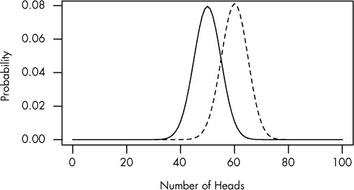
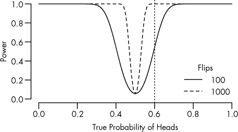
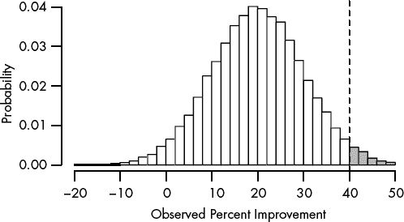
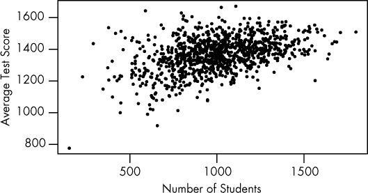

# 第二章. 统计功效与统计不足

你已经看到，如果没有收集足够的数据，可能会错过真实的效应。你可能会错过一种有效的药物，或未能注意到一个重要的副作用。那么，如何知道收集多少数据呢？

*统计功效*的概念提供了答案。研究的功效是其区分某一特定效应与纯粹运气的概率。一项研究可能很容易发现药物的巨大效益，但发现微小的差异则远不容易。

# 功效曲线

假设我确信我的宿敌有一枚不公平的硬币。与其每次正面和反面各占一半，它偏向于 60%的时间出现某一面，这让他能够在无聊的抛硬币赌博游戏中作弊。我怀疑他在作弊——但是如何*证明*这一点呢？

我不能仅仅拿起硬币，抛掷 100 次，然后统计正面朝上的次数。即使是完全公平的硬币，也不一定每次都会出现 50 次正面朝上，正如图 2-1 中所示的实线所显示的那样。

图 2-1. 抛掷公平硬币（实线）或有偏硬币（虚线）100 次时，出现不同次数正面朝上的概率。偏向正面的硬币 60%的时间是正面。

即使 50 次正面朝上是最可能的结果，它仍然不到 10%的概率发生。我同样有合理的可能性得到 51 次或 52 次正面。事实上，在抛掷公平硬币 100 次时，95%的概率正面朝上的次数会在 40 到 60 次之间。另一方面，远远超出这个范围的结果不太可能出现：使用公平硬币时，得到超过 63 次或少于 37 次正面的概率仅为 1%。得到 90 次或 100 次正面几乎是不可能的。

将此与图 2-1 中的虚线进行比较，虚线显示的是硬币偏向正面 60%的概率分布。两条曲线有重叠，但你可以看到不公平的硬币比公平的硬币更可能出现 70 次正面。

让我们来计算一下数学问题。假设我进行了 100 次试验并统计了正面朝上的次数。如果结果不是恰好 50 次正面，我会计算一个*公平*硬币出现如此大偏差或更大偏差的概率。这个概率就是我的*p*值。如果*p*值小于 0.05，我会认为它具有统计学意义，因此如果*p*值小于 0.05，我就会认为这枚硬币是不公平的。

我通过这种方法找到硬币是否存在偏差的可能性有多大？一个*功效曲线*，如图 2-2 中所示，可以告诉我。横轴表示硬币正面朝上的真实概率——即它的偏差程度。纵轴表示我得出结论认为硬币被操控的概率。

任何假设检验的*功效*是指其得出统计学显著结果的概率（在本例中定义为*p* < 0.05）。公平硬币在 95%的试验中会显示出 40 到 60 次正面，因此对于不公平硬币，功效就是出现*超出*这个 40 到 60 次正面范围的结果的概率。功效受三个因素的影响：

+   ****你正在寻找的偏差的大小。**** 一个巨大的偏差比一个微小的偏差更容易检测。

+   ****样本大小。**** 通过收集更多的数据（更多的硬币翻转），你可以更容易地检测到小的偏差。

+   ****测量误差。**** 计数硬币翻转很容易，但许多实验涉及的是更难测量的值，例如医学研究中调查疲劳或抑郁症状。

图 2-2. 100 次和 1,000 次硬币翻转的功效曲线，显示不同偏差大小的检测概率。垂直线表示正面朝上的概率为 60%。

让我们从偏差的大小开始。图 2-2 中的实线显示，如果硬币被调整为 60%的几率出现正面，那么在 100 次翻转后，我有 50%的机会得出结论认为硬币是作弊的。（也就是说，当正面出现的真实概率为 0.6 时，功效为 0.5。）另一半时间，我会得到少于 60 次正面的结果，并无法检测到偏差。仅仅 100 次翻转，数据量太少，*总是*无法将偏差与随机波动区分开来。如果硬币有极大的偏差——例如，正面超过 80%的概率——我几乎能在 100%的情况下发现这个偏差。

另一个问题是，即使硬币是完全公平的，我也会有 5%的概率错误地指责它存在偏差。我设计的测试是将*P*值小于 0.05 的结果解释为偏差的迹象，但即使硬币是公平的，这些结果*确实*会发生。

幸运的是，增加样本量可以提高敏感性。虚线显示，当进行 1,000 次投掷时，我可以轻松判断硬币是否被操控。这是有道理的：如果我能够公平地投掷硬币 1,000 次并且得到超过 600 次正面，那么这种情况几乎是不可能的。我会有 95%的几率得到 469 到 531 次正面。很不幸，我并没有时间去测试我的死对头的硬币是否公平，进行 1,000 次投掷。通常，由于纯粹的实际原因，进行一个足够强大的测试是不现实的。

现在，计算正面和反面很简单，但如果我正在进行智商测试呢？智商得分并不衡量一个潜在的“真相”，而是根据测试中的问题和受试者的心情，每天都会有所不同，从而引入了随机噪声。如果你要比较两组人的智商，你不仅会看到每个人之间的正常智力差异，还会看到*个体*得分中的随机变化。像需要主观评分的智商测试这样高变异性的测试，其统计功效相对较低。

更多的数据有助于区分信号和噪声。但这说起来容易做起来难：许多科学家没有足够的资源来进行具有足够统计功效的研究，以便检测他们所要寻找的东西。它们在开始之前就注定会失败。

# 功效不足的危险

想象一下一个试验，测试两种不同的药物 Fixitol 和 Solvix 治疗同一种病症。你想知道哪种药物更安全，但副作用很少见，因此即使你在 100 名患者身上测试这两种药物，每组中只有少数人会遭遇严重副作用。就像很难分辨一个硬币 50%正面和 51%正面之间的区别一样，3%和 4%的副作用率之间的差异也很难察觉。如果四名服用 Fixitol 的患者出现严重副作用，而只有三名服用 Solvix 的患者出现副作用，你不能确定这种差异是否是由于 Fixitol 所致。

如果一个试验的功效不足以检测出它所寻找的效果，我们称之为*功效不足*。

你可能认为，统计功效的计算对于医学试验是至关重要的；科学家可能想知道需要多少患者来测试一种新药，而快速的统计功效计算可以提供答案。通常，当统计功效达到 0.8 或更高时，科学家们会感到满意，这对应于 80%的几率检测到预期大小的实际效果。（如果真实效果实际上更大，研究的功效将更强。）

然而，很少有科学家进行这样的计算，也很少有期刊文章提到统计功效。在著名期刊*Science*和*Nature*中，不到 3%的文章在开始研究前计算统计功效。^(1) 事实上，许多试验得出的结论是“组间不良反应差异无统计学意义”，却没有指出数据不足以检测出任何差异，除了最大差异之外。^(2) 如果这些试验之一是在比较两种药物的副作用，医生可能错误地认为这些药物是同样安全的，而实际上其中一种药物可能比另一种药物危险得多。

也许这个问题只存在于稀有副作用的情况下，或者仅在药物效果较弱时才会出现？并不是。在一项发表于 1975 至 1990 年间的著名医学期刊的研究样本中，超过五分之四的随机对照试验报告的负面结果没有收集足够的数据来检测治疗组之间主要结果的*25%差异*。也就是说，即使某种药物的症状减轻程度比另一种药物高出 25%，也没有足够的数据得出这个结论。而且，几乎*三分之二*的负面试验没有足够的能力检测出 50%的差异。^(3)

最近一项关于癌症研究中的试验的研究发现了类似的结果：只有大约一半的负面结果研究具有足够的统计功效来检测出其主要结果变量中的大差异。^(4) 这些研究中不到 10%解释了为什么它们的样本量如此之小。类似的问题在其他医学领域也持续存在。^(5),^(6)

在神经科学领域，这个问题更为严重。每项神经科学研究收集的数据如此有限，以至于中位数研究只有 20%的机会能够检测到它所寻找的效应。你可以通过汇总多篇研究中收集的数据来弥补这一点，前提是这些研究都在调查相同的效应。但是，由于许多神经科学研究使用动物作为实验对象，这就引发了重大的伦理问题。如果每项研究的统计功效不足，那么只有在完成并分析了多项涉及大量动物的研究之后，才能发现真实的效应——这比如果研究在一开始就进行得当所使用的动物数量要多得多。^(7) 如果伦理审查委员会知道某项试验无法检测到它所要寻找的效应，就不应批准该试验。

## 为什么统计功效这么差？

奇怪的是，低功效研究的问题已经存在了几十年，但如今仍然像最初被指出时那样普遍存在。1960 年，雅各布·科恩（Jacob Cohen）研究了发表在《异常与社会心理学期刊》上的研究的统计功效^(8)，并发现平均研究的功效仅为 0.48，用于检测中等效应。^([4]) 他的研究被引用了数百次，随后进行了许多类似的评论，所有这些评论都强调了功效计算和更大样本量的必要性。然后，在 1989 年，一项回顾性研究显示，在科恩研究后的几十年里，平均研究的功效实际上*下降*了。^(9) 这种下降是因为研究人员意识到另一个问题，即多重比较问题，并通过一种降低研究功效的方式进行补偿。（我将在第四章中讨论多重比较问题，在那里你会看到研究的功效和多重比较校正之间有一个不幸的权衡。）

那么，为什么功效计算常常被忽视呢？一个原因是我们直观上对于样本量的感觉与功效计算结果之间存在差异。人们很容易想，“这些受试者应该足够了，”即使研究的功效极差。例如，假设你正在测试一种新的心脏病发作治疗方案，期望将死亡风险从 20%降低到 10%。你可能会倾向于认为，“如果在 50 名患者中使用这种治疗方法没有看到差异，显然效果太小，不值得应用。”但为了达到 80%的功效来检测这个效果，你实际上需要*400*名患者——每组控制和治疗各 200 人。^(10) 也许临床医生并没有意识到，看似足够的样本量实际上远远不够。

数学也是功效计算如此罕见的另一个可能解释：分析计算功效可能很困难，甚至是完全不可能的。计算功效的技术通常不会在初级统计课程中教授。而且一些市售的统计软件并不包含功效计算功能。通过简单地模拟成千上万的数据集（这些数据集具有你预期的效应大小），并在模拟数据上运行统计测试，你可以避免复杂的数学计算。功效就是你获得统计显著结果的数据集所占的比例。但这种方法需要编程经验，而且模拟真实数据也可能比较棘手。

即便如此，你会认为科学家会注意到他们的功效问题并尝试纠正它；经过五六项没有显著结果的研究后，科学家可能会开始怀疑自己做错了什么。但一项平均水平的研究不会进行一次假设检验，而是进行许多检验，因此有很大机会发现*某种*显著结果。^(11) 只要这个显著结果足够有趣，足以在论文中展示，科学家就不会觉得自己的研究功效不足。

电力不足的危险并不意味着科学家在声明他们未发现两组之间有显著差异时是在撒谎。但假设这些结果意味着没有*真正的*差异是误导的。可能确实存在差异，甚至是一个重要的差异，但研究样本太小，发现这一差异的几率微乎其微。让我们考虑一个我们每天都能看到的例子。

## 红灯右转的误区

在 1970 年代，美国的许多地方开始允许驾驶员在红灯时右转。在此之前的许多年里，道路设计师和土木工程师曾争论，允许红灯右转会成为安全隐患，导致更多的交通事故和行人死亡。但 1973 年的石油危机及其后果促使交通机构考虑允许红灯右转，以节省由于通勤者在红灯前等待而浪费的燃料，最终国会要求各州允许红灯右转，将其视为一种节能措施，就像建筑隔热标准和更高效的照明一样。

有几项研究调查了这一变化对安全性的影响。在一项研究中，弗吉尼亚州公路与交通部的顾问对 20 个开始允许红灯右转的交叉口进行了前后对比研究。在变化之前，这些交叉口发生了 308 起事故；而在相似时间段之后，这一数字增加到了 337 起。但这一差异在统计学上并不显著，顾问在报告中指出了这一点。当报告被转交给州长时，公路与交通部的专员写道：“我们没有发现实施红灯右转对驾驶员或行人造成显著危害。”^(12) 换句话说，他把*统计学*上的不显著性转化为了*实际*上的不显著性。

随后的几项研究得出了类似的结论：事故数量略有增加，但数据不足以得出这些增加是显著的结论。正如一份报告总结的那样，

> 没有理由怀疑，在采纳[红灯右转]后，涉及 RT 操作（右转）的行人事故是否有所增加。

当然，这些研究的样本量不足。但越来越多的城市和州开始允许红灯时右转，且这一做法在整个美国变得广泛。显然，没有人试图将这些小规模研究的数据汇总，以生成一个更有用的数据集。与此同时，越来越多的行人被撞倒，更多的车辆发生了碰撞。直到几年后，才有研究显示，在涉及右转的事故中，碰撞发生的频率大约增加了 20%，行人被撞的比例增加了 60%，骑自行车的人被撞的数量翻倍了。^(13),^(14),^([5])

可惜，交通安全领域从这个例子中学到的东西不多。例如，2002 年的一项研究考虑了铺设路肩对乡村道路交通事故率的影响。不出所料，铺设路肩减少了事故的风险——但由于数据不足，无法宣称这种减少具有统计学意义，因此作者认为铺设路肩的成本不值得。因为他们将微小的差异视为没有差异，所以没有进行成本效益分析，尽管他们收集到的数据表明铺设路肩确实改善了安全性！证据并不强大到能达到他们期望的*p*值门槛。^(12) 一个更好的分析应该承认，虽然路肩没有任何好处是有可能的，但这些数据同样也支持它们具有显著好处的可能性。这意味着要考虑*置信区间*。

# 置信区间与赋能

比起声明实验结果在统计学上不显著，更有用的是给出一个置信区间，提供关于效应的可能大小。即使置信区间包含零，其宽度也能告诉你很多信息：如果置信区间很窄且包含零，就意味着效应很可能很小（如果小效应在实际应用中不重要，那可能就是你需要知道的全部）；而如果置信区间很宽，则明显表明测量不够精确，无法得出结论。

物理学家通常使用置信区间来界定那些与零无显著差异的量。例如，在寻找新基本粒子的过程中，单纯说“信号在统计学上不显著”并没有帮助。相反，物理学家可以利用置信区间来对粒子在研究中的碰撞过程中产生的速率设定一个上限，然后将这个结果与预测其行为的竞争理论进行比较（并迫使未来的实验者建造更大的仪器来发现它）。

以置信区间的角度来看待结果为实验设计提供了一种新的思路。与其专注于显著性检验的功效，不如问问自己：“我需要收集多少数据才能以我想要的精度测量这个效应？”即使是一个强大的实验，也可能会产生显著的结果，但其置信区间极宽，使得结果难以解释。

当然，我们的置信区间的大小因实验而异，因为我们的数据在不同的实验中会有所不同。与其选择一个样本量来达到某个功效水平，不如选择一个样本量，使得置信区间在 99%的情况下（或 95%；目前对于这个数字没有标准约定，它被称为*保证*，决定了置信区间必须达到目标宽度的频率）足够狭窄。^(16)

基于保证的样本大小选择方法已经为许多常见的统计检验开发出来，尽管并非所有方法都已覆盖；这是一个新的领域，统计学家们尚未完全探索它。^(17)（这些方法被称为*参数估计的准确性*，或称为*AIPE*。）统计功效远比保证方法使用得更为广泛，而保证方法在任何领域的科学家中还没有得到广泛采用。尽管如此，这些方法仍然极为有用。统计显著性常常是一种拐杖，虽然听起来更吸引人，但却是一个不太信息丰富的替代品，无法替代一个好的置信区间。

# 真相膨胀

假设 Fixitol 在安慰剂上减少了 20%的症状，但你用来测试它的试验样本量太小，无法可靠地检测到这个差异。我们知道小规模的试验结果往往有所不同；很容易遇到 10 个幸运的病人，他们的感冒比平时要轻，但要找到 10,000 个病人都如此就要困难得多。

现在假设你运行多个相同的试验。有时你可能碰到运气不佳的病人，因此没能从药物中看到任何统计学显著的改善。有时你的病人恰好是平均水平，治疗组的症状减少了 20%——但你没有足够的数据来称其为统计学上显著的增加，所以你忽视了它。有时病人运气很好，症状减少的幅度远超过 20%，于是你终止试验并宣称，“看！它有效！”你可以在图 2-3 中绘制这些结果，图中展示了每次试验会产生某种效应大小估计的概率。

图 2-3。如果你将试验进行数千次，你会看到效果大小在症状百分比减少方面呈广泛分布。垂直虚线表示效果大小足够大，以至于具有统计学意义。真实的改善是 20%，但你看到的效果从 10%的损失到 50%的增益不等。只有幸运的试验才具有统计学意义，从而夸大了效果大小。

你正确地得出结论，Fixitol 是有效的，但由于你的研究统计功效不足，你夸大了它的效果大小。

这种效应被称为*真相膨胀*、*M 型错误*（*M*代表大小）或*赢家的诅咒*，发生在许多研究者进行相似实验并竞争发表最“激动人心”结果的领域：药理学试验、流行病学研究、基因关联研究（“基因 A 导致 B 病”）和心理学研究经常表现出症状，并且是医学文献中被引用最多的论文之一。^(18),^(19) 在基因学等快速发展的领域中，最早发表的结果往往是最极端的，因为期刊最希望发表新颖且激动人心的结果。后续研究通常显示出更小的效果。^(20)

还要考虑到，顶级期刊，如*《自然》*和*《科学》*，倾向于发表具有突破性结果的研究——也就是说，在少有前期研究的创新领域中，效果大小较大的研究。这是慢性真相膨胀的完美组合。有证据表明，期刊的影响因子（衡量期刊知名度和重要性的粗略指标）与其研究高估效果大小的倍数之间存在相关性。那些产生较少“激动人心”结果的研究更接近真实，但对主要期刊编辑来说则不那么有趣。^(21),^(22)

当一项研究声称通过相对较小的样本检测到一个大效应时，你的第一反应不应该是“哇，他们发现了什么重大结果！”而应该是“哇，这项研究的统计功效不足！”^(23) 这是一个例子。从 2005 年开始，金泽发布了一系列关于性别比例的论文，最终以“美丽的父母有更多女儿”作为高潮。他随后出版了一本书，讨论了这一主题以及他发现的其他“政治不正确的真理”。当时这些研究在媒体中很受欢迎，特别是因为它们报告了较大的效应大小：金泽声称最美丽的父母有 52%的概率会有女儿，而最不吸引人的父母只有 44%的概率会有女儿。

对生物学家来说，一个小的效应——也许一两个百分点——是可信的。*特里弗斯-威拉德假说*表明，如果父母有一种对女孩比对男孩更有利的特征，那么他们将会有更多的女孩而非男孩（反之亦然）。如果你假设女孩比男孩更能从美貌中受益，那么该假说将预测美丽的父母平均会有更多的女儿。

但金泽声称的效应大小是异常大的。结果证明，他在统计分析中犯了几个错误。一项修正后的回归分析发现，他的数据确实显示吸引人的父母更可能有女孩，几率高达 4.7%——但置信区间从 13.3%更可能到 3.9%*更不*可能。^(23) 尽管金泽的研究使用了近 3,000 个父母的数据，但这些结果并不具有统计学意义。

检测小差异需要大量的数据。想象一下一个更现实的效应大小——比如 0.3%。即便有 3,000 个父母，观察到 0.3%的差异也远远小到无法与运气区分开来。你可能幸运地仅有 5%的概率获得统计学显著的结果。这些结果将至少将真实效应夸大 20 倍，而 40%的结果将会产生一个极端的误差，支持男孩而非女孩。^(23)

即使金泽进行了完美的统计分析，他仍然可能偶尔会碰运气，得到像“工程师有更多儿子，护士有更多女儿”这样的论文^([6])，并对真实的微小效应做出过高的估计。他进行的这种规模的研究根本*无法*检测出你事先预期的效应大小。事先的功效分析本可以告诉他这一点。

## 小的极端值

真实性膨胀的出现是因为小规模、能力不足的研究结果差异很大。偶尔，你可能会很幸运地得出一个统计上显著但严重高估的结果。但这种广泛的波动即便在没有进行显著性测试的情况下也会带来麻烦。假设你负责公立学校改革。在你研究最佳教学方法时，你调查了学校规模对标准化测试成绩的影响。小学校的表现是否优于大规模学校？你应该尝试建造许多小学校还是几所大学校？

为了回答这个问题，你列出了你所知道的表现最好的学校。平均学校有大约 1000 名学生，但得分最高的 10 所学校几乎都比这个数字小。看起来，小学校的表现最好，也许是因为教师能更好地了解每个学生，并为他们提供个别帮助。

然后你看看那些表现最差的学校，原本以为它们是大城市的学校，学生有成千上万，老师们超负荷工作。结果却让你惊讶！它们其实也是小学校。

怎么回事呢？看看图 2-4 中测试成绩与学校规模的关系图。小学校的测试成绩波动较大，因为它们的学生人数较少。学生少意味着用于确定教师“真实”表现的数据点也少；少数异常成绩可能会显著影响学校的平均成绩。随着学校规模增大，测试成绩的波动变小，实际上平均成绩反而*提高*了。^(24)

图 2-4。学生人数更多的学校在测试分数上具有较少的随机波动。这些数据是模拟的，但基于对宾夕法尼亚州公立学校的真实观察。

另一个例子：在美国，肾癌发病率最低的县通常是中西部、南部和西部的农村县。为什么会这样呢？也许是农村人运动量更多，或者吸入的空气污染较少。又或者他们的生活压力较小。

另一方面，肾癌发病率*最高*的县通常是中西部、南部和西部的农村县。

当然，问题在于农村县的居民人数最少。一个只有 10 名居民的县里有一个肾癌患者，这个县的肾癌发病率就成了全国最高的。因此，小县城的肾癌发病率有更大的波动，仅仅因为它们的居民数量太少。^(25) 这些县的癌症发病率的置信区间也相应较大。

应对这一问题的一个流行策略叫做*收缩*。对于居民较少的县，可以通过将县的癌症率和全国平均癌症率的加权平均值作为估计值，从而将癌症率估算值“收缩”到全国平均水平。当县的居民较少时，更加重视全国平均值的权重；而当县的居民较多时，则更加重视该县的数据。收缩方法现在已成为构建癌症率地图等应用中的常见做法。^([7]) 不幸的是，这种方法会使结果偏向相反的方向：小县的癌症率如果与全国平均值相差较大，估算值往往会被推测得更接近全国平均水平。

解决这个问题没有单一的办法。最佳的替代方案是完全避免这种做法：与其按县估算癌症率，不如使用国会选区，在美国，国会选区是设计为人口大致相等的。尽管如此，国会选区通常比县要大，而且由于选区划分的影响，形状经常很奇怪。基于选区的地图虽然在统计学上不易产生误导，但仍然很难进行解释。

当然，强制要求样本量相等并不总是可行的。例如，在线购物网站需要根据顾客评分对产品进行排序，但它们无法强制每个产品获得相同数量的顾客评分。另一个例子是像 reddit 这样的讨论网站，它可以根据用户评分对评论进行排序；评论可能会因发布的时间、地点或发布者的不同而获得大相径庭的投票数。在这种情况下，收缩方法非常有帮助。在线商店可以使用产品评分的加权平均值和一些全球平均值来处理这种情况。评分较少的产品将被视为普通平均水平，而有成千上万投票的产品则根据其真实的个别评分进行排序。

对于像 reddit 这样使用简单的上下投票而不是星级评分的网站，一种替代方法是为正面投票的比例生成置信区间。当评论只有少量投票时，区间开始较宽；随着评论的积累，区间逐渐收窄至一个确定值（“70%的投票者喜欢这条评论”）；按照置信区间的下限对评论进行排序。新的评论开始时通常排在最底部，但其中最受欢迎的评论会积累投票并随着置信区间的收窄逐渐上升到页面上。而且，由于评论是按正面投票的比例而不是总投票数排序的，新评论可以与那些已经积累了数千票的评论竞争。^(26),^(27)

提示

+   在设计研究时，计算统计功效以确定适当的样本量。不要节省这方面的开支。可以参考像 Cohen 的经典著作*《行为科学中的统计功效分析》*，或向统计学顾问咨询。如果样本量不切实际，要清楚了解研究的局限性。

+   当你需要精确测量一个效应，而不仅仅是测试显著性时，使用置信度而非功效：设计你的实验以测量假设效应，直到达到你所需的精确度。

+   请记住，“统计上不显著”并不意味着“零”。即使你的结果不显著，它也代表了基于你收集的数据的最佳估计。“不显著”并不意味着“不存在”。

+   对明显样本不足的研究结果持怀疑态度。这些结果可能由于事实膨胀而被夸大。

+   使用置信区间来确定与你的数据一致的答案范围，而不管其统计显著性。

+   在比较不同大小的组时，计算置信区间。这些区间将反映在较大组中你拥有的更多确定性。

* * *

^([4]) Cohen 将“中等大小”定义为组间的 0.5 标准差差异。

^([5]) 需要注意的是，涉及右转的事故很少发生：这些变化每年在美国造成的死亡人数不到 100 人。^(15) 即便是小范围内 60%的增长仍然是微小的——但统计错误每年依然导致数十人死亡！

^([6]) 这是他于 2005 年在*理论生物学杂志*上发表的真实论文。

^([7]) 然而，收缩通常采用比简单加权平均值更复杂的方法实现。
