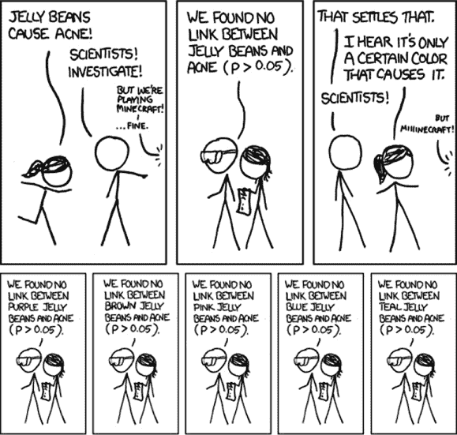
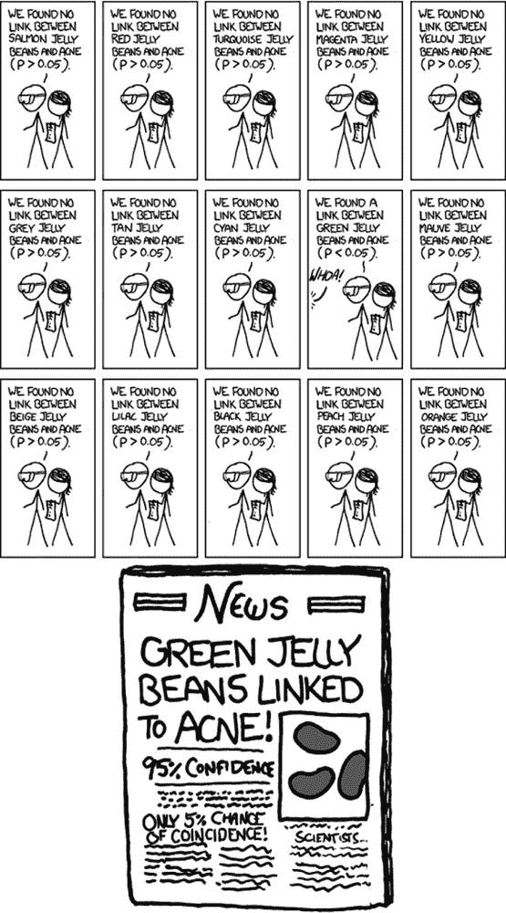

# 第四章：*p*值和基率谬误

你已经看到了*p*值很难解释。得到一个统计学上不显著的结果并不意味着两组之间没有差异。那么，得到一个显著的结果又该如何理解呢？

假设我正在测试 100 种潜在的癌症药物。这些药物中只有 10 种有效，但我不知道哪种有效；我必须进行实验来找出它们。在这些实验中，我将寻找*p* < 0.05 的结果，表明该药物具有显著的效果。

图 4-1 展示了这种情况。网格中的每个方格代表一种药物。实际上，只有顶行的 10 种药物有效。因为大多数实验无法完美地检测出每种有效药物，所以我假设我的实验具有 0.8 的统计效能，尽管你知道大多数研究的统计效能要低得多。所以，在 10 种有效药物中，我将正确地检测出大约 8 种，显示为深灰色。

图 4-1。每个方格代表一种候选药物。网格的第一行代表那些肯定有效的药物，但我只对 8 种深灰色的药物得到了统计学上显著的结果。黑色的格子代表假阳性。

因为我的*p*值阈值是 0.05，所以我有 5%的机会错误地认为一种无效的药物有效。由于我测试的 90 种药物都是无效的，这意味着我会错误地认为大约 5 种药物有显著效果。这些药物在图中显示为黑色。

我进行实验并得出结论，有 13 种“有效”药物：8 种有效药物和 5 种假阳性。因此，任何一项“有效”药物真正有效的概率是 8/13——仅为 62%! 从统计学的角度来看，我的*假发现率*——即那些统计上显著但实际上是假阳性的结果所占的比例——为 38%。

由于有效癌症药物的*基率*非常低（仅为 10%），我有很多机会得到假阳性。将情况极端化：如果我不幸地得到了一大车完全无效的药物，基率为 0%，那么我将*不可能*获得真正显著的结果。然而，我会对车里的 5%的药物得到*p* < 0.05 的结果。

# 基率谬误

你常常看到新闻报道引用低*p*值作为错误不太可能的标志：“这个结果作为统计偶然的机会只有 1/10,000，因为*p* = 0.0001。”不！这不可能是真的。在癌症药物的例子中，*p* < 0.05 的阈值导致任何给定统计显著结果为偶然的概率达到 38%。这种误解被称为*基础概率谬误*。

记住*p*值的定义：*p*值是在假设没有真实效应或没有真实差异的情况下，收集数据的概率，这些数据表现出一个与实际观察结果相同或更极端的差异。

一个*p*值是在假设药物*无效*的前提下计算出来的。它告诉我获得当前数据或更极端数据的概率。它并不*告诉*我药物有效的概率。一个小的*p*值是更强的证据，但要计算药物有效的概率，你还需要考虑基础概率。

当来自大型强子对撞机的新闻宣布物理学家发现了希格斯玻色子的证据时，每篇文章都试图引用一个概率：“这个结果作为偶然事件的机会只有 1/174 万”，或者类似的说法。但是每个新闻来源引用的数字都不同。他们不仅忽略了基础概率并误解了*p*值，而且连计算也不准确。

所以当有人引用一个低*p*值来说明他们的研究可能是正确的时，记住，实际上错误的概率几乎肯定更高。在大多数假设被证明是错误的领域，比如早期药物试验（大多数早期药物未能通过试验），*大多数*统计显著结果，*p* < 0.05，实际上很可能是偶然的。

## 快速小测验

一项 2002 年的研究发现，绝大多数统计学学生和教师未能通过一个关于*p*值的简单测验。^(1) 尝试这个测验（为本书稍作调整）来看看你对*p*值的真正含义理解得怎么样。

假设你正在测试两种药物，Fixitol 和 Solvix。你有两个治疗组，一个服用 Fixitol，另一个服用 Solvix，然后你测量他们在某项标准任务（例如健身测试）上的表现。你使用简单的显著性检验比较每组的平均得分，并获得*p* = 0.01，表明均值之间存在统计显著差异。

根据以下内容，判断每个陈述是对还是错：

1.  你已经完全驳斥了零假设（“均值之间没有差异”）。

1.  零假设为真的概率是 1%。

1.  你已经完全证明了备择假设（“均值之间*有*差异”）。

1.  你可以推断出备择假设成立的概率。

1.  你知道，如果你决定拒绝零假设，你犯错的概率。

1.  你有一个可靠的实验结果，换句话说，如果你重复实验多次，你将在 99%的试验中获得显著结果。

    你可以在脚注中找到答案。^([9])

## 医学检测中的基本比率谬误

对于使用乳腺 X 光检查筛查乳腺癌，存在一些争议。有些人认为，假阳性结果的危险——这会导致不必要的活检、手术和化疗——超过了早期发现癌症的好处；美国预防服务工作组等医生团体和监管机构最近已停止建议 50 岁以下女性进行常规乳腺 X 光检查。这是一个统计学问题，回答这个问题的第一步是问一个更简单的问题：如果你的乳腺 X 光检查出现癌症迹象，你实际患有乳腺癌的概率是多少？如果这个概率太低，大多数阳性结果都是假阳性，浪费大量时间和精力却没有任何好处。

假设接受乳腺 X 光检查的女性中有 0.8%患有乳腺癌。在 90%的乳腺癌患者中，乳腺 X 光检查能够正确检测出癌症。（这就是该检测的统计功效。这是一个估算值，因为如果我们不知道癌症的存在，很难判断我们漏掉了多少病例。）然而，在没有乳腺癌的女性中，大约 7%的人仍然会在乳腺 X 光检查中得到阳性结果。（这相当于具有*p* < 0.07 的显著性阈值。）如果你得到乳腺 X 光检查的阳性结果，你患乳腺癌的概率是多少？

如果忽略你作为男性读者的可能性，^([10])答案是 9%。

我是如何计算的呢？假设随机选择了 1,000 名女性进行乳腺 X 光检查。平均而言，0.8%的筛查女性患有乳腺癌，因此我们研究中大约有 8 名女性会患癌。乳腺 X 光检查能正确检测 90%的乳腺癌病例，所以大约 7 名患者会被发现患有癌症。然而，有 992 名没有乳腺癌的女性，7%的人会在乳腺 X 光检查中得到假阳性结果。这意味着大约 70 名女性将被错误告知她们患有癌症。

总的来说，我们有 77 名乳腺 X 光检查结果为阳性的女性，其中 7 名实际上患有乳腺癌。只有 9%的阳性乳腺 X 光结果女性患有乳腺癌。

即使是医生也会犯这个错误。如果你问他们，三分之二的人会错误地得出结论，认为*p* < 0.05 的结果意味着该结果有 95%的概率是正确的。^(2) 但正如你在这些例子中所看到的，阳性乳腺 X 光结果意味着癌症的可能性取决于实际患有癌症的女性的比例。幸运的是，在任何时候，患乳腺癌的女性比例都很小。

## 如何通过吸烟统计数据来撒谎

知名的统计学专家也会陷入基本概率谬误。一例引人注目的案例是记者达雷尔·哈夫，他是 1954 年畅销书*如何通过统计数据撒谎*的作者。

尽管*如何通过统计数据撒谎*并没有关注统计学的学术意义——或许更适合命名为*如何通过图表、图形和误导性数字撒谎*——这本书仍然被广泛采用于大学课程，并被渴望智胜营销人员和政治家的公众阅读，使哈夫成为统计学领域的公认专家。所以，当美国外科医生的著名报告*吸烟与健康*在 1964 年发布，称烟草吸烟会导致肺癌时，烟草公司寻求哈夫提供公开的反驳^([11])。

为了利用哈夫在公众中的声望，烟草行业委托他在国会作证，并随后撰写一本书，暂定名为*如何通过吸烟统计数据撒谎*，内容涉及指控外科医生报告中存在的许多统计和逻辑错误。哈夫完成了这本手稿，烟草公司支付了他超过 9,000 美元（相当于 2014 年约 60,000 美元），这本书得到了芝加哥大学统计学家（也是烟草行业付费顾问）K.A.布朗利的好评。尽管这本书从未出版，但哈夫友好、易懂的写作风格可能会给公众留下深刻印象，为茶水间辩论提供了话题。

在他的第七章中，他讨论了他所称的*过于精确的数字*——那些没有置信区间或任何不确定性指示的数字。例如，外科医生报告中提到的“死亡率比为 1.20”，这是“在 5%显著性水平下具有统计意义的”。这大概意味着该比率显著不同于 1.0，且*p* < 0.05。哈夫同意将结果表示为死亡率比是完全合适的，但他指出：

> 这确实带来了一个不幸的结果：它让人看起来我们现在能准确知道两类群体的实际死亡率比，精确到小数点后位。读者必须理解，这个看起来相当精确的数字其实只是一个近似值。从附带的显著性声明（“5%显著性水平”）中，我们发现实际上所知道的只是第二组的死亡率比第一组高的几率是 19 比 1。第一组到第二组的实际差异可能远低于所示的 20%，也可能更高。

对于这段引用的前半部分，我真想为哈夫加油：是的，统计学上的显著性*并不*意味着我们知道精确的两位小数的数字。（置信区间本来是表达这一数字的更合适方式。）但是接下来，哈夫声称显著性水平表明死亡率的差异的概率是 19 比 1。也就是说，他将*p*值解释为结果是偶然的概率。

甚至哈夫也无法避免基准率谬误！我们不知道“第二组的死亡率是否真的高于第一组”的概率。我们所知道的是，如果真实的死亡率比是 1，那么在 20 次实验中，我们只有一次会观察到一个大于 1.20 的死亡率比。

哈夫对过于精确数字的抱怨，实际上是极度精确的。值得注意的是，K.A. 布朗利阅读了这条评论——以及哈夫在整个手稿中所做的几次类似评论——并没有提出异议。相反，他指出，在一个案例中，哈夫错误地引用了赔率为 20 比 1，而不是 19 比 1。似乎他没有注意到更为根本的基准率谬误。

## 反击基准率谬误

你不必进行高级癌症研究或早期癌症筛查才能遇到基准率谬误。假如你在做社会研究呢？假设你想调查美国人自卫时使用枪支的频率。毕竟，枪支管控的争论集中在自卫权上，所以了解枪支是否常用于防卫，以及这种使用是否超过了其负面影响（如凶杀案件）是非常重要的。

收集这些数据的一种方式是通过调查。你可以询问一部分具有代表性的美国人，他们是否拥有枪支，如果有，他们是否曾在入室盗窃或防止被抢劫时用枪支保护自己或家人。你可以将这些数字与执法机构关于枪支在凶杀案件中使用的统计数据进行对比，从而做出是否枪支管控的好处大于弊端的明智决定。

这类调查已经做过，结果也很有意思。1992 年的一项电话调查估算，美国平民在那一年使用枪支进行自卫的次数高达 250 万次。这些案件中大约 34%是入室盗窃案件，也就是说有 845,000 起盗窃案件被枪支持有者制止了。但在 1992 年，实际发生的家庭盗窃案件只有 130 万起。三分之二的案件发生在房主熟睡时，只有在小偷离开后才被发现。那剩下的 43 万起盗窃案件是房主在家且清醒时与小偷对峙的，而我们被告知其中 845,000 起案件是被持枪居民阻止的。^(3)

哎呀。

一种解释可能是，入室盗窃案件被严重低报。入室盗窃的总数来自国家犯罪受害者调查（NCVS），该调查通过详细的访谈向成千上万的美国人询问他们的犯罪经历。也许那些用枪防卫成功的受访者没有报告犯罪——毕竟，没有任何财物被盗，且小偷逃跑了。但是，要解释这种差异，必须假设存在大规模的入室盗窃案件未被报告。实际上，三分之二的针对清醒房主的入室盗窃案件需要没有报告。

更可能的答案是，调查高估了自卫时使用枪支的情况。怎么高估的呢？就像乳腺 X 光检查高估了乳腺癌的发生率一样：假阳性的机会远多于假阴性。如果 99.9%的人在过去一年没有使用过枪支进行自卫，但其中 2%的人由于某种原因（例如为了取乐，或记错了很久以前的事件，误认为发生在过去一年内）回答了“是”，那么真实的使用率 0.1%看起来会接近 2.1%，被夸大了 21 倍。

那么，假阴性呢？这种效应能否通过那些即使上周刚击倒抢劫犯的人，仍然回答“没有”来平衡？受访者可能是非法携带枪支，或不愿意在电话中承认使用过枪支。但是即便如此，如果很少有人真正使用枪支进行自卫，那么假阴性的机会就很少。即便有一半使用枪支的人在电话调查中不承认使用过，他们也远远少于那些撒谎或记错的非使用者群体，而调查结果将会显得比实际高出 20 倍。

由于假阳性率是这里的主要误差因素，因此犯罪学家们的重点是减少这一误差。一个有效的做法是进行极其详细的调查。由司法部主办的 NCVS 使用详细的面对面访谈，受访者会被要求提供关于犯罪和自卫时使用枪支的细节。只有报告自己是受害者的人才会被询问如何进行自卫，因此，可能会撒谎或记错自卫情形的人，只有在他们也撒谎或记错自己是受害者的情况下，才会有机会报告。NCVS 还通过定期对同一受访者进行多次访谈，试图检测到记忆错误的日期（这是一个常见问题）。如果受访者报告自己在过去六个月内成为犯罪的受害者，但六个月前他们报告的相同犯罪发生在几个月前，访谈员可以提醒他们这一不一致。

1992 年 NCVS 的估计数字比电话调查低得多——大约每年 65,000 起事件，而不是数百万起。^(4) 这个数字不仅包括防范入室盗窃，还包括抢劫、强奸、袭击和汽车盗窃等案件。即便如此，它的数字仍然比电话调查给出的估计值小了近 40 倍。

诚然，人们可能对向联邦政府机构承认非法枪支使用感到紧张；原始电话调查的作者声称，大多数防御性枪支使用都涉及非法持枪。^(5)（这引发了另一个研究问题：为什么这么多受害者非法携带枪支？）这使得 NCVS 调查结果偏低。也许真相就在两者之间。

不幸的是，膨胀的电话调查数据仍然经常被枪支权利团体引用，误导了公众对枪支安全的辩论。与此同时，NCVS 的结果保持在远低于的数据上。枪支管控的辩论显然比单一统计数据要复杂得多，但有根据的辩论只能从准确的数据开始。

# 如果一开始你没有成功，继续尝试

基本率谬误表明，统计学上显著的结果往往是假阳性，远比*p* < 0.05 显著性标准所暗示的要频繁。这种谬误在现代研究中的影响更为显著，因为现代研究通常不仅仅进行一次显著性测试。更多时候，研究会比较多种因素，寻找那些影响最重要的因素。

例如，想象一下通过测试每种果冻豆颜色对痤疮的影响来测试果冻豆是否引起痤疮，正如图 4-2")所示。

图 4-2。来自 xkcd 的漫画，Randall Munroe 创作 ([`xkcd.com/882/`](http://xkcd.com/882/))

正如漫画所示，进行多次比较意味着多次发生假阳性的机会。我执行的测试越多，至少有一个假阳性结果的机会就越大。例如，如果我测试 20 种完全不会引起痤疮的果冻豆口味，并在*p* < 0.05 的显著性水平下寻找相关性，我有 64%的机会得到至少一个假阳性结果。如果我测试 45 种口味，至少一个假阳性的机会高达 90%。如果我改为使用置信区间来寻找非零的相关性，同样的问题也会出现。

### 注意

*这些数字背后的数学相当简单。假设我们有* n *个独立的假设要测试，且这些假设都不成立。我们将显著性标准设为* p < 0.05*。在* n *次测试中获得至少一个假阳性的概率如下：*

*P*(假阳性) = 1 – (1 – 0.05)^(*n*)

*对于* n = 100*，假阳性概率增加到 99%。*

多重比较并不总是像测试 20 种果冻豆颜色那样显而易见。追踪患者症状几周，并在任何一周测试显著的效益：噢，这样就有了 12 次比较。如果你还要检查 23 种不同的潜在危险副作用的发生情况？唉！你犯了个错误。

如果你发送一份 10 页的调查问卷，询问核电厂距离、牛奶消费量、年龄、男性表兄弟数量、最喜欢的披萨配料、当前袜子颜色以及其他几十个因素，你可能会发现至少有一个因素与癌症有关。

粒子物理学家称这一现象为*他处观察效应*。像大型强子对撞机寻找希格斯玻色子的实验，涉及搜索粒子碰撞数据，寻找小的异常现象，以指示新粒子的存在。例如，要计算在 5 吉电子伏特能量下，异常现象的统计显著性，物理学家会问：“在 5 吉电子伏特的能量下，偶然看到如此大或更大异常现象的概率有多大？”但他们也可以在其他地方查找——他们在多个能量范围内寻找异常，其中任何一个都可能产生假阳性。物理学家们已经开发了复杂的程序来处理这个问题，并正确地限制假阳性率。^(6)

如果我们希望同时进行多次比较，但控制*整体*假阳性率，*p*值应该在假设*没有*任何差异是真实的前提下计算。如果我们测试 20 种不同的果冻豆，我们不会感到惊讶如果其中一种“引起”了痤疮。但当我们计算某种特定口味的*p*值时，就好像每个比较都是独立的，我们其实是在计算*这个特定*小组幸运的概率——一个不太可能的事件，而不是 20 种中的任意一种。因此，我们检测到的异常看起来比实际更为显著。^(7)

1980 年代对医学试验的调查发现，平均每个试验进行了 30 次治疗比较。在超过一半的试验中，研究人员进行了如此多的比较，以至于假阳性几乎是必然的，这使得他们报告的统计显著结果受到怀疑。他们可能发现了一个统计显著的效果，但它也可能只是一个假阳性。^(8) 这种情况在心理学和其他高度依赖统计学的领域也类似。

也有一些技术可以用来修正多重比较问题。例如，本费罗尼校正方法允许你像平常一样计算*p*值，但指出如果在试验中进行*n*次比较，那么显著性的标准应该是*p* < 0.05/*n*。这样可以降低假阳性的概率，使其接近于仅进行一次比较时*p* < 0.05 的情况。然而，正如你可以想象的那样，这会降低统计功效，因为你要求在得出统计显著性结论之前，必须有更强的相关性。在某些领域，由于对多重比较问题的认识增加，近年来统计功效已经系统性地下降。

除了这些实际问题外，一些研究人员还从哲学角度反对使用**本费罗尼校正**方法。本费罗尼程序隐含地假设在多个比较中测试的*每一个*零假设都是正确的。但几乎从来都不是这样，两个群体之间的差异并非完全为零，某些药物的效果也不可能与安慰剂完全相同。那么，为什么一开始就假设零假设成立呢？

如果这个反对意见听起来很熟悉，那是因为你之前曾听过类似的论点——这是针对零假设显著性检验*的一般*反对，而不仅仅是针对本费罗尼校正。与仅检查每个效应是否可能为零相比，准确估计差异的*大小*要有趣得多。这也更有理由使用置信区间和效应大小估计，而不是显著性检验。

# 大脑成像中的“红鲱鱼”问题

神经科学家在进行功能性磁共振成像（fMRI）研究时会进行大量比较，在此类研究中，研究者会在受试者执行某个任务之前和之后分别拍摄三维的大脑图像。这些图像显示了大脑的血流情况，从而揭示出人们在执行不同任务时，大脑的哪些部分最为活跃。

那么，究竟如何判断大脑哪些区域是活跃的呢？一种简单的方法是将大脑图像分成小立方体，称为体素（voxels）。将“前”图像中的一个体素与“后”图像中的体素进行比较，如果血流差异显著，就得出大脑的某一部分参与了任务的结论。问题是，需要比较数万个体素，因此存在很多假阳性的机会。

例如，一项研究测试了“开放性思维任务”对参与者的影响。受试者观看了一系列“展示人在特定社交情境中、带有特定情感色彩的照片”，并被要求“判断照片中的人可能正在体验的情感”。你可以想象，在此测试过程中，大脑的各种情感和逻辑中心会被激活。

数据经过分析，发现某些大脑区域在任务期间活动发生了变化。对“心智化任务”前后图像的比较显示，在大脑的一个 81mm³ 区域，*p* = 0.001 存在差异。

研究参与者？不是那些通常为参加者支付 10 美元的大学生。不是的，测试对象是一条重 3.8 磅的“大西洋三文鱼”，它“在扫描时已经不再活跃。”^([13])

神经科学家们通常通过要求有 10 个或更多显著体素的簇，并使用严格的 *p* < 0.005 阈值来限制这个问题，但在一个包含数万个体素的脑扫描中，假阳性几乎是无法避免的。像 Bonferroni 校正这样的技术，能够在进行成千上万次统计检验时控制假阳性率，目前在神经科学文献中已很常见。很少有论文会犯像死三文鱼实验中那样严重的错误。不幸的是，几乎每篇论文都是以不同的方式处理这个问题。一项关于 241 份 fMRI 研究的综述发现，它们使用了 207 种独特的统计方法、数据收集策略和多重比较校正组合，给研究人员提供了极大的灵活性，以获得统计显著的结果。^(9)

# 控制假发现率

正如我之前提到的，Bonferroni 校正的一个缺点是它大大降低了实验的统计效能，这使得你更有可能错过真正的效应。确实存在比 Bonferroni 校正更复杂的方法，这些方法对统计效能的影响较小，但即便如此，它们也不是灵丹妙药。更糟的是，它们并不能避免基本率谬误。你仍然可能会被你的 *p* 阈值误导，错误地声称“我错的概率只有 5%”。像 Bonferroni 校正这样的程序只帮助你消除一些假阳性。

科学家们更关心的是限制 *假发现率*：即统计显著结果中假阳性的比例。在本章开头提到的癌症药物例子中，我的假发现率为 38%，因为我所有统计显著结果中有三分之一都是偶然的。当然，你之所以知道哪些药物*确实*有效，是因为我事先告诉了你这个数字。一般来说，你并不知道你测试的假设中有多少是真的；你只能通过猜测来计算假发现率。但理想情况下，你应该通过数据来揭示这一点。

1995 年，Yoav Benjamini 和 Yosef Hochberg 提出了一个异常简单的程序，用来告诉你哪些 *p* 值在统计上是显著的。到目前为止，我一直在帮你避开数学细节，但为了说明这个程序有多简单，给你看看它的具体内容：

1.  进行你的统计检验并获得每个检验的 *p* 值。列出这些结果，并按升序排序。

1.  选择一个假发现率，并将其称为 *q*。将统计测试的数量称为 *m*。

1.  找到最大的 *p* 值，使得 *p* ≤ *iq*/*m*，其中 *i* 是 *p* 值在排序列表中的位置。

1.  将 *p* 值以及所有小于它的值称为统计显著。

完成了！该程序保证，在所有统计显著的结果中，平均而言，不超过 *q* 百分比会是假阳性。^(10) 我希望这个方法在直觉上是有意义的：如果你正在寻找更小的假发现率（更小的 *q*）或进行更多比较（更高的 *m*），则 *p* 截止值会变得更加保守。

Benjamini–Hochberg 程序既快速又有效，且已被统计学家和科学家广泛采用。当测试数百个假设并且预期大多数是假设为假时，它尤其适用，比如将基因与疾病相关联。（绝大多数基因与某种特定疾病无关。）该程序通常提供比 Bonferroni 校正更好的统计功效，且假发现率比假阳性率更易于解释。

小贴士

+   记住，*p* < 0.05 并不等同于你的结果有 5% 的概率是错误的。

+   如果你正在测试多个假设或寻找许多变量之间的相关性，使用类似于 Bonferroni 或 Benjamini–Hochberg 程序（或它们的各种衍生版本和改编）的程序来控制假阳性过多的问题。

+   如果你的领域经常进行多重测试，例如神经影像学，学习专门为处理你数据而开发的最佳实践和技术。

+   学会使用基准率的先验估计来计算给定结果是假阳性的概率（如乳腺 X 光例子）。

* * *

^([9]) 我希望你已经得出结论，*每个*陈述都是错误的。前五个陈述忽略了基准率，而最后一个问题询问的是实验的*功效*，而不是它的 *p* 值。

^([10]) 做男性并不会真正排除你得乳腺癌的可能性，但这种可能性要小得多。

^([11]) 以下叙述基于《遗产烟草文献库》中的信件和报告，这是一个在线收集的烟草行业文档库，是“烟草主和解协议”产生的结果。

^([12]) 物理学家拥有最棒的单位名称。吉电子伏特、时刻、倒数飞秒巴恩——作为一名转行统计学的物理学家，我唯一的遗憾是再也没有借口使用这些术语了。

^([13]) “在头部线圈内放置泡沫垫，以限制扫描过程中鲑鱼的移动，但证明它在很大程度上是多余的，因为受试者的运动异常低。”
