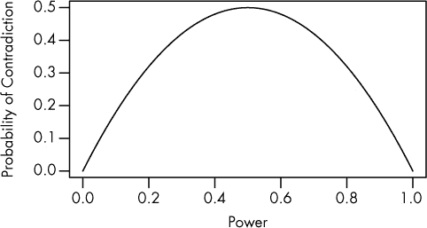
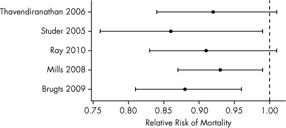
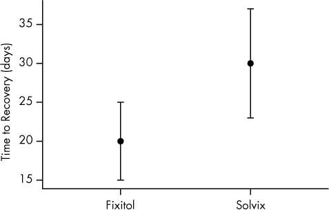

# 第五章 不良的显著性评判者

使用过多的统计显著性检验是获得误导性结果的一个好方法，但也有可能声称一个未明确测试过的差异具有显著性。误导性的误差条可能会让你认为某个检验是多余的，或者两种治疗的统计显著性差异可能会让你相信它们之间存在统计学上的显著差异。让我们从后者开始。

# 显著性中的无意义差异

“我们将 A 治疗、B 治疗与安慰剂进行了比较。A 治疗相较于安慰剂显示出了显著的益处，而 B 治疗没有显著的统计学益处。因此，A 治疗比 B 治疗更好。”

我们经常听到这种说法。这是一种简单的比较药物、手术干预、疗法和实验结果的方法。它很直接，看似合理。

然而，显著性差异并不总是意味着显著差异。^(1)

其中一个原因是*p* < 0.05 的临界值具有任意性。我们可能会得到两个非常相似的结果，一个*p* = 0.04，另一个*p* = 0.06，并错误地认为它们明显不同，因为它们位于临界值的两侧。第二个原因是*p*值并不是效应大小的度量，因此相似的*p*值不一定意味着效应相似。两个具有相同统计显著性的结果仍然可能相互矛盾。

但我们应该考虑统计功效。如果我们将新实验药物 Fixitol 和 Solvix 与安慰剂进行比较，但实验样本量不足以提供足够的统计功效，那么我们可能未能发现它们的益处。如果它们的效果相同，但我们的统计功效仅为 50%，那么我们很有可能会说 Fixitol 有显著的益处，而 Solvix 没有。再次进行实验时，也同样有可能 Solvix 显得有益而 Fixitol 没有。

计算这些内容相对简单。假设两种药物与安慰剂相比有相同的非零效果，并且我们的实验具有统计功效*B*。这意味着我们将检测到每组与对照组差异的概率是*B*，因此我们检测到 Fixitol 的效果而*不*检测到 Solvix 的效果的概率是*B*(1 – *B*)。同样，检测到 Solvix 的效果而不检测到 Fixitol 的效果的概率也是如此。将这些概率加起来，我们会发现，得出一个药物有显著效果而另一个没有的概率是 2*B*(1 – *B*)。这个结果在图 5-1 的图，表示即使两种药物效果相同，一个药物出现显著结果而另一个药物出现无显著结果的概率。当统计功效非常低时，两种药物的结果都不显著；当统计功效非常高时，两种药物的结果都显著。")中有所展示。

我们不应当单独将每种药物与安慰剂进行比较，而应当将它们互相比较。我们可以检验它们是否同样有效，或者构建一个置信区间来衡量 Fixitol 相对于 Solvix 的额外效益。如果该区间包括零，那么它们可能同样有效；如果不包括零，那么就意味着某种药物明显优胜。这不会提高我们的统计能力，但可以防止得出药物之间存在差异的错误结论。我们应当把寻找差异显著性的倾向转变为对差异显著性的检验。

图 5-1。2*B*(1–*B*)的图示，表示在两种药物效应完全相同的情况下，其中一药显示显著结果而另一药显示无显著结果的概率。当统计功效非常低时，两种药物的结果都不显著；当统计功效非常高时，两种药物的结果都显著。

这一微妙的区别非常重要，特别是在解释*复制研究*结果时，研究人员尝试再现先前研究的结果时。某些复制研究将其负面结果框架化为显著性：“原文获得了显著结果，但这项更为严谨的研究却没有。”但即便复制实验的设计具备足够的统计功效来检验初始研究中报告的效应，可能还是存在“真实效应膨胀”的问题——最初的研究可能高估了效应。由于检测较小效应需要更大的样本，复制实验的真实统计功效可能低于预期，因此完全可能获得一个统计学上不显著的结果，而该结果与早期的研究依然一致。

另一个例子是，2007 年，英国药品连锁店 Boots 的 No. 7 保护与修复美容精华液在 BBC 报道了一项临床试验后成为畅销产品，该试验据称证明了其在减少皮肤皱纹方面的有效性。根据*《英国皮肤病学杂志》*发表的试验，精华液使 43%的受试者皱纹数量减少，这具有统计学显著性，而对照组（未含活性成分的同款精华液）仅有 22%的受试者受益，统计学上没有显著改善。广告中宣传的含义是，该精华液已经通过科学证明是控制皱纹的最佳选择——尽管作者在论文中不得不承认，组间差异在统计学上并不显著。^(2)

不幸的是，这种统计数据的误用并不限于企业营销部门。例如，神经科学家在进行组间比较时大约一半的时间使用了不正确的方法。^(3)你可能还记得 2006 年一项研究的新闻，研究表明有多个哥哥的男性更可能是同性恋。^(4)他们是如何得出这个结论的呢？作者通过指出，当他们分析各种因素对同性恋的影响时，只有哥哥的数量对同性恋有统计学上的显著影响，而姐姐的数量或非亲生哥哥的数量（即养兄弟或继兄弟）没有显著影响。但正如我们所见，这并不能保证这些不同影响组之间有显著的差异。事实上，仔细观察数据后我们发现，拥有哥哥和拥有姐姐的影响之间没有统计学上的显著差异。不幸的是，论文中没有发布足够的数据来计算这一比较的*p*值。^(1)

对不确定结果的误解助长了公众对医生无法做出决定的印象，认为他们不清楚哪些药物和食物对你有益或有害。例如，降胆固醇药物（他汀类药物）因其可以降低血液胆固醇水平而广受欢迎，因为高胆固醇与心脏病相关。但这种关联并不能*证明*降低胆固醇水平会对患者有益。一系列涉及数万名患者记录的大型荟萃分析旨在回答这个问题：“对于没有心血管疾病病史的患者，他汀类药物是否能降低死亡率？”

三项研究得出的结论是：他汀类药物*确实*可以降低死亡率。另有两项研究认为，没有足够的证据表明他汀类药物有效^5。阅读这些文章的医生、患者和记者无疑会感到困惑，可能会认为关于他汀类药物的研究结论存在矛盾且不确定。但正如图 5-2 所示，所有五项荟萃分析对他汀类药物的效果给出了相似的估计：相对风险的估算值均接近 0.9，表明在试验期间，服用他汀类药物的患者死亡率比对照组低了 10%。尽管两项研究的置信区间确实与相对风险为 1 重叠——这表示治疗组与对照组之间没有差异——但它们的效应大小估算与其他研究结果一致。因此，声称这些研究之间存在严重分歧是不合理的。

图 5-2：五项大型荟萃分析估算的服用他汀类药物患者的相对死亡风险的置信区间。相对风险小于 1 表示死亡率低于对照组。荟萃分析以首席作者的姓名和发表年份标记。

# 寻找显著性

在上一节中，我提到如果我们要比较 Fixitol 和 Solvix，应该使用显著性检验来直接比较这两者，而不是分别与安慰剂对比。为什么我必须这么做？为什么不能仅仅通过查看两个置信区间来判断它们是否重叠？如果置信区间重叠，那么这两种药物的效果可能相同，因此它们之间没有显著差异，对吧？实际上，在判断是否存在显著差异时，科学家们通常通过肉眼观察，利用类似图 5-3 这样的图表进行初步判断。

图 5-3。使用 Fixitol 或 Solvix 的患者恢复时间。Fixitol 似乎更有效，但误差条有重叠。

想象一下，图中两个标记的点表示两组各 10 名患者从某种疾病中恢复的估计时间。这些误差条的宽度可能代表三种不同的含义。

1.  计算测量值的标准差。计算每个观测值与平均值的差距，平方每个差值，然后取平均值并开根号。这就是标准差，它衡量了测量值与其均值之间的分布情况。标准差条从均值下方一个标准差延伸到均值上方一个标准差。

1.  估计值的 95%置信区间。

1.  估计值的两倍标准误差，另一种衡量误差范围的方式。如果你进行大量相同的实验并从每次实验中获得 Fixitol 效果的估计值，那么标准误差就是这些估计值的标准差。误差条从均值下方一个标准误差延伸到均值上方一个标准误差。在最常见的情况下，标准误差条的宽度约为 95%置信区间的一半。

需要注意的是这些的区别。标准差衡量的是个体数据点的*分散*情况。如果我正在测量患者在服用 Fixitol 时恢复所需的时间，高标准差会告诉我，Fixitol 对某些患者的效果比其他患者要好得多。而置信区间和标准误差则估计了*平均值*与真实平均值之间的差距——即如果我能够将 Fixitol 提供给每个得病的人，得到的平均值。因此，了解误差条代表的是标准差、置信区间还是标准误差是非常重要的，尽管论文中通常不会明确说明。^([14])

现在，我们假设图 5-3 显示了两个 95%的置信区间。由于它们重叠，许多科学家会得出结论，认为两组之间没有统计学意义上的差异。毕竟，组一和组二可能没有区别——例如，两组的平均恢复时间可能都是 25 天，差异仅仅是因为组一这次运气更好。

但这真的意味着差异没有统计学意义吗？它的*p*值会是多少呢？

我可以使用*t*检验来计算*p*值，这是标准的统计检验方法，用于判断两组的均值是否有显著差异。在将 Fixitol 和 Solvix 的数字代入后，我发现*p* < 0.05！即使置信区间重叠，它们之间仍然存在统计学上的显著差异。

不幸的是，许多科学家跳过数学推导，直接浏览图表查看置信区间是否重叠。由于区间可以重叠但仍表示统计学上显著的差异，因此这种做法实际上是一种更保守的检验——它总是比要求*p* < 0.05 更严格。^(6) 因此，显著差异可能会被忽略。

之前，我们假设图 5-3 中的误差条代表置信区间。但如果它们是标准误差或标准差呢？我们能通过仅仅观察误差条是否重叠来发现显著差异吗？正如你可能猜到的那样，不能。对于标准误差，我们面临与置信区间条相反的问题：两次观察可能具有不重叠的标准误差，但它们之间的差异*并不*具有统计学显著性。而标准差则没有足够的信息来判断显著性，无论它们是否重叠。

一项对心理学家、神经科学家和医学研究人员的调查发现，大多数人通过置信区间重叠来判断显著性，许多科学家混淆了标准误差、标准差和置信区间。^(7) 另一项对气候科学论文的调查发现，大多数对比两组误差条的论文都犯了这个错误。^(8) 甚至一些实验科学的入门教材，比如约翰·泰勒的*误差分析导论*，也教学生通过目测判断，几乎完全不提正式的假设检验。

只有一种情况，目测检查置信区间是有效的，那就是将置信区间与一个固定值进行比较，而不是与另一个置信区间进行比较。如果你想知道一个数字是否可能为零，你可以检查它的置信区间是否与零重叠。当然，也有正式的统计程序能够生成可以通过目测比较的置信区间，且自动纠正多重比较的影响。不幸的是，这些程序仅在特定情况下有效；例如，Gabriel 比较区间很容易通过目测解释，但要求每个被比较的组具有相同的标准差。^(9) 其他程序可以处理更一般的情况，但仅是近似的，并且不是以容易绘制的方式进行的。^(10)（另一种做法是对每一对可能的变量进行单独检验，然后使用 Bonferroni 校正来进行多重比较，但这种方法既繁琐又保守，降低了统计功效，比其他程序更严格。）

置信区间重叠并不意味着两个值没有显著差异。检查置信区间或标准误差会误导你。最好使用适当的假设检验，毕竟你的眼睛并不是一个精确定义的统计程序。

提示

+   直接使用适当的统计检验来比较组，而不是简单地说：“这个显著，那个不显著。”

+   不要凭眼睛判断差异的显著性，要使用统计检验。

+   记住，如果你比较多个组，必须调整以避免多重比较带来的影响！

* * *

^([14]) 由于标准误差条大约是 95%置信区间宽度的一半，许多论文会报告“标准误差条”，这些误差条实际上跨越了均值上下*两个*标准误差，从而形成置信区间。
