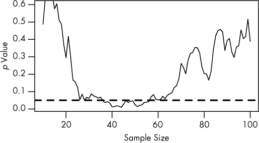

# 第六章 数据中的双重检查

之前我们讨论了“真相膨胀”，这是一种过度使用显著性检验的症状。在寻求显著性的过程中，研究人员只会选择最幸运和最夸张的结果，因为这些结果是唯一能通过显著性筛选的。但是，这并不是研究结果偏向夸张结论的唯一方式。

统计分析通常是*探索性的*。在探索性数据分析中，你不会提前选择一个假设进行验证。你收集数据，并对其进行探索，看是否有有趣的细节会浮现出来，理想情况下这会导致新的假设和新的实验。这个过程涉及制作大量图表，尝试一些统计分析，并跟随任何有希望的线索。

但是，盲目地探索数据意味着有很多假阳性和真相膨胀的机会。如果在探索中你发现了一个有趣的相关性，标准程序是收集一个新的数据集并再次验证假设。测试一个独立的数据集可以过滤掉假阳性，留下任何真正的发现。（当然，你需要确保你的测试数据集有足够的统计能力来复制你的发现。）因此，探索性发现应该被视为暂定的，直到得到确认。

如果你*没有*收集一个新的数据集，或者你的新数据集与旧数据集高度相关，那么“真相膨胀”将会反噬你。

# 循环分析

假设我想在一只猴子的脑中植入电极，将其信号与我将在屏幕上投射的图像进行关联。我的目标是理解大脑如何处理视觉信息。电极将记录猴子视觉皮层中神经元之间的通信，我想看看不同的视觉刺激是否会导致不同的神经元放电模式。如果我得到统计学上显著的结果，我甚至可能会出现在关于“读取猴子思想”的新闻报道中。

当可植入电极首次问世时，它们很大，而且一次只能记录少数几个神经元。如果电极放置不当，它可能根本无法检测到任何有用的信号，因此为了确保它能够清晰地记录与视觉相关的神经元活动，电极会在猴子观看刺激时缓慢移动。当出现清晰的反应时，电极会被固定在原位，实验就开始了。因此，探索性分析通过完整实验得到了确认。

放置电极是一种探索性分析：我们尝试一些神经元，直到有一个似乎每当猴子观看图像时就会放电。但一旦电极就位，我们就收集一组新的数据，并测试比如神经元放电率是否能够告诉我们猴子是看到绿色还是紫色的图像。新的数据与旧的数据是独立的，如果我们仅仅是在放置电极时得到了一个幸运的相关性，那么我们将在完整实验中无法复制这一发现。

现代电极要小得多，且更为复杂。一个和一毛钱硬币大小的单个植入物包含了数十个电极，因此我们可以植入芯片，之后选择那些看起来能够提供最佳信号的电极。一个现代实验可能是这样的：展示各种刺激给猴子，并用电极记录神经反应。分析每个电极的信号，看看它是否表现出高于正常背景发放率的反应，这将表明它正在接收我们感兴趣的神经元的信号。（这个分析可能会进行多重比较校正，以防止高假阳性率。）

利用这些结果，我们丢弃掉那些未能击中目标的电极数据，进一步分析其余数据，测试它们的放电模式是否随我们呈现的不同刺激而变化。这是一个两阶段的过程：首先挑选出信号良好且与视觉相关的电极；然后确定它们的信号在不同刺激之间是否存在差异。由于我们不需要移动电极，重新使用我们已经收集的数据是很诱人的。实际上，这是一种散弹枪式的方法：使用多个小电极，其中一些肯定会击中正确的神经元。经过筛选掉不好的电极后，我们可以测试剩余的电极是否在响应不同刺激时以不同的速率放电。如果它们这样做了，那我们就了解了猴子大脑中视觉处理的某些位置。

好吧，差不多。如果我按照这个计划进行，我就会使用相同的数据两次。我用来寻找神经元和视觉刺激之间相关性的统计测试假设*p*值为零——也就是说，它假设零假设，即神经元随机发放。但是在探索阶段之后，我特意选择了那些在反应视觉刺激时似乎发放*更多*的神经元。实际上，我只会测试那些幸运的神经元，因此我应该始终期望它们与不同的视觉刺激相关联。^(1)我甚至可以在一条死三文鱼身上做相同的实验并得到积极的结果。

这个问题，*双重检验*数据，会导致结果严重夸大。而双重检验并不仅限于神经电极；这里有一个来自 fMRI 测试的例子，fMRI 旨在将大脑特定区域的活动与刺激或行为联系起来。MRI 机器检测到血流变化，表明大脑的哪些区域正在更加努力地处理刺激。因为现代 MRI 机器提供了非常高分辨率的图像，所以在大脑中提前选择感兴趣的区域非常重要；否则，我们将不得不在成千上万的个体点之间进行比较，这就需要大规模的多重比较校正，并大大降低研究的统计效能。感兴趣的区域可能基于生物学或先前的结果来选择，但通常没有明确的区域可供选择。

比如说，我们向受试者展示两种不同的刺激：海象和企鹅的图像。我们不知道大脑的哪个部分处理这些刺激，所以我们进行一个简单的测试，看看海象引起的活动与受试者没有任何刺激时的活动是否有差异。我们标记出那些具有统计学显著结果的区域，并对这些区域进行完整分析，测试两种刺激下的活动模式是否存在差异。

如果海象和企鹅在大脑的某个区域引起相等的激活，我们的筛选很可能会选择该区域进行进一步分析。然而，我们的筛选测试也可能选出了那些因随机变异和噪声而引起海象更大表观激活的区域。因此，我们的完整分析将显示海象的激活平均值高于企鹅。我们会比测试的假阳性率所建议的更频繁地检测到这种不存在的差异，因为我们只在那些幸运的区域进行测试。^(2) 海象确实有真实的效果，所以我们并没有发明一个虚假的相关性——但我们*确实*膨胀了其效果的大小。

当然，这是一个刻意构造的例子。如果我们同时使用两种刺激来选择感兴趣的区域，会怎样呢？那么我们就不会错误地认为海象引起的激活比企鹅更强烈。相反，我们可能会错误地高估*两者*的影响。具有讽刺意味的是，使用更严格的多重比较校正来选择感兴趣的区域反而使问题变得更糟。这又是“真实膨胀”现象的重现。那些显示平均或低于平均反应的区域未被纳入最终分析，因为它们的显著性不足。只有那些随机噪声最强的区域才会进入进一步分析。

有几种方法可以缓解这个问题。一种方法是将数据集分成两半，使用前半部分选择感兴趣的区域，并用后半部分进行深入分析。不过，这样做会降低统计能力，因此我们需要收集更多的数据来弥补。另一种方法是使用其他标准来选择感兴趣的区域，而不是依赖对海象或企鹅刺激的反应，比如之前的解剖学知识。

这些规则在神经影像学文献中经常被违反，可能高达 40%的时间，导致相关性膨胀和假阳性结果。^(2) 进行这种错误的研究通常会发现刺激和神经活动之间的相关性比实际情况更大，这与脑成像固有的随机噪声和误差不符。^(3) 类似的问题也出现在基因学家收集成千上万基因数据并挑选子集进行分析，或者流行病学家筛选人口统计数据和风险因素，寻找与疾病相关的因素时。^(4)

# 回归均值

想象一下追踪某个量随时间变化的情况：比如企业的表现、患者的血压，或者任何其他随着时间逐渐变化的事物。现在，挑选一个日期，并选择所有突出表现的对象：营收最高的企业，血压最高的患者，等等。那么，下次我们测量这些对象时，会发生什么情况？

好吧，我们已经挑选出了所有表现最好的企业和长期高血压的患者。但我们也挑选了一些企业，它们有一个异常幸运的季度，或者是一些经历了特别紧张一周的患者。这些幸运和不幸运的对象不会永远保持异常；几个月后再测量它们，它们将恢复到正常的表现。

这种现象被称为*回归均值*，它不是血压或企业的特殊属性。它只是一个观察结果：运气不会永远持续下去。平均而言，每个人的运气都是平均的。

弗朗西斯·高尔顿早在 1869 年就观察到了这一现象。^(5) 在追溯著名人物的家谱时，他注意到，名人后代往往不那么出名。他们的孩子可能继承了让父母如此出名的音乐或智力基因，但他们通常不会像父母一样杰出。后来的研究揭示了同样的现象在身高上的表现：异常高的父母有更为普通的孩子，而异常矮的父母则有通常会更高的孩子。

回到血压的例子，假设我挑选了高血压患者来测试一种实验性药物。导致他们血压偏高的原因有很多，例如糟糕的基因、不良的饮食、糟糕的一天，甚至是测量误差。尽管基因和饮食相对恒定，其他因素可能导致某人的血压在不同的日子里波动。当我挑选高血压患者时，他们中的许多人可能只是遇到了糟糕的一天，或者他们的血压袖带校准不准确。

而虽然你的基因会伴随你一生，但一个校准不准确的血压袖带却不会。对于那些不幸运的患者来说，他们的运气很快会改善，*无论我是否治疗他们*。我的实验存在偏倚，因为我选择研究对象的标准本身就偏向于发现效果。为了正确估计药物的效果，我需要随机地将样本分为治疗组和对照组。只有当治疗组的平均血压改善明显好于对照组时，我才能宣称药物有效。

另一个回归均值的例子是考试成绩。在关于统计功效的章节中，我讨论了在较小的学校中随机变化较大，因为个别学生的运气对学校的平均成绩影响更大。这也意味着，如果我们挑选出表现最好的学校——那些拥有优秀学生、优秀教师和*好运气*的学校——我们可以预期它们在明年会表现得较差，因为好运气是短暂的。就像坏运气一样：最差的学校可以预期在明年会表现得更好——这可能会让管理者认为他们的干预措施奏效了，尽管那实际上只是回归均值的结果。

一个最终的、著名的例子可以追溯到 1933 年，当时数学统计学领域刚刚起步。西北大学的统计学教授霍勒斯·塞克里斯特发表了《商业中的平庸胜利》（*The Triumph of Mediocrity in Business*），文章中认为，异常成功的企业往往会变得不那么成功，而不成功的企业则往往变得更加成功：这是企业趋向平庸的证据。他认为这不是统计学的伪现象，而是市场竞争力量的结果。塞克里斯特用大量数据和无数的图表来支持自己的论点，甚至引用了加尔顿在回归均值方面的一些研究成果。显然，塞克里斯特并没有理解加尔顿的观点。

Secrist 的书由哈罗德·霍特林（Harold Hotelling），一位有影响力的数学统计学家，为《美国统计学会杂志》所审阅。霍特林指出了其中的谬误，并提到可以轻松使用相同的数据来证明商业趋势*远离*平庸：与其挑选最优秀的企业并追踪它们随时间的衰退，不如追踪它们从*成为最佳之前*的进展。你将不可避免地发现它们在改进。Secrist 的论点“实际上并没有证明任何东西，只不过表明相关的比例有徘徊的趋势。”^(5)

# 终止规则

医学试验成本高昂。为数十名患者提供实验性药物，并在几个月的时间内追踪他们的症状需要大量的资源，因此许多制药公司会制定*终止规则*，允许研究人员在实验药物效果明显时提前结束研究。例如，如果试验还未完成一半，但新药物已经在症状上产生了具有统计学意义的差异，研究人员可能会终止研究，而不是收集更多数据来加强结论。事实上，如果你已经知道某种药物是有效的，拒绝为对照组提供该药物被视为*不道德的*。

然而，如果操作不当，过早地进入数据可能会导致假阳性结果。

假设我们正在比较两组患者，一组服用我们的实验性新药 Fixitol，另一组服用安慰剂。我们测量他们血液中的某种蛋白质水平，以观察 Fixitol 是否有效。假设 Fixitol 根本没有产生任何变化，且两组患者的平均蛋白质水平相同。即便如此，蛋白质水平在个体之间仍会有所波动。

我们计划在每组中使用 100 名患者，但从 10 名开始，逐步招募额外的患者，以将他们分配到治疗组和对照组。随着研究的进行，我们会进行显著性检验，以比较两组之间是否存在统计学显著差异。如果我们看到统计学显著性，我们将提前停止。我们可能会看到类似于图 6-1 的结果。

图 6-1. 每加入一对新患者后进行的显著性检验结果。各组之间没有真正的差异。虚线表示*p* = 0.05 的显著性水平。

图表显示了随着我们收集更多数据，不同组之间差异的*p*值，虚线表示*p* = 0.05 的显著性水平。最初，看起来似乎没有显著差异。但随着我们收集越来越多的数据，*p*值降到虚线以下。如果我们提前停止实验，就会错误地得出组间存在显著差异的结论。只有当我们收集更多数据时，才会意识到差异并不显著。

你可能会认为*p*值的下降不应该发生，因为组间并没有真正的差异。毕竟，收集更多数据不应该让我们的结论变得更糟，对吧？确实，如果我们重新进行实验，可能会发现最初组间没有显著差异，并且随着数据的增加，差异始终不存在；或者组间一开始差异巨大，但很快回归到没有差异。但如果我们足够等待，并在每次数据点之后进行测试，最终我们将跨越*任何*任意的统计显著性界限。我们通常无法收集无限样本，因此在实际操作中这种情况并不总是发生，但执行不当的停止规则仍会显著增加假阳性率。^(6)

进行实验的目的在这里非常重要。如果我们事先选择了固定的组大小，那么*p*值就是获得更极端结果的概率，针对该组大小而言。但由于我们允许根据结果调整组大小，*p*值必须考虑到这一点来进行计算。为了解决这些问题，顺序分析领域应运而生，研究人员要么选择一个更严格的*p*值阈值，考虑到多重检验，要么使用不同的统计检验方法。

除了假阳性外，采用提前停止规则的实验还往往会受到过度膨胀的影响。许多提前停止的实验结果其实是因为幸运的患者，而非出色的药物。通过停止实验，研究人员剥夺了自己获得更多数据的机会，无法真正判断差异。实际上，提前停止的医学实验比那些没有提前停止的相似研究夸大了 29%的效果。^(7)

当然，我们无法知道任何研究药物的“真相”。如果知道了，我们根本不需要进行研究！所以我们无法判断某项研究是否因幸运而提前停止，或是真的证明药物有效。但许多提前停止的研究甚至没有公布原定的样本量或用来终止研究的停止规则。^(8) 一项实验的提前停止并不自动证明其结果存在偏倚，但它*确实*具有提示作用。

现代临床试验通常要求提前注册其统计协议，并且通常只预选少数几个评估点来检验其证据，而不是在每次观察后都进行检验。这样的*注册研究*只会使假阳性率略微增加，可以通过仔细选择所需的显著性水平和其他序贯分析技术来加以控制。^(9) 但大多数其他领域并不使用协议注册，研究人员可以自由使用他们认为合适的方法。例如，在对学术心理学家的调查中，超过一半的人承认，在检查结果是否显著后，他们决定是否收集更多的数据，通常会在发表时隐瞒这一做法。^(10) 而且考虑到研究人员可能不愿意承认可疑的研究做法，实际的比例可能更高。

提示

+   如果你使用数据来决定分析程序，那么请使用独立的数据进行分析。

+   如果你使用显著性检验来挑选出你数据样本中最幸运（或最不幸）的人，那么不要惊讶，如果他们的“好运”在未来的观察中不再持续。

+   在分析前，务必仔细规划停止规则，并对多重比较进行调整。
