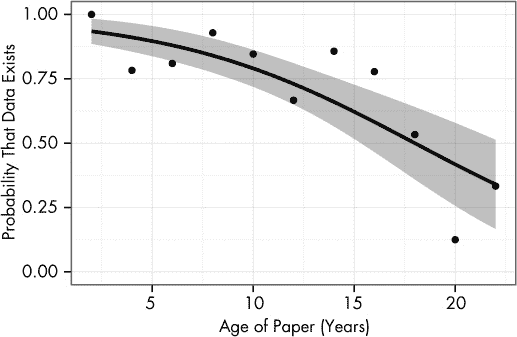

# 第十一章 数据的隐藏

我曾谈到过科学家常犯的错误，以及发现这些错误的最佳方式是进行一些外部审查。同行评审提供了部分审查，但他们没有时间对数据进行广泛的重新分析或检查代码中的拼写错误——他们只能检查方法是否合理。有时他们会发现明显的错误，但微妙的问题通常被忽略。^(1)

这也是为什么许多期刊和专业学会要求研究人员在要求时将他们的数据提供给其他科学家的原因。完整的数据集通常太大，无法在期刊的页面上发布，而且结果的在线发布也很少——在顶级期刊上，只有不到 10% 的论文会在线提供完整数据，而选择性地发布部分结果更为常见。^(2) 相反，作者只会在其他科学家要求副本时报告他们的结果并提供完整数据。也许他们会发现一个错误或是原作者忽略的某种模式，或者他们可能利用这些数据调查一个相关话题。理论上是这样的。

# 被困的数据

2005 年，Jelte Wicherts 和阿姆斯特丹大学的同事决定分析几本美国心理学会（APA）主要期刊上所有近期的文章，以了解它们的统计方法。他们选择 APA 部分原因是因为该期刊要求作者同意与其他心理学家共享数据，以便验证他们的论点。但六个月后，他们仅从 249 项研究中收到了 64 项研究的数据。几乎四分之三的作者从未提供他们的数据。^(3)

当然，科学家们都是忙碌的人。也许他们根本没有时间整理他们的数据集，制作描述每个变量含义及其测量方法的文档，等等。或者他们的动机是自我保护；也许他们的数据并不像他们所声称的那样具有决定性。Wicherts 和他的同事决定进行测试。他们深入查阅了所有的研究，寻找可以通过阅读论文发现的常见错误，如统计结果不一致、统计测试使用不当和普通的拼写错误。至少一半的论文存在错误，通常是些小错误，但有 15% 的论文报告了至少一个统计学上显著的结果，这个结果之所以显著，仅仅是因为出现了错误。

接下来，Wicherts 和他的同事寻找这些错误与不愿分享数据之间的关联。结果发现二者之间有明显的关系。不愿共享数据的作者更有可能在论文中犯错，而他们的统计证据往往较弱。^(4) 由于大多数作者拒绝分享数据，Wicherts 无法深入挖掘更深层次的统计错误，可能还隐藏着更多问题。

这无疑不能证明作者隐藏他们的数据，因为他们知道自己的结果存在缺陷或不强；有许多可能的混杂因素。相关性并不意味着因果关系，但它确实会挑眉示意，偷偷指向并嘴里嘀咕着：“看那边。”^([19]) 而且，令人惊讶的高错误率展示了为什么数据应该共享。许多错误在已发布的论文中并不明显，只有当有人重新从头分析原始数据时，才会被注意到。

## 分享的障碍

分享数据并不总是像在线发布电子表格那么简单，尽管某些领域确实提供了便利。有基因测序数据库、蛋白质结构数据银行、天文观测数据库以及包含成千上万科学家贡献的地球观测数据集。然而，医学数据尤其复杂，因为它必须仔细剔除任何可能泄露患者身份的信息。而且制药公司强烈反对共享数据，理由是这些数据属于专有信息。例如，考虑欧洲药品管理局（EMA）的情况。

2007 年，来自北欧 Cochrane 中心的研究人员向 EMA 索要有关两种减肥药的数据。他们正在进行一项关于这些药物有效性的系统性回顾，并且知道作为允许药物进入欧洲市场的主管机构，EMA 会有制造商提交的试验数据，这些数据可能尚未公开发布。但是，EMA 以可能“无理地破坏或损害个人或公司的商业利益”为由，拒绝披露数据，认为公开这些数据会揭示其试验设计方法和商业计划。他们拒绝了这一论点，认为隐瞒数据不会伤害患者。

在经过三年半的官僚争论，并且审查了每个研究报告且未发现任何秘密商业信息后，欧洲监察专员最终命令 EMA 发布相关文件。与此同时，其中一款药物因副作用，包括严重的精神健康问题，已被从市场撤回。^(5)

学者们也用类似的理由来保密他们的数据。虽然他们并不担心商业利益，但他们*确实*担心竞争对手。共享数据集可能意味着被一个利用免费的数据，抢先取得你花费数月和成千上万美元收集的数据的寄生虫超越。因此，在某些领域，普遍的做法是，只有当数据对你不再有用时——也就是你已经尽可能多地发表了相关论文——才考虑共享数据。

害怕被超越是学术界的一个强大障碍，因为职业发展取决于在知名期刊上发表大量论文。初级科学家无法承担在某个项目上浪费六个月时间的风险，最终被他人抢先发表。与篮球不同，学术界没有助攻的荣誉；如果你无法获得合作作者的署名，那为什么还要与别人共享数据呢？虽然这种看法与科学快速发展的更广泛目标相悖，但对于实际工作的科学家来说却非常有说服力。

除了隐私、商业利益和学术竞争外，数据共享还面临实际问题。数据通常以各种科学仪器或分析软件生成的特殊格式存储，而电子表格软件则将数据保存为专有或不兼容的格式。（不能保证你的 Excel 电子表格或 SPSS 数据文件 30 年后仍然可以读取，甚至不同软件的同事也未必能打开。）并非所有数据都可以轻松地以电子表格形式上传——比如，记录了数小时视频的动物行为研究，或是由数小时访谈支持的心理学研究呢？即使找到了足够的存储空间来存档数百小时的视频，谁来承担费用？又有谁会去观看它呢？

发布数据还要求研究人员提供数据格式和测量技术的描述——使用了什么设备设置，如何进行校准等等。实验室组织通常是杂乱无章的，因此研究人员可能没有时间整理他们的电子表格和手写笔记；其他人可能没有办法共享数 GB 的原始数据。

## 数据衰退

另一个问题是，在计算机更替、技术过时、科学家迁移到新机构、学生毕业离开实验室时，数据的追踪变得困难。如果数据集不再被创作者使用，他们就没有动力维护一个精心组织的个人数据集档案，特别是当数据需要从软盘和档案柜中重新构建时。一项针对 1991 年至 2011 年间发表的 516 篇文章的研究发现，数据可用性的概率随时间推移而衰减。对于超过 20 年的论文，不到一半的数据集是可用的。^(6),^(7) 一些作者无法联系到，因为他们的电子邮件地址已更改；其他人回复说他们可能有数据，但数据存储在软盘上，而他们不再有软盘驱动器，或者数据存储在被盗的电脑上，或因其他原因丢失。这一衰减过程在图 11-1 中有所展示。^([20])

图 11-1. 随着论文变老，它们的数据存在的概率逐渐降低。实线为拟合曲线，灰色区域为其 95%的置信带；各点表示每个年龄段论文的平均可用率。该图仅包含能联系到作者的论文。

各种初创公司和非营利组织正在尝试解决这个问题。例如，Figshare 允许研究人员上传数以 GB 计的数据、图表和演示文稿，并以任何文件格式公开共享。为了鼓励共享，提交的内容会被分配一个数字对象标识符（DOI），这是一种常用来引用期刊文章的独特 ID；这使得在重新使用数据时能够轻松引用数据的原始创作者，给予他们在学术上的认可。Dryad 数字库与科学期刊合作，允许作者在文章提交过程中存储数据，并鼓励作者引用他们依赖的数据。Dryad 承诺将文件转换为新的格式，以应对旧格式的过时问题，防止数据随着程序无法读取而逐渐消失。Dryad 还在多个大学保留数据副本，以防数据丢失。

最终目标是让你更容易获得因发表和重用你的数据而获得的荣誉。如果另一个科学家利用你的数据做出了重要发现，你可以享受这份间接的荣耀，引用你的数据也可以像引用你的论文一样列出。有了这个激励，科学家们可能会更加愿意付出额外的努力，将数据集存储在网上。但这就足够了吗？科学实践的变化非常缓慢。而且，是否会有人检查数据是否有错误？

# 只需忽略细节

很难要求获取你不知道是否存在的数据。期刊文章通常是对它们所报告的多年研究的高度概括，科学家们通常倾向于报告那些有效的部分。如果某个测量或测试对最终结论不重要，它就会被忽略。如果研究中测量了几个结果，其中一个显示统计上没有显著变化，除非这个不显著的结果特别有趣，否则不会提及。

期刊空间限制常常迫使研究者省略负面结果和详细的研究方法。许多主要期刊对文章的字数有限制：例如，《柳叶刀》要求文章少于 3,000 字，而《科学》要求文章少于 4,500 字，并建议在文章的在线附录中描述方法。像《PLOS ONE》这样的纯在线期刊由于不需要支付印刷费用，因此没有字数限制。

## 已知的未知

我们可以评估研究，看看它们遗漏了什么。领导医学试验的科学家需要在试验开始前向伦理审查委员会提供详细的研究计划，因此一组研究人员从丹麦的一个审查委员会获得了这些协议的集合。^(8) 这些协议规定了招募多少患者、将测量哪些结果、如何处理缺失数据（如患者退出或样本丢失）、将进行哪些统计分析等。然而，许多研究协议缺少了重要的细节，而且很少有已发表的论文与协议相匹配。

我们已经看到，收集足够大样本数据对研究的重要性，大多数伦理审查委员会的文件详细列出了用于确定合适样本量的计算方法。然而，少于一半的已发表论文详细描述了样本量的计算。看起来，招募临床试验患者也很困难——一半的研究招募的患者数量与原计划不同，有时研究人员没有解释为什么会发生这种情况，或者这种变化可能对结果产生什么影响。

更糟糕的是，许多科学家省略了结果。评审委员会的文件列出了每项研究将测量的结果：副作用发生率、患者报告的症状等。这些结果的统计显著性变化通常会在已发布的论文中报告，但统计上不显著的结果则被省略，仿佛研究人员从未测量过这些结果。显然，这会导致隐性多重比较。一项研究可能监测多个结果，但只报告其中统计显著的少数几个。一个普通读者永远不会知道该研究曾监测过不显著的结果。在调查时，大多数研究人员否认省略结果，但评审委员会的文件却与他们的说法相矛盾。每篇由否认省略结果的研究人员撰写的论文实际上都未报告某些结果。

## 结果报告偏倚

在医学领域，证据的金标准是对许多精心设计的随机试验进行的荟萃分析。例如，Cochrane 协作组是一个国际志愿者团体，系统地回顾关于医学各个问题的已发布随机试验，然后生成一份报告，概述该领域的当前知识以及最有证据支持的治疗方法和技术。这些报告以其全面的细节和方法学的严格性而著称。

然而，如果无趣的结果从未出现在同行评审的出版物中，或因细节不足无法提供有效信息，那么 Cochrane 研究人员将永远不会将其纳入回顾，从而导致所谓的*结果报告偏倚*，使得系统评价倾向于更加极端和更具吸引力的结果。如果 Cochrane 评价的目的是评估某种特定类固醇药物治疗早产妇女的效果，且目标结果是婴儿死亡率，那么如果一些已发布的研究收集了死亡数据，但因为数据在统计上不显著而没有详细描述，那么这种情况是无效的。^([21])

对 Cochrane 系统评价的系统回顾显示，超过三分之一的研究可能受到结果报告偏倚的影响。评审人员有时未意识到结果报告偏倚的存在，而是误认为该结果根本没有被测量。虽然无法确切量化如果未发表的结果被纳入后，评审结果将如何变化，但根据他们的估计，五分之一的统计显著性结果可能变得不显著，四分之一的效果大小可能下降 20% 或更多。^(9)

其他评论也发现了类似的问题。许多研究存在数据缺失的问题。一些患者退出研究或未按时参加计划的检查。尽管研究人员常常指出数据缺失的情况，但他们通常没有解释原因，也没有描述在分析中如何处理缺失数据的患者，尽管缺失数据可能导致偏倚的结果（例如，如果有副作用最严重的患者退出并未被计入统计）。^(10) 另一项医学试验的回顾发现，大多数研究忽略了重要的研究方法细节，如停药规则和效能计算，发表在小型专业期刊的研究往往比那些发表在大型综合医学期刊的研究表现更差。^(11)

医学期刊已经开始通过制定标准来应对这个问题，比如 CONSORT 检查单，它要求报告统计方法、所有测量结果以及试验开始后任何设计更改。作者必须在提交研究之前遵循检查单的要求，编辑也会检查确保所有相关细节都已包含。该检查单似乎有效；在遵循该指南的期刊上发表的研究通常会报告更多的关键细节，尽管并非所有细节都有报告。^(12) 不幸的是，这些标准的执行不一致，许多研究常常因缺失细节而被通过。^(13) 期刊编辑需要更加努力地执行报告标准。

当然，低报并非医学所独有。三分之二的学术心理学家承认，他们有时会在论文中省略一些结果变量，导致结果报告偏倚。心理学家们还经常在同一篇论文中报告多个实验，从不同角度测试相同的现象，而一半的心理学家承认，他们只报告那些成功的实验。尽管大多数调查受访者同意这些做法可能站不住脚，但这些做法仍然存在。^(14)

在生物学和生物医学研究中，问题往往不在于患者入组或效能计算的报告，而在于实验中使用的众多化学物质、转基因生物、有特殊培育的细胞系和抗体。研究结果往往高度依赖这些因素，但许多期刊并没有针对这些因素制定报告指南，而且大多数生物医学论文中提到的化学品和细胞并不具备唯一的可识别性，即使在有严格报告要求的期刊中也是如此。^(15) 尝试复制研究结果，如同前面提到的拜耳和安进的研究人员一样，你可能会发现很难准确地复制实验。如果免疫学论文中没有说明从供应商处订购哪些抗体，你又如何复制这个实验呢？^([22])

我们看到已发表的论文表现不佳。那么，*未发表*的研究又如何呢？

# 文件柜中的科学

你之前已经看到了多重比较和事实膨胀对研究结果的影响。这些问题出现在研究进行大量低统计效力的比较时，导致假阳性率较高，并且效应量的估计被夸大，这些问题在已发表的研究中随处可见。

但并非每项研究都能被发表。例如，我们只看到一小部分医学研究，因为很少有科学家愿意发布“我们尝试了这种药物，但似乎没有效果”的研究。此外，知名期刊的编辑必须保持其发布开创性结果的声誉，而同行评审者通常对负面结果有天然的偏见。当审阅者面对具有相同方法和写作的论文时，他们会更严厉地评判负面结果的版本，并发现更多的研究方法错误。^(16)

## 未发表的临床试验

考虑一个例子：关于肿瘤抑制蛋白 TP53 及其对头颈癌影响的研究。许多研究表明，TP53 的测量可以用于预测癌症的死亡率，因为它在调节细胞生长和发育方面起着作用，因此必须正常运作才能防止癌症。当对所有 18 项已发表的 TP53 与癌症相关的研究进行汇总分析时，结果显示出一个高度统计显著的相关性。TP53 显然可以通过测量来预测肿瘤有多大可能致命。

但假设我们挖掘出有关 TP53 的*未发表*结果：这些数据曾在其他研究中提及，但并未公开或分析。将这些数据加入分析后，统计上显著的效果消失了。^(17) 毕竟，少数作者愿意发布没有相关性的数据显示，元分析只能使用一个有偏的样本。

一项类似的研究调查了由辉瑞公司销售的抗抑郁药物 reboxetine。几项已发表的研究表明，与安慰剂相比，它是有效的，这也促使一些欧洲国家批准将其作为处方药用于抑郁症患者。负责评估医疗治疗的德国质量与效率研究所设法获得了辉瑞公司未发表的临床试验数据——这些数据是已发表数据的三倍——并进行了仔细分析。结果是：reboxetine 并无效果。辉瑞公司通过忽略那些表明该药物无效的研究，才成功地让公众相信它是有效的。^(18)

对 12 种其他抗抑郁药的类似回顾发现，在提交给美国食品药品监督管理局（FDA）审批过程中的研究中，绝大多数负面结果从未被发布，或者较少地被发布时会强调次要结果。^(19)（例如，如果一项研究同时衡量了抑郁症状和副作用，可能会淡化抑郁症的微弱效果，而强调显著减少的副作用。）虽然负面结果可以提供给 FDA 以做出安全性和有效性评估，但临床医生和学术界在决定如何治疗患者时却无法获得这些结果。

这个问题通常被称为*出版偏倚*，或*文件抽屉问题*。许多研究由于没有发表而长年积存在文件抽屉中，尽管它们本可以贡献宝贵的数据。或者，在许多情况下，研究被发布，但省略了无趣的结果。如果他们衡量了多个结果，例如副作用，他们可能仅仅说某一效应是“无显著性”的，而没有给出任何数字，完全省略对该效应的提及，或者引用效应量但没有误差条，未给出关于证据强度的信息。

尽管这令人担忧，但问题不仅仅是已发布结果的偏倚。未发布的结果会导致重复劳动——如果其他科学家不知道你已经做过一项研究，他们可能会重复进行，浪费资金和精力。（我曾听到科学家讲述过这样的故事：在会议上谈论某种不起作用的技术，结果发现会场里有几位科学家已经做过同样的实验，但并未发表。）资助机构开始怀疑为何他们必须支持如此多关于相同主题的研究，而更多的患者和动物将被卷入实验。

## 识别报告偏倚

有可能测试出版和结果报告偏倚。如果一系列研究已在某一主题上进行，并且系统评价已根据已发布的数据估算出效应量，你可以轻松计算出每个个别研究在评审中的统计效能。^([23])假设，例如，效应量是 0.8（某个任意尺度上），但该综述包含了许多小规模的研究，每项研究的统计效能为 0.2。你会预期只有 20%的研究能发现该效应——但你可能会发现，90%或更多已发布的研究找到了该效应，因为其余的研究被丢弃了。^(20)

这个测试已被用于发现神经学动物实验研究中的令人担忧的出版偏倚。^(21) 动物实验的伦理正当性基于其对科学和医学进步的贡献，但强烈的结果报告偏倚的证据表明，许多动物被用于那些未发表的研究中，未对科学记录作出任何贡献。

相同的测试曾在心理学中的一起著名争议中使用：达里尔·贝姆 2011 年发表的研究，声称有证据表明“异常的逆向认知和情感影响”，即预测未来的超感官能力。该研究经过同行评审后在一份有声望的期刊上发表，但出版后立即遭到怀疑的科学家的负面反应。随后几篇论文揭示了他分析中的缺陷，并提出了其他统计方法，这些方法得出了更为合理的结果。有些过于技术性，无法在此详细介绍，但其中一项与此直接相关。

格雷戈里·弗朗西斯想知道贝姆是否通过出版偏倚获得了他的良好结果。知道自己的发现不容易被人相信，贝姆在同一研究中不仅发表了一项实验，而是发表了 10 项不同的实验，其中 9 项显示出统计学意义上的超感官能力。这似乎有说服力，但前提是没有大量未报告的研究结果显示没有超感官能力。弗朗西斯发现，贝姆的成功率与其统计功效不匹配——这实际上是出版偏倚的结果，而不是超感官知觉。²²

弗朗西斯发表了许多类似的论文，批评其他著名心理学研究，指责它们存在明显的出版偏倚。他显然遍查了心理学文献，一直到找到出版偏倚的证据为止。直到有人注意到这一讽刺情况，²³这一做法才得以停止。关于出版偏倚对出版物的影响，心理学文献中至今仍在激烈辩论。

## 强制披露

监管机构和科学期刊一直试图遏制出版偏倚。美国食品药品监督管理局要求某些类型的临床试验在开始之前通过其网站 ClinicalTrials.gov 进行注册，并要求在试验结束后一年内在 ClinicalTrials.gov 网站上发布总结结果。为了帮助执行注册，国际医学期刊编辑委员会在 2005 年宣布，不会发表未进行预注册的研究。

合规性一直较差。对 2008 年 6 月至 2009 年 6 月期间注册的所有临床试验进行的随机抽样显示，超过 40%的研究方案是在首位研究参与者招募后*才*注册的，中位数延迟的研究方案注册时间为 10 个月。²⁴这显然违背了要求提前注册的目的。不到 40%的研究方案清楚地说明了研究的主要结果、测量的时间框架以及用于测量的技术，这一点令人遗憾，因为主要结果是研究的*目的*所在。

类似地，已注册的临床试验的回顾研究发现，只有约 25% 的试验遵守了要求通过 ClinicalTrials.gov 发布结果的法律。^(25),^(26) 另有四分之一的已注册试验没有在*任何地方*发布结果，无论是在科学期刊中还是在注册库中。^(27) 看起来，尽管有法律的强制性，大多数研究人员忽视了 ClinicalTrials.gov 结果数据库，并选择在学术期刊上发表结果，或者根本不发表；美国食品药品监督管理局并未对任何未遵守规定的制药公司罚款，期刊也没有始终如一地执行注册试验的要求。^(5) 大多数同行评审者在审查稿件时并不检查试验注册库与稿件之间的差异，他们认为这是期刊编辑的责任，而编辑也并未进行检查。^(28)

当然，这些报告和注册要求并不适用于其他科学领域。心理学等领域的研究人员曾建议通过显著标注预注册研究来鼓励注册，但此类努力并未取得广泛进展。^(29) 其他建议包括提前进行研究协议的同行评审，由期刊在数据收集之前决定是否接受或拒绝该研究；接受的标准仅基于研究设计的质量，而非结果。但这种做法尚未广泛推广。许多研究最终消失不见。

小贴士

+   在公共数据库中注册协议，如 ClinicalTrials.gov，欧盟临床试验注册平台 (*[`www.clinicaltrialsregister.eu`](http://www.clinicaltrialsregister.eu)*)，或其他任何公共注册库。世界卫生组织在其国际临床试验注册平台网站 (*[`www.who.int/ictrp/en/`](http://www.who.int/ictrp/en/)* ) 上维护一个列表，SPIRIT 清单 (*[`www.spirit-statement.org/`](http://www.spirit-statement.org/)*) 列出了协议中应包含的内容。尽可能发布总结结果。

+   记录任何偏离试验协议的情况，并在您的发表论文中讨论它们。

+   尽可能提供所有数据，通过专门的数据库，如 GenBank 和 PDB，或通过通用的数据存储库，如 Dryad 和 Figshare。

+   发布您的软件源代码、Excel 工作簿或用于分析数据的分析脚本。许多期刊允许您将这些作为补充材料与论文一起提交，或者您可以使用 Dryad 和 Figshare。

+   遵循您所在领域的报告指南，如临床试验的 CONSORT，流行病学观察性研究的 STROBE，动物实验的 ARRIVE，或基因关联研究的 STREGA。EQUATOR 网络 (*[`www.equator-network.org/`](http://www.equator-network.org/)* ) 维护了各医学领域的指南列表。

+   如果你获得了负面结果，发布它们！一些期刊可能会因负面结果无趣而拒绝发表，因此可以考虑开放存取的电子期刊，如*PLOS ONE*或*Trials*，这些期刊经过同行评审，但不会因研究结果无趣而拒绝发表。负面数据也可以发布在 Figshare 上。

* * *

^([19]) 笑话无耻地摘自* [`xkcd.com/552/`](http://xkcd.com/552/)*的备用文本。

^([20]) 该图是由研究的作者编写的代码生成的，作者已将其公开并将其数据存储在 Dryad 数字库中。他们的结果可能会比他们所调查的研究结果持续更长时间。

^([21]) Cochrane 协作组织的标志是一张图表，显示了给早产妇女使用类固醇的研究结果。单独来看，这些研究在统计上不显著，但当数据汇总后，很明显这种治疗能够挽救生命。多年未被发现，因为没有人做过全面的回顾来整合可用数据。

^([22]) 我听说即使使用正确的材料，生物实验也可能难以重复，因为它们对实验设置中的微小变化非常敏感。但这不是借口——这是一个严肃的问题。当一个结果只成功过一次时，我们如何将其视为普遍有效的呢？

^([23]) 请注意，如果每项研究的效果测量确实不同，因为研究方法中存在某些系统性差异，这种方法将不起作用。在这种情况下，估算它们的真实效能将更加困难。
