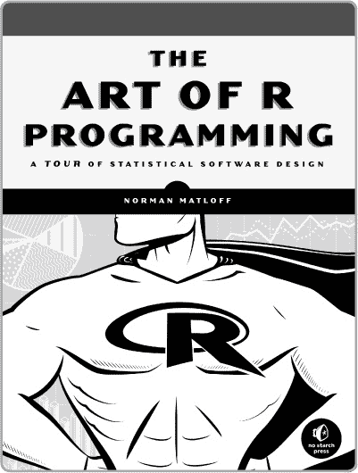
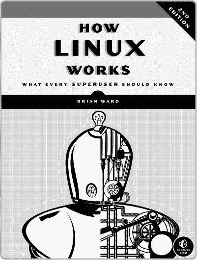
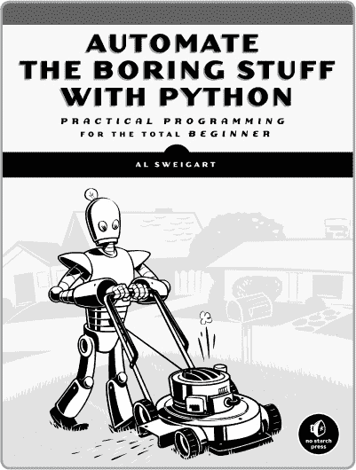
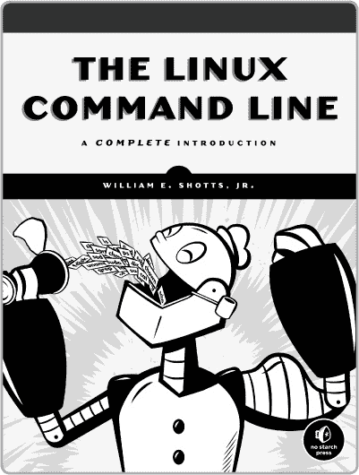
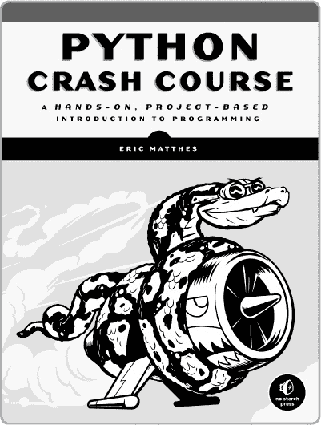

# 附录 C. 更新

访问*[`www.nostarch.com/statsdonewrong/`](http://www.nostarch.com/statsdonewrong/)*获取更新、勘误和其他信息。

*更多实用书籍来自*  NO STARCH PRESS

**R 编程艺术**

**统计软件设计巡礼**

*作者* NORMAN MATLOFF

2011 年 10 月，400 页，$39.95

ISBN 978-1-59327-384-2

**漫画版统计学指南**

*作者* SHIN TAKAHASHI *和* TREND-PRO CO., LTD

2008 年 11 月，232 页，$19.95

ISBN 978-1-59327-189-3

**Linux 工作原理，第 2 版**

**每个超级用户应知道的事项**

*作者* BRIAN WARD

2014 年 11 月，392 页，$39.95

ISBN 978-1-59327-567-9

**使用 Python 自动化无聊的工作**

**面向完全初学者的实用编程**

*作者* AL SWEIGART

2015 年 4 月，448 页，$29.95

ISBN 978-1-59327-599-0

**Linux 命令行**

**全面介绍**

*作者* WILLIAM E. SHOTTS, JR.

2012 年 1 月，480 页，$39.95

ISBN 978-1-59327-389-7

**Python 速成课程**

**一个动手实践、基于项目的编程入门**

*作者* ERIC MATTHES

2015 年 5 月，400 页，$34.95

ISBN 978-1-59327-603-4

**电话：**

800.420.7240 或

415.863.9900

**电子邮件：**

SALES@NOSTARCH.COM

**网址：**

[WWW.NOSTARCH.COM](http://WWW.NOSTARCH.COM)
