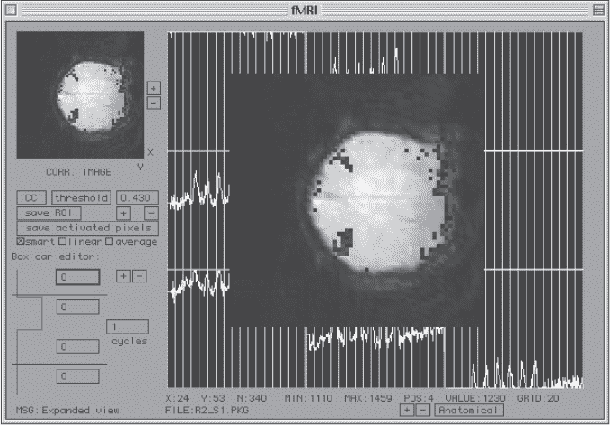

## 前言


我第一次接触编程是在 1980 年夏天。那时使用的是一台 Apple II+计算机。作为当地高中校长，我的父亲能够把它带回家，让我们在夏天玩耍。这是学校里唯一的一台个人计算机。我已经了解了视频游戏，并且拥有一台 Atari 2600 游戏机。但能够让计算机按照我的意愿执行任务的想法，既令人惊讶又充满诱惑。

Apple II+内置了一个名为 Applesoft 的无结构 BASIC 版本。就 BASIC 编程语言而言，它有些局限。然而，它为我打开了一个全新的世界，我沉迷其中，不停地编写一个个小程序，探索 Apple II+的功能和潜力。它能够提问、解释回答、计算公式、绘制图形、发出声音。这一切强大的功能都掌握在我 14 岁的小手指下。

当然，我也想拥有一台属于自己的这类神奇机器。我父亲大概是想让我们却步，他告诉我和我弟弟 Bob，我们可以得到一台这样的计算机，前提是我们学会如何编程。挑战接受！

几个月后，我们如愿以偿，1981 年圣诞节时我们得到了自己的 Apple II+。我至今还保留着它；它就放在离我大约五英尺远的书架上，至今仍能使用。

我和我的兄弟都进入了计算机科学领域。高中时，我自学了 BASIC、6502 汇编语言、Pascal 和 FORTRAN，都是在 Apple II+上学的。我爱上了编程语言，成为了一名编程语言的狂热爱好者。一个高中朋友向我展示了一种既神秘又小巧但功能强大的语言，他用的是 TRS-80 彩色计算机。他告诉我，这种语言叫做“Forth”。我将这个名字记在心里，直到 1990 年代再次遇到它。Forth 是我们将在本书中探索的一种语言，也是我在 1990 年代大部分时间使用的编程语言，而且还是在 Macintosh 电脑上使用的。那时，我的另一种编程语言是 Modula-2，它是 Pascal 的继任者。

多年来，成千上万种编程语言已经被开发出来。我猜想，要详细讲述编程语言的历史可能会需要几卷书。然而，本书的目的并不是讲历史。本书的目的是：

+   让你了解编程语言的起源，并为我们今天使用的编程语言及其包含的结构提供一些背景。

+   解释一些编程语言的基本元素，让你熟悉像*Turing 机*和*Turing 完备*这样的术语。

+   扩展你对编程语言的理解，探索它如何以富有创意和优雅的方式表达思想和过程。我们将通过探索各种编程语言，从不寻常到极其奇特的语言，来实现这一目标。

+   *为了好玩！* 我们将创建我们自己的编程语言，看看如何用它们来实现一些算法。我们甚至会将其中一种编程语言应用到小型计算机上，用于独立项目（如 BBC micro:bit）。

“不寻常到完全怪异”的编程语言有一个名字。它们被称为*异构语言*或*esolangs*。玩弄和开发异构语言是许多人的兴趣爱好，甚至是某些人的严肃追求。大多数异构语言并不用于实际工作（无论什么是“实际工作”）。然而，一些被认为是异构语言世界边缘的语言*确实*用于严肃的工作。例如，Forth 曾在多个 NASA 任务中用于航天器控制，NASA 还开发了一种叫做 CLIPS 的语言，用于专家系统开发。我认为像 Forth 和 CLIPS 这样的语言是“非典型”的编程语言，而像 Python、Java 和 C/C++这样的语言是典型语言。自然，这些标签是主观的，值得辩论。

### **这本书适合谁？**

这本书适合所有编程语言的爱好者。它是献给那些迷恋将思想编码成机器可用形式的人们的。

我希望任何编程的人都能在这本书中找到有价值的内容。我的主要目标是帮助你拓展对编程的理解，了解编程到底是什么，以及如何表达编程。

这本书适合任何比单纯使用计算机更多的人。如果你是专业开发人员，你会欣赏以不寻常的方式思考你的技艺所带来的自由。如果你是学生，希望你能看到编程其实可以比你在入门编程课程中所学到的更多，尽管这些课程是必要的。如果你是爱好者，你可能已经对异构语言有所了解，并希望能进一步激发你的兴趣。快进来，水很适宜。

### **你可以期待学到什么？**

你可以期待了解你所使用的编程语言——也许是每天都在使用——的来源。你可以期待学习关于编程的其他思维方式，从而以新的视角看待你日常编程的工作。

你还可以期待学习编程语言的基本要素，了解是什么使得编程语言能够完备（即能够表达任何程序），以及我们如何知道这类事物的存在。

你可以期待学习一些关于多种编程语言的内容，重点关注异构语言（esolangs）和其他“非典型”语言。正如我上面所说，我几乎整整十年都专门使用 Forth 来编写各种程序，从 Web CGI 框架到功能性脑成像的科学分析工具（见图 1）。我（并不那么）秘密地希望某个聪明的头脑能够看到如何将 CLIPS 的基于规则的专家系统与现代深度学习的强大能力结合起来。我怀疑确实有理由认为这两者应该一起工作。



*图 1：用 Forth 编写的功能性脑成像分析程序（约 1998 年）*

我相信你会发现，开发一门编程语言其实是很有趣的，哪怕这门语言本身用处不大。我们将创建的 Filska 和 Firefly 语言有不同的潜在用途，但即使没有别的用途，Filska 也能做一些数值计算，Firefly 可以在 BBC micro:bit 上画漂亮的图像。附录演示了即便是像 Firefly 这样简单的语言，也可以用于更“高级”的应用，比如遗传编程。

我也希望你能在这里所做的基础上进一步扩展。例如，micro:bit 有两个按钮，为什么不增强 Firefly 使其能使用这两个按钮呢？或者在我们书中提供的 ABC 实现的基础上进行扩展，因为它非常简化，完全可以添加更多功能。如果你这么做了，请分享你的成果给* rkneuselbooks@gmail.com *。

### **我希望你已经具备的知识**

我预期你已经在某种程度上熟悉编程了。我们将使用 Python 来实现几种 esolangs，所以如果你对 Python 有所了解会有帮助。除此之外，我对你是否具备其他背景没有任何期望。你能带给本书最重要的就是好奇心。

有人说好奇心害死猫，但你不是猫。对我们来说，好奇心让人类征服了火，发展了石器工具、文明、艺术、音乐、数学、科学，最终，还制造出了一辆大小如车的机器人，漫游在火星表面——我们给它取名为“好奇号”。

如果你充满好奇，常常问“为什么？”那么你已经具备了阅读本书所需的所有背景知识。

### **本书不是关于什么的**

许多书会告诉你它们是什么，但很少有书告诉你它们不是啥。我认为这本书至少应该稍微澄清一下这一点。

有些大学课程和教材的标题是“编程语言原理”或简称“编程语言”。这些课程和书籍对编程语言进行了高度数学化的阐述。它们很有趣，但也非常技术性，涉及大量的数学和逻辑。我把它们归类为理论计算机科学的范畴。而本书并非这类书籍，你不会在这里找到深奥的数学知识。其逻辑是隐含在代码中的，而非形式化的。这本书是从历史、实践和最重要的角度——乐趣——来讨论编程语言的，尤其注重乐趣。

本书的结尾会引导你深入了解编程语言的更多学术性研究，务必进行探讨。不过，请不要读完本书后觉得你需要成为计算机科学的研究生才能理解它。你不需要。如果你恰好是计算机科学的研究生，请也不要放下这本书。我保证你会从中获得乐趣。

### **关于本书**

本书的连续阅读效果很好。但是，在第三章之后，您可以根据自己的意愿随意跳跃。前三章提供背景和上下文。之后是三章关于非典型编程语言（Forth、SNOBOL 和 CLIPS），然后是五章关于异语言（ABC、FRACTRAN、Piet、Brainfuck 和 Befunge）。

在这两章之后，我们定义、实现并对我们的第一个自制异语言 Filska 进行实验。接下来的两章则为 Firefly 做同样的事情。最后，本书指引你深入了解更多。

附录探讨了使用 Firefly 进行遗传编程。遗传编程是程序演化而非手工编写。Firefly 的简单性使其非常适合这类实验—来看看吧。

### **操作环境**

我们假设 Linux 作为我们的操作系统。具体来说，我们假设一个 Ubuntu 发行版，至少是 20.04 版。我们将探索的语言中没有一种需要大量外部库，因此未来版本的 Ubuntu 很可能不需要太多努力就能运行。

我们在这里不会给出明确的说明，但许多 macOS 用户也能安装这些语言。Windows 用户可能需要在类 Unix 环境（如 Cygwin）中工作，并且需要更多努力找到一些语言的 tarball 并完成安装过程。其他选项包括使用 Windows 子系统 Linux 或在虚拟机中运行 Ubuntu，这两种方法都比使用 Cygwin 更容易。

我们需要一个 C 编译器来构建某些语言。Ubuntu 通常自带用于 C 和 C++的 gcc 编译器套件。您可以使用以下命令测试：

```
$ gcc --version
gcc (Ubuntu 9.3.0-17ubuntu1~20.04) 9.3.0
Copyright (C) 2019 Free Software Foundation, Inc.
This is free software; see the source for copying conditions.  There is NO
warranty; not even for MERCHANTABILITY or FITNESS FOR A PARTICULAR PURPOSE.
```

几乎任何版本的 gcc 都可以使用。

如果 gcc 未安装，并且您从上述命令中收到错误消息，则安装它的最简单方法是

```
$ sudo apt update
$ sudo apt install build-essential
```

完成此操作后，请重复以上命令以验证 gcc 现在是否存在。

我们还将使用 Python 3 自己实现一些语言。Python 3 的确切版本并不重要。Ubuntu 20.04 自带版本 3.8.5，

```
$ python3 --version
Python 3.8.5
```

所以版本 3.8.5 或更高版本就足够了。

现在，引用 Ms. Frizzle 的不朽之言：“冒险，犯错，搞得一团糟！” 准备好了吗？出发吧。
