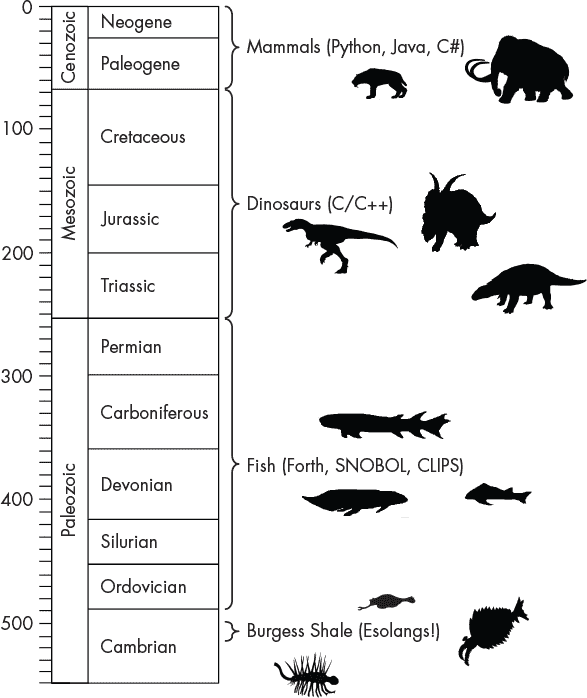
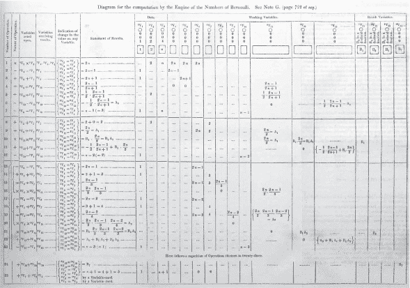
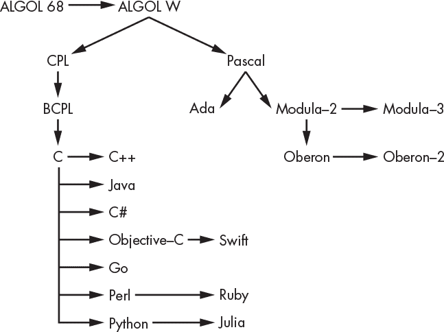
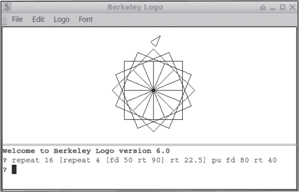
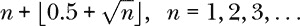

# 第一章：精选编程语言回顾


本书的主要目标是探索思考编码的新方式。做到这一点，将帮助你成为一名更好的程序员，无论你使用的是哪种语言。为了这个目标，回顾现有的编程语言是有意义的，特别是那些首次引入某种特定编码范式或对后来的语言产生了深远影响的语言。

本章讨论的语言不是伪语言（esolangs）。相反，它们是对编码过程的严肃探索，即将思维转化为计算机可以用来解决问题的东西的过程。我们讨论的其中一些语言至今仍在使用，另一些语言曾一度繁荣，后来消亡。还有一些语言演变成了新的形态。这些语言除了有趣并值得学习和实践外，还能教给我们很多东西。

本章将从一点编程语言古生物学开始。接下来，我们将考虑第一批编程语言。即使你仍然是编程的新手，你也已经对编程有了基本的理解，并知道如何进行编码。但这并非一直如此——编程的概念是从某个地方产生出来的。值得我们花时间去了解这一过程。

本章的其余部分是按大致时间顺序排列的一系列小故事，介绍了一些编程语言，随着我们推进本书，它们应该始终存在于我们的脑海中。在接下来的几章中，我们将更详细地探讨一些精选语言，然后再深入研究真正的伪语言。

编程语言有成千上万种（见 *[`www.info.univ-angers.fr/~gh/hilapr/langlist/langlist.htm`](http://www.info.univ-angers.fr/~gh/hilapr/langlist/langlist.htm)*），那么为什么是这组语言呢？我选择了那些对未来编程语言的发展至关重要的语言，因此，这些语言通常代表了编程的新观念，或者在某些方面具有新颖性，能帮助我们理解伪语言。

本章介绍的所有编程语言都在 2000 年之前发明。当然，这并不意味着编程语言的发展在千年虫事件（Y2K）后就停止了。事实上，涌现出了大量新的编程语言：Rust、Scala、Julia、Go、Kotlin 和 Swift 等都是 2000 年后开发的语言。开发新编程语言的浪潮不会停止。然而，目前语言设计的趋势是向多范式语言倾斜，这些语言融合了前人最佳的部分，并以某种方式进行混合，希望能创造出协同效应。换句话说，产生比各部分之和更强大的效果。这一趋势验证了我们对早期语言进行回顾的意义，因为新语言正是通过这种方式进行创新的。

让我们开始吧。

### **编程语言古生物学**

古生物学，字面意思是对古代生命的研究，关注地球上生命的历史以及同样重要的生命多样性，即物种的数量和种类。古生物学家研究的一个重要事件是*寒武纪大爆发*，即在化石记录中突然出现大量各种动物。

与寒武纪大爆发相关的最著名化石遗址是位于加拿大西部的伯吉斯页岩（Burgess Shale）。伯吉斯页岩是一个无价的化石遗址，已有五亿年历史，保存了大量与现存生物完全不同的软体部分。

伯吉斯页岩的生物群完全是海洋生物，拥有一些我们熟悉的代表性生物，如三叶虫，它是化石收藏者的最爱。但伯吉斯页岩的真正明星是一些奇异的动物，比如*奇异虾*（anomalocaris），一种大型捕食者，其各个身体部位最初被误认为是不同的动物，或者是五眼的奥帕比尼亚（Opabinia），它有一只类似象鼻的臂和一只爪子。还有幻影虫（Hallucigenia），一种带刺的、像虫子的生物，最初被描述时是倒过来的，好像它是在用背上的刺在海底行走。

后来的生命，对我们来说是更为主流的生命，尽管多样性较低，但绝对更为熟悉。鱼类主宰了晚期古生代的海洋，最终从水中走出，登上陆地，成为第一批四足动物，这一身体结构一直延续至今，陆生脊椎动物如鳄鱼、翼龙、恐龙、大象和人类几乎没有发生变化。



*图 1-1：编程语言的地质时间尺度*

图 1-1 展示了一个地质历史的时间尺度，其中标出了各个时期的编程语言。

图 1-1 中的剪影显示了当时主导的生命类型。对我们来说，重要的不是时间尺度，而是生命的多样性。现代生命，由新生代时期的哺乳动物所代表，如著名的剑齿虎（Smilodon）和强大的猛犸象，与像 Python、Java 和 C#这样的新兴编程语言有关。这些语言对我们来说非常熟悉，完全不令人惊讶。

对于中生代，我们有恐龙，包括猎食者阿雷克特龙（Alectrosaurus），它在白垩纪晚期肆虐。还有活着的坦克——埃德蒙托尼亚（Edmontonia）和类似水牛的史前恐龙——阿赫洛索龙（Achelousaurus），但它们有着可怕的角。尽管在某些方面有所不同，且可能显得有些古老，恐龙仍然很熟悉，因此我将 C 和 C++与它们放在一起。别以为我在贬低 C 和 C++，请记住，恐龙统治了地球超过 1 亿年，直到今天，它们依然统治着天空，因为鸟类就是恐龙。

后期古生代，鱼类的时代，似乎是一些不寻常但仍不完全陌生的编程语言（如 Forth、SNOBOL 和 CLIPS）的合适背景，我们将在本书中探索这三种语言。那个时代的鱼类轮廓包括鱼鳍类（Eusthenopteron）、有鳍肢的硬骨鱼（Sarcopterygii）以及无颚的装甲鱼（Ostracoderm）。

布尔吉斯页岩，那个有异常大眼怪鱼（Anomalocaris）、奥帕比尼亚（Opabinia）和幻觉螳螂（Hallucigenia）的时代，也是标志性的。布尔吉斯页岩的多样性和独特的身体结构似乎是 esolang 的完美类比——实验性的，或许是进化的死胡同，但同样重要，因为它们推动了可能性边界，在自然选择的重压下，决定了哪些能延续，哪些不能。

对我来说，esolang（另类编程语言）就像布尔吉斯页岩中那些奇异而美妙的动物。像那些动物一样，esolang 是实验，是对可能性的尝试，它们的存在和繁荣虽然可能注定无法持续，但仍然在某种程度上意义重大。布尔吉斯页岩中的动物让古生物学家重新思考并评估他们如何看待古代生命。同样地，如果我们愿意，esolang 也能让我们重新思考并评估我们如何看待编程。

Esolang 很奇怪，往往非常陌生且外星般，但这正是其意义所在。就像布尔吉斯页岩中那些美丽而奇特的动物一样，esolang 探索了以新颖、不寻常的方式填补的空白，这些方式或许不实用，但肯定有趣，最重要的是，充满乐趣。

你看，这里有地质学和计算机科学的结合，没有大规模的恐慌。希望图 1-1 能提供一些思考的材料，或者至少是一种替代的观点。我们会不时地引用图 1-1，但现在，让我们继续前进，探索第一个编程语言。

### **第一个编程语言**

第一个编程语言是什么？没有定义*编程语言*，这是一个很难回答的问题。我们将在第二章中定义我们对编程语言的理解。目前，我们用一个直观的定义：编程语言是将算法编码以控制机器，特别是计算机的工具。

#### ***计算机之前的编程***

可编程机器的概念早于可编程计算机的概念。*贾卡尔织机*（Jacquard loom），一种使用打孔卡片控制的织布机，于 1804 年问世。卡片上的点阵控制着织机中的线的运动，从而指定了编织的图案。这里有一种语言，可以变化以产生不同的输出。改变卡片上的孔洞图案，机器便会出现新的图案。自鸣琴的卷轴工作方式也差不多。

实际上，第一个“现代”计算机设计，查尔斯·巴贝奇的*分析引擎*，受到了雅克布·织布机的影响。尽管分析引擎从未建成，但该引擎具备了现代计算机的所有关键组件，并且可以使用打孔卡进行编程。1843 年，在将分析引擎的一套讲座笔记从法语翻译为英语时，Ada·洛芙莱斯，巴贝奇的长期朋友和著名诗人拜伦勋爵的女儿，写道关于分析引擎的能力和潜在用途。她设想使用分析引擎进行计算，但更进一步，想象引擎可以用于作曲，并释放科学家们从繁琐的计算中解放出来，从而使他们能够进行更高级的思考。在这两个方面，Ada 都是正确的。

翻译，更重要的是，Ada 深刻而聪明的笔记，包含在《泰勒科学回忆录》第三卷的《分析引擎素描》中（1843 年，第 666-731 页）。在线搜索可以快速找到 PDF 版本。我强烈推荐阅读 Ada 的笔记，至少阅读 A 注。然而，对我们来说最重要的是 Ada 的 G 注。在那里，她应用算法到引擎上计算伯努利数，以展示引擎如何计算结果。伯努利数在数学的不同领域中使用，但它们的使用方式对我们不重要。重要的是 Ada 拿出一个算法，并为分析引擎编写了一个通用计算机的程序。因此，可以说 Ada 在 1843 年写了世界上第一个计算机程序。她使用的编程语言是她在 D 注中介绍的*发展图*符号。

图 1-2 展示了 Ada 的程序。详细描述了计算过程中涉及的步骤、变量以及它们在计算过程中的变化。许多人已经将她的程序翻译成现代编程语言。特别值得注意的是，她似乎犯了一个错误，这是世界上第一个计算机错误。



*图 1-2：Ada Lovelace 的分析引擎程序，用于计算第八个伯努利数（1843 年）*

图 1-2 的第 4 步计算`v5 / v4`；然而，正确的计算是`v4 / v5`。通过这种修改，可以将其翻译成现代语言，得到正确的结果：*–* 1/30。在互联网上可以找到 C 语言和 Python 的翻译版本。要了解更多关于 Ada 生活的信息，我推荐詹姆斯·埃辛格（James Essinger）的《Ada's Algorithm》（Melville House，2015）。尽管她的生命如此短暂，她却走在了时代的前列。

#### ***第一批现代编程语言***

第一个现代意义上的编程语言是 *Plankalk**ü**l*，由 Konrad Zuse 在大约 1943 年开发，比 Ada 的首个程序晚了 100 年。Plankalkül 是德文，意为“计划演算”或“计划计算”。Zuse 将 Plankalkül 作为高级编程语言使用，尽管它没有被实现在他的“Z”系列计算机上。该语言支持结构化编程，包括 `for` 和 `while` 循环，浮点运算，数组以及其他现代编程语言中的特性。有趣的是，Plankalkül 的语法是二维的，符号写在其他符号的上方。Zuse 对程序的称呼是“rechenplan”，意为“算术”或“计算”计划。关于 Plankalkül 的良好总结可参见 Bauer 和 Wössner 的文章《Konrad Zuse 的 Plankalkül：今天编程语言的前身》，发表于《ACM 通讯》1972 年第 15 卷第 7 期。

分别应该给予 Lovelace 和 Zuse 信用，作为第一个程序和第一个编程语言的发明者。但是，他们的程序和语言并未在实际的物理计算机上运行。第一个应用于工作计算机的编程语言可能会引发很多争议。早期计算机如 ENIAC 是通过重连线编程的。约于 1948 年的曼彻斯特 Baby 是第一个存储程序计算机，因此从这个意义上说，它拥有一种编程语言——存储在内存中的指令。我们称处理器理解的低级指令为 *机器语言* 或 *机器码*。机器码是一种编程语言，就像汇编语言生成机器码一样。

除了机器码和汇编语言外，第一个应用于实际计算机的编程语言可能是由 John Mauchly 在 1949 年开发的 *Short Code*，并由 William Schmitt 于 1950 年为 UNIVAC I 实现。Short Code 支持算术运算，包括分支和一组库函数，如平方根和绝对值。表达式从代数转写成代码，然后手动打包成六个 2 字节的组，以适应 UNIVAC 的 12 字节字长。Short Code 是解释型的，从程序的标记表示中解析出指令的含义。换句话说，Short Code 的运行方式与上世纪 80 年代早期家用计算机内置的 BASIC 非常相似。在 20 世纪 50 年代的计算机上运行，解释型的 Short Code 执行速度肯定极其缓慢。

第一个真正的编译器，至少根据 Knuth 和 Pardo 在《二十世纪计算的早期发展》（Academic Press，1980）中的描述，是 Alick E. Glennie 在曼彻斯特大学开发的 *AUTOCODE*，大约在 1950–52 年间。与 Short Code 不同，AUTOCODE 是编译型的，意味着它被翻译成了等效的机器码指令。在视觉上，AUTOCODE 看起来有点像是机器码，只是偶尔会插入文本。

在英国 AUTOCODE 及其后继者开发的同时，在美国，格雷斯·霍普（Grace Hopper）、玛格丽特·H·哈珀（Margaret H. Harper）和理查德·K·里奇韦（Richard K. Ridgeway）正在为 UNIVAC 工作编译器：A-0 到 A-2。1954 年，约翰·巴库斯（John Backus）定义了“IBM 数学公式翻译系统，FORTRAN”，并且到 1957 年，首个*FORTRAN*编译器发布。

FORTRAN 的开发是一个分水岭时刻。到了 1950 年代末，编程语言设计进入了高速发展期。除了 FORTRAN 之外，1950 年代后期定义的最著名的语言之一是约翰·麦卡锡（John McCarthy）于 1958 年推出的*Lisp*。令人印象深刻的是，FORTRAN 和 Lisp 至今仍在广泛使用。高性能计算（HPC）常常使用 FORTRAN。书中的后续章节，我们将使用一个版本的 Lisp 来实现一个*FRACTRAN*解释器。我们将专注于 FRACTRAN，它可能是最不寻常的异构语言之一，详细内容见第八章。

最后一种值得注意的 1960 年前编程语言是*COBOL*。它由一个委员会于 1959 年设计，第一版在一年后发布。无论对与错，COBOL 至今仍在使用。与为研究科学家设计的 FORTRAN 和为计算机科学家设计的 Lisp 不同，COBOL 是一种为商业用途设计的语言。COBOL 程序结构高度规范，严格且冗长。例如，以下是 COBOL 60 报告中定义语言的一个片段：

```
IF X EQUALS Y THEN MOVE A TO B; 
OTHERWISE IF C EQUALS D THEN MOVE A TO D AND
IF Y EQUALS Z THEN ADD B TO C
```

编程语言发展的初期，形成了通用编程语言的基本形式和概念。从这个时期产生的三种关键语言是 FORTRAN、Lisp 和 COBOL，这三种语言至今仍在使用。

FORTRAN 是处理计算机当前主要用途——数字计算的自然选择。COBOL 是一个早期的例子，认识到计算机的商业用途不同于科学用途。Lisp 远远领先于其时代，但慢速、资源受限的计算机使得 Lisp 未能实现其潜力。

现在让我们来看看 10 种不同的编程语言。这些语言代表了编程语言发展的重大转折点，因为它们引入了新的概念，或者因其流行度的增长，或使编程这一神秘的艺术能够为更多的人所掌握。

### **ALGOL**

我们将要考虑的第一种语言，*ALGOL*，催生了整整一代编程语言，并且至今仍然影响着编程语言的发展。ALGOL 像 COBOL 一样，是由一个委员会设计的。

ALGOL 是一种编译型、结构化、命令式编程语言，这意味着它对现代程序员来说看起来很熟悉。受到 ALGOL 启发的后续编程语言包括 Simula、PL/I 和 Pascal，稍后会提到。ALGOL 捕捉了*命令式编程*的本质：一种结构化的方式，按步骤向计算机发出指令。

清单 1-1 是一个简单的程序，用来比较两个整数。

```
#  Ask for two ints and report their relationship #
( print("enter an integer: ");
  INT a = read int;
  print("now enter another integer: ");
  INT b = read int;
  IF (a > b) THEN
    print((a, " is greater than ", b, new line))
  ELSE 
    IF (b > a) THEN
      print((b, " is greater than ", a, new line))
    ELSE
      print((a, " is equal to ", b, new line))
    FI
  FI )
```

*清单 1-1：在 ALGOL 68 中比较数字*

即使你不懂这门语言，如果你了解任何现代结构化编程语言，应该对这种形式很熟悉。注意，程序以`(`开始，以`)`结束，而不是`BEGIN`和`END`。后者同样有效，并且是 Pascal 或 Modula-2 用户所期望的，但 ALGOL 的自由格式方法允许使用括号来表示代码块。

如果你有兴趣尝试 ALGOL，可以参考 Marcel van der Veer 的“Algol 68 Genie”实现（请见* [`jmvdveer.home.xs4all.nl/en.algol-68-genie.html`](https://jmvdveer.home.xs4all.nl/en.algol-68-genie.html)*），该实现支持 Linux 和 Windows 系统。你可以在他的网站上找到详尽的文档，那里有学习这门语言所需的一切。Ubuntu 包名是`algol68g`。列表 1-1 位于*bigger.a68*文件中。要运行它，只需输入

```
> a68g bigger.a68
```

图 1-3 展示了 ALGOL 的后代。



*图 1-3：ALGOL 家族树*

自然，编程语言可以有多种影响因素，但这棵树似乎非常合理。

### **APL**

1962 年，Kenneth E. Iverson 发布了*《编程语言》*，详细介绍了一种以数组为核心设计的新编程语言，凭借着无限的创意，这种语言被命名为*APL*。APL 的一个显著特点是其非标准字符集，这一点有时会让一些潜在的学习者却步。对我们来说，Iverson 使用替代字符的做法，是将 APL 列入我们编程语言名单的一个绝佳理由。然而，真正将 APL 纳入的原因是，它是第一种*数组处理语言*。数组处理是一种我们将在后续章节遇到的范式，但简而言之，它以紧凑的方式对数组进行整体操作。作为现代的比较，可以考虑 Matlab 或 Python 与 NumPy。

APL 会话通常是交互式的。列表 1-2 展示了 GNU APL 的实际操作。用户的输入会缩进，而系统的响应则没有。

```
      x ← ι10        
      10 × x                
10 20 30 40 50 60 70 80 90 100
      y ← 4 4 ρ 16 ? 100
      y
97  5 92 67
49 74 63 29
23 85 56 33
78 77 98 81
```

*列表 1-2：APL 示例*

列表 1-2 的第一行将*ι*100 返回的结果赋值给变量*x*（←）。APL 的许多操作符都有两种模式。如果是单目使用（即作用于单个操作数），则为*单目*；如果是双目使用（即作用于两个操作数），则为*双目*。在这种情况下，*ι*的单目使用返回向量 1 2 3 4 5 6 7 8 9 10，这正是手动输入时的表现。因此，第一行相当于 Python 中使用 NumPy 的`x = np.arange(1,11)`。列表 1-2 中的第二行将*x*的每个元素乘以 10。

*ι*的双目形式会在第一个参数中搜索第二个参数。例如，考虑以下 APL 代码：

```
      x ← 10?10        
      x                               
7 9 4 2 10 5 6 3 8 1                
      xι10
5
```

在这里，我们使用`?`的双目形式将*x*设置为一个由 1 到 10 之间的随机整数（不重复）组成的 10 元素向量。接下来，*ι*的双目形式在*x*中搜索数字 10 并返回其索引值 5。APL 的索引从 1 开始，而不是从 0 开始。如果`?`的双目形式返回 1 到某个上限之间的随机整数，那么`?`的单目形式会做什么呢？如果你猜测返回一个随机整数，那么你是对的：`?`*n*返回一个在[1, *n*]之间的随机整数。

图 1-2 中的第二个赋值将*y*设置为一个 4 × 4 的随机整数矩阵，整数范围在[1, 100]之间。我们使用`?`请求 16 个数字，然后使用*ρ*（rho）将 16 元素的向量重塑为 4 × 4 的矩阵，并将其赋值给*y*。要索引向量或数组，使用（竖直矩形）进行索引，例如 3  *x*来访问向量*x*的第三个元素，或者 2 3  *y*来访问矩阵*y*的*y*[23]。

APL 的一个特点是表达式从右到左进行评估，没有运算符优先级规则。因此，必须使用括号来强制执行期望的行为。例如，根据 APL，下面两个表达式中的第一个是完全正确的。

```
 3 × 6 + 2
24
      (3 × 6) + 2
20
```

几乎所有其他编程语言都会告诉你，这两个表达式的结果都是 20，因为乘法会在加法之前执行。然而，APL 将第一个表达式解析为“先加上 2 和 6 得到 8，再乘以 3 得到 24。”

APL 紧凑且功能强大，但也非常晦涩，因此具有较高的学习曲线。更不用说早期使用其替代字符集的困难，这限制了它的使用。也许正因为这些困难，Iverson 和 Roger Hui 在 1990 年代初开发了*J*，一种基于 ASCII 的 APL 版本（*[`www.jsoftware.com/`](https://www.jsoftware.com/)*）。J 保留了 APL 的强大功能，并扩展了其能力，使其在现代计算机系统上更具实用性。然而，像 APL 一样，J 也有较高的学习曲线，学习它能够为编程带来新的思维方式，从而产生高回报的潜力。

### **BASIC**

几乎所有在 1980 年代使用过微型计算机的人至少对*BASIC*有所了解。BASIC（“初学者通用符号指令代码”）由约翰·G·凯门尼（John G. Kemeny）和托马斯·E·库尔茨（Thomas E. Kurtz）于 1964 年在达特茅斯学院开发。BASIC 最初是一种非结构化的编程语言，意味着它使用 goto 语句来控制程序流程，旨在面向学生和非专业人士。在 1970 年代末，当微型计算机革命兴起时，大多数计算机都包括了 BASIC，通常是以 ROM 的形式。许多当前的软件工程师学习的第一种编程语言就是 1980 年代个人计算机上的非结构化 BASIC。因此，BASIC 对软件开发的影响深远，至今仍在继续。

BASIC 是解释执行的，且通常将其存储在内存中作为令牌，类似于上文描述的 Short Code。BASIC 作为 *Visual Basic* 存续至今，后者采用结构化编程并且完全面向对象。Visual Basic 仍然是最广泛使用的编程语言之一。

清单 1-3 显示了一个简单的 Apple II BASIC 程序，用于模拟抛硬币。

```
10  HOME
100  REM COIN FLIPPER
110  PRINT : INPUT "HOW MANY FLIPS:";N
120  IF N < 1 THEN  END
130 K = 0:T = 0:H = 0: PRINT
140 C =  INT (2 *  RND (1))
150  IF C = 0 THEN  PRINT "T";:T = T + 1
160  IF C = 1 THEN  PRINT "H";:H = H + 1 170 K = K + 1
180  IF K < N THEN  GOTO 140
190  PRINT : PRINT
200  PRINT H;" HEADS AND ";T;" TAILS"
210  PRINT "DO YOU WANT TO TRY AGAIN?": INPUT A$
220  IF A$ = "Y" THEN  GOTO 10
230  HOME : END
```

*清单 1-3：一个模拟抛硬币的 Applesoft BASIC 程序*

BASIC 使用行号，必须为每一行提供一个行号，用于 `GOTO` 语句的跳转。不同方言的 BASIC 提供了各种命令，但所有方言都有 `GOTO`，许多方言也有 `ON-GOTO`，用于提供一个简单的计算跳转结构。BASIC 还支持通过 `GOSUB` 调用子程序，尽管大多数方言不支持递归。虽然在 1960 年代及以后，许多更严肃的程序员可能对 BASIC 嗤之以鼻，但 BASIC 至今仍在使用，证明了它的实用性。

### **PL/I**

*PL/I（编程语言 1）* 是 IBM 在 1960 年代中期开发的通用编程语言，旨在满足所有用途，从科学到商业。因此，它与 FORTRAN 和 COBOL 直接竞争。IBM 一直在维护 PL/I，并且它目前可用于 IBM 大型主机计算机。该语言本身结构化且命令式，并从 ALGOL、FORTRAN 和 COBOL 中借用了概念，正如人们所期望的那样，这是当时一种万金油式的编程语言。PL/I 从 1970 年代末期到 1990 年代中期一直在稳定使用，代表了旨在满足所有编程需求的首批语言之一。

尽管 PL/I 在 IBM 大型主机上得以延续，但在其他地方的使用几乎可以忽略不计。PL/I 的新开发也可能同样微不足道。作为语言的一个例子， 清单 1-4 显示了一个简单的循环，重复输出“Hello, world!”。

```
hello:proc options(main);
  declare i fixed binary;
  do i = 1 to 10;
    put skip list("Hello, world!");
  end;
end hello;
```

*清单 1-4：一个 PL/I 问候程序*

即便是现在，这个例子依然相当易读，尽管有些啰嗦，需要四个单词来声明一个简单的整数变量。FORTRAN 和 ALGOL 的影响显而易见，通过 FORTRAN 的 `DO` 循环和 ALGOL 的 `END`。

### **Logo**

1967 年，Wally Feurzeig、Seymour Papert 和 Cynthia Solomon 将 *Logo* 赠送给几代学生，这是一个旨在教授编程概念的简化版 Lisp。Logo 在希腊语中意味着“单词”或“思想”，旨在促进学生思考编程，特别是思考给定命令后 Logo 海龟将如何表现。

图 1-4 显示了一个简单的 Logo 会话。用户在屏幕底部输入命令，三角形的“海龟”会做出响应。



*图 1-4：使用 Logo 海龟绘图*

大多数命令都很容易理解，即使你以前从未接触过 Logo。 图 1-4 中的命令也一样，带有注释

```
repeat 16 [         ; repeat commands in [ ] 16 times
    repeat 4 [      ; repeat commands in [ ] 4 times
        fd 50       ; turtle forward 50 pixels
        rt 90       ; turtle turn right 90 degrees
    ]
    rt 22.5         ; turn right 22.5 degrees
]
pu                  ; pen up
fd 80               ; forward 80 pixels
rt 40               ; right turn 40 degrees
```

内部的`repeat`命令绘制一个正方形，海龟从起点结束。22.5 度的右转使海龟倾斜以绘制另一个正方形。由于 16 × 22*.*5 = 360，16 次重复完成了该模式。最后的指令将海龟移出图案。请注意，这个 Logo 示例是为伯克利 Logo 设计的，其他实现可能会有稍微不同的命令形式。Logo 至今仍用于教导儿童编程概念；请见“海龟学院” (*[`turtleacademy.com/`](https://turtleacademy.com/)*）。由于 Logo 是最早尝试为儿童设计编程语言之一，它在我们的语言殿堂中占有一席之地。

### **Simula**

第一款面向对象语言是*Simula*，由 Kristen Nygaard 和 Ole-Johan Dahl 开发。如其名所示，Simula 最初用于离散时间模拟，并在 1967 年演变为一种通用语言（Simula 67）。Simula 为世界带来了类、对象和继承。以下描述特指 Simula 67。我使用 GNU cim 编译器进行测试（*[`www.gnu.org/software/cim/`](https://www.gnu.org/software/cim/)*），该编译器的构建有些棘手（至少 5.1 版本比较麻烦，这是截至本文撰写时的最新版本）。cim 编译器在调用标准 gcc 编译器构建最终可执行文件之前，会将 Simula 代码转换为 C 代码。

Simula 中的“Hello, world!”程序并不特别引人注目。

```
comment Hello world;
begin
    OutText("Hello, world!");
    OutImage;
    OutText("How are you today?");
end
```

很明显，`OutText`打印某些内容，而`OutImage`显然充当了换行符的角色，正如它所做的那样。从结构上看，Simula 属于 ALGOL 家族，代码块由`Begin`和`End`表示，语句之间用分号分隔。Simula 对大小写不敏感，因此`Begin`和`BEGIN`是等效的。注释以`comment`或感叹号开始，并以分号结束，就像其他语句一样。如果你熟悉 Modula-2 或 Pascal，Simula 的语法应该很熟悉。

Simula 是一种结构化语言，像 ALGOL 一样，支持`for`和`while`控制结构。Simula 的`for`循环比大多数其他语言更为灵活。例如，`for`可以遍历一组值，其中一些值可能指定范围。考虑以下程序：

```
begin
    integer r;
    for r:= 1,1, 3 step 3 until 18, -12 do
    begin
        OutInt(r,5);     OutText(" ");
        OutInt(r*r,5);   OutText(" ");
        OutInt(r*r*r,5); Outimage;
    end
end
```

它输出一个平方和立方表：

```
    1     1     1
    1     1     1
    3     9    27
    6    36   216
    9    81   729
   12   144  1728
   15   225  3375
   18   324  5832
  -12   144 -1728
```

在这里，`r`在循环的前两次迭代中为 1，然后以 3 为步长运行，直到 18，最后是-12。

然而，如果这就是 Simula 所提供的全部，它也不值得讨论。Simula 给予世界的真正贡献是面向对象编程（示例 1-5），为此 Nygaard 和 Dahl 于 2001 年获得了图灵奖。

```
begin
  class Person;
  begin
    text first, last;
    integer age;
    procedure Print;
    begin
      OutText(first); OutText(" ");
      OutText(last); OutText(", age");
      OutInt(age,3); Outimage;
    end;
  end;

  Person class Pal;
  begin
    text nickname;
    procedure Print;
    begin
      OutText(nickname);
      OutText(" is ");
      This Pal Qua Person.Print;
    end;
  end;

  ref(Person) Fred, Barney;
  ref(Pal) Wilma, Betty;

  Fred :- new Person;
  Barney :- new Person;
  Wilma :- new Pal; Betty :- new Pal;

  Fred.first :- "Fred";         Barney.first :- "Barney";
  Fred.last :- "Flintstone";    Barney.last :- "Rubble";
  Fred.age := 37;               Barney.age := 34;

  Wilma.first :- "Wilhelmina";  Betty.first :- "Elizabeth";
  Wilma.last :- "Flintstone";   Betty.last :- "Rubble";
  Wilma.age := 35;              Betty.age := 31;
  Wilma.nickname :- "Wilma";    Betty.nickname :- "Betty";

  Fred.Print;
  Wilma.Print;
  Barney.Print;
  Betty.Print;    
end
```

*示例 1-5：在 Simula 67 中使用类*

Listing 1-5 展示了我们如何定义和使用类。我们定义了两个类，`Person`和`Pal`，后者是`Person`的子类。`Person`使用熟悉的`class`关键字，然后定义了`first`和`last`两个名称作为`text`类型的字符串对象，以及`age`作为整数类型。`Person`定义了一个方法`Print`，用来打印一个人的全名和年龄。

`Pal`是`Person`的一个子类。它添加了`nickname`并重写了`Print`方法，使得在抛出奇怪的行之前输出昵称。

```
This Pal Qua Person.Print;
```

这是调用父类`Person`的`Print`方法的一种方式。短语`This Pal`是对当前对象的引用。它返回对当前对象的引用，类似于 C++中的`this`。短语`Qua Person.Print`将`This Pal`返回的引用解释为一个`Person`对象，因此调用了正确的`Print`方法。（“Qua”源自拉丁语，意思是“以...的身份”或“作为...”）

要使用这些类的实例，我们必须创建引用变量，然后使用`new`将引用分配给实际实例。`:-`运算符将堆上创建的对象分配给引用，而`:=`运算符将值分配给变量。Simula 包括自动垃圾回收，因此不再需要在不再需要对象时手动删除它们。

为了填充对象，我们使用了`:-`和`:=`。字符串是对象，因此`:-`将它们分配给`text`对象，而`:=`用于分配`age`，因为它是一个整数。首先，我们将父类的两个实例`Fred`和`Barney`用名字和年龄进行填充。接着，我们以类似的方式填充了两个`Pal`子类实例`Wilma`和`Betty`，这次还包括了昵称。

Listing 1-5 的目标是调用已填充对象的`Print`方法，产生以下输出：

```
Fred Flintstone, age 37
Wilma is Wilhelmina Flintstone, age 35
Barney Rubble, age 34
Betty is Elizabeth Rubble, age 31
```

请注意，在每个对象上调用了正确的`Print`方法，以生成期望的输出字符串。

Simula 走在时代的前沿。面向对象编程在 Simula 67 发布后的十多年才开始流行，可以说，花了 20 年时间才在商业软件领域得到广泛应用。Simula 与仿真紧密相关，这影响了该语言的采纳。正如我们在这里所看到的，Simula 远远不止是一个仿真语言，甚至现在它也完全符合我们对面向对象语言的期望。

### **Pascal**

Niklaus Wirth 于 1970 年发布了 Pascal 语言。它是 ALGOL 的直接后代，并在 1980 年代广泛使用，主要用于教授结构化编程概念。在非结构化的 BASIC 之后，许多软件工程师将 Pascal 作为他们的第一个“严肃的”编程语言学习。早期版本的 Macintosh 操作系统部分使用 Pascal 编写。UCSD Pascal，随后是像 Turbo Pascal 这样的商业产品，使得 Pascal 语言进入了微型计算机领域。与上面提到的 BASIC 一样，Pascal 对一代开发者产生了深远的影响，更不用说对整个编程语言发展的影响，因此它理应在编程语言的殿堂中占有一席之地。

再看一下 图 1-3。ALGOL 系列语言有两个主要分支，一个基于 C，另一个基于 Pascal。Pascal 分支导致了 Modula-2，Modula-2 克服了 Pascal 的缺点，但从未特别流行，至少在北美是如此。Ada 是美国国防部（DoD）在 1980 年代为所有开发项目创建的标准（Ada 以 Ada Lovelace 的名字命名）。DoD 要求在 1991 年至 1997 年间的项目中使用 Ada。目前，Pascal 已经逐渐被遗忘，Modula-2 及其后代语言，包括 Ada，也变得更加冷门。然而，Pascal 作为 Delphi/Object Pascal 继续存在。作为一种简明的结构化编程语言，尽管不具备面向对象的能力，在 C 和 C++ 崛起后，选择 Pascal 的理由已经不多。

清单 1-6 给我们带来了对语言的感受。

```
program nonsquares;

var
   n : integer;

begin
    for n := 1 to 120 do begin write(n + trunc(0.5 + sqrt(n)):4);
        if (n mod 10) = 0 then writeln;
    end;
    writeln
end.
```

*清单 1-6：生成非平方数整数的序列*

Pascal 看起来与 ALGOL 和 Simula 非常相似。这个程序生成了一个包含 120 个数字的表格。

```
   2   3   5   6   7   8  10  11  12  13
  14  15  17  18  19  20  21  22  23  24
  26  27  28  29  30  31  32  33  34  35
  37  38  39  40  41  42  43  44  45  46
  47  48  50  51  52  53  54  55  56  57
  58  59  60  61  62  63  65  66  67  68
  69  70  71  72  73  74  75  76  77  78
  79  80  82  83  84  85  86  87  88  89
  90  91  92  93  94  95  96  97  98  99
 101 102 103 104 105 106 107 108 109 110
 111 112 113 114 115 116 117 118 119 120
 122 123 124 125 126 127 128 129 130 131
```

仔细看一下表格，你能发现缺少了什么吗？表格包含了所有小于 132 的整数，*除了*所有完全平方数：4、9、16、25、36、49、64、81、100 和 121。程序实现了这个序列。



它具有一个显著的特点，即绕过所有完全平方数，因为 *n* 从 1 开始递增。

Pascal 程序以 `program` 开头，后面是以 `var` 开头的变量声明部分。在这里，我们定义了一个整数变量 `n`。程序的主体位于 `begin` 和 `end.` 之间。请注意，`end` 后面的句号是必需的。代码块也需要被 `begin` 和 `end` 包围。

该程序的主体是一个从 1 到 120 的单一 `for` 循环。循环体是一个 `write` 语句，执行完毕后不会换行。输出的数字是上面方程式中当前 *n* 值的结果。参数 `:4` 告诉 Pascal 将输出右对齐并占据四个空间。代码还要求程序在 `n` 是 10 的倍数时换行。

Pascal 原本是为了教学而设计的，没有非标准扩展的话并不适合系统级编程。Wirth 对 Pascal 进行了增强，开发出了适合系统级编程的 Modula-2。然而，Modula-2 在商业领域从未发挥出其全部潜力。尽管如此，Wirth 的 Pascal 及其后来的编程语言，理所当然地使他获得了 1984 年的图灵奖。

### **Prolog**

大多数编程语言都是命令式的。也就是说，程序就像食谱一样，一系列的“做这个”接着是“现在做那个”。然而，在 *Prolog* 中，情况有所不同。Prolog 是一种 *声明式语言*。关系通过规则编码，Prolog 引擎负责弄清楚如何实现回答用户查询的目标。Prolog 由 Alain Colmerauer 和 Robert Kowalski 于 1972 年创建，至今仍在有限使用中。

一个 Prolog 程序由*事实*、*规则*和*查询*组成。稍后我们会了解它们是什么。用 Prolog 思考与用大多数语言思考截然不同。命令式语言比较自然，面向对象语言是在此基础上进行扩展的。即使是 APL，一旦你理解了它的特殊字符，也能理解其逻辑。但 Prolog 则是一个完全不同的领域。我们这里只是触及它的皮毛。书中的后面章节会专门讨论 CLIPS，它与 Prolog 有些相似，届时我们会深入探讨这种思维模式。

本节展示了两个小型 Prolog 示例。我使用的是 SWI-Prolog（* [`www.swi-prolog.org/`](https://www.swi-prolog.org/) *），可以通过在 Ubuntu 上输入以下命令轻松安装：

```
> sudo apt-get install swi-prolog-nox
```

请参阅 Prolog 官方网站，获取 macOS 和 Windows 版本。

#### ***建模家庭关系***

标准的 Prolog 示例涉及家庭关系。我们的例子位于*family.pl*文件中，最重要的部分展示在清单 1-7 中。

```
male(uranus).
male(cronus).
male(zeus).
--snip--
female(gaia).
female(rhea).
female(hera).
--snip--
parent(uranus, cronus).
parent(gaia, cronus).
parent(cronus, zeus).
--snip--
married(zeus, hera).
married(hephaestus, aphrodite).

father(X,Y) :- parent(X,Y), male(X).
mother(X,Y) :- parent(X,Y), female(X).
child(X,Y) :- parent(Y,X).
sibling(X,Y) :- parent(P,X), parent(P,Y), dif(X,Y).
brother(X,Y) :- sibling(X,Y), male(X).
sister(X,Y) :- sibling(X,Y), female(X). grandparent(X,Y) :- parent(X,A), parent(A,Y).
grandfather(X,Y) :- grandparent(X,Y), male(X).
grandmother(X,Y) :- grandparent(X,Y), female(X).
greatgrandparent(X,Y) :- parent(X,A), parent(A,B), parent(B,Y).
greatgrandfather(X,Y) :- greatgrandparent(X,Y), male(X).
greatgrandmother(X,Y) :- greatgrandparent(X,Y), female(X).
cousin(X,Y) :- sibling(A,B), parent(A,X), parent(B,Y), dif(X,Y).
aunt(X,Y) :- sister(X,A), parent(A,Y).
uncle(X,Y) :- brother(X,A), parent(A,Y).
wife(X,Y) :- female(X), (married(X,Y); married(Y,X)).
husband(X,Y) :- male(X), (married(X,Y); married(Y,X)).
paramour(X,Y) :- child(A,X), child(A,Y), \+ married(X,Y), dif(X,Y).
```

*清单 1-7：Prolog 中的家庭关系*

在我们探索 Prolog 能做什么之前，先来看一下清单 1-7 中的代码。代码的第一部分构建了一个知识库，这是一个事实列表。代码展示了经典希腊神话中众神之间的关系。例如，根据神话，克洛诺斯的父母是盖亚和乌拉诺斯，因此知识库使用`parent(uranus, cronus).`和`parent(gaia, cronus).`来表达这一点。

请注意，Prolog 没有`parent`函数，因此这些语句是关联两个*原子*的事实。原子是通用名称，由一串字符构成，作为符号处理并作为一个单元存在。这里有一个名为`parent`的关系，`gaia`和`cronus`共享这一关系。我们可以将事实理解为“盖亚是克洛诺斯的父母。”类似地，知识库还标记了神祇的性别。`female(hera).`的意思是“赫拉是女性。”注意，事实、规则和查询都以句号结束。知识库确定了性别、父母关系以及两个神是否被认为结婚。这些就是 Prolog 将要处理的事实。为了做一些有趣的事情，我们需要为这些事实配上规则。这是清单 1-7 的第二部分。

使用家庭关系作为例子有助于我们理解，因为我们每个人都对它们非常熟悉。例如，我们定义了一个规则来判断`X`是否是`Y`的父亲，其中以大写字母开头的原子是逻辑变量。Prolog 会尝试通过为这些变量找到值来满足规则。该规则定义的关系是：“如果*X*是*Y*的父母并且*X*是男性，那么*X*就是*Y*的父亲。”

`father(X,Y)` 的左侧为真 *当且仅当* 右侧为真。右侧为真 *当且仅当* `parent(X,Y)` 为真 *并且*（逗号）`male(X)` 为真。Prolog 使用逗号表示“和”，使用分号表示“或”。有了这一点知识，我们就能理解其余的规则。母亲是父母且为女性。某人 `X` 是 `Y` 的孩子，如果 `Y` 是 `X` 的父母。

`sibling` 的规则表示，如果两人有共同的父母，则他们是兄妹。这一点很容易理解。规则的最后部分是 `dif(X,Y)`，它添加了“*X* 和 *Y* 不是同一个人”这一条件。这是因为我们通常不会认为自己是自己的兄弟姐妹。

`wife` 的规则使用了括号和分号表示“或”。`X` 是妻子，如果她是女性且嫁给了 `Y`。Prolog 并不直观地知道规则 `married(X,Y)` 隐含着 `married(Y,X)`，因此会检查两种情况。

最终规则是 `paramour`，因为毕竟我们谈论的是古希腊的神祇。这里，`X` 是 `Y` 的情人，条件是 `A` 是 `X` 和 `Y` 的孩子，`X` 和 `Y` 没有结婚（`\+` 表示“不是”），并且 `X` 和 `Y` 是不同的。阅读 清单 1-7 中的规则，直到你对它们表达的内容感到熟悉为止。

Prolog 程序不是被加载的，而是被 *咨询* 的。该行

```
> swipl family.pl
```

查询 *family.pl*，然后 Prolog 会展示其提示符并耐心等待用户输入。我们来问 Prolog 一些关于神祇的问题，看看它是否能根据我们提供的事实和规则做出回答（参见 清单 1-8）。

```
?- married(zeus,hera).
true.
?- wife(X,zeus).
X = hera ;
false.
?- mother(hera,W).
W = ares ;
W = hephaestus ;
W = eris.
?- mother(X,hera).
X = rhea.
?- mother(X,zeus).
X = rhea.
?- father(zeus,W).
W = ares ;
W = hephaestus ;
W = eris ;
W = athena ;
W = hermes ;
W = apollo ;
W = artemis ;
W = dionysus.
```

*清单 1-8：探索家庭关系*

清单 1-8 展示了一个 Prolog 会话，其中 *family.pl* 已被加载。用户输入以粗体显示，Prolog 的回复跟随其后。首先，我们询问 Prolog 宙斯和赫拉是否结婚。Prolog 回复 `true`，因为这只是其知识库中的一个事实。

接下来，我们让 Prolog 找到一个 `X`，使得 `X` 是宙斯的妻子。注意，规则是这样定义的：`X` 是 `Y` 的妻子，因此查询是 `wife(X,zeus)`，而不是 `wife(zeus,X)`，后者会提出问题“宙斯的妻子是谁？”Prolog 找到一个匹配项，一个使得查询为真的 `X` 绑定：赫拉。用户接着输入粗体分号。Prolog 找到解决方案后，如果无法自行确定查询没有其他解，它会暂停并等待用户输入分号，指示 Prolog 继续寻找更多解决方案。最终的 `false` 是 Prolog 告诉用户没有找到更多解决方案。

然后我们问 Prolog，“赫拉是誰的母亲？”Prolog 正确回答了阿瑞斯、赫淮斯托斯和厄里斯。接着我们问，“赫拉的母亲是谁？”Prolog 又正确回答了瑞亚。接下来的查询告诉我们瑞亚也是宙斯的母亲。古代神祇的家庭关系确实非常复杂。

接下来我们让 Prolog 确定宙斯的孩子。具体来说，我们问：“宙斯的孩子是谁？”并且正确地告诉我们他是另外八个神的父亲，这让赫拉非常恼火。

更多的示例将帮助我们更好地理解 Prolog 的工作原理。列表 1-9 展示了 Prolog 对查询“宙斯的情人是谁？”的回应。

```
?- paramour(zeus,W).
W = metis ;
W = maia ;
W = leto ;
W = leto ;
W = semele.
?- grandmother(X,apollo).
X = rhea ;
false.
?- greatgrandfather(X,artemis).
X = uranus ;
false.
```

*列表 1-9：更多的家庭关系*

注意到丽托被列出了两次。情人的规则是：

```
paramour(X,Y) :- child(A,X), child(A,Y), \+ married(X,Y), dif(X,Y).
```

这意味着，如果 `X` 和 `Y` 不是夫妻关系并且有一个共同的孩子，那么他们就是情人。在神话中，宙斯和丽托有一对双胞胎，阿波罗和阿尔忒弥斯。因此，Prolog 发现丽托和宙斯通过两种不同的方式是情人，一次是阿波罗，另一次是阿尔忒弥斯。有一些方法可以捕捉响应并仅返回唯一的解决方案，但在这里使用它们会使示例变得更加混乱。列表 1-9 中的最后两个查询说明了 Prolog 如何解决涉及祖父母和曾祖父母的查询。

#### ***实现斐波那契数列***

我们最后的 Prolog 示例展示了它如何处理数值数据以及对递归的支持。具体来说，我们将实现斐波那契数列，

```
1 1 2 3 5 8 13 21 34 55 ...
```

该规则可以通过递归的方式表示，即下一个数字是前两个数字的和：

*F[n]* = *F[n–]*[1] + *F[n–]*[2]，*F*[1] = 1，*F*[2] = 1

我们将在第十三章中更详细地讨论斐波那契数列。它是编程语言示例中的一个常见目标。目前，我们将使用一个递归的 Python 实现作为 Prolog 版本的指南。在 Python 中，上面的公式可以实现为：

```
def fib(n):
    if (n <= 2):
        return 1
    else:
        return fib(n-1) + fib(n-2)
```

*n*th 斐波那契数是前两个数的和，或者如果 *n* 小于或等于 2，则为 1。这个函数告诉我们，*F*[11] = 89，这是正确的。那么，如何在 Prolog 中表示斐波那契数列的规则呢？为此，我们首先需要两个事实作为基准情况，*F*[1] = 1 和 *F*[2] = 1。然后，我们需要表达递归关系。列表 1-10 给出了我们需要的内容。

```
fib(1,1).
fib(2,1).

fib(N,F) :-
    N > 2,
    N1 is N-1,
    N2 is N-2,
    fib(N1,F1),
    fib(N2,F2),
    F is F1 + F2.
```

*列表 1-10：递归斐波那契数*

这两个基准案例是事实。第一个斐波那契数是 1，第二个是 1。当 Prolog 最终尝试满足 `fib(2,1)` 时，它会找到这个事实。“返回值”是第二个数字。查询 11th 斐波那契数是 `fib(11,F).` 或者“哪个 F 值使 `fib(11,F)` 为真？”那就是第 11 个斐波那契数。

一般规则是 `fib(N,F)`。其主体是多个条件的合取（即通过“和”连接的子句）。首先，`N > 2` 是否成立？接下来是两个“赋值”，当 `N1` 是 *n –* 1 且 `N2` 是 *n –* 2 时成立。到目前为止，这些语句是有道理的，并且是 Python 定义中的元素。

接下来的两行，`fib(N1,F1)`和`fib(N2,F2)`，一开始显得有些奇怪。这些就是递归调用。第一个尝试通过查找`fib(N1,F1)`使其为真，来找到*F*[*n–*1]。同样，第二个也对*F*[*n–*2]做相同操作。如果找到这些，那么`F1`和`F2`有了意义，最后一行说`F`，我们实际寻找的数字，是`F1`和`F2`的和，必须是前两个斐波那契数。

示例 1-10 的代码在*fib.pl*中。我们开始 Prolog，咨询*fib.pl*，并请求第 11 个斐波那契数：

```
?- fib(11,F).
F = 89 .
```

我们看到我们的示例有效，它给出了与 Python 版本相同的答案。现在，查询`fib(26,F)`并查看 Prolog 需要多长时间来回答。在我的机器上，Python 立即返回 121,393。Prolog 也返回 121,393，但需要 29 秒。双重递归调用使得这个斐波那契实现效率低下。然而，Prolog 极其缓慢的响应验证了对语言的一个常见批评：性能。此外，Unix 工具`top`报告在搜索过程中，Prolog 使用了 0.5%的系统内存，大约 42MB，这对于如此简单的任务来说似乎过高。

跟踪让我们看到 Prolog 如何处理查询。例如，以下是跟踪查询`fib(3,F)`的输出。

```
?- trace.
true.
[trace]  ?- fib(3,F).
   Call: (8) fib(3, _4072) ? creep
   Call: (9) 3>2 ? creep
   Exit: (9) 3>2 ? creep
   Call: (9) _4296 is 3+ -1 ? creep
   Exit: (9) 2 is 3+ -1 ? creep
   Call: (9) _4302 is 3+ -2 ? creep
   Exit: (9) 1 is 3+ -2 ? creep
➊ Call: (9) fib(2, _4304) ? creep
   Exit: (9) fib(2, 1) ? creep
➋ Call: (9) fib(1, _4304) ? creep
   Exit: (9) fib(1, 1) ? creep
   Call: (9) _4072 is 1+1 ? creep
   Exit: (9) 2 is 1+1 ? creep
   Exit: (8) fib(3, 2) ? creep
F = 2 .
```

首先，我们激活`trace`并输入查询：`fib(3,F)`。在每一步，Prolog 会暂停，等待命令。按 ENTER 键进入下一步，并显示`creep`。因此，上面每一行表示进入或退出规则的子目标。临时变量的名称像`_4072`。

跟踪的第一行是查询，`F`有一个临时名称。`8`类似于一个调用深度指示器，因为它在查询被评估时增加，在查询满足时返回到初始值。

如果你跟踪过程，你会看到每一步都在满足特定的子目标，也就是规则右侧的一部分。例如，第一个对表示 3 > 2 为真。第二个对表示 2 = 3 + (*–*1)，这也为真。有趣的是，Prolog 加了一个-1，而不是减去 1。

第一次递归调用 ➊ 立即得到满足，因为`fib(2,1)`是已知的事实，是递归的基本情况之一。第二次递归调用 ➋ 也同样满足，因为`fib(1,1)`也是一个事实。

递归调用被满足后，最终的子目标`F is F1 + F2`可以通过`F=2`来满足。因此，查询`fib(3,2)`现在被满足，Prolog 返回`F = 2`。

`fib(3,F)`的跟踪产生了 14 行输出，而`fib(26,F)`的跟踪，花了近 30 秒返回，产生了 1,456,706 行，达到了基深度之上的最大深度 24。

我们对 Prolog 有些不公平。双重递归的斐波那契算法效率低下，因为它不是*尾递归*。尾递归调用是指最后一次调用是递归部分。尾递归函数可以在不存储当前调用栈帧的情况下实现。递归本质上是跳转到函数的开始，而不涉及调用栈。

示例 1-11 是斐波那契程序的尾递归版本。你可以在文件*fib_tail.pl*中找到它。

```
fib(1,A,F,F).

fib(N,A,B,F) :-
    N > 0,
    N1 is N-1,
    B1 is A+B,
    fib(N1,B,B1,F).
```

*示例 1-11：使用尾递归计算斐波那契数*

这个版本的代码使用了两个额外的变量作为累加器：第二个和第三个参数。基本情况是任何匹配`fib(1,A,F,F)`的调用，其中`F`是所需的数字，`A`是任何其他值。请注意，规则`fib(N,A,B,F)`的最后子目标是递归调用，这与示例 1-10 不同，后者有两个递归调用，但都不是最后的子目标。Prolog 在这里可以使用尾递归，因为在主体中没有内容需要返回。

运行示例 1-11 作为`fib(26,0,1,F)`来计算第 26 个斐波那契数。这次，Prolog 会立即返回 121,383。然后尝试`fib(266,0,1,F)`，看看 Prolog 如何支持任意精度整数。`trace`命令将展示累加器是如何被使用的，最终匹配到`fib(1,A,F,F)`的调用。

如果我们的目标是学会跳出框架思考编码的含义，那么 Prolog 能够促进这种思维方式。把 Prolog 放在你的脑海中。稍后我们会看到类似的方法，当我们在第六章中讨论 CLIPS 时。

### **Smalltalk**

Smalltalk 出现在 1970 年代初，是 Xerox PARC 学习研究小组的产物。它由 Alan Kay、Dan Ingalls 和 Adele Goldberg 设计，作为一种教学语言，类似于 Logo。Smalltalk 是一种面向对象的语言。实际上，它是一种*纯面向对象语言*，意味着一切，甚至数字，都是对象。纯面向对象语言与像 C++这样的非纯语言形成对比。在 C++中，*原始类型*（如整数）不是对象。Smalltalk 对象通过发送消息相互通信。如果一个对象知道如何回复一个消息，那么这个对象就是该消息的有效接收者。

Smalltalk 类支持*鸭子类型*，并且可以随意扩展。鸭子类型允许任何支持特定方法的对象在预期该方法的地方使用。换句话说，如果它走起来像鸭子，叫起来像鸭子，那它就是鸭子。

即使不了解语法，我们也能理解，下面的示例中，`MyClass`定义了一个方法`A`来对它的参数进行平方操作。

```
Object subclass: MyClass [ 
    A: n [ ^n*n ]
]
```

在任何时候，即使`MyClass`的对象已经存在，仍然可以添加一个新的方法来计算立方。

```
MyClass extend [ 
    B: n [ ^n*n*n ] 
]
```

`MyClass` 类，包括任何现有对象，现在知道如何使用方法`B`。

许多 Smalltalk 系统都包括了一个广泛的图形界面。这包括了 Smalltalk-80，这是我们将在此探讨的版本。现代 Smalltalk 系统，如 Squeak (*[`squeak.org/`](https://squeak.org/)* ) 或 Pharo (*[`pharo.org/`](https://pharo.org/)* )，都延续了这一传统。如果 Smalltalk 引发了你的兴趣，不妨看看这两个系统之一或两个系统。然而，我们的重点是 Smalltalk 语言的本质，而不是它的图形功能。因此，我们将使用不带图形功能的 GNU Smalltalk。

如果你想自己跟着做，安装 GNU Smalltalk 的方法是输入：

```
> sudo apt-get install gnu-smalltalk
```

在 macOS 上，你可以通过输入以下命令安装 Smalltalk：

```
$ brew install gnu-smalltalk
```

对于 Windows 用户，我推荐使用 Linux 虚拟机、Windows 子系统 for Linux，或者如果不行的话，使用 Cygwin。

Smalltalk 支持整数、浮动小数、字符串和分数（有理数）。Smalltalk 有一维数组、字典和许多其他容器对象。

本篇小节的目标是学习 Smalltalk 的独特之处，以及它为什么是我们编程语言收藏中的一项有益补充。首先简要讨论一下 Smalltalk 所带来的特色。然后，我们将通过一个完整的 Smalltalk 程序来理解，至少是表面上，类是如何定义和继承的。具体来说，我们模拟了四种不同动物之间的竞赛，每种动物都有自己的 Smalltalk 类：鸟、狼、青蛙和蜗牛。

#### ***基本的 Smalltalk 特性***

GNU Smalltalk 旨在用于脚本编写，就像 Python 或 Perl 一样。例如，以下代码展示了我们的第一个例子：

```
#!/usr/bin/gst
"Smalltalk 'Hello, world!' example"

'' displayNl.
'Hello, world!' displayNl.
'' displayNl.
```

第一行不是标准的 Smalltalk。这是 Unix 系统用来通过指向解释器使脚本可执行的注释行。Smalltalk 中的注释用双引号括起来，而字符串则用单引号括起来。

调用对象方法的一般语法是 <object> <method> 或 <object> <method>: <argument>。一切皆是对象，包括字符串（即使是空字符串）。上面例子中的每一行都定义了一个字符串，然后调用 `displayNl` 方法打印它。注意每一行末尾的句号。Smalltalk 使用句号作为语句分隔符。在类 Unix 系统中，`chmod a+x hello.st` 使 *hello.st* 可执行。GNU Smalltalk 解释器本身是 `gst`：

```
gst
GNU Smalltalk ready

st> 2 + 3 * 6
30
st> 2 + (3 * 6)
20
```

你可以通过按 CTRL-D 退出解释器。

上述表达式应该引起你的注意。Smalltalk 是从左到右进行计算的，不考虑运算符优先级。因此，第一个表达式被解释为 `2+3*6 = 5*6 = 30`。回想一下，APL 是类似的，但它是从右到左进行计算的。在 Smalltalk 中，你可以使用括号来明确表达式的计算顺序。

Smalltalk 的语法简单，但会导致冗长的语句。要定义并基本使用数组，使用：

```
st> x := Array new: 5
(nil nil nil nil nil )
st> x at: 1 put: 3
3 st> x at: 3 put: 'plugh'
'plugh'
st> x
(3 nil 'plugh' nil nil )
```

Smalltalk 使用 `:=` 来进行赋值，因此第一行声明 `x` 为一个包含五个元素的数组。Smalltalk 中的变量默认值为 `nil`。第二行的 `x[0]=3` 在大多数其他语言中是相同的。方法名是 `at`，它接受一个参数，即索引，并有一个关键字参数 `put`。Smalltalk 数组可以存储任何对象，正如上面剩余的代码所示。Smalltalk 数组的索引从 1 开始。

Smalltalk 可能会赢得标准库中最长方法名称的第一奖。考虑以下代码，它用来计算一个子字符串在另一个字符串中出现的次数：

```
st> s := 'Nobody expects the Spanish inquisition!'
st> s countSubCollectionOccurrencesOf: 'i'
5
```

图形化 Smalltalk 系统有一个转录窗口，消息会显示在其中。GNU Smalltalk 使用这个窗口来显示普通输出：

```
st> Transcript show: 'howdy'; cr; show: 'partner'; cr
howdy
partner
```

这个简单的示例展示了几个 Smalltalk 特性。首先，`Transcript` 是一个类的名称，因此我们使用的是类级别的方法，而不是实例方法。其次，Smalltalk 使用分号来调用当前类或对象的方法，在这个例子中就是 `Transcript`。

##### **块**

Smalltalk 中的一个重要概念是 *块*（block），它是位于方括号之间的代码。块类似于无名函数，因为它们可以被赋值给变量并在之后执行。它们还构成了 Smalltalk 控制结构的主体，这些控制结构不过是对对象的方法调用，就像 Smalltalk 中的其他一切一样。考虑以下示例。

```
st> b := [ 'I am a block. I am an island.' displayNl ]
a BlockClosure
st> b value
I am a block.  I am an island.
'I am a block.  I am an island.'
```

我们将 `b` 定义为一个块。块中包含一个打印字符串的语句。为了执行块，我们调用 `value`，它会打印该字符串。引号中的第二个字符串是块的值，即块中的最后一条语句，这里是字符串。在正在运行的程序中，第二个字符串不会显示出来。

块可以接受参数并支持局部变量。

```
st> x := 'number 9'
'number 9'
st> b := [ :i | |y| y:=i. x:=y. z:=y ]
a BlockClosure
st> b value: 42
42
st> x. z. y
42
42
nil
```

理解这个示例非常重要。首先，我们有 `x`，它在块外定义并被设置为一个字符串。接下来，我们定义了块 `b`。它接受一个参数 `i`（冒号是必须的），并定义了一个局部变量 `y`。局部变量在竖线（管道符）之间列出。块的主体将 `y` 设置为参数 `i`，然后使用 `y` 为 `x` 和 `z` 赋值。

这个块使用 42 作为参数被执行。然后我们查看 `x`、`z` 和 `y` 的值。发生了什么？块更新了 `x`，而 `x` 在块外已经存在。它还定义了 `z` *在块外*。我们没有将 `z` 声明为块的局部变量，因此它被定义为全局变量。我们将 `y` 声明为块的局部变量，因此它在块外没有值，因此为 `nil`。这个故事的教训是：如果你希望块中的操作仅限于块内，应该只使用局部变量。作为练习，尝试在 Python 中实现这个示例，定义一个名为 `b(i)` 的函数来代替块。函数中定义的变量不会修改全局定义的变量，除非你显式使用 `global`。Smalltalk 块可能导致意外结果，因此需要小心使用。

##### **控制结构**

Smalltalk 具有预期的控制结构，但由于它们实际上是方法，因此它们的语法比较特殊。让我们快速看一下条件语句、`while`循环和迭代循环。我们无法涵盖所有组合，特别是在迭代方面，但你会大致了解发生了什么。

看看这个简短的程序：

```
v := stdin nextLine asInteger.

(v < 0) ifTrue: [
    a := -1
] ifFalse: [ 
    (v > 0) ifTrue: [
        a := 1
    ] ifFalse: [
        a := 0
    ]
].
```

它通过从标准输入读取下一行并将结果字符串解析为整数，然后将其赋值给`v`，来要求用户输入一个整数。接下来，代码检查`v`是否小于 0、等于 0 或大于 0，并相应地设置`a`的值。

上面的代码看起来像一个`if-then-else`结构，实际上它也像一个，但它并不是一个。这是典型的 Smalltalk 语法`<object> <method>: <argument>`。`ifTrue`方法应用于`(v < 0)`返回的布尔值。如果布尔值为真，则执行将`a`设置为-1 的块。同样，如果布尔值不为真，则会触发`ifFalse`。在块中嵌套是完全可以的，因此第一个`ifFalse`块有自己的`ifTrue`和`ifFalse`方法调用。

在 Smalltalk 中，`while`循环的行为类似。考虑一下：

```
i:=1\. 
[i < 10] whileTrue: [ i displayNl. i := i + 1 ]
```

在这里，不同于`ifTrue`，`whileTrue`应用于一个块`[i < 10]`。如预期的那样，这段代码会显示数字 1 到 9。相同的输出也可以通过下面的代码实现：

```
i:=1.
[i >= 10] whileFalse: [ i displayNl. i := i + 1 ]
```

它会在代码块返回`false`时继续循环。请注意，`while`循环应用于一个块，因此这个块不仅仅是一个简单的布尔表达式，而是只需要返回一个布尔值。以下是一个完全有效的循环：

```
i:=1\. 
[x:=i*i. i < 10] whileTrue: [ i displayNl. i := i + 1 ]
```

其副作用是定义`x`并将其设置为 100。

Smalltalk 中的基本`for`循环是

```
1 to: 10 do: [ :i | i displayNl ]
```

与`if`和`while`一样，循环不是一种结构；它是一个发送给整数对象 1 的消息`to`。第一部分创建一个`Interval`对象，这个对象理解`do`消息。例如，下面的代码产生与之前相同的输出。

```
j := 1 to: 10.
j do: [ :i | i displayNl ]
```

请注意，传递给`do`的参数是一个块，其中`i`是变成循环控制变量的参数。因此，如果我们希望，可以像下面这样做：

```
j := 1 to: 10.
b := [ :i | i displayNl ].
j do: b.
```

第一行定义`j`为一个`Interval`对象，第二行定义`b`为一个块（实际上是一个`BlockClosure`对象），第三行使用`do`将块应用于该区间。

我们已经触及到了 Smalltalk 的核心内容，虽然说实话我们几乎只是沾了点皮毛。Smalltalk 具有简单的语法和丰富的类库，但我们忽略了这些。不过，我们必须继续前进。Smalltalk 全都是关于对象和类的。让我们通过“赛马”来看看是如何运作的。

#### ***赛马***

我们将创建一个小的类层次结构，并用它来让四个动物进行比赛。我们的计划是这样的：

1.  定义一个基类`Animal`，该类响应所有动物共有的消息。

1.  定义四个子类：`Bird`、`Wolf`、`Frog`和`Snail`。这些子类根据动物的移动方式响应消息：分别是`fly`、`run`、`hop`和`crawl`。该类会忽略它不理解的消息。

1.  创建每个动物的实例，并向它们发送随机选择的消息。

1.  显示每个动物移动的距离，并宣布获胜者。

完整的源代码在*race.st*文件中。我们将分段展示源代码，逐步解析。请先通读完整的源代码文件再继续，这样讨论会更容易理解。记住，文件的第一行不是标准的 Smalltalk 代码，它是 Unix 命令，用于将文件作为脚本运行。`-g`选项禁用偶尔的垃圾回收消息。

我们从基类`Animal`开始：

```
Object subclass: Animal [
    | increment distance letter |
    init: inc letter: l [
        letter := l.
        increment := inc.
        distance := 0
    ]
    getDistance [ ^distance ]
    print [
        (distance-1) timesRepeat: [  '-' display ].
        letter displayNl
    ]
]
```

所有 Smalltalk 类都是某个类的子类。对象层次结构的顶部是`Object`类，因此`Animal`是从它继承的。该类有三个成员变量：`increment`（增量）、`distance`（距离）和`letter`（字母）。有三个方法：`init`、`getDistance`和`print`。

`init`方法接受`inc`作为参数，同时接受`letter`这个关键字参数。在 Smalltalk 中，类的实例通常通过`new`创建，初始化在后进行；然而，这个过程是灵活的。我们将调用`init`来设置类实例。在这个例子中，初始化将旅行的距离设置为零，设置打印时与动物相关的字母，以及每次动物移动的距离。

下一个方法是`getDistance`。它返回当前的`distance`值。Smalltalk 没有`return`语句；相反，它通过插入插入符号（`^`）来返回值。

最后一个方法`print`将显示动物的旅行距离，显示为一串破折号，最后是动物的字母。它使用`timesRepeat`，这是发送给整数的消息，用于重复执行代码块指定的次数。

`Animal`定义了基类，具体的动物类接下来会定义：

```
Animal subclass: Bird [
    init [ super init: 6 letter: 'B' ]
    fly [ distance := distance + increment ]
    doesNotUnderstand: msg [ ]
]
Animal subclass: Wolf [
    init [ super init: 5 letter: 'W' ]
    run [ distance := distance + increment ]
    doesNotUnderstand: msg [ ]
]
Animal subclass: Frog [
    init [ super init: 4 letter: 'F' ]
    hop [ distance := distance + increment ]
    doesNotUnderstand: msg [ ]
]
Animal subclass: Snail [
    init [ super init: 3 letter: 'S' ]
    crawl [ distance := distance + increment ]
    doesNotUnderstand: msg [ ]
]
```

每个类都定义了`init`，它调用了父类`Animal`的`init`，并传入与动物相关的增量和字母。对于`Bird`（鸟类）来说，增量是`6`，字母是`'B'`。

每个子类根据动物如何移动来定义一个方法。对于`Bird`（鸟类）来说，就是`fly`。`move`方法将增量加到距离上。每个子类中的最后一个方法是`doesNotUnderstand`。当一个对象接收到它没有方法的消息时，Smalltalk 会调用此方法。例如，如果我们将`fly`方法传递给`Wolf`（狼类）对象，`doesNotUnderstand`将被调用。我们希望忽略未知的消息，所以该方法的主体是空的。

类已经定义，但尚未创建实例。让我们为每个类创建一个实例，并将对象存储在数组中。

```
animals := Array new: 4.
animals at: 1 put: (Bird new).
animals at: 2 put: (Wolf new).
animals at: 3 put: (Frog new).
animals at: 4 put: (Snail new).
1 to: 4 do: [ :i | (animals at: i) init ].
```

数组`animals`的每个元素都被设置为调用`new`返回的对象。这样创建了对象，但它们还没有初始化。最后一行遍历数组，调用每个对象的`init`方法。

动物们已经准备好了，让我们开始比赛吧。

```
moves := #('fly' 'run' 'hop' 'crawl').
50 timesRepeat: [
    m := moves at: ((1 to: 4) atRandom).
    1 to: 4 do: [ :i | (animals at: i) perform: m asSymbol ].
].
```

有四种移动方式：`fly`、`run`、`hop` 和 `crawl`。我们希望随机选择其中一种并发送给每个动物。如果动物知道如何响应该消息，它会做出回应；否则，它会默默忽略。

首先，`moves` 被设置为方法名称的数组。这种语法是上面 `at:put:` 语法的简写。`timesRepeat` 循环设置将发生的移动次数。区间 `(1 to: 4)` 被发送 `atRandom` 以返回 [1,4] 范围内的随机整数。这是 `moves` 中的索引，用于将 `m` 设置为随机选择的方法字符串。`do` 循环通过先将字符串转换为表示方法的符号，再通过 `perform` 传递给对象本身来发送 `m` 中的消息。因为每个动物只响应一种移动消息，所以每次通过 `timesRepeat` 循环时，只有一个动物会移动。

比赛现在结束。为了查看动物们的表现，我们使用以下代码调用每个动物的 `print` 方法：

```
Transcript cr; show: 'Race results:'; cr; cr
1 to: 4 do: [ :i | (animals at: i) print ].
'' displayNl.
```

为了宣告获胜者，我们需要找出四个动物中移动最远的。为此，我们将使用 `Dictionary`。

```
dist := Dictionary new.
1 to: 4 do: [ :i | 
    animal := animals at: i.
    dist at: animal put: animal getDistance
].
```

其中，键是对象实例，值是每个动物移动的距离。为了宣告获胜者，我们找到最大的移动距离。

```
d := (animals at: 1) getDistance.
winner := (animals at: 1) class displayString.
dist associationsDo: [ :pair |
    ((pair value) > d) ifTrue: [
        d := pair value.
        winner := (pair key) class displayString.
    ]
].
Transcript show: 'The winner is '; show: winner; cr; cr.
```

要遍历字典，可以使用 `associationsDo`，它将一个键值对传递给循环体。该对的 `value` 是动物移动的距离，`key` 是对象的引用。短语 `class displayString` 将对象类的名称转换为字符串以供显示。

*race.st* 的输出结果如下：

```
Race results:

------------------------------------------------------------------B
--------------------------------------------------------------------W
--------------------------------------------------------------F
-----------------------------S

The winner is Wolf
```

鸟类将最常获胜，因为它每次移动时飞得最远。狼次之，蜗牛最少。文件 *run.py* 运行了 10,000 场比赛，跟踪每个动物获胜的次数。例如，一次运行的结果是

```
Bird wins  0.6373
Wolf wins  0.2802
Frog wins  0.0760
Snail wins 0.0065
```

鸟类赢得了近 64% 的比赛，其次是狼，赢得了 28%。可怜的蜗牛每 200 场比赛只赢一次。

### **标准 ML**

我们的最终语言是 *标准 ML*（SML），一种基于 ML 的早期函数式语言。*函数式语言* 使用函数的组合——即将函数应用于其他函数的输出——来实现算法。我们将在后面的章节中讨论编程语言范式时介绍 SML 是如何成为一种函数式语言的。

我们将使用的 SML 版本是 SML-NJ（NJ 代表“新泽西”），它基本上符合 1997 年发布的语言标准 (*[`smlfamily.github.io/sml97-defn.pdf`](https://smlfamily.github.io/sml97-defn.pdf)*).

为了跟着做，可以在 Ubuntu 上使用以下命令安装 SML。

```
> sudo apt-get install smlnj
```

macOS 和 Windows 版本可以在 *[`www.smlnj.org/dist/working/110.99/index.html`](http://www.smlnj.org/dist/working/110.99/index.html)* 下载。

运行 sml 启动解释器。像 Smalltalk 一样，使用 CTRL-D 退出。

```
Standard ML of New Jersey v110.79 [built: Tue Aug  8 23:21:20 2017]
-
```

确保版本号至少是此处显示的版本。解释器在等待我们输入某些内容；尝试 `"scary movie";`。解释器回应：

```
val it = "scary movie" : string
```

这告诉我们 `"scary movie"` 是 `string` 类型。此外，解释器已经定义了变量 `it` 并将字符串赋值给 `it`。SML 语句以分号结尾，且 SML 是强类型语言；然而，它的一个优势是，在大多数情况下，能够推断类型。

类似 SML 这样的函数式语言的一个特征是 *引用透明性*，意味着一个函数对于相同的输入总是返回相同的值，无论系统的整体状态如何。例如，考虑以下 Python 会话：

```
>>> x = 359
>>> def f(y):
...     return x+y
>>> f(2)
361
>>> x = 42
>>> f(2)
44
```

`f(y)` 返回的值取决于变量 `x` 的当前值。现在考虑 SML 中的等价写法。

```
- val x = 359;
val x = 359 : int
- fun f(y) = x+y;
val f = fn : int -> int
- f(2);
val it = 361 : int
- val x = 42;
val x = 42 : int
- f(2);
val it = 361 : int
```

在这种情况下，函数使用的是定义时 `x` 的值。之后改变 `x` 不会影响函数的值。SML 是引用透明的，但 Python 不是。SML 函数是用 `fun` 定义的，后跟函数名称和括号中的参数列表。至少可以这样定义。我们将在下面遇到其他定义方式。

SML 支持常见的原始数据类型：整数、实数和字符串。它还支持列表和元组，以及更高级的用户定义数据结构，类似于类。每个 SML 列表中的成员必须是相同数据类型。元组可以混合数据类型；然而，SML 函数认为元组是一种复合类型，而不是相同类型的集合。

SML 可能是唯一要求你编写威胁性代码的语言。

```
- val x = true;
- val y = false;
- x orelse y;
val it = true : bool
- x andalso y;
val it = false : bool
```

SML 使用 `orelse`，而大多数其他语言使用 `or`。因此，要检查其中一个或另一个条件表达式是否为真，使用 `orelse`。类似地，`andalso` 替代了 `and`。

SML 支持 *无名函数*，或称为 *lambda 函数*。例如，下面的代码定义了一个无名函数，将 1 加到其参数上，然后立即将其应用于数字 11。

```
- (fn x => x+1) 11;
val it = 12 : int
```

SML 将函数视为 *一等公民*。这意味着它们可以赋值给变量并从函数中返回。此能力的一种应用是返回一个部分求值的函数，其中一些参数被绑定，另一些则未绑定。这被称为 *柯里化*，以逻辑学家 Haskell Curry 的名字命名。Haskell 编程语言也以他命名。

在我们看到柯里化（currying）如何工作的之前，先考虑以下两个函数定义：

```
- fun add(x,y) = x+y;
val add = fn : int * int -> int
- add(11,22);
val it = 33 : int
- fun add x y = x+y;
val add = fn : int -> int -> int
- add 11 22;
val it = 33 : int
```

我们用第二个定义两次定义了 `add`，第二个定义替代了第一个定义。两个定义都接受两个参数并将它们相加，因此 `add(11,22)` 的输出与 `add 11 22` 相同。仔细观察 SML 在每个函数定义后返回的内容。

第一个定义产生了

```
fn : int * int -> int
```

这意味着 `add` 是一个接受两个整数并返回一个整数的函数。第二个定义产生了

```
fn : int -> int -> int
```

这意味着`add`现在是一个接受整数并返回*一个函数*的函数，这个返回的函数接受一个整数并返回一个整数。以这种形式定义，`add`支持柯里化。请考虑：

```
- fun add x y = x+y;
val add = fn : int -> int -> int
- (add 11) 22;
val it = 33 : int
- val add11 = add 11;
val add11 = fn : int -> int
- add11(22);
val it = 33 : int
- add11;
val it = fn : int -> int
```

我们如上所定义`add`，并将其应用于 11，返回一个函数，然后再将该函数应用于 22，得到 33。

柯里化允许我们固定第一个参数`x`，并将返回的函数（现在只期待`y`）绑定到一个变量上。这个新函数`add11`接受一个整数参数并返回该参数加上 11。最后，我们看到`add11`确实是一个将整数映射到整数的函数。

SML 函数可以使用模式，像 Prolog 一样。例如，考虑以下定义：

```
fun hello () = print "Hello, world!\n";

fun greetA(n) =
    if (n = 1) then hello()
    else (hello(); greetA(n-1));

fun greetB 1 = hello()
  | greetB n = (hello(); greetB(n-1));
```

这个例子在文件*hello.sml*中。你可以通过`sml hello.sml`或在解释器中输入`use "hello.sml";`来加载它。不管哪种方式，你都能看到 SML 的输出，显示函数及其类型。

```
[opening hello.sml]
val hello = fn : unit -> unit
val greetA = fn : int -> unit
val greetB = fn : int -> unit
```

第一个函数`hello`不接受任何参数并且不返回任何值。在 SML 中，“无”被表示为`unit`。`hello`函数仅用于其副作用——打印“Hello, world!”因此，`hello`接受`unit`并返回`unit`。`greetA`和`greetB`都接受一个整数并且不返回任何值，因此返回值为`unit`。

看一下`greetA`的定义。它使用递归调用`greetA`来反复打印“Hello, world!”。如果参数是 1，则调用`hello`并返回。否则，先调用`hello`，然后在将参数减 1 后再次调用`greetA`。

现在来看`greetB`。

```
fun greetB 1 = hello()
  | greetB n = (hello(); greetB(n-1));
```

这个函数使用了模式。第一个模式是`greetB 1`，意思是如果参数是 1，模式匹配成功，调用`hello`。管道符号（`|`）标记了下一个模式的开始。如果前一个模式匹配失败，就会检查这个模式。这里的模式是任何不等于 1 的`n`。在这种情况下，调用`hello`，然后再用`n-1`调用`greetB`。这个第二个模式会反复匹配，直到第一个模式匹配成功。第一个模式没有返回值，因此所有递归调用的返回值都是空的。这就是为什么 SML 告诉我们`greetB`将一个整数映射到`unit`。作为练习，试着使用模式实现递归的阶乘函数。

我们将要考虑的 SML 的最后一个概念是*高阶函数*。高阶函数是接受函数作为参数的函数。最常见的高阶函数是`map`，它将一个函数应用于列表的每个元素。考虑以下示例：

```
- fun add x y = x+y;
val add = fn : int -> int -> int
- val add3 = add 3;
val add3 = fn : int -> int
- map add3 [0,1,2,3,4];
val it = [3,4,5,6,7] : int list
- map (fn x => "a " ^ x) ["boat", "car", "truck"];
val it = ["a boat","a car","a truck"] : string list
```

前两个定义使用柯里化来定义`add3`，这是一个将 3 加到其参数上的函数。接下来的一行使用`map`将`add3`应用到列表`[0,1,2,3,4]`的每个元素上，产生`[3,4,5,6,7]`。最后一个例子应用一个匿名函数，使用`^`将字符串列表连接前缀，这个符号将两个字符串连接在一起。

函数`map`很容易理解。现在让我们来看两个 SML 提供的更高阶的函数，它们分别叫做`foldl`和`foldr`。请回顾以下内容，尝试推测它们的功能。

```
- val f = (fn (x,y) => y^x);
val f = fn : string * string -> string
- foldr f "a " ["boat", "car", "truck"];
val it = "a truckcarboat" : string
- foldl f "a " ["boat", "car", "truck"];
val it = "a boatcartruck" : string
```

第一行展示了通过将一个未命名函数赋值给一个变量来定义函数的另一种方法。函数`f`接受两个参数，并返回第二个参数附加到第一个参数前的结果。注意`x`和`y`之间的交换。

下一行调用`foldr`，并使用`f`和两个参数：字符串`"a "`和一个字符串列表。结果是一个字符串。接下来的语句使用`foldl`替换`foldr`。它同样产生一个字符串，但是字符串列表的顺序与`foldr`示例相反。你看到规律了吗？

`foldl`函数从左到右遍历列表，因此`foldl`调用等价于

```
f("truck", f("car", f("boat", "a ")));
```

而`foldr`从右向左遍历

```
f("boat", f("car", f("truck", "a ")));
```

高阶折叠函数在数值上也非常有用。

```
- foldl op+ 0 [11,33,22,44];
val it = 110 : int
- foldl op* 1 [5,4,3,2,1];
val it = 120 : int
```

符号`op+`指的是二元加法运算符，因此第一行对整数列表求和。同样，`op*`是乘法，所以第二行计算整数列表的乘积。

Standard ML 还有很多内容，包括广泛的数据类型库。然而，我们已经回顾了足够多的内容，以了解这种语言的特性。

### **总结**

在本章中，我们将编程语言比作古生物学，这是本书中我们将一再回到的隐喻。然后，我们简要探讨了 10 种编程语言，以了解它们如何处理编码的概念。所选语言要么引入了基本概念或编程范式，如面向对象编程，要么仅仅因为它们是第一种而显得新颖。在某些情况下，这种语言对未来语言集合具有基础性作用，比如 ALGOL。回顾过去和现在帮助我们看到可能的发展方向，并让我们进入有利于 esolangs 提供的框架思维状态。

本章的插图是肤浅的，但必要的。现在让我们稍作停顿，考虑一下什么是编程语言，以及把握它们本质的含义。
