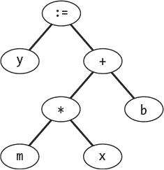
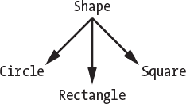
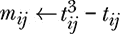

# 第二章：编程语言的基本概念


试图将编程语言的基本概念压缩到一个章节中是一项不可能完成的任务，但我会尽力传达编程语言的核心要素，为本书的其余部分提供背景。不过，实际上，这一章应该是一本书或一个学期的本科课程。

第一章中的小插曲旨在向你介绍一些编程语言的概念，但它们留下了一些重要的问题没有解答。例如，什么才是真正的*编程语言*？编程语言是如何结构化和实现的？编程范式是什么？等等，潜在的问题有很多。在这一章中，我将为这些问题提供足够的答案，以及其他问题，为我们后续处理本书中将遇到的编程语言和实现打下基础。

本章将以对*编程语言*的工作定义开始。接着我们将讨论语法和语义——如何在编程语言中表达以及这些表达的意义。之后，我们将简要回顾编程语言是如何实现的，或者说是如何被“具象化”的。在本书中，我们将实现几种极简语言，因此在这方面的基本知识将会非常有用。

然后我们将探讨数据类型和数据结构，编程语言所操作的数据类型是什么，以及它是如何组织这些数据的。我们还将探讨变量和*作用域*，即语言中告知我们哪些信息可以被访问以及在哪些上下文中可见的部分。

所有编程语言都实现某种形式的*流程控制*，也就是以某种方式执行指令，而不仅仅是按顺序一条一条地执行。我们将在本章结束时探讨这一点，并讨论*编程语言范式*，即编程语言对编程的不同处理方式。在第一章中，我们已经遇到了一些不同的编程范式。在这里，我们将给这些范式命名，并讨论它们的特点。编程语言所支持的范式直接影响我们如何在该语言中进行思考。

### **定义编程语言**

一本关于编程语言的书应当包括对其主题的定义。因此，让我们明确一下，当我们说*编程语言*时，我们指的是什么。

编程语言是一种表达思想并将其转化为控制计算机的算法的工具。编程语言由两部分组成：*一组指令*和*组织这些指令的规则*。

第一章中的所有语言都符合我们的定义。显然，Short Code 及其之后创建的所有内容都符合这一点：它们有指令和组织这些指令的规则。Zuse 的 Plankalkül，甚至 Ada 的“开发图”也符合这一定义。Ada 的图以一种对分析引擎有用的方式编码了一个算法。有人可能会争辩，分析引擎不可能直接使用这个图，但现代计算机也无法直接使用 C、ALGOL 或 Prolog 源代码。编程语言是抽象的；它需要与其所控制的机器之间的接口。

### **语法与语义**

*语法*指的是语言元素如何结合在一起形成语法上有效的语句。这对于人类语言和编程语言都是适用的。大多数为实际应用设计的编程语言都有一个正式的语法，也就是规定语言中允许和不允许作为语句的内容。这些语法指导着该语言的解释器和编译器的开发。

*语义*一词指的是语法上正确的语句的含义。语法是具体的；一个语句要么是有效的，要么不是有效的。另一方面，语义更难确定；它取决于程序员（说话者）的意图，这可能与实际含义不同。在人类语言的上下文中，这通常是误解；在编程语言的上下文中，这通常是一个 bug。

为了帮助理解语法和语义之间的区别，假设我们看一个 Pascal 中的`while`语句：

```
while <boolean-expression> do <statements>
```

这是`while`语句语法的一个表达。Pascal 的正式语法必须定义<boolean-expression>和<statements>。<boolean-expression>是一个返回真或假的值的表达式，而<statements>是一个单一的语句或一系列语句，且这些语句被`begin`和`end`括起来（即块语句）。

因此，从语法上讲，这是一个正确的 Pascal 语句：

```
while i < 10 do i := i - 1;
```

然而，从语义上讲，这个语句可能并不正确。它的含义可能并不是程序员所期望的。如果`i`大于或等于 10，`while`循环永远不会执行，因为条件为假。如果`i`小于 10，`while`循环会执行，但永远不会结束，因为`i`小于 10 并且只会越来越小。实际上，当`i`从整数数据类型支持的最大负数绕回到最大正数时，`while`循环最终会结束。在 Pascal 中，最大负整数是*–*32,768，最大正整数是 32,767。在 Pascal 中，整数是有符号的，并且是 16 位宽的。这个语句，充其量，只是一个非常低效的方式来执行`i := 32767`，并且很可能根本不是程序员的意图。

记住：语法指的是语法上正确的语句，而语义指的是语句的含义。

### **实现编程语言**

康拉德·祖泽的 Plankalkül 是一种编程语言，但他并没有实现它。祖泽通过它表达思想，但他无法将编码的思想转化为实际操作，因为没有接口，也就是没有为物理机器实现该语言。编程语言可以在没有计算机执行的情况下存在，但要控制机器，必须有一个实现。在这一部分，我们将讨论编程语言是如何实现的。

实现编程语言有两种主要方法。*解释器*将程序文本分解为称为语句的部分——即具有含义的指令集——并执行指令所暗示的操作。另一方面，*编译器*将程序文本分解为具有含义的部分，并将这些部分翻译成另一种语言，通常是计算机的机器语言。

编译器的输出是一组计算机可以直接执行的机器指令。编译器是将一种编程语言翻译成另一种编程语言的程序。解释器是实现程序文本所隐含指令意义的程序。

解释器就像工作队伍。它们接到工作指令并付诸实施。编译器则像翻译员，它们将一种编程语言的含义映射到另一种编程语言上。解释器运行程序；编译器生成程序，以便稍后运行。

解释器和编译器之间有一个清晰的概念性区别。不幸的是，在实践中，这条界线并不像我们希望的那样明确。例如，许多新语言同时既被解释又被编译。这包括 Python 和 Java 等语言。这背后有一个很好的理由：即不同硬件平台之间的可移植性。实现这一点的语言使用*字节码编译器*，这是一种将高级源语言（如 Python）翻译成低级目标语言的编译器，该目标语言可以非常快速地被解释。编译器部分完成了提取程序文本含义的繁重工作，而解释器则专注于性能。最终的结果是，一个既可移植又比传统解释器快得多的语言实现——只需要为新的目标机器重写解释器部分，而不必像旧式解释器那样一次又一次地无意义地重新推导代码的含义。

#### ***词法分析器、词法单元和解析器***

无论是解释器还是编译器，都不会直接处理键入的源代码文本。文本首先通过*词法分析器*进行处理，将文本分割成*词法单元*，这些词法单元是代表编程语言元素的字符串。词法分析器通常会为词法单元附加额外的信息，例如该词法单元是否是数字或语言的关键字。

词法分析器的输出通常会传递给*语法分析器*，语法分析器将标记（tokens）分组为有意义的语言语句，通常以树的形式表示。然后，解释器或编译器使用这棵树来评估语句（解释器）或将语句转换成目标语言（编译器）。

例如，考虑以下 Pascal 语句：

```
y := m * x + b;
```

词法分析器将语句分解成标记（tokens），然后添加相关的信息。

| **标记** | **相关信息** |
| --- | --- |
| `y` | 变量，实数类型 |
| `:=` | 赋值 |
| m | 变量，实数类型 |
| `*` | 乘法 |
| × | 变量，实数类型 |
| `+` | 加法 |
| b | 变量，实数类型 |
| `;` | 语句结束 |

解析器使用这个符号来构造一个*抽象语法树*（见图 2-1）。



*图 2-1：y := m*x + b 的抽象语法树*

树是以解释器或编译器可以处理的形式表示语句。解释器会使用当前的`m`、`x`和`b`变量的值来评估树的右侧，从而为变量`y`赋予一个新值。编译器则使用树来生成一系列汇编语言或机器代码指令，执行这些指令时会实现赋值操作。

对于真实的编程语言，词法分析器和语法分析器可能相当复杂。大多数人使用像 flex/bison 或 ANTLR 这样的语法分析器生成器，自动从语言规范生成代码。幸运的是，我们将探索的内存语言通常非常简单，词法分析仅仅是去除空白符和注释，语法分析则是检查词法分析器输出字符串中的下一个字符。例如，这正是第七章中 ABC 语言的解释器处理方式。

#### ***解释器***

解释器通常比编译器更容易编写。计算机科学家花费了几十年时间学习如何编写优化编译器，以生成高效且快速的代码。解释器的缺点是，它通常比编译器生成的机器代码要慢。尽管如此，本书中我们将使用的所有内存语言都是解释型的，尽管有些语言（例如 Brainfuck）也有编译器（见*[`github.com/Wilfred/bfc/`](https://github.com/Wilfred/bfc/)*）。

在本书的后面，我们将用 Python 编写解释器，用于处理简单的内存语言（esolang），例如 ABC、FRACTRAN、Filska 和 Firefly。这些语言的设计使得它们的语法足够简单，不需要复杂的词法分析和语法分析。

完整的解释器示例，包括指定的语言语法、完整的词法分析器和语法分析器，超出了我们在这里所能展示的内容。不过，我确实建议你在某个时候尝试自己动手做。如果你这么做了，请清晰地思考，并做好在成功之前遇到一些挫折的准备。目前，让我们来看一下一个旧的 BASIC 解释器是如何解析一个简单程序的。

Apple II 计算机配备了 ROM 中的 BASIC。BASIC 既是机器的命令行，也是编程语言。用户输入一行程序，BASIC 立即解析并存储在内存中。程序以链表的形式存储在内存中，这就是为什么每一行都需要一个行号的原因。这样 BASIC 才能知道将该行插入链表中的位置。

考虑这个简单的程序，它是通过提示符（`]`）逐行输入的：

```
] 10 FOR X = 1 TO 10
] 20 PRINT X, X*X
] 30 NEXT X
```

如果这个程序是`RUN`，它将生成一个平方数表。

```
]RUN
1     1
2     4
3     9
4     16
5     25
6     36
7     49
8     64
9     81
10    100
```

该程序的标记化表示占用 Apple II 内存中的 30 个字节（清单 2-1）。

```
0801: link: 080D 
      0A 00 -- line number 10, uint16, lo/hi
      81 token "FOR"
      58 ASCII character, "X"
      D0 token "="
      31 ASCII character, "1"
      C1 token "TO"
      31 30 ASCII characters, "10"
      00 end of line
080D: link: 0818 
      14 00 -- line number 20, uint16, lo/hi
      BA token "PRINT"
      58 ASCII character, "X"
      2C ASCII character, ","
      58 ASCII character, "X"
      CA token "*"
      58 ASCII character, "X"
      00 end of line
0818: link: 081F 
      1E 00 -- line number 30, uint16, lo/hi 82 token "NEXT"
      58 ASCII character, "X"
      00 end of line
081F: 00 00 -- end of program
```

*清单 2-1：一个标记化的 Applesoft BASIC 程序*

程序从内存位置 0x0801 开始，下一行的链接从 0x080D 开始。行号以 16 位无符号整数存储，低字节在前：`0A 00` = 0 × 256 + 10 = 10。接下来是解析后的代码行，其中已知的 BASIC 命令如`FOR`被替换为单字节的标记（0x81）。有趣的是，像 1 和 10 这样的数字（用于`FOR`循环的限制）并不是以数字形式存储的，而是作为 ASCII 字符存储的。`PRINT`语句也以 ASCII 字符存储，包括变量名`X`。

BASIC 必须进行大量工作来解释每一行，且在此过程中需要重复执行，因为涉及了循环。因此，BASIC 的执行速度较慢。不过，公平地说，Apple II 的 BASIC 解释器是为一个简单的 8 位微处理器用汇编语言编写的，这台机器的 RAM 最低只有 16KB。我们将使用 Python 来实现我们的语言，因此我们的任务将会轻松得多，相应地也不会那么令人印象深刻。

#### ***编译器***

关于编译器的最佳书籍之一是 Aho、Lam、Sethi 和 Ullman 的经典之作《龙书》：*Compilers: Principles, Techniques, and Tools*（第二版，Addison Wesley，2006）。之所以称为“龙书”，是因为封面插图的缘故。如果你对编译器设计有任何好奇，我推荐这本书。

《龙书》第 1.2 节列出了编译器的各个阶段：

1.  词法分析器

1.  语法分析器

1.  语义分析器

1.  中间代码生成器

1.  代码优化器

1.  代码生成器

解释器至少执行第 1 到第 3 阶段，可能还会执行某种形式的第 4 阶段，然后执行程序。编译器则执行所有或大部分阶段，以生成机器代码输出。

让我们看看由一个简单的编译器`pic0`生成的代码。它将一个简单的基于栈的语言编译成 Microchip 10F2xx 系列微控制器的汇编代码。10F2xx 系列可能是市场上最便宜的微控制器。截至本文写作时，一颗 10F200 仅售 0.66 美元。

编译器位于文件*pic0.py*中，执行上述第 1 到第 5 阶段。第 6 阶段，最终的代码生成，使用`gpasm`汇编器（请参见* [`gputils.sourceforge.io/`](https://gputils.sourceforge.io/) *）。

文件 *timer.pic0* (清单 2-2) 包含一个 PIC0 程序，用于切换附加到微控制器上的 LED。

```
p10f200
IntRC_OSC
WDT_OFF
CP_OFF
MCLRE_OFF

equ[ count 0x12 ]

[ main
  asm{ movwf OSCCAL }     ;  store oscillator calibration value
  OSCCAL/0                ;  disable INTOSC/4 on GPIO.2
  0 GPIO!                 ;  clear GPIO
  0b00001000 R0->W tris   ;  set GPIO directions

  ;  Clear TMR0 and reset prescaler
  0 TMR0!  clrwdt 0b11000111 R0->W option

  ;  Loop forever
  {
    ;  Wait for the timer to overflow 100 times
    100 count! {
        TMR0@ 0if
          count--  count@ ?0break
        then
    }

    ;  Toggle LED
    if(GPIO²) GPIO/2 else GPIO² then
  }
]
```

*清单 2-2：一个切换 LED 的 PIC0 程序*

编译器将此文件作为输入，输出 *timer.asm*（清单 2-3）。在最终的编译阶段，`gpasm` 以 *timer.asm* 为输入，生成多个输出文件：*timer.cod*、*timer.lst* 和 *timer.hex*。

```
    processor  10F200
    include    <P10F200.inc>
    __CONFIG   _IntRC_OSC & _WDT_OFF & _CP_OFF & _MCLRE_OFF

GP0    equ    d'0'
GP1    equ    d'1' GP2    equ    d'2'
GP3    equ    d'3'
R0     equ    d'16'
R1     equ    d'17'
count  equ    d'18'

main
    movwf   OSCCAL 
    bcf     OSCCAL,0
    movlw   d'0'
    movwf   GPIO
    movlw   d'8'
    movwf   R0
    movf    R0,w
    tris    GPIO
    movlw   d'0'
    movwf   TMR0
    clrwdt    
    movlw   d'199'
    movwf   R0
    movf    R0,w
    option    
A_0000
    movlw   d'100'
    movwf   d'18'
A_0002
    movf    TMR0,w
    movwf   R0
    movf    R0,f
    btfss   STATUS,Z
    goto    A_0004
    decf    d'18',f
    movf    d'18',w
    movwf   R0
    movf    R0,f
    btfss   STATUS,Z
    goto    A_0006
    goto    A_0003
A_0006
A_0004
    goto    A_0002
A_0003
    btfss   GPIO,2
    goto    A_0007
    bcf     GPIO,2
    goto    A_0008 A_0007
    bsf     GPIO,2
A_0008
    goto    A_0000
A_0001
    sleep    
    END
```

*清单 2-3：PIC0 编译器输出*

文件 *timer.hex* 包含实际加载到微控制器上的代码。

```
:020000040000FA
:1000000025000504000C2600080C30001002060034
:10001000000C21000400C70C300010020200640C28
:10002000320001023000300243071D0AF2001202C2
:100030003000300243071D0A1E0A110A4607220A31
:0A0040004604230A46050F0A0300D8
:021FFE00EB0FE7
:00000001FF
```

清单 2-2 可能看起来有些晦涩，但它可能比 清单 2-3 更易读，尽管两个程序实现了相同的目标。要了解更多关于 PIC0 的信息，请参阅与 *timer.pic0* 位于同一目录下的 *PIC0_Manual.pdf*。

#### ***字节码编译器***

现代解释器模糊了解释器和编译器之间的界限，通过将高级语言编译为可以快速解释的低级语言。从本质上讲，这些语言为一个不存在的机器生成代码：一个通过解释器模拟的机器。为了进一步混淆，有些字节码编译器执行 *即时编译*（JIT），生成实际的机器代码，而不是直接解释字节码。我们还会称这些语言为解释型语言吗？

字节码编译器并不新鲜，尽管最初它们可能并不被称为字节码编译器。例如，1970 年代末期使用的 UCSD Pascal 系统生成了 *p-code*，一种字节码，之后通过为特定系统编写的程序进行解释。这使得输出变得可移植，因为只有解释器需要为新系统重写。Pascal 系统，包括编译器，都是用 Pascal 编写的，并且已经编译成了 p-code。

如上所述，Python 也是字节码编译的。Python 提供了一个模块 `dis`，可以显示任何函数的字节码。例如，这个函数递归地生成阶乘：

```
def fact(n):
    if n == 0:
        return 1
    else:
        return n * fact(n-1)
```

要查看 Python 实际运行的字节码，我们可以添加

```
import dis; dis.dis(fact)
```

这会产生

```
2        0 LOAD_FAST             0 (n)
         2 LOAD_CONST            1 (0)
         4 COMPARE_OP            2 (==)
         6 POP_JUMP_IF_FALSE    12

3        8 LOAD_CONST            2 (1)
        10 RETURN_VALUE

5  >>   12 LOAD_FAST             0 (n)
        14 LOAD_GLOBAL           0 (fact)
        16 LOAD_FAST             0 (n)
        18 LOAD_CONST            2 (1)
        20 BINARY_SUBTRACT
        22 CALL_FUNCTION         1
        24 BINARY_MULTIPLY
        26 RETURN_VALUE
        28 LOAD_CONST            0 (None)
        30 RETURN_VALUE
```

即使不研究拆解中每一部分的含义，我们也可以通过检查最右边的标记和中间的指令名称来跟随函数的流程。例如，`POP_JUMP_IF_FALSE` 必须检查应用 `==` 的结果，如果结果为假，则跳转到 12，这清楚地实现了函数的 `else` 部分。

注意拆解的最后两行吗？它们返回 `None`，这是 Python 从函数返回的默认值。对我们来说，很明显函数在退出 `if` 时并没有结束，因为两个分支都使用了 `return`，但 Python 编译器可能无法检测到这一点，因此它添加了代码来处理在没有执行 `return` 时离开函数的情况。

编程语言，无论是编译型还是解释型，都必须处理数据。接下来我们将探讨语言如何操作和存储数据。

### **数据类型**

*数据类型*这一术语指的是编程语言中数据的组织方式。数据元素是一个数字吗？是一个字符吗？是由其他数据汇聚成的结构吗？数据的处理和存储方式取决于数据类型。

编程语言根据它们如何处理数据类型而分为不同类别。一种语言可能是强类型或弱类型。同样，一种语言也可能是静态类型或动态类型的。

在*强类型语言*中，变量的类型至少不会在后台自动改变以适应某个特定用途。Python 是强类型语言，Java 也是如此。例如，在 Python 中，将整数和字符串相加会导致运行时错误，即使字符串实际上是一个数字。你可以通过运行 `1 + '2'` 来看到这一点，它应该会产生一个 `TypeError`。

*弱类型语言*会在不同情况下隐式地改变数据类型。在第五章中，我们将探讨 SNOBOL。在 SNOBOL 中，对于某些字符串操作，数字值会被隐式转换为字符串。同样，如果表达式期望的是一个数字，代表数字的字符串会被隐式转换为数字。在 SNOBOL 中，表达式 `1 + '2'` 并不是一个错误。它会正确地评估为 `3`，并且会在后台默默地将 `'2'` 转换为数字。因此，SNOBOL 是一种弱类型语言。

*动态类型语言*不要求程序员在使用变量之前声明其数据类型。Python 是一种动态类型语言。例如，如果一个变量包含一个数字，它随时可以被赋值为一个字符串。因此，Python 既是强类型又是动态类型的语言。Smalltalk 变量在使用之前不指定类型，因此 Smalltalk 也是一种动态类型语言。

*静态类型语言*要求程序员声明变量将持有的数据类型。C、C++、Java、Pascal、ALGOL 和 FORTRAN 都是静态类型语言。FORTRAN 仍然支持隐式变量类型，这表面上看起来像动态类型，但并非如此。除非通过 `implicit none` 明确指示，否则 FORTRAN 会自动将以字母 *I* 到 *N* 开头的变量视为整数，将所有其他变量视为实数（浮点数）。类型仍然是间接指定的。因此，FORTRAN 也是静态类型语言。

正如许多编程语言中的事物一样，绝对的说法充满了危险。然而，仅为教学目的，我们还是将语言按是否动态或静态以及是否强类型或弱类型来分类。结果见表 2-1。

**表 2-1:** 按强/弱类型和动态/静态类型分类的语言

|  | **动态** | **静态** |
| --- | --- | --- |
| **弱类型** | JavaScript, Perl, SNOBOL | C, C++, Pascal |
| **强类型** | Python, Ruby, Smalltalk, APL | Scala, Java, Ada, ALGOL, FORTRAN, COBOL, Simula |

有些语言没有在 表 2-1 中出现。例如，在 第四章中，我们将探讨 Forth，这是一种基于栈的语言。

Forth 没有超出栈上值所用位数的概念数据类型；然而，一些 Forth 系统有一个单独的浮点数据栈。栈中的值可能是一个数字，也可能是一个结构体的地址，在 Forth 中，结构体仅仅是对一部分内存的约定划分。Forth 是一种 *无类型* 的语言，不强制任何与类型相关的规则。

数据类型及其研究是理论计算机科学的重要组成部分。请参见书籍后面的参考资料，了解你可以深入研究数据类型世界的更多资源。在这里，我们只关心原始数据类型和 *记录*，即用户定义的其他数据类型的集合。

#### ***原始数据类型***

*原始数据类型* 是编程语言的基本单元。它们是你期望语言操作的内容：数字，包括整数和浮点值，以及字符（C 语言）和字符串（Python）。C 语言没有字符串作为原始数据类型。相反，它使用字符数组来表示字符串。在 Python 中，字符串是原始数据类型之一，布尔值（True 或 False）也属于这一类。此外，Python 支持复数，通常以一对浮点数表示，一个用于实部，另一个用于虚部。一些语言，如 Scheme，支持分数作为原始数据类型。在 第八章 中，我们将使用 Scheme 实现 FRACTRAN 时，充分利用这一点。

计算机使用多种方法在内存中表示数字。根据语言的不同，程序员可能需要了解数字存储的具体细节。这在 C 语言中尤其常见，特别是在嵌入式环境中使用时，比如在微控制器或单板计算机上。在 清单 2-1 中，我们看到 Apple II 如何存储表示行号的 16 位整数，其中最低有效字节在前，紧跟着是高位字节。

**注释**

*将整数按最低有效字节先存储被称为小端（little-endian）。如你所猜测，反过来就是大端（big-endian）（有时也称为网络字节序）。要详细了解计算机如何存储和操作数字，请参见我的书《数字与计算机》（Springer，2017）。若想理解“little-endian”和“big-endian”的来源，请阅读 Jonathan Swift 的《格列佛游记》。*

#### ***记录***

如果你长时间使用某种编程语言，你最终会希望将不同的数据类型组合成一个有意义的单元。*记录*（record），也称为*结构*（structure），正是这样的单元。支持记录的语言包括 ALGOL 家族、Pascal 和 C 分支（图 1-3），以及许多其他语言，如 SML。每种语言如何支持这一概念有所不同，在某些情况下，*record*和*structure*并非同义词。例如在 C#中，record 是不可变的，而 structure 则不是。我们来看一下 Pascal 和 C 是如何实现记录的。

##### **Pascal 记录**

一个存储人名、生日、地址和电话号码等信息以供后续参考的程序将受益于一个记录，它将这些信息组合成一个单元。我们可能会定义一个包含这些记录的数组，用来保存许多不同人的相同信息。在 Pascal 中，这样的声明可能如下所示：

```
type
    PhoneNumberType = record
        area, exchange, number : Integer;
    end;

    BirthdayType = record
        month, day, year : Integer;
    end;

    PersonType = record
        first, last : string;
        address : string;
        phone : PhoneNumberType;
        bday : BirthdayType;
     end;
```

`PersonType`类型将多个字符串与`PhoneNumberType`和`BirthdayType`的实例组合在一起。`PersonType`类型的变量是一个具有多个字段的单一变量。

```
var  person : PersonType;
```

通过名称使用点符号访问字段。

```
person.first := 'Melvin';
person.bday.year := 1953;
```

嵌套的`BirthdayType`首先通过访问`bday`来引用，然后通过`bday`的字段来引用。

使用`PersonType`的一个简单示例见文件*lbb.pas*。要编译它，请使用 Free Pascal 编译器（*[`www.freepascal.org/`](https://www.freepascal.org/)*），它在 Ubuntu 上很容易安装。

```
> sudo apt-get install fp-compiler-3.0.4
```

请参阅网站以获取 macOS 和 Windows 版本的信息。安装完成后，使用`fpc lbb.pas`编译*lbb.pas*。该程序生成一个包含 100 个不同人的随机数据库。为了节省空间，我们不列出*lbb.pas*的内容，但请阅读该文件以理解发生了什么。

##### **C 结构体**

C 结构体与 Pascal 记录类似。人的结构体如下所示：

```
typedef char string[32];

typedef struct {
    int area, exchange, number; } phone_number_t;

typedef struct {
    int month, day, year;
} birthday_t;

typedef struct {
    string first, last;
    string address;
    phone_number_t phone;
    birthday_t bday;
} person_t;
```

由于 C 语言没有原生字符串类型，我们首先使用一个包含 32 个字符的固定数组来定义一个`string`。声明使用`typedef`为每个结构体（`struct`）创建一个命名类型。命名规则遵循 C 语言的惯例，使用下划线并在类型名末尾加上`_t`。

一些语言允许结构体使用相同的内存区域来表示多个不同类型的字段。我猜测最初这样做的动机是为了节省内存，尤其是在字段是互斥的情况下。C 语言中的`union`就是这种方式。例如，下面的代码定义了一个联合体，其中相同的内存位置有时被解释为 32 位浮点数，有时被解释为 32 位无符号整数。

```
typedef union {
    float f;
    unsigned int d;
} fp_t;
```

使用哪种解释方式取决于访问的是哪个字段，`f`还是`d`。下面的代码声明了一个类型为`fp_t`的变量`fp`，然后将浮点字段的值设为*π*，随后将同一块内存引用为一个无符号 32 位整数。

```
fp_t fp;
fp.f = 3.14159265;
printf("%0.8f in hex is %08d\n", fp.f, fp.d);
```

### **数据结构**

*数据结构* 是一种在内存中组织数据的方法。记录是一种数据结构，但这个术语通常用于描述更复杂的数据管理方式。数据结构是必要的，但在现代编程语言中，它们的本质数据结构（如 Python 的列表和字典）非常强大，因此不像过去那样经常需要更复杂的数据结构。但是，对于 C 和 C++程序员来说，理解数据结构至关重要。数据结构是本章中许多主题中的一本书。遗憾的是，我们只能提供快速摘要来介绍数据结构。

#### ***数组***

在其最简单的形式下，*数组* 只不过是一个连续内存块，被分成大小相等的块。一个包含 100 个 32 位整数的数组占据了 400 字节的内存块，因为每个整数长度为 4 字节。例如，在 C 语言中，`int A[100]` 声明了`A` 是这样一个数组。C 语言中的`sizeof`运算符报告`A` 使用了 400 字节的内存，正如预期的那样。

变量`A` 指的是为数组分配的第一个 4 字节内存块。由于 C 知道数组每个元素的大小，因此找到数组任何索引的地址就像将索引乘以四然后加上数组的基地址一样简单。这就是为什么许多编程语言从 0 开始索引数组的原因。这样，从基地址到第一个数组元素的偏移量就是 0 字节。

多维数组仍然存储为单个内存块。例如，Pascal 定义一个 2D 数组如下：

```
var A : array[0..7, 0..7] of integer;
```

数组`A` 是一个 8×8 的整数数组（想象成棋盘）。在内存中，它仍然是一个连续的内存块，这次使用了 8 × 8 × 2 = 128 字节。为了索引数组，我们使用两个索引，`A[i,j]`，并计算所需元素的地址为基础内存地址加上`8 * i + j`。八是数组一行中的元素数，即列数。索引基本数组，甚至是多维数组，只要数组存储为连续的内存块，就是简单且快速的。

#### ***链表***

*链表* 是下一个最简单的数据结构。它们是一组节点，通常分配在堆上，保存了感兴趣的数据以及指向链中下一个链接的指针。*双向链表* 还保留了指向前一个节点的指针。

一旦定位到适当的节点，插入和删除链表中的元素就很容易。与此相比，首先定位节点相对较慢，因为在最简单的链表版本中，必须从开头逐个节点地遍历列表以找到目标。由于它们的概念简单性，链表是入门编程课程中喜爱的作业任务。

你可能会想，Python 列表是不是一个复杂的链表实例。然而，事实并非如此。Python 列表是指向它们包含对象的动态数组。Python 列表通过巧妙地管理数组在添加新元素时的增长方式，可以在索引时提供良好的性能。它们使用上述简单的公式来定位元素，从而绕过了链表中逐节点遍历的缓慢过程。尽管如此，面向对象指针的动态数组对于许多科学应用仍然太慢，这也是 Python 强大的数组处理库（如 NumPy）出现的动因。

#### ***树***

*树*是复杂的层次化数据结构，通常在堆内存中动态构建。有许多不同种类的树，它们在插入或删除信息以及快速查找信息方面表现出色。我们在本章早些时候看到过一个树的例子，在图 2-1 中，编程语言的解析器构建了表示程序语句结构的树。

递归算法存在于快速遍历树的过程中。树在计算机科学中无处不在，但现在它们在日常场景中的使用较少，因为现代语言通过隐式支持或库提供了强大的数据结构。因此，程序员除了在最苛刻的情况下，通常不需要自己实现树。

#### ***哈希表***

在*哈希表*中，*哈希*（即*哈希函数*的输出）用于将一块数据映射到一个单一值。哈希函数的思想是将数据映射到一个唯一值，即指定范围内的整数。例如，Python 字典在底层就是哈希表。键会被传给哈希函数，计算出一个表示该键的唯一整数。然后，哈希值作为索引来查询与该键相关联的数据。

如果两个不同的键生成相同的哈希值，则发生了*碰撞*。处理碰撞有不同的选项。Python 字典在发生碰撞时，会随机探查表格以寻找一个空位来存储键。一个好的哈希函数，再加上对指定表大小下哈希碰撞概率的深入了解，能让 Python 高效管理哈希，减少碰撞并避免浪费内存。

当然，还有许多其他类型的数据结构。本书末尾的参考资料会指引你找到可以深入学习数据结构的资源。现在，让我们来学习编程语言如何决定在程序中引用变量时访问哪个变量。

### **变量和作用域**

变量存在于某种上下文中，与其他变量和代码区域之间有关系。变量可见的代码区域称为变量的*作用域*。在作用域方面，编程语言分为两大类：词法作用域和动态作用域。大多数编程语言使用词法作用域。较少的一部分使用动态作用域，还有少数语言像 Perl，使用了词法作用域和动态作用域的结合。每种语言都有自己独特的，往往较为复杂的作用域规则。在本节中，我们将限制讨论词法作用域和动态作用域之间的区别，并不深入讨论某个特定语言的作用域规则细节。

#### ***词法作用域***

在*词法作用域*（也叫*静态作用域*）中，变量引用是根据程序编写时的结构，也就是编译器所看到的结构，回溯到声明或赋值的地方。在这种情况下，变量引用与哪个变量被使用之间的关系是静态的，并且由源代码的结构所固定。

对于词法作用域，引用所对应的变量遵循一个简单的解析算法：局部块或函数，接着是外层的块或函数，再往外，直到全局作用域。Python 是静态作用域的。考虑以下示例。

```
def a():
    def b():
        def c():
            def d():
                x = 20
              ➊ print('d()  says', x)
          ➋ print('c()  says', x)
            d()
      ➌ print('b()  says', x)
        c()
    x = 15
    print('a()  says', x)
    b()

x = 10
print('main says', x)
a()
```

这个程序的输出是

```
main says 10
a()  says 15
b()  says 15
c()  says 15
d()  says 20
```

Python 允许嵌套函数声明，因此函数`a`包含`b`，`b`又包含`c`，而`c`又包含`d`。最外层的全局作用域定义了`x=10`，正如第一个`print`告诉我们的那样。然后我们调用`a`，它局部设置了`x=15`，正如`a`的`print`所示。接着我们调用`b`，它没有在局部定义`x`。因此，为了理解对`x` ➌的引用，Python 必须在一个封闭作用域中搜索`x`。Python 在`a`中找到了`x`，因此`b`使用了`a`的值，即 15。当`b`调用`c`时，`c`也必须搜索一个`x` ➋。Python 在`b`中没有找到`x`，因此它继续在下一个封闭作用域中搜索，也就是`a`，并在其中找到了`x=15`。最后，`c`调用`d`，`d`在局部定义了`x=20`，正如`d`的输出所示 ➊。

词法作用域使得理解程序中哪个值与哪个引用相关联变得更加直观，而无需过度追踪程序的执行。这就是为什么大多数语言，尤其是更新的或更广泛使用的商业语言，都采用它的原因。

#### ***动态作用域***

*动态作用域*使用程序的当前状态来决定哪个值与哪个引用相关联。这意味着，很难直接看出函数会使用变量的哪个值，因为它依赖于函数所处的上下文。

让我们做一个小实验。我们将分别用四种不同的语言写出基本相同的程序：词法作用域的 Python 和 C，动态作用域的 SNOBOL，以及 Perl，正如我们将看到的，它既有词法作用域也有动态作用域。然后我们将看看能否解释每种情况下的输出。以下展示了源代码在左侧，程序输出在右侧。

#### ***Python***

我们知道 Python 是按词法作用域的，正如我们之前展示的。因此，让我们使用 Python 作为基本情况，它是不会让我们感到惊讶的。

| **代码** | **输出** |
| --- | --- |

| x = 10 def f():

return x

def g():

x = 20

return f()

print(g()) | 10 |

代码首先在全局定义`x`，然后定义`f`，它仅仅返回`x`。接下来，代码定义了函数`g`，它在`g`的作用域内局部定义了`x=20`，然后返回`f`返回的值。代码的主部分打印了`g`返回的值。

看一下`g`的定义。它在调用`f`之前定义了一个局部的`x`。那么为什么输出不是 20 呢？毕竟，`x`在调用`f`之前被设置为 20。输出不是 20 是因为当`f`被定义（编译）时，`x`在全局作用域中已经是 10。因此，不管`g`是否定义了局部的`x`，`f`使用的始终是全局的 10。

如有必要，复习这个例子，确保你理解了。如果准备好，继续阅读。

#### ***C***

C 语言与 Python 一样，也是按词法作用域的。因此，这个例子应该与上面的例子非常相似。让我们看一下。

| **代码** | **输出** |
| --- | --- |

| int x = 10; int f() {  return x; }

int g() {

x = 20;

return f();

}

int h() {

int x = 15;

return f();

}

void main() {

printf("h() = %d\n", h());

printf("g() = %d\n", g());

} | h() = 10 g() = 20 |

对于这个例子，从底部的`main`函数开始。在 C 语言中，`main`必须存在，并且是所有程序的入口点。`main`函数打印两个值：`h`返回的值和`g`返回的值。

函数`h`定义了一个局部的`x=15`，然后调用`f`返回`f`返回的值。函数`f`只能看到全局的`x=10`，所以它返回的是这个值。第一行输出是合理的。

`g`的输出是什么？这有道理吗？函数`g`与`h`非常相似，但赋值`x=20`前没有加`int`类型。在编译这个函数时，C 语言会意识到在`g`中没有局部定义`x`，所以它会向上查找作用域，在全局作用域中找到`x`并更新它。因此，`g`有一个副作用：它全局地改变了`x`的值。这就是为什么`f`现在返回的是 20，而不是 10。

#### ***SNOBOL***

SNOBOL，见第五章，是一种 1970 年代的文本处理语言。SNOBOL 是动态作用域的。它的语法很奇特，这也正符合这种语言的古怪特性。现在，我们只需要知道关于 SNOBOL 的几个要点：

+   函数通过`define`声明，并返回分配给其名称的值。

+   变量通过在`define`语句中添加到函数名和参数后面来声明为局部变量。

+   在 SNOBOL 中，打印是通过赋值给`output`来实现的。

我们将考虑的代码是

| **代码** | **输出** |
| --- | --- |

|       x = 10       define('f()')     :(ef)

f     f = x             :(return)

ef

define('g()x')    :(eg)

g     x = 20

g = f()           :(return)

eg

output = '全局 x = ' f()

output = '局部  x = ' g()

output = '全局 x = ' x

结束 | 全局 x = 10 局部  x = 20

全局 x = 10 |

这个程序定义了两个函数：`f` 和 `g`。第一个函数返回 `x` 的值，第二个函数将 `x` 定义为 `g` 的局部变量，并返回 `f` 的返回值。主程序开始时 `x = 10`。

输出的第一行与我们之前看到的类似：`x` 是全局的，`f` 返回它的值。第二行与我们之前看到的不同。`f` 并没有使用定义时存在的 `x` 的值，而是使用了 `g` 设置的 `x` 值，即便 `g` 中的 `x` 是局部的。`f` 使用调用时的上下文，在运行时来查找与 `x` 对应的值。这就是动态作用域。

最后一行是为了表明 `x` 并没有被 `g` 更新，因此这与我们在 C 中遇到的情况不同，因为在 C 中，`g` 确实更新了全局的 `x`。

#### ***Perl***

我们的最后一个作用域示例使用的是 Perl。Perl 以灵活性著称，因此它支持静态和动态作用域，具体使用哪种取决于程序员的喜好。让我们看看是如何做到的。

| **代码** | **输出** |
| --- | --- |

| $x = 10; sub f { return $x; }

sub g {

local $x = 20;

return f()

}

sub h {

my $x = 15;

return f()

}

print g()."\n";

print h()."\n"; |  20  10 |

这个程序的形式很熟悉。我们看到了 `f`、`g` 和 `h`，就像上面的 C 语言示例一样。程序先打印 `g` 的输出，再打印 `h` 的输出。除了赋值给 `x` 的值外，`g` 和 `h` 之间的唯一区别是：`g` 使用 `local`，而 `h` 使用 `my`。

`local` 和 `my` 都定义了一个函数局部变量。它们的区别在于应用于变量的作用域类型。当使用 `my` 时，作用域是静态的，因此 `h` 返回的是通过静态作用域，`f` 所看到的内容，即 `x=10`。然而，对于 `g`，Perl 被告知通过 `local` 使用动态作用域与 `x`，因此 `g` 中调用 `f` 时，会根据 `g` 的上下文来确定使用哪个 `x`，也就是 `g` 中局部的 `x`，因此返回 `x=20`。教训很明确：要仔细阅读 Perl 源代码。

变量作用域与程序流程紧密相连。接下来我们将探讨编程语言如何实现并操作程序流程。

### **控制程序流程**

所有编程语言都实现了某种形式的 *流程控制*，即通过某种方式在不同条件下修改执行指令的顺序。本节讨论的重点是编程语言中常见的 *控制结构*。我们将语言分为两大类：无结构语言和结构化语言。让我们了解一下每种语言的特点。

#### ***无结构语言***

*非结构化语言*使用 goto，以某种形式作为修改程序流程的唯一方式。与 goto 一起，这些语言还有一些机制来测试不同的条件。goto 和条件测试的组合足以实现任何算法，但这并不意味着这样做会清晰或容易调试或验证。

旧版 BASIC，如示例 1-3 中的例子，是非结构化的。它有`if`语句和`goto`语句（可能是不同类型的）。同样，汇编语言也是非结构化的。查看示例 2-3，其中包含测试不同条件的指令（`btfss`）和 goto。

SNOBOL 也是非结构化的。SNOBOL 中的每一行要么成功，要么失败，并且可以给标签来指示 SNOBOL 在任一情况下应该跳转到哪里。SNOBOL 没有结构化的`if`语句，而是有谓词，它们要么成功，要么失败，从而允许 goto 来处理任一情况。

我们将在后面的章节中探讨的大多数 esolangs 都是非结构化语言。大多数使用简单的测试和分支或 goto，像机器代码一样。像我们将在第十五章中开发的 Firefly 语言，或者第八章中的 FRACTRAN，都没有任何形式的 goto，除了从头开始重新启动程序。

#### ***结构化语言***

埃兹杰·戴克斯特拉（Edsger Dijkstra）在 1968 年的著名信件《Go To 语句有害》（“Go To Statement Considered Harmful”）中敲响了警钟，指出 goto 作为流程控制选项通常是一个糟糕的主意。自那时以来，非结构化语言逐渐消退，并大多被实现*结构化编程*的语言所取代，意味着使用现在熟悉的控制结构并避免使用 goto 等。

##### **选择**

*选择*是指使用布尔表达式的结果或等效的东西来改变程序的流程。最常见的选择结构是`if-then-else`结构。例如，在 Pascal 和大多数现代语言中，语法几乎是一样的。

```
if <condition> then <statements1> [else <statements2>]
```

这里，`<condition>`返回一个布尔值。如果`<condition>`为真，则执行`<statements1>`；否则，执行`<statements2>`（如果存在）。`if`语句有多种变体，例如 Python 中的`elif`，用于结合嵌套的`if`：

```
if x < 2:                      if x < 2:
    print("less")                  print("less") 
else:                    =>    elif x < 12:
    if x < 12:                     print("more")
        print("more")
```

许多语言支持`case`或`switch`语句。Pascal 使用`case`，而 C 使用`switch`。例如，在 C 中，一个`switch`语句用于检查整数`x`的值，可能如下所示：

```
switch (x) {
    case 1:
        printf("one\n");
        break;
    case 3:  case 5:  case 7:
        printf("prime\n");
        break;
    case 2:  case 4:  case 6:
    case 8:  case 0:
        printf("even\n");
        break;
    default: break;
};
```

`break`是必要的，因为如果没有它，执行会继续流向下一个`case`。在 Pascal 中，同样的结构可能如下所示：

```
case x of
  1 : writeln('one');
  3,5,7 : writeln('prime');
  2,4,6,8,0 : writeln('even');
end;
```

Scheme 使用`cond`语句，方式与此相似。

```
(cond
  ((= x 1) (display "one"))
  ((member x '(3 5 7)) (display "prime"))
  ((member x '(2 4 6 8 0)) (display "even")))
```

这里，`cond`的每个子列表都是`(<condition> <statements>)`，如果条件为真，则执行语句。`cond`语句按顺序测试每个条件，直到其中一个为真。

##### **重复**

这里的*重复*是指任何形式的循环结构。具体来说，我们将讨论四种循环：顶部测试循环、底部测试循环、计数循环和无限循环。我们将使用 Modula-2 来展示列表 2-4，因为它支持这四种循环。Modula-2 是 Pascal 的继任者。

```
   MODULE loops;

   FROM StrIO IMPORT WriteString, WriteLn;
   FROM NumberIO IMPORT WriteCard;

   VAR
    ➊ i : CARDINAL;

   BEGIN
     WriteString("Top tested:");  WriteLn;
     WriteString("  index:");
  ➋ i := 0;
     WHILE (i < 6) DO
       WriteCard(i,3); i := i + 1;
     END;
     WriteLn;

     WriteString("Bottom tested:");  WriteLn;
     WriteString("  index:");
  ➌ i := 0;
     REPEAT
       WriteCard(i,3);
       i := i + 1;
     UNTIL i = 6;
     WriteLn;

     WriteString("Loop:");  WriteLn;
     WriteString("  index:");
➍ i := 0;
     LOOP
       WriteCard(i,3);
       i := i + 1;
       IF i = 6 THEN 
         EXIT;
       END;
     END;
     WriteLn;

     WriteString("Counted:");  WriteLn;
     WriteString("  index:");
➎ FOR i := 0 TO 5 DO
       WriteCard(i,3);
     END;
     WriteLn;
   END loops.
```

*列表 2-4：Modula-2 中的循环*

列表 2-4 展示了所有四种结构化编程循环。前言部分加载了标准库中所需的函数。我们只需要一个变量，`i` ➊。

第一个循环是*顶部测试*的`WHILE`循环 ➋。当条件为真时，循环执行。由于条件测试位于循环顶部，因此有可能循环永远不会执行。

第二个循环 ➌ 是*底部测试*循环。判断是否继续循环的测试在循环体之后进行；因此，这个循环至少执行一次循环体，无论`i`的初始值如何。Modula-2 使用`UNTIL`进行底部测试，意味着循环体会重复执行直到条件为真。有些语言，如 C 语言，使用`while`进行底部测试，因此循环在条件为真时执行。

Modula-2 是少数几种具有显式*无限*循环结构的高级语言之一 ➍。`LOOP`会无限执行循环体，直到执行`EXIT`。一个始终为真的`while`循环具有相同的效果。

最后一个示例是`FOR`循环 ➎。Modula-2 的`FOR`几乎与许多其他语言的`FOR`相同。循环索引有一个初始值，并继续递增，直到达到结束值。这种类型的循环有很多变种，称为*计数循环*。在这个类别中，我包括了像 Python 的`for`那样对支持迭代的任何对象进行迭代的循环。

程序流受编程语言结构和编码方式的影响。让我们通过回顾编程语言中使用的重要编码范式来结束本章内容。

### **编程范式**

*编程范式*是指一种语言如何处理编码的方式。最重要的范式有命令式、面向对象和声明式，除此之外，我个人最喜欢的还有数组处理范式。让我们讨论一下几种范式的高级特性，并举例说明支持每种范式的语言。许多实用的语言支持多种范式。

#### ***命令式***

*命令式*编程语言按步骤指示计算机操作。几乎所有语言，尤其是你作为专业开发人员会遇到的语言，都使用这种范式，或者至少在某种程度上支持它。这是有道理的：这种方式是最自然的编码思维方式。为了实现目标，某些操作必须按特定顺序发生。这就是命令式编程：程序员通过编程语言向计算机发出命令。

想象一个流行的编程语言。几乎可以肯定它是命令式的：Java、Python、C/C++、C#、JavaScript 等等。我们在第一章中遇到的所有语言，除了 Prolog 和 SML，都是命令式语言。

命令式语言通常进一步分为结构化和非结构化。结构化命令式语言使用结构化编程，我们在前一节中讨论过。因此，Pascal、C、Modula-2 等都是结构化命令式编程语言。非结构化命令式语言不使用结构化编程。这包括汇编语言，但也包括像 SNOBOL 这样的高级语言。

我们将遇到和开发的所有怪异语言都是命令式语言。这是做事情的最明显方式。

#### ***面向对象***

*面向对象*语言采用封装、多态和继承。从某种意义上说，面向对象语言是命令式语言加上更高级别的组织。从命令式编程到面向对象编程的过渡相对比较直接。

*封装*意味着对象既包含数据又包含方法——它们拥有自己的数据，与其他对象分离，并且拥有操作该数据的方法。这将信息隐藏在对象外部。对象之间的这种分离增加了程序的安全性和可靠性。在面向对象的语言中，一个程序部分的变化不太可能会对另一个程序部分造成不利且微妙的影响。

*多态*最好通过示例理解。想象一个名为`Shape`的类，它有一个名为`draw`的方法。现在想象`Shape`的子类，如`Rectangle`、`Square`和`Circle`。每个子类提供适合其特定形状的`draw`方法。这创建了一个对象层次结构（参见图 2-2）。



*图 2-2：面向对象语言中对象的层次结构*

在这个图表中，`Rectangle`、`Square`和`Circle`都是`Shape`的子类。如果我们现在编写一个接受`Shape`参数的函数，并调用该`Shape`的`draw`方法，我们可以向函数传递任何`Shape`的子类，将调用适当的`draw`方法。这就是多态。

**函数重载**

多态还发生在*函数重载*期间，即多个使用相同名称但接受不同类型参数的函数被定义的情况。例如，考虑这段 C++代码：

```
#include <iostream>
using namespace std;

double CtoF(int C) {
    return (9*C)/5 + 32; 
}
double CtoF(double C) {
    return (9.0/5.0)*C + 32.0;
}

int main() {
    cout << CtoF(37) << endl;
    cout << CtoF(37.0) << endl;
}
```

函数`CtoF`被定义两次。第一个定义接受一个整数并返回一个双精度浮点数。第二个定义接受一个双精度（64 位浮点数）并返回一个双精度浮点数。然后，`main`函数调用`CtoF`，首先使用整数参数，然后再次使用浮点参数。C++编译器使用参数类型来匹配调用哪个函数。

程序输出

```
98
98.6
```

第一行来自`CtoF`的整数版本，第二行来自双精度版本。请注意，在 C++中，如果编译器只有双精度版本的`CtoF`，两次调用将返回 98.6，因为编译器足够智能，可以自动将整数转换为双精度以使调用成功。这在一般情况下并非如此，并且是 C++中弱类型的一个例子。函数重载是*编译时多态*的一个例子，因为编译器在构建输出可执行文件时选择要评估的函数。

面向对象语言的最后一个标志是*继承*。这意味着一个类可以继承或获取另一个类的方法。我们在上面的`Shape`和`Circle`中看到了这一点，`Circle`是`Shape`的子类。类`Circle`将继承`Shape`共享的任何方法，从而免费获得该功能。我们还在第一章的 Simula 示例中看到了继承的工作，其中类`Pal`继承了其父类`Person`的成员变量。

#### ***声明式***

*声明式*编程，其中程序员陈述*什么*而不是明确*如何*，有几种形式。我们在第一章中已经探讨了一种形式——逻辑编程——当我们讨论 Prolog 时。在 Prolog 中，目标被表述为需要发生的事情，而没有明确的逐步指导如何实现它的说明。

函数式编程语言，如 SML，同样也属于声明式范畴，我们在第一章中也看到了这一点。SML 很好地展示了将语言归类为一个范式是多么困难的一个例子。函数式语言使用函数和递归来表达程序的*什么*，而不是像`while`循环这样的命令控制结构。然而，SML 支持`while`循环，这是对命令式编程的让步。其他经常被称为“函数式”的语言包括 Lisp 和 Scheme，有时甚至包括 Python。然而，更好地说法似乎是 Python 包含了函数式编程元素，但并不是一个函数式语言。

函数式编程的特点包括将函数视为*一等公民*，这意味着它们可以被赋值给变量，并且*高阶函数*，即接受函数作为参数或返回函数的函数。让我们通过 Python 来回顾两个例子。

在第一章中，我们看到了 SML 中柯里化的一个例子。现在，让我们看看柯里化在 Python 中是如何工作的。

```
def factory(x):
    def mult(y):
        return x*y ➊ return mult

➋ mult2 = factory(2)
   mult11 = factory(11)

   print(mult2(4))
   print(mult11(3))
```

首先，我们定义了一个名为`factory`的函数，它接受一个参数并返回一个函数。仔细看看`factory`。函数`mult`是在`factory`内部定义的，接受一个参数`y`。然而，`mult`的函数体返回`x*y`，其中`x`是调用`factory`时传递给它的参数。`mult`使用的`x`的值是在调用`factory`时传递给它的`x`的值。

现在看看 `factory` ➊ 的返回值：它是函数 `mult`。而且，它是在 `factory` 环境中的 `mult`，这意味着 `mult` 正在使用传递给 `factory` 的 `x` 值。现在我们明白为什么我选择了这个名字：`factory` 是一个生成函数的工厂，其中一个参数 `x` 是固定的。返回一个嵌套函数创建了一个 *闭包*，即一个绑定到特定环境中的函数——也就是 `x` 的值。

变量 `mult2` 被赋值为 `factory(2)` 返回的值 ➋。然而，`factory(2)` 返回一个函数 `mult`，其中 `x=2`。变量 `mult2` 保存了一个将其参数乘以 2 的函数。同样，`mult11` 保存了一个将其参数乘以 11 的函数。因此，代码输出 `8` 和 `33`。

我们的第二个功能示例涉及装饰器，Python 的语法糖，用于将一个函数包装成高阶函数。

```
➊ def mydecorator(f):
    def decorate(*args, **kwargs):
        return "Per your request, the result is " + str(f(*args,**kwargs))
    return decorate

➋ @mydecorator
   def afunc(x):
       return x**2 + 3*x + 4

➌ def bfunc(x):
       return x**2 + 3*x + 4

   dfunc = mydecorator(bfunc)
```

这个示例定义了四个函数：`mydecorator`、`afunc`、`bfunc` 和 `dfunc`。第一个函数 ➊ 接受一个函数 `f`，并返回一个新的函数 `decorate`，该函数包装了 `f` 的结果。就像上面的 `factory` 示例创建了一个闭包，将 `x` 的值绑定到函数一样，`decorate` 将 `f` 绑定到传递给 `mydecorator` 的函数。使用 `*args` 和 `**kwargs` 是 Python 的方式，表示任意数量的位置参数和关键字参数。因此，`mydecorator` 是一个高阶函数，因为它接受一个函数作为参数并返回一个函数（闭包）。

`afunc` ➋ 的定义前面加上了 `@mydecorator`。这是语法糖部分，是一种可读的方式来将 `mydecorator` 应用于 `afunc`。为了证明这一点，➌ 定义了与 `afunc` 相同的 `bfunc`，然后将 `mydecorator` 的输出 `(bfunc)` 赋值给 `dfunc`。

现在，考虑 `afunc` 和 `dfunc` 如何工作，假设代码位于文件 *decorator.py* 中。

```
>>> from decorator import * 
>>> print(afunc(23.4))
Per your request, the result is 621.76
>>> print(dfunc(23.4))
Per your request, the result is 621.76
```

两个调用都返回了预期的值，且被字符串 `'Per your` `request...'` 包装，展示了装饰器 `@` 语法实际上是一个函数应用。装饰器使得我们能够在不改变原始函数或使用该函数的源代码的情况下，向函数添加新功能。任何依赖 `afunc` 的代码仍然会按预期工作，假设装饰器做的事情不止是拦截返回值并打印。

许多现代编程语言已经采纳了函数式编程的元素。纯函数式语言——即那些没有副作用（如直接更新变量值）的纯函数调用——在学术圈之外的影响力尚未显著。计算机科学家喜欢纯函数式语言，因为它们有助于证明程序的正确性。相反，软件工程师喜欢函数式语言的一些方面，但仍然需要能够更直接地在代码中实现符合我们操作方式的思维——一步步执行算法，以达到期望的结果。

#### ***数组处理***

科学编程经常使用数值数据，这些数据通常最容易以某种数组形式组织，无论是向量、矩阵还是更高阶的张量。例如，图像处理和使用卷积神经网络的深度学习就涉及到二维、三维甚至四维数据。

鉴于此，编程语言处理整个数组时无需显式循环显得是合乎逻辑的。这样的语言被称为*数组处理*语言。在第一章中，我们简要地探讨了第一个数组处理语言 APL。自 APL 以来，许多数组处理语言已经得到了发展。

假设我是一个深度学习研究员，手头有一组需要处理的图像数据集。如果每张图像是 512 行×512 列，我可以将这些图像存储在一个数组中。如果图像是灰度图，意味着每个像素由一个整数表示，通常在[0,255]的字节范围内，那么我可以使用二维数组。如果我有一堆大小相同的图像，我可以将它们一个接一个地存储在一个三维数组中。如果图像是彩色的，我还需要额外的一个维度来表示颜色通道，这就意味着需要一个四维数组。

深度神经网络中的常见操作是对输入进行缩放，使其位于[0,1]范围内。如果我有 100 张图像，每张图像是 512 行×512 列，我可以将这些图像堆叠在一个 100×512×512 的数组中。在这种情况下，在像 Pascal 这样的语言中，缩放操作将变成：

```
var
  A : array[0..99,0..511,0..511] of real;
  i,j,k : integer;
begin
  (* Load the array with the images *)

  for i:= 0 to 99 do
    for j:= 0 to 511 do
      for k:= 0 to 511 do
        A[i,j,k] := A[i,j,k] / 255.0;
```

为了访问数组的每一个元素，我们需要对数组的索引进行三重循环。理想情况下，我们希望能写出 `A := A / 255.0;`，并且让语言“知道”`A`是一个数组，自动将缩放操作应用于数组中的每一个元素。这正是数组处理语言所提供的功能。

大多数深度学习研究人员使用 Python 和 NumPy 库。NumPy 为 Python 添加了高速数组处理功能。原生的数组处理语言也得到了广泛应用。例如，IDL 和 Matlab，或其各自的开源对应物 GDL 和 Octave，都是从一开始就为数组处理而构建的。

让我们使用 GDL 来展示数组处理的实际操作。在 Ubuntu 上，使用以下命令安装 GDL：

```
> sudo apt-get install gnudatalanguage
```

如果使用 macOS 或 Windows，请参阅 Github 页面上的安装说明，网址为 *[`github.com/gnudatalanguage/gdl/`](https://github.com/gnudatalanguage/gdl/)*。

清单 2-5 包含了 GDL 代码，用于处理一小部分公共领域的测试图像。

```
➊ pro display, a, b, f
       compile_opt idl2, logical_predicate
       tvscl, a, 0
       tvscl, b, 1
       write_png, 'images/'+f, tvrd()
   end

   pro arraydemo
       compile_opt idl2, logical_predicate
       window, 0, xs=1024, ys=512

    ➋ i0 = read_png('images/barbara.png')
       i1 = read_png('images/boat.png') i2 = read_png('images/cameraman.png')
       i3 = read_png('images/zelda.png')

    ➌ display, i2, 255-i2, 'cinvert.png'

    ➍ m03 = bytscl(1.0*i0 + i3)
       m12 = bytscl(1.0*i1 + 2*i2)
       write_png, 'images/bzelda.png', m03 
       write_png, 'images/cboat.png', m12

    ➎ t = i3/255.0
       m = t³ - t
       display, i3, m, 'zelda_ghost.png'

    ➏ k = [[0,1,0],[-1,0,1],[0,-1,0]]
    ➐ im = convol(i1, k)
       display, i1, im, 'boat_edges.png'
       k = [[0,-1,0],[-1,5,-1],[0,-1,0]]
       im = convol(i0, k)
       display, i0, im, 'barbara_sharp.png'
    ➑ k = 5*(randomu(seed,3,3)-0.5)
       im = convol(1.0*i2, k)
       display, i2, im, 'camera_random.png'
       print, k
   end
```

*清单 2-5：GDL 中的图像处理*

上面的代码位于*arraydemo.pro*文件中。要运行它，输入

```
> gdl -quiet
GDL> arraydemo
```

`-quiet`命令行参数可以抑制 GDL 的启动信息。使用 CTRL-D 退出 GDL。

清单 2-5 展示了两个过程，`display`和`arraydemo`。过程`display` ➊ 使用 GDL 命令展示两张图像，`a`和`b`，并将它们并排显示，然后将它们作为一张图像写入磁盘。`tvscl`命令将图像显示并进行缩放到[0, 255]范围内。`tvrd`函数返回当前窗口中的图像。

所有操作都在`arraydemo`中进行。首先，我们将测试图像读入 512×512 像素的数组➋。然后，我们将“摄像头”图像进行反转，方法是将其从 255（字节图像中的最大值）中减去➌。表达式`255-i2`返回一个新的 512×512 数组，其中每个元素是 255 与`i2`对应元素的差值。整个图像已完成处理，而无需显式的循环。

接下来，我们对测试图像进行 alpha 混合处理➍。Alpha 混合是一种将两张图像合并为一张图像的技术，就像图 2-3 中右侧的图像。


*图 2-3：测试图像（左）和一个示例 alpha 混合（右）*

变量`m03`保存了合并后的*barbara.png*和*zelda.png*图像。请注意，GDL 会遵循数据类型规则，因此我们首先将其中一张图像乘以浮点值 1.0，以将整个表达式转换为浮点数，从而避免了如果我们将所有内容保留在字节范围内可能发生的溢出。`bytscl`函数将其输入映射到[0,255]，以使结果适合灰度图像。

下一段代码将“摄像头”图像和“船”图像合并。与之前的混合不同，这些图像赋予了不等的权重，使得“摄像头”图像的强度是“船”图像的两倍。请查看`arraydemo`创建的输出图像，以查看完整效果。

对于➎，我们对*zelda.png*图像应用数学表达式。首先，将图像缩放到[0, 1]，然后通过为所有数组元素（*i*, *j* = 0, 1, *…*511）分配输出像素。由于 GDL 知道对每个数组元素应用相同的操作，因此不需要使用索引。在非数组处理语言中，这个表达式将会是对*i*和*j*的双重循环。

一种标准的图像处理技术涉及将内核卷积应用于图像。卷积意味着将一个较小的数组（内核）滑动到较大的数组（图像）上，对于内核的每个位置，输出值是内核与当前重叠图像区域中所有元素的乘积之和。卷积产生的输出图像显示了图像如何响应内核。在➏中，我们应用了三个内核。第一个用于检测边缘，第二个用于锐化图像，最后一个是随机生成的，因此每次运行*arraydemo.pro*都会生成不同的输出。实际的卷积使用了 GDL 的`convol`库函数。随机内核来自`randomu`，它返回一个在[0,1)区间内的随机数组。

数组处理是一种强大的范式，特别适用于科学应用。如果没有数组处理，编写代码，尤其是那些不用于长期使用的研究代码，将会异常繁琐且容易出错。

### **总结**

在这一章节中，我们呈现了精心挑选的与编程语言相关的基本内容，为本书其余部分提供背景知识。我们讨论了语法和语义，以及编程语言的实现方式，包括解释器和编译器。接着，我们探讨了数据类型，包括原始数据类型和记录/结构，然后总结了更复杂的数据结构，如列表、树和哈希表。接下来，我们介绍了变量作用域，并学习了词法作用域和动态作用域之间的区别。随后，我们回顾了控制结构，这是控制和修改程序流程的方式。最后，本章节回顾了几种重要的编程范式，包括命令式、面向对象、声明式和数组处理。

接下来，让我们继续前进，探讨一些与“可计算性”相关的计算机科学理论。
