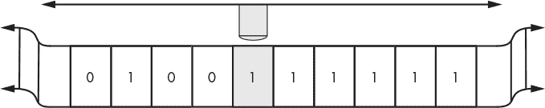

# 第三章：图灵机与图灵完备性


在编程语言的领域呆得久了，两种术语不可避免地出现：“图灵机”和“图灵完备性”。在本章中，我们将解释这些术语的含义以及它们为何重要。具体来说，我们将介绍停机问题并讨论艾伦·图灵对其的精彩解决方案。那将为讨论图灵机和图灵完备性打下基础。最后，我们将在 Python 中模拟图灵机。

本章的主题属于“理论计算机科学”范畴，这是数学的一个分支，而不是软件工程。正如我们下面所看到的，理论计算机科学早于物理计算机的出现。

### **停机问题**

20 世纪初的数学家们遇到了一个问题。他们已经花费数十年时间，努力将所有数学建立在逻辑基础上。作为这一计划的一部分，1928 年，戴维·希尔伯特和威廉·阿克曼提出了他们的“Entscheidungsproblem”（德语意思是“决策问题”）。该问题要求给定某个形式系统中的陈述，找到一种算法，能够毫无差错地返回“yes”或“no”，用于判断该陈述的有效性。换句话说，该问题要求找到一种算法，能够判断该陈述是否可以从系统的公理中推导出来，而公理是那些被接受为真但无需证明的陈述。值得注意的是，希尔伯特和阿克曼的挑战是针对一种通用算法，即一种能够始终给出所有应用场景正确答案的算法。

1936 年，年轻的艾伦·图灵，年仅 24 岁，发表了奠定理论计算机科学基础的论文：“可计算数及其在 Entscheidungsproblem 中的应用”。在这篇论文中，图灵证明了没有通用的解决方案来解决 Entscheidungsproblem。也就是说，无法通过任何算法始终正确地决定一个陈述的有效性。

为了实现这一点，图灵解决了一个特定的问题：*停机问题*。停机问题有不同的描述方式，但我们将使用这个定义：

找到一个程序，*P*，该程序当给定另一个程序* T *的源代码和该程序的输入* I *时，如果* T *在输入* I *时最终停止，就总是输出“yes”，如果* T *会永远运行下去，则输出“no”。

这是一个停机问题。我们想知道一个程序在给定输入时是否最终会停止，或者会永远运行。涉及的程序是* T *，输入是* I *。做出决定并输出“yes”或“no”的程序是* P *。上述定义中使用了“程序”一词来指代* P *，并隐含地理解为算法可以被编码在程序中。毕竟，编程的核心就是：将算法（思想）编码成可以指示机器执行的形式。我们将在下面回到算法和程序之间的等价性。

图灵的论文，内容相当易懂，并且可以通过搜索上述标题轻松在线找到，表明了不存在 *P*。它根本不存在。由于停机问题是一个决策问题，因此图灵进一步证明了决策问题（Entscheidungsproblem）也没有解决方案。

几乎与图灵同时，实际上稍微早一些，阿隆佐·丘奇通过一个名为 *λ* 演算（λ-calculus）的形式系统得出了相同的结论。如果你阅读图灵的 1936 年论文，导言部分会提到丘奇的“最近的论文”，通过 *λ* 演算来展示图灵即将证明的内容。最终，图灵成为丘奇在普林斯顿的学生，并于 1938 年在那里完成了他的博士学位。

图灵证明停机问题无解的过程经历了几次迭代。他在 1936 年论文中的版本有些瑕疵。证明的本质是通过反证法。

假设我们有一个程序 *P*，这个程序接受另一个程序 *T* 和它的输入 *I*。*P* 告诉我们 *T* 是否会在输入 *I* 上停机。我们之前提到，*P* 的输出是“是”或“否”。

现在，我们对 *P* 做了一个小的修改，使它接受一个单一输入，并将该输入同时作为 *T* 和 *I*。另外，当 *P* 即将返回“是”以表示 *T* 在输入 *I* 上会停机时，我们在返回之前加入一个无限循环。如果我们将这个略微编辑过的程序称为 *Q*，那么当我们将 *Q* 作为其自身的参数时会发生什么？

有两种情况。假设 *Q* 在以 *Q* 作为输入时会停机。如果是这样，*P* 会返回“是”。然而，我们在返回之前添加了一个无限循环，所以 *Q* 并不会停机。现在假设 *Q* 在以 *Q* 作为输入时不会停机。在这种情况下，*P* 返回“否”以表示 *Q* 在以 *Q* 作为输入时不会停机。然而，通过返回“否”，实际上 *Q* 会停机。我们得到了一个矛盾：*Q* 以 *Q* 作为输入时停机，当且仅当 *Q* 以 *Q* 作为输入时不停止。这是不可能的，因为 *Q* 其实是 *P* 在原有的基础上稍作修改的版本，它说明了 *P* 也不可能存在。因此，停机问题没有解决方案。

图灵证明停机问题无解是基础性的，但更让我们关注的，实际上是他在此过程中引入的东西。早在 1936 年，在任何物理计算机出现之前，他引入了一个 *计算模型*。也就是说，一个直接的机器，捕捉了我们所称之为 *算法* 的本质——换句话说，就是图灵机。我们来看一下。

### **图灵机**

*图灵机*是一种简单的计算机，由一条被分割成方格的无限磁带和一个沿磁带移动的读写头组成。一个状态表，有时称为*指令表*，指定机器的操作。每一步都需要在指令表中查找当前状态与头下方磁带上符号的匹配项。对于每个匹配，表中会指定一个动作、一个移动方向以及一个新状态。允许的三种动作是：在磁带上打印一个符号，擦除磁带上已有的符号，或不做任何操作。方向可以是向左移动、向右移动或不动。机器通过加载磁带来初始化，磁带可以是空白的，也可以已经标记，并将读写头定位到起始位置，通常是磁带的开头。图 3-1 展示了图灵机的抽象表示。



*图 3-1：概念化的图灵机*

为了运行机器，我们按照以下步骤操作：

1.  在表中查找当前状态与磁带头下符号的匹配项。

1.  对于该组合执行表中指定的操作：什么都不做，打印一个符号，或擦除一个符号。

1.  如果指令表中有规定，则将磁带头向左或向右移动一个方格。

1.  将当前状态设置为从表中读取到的新状态，并从第 1 步开始重复。

尽管这台机器非常简单，但它可以实现任何算法；不过没人提到过效率或实现的容易性。*丘奇–图灵论题*甚至更进一步，声明算法的定义是可以被图灵机实现的东西。也就是说，一个问题可以通过算法解决，当且仅当它可以通过图灵机解决时。请注意，这个声明是一个*论题*而不是*定理*。论题是经过充分理由相信为真的东西，而定理是经过证明为真的东西。

图灵论文的第三部分列出了示例机器。他的第一个示例是一台将磁带填充为“0 1 0 1 0 *…* ”模式的机器。该机器打印一个 0，向右移动两次留下一个空白，然后打印一个 1，再向右移动两次，永远重复下去。

这条磁带最初是空的，意味着机器没有输入。读写头从第一个方格开始，初始状态为 0。为了执行操作，我们需要一个指令表，它告诉我们下一步该做什么。该机器的指令在表 3-1 中。

**表 3-1：图灵的第一个示例**

| **状态** | **符号** | **打印** | **移动** | **新状态** |
| --- | --- | --- | --- | --- |
| 0 | *空白* | 0 | 右 | 1 |
| 1 | *空白* | *空白* | 右 | 2 |
| 2 | *空白* | 1 | 右 | 3 |
| 3 | *空白* | *空白* | 右 | 0 |

该机器在状态 0 下开始，磁带为空。查找表中与此配置匹配的项，结果是与“0 *空白*”匹配。在这种情况下，表中指定打印一个 0，向右移动，并将机器设置为状态 1。

下一步是查找状态 1 及纸带头下的内容，这时纸带头下是一个空白。此配置有一个匹配项。匹配项指示打印一个空白，向右移动，并将机器设置为状态 2。状态 2 匹配，打印一个 1，向右移动，并转到状态 3。最后，状态 3 匹配，打印一个空白，向右移动，并返回到状态 0。此时，过程将永远重复，因为没有停止状态。接下来我们将探索其他图灵机的例子。

这并不是显而易见的，或者说，从任何意义上来说，这一点都不明显，图灵机是否体现了算法的概念。事实上，图灵本人认为教会–图灵论题并不能通过数学证明。支持这一观点的原因之一是，尽管有多种方法可以得出相同的结论，但几十年来关于反驳这一论题的尝试都未曾成功。

在他 1936 年的论文中，图灵提出了几个论点，以帮助说服读者图灵机能够实现任何算法。我最喜欢的一点是他将人类计算机（即进行计算的人，原本“计算机”一词的含义）与图灵机进行对比。图灵描述了一种情况，在这种情况下，人类计算机正在以类似于图灵机配置的方式工作，并使用纸带来保存计算结果。接着，他描述了计算机中断工作的情况：

计算机总是可以中断工作，离开并忘记所有的事情，然后再回来继续工作。如果他这么做，他必须留下一个指示说明（用某种标准形式书写），解释工作如何继续进行。这个指示说明就是“心理状态”的对应物。我们假设计算机以一种零碎的方式工作，他每次只做一步。指示说明必须使他能够执行一步并写下下一个指示说明。因此，计算的进度在任何阶段都完全由指示说明和纸带上的符号确定。

在这里，图灵是在诉诸我们的直觉。如果人类可以用笔和纸实现任何算法，并且人类能够遵循图灵机所遵循的过程，那么我们应该也能期望图灵机能够实现任何算法。

### **通用图灵机**

如果一台图灵机能够实现任何算法，那么它应该能够实现另一台图灵机。换句话说，应该可以构造一个*通用图灵机（UTM）*，它接受另一台图灵机和纸带作为输入并执行它。图灵在他的论文第 5 到第七部分中引入了这个思想。

图灵机包括一个指令表和一个可能为空白的输入带。通用图灵机（UTM）接受两样东西：一个图灵机，即指令表，以及一个输入带。输入图灵机必须以某种方式编码，图灵在他的论文第五部分中开发了这种编码方法。

由像表 3-1 这样的指令表描述的图灵机可以映射到图灵所称的*标准描述（S.D.）*。指令序列一个接一个地写出，字母之间用分号隔开。

例如，表 3-1 中的指令是 5 元组，图灵以*标准形式*写作*q*[*i*]*S*[*j*]*S*[*k*]*Rq*[*m*];，其中*q*[*i*]是当前状态，*S*[*j*]是读头下的符号，*S*[*k*]是要打印的符号，*R*表示右移（也有*L*表示左移或*N*表示保持不动），*q*[*m*]是新状态。分号结束指令。

要找到指令的标准描述（S.D.），*q*[*i*]写作*D*后跟*i*个 A。类似地，*S*[*j*]符号写作*D*后跟*j*个 C。运动字母本身写出：*R*、*L*或*N*。因此，表 3-1 的第一条指令是

0     *空白*     0     R     1

图灵会写作*q*[1]*S*[0]*S*[1]*Rq*[2];，因为他从 1 开始编号状态，并使用一组允许的符号，*S* = {空白、0、1}。这里，*S*[0]是空白，*S*[1]是零，*S*[2]是一个。所以，这条指令的 S.D.是*DADDCRDAA*;，而表 3-1 所指定的整个机器的 S.D.是

*DADDCRDAA;DAADDRDAAA;DAAADDCCRDAAAA;DAAAADDRDA;*

在计算机器的标准描述（S.D.）之后，图灵进一步生成了他所称的*描述号（D.N.）*，这是一个完全指定图灵机的单一整数。要计算 D.N.，首先从 S.D.开始，并将 S.D.中的每个可能的字母替换为一个整数。

*A* → 1, *C* → 2, *D* → 3, *L* → 4, *R* → 5, *N* → 6, ;→ 7

例如，上面的 S.D.变成

31332531173113353111731113322531111731111335317

D.N.映射意味着每一个可计算的序列，即任何图灵机可计算的东西，都至少有一个 D.N.，且每个 D.N.仅指定一个可计算的序列。最终结果是，图灵机的数量是可数的。图灵在讨论可计算数，这些是可以通过算法计算的实数，但通过证明图灵机的数量是可数的（即可以被计数），他展示了有无限多的实数是不可计算的，也就是说，没有任何算法可以计算这些数。在这里，他是在建立在乔治·康托尔（Georg Cantor）著名的证明基础上，证明实数是不可数的。有关康托尔证明的总结，请参见*[`mathworld.wolfram.com/CantorDiagonalMethod.html`](https://mathworld.wolfram.com/CantorDiagonalMethod.html)*。

在他论文的第八部分中，图灵利用图灵机的数量是可数的这一事实，思考了一个检查描述编号的机器，这台机器知道与描述编号相关联的图灵机是否会在所有可能的输入下停止。通过尝试应用康托尔使用的数学过程，图灵得出了一个矛盾，证明了不存在这样的机器。这是他证明停机问题是不可判定的证明——即不存在任何算法能够告诉你程序*P*是否在输入*I*上对所有可能的输入停止。

总结一下，UTM（通用图灵机）是一种接受编码图灵机和输入带作为输入的图灵机。然后，UTM 会在提供的带上运行所提供的图灵机，输出图灵机的结果。因此，UTM 是一个运行其他程序的程序。听起来是不是很熟悉？UTM 是一个通用计算机——一台计算机——它可以运行作为输入的程序。UTM 是一个存储程序计算机，也就是说，它将程序和数据存储在同一个内存（即输入）中并执行程序。这就是每台现代计算机所做的事情：具体来说，每一台*冯·诺依曼架构*计算机。对于熟悉计算机的人——假设每个阅读本书的人都熟悉——这是一个显而易见的概念；这就是计算机的作用。然而，在 1936 年，这个想法并不是显而易见的。它是基础性和突破性的。

图灵机并不是唯一的计算模型。其他模型，如*有限状态机*和*敏斯基寄存器机*，确实存在。最好的情况是，这些其他模型与图灵机是等价的（敏斯基机），或者证明它们的计算能力较弱（有限状态机）。比较计算模型是*自动机理论*的一部分。对我们来说，重要的结论是图灵机处于计算模型的顶端，没有任何模型能执行图灵机无法实现的操作。这很可能包括量子计算机。我们将在第八章讨论 FRACTRAN 时遇到敏斯基寄存器机。

图灵机是最著名的计算模型，如果教会–图灵论题是正确的，它可能是最好的计算模型。让我们看看与图灵机的等价性对我们探索 esolangs（恶搞语言）有何帮助。

### **图灵完备性**

图灵机可以实现任何算法。如果某种编程语言也能做到这一点，那么该语言被称为*图灵完备*。具体来说，

一个*图灵完备*的系统可以模拟所有图灵机，也就是说，它可以模拟一个通用图灵机。

如果一种编程语言是图灵完备的，那么理论上它可以实现任何图灵机可以实现的功能，因此可以实现任何算法。正如你可能预料到的，广泛使用的编程语言都是图灵完备的。在下一节中，我们将用 Python 实现一个图灵机模拟器，这证明了 Python 是图灵完备的。

命令式编程语言只需要两个条件即可具备图灵完备性：

1.  基于条件的某种形式的循环，例如 `while` 循环或 `if` 与 `goto` 的组合。

1.  操作任意大量内存的能力。

第二个要求，当然，对于任何现实世界中的编程语言 *按实现* 来说是不满足的，但当语言 *被规范化* 时，它是可以轻松满足的。例如，Python 的规范中没有规定“一个列表最多只能包含一百万个项目”。在语言本身中，列表可以包含多少项没有限制，即使在实际物理实现中可能需要有此限制。

为什么我们应该关注图灵完备性？图灵完备性在处理“自造语言”（esolang）时尤其有趣。自造语言的核心就是挑战极限，尝试用新颖的方式思考。因此，询问某种自造语言是否图灵完备是合理的。如果它是图灵完备的，那么一个设计目标可能已经达成：该语言在理论上能够实现任何算法，无论实际操作起来有多么困难。并不是我们在本书中探讨的每一种语言都是图灵完备的；然而，非图灵完备并不意味着毫无用处。单独来看，HTML 并不是图灵完备的；但作为网页的基础，HTML 是极其有用的。

通过提供一个在该语言与已知的图灵完备语言之间的翻译器，也可以证明图灵完备性。这种方法通常用来展示不同自造语言的图灵完备性。例如，Nopfunge 语言（* [`esolangs.org/wiki/Nopfunge`](https://esolangs.org/wiki/Nopfunge)*），它基于我们将在 第十一章 中探讨的 Befunge 语言，通过将 Minsky 机翻译成 Nopfunge 来展示图灵完备性。Minsky 机是已知的图灵完备系统。因此，如果 Nopfunge 能实现 Minsky 机，那么 Nopfunge 也能够实现任何图灵机。

图灵完备的要求极其简单，许多原本并不打算具备图灵完备性的系统，后来被证明也是图灵完备的。例如，以下每个系统都是图灵完备的：

+   x86 架构的 `mov` 指令（请参见 *[`github.com/xoreaxeaxeax/movfuscator/`](https://github.com/xoreaxeaxeax/movfuscator/)*，它是一个仅生成 `mov` 指令的 C 编译器）

+   Minecraft

+   *魔法风云会* 卡牌游戏

+   《侏儒堡垒》视频游戏（请参见 *[`youtu.be/j2cMHwo3nAU/`](https://youtu.be/j2cMHwo3nAU/)*，该视频展示了《太空侵略者》在《侏儒堡垒》中的运行）

+   PowerPoint（请参见 *[`www.andrew.cmu.edu/user/twildenh/PowerPointTM/Paper.pdf`](http://www.andrew.cmu.edu/user/twildenh/PowerPointTM/Paper.pdf)*）

+   Vim 文本编辑器（请参见 *[`github.com/ealter/vim_turing_machine/`](https://github.com/ealter/vim_turing_machine/)*）

这个列表远非详尽无遗。

让我们将理论付诸实践，并用 Python 实现一个基本的图灵机模拟器。

### **构建一个图灵机**

或许理解图灵机如何工作的最佳方式是实现一个图灵机。从某种意义上来说，图灵机是最早的自定义语言（esolang）。它们可以做任何事情，但对于实际应用来说并不实用。图灵机是相当通用的，因为它们可以处理任意一组符号，但我们将限制自己只使用 0 和 1 作为符号，同时使用空白来表示空格。同样，我们将以 表格 3-1 所示的方式表示指令表，其中表格的每一行是一个五元组，描述了状态和磁带条件，后面跟着动作、移动和新状态。例如，我们将使用 Python 表示 表格 3-1，见 列表 3-1。

```
((0,' ','0','R',1),
 (1,' ',' ','R',2),
 (2,' ','1','R',3),
 (3,' ',' ','R',0))
```

*列表 3-1：图灵的第一个示例在 Python 中*

表格 3-1 的行与 列表 3-1 的行相匹配。表格中的第一个条目描述了状态 0 和一个空白。动作是打印一个 0，向右移动，转到状态 1，然后重复。对于我们的机器，所有动作都是打印某些东西，所有移动都是向右或向左；没有静止不动的情况。每个指令的前两个元素——状态和当前符号——的所有可能组合应出现在表格中；否则，程序是不完整的，因为存在没有定义动作的状态和符号组合。

让我们启动图灵机，然后深入研究代码。

#### ***模拟器***

我们的图灵机模拟器的代码在 *turing.py* 中。它以一个小的示例程序目录 `PROGS` 开始，并在 `NAMES` 中给出了简短的描述。

在没有参数的情况下运行 *turing.py* 会给出：

```
> python3 turing.py
turing <prog> [<M> | <list>] [-t]

  <prog> - program # [0,4]
  <M>    - blank tape of size M
  <list> - initial tape (list: 0,1,2=blank)
  <-t>   - trace, if present

programs:
    0: Turing's first example
    1: change 0's to 1's
    2: unary increment: 111 -> 1111
    3: binary increment
    4: unary subtraction: 11111 111 -> 5 - 3
```

输出告诉我们从以下列表中选择一个示例程序，然后指定空白磁带的大小，或者手动输入初始磁带配置作为输入。可选的最后一个参数 `-t` 启用跟踪功能，允许我们逐步执行程序，查看每个指令的效果。

让我们运行图灵的第一个示例（程序 0）。

```
> python3 turing.py 0 20
Program complete: (state=0, tc=20) [0 1 0 1 0 1 0 1 0 1 ]

Program:
     0, ' ' ==> '0', 'R',  1
     1, ' ' ==> ' ', 'R',  2
     2, ' ' ==> '1', 'R',  3
     3, ' ' ==> ' ', 'R',  0
```

我们告诉模拟器使用一个包含 20 个空白空间的磁带。按照设想，图灵机永远不会用完磁带。输出显示了预期的 0 和 1 的模式。我们还得知，机器停止在状态 0，且磁带计数器（`tc`）位于第 20 个位置。换句话说，我们用完了磁带，因此模拟停止。选定程序的指令表显示在输出下方，显示了匹配的状态和符号，后跟打印动作、移动和新状态。

在 *turing.py* 中，`main` 函数解析命令行参数，选择运行的程序以及用户输入的空白磁带的大小或初始磁带配置。我们将看到如何输入磁带。机器本身包含在 `TuringMachine` 类中。

清单 3-2 显示了 `TuringMachine` 类，省略了 `Result` 方法以节省空间。

```
class TuringMachine:
    def Step(self):
        found = False
     ➊ for p in self.prog:
            if (p[0] == self.c) and (self.tape[self.tc] == p[1]):
                found = True
                break
        if (not found):
            raise ValueError("No match found for current state: 
                (%d,'%s')" % (self.c,self.tape[self.tc]))
     ➋ w,m,c = p[2:]
        if (w != ''):
            self.tape[self.tc] = w
        if (m == 'R'):
            self.tc += 1
        elif (m == 'L'):
            self.tc -= 1
        self.c = c

 ➌ def Done(self):
        if (self.c == -1) or (self.tc < 0) or (self.tc == self.M):
            return True  # end state or fell off the tape
        return False ➍ def Run(self):
        while (not self.Done()):
            if (self.trace):
                s = "".join(self.tape)
                t = " "*self.tc + "^"
                print("%s, (state=%d, tc=%d)" % (s,self.c,self.tc))            
                print("%s" % t)
                _ = input("?")
                if (_.lower() == "q"):
                    quit()
            self.Step()

    def Result(self):
        --snip--

➎ def __init__(self, prog, tape=None, M=100, trace=False):
        if (tape is None):
            self.tape = [' ']*M
            self.M = M
        else:
            tape.append(' ')  # extra blank added
            self.tape = tape
            self.M = len(tape)

        self.c = 0          # start in state 0
        self.tc = 0         # start at position 0
        self.prog = prog    # state table, i.e. the program
        self.trace = trace  # trace or not
```

*清单 3-2：TuringMachine 类*

构造函数 ➎ 接受程序（`prog`）和初始磁带（`tape`），如果有的话，或者空白磁带的大小。如果提供了磁带，我们会添加一个额外的空白，因为一些示例程序期望最后有一个空白。构造函数设置默认状态（`c`）和磁带计数器位置（`tc`），然后保存程序。

`Run` 方法简短明了，因为它大部分实现了追踪 ➍。运行程序是一个个步骤地执行直到完成。`Done` 返回 `True` 如果我们超出磁带范围或遇到负状态，我们将其解释为停止指令 ➌。所有操作都在 `Step` 中完成。

`Step` 首先定位当前状态和磁带头下符号对应的指令表条目 ➊。找到后，我们提取动作、移动和下一个状态 ➋。然后，我们根据动作更新当前磁带位置。接下来，根据移动字符（`R` 或 `L`），我们增加或减少磁带计数器。最后，我们更新状态以完成指令步骤。

在 *turing.py* 中有更多的注释，详细解释了代码。请查看它们。示例目录在 `PROGS` 中。要添加更多示例，请将它们放在那里，并在 `NAMES` 中添加描述。请注意，我们的机器遵循图灵的原始论文，意味着我们沿着磁带移动磁带头。如果你查看其他图灵机模拟器，其中有许多比我们的更复杂，请注意很多是移动 *磁带* 而不是磁带头。因此，如果你想将程序转换为这种实现并应用于 *turing.py*，你必须将所有的 `R` 改为 `L`，反之亦然。

#### ***示例***

我们在上面描述了图灵的程序 0。现在，让我们逐步讲解其他示例，详细理解指令表中编码的过程。

##### **程序 1：将 0 改为 1**

这个示例很简单。指令将所有的 0 转换为 1，当遇到空白或 1 时，程序停止。

```
((0,'0','1','R', 0),
 (0,'1','1','R',-1),
 (0,' ',' ','L',-1)),
```

只有一个状态，状态 0，对于所有允许的符号：0、1 和空白，都有一条规则。具体来说，表格的第一行写道：“如果在状态 0 并且磁带头下的符号是 0，则打印 1，向右移动，保持在状态 0。”这个指令会一直执行，只要磁带头下的符号是 0。它将 0 替换为 1，并不断地移动到下一个符号。

剩下的两条指令描述了当磁带头下的符号是 1 或空白时该怎么做。在这两种情况下，匹配的符号会再次打印出来，以保持该方格不变。关键点是下一状态是 *–*1。我们的机器在状态为负数时停止，因此 *–*1 意味着“停止”。

这些状态一起沿着带移动，将每个 0 转变为 1，直到程序读取到 1 或空白。让我们通过不同的输入带来验证我们的解释是否正确。初始带配置作为 Python 列表传递，其中 0 和 1 表示二进制数字，2 表示空白。例如：

```
> python3 turing.py 1 [0,0,0,0,0]

Program complete: (state=-1, tc=4)

[11111 ]

> python3 turing.py 1 [0,0,0,0,0,1,1] Program complete: (state=-1, tc=6)

[1111111 ]

> python3 turing.py 1 [0,0,0,0,0,2,1]

Program complete: (state=-1, tc=4)

[11111 1 ]
```

上述每种情况中，输出结果都与我们预期的程序行为一致。所有连续的 0 现在变为 1 和空白，1 保持不变。

##### **程序 2：单一数字递增**

二进制数使用两个数字：0 和 1。单一数字是计数符号，即重复的 1。

| 1 | 1 |
| --- | --- |
| 2 | 11 |
| 3 | 111 |
| 4 | 1111 |
| 5 | 11111 |

程序 2 对带上的单一数字进行递增：

```
((0,'1','1','R', 0),
 (0,'0','1','L',-1),
 (0,' ','1','L',-1)),
```

这个程序与将 0 映射为 1 的程序非常相似。第一条指令沿着带移动，保持每个 1 为 1，并继续向右移动，直到遇到 0 或空白。程序将第一个 0 或空白转变为 1，然后停止。

让我们运行这个程序并进行追踪，看看它是如何执行的。在每个提示符下按回车键继续。

```
> python3 turing.py 2 [1,1,1] -t

111 , (state=0, tc=0)
^
?
111 , (state=0, tc=1)
 ^
?
111 , (state=0, tc=2)
  ^
?
111 , (state=0, tc=3) ^
?

Program complete: (state=-1, tc=2)

[1111]
```

追踪显示当前带上有三个 1，末尾添加了一个空白，并且显示了当前状态和带计数器。接下来的行在当前带位置下打印了一个插入符号（^）。按三次回车键会将光标移到 1 上的空白处。再按一次回车，那个空白就会被填充为 1，然后程序停止。初始输入是 3（`111`），输出带现在是 4（`1111`）。

##### **程序 3：二进制递增**

二进制数使用 0 和 1 作为数字。二进制加法规则非常简单，可以表示为：

| 0 + 0 = 0 |
| --- |
| 0 + 1 = 1 |
| 1 + 0 = 1 |
| 1 + 1 = 10（进位） |

请注意，1 与 1 相加会产生进位。程序 3 实现了一个图灵机，它将输入带上的二进制数加 1。它的指令表如下：

```
((0,' ',' ','L', 1),
 (0,'0','0','R', 0),
 (0,'1','1','R', 0),
 (1,' ','1','R', 2),
 (1,'0','1','L', 2),
 (1,'1','0','L', 1),
 (2,' ',' ','L',-1),
 (2,'0','0','R', 2),
 (2,'1','1','R', 2)),
```

程序 3 使用了三个状态。从指令表本身来看，很难直接理解这些状态的作用。所以，让我们通过一个带追踪的示例来看看指令的实际效果。我们将对 1011[2] = 11[10]进行递增。命令行如下：

```
> python3 turing.py 3 [1,0,1,1] -t
```

表 3-2 包含了逐步追踪。程序生成了 1100[2] = 12[10]，符合预期。

**表 3-2：** 追踪二进制递增过程（对于 1011）

| `1011 , (状态=0, tc=0)``^` |
| --- |
| `1011 , (状态=0, tc=1)``^` |
| `1011 , (状态=0, tc=2)``^` |
| `1011 , (状态=0, tc=3)``^` |
| `1011 , (状态=0, tc=4)``^` |
| `1011 , (状态=1, tc=3)``^` |
| `1010 , (状态=1, tc=2)``^` |
| `1000 , (状态=1, tc=1)``^` |
| `1100 , (状态=2, tc=0)``^` |
| `1100 , (状态=2, tc=1)``^` |
| `1100 , (状态=2, tc=2)``^` |
| `1100 , (状态=2, tc=3)``^` |
| `1100 , (状态=2, tc=4)``^` |

表 3-2 的前五个步骤沿着输入移动，寻找标记二进制数结尾的空格。这部分足以由 State 0 完成。当程序在这种状态下找到空格时，它将减少磁带计数器以查看二进制数的最右边的数字，然后 State 1 变为活动状态。

当 State 1 活跃时，如果磁带头下的符号是 0，则将其替换为 1，磁带头向左移动，并激活 State 2。这相当于加 1。如果磁带头下的符号是 1，则程序将其替换为 0，因为 1 + 1 = 0，带有 1 的进位。然后机器在向左移动后仍停留在 State 1。进位由 State 1 隐含，状态向左移动，将 1 替换为 0。State 1 的 0 和 1 指令一起从右向左处理数字，并通过保持在 State 1 直到找到 0 来处理进位。将 1 加到 0 不会产生进位，所以机器会转移到 State 2，增量完成。

State 2 将磁带头向右移动到找到终止空格为止，此时状态变为 *–*1，机器停止。State 2 的动作仅是定位磁带头。如果我们不关心在数字末尾定位头部，我们可以从 State 1 立即将 0 更新为 1 过渡到 *–*1。尝试使用不同的输入运行此示例，直到您对其工作原理感到满意。

##### **程序 4：一元减法**

给一元数加 1 是非常简单的。下一个例子实现了先减去较大数，然后是空格，然后是较小数的一元减法。例如，输入 `[11111 111]` 返回 `[11        ]`，即 5 *–* 3 = 2，使用空格覆盖任何多余的数字。

让我们带着追踪运行这个例子。我们不会列出所需的许多步骤，但我怀疑你会自己看到指令在做什么。这相当巧妙。用以下命令运行这个例子：

```
> python3 turing.py 4 [1,1,1,1,1,2,1,1,1] -t
```

State 0 找到第一个和第二个数字之间的空格，然后转移到 State 1。State 1 找到第二个数字后面的空格，然后转移到 State 2。State 2 向左移动到较小的数字上，将找到的第一个 1 变为 0，然后转移到 State 3。State 3 找到两个数字之间的空格，然后转移到 State 7。State 7 将较大数字的第一个 1 变为 0，并返回到 State 0。State 0、1、2、3、7 的循环重复，直到 State 2 在较小数字中找不到 1 为止。

此时，较小数的所有 1 都是 0，较大数最右边相同数量的 1 也是 0。实质上，减法完成了。程序的其余部分将 0 更改为空白，因此当程序结束时，磁带上唯一的符号是较大一元数的剩余 1。States 4、5 和 6 完成了这一点，然后在没有更多 0 时从 State 6 过渡到 –1。

##### **试试你的能力**

运行*turing.py*而不带命令行参数会显示五个示例程序。实际上还有第六个程序，即程序 5，但它故意没有列出，以作为练习。程序 5 计算输入带上二进制数的二进制补码。计算机使用二进制补码格式存储负整数，因此硬件只需要实现加法。两个整数的减法可以通过使用二进制补码形式的加法来实现。

找到二进制数的二进制补码很简单：将所有的 0 位变为 1，将所有的 1 位变为 0，然后在结果上加 1。例如：

01011011 → 10100100 + 1 → 10100101

本节的挑战是为图灵机创建一张将输入转换为二进制补码格式的指令表。我们有一台图灵机，它将 1 加到二进制数字上。我们也有一台图灵机，它将 0 转换为 1。所需的机器将在加 1 之前翻转 0 和 1。尝试自己编写二进制补码的指令表。准备好后，查看`PROGS`中的最后一个条目，并将其与您的表进行比较。你可以轻松运行程序 5。

```
> python3 turing.py 5 [0,1,0,1,1,0,1,1]

Program complete: (state=-1, tc=7)

[10100101 ]
```

输出是我们为上述示例找到的结果。

### **总结**

本章探讨了图灵机以及图灵完备性的概念。我们从停机问题开始，然后转到图灵机，这是图灵在其著名的 1936 年论文中使用的机制，他在该论文中证明了停机问题是不可判定的。然后，我们探讨了 UTM 的概念，这直接引出了存储程序计算机的概念。

接下来，我们讨论了图灵完备性的概念，在本书中我们会不断提到它，尤其是在探索 esolangs 时。许多系统不经意间具备图灵完备性，这个想法足够简单。最后，我们实现了一个 Python 中的图灵机模拟器，并通过几个示例程序进行了实践。

本章结束了第一部分的内容。接下来我们将讨论我所称的“非典型编程语言”，即那些旨在认真使用但由于其方法与常规语言有所不同，值得进行详细探讨的语言，为后续的 esolangs 做铺垫。我们将从 Forth 开始，这是一种基于栈的语言。
