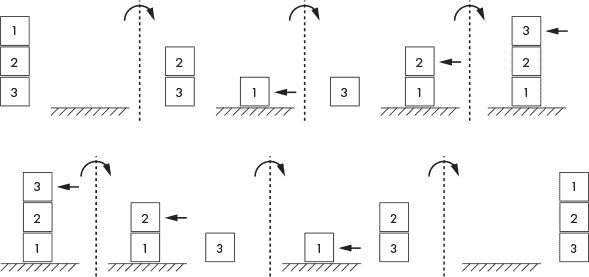
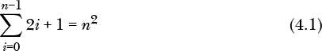
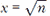
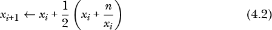

# 第四章：FORTH


Forth 是一种典型的极简编程语言。解析 Forth 仅仅是提取由空白字符分隔的符号。没有公式的解释，一切都是在栈上操作的离散单词。程序是由称为*单词*的函数组成，这些单词被逐个编译到一个不断扩展的内存空间中，这个空间被称为*字典*。单词在遇到时执行，或者在定义时编译到字典中。这与像 Python、C++ 或 Java 这样的语言不同，它们需要复杂的解析器和编译器，并且具有严格的结构，且与计算机硬件有很大的抽象。

在本章中，我们将安装 Forth，讨论该语言的起源和哲学，然后深入探讨语言本身。我们将一路展示一些示例，并最后进行讨论。

### **安装**

安装 Forth 特别简单。

```
> sudo apt-get install gforth
```

Forth 是交互式运行的。为了查看我们的安装是否正常工作，我们可以输入：

```
> gforth
Gforth 0.7.3, Copyright (C) 1995-2008 Free Software Foundation, Inc.
Gforth comes with ABSOLUTELY NO WARRANTY; for details type `license'
Type `bye' to exit
```

Forth 安静地等待我们输入内容。Forth 解释由一个或多个空格分隔的符号。如果符号是已知的单词，也就是已定义的函数，它会被执行。如果符号是数字，那么它会被推送到栈上。按下回车键时，输入行会被执行。尝试以下命令：

```
cr 1 2 + 3 * .
9  ok
```

这将告诉 Forth 移动到下一行（`cr`），将 1 推送到栈上，然后是 2，接着将 1 和 2 相加（`+`），结果将 3 留在栈上。接下来，我们将另一个 3 推送到栈上，并将它们相乘（`*`）。最后，句点（`.`）打印栈顶的值，现在是 9。Forth 通过 `ok` 提示符表示它准备接受更多命令。要退出，输入 bye。

Forth 使用*后缀表示法*，意味着操作符位于操作数之后。为了得到 1 + 2，我们输入了`1 2 +`。后缀表示法是由 Jan Łukasiewicz 在 1924 年提出的，由于他的国籍，这种表示法通常被称为*逆波兰表示法*或*RPN*。一些早期的桌面计算器也使用了后缀表示法。后缀表示法的优点是它永远不需要括号。

### **起源与哲学**

Forth 是由 Charles “Chuck” Moore 创建的，并在 1960 年代逐渐发展，到了 1970 年代初期逐渐成熟。作为一种交互式系统，Forth 在打孔卡片的时代走在了前面。早期的主要用途之一是天文望远镜控制。随着时间的推移，Forth 在小型系统中找到了自己的定位，尽管面向对象的 Forth 也出现了并应用于个人计算机。

Forth，最初拼写为 FORTH，原本是作为第四代编程语言设计的，但汇编器只允许五个字符的名称。所以，它从“FOURTH”变成了“FORTH”，后来改为“Forth”。“第四代”这一术语源于编程语言曾按代次进行分类的模糊概念。第一代是机器码，第二代是汇编语言。像 C 这样的语言是第三代。于是，“代次”这个术语开始出现问题——大多数语言都属于第三代。

对程序员来说，Forth 的哲学就是自由。语言的极度开放性包括扩展编译器本身，这是其他语言中很少见的功能。我们将在本章稍后看到如何做到这一点。

Forth 将程序看作是用自定义语言编写的文档，使用的“词汇”（函数）会被编译进字典中。字典存储实现程序所需的所有词汇以及所有必要的数据。每个新的词汇或数据块都会被添加到字典的末尾。

历史上，Forth 社区对代码重用持反对态度。为了以后使用而构建一个库被认为是灾难的根源。像 Python 的标准模块或 C++ 的标准模板库这样从多个不同的预构建代码库中提取组件的现代做法，在 Forth 中是陌生的，甚至被认为不受欢迎。“好的” Forth 程序员会开发出适合特定任务的词汇集：不多也不少。如果做得好，代码本身看起来就像一份文档。好的 Forth 代码是自文档化的。

很久以前，我看到过一条电子邮件签名，来源已经无法追溯，内容是：“C 让你觉得它是世界上最好的编程语言。Forth 让你觉得你是世界上最棒的程序员。”这句话很好地捕捉了 Forth 的哲学。Forth 程序员不仅仅使用语言设计者提供的功能，而是操作 Forth 的原始材料，将其转化为适合当前任务的理想语言。

### **语言**

Forth 本质上是一个系统，而不仅仅是一个编译器或解释器。早期的 Forth *本身* 就是操作系统。它们以 1024 字节为单位访问磁盘——当时没有文件系统——并从这些块中编译代码。它有一个顶层的 *REPL*（读取、求值、打印、循环），按照约定，使用 `ok` 作为提示符。Forth 程序是由由空格分隔的令牌组成的序列。在大多数 Forth 中，任何字符组合（除了空格、制表符和换行符）都是有效的令牌。

令牌会在遇到时进行求值。如果令牌在字典中找到，它就会被执行。如果令牌不在字典中，Forth 会尝试将其解释为数字。如果 Forth 无法做到这一点，它会抛出错误信息并返回 `ok` 提示符。

当遇到一个词时，执行它是很有意义的。但是 Forth 如何处理数字呢？Forth 会将数字推入*栈中*。所有操作都使用栈，要么从栈中取出参数，要么将结果推入栈中。被解释为数字的标记会被推入栈中。词汇通常从栈中取值，对其进行操作，并将新的值推入栈中。

栈是 Forth 语言以及本书后面将涉及的几种 esolang（自造语言）的核心部分，因此让我们花点时间了解栈是什么，以及如何操作它。

#### ***理解栈***

栈是计算机科学中的基础数据结构，通常被称为*后进先出*（*LIFO*）数据结构。它们与队列相对，队列是*先进先出*（*FIFO*）的数据结构。我把它想象成自助餐中的盘子堆。当盘子放到栈上时，第一个盘子先放下，接着是第二个，再是第三个，以此类推。当有人拿盘子时，他们拿的不是第一个盘子，而是最后放上的那个盘子。与此相反，队列中最先放入的物品会是最先拿出的，而不是最后一个。

大多数编程语言都使用栈。一个例子是函数调用的返回栈。Forth 使用一个栈来存储数据，正如我们下面将看到的，另有一个独立的栈用于函数调用的返回。数据栈是 Forth 程序员最常用的栈，尽管他们也可以在必要时小心地使用返回栈。

图 4-1 说明了栈的操作。



*图 4-1：将值推入 Forth 栈（上图），以及从栈中弹出值（下图）*

让我们按照从左到右的顺序，逐步分析 图 4-1。我们有三个值——1、2 和 3——以及一个空栈。接下来，我们将 1 推入栈中。栈顶的元素用箭头标示。然后我们将 2 推入栈中，2 此时位于 1 之上，成为新的栈顶元素。最后，我们将 3 推入栈中，使其成为栈顶元素。

要从栈中移除元素，我们将它们弹出。下图 图 4-1 展示了这一过程。同样，从左到右，我们首先弹出栈顶的 3。注意，3 是*最后*推入栈中的元素，因此它是第一个被弹出的元素。接着，我们再次弹出栈顶的 2，再弹出 1，最终栈变为空。当你尝试弹出一个空栈时，会出现 Forth 中常见的错误。最终你也会遇到这个问题。

#### ***使用栈***

操作栈可能是 Forth 中最令人头疼的部分。然而，Forth 提供了许多内建的词汇来帮助你控制栈。我们将介绍其中的一些，并看看它们是如何工作的。我们从一个简单的例子开始。

```
> gforth
1 2 3  ok
. 3  ok . . 2 1  ok
bye
```

首先，我们将 1、2、3 依次推入栈中。要弹出栈并打印弹出的值，使用句点（`.`）。这样会得到 3，这是最后一个推入栈的元素。再弹出栈并打印两次，得到 2 和 1，栈最终为空。要退出 Forth，可以输入 bye。Forth 是不区分大小写的，所以输入`BYE`也同样有效。

表 4-1 介绍了几个词汇和 Forth 的一个基本约定。

**表 4-1：** 栈操作命令

| **单词** | **效果** | **描述** |
| --- | --- | --- |
| `dup` | `( a -- a a )` | 复制栈顶元素 |
| `drop` | `( a b -- a )` | 移除栈顶元素 |
| `swap` | `( a b -- b a )` | 交换栈顶两个元素 |
| `2dup` | `( a b -- a b a b )` | 复制栈顶两个元素 |
| `2drop` | `( a b c -- a )` | 移除栈顶两个元素 |
| `over` | `( a b -- a b a )` | 将栈顶元素复制到次顶端 |
| `rot` | `( a b c -- b c a )` | 旋转栈顶三个元素 |
| `nip` | `( a b c -- a c )` | 移除次顶端栈元素 |
| `.s` | `( -- )` | 打印栈而不改变它 |

这些词汇在某种程度上是描述性的，并且 Forth 是不区分大小写的，但效果列非常重要。效果列包含了*栈效应注释*，我们将在下文中描述。Forth 注释以左括号`(`开始，以右括号`)`结束。请注意，`(`后需要一个空格。Forth 会忽略`(`之后的所有内容，直到第一个`)`为止。注释不能嵌套。许多 Forth 系统，包括我们使用的系统，使用`\`作为行尾注释符号，类似于 C++ 中的`//`。

注释本身说明了该命令如何影响栈。左边是命令期望的栈状态，栈顶元素位于右边，紧挨着短横线。短横线右边是该命令执行后栈的状态，栈顶元素同样位于右边。对于这些字符的使用有一些约定，但它们更像是指南，而非硬性规则。

例如，`dup`命令会复制栈顶元素，因此`a`变为`a a`。如果命令不影响栈，使用空的`( -- )`注释。按照约定，每个命令定义后都有一个栈效应注释，就像在 Python 中为函数定义添加文档字符串一样。

表 4-1 包含了`.s`这个命令，用来打印栈的内容而不改变栈的状态。当你使用 Forth 时，特别是在熟悉栈命令时，你会经常使用`.s`。最好使用它来检查你的命令是否没有在栈上留下多余的内容。

让我们再多了解一下栈。

```
1 2 3 .s <3> 1 2 3  ok
dup .s <4> 1 2 3 3  ok
2drop .s <2> 1 2  ok
3 nip .s <2> 1 3  ok
swap .s <2> 3 1  ok
2drop .s <0>  ok
```

上面的示例通过调用`2drop`来移除剩余的两个栈项，这就是为什么`.s`显示栈中没有项（`<0>`）。在你熟悉栈操作命令之前，可以多多练习栈的操作。

所有 Forth 系统都支持使用常见的运算符进行整数运算：加法（`+`）、减法（`-`）、乘法（`*`）、除法（`/`）和取模（`mod`）。许多 Forth 系统，包括 gforth，也支持浮点数运算。

作为练习，你可以尝试使用标准算术运算词汇实现以下表达式：

| (1200 × 3) ÷ 4 | （答案：900） |
| --- | --- |
| 8 × (127 *–* 9) ÷ 11 | （答案：85） |
| 8 × (127 *–* 9) mod 11 | （答案：9） |
| ((33 *–* 45) ÷ (7 + 9)) × 3 | （答案：-3） |

你需要将表达式转换为后缀表达式，意味着你不再写 *a* + *b*，而是写 *a* *b* +，以此类推。将子表达式的值保留在栈上，稍后与操作符结合：(*a* + *b*) × (*c* + *d*) 变为 *a* *b* + *c* *d* + ×。

要在 gforth 中使用浮点数，您需要做两件事。首先，使用科学计数法输入浮点常量。比如要将 3.1415 推入浮点栈（与数据栈分开，数据栈仅支持整数），使用 `3.1415e0`。例如，要计算 1/1,121，可以先进行整数运算再进行浮点运算，输入如下：

```
1 1121 / . 0  ok
1e0 1121e0 f/ f. 0.000892060660124888  ok
```

为了简便起见，接下来我们将继续使用整数运算。

**FORTHS 不是 Forth**

你可能已经注意到，我多次提到“Forths”而不是单单“Forth”。这有原因。所谓“赋予程序员自由”的哲学也延伸到了 Forth 本身。除了各版本之间的细微差异外，Python 只有一个版本。类似地，C++ 就是 C++，Java 就是 Java。相比之下，Forth 有很多变种。大多数现在已经被遗忘或几乎无法使用，因为它们最初运行的计算机早已不存在。例如，几乎没人听说过 Apple II 上的 QForth，更不用说 Jupiter ACE——这是唯一一台在 1980 年代运行 Forth 而不是 BASIC 的个人计算机。由于 Forth 系统的泛滥，某个 Forth 实现上运行良好的程序在另一个实现上往往无法正常工作。1994 年，ANSI 标准 Forth 被定义（参见 ANSI X3.215-1994）。Gforth 遵循该标准；然而，这个标准似乎总体上影响不大，因为仍有许多本土的 Forth 系统存在，其中大多数是非标准的，并且通常经过高度定制。

现在让我们学习如何定义我们自己的 Forth 词汇。

#### ***词汇和循环***

Forth 中的“Hello, world!”是

```
: hi ( -- ) ." Hello, world!" cr ;
```

在这里，我们定义了自己的词汇来打印 `Hello, world!`。词汇定义以冒号（`:`）开始，后跟词汇名称，在本例中为 `hi`。接下来是栈效应注释，虽然不是必需的，但强烈建议添加。

单词`hi`不会消耗栈中的任何内容，也不会在栈上留下任何东西，因此注释是空的：`( -- )`。下一个标记是`."`，它开始编译一个要打印的字符串。不要忘记`."`后面的空格；这是必须的。字符串以双引号（`"`）结束，接着是`cr`，表示换行。定义以分号（`;`）结束。我们刚刚定义了我们的第一个单词。要使用它，只需在`ok`提示符下输入 hi。虽然不太激动人心，但这是一个开始。

如果今天我们特别高兴，想要反复向世界问好呢？这也很容易做到。我们只需要一个知道如何多次说`hi`的单词：

```
: hello ( -- ) 10 0 do  hi  loop ;
```

新的单词`hello`使用了一个`do`循环。这是 Forth 的`for`循环版本，只能在单词定义内使用。

`do`循环的一般形式是

```
<end> <start> do <body> loop
```

在这里，结束值和起始值都位于栈上，结束值在前，然后是起始值，接着是单词`do`，接着是循环体，最后是单词`loop`来结束循环。为什么这么复杂？这与 Forth 的工作原理有关。关于 Forth 是编译器暴露的核心部分的评论，离真相并不远。单词`do`和`loop`并不是关键字，而是 Forth 遇到时立即执行的单词。它们的作用是设置代码以形成循环。Forth 的所有流程控制单词都是这种方式运作的。Forth 的核心编译单词与程序员可能创建的单词没有什么不同，这也是为什么 Forth 编译器可以根据需要实时扩展的原因。

一些 Forth 系统，尤其是那些用 C 语言实现的，使用一个小的核心单词集来定义大部分 Forth，以构建系统的其余部分。例如，`lbForth`（*[`gist.github.com/lbruder/10007431/`](https://gist.github.com/lbruder/10007431/)）就是一个基于 C 的公共领域 Forth。下面是它如何通过其他 Forth 单词来定义`do`和`loop`。

```
: do here @ ' swap , ' >r , ' >r , ; immediate
: loop ' r> , ' r> , ' swap , ' 1+ , ' 2dup , ' = , ' 0branch , here @ - , ' 2drop , ; immediate
```

这些定义中的许多单词现在可能不太容易理解，但如果你继续使用 Forth，它们会随着时间变得更清晰。`immediate`标签在`;`之后标记单词，以确保在遇到时立即执行，即使是在定义其他单词时。另一个，单引号（`'`）获取下一个标记，在字典中查找其执行地址，并将该地址放入栈中。逗号（`,`）将栈顶的数字添加到字典的末尾，在这种情况下是前一个单词的地址。单词`here`将字典末尾的地址放入栈中。因此，`do`的净效应是将当前字典末尾地址放入栈中，然后编译引用以按照顺序存储已在栈上的循环限制，并存储到返回栈上。这就是`swap >r >r`。我在上面提到过，返回栈用于保存当前单词结束后要跳转的地址，程序员如果小心，移除他们放置在上面的任何内容，就可以使用返回栈。

注意 `loop` 如何通过 `r>` 从返回栈中拉取限制值并排序，然后它会增加下限并与上限进行比较。如果限制值不相等，`0branch` 会通过栈中由 `do` 放置的初始起始地址跳转回去。计算回跳所需的字节数通过 `here @ -` 来实现。

对这些词语的操作理解并非必需。我之所以提到它们，是为了让我们注意到甚至编译器本身也是 Forth。Forth 所允许的像 `do` 和 `loop` 这样的流程控制词语的开放性是所有 Forth 程序员都可以使用的。我不知道其他编程语言能像这样开放。

上面 `hello` 的循环执行了 10 次，即使限制是 0 到 10。这是因为上限不包括在内，使得 `do` 循环像 C 语言中的 `for` 循环一样。

```
for(int i=0; i < 10; i++)
    printf("Hello, world!\n");
```

上面 C 代码使用 `i` 作为循环计数器。在 Forth 中，词语 `i` 提供了循环计数器。请看以下示例：

```
: counter ( -- )  10 0 do  i .  loop ;  ok
counter 0 1 2 3 4 5 6 7 8 9  ok
```

在这个例子中，注意 `do` 使用 `i` 来访问当前的循环计数器值。

有时单纯增加 1 并不够。在这种情况下，Forth 使用 `+loop`，其中增量值在栈上。以下示例每次增加 3。

```
: counter2 ( -- )  20 0 do i . 3 +loop ;  ok
counter2 0 3 6 9 12 15 18  ok
```

也可以使用索引作为增量。

```
: counter3 ( -- )  100 1 do i dup . +loop ;  ok
counter3 1 2 4 8 16 32 64  ok
```

允许嵌套 `do` 循环。使用 `i` 来访问最内层循环的计数器，使用 `j` 来访问下一个外层循环的计数器。

```
: nested0 ( -- ) 3 0 do 3 0 do j . i . space loop loop ;  ok
nested0 0 0  0 1  0 2  1 0  1 1  1 2  2 0  2 1  2 2   ok
```

在这个例子中，`i` 代表内循环的计数器，`j` 代表外循环的计数器。`space` 打印一个空白，正如你从输出中可能已经推测出来的那样。注意，我们将双重循环写在一行中，以简化代码。如果你将代码拆分成更易读的格式，Forth 也完全没有问题。

```
: nested0 ( -- )
  3 0 do
    3 0 do
      j . i . space
    loop
  loop ;
```

让我们再做些实验，看看 `i` 和 `j` 的效果。请看以下示例：

```
: nested1 ( -- ) 5 1 do i 0 do j . loop loop ;  ok
nested1 1 2 2 3 3 3 4 4 4 4  ok
: nested2 ( -- ) 5 1 do i 0 do i . loop loop ;  ok
nested2 0 0 1 0 1 2 0 1 2 3  ok
```

看一下 `nested1` 的定义。这里有两个 `do` 循环。第一个循环从 1 开始，一直到 5，但不包括 5。内循环从 0 开始，一直到当前 `i` 的值（不包括当前值）。输出反映了外循环的计数器，并运行那么多次内循环：第一次执行一次，然后两次，接着三次，依此类推，每次都会打印外循环的值（即 `j`）。

现在，看一下 `nested2`。在这种情况下，内循环引用 `i`，即内循环的计数器。因此，外循环的第一次迭代将 `i` 设置为 1，从而使内循环从 0 开始执行一次。这也就解释了第一个 0。下一次迭代时，外循环的 `i` 为 2，导致内循环执行两次。内循环此时也会引用 `i`；然而，这时第二个 `i` 是指*内*循环的计数器，这也是为什么输出会分成两行的原因。

```
0
0 1
0 1 2
0 1 2 3
```

如果你有三个或更多嵌套的循环怎么办？如何获得最外层的计数器？Forth 没有这个单词，因此你需要在开始下一个嵌套循环之前使用 `i` 保存计数器，并以此方式访问它。你可以将它留在堆栈上，推送到返回堆栈，或将其转存到变量中，并在需要时引用它。

#### ***什么是真理？***

Forth 是不寻常的，因此 Forth 对真理的定义也不寻常也就不足为奇了。在大多数语言中，如果没有显式的布尔数据类型（如 Python 中的 `False` 和 `True`），0 是假，1（或非 0）是真。而在 Forth 中，假是 0，真是 *–*1。Forth 还支持通常的比较运算符，如 `<` 和 `>`。

```
1 2 < . -1  ok
-123 321 < . -1  ok
45 3 > . -1  ok
3 45 > . 0  ok
```

上述内容告诉我们 1 < 2，*–* 123 < 321，45 > 3，但不是 3 > 45。

要测试是否相等或不相等，可以使用 `=` 和 `<>`。

```
1 2 = . 0  ok
1 2 <> . -1  ok
```

Forth 支持有符号和无符号整数，但上面的比较运算符仅适用于有符号整数。不过，Forth 也支持无符号版本，运算符前会加上字母 `u`。

```
1 2 u< . -1  ok
-123 321 u< . 0  ok
```

第一个结果是有道理的，但第二个可能不太直观；然而，它是正确的。无符号比较只看代表 *–*123 的位模式。在二进制补码格式中，假设使用的是 16 位整数，尽管我们的 Forth 系统使用的是 64 位整数，*–*123 的位模式是 1111111110000101，而 321 的位模式是 0000000101000001。这意味着，使用无符号比较时，*–*123 大于 321。

如果没有某种形式的条件表达式，Forth 的用处就不大了。幸运的是，它支持 `if`、`else` 和 `then`。条件表达式的一般格式是：

```
<condition> if <true_instructions> then
<condition> if <true_instructions> else <false_instructions> then
```

这里，`<condition>` 是堆栈上的条件标志，0 表示假，*–*1 表示真。如果为真，`<true_instructions>` 中的指令会被执行。如果有 `else` 且条件为假，则会执行 `<false_instructions>` 中的指令。

例如，金发姑娘可能想根据粥碗的温度了解它的状态。在 Python 中，她可能会写出以下代码：

```
def porridge(n):
    print("The porridge is ", end="")
    if (n < 90):
       print("too cold")
    elif (n > 100):
         print("too hot")
    else:
         print("just right")
```

在 Forth 中，她可能会写出 Listing 4-1 中显示的内容。

```
: porridge ( n -- )
  ." The porridge is "
  dup  90 < if  drop ." too cold"  else
      100 < if  ." just right"     else
                ." too hot" 
  then then cr ;
```

*Listing 4-1: 太冷，太热，还是刚刚好*

然后，她会像这样测试她的 Forth 代码：

```
80 porridge The porridge is too cold
 ok
99 porridge The porridge is just right
 ok
111 porridge The porridge is too hot
```

让我们看看 Listing 4-1 中的示例。单词 `porridge` 期望堆栈上有一个数字，在此案例中是粥的温度（以华氏度为单位）。在温度仍然在堆栈上时，`porridge` 会打印输出句子的第一部分。请注意，这里没有 `cr`，因此默认情况下输出不会换行。

接下来是嵌套的 `if` 语句。我们从第一个开始。

```
dup  90 < if  drop ." too cold"    else
```

词`dup`复制温度。这是必要的，因为`<`会将它与 90 一起消耗掉，用于测试 *n* 是否小于 90。结果，0 或 *–*1 会被推入栈中。该值在此测试中被消耗掉，因此如果第一个`if`失败，嵌套的第二个`if`就需要一个 *n* 的副本来进行测试。

此时，栈中包含 *n* 和`<`的输出。接下来，`if`消耗 0 或 *–*1。如果是-1，`porridge`会打印出剩下的句子：太冷。`drop`在那里干什么呢？因为 *n* 被复制了以防第一个`if`失败，它仍然在栈上。因此，必须在`porridge`退出前将其丢弃。

第二个`if`与第一个类似；它检查 *n* 是否小于 100。如果是，粥就刚好；否则，粥太热。注意，第二个`if`前没有`dup`，因为比较后不再需要 *n*，所以它被 `<` 消耗掉了。

清单 4-1 的写法遵循经典的 Forth 习惯。如前所述，早期的 Forth 系统以 1024 字节为单位访问磁盘，因此编写紧凑的代码非常重要。Forth 编辑器将一个 1024 字节的块，一个*屏幕*，分为 16 行，每行 64 个字符。

现代 Forth 更加灵活。以下代码与清单 4-1 一样有效。

```
: porridge (n -- )
  ." The porridge is "
  dup 90 < if
    drop ." too cold"
  else
    100 < if
      ." just right"
    else
      ." too hot"
    then
  then cr ;
```

一些 Forth 系统，包括 gforth，支持一种与 C 中的 `switch` 相似的`case`选择结构。例如，在一个菜单驱动程序中，采取的适当行动取决于用户选择了哪个选项——这是使用`case`的自然场所。

```
: menu ( n -- )
  case
    0 of ." option 0" endof
    1 of ." option 1" endof
    2 of ." option 2" endof
    ." bad option"
  endcase ;
0 menu option 0 ok
1 menu option 1 ok
2 menu option 2 ok
5 menu bad option ok
```

注意，`case`期望在执行时选项已在栈上。Forth 然后遍历各个情况，寻找匹配项。如果找到匹配，Forth 执行该情况的主体，主体是介于`of`和`endof`之间的词。如果没有匹配的情况，Forth 可以使用默认情况（“错误选项”）。

#### ***其他控制结构***

Forth 的剩余控制结构包括顶部测试循环、底部测试循环和无限循环。

```
begin <condition> while <body> repeat
begin <body> <condition> until
begin <body> again
```

前两个类似于 C 语言中的`while`和`do-while`，但最后一个有点特别。它是一个无限循环，可以通过使`while`条件始终为真在其他语言中轻松编写。然而，当考虑到 Forth 语言在 Forth 中的实现时，就容易理解为什么会有`begin-again`：

```
: begin here @ ; immediate
: again ' branch , here @ - , ; immediate
```

`begin`和`again`都是立即词，即在定义词时也会执行的那些词；`begin`将当前的字典结束值放入栈上，`again`从字典末尾返回到`begin`最初放入栈的位置。之所以是向后跳转，是因为`again`出现在循环体之后，因此`here`会报告比`begin`放入栈时的地址更高的地址。我在这里不展示，但稍微发挥一下想象力，可以猜测`while`、`repeat`和`until`可能是如何作为 Forth 词实现的。

一个简单的`begin-again`示例是

```
: infinity ( -- ) 0 begin  dup . cr 1+  again ;
```

`infinity` 这个词将 0 放入栈中，复制它以便打印，然后递增它并开始重复，直到你按下 CTRL-C 或者电源断开。

更加实用的是顶部测试和底部测试的循环。顶部测试循环，`while` 循环，会在执行循环体之前先测试条件。因此，如果条件最初失败，循环体可能根本不会执行。对于底部测试循环，循环体至少会执行一次，直到到达 `until`。让我们看看 `while` 是如何工作的。

使用整数运算估算一个数字的平方根的一种方法是从 0 开始，平方 0，然后问这个结果是否等于或大于给定数字。如果不是，就尝试 1，然后是 2、3、4，以此类推。最终，我们会到达一个点，数字的平方等于或大于给定的数字。清单 4-2 使用 `*while*` 实现了这个低效的算法。

```
: dsqr ( n -- )  0 begin  2dup dup * > while 1+ repeat nip ;
```

*清单 4-2：一个暴力平方根词*

我们称这个词为 `dsqr`，即“傻平方根”，因为它实现了最简单的算法。这个词推送一个初始的 0，作为计数器，然后用 `begin` 启动循环。请注意，我们想求平方根的数字 *n* 已经在栈上。

`while` 循环有两个部分：条件和循环体。这里条件是 `2dup dup * >`。我们在栈上有给定的数字和 0，供 `2dup` 复制。接下来，`dup` 复制计数器，以便将其自身相乘求平方。这为 `>` 做了准备，`>` 会在栈上留下 0 或 *–*1。记住，因为有 `2dup`，给定的数字和计数器仍然在栈上。

接下来，`while` 使用条件的状态来决定是否执行循环体 `1+`，它会递增仍然在栈顶的计数器。`repeat` 这个词对循环来说什么也不做，但我们已经看到了 Forth 的内部工作原理，知道 `repeat` 正在计算从字典中回溯多远以便重新开始 `begin`。一旦找到平方根，词语就完成了，通过移除给定的数字，即倒数第二个栈项（`nip`）。

尽管 `dsqr` 很傻，但它确实有效，并且对于完美的平方数是精确的（但不适用于其他数字）。稍后，我们将实现一种不同的整数平方根算法，这种算法肯定会更少消耗计算资源（我们认为）。

在 Forth 中，`begin-until` 循环总是至少执行一次循环体。例如，下面是一个进行小猜谜游戏的词。

```
: guess ( -- ) 0 begin 1+ key 15 and 7 = until . ." guesses" ;
```

执行`guess`并按下键盘上的按键。当按键的 ASCII 字符代码的最低四个比特是 7 时，游戏结束。计数器最初为 0，并在`begin`之前被放置到栈上。在每次猜测后，它会立即递增（`1+`），因为总会至少进行一次猜测。接下来，读取一个按键，并通过`key`将其放置到栈上。按键字符码的最低四位通过与 15（0xF = 1111 二进制）进行`and`操作得到保留。那就是`15 and`。如果结果是 7，`=`将*–*1 放置到栈上供`until`使用。如果结果不是 7，`until`将跳回到`begin`。

我之前提到过，`begin-until`与 C 语言中的`do-while`类似；然而，它们之间有一个重要的区别。考虑 C 语言中`guess`的等效代码：

```
int main(int argc, char *argv[]) {
    int count = 0;

    do {
        count++;
    } while ((key() & 0xF) != 7); 

    printf("\n%d guesses\n", count);
    return 0;
}
```

该程序使用了`do-while`，但`while`部分的条件写成这样，如果输入的键值的低四位（即最低的四个比特）不是 7，则条件为*真*。Forth 循环条件在满足条件之前是*假*的。在 C 语言中，逻辑是相反的：`do-while`循环在条件为真时继续执行，而`begin-until`循环在条件为假时继续执行。请注意，`key()`不是标准 C 库函数；它只是一个用来等待按键并返回 ASCII 键码的占位符，且不要求输入换行符。

这个例子引入了`key`来等待键盘输入的字符。我们将在本章稍后查看其他 Forth 输入和输出函数。现在，让我们先了解一下 Forth 如何处理内存。

#### ***Forth 如何使用内存***

Forth 高度依赖栈，但这并不是它唯一的处理数据的方式。Forth 原生支持常量和变量，并且可以在字典中为任何用途分配空间。让我们来看看它是如何做到的。

##### **变量和常量**

要定义常量和变量，请使用类似示例 4-3 中展示的代码。

```
variable f
variable c
32 constant b
: c2f c @ 9 * 5 / b + f ! ;  ok
: f2c f @ b - 5 * 9 / c ! ;  ok
212 f !  f2c  c @ . 100  ok
22 c !  c2f  f @ . 71  ok
32 f !  f2c  c @ . 0  ok
```

*示例 4-3：Forth 中的变量和常量*

前两行定义了变量`f`和`c`。接下来的行定义了常量`b`，它被设置为栈顶的值，在这种情况下是 32。

接下来是两个简短的定义。第一个是将摄氏度转换为华氏度，*F* = (9/5)*C* + 32，第二个是反向转换，*C* = (5/9)(*F –* 32)。这两个定义使用变量`f`和`c`而不是栈，这是一个非常*不像*Forth 的做法。作为练习，请将`c2f`和`f2c`改写为使用栈。

清单 4-3 中的词定义有奇怪的`@`和`!`符号。当引用一个 Forth 变量时，变量的值*不会*放入堆栈；只有变量的地址会放入堆栈。为了获取值，必须取消引用地址，就像在 C 语言中，指针必须取消引用才能获取它所指向的内容。因此，表达式`c @`首先将`c`的地址放入堆栈中，然后执行`@`，这是一个将地址传入并返回该地址上的 64 位整数的词。相当于 C 代码中的`c @`是`*&c`，假设`c`被声明为`int`。首先，使用`&`获取`c`的地址，然后使用`*`返回`c`的内容。

再看看清单 4-3 中`c2f`的定义。该定义以`f !`结束。正如你可能已经猜到的，`!`会将值存储在堆栈顶部的地址中，在这个例子中是华氏温度。`!`的堆栈效应是`( n a -- )`，即将值*n*存储在地址*a*处。

Forth 处理变量的方式非常优雅，因为其他数据区域也会把它们的地址留在堆栈上。然而，所有的`@`和`!`符号四处飞扬，最终会让人分心。例如，要将变量`x`加 1，可以使用`x @ 1+ x !`，这并不特别容易阅读。请注意，`1+`不是打字错误。递增堆栈顶端项目是一个足够常见的操作，Forth 为此实现了一个特殊的单词，它执行的速度比`1+`要快。实际上，我有点不公平。Forth 确实有一个词`+!`，它会将一个值加到变量中。所以`x @ 1+ x !`可以写作`1 x +!`，这稍微更易读一些。

Forth 至少提供了两个其他的内存访问词：`c@`和`c!`。这里的`c`指的是“字符”，意味着旧的 8 位 ASCII。这些词访问的是*字节*，而不是 64 位整数。考虑以下代码：

```
variable x  ok
hex 1122334455667788 x !  ok
x @ . 1122334455667788  ok
x c@ . 88  ok
x 1+ c@ . 77  ok
x 2 + c@ . 66  ok
x 3 + c@ . 55  ok
x 4 + c@ . 44  ok
x 5 + c@ . 33  ok
x 6 + c@ . 22  ok
x 7 + c@ . 11  ok
```

首先，我们定义`x`作为一个变量。然后，我们通过引入一个新词`hex`来将值赋给`x`，将 Forth 设置为十六进制模式。在执行`decimal`恢复十进制模式之前，所有的数字都会被解释为十六进制。因此，第二行和第三行写成 C 代码后变成

```
long long x = 0x1122334455667788;
printf("%llx", x);
```

那么，所有包含`c@`的行呢？由于`x`将`x`的*地址*推入堆栈，使用`c@`会返回该地址处的第一个*字节*。因为 Intel 机器是小端模式，`x`地址处的第一个字节是最低阶字节`0x88`（使用 C 表示法）。在访问之前，将`x`的地址加 1 移动到内存中的下一个字节，返回`0x77`，以此类推，直到`x`的八个字节都被访问。

这种自由使得修改内存变得非常有趣。例如，以下代码像之前一样定义了`x`，但是然后使用`c!`来修改`x`的低阶字节，将它从`88`更改为`ee`：

```
variable x hex  ok
1122334455667788 x !  ok
x @ . 1122334455667788  ok
ee x c!  ok
x @ . 11223344556677EE  ok
```

常量就是常量。一旦确定，它们就不能改变。Forth 也强制执行这个规则。然而，考虑以下这些话：

```
1 constant 2  ok
4 constant 1  ok
1 1 + . 8  ok
2 2 * . 1  ok
```

并不是每个 Forth 系统都会允许这样做，但 gforth 可以。究竟发生了什么呢？回忆一下，当 Forth 遇到输入中的标记时，它会做什么。如果它在字典中找到了该标记，它就会执行它；否则，它会将其解释为一个数字并推送到栈上。上面的前两行定义了常量`2`和`1`。在这种情况下，常量的名称实际上是字符`2`和`1`。常量`2`的值是 1，而常量`1`的值是 4。

所以下次遇到“2”时，Forth 首先会搜索字典，找到一个具有该名称的常量，并恭敬地执行它，将 1 放入栈中。对于“1”来说也是如此，将 4 放入栈中。因此，尽管令人困惑，Forth 完全正确地展示了似乎对我们来说是 1 + 1 = 8 和 2 × 2 = 1 的输出。

允许这种做法有一个历史原因。说实话：老式计算机很慢。程序员总是寻找能够加速的技巧。在处理一个新标记时，Forth 会从头到尾扫描字典，因此许多 Forth 程序以像`0 CONSTANT 0`这样的奇怪定义开始，因为查找零作为单词比扫描整个字典并将标记解释为数字要快。

##### **内存分配**

在本节中，我们将介绍几个新的单词。最后会有一个表格包含所有这些单词。

Forth 将所有新数据放在字典的末尾。这包括单词定义、变量和常量。为了分配任意数量的字典空间，例如为缓冲区或某种数据结构序列分配空间，Forth 提供了几个有用的单词：`create`、`does>`、`allot`、`cells`、逗号（`,`）和`c,`。让我们看看它们是如何工作的。

单词`create`定义了一个仅仅将其地址放入栈中的词汇。在内存分配中，`create`通常会紧跟着`allot`，如下所示：

```
create buf 1000 allot  ok
```

单词`buf`被创建，紧接着为其分配了 1,000 字节的字典空间。实际上，这意味着在字典的末尾有一个 1,000 字节的缓冲区，并且当`buf`执行时，缓冲区的第一个字节就是`buf`在栈上留下的地址。这本身就已经很有用，如下所示。

```
1 buf c!  ok
2 buf 1+ c!  ok
3 buf 2 + c!  ok
buf c@ . 1  ok
buf 1+ c@ . 2  ok
buf 2 + c@ . 3  ok
```

前三行将字节值 1、2 和 3 存储到`buf`指向的 1,000 字节缓冲区的前三个字节中。我们将`buf`当作字节数组来使用。继续上面的示例，试试以下内容：

```
123456789 buf 3 + !  ok
buf 1+ c@ . 2  ok
buf 3 + @ . 123456789  ok
```

第一行将一个 64 位值存储到`buf`的第 4 个字节开始的地方。下一行显示`buf`的第二个字节仍然是 2，就像我们之前设置的一样，第三行则表明在缓冲区的第 4 个字节处仍然有一个 64 位值。

尽管逐字节处理一块内存是完全可能的，但这样做既繁琐又容易出错。列表 4-4 展示了`create`如何与`allot`和`does>`配合使用，创建一个定义 1D 数组的单词：

```
: bArray ( n -- )  create allot does> + ;  ok
100 bArray x  ok
123 0 x c!  ok
124 1 x c!  ok
125 2 x c!  ok
1 x c@ . 124  ok
0 x c@ . 123  ok
2 x c@ . 125  ok
```

*列表 4-4：定义字节数组*

第一行定义了`bArray`，它期望栈上有一个数字，表示要`allot`的字节数。首先，`create`创建新的单词并且不改变栈。接着，`allot`保留*n*字节的字典空间。到这里为止，这一切都很有意义；我们在上面已经看到过。但是，当`does>`被执行时，事情就变得有趣了。

单词`bArray`有两个部分。第一部分使用`create`和`allot`为字节数组保留字典空间。当`bArray`执行时，这个过程会发生。然而，`does>`部分*尚未*执行。单词`does>`描述了当由`bArray`定义的单词本身被执行时发生的事情。此外，当该单词被执行时，它会将其地址推送到栈上，之后`does>`执行其余的定义。我们来一步步讲解。

第二行`100 bArray x`创建了一个字节数组单词`x`。`create`和`allot`单词已经执行，创建了`x`并保留了 100 字节的字典空间。当`x`本身被执行时，它的地址被推送到栈上，`bArray`定义的其余部分（即`does>`后面的部分）也会被执行。

对于`bArray`来说，在`does>`后有一个加号（`+`）。单词`x`的地址在栈顶，因此`+`将地址加到栈中紧接在它下面的值上`( n a -- a+n )`，其中*a*表示地址，*n*表示下面的值，也就是偏移量。将偏移量加到基址上正是几乎所有编程语言在处理存储在连续内存中的数组时的索引方式。所以，如果我们在`x`之前提供一个索引，在`x`执行后，栈中就会包含指向分配给`x`的字节数组元素的地址。现在，Listing 4-4 中的`c!`和`c@`行就有意义了：`125 2 x c!`相当于其他语言中的`x[2] = 125`。同样，`2 x c@ .`就是`print(x[2])`，如果使用 Python 的话。`create`和`does>`的结合使我们能够创建实现字节数组的单词。非常好。但是如果我们想要的不是字节数组，而是整数数组呢？单词`array`正是我们想要的功能：

```
: array ( n -- )  create cells allot does> swap cells + ;  ok
100 array y  ok
111111 66 y !  ok
222222 67 y !  ok
333333 68 y !  ok
66 y @ . 111111  ok
68 y @ . 333333  ok
67 y @ . 222222  ok
```

`bArray`和`array`之间唯一的区别在于`cells`的出现。在 Forth 中，内存的基本单位是*单元*（cell）。对于 gforth 来说，一个单元是 64 位或 8 字节。如果我们想让一个数组存储 100 个值，我们应该分配 800 字节。同样地，要索引数组，我们需要的地址不仅仅是基址加上索引，而是基址加上索引乘以一个单元的大小。单词`cells`期望栈上的一个数字并返回该数量单元所占的字节数：`100 cells .`会返回`800`。

因此，在`create`后添加`cells`仅仅是计算`allot`应保留的字节数。当我们进行索引操作时，`does>`之后的部分，我们首先将索引从单元转换为字节，并将结果加到基址上。这就是`swap cells +`的作用。经过这些更改，`array`就像`bArray`一样工作，但应该使用`!`和`@`来设置和获取数组中的值。

有时候，分配数组并不是我们所想要的全部。我们还希望同时进行初始化。Forth 的做法是使用逗号（`,`）或 `c,`。这些单词将栈顶的项目编译到字典中，可以是 64 位整数或字节。例如，

```
create ABCDEF 65 c, 66 c, 67 c, 68 c, 69 c, 70 c,
```

这将创建 `ABCDEF` 并分配六个值，这些值是 ABCDEF 的 ASCII 值。如果使用逗号也是一样的，不过它分配的是单元（64 位整数），而不是字节。这些单词非常有用，可以用来设置常量表或甚至是单词数组。

```
: one ." one" ;  ok
: two ." two" ;  ok : three ." three" ;  ok
create tbl ' one , ' two , ' three ,  ok
tbl 2 cells + @ execute three ok
tbl 1 cells + @ execute two ok
tbl @ execute one ok
```

这个示例介绍了两个新单词：单引号 (`'`) 和 `execute`。第一个单词获取下一个标记（一个单词）的执行地址，并将其压入栈中。下一个单词 `execute` 则执行栈上地址对应的单词。因此，`tbl` 就像是一个包含三个“函数指针”的数组，借用 C 语言术语。一旦知道了正确的 `tbl` 偏移量，并且通过 `@` 得到执行地址，`execute` 就会调用这个单词。

表 4-2 总结了我们在本节中介绍的单词。

**表 4-2:** 用于操作内存的 Forth 单词

| **单词** | **效果** | **描述** |
| --- | --- | --- |
| `@` | `( a -- n )` | 获取地址 *a* 处的 64 位整数 |
| `!` | `( n a -- )` | 将 64 位整数存储到地址 *a* |
| `,` | `( n -- )` | 将整数编译到字典中 |
| `c@` | `( a -- b )` | 获取地址 *a* 处的字节 |
| `c!` | `( b a -- )` | 将字节存储到地址 *a* |
| `c,` | `( b -- )` | 将字节编译到字典中 |
| `create` | `( -- )` | 创建一个新单词 |
| `does>` | `( -- a )` | 定义单词的行为 |
| `allot` | `( b -- )` | 分配字典空间（字节） |
| `cells` | `( n -- b )` | 将单元转换为字节 |

现在让我们暂时放下内存的讨论，来研究一下 Forth 的输入和输出机制。

#### ***输入与输出***

没有输入或输出的编程语言本质上是无用的。当然，Forth 提供了基本的输入和输出单词，更不用说通过串行和其他机制实现低级 I/O 了。我们在上面的 `begin-until` 示例中看到了 `key`。现代的 Forth，如 gforth，也有作为操作系统接口的一部分的文件访问单词。为了节省空间，我们将在此忽略这些内容。此外，我们已经提到过经典 Forth 的块级磁盘访问。令人惊讶的是，gforth 可以模拟这一点（如果需要的话），使用磁盘文件作为磁盘本身的表示。因此，如果你愿意探索，gforth 将允许你重温经典 Forth 的体验。

我们已经了解了 `.`，它将栈顶项打印为带符号整数。若要将栈顶值打印为无符号整数，可以使用 `u.`：

```
hex -aa dup . cr u. cr decimal -AA 
FFFFFFFFFFFFFF56
```

这个示例采用十六进制表示，以便更容易理解发生了什么。我们将 `-0xAA` 压入栈中，复制它，并打印两次，一次用 `.` 作为带符号整数，另一次用 `u.` 作为无符号整数。

如预期的那样，`.`输出`-AA`。然而，`u.`输出`FFFFFFFFFFFFFF56`，这是一个大正数，表示将带符号的 64 位二进制值当作正数解读后的结果。

Forth 是在终端和电传打字机的时代发展起来的，因此，它支持许多`.`和`u.`的变体词汇，其中包括用于高度结构化格式化的词汇。一种有用的变体是`u.r`。它打印右对齐的无符号数字`(n d -- )`，其中*n*是数字，*d*是字段的宽度。例如：

```
create x 10 , 100 , 1000 , 10000 , 100000 ,  ok
: aligned cr 5 0 do  i cells x + @  6 u.r cr  loop ;  ok
aligned
    10
   100
  1000
 10000
100000
```

首先，我们创建一个包含五个数字的小数组`x`。接着，我们定义`aligned`来遍历数组，并使用`u.r`显示每个数字。

词汇`key`从用户读取一个键，并将其字符代码压入堆栈。与之相应的输出词汇是`emit`，它取出堆栈上的字符代码并显示出来。

```
: alpha 26 0 do  [char] A i + emit loop cr ;  ok
alpha ABCDEFGHIJKLMNOPQRSTUVWXYZ
```

词汇`alpha`使用`emit`输出字符来显示字母表。我们还介绍了`[char]`，它在编译期间用于获取下一个字符标记，这里是`A`，并将它的代码压入堆栈。我们本来也可以直接使用`65`，因为那是字母`A`的 ASCII 码。

要从用户获取一串输入，可以使用`accept`，它在堆栈上期望两个值：字符串应该存放的位置的地址和要输入的最大字符数。

```
create str 80 allot  ok
str 80 accept (press enter here) How now brown cow?  ok
. 18  ok
```

`accept`返回实际输入的字符数。缓冲区`str`现在保存了文本。要查看它，可以使用`type`。

```
str 18 type How now brown cow? ok
```

这也需要堆栈上的地址和计数值。

创建一个专门的输入缓冲区有点繁琐，因此 Forth 提供了`pad`，这是一个预分配的至少包含 84 个字符的缓冲区（对于 gforth）。让我们使用`pad`来学习如何输入数字，而不是字符串。

```
pad 80 accept (press enter here) -2211333  ok
pad swap evaluate . -2211333  ok
```

第一行读取一个最多 80 个字符的字符串，并将其存放在`pad`中。回忆一下，`accept`返回的是实际读取的字符数，这个值将在下一行中使用。

第二行将`pad`的地址压入堆栈，交换堆栈，使得输入的字符数成为堆栈顶端的项，并调用`evaluate`将字符串解释为一个数字。

我们可以花更多的篇幅描述 Forth 提供的各种输入输出选项，其中有些可能比较独特，但到目前为止讨论的示例已经是一个不错的开始。

### **平方根归来**

在这一节中，我们将兑现之前在本章做出的承诺。在上面讨论`dsqr`时，我们说过要开发一种更好的整数平方根求解方法。为了证明我们可以做到，现在就来实现它。

`dsqr`通过测试所有选项来找到整数的平方根，看看哪一个是平方根。虽然这种方法有效，但乍一看它在计算上是相当低效的。相反，让我们尝试基于方程 4.1 的实现：



该方程说明了前*n*个奇数的和是*n*²。因此，如果我们计算一个不断增加的奇数可以从另一个数字中减去多少次，我们就能估算出该数字的平方根。

清单 4-5 实现了方程 4.1 所暗示的算法。

```
: sqrt ( n -- sqrt[n] )
  0 >r 1 swap begin
    dup 0 > 
  while 
    over - swap 1+ 1+ swap r> 1+ >r 
  repeat 2drop r> ;
```

*清单 4-5: Forth 中的整数平方根*

堆栈包含*n*，即要求平方根的数字，以及*x*，一个不断增加的奇数，首先是 1，然后是 3、5、7，依此类推。每次迭代都会设置*n* ← *n – x* 和 *x* ← *x* + 2。当*n*小于或等于 0 时，循环结束。为了得到平方根，我们计算循环经过的次数，并使用返回堆栈保存计数器，初始化为`0 >r`并通过`r> 1+ >r`递增。当循环结束时，*n*和*x*被丢弃，计数值被返回。

一些示例展示了`sqrt`如宣传所言有效（例如，42 的估算平方根为 7）。

```
25 sqrt . 5  ok
36 sqrt . 6  ok
42 sqrt . 7  ok
144 sqrt . 12  ok
152399025 sqrt . 12345  ok
```

毫无疑问，`sqrt`比清单 4-2 中的`dsqr`更好。让我们设置一个测试来验证一下。我们需要的代码位于*examples*目录下的文件*sqrt.4th*中。

```
( Park and Miller PRNG )
variable seed  8675309 seed ! ( default seed )
: rand ( -- n ) 48271 seed @ * 2147483647 mod  dup seed ! ;
: random ( m -- n ) rand swap mod ;

( Time to find the square root by method )
variable x
utime drop dup seed ! x ! ( keep seed )

: run0 ( -- ) 100000 0 do  1000 random 1+ dup * sqrt drop  loop ;
: run1 ( -- ) 100000 0 do  1000 random 1+ dup * dsqr drop  loop ;

: main ( -- )
  utime  run0  utime 2swap d- d. cr
  x @ seed !  ( use the same sequence )
  utime  run1  utime 2swap d- d. cr ;

main  bye
```

*清单 4-6: 测试 sqrt 和 dsqr*

清单 4-6 展示了*sqrt.4th*的相关部分。该文件首先定义了`sqrt`和`dsqr`（未展示），然后定义了一个简单的 32 位线性同余伪随机数生成器。单词`random`有一个上限，且该上限永远不会返回，而是返回一个在[0, *n*)范围内的随机整数。

Gforth 使用`utime`返回一个双精度（128 位）时间值，其低 64 位作为伪随机数生成器的种子。该种子的副本也保存在`X`中，以便我们以后能够重复该序列。

接下来是两个简短的词：`run0`和`run1`。这两个词都计算 100,000 个随机值的平方根，这些值的范围在[1,10⁶]之间，每个值都是一个完全平方数。我们实际上并不关心答案，我们只对计算所需的时间感兴趣，因此每个平方根计算后都会立即被丢弃（`drop`）。接下来，`run0`使用`sqrt`，而`run1`使用`dsqr`。

`main`词抓取开始时间，并将其留在堆栈上，调用`run0`，并打印出运行所需的时间（以微秒为单位，`2swap d- d.`）。然后，它重置伪随机种子，并使用`run1`重复计算。

执行*sqrt.4th* 10 次（`gforth sqrt.4th`）后，我们得到了两个平方根方法的平均运行时间。

```
SQRT: 0.7457714
DSQR: 0.4978122
```

时间单位为秒。显然，我们的直觉是错误的。更优雅的算法平均执行时间大约是暴力方法的 1.5 倍。这让我想起物理学家路德维希·玻尔兹曼的名言：“如果你想描述真理，把优雅留给裁缝。”在这种情况下，优雅败给了原始的计算能力。相比于实现减法方法所需的计算次数和堆栈操作，检查所有可能性显然更快。

那么，这就是最终的结论吗？还有一种算法我们可以尝试：牛顿法。牛顿法找到方程的根，即使方程为零的 *x* 值。如果方程是 *x*² *– n*，那么显然当  时，该方程为零。

牛顿法是基于初始猜测的迭代法。它强大且收敛迅速。方程 4.2 向我们展示了如何进行迭代。



对于某个初始猜测，*x*[0] = *n*/2。

我们需要的代码，也在 *sqrt.4th* 中，是

```
: step ( n xi -- n xi x_{i+1} )  
  2dup dup rot swap dup 0= if 2drop else / + then 2/ ;
: newton ( n -- sqr[n] )
  dup 2/ step begin 2dup swap < while nip step repeat drop nip ;
```

`step` 一词执行一个更新步骤（方程 4.2），以 *n* 和 *x*[*i*] 作为输入，*n*、*x*[*i*] 和 *x*[*i*+1] 作为输出。如果 *x*[*i*] 为 0，`if` 会处理相关情况。

`newton` 进行迭代，直到 *x*[*i*+1] < *x*[*i*]。第一次 `dup 2/` 设置初始猜测 *x*[0]。循环体将 *x*[*i*+1] 作为新的 *x*[*i*]，然后再进行一步。循环结束后，最后的 *x*[*i*+1] 被丢弃，连同 *n* 一起，最后只剩下 *x*[*i*] 作为答案。

运行 `newton` 10 次后，我们完成了平均运行时间的列表。

```
SQRT:   0.7457714
DSQR:   0.4978122
NEWTON: 0.0493205
```

我们有了明确的赢家。牛顿法在平均情况下比暴力求解法快一个数量级。在这种情况下，玻尔兹曼的观点是错误的；优雅和真理确实是相辅相成的。

### **讨论**

我们该如何看待 Forth 语言？它绝对是一种有趣的语言，但也有它独特的魅力。然而，它似乎最适合于一个已经过时的计算环境。弄清楚如何操作栈来完成在其他语言中可以通过一两行简单语句实现的任务，既令人沮丧又充满成就感，但对于日常使用来说并不特别实用。Forth 的学习曲线相当陡峭，尽管专家们可以用它做出令人惊叹的事情。

由于代码可能难以阅读，Forth 经常被认为是一种“只写”编程语言。专家从业者可能不同意这种看法，严格遵守 Forth 风格指南可能会缓解一些影响，但这一指控并非毫无根据。

在引言中，你可以看到 图 1，它展示了我在 25 年前为 Macintosh 编写的一个功能性脑部影像系统。我用了它很多次，而且效果很好。现在，经过大约 25 年的时间，感谢像 BasiliskII 这样的开源模拟器，我能够运行这段代码并提取源代码。这里是访问一个像是 3D 数据块的单个像素的代码，这是一个时间序列的磁共振图像。

```
: }Pixel ( x y z -- n )
  ( Return value of x,y pixel in image z of current slice )
  rot matsize @ m* zTmp 2! swap s>d zTmp 2@ d+ 2dup d+ zTmp 2!
  s>d d>f imgsz 2@ d>f f* f>d  ( z*image_size )
  zTmp 2@ d+  ( offset into slice )
  slcoff 2@ d+  ( slice offset )
  mem 2@ dl@ d+ l@ ;  ( fetch pixel value )
```

我同意这可能确实应该被贴上“只写代码”的标签。注释解释了发生了什么，但我怀疑会有人说它容易阅读。为了对比，下面是如何在 Python 中使用 NumPy 做相同的事情：`n = images[z,x,y]`。

以免读者认为我对其批评不公，我仍然使用 Forth 来做不同的项目，通常是为了模拟较大系统通过 RS-232 串行端口与之通信的小型微控制器。在这种情况下，Forth 表现得很好，即使在老旧的 Apple II 计算机上也能使用。

本章中的 Forth 语言构造花费了时间和一些努力，用笔和纸一一推导出来。然而，这也增添了用这门语言取得成功的魅力，尽管它在实际应用上有所减少。

Forth 的流行度在近年来的确有所下降。然而，嵌入式开发领域仍然保留着 Forth 的一席之地。有一些小型单板计算机既能运行 Forth 也能运行 C，不过它们稀少且分散。越来越多的嵌入式世界正在转向支持更现代语言的小型计算机。例如，在本书的后面，我们将使用 BBC micro:bit，它的主要编程语言是 Python，尽管爱好者们已经开发出了在 micro:bit 上运行的 Forth 版本。像 Raspberry Pi Zero 和 BeagleBoard 这样的单板计算机也能运行完整的 Linux 环境。激发 Forth 开发的那个世界已经发生了变化。

那么，为什么要考虑 Forth 呢？

因为 Forth 是本书所要向你展示的完美范例：它提供了一个机会，让你以新的视角看待编程。

要想在 Forth 中取得成功，你不仅需要从更高层次的算法角度思考，虽然这仍然是必要的，还必须从更低层次的 *如何* 实现每一个算法步骤的细节入手。

Forth 接近计算机的工作原理，而不像 Python 或 Java 那样将其抽象化。字节、地址、栈上的操作顺序，以及有限的字典内存大小，都需要一种不同的思维方式，一种更节俭的编程方法。

一旦被 Forth 所吸引的人很少能恢复过来。我记得在旧的 comp.lang.forth 新闻组中曾多次看到帖子（你还记得那些吗？），帖子中表达的情感几乎是精神层面的，那种与 Forth 一起工作时所感受到的喜悦。有点过于夸张，但毫无疑问，使用 Forth 确实令人愉快。请继续玩这门语言吧。

### **总结**

本章介绍了 Forth，一门有着悠久历史的独特语言。我们探讨了这门语言，它是如何运作的，它的编程模型以及其哲学思想。我们看了一些例子，并且发现 Forth 经常用 Forth 实现，通过自我引导的方式建立自己。

用 Forth 思考需要时间和精力。事实上，*《思考 Forth》* 是 Leo Brodie 所著一本经典的 Forth 书籍的名字（*[`thinking-forth.sourceforge.net/`](http://thinking-forth.sourceforge.net/)*）。看看这本书。如果你愿意，你还可以看看 Brodie 的 *《Forth 入门》*（*[`www.exemark.com/FORTH/StartingFORTHfromForthWebsitev9_2013_12_24.pdf`](http://www.exemark.com/FORTH/StartingFORTHfromForthWebsitev9_2013_12_24.pdf)*）。这两本书将让你全面理解使用 Forth 的意义。

现在，到了完全不同的时刻。我们告别了 Forth 的低级世界，进入了 SNOBOL 文本处理的奇妙世界。
