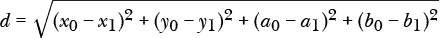
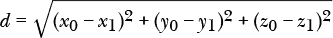
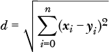
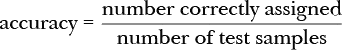

# 第五章：SNOBOL


SNOBOL 是一种文本模式匹配语言，开发于 1960 年代。现代程序员可能会觉得它的语法有些过时，甚至可能略感沮丧，但我怀疑随着我们探索其特性，语言的强大力量最终会展现出来，其中一些特性至今仍出现在现代语言中，如 Python。

SNOBOL，像 Forth 一样，是晚期古生代的产物。SNOBOL 和 Forth 同样属于同一时代，但它们非常不同。Forth 是极简的低级语言，而 SNOBOL 是抽象的，且出奇地强大，尽管有些怪异。

在本章中，我们将探讨 SNOBOL，特别是 SNOBOL4，这是该语言的最新方言。SNOBOL 以其模式匹配和字符串处理能力而闻名，但它也是一种通用语言。正如我们将看到的，SNOBOL 的数据处理功能出奇地复杂，且具有非同寻常的灵活性。正如迈克尔·沙夫托在 1982 年所说：“SNOBOL4 是编程语言中的 Alice's Restaurant：你想要的任何东西都可以得到”（参见《SNOBOL4 中的人工智能编程》，该书的 GitHub 网站上可用）。

让我们通过回顾语言的结构和它所提供的有趣能力来探索 SNOBOL。我们将逐步介绍其特性，查看示例，最后通过构建一个简单的机器学习分类器来将我们的探索与 1980 年代的计算机科学家们的希望相连接。像以前一样，我们将以一些总结性思考结束。

### **安装**

要安装 SNOBOL，请从 *[`ftp.ultimate.com/snobol4/`](http://ftp.ultimate.com/snobol4/)* 下载 *snobol4-2.3.1.tar.gz*，或者从该网站上下载任何更新的版本。将文件保存在名为 *SNOBOL* 的子目录中。下载文件后，解压并按照以下步骤构建 SNOBOL 可执行文件：

```
$ tar xzf snobol4-2.3.1.tar.gz
$ cd snobol4-2.3.1/
$ ./configure
$ make
```

上述命令会生成大量输出。其中一些来自 C 编译器，包括一些我们可以安全忽略的警告。其余的来自 SNOBOL 测试脚本。最终，如果你看到一条关于将时间信息发送到 `timing@snobol4.org` 的消息，就意味着 SNOBOL 已成功构建并且运行正常。

### **起源与哲学**

SNOBOL（“StriNg Oriented and symBOlic Language”）是由大卫·法伯、拉尔夫·格里斯沃尔德和伊万·波隆斯基在 1960 年代于 AT&T 贝尔实验室开发的。*SNOBOL* 这个名字是一个回文首字母缩略词，意味着开发人员从他们想要的首字母缩略词开始，然后倒推确保达成目标。

根据 Farber 的说法，这种语言的最初名字是“符号表达式解释器”（Symbolic EXpression Interpreter），简称 SEXI。在 1960 年代，运行一个计算机程序意味着带着一堆打孔卡走到机器房。通常，程序名称和用户名会标记在卡片组上。所以 Farber 把一堆标有“SEXI Farber”的卡片交给了那个年轻的女性程序员，她读了这个名字后，笑着说：“你是这么想的。”显然，需要一个新名字。在经历了很多挫折之后，有人抱怨他们根本不可能想到一个名字；于是“SNOBOL”就诞生了。这个拼写方式向当时其他类似命名的语言如 COBOL 和 ALGOL 致敬。（Farber 于 2008 年 12 月在他的 Interesting-People 邮件列表中发布了这个故事。）

SNOBOL 的名声来自于其强大的模式匹配能力。当前的编程语言通常依赖于正则表达式，这与 SNOBOL 有着不同的历史背景，但 SNOBOL 的匹配技能非常适合当时计算机主机使用中处理高度结构化数据的需求。我们将在本章中探讨模式匹配。

SNOBOL 的哲学可以用一句话总结：“整个世界都是一个字符串。”字符串几乎是 SNOBOL 中的一切。1960 年代的数据通常是文本型的，比如具有固定大小和字段的记录。SNOBOL 的模式匹配使得处理这类数据（相对而言）变得简单。

尽管 SNOBOL 操作的是结构化的文本数据，但它本身并没有使用结构化编程。因此，SNOBOL 中没有 `for` 或 `while` 循环。更进一步，SNOBOL 甚至没有基本的 `if-then` 结构。控制程序流的唯一方法是使用类似 `goto` 的语句。然而，在 SNOBOL 中，`goto` 语句非常灵活。SNOBOL 的一个独特概念是，每行代码要么成功，要么失败，程序接下来会去哪里取决于这一点。我们将在接下来的示例中看到这一点。在 SNOBOL 中，失败绝对是一个选项。事实上，它是一个必要条件。

SNOBOL 是动态类型的，能够即时创建新变量和数据结构。SNOBOL 甚至可以即时创建新代码，尽管我们在这里不会如此雄心勃勃。SNOBOL 支持强大的数组和表格，后者与 Python 字典类似。也可以使用用户定义的数据结构。

学习 SNOBOL 最好的方法就是使用 SNOBOL。你真得亲眼看过才会相信。所以，不再拖延，让我们走进这场雪中漫步吧。

### **语言**

我们将从学习如何让 SNOBOL 做一些基本的事情开始，例如打印“Hello, world!” 一旦我们弄明白这一点，我们将继续学习变量和用户定义的数据类型。接下来是数组和表格，这是 SNOBOL 的内建数据结构。然后是模式，尽管一些模式的使用可能已经悄悄出现在之前的内容中。模式是使用 SNOBOL 的传统原因，或许也是最能将 SNOBOL 与大多数其他语言区分开的语言特性。

SNOBOL 允许用户定义函数。我们将看到如何定义它们，并学习为什么这个过程，直言不讳地说，非常繁琐。然后我们将结束于磁盘文件和命令行参数的学习。通过操作示例，我们将学会如何控制 SNOBOL 程序的流程，因为这是学习它的最佳方式。以下章节中提到的所有文件都位于*examples*目录下的*SNOBOL*文件夹中。

#### ***运行 SNOBOL***

如果没有提供文件名启动，SNOBOL 将以交互模式运行。此模式适用于快速计算和测试想法，但 SNOBOL 本应从文件中运行代码，或最初是从打孔卡堆栈中运行代码。

示例 5-1 为我们展示了如何开始使用*hello.sno*。

```
*  hello.sno
    output = 'Hello, world!'
    output = 'Hello, '  "world!"
    output = 'Hello #' 9
    output = output = "Goodbye!"
end
```

*示例 5-1：一个 SNOBOL 问候程序*

这个简短的程序已经向我们介绍了 SNOBOL。首先，注释行以星号（`*`）开始。然而，与其他语言不同，星号*必须*位于第 1 列。整个行要么是注释，要么都不是注释。

在 SNOBOL 中打印内容，我们将其赋值给特殊变量`output`。SNOBOL 不区分大小写，因此`output`和`OUTPUT`是等同的。赋给`output`的内容是一个字符串，或者是 SNOBOL 会隐式转换成字符串的内容，如数字。

字符串连接是 SNOBOL 中非常常见的操作，因此空格被用作运算符。因此，示例 5-1 中的第一个`output`语句分配了一个用单引号括起来的字符串，而第二个则将两个字符串连接在一起。请注意双引号的使用。像 Python 一样，SNOBOL 允许两种类型的引号。正如从下一行可以看到的，SNOBOL 会隐式地将数字（无论是整数还是浮点数）转换为字符串。最后，要输出一个空行，只需赋值为空。赋值为空也是 SNOBOL 移除字符串中内容的方式。我们将在使用模式时看到这一点。

所有 SNOBOL 程序都以`end`结尾。请注意，`end`位于第 1 列，所有的`output`语句都需要缩进。SNOBOL 不关心语句缩进的多少，只要语句不在第 1 列开始即可。第 1 列仅允许包含`*`用于注释，`+`用于行续接（现在很少使用）和标签，包括`end`。

你可以像运行 Python 脚本一样运行*hello.sno*。

```
> snobol4 hello.sno
```

这应该会给你以下输出：

```
Hello, world!
Hello, world!
Hello #9

Goodbye!
```

清单 5-1 的输出表明，SNOBOL 总是打印分配给`output`的字符串。没有简单的方法可以在一行上输出部分内容，然后在结束行之前继续输出更多文本。SNOBOL 是基于行的，无论是输出还是输入。因此，程序员必须先构建完整的行，然后将其赋值给`output`。

现在运行清单 5-2，*hello2.sno*。

```
*  hello forever
loop  output = "You say goodbye and I say hello"  :(loop)
end
```

*清单 5-2：你好，你好，你好*

当你感到无聊时，使用 CTRL-C 中断程序。这是我们的第一个 SNOBOL 循环。在 SNOBOL 中，每一行都有机会执行一个 goto。行的第一部分，在第一列，是一个标签`loop`。标签是 SNOBOL 在执行行的 goto 部分时使用的目标。标签和其他标识符必须以字母开头。之后，可以使用字母、数字和下划线。请注意，标签是全局的。也就是说，它们必须在整个程序中唯一。此外，SNOBOL 行通常较长且包含许多空格，因此我们会去掉源代码文件中的多余空格，以节省文本中的空间。

SNOBOL 行中的 goto 部分位于行尾。goto 前面的空格数量可以变化，但 goto 后面没有其他代码。冒号（`:`）开始 goto。目标标签被括号括起来。随着我们继续前进，我们会遇到更复杂的 goto 语句。请注意，如果没有 goto，控制将按照大多数编程语言的方式继续执行下一行代码。

这里还有一点值得注意。在清单 5-2 中，goto 无论行是否成功都会执行。虽然这行代码永远不会失败，但我们会看到其他会失败并且必须失败的行。这是语言工作方式的一部分。如果忘记区分成功与失败，并使用一个始终执行的 goto，可能会导致奇怪的行为。当然，`goto`语句的潜在危险早已为人们所熟知——参见 Edsger Dijkstra 1968 年发表的著名论文《Go To 语句被认为有害》（*[`homepages.cwi.nl/~storm/teaching/reader/Dijkstra68.pdf`](https://homepages.cwi.nl/~storm/teaching/reader/Dijkstra68.pdf)*）。然而，在 SNOBOL 中，这是我们唯一能使用的工具。

清单 5-3 引入了一些新的 SNOBOL 概念。

```
*  A bit of interaction
again output = "Name?"
  name = input
  output = differ(name, null) "Greetings, " name  :f(again)
  output = "Shall we play a game?"
  output = "On second thought, nah"
end
```

*清单 5-3：一点交互*

第一个新概念是如何通过引用`input`从键盘获取输入；它返回一个字符串并将其赋值给变量`name`。请注意，变量`name`并没有声明。像 Python 一样，SNOBOL 是动态类型的，这意味着变量是在需要时创建的，并可以存储任何被赋值的数据。

下一行需要解析。这是对`output`的赋值，因此它最终会在屏幕上打印某些内容。我们看到一个常量字符串，后面跟着`name`。它们之间有空格，所以我们预计这两个将结合成一个字符串，使用用户输入的名称。但这个`differ`是什么？goto 部分也很新颖。

让我们从 goto 开始。它是`:f(again)`。冒号表示开始一个 goto。`f`代表失败。如果这一行失败，程序跳转到`again`，也就是请求用户输入名字的那一行。好吧，这看起来很合理；如果用户的输入无效，就再问一次。

现在来看`differ`部分：`differ`是一个 SNOBOL 谓词。像所有谓词一样，它的目的是确定某事是否为真或假。然而，不像我遇到过的任何其他编程语言，SNOBOL 谓词不会返回真或假。如果谓词为假，函数*失败*，而如果 SNOBOL 中的任何一行失败，则整行都会失败。如果一行失败并且有 goto 语句处理失败条件，则会执行该 goto。所以如果`differ`失败，这一行就会失败，程序流会继续到标记为`again`的行。

在 SNOBOL 中，真值是空字符串。我相信，真值为空和空的深刻哲学含义肯定有很多，但我们还是专注于计算机编程，避免头痛。SNOBOL 中为真的谓词返回空字符串。所以，`differ`接受两个对象并检查它们是否不同。在这里，两个对象是分配给`name`的内容和 SNOBOL 表示空字符串的常量`null`。

这一行是在检查用户是否按下了 ENTER 键而没有输入任何内容。如果是这样，`differ`失败，程序流将返回到`again`。如果用户输入了一些文本，`differ`成功并返回空字符串，因为空字符串与常量字符串之间有一个空格，所以会与字符串和名称连接起来。连接一个空字符串不会改变任何东西，就像加零一样。因此，这一行成功，`output`被赋值。使用一个将空字符串连接到一行的谓词是 SNOBOL 中常见的技巧。然而，谓词不一定非要以这种方式使用，它也可以单独出现在一行中。例如，以下代码同样有效：

```
  differ(name, null)          :f(again)
  output = "Greetings, " name
```

如果`differ`为假，它会失败，循环会发生。如果`differ`为真，空字符串不会产生任何影响，`output`会继续。

我们已经弄清楚了如何打印字符串，获取用户输入并将其存储在变量中。我们还了解了 SNOBOL 程序的整体结构，并学习了一些关于 goto 的知识。让我们继续探索，集中关注变量和数据类型。

#### ***变量和数据类型***

正如我们已经看到的，SNOBOL 变量是按需创建的，可以保存任何值。字符串、整数和浮点数是 SNOBOL 的基本数据类型。在这一部分，我们将使用这些基本数据类型，然后进一步创建自定义数据类型。这是 SNOBOL 中类似于其他语言（如 C 语言）结构体的概念。

##### **整数和浮点数**

列出 5-4 展示了*temperature.sno*，这是一个简单的菜单驱动程序，用于在华氏温度和摄氏温度之间进行转换。

```
menu  output =
      output = "(1) F to C or (2) C to F, 'q' to quit:"
      menu = input
      ident(menu,'2')                     :s(CtoF)
      ident(menu,'q')                     :s(end)

* F to C
      output = "Fahrenheit temperature?"
      F = input
      C = (5\. / 9.) * (F - 32.0)
      output = F " F = " C " C"           :(menu)

* C to F
CtoF  output = "Celsius temperature?"
      C = input
      F = (9\. / 5.) * C + 32.0
      output = C " C = " F " F"           :(menu)
end
```

*列出 5-4：温度转换*

菜单会询问转换类型或输入 `q` 退出。变量 `menu` 保存用户的选择。接下来是一个新的谓词 `ident`。正如你从名字中可能推测的那样，`ident` 是 `differ` 的反义词；当参数相同时它为真。注意，`menu` 是与字符串常量 `'2'` 进行比较，而不仅仅是 2。这是 SNOBOL 的一种地方性特性，不应用 SNOBOL 的自动字符串转换。`input` 返回的值始终是一个字符串，因此我们必须在 `ident` 中使用字符串。如果我们使用 2 而不是 `'2'`，不会报错，但谓词会失败，因为没有定义失败的 goto，SNOBOL 将继续执行下一行。

`ident` 行展示了一个新的 goto 形式，`:s(CtoF)`。`s` 表示成功，告诉 SNOBOL 如果该行没有失败则跳转到哪里。在这种情况下，不失败意味着用户选择了选项二。因此，程序跳转到标签 `CtoF` 进行摄氏度转华氏度的转换。同样，接下来的行如果用户输入了 `q`，则跳转到末尾。如果用户既没有输入 `2` 也没有输入 `q`，执行将继续到标记为 `F to C` 的代码。

转换程序会要求用户输入一个温度，进行相应的转换，报告结果，然后跳转回 `menu`。转换背后还做了一些细微的工作。请求的温度被赋值给 `F` 或 `C`，然后用于转换公式。在这种情况下，SNOBOL 会自动将输入转换为数字。除非用户明确输入小数点或使用科学计数法，否则结果是一个整数；否则，它就是一个浮点数。这意味着程序员有责任确保表达式执行正确的类型转换。为了将输入转换为整数，可以乘以 1。为了将输入转换为浮点数，可以乘以 1.0 或使用后面本章会提到的 `convert` 函数。

在清单 5-4 中有更多需要注意的地方。仔细观察我们编写的转换公式。首先，我们使用小数点来强制进行浮点数计算。如果没有小数点，除法操作将使用整数数学，尽管如果表达式中有浮点数，整数到浮点数的提升会发生。然而，要小心，因为每个子表达式也需要一个浮点数。在这种情况下，`(9 / 5) * 100.0 + 32.0` 将会是 `132` 而不是 `212`，因为分数是纯整数数学，返回 1 而不是 1.8。

注意，转换中的每个运算符周围都有空格。这不仅仅是为了提高可读性；SNOBOL 需要这些空格。如果忘记在运算符前后加上空格，将会出错，SNOBOL 会很高兴地指出这一点。最后，SNOBOL 缺乏像 C 和 Python 语言中那样的格式说明符。SNOBOL 期望程序员将数字转换为带有适当间距和对齐的字符串，以格式化输出。在 SNOBOL 中格式化输出时，你将完全依赖自己的能力。

列表 5-4 通过使用`ident`检查用户输入实现了一个简单的菜单。SNOBOL 还支持*计算的 goto*。计算的 goto 使用一个表达式来确定目标标签。列表 5-5 展示了*menu.sno*，它实现了一个带有计算 goto 的简单菜单。

```
loop    output = "Select your entree:"
        output = "  0) Green eggs and ham"
        output = "  1) Purple pizza"
        output = "  2) Plaid tacos"
        output = "  3) Blue snocone"
        output = "  4) Quit"
        menu = input               
        order = "You ordered "       :($('menu' menu))

menu0   order = order "green eggs and ham"   :(print)
menu1   order = order "a purple pizza"       :(print)
menu2   order = order "plaid tacos"          :(print)
menu3   order = order "a blue snocone"       :(print)
print   output =
        output = order
        output =                             :(loop)
menu4
end
```

*列表 5-5：使用计算的 goto*

菜单循环会询问用户选择主菜，然后输出所选主菜的名称。这个程序并不特别有用，但它确实有一个有趣的特性：`($('menu' menu))`。

与`$(...)`内表达式匹配的标签是 goto 语句的目标。`$(...)`语法是一种间接引用，告诉 SNOBOL 动态地构建目标标签，使用括号内的表达式。表达式是`'menu' menu`，它将单词*menu*与用户输入的数字连接起来。当然，实际应用中首先需要验证用户的输入。

跳转到正确的标签更新`order`，并显示所需的主菜，之后跳回到`loop`。如果用户选择了选项四，程序会跳转到标签`menu4`，然后继续执行到`end`标签以退出程序。

##### **间接引用**

请参考以下一段来自交互式会话的 SNOBOL 指令序列。

```
snobol4>  a = 123
snobol4>  b = .a
snobol4>  c = 'a'
snobol4>  output = a
snobol4>  output = b
snobol4>  output = c
snobol4>  output = $b
snobol4>  output = $c
snobol4>  output = $.a
snobol4> end

123
A
a
123
123
123
```

第一行将`123`赋值给`a`。第二行使用*名称操作符*（`.`）将`a`的名称赋值给`b`。在 SNOBOL 中，变量的名称类似于 C 语言等语言中变量的地址。第三行将`c`设置为字符串`'a'`。接下来是一系列的`output`语句。

第一个输出`a`，返回`123`，符合预期。第二个输出`b`，返回`a`的名称`A`。SNOBOL 是大小写不敏感的，因此变量的名称以大写显示。第三个`output`输出字符串`'a'`，再次符合预期。

最后三个`output`语句更为有趣。它们都使用间接引用（`$`）输出的不是变量的值，而是第一个变量中名称所指向的变量的值。变量`b`被赋值为`a`的名称，这意味着它是字符串`'A'`。因此，间接引用会查找`b`，得到字符串`'A'`，然后寻找名为`A`的变量，找到后返回*它*的值。因此，`$b`的输出是`123`，即`a`的值。使用包含变量名的字符串同样有效，这就是为什么`$c`的输出也是`a`的值。最后，名称操作符和间接引用是互为逆运算的，因此`$.a`意味着“间接引用回`a`的`a`的名称”，最终得到`a`的值。

列表 5-6 展示了另一个间接引用的例子，即文件*indirect.sno*。

```
 cosa1 = 'thing1'
 cosa2 = 'thing2' $cosa1 = 'mea1'
 $cosa2 = 'mea2'
 $thing1 = 'kitu1'
 $thing2 = 'kitu2'
 output = cosa1 ' ' cosa2
 output = thing1 ' ' thing2
 output = $thing1 ' ' $thing2
 output = mea1 ' ' mea2
 output = $$cosa1 ' ' $$cosa2
end
```

*列表 5-6：另一个间接引用例子*

在继续阅读之前，先看看清单，看看你能否猜到输出是什么。请注意，`output` 语句使用字符串连接将两个变量输出到同一行，并且它们之间有一个空格。当准备好时继续阅读，看看 SNOBOL 会怎么说输出应该是什么。

SNOBOL 报告如下内容作为 清单 5-6 的输出：

```
thing1 thing2
mea1 mea2
kitu1 kitu2
kitu1 kitu2
kitu1 kitu2
```

清单 5-6 的第一行不应是神秘的。它是正常的变量输出；`cosa1` 和 `cosa2` 是字面字符串 `'thing1'` 和 `'thing2'`。

初看之下，第二行输出有些让人吃惊。代码将变量 `thing1` 和 `thing2` 赋值给 `output`，但这些变量在代码中并未显式定义。创建它们的代码行是

```
 $cosa1 = 'mea1'
 $cosa2 = 'mea2'
```

在这里，间接引用用来将值赋给的不是 `cosa1` 和 `cosa2`，而是由当前 `cosa1` 和 `cosa2` 的值创建的变量，即 `'thing1'` 和 `'thing2'`。因此，`thing1` 等于 `'mea1'`，`thing2` 等于 `'mea2'`。

清单 5-6 中的下一对行是类似的。

```
 $thing1 = 'kitu1'
 $thing2 = 'kitu2'
```

创建两个新变量 `mea1` 和 `mea2`，分别赋值为 `'kitu1'` 和 `'kitu2'`。这也解释了为什么第三行输出是 `kitu1 kitu2`。对 `thing1` 的间接引用包含 `'mea1'`，返回 `mea1` 的值，即 `'kitu1'`，同理 `thing2` 也是如此。因为它们是通过赋值给 `$thing1` 和 `$thing2` 创建的，所以下一行输出也能解释得通。

最终的赋值操作对 `cosa1` 使用了两次间接引用。第一次间接引用，即最右侧的 `$`，返回 `thing1`。第二次对 `thing1` 的间接引用返回 `mea1` 的值，即 `'kitu1'`。对 `$$cosa2` 也同理。

SNOBOL 在运行时的间接引用和动态变量创建功能非常强大，但如果使用不当也容易令人困惑。对于好奇的人，*cosa* 在西班牙语中是“事物”的意思。同样，*mea* 在夏威夷语中是“事物”，*kitu* 在斯瓦希里语中是，没错，“事物”。

##### **用户定义的数据类型**

用户定义的数据类型是通过函数 `data` 创建的，该函数接受一个 *字符串* 作为参数。这个字符串定义了新类型的名称以及类型元素的名称。SNOBOL 创建一个函数来生成该类型的新实例，并为类型元素创建函数。后者函数用于在使用该类型时访问元素。

例如，考虑以下指令：

```
snobol4>  data('complex(real,imag)')
snobol4>  a = complex(1.5, 3.3)
snobol4>  b = complex(2.3,-0.4)
snobol4>  output = a
snobol4>  output = b
snobol4>  output = real(a) ' ' real(b)
snobol4>  output = imag(a) ' ' imag(b)
snobol4> end

COMPLEX
COMPLEX
1.5 2.3
3.3 -0.4
```

第一行定义了一个新的数据类型 `complex`，它包含两个元素 `real` 和 `imag`。我们可以使用这个数据类型来表示复数。复数有两个部分：实部和虚部。实部是一个浮点数，对应于数轴上的一个数字。虚部也是一个浮点数，概念上是乘以 *–*1 的平方根。*–*1 的平方根不存在。没有任何数字与自己相乘会是负数，因此它是“虚数”。尽管复数与物理世界中的任何事物不对应，但它们的性质使得某些计算变得极其简单。对我们来说，最关心的只是这个新的复数数据类型有两个元素。注意，`complex` 的定义是以字符串形式给出的。由于这个原因，SNOBOL 可以在运行时动态创建新的数据类型，可能是响应用户输入或从文件读取的数据。此外，且非常重要的是，数据类型字符串*不能*包含空格。因此，`'complex(real,imag)'` 可行，但 `'complex(real, imag)'` 会产生错误。

定义了 `complex` 之后，我们立即创建了两个实例，`a` 和 `b`。要创建一个实例，使用数据类型的名称，并为所有元素提供一个值。接下来是四个 `output` 语句，其中前两个使用 `a` 和 `b`。在这种情况下，SNOBOL 打印了数据类型的名称，`COMPLEX`。

最后两个 `output` 语句使用了 SNOBOL 为我们创建的 `real` 和 `imag` 函数，这些函数是在定义 `complex` 时自动生成的。我们将在下面学习如何创建用户定义的函数。在这里，SNOBOL 通过自动生成函数来为我们节省了很多麻烦。这些函数返回传递给它们的 `complex` 变量的相应元素。我们将在后面探索用户定义的函数时重新审视 `complex` 数据类型。

#### ***数组与表格***

SNOBOL 支持具有灵活索引的多维数组。数组元素没有类型限制，任何数据都可以存储在数组元素中，包括另一个数组。这意味着 SNOBOL 支持嵌套数组——数组中的数组。很少有编程语言在数组方面具有如此的灵活性。

SNOBOL 也支持关联数组——或者用现代术语来说，支持字典——不过在 SNOBOL 中它们被称为*表格*，是键值对的集合。像数组一样，表格在存储的数据类型上没有限制。然而，与数组不同的是，表格的大小不是固定的，可以根据需要动态增长以容纳更多的条目。

##### **数组**

SNOBOL 数组是通过 `array` 函数创建的。该函数的参数决定了维度的数量、每个维度的索引范围以及每个元素的默认值。让我们通过不同的数组示例来理解它们是如何定义和访问的。有很多小示例，因此每个示例将以代码片段的形式展示，并展示访问的元素的结果值。大多数示例都在 *array.sno* 文件中。

以下声明创建了不同版本的数组 `A`：

```
A = array(10)
A = array('0:9')
A = array('0:7,20,-1:1')
A = array('128,128',0)
```

第一个是一个包含 10 个元素的 1D 数组，索引范围从 [1, 10]。与 FORTRAN 类似，SNOBOL 默认将数组索引从 1 开始，除非另有说明。第二个也是一个包含 10 个元素的数组，索引范围为 [0, 9]。注意，数组的规格是一个字符串，这对于指定非标准的索引范围是必要的。第三行定义了一个 3D 数组。第一个维度的索引范围为 [0, 7]，第二个维度使用默认值 [1, 20]。最后，第三个维度使用 *–*1、0 和 1 作为索引。最后一行定义了一个 2D 数组，索引范围为 [1, 128]，它被指定为字符串格式，每个元素初始化为 0。

SNOBOL 独立管理内存，这意味着这一系列数组声明作为 SNOBOL 语句的序列是允许的。每个新的数组声明都会销毁前一个声明，自动释放其内存。如果尝试分配一个大数组并出现 `Insufficient storage to continue` 错误，可以使用 `-d` 命令行选项来告诉 SNOBOL 保留更多内存。

```
> snobol4 -d 10m big.sno
```

在这里，参数 `10m` 分配了 10MB 的 *描述符*，每个描述符使用 16 字节。在我的系统上，`-d 300m` 大约花费了 15 秒来启动交互式会话，并使用了大约 4.8GB 的系统内存。SNOBOL 数组的灵活性带来了速度和内存使用上的代价，相较于标准的固定数据类型数组。

让我们来看一个 SNOBOL 数组的实际应用 (列表 5-7)。

```
A = array('0:9')
A[0] = 'one'
A[1] = 3.141592
A[2] = 123456
A[3] = array(6)
A[3][1] = 'nested'
output = 'A[2]    = ' A[2]
output = 'A[1]    = ' A[1]
output = 'A[0]    = ' A[0]
output = 'A[3]    = ' convert(A[3],'string')
output = 'A[3][1] = ' A[3][1]
```

*列表 5-7：一个 1D 数组*

列表 5-7 定义了一个包含 10 个元素的 1D 数组，索引范围为 [0, 9]。接下来的三行将数组的元素依次赋值为字符串、浮点数和整数。接下来一行将 `A[3]` 赋值为一个包含 6 个元素的数组，索引范围为 [1, 6]。这是一个嵌套数组，因为它是更大 10 元素数组 `A` 的一部分。要为嵌套数组赋值，首先需要通过 `A[3]` 选择嵌套数组，然后选择嵌套数组中需要的元素，这里是第一个：`A[3][1] = 'nested'`。

五个 `output` 语句展示了被赋值的内容。这里有一个新概念，即 `convert` 函数，它用于改变变量的类型。`output` 语句将一个字符串与数组元素的值连接在一起。然而，`A[3]` 并不是一个自动转换为字符串的内容。因此，使用 `convert` 将其表示为字符串。`convert` 的第一个参数是要转换的对象，第二个参数是一个字符串，指定目标类型，这里是字符串。稍后我们将再次使用 `convert` 来在数组和表格之间转换。

现在请看一下 列表 5-8。

```
B = array('128,128',0)
B[11,22] = 5555
B[12,45] = array('11,11')
B[12,45]<5,6> = 'how are you?'

data('complex(real,imag)')
B[12,45][1,2] = complex(3,0.141592)
output = real(B[12,45][1,2]) '+' imag(B[12,45][1,2]) 'i'
```

*列表 5-8：一个 2D 数组*

数组 `B` 是二维的，两个索引范围都在 [1, 128] 之间，所有元素都初始化为 0。随后通过两个索引进行赋值。请注意，SNOBOL 对数组维度没有限制。元素 `B[12,45]` 被赋值为一个嵌套的 11×11 数组。赋值 `B[12,45]<5,6>` 看起来不寻常，但其实并不。SNOBOL 允许用 `<` 和 `>` 来替代方括号进行数组索引。可以将它们视为 1960 年代的遗留物。

以下两行定义了我们上面看到的复合数据类型，然后使用它来存储复数 `B[12,45][1,2]`。`output` 语句通过 `real` 和 `imag` 函数提取实部和虚部，并将它们组合成 `3+0.141592i` 的形式，这也是虚数通常的显示方式。

**注意**

*一些语言，如 Python，使用 `j` 代替 `i` 来表示复数。工程师这样做是因为在他们的领域中，`i` 通常指的是电流。数学家更喜欢使用 `i`，因为在*他们*的世界里没有电流。*

现在考虑 Listing 5-9，其中有两个代码块。

```
A = array('0:5')
A[0] = 'xyzzy'
D = A 
D[0] = 12345
output = 'A[0] is now ' A[0] 

A[0] = 'xyzzy'
E = copy(A)
E[0] = 'plugh'
output = 'E[0] is ' E[0] 
output = 'A[0] is still ' A[0]
```

*Listing 5-9: 数组引用与复制*

第一个代码块定义了 `A` 并将 `A[0]` 设置为字符串 `'xyzzy'`。接下来，它通过赋值 `A` 来创建 `D`，然后立即将 `D[0]` 设置为 `12345`。问题是：接下来的 `output` 语句会显示什么？答案是：

```
A[0] is now 12345
```

这是因为简单的数组赋值并不会复制数组，它只是让 `D` 引用与 `A` 相同的对象。这种行为是大多数编程语言的典型特征。由于数组可能占用大量内存，因此最好只有在必要时才复制它们。

现在考虑 Listing 5-9 的第二个代码块。它恢复了 `A[0]` 的原始值，并使用 `copy` 函数创建 `E`，然后将 `E[0]` 赋值为字符串 `'plugh'`。接着是两个 `output` 语句。我们此时可以猜测输出。

```
E[0] is plugh
A[0] is still xyzzy
```

`copy` 函数复制了 `A`，因此更新 `E[0]` 并没有改变原始数组。不过，请注意，`copy` 只做*浅*拷贝。在浅拷贝中，嵌套的数组不会被复制，只会被引用。

##### **表格**

SNOBOL 表格类似于 Python 字典。它们将一个键与一个值关联，值也可以是任何类型的数据。通过一些示例就足以说明它们的使用（见 Listing 5-10）。

```
data('complex(real,imag)')
t = table()
t[1] = 'one'
t[2.0] = 'two'
t[complex(2,3)] = 'three'
c = complex(2,3)
t[c] = 'four'
output = t[1]
output = t[2.0]
output = t[complex(2,3)]
output = t[c]
```

*Listing 5-10: 使用表格*

Listing 5-10 显示了理解表格所需的几乎所有内容。它首先定义了现在熟悉的 `complex` 数据类型，然后是一个表格 `t`。接下来进行了四次赋值，每次赋值的键使用不同的数据类型。这四个 `output` 语句生成了

```
one
two

four
```

这可能与您的预期不符，因为输出中没有 `three`。要恢复一个键的值，必须使用完全匹配的键。`three` 的键是 `complex(2,3)`。这是一个完全有效的键，但传入另一个 `complex(2,3)` 实例将找不到其值，因为这两个对象在内存中的评估结果并不相同。使用 `c` 作为键可以恢复 `four`，因为 `c` 引用了内存中的相同数据结构。来自列表 5-10 的最后一课是，引用一个不存在的键会返回 `null`，但并不算错误。要检查某个键是否在表格中，可以使用 `ne` 谓词来检查返回的值是否与 `null` 相等。

`table` 声明接受最多两个参数。第一个是表格的初始大小，即已经分配内存的条目数量。表格是动态的，意味着它会根据需要增长。第二个参数是每当表格需要增长时增加的条目数。如果没有给定参数，`table()` 等同于 `table(10,10)`。如果您知道表格在建立时会很大，但大部分是固定的，可以使用一个较大的第一个参数和一个较小的第二个参数。相反，如果您不知道表格的大小，但预计会添加许多条目，可以使用一个较小的初始大小和一个较大的第二个参数。

列表 5-11 定义了一个初始容量为 100 条目的表格 `z`。

```
   z = table(100,25)
   z['one'] = 1
   z['two'] = 2
   z['three'] = 3
   z[3.14159265] = 'pi'
➊ a = array(10)
➋ a[7] = z
➌ z[a] = a
   output = z['two']
   output = z[a]
   output = z[3.14159265]
➍ output = z[a][7][a][7][a][7][3.14159265]
```

*列表 5-11：另一个表格示例*

对 `z` 的前四次赋值很简单，尽管为了记住字符串 `'pi'`，要回想 *π* 的八位小数并将其用作键，确实显得有些愚蠢。这个例子变得更糟。我们定义了一个数组 `a` ➊，并将表格 `z` 赋值给其第七个元素 ➋。然后，在下一行中，我们将 `a` 放入表格 ➌。我们遇到了一个奇怪的情况：我们刚刚放入 `a` 的表格现在又被 `a` 自身引用。

`output` 语句生成

```
2
ARRAY('10')
pi
pi
```

我们得到了整数 `2`、数组 `a`、浮点值到八位小数的名字 `pi`，然后是最终的输出，也是 `pi`。最终的输出是由 ➍ 生成的。因为 `a` 在 `z` 中，而 `z` 又在 `a` 中，我们可以使用任意数量的引用对，首先是 `[a]` 返回数组，再加上 `[7]` 从数组中获取 `z`，最后再次到达 `z` 并恢复 `pi`。当然，这是个荒谬的做法，但 SNOBOL 不会评判。

我们如何知道 SNOBOL 表格中有哪些键？在 Python 中，我们可以使用 `keys` 方法。在 SNOBOL 中，我们将表格转换为数组以获取键。同样，我们也可以将正确结构的数组转换为表格。列表 5-12 展示了每种情况的示例。

```
     ➊ t = table()
        t['one'] = 1; t['two'] = 2; t['three'] = 3.3
     ➋ x = convert(t, 'array')
     ➌ i = 1
   loop output = 'key: ' x[i,1] ', value: ' x[i,2]  :f(cont)
        i = i + 1      :(loop) ➍ cont a = array('3,2')
        a[1,1] = 'one'; a[1,2] = 1
        a[2,1] = 'two'; a[2,2] = 2
        a[3,1] = 'three'; a[3,2] = 3
     ➎ y = convert(a, 'table')
        output = y['one']
        output = y['two']
        output = y['three']
```

*列表 5-12：将表格转换为数组，并将数组转换为表格*

我们首先创建一个表格 ➊，并添加三条条目。接着，我们调用 `convert` 将表格转换为数组 `x`。如果表格中有 *n* 条条目，则数组的维度为 *n* × 2。第一列是键，第二列是值。使用简单的循环 ➌ 打印键和值。请注意，当访问数组失败时，循环结束，因为索引 `i` 太大。在 SNOBOL 中，你需要为失败编写代码。

如果要反过来将数组转换为表格，可以考虑 ➍。创建一个二维数组，其中第一列是键，第二列是值。另一次调用 `convert` 会将正确结构化的数组转换为表格 ➎。

SNOBOL 的数组和表格比当时许多其他语言更加灵活和先进。

接下来是一些完全不同的内容。

#### ***模式的风暴***

在本节中，我们将介绍模式，尽管对模式的透彻理解超出了我们在单一章节中能够覆盖的范围。SNOBOL 中有两种模式声明。第一种是将模式应用于字符串。第二种是将模式应用于字符串，并更新与模式匹配的字符串部分。我们将以 B. F. Skinner 的方式一点一点地学习模式，并通过示例来进行讲解。

##### **第一个示例**

请参考 列表 5-13，其中展示了一个简单的程序，该程序接受用户输入的文本行，直到某一行中出现字符串 `'hello'`。

```
loop  input 'hello'          :f(loop)
      output = "Greetings!"
end
```

*列表 5-13：一个简单的模式示例*

程序的第一行调用 `input` 来返回一个字符串。第二个字符串，起初可能因为空格而看起来像是拼接的，实际上是一个模式，该模式匹配一个常量字符串。如果 `input` 返回的文本中包含 `'hello'`，则模式匹配成功。如果没有匹配到，匹配失败，失败的 `goto` 会提示用户输入另一个字符串。

列表 5-13 是第一个类型的模式匹配声明的示例：一个 *文本模式*。在模式中，匹配的成功或失败决定接下来发生的事情；然而，正如我们将看到的，模式可以生成新的变量来保存匹配到的模式的片段。这意味着许多模式匹配声明实际上是在赋值，即使它们没有显式的 `goto`。

模式只匹配显式的字符字符串。如果我们想要检查其他选项，可以使用交替，`|`（带空格！）。因此，要接受 `'hello'` 或 `'aloha'`，可以使用 `'hello' | 'aloha'` 作为模式。

正如你所预期的，SNOBOL 有许多小工具可以用来匹配各种模式。我们将要检查的有 `len`、`span`、`pos`、`any` 和 `break`。

##### **匹配和更新字符串**

第二个模式声明匹配一个模式，并用新文本更新匹配到的文本。请参见 列表 5-14。

```
color = 'brown'
animal = 'cow'
text = 'how now brown cow?'
text color = 'blue'
text animal = 'giraffe'
output = text
end
```

*列表 5-14：匹配和更新字符串*

该程序的输出是`how now blue giraffe?`，其中`color`匹配了将`brown`更改为`blue`，`animal`匹配了将`cow`更改为`giraffe`。如果匹配失败，字符串不会更新。请注意，匹配成功是指第一次成功发生时。因此，

```
text = 'The brown bear approached the brown car'
text 'brown' = 'black'
output = text
```

生成了`The black bear approached the brown car`。要更新所有匹配项，请使用循环。

```
      text = 'The brown bear approached the brown car'
loop  text 'brown' = 'black'            :s(loop)
      output = text
```

这个例子会一直循环，直到找到模式`'brown'`，每次都将其替换为`'black'`。输出现在是`The black bear approached the black car`。

##### **从字符串中提取信息**

如果我们想提取匹配的文本怎么办？当在模式中使用时，名称操作符（`.`）会将匹配的文本提取到变量中。参见清单 5-15。

```
➊ dpat = span(',: ')
➋ lpat = (break(',:') . last) dpat ➌ fpat = (break(',:') . first) dpat
➍ apat = (rem . address)
➎ text = 'Caesar,   Julius:  1313 Mockingbird Ln   '
➏ text lpat fpat apat
➐ output = first ' ' last ', address: ' trim(address)
   end
```

*清单 5-15：捕获匹配的文本*

在清单 5-15 中发生了几件新事情，让我们仔细研究一下。结构上，该程序由四个模式定义组成，这些变量以`pat`结尾。接下来是一段包含名字、姓氏和地址的示例文本。我们的目标是将这段文本拆分成各个字段。接下来是模式匹配行，随后是一个`output`语句，用于以新格式打印数据。

让我们逐行解释发生了什么。首先，我们定义了`dpat` ➊。这是一个匹配一个或多个逗号、冒号或空格的模式。这就是`span`的作用；它匹配最长的可能序列，且该序列仅由其参数中的字符组成。

接下来是`lpat` ➋。此模式匹配直到第一个逗号或冒号出现之前的字符，但不包括逗号或冒号。这就是`break`的作用。如果字符串是`abcde:f`，那么`break(',:')`将匹配字符串`abcde`，但不包括冒号。

`break`紧跟在名称操作符后面，后面是`last`，整个表达式被括号括起来。该表达式匹配直到第一个逗号或冒号出现之前的字符，并将其存储在变量`last`中。从第➎行可以清楚地看到，`lpat`匹配的是姓氏。

然而，➋的末尾有一个`dpat`。它用于匹配结束`break`的逗号或冒号。当 SNOBOL 尝试匹配一个模式时，内部会将*游标*逐个字符地向前（有时向后）移动，尝试其他选项。当`lpat`的`break`匹配时，游标正看着结束`break`的逗号或冒号。因此，我们使用`dpat`跳过它。

`fpat` ➌的定义与➋几乎相同；然而，匹配的文本存储在`first`中。也就是说，`fpat`匹配的是名字。如前所述，模式末尾的`dpat`会消耗结束`*break*`的逗号或冒号。

内部游标现在已经匹配了姓氏和名字。剩余的模式`apat`使用特殊模式`rem`来匹配该行的其余部分，并将其分配给`address` ➍。

为了测试这些模式，我们将`text`定义为一个包含姓氏、名字和地址的字符串，使用逗号和冒号作为分隔符，并加上一些额外的空格 ➎。

最后，我们将模式应用于`text` ➏。注意，乍一看，➏只是四个变量连续排列。然而，SNOBOL 知道要将其解析为一个字符串，后面跟着一个模式。字符串是`text`；因此，其余的变量形成模式。整体模式是通过连接`lpat`、`fpat`和`apat`来构建的。为了清晰起见，我们可能会在这三个模式变量周围加上括号。如果我们想将两个或更多的文本字符串连接在一起再应用模式，括号应该放在这些变量周围。

当 ➏ 执行时，提取出姓氏、名字和地址。为证明这一点，➐将相同的信息重新排列为先名字，再姓氏，最后是地址。注意，`address`被传递给`trim`，SNOBOL 的一个函数，用于去除字符串末尾的空格。列表 5-15 的输出是`'Julius Caesar, address: 1313 Mockingbird Ln'`。

##### **更复杂的模式匹配**

让我们看三个快速的模式匹配示例。前两个示例处理一个日期文件。最后一个示例更新刘易斯·卡罗尔的*《爱丽丝梦游仙境》*，让“Bob”有机会将自己融入到故事中。

列表 5-16 将北美格式的数字日期（月份、日期、年份）映射为欧洲风格的日期（日期、月份、年份）。

```
*  Map North American dates to European dates
   ➊ pat = len(2) . month ('/' | '-') len(2) . day ('/' | '-') len(4) . year
loop  text = input                          :f(end)
   ➋ text pat = day '/' month '/' year     :f(bad)
      output = text                         :(loop)
bad   output = "unknown format"             :(loop)
end
```

*列表 5-16：使用模式处理日期，第一部分*

该模式`pat`使用`len`来匹配指定数量的字符，无论它们是什么。前两个字符分配给`month`，后跟斜杠或破折号；接下来两个字符放入`day`，再跟另一个斜杠或破折号，最后是四位数的年份。

列表 5-15 在文件*dates.sno*中。该目录下还有另一个文件*dates.txt*，其中包含一组数字日期。例如，文件的前几行是：

```
10-14-1066
10/12/1492
04/15/1912
07-24-1969
04/04-1968
11-23-1963
```

日期中有些使用斜杠，有些使用破折号，还有一些混合使用了这两者。列表 5-15 使用一个`loop`逐行读取文件。每一行都通过`input`命令行重定向读取并存入`text`中。如果没有内容可以读取，`input`命令失败，SNOBOL 跳转到结尾。

如果读取成功，模式将应用于`text`，但这次是以`string pattern = update`的形式，其中由`pattern`匹配到的文本将被`update`中的文本替换。在这里，替换文本是由`pat`匹配到的日期、月份和年份构成的，元素之间用斜杠分隔 ➋。

请注意，➋有一个失败的跳转。如果模式匹配失败，说明输入字符串不是有效的日期格式，因此程序会跳转到`bad`输出`unknown format`，然后再跳回循环处理下一个输入。如果模式匹配成功，`text`已被更新，因此在跳转到`loop`读取下一个日期之前会输出。

使用 *dates.sno* 运行

```
> snobol4 dates.sno <dates.txt
```

生成

```
14/10/1066
12/10/1492
15/04/1912
24/07/1969
04/04/1968
23/11/1963
...
11/04/2020
03/01/1892
13/12/1989
09/04/1865
16/11/1093
unknown format
```

最后一行`unknown format`对应一个`AVCDe-224*`的输入，这显然不是一个有效的日期格式。

下一个示例使用`dates.txt`，但生成的是完整日期，而非数字日期。参见 Listing 5-17。

```
*  Map numeric dates to full dates
      pat = len(2) . month ('/' | '-') len(2) . day ('/' | '-') len(4) . year
      m = array(12)
      m<1> = "January";  m<2> = "February";  m<3> = "March";  
      m<4> = "April";    m<5> = "May";       m<6> = "June";  
      m<7> = "July";     m<8> = "August";    m<9> = "September";  
      m<10> = "October"; m<11> = "November"; m<12> = "December"

loop  text = input                                       :f(end)
      text pat                                           :f(bad)
      output = m<month> ' ' (1 * day) ', ' (1 * year)    :(loop)
bad   output = "unknown format"                          :(loop)
end
```

*Listing 5-17: 使用模式操作日期，第二部分*

模式`pat`与 Listing 5-16 中的相同。此外，我们定义了`m`，这是一个数组，存储了月份的名称。

代码的运行方式与 Listing 5-16 相同，但输出的是完整日期，使用月份的数字作为索引，查找月份名称的数组。同时请注意，`day`和`year`都乘以 1。匹配到的文本是一个字符串。为了输出没有前导零的日期和年份（因为`dates.txt`中有一些三位数年份），我们将字符串转换为整数。Listing 5-17 在文件*dates2.sno*中。运行它以生成以下输出：

```
October 14, 1066
October 12, 1492
April 15, 1912
July 24, 1969
April 4, 1968
November 23, 1963
...
April 11, 2020
January 3, 1892
December 13, 1989
April 9, 1865
November 16, 1093
unknown format
```

对于我们的最后一个模式示例，抱歉借用路易斯·卡罗尔的名字，我们将更新《爱丽丝梦游仙境》的第一部分，将其改为《鲍勃的仙境历险记》。我们将处理的文本位于文件*alice.txt*中，包含第一章的开头部分。

我们需要的代码在*alice.sno*中，参见 Listing 5-18。

```
*  Convert from Alice to Bob
        p = null | any(' .,?!)')
        s = pos(0) | ' ' | '('
loop    text = input                                :f(end)
s0      text s . a 'Alice' p . c   = a 'Bob' c      :s(s0)
s1      text s . a 'her' p . c     = a 'his' c      :s(s1)
s2      text s . a 'Her' p . c     = a 'His' c      :s(s2)
s3      text s . a 'herself' p . c = a 'himself' c  :s(s3)
s4      text s . a 'Herself' p . c = a 'Himself' c  :s(s4)
s5      text s . a 'she' p . c     = a 'he' c       :s(s5)
s6      text s . a 'She' p . c     = a 'He' c       :s(s6)
        output = text                               :(loop)
end
```

*Listing 5-18: 制作《鲍勃的仙境历险记》*

Listing 5-18 首先定义了两个模式，`p`和`s`。第一个模式使用交替匹配空白字符（`null`）或任何单个字符，如空格、句点、逗号、问号、感叹号或右括号。第二个模式使用`pos`匹配光标位置零，即行的开头、空格或左括号。

程序的其余部分是一个从`input`到`output`的循环，通过`loop`。在输入和输出之间有七行，`s0`到`s6`。这些行每一行都是一个循环（注意成功的跳转），并且格式相似。

```
text s . a 'string1' p . c = a 'string2' c
```

第一部分是从输入文件`text`中读取的文本。等号之前的部分是一个模式。该模式用于匹配一个单词，如`'Alice'`，将该单词前的字符存储在`a`中，后面的字符存储在`c`中。

匹配的文本（如果有的话）将被相同的前导和尾随字符替换，且匹配的单词会被更新。因此，“Alice”会被替换为“Bob”，“her”会被替换为“his”，依此类推。回忆一下，匹配在找到第一个时就算成功，因此如果一行中有多个“Alice”的出现，只有第一个会被替换为“Bob”。所以我们必须循环，直到匹配失败，才能替换所有出现的词。

在测试并尽可能匹配所有七个模式后，更新后的 `text` 会作为 `output` 输出，然后循环会再次开始，直到没有输入为止。

*alice.txt* 的第一段是

```
Alice was beginning to get very tired of sitting by her sister on the
bank, and of having nothing to do: once or twice she had peeped into
the book her sister was reading, but it had no pictures or
conversations in it, "and what is the use of a book," thought Alice
"without pictures or conversations?"
```

“Bob”转换后的相同段落是

```
Bob was beginning to get very tired of sitting by his sister on the
bank, and of having nothing to do: once or twice he had peeped into
the book his sister was reading, but it had no pictures or
conversations in it, "and what is the use of a book," thought Bob
"without pictures or conversations?"
```

这个转换并不是万无一失的，但这不是 SNOBOL 的错。英语中有一些情况下，“her”应该改成“his”，而有些情况下则应该变成“him”。列表 5-18 中的代码并不理解上下文，因此它总是使用“his”。

关于 SNOBOL 模式还有更多内容值得探索。了解更多的一个极好的地方是 第二章 取自 Griswold、Poage 和 Polonsky 的 *The SNOBOL4 Programming Language*（普伦蒂斯霍尔，1971 年）。第二版的版本可以在网上找到，如果你有兴趣，可以去看看。

让我们继续讨论 SNOBOL 的用户定义函数，也许这是语言中最不优雅的部分（除了完全依赖 `goto` 进行流程控制之外）。

#### ***函数***

如果 SNOBOL 没有允许用户定义函数的功能，它将确实是一个较弱的语言。幸运的是，它有这个功能，尽管语法有点奇怪。在这一部分中，我们将学习如何定义和使用函数。

我们将直接进入 列表 5-19。这个程序位于文件 *poly.sno* 中，定义了一个函数来实现任意多项式，形式为

*y* = *a**x*² + *b**x* + *c*

我们使用这个公式输出 (*x*, *y*) 对，用于绘制函数图像。

```
* Define a function
     ➊ define('poly(a,b,c,x)')            :(epoly)
poly    poly = a * x ** 2 + b * x + c      :(return)
epoly

* Main body of the code
        x = -10
loop    output = x ' ' poly(1,2,2,x)
        x = x + 1
        ge(x,8)                            :f(loop)
end
```

*列表 5-19：用户定义的函数*

SNOBOL 函数以 `define` 语句开始 ➊。关于 ➊，有几点需要注意。首先，函数声明是一个字符串。它以函数名（`poly`）开始，后跟一个左括号、参数列表，再到右括号。如果函数使用局部变量，它们接着会列出，并以逗号分隔，作为字符串的一部分。请注意，`define` 语句的字符串部分*不能*包含空格。参数之间没有空格，局部变量列表中没有空格，任何地方都不能有空格。

下一点需要注意的是，`define` 语句以 `goto`（`epoly`）结束。这个标签必须跳到函数体的末尾，即，它必须不包含任何属于函数的代码。函数体是从 `define` 语句到结束标签之间的代码，这里是 `epoly`。

函数体以与函数名称相匹配的标签开始，在本例中是 `poly`。函数体可以自由使用参数、任何局部变量以及任何全局变量。函数返回的值会赋给一个相同名称的变量，就像在其他编程语言中有时会做的那样。在 Listing 5-19 中，变量 `poly` 被赋值为二次方程的结果。

要退出函数，SNOBOL 定义了两个特殊的跳转标签：`return` 和 `freturn`。如果函数执行成功，使用前者；如果没有成功，使用后者。函数 `poly` 总是成功的，所以我们使用 `return` 来退出。

SNOBOL 允许递归，如在 Listing 5-20 中所示，该代码实现了阶乘函数。一个整数 *n* 的阶乘是 *n*! = *n*(*n –* 1)(*n –* 2)*…* 1。例如，5! = 5 × 4 × 3 × 2 × 1 = 120。

另一种思考 *n* 阶乘的方法是：它等于 *n* 乘以 *n –* 1 的阶乘，而 *n –* 1 的阶乘又等于 *n –* 1 乘以 *n –* 2 的阶乘，依此类推，直到 1。这就是递归版本。在 Python 中，我们可能会写出如下过程

```
def fact(n):
    if (n < 1):
        return 0
    else:
        return n * fact(n-1)
```

在这里，`fact` 调用自身来解决更简单的问题。所有递归函数都需要一个基准情况，它可以停止递归。在本例中，它检查 *n* 是否小于 1。这样就可以处理 0! = 1 的边界情况。

将递归公式翻译成 SNOBOL 代码，得到了 Listing 5-20。

```
* Recursive factorial function
        define('fact(n)')       :(efact)
fact    fact = eq(n,0) 1        :s(return)
        fact = n * fact(n - 1)  :(return)
efact

    output = "Enter a number:"
    n = input
    output = convert(n,'integer') "! = " fact(n)
end
```

*Listing 5-20：递归阶乘函数*

该定义接受 *n*。函数体的第一行实现了基准情况。如果 *n* > 0，则 `eq(n,0)` 失败，`fact` 不会被赋值，接着执行下一行。如果 *n* = 0，`eq(n,0)` 成功，所以我们通过 `s(return)` 从函数返回。

`fact` 的第二行实现了递归。它将 `fact` 赋值为 `n` 乘以 `fact(n - 1)` 返回的值，然后通过 `(return)` 返回。

主程序要求用户输入一个数字并返回其阶乘。运行程序并输入 [0,20] 范围内的整数。超过 20 时，整数会溢出；但是，如果输入浮点数，你可以估算更大的阶乘。此外，注意使用 `convert` 强制将 `n` 转换为整数以便显示。

让我们编写一个函数来交换两个变量的值。这应该很简单。我们的第一次尝试是

```
        define('swap(x,y)t')        :(eswap)
swap    t = x
        x = y
        y = t                       :(return) eswap
        a = 3
        b = 5

        output = "a = " a ", b = " b
        swap(a,b)
        output = "a = " a ", b = " b
end
```

该定义了 `swap`。首先将 `x` 的值保存在 `t` 中，然后将 `y` 赋值给 `x`，再将 `t` 赋值给 `y`，最后返回。程序的主体部分将 *a* = 3 和 *b* = 5，输出它们的值，调用 `swap`，然后再次输出它们。运行代码后，产生了

```
a = 3, b = 5
a = 3, b = 5
```

这显然是错误的。值没有发生变化。为什么？`swap` 中的算法是正确的，那为什么值没有变化呢？

SNOBOL 按*值*传递简单变量，意味着`a`的值被赋给了`x`。因此，当`x`在`swap`函数体内更新时，`a`并未受到影响。为了更新变量，我们需要按*引用*传递数据，这样`x`实际上是`a`的同义词。之后，对`x`的更新将影响到`a`。需要注意的是，SNOBOL 按引用传递数组和表格。

上面的代码是错误的。我不希望你使用它。然而，列表 5-21 中的代码是正确的。

```
* Function to swap two variables
        define('swap(x,y)t')        :(eswap)
swap    t = $x
        $x = $y
        $y = t                      :(return)
eswap

        a = 3
        b = 5
        output = "a = " a ", b = " b
     ➊ swap(a,b)
        output = "a = " a ", b = " b
     ➋ swap(.a,.b)
        output = "a = " a ", b = " b
     ➌ swap('a','b')
        output = "a = " a ", b = " b
end
```

*列表 5-21：通过引用传递变量*

让我们专注于`swap`。它看起来与错误的版本很像，但它在每个参数前都使用了间接操作符（`$`），如`$x`。回想一下，间接操作符意味着“不是这个变量，而是这个变量命名的变量”。可以把间接操作符理解为在其他语言中取消引用指针。现在，`swap`函数直接操作传递给它的名称，而不是变量的副本。

列表 5-21 的主体将进一步澄清。第一次调用`swap`时传递了`a`和`b` ➊。第二次调用使用名称操作符传递`a`和`b`的名称 ➋。最后一次调用传递了字面字符串`'a'`和`'b'`。

运行列表 5-21 会产生

```
a = 3, b = 5
a = 3, b = 5
a = 5, b = 3
a = 3, b = 5
```

第一行输出展示了`a`和`b`的原始值。第二行输出展示了列表 5-21 中➊的效果。没有任何效果。变量没有变化，因为我们传递的是它们的值，而不是它们的名称，因此间接操作符未能生效。

第三行输出显示了➋的效果。现在`swap`正在工作。名称操作符传递了字符串`'a'`和`'b'`，间接操作符可以解释为`a`和`b`被交换了。

最后一行输出显示了➌的效果。在这里，我们传递了字面字符串`a`和`b`的名称。这实际上就是名称操作符所做的，所以`swap`再次工作，交换`a`和`b`，恢复它们的原始值。

总结一下，SNOBOL 按值传递简单变量，要求使用间接操作符来更新它们。然而，数组和表格总是按引用传递。

我们已经知道如何设置 SNOBOL 程序，如何创建自定义函数和数据类型。现在，让我们快速了解一下磁盘文件。

#### ***输入与输出***

我们已经多次见过`input`和`output`。在这一节中，我们将看到它们如何与磁盘文件一起工作。

列表 5-22 展示了用于创建文本文件大写副本的代码。

```
   * Uppercase a file
           input('read', 10, 132, host(2,2))
           output('write', 11, 'W', host(2,3))
➊ loop    text = read                         :f(close)
           text = replace(text, &lcase, &ucase)
        ➋ write = text                        :(loop)
   close   endfile(10)
           endfile(11)
   end
```

*列表 5-22：将磁盘文件内容转为大写*

这里有很多内容，所以让我们逐行分析代码。首先，通过将参数提供给`input`来打开源文本文件。第一个参数不是文件的名称，而是 SNOBOL 与文件关联的变量名称。我们用它来从文件中读取数据，所以我们称之为`read`。下一个参数是单元号。这是早期编程风格的回顾，其中单元号与操作系统设备相关联。每个打开的文件需要一个唯一的单元号。使用至少 10 或更高的数字。可以将单元号视为文件引用。

单元号后面是最大行长度。长于此长度的输入行将被截断。记住，这是一个文本文件，而 SNOBOL 是基于文本行来工作的。最后一个参数是磁盘文件的名称。我们使用的是`host(2,2)`，这是我们版本的 SNOBOL 特有的。这是与操作系统的实际连接。第一个参数`2`表示命令行参数。第二个数字表示命令行上的项。第二项是脚本名称之后的第一个参数。因此，`host(2,2)`给我们提供了第一个文件的名称。

要打开输出文件，我们使用`output`。与`input`一样，第一个参数是我们将分配给输出的变量名称。我们使用单元`11`进行输出。第三个参数是`'W'`，表示写入文本文件。使用`'A'`可以追加文件。最后一个参数是输出文件的名称，这里是`host(2,3)`，它使用传递给 SNOBOL 程序的第二个参数。

文件现在已经打开，所以让我们从输入中读取行，将其转换为大写，并将其写入输出文件。在➊处，我们使用与输入文件相关联的`read`来获取一行`text`。如果读取失败，表示输入文件已用尽，因此我们跳转到`close`。否则，继续应用内建的`replace`函数将文本转为大写；`replace`会将第二个参数中的所有字符替换为第三个参数中对应的字符。为了节省输入，我们使用预定义的小写和大写字母字符串。以`&`开头的 SNOBOL 变量是系统提供的变量。这一行的输出将`text`转换为大写。

为了将文本转储到输出文件中，将其赋值给`write`，这是与输出文件关联的变量 ➋。将新转换为大写的文本转储后，我们跳回`loop`继续。

最后，我们需要在使用`endfile`退出之前关闭输入和输出文件。

Listing 5-22 位于文件*uppercase.sno*中。让我们在*爱丽丝梦游仙境*的文本上运行它，以将其转换为大写。

```
> snobol4 uppercase.sno alice.txt uppercase.txt
```

文件*uppercase.txt*现在包含全大写的`ALICE`。

上面的示例处理了一个文本文件。SNOBOL 也可以处理二进制数据。让我们编写一个简单的文件复制程序来读取和写入二进制数据。Listing 5-23 显示了*copy.sno*。

```
*  Copy a file using the command line
        src = host(2,2)
        dst = host(2,3)
        input('read', 10, 'B,4096', src)
        output('write', 11, 'B', dst)
➊ loop    write = read         :f(close)s(loop)
   close   endfile(10)
           endfile(11)
   end
```

*Listing 5-23: 复制文件*

清单 5-23 与清单 5-22 非常相似，但输入和输出文件以二进制模式打开。对于`input`，之前我们指定了最大行长度，现在我们使用`'B,4096'`。这指定了二进制模式，意味着不会解释行结束符，并且缓冲区为 4096 字节。这意味着源文件将以 4096 字节为单位进行读取，如果剩余字节不足 4096 个，则读取较少字节。对于输出，使用`'B'`表示二进制模式。

在这种情况下，循环是一个单行命令 ➊。读取 4096 字节的输入块，并立即将其分配给`write`，以写入输出文件。当`read`失败时，跳转到关闭文件。否则，跳转回同一行代码，继续执行循环。

要测试*copy.sno*，请尝试以下操作：

```
> snobol4 copy.sno src.png dst.png
```

这应该会将给定的*src.png*图像复制到*dst.png*。该图像展示了一只年轻的浣熊，来自开源 SciPy 工具包。

### **使用 SNOBOL 进行机器学习**

让我们通过一个简单的 SNOBOL 项目来实现一个简单的机器学习分类器。现代人工智能与计算机科学家当时构想的、SNOBOL 刚出现时的情形相去甚远。那时机器学习就已经存在，但“人工智能”这个术语在大多数情况下并没有用来描述它。

*人工智能*现在通常指的是机器学习中的深度学习部分，即高级神经网络，通常节点（神经元）之间有数百万到数十亿个连接。SNOBOL 并不是一个适合这种模型的好选择。然而，经典的机器学习包括一些基础算法，这些算法有时非常简单，尽管如此，它们有时仍然能表现得相当出色。

因此，本节的目标是构建一个完整的 SNOBOL 应用程序，使用简单的机器学习技术——*最近邻*分类器来对数据集进行分类。

#### ***机器学习入门***

机器学习将特征向量映射到类别标签。*特征向量*是一组数值称为*特征*；这就是我们的输入。我们获取这个输入并尝试为其分配一个*类别标签*，即一个类别或种类。例如，我们将要使用的一个数据集与鸢尾花相关。这个数据集可能是机器学习中最古老的之一，也是最容易处理的之一。它包含了三种不同品种的鸢尾花的 150 个测量值。

每朵花有四个测量值：两个测量花瓣的长度和宽度，两个测量萼片的长度和宽度。这四个测量值是特征，三种不同的品种是类别。

机器学习模型必须经过训练，才能将未知样本归入正确的类别。*训练*包括使用训练集来学习模型的参数，训练集是由特征向量（*x*）和相应的类别标签（*y*）组成的集合。这就是鸢尾花数据集提供的内容。训练集包含每个类别的 50 个样本，也就是每个花卉物种的样本。我们将使用这 150 个样本中的 100 个来训练分类器，其余 50 个用来测试模型，看看它学习区分鸢尾花物种的效果如何。

我们希望当给定一组新的花卉特征时，训练好的模型能够将新花卉归入正确的类别（换句话说，正确识别物种）。最近邻分类器将特征向量视为多维空间中的一个点，在鸢尾花数据集的情况下，这是一个 4 维空间，因为每个样本有四个特征。其思路是找到训练集中最接近未知输入特征向量的训练样本，然后将未知输入归入该训练样本的类别。在这种情况下，最接近意味着训练样本与未知输入之间的*距离*最小。

上述段落中有许多概念词汇，让我们确保理解它们的含义。一旦理解了这些，分类器的操作就会变得显而易见，甚至是显而易懂的。表 5-1 提供了简明的机器学习词汇表。

**表 5-1：** 简明机器学习词汇表

| **术语** | **含义** |
| --- | --- |
| 特征 | 数据的测量或特性 |
| 特征向量 | 描述实例的特征集合 |
| 类别 | 实例所属的标签或组 |
| 模型 | 将特征向量映射到类别标签的手段 |
| 训练 | 使用已知特征向量来教模型 |
| 距离 | 两点之间的直线距离 |

所有机器学习模型都实现两个阶段：训练和推断。在训练阶段，使用训练集，即特征向量和已知类别标签的集合，来调整模型的参数以适应当前任务。一旦训练完成，模型就可以用于推断，将类别标签分配给新的未知特征向量。对于最近邻分类器来说，训练几乎是不存在的：我们直接使用训练集，因为没有需要学习的参数。

为了分类特征向量，我们扫描训练集，计算未知特征向量与每个训练样本之间的距离，以找到最接近的训练样本。然后，我们使用该训练样本的类别标签作为未知特征向量的类别标签。

例如，如果我们有一组新的鸢尾花测量数据，但不知道它的物种，最近邻分类器会在训练集的特征向量列表中搜索与未知特征向量最接近的样本。然后，它会将未知输入声明为与该样本属于相同类别。

词语 *distance* 已经提到过几次了。让我们给这个词加一个公式，这样我们就有了一种衡量两个特征向量之间距离的方法。

有不同类型的距离度量，但我们在这里使用的是 *欧几里得距离*，它是勾股定理的推广。例如，在 4D 空间中，两个点之间的距离，(*x*[0]，*y*[0]，*a*[0]，*b*[0]) 和 (*x*[1]，*y*[1]，*a*[1]，*b*[1])，是



如果我们有 3D 特征向量，则两个点之间的距离，(*x*[0]，*y*[0]，*z*[0]) 和 (*x*[1]，*y*[1]，*z*[1])，是



对于 *n* 维特征向量，距离是



对于两个特征向量，*x* 和 *y*。在上述公式中，*i* 是向量组件的索引。当我们在代码中实现欧几里得距离时，*i* 将是数组的索引。

训练集和欧几里得距离是实现最近邻分类器所需的一切，但我们怎么知道它是否有效呢？为此，我们需要测试数据集。这是另一个像训练集一样的数据集，但没有用于训练模型。

我们知道特征向量和测试集的正确类标签。我们将把每个测试集的特征向量输入模型，比较分类器预测的标签与正确的类标签。有许多方法可以描述机器学习模型的性能，但在这种情况下，我们只需要衡量模型的准确性。



一个随机猜测类标签的分类器平均每次只会猜对一次，猜对的概率为 *c*，其中 *c* 是数据集中的类别数。鸢尾花有三种类别，因此我们期望在随机猜测的情况下，每三次中有一次猜对，或者大约 33%的时间猜对，这意味着准确率为 0.3333。一个完美的分类器不会犯错，准确率为 1.0 或 100%。

我们现在有足够的背景知识来开始了。我们有一个模型，知道如何训练它和测试它。让我们编写一些代码。

#### ***实现分类器***

让我们实现分类器。以下是我们的攻击计划：

1.  将训练集和测试集加载到 SNOBOL 数组中。

1.  对于每个测试样本，分配最接近训练集样本的类标签。

1.  比较分配的标签和已知的测试标签。

1.  报告分类器的准确率。

以下代码位于文件 *classify.sno* 中。

##### **加载数据**

本书的 GitHub 网站包含了几个数据集。让我们通过一个使用鸢尾花数据集的示例来进行演示。我们稍后会分类其他数据集。

鸢尾花数据集位于 *datasets* 目录中的四个文本文件中：

```
iris_train_data.txt
iris_train_labels.txt
iris_test_data.txt
iris_test_labels.txt
```

前两个文件包含训练数据和相关的类标签。后两个文件包含测试数据。

例如，训练数据文件以

```
6.70000 3.00000 5.00000 1.70000
5.10000 3.50000 1.40000 0.30000
4.80000 3.40000 1.60000 0.20000
6.10000 2.80000 4.70000 1.20000
6.00000 3.40000 4.50000 1.60000
```

和相关的类标签一起开始

```
1
0
0
1
1
```

意味着第一个特征向量是类别 1 的实例，而第二个特征向量是类别 0 的实例，以此类推。测试数据集文件的结构也类似。

我们需要 SNOBOL 代码来加载这些文本文件。我们将开发通用代码，一个 SNOBOL 函数来加载任何数据文件，要求每一行代表一个样本，每一列代表一个特征。大多数机器学习数据集都是以这种方式结构化的。

鸢尾花训练数据生成一个二维数组，包含 100 行和四列，因为每个样本有四个特征，训练集中有 100 个样本。训练标签也会变成一个二维数组，包含 100 行和一列。这简化了实现。

列表 5-24 显示了一个加载数据文件的函数。这是我们需要开发的最复杂的代码，因此最好从最难的部分开始，知道接下来会变得更简单。

```
       ➊ define('loadfile(name)pat,r,text,c,v')    :(eloadfile)
loadfile  input('reader', 10, , name)
       ➋ pat = break(' ') . v span(' ')
          r = 0
load_l02  text = reader ' '                         :f(load_l00)
          c = 0
load_l03  text pat =                                :f(load_l01)
          c = c + 1                                 :(load_l03)
load_l01  r = r + 1                                 :(load_l02)
load_l00  endfile(10)
       ➌ loadfile = array(r ',' c)
          input('reader', 10, , name)
          r = 1
load_l07  text = reader ' '                         :f(load_l04)
          c = 1
load_l06  text pat =                                :f(load_l05)
       ➍ loadfile[r,c] = 1.0 * v
          c = c + 1                                 :(load_l06)
load_l05  r = r + 1                                 :(load_l07)
load_l04  endfile(10)                               :(return)
eloadfile
```

*列表 5-24：加载数据文件*

该函数接受要加载的文本文件名 ➊。请注意本地变量的列表。这可以防止难以检测的错误，例如函数可能会更改全局变量。函数本身由两个循环组成。第一个循环，从标签`loadfile`到标签`load_l00`，从输入文件中读取一行文本，并解析它以计算每个样本的特征数。当程序到达标签`load_l00`时，文件中的行数存储在`r`中，列数存储在`c`中。

从当前行提取数字时，我们做了两件事。首先，我们在输入行中添加一个空格（参见标签`load_l02`）。接下来，我们执行模式匹配并更新（参见标签`load_l03`）。模式 ➋ 使用`break`匹配直到第一个空格的所有文本，将其存储在`v`中，然后用`span`匹配任何数量的空格。`pat`的最终效果是抓取表示特征值的文本，并将光标停留在下一个特征的开头。标签`load_l03`不会将匹配的文本赋值，因此会将其从`text`中移除。这个过程会重复，`c`逐渐增加，直到行为空，匹配失败时跳转到标签`load_l01`，递增`r`并进入输入文件的下一行。当输入文件读取完毕，控制转到标签`load_l00`关闭文件。

第一个循环的目的是了解文件的维度；它存储在`r`和`c`中。函数的返回值被定义为一个适当大小的数组 ➌。

输入文件再次被打开，相同的读取过程再次发生。这一次，`v`中的每个匹配的特征值会作为浮点数 ➍ 被放入数组。当输入文件再次为空时，函数返回。

##### **计算距离**

对未知样本进行分类需要计算特征向量对之间的距离。执行此操作的代码在`dist`中。参见列表 5-25。

```
          define('dist(x,y,i,j)sum,k')          :(edist)
dist      k = 1
dist_l00  sum = sum + (x[i,k] - y[j,k]) ** 2    :f(dist_l01)
          k = k + 1                             :(dist_l00)
dist_l01  dist = sqrt(sum)                      :(return)
edist
```

*列表 5-25：计算欧几里得距离*

`dist` 的参数是两个数据集，`x` 和 `y`，它们是二维的，以及要处理的行，`i` 和 `j`。距离是给定行每个特征差异的总和。这些是我们用 `k` 索引的数组的列。

标签 `dist_l00` 完成了所有的工作。它将 `x` 和 `y` 在给定行的 *k* 列之间的差异的平方加到现有的总和中。当 `k` 超过数组边界时，循环会停止。返回值是这个总和的平方根（标签 `dist_l01`）。

一些读者可能会对 列表 5-25 感到有些困惑，因为 `sum` 在没有初始化的情况下被更新。其实没有错误。SNOBOL 会将未定义的变量视为 null，将一个数字加到 null 上会返回这个数字，因此不需要显式初始化 `sum`。

##### **寻找最近的训练样本**

我们需要找到与给定测试样本最接近的训练样本。为此，我们使用函数 `nearest`。参见 列表 5-26。

```
          define('samples(a)pat')                 :(esamples)
samples   pat = break(',') . samples
          prototype(a) pat                        :(return)
esamples

          define('nearest(xtrn,ytrn,xtst,ytst,idx)s,i,mc,md,d')  :(enearest) nearest   i = 1
          s = samples(xtrn)
          nearest = ytrn[i,1]
          md = dist(xtrn, xtst, i, idx)
near_l01  i = i + 1
          le(i,s)                                 :f(return)
          d = dist(xtrn, xtst, i, idx)
          lt(d,md)                                :f(near_l01)
          nearest = ytrn[i,1]
          md = d                                  :(near_l01)
enearest
```

*列表 5-26：寻找最近的训练样本*

列表 5-26 实际上定义了两个函数，`nearest` 和 `samples`（`nearest` 使用了 `samples`）。我们先从 `samples` 开始。它返回一个二维数组中的行数。根据我们组织数据的方式，这就是一个样本，一个特征向量。

`samples` 函数定义了一个模式（`pat`），匹配文本直到第一个逗号，并将其存储在函数名（`samples`）中。然后它将这个模式应用到 SNOBOL 的 `prototype` 函数返回的内容。该函数返回一个字符串，指定数组的维度。回想一下，数组是使用一个字符串声明的，该字符串指定了维度的数量和大小。我们的数组是二维的，所以 `prototype` 返回一个类似 `'100,4'` 的字符串。该模式提取第一个数字。我们不会使用它，但 *classify.sno* 还定义了 `features`，这是一个返回特征数量的函数，即 `prototype` 返回的第二个数字。请务必查看一下。

`nearest` 算法扫描训练数据，计算当前训练样本与指定测试样本之间的距离。如果这个距离小于迄今为止找到的最小值，它会记录下这个距离和训练样本的类别标签。当算法完成对训练数据的遍历时，它返回最小距离对应的类别标签；`nearest` 对给定的测试集样本进行分类。

`nearest` 的长参数列表传递了训练集，包括数据（`xtrn`）和标签（`ytrn`），以及测试集的数据和标签，还有 `idx`，即当前要分类的测试集样本。

对训练集的循环跟踪 `md`，即迄今为止找到的最小距离，并将关联的类标签存储在 `nearest` 中，该函数值也存在其中。当 `le(i,s)` 失败时，循环结束，其中 `i` 是行索引，`s` 是训练集中的样本数。如果 `lt(d,md)` 成功，算法会更新 `md` 和 `nearest`。

##### **主代码**

上述各节描述了实现分类任务每个阶段的函数。底部的主代码（见 列表 5-27）将这些部分结合在一起。

```
*  Train and test datasets
        x_train = loadfile(host(2,2))
        y_train = loadfile(host(2,3))
        x_test = loadfile(host(2,4))
        y_test = loadfile(host(2,5))

*  Run the test data against the training to find the nearest neighbor
        i = 1; nc = 0; n = samples(x_test)
loop    le(i,n)                                     :f(stats)
        c = nearest(x_train, y_train, x_test, y_test, i)
     ➊ nc = eq(c, y_test[i,1]) nc + 1
        star = 
        star = ne(c, y_test[i,1]) ' **'
        output = "test " i ": assigned " c ", actual " y_test[i,1] star
        i = i + 1                                   :(loop)
stats   output =
        output = 'accuracy ' (nc / (1.0 * n)) ' (' nc ' out of ' n ' correct)'
        output =
end
```

*列表 5-27：将分类器组合在一起*

列表 5-27 首先加载训练和测试数据。特征向量分别存储在 `x_train` 和 `x_test` 中。关联的类标签分别存储在 `y_train` 和 `y_test` 中。文件名通过命令行传递，在 *classify.sno* 后面，首先是训练数据和标签，然后是测试数据和标签。

以下代码是一个循环，遍历每个测试样本。对 `nearest` 的调用返回测试样本 `i` 的分配类标签。如果分类正确，它会增加正确计数器 `nc` ➊。注意 SNOBOL 语法中使用 `eq` 谓词的构造，这在同一个更新语句中完成。如果分类错误，`eq` 失败，语句的其余部分被跳过。没有失败标签，所以执行会继续到下一行。当所有测试样本都被分类后，整体准确度会显示出来，然后退出。

实现已完成。现在，百万美元的问题是：它有效吗？我们来看看。

#### ***使用分类器***

让我们运行 *classify.sno* 来处理 *datasets* 目录中的示例。这些数据集可以在 UCI 机器学习库网站上找到（*[`archive.ics.uci.edu/ml/index.php`](https://archive.ics.uci.edu/ml/index.php)*）。我下载了数据集并进行了处理，使其符合 *classify.sno* 期望的格式。整个数据集被随机划分为训练数据集和测试数据集，采用 80/20 的比例。特征向量存储在“data”文件中，类标签按行与“labels”文件中的数据一一对应。

可用的数据集包括 表 5-2 中显示的那些。

**表 5-2：** 可用数据集

| **数据集** | **特征** | **类别** | **描述** |
| --- | --- | --- | --- |
| 银行票据 | 4 | 2 | 真假钞票 |
| 癌症 | 10 | 2 | 乳腺癌组织切片特征 |
| 大肠杆菌 | 7 | 8 | 描述 *大肠杆菌* |
| 哈伯曼 | 3 | 2 | 五年乳腺癌生存率 |
| 鸢尾花 | 4 | 3 | 鸢尾花种类 |
| 种子 | 7 | 3 | 种子类型 |
| 葡萄酒 | 13 | 3 | 葡萄酒来源 |

从鸢尾花开始。要运行分类器，请使用以下命令行：

```
> snobol4 classify.sno iris_train_data.txt iris_train_labels.txt
             iris_test_data.txt iris_test_labels.txt
```

输出从以下内容开始：

```
test 1: assigned 0., actual 0.
test 2: assigned 0., actual 0\.      
test 3: assigned 1., actual 1.
test 4: assigned 2., actual 2\.                                                   
test 5: assigned 1., actual 1.
test 6: assigned 2., actual 2.
test 7: assigned 0., actual 0.
test 8: assigned 1., actual 1.
test 9: assigned 2., actual 2.
```

并以此结束：

```
test 45: assigned 1., actual 1.
test 46: assigned 1., actual 2\. **
test 47: assigned 1., actual 1.
test 48: assigned 0., actual 0.
test 49: assigned 1., actual 1.
test 50: assigned 2., actual 2.

accuracy 0.96 (48 out of 50 correct)
```

有 50 个测试样本，并显示每个样本的分配类别和实际类别标签。如果分类器出错，输出后会跟随`**`标记。

总体准确率为 96%，仅有两次错误。对于这样一个简单的分类器来说，表现相当不错。需要注意的是，两个错误都是在类别 1 和类别 2 之间的混淆。对于 iris 数据集，类别 0 与其他两个类别容易区分，但类别 1 和类别 2 相对相似，因此更容易混淆。

以相同的方式运行其他示例数据集。表 5-3 展示了统计数据，包括准确率、正确分类的数量、测试数量和训练集的大小。

**表 5-3：** 最近邻分类器在不同数据集上的准确率

| **数据集** | **准确率（%）** | **正确** | **测试** | **训练** |
| --- | --- | --- | --- | --- |
| banknote | 100.0 | 275 | 275 | 1097 |
| cancer | 94.2 | 129 | 137 | 546 |
| ecoli | 86.8 | 59 | 68 | 268 |
| haberman | 67.2 | 41 | 61 | 245 |
| iris | 96.0 | 48 | 50 | 100 |
| seeds | 92.9 | 39 | 42 | 168 |
| wine | 83.3 | 30 | 36 | 142 |

结果从完美（钞票）到最低的 67%（haberman）。然而，综合来看，这个简单的分类器在这些数据集上表现得相当不错。

最近邻分类器还有另一个名字：1-最近邻，其中*1*表示只考虑最接近的训练样本。这个分类器可以推广到考虑*k*个最近邻，其中*k* > 1 且是奇数。对于*k*最近邻分类器，会定位到*k*个最近的邻居。分配的类别是基于*k*个最近邻的投票结果。如果发生平局，则随机选择一个邻居。虽然最近邻分类器很少使用，但*k*最近邻分类器仍然是机器学习中的一个活跃研究领域。我将此作为练习留给读者，要求将*classify.sno*转化为*k*最近邻分类器。

**备注**

*机器学习的世界远不止我们在这里探讨的这些。看看快速发展的深度学习领域，它已经极大地影响了我们的日常生活，并将在未来几年继续产生影响。如果你对此感兴趣，欢迎阅读我的深度学习书籍* 《实用深度学习：基于 Python 的入门》 (2021) *和* 《深度学习数学：理解神经网络所需的知识》 *(2021)。这两本书均由 No Starch Press 出版。*

### **讨论**

我们该如何看待 SNOBOL？我承认，我喜欢这门语言。它的数组和表格数据结构的灵活性出乎意料地“现代”。我还喜欢它的模式匹配功能、动态数据类型和自动内存管理。

但 SNOBOL 完全缺乏结构化编程能力是个问题。直接控制程序流的唯一方式是使用 goto。没有像 `for` 或 `while` 这样的结构化控制语句。

Forth 因为被认为是只能写入的编程语言而名声不好，但 Forth 使用结构化编程，而这在 SNOBOL 中根本不是一个选项。将语句的成功或失败作为程序流控制的关键元素是一种新颖且富有挑战性的思维方式，但最终使得使用该语言变得困难。然而，我怀疑这些困难通过练习会逐渐消失。SNOBOL 的标签是全局的这一点尤其令人痛苦。即便是一些老式 8 位微处理器的汇编语言也支持局部标签，这对 SNOBOL 的帮助将是巨大的。

历史上，SNOBOL 有个慢的声誉。因此，进行一个简单的计时测试，比较 SNOBOL 和 Python 的性能，似乎是合适的。

列表 5-28 显示了两个等效程序，用于初始化一个包含 1,000,000 个元素的数组/列表 20 次，首先在 Python 中，然后在 SNOBOL 中。

```
Python:
       a = [0]*1000000
       for k in range(20):
           for i in range(1000000):
               a[i] = i

SNOBOL:
        a = array(1000000)
        k = 1
loop0   i = 1
loop1   a[i] = i                :f(break1)
        i = i + 1               :(loop1)
break1  k = le(k,20) k + 1      :s(loop0)
end
```

*列表 5-28：比较 SNOBOL 和 Python*

在我的机器上，运行 10 次的中位运行时间分别为 Python 2.363 秒，SNOBOL 3.548 秒。所以，确实，SNOBOL 更慢，但并没有显著慢多少。请注意，要运行 SNOBOL 代码，请在命令行上使用 -d 1m 来为数组保留足够的内存。

SNOBOL 如何帮助我们扩展对编程意义的理解？有几个方面我想到了。SNOBOL 使用全局标签并且没有结构化。这要求程序员清晰地思考项目的*整体*范围，或者至少实施一种有纪律的编码方法，这种方法在其他更新的编程语言中并不会像 SNOBOL 那样由语言本身强制执行。如果没有对程序的全局概念，标签混乱或“意大利面条代码”是不可避免的。因此，清晰的思维是至关重要的。

SNOBOL 强大的模式匹配和字符串更新能力提供了一种新的字符串操作方式。因此，一些在 C++、Python 或 Java 等语言中，程序员需要处理的字符串操作负担被减轻了。这意味着在实现算法时，以字符串及其演变为思维方式，成为了一种新的范式。

最后，SNOBOL 需要从语句成功*和*语句失败的角度来思考。通常，编程是为了成功，因为我们不希望失败发生。SNOBOL 中的错误控制非常精细，这既有帮助，也可能有点危险。

总的来说，SNOBOL 是一种令人惊讶的“现代”编程语言。在许多方面，它远远领先于其时代。SNOBOL 本身发展成了 Icon，也是由 Griswold 开发的，后者采用了结构化编程构造。虽然 Icon 并没有流行起来，但有兴趣的读者可以在* [`www2.cs.arizona.edu/icon/`](https://www2.cs.arizona.edu/icon/)* 网站上了解更多内容。不管怎样，SNOBOL 仍然值得我们付出一些持续的努力。事实上，我们将在第十章中再次看到 SNOBOL，并用它来实现 Brainfuck。

### **总结**

本章向我们介绍了 SNOBOL，这是一种源自 1960 年代的奇特模式匹配编程语言。我们从语言的整体结构到其关键特性的具体内容，逐步探讨了这个语言，并通过大量示例进行了说明。我们了解了它独特的流程控制方式，并见识了其强大的文本模式匹配能力的一小部分。

我们在 SNOBOL 中实现了一个简单的机器学习分类器作为练习，并发现它在一些小规模的机器学习数据集上表现良好。

本章最后，我们讨论了这门语言，谈到了我们喜欢它的地方和不那么热衷的地方。我们的最终结论是，SNOBOL 完全值得我们在编程语言的桌子上为它腾出一席之地，它是一种能够帮助我们以不同的方式思考编码的创新语言。

让我们离开 SNOBOL，带着它的成功和失败，跳跃到中生代后期，去体验 CLIPS 的敬畏与神秘，CLIPS 是一种专为专家系统开发而设计的语言。
