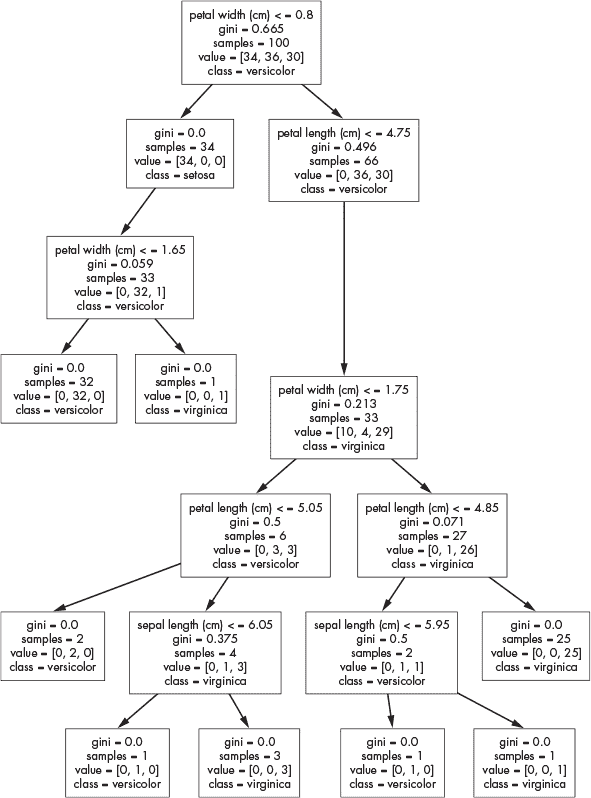

# 第六章：CLIPS


在 1980 年代和 1990 年代，人工智能领域有一个热门话题：*专家系统*，即尝试通过规则，特别是 `if-then` 规则，来捕捉特定领域内人类专家的知识的程序。1985 年，NASA 开发了 CLIPS（“C 语言集成生产系统”）来创建专家系统。自那时起，CLIPS 一直在开发和维护，并于 1996 年成为公共领域软件。

在本章中，我们将使用 CLIPS 来感受什么是专家系统，以及如何创建一个专家系统，至少是一个原始的版本。我们将介绍 CLIPS，并借此了解专家系统背后的概念。接着，我们将通过四个示例探索这一语言：一个计算器、一个回顾我们在第一章中用 Prolog 探讨的家庭关系、一个简单的工厂模拟、以及一个完整的用于鸢尾花分类的专家系统。最后，我们将简要讨论 CLIPS 作为一种非典型编程语言。

### **安装**

安装 CLIPS 类似于安装 SNOBOL。首先，我们需要 tarball 文件，*clips_core_source_631.tar.gz*，我们从 *[`sourceforge.net/projects/clipsrules/files/CLIPS/6.31/`](https://sourceforge.net/projects/clipsrules/files/CLIPS/6.31/)* 下载。示例文件位于 *examples_631.tar.gz* 中。

解压归档文件并构建 CLIPS。

```
> tar xzf clips_core_source_631.tar.gz 
> cd clips_core_source_631/core/
> make
```

接下来，运行 CLIPS 以确保其正常工作。

```
> ./clips
         CLIPS (6.31 6/12/19)
CLIPS> (* (+ 1 2) 3)
9
CLIPS> (exit)
```

注意，表达式 `(1+2)*3` 变成了 `(* (+ 1 2) 3)`。CLIPS 像 Lisp 一样使用 *S 表达式*，它们是由圆括号包围的项的列表。S 表达式通常是嵌套的，正如这里的例子所示，其中 S 表达式 `(+ 1 2)` 嵌套在以 `*` 开头的外部表达式中。

CLIPS 的主站点在 *[`www.clipsrules.net/`](http://www.clipsrules.net/)*。你可以从那里下载 CLIPS 6.31 的文档，尽管我们将在使用过程中介绍系统的基本要素。如果你看到比 6.31 更高版本，可以直接使用。CLIPS 发生变化，导致我们的示例不再适用的可能性极低。

### **起源与哲学**

要理解 CLIPS，我们必须先更好地理解什么是专家系统。专家系统在 1980 年代非常流行，当时人们希望它们能作为一种更通用的人工智能方法发挥作用。我们将在本章后面讨论这种期望是否得以实现，但现在要注意，专家系统的大规模应用从未发生过。

*专家系统* 是一种能够根据一组规则和事实推理得出结论的计算机程序。这些规则旨在捕捉特定领域内人类专家的知识，从而使软件能够根据可用的事实进行类似的推理。这是一个抽象的定义，关于什么是专家系统，肯定还有其他细致的说法，但随着我们探索 CLIPS，你会更好地理解专家系统的含义。

专家系统是一个由事实、规则（知识库）和推理引擎组成的系统，用于根据这些事实和规则得出结论。专家系统通过使用事实和规则来确定行为。例如，一个监控建筑物的专家系统可能包含如下规则：

```
if door-is-open and time-is-after-midnight then signal-the-police
```

在这里，`door-is-open`、`time-is-after-midnight` 和 `signal-the-police` 都是事实。请注意，最后一个事实是规则在触发时将其添加到知识库中的。换句话说，规则 *断言* 了这个事实，这个事实稍后可能会导致另一条规则被触发。

在 CLIPS 中，这可能被写作：

```
(defrule intruder
    ?x <- (door-is-open)
    ?y <- (after-midnight)
  =>
    (retract ?x ?y)
    (assert (signal-the-police)))
```

我们稍后会讨论 CLIPS 规则的确切语法，但即使现在，我们也可以开始理解其中发生的事情。

将足够多的这些规则组合在一起，你就拥有了一个体现微小知识领域的系统。换句话说，系统是该小领域的专家。至少，这是我们的期望。

从这个角度来看，专家系统可以被看作是一个复杂的 `if-then` 语句集。某种程度上，它确实如此，但在 `then` 部分可以发生许多事情，从而使得系统能够以一种复杂的方式做出反应，前提是开发者已经捕捉了领域专家的核心知识，并将这些知识以规则的形式组织好，以便在特定事实集出现时触发。

专家系统依赖于前向链式推理。这与像 Prolog 这样的语言形成对比，后者使用反向链式推理。*前向链式* 系统处理它们所知道的事实中体现的数据，以找到有效的结论。与此相对，*反向链式* 系统则从目标出发，寻找支持该目标的真实陈述。

前向链式系统会探索所有已知的事实，以选择需要评估或 *触发* 的规则。像 CLIPS 这样的系统将规则放置在 *议程* 上，然后通过 *冲突解决* 机制来选择具体的规则进行触发。触发规则可能会更新已知事实的集合，从而导致其他规则被触发，在这种情况下，CLIPS 会继续运行，直到议程为空，或者明确告诉它停止。

在内部，CLIPS 使用 *Rete 算法* 来执行推理，也就是通过将一组规则应用于一系列事实来得出结论。与我们之前探讨过的其他编程语言不同（除了 Prolog），CLIPS 在其推理引擎中融入了先进的概念，如果你感兴趣，值得深入研究；然而，这些概念远远超出了我们在这里打算探讨的范围。我们的关注点是语言本身以及如何从语言的角度思考问题。

如你所见，从语法上讲，CLIPS 看起来像 Lisp，使用 S 表达式，或前缀表示法，其中 *f* (*x*, *y*) 变成 (*f* *x* *y*)，使得函数移动到括号内。

CLIPS 是一种多范式语言：它在底层是声明式的，因为有推理引擎以及代码通常的运行方式，但它也具有过程式特性，拥有标准的控制结构，并且支持面向对象，尽管在这里我们将完全忽略该语言的这一方面。CLIPS 通过命令行的 REPL 运行，这也是我们将使用的方式；不过，它也可以嵌入到其他应用程序中。

让我们看看 CLIPS 是如何工作的，然后通过一些示例帮助我们理解如何与系统进行交互。在这个过程中，我们将介绍语言的不同方面。

### **语言**

让我们运行一个 CLIPS 附带的演示程序。我们不会查看代码——这超出了我们的讨论范围——但它将向我们展示如何与系统进行交互，并且作为一个专家系统如何工作的很好的示例。该示例位于 *wine.clp* 文件中。专家系统的目的是根据我们正在准备的晚餐推荐一款葡萄酒。程序会向我们提出问题，根据我们的回答，生成一份带有概率的推荐葡萄酒列表，以便选择合适的搭配。

#### ***与 CLIPS 一起工作***

使用 *wine.clp* 的典型会话如下所示：

```
> clips
CLIPS> (load "wine.clp")
--snip--
CLIPS> (reset)
CLIPS> (run)
Do you generally prefer dry, medium, or sweet wines? dry
Do you generally prefer red or white wines? white
Do you generally prefer light, medium, or full bodied wines? light
Is the flavor of the meal delicate, average, or strong? average
Does the meal have a sauce on it? no
Is the main component of the meal meat, fish, or poultry? fish

        SELECTED WINES

 WINE                  CERTAINTY
 -------------------------------
 Chardonnay               58%
 Soave                    40%
 Sauvignon-Blanc          40%
 Chablis                  40%
 Geverztraminer           30%

CLIPS> (exit)
```

首先，我们加载 *wine.clp*。未显示的是 CLIPS 成功编译文件中各个代码组件的报告。加载后，必须重置 CLIPS 才能运行。重置是必要的，因为它会将一组初始事实放入事实列表中。如果跳过 `(reset)` 步骤，运行 *wine.clp* 将仅显示 `SELECTED WINES` 横幅，而不会有其他内容。

酒类演示程序会向用户提出一系列问题。根据用户的回答，演示程序会提供一个包含推荐葡萄酒及其与指定菜肴搭配可能性的列表。重置并第二次运行演示程序，输入相同的回答，列表应该是相同的。CLIPS 通过一组规则进行工作，每次输入相匹配时，它都会得出相同的结论。CLIPS 所做的没有任何随机性或随机因素。

在系统运行时，事实集可能会发生变化，并且可能会读取新的输入。议程会根据可以触发的规则发生变化。`reset` 通过定义初始事实集来配置 CLIPS。例如：

```
> clips
CLIPS> (load "wine.clp")
--snip--
CLIPS> (run)

        SELECTED WINES

 WINE                  CERTAINTY
 -------------------------------

CLIPS> (facts)
f-0     (initial-fact)
For a total of 1 fact.
CLIPS> (agenda)
CLIPS> (reset)
CLIPS> (facts)
f-0     (initial-fact)
f-36    (attribute (name best-color) (value any) (certainty 100.0))
f-37    (attribute (name best-body) (value any) (certainty 100.0))
f-38    (attribute (name best-sweetness) (value any) (certainty 100.0))
For a total of 4 facts.
CLIPS> (agenda)
10000  start: *
For a total of 1 activation.
```

在这里，我们告诉 CLIPS 运行葡萄酒程序，但不首先执行 `(reset)`。显示的是标题，除此之外没有其他内容。请求当前的事实集只会返回默认的初始事实（`f-0`）。请求议程返回空，因为议程是空的。当议程为空时，CLIPS 停止。然后我们重置 CLIPS 并第二次请求事实。现在我们看到了由 *wine.clp* 定义的初始事实集。我们现在不需要理解其结构，只需看到事实列表已经被配置。现在请求议程时，显示了一个激活项，`start`。一个已激活的规则是指其条件已经满足的规则。葡萄酒演示程序现在已经准备好。当我们调用 `run` 时，`start` 规则将变为激活状态。

#### ***实现 Hello World***

让我们实现经典的“Hello, world!”程序。我们将编写两个版本。第一个通过定义一个总是触发的规则来使用推理引擎。第二个则完全是过程式的，证明 CLIPS 也支持命令式编程。

文件 *hello0.clp* 包含：

```
(defrule hello
  => (printout t "Hello, world!" crlf))
```

我们将在下一节中详细介绍 `defrule` 的语法。目前，你只需知道它定义了一个名为 `hello` 的规则。规则箭头（`=>`）右侧的部分是执行部分，也就是 `then` 部分。箭头左侧没有内容，因为这个规则总是触发，或者在 `initial-fact`（上面的 `f-0`）定义时触发，而它默认是定义的。

要执行规则，我们只需要使用 `(run)`，因为无需配置其他事实和议程。运行程序的过程如下所示：

```
CLIPS> (load "hello0.clp")
CLIPS> (run)
Hello, world!
```

很好，我们的规则触发了。然而，你可能有一个问题。如果规则 `hello` 被设置为在 `initial-fact` 存在时触发，而 `initial-fact` 总是存在，为什么 CLIPS 不会一直打印“Hello, world!”？因为没有去除初始事实，所以它仍然存在。为什么规则没有一次又一次地匹配呢？这是因为 CLIPS 每次匹配条件时只触发一次规则。这种现象称为 *折射*（这一术语来源于神经科学，指的是神经元触发后需要一定的时间才能再次触发）。

文件 *hello0.clp* 定义了一个规则，并使用 CLIPS 的推理引擎来触发它。CLIPS 同样支持命令式编程。文件 *hello1.clp* 包含以下内容：

```
(deffunction hello () (printout t "Hello, world!" crlf))
(hello)
(exit)
```

我们可以按如下方式从命令行运行：

```
> clips -f2 hello1.clp
Hello, world!
```

使用 `-f` 或 `-f2` 可以从命令行执行程序。第二个选项（`-f2`）禁用加载消息。调用 `(exit)` 可以在运行后避免显示 `CLIPS>` 提示符。文件 *hello1.clp* 使用 `deffunction` 定义了一个名为 `hello` 的函数，在退出之前调用该函数来打印消息。`printout` 后面的 `t` 指定了输出文件——在这种情况下是终端。CLIPS 对命令式编程的支持涵盖了所有预期的控制结构，如 `if-then` 和 `while`。我们在这里不讨论这些元素，但可以参考 CLIPS 文档了解更多。控制结构的理想位置是在规则的动作部分。

CLIPS 通过规则和输入来处理事实。当规则被激活时，它们会影响议程，而正是议程驱动着 CLIPS 程序。让我们深入了解事实和规则。

#### ***事实和规则***

你已经了解了一些事实和规则的内容，但为了理解接下来的示例，我们需要更深入的理解。让我们深入探讨。

##### **事实**

*事实* 在规则触发时根据需要被声明（`assert`）和撤销（`retract`）。简单事实很容易添加。例如：

```
CLIPS> (assert (emergency-brake-on))
<Fact-1>
CLIPS> (assert (roses-are red))
<Fact-2>
CLIPS> (assert (violets-are blue))
<Fact-3>
CLIPS> (facts)
f-0     (initial-fact)
f-1     (emergency-brake-on)
f-2     (roses-are red)
f-3     (violets-are blue)
For a total of 4 facts.
```

三个事实被声明。第一个可能指示一个运行中的系统正在管理一辆车，表示紧急刹车已被激活。另两个则是`roses-are`和`violets-are`符号，以及与颜色相关的符号。在 CLIPS 中，相当于 Prolog 中的原子，*符号*是一组代表自身的字符，与变量不同，变量是赋予值的名称。符号没有值。一组事实可以通过`deffacts`一次性定义。通过这种方式定义的事实将在执行`(reset)`时被放入事实列表中。考虑以下例子：

```
CLIPS> (facts)
f-0     (initial-fact)
For a total of 1 fact.
CLIPS> (deffacts arthropods (insects 6) (spiders 8) (trilobites 48))
CLIPS> (facts) f-0     (initial-fact)
For a total of 1 fact.
CLIPS> (reset)
CLIPS> (facts)
f-0     (initial-fact)
f-1     (insects 6)
f-2     (spiders 8)
f-3     (trilobites 48)
For a total of 4 facts.
```

在这个例子中，CLIPS 最初只有一个初始事实。然后，一个名为`arthropods`的`deffacts`语句定义了一组事实。定义了三个事实，每个事实是某种类型的节肢动物，后面跟着它的腿数。（当然，一些节肢动物爱好者可能会反对三叶虫的腿数不固定，但 48 条腿也不是一个差的猜测。）

下一行使用了`(facts)`，但我们新声明的事实并不存在。当上面使用`assert`时，事实立即出现。然而，使用`deffacts`时，我们必须先使用`(reset)`，然后事实才会出现。之前定义的任何事实也会丢失。

复杂事实有很多部分，其中一些部分可能会在 CLIPS 运行时被更新。CLIPS 提供了一种定义复杂事实的机制。例如，文件*coin.clp*定义了一个关于古罗马硬币的事实模板，并包含与特定罗马硬币相关的事实：

```
(deftemplate roman-coin "Roman coin facts"
  (slot emperor)
  (slot denomination)
  (slot obverse)
  (slot reverse))

(deffacts coin-facts "ancient Roman coins"
  (ancient (emperor Otho)
           (denomination Denarius)
           (obverse "Emperor hd right")
           (reverse "Securitas std left"))
  (ancient (emperor Constantine)
           (denomination AE3)
           (obverse "IMP CONSTANTINVS MAX AVG")
           (reverse "VICTORIAE LAETAE PRINC PERP")) )
```

在这里，`deftemplate`定义了一个名为`roman-coin`的事实模板，并可附带一个可选的注释字符串。事实的字段称为*槽*。该模板定义了四个字段：`emperor`、`denomination`、`obverse`和`reverse`。

在定义了`roman-coin`之后，我们可以使用`deffacts`来断言一些特定硬币的事实。第一个涉及的是公元一世纪的皇帝奥图（Otho）的银德纳里乌斯硬币，他是“十二凯撒”之一，统治时间为公元 69 年 1 月 15 日至 4 月 16 日。德纳里乌斯是罗马士兵的常规日薪。第二枚硬币是一枚小型铜币，是当时的零钱，约公元 325 年由大帝君士坦丁铸造。

让我们将这些硬币信息告知 CLIPS。

```
CLIPS> (load "coin.clp")
Defining deftemplate: coin
Defining deffacts: coin-facts
TRUE
CLIPS> (reset)
CLIPS> (facts)
f-0     (initial-fact)
f-1     (coin (emperor Otho) 
              (denomination Denarius) 
              (obverse "Emperor hd right") 
              (reverse "Securitas std left"))
f-2     (coin (emperor Constantine) 
              (denomination AE3) 
              (obverse "IMP CONSTANTINVS MAX AVG") 
              (reverse "VICTORIAE LAETAE PRINC PERP"))
For a total of 3 facts.
CLIPS> (retract 1)
CLIPS> (facts)
f-0     (initial-fact)
f-2     (coin (emperor Constantine) 
              (denomination AE3) 
              (obverse "IMP CONSTANTINVS MAX AVG") 
              (reverse "VICTORIAE LAETAE PRINC PERP"))
For a total of 2 facts.
```

加载*coin.clp*后，我们进行重置并查看已知的事实。新的硬币信息已显示。在执行过程中，CLIPS 会经常断言和撤回事实。在这里，我们通过`retract`手动撤回第一个硬币事实，运行`(facts)`后，我们看到该事实已不再存在。请注意，在此之后，事实编号没有发生变化。事实`f-2`仍然是事实`f-2`。

##### **规则**

*规则*是`if-then`结构。规则的语法是

```
(defrule <rule-name> "<optional-comment>"
  (<lefthand-side>) => (<righthand-side>))
```

(<左边>)，或称 LHS，是一组零个或多个条件，用于尝试匹配事实。这些条件是通过 AND 操作组合的，这意味着所有条件必须匹配才能触发规则。当规则触发时，(<右边>)，或称 RHS，将执行。这些是规则的*动作*。通常，动作会以某种方式改变事实集，以推动程序向前发展。然而，动作也可能有副作用，比如打印信息或请求用户输入信息（这就是 CLIPS 的命令式编码能力发挥作用的地方）。具有匹配 LHS 的规则会被放置到议程中，以执行它们各自的 RHS。

当规则匹配时，它们还可能绑定规则内局部的变量。CLIPS 的变量遵循预期的命名约定，但必须以问号开头。例如，`?x`表示变量`x`。在规则的 LHS 上进行绑定是有用的，因为绑定的变量可能会在 RHS 中使用。我们将在本章稍后的部分看到这些示例。要直接绑定变量，即给它赋值，使用`bind`语句。

```
CLIPS> (bind ?x 1)
CLIPS> (bind ?y 1121)
CLIPS> (printout t (/ ?x ?y) crlf)
0.000892060660124889
```

这里是一个假设的规则，用于响应安全漏洞。

```
(defrule react-security-breach "React to a security breach"
    ?r <- (security-breach ?typ)
  =>
    (retract ?r)
    (assert (log-security-breach ?typ))
    (printout t "!!! security alert !!!" crlf))
```

规则名称是`react-security-breach`。LHS，即`=>`之前的部分，是匹配形如`security-breach <type>`的事实，其中实际的`type`绑定到`?typ`。例如，`(security-breach hacker)`将匹配该规则，并将符号`hacker`绑定到变量`?typ`。

LHS 有一段有趣的语法：`?r <-`。当`security-breach`事实匹配时，它会返回事实编号，并将其绑定到`?r`。规则的 RHS 部分，即`=>`之后的部分，使用`?r`来`retract`匹配的事实。在我们处理安全漏洞时，我们移除了该规则的触发条件。由于反射作用，规则只会为特定事实`(security-breach hacker)`触发一次。撤销该事实后，它被移除，因此当它再次被断言时，规则将再次触发。

这个规则的 RHS 断言`(log-security-breach ?typ)`，以添加一个新的事实。注意`?typ`的使用，这是 CLIPS 从规则的 LHS 提取的。断言这个事实会触发另一个规则，后者会将一些信息写入日志文件，或者可能发送一封警报邮件给 IT 部门。规则的最后部分打印出警报信息，以便我们可以看到它。

如果规则位于*security.clp*中，我们可以按如下方式加载并运行它：

```
CLIPS> (load "security.clp")
CLIPS> (reset)
CLIPS> (assert (security-breach hacker))
<Fact-1>
CLIPS> (run) !!! security alert !!!
CLIPS> (facts)
f-0     (initial-fact)
f-2     (log-security-breach hacker)
For a total of 2 facts.
```

为了在重置后触发规则，我们必须断言一个安全漏洞，在这个例子中是黑客安全漏洞。运行该规则后，我们会看到安全警报信息，表明规则已经触发。如果我们检查已知事实，会看到一个新事实`f-2`，它是我们的规则断言的事实。

CLIPS 庞大、强大且相当复杂。让我们利用本章剩余的部分，通过选定的示例来展示 CLIPS 的工作原理，至少是我们将要使用的层面。

### **CLIPS 实践**

为了建立我们对 CLIPS 的直觉，在本节中我们将通过四个示例进行讲解。第一个是一个基础计算器，足以让我们入门。接下来，我们将回顾第一章中的希腊神话家族树，看看 CLIPS 如何处理它。然后是一个基础工厂模拟，展示了当监控现实世界中的某些事物时，CLIPS 专家系统如何运作。最后，我们将为鸢尾花建立一个专家系统，以将基于规则的分类器与第五章中的 SNOBOL 最近邻分类器进行比较。

#### ***一个基础计算器***

这个示例实现了一个计算器。对于计算器，我们需要四条规则。第一条规则处理启动信息并告知用户。接下来，第二条规则处理加法和乘法等二目运算符。然后，我们需要一条规则来处理像正弦和余弦这样的单目运算。最后一条规则接受用户输入，并断言该操作以供二目或单目规则执行。源代码在*math.clp*文件中。

清单 6-1 包含了初始事实集和`start`规则。

```
(defrule start ""
  ?r <- (startup)
  =>
  (printout t "A simple calculator." crlf)
  (printout t crlf)
  (printout t "Enter <number> <op> <number> where" crlf)
  (printout t "<op> is +, -, *, /, ^, mod" crlf crlf)
  (printout t "Enter <function> <arg> where" crlf)
  (printout t "      <function> is: trig, log, exp, or sqrt" crlf crlf)
  (printout t "Type 'end' to exit and @ to use previous result." crlf) (retract ?r)
  (assert (get-next-operation)))

(deffacts initial-facts ""
  (@ 0)
  (startup))
```

*清单 6-1：初始化计算器*

这里有两个初始事实。第一个是`(startup)`，第二个是`@ 0`。我们将使用`@`事实来保存上一个操作的结果。

`start`规则的左侧匹配`(startup)`，当因为`deffacts`重置 CLIPS 时，这个事实会被断言。这个规则执行三件事：首先，它打印出一组给用户的指令；其次，它撤销`(startup)`，使其不再出现在事实列表中；第三，它断言`(get-next-operation)`。我们将利用这个事实来请求用户输入。

清单 6-2 展示了`get-operation`规则。

```
(defrule get-operation ""
  ?w <- (get-next-operation)
  =>
  (retract ?w)
  (printout t crlf "      ")
  (bind ?expr (readline))
  (if (eq ?expr "end") then (halt))
  (assert (operation (explode$ ?expr))) )
```

*清单 6-2：处理用户输入*

`get-operation`规则仅在事实列表中包含`(get-next-operation)`时才会触发。当`start`规则完成后，它会将此事实添加到事实列表中，`get-operation`规则将在`start`结束后立即触发。由于 CLIPS 只在规则匹配时触发一次，当规则被触发时，我们会撤销`(get-next-operation)`，以便下次它被断言时规则可以再次触发。

`get-operation`的其余部分显示了一个空格提示，然后将`?expr`绑定到用户输入的字符串。经过简单检查，如果用户输入了`end`，操作就会被断言。`explode$`函数将一个字符串拆分成一个列表，列表的元素成为`operation`事实的字段。CLIPS 将列表称为*多值字段*。

这些指令告知用户如何小心地输入表达式。单目表达式是函数名后跟一个或多个空格以及由数字或`@`（表示使用上一个结果）构成的参数。二目表达式是第一个操作数、空格、运算符、空格和第二个操作数。当被拆分时，`operation`事实将包含三个字段，如果是二目表达式，或者两个字段，如果是单目表达式。

现在考虑 清单 6-3，它处理一元表达式。

```
(defrule unary-math ""
  ?w <- (operation ?func ?x)
  ?at <- (@ ?last) =>
  (retract ?w)
  (retract ?at)
  (assert (get-next-operation))
  (if (eq ?x @) then (bind ?x ?last))
  (if (eq ?func cos) then (bind ?y (cos ?x)))
  (if (eq ?func sin) then (bind ?y (sin ?x)))
  (if (eq ?func tan) then (bind ?y (tan ?x)))
  (if (eq ?func log) then (bind ?y (log ?x)))
  (if (eq ?func exp) then (bind ?y (exp ?x)))
  (if (eq ?func sqrt) then (bind ?y (sqrt ?x)))
  (printout t ?y)
  (assert (@ ?y)))
```

*清单 6-3：处理一元表达式*

`unary-math` 规则通过一个包含两个字段的 `operation` 事实触发。第一个字段是函数（`?func`），第二个字段是函数的参数（`?x`）。最后的结果也是 LHS 的一部分，因此我们可以从事实列表中提取它。操作和上一个结果都会被撤销，意味着它们会在稍后重新断言。

规则断言 `(get-next-operation)`，触发 `get-operation` 以再次获取用户输入的下一个表达式。规则的其余部分执行请求的操作。如果 `?x` 是 `@`，则将 `?x` 更新为上一个结果（`?last`）。实际操作会生成一个输出值 `?y`，该值被打印并作为新的上一个结果断言，也就是 `@` 事实。

二元表达式通过 清单 6-4 处理。

```
(defrule binary-math ""
  ?w <- (operation ?a ?op ?b)
  ?at <- (@ ?last)
  =>
  (retract ?w)
  (retract ?at)
  (assert (get-next-operation))
  (if (eq ?a @) then (bind ?a ?last))
  (if (eq ?b @) then (bind ?b ?last))
  (if (eq ?op +) then (bind ?y (+ ?a ?b)))
  (if (eq ?op -) then (bind ?y (- ?a ?b)))
  (if (eq ?op *) then (bind ?y (* ?a ?b)))
  (if (eq ?op /) then (bind ?y (/ ?a ?b)))
  (if (eq ?op ^) then (bind ?y (** ?a ?b)))
  (if (eq ?op mod) then (bind ?y (mod ?a ?b)))
  (printout t ?y)
  (assert (@ ?y)))
```

*清单 6-4：处理二元表达式*

这个规则与一元表达式的情况基本相同，但它匹配的是一个有两个参数的操作，而不是一个。CLIPS 知道该触发哪个规则——`unary-math` 还是 `binary-math`，因为 `operation` 事实中的字段数量不同。

让我们看看 *math.clp* 的实际应用。

```
CLIPS> (load "math.clp")
CLIPS> (reset)
CLIPS> (run)
A simple calculator.

Enter <number> <op> <number> where
<op> is +, -, *, /, ^, mod

Enter <function> <arg> where
      <function> is: trig, log, exp, or sqrt

Type 'end' to exit and @ to use the previous result.

      111 * 123
13653
      @ + 5
13658
      @ / 23456
0.582281718963165
      cos @
0.835210036979047
      exp @
2.30529819530959
      @ ^ @
6.8579474467406
      end
```

用户输入以粗体显示，演示了二元和一元表达式，其中大多数使用了之前的结果。请注意，操作数和运算符之间需要有空格。

这个例子揭示了一个通用模式：将信息存储在事实列表中，并使用断言和撤销来安排程序的流程。计算器从启动消息开始，然后断言一个事实以触发 `get-operation`，从而获取并处理用户输入。接下来，该规则断言所需的操作事实。推理引擎会触发适当的一元或二元规则来处理请求。那些规则会撤销并重新断言上一个结果，以确保事实列表中的版本始终是正确的。它们还会重新断言 `(get-next-operation)`，以获取更多的用户输入。这使得程序在执行 `(halt)` 之前一直运行。

#### ***家庭重启***

在 第一章 中，我们使用 Prolog 探讨了古希腊神祇之间有时异常的家庭关系。现在让我们回顾这个例子，以了解 CLIPS 对同一组事实可能做些什么。这个例子在 *family.clp* 文件中。让我们先浏览代码，然后运行它，看看我们得到的输出是什么。

清单 6-5 只是部分内容。完整的事实集请参见 *family.clp* 文件。

```
(deffacts olympians
    (male uranus)
    (male cronus)
--snip--
    (female gaia)
    (female rhea)
--snip--
    (parent uranus cronus)
    (parent gaia cronus)
--snip--
    (married zeus hera)
    (married hephaestus aphrodite))
```

*清单 6-5：一些关于奥林匹斯神祇的事实*

与 Prolog 一样，我们在列出父子关系之前，先将一些神祇声明为男性，另一些神祇声明为女性，关系形式为 `(parent x y)`，这意味着 `X` 是 `Y` 的父亲。如果神祇被认为是已婚的，事实列表也会包含这一点。

清单 6-6 给出了捕捉基本家庭关系的规则。

```
(defrule father
    (parent ?x ?y)
    (male ?x)
  =>
    (printout t ?x " is father of " ?y crlf))

(defrule mother
    (parent ?x ?y) 
    (female ?x)
  =>
    (printout t ?x " is mother of " ?y crlf))

(defrule wife
    (female ?x)
    (or (married ?x ?y) (married ?y ?x))
  =>
    (printout t ?x " is wife of " ?y crlf)) (defrule husband
    (male ?x)
    (or (married ?x ?y) (married ?y ?x))
  =>
    (printout t ?x " is husband of " ?y crlf))
```

*列表 6-6：捕捉基本关系的规则*

正如我们在列表 6-6 中的第一个`defrule`所见，如果`x`是`y`的父亲，那么`x`必须是`y`的父母之一，且`x`是男性。规则的 LHS 通过绑定变量来捕捉事实中的关系。例如，`father`规则绑定了`?x`和`?y`，意味着当事实列表中存在一组`(parent x y)`和`(male x)`的事实时，规则会触发，前提是同一个`x`既是`y`的父母，又是男性。因此，对于规则的 LHS，具有相同名称的变量必须在条件的每个部分中都相同，条件才会成立。当规则触发时，它会输出已经证明的`x`是`y`父亲的事实。注意，这些规则不会向事实列表中添加或删除任何内容。这些规则只会产生输出。折射（refraction）将防止规则在相同的事实集上触发多次。

`mother`的规则几乎与`father`相同。`wife`和`husband`的规则包含了逻辑“或”（logical-OR），因为`married`可能被指定为`(married zeus hera)`或`(married hera zeus)`。同样，规则不会改变事实列表。

列表 6-7 展示了*family.clp*中的另外三条规则。

```
(defrule sibling
    (parent ?p ?x)
    (parent ?p ?y)
    (test (neq ?x ?y))
  =>
    (assert (siblings ?x ?y)))

(defrule sister
    (siblings ?x ?y)
    (female ?x)
    (test (neq ?x ?y))
  =>
    (printout t ?x " is sister to " ?y crlf))

(defrule brother
    (siblings ?x ?y)
    (male ?x)
    (test (neq ?x ?y))
  =>
    (printout t ?x " is brother to " ?y crlf))
```

*列表 6-7：捕捉兄妹关系的规则*

第一条规则捕捉了兄妹的概念，接下来的两条规则则体现了姐妹和兄弟的概念。

为了使`x`成为`y`的兄弟，`x`必须是男性，且`x`和`y`必须是兄妹关系。要成为兄妹，`x`和`y`必须有共同的父母。列表 6-7 的规则捕捉兄妹关系，并声明`x`和`y`是兄妹。一旦声明，`brother`和`sister`规则就可以触发，因为`x`和`y`是兄妹的事实已成为事实列表的一部分。

规则的 LHS 包含一个`test`，以确保`x`和`y`不是同一个人，因为我们通常不会认为自己是自己的兄弟姐妹。

在*family.clp*中没有像在*math.clp*中那样的启动规则。相反，事实列表通过`(reset)`进行初始化，`(run)`立即开始使用事实列表来满足规则，将其置于议程上，并为所有可能的匹配执行 RHS。因此，与 Prolog 不同，Prolog 会给我们一个结果并耐心等待我们请求另一个结果或停止，而 CLIPS 只要能将事实匹配到规则并执行，就会一直运行下去。

如果你加载*family.clp*并执行`(reset)`和`(run)`，你应该会看到一大堆输出——准确来说是 119 行。输出是 CLIPS 从初始事实集提取的所有可能关系。例如，列表从以下内容开始：

```
hephaestus is husband of aphrodite
aphrodite is wife of hephaestus
zeus is husband of hera      
hera is wife of zeus       
uranus is father of aphrodite
aphrodite is sister to cronus
cronus is brother to aphrodite
semele is mother of dionysus 
zeus is father of dionysus         
dionysus is brother to artemis
--snip--
```

这样我们得到了混合的丈夫、妻子、父亲、姐妹等。最好以某种方式组织这个列表，也就是说，通过编程捕捉不同类型的关系，而不是一行一行地输出。幸运的是，CLIPS 是一种全功能编程语言。我们可以通过捕获不同类型的实例来为输出应用某些顺序，这样就可以随时报告它们。

```
(defglobal ?*brothers* = (create$))
(defglobal ?*sisters* = (create$))

(defrule sister
    (siblings ?x ?y)
    (female ?x)
    (test (neq ?x ?y))
  =>
    (bind ?msg (implode$ (create$ ?x is sister to ?y)))
    (bind ?*sisters* (create$ ?*sisters* ?msg))) (defrule brother
    (siblings ?x ?y)
    (male ?x)
    (test (neq ?x ?y))
  =>
    (bind ?msg (implode$ (create$ ?x is brother to ?y)))
    (bind ?*brothers* (create$ ?*brothers* ?msg)))

(deffunction brothers ()
    (foreach ?bro ?*brothers*
        (printout t ?bro crlf)))

(deffunction sisters ()
    (foreach ?sis ?*sisters*
        (printout t ?sis crlf)))
```

*Listing 6-8: 存储关系输出*

文件*family2.clp*将兄弟姐妹存储在全局列表中。在这个例子中，只考虑了兄弟姐妹关系，但将其他家庭关系包括在内是非常简单的。*family2.clp*的核心内容在 Listing 6-8 中。初始事实集已从列表中省略，规则`sibling`也没有改变，仍然是 Listing 6-7 中的版本。

Listing 6-8 以两行新的`defglobal`实例开始，这是 CLIPS 中定义全局变量的方式。CLIPS 使用星号包围全局变量的名称，因此我们定义了两个空列表，它们是`create$`无参数调用的输出，用于存储兄弟姐妹：`?*brothers*`和`?*sisters*`。

为了积累兄弟姐妹之间的信息，我们修改了`brother`和`sister`规则。每个规则的左边（LHS）保持不变，但右边（RHS）由两次调用`bind`构成。第一次调用使用`create$`生成一个包含`?x`、符号`is`、`sister`或`brother`、`to`和`?y`的列表。该列表被传递给`implode$`，它将列表转换成一个字符串。因此，`implode$`的输出是一个字符串，例如`dionysus is brother to artemis`，我们将其存储在`?msg`中。第二次`bind`再次使用`create$`将新字符串附加到现有列表的末尾。通过这种方式，每次发现兄弟姐妹关系时，都会将其存储在相应的字符串中。

如果我们加载*family2.clp*并调用`(reset)`，然后执行`(run)`，我们将不会看到任何输出。然而，CLIPS 已经完成了它的工作。要查看这一点，我们需要一些函数来打印这些列表。输入`brothers`和`sisters`函数。这两个函数都不需要参数，并且都使用 CLIPS 的`foreach`循环来遍历列表，并每行打印一个元素。

试试看*family2.clp*。首先像往常一样加载、重置并运行，然后列出姐妹。例如：

```
CLIPS> (load "family2.clp")
CLIPS> (reset)
CLIPS> (run)
CLIPS> (sisters)
aphrodite is sister to cronus eris is sister to dionysus
artemis is sister to dionysus
artemis is sister to apollo
artemis is sister to hermes
artemis is sister to athena
artemis is sister to eris
artemis is sister to hephaestus
artemis is sister to ares
--snip--
```

调用`(brothers)`会生成另一个列表。*family2.clp*示例展示了如何将过程式（命令式）编程与 CLIPS 的规则引擎结合使用。现在，让我们来看一个工厂模拟，看看如何按指定顺序排列规则的触发。

#### ***在工厂***

对于这个例子，我们将模拟监控一个工厂。工厂有泵必须开启，并在三秒后关闭。此外，偶尔需要在开启泵之前处理紧急情况。我们模拟的真正目的是展示 *显著性*，它决定了在多个规则在议程上时规则触发的顺序。显著性应该谨慎使用，但有时是必要的。

清单 6-9 显示了几个必要的实用函数。

```
(defglobal ?*base* = (time))
(deffunction ftime ()
  (- (time) ?*base*))

(deffunction rand ()
  (/ (mod (random) 1000000) 1000000))

(deffunction pause (?delay)
  (bind ?start (time))
  (while (< (time) (+ ?start ?delay)) do))
```

*清单 6-9：一些实用函数*

第一行定义了一个全局变量 `?*base*`，它保存 `(time)` 返回的当前纪元秒值。它在程序加载时被设置。我们将它与 `ftime` 函数一起使用，返回自程序加载以来的秒数。

CLIPS 有一个名为 `(random)` 的函数，用于返回一个随机整数，实际上是 C 语言 `rand` 函数的返回值。为了获得一个 0, 1) 之间的浮动值，我们将这个整数除以 1,000,000 后取余，再将其除以 1,000,000。这个方法对于我们的目的足够了。

系统在监控工厂状态之前会暂停，因此定义了 `(pause)`，它接受秒数并运行一个 `while` 循环等待时间的流逝。这会非常消耗 CPU，但对于我们的目的来说是可以接受的。

响应工厂事件的规则在 [清单 6-10 中。

```
(defrule emergency "there is an emergency"
    (declare (salience 100))
    ?x <- (emergency-alert)
  =>
    (retract ?x)
    (printout t "  !!! emergency! !!!" crlf))

(defrule pumps-on "turn the pumps on"
    (declare (salience 5))
    ?x <- (pumps-on)
  =>
    (retract ?x)
    (printout t "  pumps on (" (ftime) ")" crlf)
    (assert (pumps-off-time (+ (ftime) 3))))

(defrule pumps-off "turn off the pumps"
    (declare (salience 5)) 
    ?x <- (pumps-off-time ?t) 
  =>  
    (if (>= (ftime) ?t) then 
      (retract ?x) 
      (printout t "  pumps off (" (ftime) ")" crlf)
    else
      (refresh pumps-off)))
```

*清单 6-10：工厂规则*

有三个规则：`emergency`、`pumps-on` 和 `pumps-off`。如前所述，规则有一个 LHS 和一个 RHS。还有一个新的语句 `declare`，它将 `salience` 设置为一个整数，必须在 [–10,000, 10,000] 范围内。显著性高的规则会在显著性低的规则之前触发，尤其是当多个规则在议程上时。默认的显著性值为 0。

清单 6-10 中的第一个规则使用了 `100` 的显著性。这是紧急规则，我们希望它在被放入议程后立即触发；因此，我们给它设置了比任何其他规则更大的显著性。`pumps-on` 和 `pumps-off` 规则的显著性都是 `5`。显著性用于在议程上排序执行，数值本身没有其他含义。因此，`emergency` 的显著性比其他规则高 20 倍并不意味着其他任何事情，除了它会首先触发。

`emergency` 规则仅仅是通知用户存在紧急情况，即 `emergency-alert` 事实已被断言。注意，该事实已经被撤回。如果没有撤回，规则将在新的 `emergency-alert` 被放入事实列表时不会再次触发。

`pumps-on`规则显示泵的启动时间，然后将`pumps-off` `-time`设定为当前时间后的三秒。该断言触发`pumps-off`。此规则使用`if`检查当前时间是否已经超过了预定的停止时间。如果超过，`pumps-off-time`事实将被撤回并显示关闭消息。如果三秒钟的时间尚未到达，使用`refresh`使得`pumps-off`再次触发，尽管它已经匹配了`pumps-off-time`事实。使用`refresh`消除了撤回`pumps-off-time`事实然后再次断言的需要。

主工厂监控循环是规则`monitor`（见清单 6-11）。

```
(defrule monitor "monitor the factory"
    (declare (salience 0))
    (monitor-loop)
  =>
    (if (< (rand) 0.2) then (assert (pumps-on)))
    (if (< (rand) 0.05) then (assert (emergency-alert)))
    (pause 0.2)
    (refresh monitor))

(deffacts initial
  (monitor-loop))
```

*清单 6-11：监控规则*

`monitor`规则使用了`0`的显著性，这是默认值。这样做意味着泵和紧急规则将总是先于该规则触发。其思想是监控工厂，直到有值得关注的事情发生，然后对情况做出反应，再返回继续监控工厂。

这是一个仿真，所以“监控工厂”意味着使用`(rand)`以随机概率断言事件。每次执行`monitor`时，泵有 20%的概率会被开启。同样，也有 5%的概率会发出紧急警报。在 0.2 秒的暂停后，程序会刷新`monitor`规则，使其再次触发。为了准备系统，当执行`(reset)`时，`deffacts`会将`monitor-loop`放入事实列表中。

现在，让我们运行仿真，看看它会告诉我们什么。

```
CLIPS> (load "factory.clp")
CLIPS> (reset)
CLIPS> (run)
  pumps on (2.55227184295654)
  pumps off (5.55229592323303)
  pumps on (5.95234894752502)
  pumps off (8.95237803459167)
  !!! emergency! !!!
  pumps on (10.152487039566)
  pumps off (13.1525239944458)
  pumps on (14.5526268482208)
  pumps off (17.5526599884033)
^\Quit (core dumped)
```

本次运行激活了泵，并且如预期的那样，在三秒后将其关闭。发生了一次紧急警报。工厂仿真没有结束条件，因此请使用 CTRL-`\`退出。这就是上面清单中`Quit`消息的来源。

#### ***虹膜专家系统***

在第五章中，我们用 SNOBOL 构建了一个最近邻分类器。最近邻分类器是机器学习的一个例子，这是一种使用训练数据构建模型的统计方法，模型能够捕捉数据中的某些本质内容，并在给定新的未知数据时做出预测。

专家系统尝试将专家知识封装起来，以捕捉特定领域的足够信息，从而做出明智的决策。本节使用“专家”知识构建一个关于虹膜花的简单专家系统。其结果是一个系统，能够根据我们对未知虹膜花的问题回答，来决定它是什么类型的虹膜花。

不幸的是，我不是鸢尾花的专家。但在这种情况下，这并不是什么太大的限制，因为我们可以稍微作弊一下。我们将使用机器学习为鸢尾花构建一个*决策树*分类器。决策树是一系列是或否的问题，最终从树的根节点到达一个叶子节点，叶子节点标识了花的种类。将决策树转换为一个简单的专家系统是直接的，因此我们将利用决策树中捕捉到的“专业知识”来构建专家系统。这与人类采访鸢尾花专家以提取基本知识，然后将其编码为一系列问题并无太大不同。

因此，我们的攻击计划如下：

1.  使用鸢尾花训练数据来构建决策树分类器。

1.  使用相关的测试数据来表征生成的树的准确性。我们的专家系统将使用相同的问题序列，因此如果我们正确实现，它将从 CLIPS 中得到相同的准确度。

1.  将决策树的问题翻译成一组 CLIPS 规则。

1.  使用鸢尾花测试数据集来测试系统。

首先是决策树分类器。训练分类器并输出树形表示的代码在文件*make_iris_tree.py*中。你无需运行它。我们将使用的树位于*iris_tree.png*中。如果你想生成一棵新的树，也许作为自己将其翻译为 CLIPS 的练习，你需要安装 scikit-learn（*[`scikit-learn.org/`](https://scikit-learn.org/)）和 Matplotlib（*[`matplotlib.org/`](https://matplotlib.org/)*）。scikit-learn 在构建树时会使用一些随机化，因此每次运行*make_iris_tree.py*都会得到略有不同的性能表现。我们在这里使用的这棵树在鸢尾花测试数据集（*iris_test_data.txt*）上的准确度为 98%。

图 6-1 展示了决策树分类器。



*图 6-1：鸢尾花分类器决策树*

树的根位于顶部，遵循计算机科学表示树形数据结构的常规方式。每个框是树的一个节点。如果框不是叶子节点，框的第一行是询问用户的问题。如果问题的答案是“是”，则移动到左侧的下一个框。如果答案是“否”，则移动到右侧的下一个框。回答足够的问题后，你最终会到达一个叶子节点。叶子节点给出的类别标签标识了花的种类：*I. setosa*、*I. versicolor* 或 *I. virginica*。

所有框中都有额外的文本行。*基尼系数*是用来生成决策树的一个度量。样本是一个包含三个元素的向量，每个元素代表三种鸢尾花类型中的一种。它显示了使用训练数据时该节点按类型的分裂情况。类别标签是当停在该节点时，给花朵分配的最正确的标签。对于叶节点，类别标签与一个仅包含一个类的值向量匹配，这意味着决策树成功地将训练数据以 100% 准确度进行了划分。

我们如何使用决策树？让我们通过一个测试样本来演示。专家系统会询问我们关于一朵未知鸢尾花的测量值。有四个测量值：萼片长度、萼片宽度、花瓣长度和花瓣宽度，单位是厘米。如果你需要回顾花卉的基本解剖结构，请参考图 6-2。


*图 6-2：基本花卉解剖结构*

我们的测试样本具有以下测量值：

| 萼片长度 | 6.8 cm |
| --- | --- |
| 萼片宽度 | 2.8 cm |
| 花瓣长度 | 4.8 cm |
| 花瓣宽度 | 1.4 cm |

该实例属于 *I. versicolor*（类别标签 1）。这个例子的决策树路径见图 6-3。


*图 6-3：通过决策树的路径*

我们可以将决策树中每个节点所问的问题放入表 6-1。

**表 6-1：** Iris 专家系统中的问题与回答

| **问题** | **文本** | **是** | **否** |
| --- | --- | --- | --- |
| Q1 | 花瓣宽度 ≤ 0.8 吗？ | setosa | Q2 |
| Q2 | 花瓣长度 ≤ 4.75 吗？ | Q3 | Q4 |
| Q3 | 花瓣宽度 ≤ 1.65 吗？ | versicolor | virginica |
| Q4 | 花瓣宽度 ≤ 1.75 吗？ | Q5 | Q6 |
| Q5 | 花瓣长度 ≤ 5.05 吗？ | versicolor | Q7 |
| Q6 | 花瓣长度 ≤ 4.85 吗？ | Q8 | virginica |
| Q7 | 萼片长度 ≤ 6.05 吗？ | versicolor | virginica |
| Q8 | 萼片长度 ≤ 5.95 吗？ | versicolor | virginica |

表格的每一行都是一个问题。如果问题的答案是“是”，我们将跳到指定的问题，或者如果已经知道花的类型，则返回标签。注意，如果花瓣宽度 ≤ 0.8，则该花为 *I. setosa*，无需再问其他问题。这意味着在数据集中，三种类别中有一种可以轻松区分出来，而剩下的两种则需要更多工作来区分。通过表格，我们现在已经拥有实现专家系统所需的信息。我们从 Q1 开始，因为它是树的根节点，然后根据用户对每个问题的回答，跳转到其他问题或终点。

完整的专家系统在 *irises.clp* 文件中。我们将分段讲解代码，首先从初始事实和辅助规则开始（参见清单 6-12）。

```
(deffacts initial-facts ""
  (question "Is petal width <= 0.80?")
  (state 1)
  (startup))

(defrule start "start the program"
  ?r <- (startup)
  =>
  (printout t crlf)
  (printout t "Iris classifier.  Please respond 'y' or 'n' to each question." crlf)
  (printout t crlf)
  (retract ?r))

(defrule ask-question "ask the user a question"
  ?p <- (question ?q)
  =>
  (retract ?p)
  (printout t ?q " ")
  (bind ?resp (readline))
  (assert (response ?resp)))

(defrule output-result "we have a label"
  (label ?label)
  =>
  (printout t crlf "The sample is an instance of ")
  (printout t ?label crlf crlf)
  (halt))
```

*清单 6-12：事实和辅助规则*

程序从 `start` 规则开始运行，因为 `(reset)` 执行时，`initial-facts` 会将其添加到事实列表中。它还定义了一个 `state` 事实，将其设置为 Q1 的 `1`，以及问题本身的文本。当 `startup` 被触发时，它会打印用户指令并撤销自身。`question` 规则的存在触发了 `ask-question`，该规则显示问题文本并断言用户的回答：`y` 或 `n`。一个完整的系统自然会验证用户的输入。规则 `output-result` 在我们获得有效标签时报告结果并停止。

断言一个 `response` 事实会触发一个问题规则。共有 16 个规则，每个问题 Q1 到 Q8 在 表 6-1 中有两个规则，分别对应“是”或“否”的回答。让我们来看一下第一对规则。你应该自己查看 *irises.clp* 以了解整个程序。

清单 6-13 向我们展示了 Q1 的前两条规则，即 表 6-1 的第一行。

```
(defrule q1-yes ""
  ?q <- (state 1)
  ?r <- (response "y")
  =>
  (retract ?q ?r)
  (assert (label "setosa (0)")))

(defrule q1-no ""
  ?q <- (state 1)
  ?r <- (response "n")
  =>
  (retract ?q ?r)
  (assert (state 2))
  (assert (question "Is petal length <= 4.75?")))
```

*清单 6-13：一些鸢尾花规则*

如你所见，如果用户对 Q1 的回答是“是”，则会触发规则 `q1-yes`。表 6-1 说明对 Q1 的“是”回答意味着样本属于 *I. setosa*。因此，规则 `q1-yes` 会断言 `label`，使得 清单 6-12 中的 `output-result` 被触发，告诉我们鸢尾花的类型并停止运行。

如果用户对 Q1 的回答是“否”，则触发规则 `q1-no`。此时，表 6-1 指示移动到 Q2，因此 `q1-no` 的右侧规则（RHS）会断言 `state 2` 和适当的 `question`，然后在 清单 6-12 中的 `ask-question` 会忠实地提出该问题。

当用户回答问题时，CLIPS 会在状态之间转换，直到遇到一个已知标签的规则。例如，如果我们运行上面的测试样本并执行 *irises.clp*，我们将得到 清单 6-14 中显示的输出：

```
CLIPS> (load "irises.clp")
CLIPS> (reset)
CLIPS> (run)

Iris classifier.  Please respond 'y' or 'n' to each question.

Is petal width <= 0.80? n
Is petal length <= 4.75? n
Is petal width <= 1.75? y
Is petal length <= 5.05? y

The sample is an instance of versicolor (1)
```

*清单 6-14：使用专家系统*

如果你足够耐心，可以逐步处理 *SNOBOL/datasets* 目录中的 *iris_test_data.txt* 文件中的每个示例。将报告的标签与 *iris_test_labels.txt* 中已知的标签进行匹配，你会发现鸢尾花专家系统的准确率为 98%，这意味着它每 50 个测试样本会出错一次。使用相同的训练数据，SNOBOL 最近邻分类器在相同的测试数据上准确率为 96%。因此，在这种情况下，专家系统的表现相当不错。当然，我们对鸢尾花的“专家知识”最初来自于训练数据，因此我们并没有实现真正的专家系统。我们仅仅是封装了从统计模型中合成的知识。接下来的讨论中我会进一步阐述这一点。

本节中的例子让我们对 CLIPS 有了很好的了解，但正如前面所提到的，CLIPS 远远不止这些内容。比如，我们忽略了 CLIPS 的面向对象能力以及 CLIPS 在与其他应用集成时能够友好配合的事实。通过快速查看 Google Scholar，可以发现仍然有学术论文引用 CLIPS，更不用说那些可能永远不会在出版物中讨论的 CLIPS 工业应用了。

### **讨论**

专家系统通常被认为是“过时的”或甚至是“失败的”，但这并不公平。如今你不会经常听到*专家系统*这个词，但它们以*业务规则管理系统*的名义依然存在并运行。例如，DROOLS (*[`www.drools.org/`](https://www.drools.org/)*) 是一个开源的基于规则的系统，正在积极开发中，拥有庞大的用户基础和支持文档，包括多本书籍。作为一种人工智能的通用方法，专家系统已经过时，被深度学习和神经网络的惊人成就所取代，后者代表了认知的连接主义视角，而不是专家系统所体现的计算视角。

专家系统是僵化的。一旦编码，它们就不容易修改。此外，规则往往存在缺口、遗漏元素或未指定的路径。如果一个基于规则的系统声称覆盖了某个话题，我们怎么知道自己已经测试了所有极端情况和所有可能的输入集呢？随着规则变得更加复杂和交织，这变得困难，甚至可能呈指数级增长。

之前展示的虹膜专家系统使用了从机器学习模型中提取的“知识”。如果我们需要从一位专家园丁那里提取规则，而不是使用机器学习模型怎么办？专家当然知道如何识别虹膜花，但我们如何将这些知识从专家的脑海中提取出来，并转化为 CLIPS 的规则集呢？将专家知识映射到规则的过程被称为*知识提取*，它是专家系统的一个“致命弱点”。专家系统的概念非常吸引人，但实现起来极为困难。可以肯定的是，虹膜专家不会知道花瓣宽度小于 0.8 厘米意味着这朵花几乎肯定是*I. setosa*，即使专家能以几乎完美的精度识别出这种物种。那么，这些信息又是如何被捕捉并编码的呢？仔细的访谈，虽然非常耗时，而且可能会令受访者感到烦扰，可能会产生更一般的规则，但没有任何规则能像决策树提取的规则那样具体。例如，在某种情况下，一条规则会询问花瓣长度是否小于 4.75 厘米，而在另一种情况下则是小于 4.85 厘米。我怀疑任何专家都会认为花瓣长度相差一毫米有任何重要性。

随着专家系统的逐渐被冷落，CLIPS 的使用也有所减少，但它仍在维护中。很可能有许多基于 CLIPS 的专家系统在后台默默运行，对公众而言却是隐形的。

由于其多范式的特性，CLIPS 当然是一种图灵完备的语言。事实上，如果需要，完全可以在不涉及规则引擎的情况下使用 CLIPS。作为专家系统的框架，CLIPS 经受住了时间的考验，所以如果你发现自己处于一个专家系统似乎合适的场景中，CLIPS 是一个选择。对我们来说，CLIPS 是一种非典型的语言，但我们应该熟悉它，并在适当的时候将其作为备选。考虑到编码的方式，如果我们希望使用规则引擎，CLIPS 需要一种不同的方法。仅仅这一点就足以让 CLIPS 进入我们的探索范围。

### **总结**

本章的重点是 CLIPS 专家系统。我们在介绍语言和专家系统的概念后，探索了基础内容：事实和规则。大部分内容是通过四个示例来展示 CLIPS 的核心功能。我们通过构建一个基础计算器来学习规则如何响应事实。接着，我们重新探讨了家庭关系，以说明 CLIPS 和 Prolog 在从事实集合中推导推论时的区别。下一个示例使用了一个工厂模拟，演示了通过调整规则的重要性来排列规则的触发顺序。最后一个示例是我们最复杂的。我们使用一个学习得到的决策树来实现一组规则，这些规则可能是专家创建的，帮助我们通过回答几个是或否的问题来对不同类型的鸢尾花进行分类。

CLIPS 是我们最后一种非典型的编程语言。接下来，我们将进入第一个 esolang，并进入我所称之为“古怪编程语言”的领域。我们将从 ABC 语言开始，这是一种微小的语言，将帮助我们很好地介绍这个奇异而美妙的 esolang 世界。
