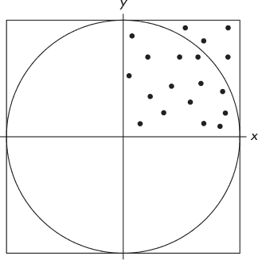
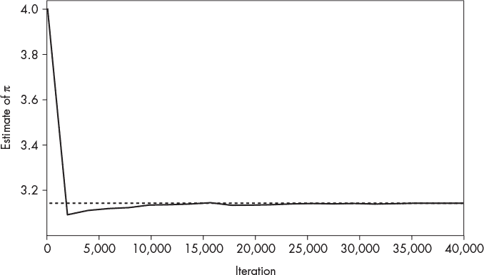
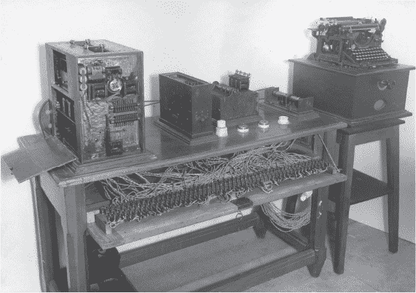

# 第七章：ABC 的基础


ABC (*[`esolangs.org/wiki/ABC`](https://esolangs.org/wiki/ABC)*) 是由一位名为“Orange”的程序员创建的，他是一个 esolang 爱好者，在 esolangs 维基中有几个条目。有些是玩笑，有些则较为严肃，而 ABC 则介于两者之间。我选择 ABC 是因为它的简洁。可以把它当作一个起点：它是存在的，但又渴望更多。本章将 ABC 从简洁的描述扩展到一个基础的 Python 实现，最终通过对语言的扩展使其变得更丰富。这将为接下来的 esolangs 做一个热身。

具体来说，我们将按照最初的描述呈现并实现 ABC。接着，我们将把 ABC 转变为巧妙命名的 ABC2。我们会通过一些示例来帮助我们用这种新语言思考，之后继续探讨 ABC2 及其实现。最后，像往常一样，我们将结束对这些语言的讨论。

### **ABC**

我们从慢慢来开始。在这一部分，我们将讨论 ABC 语言的内容，然后用 Python 实现它。这不会花太多时间。之后，我们将通过一些现有的 ABC 示例来测试实现。

#### ***语言***

ABC 在 esolang 维基中的描述是

```
a - Increment the accumulator
b - Decrement the accumulator
c - Output the accumulator

d - Invert accumulator
r - Set accumulator to a random number between 0 and 
    accumulator
n - Set accumulator to 0

$ - Toggle ASCII output mode.  When on, the c 
    instruction prints the accumulator as an ASCII 
    character.
l - Loop back to the beginning of the program.  
    Accumulator and ASCII mode does not reset.
; - Debug.  Prints out accumulator as a number and 
    ASCII character.

Unknown instructions are treated as NOPs.
```

就这么多了；没有更多内容。然而，这正是我们所需要的。描述中告诉我们，ABC 使用一个累加器，可以加一、减一或取反（取负）。

这里的内容不多，但这正是它的魅力所在——我们能用这么简单的东西做什么呢？

#### ***ABC 实现***

实现 ABC 不需要我们付出太多努力。esolang 维基中有一个 Java 实现，但我们将使用 Python。

列表 7-1 是我们 ABC 实现的完整源代码（参见 *ABC.py*）。

```
   import sys 
   import random
➊ t=open(sys.argv[1]).read()
   tokens=["a","b","c","d","r","n","$","l",";"]
   prog="" for c in t:
  ➋ if (c in tokens): prog+=c
   mode=False; A=0; k=0 
➌ while (k<len(prog)):
     t=prog[k]
     if   (t=="a"): A+=1
     elif (t=="b"): A-=1
     elif (t=="c"): 
       if (mode):   print("%s"%chr(A),end="")
       else:        print("%d"%A,end="")
     elif (t=="d"): A=-A
     elif (t=="r"): A=int(random.random()*A)
     elif (t=="n"): A=0 
     elif (t=="$"): mode=not mode
     elif (t=="l"): k=-1
     elif (t==";"): print("{%d:(%d,%x,'%s')}"%(k,A,A,chr(A)),end="")
     else:          pass
     k+=1
   print()
```

*列表 7-1：ABC 的 Python 实现*

Python 通常不会写得这么紧凑，但我们正在实现一个小型语言，所以小巧的实现似乎是合适的。我们承认有一个小小的偏差。`r` 命令应该将累加器（`A`）设置为 [0, *A*] 范围内的随机值。相反，我们的实现使用了 0, *A*)，这更接近伪随机生成器的常见用法——上限通常不包括在范围内。这个差异对示例代码的影响很小。

ABC 从命令行读取源代码文件 ➊，仅保留表示 ABC 命令的字符 ➋。这意味着不是有效 ABC 命令的文本可以作为注释使用。我们借鉴 COBOL，采用使用大写字母并尽量减少标点符号的方式来表示注释。

我们将程序存储在变量 `prog` 中。程序状态设置为默认的数字输出模式（`mode==False`）、零值累加器（`A=0`）和零值程序计数器（`k=0`）。

现在，ABC 的主体部分开始运行：一个 `while` 循环，其中嵌套着一个 `if` 判断当前指令（`t`）是否匹配某个命令 ➌。当所有命令执行完毕时，程序结束。根据设计，`l` 命令会导致一个无限循环，因为没有退出命令。

#### ***测试 ABC***

ABC 的 esolang 维基页面包含了几个示例程序。我们可以用它们来测试实现。最简单的程序是永远计数：`acl`。

带有注释的代码如下：

```
COUNT FOREVER
a  INCREMENT ACCUMULATOR
c  PRINT THE ACCUMULATOR AS A NUMBER
l  START AGAIN FROM THE BEGINNING
```

其他示例包括*1337.abc*

```
acaaccaaaac
```

它打印`1337`（黑客语言）。程序首先增加`A`以打印`1`，然后增加两次打印`3`两次，最后再增加四次打印`7`。很简单。

我们还有*dice.abc*

```
aaaaaarac
```

它会掷一个标准骰子。程序递增直到*A* = 6，然后用[0, 6)中的随机整数替换它。最后一次递增将*A*设置为[1, 7)范围内的值，然后打印出来。请注意，*dice.abc*在`r`之前有一个额外的`a`，以适应我们改变`r`工作方式的修改。

这些示例还包括*hello.abc*

```
$aaaaaaaaaaaaaaaaaaaaaaaaaaaaaaaaaaaaaaa
aaaaaaaaaaaaaaaaaaaaaaaaaaaaaaaaacaaaaaa
aaaaaaaaaaaaaaaaaaaaaaacaaaaaaaccaaacnaa
aaaaaaaaaaaaaaaaaaaaaaaaaaaaaaaaaaaaaaaa
aacbbbbbbbbbbbbcaaaaaaaaaaaaaaaaaaaaaaaa
aaaaaaaaaaaaaaaaaaaaaaaaaaaaaaacaaaaaaaa
aaaaaaaaaaaaaaaacaaacbbbbbbcbbbbbbbbcnaa
aaaaaaaaaaaaaaaaaaaaaaaaaaaaaaac
```

它通过设置 ASCII 输出模式打印“Hello, world!”，然后递增、递减，并从 0 开始，使累加器保存每个字母的必要 ASCII 码。请注意，累加器不会在每个字符之间重置，而是使用上一个字符的代码作为偏移量。就像 ABC 一样简单。

最终示例程序*phone.abc*打印一个随机生成的美国风格电话号码：

```
ac                  COUNTRY CODE
naaaaaaaaaradc      THREE DIGIT AREA CODE
naaaaaaaaaarc
naaaaaaaaaarc
naaaaaaaaaradc      THREE DIGIT EXCHANGE
naaaaaaaaaarc
naaaaaaaaaarc
naaaaaaaaaradc      FOUR DIGIT SUBSCRIBER naaaaaaaaaarc       NUMBER
naaaaaaaaaarc
naaaaaaaaaarc
```

该程序的巧妙之处在于通过加上`d`使累加器变为负数，然后再打印它，从而在数字的各部分之间添加了破折号：`1-883-386-3219`。

有了这个，ABC 及其示例就完成了。如前所述，ABC 渴望变得更强大。花费大量时间与 esolang 互动，你最终会产生自己动手做点什么的冲动，看看如何修改和增强现有的内容。如果你有这种冲动，那就去做吧；创造力在邀请你跳舞。

让我们重建 ABC，享受其中的乐趣。我们将保持与现在的兼容性，但可以添加更多功能。

### **ABC2**

经过充分的思考和几个焦点小组讨论，我们为 ABC 的继任者选择的名字是 ABC2。之前有先例：Modula 变成了 Modula-2（以及 Modula-3），Oberon 变成了 Oberon-2，等等。要让 ABC 变成 ABC2，应该做些什么呢？现有的 ABC 程序应该无需修改即可运行，这意味着 ABC2 是向后兼容的。当然，几乎任何事情都可以做，但在下一节中，我们将描述我们所做的工作，然后给出更新后的 Python 实现。

#### ***扩展***

扩展 ABC 很有趣。以下是将 ABC 转变为 ABC2 的过程：

+   如果命令行未提供程序，则进入交互模式

+   第二个累加器`B`，以及一个切换`A`和`B`的命令（`^`）

+   一个带有算术命令的栈

+   一个命令，用于交换栈顶值和活动累加器（`x`），以及推送（`!`）和弹出（`@`）栈

+   一个原始的条件命令（`?`），包括`<`、`>`和`=`命令

+   一个命令，用于终止程序（`q`）

+   一个命令，用于获取用户输入的字符（`k`）

+   一个分支命令（`g`）

+   一个命令，用于切换是否将换行符添加到输出中（`e`）

我们将在本章最后一节讨论这些变化以及它们对 ABC 从何而来、变成何样的影响。现在，让我们把注意力转向实现部分。

#### ***ABC2 实现***

ABC2 位于文件*ABC2.py*中。它不如*ABC.py*那样紧凑，但遵循了标准的 Python 惯例。解释器的结构保持不变：处理`prog`中的每个字符作为命令，直到所有字符都处理完。为了实现纯交互模式，需要做一些修改。我们将分块呈现代码，从[列表 7-2 开始，展示解析命令行的代码：

```
    if (len(sys.argv)==2):
        interactive = False
        t = open(sys.argv[1]).read()
        tokens = [
            "a","b","c","d","r","n","$","l",";",
            "e",">","<","g","+","-","*","/","x",
            "q","%","=","?","!","@","k","^",
        ]
        prog = ""
        for c in t:
            if (c in tokens):
                prog += c
    else:
        interactive = True
```

*列表 7-2：在 ABC2 中解析程序文本*

`if`语句加载并解析程序，仅保留实际的命令字符，或者设置`interactive`标志。

接下来是默认状态和修改后的主循环（列表 7-3）。

```
A = [0,0]
I = mode = cr = k = 0
stack = []
ops = ["+","-","*","/","%","<",">","="]
while (True):
    if (interactive):
        prog = input(": ")
        k = 0
    while (k < len(prog)):
        t = prog[k]
        # ... execute command in t ...
        k += 1
    if (not interactive):
        print()
        quit()
```

*列表 7-3：ABC2 的状态和主循环*

单个累加器现在变成了一对累加器，最初都为零（`A`）。`I`的值在它们之间切换。输出默认为数字（`mode=0`）且不换行（`cr=0`）。`stack`是一个标准的 Python 列表。我们将使用较少见的`pop`方法。所有栈操作都在`ops`中。

接下来，两个循环开始。外部的`while`循环将永远运行。如果是交互模式，`prog`被设置为用户输入的命令序列。注意，状态不会重置，因此当输入的命令完成时，当前的状态仍然存在于下一个命令集之前。第二个`while`循环与 ABC 中的循环相同：获取命令字符并评估它。当程序结束时，如果不是交互模式，则退出。

在实际实现中，第二个`while`循环包含一个相当冗长的复合`if`语句来执行命令（列表 7-4）：

```
if (t == "a"):
    A[I] += 1
elif (t == "b"):
    A[I] -= 1
elif (t == "c"):
    if (mode):
        print("%s" % chr(A[I]), end="", flush=True)
    else:
        print("%d" % A[I], end="", flush=True)
    if (cr):
        print()
elif (t == "d"):
    A[I] = -A[I]
elif (t == "r"):
    A[I] = int(random.random()*A[I])
elif (t == "n"):
    A[I] = 0
--snip--
```

*列表 7-4：执行 ABC2 命令*

一个概念上更优雅的实现会使 ABC2 成为一个类，并在一个小循环中使用与每个命令相关联的方法字典。鼓励读者构建这样的实现并分享出来。然而，出于教学目的，基于现有的 ABC `if`语句方法似乎更易于理解，尽管这不如其他方法具有创意。

ABC2 向后兼容 ABC，因此我们只描述扩展部分。所有之前的命令照常执行，`A`被`A[I]`替换以使用活动的累加器。大多数扩展命令不超过一到两行代码（见表 7-1）。

**表 7-1：** Python 代码用于扩展的 ABC2 命令

| **命令** | **实现** |
| --- | --- |
| `^` | `I ^= 1` |
| `k` | `A[I] = ord(getch())` |
| `q` | `quit()` |
| `e` | `cr ^= 1` |
| `!` | `stack.append(A[I])` |
| `@` | `A[I].stack.pop()` |
| `g` | `k = k + stack.pop() - 1` |
| `?` | `if (not stack.pop()):` |
|  | `   k += 1` |
| `x` | `v = stack.pop()` |
|  | `stack.append(A[I])` |
|  | `A[I] = v` |
| *stack 操作* | `if (t == "="):` |
|  | `    t = "=="` |
|  | `v=eval("%d %s %d" % (stack[-2],t,stack[-1]))` |
|  | `if (type(v) is bool):` |
|  | `    v = 1 if (v) else 0` |
|  | `stack.pop(); stack.pop()` |
|  | `stack.append(int(v))` |

不需要逐一查看 表格 7-1 中的每个小代码片段，因为大多数都是不言自明的。请注意，像弹出堆栈这样的有效性检查没有出现在 表格 7-1 中；然而，它们出现在 *ABC2.py* 中，因此请通读完整的源代码。

在 表格 7-1 中有一段代码我们需要讨论。`k` 命令调用了一个函数 `getch`，该函数返回一个按键输入，而不需要用户按下 ENTER。这不是一个标准的 Python 函数。*ABC2.py* 的顶部部分实现了适用于 Linux、macOS 和 Windows 的 `getch`。

`$` 和 `^` 命令使用了一种可能对某些人来说不熟悉的运算符：`^`（异或或 XOR）。异或是一种逻辑运算，其真值表如下：

| `A` | `B` | `A^B` |
| --- | --- | --- |
| `0` | `0` | `0` |
| `0` | `1` | `1` |
| `1` | `0` | `1` |
| `1` | `1` | `0` |

这表示当输入中任一项为 1，但不是两者都为 1 时，XOR 的输出为 1。这个特性使得切换状态变得简单，因为 `0¹ = 1` 和 `1¹ = 0`，意味着将 0 或 1 与 1 进行异或会得到 1 或 0，从而翻转其状态。与其他 Python 运算符一样，`I ^= 1` 是 `I = I¹` 的简写。

我们的实现已经完成。现在，让我们看看 ABC2 能做什么。

### **ABC2 的实践**

在经历了 Forth 后，ABC2 会显得相当简单。让我们从最简单的例子开始：加法运算。这是 ABC 无法轻松做到的事：你必须用 `a` 来计数到第一个值，然后再用更多的 `a` 来加一个正数，然后打印结果。ABC2 使得这一过程变得稍微简单一点。考虑一下 *add.abc2*。

```
ADD TWO NUMBERS AND DISPLAY THE RESULT
e             NEWLINE MODE
aaaaaaaaaa!   10 TO STACK
bbb!          7 TO STACK
+@c           ADD STACK, PULL TO A AND PRINT
```

注释说明了各个操作，但关键是设置换行模式，每行输出一个数字，计数到 10，然后将累加器推入堆栈。由于累加器已经是 10，并且推入堆栈不会改变它的值，因此我们倒计时到 7，并将其推入堆栈。

最后一行调用 `+` 将 10 + 7 = 17 推入堆栈，然后将其弹出堆栈并传递给累加器，再用 `c` 打印。请注意，只有累加器中的值，`A` 和 `B`，可以打印。没有像 Forth 中那样的“打印栈顶”项。要运行 *add.abc2*，请使用

```
> python3 ABC2.py add.abc2
```

好吧，这很简单。我们来尝试使用交互模式做类似的操作。启动 ABC2（python3 ABC2.py），但不提供文件名。然后，输入 列表 7-5 中的语句。

```
: aaaaa;
{5:0: (5,'')(0,'')} <0>: 
: !;
{1:0: (5,'')(0,'')} <1>: 5 
: !;*;
{1:0: (5,'')(0,'')} <2>: 5 5 
{3:0: (5,'')(0,'')} <1>: 25 
: @ec;
25
{3:0: (25,'')(0,'')} <0>:
: q
```

*列表 7-5：一个交互式 ABC2 会话*

列表 7-5 一开始可能看起来像是随机噪音，但其中是有规律可循的。让我们逐步分析它。ABC2 的交互式提示符是冒号（`:`）。第一行显示了五个 `a` 后跟一个分号（`;`）。我们知道 `a`；它将 1 加到累加器中，因此累加器现在存储的是数字 5。`;` 是 ABC 中的“调试”命令。这就是产生第二行 `{5:0: (5,`''`)(0,`''`)}` 的原因。

调试行有四个部分。第一部分显示当前程序计数器，即指令号，后跟冒号和 0 或 1。在这个例子中，程序计数器是 5，因为`;`是第六条输入的指令（总是从 0 开始计数）。接下来的部分，`0:`，告诉我们 A 是当前的累加器，即在*ABC2.py*中的`A[0]`。

接下来是两个括号。这些是两个累加器 A 和 B 的当前数值和字符值。在这个例子中，A 是 5，B 是它的默认值 0。只有当累加器的值在[32,127]之间时，才会显示字符，这排除了 5 和 0，因此没有字符显示。

闭括号后是堆栈。首先显示堆栈中的项目数量。在这个例子中是`<0>`，因为堆栈为空。接下来的部分显示堆栈中的所有项目。

输入的下一个命令集，`!;`，将 A 压入堆栈并再次打印调试信息。这一次我们看到`<1>: 5`，告诉我们堆栈上有一个项目，即数字 5。

以下命令将 A 第二次压入堆栈，调用调试，乘以堆栈顶部的两个项目，再次调用调试，最终将 25 留在堆栈中。最后，`@ec;`弹出堆栈，将 A 设置为 25，进入换行模式，并打印`A`。`q`命令退出 ABC2。如果你敢尝试编写 ABC2 代码，强烈建议你这么做，你会发现交互模式在程序开发过程中非常有用。

让我们通过三个 ABC2 示例逐步讲解。每个示例探讨了 ABC2 的一个新功能，最终形成一个致敬于一位被低估的早期计算机先驱的程序。

#### ***HELLO WORLD!***

Hello World Collection 网站列出了超过 600 种不同编程语言的“Hello, world!”版本（* [`helloworldcollection.de/`](http://helloworldcollection.de/)*）。对于每一种能够打印“Hello, world！”的语言，几乎成了一种道德义务，必须在某个时刻打印出来。因此，我们也要做个好公民，履行我们的责任。

文件*hello.abc2*包含了 ABC2 版本的“Hello, world!”（你好，世界！），虽然略有语法错误。运行*hello.abc2*会产生如下结果：

```
HELLO WORLD!
```

ABC 版本通过递增和递减累加器来达到每个字符所需的 ASCII 码。ABC2 有一个堆栈，正如我们在第四章中学到的，它是一个 LIFO 数据结构（后进先出）；最后压入的是第一个弹出的。让我们使用堆栈来存储我们想要输出的字符，按照相反的顺序压入，这样当它们从堆栈中弹出时会正确打印出来。而且，堆栈支持算术运算，所以我们不需要数到我们想要的值。我们可以通过快捷方式更快地达到所需的 ASCII 码。

列表 7-6 给出了代码。

```
HELLO WORLD
aaa!aaaaaaaa!*@!!!+@aa!
@!aaaaaaaa!@!aaaaaa!
@!bbb!@!aaaaaaaa!
naaaa!aaaa!*@!!!+
@aaaaaaaaaaaaaaa!
@!bbb!!bbbbbbb!aaa!
$@c@c@c@c@c@c@c@c@c@c@ce@c
```

*列表 7-6: 在 ABC2 中输出“Hello, world！”*

第一行当然是注释。让我们解析注释后的第一行`aaa!aaaaaaaa!*@!!!+@aa!`：

```
aaa!       |  3
aaaaaaaa!  |  3 11
*          | 33
@!!!       | 33 33 33
+          | 33 66
@aa!       | 33 68
```

每一行展示了左侧的 ABC2 命令以及栈的后续状态。看看最后一行。栈中包含 33 和 68，分别是 `!` 和 `D` 的 ASCII 码，这两个字符是最终输出的字符。程序在栈上反向构建输出字符串。

剩余部分将被类似地放入栈中。当清单 7-6 的倒数第二行完成时，栈中包含了

```
33 68 76 82 79 87 32 79 76 76 69 72
```

这是通过启用字符模式（`$`）并反复弹出栈并打印（`@c`）所得到的清单 7-6 的最后一行输出结果。在最后一个字符输出之前，`e` 会开启换行模式。

现在，让我们使用 ABC2 做一些数学计算。

#### ***一片圆周率***

我在 3 月 14 日写这部分内容，使用美国式日期格式就是 3/14——圆周率日。因此，为了纪念大家最喜欢的数学常数，接下来的例子使用 ABC2 来估算 *π* = 3*.*14159*…*，仅通过随机整数。

圆的面积是 *A*[circle] = *πr*²，其中 *r* 是半径，即从圆心到边缘的距离。如果我们设定 *r* = 1，那么得到的圆的面积是 *A*[circle] = *π*(1)² = *π*。半径为 1 的圆的直径是 2。如果这个圆的圆心在原点，直径的范围是从 *–*1 到 +1。现在，假设一个边长为 2 的正方形被放置在圆上。这个正方形是*外接*于圆的（见图 7-1）。



*图 7-1：一个正方形外接于半径为 1 的圆*

我们稍后会讨论图 7-1 中的点。目前，先考虑正方形与圆之间的关系。如果正方形的边长为 2，那么它的面积是 *A*[square] = *s*² = (2)² = 4。

圆和正方形的面积比是 *A*[circle]/*A*[square] = *π*/4。即使我们只考虑第一象限，也就是说，考虑四分之一的图形（其中的点在图 7-1 中），这个比例依然成立。第一象限中的圆的面积是 *π* 的四分之一，即 *π*/4，而第一象限中的正方形面积是 4/4 = 1，这意味着它们之间的比例是 *π*/4/1 = *π*/4。

好的，那么呢？如果我们能估算出第一象限中圆和正方形的面积，我们就能将二者相除，预期结果应接近*π*/4。这时，图 7-1 中的点就派上用场了。它们代表了在区间 0,1)内，*x*和*y*方向上的随机点。如果我们生成许多这些随机点，会发生什么呢？从某种意义上讲，这些点会慢慢填充圆和正方形的区域。如果我们统计落在圆内的点数，并将其除以落在正方形内的点数（因为我们使用的是[0,1)，所以正方形内的点数就是所有点数），我们就可以估算圆和正方形之间的比例，而正如我们刚才看到的，这个比例就是*π*/4。因此，如果将这个比例乘以 4，就可以得到*π*的估算值，这正是我们想要的。

太好了！让我们在区间[0,1)内选择随机值，并开始统计落在圆内的点数。我们如何知道某个点是否在圆内呢？这个很简单。实际上，这是勾股定理的应用：*c*² = *a*² + *b*²，其中*a*是*x*，*b*是*y*。圆心在原点，半径为 1。如果*x*² + *y*²——即从原点到随机选定点的距离——小于半径的平方，则该点在圆内。对于圆，*r*² = 1，因此当点与原点的距离小于 1 时，它就在圆内。

我们需要两个计数器。第一个用于统计每个随机生成的点，因为[0,1)覆盖了第一象限内整个正方形的区域。这意味着每个点都落在正方形内，因此无需测试。我们将这个计数器称为`S`。第二个计数器用于统计所有落在圆内的点，(*x*, *y*)，其中*x*² + *y*² < 1。我们将这个计数器称为`C`。

这是我们想要编写的算法：

```
S = C = 0
Loop forever:
    x = [0,1)
    y = [0,1)
    S = S + 1
    if (x*x + y*y < 1):
        C = C + 1
    print 4*C/S
```

在每次循环中，代码会选择一个新的(*x*, *y*)点，增加`S`，如果该点落在圆内，则增加`C`。然后，比例会接近*π*/4，当这个比例乘以 4 时，就可以得到*π*的估算值。

当然，你可能已经注意到问题了。ABC2 仅适用于整数。该算法期望使用浮点数。我们就此受阻了吗？并没有。我们需要的是两个面积的比率，一个是圆的面积，一个是正方形的面积。实际上，我们并不局限于[0,1)这个区间。假设我们使用整数，并选择[0,1,000,000,000)这个区间内的点。ABC2 在这个范围内处理整数没有问题。如果我们将*x*和*y*扩大十亿倍，那么我们检查的限制也会按平方比例扩大。所以，不再检查*x*² + *y*² < 1，而是检查*x*² + *y*² < 10¹⁸，即十亿的平方。再次感谢我们的 Python 实现，ABC2 可以轻松处理像 10¹⁸这样的整数。

因此，我们的算法保持不变，只有随机数的限制和距离原点的变化。不过，我们的输出也必须有所变化。我们将不再计算`4*C/S`，而是以*分数*的形式显示`C/S`。也就是说，实际上是将`C`后跟一个斜杠，然后是`S`。在任何时候，我们都可以取出输出值，将其输入计算器以获得实际的浮动点比率，再乘以 4 以得到当前的*π*估算值。

我们需要的代码在[Listing 7-7 和*pi.abc2*中。

```
!                                        PUT A ON STACK
naaaaaaaaaa!!*@!!*@!!*naaaaaaaaaa!*@     A IS 1 BILLION
r!!*                                     X SQUARED
naaaaaaaaaa!!*@!!*@!!*naaaaaaaaaa!*@     A IS 1 BILLION
r!!*                                     Y SQUARED
+                                        XX PLUS YY
naaaaaaaaaa!!*@!!*@!!*naaaaaaaaaa!*@!!*  10 TO THE 18TH
<+                                       INC C IF LESS THAN
^a^                                      INC S
@!c                                      PRINT C
naaaaaaaaaa!!+@!!+@aaaaaaa$c$            PRINT SLASH
^ece^                                    PRINT S
@l                                       LOOP
```

*Listing 7-7：使用随机数估算π*

我们将使用累加器 B 保存`S`，并将栈用来保存`C`。当程序开始时，累加器 A 和 B 都为零。因此我们将 A 压入栈中以初始化计数器。

我们将使用`r`从 0, 10⁹)中选择一个随机整数，因此我们需要将 A 设置为十亿。这就是[Listing 7-7 第二行的作用。首先 A 是 10，然后通过将它压入栈中两次进行平方，A 变为 100。接着 100 × 100 = 10,000，再将 10,000 × 10,000 = 100,000,000 压入栈中。最终乘以 10 将 A 设置为十亿。这个过程比较痛苦。选择一个随机值并对其进行平方是`r!!*`，即选择值，将其压入栈中两次，然后进行乘法。此时栈中的内容为`( C x*x -- )`。接下来的 Listing 7-7 的两行重复了前两行的操作，将*y*²放入栈中，以便`+`可以将它们相加。

当前栈中包含`C`，后跟随机点（*x*, *y*）到原点的距离的平方。若该距离小于 10¹⁸，我们必须增加`C`，因此我们采用类似的方法：将 A 设置为十亿，最终得到 10¹⁸放入栈中。此时栈中的内容为`(C x*x+y*y 10**18 -- )`。

小于命令`<`执行比较，并在栈上留下 0 或 1。这非常方便。如果比较结果为假，即距离不小于 10¹⁸，我们得到 0；否则，我们得到 1，因此栈中是`( C 0|1 -- )`。无论哪种情况，将此结果加到`C`上都是可行的。如果比较为真，栈中是 1，这会增加`C`的值。如果比较为假，则将 0 加到`C`也没有问题。由于这种安排，唯一需要分支的地方是在程序的末尾生成下一个点的循环。

我们已经根据需要增加了`C`，但仍然需要增加`S`。由于`S`在累加器 B 中，因此增量操作特别容易：切换到累加器 B，使用`a`进行增量操作，然后通过`^a^`切换回累加器 A。

我们准备好显示当前的*π*/4 估算值。首先，我们打印`C`并将其返回栈中，以免丢失（`@!c`）。然后，我们将 A 设置为 47，即斜杠的 ASCII 码，并通过`$c$`显示它。最后，我们切换到累加器 B，使用`e`切换到换行模式，打印`S`，并记得关闭换行模式，切换回累加器 A。

第一条指令是`!`，用于将 A 存入堆栈，也就是存储`C`。在我们进行循环之前，我们使用`@`从堆栈中取出`C`，然后通过`l`进行循环。

该程序会一直运行，生成越来越精确的*π*/4 的估算值。让我们看看它做得怎么样。在程序的某次运行中，前几次迭代的输出是：

```
  1/1,   2/2,   3/3,   4/4,   5/5,   
  5/6,   6/7,   7/8,   8/9,  9/10, 
10/11, 11/12, 11/13, 12/14, 13/15, 
14/16, 15/17, 16/18, 17/19, 18/20, 
19/21
```

最后一轮迭代给出的*π*估算值为≈4(19)/21 = 3*.*6190476\. 不算太好，但程序才刚刚开始。几秒钟之后，输出为*π*≈4(992)/1280 = 3*.*1，因此它朝着正确的方向发展。大约 15 秒后，估算值为*π*≈4(44893)/57153 = 3*.*1419523，这已接近真实值。

输出值接近*π*的速度有多快？如果我们捕获程序的输出，并将*π*的估算值绘制成迭代次数的函数，我们得到图 7-2，它展示了随着迭代进行，收敛的情况。经过大约 100,000 次迭代，估算值为 3.1416803，精确到四位小数。



*图 7-2：*π*的估算值与迭代次数的关系*

图 7-2 显示了要接近*π*，需要进行许多迭代——大约 25,000 次左右。这并不令人惊讶，因为我们试图用随机点集合来代替一个实际的面积。你可能会有些不安，因为一个点没有面积，那一堆点怎么可能有面积呢？我这样理解：假设无限空间实际上是离散的。从这个角度来看，面积是由（极其）小的单元格（想象成像素）组成的，而随机点则填充了这些单元格，随着迭代，单元格不断增多。这里的不同之处在于，每个单元格*确实*有面积，哪怕很小，而所有的单元格共同拼接成圆形和正方形。从这个角度出发，我们就是通过随机填充一个个单元格，来逐步得出圆和正方形面积的更好估算值。随着时间的推移，我们应该能得到越来越准确的*π*/4 的估算值，最终得到*π*。

希望你喜欢这个小小的π日示例。尽管 ABC2 非常简洁，它仍然能做出这样的计算，而且 ABC2 的逻辑运算符恰好在正确的地方（即`C`上方的堆栈中）给出了精确的值，因此不需要任何复杂的循环结构。

现在，让我们开发一个早期计算机的版本，并了解一下它那位非凡但鲜为人知的发明者。

#### ***电机算术仪***

你可能从未听说过莱昂纳多·托雷斯·奎韦多（有时写作莱昂纳多·托雷斯·凯韦多）。在我开始写第一本书之前，我也从未听说过他。如果你听说过他，那真是太棒了。

托雷斯·凯维多是 19 世纪中期出生的西班牙发明家。他的众多成就包括缆车、飞艇、早期的遥控器、工作中的国际象棋自动机，最令我们感兴趣的是电机械算术机。算术机是一种 19 世纪的机械计算器。托雷斯·凯维多的版本于 1920 年在巴黎展示（参见图 7-3），是电子与机械结合的。



*图 7-3：1920 年左右的电机械算术机。图片由马德里康普顿斯大学的 Francisco A. González Redondo 先生特此授权使用。*

在图 7-3 的右侧是打字机。这是操作员使用的键盘。操作员将纸放入打字机，并开始输入如`123 × 321 =`这样的表达式，机器会在同一行输入`39483`，然后将纸推进到下一行。回想一下，这是 1920 年，早于第一台真正的电子计算机以及 Konrad Zuse 的开创性工作。托雷斯·凯维多展示了电机械算术机，然后将其搁置，它从未上市。

我们稍后会回到图 7-3，但由于这是一本关于编程语言的书，值得指出的是，托雷斯·凯维多不仅建造了如此令人印象深刻的机器，早在此之前，他就已经在思考如何以机器友好的方式实现浮点运算。在他 1914 年的著作《自动化论文》中，他写到，数字应该以*n* × 10^(*m*)的形式存储，这也是我们现在存储浮点数的方式：*n* × 2^(*m*)。浮点数的一个问题是，科学计数法中的数字不是唯一的：3*.*1415 × 10⁰ = 0*.*31415 × 10¹ = 31*.*415 × 10^(*–*1)。托雷斯·凯维多理解这一点，因此他提出了以下规则，以便以一致的方式存储数字，供机器处理：

1.  *n*将始终保持相同的位数（例如六位数）。

1.  *n*的第一位数字将是十分位，第二位是百分位，依此类推。

1.  每个数量将以*n;m*的形式表示。

现代计算机以固定大小的*n*存储浮点数；例如，C 语言中的`double`类型是 52 位（实际上是 53 位；符号位 1 隐含作为有效数字的整数部分，1*.b*[51] *b*[50]*…**b*[0]）。显然，托雷斯·凯维多在思考的是十进制，但是固定有效数字大小的概念是关键。上述提到的 Zuse 可能是第一位在计算机中实现二进制浮点数的人，正如我们现在所做的那样——参见 IEEE 754 标准。

在我们回到电动算术机之前，最后一个关于托雷斯·凯维多（Torres Quevedo）浮动点格式的观察。注意，他在 1914 年再次建议将浮动点数写成*n;m*的形式。因此，按照他的规则，他会将*π*写成 0.314159;1，意味着 0*.*314159 × 10¹ = 3*.*14159。这个表示方式与今天浮动点数的输入方式非常接近：0.314159e1。唯一的区别是使用分号（;）代替*e*。

好的，这一切都很有趣，但这与 ABC2 有什么关系呢？ABC2 中我们尚未探索的一个特性是`k`命令，它从键盘读取一个字符并将其字符代码放入当前的累加器中。让我们使用这个命令来模仿托雷斯·凯维多的算术机。我们将仅限于乘法操作。

我们将使用的代码在*multiply.abc2*中。这是我们考虑的最复杂的 ABC2 程序。它不仅使用`k`作为输入，还使用`?`，这是 ABC2 中唯一的条件命令。

让我们先概述一下我们要实现的目标。莱昂纳多的算术机让用户输入一个数字、一个操作符和第二个数字。我们将固定操作符为乘法，因此我们需要用户输入两个数字——具体来说，是两个三位数——尽管它们的前导数字可能是零。`k`指令从键盘读取一个字符，那么我们如何将字符转换为数字呢？

首先需要注意的是，零的 ASCII 码是 48。数字的 ASCII 码按顺序排列，意味着 49 是 1，50 是 2，以此类推。因此，如果用户按下 3，累加器中将包含 51。将 48 从 51 中减去得到 3。为了将数字的 ASCII 码转换为该数字本身，我们需要减去 48。现在我们知道如何获取单个数字了。那么三位数呢？

我们得到了一个三位数，451。在小学时，你可能学过如何将数字写成扩展形式，如：

451 = 400 + 50 + 1

但是，还有另一种扩展数字的方式：

| 451 | = (((4 × 10) + 5) × 10) + 1 |
| --- | --- |
|  | = ((40 + 5) × 10) + 1 |
|  | = (45 × 10) + 1 |
|  | = 450 + 1 |
|  | = 451 |

以这种方式扩展一个数字为我们指引了一种算法，用于输入三位数并将其转换为一个三位数：

1.  获取第一位数字，将其乘以 10，并将其存储到栈中。

1.  获取第二位数字，并将其加到栈上的数字中。

1.  将栈上的数字乘以 10。

1.  获取第三位数字，并将其加到栈上的数字中。

当这些步骤完成后，栈中将包含用户逐个字符输入的三位数。让我们按照这些步骤看看它们是否有效。

```
User enters 4,  stack: 4
Multiply by 10, stack: 40
User enters 5,  stack: 40 5
Add,            stack: 45
Multiply by 10, stack: 450
User enters 1,  stack: 450 1
Add,            stack: 451
```

这些步骤有效。用户输入了 4、5 和 1，栈中保存了数字 451。当在 ABC2 中实现时，还有一个额外的步骤：在用户输入数字后，我们必须减去 48 来将字符代码转换为数字值。

我们已经知道如何从用户获取一个数字。要实现“算术计数器”，我们必须从用户那里获取两个数字，分别放入栈中，并进行相乘。

清单 7-8 显示了 *multiply.abc2* 的全部内容。

```
ENTER TWO THREE DIGIT NUMBERS AND MULTIPLY THEM
QUIT IF THE FIRST CHARACTER OF THE FIRST NUMBER IS ESC

^naaaaa!aaaaa!*@bb  B IS 48
^k!!                FIRST KEYPRESS
naaa!aaaaaa!*=?q    QUIT IF ESC PRESSED
@!$c$^!^-           FIRST DIGIT
naa!aaa!**          TIMES TEN
k$c$!^!^-+          SECOND DIGIT
naa!aaa!**          TIMES TEN
k$c$!^!^-+          THIRD DIGIT naaaa!aaaa!*@$c     SPACE
aaaaaaaaaac         TIMES
bbbbbbbbbbc$        SPACE
k$c$!^!^-           FIRST DIGIT
naa!aaa!**          TIMES TEN
k$c$!^!^-+          SECOND DIGIT
naa!aaa!**          TIMES TEN
k$c$!^!^-+          THIRD DIGIT
naaaa!aaaa!*@$c     SPACE
!!+@bbbc            EQUALS
naaaa!aaaa!*@c$     SPACE
*@ecel              PRODUCT AND LOOP
```

*清单 7-8：成对数字相乘*

第一行有注释 `B IS 48`。这一行切换到累加器 B（`^`），并确保其值为 0，这是必要的，因为我们有循环。然后将其增至 5，压入栈中，再增五次至 10 并压入栈中。相乘后，栈中剩下 50，然后将其弹出并存入累加器 B（`@`），最后减去两次，得到 B 等于 48。这就是我们需要从用户输入的数字 ASCII 码中减去的常数。对于这个程序，我们使用 B 作为常数。当需要时，我们切换到累加器 B，将其值压入栈中，然后立即切换回累加器 A。

下一行是 `FIRST KEYPRESS`，`^ k!!`。`^` 语句切换回累加器 A。我们从键盘读取一个字符（`k`），并通过 `!!` 将其压入栈中两次。我们压入两次是因为程序将循环反复询问用户输入一对数字。对于第一个数字，如果用户按下的是 ESC 键（ASCII 27），我们希望退出程序。我们先压入第一次数字，用于像上面那样计算数字，然后第二次压入以与 ESC 键进行比较。

`QUIT IF ESC PRESSED` 这一行检查栈顶值是否为 27。首先，我们通过 `naaa!aaaaaa!*` 将 A 设置为 27。然后，我们将 A 增加到 3 并将其压入栈中，再增加六次至 9 并压入栈中，最后将这两个数字相乘，栈顶留下 27，下面是用户输入的字符的 ASCII 码。执行 `=` 检查栈顶的两个元素是否相等。`?` 在弹出栈的同时，如果栈顶值为真（非 0），程序会立即执行 `?` 后的命令。否则，跳过下一个命令，继续执行后面的命令。在这种情况下，下一个命令是 `q`，退出程序，因此如果用户按下的是 ESC 键，`=` 会在栈中留下真值供 `?` 获取，且由于其值为真，`q` 会被执行，从而结束程序。

我们已检查第一个按键是否为 ESC，但尚未显示按键或减去 48 来获取其数字值。此时它已在栈中，因此我们通过 `@!` 将其加载回累加器 A：`@` 将其从栈中取出并放入累加器 A，`!` 再将其压回栈中，因为我们还需要它在栈里。接下来，`$c$` 通过切换到字符模式来打印字符，使用 `c` 打印，然后切换回数字模式。

要减去 48，我们使用`^ ! ^ -`。每次需要减去 48 时，这个模式都会在程序中重复。它切换到累加器 B，将 B 推入栈中，再切换回累加器 A 进行减法操作。此时栈中包含的是数字值，必须通过`naa!aaa!**`来乘以 10，这样将 2 和 5 推入栈中，乘以得到 10，最后将数字值乘以 10。每当数字值需要乘以 10 时，这个模式也会重复。

第一个数字是一个特殊的情况，因为我们需要检查是否按下了 ESC。其余五个数字本质上是相同的：`k$c$!^!^-+`用于获取数字、显示它、推入栈中、再推入 48、减去 48，然后将数字值加到栈中已有的值上。如果需要，这个模式后面会跟着乘以 10 的模式。

列表 7-8 中的其他行处理了必要的文本输出。最后一行是`*@ecel`。此时栈中包含了用户输入的两个数字，因此`*`会将它们相乘，`@`将结果提取到累加器 A 中显示，并通过`ec`来展示，其中`e`启动换行模式。为了重新输入一对数字，我们首先关闭换行模式，然后循环`l`。

上述描述必然较为密集。请复习代码，看看它是如何工作的，并尝试在交互模式下使用一些模式。让我们看看*multiply.abc2*的输出是什么样的；不过，当然，在打印输出时你不会看到流程。

```
123 * 321 = 39483
451 * 359 = 161909
999 * 999 = 998001
002 * 003 = 6
```

虽然不如托雷斯·凯维多的电机械计算器那么令人印象深刻，但我们可以说，像这样的一个小程序至少有一定的实用性。作为一个练习，扩展*multiply.abc2*以接受四位数的数字。注意，这个程序没有检查按下的键是否真的是一个有效的数字。程序接受任何按键输入；然而，如果按下的不是有效数字，结果将没有意义。

让我们向托雷斯·凯维多（Torres Quevedo）道别，并以简短的讨论结束我们的 ABC2 冒险。

### **讨论**

本章以 ABC 的电子语言维基描述和我们的 Python 实现开始。显而易见，作为一门编程语言，ABC 甚至远未达到图灵完备的水平。它也并非要成为图灵完备的语言；它只是一个能够完成简单任务的有趣想法。然后我们扩展了 ABC，创建了 ABC2。ABC2 是图灵完备的吗？不是，它不是。只有两个内存位置和一个栈，无法像数组一样逐个访问栈中的单元格。

什么可能使 ABC2 成为图灵完备的语言？可以想象 ABC3，它有栈结构，并且不是两个累加器，而是一个“无限”的可以通过索引访问的累加器集合。换句话说，一个数组。那个场景将会像 CPU 的算术逻辑单元那样使用栈，而累加器则作为内存。我怀疑这样的语言可能是图灵完备的。我可能会去做它，因为不会太难。更好的是，你可以自己做，如果愿意分享，可以发给我，我会把它放到这本书的 GitHub 网站上。

ABC2 的栈有限，因为没有像 Forth 中的 DUP、SWAP、ROT 和 OVER 等内建命令来操作它。还是说情况真是如此？

ABC2 没有栈操作命令，但我们可以创建类似栈操作的模式，前提是我们不需要保留累加器的内容。

例如，这些 ABC2 模式类似于给定的 Forth 单词：

```
@!!         DUP
@x!         SWAP
@           DROP
@^@x!^x!    ROT
^@^@!^!^!   OVER
```

以交互模式运行 ABC2 并尝试一下。使用 `;` 来显示栈。

本章中的 ABC2 示例展示了重复的代码模式。所有语言中都会有这种情况——想想在软件开发中常用的设计模式。特别是 *multiply.abc2* 示例，使用了几种重复的代码模式，将常量压入栈中，从用户获取数字，并乘以 10。由于每个 ABC2 命令本身就是一个字符，这些模式就变成了单词。空格不是 ABC2 的命令，这意味着我们可以用这些模式作为单词编写代码，随着时间推移，熟悉 ABC2 的“老手”（留意招聘广告）会学会识别这些单词。

比如，*multiply.abc2* 中的一个模式是 `k$c$!^!^-+`，它获取一个字符并将其数字值添加到栈中的已有数字。这种模式（可以称为一句话吗？）可以写成 `k $c$ ! ^!^ - +`，以将命令分割成有意义的单词。另一个模式将常量存储在累加器 B 中。在一个实例中，常量是 *–*7，用于与 `g` 配合实现循环中的跳转。另一个常量是 48，这是我们需要从数字的 ASCII 字符码中减去的值。使用累加器 B 作为常量支持了像 ABC3 这样的语言设计，在那里我们可以拥有所需的任意多个变量。

最终，ABC 和 ABC2 是玩具语言，就像大多数 esolang 一样。它们有趣、富有创意且充满实验性，同时也帮助我们更好地理解日常使用的编程语言背后的精心设计。

### **总结**

本章介绍了一种极其简单的 esolang，名为 ABC。我们通过语言描述（通常是实现者手头唯一的材料），并编写了一个 Python 实现。我们很快理解了该语言的局限性，并将其扩展为具有更多功能的 ABC2，同时保持了与原 ABC 的向后兼容性。

我们在 ABC2 中开发了一些例子并玩得很开心。我们通过使用随机数学习了如何估算 *π* 的值。接着，我们向早期计算机先驱莱昂纳多·托雷斯·凯韦多（Leonardo Torres y Quevedo）致敬，编写了一个模仿他 1920 年发明的电机化算术仪的程序。在这个过程中，我们了解到，ABC2 有助于编码一些可以称为“单词”（向 Forth 致歉） 的模式，而且 ABC2 程序可以像句子一样由一系列“单词”组成。

ABC 和 ABC2 是我们探索编程语言的完美入门。接下来让我们转向 FRACTRAN，可能是我们将遇到的最具智力挑战的 esolang。
