# 第八章：FRACTRAN


约翰·康威（John Conway，1937–2020）是英国数学家，对公众最著名的是他的《生命游戏》（见* [`playgameoflife.com/`](https://playgameoflife.com/)*），但在数学界，他因对广泛的数学学科做出许多贡献而同样享有盛誉。在本章中，我们将探讨康威的另一个贡献，尽管这个贡献不像《生命游戏》那样为人所知，但它非常适合我们的目的：FRACTRAN。我们将从 FRACTRAN 的规格开始，构建它，最后使用它来实现加法、减法和乘法等基本程序。之后，我们将像往常一样以讨论结束。

请注意，接下来将涉及数学内容，涵盖分数、素数和大整数等知识。FRACTRAN 是我们遇到的最具数学性的 esolang。如果你愿意，可以跳过本章，继续阅读剩下的 esolang。然而，如果你这么做，请不要忘记回来看。FRACTRAN 是值得我们努力学习的。

### **FRACTRAN 规格**

FRACTRAN 的规格很简单。事实上，它几乎和 ABC 的简单程度一样。以下是 FRACTRAN 的完整规格：

```
FRACTRAN

Input:
    A sequence of fractions
    An integer

Operation:
    1\. Multiply the integer by the fractions in turn:
    2\.   If the product is an integer, use that as the new integer 
         and repeat from Step 1.
    3\.   If the product is not an integer, move to the following fraction.
    4\. If all fractions are exhausted, stop.

Output:
    The final integer
    Optionally: all intermediate integers, if desired

Assumption:
    The implementation must use arbitrary precision fractions.
```

FRACTRAN 程序是一个整数序列，仅此而已。一个初始整数按顺序与程序中的每个分数进行测试。如果该整数与分数的积本身是一个整数，那么这个积将成为新的整数，程序将从头开始循环。如果程序进入一种状态，其中没有任何积能得到一个新整数，程序就结束了。就是这么简单。

由于规格简单，实现也同样简单。让我们写两个 FRACTRAN 解释器，因为这很有趣，而且它会让我们接触到另一种编程语言，一种非常适合这个特定任务的语言。

### **两种实现的故事**

上面的规格包括了*任意精度*这一短语。一个 FRACTRAN 实现必须使用分数，其中分子和分母是任意大小的整数，即使这个大小有数千位数字。

大多数编程语言并不原生支持任意精度整数，更不用说分数（有理数）了。然而，Scheme 支持。Scheme 是 Lisp 的一种方言，我们在第一章中首次提到过它。Scheme 不仅支持任意精度整数，还原生支持有理数。因此，Scheme 非常适合实现 FRACTRAN。

在整本书中，我们已经相当频繁地使用了 Python。Python 也原生支持任意精度整数，并且有一个有理数算术库模块。因此，我们也将在 Python 中实现 FRACTRAN。两种实现方式的对比将具有启发性，并使我们能够相互测试它们，以确保我们的实现是正确的。

#### ***Scheme 实现***

我们将使用的 Scheme 版本叫做 Racket（*[`racket-lang.org/`](https://racket-lang.org/)*）。它在 Linux 上很容易安装：

```
> sudo apt-get install racket
```

请访问 Racket 网站安装 macOS 和 Windows 版本。安装完成后，通过在命令行中输入 racket 来运行 Racket：

```
Welcome to Racket v6.11.
>
```

你的版本应该至少是 6.11 或更高版本。像 Python 和 Forth 一样，如果没有给它提供文件，Racket 会进入交互模式。目前，只需通过输入 (exit) 退出；注意，括号是必须的。

我们这里确实没有足够的空间来提供一个简短的 Scheme（Racket）教程。真正有兴趣的人可以在 Racket 网站上找到所有需要的信息。相反，我们将走一遍我们的实现过程。列表 8-1 显示了代码。

```
(define argv (current-command-line-arguments))
(define prog (file->list (vector-ref argv 0)))
(define num (string->number (vector-ref argv 1)))
(define trace (string->number (vector-ref argv 2)))

➊ (define (FRACTRAN)
    ➋ (do ((i 0 (+ i 1))) (#f)
        ➌ (when (= i (length prog)) 
               (when (= trace 0) (display num)(newline))
               (exit))
        ➍ (let ((n (* num (list-ref prog i))))
            ➎ (when (exact-integer? n) 
                   (set! num n)
                   (set! i -1)
                   (when (= trace 1) (display num)(newline))) ) ))
➏ (FRACTRAN)
```

*列表 8-1：Racket 中的 FRACTRAN*

Racket 实现的 FRACTRAN 非常简洁。前四行只是解析命令行。在 Racket 中，`define` 用于赋值。我们使用 `argv` 来避免重复调用 `current-command-line` `-arguments`。Racket 将命令行参数返回为一个向量，因此 `(vector -ref argv 0)` 相当于其他语言中的 `argv[0]`。Racket 是一种前缀语言，这意味着函数名在前，后面跟着带括号的参数。下面我们将看到 FRACTRAN 代码是如何存储的。我们选择了一种对 Racket 友好的格式，这样我们可以轻松添加注释。`file->list` 函数读取代码并返回一个包含分数的列表。下一个参数是起始整数，Racket 将其放入 `num`。最后一个参数 `trace` 是一个 0 或 1 的标志，指示是否仅输出最终整数或所有中间整数。稍后我们将了解它的含义。

FRACTRAN 完整代码是一个不接受任何参数的单一函数 ➊。它由一个 `do` 循环组成，类似于其他语言中的 `for` 循环，但它被配置为无限运行 ➋。循环计数器是 `i`，我们用它来从 `prog` 中获取第 `i` 个分数。

`do` 循环的主体有两个主要部分：一个 `when` 函数 ➌ 和一个 `let` 函数 ➍。`when` 函数检查给定条件是否为真，如果为真，则执行主体中的所有代码。这个 `when` 检查循环计数器是否与程序的长度匹配，也就是分数的数量。如果匹配，程序结束，并且如果 `trace` 为 0，输出 `num` 的最终值。

`let` 函数创建一个局部环境，将 `(* num (list-ref prog i))` 赋值给 `n`。`(* num (list-ref prog i))` 是什么？它是当前整数乘以当前分数：`num*prog[i]`。`let` 的主体是一个单一的 `when` ➎ 函数。函数 `exact-integer?` 当其参数 `n` 是整数而非有理数或浮点数时返回 true。回想一下，`prog` 中的分数是原生的 Racket 有理数。这就是我们需要检查的条件。如果条件为真，我们就得到了一个新的整数，因此 `when` 的主体会破坏性地将 `num` 设置为 `n` 的新值，并通过将循环计数器设置为 *–*1 来修改它，以便 `do` 的下一次迭代从 0 开始。另外，如果 `trace` 为 1，新整数将被输出。程序通过调用 `FRACTRAN` ➏ 开始执行。

现在，让我们用 Python 实现 FRACTRAN。

#### ***一个 Python 实现***

FRACTRAN 的 Racket 版本很简单，至少在学会理解 Racket 所有内容的前缀方法之后。我们的 Python 实现更长，但可能更熟悉。Racket 给我们提供了任意精度的整数，而 Python 也给我们提供了这些。Racket 还提供了有理数算术，这是 Python 默认没有的，但通过 `fractions` 库模块可以支持。

我们的 Python 实现模仿了 清单 8-1 中的 Racket 代码。我们将使用的代码展示在 清单 8-2 中。

```
➊ n = Fraction(int(sys.argv[2]))
➋ p = LoadProgram(sys.argv[1])
   m = int(sys.argv[3]) if (len(sys.argv) >= 4) else 0
   k = 0
➌ while (k < len(p)):
    ➍ v = n * p[k]
       if (v.denominator == 1):
           if (m):
               print(v)
           n = Fraction(v)
           k = -1 k += 1
   if (not m):
       print(n)
```

*清单 8-2: Python 中的 FRACTRAN*

清单 8-2 显示了 `main` 函数的主体。*FRACTRAN.py* 使用了预期的 Python 规范：如果没有被导入，程序从 `main` 函数开始执行。

Python 版本的 FRACTRAN 期望与 Racket 版本相同的参数：FRACTRAN 程序的名称、初始整数值以及是否输出每次整数变化。与 Racket 版本不同的是，最后一个参数是可选的，如果没有提供则默认为 0。

代码的运行方式与 Racket 版本相似。命令行会被解析，首先设置初始整数为一个有理数 ➊，然后通过 `LoadProgram` 加载 FRACTRAN 代码 ➋。我们这里不展示 `LoadProgram`，但它会加载文件并将分数作为 `Fraction` 对象的列表返回。一定要阅读它。

`while` 循环会一直执行，直到 `p` 中的所有分数都被耗尽 ➌。当前整数（`n`）会与当前分数（`p[k]`）相乘 ➍。如果结果是整数，意味着分母是 1，我们就得到了一个新的 `n`。因此，`n` 会被更新，并且如果 `m = 1`，会被打印出来。最后，与 Racket 版本一样，循环计数器会被重置，以便从头开始扫描分数（`k = -1`）。当循环结束时，`n` 的最终值如果还没有被打印出来，则会被打印。

现在，我们已经准备好两个 FRACTRAN 实现。为什么是两个？为了说明不同的编程语言需要不同的思维方式才能达到相同的目标。毕竟这是一本关于编程语言的书。现在，让我们开始测试它们的表现。

### **使用 FRACTRAN**

最简单的 FRACTRAN 程序是单一的分数 3/2，它在文件 *add.frac* 中。让我们运行它。我们暂时还不会理解输出，但最终会明白的。试试以下内容：

```
> python3 FRACTRAN.py add.frac 72
243
> python3 FRACTRAN.py add.frac 3888
19683
> python3 FRACTRAN.py add.frac 2519424
43046721
> python3 FRACTRAN.py add.frac 4760622968832
617673396283947
```

要测试 Racket 版本，创建一个名为 *FRACTRAN* 的 shell 脚本，并在其中添加以下行，包装 Racket 所期望的命令行：

```
racket -f FRACTRAN.scm $1 $2 $3
```

最后，通过输入 `chmod a+x FRACTRAN` 来使 *FRACTRAN* 可执行。让我们使用 *add.frac* 测试 Racket 版本。输出应该与刚才显示的 Python 版本一致。

```
> ./FRACTRAN add.frac 72 0
243
> ./FRACTRAN add.frac 3888 0
19683
> ./FRACTRAN add.frac 2519424 0
43046721
> ./FRACTRAN add.frac 4760622968832 0
617673396283947
```

输出与 Python 版本一致，所以我们的 FRACTRAN 实现是有效的；然而，我们还不明白输出的含义。让我们来解决这个问题。

### **理解 FRACTRAN**

FRACTRAN 可能是所有 esolang 中最优雅的语言。它微妙、 brilliant、奇异美丽且难以掌握。在这一部分，我们将深入探讨 FRACTRAN 的运作方式。我们将从 *add.frac* 开始，这是书中代码版本中包含的一个示例。该版本包含以下内容：

```
;  Add two integers
;
;  Input:  (2**a)(3**b)
;  Output: 3**(a+b)
;
3/2
```

看起来 *add.frac* 是在进行两整数相加。在学习如何操作之前，我们必须理解输入和输出的注释。为此，我们必须理解 FRACTRAN 如何表示状态。

FRACTRAN 是一种 *寄存器机*，这是一种假设的机器，它操作一个无限的寄存器集合。FRACTRAN 使用哥德尔编号来表示其状态，即寄存器的值。因此，要理解 FRACTRAN，我们首先必须理解哥德尔编号。

库尔特·哥德尔是德国-奥地利-美国的数学家，以其 *不完备性定理* 最为著名，凭此定理他证明了在任何能够用自然数描述数学的公理系统中，存在无法从公理中证明的真实命题。不完备性定理为 20 世纪初将整个数学体系放在严谨基础上的尝试敲响了丧钟。

作为其不完备性定理的一部分，哥德尔使用了 *哥德尔编号*，这本身利用了所有整数都可以表示为一组唯一质数的乘积这一事实：*质因数分解*。例如，88 的质因数分解是 2³11¹，而 68,600 的质因数分解是 2³5²7³。

哥德尔使用他的编号方案来表示数学中的表达式和定理。FRACTRAN 使用哥德尔编号来表示其状态——即所有寄存器的值——这些值必须为正数或 0。例如，如果状态为 88 = 2³11¹，那么 v2 寄存器的值为 3，v11 寄存器的值为 1，而所有其他寄存器的值为 0。通常，我们通过它们关联的质数来引用寄存器。类似地，状态 68,600 = 2³5²7³ 表示 v2 = 3，v5 = 2，v7 = 3。由于质数是无限的，因此 FRACTRAN 寄存器也是无限的，每个可能的状态都可以通过单个整数来表示。这个单一整数就是与每个分数相乘的整数。

在继续之前，让我们稍微回顾一下。我们必须理解整数 FRACTRAN 操作所涉及的链接，包括数字的质因数分解和由寄存器持有特定值表示的状态。

让我们从寄存器的值开始讲解。在程序的某个时刻，我们可能希望寄存器 v17 存储值 12，也就是 v17 = 12。再说一次，寄存器是通过它们的质数来标识的，17 是一个质数。在 FRACTRAN 中，将 v17 设置为 12 意味着将 17 提升到 12 次方：17¹²。同样，如果我们希望 v3 = 7，我们使用 3⁷。因此，要设置 FRACTRAN 寄存器的值，我们将相应的质数提升到那个幂次。

FRACTRAN 程序的状态是其所有寄存器的当前值。这是因为 FRACTRAN 只能操作寄存器值。继续上面的例子，如果 v3 和 v17 是唯一非零寄存器，那么 FRACTRAN 程序的整个状态是 3⁷和 17¹²的乘积，即 3⁷17¹² = 1,274,194,832,821,487,307\. 这个数字是 FRACTRAN 实现用来表示状态的整数。

康威的洞察是所有正整数只能以一种方式写成质因数的积，即质因数分解。因此，前一段中的大整数表示的状态是 v3 = 7，v17 = 12，且所有其他寄存器为 0，而这就是表示该状态的*唯一*整数。

FRACTRAN 程序中的分数试图通过两种方式改变状态：通过与分母取消来递减寄存器值，和通过与分子相乘来递增寄存器值。只有分母完全取消的分数“触发”才允许改变程序状态。

我们现在能够理解来自*add.frac*的输入和输出注释。期望的输入将寄存器 v2 设为*a*，将 v3 设为*b*。当程序结束时，寄存器 v3 = *a* + *b*。因此，如果我们想要计算*a* + *b* = 3 + 2，给 FRACTRAN 的输入是

2*^a*3*^b* = 2³3² = 8(9) = 72

这是上面的第一个测试输入。如果输入是 2³3²，那么根据*add.frac*中的注释，输出是 3^(*a*+*b*) = 3^(3+2) = 3⁵ = 243，这就是第一个测试输出。

让我们通过*add.frac*来处理输入 2³3² = 72，查看每个步骤如何得到输出。首先，让我们在启用 trace 的情况下运行代码。

```
> ./FRACTRAN add.frac 72 1
108
162
243
```

Trace 告诉我们程序循环了三次，状态从 72 → 108 → 162 → 243 发生了变化。手动逐步执行得到

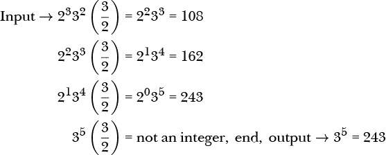

或者，追踪状态：2³3² → 2²3³ → 2¹3⁴ → 2⁰3⁵ = 3⁵。

跟踪状态的变化，尤其是在写出状态的质因数分解时，可以显示 FRACTRAN 在做什么。加法程序是一个单一指令：3/2\. 每次状态乘以 3/2 时，分母中的 2 会递减 v2，分子中的 3 会递增 v3\. 这是一个通用规则：分母是门控器，它们决定分数是否“触发”。如果当前整数包含每个质因数的因子，并且至少达到因数指定的幂次，那么分母将被完全消除，结果将是一个新的整数。这就是所谓的分数“触发”。当分数触发时，它还会递减寄存器值。而分子则会递增寄存器值，因为它们乘以状态整数。FRACTRAN 程序是应用于寄存器机状态的一系列操作。

对于加法，每次将状态乘以 3/2 时，都会使 v3 增加并使 v2 减少，直到 v2 = 0，使状态不再能被 2 整除。根据处理规则，状态应该乘以列表中的下一个分数；然而，列表中没有下一个分数，所以程序终止并输出其状态。

它足够聪明，能够意识到，当一个整数具有形式 2^(*a*)3^(*b*) 时，通过反复乘以 3/2，最终会得到 3^(*a*+*b*)，从而将 *a* 和 *b* 相加，但意识到这是一个通用的计算形式是非常聪明的。我们将探索其他 FRACTRAN 程序，但在此之前，注意到 3/2 并不是 FRACTRAN 中唯一的加法程序——2/3 也能起作用。与递减 v2 和递增 v3 不同，2/3 递减 v3 并递增 v2，将和保存在 v2 中。我们来看看这个是否成立。

```
> python3 FRACTRAN.py add2.frac 72 1
48
32
```

文件*add2.frac*包含`2/3`。输入为之前的 2³3² = 72。状态转换如下：

2³3² = 72 → 2⁴3¹ = 48 → 2⁵3⁰ = 32 → 结束 → 2⁵ = 32

证明和显示和的结果在 v2 中。

让我们确保跟随 FRACTRAN 如何操作状态。这些示例不是完整的程序，但它们展示了分数如何作用于状态。例如，参见方程 8.1 到 8.5。

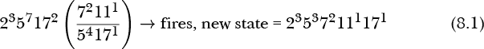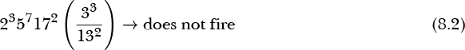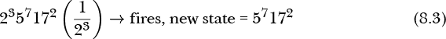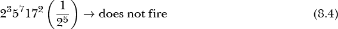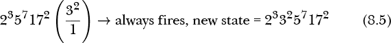

方程 8.1 被触发，因为分母包含 v5 和 v17，而这两个值也存在于状态中。注意，当分数被触发时会发生几件事：v5 减少 4，v17 减少 1，v7 增加 2（从 0 开始），v11 增加 1。因此，新状态是 v2 = 3, v5 = 3, v7 = 2, v11 = 1, v17 = 1。

对于方程 8.2，状态中没有 13 的因子（v13 = 0），因此将状态与分数相乘的结果不是整数。因此，分数不会触发，FRACTRAN 继续执行列表中的下一个分数。

方程 8.3 被触发，并将 v2 设置为 0，而不改变 v5 或 v17。

方程 8.4 不会触发，因为即使 v2 = 3，试图从其状态中减去 5 会使 v2 为负，这在 FRACTRAN 中是不允许的。FRACTRAN 的规则通过要求状态与分数相乘的结果必须是整数来考虑这一点。分数的分母必须被状态的质因子完全抵消。

加法示例操作了 v2 和 v3。这些通常被使用，因为它们是最小的质数，但并不意味着一定要使用它们。任何两个质数都可以。例如，8,675,309 和 8,675,311 都是质数。为了证明它们同样有效，可以创建 *add3.frac*，其中包含：

```
8675311/8675309
```

然后像之前一样使用 v8675309 和 v8675311 来设置初始状态，添加 3 和 2：

8675309³8675311² = 49138847138949979077348022181175509

运行它以获得

```
> ./FRACTRAN add3.frac 49138847138949979077348022181175509 0
49138881124269787781458189243397551
```

这是 8675311⁵。

```
> python3
>>> 8675311**5
49138881124269787781458189243397551
```

这再次证明了 3 + 2 = 5，并且任何一对 FRACTRAN 寄存器都有效。

### **更多 FRACTRAN 示例**

让我们看看更多的 FRACTRAN 示例。具体来说，我们来进行减法、两个值的最大值、复制寄存器和乘法的操作。最后，我们将探索 Conway 的素数游戏（PRIMEGAME）和 Collatz 猜想。

#### ***减法***

在 FRACTRAN 中，加法是一个单一的分数，结果显示减法也是如此（参见 *sub.frac*）。

```
;  Input:  (2**a)(3**b)
;  Output: 2**(a-b)
;
1/6
```

让我们进行一个测试，计算 17 *–* 4 = 13\. 输入为 2¹⁷3⁴ = 10,616,832，过程中间值对应的状态为：

2¹⁶3³ → 2¹⁵3² → 2¹⁴3¹ → 2¹³

```
> python3 FRACTRAN.py sub.frac 10616832 1
1769472
294912
49152
8192
```

分数 1/6 = 1/(2¹3¹)，因此每次乘法都会使 v2 和 v3 都减少 1。

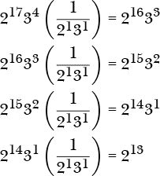

它会同时减少 v2 和 v3 直到 v3 = 0，且乘以 1/6 不再产生整数，导致程序停止。根据假设，输入是 2*^a*3*^b* 的形式，*a* > *b*，因此不断减少 v2 和 v3，直到 v3 为 0，必然会剩下 v2 的差值。如果 *b* > *a*，*sub.frac* 仍然有效，但差值会在 v3 中，而不是 v2 中。

#### ***两个整数的最大值***

FRACTRAN 通过单一分数进行加法和减法，但要进行更多操作则需要额外的分数。文件 *max.frac* 包含

```
;  Input:  (2**a)(3**b)
;  Output: 5**max(a b)
;
5/6 5/2 5/3
```

这是我们第一个使用多个分数的 FRACTRAN 程序。其声明是 *max.frac* 找到两个整数 *a* 和 *b* 中的最大值。输入状态看起来很熟悉：寄存器 v2 = *a*，v3 = *b*，程序结束时 v5 保存较大的那个整数。我们来试试看。

```
> ./FRACTRAN max.frac 3359232 1
2799360
2332800
1944000
1620000
1350000
1125000
937500
781250
1953125
```

*列表 8-3：寻找两个整数的最大值*

输入状态是 2⁹3⁸ = 3,359,232，输出状态是 5⁹ = 1,953,125，这个结果是正确的，因为 9 > 8。我们一步步跟踪这个状态变化。

2⁹3⁸ → 2⁸3⁷5¹ → 2⁷3⁶5² → 2⁶3⁵5³ → 2⁵3⁴5⁴ →

→ 2⁴3³5⁵ → 2³3²5⁶ → 2²3¹5⁷ → 2¹3⁰5⁸ → 5⁹

每个状态是列表 8-3 中所示整数序列的质因数分解。

状态序列向我们展示了程序的进展，但由于我们有多个分数，它并没有完全显示发生了什么。因此，让我们跟踪程序的实际执行。

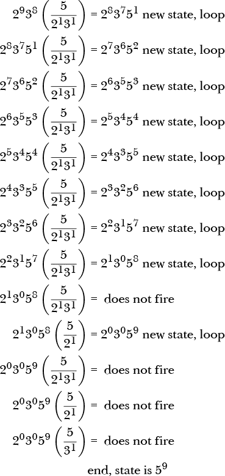

注意，5/6 被写作 5/(2¹3¹)，以明确表示当 v2 和 v3 都大于 0 时，5/6 会同时减少这两个寄存器的值，并且 0 次方用于强调某个寄存器的值为 0。

从步骤序列中，我们可以看到 5/6 开始一个循环，递减 v2 和 v3，直到它们都大于 0。同时，循环递增 v5。一旦 v2 或 v3 为 0，5/6 就不再触发，因此会测试下一个分数 5/2。在这种情况下，v3 = 0 且 v2 > 0，于是 5/2 触发，递增 v5 并递减 v2。然后，重要的是，程序会在状态发生变化后 *从头开始* 循环，因此 5/6 和 5/2 会再次被测试。由于 v3 为 0，5/6 不会触发。此外，v2 现在为 0，因此 5/2 也不会触发。接下来是 5/3，但 v3 已经为 0，因此 5/3 不会触发。没有更多的分数，因此程序在 v2 = 0、v3 = 0 和 v5 = 9 时结束，正如该情况下应有的那样。如果程序以 v2=8 和 v3=9 运行，那么在 5/6 停止触发后，5/2 不会触发，但 5/3 会将 v3 计数至 0，同时继续递增 v5。

让我们以更常见的方式编写 *max.frac*。Listing 8-4 展示了使用寄存器名称实现 *max.frac* 算法的 Python 代码（见 *max.py*）。

```
while not ((v2 == 0) and (v3 == 0)):
    if (v2>0) and (v3>0):
        v2 = v2 - 1 
        v3 = v3 - 1 
        v5 = v5 + 1 
        continue
    if (v2>0) and (v3==0):
        v2 = v2 - 1 
        v5 = v5 + 1 
        continue
    if (v2==0) and (v3>0):
        v3 = v3 - 1 
        v5 = v5 + 1 
        continue
```

*Listing 8-4: Python 中的 FRACTRAN 最大程序*

外层的 `while` 循环会一直执行，直到 v2 和 v3 都为 0。这相当于每当状态变化时，都会从头开始重新扫描分数。第一个 `if` 像 5/6 一样循环，直到 v2 和 v3 都大于 0。注意，由于 `continue`，后续的 `if` 语句在 v2 或 v3 至少有一个为 0 之前不会被考虑。

第二个 `if` 像 5/2 一样工作。它在 v3 为 0 且 v2 不为 0 时循环。此处的 `continue` 会重新启动外层的 `while` 循环，这意味着第一个 `if` 会再次被评估；然而，由于第二个 `if` 必须在 v3 为 0 时触发，因此第一个 `if` 不会执行。

最后，如果 v2 首先被第一个 `if` 递减为 0，那么最后一个 `if` 会触发，继续递减 v3 直到 0。注意，每当 `if` 语句触发时，v5 都会递增。

第一个 `if` 同时递减 v2 和 v3，同时递增 v5。这会移除 v2 和 v3 之间的共同值。接下来的两个 `if` 语句用于清理。它们中的一个会触发，直到尚未为 0 的寄存器（v2 或 v3）变为 0。由于无论哪个 `if` 触发，v5 总是会递增，因此 v5 最终会包含 v2 或 v3 中较大的那个。还要注意，程序是破坏性的；v2 和 v3 都会被丢失。

#### ***复制寄存器***

FRACTRAN 分数在分母的所有素因子（至少是分母中的指数）的素因子都出现在当前状态时才会触发。换句话说，分数的分母对应的寄存器的值必须至少与分母素因子的指数一样大。此外，触发操作会导致寄存器的值递减。这正是 3/2 在 *add.frac* 中的运作方式。

因此，要将寄存器 v2 的值移到 v7，例如，我们需要一个分数，7/2。这是因为每次触发时，v2 会递减，v7 会递增，直到 v2 为 0。现在，v2 的值已经在 v7 中，并且不再在 v2 中。如果我们想将 v2 中的值复制到 v7 同时保留在 v2 中怎么办？学习如何在 FRACTRAN 中做到这一点将帮助我们理解下一个例子——乘法。

我们的寄存器复制代码基于 Chris Lomont 的博客中的一个示例（请参阅 *[`lomont.org/posts/2017/fractran/`](http://lomont.org/posts/2017/fractran/)*）。在这个示例中，他不仅详细描述了各种 FRACTRAN 程序，还呈现了用 FRACTRAN 编写的 FRACTRAN 解释器。一定要看一看。

不得不递减我们的源寄存器，因为这是触发分数的唯一方法。根据 Chris 的说法，诀窍是将寄存器的值移到 *两个* 其他寄存器：所需的目标寄存器和一个辅助寄存器。然后，当移动完成时，将辅助寄存器的值复制回源寄存器。

Listing 8-5 显示了 *copy.frac*，它将 v2 的内容复制到 v3。

```
;  Input: 2^a 7
;  Output: 2^a 3^a
;
165/14 7/11 13/7 34/65 13/17 1/13
```

*Listing 8-5: 复制 v2 到 v3*

我们的攻击计划是定义每个寄存器的作用，重新显示代码，使用质因数，并最终通过步骤将 v2 = 3 复制到 v3。

要将 v2 复制到 v3，我们显然需要至少这两个寄存器。源寄存器是 v2，目标寄存器是 v3。我们将使用 v5 作为 v2 的第二份副本。复制算法如下：

1.  递减 v2；递增 v3 和 v5。

1.  重复步骤 1，直到 v2 为 0。

1.  递减 v5；递增 v2。

1.  重复步骤 3，直到 v5 为 0。

我们需要两个循环，一个循环在 v2 次数内递增 v3 和 v5，另一个循环在 v5 次数内递增 v2。FRACTRAN 总是从第一个分数开始扫描，所以循环是通过标志触发代码的下一个扫描来实现的。两个循环意味着我们需要两个附加的寄存器作为标志。然而，要触发一个分数，我们必须始终递减至少一个寄存器，因此使用一个寄存器来执行循环会破坏标志值。需要两个寄存器—一个用于触发循环，另一个在递减后恢复标志。我们将使用 v7 和 v11 作为第一个循环的标志，寄存器 v13 和 v17 将处理第二个循环。

我们现在有了寄存器。让我们再次回顾一下代码，但这次使用带标签和注释的质因数。

| **标签** | **分数** | **注释** |
| --- | --- | --- |
| A | 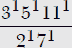 | 递增 v3，v5；递减 v2，v7 |
| B |  | 重置 v7 |
| C | 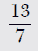 | 清除 v7；设置 v13 |
| D | 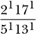 | Inc v2；Dec v5 |
| E | 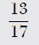 | 重置 v13 |
| F | 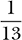 | 清除 v13 |

让我们通过代码来走一遍。我们将初始状态设置为 2³7 = 56，以设置 v2 = 3 和 v7，作为第一个循环的标志。程序接下来这样运行：

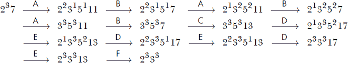

这些数字表示每个分数触发后的状态。箭头上方的标签显示了哪个分数触发了。循环结构很明显：分数 A 和 B 各重复三次。这会递减 v2 并递增 v3 和 v5。然后分数 C 触发，清除 v7 并设置 v13。这样就启动了第二个循环。第二个循环运行三次，分数 D 和 E 触发，递减 v5 并递增 v2，从而恢复其初始值。最后，分数 F 触发，清除 v13。之后，没有其他分数触发，程序以 v2 = v3 = 3 结束，达到了预期的结果。

让我们再仔细看看配对的标志。程序开始时设置了 v7。分数 A 触发，因为 v2 和 v7 都大于 0。寄存器 v2 和 v7 一起递减。分数 A 的分子递增 v3 和 v5，并设置 v11。为了继续循环，我们必须重新设置 v7。这就是分数 B 的作用：当 v11 被设置（>0）时触发，并重置 v7。循环继续执行，分数 A 再次触发，因为 v2 和 v7 都大于 0，也就是说，状态中包含 2 和 7 的因子。当 v2 耗尽时，v3 和 v5 都被设置为 v2 最初的值。然后，分数 C 触发，清除 v7 并设置 v13，开始第二个循环，使用分数 D 和 E 将 v5 移回 v2。为了在没有设置标志的情况下结束程序，分数 F 清除 v13。

现在，让我们看看如何使用这个双重循环结构来实现乘法。

#### ***乘法***

两个整数的乘法是重复加法。要找到 *a* × *b* 的积，我们可以将 *a* 加到自身 *b* 次，或者将 *b* 加到自身 *a* 次。这很可能是使用“*times*”（次）这个词来表示乘法的来源。前面给出的复制示例展示了如何使用标志来设置独立的循环，并且在保持源寄存器值的同时将寄存器递增指定次数。让我们结合重复加法和复制来实现乘法。

具体来说，我们需要一个 FRACTRAN 程序，它接受一个输入状态 2^(*a*)3^(*b*)，并通过将 v2 加到 v5 上 v3 次来生成最终状态 5^(*ab*)。我们将实现以下算法：

1.  当 v2 > 0 时，递增 v5 和 v7。

1.  当 v7 > 0 时，递增 v2。

1.  当 v3 > 0 时，从第 1 步开始重复。

第一个循环是第 1 步，它递减 v2 并递增 v5 和 v7。寄存器 v5 保存积，因此我们只需递增它。寄存器 v7 用来保存 v2，因为 v2 在加入 v5 时被耗尽。第 2 步通过将 v7 的值移回 v2 来恢复 v2，就像我们在*copy.frac*中做的那样。第 1 步和第 2 步会重复，直到 v3 为 0，从而将 v2 加到 v5 上 v3 次。

有三个循环，但我们可以将步骤 2 和 3 合并为一个循环。在步骤 1 中，我们需要一对寄存器作为标志；我们将使用 v11 和 v13。该程序的初始版本为另一个循环添加了 v17，但只有在乘法后面有代码时才需要使用它。

列表 8-6 显示了最终结果（参见 *mult.frac*）。

```
;  Input:  2^a 3^b
;  Output: 5^{ab}
;

455/22 11/13 1/11 2/7 11/3 1/2
```

*列表 8-6: 通过重复加法进行乘法*

让我们像之前一样给这些分数标上 A 到 F 的标签。这样做会得到：

| **标签** | **分数** | **注释** |
| --- | --- | --- |
| A | 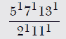 | 增加 v5, v7；设置 v13；递减 v2；清除 v11 |
| B | 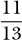 | 重置 v11 |
| C |  | 清除 v11 |
| D | 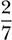 | 增加 v2；递减 v7 |
| E | 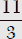 | 递减 v3；设置 v11 |
| F | 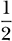 | 递减 v2 |

使用此表，我们可以通过追踪 3 × 2 = 6 来演示。输入状态为 2³3² = 72，预期输出状态为 5⁶ = 15625。首先，让我们看看 *mult.frac* 实际上是如何工作的：

```
> ./FRACTRAN mult.frac 72 0
15625
```

输出如预期那样。现在，让我们跟踪状态的演变：

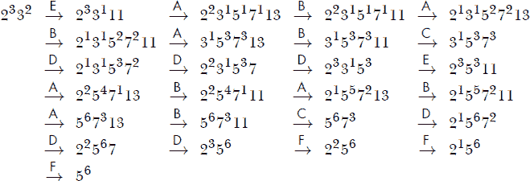

第一个被触发的分数是 E，它递减 v3 并设置 v11 以启动加 v2 到 v5 的循环。加法循环，分数 A 和 B，会重复三次以递增 v5 和 v7。经过第三次迭代后，状态中不再有 2 的因子（v2 = 0），因此接下来触发分数 C 来清除 v11 并开始外层循环。

外层循环的第一部分使用 D 来递减 v7 并递增 v2，从而恢复 v2 到其原始值。经过第三次循环后，v7 为 0，7 不再是状态的因子，因此分数 E 被触发，递减 v3 并设置 v11，将 v2 再次加到 v5 中。

分数 A 和 B 的加法循环再运行三次。此时，我们在 v5 中得到了答案，v2 和 v3 都为 0，但分数 C 会再次触发，因为 v7 不是 0。分数 C 会触发三次，将 v7 设为 0，v2 = 3。但此时 v3 已经是 0，因此 v11 永远不会被设置。寄存器 v7 现在也为 0，状态仅为 v2 = 3 和 v5 = 6。因此，直到 F 被触发，F 会触发三次将 v2 递减为 0。最后，状态只有 v5 = 6，且没有任何分数的分母中包含 5，因此没有分数被触发，程序结束。列表 8-6 进行乘法运算，但在计算答案之后需要执行许多额外的操作来清理。

现在让我们换个思路，探讨康威最早展示的第一个 FRACTRAN 程序：PRIMEGAME。

#### ***康威的 PRIMEGAME***

当康威首次展示 PRIMEGAME 时，他通过编写 列表 8-7 中的分数来说明，不仅程序生成的每一个二的幂都具有素数指数，而且素数的顺序是有规律的。让我们在这一节中探讨他是什么意思。

```
;  Input:  2
;

17/91 78/85 19/51 23/38 29/33 77/29 95/23 77/19 1/17 
11/13 13/11 15/14 15/2 55/1
```

*列表 8-7: 康威的 PRIMEGAME*

与上述复制和乘法示例不同，我们不会逐步解析清单 8-7。Conway 在互联网上的讲座中有详细介绍（例如，见*[`www.youtube.com/watch?v=548BH-YFT1E/`](https://www.youtube.com/watch?v=548BH-YFT1E/)*）。相反，我们将捕获清单 8-7 的输出，实证验证 Conway 的说法是否正确。我留给有兴趣的读者作为练习，去研究清单 8-7 的操作过程。

质数程序永不停止，因此我们需要告诉解释器显示每个新状态。如果你使用初始状态 2 运行*primes.frac*

```
> python3 FRACTRAN.py primes.frac 2 1
```

你的屏幕将立即填满大数字。其中一些数字是 2 的幂。这些就是我们想要显示的数字。我们本可以修改*FRACTRAN.py*，让它只显示 2 的幂，但为什么要改变解释器的代码呢，既然我们可以将*primes.frac*的输出传递给第二个程序的输入，后者将检查输出是否为 2 的幂，如果是，则显示出来？

脚本*power_of_two.py*实现了我们想要的功能。它使用`input`读取 FRACTRAN 显示的数字，并检查该数字是否是 2 的幂。清单 8-8 包含了代码。

```
➊ def isPowerOfTwo(d):
       s = "{0:b}".format(d)
       n = s.count("1")
       p = len(s)-1
       return (n == 1), p ➋ while (True):
       try:
        ➌ d = int(input())
       except:
           exit(0)
       ok, p = isPowerOfTwo(d)
       if (ok):
           print("2**%d = %d" % (p, 2**p))
```

*清单 8-8：检查 2 的幂的 Python 脚本*

该脚本接受来自 FRACTRAN 的输入作为整数➌，将其传递给`isPowerOfTwo`，如果输入（`d`）是 2 的幂，则返回`True`，然后打印该值及其指数（`p`）。由于`while`循环➋，该过程会无限重复。

函数`isPowerOfTwo` ➊必须检查其参数是否为 2 的幂。我们可以在这里调用一个以 2 为底的对数函数，但很快就会遇到一些整数太大，无法适应任何期望浮动参数的函数。如果一个整数是 2 的幂，那么它的二进制表示中只有一个 1。所以`d`会被转换成二进制并作为字符串存储在`s`中。然后，我们通过使用`count`计算 1 的数量来设置`n`。如果`d`是 2 的幂，指数是`d`中数字的数量减一（`p`）。最后，任何 2 的幂都会连同其指数一起显示。

为了将 FRACTRAN 的输出与清单 8-8 所期望的输入链接起来，我们使用 Unix 管道字符`|`：

```
> python3 FRACTRAN.py primes.frac 2 1 | python3 power_of_two.py
```

它将 FRACTRAN 的输出传递给*power_of_two.py*的输入，以显示 2 的幂。例如，输出如下所示：

```
2**2 = 4
2**3 = 8
2**5 = 32
2**7 = 128
2**11 = 2048
2**13 = 8192
2**17 = 131072
2**19 = 524288
2**23 = 8388608
2**29 = 536870912
2**31 = 2147483648
2**37 = 137438953472
2**41 = 2199023255552
2**43 = 8796093022208
2**47 = 140737488355328
2**53 = 9007199254740992
```

在这里，指数都是质数，而且更重要的是，这些质数按正确的顺序排列，没有任何间隙，就像 Conway 所承诺的那样。随着质数增大，新质数生成的速度会变慢。例如，文件*powers_of_two.txt*包含了让代码过夜运行时生成的输出。找到的最大质数是 953。

Devin Kilminster 制作了一个九分数版本的 PRIMEGAME，该版本将质数作为 10 的幂而不是 2 的幂输出。见清单 8-9（*prime10.frac*）。

```
;  Input:  10
;
3/11 847/45 143/6 7/3 10/91 3/7 36/325 1/2 36/5
```

*清单 8-9：Kilminster 的质数*

跟我们上面为 Conway 的游戏所做的那样，使用 *power_of_ten.py* 运行 *prime10.frac*。

```
> ./FRACTRAN prime10.frac 10 1 | python3 power_of_ten.py
```

使用 10 的幂生成的输出序列会按顺序生成素数。

我们可能会想知道哪个素数生成器更快。我修改了 *power_of* *_two.py* 和 *power_of_ten.py*，使它们在生成第 100 个素数 541 后停止，并使用 Racket 版本的 FRACTRAN 解释器测量了每个程序所用的时间。

| 程序 | 运行时间（秒） |
| --- | --- |
| Conway | 3317 |
| Kilminster | 783 |

Kilminster 的程序不仅比 Conway 的原始 PRIMEGAME 更短，而且速度也快得多。

我们的下一个例子会生成一个整数的科拉茨序列。别担心，我会解释这是什么意思。

#### ***科拉茨猜想***

洛塔尔·科拉茨是德国数学家。1937 年，他推测，对于任何初始整数 *x*[0] = *n*，以下序列总会以 1 结束（见公式 8.6）：


例如，*n* = 10 的序列是

10 → 5 → 16 → 8 → 4 → 2 → 1

一旦输出为 4，序列 4 → 2 → 1 将永远重复，因为 3(1) + 1 = 4。

至今，没有人成功证明科拉茨猜想，所有的经验测试都最终以 1 结束。FRACTRAN 和科拉茨猜想之间有着深刻的联系，我们将在下面的讨论中深入探讨。现在，让我们运行 Conway 的 FRACTRAN 程序，生成任何整数 *n* 的科拉茨序列。（很可能是 Conway 写了这段代码，但至今没有确凿的证据。）代码在 *collatz.frac* 中，见清单 8-10。

```
165/14 11/63 38/21 13/7 34/325 1/13 184/95 1/19 
7/11 13/17 19/23 1575/4
```

*清单 8-10：生成科拉茨序列的 FRACTRAN 代码*

输入是 2^(*n*)，最终输出是 2¹。所有是 2 的幂的状态表示科拉茨序列中的一个数字。所以，我们必须像上面对 PRIMEGAME 所做的那样，使用 *power_of_two.py* 过滤输出。让我们尝试几次运行，从 *n* = 128 开始。

```
> ./FRACTRAN collatz.frac 340282366920938463463374607431768211456 1 
   | python3 power_of_two.py
2**64 = 18446744073709551616
2**32 = 4294967296
2**16 = 65536
2**8 = 256
2**4 = 16
2**2 = 4
2**1 = 2
```

起始状态很大，为 2¹²⁸。科拉茨序列在七步后结束。并不是所有序列都这么短。例如，从 *n* = 128 变为 *n* = 129 会生成

```
 388,  194,   97,  292,  146,   73,  220,  110,   55,  166,
  83,  250,  125,  376,  188,   94,   47,  142,   71,  214, 
 107,  322,  161,  484,  242,  121,  364,  182,   91,  274, 
 137,  412,  206,  103,  310,  155,  466,  233,  700,  350, 
 175,  526,  263,  790,  395, 1186,  593, 1780,  890,  445, 
1336,  668,  334,  167,  502,  251,  754,  377, 1132,  566, 
 283,  850,  425, 1276,  638,  319,  958,  479, 1438,  719, 
2158, 1079, 3238, 1619, 4858, 2429, 7288, 3644, 1822,  911, 
2734, 1367, 4102, 2051, 6154, 3077, 9232, 4616, 2308, 1154, 
 577, 1732,  866,  433, 1300,  650,  325,  976,  488,  244, 
 122,   61,  184,   92,   46,   23,   70,   35,  106,   53, 
 160,   80,   40,   20,   10,    5,   16,    8,    4,    2,   1
```

总共 121 步。与 PRIMEGAME 一样，解析 *collatz.frac* 中的算法留给有抱负的读者作为练习。

请注意，129 的序列中包含的值最大达 9,232。这意味着该状态包含了一个 2⁹²³² 的因子，这是一个有 2,780 位的数字。虽然 *collatz.frac* 对任何整数都能工作，但其中间值会变得非常大。你可以尝试使用 *collatz.frac* 或者，如果你不耐烦的话，使用更快的 Python 版本 *collatz.py*。你注意到从 *n* = 5 到 200 的每个序列中的最大值有什么有趣的地方吗？

#### ***一个 FRACTRAN 问候***

我们将以一个比实用更可爱的例子结束。不过，它做了一件有趣的事情：程序的目标不是一组特定的寄存器值，而是表示最终状态的单个整数的十进制值。代码在 *hello.frac* 中，见清单 8-11。

```
;  Input:  2³ 5¹ 7¹ 11¹ == 3080
;  Output: 72697676794432877982766833

3/2 41/5 6701021/7 9800132160937639/11
```

*清单 8-11：一个 FRACTRAN 问候*

首先，运行程序以验证它是否生成了声明的输出。

```
> ./FRACTRAN hello.frac 3080 0
72697676794432877982766833
```

接下来，将输出管道传递给 *hello.py*。

```
> ./FRACTRAN hello.frac 3080 0 | python3 hello.py
HELLO, WORLD!
```

*hello.py* 脚本是

```
d = input()
while (d != ""):
    print(chr(int(d[:2])), end="")
    d = d[2:]
print()
```

这会将 FRACTRAN 的输出作为字符串读取，将其分解为一对对数字，并输出与该对数字对应的 ASCII 字符。

让我们逐步分析 *hello.frac*。初始状态是 2³5¹7¹11¹。分数的分母也是 2、5、7 和 11。因此，初始状态会与每个分数匹配，但分数的顺序意味着它首先匹配 3/2。状态和 3/2 的乘积将 v2 减少并增加 v3，然后从头开始，再次匹配 3/2。此时 v2 = 1 且 v3 = 2。再循环一次将 v2 设置为 0，v3 设置为 3。现在状态中没有 2 的因子，因此 3/2 不会触发，FRACTRAN 移动到 41/5。此时状态是 3³5¹7¹11¹，它确实有 5 的因子，因此 v5 被递减，v41 被递增，程序继续循环。剩下的只有 7 和 11 的因子与分数匹配。首先，分母为 7 的分数匹配并触发，接着是分母为 11 的分数。

系统的最终状态是

3³41¹6701021¹9800132160937639¹ = 72697676794432877982766833

这正是我们希望它成为的样子：一串 ASCII 字符代码。

我们希望 *hello.frac* 输出与句子 `HELLO, WORLD!` 对应的整数。这决定了打印的输出。该输出的质因数分解确定了最终的寄存器及其值。包含的 *primeFactors.py* 搜索质因数，但它对于像 *hello.frac* 输出这样的大整数来说太慢了。为此，我使用了 WolframAlpha（见 *[`www.wolframalpha.com/`](https://www.wolframalpha.com/)*）。得到了质因数后，程序本身就很简单：将初始状态设置为 v2 = 3, v5 = 1, v7 = 1, 和 v11 = 1。然后，使用质因数作为分子来递增 v3、v41 等，直到达到所需次数：3、1、1 和 1。

当然，我们可以使用所需的输出状态初始化程序，并使用一个分母中没有与状态匹配的因子的分数，立即产生所需的输出，但那样会很无聊。

### **讨论**

让我们讨论 FRACTRAN 的两个方面：图灵完备性以及它与 Collatz 猜想的关系。之后，我们将以一些最终的思考作结。

#### ***FRACTRAN 是图灵完备的吗？***

FRACTRAN 是图灵完备的吗？是的，它是。FRACTRAN 具有循环结构和无限数量的寄存器，因为质数是无限的。此外，FRACTRAN 可以实现 FRACTRAN，正如 Chris Lomont 的博客文章之前所提到的那样。FRACTRAN 还是一种 Minsky 风格的寄存器机，这种机器已经被证明是图灵完备的，因此 FRACTRAN 也是图灵完备的。

Conway 本人在他的 FRACTRAN 描述中包含了一个通用 FRACTRAN 程序：POLYGAME。请参阅《FRACTRAN：一种简单的通用算术编程语言》一文，载于《Open Problems in Communication and Computation》（Springer，1987 年）。

POLYGAME 是一个 FRACTRAN 程序，可以在给定适当的“目录号”（Conway 所称）时计算任何函数。从此我们将使用英国拼写。以下是 POLYGAME：

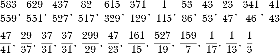

输入是*c*2^(2^(*n*))，其中*n*是参数，*c*是目录号。输出是 2^(2^m)，以实现*f**c* = *m*。例如，增量函数*n* → *n* + 1 的目录号是 2,268,945。因此，要增加 4，FRACTRAN 的输入为

(2,268,945)2^(2⁴) = 148,697,579,520

以产生输出

2^(2⁵) = 4,294,967,296

这正是我们运行 POLYGAME 所得到的结果。

```
> ./FRACTRAN polygame.frac 148697579520 0
4294967296
```

POLYGAME 可以实现*所有*的函数，只要给定正确的*c*。另一个例子是*c* = 255，即恒等函数：*n* → *n*。Conway 给出的最有趣的例子是*c*[*π*]。这是一个整数，但计算它的过程将是极为困难的。

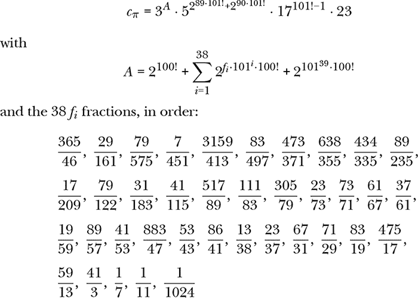

是的，这个数是 5 的平方再乘以 101 的阶乘的幂。鉴于*c*[*π*]的庞大规模，我们就相信 Conway 的话，认为*c*[*π*]是一个函数的目录号，*π*(*n*)返回*π*的第*n*位数字。

#### ***FRACTRAN 和 Collatz 猜想***

方程 8.6 定义了一个整数*n*的 Collatz 序列。该方程描述了如何根据当前数值是偶数还是奇数来生成序列中的下一个数字。方程 8.6 的另一种表述形式见方程 8.7。

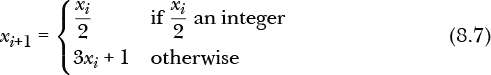

意味着*x*[*i*+1] = *x*[*i*]/2（如果*x*[*i*]/2 是整数）；否则，*x*[*i*+1] = 3*x*[*i*] + 1，这始终是一个整数。

Collatz 序列是 Conway 所称的*二分线性函数*，意味着一个可以写作如下的函数

*g*(*n*) = *g*1 *|* *g*2

通过*g*(*n*)返回* g*1 或*g*2 中先返回整数的那个，按从左到右的顺序进行评估。每个*g**i*的形式为

*g**[i]*(*n*) = *a**[i]**n* + *b**[i]*

这是一个线性函数（一条直线）。对于 Collatz 序列，*a*[1] = 1/2，*b*[1] = 0。同样，*a*[2] = 3，*b*[2] = 1。

没有理由为什么*g*(*n*)只能限于两个部分。一个*k*部分的线性函数是

*g*(*n*) = *g*1 *|* *g*2 *|* *g*3 *|* … *|* *g**[k]*(*n*)

Conway 将具有*g**i* = *a*[*i*]*n* + *b*[*i*]形式的*k*部分函数称为 Collatzian 游戏。评估*g*(*n*)的规则是首先计算*g*1，然后是*g*2，依此类推，直到其中一个返回整数。如果它们都不返回整数，或者返回的整数是某个指定值（如 1），则停止。

这个规则听起来很熟悉。如果我们将所有的*b*[*i*]设为 0，将所有的*a*[*i*]设为有理数，那么*g*(*n*)就是一个 FRACTRAN 程序。因此，FRACTRAN 程序是 Collatzian 游戏。然而，注意 Collatz 猜想不是一个 FRACTRAN 程序，因为*b*[2] = 1。

哥德尔不完备定理指出，算术包含一些真实的命题，但不能通过算术公理加以证明。艾伦·图灵将这一概念转化为*停机问题*，该问题表明，无法找到一个算法，能够在所有情况下正确决定一个程序（图灵机）在有限输入下是否最终会停止或永远运行。用来描述这些情况的术语是*不可判定的*。不可判定的问题已经被*证明*是这样的；不存在一个能够在所有情况下正确判断的算法。

FRACTRAN 程序是不可判定的，且 FRACTRAN 程序是一种 Collatzian 游戏。因此，存在一些不可判定的 Collatzian 游戏，对于这些游戏，无法证明对于所有输入*n*，游戏是否按照预期结束。这个事实并没有解决 Collatz 猜想的问题，因为猜想适用于一种不是 FRACTRAN 程序的 Collatzian 游戏。然而，展示不可判定的 Collatzian 游戏仍然是一个重要的结果。也许 Collatz 猜想本身也是不可判定的。

#### ***FRACTRAN 的最终思考***

初次接触时，FRACTRAN 可能看起来像是一个可爱但无用的编程语言，就像第七章中 ABC 的原始形式一样。使用哥德尔编号来保存程序状态的技巧使 FRACTRAN 变得更加有趣，但它仍然只是另一种编程语言，尽管现在是一个聪明的语言。

FRACTRAN 的普遍性增加了它的智力吸引力。然而，FRACTRAN 将哥德尔不完备定理与图灵停机问题和康威的 Collatzian 游戏联系起来的这一点非常聪明。FRACTRAN 使其与我们将要探讨的其他语言区分开来。我希望它能让你思考编程、计算、可知与不可知的问题，以及“知道无法知道”到底意味着什么。

### **总结**

在这一章中，我们探讨了 FRACTRAN，一种乍一看似乎只是一个聪明游戏的编程语言。在 Racket 和 Python 中实现该语言后，我们对其工作原理进行了测试，并努力理解它是如何运作的。接下来，我们探索了多个 FRACTRAN 程序示例，以帮助建立对 FRACTRAN 编程内容的直觉。在此过程中，我们了解了 Collatz 猜想，它本身也是一个有趣的智力练习。

我们通过讨论 FRACTRAN、哥德尔不完备定理、图灵停机问题和 Collatzian 游戏之间的联系结束了本章，所有这些都提供了丰富的思考素材。

FRACTRAN 迫使我们从数学的角度思考。现在，让我们用 Piet 来调剂一下，这是一种迫使我们从视觉角度思考的编程语言。
