# 第九章：PIET


Piet（发音为“皮特”）是一种视觉化的异构编程语言（esolang）。它是异构编程语言的完美范例：一种创新的编码方式。Piet 程序是可执行的图像。该语言以荷兰艺术家 Piet Mondrian（1872–1944）的名字命名，因为 Piet 程序通常看起来像他抽象的矩形画作。在 Piet 中，艺术与代码相遇。人们谈论源代码的优雅，而 Piet 将这个概念提升到了一个全新的层次。

Piet 是一种基于堆栈的语言，具有最小的指令集。在 Piet 中，相同颜色的块表示正整数，从一种颜色到另一种颜色的转换指定执行的指令。Piet 程序是二维的，代码可以朝任意方向运行：左、右、上或下。

在本章中，我们首先将介绍这门语言，了解如何将一幅画转换成代码。接下来，我们将进行手指画创作，弄得一团糟，同时也会使用一些示例程序。过程中，我们将学习如何使用解释器及其可视化跟踪功能。

之后，我们将探索`npiet`可视化编辑器，通过将 Mondrian 的经典画作之一转换成代码，来创造一个简单的致敬作品。

Piet 的流行催生了许多实现、相关工具，甚至还有汇编器，可以将更传统的基于文本的汇编代码转化为 Piet 图形。我们将简要介绍 Piet 的生态系统，指引你找到如果你想深入了解 Piet 所需的资源。最后，像往常一样，我们将在章节末尾进行简短的讨论。

### **安装**

Piet 的创建者 David Morgan-Mar 在*[`www.dangermouse.net/esoteric/piet.html`](https://www.dangermouse.net/esoteric/piet.html)*有一个非常有用的页面。页面包括背景信息和 Piet 的操作说明。还有一系列漂亮的示例程序以及第三方工具的链接。一定要去看看。

要使用 Piet，我们需要一个解释器。我们将使用 Erik Schoenfelder 的`npiet`。它是用 C 语言编写的，足够快速，能满足我们的需求。

要安装并构建`npiet`，首先访问*[`www.bertnase.de/npiet/`](http://www.bertnase.de/npiet/)*并下载*npiet-1.3f.tar.gz*（或者任何你看到的较新版本）。该网站为 Windows 用户提供了编译好的可执行文件。下面的命令序列，如果`libgd`可用，应该（大致）适用于 macOS。

下载完*npiet-1.3f.tar.gz*后，输入以下命令：

```
> tar xzf npiet-1.3f.tar.gz
> cd npiet-1.3f/
> sudo apt-get install libgd-dev
> ./configure
> make
```

在几次警告后，*npiet-1.3f*目录中应该会有三个可执行文件：`npiet`、`npietedit`和`npiet-foogol`。第一个是解释器，第二个是一个简单的编辑器，我们将用它来创建我们的示例程序。第三个将`foogol`程序转换成 Piet。Foogol 是一种类似于 ALGOL 的语言。

你可能需要安装额外的软件包，如`groff`和`tk`。如果需要，这里有一些你可能需要的内容：

```
> sudo apt-get install groff
> sudo apt-get install tk
```

本书的 GitHub 仓库包括一个*Piet*目录，里面有示例程序。我建议将`npiet`复制到*examples*目录，或者向上一级目录，以简化执行过程。

要测试`npiet`，请尝试

```
> npiet examples/hi.png
Hi
```

如果你看到我们最喜欢的问候语，`npiet`就说明它正在正常工作。

### **理解 Piet**

Piet 不同于我们之前接触过的任何编程语言。当然，我们应该预料到，使用图片作为程序的语言会非常特殊。本节旨在理解 Piet，即 Piet 如何表示数字、程序、命令和程序流程。作为一门语言，Piet 相对简单。它只有 17 个命令，其中 4 个仅用于输入和输出。然而，Piet 中的程序流程比传统语言更复杂。

我们将从颜色开始，因为 Piet 程序完全依赖颜色。接下来我们将学习如何表示数字和程序。然后，我们将讨论命令集，以及 Piet 如何通过颜色之间的过渡来隐含命令。颜色过渡自然引导程序流程。

#### ***Piet 颜色***

一开始我们有一个问题。Piet 使用彩色图像表示程序，而这本书是以灰度印刷的。因此，参考 GitHub 上的示例至关重要。尽管如此，我们会尽量在没有颜色的情况下进行说明。例如，图 9-1 展示了 Piet 所使用的具体颜色作为灰度阴影，并附有表示颜色的 HTML 风格十六进制代码。该图的彩色版本在文件*piet_colors.png*中。没有颜色并不会阻止我们，但请注意，颜色对 Piet 及其功能至关重要。

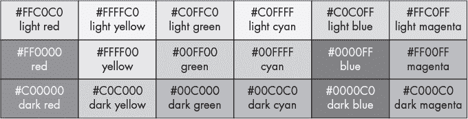

*图 9-1：Piet 颜色图*

我们的 Piet 程序只使用图 9-1 中的颜色，以及黑色(` #000000`)和白色(`#FFFFFF`)。一些解释器会将未知颜色当作白色，但我们将仅限于使用已批准的颜色。十六进制颜色代码指定了构成颜色的红、绿、蓝的混合。

#### ***表示数字***

Piet 是基于栈的，类似于 Forth。数字通过相同颜色的块表示，块中像素的数量指定了数字。因此，一个 3×5 的像素块表示 3 × 5 = 15，而一个边长为 5 像素的正方形则表示 25。请注意，块不必是矩形或正方形，只要在边缘上相连即可。一个块甚至可以包含空洞。如果这听起来很抽象，不用担心。下面我们会看到一些例子。

#### ***表示程序***

程序的每个像素都是重要的。然而，如果我们试图以像素级别查看程序，我们几乎看不出任何东西。因此，我们将以放大图像的方式呈现程序。当图像被放大时，每个像素会变成一个像素块。映射到原始像素的像素块被称为*代码块*。例如，如果图像被放大了 10 倍，每个像素就变成了一个 10×10 的方块；因此，代码块就是一个 10×10 像素的区域。

请考虑示例程序*add.png*，它在图 9-2 中以灰度显示。

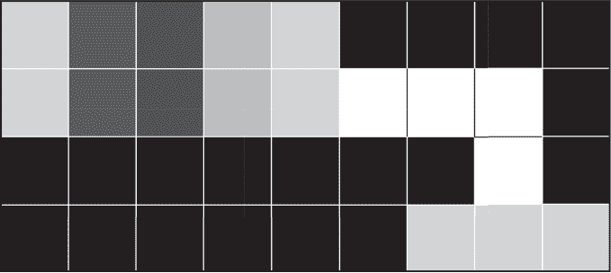

*图 9-2：加法操作，2 + 2 = 4*

原始图像宽度为 9 像素，高度为 4 像素。在图 9-2 中显示的版本被放大了 200 倍，因此每个像素变成了 200×200 像素的方块，一个 codel。对于这个例子，我添加了网格线来明确标记 codel 的边界。

排版会改变 codel 到像素的映射，但知道*add.png*的高度为 4 像素，有助于我们查看图 9-2 并理解 codel。例如，从下到上，最左列是两个黑色 codel 和两个浅红色 codel。Piet 将黑色视为墙壁，因此两个浅红色 codel 形成一个 2×1 的矩形，也就是数字 2。我们将在下面详细讲解*add.png*。目前，请只关注块、像素和 codel 之间的映射。

#### ***Piet 命令***

再次查看图 9-1。从左上角开始，向右移动时，颜色从红色过渡到黄色，再到绿色、青色、蓝色，然后从右边绕回到红色。在图 9-1 的行中，我们看到色调（即颜色）的变化，而亮度保持不变。每次沿着图 9-1 的顶行移动时，都会将一个 C0[16]更改为 FF[16]或反之。同样，对于中间行，值从 00[16]变为 FF[16]，对于底行，从 00[16]变为 C0[16]。

在列之间上下移动会改变颜色的亮度，同时保持色调不变。从上到中，C0[16]变为 00[16]，而从中到下，FF[16]变为 C0[16]。与行一样，从列中的最暗颜色移动到最亮颜色也是一个单独的过渡步骤。这一切意味着沿着颜色表的移动是循环的。

为什么如此关注色调和亮度？这是因为 Piet 并没有唯一地表示命令。没有一个单一的颜色表示“推入一个数字”或“加法”。相反，指定命令的是在区域之间采取的色调或亮度步骤数。颜色本身并不重要。颜色表是循环的，因此可以从任何初始颜色移动到任何结束颜色。这意味着，任何命令都可以从任何起始颜色指定。

表 9-1 列出了 Piet 的命令，这些命令是根据色调和亮度变化来执行的。这里，行代表色调的变化步数，列代表亮度的类似变化。

**表 9-1：** 由色调（行）和亮度（列）之间的过渡指定的 Piet 命令

|  | **0** | **1** | **2** |
| --- | --- | --- | --- |
| **0** | none | push | pop |
| **1** | + | *–* | × |
| **2** | ÷ | mod | not |
| **3** | > | pointer | switch |
| **4** | dup | roll | inN |
| **5** | inC | outN | outC |

例如，要将一个数字压入栈中，块之间的过渡必须涉及亮度变化一个单位，但色调保持不变。因此，从图 9-1 中的某一行到下方的行，并保持列不变的块过渡结果会执行 `push` 命令。压入栈中的数字是刚刚退出的块中 codel（像素）的数量。回想一下，任何颜色从最暗到最亮的过渡也是亮度变化一个单位。

同样，要执行 `outC` 指令将栈顶项作为 ASCII 字符输出，块之间的过渡必须使亮度变化两个单位，色调变化五个单位。例如，从一个浅红色块移动到一个深品红色块将执行 `outC`。同样，从一个青色块移动到一个浅绿色块也会执行 `outC`。使用图 9-1 计算所需的色调和亮度变化，来确认从青色块到浅绿色块的移动确实会指定一个 `outC` 命令。

在表 9-1 中，许多命令在我们研究 Forth 的第四章之后对我们来说是熟悉的。尤其是数学运算符、大于号和 `dup`，它用于复制栈顶项。此外，`push` 在前面的段落中已有描述。最后，`pop` 是直观的：丢弃栈顶项（在 Forth 中这是 `DROP`）。

使用 Forth 风格的栈效果注释有助于阐明这一组 Piet 命令。

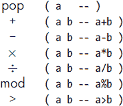

输入和输出命令 `inN`、`inC`、`outN` 和 `outC` 也类似地直接。`N` 版本接受一个数字或输出一个数字。`C` 版本接受一个字符或将栈顶项输出为 ASCII 字符。例如，如果栈顶项是 65（大写字母 *A* 的 ASCII 码），`outC` 将输出 `A`。

剩余的指令 `not`、`pointer`、`switch` 和 `roll` 需要一些解释。其中最简单的是 `not`。在这个指令中，我们弹出栈顶项，如果该项不为 0，则将 1 压入栈中，否则将 0 压入栈中。其最终效果是切换真值，其中 0 为假，其他任何值为真，就像 C 语言中的布尔值一样。`npiet` 解释器是用 C 语言编写的，所以这种行为是自然的。

`pointer` 命令按栈顶项指定的次数顺时针旋转方向指针（DP）。`switch` 命令弹出栈顶项，并按该次数切换代码选择器（CC），忽略符号。我们将在下一节详细介绍 DP 和 CC。现在，只需知道 `pointer` 影响 DP，`switch` 影响 CC。

Piet 最复杂的命令是 `roll`，它用于通过将一定数量的项滚动给定的次数来操控栈。让我们通过一个例子来看这是什么意思。

文件 *roll32.png* 包含一个程序，将数字 1 到 5 放入栈中，并设置调用 `roll` 旋转顶部三个项目两次。视觉上，*roll32.png* 看起来是这样的：

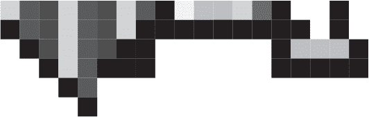

程序从左到右逐列执行，依次将 1、2、3、4 和 5 压入栈。接下来的两列依次压入 3 和 2。剩下的代码调用 `roll` 旋转顶部三个栈项两次，然后通过重复调用 `outN` 弹出栈。

在调用 `roll` 之前，栈从左到右是

`1 2 3 4 5 3 2`

对 `roll` 的调用首先弹出 2，然后是 3。2 是旋转顶部 3 个项目的次数。一次旋转会让项目顺序变为 `3 4 5` 变为 `5 3 4`。因此，两次旋转后是

`3 4 5` → `5 3 4` → `4 5 3`

最终的栈是

`1 2 4 5 3`

从右到左弹出的栈意味着 *roll32 .png* 的输出应该是 `35421`，因为没有打印空格。确实，这是输出结果，因此 `roll` 的行为符合我们的预期。

#### ***程序流程***

大多数语言中的程序流程是直接的。除非发生分支、跳转或等效操作，否则语句是按顺序执行的。现在考虑低级机器代码，程序计数器是指向下一个指令的东西。在 Piet 中，程序流程更为复杂。流程从同一颜色的一个块移动到下一个块，从左上角的块开始。流向由 *方向指针（DP）* 控制。当 Piet 程序开始时，DP 在右侧。

最初，我们可能认为只需要一个 DP；然而，有一个小问题。Piet 从一个块移动到另一个块，但为了确定下一个块，它需要知道沿着当前块的哪条边移动多远。这引入了 *代码选择器（CC）*。CC 最初位于左侧，但也可以位于右侧。谁的左或右？是 DP 的左或右。因此，当 Piet 程序开始时，DP 在右侧，CC 在左侧，这意味着下一个块是当前块的最右上角。实际上，它是块的最右端。因此，Piet 通过在当前块中尽可能向 DP 方向移动，并遵循当前 CC 的值来选择下一个块。

例如，考虑下面的图像。


程序目前在左块中，2×1 的代码块，DP 正在指向右侧。接下来应该考虑哪个块？第二列的顶部还是底部？如果 CC 在左侧，Piet 将从 2×1 块的顶部向右移动，选择右列的顶部块，也就是较暗的那个块。如果 CC 在右侧，我们则选择下方的块。

图 9-3 展示了 DP 和 CC 之间的关系，采用了两种不同的方式。

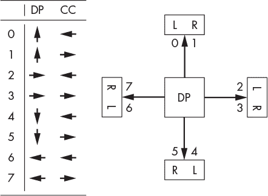

*图 9-3：方向指针（DP）和代码选择器（CC）之间的关系*

右侧的图示展示了 DP 作为箭头指向上、下、左或右，每个方向的 CC 标记为*L*或*R*。数字对应图左表格中的行。表格展示了带箭头的 DP 和 CC。两个互补的展示方式应当能够帮助理解如何使用 DP 和 CC 来控制程序流程。

Piet 根据 DP 和 CC 从一个彩色块移动到另一个彩色块，但我们还需要考虑两个特殊的颜色：黑色和白色。正如前面所述，黑色就像一堵墙或图像的边缘。当 Piet 遇到黑色或边缘时，它会开始调整 DP 和 CC，尝试找到一个出口，也就是继续程序的出路。如果找不到出口，程序将结束。具体来说，Piet 通过以下步骤在图像中移动：

1.  从当前位置开始，尽可能沿着 DP 的方向移动，直到遇到颜色变化或图像边缘。

1.  从步骤 1 中找到的位置，按照 CC 的方向尽可能向左或向右移动。这将选择下一个块的第一个代码点。

1.  如果上述步骤遇到黑色块或图像边缘，我们将 CC 从左切换到右或从右切换到左，并重复上述步骤。如果此过程失败，则 DP 顺时针旋转，CC 切换重复进行。此过程会持续进行，直到找到通向新块的路径或所有操作失败。

1.  如果所有 DP 和 CC 调整都失败，程序终止。

上述步骤处理了彩色块、黑色块和图像边缘。为了让问题更复杂，Piet 还允许白色块。白色块是无操作块，称为*no-ops*。解释器会像处理其他块一样通过白色块，但过渡并不意味着执行命令。这允许程序员在不执行命令的情况下从一个彩色块切换到另一个彩色块，正如我们下面将看到的，黑色和白色块的排列可以充当控制结构，强制执行所需的程序流程。

### **Piet 实战**

在这一部分中，我们将实际操作并处理四个示例：*add.png*、*hi.png*、*countdown.png* 和 *random.png*。第一个示例输出 2 + 2 的和；第二个示例，正如我们上面看到的，输出`Hi`；第三个是一个倒计时循环；第四个是一个简单的伪随机数生成器。

#### ***证明 2 + 2 = 4***

我们的第一个示例，*add.png*，在下面的 Forth 代码中有一个直接的类比：

```
2 2 + .
```

数字 2 被推入栈中，接着再推入另一个 2，然后+操作从栈顶弹出两个项，将它们相加，并将和推回栈中，然后打印为一个数字。让我们通过执行*add.png*来理解它是如何工作的。

首先，使用`npiet`运行*add.png*。

```
> npiet examples/add.png
4
```

如果`npiet`只执行给定的程序，我们将很难理解程序流，甚至更难在需要时进行调试。幸运的是，`npiet`可以输出一张图像并显示执行追踪。例如，以下命令会生成一个输出文件*npiet-trace.png*，如图 9-4 所示。

```
> npiet -tpic -tpf 80 examples/add.png
```

`-tpic`选项生成追踪图，`-tpf 80`则会缩放输出，使得文本更加易读，至少在输出图像文件中是这样，如果不是在打印页上。

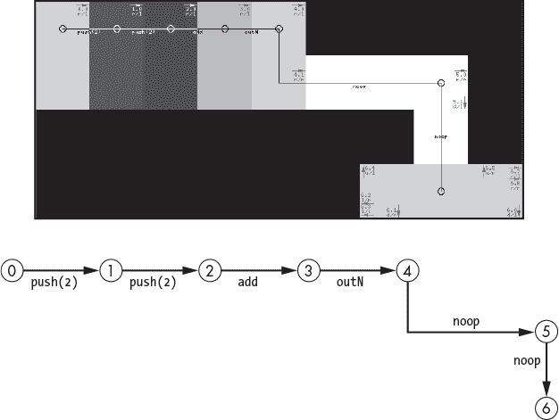

*图 9-4：追踪* add.png

图 9-4 的顶部是`npiet`的灰度输出。图的底部追踪了程序的执行流程，使得在书中跟踪变得更加容易。*add.png*文件由五个区块组成，每个区块是 2×1 的 codel，对应标记为 0 到 4 的前五个圆圈。回想一下，Piet 命令是通过色调和亮度的变化来指定的，所以命令会被打印在从一个区块到另一个区块的箭头上方。

上面的 Forth 代码通过 Piet 代码进行了重复：

`push(2)` → `push(2)` → `add` → `outN`

在`outN`之后是一个白色区域，表示无操作，因此 Piet 会按照上面的流程规则穿过这个白色区域。首先，由于 DP 位于右侧，Piet 会移动到区块的第一部分末端并遇到一个黑色 codel。CC 向右，Piet 无法继续向右移动，因为黑色区块阻挡了路径，于是 DP 旋转面朝下，进入右下角的浅色区块。这个区块被黑色或图像的边缘包围。当它移动到当前区块的边缘时，Piet 发现即使旋转 DP 一圈也找不到出口，于是解释器放弃并结束程序。

如果你查看`npiet`通过`-tpic`选项生成的*npiet-trace.png*图像，你会看到颜色和小的子步骤，展示了随着 DP 变化，CC 如何变化。请务必查看追踪图像，因为在图 9-4 中，子步骤的指示信息太难以阅读。

#### ***打招呼***

我们使用*hi.png*测试了我们的 Piet 安装。现在，让我们通过代码一步一步地了解 Piet 如何应用流程控制规则来选择接下来的移动位置。与*add.png*不同，*hi.png*没有使用简单的区块，因此需要一些思考来理解为什么 Piet 解释器会做出这样的行为。

图 9-5 展示了*hi.png*的追踪图，程序流在其下方。

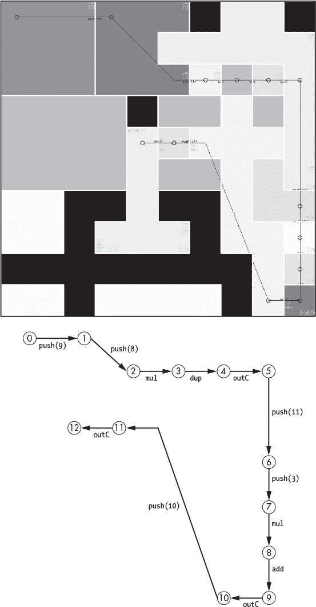

*图 9-5：追踪* hi.png

在这种情况下，区块的形状不规则，可能不容易看出解释器为什么选择它的路径。为了让它们更容易看见，图 9-5 中的不规则区块已被用白色框出。

从步骤 0 到步骤 1 的过渡足够简单：块 0 是一个正方形，DP 从右侧开始，CC 在左侧（顶部），所以唯一的去处是块 1。然而，从步骤 1 到步骤 2 的过渡并不是立刻显而易见的。在块 1 内部，我们预期流程沿着块的顶部边缘向右移动。虽然在图 9-5 中没有明显显示，但顶部块是黑色的并起到障碍作用。因此，根据 Piet 的流程规则，CC 会切换到块的右侧或底部，因为 DP 朝右。这可能暗示将 DP 旋转朝下，并选择大的浅色不规则块。然而，Piet 的流程规则适用于 DP 所面朝的方向下的最大块。因此，对于块 1 来说，这意味着块的底部，因为它是最右侧的部分，并没有被顶部的黑色正方形阻挡。所以，Piet 从块 1 移动到步骤 2 的小的浅色正方形。

从步骤 2 到步骤 10 的流程是直接的。从步骤 10 到步骤 11，我们使用与从步骤 1 到步骤 2 相同的规则，但这时 DP 朝左，因此我们选择块 10 的最左边的边缘，流程移动到块 12，终止块。块 12 是一个陷阱。DP 在左侧，而块的最左部分在底部，但一旦进入，Piet 会发现无法移动到新的块，从而结束程序。

至于*hi.png*所隐含的代码，它相当简单：

```
push(9)
push(8)
mul
dup
outC        -- "H"
push(11)
push(3)
mul
add
outC        -- "i"
push(10)
outC        -- "\n"
```

9 × 8 = 72，这是字符*H*的 ASCII 代码，72 + 11 × 3 = 105，这是字符*i*的代码，最后是 ASCII 10，表示换行符。

#### ***倒计时***

文件*countdown.png*包含一个从 10 倒计时到 1 的程序。为了简化追踪过程，我们将使用稍微编辑过的版本*countdown3.png*，它从 3 开始倒计时。

运行*countdown3.png*会生成以下内容：

```
> npiet -tpic -tpf 80 examples/countdown3.png
3
2
1
```

我承认*countdown3.png*的输出并不特别有趣，但这个例子向我们展示了如何在 Piet 中使用循环，这才是关键。图 9-6 的上部分是*countdown3.png*的追踪。按原样打印时，无法正确看到流程。因此，像图 9-4 一样，参见图 9-6 底部的流程图，并查看`npiet`在执行*countdown3.png*时为我们生成的*npiet-trace.png*文件。

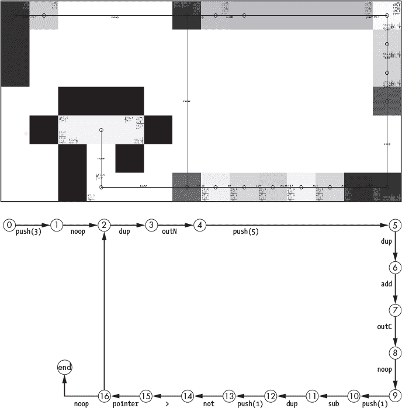

*图 9-6：追踪* countdown3.png

我们可以将*countdown3.png*写成清单 9-1 中的样子。

```
      push(3)
➊ loop  dup
      outN
    ➋ push(5)
      dup
      add
      outC
    ➌ push(1)
      sub
      dup
    ➍ push(1)
      not
      if (tos > 0) goto loop
      end
```

*清单 9-1：作为文本的 countdown3.png*

代码将 3 推入堆栈，然后通过复制堆栈顶部项来开始循环，以便打印为数字➊。接下来的代码块将 10 推入堆栈并作为字符输出。对于 Unix 系统，ASCII 10 是换行符➋。

计数器的值仍然在栈上，因此它会被递减 1 ➌。代码中的最终 `dup` 指令为后续比较是否计时结束（倒计时为 0）做准备。

Piet 使用块中像素的数量来表示数字。因此，不能直接表示 0 并将其推入栈中。然而，➍ 展示了一个有用的 Piet 习惯用法：通过推入 1 并调用 `not` 来将 0 推入栈中。此时栈中已经设置了两个计数器值和一个 0。`>` 会消耗栈顶的两个值，留下 0 或 1 在栈上。

这里开始变得有趣了。Piet 没有明确的分支指令，也就是说，没有像 Listing 9-1 中展示的 `if` 语句的直接类比。相反，Piet 使用 `pointer` 指令来旋转数据指针（DP），此时在 *countdown3.png* 中它朝向左侧。`pointer` 指令使用栈顶的值来按该值步数顺时针旋转数据指针。`>` 指令的结果是 0 或 1。如果是 1，表示计数器的值大于 0，因此我们希望循环继续。在这种情况下，`pointer` 将顺时针旋转数据指针一位，使其现在朝上。从 *countdown3.png* 中这部分直接向上移动将使我们回到循环的起始位置，也就是 Listing 9-1 中的 ➊。此时方向指针朝上，但没有地方可去，因此 Piet 按照流控制规则顺时针旋转数据指针，使其现在朝右，循环继续。

如果 `>` 在栈上留下 0，`pointer` 将不会影响数据指针，流控制继续向左，最终进入一个陷阱，Piet 无法找到出口，因此程序结束。

#### ***伪随机数生成器***

本节中的最后一个示例是 *random.png*，一个简单的伪随机数生成器。程序实现了一个 *线性同余* 伪随机数生成器，这是一种生成看似随机的整数序列的简单方法。我们将在 第十三章 中再次使用这种类型的生成器。

生成器本身就是一个单一方程式。

*s*[*i*+1] ← *a**s**[i]* mod *m*

对于某个初始种子值 *s*[0]，*a* 和 *m* 都是整数常量。如果 *a* 和 *m* 被恰当选择，则通过将输出值作为新输入生成的 *s*[*i*] 序列将通过随机性统计测试，或者我们希望如此。

我们可以将方程分解成几个步骤：首先，将当前种子值 (*s*[*i*]) 乘以乘数 *a*，然后计算该积除以 *m* 的余数，并将其作为新的种子值 (*s*[*i*+1])。模运算（mod）给出余数，幸运的是，Piet 支持该数学运算。

当然，我们需要选择*a*和*m*。好的值应该很大，但我们不希望处理大整数，因为它们对应于程序图像中的大均匀块。线性同余生成器已经研究了几十年，许多常数集已经被找到。我们将使用*a* = 209 和*m* = 2¹² *–* 3 = 4093，因为它们是较小的值。

好的，现在我们需要一个程序来获取初始种子值，应用方程，输出新种子值，并重复此过程。Piet 的栈将保存当前种子值。初始种子值将被压入栈中，然后我们将计算新种子，打印它，并将其留在栈中，供下次循环使用。我们希望捕获整数序列，因此我们将永远循环，并在生成我们所关心的所有数字后使用 CTRL-C 停止程序。

在文本中，我们可能将程序写成：

```
      push(1)
loop  push(209)
      mul
      push(4093)
      mod
      dup
      outN
      push(10)
      outC
      goto loop
```

`goto loop`将通过安排一系列白色和黑色区域来实现，以迫使程序流返回到循环的顶部。

我们可以像程序一样制作一个图像，但请注意`push(4093)`。按照 Piet 的标准，这个块相当大，所以让我们将`push(209)`和`push(4093)`替换为一组计算，最终在栈中得到正确的数字。例如，`push(209)`与以下代码等效：

```
push(10), dup, mul, push(2), mul, push(9), add
```

而`push(4093)`是：

```
push(10), dup, dup, mul, mul, push(4),
mul, push(10), push(9), mul, push(3), 
add, add
```

作为文本看起来不太美观，但作为图像却很容易实现。图 9-7 显示了结果程序（见*random.png*）。程序流如下，标记的相邻圆圈按顺时针方向连接。

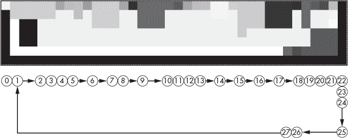

*图 9-7：追踪* random.png

从步骤 0 到步骤 1 的过渡将初始种子（1）压入栈中。步骤 2 到步骤 24 生成下一个种子值并将其作为整数显示。步骤 25 到步骤 27 打印换行符。白色区域使程序流回到步骤 2 以生成下一个种子。该循环会一直运行，直到我们按下 CTRL-C 退出解释器。

让我们运行*random.png*并捕获输出，以便我们可以分析它。

```
> npiet examples/random.png >examples/random.txt
```

让代码运行 10 到 20 秒钟，然后使用 CTRL-C 停止它。我的运行产生了 2,333,347 个值，这对我们的目的来说已经足够。

序列以以下数字开始：

```
209
2751
1939
44 1010
2347
```

这看起来“随机”，但我们怎么知道呢？当然，我们知道这个序列不可能是随机的，因为它是确定性生成的。然而，假设我们不知道这一点。那时，我们可以执行测试来帮助我们决定这个序列是否值得称为“随机”。开发高质量伪随机数生成器的整个目的，就是为了创造通过所有已知随机性测试的确定性序列。

在我们应用随机性测试之前，我们必须将整数的文本文件转换为双精度浮点数的二进制文件，范围为[0,1)，即从 0 到（但不包括）1。为此，我们将使用*random_double.py*。

```
import struct
v = [float(i[:-1])/4093.0 for i in open("random.txt")]
s = struct.pack('d'*len(v), *v)
with open("random.dat","wb") as f:
    f.write(s)
```

这里，*random_double.py* 通过将 *random.txt* 中的每个值除以 4093 来生成 *random.dat*，4093 是生成器输出的最大整数加一。

检查随机性的一个方法是构建一个 *直方图*。直方图将可能的整数范围——在这个例子中是 [1,4092]——划分为若干个相等大小的桶，假设是 10 个。然后我们找出每个数字所在的桶，并增加该桶的计数。当所有随机值都统计完成后，直方图会显示每个桶中落入的数字个数。如果我们将每个桶的计数除以统计的总值数量，在这个例子中是 2,333,347，计数就变成了频率，告诉我们每个桶中可能落入的数字比例。如果我们愿意，也可以将频率解释为一个随机值落入该桶的概率。

如果值是随机分布的，每个桶的概率是相同的，所以我们期望每个桶中的比例大致相同。例如，如果我们有 10 个桶，我们期望每个桶大约有 10% 的值。

要执行统计，我们需要一些 Python 代码和对 NumPy 库的访问。实际的代码在文件 *random_histogram.py* 中，但你无需安装 NumPy 就可以运行它。直方图给出了如下结果：

```
10.019,9.996,9.996,9.995,9.995,9.996,9.995,9.995,9.995,10.019
```

在这里，我将百分比四舍五入到三位小数。第一个数字告诉我们在区间 [0,0*.*1) 中的样本百分比，第二个数字告诉我们在 [0*.*1,0*.*2) 中的百分比，依此类推。这些百分比几乎相同。所以这是 *random.png* 给我们提供了良好分布值的一个好兆头。

这是否意味着 *random.png* 是一个好的伪随机数生成器？并不完全是。如果 *random.png* 生成的是 1, 2, 3, 4 等依次递增的数值并对 4093 取模，我们仍然会得到上面的直方图，只要样本足够多。要成为一个好的伪随机生成器，*i* 第 i 个值和 *i* + 1 第 i+1 个值之间不能相关。换句话说，不能有简单的方法通过前一个值来预测下一个值。

要检查一个值和下一个值之间是否存在相关性，我们可以使用 *corr_test.c* 中的代码。该程序读取 *random.dat* 并计算 *相关系数*，这是一个单一的数字。如果值之间没有相关性，相关系数将非常接近 0，表明它们之间没有关系。

使用以下命令编译 *corr_test.c*：

```
> gcc corr_test.c -o corr_test -lm
```

然后对 *random.dat* 执行它。

```
> corr_test 3 random.dat
corr = 0.00047 (n=2333347), expected 95% CI=[-0.00131, 0.00131], 
       test PASSED
```

命令行中的 `3` 告诉 `corr_test`，*random.dat* 是一个双精度浮点值的二进制文件。

输出中包含 `PASSED` 这个单词，而且是全大写的。所以 *corr_test* 认为 *random.dat* 没有关联。相关系数接近 0。输出中的 `CI` 部分是一个 *置信区间*。我们可以将置信区间理解为，真实的相关系数有 95% 的概率落在给定的区间范围内。注意该区间包括了 0，这是另一个好兆头。

所以，*random.png* 是一个不错的伪随机生成器，对吧？不过，实际上并非如此。我们只检查了一个值和下一个值之间的相关性。可能还存在一个值与其他后续值之间的相关性。这就开始暴露出测试伪随机生成器的问题了。真正的生成器会经过大型测试套件的检验，包含多种不同类型的测试，只有最好的伪随机生成器能通过这些测试。

我们将对*random.dat*的输出进行一次简单的测试。让我们取连续的值对并将其作为一个点绘制出来。然后，我们将查看结果图，看看是否有任何模式突出显示。例如，*random.dat*中的前两个值是 0.05106279 和 0.67212314。因此，我们将在(0.05106279, 0.67212314)处绘制一个点，然后对下一个值对执行相同操作。我们将在绘制 1000 个点后停止，以避免图形过于混乱。

看看图 9-8。有什么引起你的注意吗？

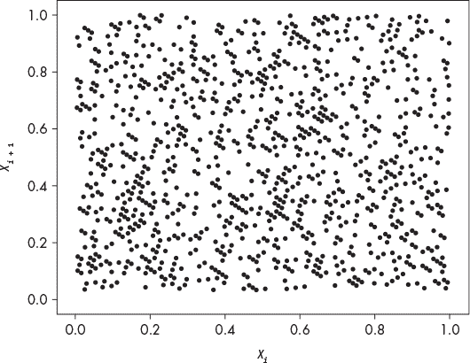

*图 9-8：绘制伪随机值对*

这些点通常沿着从左上角到右下角的对角线排列。这是序列中较长距离相关性的强烈迹象。最终我们现在可以对*random.dat*的输出做出结论：它是一个糟糕的伪随机生成器。然而，它确实填充了空间。在图 9-8 中，没有明显的区域没有点。因此，*random.png* 的输出对于简单的视频游戏足够了，但不要基于它进行关于气候变化的政策决策。

伪随机数生成将在本书后续再次出现。现在，让我们回到皮特的艺术根源，并为皮特·蒙德里安创作一幅小小的致敬作品。

### **致敬皮特·蒙德里安**

皮特·蒙德里安是荷兰艺术家和建筑师群体中的重要成员，他们发展了被称为*De Stijl*（风格）运动的艺术风格。De Stijl 字面意思是“风格”，它使用基本元素的抽象形式。蒙德里安最广为人知的作品之一就是他意外地令人满意的*《红、蓝、黄的构成 II》*。这幅画是 De Stijl 运动的一个出色例子。为了向蒙德里安致敬，我们将制作一个*《红、蓝、黄的构成 II》*的可执行版本。在这个过程中，我们将学习如何使用`npiet`的编辑器`npietedit`。

使用现代图形程序复制原始画作是非常简单的。图 9-9 显示了结果。

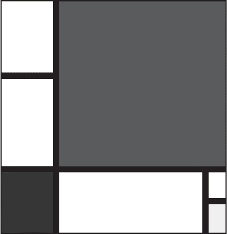

*图 9-9：再现蒙德里安的*《红、蓝、黄的构成 II》

最大的块是红色的，左边较小的块是蓝色的，而右边最小的块是黄色的。其余部分是黑白相间的。

原始画作的左下角签名为*P M 30*，代表皮特·蒙德里安，1930 年。我们将通过嵌入一个简单的程序来输出`PM30`，替代签名，使得这幅画可以执行。我们所需的代码并不复杂，但作为学习使用`npietedit`的练习，它是很有帮助的。

编写 Piet 代码时，立即面临的一个挑战是如何与颜色和过渡打交道，以得到期望的指令。尽管我们可以使用铅笔和纸，通过从一种颜色过渡到另一种颜色来计算正确的色调和亮度变化，从而触发期望的指令，但我们不必如此原始。相反，巧妙的`npietedit`程序允许我们在需要时对程序图像进行着色，同时计算出适当的颜色过渡。

要输出`PM30`，我们需要在调用`outC`之前将每个字符的 ASCII 值推入栈中。我们还需要添加一个最终的换行符，以便将`PM30`输出到自己的行上。因此，我们需要一个程序来输出五个字符。然而，我们必须以不显眼的方式将程序嵌入到更大的*Composition II*图像中。幸运的是，Piet 的运行方式和*Composition II*的结构非常契合。例如，Piet 从图像的左上角开始，数据指针（DP）向右，控制指针（CC）向左。由于这一部分图像是白色的，Piet 将沿着图像向右移动，直到碰到第一个黑色像素，也就是大垂直黑条的起点。我们将在这个黑条中嵌入我们的代码，因为我们知道 Piet 会找到它。另外，我们将程序的方向设置为垂直，数据指针（DP）向下移动。

当然，我们必须有一个程序来嵌入，因此让我们使用`npietedit`来创建它。启动`npietedit`，不带任何参数。

```
> npietedit
```

界面如图 9-10 所示。

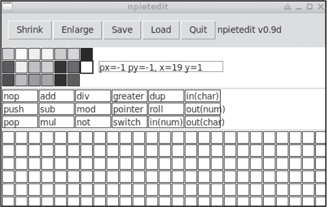

*图 9-10：* npietedit *编辑器*

界面由颜色选择器、命令选择器和绘图区域组成，绘图区域显示了单独的像素。选择一种颜色并点击绘图区域以设置该像素。命令选择器是编辑器中最有价值的部分。例如，要将数字 5 压入栈中，选择任何一种想要的颜色，比如浅红色，也就是左上角的颜色。然后，填充五个像素以形成一个块，比如五行一列的高度。然后，鉴于数据指针（DP）位于右侧，选择该块的最顶部像素，并选择**Push**。编辑器会知道当前颜色是浅红色，因此会将颜色切换为红色，亮度级别降低一级。

通过将亮度改变 1，Piet 指定了`push`操作，所以这是正确的颜色。点击紧挨着浅红色块右边的顶部像素，放置一个红色像素。由于数据指针（DP）指向的位置，Piet 会正确地将 5 压入栈中。通过这种方式，只要稍加练习，并在点击命令之前注意选择合适的颜色，便能绘制出任何指令序列，达到所需的色调和亮度变化。

使用界面顶部的按钮来控制`npietedit`。它们大多数都是自解释的。然而，保存和加载不会弹出常规的文件选择对话框。相反，它们会写入和读取固定的文件名`npietedit-filename.ppm`。因此，使用保存来保存图像，然后将`npietedit-filename.ppm`重命名为其他名称以保存程序。同样，复制已保存的程序版本到同一文件名下，再加载到`npietedit`中。*.ppm*文件格式是一种可移植的位图图像格式。`npiet`解释器将直接使用这些文件。大多数图形程序也能加载并显示可移植的位图图像。如果你想更改为其他文件类型，可以使用类似`gimp`或`convert`的工具，后者是 ImageMagick 的一个命令行工具（* [`imagemagick.org/index.php`](https://imagemagick.org/index.php)*）。ImageMagick 已包含在基础的 Ubuntu 安装中。

我们的程序需要将 ASCII 值压入栈中，然后调用`outC`。Forth 中相应的代码如下：

```
8 10 * emit 11 7 * emit 10 5 * 1 + emit 6 8 * emit 5 5 + emit
```

Forth 词汇`emit`与 Piet 的`outC`命令效果相同，且使用较小的数字相乘可防止出现大片单一颜色块。

让我们使用`npietedit`将 Forth 代码翻译成 Piet。唯一的变化是我们希望代码垂直运行，这样就可以将它嵌入到较大的*Composition II*图像的黑色部分中。为此，我们必须将 DP 从右侧旋转到下方。这个操作可以通过一个包含 90 度转弯的白色区域轻松完成。

文件*composition.ppm*包含必要的 Piet 代码，直接翻译自上面的 Forth 代码。如果你运行它，将看到它生成了预期的输出。

```
> npiet examples/composition.ppm
PM30
```

要在`npietedit`中查看代码，请将*composition.ppm*复制到与`npietedit`位于同一目录下的*npietedit-filename.ppm*中，启动编辑器并点击**加载**。结果见图 9-11。代码从上到下运行。

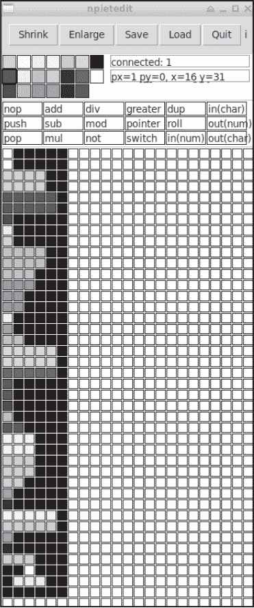

*图 9-11：输出 PM30 的代码*

我们的致敬工作快完成了。剩下的就是将*composition.ppm*嵌入重新绘制的*Composition II*中，该文件为*mondrian*.png。为了进行嵌入，我使用`gimp`加载这两张图像，选择*composition.ppm*的实际图像部分，复制它，然后粘贴到*mondrian.png*中，将其移动到中央的垂直黑色区域。

Piet 解释器将跳过左上角的白色区域，因此我们需要在定位代码后添加一个白色像素，使垂直条现在是

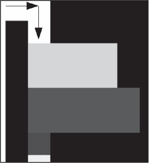

通过箭头展示 DP 如何改变方向以垂直执行代码。

生成的合成图像保存在*compositionII_pm30.png*中。如果使用`npiet`运行它，你将得到预期的`PM30`输出。看一下图像本身。它看起来像是*Composition II*，顶部有一抹色彩。

### **Piet 宇宙**

一种成功的 esolang 能够吸引一批追随者。人们使用它，分享它，修改它，为它构建工具，创建相关网站。按照这个标准，Piet 是成功的。接下来是一些优秀的 Piet 代码示例、工具和其他值得注意的内容的链接。这个列表并不详尽，肯定还有一些值得列出的内容被遗漏了。

#### ***关于 Piet***

Piet 已经生成了大量的博客文章和在线讨论。这里的短列表探讨了更多关于该语言的内容，并包括一些有趣的（不寻常的）Piet 实验。

**Piet 官方网站** 由创始人 David Morgan-Mar 创建的 Piet 主页面。从这里开始，了解更多关于这门语言的信息。 (*[`www.dangermouse.net/esoteric/piet.html`](https://www.dangermouse.net/esoteric/piet.html)*)

**Piet 教程** 这是一个很好的基础教程，适合用来学习 Piet 编程，并且与本章讨论的内容互为补充。 (*[`www.youtube.com/watch?v=4kH4T8uwHMw/`](https://www.youtube.com/watch?v=4kH4T8uwHMw/)*)

**Piet 在文献中的应用** Piet 是这篇关于代码可视化的论文中的一个示例。Alex McLean 的博士论文也在线可查，并且同样提到了 Piet。请参见《实时代码的可视化》，《电子可视化与艺术》（EVA 2010），26-30 页。

**将经典画作作为 Piet 程序运行** 这是一个将 Piet 与经典艺术作品相结合的实验。Piet 爱好者的创造力无穷无尽。 (*[`omnigatherum.ca/wp/?p=57/`](http://omnigatherum.ca/wp/?p=57/)*)

**Piet 与诗歌的结合** 这是一个 Piet 与诗歌的实验。最终产品，*bark.png*，生成了一首俳句。 (*[`theorangeduck.com/page/making-poetry-piet/`](http://theorangeduck.com/page/making-poetry-piet/)*)

#### ***代码***

学习一门语言最好的方法是回顾该语言中的例子。因此，如果 Piet 能吸引你深入了解，下面的例子将帮助你提升你的 Piet 水平。

**Piet 示例主页面** 最好的 Piet 示例页面在 Piet 的官方网站上。并非所有的示例都能与`npiet`兼容，但大多数可以。这些是伟大大师的作品，快去看看吧。 (*[`www.dangermouse.net/esoteric/piet/samples.html`](https://www.dangermouse.net/esoteric/piet/samples.html)*)

**FizzBuzz** 历史上，一个常见的编程面试题是写一个程序，生成 1 到 100 之间的数字，但将 3 的倍数替换为“Fizz”，将 5 的倍数替换为“Buzz”，将 3 和 5 的倍数替换为“FizzBuzz”。FizzBuzz 是一个简单的程序，因此成为了 esolang 的常见目标。FizzBuzz 的 Piet 版本可以在 *[`www.toothycat.net/~sham/fizzbuzz.png`](http://www.toothycat.net/~sham/fizzbuzz.png)* 找到。如果你想深入了解 FizzBuzz，可以阅读 Tom Dalling 的博客文章，链接在 *[`www.tomdalling.com/blog/software-design/fizzbuzz-in-too-much-detail/`](https://www.tomdalling.com/blog/software-design/fizzbuzz-in-too-much-detail/)*。

**井字棋** 一个完全互动、无敌的 Piet 版本井字棋（圈叉游戏）值得你花点时间体验。(* [`freesoft.dev/program/9705871/`](https://freesoft.dev/program/9705871/) *)

#### ***实现与工具***

计算机爱好者喜欢构建东西。前面提到的主页面上的 Piet 描述迫切需要用某种语言编写。这里的实现使用了多种不同的编程语言，如 C++、Python、Rust，甚至 Haskell。并不是每个实现都能运行所有的示例程序，但大多数的表现都相当不错。

一个 Python 解释器，* [`www.dangermouse.net/esoteric/piet/Piet_py.txt`](https://www.dangermouse.net/esoteric/piet/Piet_py.txt) *

另一个 Python 解释器，* [`github.com/JensBouman/Piet_interpreter/`](https://github.com/JensBouman/Piet_interpreter/) *

用 Haskell 编写的解释器，* [`hackage.haskell.org/package/piet-0.1/docs/Language-Piet-Interpreter.html`](https://hackage.haskell.org/package/piet-0.1/docs/Language-Piet-Interpreter.html) *

用 C++编写的解释器，* [`www.matthias-ernst.eu/fpiet.html`](https://www.matthias-ernst.eu/fpiet.html) *

用 Rust 编写的解释器，* [`github.com/dfockler/rustpiet/`](https://github.com/dfockler/rustpiet/) *

一个基于浏览器的 TypeScript 解释器和 IDE，* [`gitlab.hsrw.eu/thomas.richter/piet-ide/`](https://gitlab.hsrw.eu/thomas.richter/piet-ide/) *

一些项目则采用另一种方式，从文本语言生成汇编器或编译器到 Piet。也就是说，输出的是一个实现 Piet 程序的图像。再次强调，计算机爱好者是非常富有创意的一群人。

专门用于 Piet 的 GitHub 仓库，* [`github.com/topics/piet/`](https://github.com/topics/piet/) *

一个生成 Piet 代码的汇编器和编译器，* [`www.toothycat.net/wiki/wiki.pl?MoonShadow/Piet/`](https://www.toothycat.net/wiki/wiki.pl?MoonShadow/Piet/) *

PietC 编译器，生成 Piet 代码作为输出，* [`github.com/cjayross/pietc/`](https://github.com/cjayross/pietc/) *

另一个生成 Piet 输出的汇编器，* [`github.com/sl236/Piet/`](https://github.com/sl236/Piet/) *

### **讨论**

Piet 是一种过程式语言，支持任意大小的程序。没有变量，但堆栈是无限的。因此我们可能怀疑 Piet 是图灵完备的。事实上，Piet 绝对是图灵完备的，因为有个聪明的人已经用 Piet 编写了一个 Brainfuck（BF）解释器，而 BF 是公认的图灵完备语言，正如我们在第十章中将看到的那样。BF 解释器(* [`lutter.cc/piet/`](https://lutter.cc/piet/) *)值得一看，也许可以在阅读第十章后再查看它。测试时，别忘了在 BF 代码的末尾添加一个管道符号(`|`)，即使代码本身不接受任何输入。我用“Hello, world!”和`npiet`试过，它能正常工作。别忘了加上`-q`命令行选项来抑制输入提示。

好的，Piet 是一个图灵完备的语言。我们还能说些什么呢？编程在 Piet 中确实是一个挑战，可能是因为它与标准的基于文本的编程甚至是标准的可视化编程语言（那些使用拖放组件的语言）非常不同。

我觉得很有趣的是，Piet 中的循环，字面上就是循环——图像结构本身控制着程序的流向，因此循环确实能够回到起点。例如，*random.png* 中的循环通过程序图像底部的一块长白色块实现，接着是一个 90 度的转弯，强制 DP 指向正确的方向以遇到循环的起始点。此外，Piet 的流程控制规则使得 DP 会再次向右旋转，指向正确的方向以无限循环地重复这个循环，而这一切都不需要任何标准的语法。从某种意义上说，Piet 没有语法，只有流规则；图像本身就是语法。从这个角度来看，Piet 程序并不独特，因为存在多种、几乎无限的方式来绘制所需的流向。

Piet 使用色调和明度变化来暗示命令，而不是为命令指定具体颜色，这种方法同样巧妙，并且再次大大增加了可能的 Piet 程序数量。即使我们选择相同的布局、代码块顺序和图像大小，仅通过选择不同的起始颜色，我们也会得到许多不同的选项。Piet 的指令集很小，所以学习每个命令的必要转换并不难。如果你在 Piet 中进行一段时间的实验，你会开始掌握这些转换。例如，通过改变明度 1 来表示 `push`，这是一个你会很快学会的命令。

另一个有趣的地方是，Piet 区分了块的大小和命令。例如，如果我们想执行 `push(4)` 并且知道下一个指令是 `push(3)`，我们可能会将第一个代码块做成 2×2 像素，颜色为浅红色，然后将第二个代码块做成三垂直像素的红色块。从浅红到红的过渡暗示了带有参数 4 的 `push` 命令，参数 4 来自浅红色块的大小。`push` 命令不关心新代码块的大小，只关心它是红色的，比之前的块暗一个明度级别。新块的大小为 3 对于推送 3 时过渡到下一个必须是深红色的块非常有用，因此我们将数字与颜色过渡结合起来，使得代码更加紧凑。当然，颜色过渡也是命令，因此有时可能需要使用白色块来更改颜色而不执行命令。

最终，Piet 是一种有趣的超语言，也是思考编码的一种新颖方式的绝佳例子。在设计程序时需要一些前瞻性思维，因为即使有像 `npietedit` 这样的工具，通过移动现有的代码块来腾出空间突然添加新代码也不是一件容易的事，但能够进行此类操作的编辑器是完全可能的。

Piet 是图灵完备的，但语言的扩展可能也值得关注。例如，能够将堆栈作为数组访问便增加了变量。此外，某种子程序功能会使编程变得更容易。这些都是针对有抱负的读者的练习。

### **总结**

本章介绍了 Piet，这是一种将图片作为程序的编程语言。首先，我们了解了语言的元素，理解了它是如何运作的，以及如何用颜色进行编程。接着，我们进行了一些手指画，边学边弄脏手，逐步了解了特定程序的工作原理。这引导我们创作了一个简单的致敬作品，向皮特·蒙德里安致敬，他的风格和名字启发了 Piet 的创作。Piet 在至少作为恶搞语言方面已经逐渐流行，现在已经有了许多程序示例、实现和辅助工具。如果你有兴趣进一步探索，我们列出了其中的一些。然后，正如往常一样，我们以一些关于语言及其功能的思考结束了本章。

我们的下一个恶搞语言或许是最著名的了。我们直接称之为*BF*。如果 Piet 是地方名人，那么 BF 就是超级明星。
