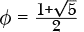
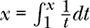
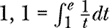

# 第十章：BRAINFUCK


*Brainfuck*，或者我们称之为*BF*，或多或少是所有另类编程语言的祖先。它是最早的，并且可能是最广泛的、修改过的、讨论过的、恶搞过的另类编程语言之一。在这一章中，我们将看看它为何如此引起关注——它的内容远不止名字那么简单！

### **WTF 是 BF？**

BF 是 Urban Müller 的脑力结晶，他在 1993 年将其带入了这个未曾察觉的世界。他的目标是创建一个小巧的语言，并为 Amiga 计算机开发一个小巧的编译器。他的编译器长 296 字节。稍后在本章中，我们将遇到一个仅 166 字节长的 BF 编译器。

为什么 BF 编译器可以如此小巧？因为 BF 本身就很小（见表 10-1，其中描述了所有*八个*命令）。就像某只猪可能会说的那样，“就这样，伙计们！”

**表 10-1：** BF 的全貌

| **命令** | **操作** |
| --- | --- |
| `>` | 递增内存指针 |
| `<` | 递减内存指针 |
| `.` | 将内存内容作为字符打印 |
| `,` | 将字符输入到内存 |
| `+` | 递增内存 |
| `-` | 内存递减 |
| `[` | 如果内存不为 0，则开始循环 |
| `]` | 如果内存不为 0，则继续循环 |

BF 期望的机器与图灵机非常相似。BF 机器是一个由单元格组成的向量，每个单元格存储一个值。最初有 30,000 个单元格，每个单元格能存储一个字节[0，255]。我们在本章使用的解释器有 32 位单元格。BF 类似于被称为*哈佛架构*的硬件架构，在这种架构中，程序空间和内存是分开的。这里没有自我修改的代码，尽管我不会感到惊讶，如果有人为了探索自我修改的 BF 代码可能能够完成的任务，创建了一个冯·诺依曼版本的 BF。回想一下，冯·诺依曼架构将程序空间和内存结合在一起。现代 PC 是冯·诺依曼机器。

图灵机有一个磁带头，沿着磁带读取和写入符号。BF 也做了同样的事情，但在这里我们将“磁带头”称为内存或单元格指针。`>`和`<`指令将内存指针从一个单元格移动到另一个单元格，而其余的 BF 指令则操作当前的内存单元。当 BF 程序开始时，它假设每个内存单元的值为 0，且指针指向第 0 个单元格。

我们现在知道了 BF 的八个指令中的两个做了什么。逗号（`,`）和句点（`.`）分别是输入和输出。`+`指令递增单元格，`-`指令递减单元格。

使得 BF 作为一种语言有趣的地方在于其`[`和`]`循环指令。循环以`[`开始，`[`和`]`都是命令。当 BF 执行`[`指令时，它会查看当前单元格并询问：“值是 0 吗？”如果答案是“是”，BF 会跳过到`]`指令并继续执行其后的指令。如果答案是“不是”，BF 会执行下一条指令并开始循环。

当 BF 遇到 `]` 指令时，它不会自动跳转到对应的 `[ `。相反，它会检查 *当前* 的内存单元格，如果该单元格 *不是* 0，它就跳回去。否则，循环结束，BF 继续执行下一个指令。

思考一下这个问题。`[` 指令是一个门控，它决定循环是否开始，但它之后不会再检查任何事情。决定是否继续循环的责任落在匹配的 `]` 指令上。而且，启动循环的单元格不一定是决定循环是否继续的单元格。BF 在循环方面非常灵活，正如我们从这种具有挑衅性的名称中可以预见的那样——它在挑战我们的思维。BF 循环既不是顶部测试也不是底部测试，而是两者的混合。存在一个顶部测试来决定循环是否开始，但从那时起，循环是底部测试的。在 C 中，我们可以通过嵌套循环来实现类似的效果：

```
int cond1=1, cond2=1;
while (cond1) {
    cond1 = 0;
    do {

    } while(cond2);
}
```

要开始循环，`cond1` 必须为真。然而，在 `cond1` 开始循环后，它不会再被检查；循环会一直执行，直到 `cond2` 不再为真。为了在 C 中实现所需的效果，`cond1` 必须被设为假（`cond1 = 0`），这样整个结构在 `cond2` 变为假时会退出。

BF 代码写起来并不特别容易，但它足够完整，可以实现有趣的、非平凡的程序。BF 不仅仅是简单的 ABC。我们需要一个解释器来验证这一点；编译器设计我们可以留到另一天讨论。

### **两个实现**

BF 实现层出不穷。让我们在本节中探讨两个实现。第一个是 Urban Müller 于 1993 年为 Amiga 计算机编写的原始 C 代码的稍微更新版本。第二个我们将在 SNOBOL 中从零开始构建，因为这种不寻常的、极简的晦涩语言值得一个同样不寻常的实现。如果你跳过了第五章中的 SNOBOL 内容，现在是时候回去阅读了。

#### ***原版***

原始的 Amiga LHA 压缩包包含了第一版 BF 的代码，文件名为 *brainf-2.lha*。Müller 的实现是用纯 C 编写的。为了在现代 Linux 系统上使用该代码，我自行更新了它，使其能够无警告地编译，将单元格大小从 8 位（`unsigned char`）改为 32 位（`int`），并将程序空间增加到 70,000 个单元格。使用 32 位单元格与我们将在下一节中开发的 SNOBOL 实现相匹配。

清单 10-1 显示了完整的解释器代码。

```
#include <stdio.h>
#include <stdlib.h>
#define MAXPROG 70000
#define MAXMEM 30000
int  p, r, q;
int a[MAXMEM];
char f[MAXPROG], b, o, *s=f;

void interpret(char *c) {
    char *d;
    r++;
    while( *c ) {
        switch(o=1,*c++) {
        case '<': p--;        break;
        case '>': p++;        break;
        case '+': a[p]++;     break;
        case '-': a[p]--;     break;
        case '.': putchar(a[p]); fflush(stdout); break;
        case ',': a[p]=getchar();fflush(stdout); break;
        case '[':
            for( b=1,d=c; b && *c; c++ )
                b+=*c=='[', b-=*c==']';
            if(!b) {
                c[-1]=0;
                while( a[p] )
                 ➊ interpret(d);
                c[-1]=']';
                break;
            }
        case ']':
            puts("UNBALANCED BRACKETS"), exit(0);
        case '#':
            if(q>2)
                printf("%2d %2d %2d %2d %2d %2d %2d %2d %2d %2d\n%*s\n",
                       *a,a[1],a[2],a[3],a[4],a[5],a[6],a[7],a[8],a[9],
                       3*p+2,"^");
            break;
        default: o=0;
        }
        if( p<0 || p>(MAXMEM-1))
            puts("RANGE ERROR"), exit(0);
    }
    r--;
}

int main(int argc,char *argv[]) {
    FILE *z; q=argc;
    if(z=fopen(argv[1],"r")) {
        while( (b=getc(z))>0 )
            *s++=b;
        *s=0;
        interpret(f);
    }
}
```

*清单 10-1：Urban Müller 的原始 BF 解释器（更新版）*

这个实现非常紧凑，并通过递归处理循环（注意 `interpret` 的递归调用 ➊）。我们的 SNOBOL 实现将通过非递归方式处理循环。另外，注意到 `#` 是一个受支持的命令。如果解释器被调用并传递第二个命令行参数，`#` 命令会打印基本的调试信息。后来版本的 BF 中已经去掉了 `#` 命令。我的修改引入了 `MAXMEM` 和 `MAXPROG`，并在 `main` 前添加了 `int`，以避免 `gcc` 警告。

解释器处理加载到 `f` 中的输入 BF 程序。`interpret` 函数循环遍历 `f` 中的字符，或者通过递归调用遍历括号中的嵌套循环字符。如果字符是 BF 命令，则执行该命令；否则，忽略它。

构建解释器是直接的：

```
> gcc bfi.c -o bfi
```

测试它的过程如下：

```
> bfi examples/hello.b
Hello World!
```

本书 GitHub 仓库中的所有 BF 示例都可以与这个解释器一起使用。然而，并非所有你在网上找到的 BF 示例都能兼容。查看 *README* 文件，它位于 *examples* 目录中，因为它包含了归属和许可证信息。如果已知作者身份，代码作者会得到相应的署名。我将让你自行完成 *hello.b* 文件的操作过程，因为文件中已经有了解释性注释。如你所料，它涉及到生成并打印所需的 ASCII 值序列。

#### ***SNOBOL 与 BF 的结合***

BF 的诱人优雅确实几乎要求我们自己编写解释器。我们将使用 SNOBOL，因为 SNOBOL 提供了我们所需的所有功能。此外，它很有趣。完整的解释器在 *bf.sno* 中。我们从解析器开始：

```
            MAXPROG = 70000
            MAXMEM = 30000
            prog = array('0:' MAXPROG)
          ➊ mem = array('0:' MAXMEM, 0) jump = table()

            define('parse(name)c,n,pat')      :(eparse)
parse       pat = break('><+-.,[]')
            input('reader', 10, 'B,1', name)
parse_l0    c = reader                        :f(parse_l1)
            c pat                             :f(parse_l0)
            prog[n] = c 
            n = ne(n,MAXPROG) n + 1           :s(parse_l0)
parse_l1    endfile(10)    
            parse = n                         :(return)
eparse
```

*Listing 10-2: 解析输入文件*

Listing 10-2 展示了全局内存定义和 `parse` 函数，用来读取输入文件并仅保留有效的程序命令。代码存储在数组 `prog` 中，内存存储在第二个数组 `mem` 中。BF 期望内存被初始化为 0，SNOBOL 通过 `array` 的第二个参数 ➊ 为我们完成了这一操作。稍后我们将讨论 `jump` 表。

`parse` 函数接受输入文本文件的 `name`，定义一个模式来匹配有效的程序字符（`pat`），并打开文件进行输入，每次读取一个字符。

循环（`parse_l0`）将字符读入 `c` 并应用模式。如果模式匹配成功，那么 `c` 包含一个允许的命令字符；因此，`prog` 被设置，并且其索引递增。注意 SNOBOL 的惯用法，将 `ne` 谓词嵌入来测试程序的最大长度。如果谓词失败，则 `n` 的递增不会发生，执行将跳转到 `endfile`。

当 `parse` 完成输入文件的处理时，`prog` 中包含了有效命令，且仅包含有效命令。读取的命令数量通过将 `n` 赋值给 `parse` 来返回。

BF 程序按顺序执行，直到解释器遇到一个循环。原始的 BF 解释器使用递归来处理循环；然而，我们将采取更直接的方法。每当看到一个左括号 (`[`)，我们会向前扫描程序文本，找到对应的右括号 (`]`)。类似地，对于右括号，我们将向后扫描，找到匹配的左括号。我们本可以在解释代码时进行此操作，但这效率低下——想象一下，一个循环运行了数万次。

片刻思考就能清楚，开始解释器之前对代码进行一次遍历就足以定位每个左括号及其对应的右括号。这就是 `jump` 表发挥作用的地方。回想一下，SNOBOL 的表就像 Python 字典；它是一个关联数组。表中的索引是 `prog` 中左括号的索引。右括号也存储在 `jump` 中，因为它们的索引值是唯一的。通过提前构建 `jump`，在程序执行期间对 `jump` 的一次引用就能为左右括号提供正确的索引。

Listing 10-3 显示了 `buildtable` 及其辅助函数 `closing`。

```
            define('closing(pc,plen)n,p')     :(eclosing)
closing     n = 1
            p = pc
closing_l0  p = p + 1
            eq(p,plen)                        :s(bad0)
            ident(prog[p],']')                :s(closing_l1)
            ident(prog[p],'[')                :s(closing_l2)
closing_l3  eq(n,0)                           :f(closing_l0)
            closing = p                       :(return)
closing_l1  n = n - 1                         :(closing_l3)
closing_l2  n = n + 1                         :(closing_l3)
eclosing

            define('buildtable(plen)n,m')     :(ebuildtable)
buildtable  n = 0
build_l0    ident(prog[n],'[')                :s(build_l1)
build_l2    n = n + 1
            eq(n,plen)                        :f(build_l0)s(return)
build_l1    m = closing(n,plen)
            jump[m] = n
            jump[n] = m                       :(build_l2)
ebuildtable
```

*Listing 10-3：构建跳转表*

在这里，`buildtable` 扫描程序文本，寻找左括号。当找到一个左括号时，它调用 `closing` 来返回对应右括号的索引。接着，`buildtable` 设置 `jump` 表，将左右括号的位置存入表中，以便程序执行期间快速查找。

`closing` 函数通过向前扫描并在每次找到新的左括号时递增 `n`，来定位匹配的右括号。当找到右括号时，`n` 会递减。当 `n` 为零时，表示找到了与最初的左括号匹配的右括号，于是返回该右括号的索引。

BF 接受单字符输入，并将其作为 ASCII 值存储在内存中。SNOBOL 有一个 `char` 函数，可以返回与给定 ASCII 值关联的字符；然而，它缺少许多语言所称的 `ord` 函数，后者用于返回给定字符的 ASCII 值。没关系，我们自己实现一个：

```
       define('ord(c)v')         :(eord)
ord    &alphabet break(c) . v
       ord = size(v)             :(return)
eord
```

SNOBOL 包含一个特殊变量 `&alphabet`，它包含所有的 ASCII 字符范围 [0, 255]。`ord` 函数使用模式匹配来定位此特殊变量中所有字符，直到给定字符 `c`。该模式将子字符串存储在 `v` 中，并且子字符串的长度就是该字符的 ASCII 代码。

我们现在准备好运行 `prog` 中的 BF 程序了。让我们一起走一遍解释器的主要部分。我们将添加一些调试功能，以便后续使用。BF 很难，所以我们会尽可能多地利用帮助。

解释器的主要部分在 Listing 10-4 中。

```
           plen = parse(host(2,2))
           buildtable(plen)
           input('cin', 10, 'B,1', '-')
           output('cout', 11, 'WB,1', '-')
           pc = 0
           mp = 0
           gmp = 0
   loop    ident(prog[pc],'-')               :s(dec)
           ident(prog[pc],'+')               :s(inc)
           ident(prog[pc],'<')               :s(decp)
           ident(prog[pc],'>')               :s(incp)
           ident(prog[pc],',')               :s(gchar)
           ident(prog[pc],'.')               :s(pchar)
           ident(prog[pc],'[')               :s(begin)
           ident(prog[pc],']')               :s(again)
   cont    pc = pc + 1
           ne(pc,plen)                       :f(pend)s(loop)
   dec     mem[mp] = mem[mp] - 1             :s(cont)f(bad1)
   inc     mem[mp] = mem[mp] + 1             :s(cont)f(bad1)
   decp    mp = mp - 1                       :(cont)
   incp    mp = mp + 1    
           gmp = gt(mp,gmp) mp               :(cont)
   gchar   ch = ord(cin)                     :f(pend)
        ➊ eq(ch,13)                         :f(gchar0)
           ch = 10
           cout = char(ch)
   gchar0  mem[mp] = ch                      :s(cont)f(bad1)
   pchar   cout = char(mem[mp])              :s(cont)f(bad1)
➋ begin   pc = eq(mem[mp],0) jump[pc]       :(cont)
   again   pc = ne(mem[mp],0) jump[pc]       :(cont)
```

*Listing 10-4：主要的 BF 解释器循环*

列表 10-4 包含一些准备工作，随后是一个`loop`，它在`prog`中移动程序。准备工作调用`parse`来处理输入文件，调用`buildtable`来配置`jump`表。BF 期望与控制台进行单字符输入和输出，SNOBOL 通过给定的`input`和`output`咒语来支持这一点。

当前的程序计数器是`pc`，内存指针是`mp`。我们将使用`gmp`来跟踪程序访问的最高内存单元。这样做简化了在程序结束时转储相关内存。

`loop`根据当前指令的字符执行。回想一下，`ident`是 SNOBOL 谓词，用于比较两个字符串。执行指令时会跳转到相关行。大多数指令都是单一语句。例如，`>`将单元指针向右移动（`mp=mp+1`）。在增加单元指针时，还会额外检查是否需要更新`gmp`。

SNOBOL 有一个怪癖，需要一些额外的代码。看看`gchar`，它读取单个字符的输入。`cin`变量读取字符，并将其 ASCII 值放入`ch`中。问题出现在用户按下 ENTER 时。在 Unix 系统上，这应该返回 ASCII 值 10；然而，SNOBOL 解释器返回的是 ASCII 值 13。所以在赋值当前内存位置（`gchar0`）之前，会快速检查并将 ASCII 13 转换为 ASCII 10 ➊。注意，每个指令都以跳转到`cont`来继续处理下一条指令。

此外，观察如何处理开括号和闭括号，分别作为`begin`和`again` ➋。尽管每个都有单个语句，但还是需要做一些解释。例如，开括号的代码是

```
pc = eq(mem[mp],0) jump[pc]      :(cont)
```

BF 标准规定，如果当前活动的内存单元不为 0，则开始一个循环；否则跳过循环。在这里，SNOBOL 谓词`eq`将在当前内存单元为 0 时成功。这样，赋值会发生，`pc`被设置为`jump[pc]`，即我们当前考虑的循环的*结束*。相反，如果内存单元不为 0，`eq`失败，赋值不会发生。因此，解释器会按预期进入循环。`again`中的测试与此类似，只是逻辑相反，因此如果内存单元不为 0，我们跳转到循环的开始。

再看看递减当前单元的语句：

```
dec  mem[mp] = mem[mp] - 1   :s(cont)f(bad1)
```

如果递减成功，流程继续执行下一条指令`s(cont)`。然而，如果`mp`为负数或过大，语句会失败，解释器会跳转到`bad1`：

```
bad1  output = 'memory access error, mp = ' mp  :(end)
```

这会打印错误信息并退出。如果开括号没有匹配的闭括号，也会发生类似的错误。

如果第二个命令行参数是`dump`，解释器将在退出前转储程序访问的所有内存位置的最终值。相关代码见列表 10-5。

```
pend   ident(host(2,3),'dump')             :f(end)
       output = output = 'Memory: (mp = ' mp ')'
       n = 0
ploop  ascii = ''
       gt(mem[n],31)                       :f(print)
       lt(mem[n],127)                      :f(print)
       ascii = '  ' char(mem[n])
print  s = dupl(' ', 6 - size(n)) n
       s = s ':' dupl(' ', 6 - size(mem[n])) mem[n]
       output = s ascii
       n = n + 1
       gt(n,gmp)                           :f(ploop)
       output =                            :(end)
```

*清单 10-5：转储内存*

内存值被逐行转储。如果值在 31 < *v* < 127 的范围内，则显示相应的字符。

BF 解释器现在完成了。让我们测试一下。

```
> snobol4 bf.sno examples/hello.b dump
Hello World!

Memory: (mp = 6)
     0:     0
     1:     0
     2:    72  H
     3:   100  d
     4:    87  W
     5:    33  !
     6:    10
```

内存转储显示程序中某个时刻使用了 0 到 6 号单元，并且程序结束时内存指针指向了 6 号单元。知道哪个内存单元是活动的，对成功的 BF 编程至关重要。

我们的实现看起来可以工作了。现在，让我们用它做些事情。

### **BF 实践**

让我们通过实际例子来探索 BF。我鼓励你考虑 GitHub 网站上包含的其他示例。然而，像 *mandelbrot.b* 和 *hanoi.b* 这样的复杂例子是由生成 BF 代码的程序输出的，它们不是手工编写的。

我们将从一些基本的例子开始，然后发展出需要一点思考的更高级的例子。例如，我们将以一个程序来结束，它用于乘以两个数字。

#### ***婴儿步骤***

请考虑以下代码：

```
+++++[-]
```

它将单元 0 增加 5 次，然后开始一个循环：`[-]`。增加五次是显而易见的，所以让我们通过循环看它做了什么。第一个命令是 `[ `。它检查当前单元是否为 0。在这种情况下，单元值是 5，而不是 0，因此 `[` 成功，循环开始。

下一个指令 `-`，减少当前内存单元（单元 0）中的值，因此值现在是 4。闭括号 `]` 会检查单元 0 是否为 0，显然不是，所以它跳回循环的开始。注意，循环的开始不是 `[ `，而是它后面的第一个指令（`-`）。单元 0 再次递减，` ]` 再次执行。当单元 0 的值为 0 时，` ]` 会失败，程序将结束。因此，上面的代码片段将单元清零。你会在许多 BF 程序中看到 `[-]`。

现在我们已经掌握了一个基本的循环，让我们思考以下这段代码：

```
,+[-.,+]
```

你认为它可能在做什么？代码本身在 *cat.b* 中。让我们运行它，看看它会输出什么。要运行它，请使用以下命令行：

```
> snobol4 bf.sno examples/cat.b <bf.sno
```

你看到 *bf.sno* 的文本了吗？文件名当然是个线索，但这个简单的程序就像 Unix 中的 `cat` 命令一样，用来显示文件的内容。让我们给代码加上注释，以解释发生了什么。

```
,    read a character; mem(0) = ch
+    inc mem(0)
[    loop if mem(0) is not zero
  -  dec mem(0)
  .  print mem(0) as a character
  ,  read another character to mem(0)
  +  inc mem(0)
]    loop if mem(0) is not zero
```

读取字符、打印并循环，直到没有更多字符可读，这是一个不错的主意，但 `+` 和 `-` 是怎么回事呢？这些额外的命令处理了读取到 0 字符的情况。它们的存在是为了应对不同系统处理文件结束符（EOF）的方式。例如，这个版本的程序与我们的 SNOBOL 解释器配合得很好。

```
,[.,]
```

但在使用 C 解释器时，在 EOF 处会挂起。

让我们看另一个循环的例子。老实说，所有我们的例子都会是循环例子，因为这是 BF 所能提供的唯一不容易让人感到无聊的内容。这个例子在 *countdown0.b* 中：

```
++++++++++[-.]
```

它比我们的第一个示例稍微有趣一些。除了倒计时，我们还打印了单元格 0 的值。然而，BF 的打印（`.`）期望的是一个 ASCII 字符，所以这个示例不会打印任何可见的内容，只有一组控制字符。我们可以使用 Unix 的 `xxd` 命令来查看二进制文件：

```
> snobol4 bf.sno examples/countdown0.b | xxd
00000000: 0908 0706 0504 0302 0100  ..........
```

`xxd` 命令将二进制数据转储为十六进制值。查看输出，你会看到倒计时（09, 08, 07, ... , 00）。为了得到倒计时，我们必须将单元格 0 的当前值转换为数字。数字值和该数字的 ASCII 码之间的偏移量是 48，所以我们在打印之前必须加上 48，打印后再减去 48。

清单 10-6 向我们展示了 *countdown1.b*。我们已包含注释来解释代码。

```
++++++++++    mem(0) = 10
>             look at mem(1)
++++++++++    mem(1) = 10
[             enter loop if mem(1) not zero
 -            decrement mem(1)
 ++++++++++
 ++++++++++
 ++++++++++
 ++++++++++
 ++++++++     add 48
 .            print
 ----------
 ----------
 ----------
 ----------
 --------     sub 48
 <            look at mem(0)
 .            print it
 >            look at mem(1)
]             loop if mem(1) is not zero
```

*清单 10-6：带有 ASCII 输出的倒计时*

运行 清单 10-6 会产生倒计时输出（9, 8, 7, ... , 0）。为了重复输出换行，最简单的方法是将它存储在某个地方，所以我们将单元格 0 设置为 10。接下来，`>` 将单元格指针移到单元格 1。编写 BF 代码时，必须非常注意单元格指针所指向的位置。单元格 1 也设置为 10，但在这种情况下，它是倒计时的值。

循环通过使用 48 个 `+` 命令来递增单元格 0 的值。这很无聊，但实现起来很快。当前的循环计数现在是一个有效的 ASCII 数字，因此我们打印它，并减去 48 以恢复到实际的计数。循环的底部查看单元格 0，它始终为 10，并打印它来获取换行符。然后代码再次查看单元格 1，我们的计数存储在这里，并循环直到 0。

#### ***大量的比特***

*比特操作*，即操作字节中的比特，是本节的目标。我们将在这里实现两个示例。第一个计算字节的反码。第二个计算偶校验位。如果这些术语对你来说是新的，不用担心；我们会在过程中解释。

##### **补充的补码**

在内部，计算机将整数表示为固定数量的位，即以二进制表示。编码负数的一种方法是使用 *反码*，即每一位的值与正数值的相反。例如，如果一个数字是 00001101[2] = 11，那么 11110010[2] = *–*11，其中每个 1 变成 0，反之亦然。在这种编码中，当数字应该被解释为负值时，最高位为 1。我们的目标是编写一个 BF 程序来计算输入字节的反码。字节将作为一串八个字符（每个字符是 0 或 1）输入。

让我们思考一下这个任务（或者说八个）。我们知道，可能需要一个循环来读取八个比特。读取完一个比特后，我们需要减去 48，以将读取的 ASCII 值映射到实际值（0 或 1）。一旦得到实际值，如果值是 1，我们输出 0；如果值是 0，我们输出 1。在常见编程语言中，一个简单的`if`语句就能解决问题。当然，我们并不是在使用普通的语言，而是在 BF 的奇特世界中。

一个用来读取一个字节比特的循环可以写成如下形式：

```
++++++++[->,<]
```

在这段代码中，我们首先将单元格 0 设置为 8，然后开始一个循环。该循环递减单元格 0，移到单元格 1 并输入内容。然后它将内存指针移回单元格 0，并在计数不为 0 时继续循环。这个循环读取八个字符后退出。在逗号后加一个句号可以回显输入内容。当然，我们需要在内存中存储 0 或 1，而不是 ASCII 码 0 或 5，因此我们需要在某个地方减去 48。我们将使用一系列 48 个`-`指令。

好的，我们已经得到了输入比特，但如何决定是否输出 0 或 1 呢？如果比特是 1，我们可以进入一个循环，如果比特是 0，则跳过该循环。我们如何利用这一点呢？其实，我们可以设置另一个内存位置为 1，读取输入的比特，如果是 1，就递减该预设的内存位置。如果这样做，我们就可以成功了。不过，在继续之前，最好先绘制一下我们如何使用 BF 内存的地图。到目前为止，我们的设置如下

```
cell   :   0    1    2
value  :   8  0|1    1
pointer:        ^
```

在这个过程中，我们的循环计数器在单元格 0 中，用户输入的位在单元格 1 中，单元格 2 存储着 1，内存指针指向单元格 1。

如果用户的位是 1，我们希望进入一个循环来递减单元格 2。如果位是 0，则跳过循环，单元格 2 保持为 1。然后，我们打印单元格 2，得到的结果是：1 变为 0，0 变为 1。接着，我们将内存指针移回单元格 0，递减位计数器，并重复直到完成。

列表 10-7 展示了*ones.b*，它实现了我们的算法。让我们一起分析这段代码，看看它是否按照我所说的那样执行。

```
++++++++[
    ->          decrement mem(0); look at mem(1)
    >+<,        look at mem(2); inc; mem(1); input
    ----------
    ----------
    ----------
    ----------
    --------    sub 48
    [->-<]      if one then dec mem(2)
    >           look at mem(2)
    ++++++++++
    ++++++++++
    ++++++++++
    ++++++++++
    ++++++++.   add 48; print
    [-]<        zero mem(2); look at mem(1)
    <           look at mem(0)
]
++++++++++.     mem(0) = 10; print newline
```

*列表 10-7：反码*

首先，最外层的循环使用单元格 0 从 8 开始递减。在这个循环内部，递减计数后，内存指针移到单元格 2，然后对其进行递增。我们知道，单元格 2 最初是 0，所以现在它应该是 1。接着，我们返回到单元格 1 以获取用户的输入，我们假设输入是 0 或 1。去掉注释后，这部分是`->>+<,`。看看这些指令，直到你完全明白它在做什么。

下一段代码是一个无创意的 48 个 `-` 命令序列，将用户的输入转化为 0 或 1。回想一下，我们关注的是第 1 号单元。此时，内存状态是我们想要的：第 1 号单元为 0 或 1，第 2 号单元为 1。接下来的命令是程序的关键：`[->-<]>`。小循环 (`[->-<]`) 在用户的位为 1 时执行，因为我们查看的是第 1 号单元，它不是 0；因此，`[` 进入循环。第 1 号单元立即递减为 0，因为我们只希望循环中的代码执行一次。接着，`>` 查看第 2 号单元，`-` 将其递减，从 1 改为 0。最后，`<` 再次查看第 1 号单元，此时它是 0，循环退出，最后的 `>` 执行，查看第 2 号单元。如果用户的位是 0，那么 `[` 失败，跳过整个循环，直接执行最后的 `>`，同样查看第 2 号单元。此时，第 2 号单元为焦点，如果输入位是 0，它包含 1，如果输入位是 1，它包含 0。接下来的 48 个 `+` 命令递增第 2 号单元的值，得到相应的 ASCII 码，并通过 `.` 打印出来。

`[-]` 是做什么的？正如我们上面所看到的，`[-]` 是 BF 中清空内存位置的惯用法。这是必要的，以确保在外部循环处理下一个输入位时，第 2 号单元为 0。现在，第 2 号单元是 48 或 49。最后两个 `<<` 指令将焦点移回到第 0 号单元，也就是循环计数器。如果第 0 号单元不是 0，则外部的 `]` 会使循环继续。当它是 0 时，最后一行 `++++++++++.` 会输出 ASCII 10，即换行符，程序退出。

呼！让我们看看 Listing 10-7 是如何运作的。像这样运行 *ones.b*：

```
> echo 00001101 | snobol4 bf.sno examples/ones.b dump
11110010

Memory: (mp = 0)
     0:    10
     1:     0
     2:     0
```

`echo` 命令是一种方便的方式，可以将输入发送给程序，而无需直接输入。注意，我们看到的输入是 11，如之前所见，00001101[2]。输出是 11110010[2]，这就是我们想要的 –11 的反码表示。内存转储告诉我们，程序结束时会查看第 0 号单元，其中包含 10，表示最终的换行符。程序使用的另外两个单元都是 0。

在继续之前，有一点需要注意。Listing 10-7 中排除了 *ones.b* 顶部的注释块。BF 解释器会忽略非命令字符；然而，注释中不能包含任何命令字符。这样有时会有点麻烦。*ones.b* 顶部的注释被括号（`[` 和 `]`）包围。这意味着整个注释块（至少是有效的 BF 命令字符）是一个循环。但这并不重要。注释块是程序中的第一个循环，而我们知道第 0 号单元总是 0，因此这个循环永远不会执行，我们可以在注释中自由输入任何文本。这不是我的想法，但它再次展示了 esolang 社区的创造力。

##### **实现奇偶校验**

串行通信协议有时会使用 *校验位*，这是一个额外的位，随数据一起传输，可以更容易地检测传输错误。例如，如果数据适合七个比特（如标准的 ASCII 字符），则可以添加第八个比特，以使 8 位字节中的 1 的个数（值为 1 的比特）为偶数。这就是所谓的偶校验。如果接收到的字节中 1 的个数不是偶数，接收方立刻知道有错误，并可以请求重新发送该字节。一个校验位可以检测到单比特错误，这在大多数情况下是足够的。

我们的任务是编写一个 BF 程序，接受七个输入位并输出正确的偶校验位。我们将像之前一样输入七个 ASCII 字符的位序列，然后输出 ASCII 0 或 ASCII 1，使得 1 的个数为偶数。以下是一些带有校验位的字节示例：

| 0000000 | → | 0000000**0** |
| --- | --- | --- |
| 0000010 | → | 0000010**1** |
| 0011001 | → | 0011001**1** |
| 1111111 | → | 1111111**1** |

**输出位**确保每个字节都有偶数个 1。

我们应该如何让 BF 为我们做这件事呢？可能有多种方法，但我们在这里使用的方法是首先统计七个输入中的 1 的个数。然后，根据这个计数决定输出哪个比特。与上面的 *ones.b* 一样，我们需要一个外循环来读取 ASCII 比特并减去 48。为了统计 1 的个数，每当遇到 1 时，我们就递增一个内存单元。

清单 10-8 展示了一个循环，用于读取七个比特并统计 1 的个数。

```
+++++++[       mem(0) = 7
    >,.        mem(1) = input; echo
    --------------------
    --------------------
    --------   sub 48
    [          inner loop if bit is one
        -      subtract the bit from mem(1)
        >+     look at mem(2); increment mem(2)
        <      look at mem(1)
    ]          exit loop because mem(1) is zero
    <-         look at mem(0); decrement mem(0)
]              loop if mem(0) not zero
```

*清单 10-8：添加输入位*

一如既往，跟踪内存使用是至关重要的。在这种情况下，单元格 0 存储读取的比特计数器，单元格 1 存储输入比特，单元格 2 存储 1 的个数。循环的第一部分是 `>,.`，它移动到单元格 1，读取输入比特并回显。接下来是一段由 48 个 `-` 命令组成的块，将 ASCII 字符代码转换为 0 或 1。

如果输入位是 1，`[` 开始内循环。循环体 `->+<` 会递减单元格 1，查看单元格 2 并递增它，然后再次查看单元格 1。由于单元格 1 此时为 0，`]` 失败，循环结束。如果输入位是 0，`[` 会跳过到 `<-`。在这两种情况下，内存指针都指向单元格 1，因此 `<` 会指向单元格 0，然后 `-` 会递减它。最终的 `]` 会触发，循环重复执行六次。当循环结束时，单元格 2 存储了读取的 1 的个数，内存指针指向单元格 0。需要注意的是，当外循环退出时，单元格 0 和单元格 1 都是 0。

单元格 2 包含输入中 1 的个数。如果这个数字是奇数，输出位应为 1。否则，输出位应为 0。我们如何判断单元格 2 是奇数还是偶数呢？这里有点复杂。我们的解决方案在 清单 10-9 中，但我们必须逐步理解它。

```
>>             look at mem(2)
[              loop if mem(2) not zero
    [          if mem(2) not zero
        -      subtract one
        >      look at mem(3)
        +      increment it
        >      look at mem(4); which is zero
    ]          do not loop
 ➊ <<         look back to mem(2)
    [          if mem(2) not zero
        -      subtract one
        >      look at mem(3)
        -      decrement
        >      look at mem(4); which is zero
    ]          do not loop
    <<         look at mem(2) or mem(0) if sum exhausted
]              loop if not zero
```

*清单 10-9：使用 1 的计数决定校验位*

本质上，当清单 10-9 的外层循环结束时，内存指针会指向单元格 0（如果输出位应该是 1）或者单元格 2（如果输出位应该是 0）。此外，如果我们在单元格 0 结束，单元格 3 将为 1，而单元格 5 将保持默认值 0。

清单 10-9 的主循环前的代码非常简单。将内存指针移动两次，查看单元格 2，它存储的是 1 的计数。如果这个计数为 0，循环将被``跳过，我们将进入代码的最后部分，内存指针指向单元格 2。我们很快就会看到代码的最后部分。

如果单元格 2 中的计数不为 0，我们将进入[清单 10-9 的主循环。这个循环体包含两个内层循环，一个接一个。第一个内层循环的主体是`->+>`。它从单元格 2 中减去 1，查看并增加单元格 3 的值，然后查看单元格 4，它的值总是 0。由于单元格 4 为 0，`]`将退出循环，这意味着循环实际上并没有执行。请注意，当循环退出时，内存指针指向单元格 4，而单元格 3 的值为 1。

假设我们最初将单元格 2 设置为 1 ➊，现在单元格 2 为 0，单元格 3 为 1，而我们正在查看单元格 4，它的值也是 0。内层循环之间的`<<`操作将指针移回单元格 2，由于它的值是 0，跳过第二个内层循环，并执行最后的`<<`将指针从单元格 2 移回单元格 0。由于单元格 0 为 0，外层循环退出，这意味着我们正在查看单元格 0，而单元格 3 仍然是 1。

每当单元格 2 包含奇数值时，就会发生这种情况。如果单元格 2 包含 2 呢？在清单 10-9 的第一个内层循环后，单元格 2 的值为 1，单元格 3 的值为 1，而我们正在查看单元格 2。因此，第二个内层循环被触发，减少单元格 2 和单元格 3 的值，使它们都变为 0。然后，循环移动到单元格 4，它的值总是 0，退出后返回到单元格 2，此时单元格 2 也变为 0。外层循环随之退出，我们这次查看的是单元格 2，而不是单元格 0。每当单元格 2 最初为偶数时，两个内层循环将反复执行，将单元格 2 置为 0。第二个内层循环还会递减单元格 3 的值，以确保它始终为 1。

我们快完成了。清单 10-9 中的代码执行完毕，BF 将处于两种状态之一。如果单元格 2 中的计数是偶数，我们正在查看单元格 2；如果计数是奇数，我们正在查看单元格 0，且单元格 3 为 1。为了输出正确的位，我们需要清单 10-10 中的代码。

```
>>>                   look at mem(3) or mem(5)
++++++++++++++++++++
++++++++++++++++++++
++++++++.             add 48 and print
>                     look at the next location which is zero
++++++++++.           set to 10 and print the newline
```

*清单 10-10：打印正确的奇偶校验位*

我们使用`>>>`将指针移动到单元格 3 或单元格 5。如果我们在单元格 0 结束，单元格 3 将为 1，而这是我们想要输出的值。如果我们在单元格 2 结束，则移动到单元格 5，它的初始值为 0，这也是我们想要的值。剩下的就是加上 48，将该值转换为 ASCII 字符代码（表示 1 或 0），打印出来，然后将指针移动到单元格 4 或单元格 6，它们最初的值都是 0，输出最终的换行符。

让我们尝试用上面的示例输入来运行 *parity.b*：

```
> echo 0000000 | bfi examples/parity.b 
00000000
> echo 0000010 | bfi examples/parity.b
00000101
> echo 0011001 | bfi examples/parity.b
00110011
> echo 1111111 | bfi examples/parity.b
11111111
```

输出如预期所示，这意味着 *parity.b* 起作用。如果使用 SNOBOL 解释器，你也会得到相同的结果。

现在，让我们处理最后一个 BF 示例：乘法。

#### ***乘法的倍增性***

乘法是重复加法。让我们利用这一点编写一个 BF 程序，接受两个单一数字并计算它们的乘积。我们将编写两个版本。第一个版本实现了乘法，但将乘积保存在内存中。这让人不太满意，因此第二个版本使用来自 *[`esolangs.org/`](https://esolangs.org/)* 的公开代码，将乘积作为 ASCII 字符输出。两个示例的完整源代码分别在 *mult.b* 和 *mult2.b* 中。

我们需要两个输入，它们将存储在单元格 0 和 1 中。我们将在乘法过程中使用单元格 2 和 3，并将最终结果存储在单元格 3 中。读取输入字符是直接的；请参见 清单 10-11。

```
,--------------------
--------------------     mem(0) = input
--------                 sub 48
>++++++++++++++++        mem(1) = 32 (space)
++++++++++++++++.        print
++++++++++.              add 10; print *
----------.              sub 10; print space
,--------------------    mem(1) = input
--------------------
--------                 sub 48
```

*清单 10-11：读取和打印输入*

第一个字符被读取并转换为其数字值。然后单元格 1 用来输出 `*`，再读取第二个数字。

为了进行乘法，我们必须根据单元格 1 中的值递增一个内存位置（也就是说，递增它单元格 1 次），并重复直到单元格 0 为 0。例如，如果单元格 0 为 5，单元格 1 为 4，那么算法将计算

5 × 4 = 4 + 4 + 4 + 4 + 4 = 20

我们可能会用类似 Python 这样的语言来写：

```
ans = 0
for i in range(5):
    for j in range(4):
        ans += 1
```

让我们在 BF 中复制这段代码。不过，我们有一个小问题。我们需要两个循环，一个外部循环在单元格 0 为 0 时停止，一个内部循环将单元格 3 递增单元格 1 次。回想一下，BF 循环是破坏性的。例如，如果我们写 `++++[.-]`，我们将打印单元格 0 的当前值四次，从 4 到 1。当循环退出时，单元格 0 变为 0，意味着它的原始值已经丢失。因此，我们必须保留单元格 1 的值，以便在下一次循环时使用。

清单 10-12 展示了乘法算法。让我们看看它如何保持内循环计数器。

```
<[-                 dec mem(0)
    >[-             look at mem(1); dec
        >+>+<<      inc mem(2); inc mem(3); look at mem(1)
    ]               continue until mem(1) is zero >[-<+>]         look at mem(2); copy back to mem(1)
    <<              look at mem(0)
]                   loop until mem(0) is zero
```

*清单 10-12：乘法运算*

第一个 `<` 将我们移动回单元格 0，因为 清单 10-11 中的代码结束时内存指针指向单元格 1。单元格 0 通常不为 0，因此外部循环开始，单元格 0 立即递减。接下来，`>` 移动到单元格 1，如果单元格 1 不为 0，则第一个内循环开始。单元格 1 也立即递减。

第一个内循环的代码是 `>+>+<<`。`>+` 指令将指针移动到单元格 2 并递增它。接下来的 `>+` 对单元格 3 执行相同操作。最后，`<<` 移动回单元格 1，以便 `]` 可以决定是否继续循环。当循环退出时，内存状态如下，假设用户输入的是 `5` 和 `4`：

```
cell   :   0    1    2    3
value  :   4    0    4    4
pointer:        ^
```

回想一下，单元格 3 存储了我们的乘积。现在它是 4，因为第一个内部循环运行了四次。现在我们必须恢复单元格 1。这就是为什么循环同时递增单元格 2 和单元格 3。我们使用单元格 3 存储乘积，而可以用单元格 2 恢复内部循环计数器。这就是 `>[-<+>]` 的作用；它在递减单元格 2 的同时递增单元格 1。最终的 `<<` 确保外部循环的 `]` 指令查看的是单元格 0。

每次外部循环都会将单元格 1 加到单元格 3，使用单元格 2 恢复单元格 1 以便进行下一次循环。当单元格 0 最终变为 0 时，单元格 3 存储了乘积。请注意，我们输入的是单个数字，但这个乘法例程是通用的，适用于任何两个值。此外，双重递增内存以便有一个地方恢复的技巧是另一个 BF 惯用法。我们在第八章实现 FRACTRAN 乘法时见过类似的代码。

让我们来测试一下*mult.b*。我们将利用解释器的内存转储功能来检查它是否正常工作。例如：

```
> snobol4 bf.sno examples/mult.b dump
3 * 5

Memory: (mp = 0)
     0:    10
     1:     5
     2:     0
     3:    15

> snobol4 bf.sno examples/mult.b dump
9 * 8 Memory: (mp = 0)
     0:    10
     1:     8
     2:     0
     3:    72  H
```

在这两种情况下，我们看到单元格 3 包含正确的乘积。

为了将乘积作为数字打印，我们将 Listing 10-13 中的代码添加到 Listing 10-12 中乘法例程的末尾（见 *mult2.b*）。

```
>>>                                    move to mem(3)
>[-]>[-]+>[-]+<                        set n and d to one to start loop
[                                      loop on 'n'
    >[-<-                              on the first loop
        <<[->+>+<<]                    copy V into N (and Z)
        >[-<+>]>>                      restore V from Z
    ]
    ++++++++++>[-]+>[-]>[-]>[-]<<<<<   init for the division by 10
    [->-[>+>>]>[[-<+>]+>+>>]<<<<<]     full division
    >>-[-<<+>>]                        store remainder into n
    <[-]++++++++[-<++++++>]            make it an ASCII digit; clear d
    >>[-<<+>>]                         move quotient into d
    <<                                 shuffle; new n is where d was and
                                         old n is a digit
    ]                                  end loop when n is zero
<[.[-]<]                               move to where Z should be and
                                         output the digits til we find Z
<                                      back to V
<++++++++++.                           newline
```

*Listing 10-13: 打印例程*

如前所述，这个例程来自 *[`esolangs.org/`](https://esolangs.org/)*。这个例程特别好的一点是，它可以与任何内存位置一起工作，因此在运行之前，我们从单元格 0 移动到单元格 3。提供的注释给出了一些例程的操作指示。请注意，Listing 10-13 的第二行使用了“三次清除一个单元格”的惯用法来初始化内存。我们不会详细讲解 Listing 10-13，因为它相当具有挑战性。有兴趣的读者可以在 *[`esolangs.org/wiki/Brainfuck_algorithms`](https://esolangs.org/wiki/Brainfuck_algorithms)* 上找到包含一些附加细节的代码，标题为“Print value of cell x as number.”。

让我们回顾一些示例，看看例程是否按预期工作。

```
> snobol4 bf.sno examples/mult2.b
3 * 5 = 15
> snobol4 bf.sno examples/mult2.b
9 * 8 = 72
```

本节中的示例，*ones.b*、*parity.b*、*mult.b* 和 *mult2.b*，作为我们了解 BF 的引入。还有很多内容我们可以讲，但我们已经覆盖了基本要点。接下来，让我们看看外部资源，查看更多示例，深入了解 BF 编程，并了解 BF 如何影响整个 esolangs，甚至包括涉及 BF 的真正学术研究。

### **BF 多重宇宙**

如果 Piet 创造了一个宇宙，那么公平地说，我们必须承认 BF 创造了一个多重宇宙。让我们简要地探讨一下本节中的一些宇宙：示例、教程、实现、灵感和学术 BF。请享受！

#### ***示例***

学习一门语言最好的方法就是使用它。我们在上一节中做到了这一点。学习语言的第二好方法是看看别人是如何使用它的。让我们粗略地看看本书中包含的 BF 示例。我并没有编写这些例子。请参阅 *README* 文件以获取归属信息。

我找到的最令人印象深刻的手写 BF 程序集，并不是由另一个系统生成 BF 代码作为输出的，是由 Daniel B. Cristofani 编写的。你可以在 *[`brainfuck.org/`](http://brainfuck.org/)* 上找到它们，仅此一项就能告诉你 Cristofani 是一个严肃的 BF 编程者——他注册了这个域名。我怀疑你会从这些例子中学到很多东西，甚至更多的是从他网站上的教程信息中学到。

本书的代码库包含以下内容，所有内容都可以在 C 和 SNOBOL 解释器下运行：

***squares.b***  打印 *n*²，范围是 [0,100]。

***fib.b***  生成无尽的斐波那契数列。我们在第一章中遇到了斐波那契数列，并将在第十三章中再次遇到。这个版本不使用单一的单元来存储数字，而是处理任意大小的数字。这是一个很好的例子，展示了 BF 代码可以多么紧凑，同时仍然能够完成有趣的任务。

***factorial2.b***  另一个宝石。这个计算无尽的阶乘流。

***sierpinski.b***  Sierpiński 三角形是一个常见的分形，简单的算法就能生成这个分形。这个版本生成 ASCII 输出。我们将在第十三章中再次处理 Sierpiński 三角形。请将此例子视为预览。

***random.b*** 实现了沃尔夫拉姆的规则 30，这是一个一维元胞自动机。这个自动机，尤其是中心位，经过了许多随机性测试，并成为 Mathematica 第一个伪随机生成器的基础。要进一步实验规则 30 和其他一维自动机，请参见我的书 *《随机数与计算机》*（Springer，2018）中的第七章。

***golden.b***  计算  的十进制展开式。

***e.b***  计算 *e*（自然对数的底数）的十进制展开式。自然对数可以通过积分定义，如 ，其中 *e* 是使得对数为  的极限。

***tictactoe.b***  用 BF 实现的井字游戏。你和计算机对战。祝你好运。

剩余的例子，除了之前看到的 *cat.b* 和 *hello.b*，包括以下内容：

***prime.b***  计算小于给定数值的素数。这个带注释的例子是手写的，但我尚未成功找出作者。

***hanoi.b***  动画版汉诺塔。这个例子是 Claire Wolf 的 BF 编译器套件的输出（见下文）。看起来很有趣，但请用 C 解释器运行它，否则你将等待非常长的时间。

***mandelbrot.b***  创建曼德布罗集合的 ASCII 版本。*README*文件提供了代码的 URL。它似乎也是 Wolf 的 BF 编译器输出的结果。如果你使用 SNOBOL 解释器，最终会完成，但它的运行速度大约比 C 语言解释器慢 100 倍。

#### ***教程***

这里的教程提供了许多有价值的 BF 编程见解、惯用语和解释。

**Daniel B Cristofani 的 BF 页面**  前面提到过，但因为提供了有用的编程建议，值得再次提及。你甚至可以找到关于如何编写“合规”解释器的建议。我们的 SNOBOL 解释器不合规，但我们对此很满意。 (*[`brainfuck.org/`](http://brainfuck.org/)*)

**Frans Faase 的 BF 页面**  你将在这里找到许多好的参考/教程页面。有些是 Faase 的作品，而其他一些则是链接到更多关于 BF 的信息。毕竟，万维网就是一个网络。 (*[`www.iwriteiam.nl/Ha_BF.html`](https://www.iwriteiam.nl/Ha_BF.html)*)

**Katie Ball 的 BF 教程**  Ball 的教程是另一个很好的参考。 (*[`gist.github.com/roachhd/dce54bec8ba55fb17d3a/`](https://gist.github.com/roachhd/dce54bec8ba55fb17d3a/)*)

#### ***实现***

BF 的实现形式多种多样，某种程度上这也很合适。这里只提到了一小部分，完全忽略了所有的硬件实现。

##### **编译器**

*BF 编译器*这个短语有多重含义。例如，BF 编译器可能是一个将高级语言转换为 BF 代码的程序。在这种情况下，BF 是编译器的机器代码。或者，BF 编译器可能仅仅是一个将 BF 作为输入并生成可执行代码的程序。我这里提供了每种类型的示例。

**Brian Raiter 的本地 BF 编译器**  如前所述，这里是 Brian Raiter 的 166 字节 BF 编译器。它是用汇编语言编写的（在 Linux 上安装`nasm`），并生成独立的可执行文件。并非库中的每个示例都能与此编译器一起工作，但很多可以，而且运行速度比 C 语言解释器要快得多。试试 *e.b*，*golden.b* 和 *tictactoe.b*。源代码*bf.asm*中有许多注释。希望你的 x86 汇编水平比我强。 (*[`www.muppetlabs.com/~breadbox/software/tiny/bf.asm.txt`](http://www.muppetlabs.com/~breadbox/software/tiny/bf.asm.txt)*)

**Claire Wolf 的 BF 编译器**  这个编译器将一个高级宏语言转换为可执行的 BF 代码。它生成了我们的两个示例：*hanoi.b* 和 *mandelbrot.b*。 (*[`bygone.clairexen.net/bfcpu/bfcomp.html`](http://bygone.clairexen.net/bfcpu/bfcomp.html)*)

##### **解释器**

我们看到编写一个 BF 解释器是多么容易，即使是在 SNOBOL 中。这里的两个链接指向了各种语言的 BF 解释器的大型列表。

**[esolangs.org](http://esolangs.org)的 BF 实现** 该页面列出了大量与 BF 相关的商品和服务，呃，实施方案。 (*[`esolangs.org/wiki/Brainfuck_implementations`](https://esolangs.org/wiki/Brainfuck_implementations)*)

**Rosetta Code 的 BF 实现**  BF 解释器涵盖了众多语言。无论是 Jefe 还是我，都不对由于不完整或错误代码造成的时间或比特丢失负责。 (*[`rosettacode.org/wiki/Execute_Brain****`](http://rosettacode.org/wiki/Execute_Brain****)*)

#### ***灵感来源***

也许对 BF 的最大致敬就是它启发了许多其他的 esolang（另类编程语言）。有些是对核心 BF 的严肃、真正扩展，其他一些则较为不严肃，甚至是纯粹的笑话。如果你浏览 *[`esolangs.org/wiki/Language_list`](https://esolangs.org/wiki/Language_list)* 上的（长）语言列表，你会从一些丰富多彩、甚至有时令人反感的名称中认出许多与 BF 相关的语言。

#### ***学术 BF***

BF 并不只是单纯的娱乐。该语言虽然简单，但却是图灵完备的。这使它对研究人员具有吸引力，他们可能需要寻找一种目标或其他可以在其系统中使用的语言。这里的参考文献是使用 BF 的学术论文，无论是积极使用还是作为示例。特别有趣的是，并非所有参考文献都来自传统的计算机科学期刊。BF 甚至在与更传统的人文学科（如诗歌）相关的领域中也有所应用。这个列表绝非详尽无遗，仅供参考，且更侧重于近期的 BF 相关文献。

*BF++：一种通用程序合成语言*，瓦季姆·利文采夫、阿基·哈尔玛和米兰·佩特科维奇（2021 年）。

*优先队列训练的神经程序合成*，丹尼尔·A·阿博拉菲亚、穆罕默德·诺鲁齐、乔纳森·申、瑞·赵和阮国伟（2018 年）。

*抵抗清晰/突出形式：诗歌和编程中的先锋方法比较*，伊琳娜·柳布琴科（2020 年）。

*完全人类，完全机器：编程中的数字化脱身修辞*，布兰迪·伊斯特（2020 年）。

*50,000,000,000 每秒指令：256 核 BrainFuck 计算机的设计与实现*，尚-吴·俊（2016 年）。

*黑暗的盒子：模糊化、怪异语言与代码美学*，迈克尔·马提亚斯和尼克·蒙福特（2005 年）。

前两篇文献将 BF 与强化学习结合，进而将另类编程语言与深度机器学习相结合。先进的神经网络生成 BF 程序来解决问题。

### **讨论**

BF 是图灵完备的。它是命令式的，具有必要的控制结构（括号），并且在忽略自设的 30,000 单元内存限制的情况下，使用了任意内存。此外，令人印象深刻的是，丹尼尔·克里斯托法尼在 BF 中实现了一个通用图灵机，从而直接展示了图灵完备性。该机器位于 BF 示例目录中的 *utm.b* 文件中。文件中的注释详细解释了程序的功能和意义。

BF 由于其简单性，具有某种诱人的特性。是的，使用它很有挑战性，这可能是故意设计的，就像一条扔下的挑战，看看谁会去捡。但我并不这么看待 BF。生活是由众多小组件的组合而构成的。也许我们可以把像 BF 这样的语言视为编程的 DNA？我们已经从第三章了解到，图灵机捕捉到了算法的本质。BF 比图灵机更为先进，但也仅仅是略胜一筹，因此它可以作为“算法”概念的封装，承担同样的作用。

在他著名的*编程格言*中，艾伦·珀利斯写道

19. 一种语言如果不影响你对编程的思考方式，那么它不值得学习。

对于本书中的每种语言，这都是真理，但我希望这对于电子语言，尤其是 BF，尤为如此。在 BF 中编写代码的过程非常艰难，特别是当几十年的经验让你能几乎瞬间在更熟悉的语言中写出所需的代码时，它的确会影响你对编程的思考方式。我发现自己在尽力（有时成功，有时失败）尝试用一种新的方式思考，理解如何将 BF 提供的方式与我在 Python 或 C 语言中本能的做法相结合。也许这就是学习 BF 最持久的影响。它要求你以新的方式思考，而不是依赖于已经熟悉的方式。BF 是摆脱 Python（或者 C、Java 等）回音室的一个途径。

珀利斯提供了更多直接适用于 BF 的智慧：

23. 要理解一个程序，你必须同时成为机器和程序。

对于现代的高级语言，我们不必过多考虑机器的底层实现。事实上，现代语言尽力将自己从机器的细节中抽象出来。而对于 BF，就像图灵机一样，我们必须同时考虑机器和程序，才能希望成功。

既然我们引用了珀利斯，我就不能不包括这条格言：

54. 当一切皆有可能，但没有任何有趣的事情容易做到时，要小心图灵陷阱。

图灵陷阱可能有点像美—存在于观者的眼中。围绕 BF 以及更广泛的电子语言（esolangs）形成的追随者群体，在这个问题上与珀利斯的看法相悖，至少对我来说是这样。珀利斯的第一条格言是：“一个人的常量是另一个人的变量。”我忍不住想改述为：“一个人的图灵陷阱是另一个人的灵感。”

### **总结**

本章向我们介绍了 BF 的奇异魅力，尽管它令人沮丧且困难重重的多重宇宙。我们探讨了 BF 是什么，然后实现了它两次：一次使用 C 语言和原始实现，再次使用 SNOBOL。之后，我们写了几个示例程序，以便熟悉 BF 的思维方式。掌握了语言的基本知识后，我们把目光转向了 BF 多重宇宙中的一些更亮眼的存在。和每种语言一样，我们在本章的最后进行了简短的讨论。

在第九章中，我们用 Piet 这门二维语言绘制了漂亮的图画。让我们通过回到二维编程的世界来结束对现有另类编程语言的调查，不过这次我们将使用文本而非像素。下一站：Befunge。
