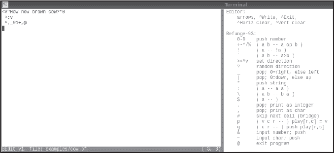
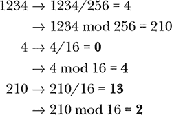

# 第十一章：BEFUNGE


和 Piet 一样，Befunge 是一种二维编程语言。Befunge 很有趣，使用起来不算特别难，而且生成的源代码是我见过的最具美学感的代码之一。我想到最后你也会同意这一点。

我们的目标是学习并实验 Befunge。紧随 BF 之后，它可能是最具影响力的另类编程语言之一，通常出现在诸如“你从未听说过的十大最奇怪编程语言”的列表中。我们将了解 Befunge 存在的原因以及它为何被称为 Befunge。然后，我们将按照惯例，通过示例探索语言的要点。最后，我们将进行讨论。我希望这仅仅是你进行 Befunge 实验的开始。

### **Befunge-93 世界之旅**

1993 年，电影 *侏罗纪公园* 将恐龙带上了大银幕，Mulder 和 Scully 在电视上追逐外星人，Bill Clinton 开始了他的总统任期。1993 年，一台典型的家用电脑大约价值 1,800 美元（按 2022 年的货币价值计算），拥有约 4MB 的内存，16 MHz 的时钟速度，20MB 的硬盘和一个“高密度” 1.44MB 的软盘驱动器。而最值得我们注意的是，1993 年，Chris Pressey 将 Befunge 赠送给了世界。

根据不同的视角，Befunge 被认为是世界上第一个二维编程语言。有人可能会争辩说，Konrad Zuse 的 *Plankalkül* 才是第一个，因为它的源代码包含了堆叠命令，但我认为 Befunge 的方法与众不同，足以获得这个荣誉。Pressey 创建 Befunge 的初衷是打造一种尽可能难以编译的语言。“Befunge”这个名字是“before”的拼写错误，发生在凌晨时分的 BBS 上。如果你不熟悉 BBS，它代表“公告板系统”，那是早期个人电脑爱好者通过慢速调制解调器在互联网普及之前相互交流的方式。

让我们深入探讨 Befunge 的世界，了解它是如何工作的以及如何编写 Befunge 代码。我们将从安装和构建 Befunge-93 的标准解释器开始，然后通过一些简单的示例来体验它。在这个过程中，我们还将学习如何使用 BEdit，一个 Befunge-93 编辑器。你不必非得使用 BEdit 来编写 Befunge 代码——任何文本编辑器都可以——但我发现 BEdit 很方便。说实话，我就是写了它，所以有点偏见。

#### ***构建 Befunge-93***

运行以下命令从创始人 Chris Pressey 的 GitHub 网站获取 Befunge-93。

```
> git clone https://github.com/catseye/Befunge-93.git
```

这将帮助你获取最新版本，很可能是 2018 年的银禧版。我们将使用这个版本。

构建 Befunge 解释器是简单的。然而，在构建之前，如果你愿意，我建议做一个小小的代码修改，使用`/dev/urandom`来初始化伪随机数种子，而不是使用`time`，这是原本的写法。这样，如果你在一秒钟内多次运行解释器，正如我们稍后在本章中要做的那样，伪随机生成器就不会重复产生相同的序列。

我建议按照以下步骤构建`bef`，Befunge 解释器：

```
> cd Befunge-93
> vi src/bef.c
```

第二个命令会启动一个文本编辑器并打开*bef.c*。如果你不使用`vi`或`vim`，请为你常用的编辑器做适当的替换（然后学习`vim`）。查找`srand`，它应该在第 252 行左右。然后替换：

```
srand((unsigned)time(0));
```

与

```
unsigned int seed;
f = fopen("/dev/urandom","rb");
fread(&seed,4,1,f);
fclose(f);
srand(seed);
```

最后，使用`make`来构建解释器。

```
> make
```

我们希望`bef`可执行文件位于*bin*目录下。我使用`gcc`时没有遇到问题，猜测你也不会。切换到*bin*目录并通过输入以下命令来测试构建：

```
> ./bef
USAGE: bef [-d] [-o] [-u] [-q] [-i] [-=] [-l] [-t]
           [-r input] [-w output] [-s stack] [-y delay] foo.bf
```

Befunge 很容易使用。稍后我们会探索它的可视调试器`-d`。你可能会想使用`-q`来抑制启动信息。我定义了一个别名：

```
> alias bef="bef -q"
```

Befunge 准备好了。我们来看看如何使用它。

#### ***打印文本***

Befunge 程序运行在一个 80 字符宽，25 行高的游戏区域内。所有 Befunge 指令都是单个字符。数据部分，Befunge 使用一个堆栈，像 Forth 一样。Befunge 甚至支持一些 Forth 原语来操作堆栈：`DUP`、`DROP`和`SWAP`。在我们探索过的所有异构语言中，Befunge 拥有最丰富的指令集。

最好的入门方式是亲眼看看 Befunge 如何运作。让我们从*cow.bf*开始。首先，我们运行它：

```
> bef examples/cow.bf
How now brown cow?
```

我同意，这没什么令人印象深刻的。我们来看一下代码。

```
<v"How now brown cow?"0
 >:v
 ^,_91+,@
```

好的，现在事情变得更有趣了。我们该如何理解这一堆字符呢？Befunge 程序像 Piet 程序一样可以在各个方向上运行，程序从左上角（第 0 行，第 0 列）开始，指令指针指向右侧，这意味着指令从左到右沿着行进行求值。

*cow.bf* 的第一行是 `<v"How now brown cow?"0`。第一个指令是 `<`，它告诉 Befunge 将指令指针移到左侧。游戏场景在边缘处会进行环绕，并且会忽略空格。因此，*cow.bf* 的第一个指令将流动方向向左移动，并环绕，忽略空格，并遇到 `0` 向右到左移动。Befunge 会将数字推入栈中，所以 `0` 会将 0 推入栈中。下一个指令是双引号 (`"`)，它开始字符串模式。解释器随后将字符的 ASCII 值推入栈中，直到遇到下一个双引号。因此，字符串 `How now brown cow?` 会以 ASCII 码的形式一个字符一个字符地被推入栈中。然而，Befunge 的程序流是从右到左的，所以字符串会以 *反向* 的顺序被推入栈中，从问号开始，最后是 `H`。但这正是我们想要的，因为栈是后进先出（LIFO）数据结构。我们现在有了第一个 Befunge 习惯用法：将字符串从右到左推入栈中，这样字符串可以从左到右在代码中读取。

最左侧的双引号后的字符是 `v`，它将程序流改为向下。紧接着的指令是 `>`，它再次将程序流改为向右。接下来是 `:`，它将栈顶的值复制一份，即 `H` 的 ASCII 码。

程序流再次被 `v` 指令引导向下，触发下划线符号（_），这是 Befunge 的两个条件指令之一。`_` 指令弹出栈顶项目，如果它是 0，则将程序流改为向右；否则，向左。如果栈顶项目是 0，我们希望结束程序，因为字符串已经被打印出来。回想一下，`<` 后的第一条指令在左上角将 0 推入栈中。

如果栈顶项目不是 0，则字符串尚未完全打印。因此，从 `_` 向左移动时，使用逗号（`,`）打印字符并将程序流改为向上。向上移动触发第二行的 `>`，使程序流再次向右。

`_` 指令遇到了程序开始时最初推入栈的 0。这将把程序流引导向右，执行 `91+,@`。前几个命令将数字 9 和 1 推入栈中并相加，使栈中包含 10。尽管在代码中栈只能推入单个数字，但栈本身支持有符号的 64 位整数。当栈中有 10 时，我们执行 `,`，将栈顶的项目作为 ASCII 字符输出—在此案例中是换行符。要结束一个 Befunge 程序，执行 `@`。

我们现在理解了 *cow.bf* 的工作原理。随着这些流动的左、右、上和下，最好能 *看到 cow.bf* 正在工作。幸运的是，Befunge 非常巧妙，通过使用 `-d` 命令行选项，我们可以字面上看到程序流的变化。这在任何输出被定向到文件时效果最佳。同样地，如果有用户输入，最好从文件中读取。显然，静态书籍无法向你展示程序的流动，但以下命令可以做到：

```
> bef -d -w ttt examples/cow.bf
```

按下 ENTER 后，你会看到屏幕顶部显示源代码，并且光标会在每条指令执行时流动。你可以看到循环重复，打印栈上的每个字符，直到结束。然后，输出会写入临时文件，*ttt*。

#### ***使用 BEdit***

*cow.bf* 是如何创建的？你可以使用普通的文本编辑器，但我用了 *bedit.py*，一个用 Python 创建的简单 Befunge 编辑器。我们不讨论代码，但如果你感兴趣的话可以看看。注意，你运行 *bedit.py* 的终端窗口必须至少宽 120 个字符，高 26 行。如果不符合要求，*bedit.py* 会愉快地提醒你。

执行 `python3 bedit.py examples/cow.bf` 会生成 图 11-1。



*图 11-1：编辑* cow.bf

编辑器有两个面板。左边是 80×25 字符的面板，这是 Befunge 的工作区，代码会写在这里。右边是编辑器和 Befunge 命令的总结，供参考。要在代码中移动，使用箭头键。你输入的任何字符都会进入光标所在的位置。为了便于输入代码，输入字符时光标会朝最后一次按下的箭头键方向移动。因此，要从右到左输入，先按左箭头将光标移动到左边，然后开始输入。只需要稍微试验一下，就能掌握它。

使用 CTRL-W 保存文件，使用 CTRL-E 退出，如果文件被修改过，退出时也会保存文件。你必须在命令行中提供文件名，无论是新文件还是旧文件。按下 CTRL-H 会清除从光标到右边缘的当前行。同样，CTRL-V 会清除从光标到下方的当前列。就是这些；编辑器很简单，但我用它创建了本章中的所有示例。

#### ***Befunge 打招呼***

在我们进入真正有趣，或者至少有示范性的 Befunge 程序之前，我们必须看一个必备的示例。运行 *hello.bf* 查看我们的最爱问候语。然后，打开它在 BEdit 中查看代码。

```
v>v                                                                             
8-8  Print "Hello, world!"                                                      
479                                                                             
*:*                                                                             
1:,                                                                             
+-,                                                                             
:3,                                                                             
3:,                                                                             
*+,                                                                             
12,                                                                             
++,                                                                             
:*,                                                                             
83,                                                                             
+7,                                                                             
:*,                                                                             
62,                                                                             
+:,                                                                             
:+9                                                                             
3*1                                                                             
-2+                                                                             
:6,                                                                             
8:@                                                                             
+*                                                                              
84                                                                              
>^
```

这是我们见过的更为独特的“Hello, world!”示例之一。注意，程序不去的地方是可以用来写注释的，比如第二行（从 0 开始计数）的注释。我们会从 0 开始计数，因为计算机界的人都是这么计数的。看看你能不能猜出这个版本是如何工作的（提示：想想字符，而不是字符串）。这并不复杂，只是由于 Befunge 的 2D 程序流程而显得不寻常。因为 Befunge 不能直接将大于 9 的数字推送到栈上，所以较大的数值必须逐步计算。

表 11-1 列出了 Befunge 的命令。

**表 11-1：** Befunge-93 命令集

| **命令** | **描述** |
| --- | --- |
| `0`–`9` | 输入一个数字 |
| `+-*/%` | `( a b -- a op b )` |
| `!` | `( a -- !a )` |
| ` | `( a b -- a>b )` |
| `><^v` | 设置指令指针方向 |
| `?` | 指向随机方向 |
| `_` | 弹出；0 = 右，其他为左 |
| `&#124;` | 弹出；0 = 下，其他为上 |
| `"` | 压入字符串 |
| `:` | `( a -- a a )` |
| `\` | `( a b -- b a )` |
| `$` | `( a -- )` |
| `.` | 弹出；作为整数打印 |
| `,` | 弹出；作为字符打印 |
| `#` | 跳过下一个单元（桥接） |
| `p` | `( v c r -- )` play[r,c] = v |
| `g` | `( c r -- )` 压入 play[r,c] |
| `&` | 输入数字；压入栈 |
| `~` | 输入字符；压入栈 |
| `@` | 退出程序 |

大多数命令很容易理解，但有一些命令，如 `#`、`?`、`p` 和 `g`，比较不直观，以下的示例将专门讲解这些命令。注意适当使用类似 Forth 语言风格的栈效果注释。

### **Befunge 的应用**

Befunge-93 的代码库中包含了许多位于 *eg* 目录下的示例。尽管如此，除了讨论中提到的一个例外，我们将在本章中自己编写示例。

我们特别探讨 Befunge 的独特之处。自然，二维语言就很不常见，但我认为该语言的其他部分在编码思维方面更加有趣。

然而，首先我们必须探索流程控制，同时也要了解输入是如何工作的。完成这部分后，我们就可以顺利地探索语言的其他特性。在流程控制之后，我们将探讨 Befunge 的 `#` 桥接命令，初看似乎没什么用，但实际上它非常巧妙。接下来是 `?`，Befunge 的伪随机数生成器。最后，我们用 `p` 和 `g` 结束这一部分，它们使得数据可以存储在程序空间中并支持自修改代码。

#### ***跟随流程***

Piet 中的流程控制（第九章）是通过设置障碍来实现的。Befunge 通过显式选择新的方向来简化流程控制，就像我们在 *cow.bf* 和 *hello.bf* 中看到的那样。

让我们通过两个示例来加深对 Befunge 中流程的理解。第一个示例将一串二进制数字转换为十进制。第二个示例将使用 DOS 行结束符的文本文件转换为 Unix 格式。

##### **二进制转十进制**

将二进制数转换为十进制的一种方法是，从左到右依次将二进制数字加到一个初始为 0 的运行总和上，然后乘以 2。当所有数字处理完后，除以 2 得到最终值。除以 2 是必要的，因为乘以 2 是为了为下一个数字做准备；然而，在读取完最后一个数字后，就没有下一个数字了。

例如，如果输入是 1101[2]，我们得到的十进制等效值是

((((((((0 + 1) × 2) + 1) × 2) + 0) × 2) + 1) × 2) ÷ 2 = 13

我们将使用栈来保存运行总和；因此，首先需要在栈上放一个 0。然后，我们开始一个循环，读取一个字符，减去 48 使其变为 0 或 1，添加到运行总和中，然后乘以 2。当所有二进制数字读取完后，除以 2，打印栈顶项作为十进制数，并退出。很简单。

好吧，差不多。我们怎么知道所有二进制数字都已读取完毕呢？会发生两种情况，其中任何一种都会影响所读取的输入字符的值。如果字符是换行符，ASCII 值为 10，那么我们知道输入已经完成。另外，如果从文件中读取，输入可能是文件结尾（EOF），Befunge 将其报告为*–*1。因此，我们需要检查这两种情况。

清单 11-1 展示了*bin2dec.bf*。

```
0v          >68*-+2*  v
        >:1+|
 >~:55+-|   >$2/.55+,@>
        >$2/.55+,@
```

*清单 11-1：将二进制字符串转换为十进制*

这段代码非常简洁，只有四行代码。第一行以`0v`开始，表示将 0 压入栈并向下移动。接下来的指令是`>`，表示再次向右移动。在这时，我们要读取一个二进制数字并检查它是否为换行符：`~:55+-|`。第一个字符（波浪符）将二进制数字作为字符读取并压入栈。第二个字符（冒号）复制字符值，以便我们可以在不丢失该值的情况下减去 10。

为了将 10 推入栈，我们使用`55+`，并使用`-`进行减法。栈现在包含当前总和（仍然是 0）、第一个字符，以及从字符中减去 10 得到的结果。如果字符是换行符，栈将包含 0，管道符（`|`）将改变程序的流向向下，从而执行`>$2/.55+,@`来删除最后一个输入字符的多余副本，除以 2 输出当前总和作为数字，输出换行符并退出。请注意，`|`是 _ 的上下等效符号。如果栈顶项为 0，它将使程序流向下；否则，流向上。

如果字符不是换行符，程序流将从`|`上移到`>:1+|`。这段代码检查是否读取了 EOF，通过加 1 并询问栈顶项是否为 0。如果是，流将从第二个管道向下移动，执行第二个`>$2/.55+,@`副本，从而打印出十进制答案。

最后，如果字符不是换行符或 EOF，我们会移动到第 0 行的其余部分，`>68*-+2*`，以减去 48，将 0 或 1 加到当前总和中，并乘以 2。第 0 行的最后一个字符是`v`，它将流向第 2 行的最后一个字符`>`，然后回绕到第 2 行的开头以获取下一个输入字符。

有几种方法可以运行*bin2dec.bf*。我们可以直接运行它并手动输入二进制数字。或者，我们可以使用`echo`将数字发送到`bef`。最后，我们可以使用文件重定向。例如：

```
> bef examples/bin2dec.bf
1101
13
> echo 11010 | bef examples/bin2dec.bf
26
> bef examples/bin2dec.bf <ttt
52 
> cat ttt
110100
```

要观察*bin2dec.bf*的追踪，我们可以像上面一样使用`ttt`，但需要使用 Befunge 的命令行参数。例如：

```
> bef -d -r ttt -w qqq examples/bin2dec.bf
```

如果你观察追踪，你会看到程序在读取换行符时结束。我们可以通过`xxd`明确看到换行符。

```
> xxd ttt
00000000: 3131 3031 3030 0a
```

然而，输入文件不需要以换行符结尾。在这种情况下，程序不会通过第一个检查换行符的管道退出，而是通过第二个读取 EOF（即*–*1）的管道退出。以下 Python 代码片段创建了一个没有最终换行符的新输入文件。

```
with open("zzz","r") as f:
    f.write("110100")
```

现在像上面那样运行*bef*，用`-d`参数替换`zzz`为`ttt`，仔细观察。程序通过进入第二个管道结束。这个故事的教训是：在决定 Befunge 程序的输入是否完成时需要小心。

##### **从 DOS 到 Unix**

将文件从一个计算机系统转移到另一个系统时，一个常见的问题是行结束符不匹配。Unix 系统在每一行的末尾使用 ASCII 10。这是换行符，有时称为“newline”。然而，Windows 系统（基于 MS-DOS）在每行的末尾使用两个字符：ASCII 13 和 ASCII 10。ASCII 13 是回车符。除了浪费不必要的磁盘空间，回车符还会导致期望只有换行符的系统出现问题。ASCII 13 是 CTRL-M，所以一些 Unix 编辑器在处理具有 DOS 行结束符的文件时会显示多余的`^M`。因此，将这样的文件转换为 Unix 格式是很有必要的。更复杂的是，早期的 Macintosh 文本文件只使用 ASCII 13 作为行结束符。幸运的是，这种文本文件越来越少见了。

自然地，有一些工具可以转换文本文件的行结束符，更不用说现代文本编辑器可以轻松处理 DOS 文件了。但暂且假设现在是 1993 年，我们的 Amiga 电脑还没有受到 DOS 的影响。我们需要一个转换工具，而恰好我们有这个新奇的语言 Befunge 可以玩。它肯定能做我们想要的。

清单 11-2 包含了*dos2unix.bf*，一个将具有 DOS 行结束符的文本文件转换为 Unix（和 Amiga）格式的程序。从结构上看，它与清单 11-1 相似，但也有一些不同之处。

```
v          >       >>,
     >:85+-|
>~:1+|     >$~:55+-|
     @             >^
```

*清单 11-2：将 DOS 行结束符转换为 Unix 格式*

程序的整体流程是从左到右的，从第二行的第 0 列开始。第一个代码块`~:1+|`读取一个字符并确认它是否是 EOF。如果是，我们就完成了，`@`就会结束。如果不是，我们需要检查读取的字符是否是 ASCII 13，这正是`>:85+-|`所做的。如果减去 13 得到 0，那么字符就是 ASCII 13。在这种情况下，进入第二行的分支`>$~:55+-|`，它去掉多余的 ASCII 13，读取下一个输入字符，并检查它是否是 ASCII 10。如果是，我们希望保留它，所以`>^`会移动到`>>,`进行打印。如果第二个字符不是 ASCII 10，我们就遇到了嵌入的 ASCII 13，这有点奇怪，但没关系，我们会保留它。这就是第二行管道的上层分支。最后，如果第一行的管道没有向下移动，它会向上移动以打印输入字符。这是大多数字符读取时所走的路径。

现在让我们测试*dos2unix.bf*。要使用重定向运行它，请使用以下命令：

```
> bef examples/dos2unix.bf <ttt.dos >ttt.unix
> xxd ttt.dos
00000000: 4142 430d 0a44 4546 0d0a 4142 430d 0a44  ABC..DEF..ABC..D
00000010: 4546 0d0a                                EF.. > xxd ttt.unix
00000000: 4142 430a 4445 460a 4142 430a 4445 460a  ABC.DEF.ABC.DEF.
```

输入文件*ttt.dos*使用 DOS 行结束符。`xxd`的输出显示回车和换行字符为`0d0a`。输出文件*ttt.unix*只有`0a`，这是应该有的。

我承认这一节中的两个例子并不是最吸引人的。不过，它们有助于检查你对 Befunge 工作原理的理解。编写程序比阅读程序更有趣，所以我鼓励你尝试类似的东西。也许是一个将 Unix 文本文件转换为 DOS 版本的小工具？当你准备好了，继续下一个章节。

#### ***搭建桥梁***

当你读 Table 11-1 时，最让你摸不着头脑的指令很可能是`#`（井号），桥接指令。这个指令会跳过下一个指令，起到桥接的作用，跳过它。

例如，一个只包含`88*1+#.,`的 Befunge 程序将永远打印字母*A*。首先，`88*1+`将 65 放入栈中。然后，`#`跳过下一个指令，该指令是一个点号用来打印`65`，而是直接跳到逗号，打印 ASCII 值 65，即`A`。这就是第一行的所有文本，因此指令指针将循环回去，反复执行（见 Listing 11-3）。

```
<v"xyzzy"0
 >:#v_82+,@
 ^ ,<
```

*Listing 11-3：桥接指令的一个用途*

`#`跳过下一个指令——我们为什么要这么做呢？`#`的一个原因可以在*bridge.bf*中找到（见 Listing 11-3），它做的仅仅是打印单词`xyxxy`。如果你听到一个空洞的声音说“傻瓜”，不要担心。（如果你不理解这个引用，也不用担心。）

与上面的*cow.bf*示例类似，*bridge.bf*从右向左移动并循环打印字符。然而，在这种情况下，考虑第 1 行，`>:#v_82+,@`。从左到右，指令是向右移动，复制栈顶的字符，然后跳过`v`指令，但执行下划线（_），如果栈顶元素为 0，则向右移动，否则向左移动。

这时我们就看到了桥接指令的用处。如果字符是 0，向右移动并将 10 压入栈中，打印换行符并退出。否则，向左移动。从`_`向左移动的第一个指令是`v`，这是在从左向右移动时被`#`跳过的指令。

执行`v`会向下移动，再向左移动，打印字符，最终循环回去处理下一个字符。因此，桥接命令在这个例子中非常重要，因为它允许在程序向右流动时使用一组指令，而在程序向左流动时执行另一组指令。记住这个行为，因为我们将在下一节再次看到它。

#### ***骰子的乐趣***

Befunge 的`?`命令会随机改变指令指针的方向，可能是上、下、左或右。让我们来玩玩这个不寻常的指令。乍一看，我们可能会觉得它没什么用：谁需要一个不确定的程序呢？不过，随机数在从游戏到模拟的各种应用中都很常见。我们能否将`?`用到类似的场景中？

由于`?`选择了一个新的指令指针方向，似乎很合理我们可以利用它来模拟骰子。特别是，`?`从四个可能的方向中选择，因此我们可以模拟玩家所说的 D4，这是一个有四个面的骰子，而不是通常的六面骰。

`?`如何在这里帮助我们呢？嗯，如果我们遇到`?`，有四个可能的方向可以选择，因此如果我们根据选择的方向推动 1、2、3 或 4，我们就能得到一个四面骰。

清单 11-4 展示了模拟四面骰的一种方法。

```
v  > v
>#v?v
  1234
  >>>>.91+,@
```

*清单 11-4：模拟四面骰*

在这种情况下，我们通过下移到第 1 行，然后向右移动，进入`?`。注意第 1 行的桥接指令。当向右移动时，我们希望跳过`v`指令以到达`?`。如果`?`选择向左移动，我们会遇到`v`，它将我们带到第 2 行并在栈上推送 1。同样，`?`的其他三个方向将分别推送 2、3 或 4，然后到达第 3 行，这里会向右移动以打印选定的值。

如果我们运行*die4.bf* 10,000 次，我们期望每个结果值的出现频率大致相等。一次 10,000 次的实验产生了 `[2472, 2577, 2452, 2499]`，分别表示 1、2、3 和 4 的出现次数。这些值相似，因此可以公平地说我们的四面骰程序运行正常。

清单 11-5 展示了模拟标准六面骰的第一次尝试。

```
     v
v  .2?1\.  v
     v
 v .4?3\. v
     v
  v.6?5.v
     ^
>>>  v  <<<
     5
     5
     +
     ,
     @
```

*清单 11-5：尝试模拟六面骰*

如果没有别的，清单 11-5 的设计是不错且对称的。我曾考虑把它印在 T 恤上。流程从上到下沿中间流动。当解释器遇到`?`时，向上移动会将流程强制回到`?`，只留下三个出口：向两侧或向下。如果向两侧，则会在栈上推送并打印 1 到 6 之间的数字，箭头将流程移动到底部打印换行符后退出。

有六个数字，因此这种安排肯定是合适的。如果你运行这个版本 10,000 次，可能会得到类似 `[3337, 3333, 1072, 1109, 543, 606]` 的分布，这并不均匀。清单 11-5 可以在*die6_biased.bf*中找到，正如你从名字中可以预见的那样，它是一个有偏的骰子，强烈偏向 1 和 2。

从计数结果来看，1 和 2 与 3 和 4，再到 5 和 6 的比率是 6:2:1，这意味着 1 的出现频率是 6 倍于 6 的。如果我们看看列表 11-5 的结构，就能计算出每个结果的概率。第一个`?`有 1/3 的概率选择 1、2 或继续到其他数字。因此，选择 1 或 2 的概率是 1/3 + 1/3 = 2/3。这意味着剩余概率的总和，即选择 3 到 6 的概率，必须是 1/3。选择 3 或 4 与选择 1 或 2 类似——它们的概率是 1/3——但它是从原本 1/3 的概率中再选择，因此选择 3 或 4 的概率是 1/9，选择 5 或 6 的概率也是 1/9。最终，选择 5 或 6 的 1/9 的概率均分为选择 5 或 6 的各 1/18 的概率。

如果上述的概率是正确的，它们的总和应该等于 1。让我们使用 Scheme 来检查它们是否满足这个条件。

```
> racket
Welcome to Racket v6.11.
> (+ 1/3 1/3 1/9 1/9 1/18 1/18)
1
```

我们的计算是正确的。显然，除了美学考虑，我们不希望看到列表 11-5。那么，如何利用选择 1/4 的机制来得到选择 1/6 并且概率相等的结果呢？

如果我们将`?`限制为只选择两个选项中的一个，我们可以使用每一个输出去选择另一个对，从而将两个选项变成四个。对每一对都做相同的操作，我们就得到了八个输出，每个输出被选中的概率相同。我们只需要这八个中的六个，因此如果选择了剩下的两个中的任何一个，就重复此过程直到选中六个之一。

有多种方式可以编写这样的算法。文件*die6.bf*包含其中的一种实现（见列表 11-6）。花些时间查看代码，理解它的意义。然后再停留一会儿，欣赏代码那种空灵的美感。

```
v                    >
              >      ?<
                     >6  v   v
       >      ?<
                     >5  v >      ?<
                     >4  v
>      ?<                >.91+,@
                     >3  ^
              >      ?<
                     >2  ^
       >      ?<
                     >1  ^
              >      ?<
^                    >
```

*列表 11-6：模拟具有相等概率的六面骰子*

最右边的指令将 1 到 6 压入栈中。然而，如果流动到达顶部或底部，它会继续向右延续，绕回到起点，直到选中六个目标路径中的一个。

在列表 11-6 中运行代码 10,000 次，得到的频率为`[1678, 1638, 1705, 1660, 1637, 1682]`，这正是我们想要的；每个结果现在的选中概率是相等的。作为练习，看看你是否能构造出`?`的排列来模拟一个 8 面骰子、12 面骰子，甚至是 20 面骰子。

#### ***四处游走***

文件*brownian.bf*包含一个程序，其中整个游戏场地都被`?`填充，除此之外没有任何内容。单独运行这个程序很无聊，它没有输出，也不会结束。然而，用 Befunge 的调试器运行它却很迷人：

```
> bef -d examples/brownian.bf
```

光标在游戏场地上游走，给人一种类似于布朗运动的感觉，即粒子在某种介质中的随机运动。

在我们继续之前，看看*zero.bf*。它由一个完全由`?`命令构成的游戏场地和中央的一个句点（`.`）组成。

Befunge 从不因为栈而抛出错误。如果你在栈为空时尝试弹出栈，Befunge 会返回 0。打印指令会弹出栈，所以当栈为空时打印会输出 0。如果你用调试器运行 *zero.bf*，你可能会认为要等很长时间才能执行到唯一的打印指令。然而，如果你没有用调试器运行 *zero.bf*，你的屏幕会迅速被 0 填满。人类对计算机运算速度的感知远远慢于计算机的实际速度。计算机的运算速度比我们能理解的要快得多，甚至像 Befunge 这样简单的解释器也能以极高的速度随机达到那个唯一的打印指令。实际上，将输出打印到屏幕上是很慢的。将输出重定向到文件，即便是我的旧系统，Befunge 每秒也能打印近 15,000 个 0。

然而，事实证明我之前关于 Befunge 不会抛出栈错误的说法是错误的。运行这个程序：`00/.@`。我把它当作一个复活节彩蛋。

#### ***动态更新游戏区***

Befunge 程序存在于游戏区，而内存仅限于栈。或者说真的是这样吗？`p` 指令允许程序员在程序运行时写入游戏区。如果修改的单元格恰好是正在运行的程序的一部分，并且写入的值是一个有效命令的 ASCII 码，Befunge 将会使用该命令。这意味着 Befunge 允许自修改代码，而在正常情况下，自修改代码是禁忌的。但由于我们在处理的是怪异语言，许多禁忌可能变得可以接受。使用 `p` 写入游戏区，使用 `g` 从游戏区读取数据。

让我们通过两个例子来探索 `p` 和 `g`。第一个将小于 65,536（= 2¹⁶）的整数转换为四位十六进制数。第二个是一个简单的计算器。

##### **什么是十六进制？**

老式 BASIC 语言使用 `DATA` 和 `READ` 在源代码中存储数据。这些通常是一些小型机器语言例程的指令，后来通过 `POKE` 被写入内存并由 BASIC 通过 `CALL` 调用。我们可以类似地使用 `g` 从游戏区读取数据。

假设栈上有一个数字 *v*。我们假设它是正数且小于 65,536。我们的任务是将这个数字转换为四位十六进制数并打印出来。实现这个的方法之一是通过将 *v* 分成两部分，替换成 *v*/256 和 *v* mod 256。然后，如果我们使用 16 替代 256 对这两个拆分值做同样的操作，就可以提取出四个十六进制数值。

例如，如果用户输入 1234，操作序列将导致



或者 (0,4,13,2) = 04*D*2[16] = 1234。

让我们来测试一下这个算法，并同时使用 `p` 和 `*g*`，因为我们可以。我们需要的代码在 *dec2hex.bf* 中，并且可以在 列表 11-7 中查看。

```
v    0123456789ABCDEF
>&:55*55+*6+/\55*55+*6+%            v
v                    p01%*28p02/*28:<
>:82*%30p82*/40p                    v
v                           ,g0+5g04<
>30g5+0g,                           v
v                           ,g0+5g02<
>10g5+0g,55+,@
```

*列表 11-7：将十进制转换为十六进制*

该程序以之字形模式逐行执行，从第 1 行开始。首先，系统要求用户输入一个数字（`&`），接着执行除以 256 和取模 256 操作。行末时，*v*/256 和 *v* mod 256 会被压入栈中。

第 2 行从右到左执行。翻转指令后，解释器执行`：82*/20p82*%10p`。让我们来分解一下。第一条指令复制栈顶项，*v*模 256。接下来，`82*/`将栈顶项除以 16，从而计算出答案的第二个数字。为了将其存储在游戏区域中，我们使用`20p`。

表 11-1 指出，`p`指令期望栈中有三个值：要存储的值、游戏区域的列和游戏区域的行。因此，`20p`会将第二个数字的值存储在第 0 行、第 2 列。第 2 行的其余部分使用模运算来获取第一个数字的值，并将其放入`10p`，第 0 行、第 1 列。第 3 行，从左到右，重复计算，找到数字 3 和 4 的值。

当第 4 行开始时，再次从右到左运行，我们在游戏区域的第 0 行拥有数字值。现在我们需要将它们作为 ASCII 字符打印出来。你可能注意到了在第 0 行有一个字符串`0123456789ABCDEF`。我们将使用这个字符串来获取我们需要的字符。这相当于 BASIC 或 FORTRAN 中的`DATA`。数字值作为该字符串的索引。

翻转后，第 4 行是`40g5+0g,`。第一部分，`40g`，读取数字 4 的值，即最重要的数字。为了索引正确的字符，我们需要加上 5，然后另一个`g`会提取正确的字符，将其 ASCII 值放到栈中，供`,`打印。其余的清单 11-7 打印出剩余的答案并换行，然后结束。

运行*dec2hex.bf*可以证明程序是有效的。

```
> bef examples/dec2hex.bf
1234
04D2
```

用调试器运行这个例子更有趣。例如，如果临时文件*ttt*包含一个整数，比如 6502，我们可能会使用以下代码来运行：

```
> bef -d -r ttt -w qqq examples/dec2hex.bf
```

在代码执行时，仔细观察顶行。你会看到四个灯，呃，点出现在屏幕上。这些是由`p`指令放置在游戏区域中的具体数字。当程序结束时，输出会在另一个临时文件*qqq*中，该文件包含 1966[16] = 6502。

使用游戏区域来存储程序数据是一个方便的选项。使用游戏区域来改变程序执行则是下一步。让我们来看一下。

##### **程序变形**

自修改代码，或者我喜欢称之为*程序变形*，很少被使用，而且有其充分的理由。然而，Befunge 支持这种方式，而且有时它比不支持更为方便。例如，一个计算器程序需要接受一个数字、一个运算符以及另一个数字。无论运算符是什么，代码基本相同，只要运算符是二元的。Befunge 支持五个二元算术运算符：`+`、`-`、`*`、`/`和`%`。我们来做一个简单的计算器，允许用户输入一个单一数字，期望的运算符和第二个数字，然后计算并输出结果。

在 Python 中，我们可能会这样实现一个计算器：

```
a = int(getch())
op= getch()
b = int(getch())
if op == "+":
    ans = a + b
elif op == "-":
    ans = a - b
elif op == "*":
    ans = a * b
elif op == "/":
    ans = a / b
elif op == "%":
    ans = a % b
print(ans)
```

我们假设存在一个函数`getch`，它返回从键盘读取的单个字符。

Python 代码可以实现这个功能，但它高度重复的`if`语句并不特别吸引人。如果我们知道操作是加法，代码会变得更简单。

```
a = int(getch())
b = int(getch())
print(a+b)
```

如果操作是除法，代码是一样的；只需将`+`替换为`/`。

我们的 Befunge 计算器的关键在于短语：“只需将 *X* 替换为 *Y*”。这正是我们要做的：我们将程序写成如果操作符始终是加法，但在程序执行过程中修改游戏场地中的程序源代码，以使用用户的实际操作符。

算法上，我们需要做的是：

1.  从用户那里获取一个数字字符，并将其转换为堆栈上的一个数字。

1.  从用户那里获取一个操作符字符，并将其放置在游戏场地中的适当位置，以便 Befunge 在计算答案时使用它。

1.  从堆栈中获取用户输入的第二个数字。

1.  执行操作并打印答案。

清单 11-8 展示了 *calc.bf*。它甚至比它所做的事情的描述还要简短。

```
~68*-~61p~68*-84*,88*3-,84*,v
@,+82.+                     <
```

*清单 11-8：程序变形的实际操作*

第一部分读取一个字符，假设它是一个数字，并减去 48 将其转换为整数。那是`~68*-`。然后程序请求输入操作符，并将其放置在第 1 行第 6 列（`~61p`）。如果你查看第 1 行第 6 列，你会看到它包含一个`+`，这个`+`会被用户输入的操作符字符覆盖——程序变形！

第 0 行的其余部分获取第二个数字，打印一个空格，一个等号，再加一个空格。第 1 行应用更新后的操作，打印结果和换行符，然后退出。让我们看看 清单 11-8 的实际运行。

```
> bef examples/calc.bf
8*5
 = 40 
> bef examples/calc.bf
9%4
 = 1 
> bef examples/calc.bf
2+2
 = 4 
> bef examples/calc.bf
2-9
 = -7
```

Befunge 的目标是创造一种难以编译的语言，因此允许自我修改代码是合理的。在这种特定情况下，尤其考虑到 Befunge 作为编程语言的运作方式，一点自我修改是更优雅的解决方案。没有它，*calc.bf*将不得不大得多：它需要能够将操作符字符与五个可能的操作符进行比较，并为每个操作符提供不同的代码路径。这显然不如现在这样优雅。

### **讨论**

Befunge-93 是命令式的，堆栈大小是任意的，仅受计算机内存的限制，因此我们可能认为它是图灵完备的。然而，它并不是。阻止它成为图灵完备的是许多其他语言没有的限制：程序 *必须* 适应游戏场地，因为那里就是所有的空间。因此，程序不能过于复杂，Befunge-93 并不是图灵完备的。

你可能会注意到，在前一段中，我特别小心地输入了“Befunge-93”。Befunge 的后续版本，Befunge-98，取消了对游戏场地大小的限制，因此 *它* 是图灵完备的。然而，我对原版 Befunge 有一种亲切感，这也是我们在这里使用它的原因。

网络上有许多关于 Befunge 的额外资源，尽管没有 BF 或 Piet 那么广泛。Befunge 最好的资源是 *[`esolang.org/`](https://esolang.org/)* 和 Chris Pressey 的网站 (*[`git.catseye.tc/Befunge-93/`](https://git.catseye.tc/Befunge-93/)*)。我还觉得这次与 Pressey 的访谈很有趣： *[`esoteric.codes/blog/interview-with-chris-pressey/`](https://esoteric.codes/blog/interview-with-chris-pressey/)*。Befunge 在其中占据了重要位置。最后，如果你像我一样，你会通过浏览 Pressey 的整个站点，发现许多有趣的内容值得探索和思考，包括他这些年来开发的其他编程语言 (*[`catseye.tc/`](https://catseye.tc/)*).

Befunge 已经用 Befunge 编写过——请参阅附带的 *befunge.bf* 文件。它来自 Esolang 维基。使用时，运行 *befunge.bf*，并传入你希望从标准输入运行的 Befunge 程序。如果程序有输入，请用分号（`;`）分隔程序文本和输入。例如：

```
> bef examples/befunge.bf <examples/cow.bf  2>/dev/null
How now brown cow?
```

这非常令人印象深刻，也加强了一个观点：如果有足够的程序空间，Befunge-93 将是图灵完备的。`2>` 重定向忽略了 Befunge 错误消息，如果没有使用它，你会看到这些错误。

正好，Befunge 中的 Befunge 解释器适配了游戏场地。Esolang 维基没有提供 *befunge .bf* 的作者信息，所以我不确定应该感谢谁提供了这么巧妙的实现。

二维编程很可爱，也非常符合“好”的 esolang 定义——它是超越常规的东西。对我来说，巧妙之处在于看到了像 `#` 这样的指令的实用性，它是一个桥接指令，同时也意识到运行方向不同的程序可能在从左到右或从右到左运行时，即使是同一行代码，可能会做稍微不同的事情。使用一位数字，知道任何数字都可以根据需要在栈上构建，这也是非常巧妙的。

优秀的 esolang 会激发其他 esolang 的灵感，Befunge 也不例外。例如，如果有二维语言，为什么不可以有三维语言呢？有兴趣吗？如果有的话，可以看看 Suzy（*[`github.com/gvx/suzy/`](https://github.com/gvx/suzy/)*）。不过要注意，它已经超过十年没有更新了，所以运行示例时请使用 Python 2.*X*。

那么其他的二维语言呢？Befunge 启发了许多 esolang，以至于出现了一个专门描述它们的术语：*fungeoids*。Esolang 维基列出了 *[`esolangs.org/wiki/Category:Two-dimensional_languages`](https://esolangs.org/wiki/Category:Two-dimensional_languages)* 中的 fungeoids 页面。如果模仿是最真诚的恭维，那么 Befunge 应该会感到非常受宠若惊，当然，前提是 Befunge 能够有感觉。

### **总结**

本章的目标是 Befunge。我们了解到，Befunge 是第一个二维编程语言，已经存在足够长的时间，甚至有了银禧年，它的编程过程非常有趣。我们还了解到，Befunge 激发了大量相关的怪异编程语言：即所谓的 fungeoids。

随着这一章的结束，我们对现有的怪异编程语言（esolangs）进行了探索。第一部分讨论了编程语言的基本要素。第二部分通过研究非典型编程语言，为我们了解怪异编程语言做了准备，而第三部分则探讨了现有的怪异编程语言。现在，我们进入第四部分，来实现两种本土创作的怪异编程语言：Filska 和 Firefly。
