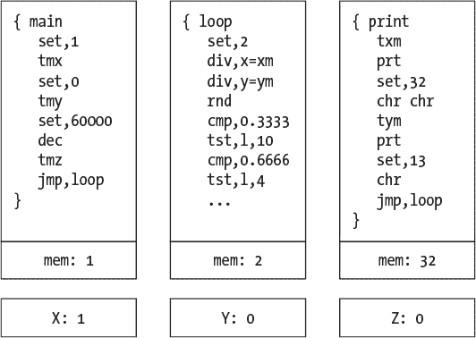

# 第十二章：FILSKA


现在是设计我们第一个 esolang 的时候了，Filska。Filska（发音为“full-ska”）是设得兰群岛方言中的一个词，意思是“充满活力的乐趣”。是否编程语言能体现这样的特质是值得合理讨论的，但和大多数 esolang 一样，乐趣是其中的一个元素，所以这个名字似乎是合适的。（顺便说一句，如果你像我一样喜欢苏格兰小提琴音乐，可以找一支来自设得兰的乐队的音乐，乐队的名字和这个语言一样。这个名字的巧合纯属偶然，我向你保证。）

在本章中，我们将概述 Filska 的哲学与设计。接下来，我们将在 Python 中为它创建一个解释器。在 第十三章 中，我们将实际尝试使用 Filska。

### **哲学与设计**

Filska 是对这个问题的回答：在一个每个子程序只能操作一个内存位置的语言中编程是什么感觉？

Filska 支持浮点数，并且语言本身非常简单，使得实现解释器变得容易。正如我们所看到的，这通常是 esolang 的特点。所以表面上看，Filska 有点像汇编语言。我们更感兴趣的是尝试在一种受限语言中编码的体验，在这种语言中，每个子程序只被允许操作一个内存位置；因此，我们或许可以理解为什么语法如此简单。

当然，如果每个子程序只能操作其自身的内存位置，那么子程序之间就无法共享信息。解决这种问题的典型方法是使用栈，类似于 Forth，但我们会更加严格，模拟简单的微处理器。因此，Filska 支持三个浮点寄存器，X、Y 和 Z，任何子程序都可以在操作自己的内存位置的同时操作这些寄存器。与许多简单的微处理器一样，这些寄存器的能力是有限的。我们可以将每个 Filska 子程序视为拥有自己的累加器，并能访问三个索引寄存器。

从概念上看，一个 Filska 程序的结构如 图 12-1 所示。



*图 12-1：Filska 程序的概念结构*

图 12-1 中的代码是输出 Sierpiński 三角形各点的示例程序的一部分。程序有三个子程序：`main`、`loop` 和 `print`。所有 Filska 程序至少有一个 `main` 子程序，执行从这里开始。与汇编语言的相似性非常明显。

每个子程序负责一个单一的内存位置。在 图 12-1 中，内存位置中的值代表程序可能的状态。`main` 中的 `set,1` 指令将 `main` 的内存位置设置为 1。

图中还指示了三个通用寄存器，X、Y 和 Z。在图中，X 被设置为 1，这是因为 `main` 中的 `tmx` 指令将当前子程序的内存值（1）转移到 X。

关于图 12-1 中发生的事情还有更多内容可以讨论，但我们首先需要更好地理解 Filska。因此，让我们详细介绍 Filska，以便在 Python 中实现它。

#### ***程序结构和语法***

一个 Filska 程序是一个或多个子程序的集合。程序从 `main` 子程序开始执行，而 `main` 子程序必须存在。Filska 的语法特别简单：标记由空格分隔。每个标记要么是子程序声明的一部分，要么是与子程序相关的指令。允许注释；注释以双引号（`"`) 开头，直到行尾。

清单 12-1 展示了一个完整的源代码，它是一个从 10 倒数到 1 的简单程序。

```
"  Loop and decrement (ex1)
{ main
    set,10    " set mem to 10
    prt       " print it
    tmx       " mem -> X
    set,13    " 13 -> mem
    chr       " newline
    txm       " X -> mem, restore count
    dec       " decrement mem
    tst,n,-6  " if mem != 0, go back six instructions
    hlt       " end
}
```

*清单 12-1：从 10 倒数到 1*

首先需要注意的是以双引号开头的注释行。正如你所期望的，注释会被解释器忽略。接下来，定义了一个单一的子程序，即必需的 `main`。从语法上讲，一个子程序由一个左大括号（`{`）、一个名称、一个或多个指令和一个右大括号（`}`）组成。所有标记由空格分隔，意味着即使一个完整的指令由多个部分组成，它内部也不能有空格。同样，这样做是为了让我们的实现更简单，以便我们可以专注于语言本身。最后，Filska 不区分大小写，所以 `hlt` 和 `HLT` 是相同的指令。我们在文本中将使用 `hlt`，但在代码中，任何大小写组合都是可以的。

如果你运行清单 12-1 中的程序

```
> python3 filska.py examples/ex1.filska
```

你将看到一个从 10 倒数到 1 的输出，每行一个数字。我们将在本章稍后详细讲解这个例子。

如果 Filska 的概念仅此而已，我也不会浪费时间讲解它。然而，它有一些有趣的约束，使得使用这个语言略显挑战。它也很有趣：Filska 需要不同的思维方式来做一些在标准编程语言中可能很自然的事情。

我们已经提到过每个 Filska 子程序如何操作其自己的内存。这是一个约束。另一个约束涉及子程序之间的程序流。Filska 没有调用栈。它没有子程序或函数的概念。相反，一个子程序运行，如果指示了，它会将程序流转移到另一个子程序。Filska 一次只运行一个子程序，因此我们这里讨论的并不是并发。

所有子程序都会无限运行，除非另有指示。如果一个子程序的最后一条指令被执行，程序流会从子程序的顶部重新开始。因此，单个 Filska 子程序本身就充当了一个循环。然而，上面的例子以调用 `hlt`（停止）指令结束。如果你移除 `hlt` 指令，倒计时将永远重复。试试看吧。当你看得厌烦时，可以使用 CTRL-C 来退出解释器。

因此，Filska 中的无限循环是隐式的。还有什么需要知道的吗？每个 Filska 子程序都保持自己的程序计数器，它是指向下一条应执行指令的指针。以某种方式，所有我们使用过的编程语言都执行了类似的操作。如果我们在 Python 中有如下的函数

```
def f(x):
    y = 2*x**2 + 3*x - 4
    return y
```

我们会期望调用 `f(3)` 时返回值为 23。如果我们第二次以不同的值调用 `f`，比如 `f(4)`，我们希望它从第一条指令重新开始，经过 `return` 返回 40 作为输出。`f` 的程序计数器在第一次调用后会重置为 0。

在 Filska 中，除非明确重置程序计数器，否则在转移到另一个子程序时，程序计数器会持续存在。我们将在下一节看到这如何运作，但目前的意思是，如果子程序 *A* 转到子程序 *B*，并且经过一系列指令后，子程序 *B* 再次转回子程序 *A*，那么 *A* 的执行将从 *下一条指令* 开始，而不是从第一条指令开始。因此，认为 Filska 子程序是子例程是错误的，因为它们不会重置自己，而是在转移过程中保持当前状态。

我们可以用以下语句来表达 Filska 运作的环境：

+   Filska 程序是独立子程序的集合。

+   Filska 子程序操作一个单一的浮点内存位置 M。

+   Filska 子程序可以访问三个共享的浮点寄存器：X、Y 和 Z。

+   Filska 子程序在执行完最后一条指令时会循环。

+   子程序之间的转移不会自动重置调用者的程序计数器。

这个环境是非标准的，也就是说，它不同于我们在传统编程语言中习惯的环境。我们可能会把 Filska 想象成某种早期计算机时代的奇怪机器，但当然，这样的想法对那些早期机器是不公平的。或许我们可以同意，Filska 确实有些奇怪，但这是一种好的奇怪，因为与之工作迫使我们拓展思维——即使是处理基本程序的通常方法也并不总是适用，正如我们将在第十三章中看到的那样。

#### ***流程控制***

Filska 支持五条影响程序流程的指令。我们将在这里讨论其中四条，并将第五条推迟到讨论比较时再讲。这四条指令是：`jpr`、`jmp`、`gto` 和 `hlt`。我们将按相反的顺序讨论它们，从 `hlt` 开始，正如我们已经看到的，它停止 Filska 程序并退出。

要在子程序内控制流程，请使用`gto`，它是“goto”的三字母助记符，早期计算机编程中的祸根。在 Filska 中，`gto`接受以指令为单位的偏移量。偏移量为 1 将跳转到下一条指令，偏移量为 2 将跳转到再下一条指令，依此类推。要向后跳转，可以将偏移值设置为负数。虽然很原始，但这样做有助于简化实现，并为语言增添了另一个小变化。如果你发现自己在编写较大的 Filska 程序，可以自由地在实现中添加标签。

使用`gto`执行子程序内部的无条件跳转。例如，这段小代码将把子程序的内存位置设置为 0，然后无限循环，每次加 1。

```
set,0
inc
gto,-1
```

我们使用`gto,-1`跳回到`gto`之前的指令。注意语法`gto,<offset>`，其中不允许有空格，逗号是必需的，`<offset>`是一个整数，即要跳过的指令数。注意，Filska 并不要求每行只有一条指令，因此

```
set,0 inc gto,-1
```

同样有效。

要将程序流程从一个子程序转移到另一个子程序，请使用`jmp`或`jpr`，后跟新子程序的名称。例如，在图 12-1 中，`main`子程序通过`jmp,loop`转移到`loop`。请注意，目标子程序的名称是固定的，Filska 不支持任何形式的间接寻址。

我们之前说过，当使用`jmp`转移到新子程序时，Filska 不会重置子程序的程序计数器。

然而，如果使用`jpr`，当前子程序的计数器*会*重置为 0，这样下次启动该子程序时，它将从头开始。

让我们设立一个示例。首先，编写一个小程序，将一些数字输出到控制台，每行一个数字。代码显示在清单 12-2 中。

```
{ main    
    set,1 prt    
    jmp,newline    
    set,2 prt    
    jmp,newline    
    set,3 prt    
    jmp,newline    
    hlt    
}       

{ newline set,10 chr jmp,main }
```

*清单 12-2：jmp 示例*

在清单 12-2 中有一些需要注意的事项。首先，有两个子程序，`main`和`newline`。其次，我们已经说明，`set,1`将`main`的内存设置为 1。另外，`prt`将显示当前子程序的内存值，作为浮点数。因此，`main`的第一行将在控制台上显示`1`。

下一行将控制从`main`转移到`newline`。这个子程序将其内存设置为 10，并调用`chr`。回想一下，ASCII 10 是 Linux 上换行符的字符编码，对于 Windows 来说是 ASCII 13。Filska 解释器对这两种字符都能正常工作。这就像在 Python 中使用`"\n"`一样。`chr`指令将子程序的内存显示为一个字符。因此，`newline`的作用是将输出移到下一行。

`newline`中的最后一条指令是`jmp,main`，用于将控制权转移回`main`。但是，*在*`main`中执行将从哪里开始？因为`main`是通过`jmp`调用`newline`的，所以`main`的程序计数器没有被重置，因此接下来执行的指令是`set,2`，然后又会转移控制到`newline`。

`newline`会从哪里继续执行？之前，它也是通过`jmp`指令将控制权转移回`main`的，因此它会从下一条指令继续执行。然而，那是`newline`中的最后一条指令，因此根据我们的设计，程序流程会循环回到开头，使得`set,13`成为下一个执行的指令。

因此，每次跳转到`newline`时，实际上都会重新运行整个子程序。很好。这正是我们想要的。类似地，从`main`跳转到`newline`时，使用的是`jmp`，所以当`newline`跳转回`main`时，下一个指令会继续执行。

Listing 12-2 将输出`1`，然后是`2`，接着是`3`，最后由于`hlt`指令的原因停止。跳转到`newline`确保每个数字都单独显示在输出的每一行。

注意，由于`newline`通过其最后一条指令将控制权转移到`main`，它表现得像一个子程序或函数。但不要被误导。如果另一个子程序将控制权转移到`newline`，结果不会是在完成后返回到该子程序。相反，`newline`将把控制权转移回`main`。

Listing 12-2 展示了如何使用`jmp`在子程序之间传递控制权，以及如何在返回到转移控制的子程序时从上次离开的地方继续执行。现在，让我们来搞乱一下。我们保留 Listing 12-2 中的代码，但将第一个`jmp,newline`替换为`jpr,newline`，用`jpr`代替`jmp`。

如果你进行这个修改并运行代码，你将不会看到控制台上的`1`、`2`、`3`。相反，你会看到`1`永远重复，直到按下 CTRL-C。为什么？因为`jpr`将控制权转移到一个新的子程序，就像`jmp`一样，但它还会将调用者的程序计数器重置为 0。因此，当`main`将控制权转移到`newline`时，`main`的程序计数器被设置为 0，这导致它在`newline`转回`main`时从`set,1`开始。这样就形成了一个无尽的循环，不断输出`1`。

作为练习，恢复`main`中的`jmp,newline`指令，将`newline`中的`jmp,main`替换为`jpr,main`，然后运行代码。与我们之前的输出相比，输出有什么不同吗？如果没有，为什么？

答案是否定的，没什么区别；两个版本都在控制台输出`1`、`2`和`3`。这是因为从`newline`转移回`main`的是*最后*一条指令，所以在这种情况下重置`newline`的程序计数器并不重要。如果程序计数器被重置，`newline`将从它的第一条指令开始。如果程序计数器没有被重置，它也会循环回到开头并从第一条指令开始。

表 12-1 总结了 Filska 的流程控制指令。

**表 12-1：** 流程控制指令

| **指令** | **描述** |
| --- | --- |
| `*jmp*` | 转移到一个新的子程序并保留调用者的程序计数器。 |
| `*jpr*` | 转移到一个新的子程序并重置调用者的程序计数器。 |
| `*gto*` | 在当前子程序内向前或向后跳转。 |
| `*hlt*` | 停止。立即停止程序并退出。 |

现在让我们继续看看 Filska 如何处理它那一小部分内存。

#### ***内存***

我们已经知道每个 Filska 子程序管理一个单一的浮点数。我们还知道子程序共享对三个浮点索引寄存器的访问权限。让我们来看一下操作这些数据值的指令。

要设置子程序的内存，请使用 `set`。

```
set,42
set,-6502
set,0.007
set,6.62607015e-34
```

直接将内存值设置为常量的唯一方法是通过 `set`。

一些指令将子程序内存传输到索引寄存器或从索引寄存器传输。该指令的格式很直接：数据源在目标之前。因此，要将内存值传输到 X 寄存器，使用 `tmx`。类似地，要将内存传输到 Z 寄存器，使用 `tmz`。要将数据从索引寄存器移动到内存，反转字母。因此，`tym` 将 Y 寄存器的当前值移动到内存。

转移指令是破坏性的，这意味着目标值会被覆盖。`swp` 指令则交换两个数据值。该指令接受一个两字母的参数，表示要交换的两个数据源。当前子程序的内存表示为 `M`。例如，

```
swp,mx
swp,yz
```

首先将内存和 X 寄存器的值交换，然后再交换 Y 和 Z 寄存器的值。

Filska 不支持数组或任何形式的堆内存，因此这立即排除了许多可能的程序。然而，允许的子程序数量没有实际上限，因此创意编程可能模仿一些更大的内存操作。清单 12-3 显示了如何将子程序用作一次设置、多次读取的内存位置。

```
{ main
  ➊ set,123
    tmx jmp,mem
  ➋ set,1 prt
    set,13 chr
  ➌ jmp,mem txm
    prt set,13 chr
    jmp,mem txm
    prt set,13 chr
    jmp,mem txm
    prt set,13 chr
    hlt
}

{ mem
    txm
    inc
    jmp,main
    tmx
    gto,-2
}
```

*清单 12-3：* 使用子程序作为 ROM

清单 12-3 中的主程序通过先将 `main` 的内存设置为 123，然后传输到 X 寄存器 ➊，将 123 加载到 X 寄存器。然后，`jmp` 跳转到 `mem`，将 123 从 X 移动到 `mem` 的内存。为了演示我们能够做到这一点，我们在返回到 `main` 之前通过 `jmp` 增加了内存。

第一次调用 `mem` 时，将本地数据值设置为 124（因为我们已将其增量化）。随后从 `main` 调用 `mem` 时，会从 `tmx` 指令开始，传输 124 到 X 寄存器。在 `main` 中，我们将其内存设置为 1，并将其与换行符一起打印到控制台，显示 `main` 的内存已发生变化 ➋。

接下来，我们调用三次`mem`。每次调用后，X 寄存器将包含`mem`的局部数据值（124）。回到`main`中，我们将 X 的值转移到`main`的内存，并在控制台打印出来➌。不难想象，使用第二个索引寄存器，例如 Y，可以作为某种参数，告诉`mem`将其局部内存设置为 X 中的值，而不是将 X 设置为局部内存中的值。

#### ***算术运算***

我们所说的*算术运算*指的是加法、乘法等二元数学运算。支持的所有二元运算的完整列表见表格 12-2。指令的一般格式是

```
<op>,<dst> = <op1><op2>
```

其中，`<op>`是命令，`<dst>`是目标，`<op1>`和`<op2>`是操作数。中缀版本是`<dst> = <op1><op><op2>`，如同*c* = *a – b*。

**表格 12-2：** 二元算术指令

| **指令** | **示例** | **操作** |
| --- | --- | --- |
| `*add*` | `*add*, *m*=*xy*` | 加法运算, *M* ← *X* + *Y* |
| `*sub*` | `*sub*, *x*=*yz*` | 减法运算, *X* ← *Y – Z* |
| `*mul*` | `*mul*, *z*=*xy*` | 乘法运算, *Z* ← *X* × *Y* |
| `*div*` | `*div*, *m*=*zx*` | 除法运算, *M* ← *Z* ÷ *X* |
| `*mod*` | `*mod*, *y*=*mz*` | 取模运算, *Y* ← *M* mod *Z* |
| `*pow*` | `*pow*, *z*=*xy*` | 幂运算, *Z* ← *X*^(*Y*) |

从表格 12-2 中的例子可以看出，操作数和目标必须是子程序内存或其中一个索引寄存器。常量是不允许的。然而，任何内存和寄存器的组合都是允许的。并且，像往常一样，为了简化实现，命令中不允许有空格。

#### ***比较运算***

Filska 通过一个标志寄存器和两条指令来处理逻辑比较。标志寄存器是一个布尔值列表，表示最近一次比较指令（`cmp`）的结果。标志包括零标志（`Z`）、相等标志（`E`）、小于标志（`L`）和大于标志（`G`）。`cmp`指令接受一个参数并将其与子程序内存进行比较，必要时设置相应的标志。该参数可以是常量或其中一个索引寄存器。

例如，这些指令首先设置内存，然后调用`cmp`。

```
set,3
cmp,x
```

比较询问的是内存与当前 X 索引寄存器值之间的关系。假设 X 是 4，比较代码是

```
flags = [False, False, False, False]
if (mem < n):
    flags[2] = True  # L
if (mem > n):
    flags[3] = True  # G
if (n == mem):
    flags[1] = True  # E
if (mem == 0):
    flags[0] = True  # Z
```

其中，`mem`是当前子程序的内存，`n`是 X 寄存器的值。

哪些标志被设置取决于值的比较，但在这个例子中，3 < 4，因此`L`标志将被设置，其他标志将保持未设置。如果 X 是 3，`E`标志将被设置。现在，考虑这些指令：

```
set,0
cmp,5
```

在这种情况下，`cmp`将设置两个标志。首先，它会设置`L`标志，因为 0 < 5。其次，`cmp`还会设置零标志（`Z`），因为内存中的值是 0。

上面的代码实际上设置了零标志两次。检查一个值是否为 0 是如此常见，以至于 Filska 所有修改子程序内存的指令都会检查结果是否为 0，如果是，则设置零标志。因此，`set,0` 指令会在 `cmp` 指令之前就设置零标志，而 `cmp` 指令会再次设置它。在我们的示例程序中，我们经常利用这个事实，在内存变为 0 时进行跳转，而无需显式调用 `cmp`。请注意，即使是传输指令在将值从索引寄存器移动到子程序内存时也会影响零标志。

如果 `cmp` 执行测试并设置标志，那么我们如何根据结果采取行动呢？这时，`tst` 指令就派上用场了。`tst` 指令根据标志的值在当前子程序中进行跳转。该指令的语法为 `tst,<flag>,<offset>`。例如，考虑以下指令序列：

```
set,1
tst,z,10
dec
tst,z,8
```

我们首先将内存设置为 1，然后执行 `tst`，如果零标志被设置，则跳转 10 条指令。将 1 分配给内存不会设置零标志，因此 `tst` 指令不会跳转，执行继续进行到下一条指令。`dec` 指令将内存递减为 0。此操作 *确实* 设置了零标志，因此接下来的 `tst` 指令将跳转八条指令。请注意，从第二个 `tst` 指令跳转八条指令会将程序计数器设置为第一个 `tst` 指令所指向的相同指令。

若要测试内存不为 0 以外的条件，请使用 `cmp` 指令，然后跟随 `tst` 指令。例如：

```
cmp,x
tst,l,-15
tst,e,-16
```

这些指令将内存与 X 进行比较，并在内存小于或等于 X 时进行回跳。请注意，为了使等于测试跳转到与小于测试相同的位置，我们必须考虑到`tst`指令的存在，这也解释了为何分别使用 *–*15 和 *–*16。

`tst` 指令的第一个参数是要测试的标志：`Z`、`L`、`G` 或 `E`。然而，`tst` 还接受一个额外的标志 `N`，表示“非零”。我们在 列表 12-1 中已经看到过这种版本的 `tst`。

#### ***数学函数***

Filska 的设计目的是进行数字运算。这就是为什么它操作浮点值。为此，Filska 支持一组数学函数，所有这些函数都作用于当前子程序的内存。完整的支持函数集请见 表 12-3。

**表 12-3：** Filska 的数学函数

| **指令** | **操作** | **描述** |
| --- | --- | --- |
| `inc` | *M* ← *M* + 1 | 将内存递增 1 |
| `dec` | *M* ← *M –* 1 | 将内存递减 1 |
| `sin` | *M* ← *sin*(*M*) | *M* 的正弦（弧度） |
| `cos` | *M* ← *cos*(*M*) | *M* 的余弦（弧度） |
| `tan` | *M* ← *tan*(*M*) | *M* 的正切（弧度） |
| `asn` | *M* ← *sin* ^(*–*1) (*M*) | *M* 的反正弦（弧度） |
| `acs` | *M* ← *cos* ^(*–*1) (*M*) | *M* 的反余弦（弧度） |
| `atn` | *M* ← *tan* ^(*–*1) (*M*) | *M* 的反正切（弧度） |
| `log` | *M* ← *log*(*M*) | 自然对数 |
| `exp` | *M* ← *e*^(*M*) | 指数函数 |
| `flr` | *M* ← ⌊*M* ⌋ | *M* 的下舍整数 |
| `cel` | *M* ← ⌈*M* ⌉ | *M* 的上舍整数 |
| `rnd` | *M* ← *U*0, 1) | 均匀随机数，[0, 1) |
| `neg` | *M* ← *–M* | *M* 的负值 |
| `sqr` | ![图片 | *M* 的平方根 |

表 12-3 中的一组函数是大多数编程语言支持的最小集合。有了这些函数，就可以实现许多数学表达式，至少是部分表达式。

内部实现中，我们的 Filska 使用 Python 浮点数，意味着采用 IEEE 754 *binary64* 值（C 语言中的 `double`）。我们在数值上有很好的范围，但如果算法本身自然使用整数，我们可能会有些限制，因为我们不会利用 Python 对任意大小整数的支持。我们将在 第十三章 中看到这一效应，当时我们将开发一个 Filska 程序来输出斐波那契数列。

#### ***输入和输出***

Filska 支持三种输入/输出指令：`prt`、`chr` 和 `ipt`。前两者我们在上面的示例中已经多次见过。使用 `prt` 输出子程序内存为浮点数格式。Filska 的实现会检查内存是否为整数，如果是，它会以整数格式输出；否则，格式将明确为浮点数格式，保留小数点后 10 位数字。

`chr` 指令将内存解释为 ASCII 代码。这将内存转换为整数，然后只保留最低的八位，以确保其位于 [0, 255] 范围内。然后，它输出与结果 ASCII 值相关联的字符。

最后一条指令 `ipt` 从用户接收输入作为浮点数。如果接收到的输入无法正确解析为浮点数，`ipt` 会直接返回 0。`ipt` 指令还会设置零标志。

示例 12-4 是一个简单的程序，要求用户输入一个数字并将其乘以 2。

```
{ main
    set,63
    chr
    ipt
    tmx 
    set,2
    mul,m=mx
    prt 
    set,13
    chr 
    hlt 
}
```

*示例 12-4：从用户获取输入*

程序首先打印一个 `?`，然后使用 `ipt` 将内存设置为用户输入的数字。Filska 不允许在算术运算中使用常量，因此要将内存中的数字乘以 2，用户的输入值被移至 X 寄存器，内存则被设置为 2。`mul` 指令将内存和 X 相乘，并将结果存储回内存。接下来，程序打印乘积（`prt`），并在输出后添加换行符，然后停止。

控制台的输入和输出尽可能直接；然而，结合输入/输出重定向，Filska 可以操作文件并生成一个新的输出文件。对 示例 12-4 的简单修改，使得能够将一个包含数字的文件中的每个数字都乘以 2（见 示例 12-5）。

```
{ main
    ipt
    tmx
    set,2
    mul,m=mx
    prt
    set,13
    chr
}
```

*示例 12-5：将文件乘以 2*

Listing 12-5 移除了问号提示符和 `hlt` 指令，使 `main` 循环永远执行。根据设计，Filska 会在调用 `ipt` 失败时退出，原因可能是重定向文件读取失败等。

要尝试 Listing 12-5，首先创建一个包含数字的文件，每行一个。我使用了从 1 到 10 的数字。确保最后一个数字后面没有空行，因为空行会被读取为 0。创建好数字文件后，运行程序。

```
python3 filska.py example_input_file.filska <input.txt
```

假设你将代码存储在*example_input_file.filska*中，并将数字表存储在*input.txt*中，你应该能在控制台上看到表格输出，每个数字都被乘以 2。当然，你也可以将 Filska 输出重定向到其他文件。

现在我们已经了解了 Filska 作为一种语言及其支持的指令，让我们开始用 Python 来实现它。

### **实现 Filska**

在这一部分，我们将实现 Filska 的部分内容。我不会过于苛求地将每一行 Python 代码都抛给你。Filska 的代码在文件*Filska.py*中。请自行阅读。总的来说，*Filska.py* 的代码不到 700 行，包括注释和空白行。

在这里，我们将详细介绍实现的关键部分。例如，理解某个特定指令类别的单一实例，就足以理解整个类别的实现。

因此，我们将以自上而下的方式呈现实现，首先介绍代码的整体结构与操作。然后我们将讨论解析过程，由于 Filska 的设计，解析过程特别简单，接着是执行循环。

接下来是没有参数的指令示例，随后是接受参数的指令。最后，我们将介绍子程序内部及其之间的流程控制。同样，我假设你会自己查看*Filska.py*。毕竟，书中的内容到目前为止，我们已经积累了足够的源代码经验，可以直接从中学习。

#### ***整体结构与操作***

从概念上讲，Filska 解释器将输入源代码解析为标记，忽略注释，并将这些标记排序成一个按子程序名称索引的子程序字典。每个子程序都有一个关联的本地内存值、本地标志和本地程序计数器，后者是指向子程序标记列表的索引。标记、内存、标志和程序计数器都存储在 Python 字典中，每个字典由子程序名称索引。执行过程是按当前子程序的标记逐个进行的，子程序执行结束后会循环，并在子程序之间切换时保持程序计数器的状态，除非使用了`jpr`指令，在这种情况下，子程序的计数器会被重置为 0。

Filska 解释器本身是一个单独的 Python 类，`Filska`。构造函数需要一个字符串，即要运行的代码文本，并且可以选择一个布尔标志来开启运行时执行跟踪。我们稍后会在处理示例程序时讨论跟踪功能。这里我们不会查看跟踪的实现方式。可以查看 Filska 源代码了解具体实现。

使用类来实现 Filska 解释器使得将 Filska 嵌入到其他程序中变得简单。如果你想将 Filska 嵌入到你的应用程序中，可能会有合理的原因，尽管这样做会让你得到一个较为独特的脚本语言。对 Filska 的输入/输出指令进行修改，可能会使嵌入变得更具吸引力。想象一下 `Run` 方法的一个版本（见下文），它接受一个输入列表并将程序输出作为标记列表返回，等等。

当从命令行运行时，Filska 需要程序的名称和一个可选的 `-t` 标志来开启执行跟踪。在启动时，Filska 会运行 `main`，这是 Python 程序的传统启动函数名（参见 Listing 12-6）。

```
def main():
    trace = False if (len(sys.argv) < 3) else True
    app = Filska(open(sys.argv[1]).read(), trace=trace)
    app.Run()

if (__name__ == "__main__"):
    main()
```

*Listing 12-6: 从命令行创建 Filska 解释器*

如果没有提供任何参数，Filska 会显示一条简短的使用消息（未在列表中显示）。否则，`main` 会检查是否存在第二个命令行参数，并根据情况设置 `trace`。以下行创建了一个 Filska 解释器实例，并传入实际的程序文本进行运行。接下来，执行将通过调用 `Run` 开始。

构造函数定义了状态成员变量，包括索引寄存器、一个字典用于存储每个子程序的内存（`mem`）、一个子程序指令字典（`prog`）、每个子程序的程序计数器（`PC`），以及当前运行子程序的名称（`CP`），初始化为 `main`。接下来是状态标志（`flags`），同样作为字典定义。字典被用来管理内存、程序文本、程序计数器和状态标志，从而隔离子程序的状态。子程序之间唯一的联系是每个子程序可以与共享的索引寄存器进行交互。

Filska 程序是经过标记化的；因此，运行子程序意味着逐个标记地解释。当遇到指令作为标记时，如果有参数，指令会被解析。然后，指令会在 `exe` 表中查找，该表包含实现该功能的 Python 方法的引用。

#### ***解析***

解析 Filska 程序意味着将源代码字符串拆分成标记，忽略注释，分离子程序标记并将其存储在 `prog` 字典中。`Parse` 方法会对程序字符串进行标记化并返回标记列表。接下来，`InitializeProg` 会对子程序进行排序并将其放入 `prog` 字典中。

Listing 12-7 显示了如何将源代码字符串拆分成由空格分隔的标记。

```
def Parse(self, src):
    eoln = False
    t = ""
    for c in src:
        if (eoln) and (c == '\n'):
            eoln = False
        elif (c == '"') and (not eoln):
            eoln = True
        elif (not eoln):
            t += c
    return " ".join(t.split()).upper().split()
```

*Listing 12-7: 对源代码进行标记化*

Filska 的注释以双引号（`"`)开始，并一直持续到行末。`Parse`方法逐字符扫描输入源代码，保留所有不属于注释行的字符。这意味着双引号不能作为令牌的一部分。

在移除注释后，`return`语句使用标准的 Python 功能，首先按空白字符分割，然后再通过单个空格将令牌连接起来。新字符串被转换为大写字母，这要求 Filska 不区分大小写，因此`main`和`MAIN`指向同一个子程序。最后，最后一次调用`split`对程序文本进行分词，返回一个 Python 的令牌列表。

清单 12-8 扫描令牌列表，查找左大括号（`{`）。

```
def InitializeProg(self, tokens):
    idx = 0
    k = 0
    while (k < len(tokens)):
        if (tokens[k] == "{"):
            k = self.ExtractProg(tokens,k)
        else:
            k += 1

def ExtractProg(self, tokens, ks):
    k = ks + 1
    p = []
    while (k < len(tokens)) and (tokens[k] != "}"):
        p.append(tokens[k])
        k += 1
    self.prog[p[0]] = p[1:]
    self.PC[p[0]] = 0
    self.mem[p[0]] = 0.0
    self.flags[p[0]] = [False, False, False, False]
    return k
```

*清单 12-8：分离子程序文本*

当解析器遇到一个左大括号时，表示开始一个新的子程序。`ExtractProg`方法使用第一个令牌作为新的子程序名称，捕获子程序的令牌。子程序的状态，包括内存、程序计数器和标志，也会在同一时间定义。

当`InitializeProg`退出时，所有子程序已经定义完毕，且它们的状态已被初始化。然后，通过调用`Run`，Filska 程序准备执行。

#### ***执行循环***

`Run`方法启动执行循环（见清单 12-9）。

```
def Run(self):
    if (self.trace):
        self.Trace() while (True):
        self.Execute()
        if (self.trace):
            self.Trace()
        time.sleep(self.naptime)
```

*清单 12-9：执行循环*

执行循环非常简短。如果没有开启追踪模式，`Run`实际上就是一个无限循环，指令一条接着一条地执行，直到`Execute`中的`hlt`退出或用户按下 CTRL-C。`naptime`的值控制 Filska 程序的整体速度。默认的休眠时间是 0.00001 秒，这基本上意味着“尽可能快地运行”。

清单 12-10 中的`Execute`方法执行当前子程序的单个指令。

```
def Execute(self):
    prog = self.prog[self.CP]
    pc = self.PC[self.CP]
    flags = self.flags[self.CP]
    mem = self.mem[self.CP]
    inst = prog[pc]

    cp, pc, mem, flags = self.Exec(inst, len(prog), mem, pc, flags)

    self.mem[self.CP] = mem
    self.PC[self.CP] = pc
    self.flags[self.CP] = flags

	if (self.CP != cp):                                                       
		self.CP = cp
		self.flags[cp] = [False, False, False, False]
```

*清单 12-10：执行单个指令*

首先，当前子程序（`prog`）、程序计数器（`pc`）、标志和本地内存（`mem`）会被加载进当前子程序（`CP`）。接着，指令通过调用`Exec`来执行，我们稍后将详细介绍。当`Exec`返回时，它会传回更新后的当前子程序、程序计数器、本地内存和本地标志的值。如果执行了`jmp`或`jpr`指令，还会更新当前子程序的名称。注意，`mem`、`pc`和`flags`首先被更新，然后才是当前子程序名称，因为它们指的是刚执行过指令的子程序。如果转移到一个新子程序，新的子程序的标志将被重置。

清单 12-11 中的`Exec`方法负责处理单个指令。

```
def Exec(self, inst, proglen, mem, pc, flags):
    cp = self.CP
    if (inst[:3] == "JMP"):
        pc, cp = self.JMP(inst, pc, proglen)
    elif (inst[:3] == "JPR"):
        pc, cp = self.JPR(inst, pc)
    elif (inst[:3] == "GTO"):
        pc = self.GTO(inst, pc, proglen)
    elif (inst[:3] == "TST"):
        pc = self.TST(inst, pc, proglen, flags)
    else:
        if (inst[:3] not in self.exe):
            raise ValueError("Illegal instruction: %s" % inst)
    ➊ rest = inst[4:]
    ➋ mem, flags = self.exe[inst[:3]](rest, mem, flags)
    ➌ pc = (pc+1) % proglen

    return cp, pc, mem, flags
```

*清单 12-11：评估单个指令*

`Exec` 接收表示指令的标记（`inst`）、当前子程序中的指令数量（`proglen`）、当前的子程序内存值（`mem`）、程序计数器（`pc`）和标志（`flags`）。`Exec` 返回下一个要执行的子程序的名称（`cp`），通常不变，以及刚刚执行过的指令所更新的子程序状态。

每个 Filska 指令都由与指令同名的方法处理。如果指令影响流程控制，例如 `jmp`、`jpr`、`gto` 或 `tst`，它将使用一组不同的参数和返回值进行处理。我们稍后会回到这些指令。所有其他指令遵循相同的格式：它们接受任何剩余的指令文本（`rest` ➊）、内存和标志作为输入，并返回更新后的内存和标志 ➋。因为大多数 Filska 指令不影响程序流程，程序计数器会通过加 1 来更新，如果超出了子程序的长度则回绕到 0 ➌。

#### ***无参数的指令***

非流程控制指令有两种类型：带参数和不带参数。让我们看看 Filska 不带参数的指令是如何实现的。

列表 12-12 实现了 `cos` 指令。

```
def COS(self, rest, mem, flags):
    mem = cos(mem)
    flags[0] = False if (mem == 0.0):
        flags[0] = True
    return mem, flags
```

*列表 12-12：一个典型的无参数指令*

参数是指令标记中移除三字符指令后的剩余部分、当前子程序的内存值以及相关的标志。对于没有参数的指令，`rest` 是一个空字符串。没有参数的指令操作子程序的内存或其中一个索引寄存器。在这里，内存的余弦值用于更新内存。与几乎所有 Filska 指令一样，结果为 0 时会设置零标志。所有指令实现都会返回内存的新值以及任何更新的标志。

#### ***带参数的指令***

带参数的 Filska 指令包括 `set`、`swp` 和所有二进制数学运算符。对于后者，我们将只详细说明 `add`，因为其他的操作类似。

让我们从 `SET` 开始（见 列表 12-13）。`swp` 指令类似。

```
def SET(self, rest, mem, flags):
    try:
        n = float(rest)
    except:
        n = 0.0
    mem = n
    flags[0] = False
    if (mem == 0):
        flags[0] = True
    return mem, flags
```

*列表 12-13：SET 实现*

传递给 `SET` 的单个参数，也就是 `SET` 字符串之后的标记文本，位于 `rest` 中。Filska 会尝试将 `rest` 解析为浮动点数，如果转换失败则使用 0。自然，采用更复杂的方法会发出错误信息，但我们可以接受这种简化。如果 `n` 为 0，零标志会被设置，并返回更新后的内存值和标志（见 列表 12-14）。

```
def ADD(self, rest, mem, flags):
    op0,op1,dst = self.ops(rest,mem)
    ans = op0 + op1
    return self.assign(ans, dst, mem, flags)
```

*列表 12-14：ADD 实现*

像 `ADD` 这样的二进制数学运算使用四个字符的参数，形式为 <dst>= <op1><op2>，其中 <dst> 是目标，可以是内存或索引寄存器，<op1> 和 <op2> 是操作数。内存用 `M` 表示，索引寄存器用其名称表示。

清单 12-14 实现了加法。参数的文本存储在 `rest` 中，类似于 `SET`。参数的解释在 `ops` 方法中进行，该方法返回操作数的值和目标寄存器的名称（或内存）。操作 `ADD` 将两个操作数（`ans`）相加，并通过调用 `assign` 方法更新内存或索引寄存器，具体取决于目标。其他二元操作也类似实现，唯一不同的是定义 `ans` 的那一行。

`ops` 方法解析四个字符的参数，返回从内存或索引寄存器中提取的操作数的数值，并返回表示目标的单个字符。`assign` 方法接受结果、目标、当前内存值和标志，并使用结果更新正确的目标。如果目标是内存且为 0，则还会更新零标志。最后，返回内存和标志的值。

#### ***流程控制指令***

控制程序流程的指令被单独实现，因为它们的输入和输出根据指令的不同而变化。我们将从跳转指令（`JMP` 和 `JPR`，它们用于在子程序之间转移程序流程（见 清单 12-15））开始。

```
def JMP(self, inst, pc, proglen):
    pc = (pc+1) % proglen
    cp = inst[4:]
    return pc, cp

def JPR(self, inst, pc):
    pc = 0
    cp = inst[4:]
    return pc, cp
```

*清单 12-15：JMP 和 JPR 指令*

`JMP` 和 `JPR` 之间唯一的实现区别是当前子程序的程序计数器的修改方式。对于 `JMP`，程序计数器递增，如果需要会发生溢出，因此下一个转移到当前子程序的指令是 `JMP` 后面的指令。对于 `JPR`，程序计数器会被重置为 0。两个指令都返回执行转移到的子程序的名称。

剩余的流程控制指令 `GTO` 和 `TST` 在当前子程序内运行。清单 12-16 展示了 `GTO` 指令。

```
def GTO(self, inst, pc, proglen):
    try:
        offset = int(inst[4:])
        if (offset == 0):
            offset = 1
    except:
        offset = 1
    pc += offset
    if (pc < 0):
        pc = 0
    if (pc >= proglen):
        pc = proglen-1
    return pc
```

*清单 12-16：子程序内的无条件跳转*

`GTO` 指令的参数是当前程序计数器值的整数偏移量，也就是说，指令之间的相对跳转数。首先，`GTO` 从指令文本中提取 `offset` 并将其转换为整数。如果转换失败，则偏移量默认为 1，跳转到下一条指令。接下来更新程序计数器。指令将偏移量（可以是正数或负数）加到程序计数器，并进行适当的检查，确保不会跳得太远（无论是向前还是向后）。更新后的程序计数器值将返回。

最复杂的 Filska 指令是 `TST`（见 清单 12-17）。

```
def TST(self, inst, pc, proglen, flags):
 ➊ if (inst[4] == "Z"):
        v = flags[0]
    elif (inst[4] == "E"):
        v = flags[1]
    elif (inst[4] == "L"):
        v = flags[2]
    elif (inst[4] == "G"):
        v = flags[3]
    elif (inst[4] == "N"):
        v = (flags[0] == False)
    if (v):
     ➋ try:
            offset = int(inst[6:])
            if (offset == 0):
                offset = 1
        except:
            offset = 1
        pc += offset if (pc < 0):
            pc = 0
        if (pc >= proglen):
            pc = proglen-1
    else:
     ➌ pc = (pc+1) % proglen
    return pc
```

*清单 12-17：子程序内的条件分支*

`TST`指令的第一部分检查第一个参数，即要测试的标志➊。当前标志的值被存入`v`。请注意，检查“非零”是询问零标志当前是否为假。指令的第二部分解释了偏移量参数，如果所需标志已设置➋。这段代码与`GTO`相匹配，因为偏移量被提取并加到程序计数器中。如果标志未设置，程序计数器将像平常一样递增➌。

Filska 的核心在于上面的代码，但并不全是。再次提醒，请花些时间阅读*filska.py*，以熟悉整个实现。

### **总结**

本章通过讨论 Filska 的设计及其背后的思维方式来介绍了 Filska。接着，我们详细讲解了 Python 实现中的关键部分，以展示设计的体现。

既然 Filska 已经存在，让我们尝试用它写些程序吧。
