# 第十三章：使用 Filska


在第十二章中，我们设计并实现了 Filska。现在，让我们用它编写一些程序。我们将开发六个逐步复杂的 Filska 程序，以便在 Filska 所提供的受限世界中积累思维经验。

更具体地说，这一相对较长的章节由若干独立部分组成，每一部分实现一个特定的 Filska 示例。你不需要按顺序阅读，因为每一部分并不一定依赖于前面的部分。相反，本章的目标是展示使用 Filska 的案例研究，所有这些都希望帮助你思考如何用 Filska 编码，更重要的是，如何以新的方式思考，从而帮助你在自己的编码任务中更加富有创意，无论你使用哪种编程语言。所以，穿上你的舞鞋，把小提琴音乐调到 11，准备好迎接一些（可能）充满活力的乐趣吧。

### **你好，世界！**

如果我们不从预期的“你好，世界！”示例开始，我们就会失职。用 Filska 编写它最直接的方式是将每个字符的相应 ASCII 码加载到子程序内存中，并调用`chr`一次输出一个字符。然而，这样做也相当无聊，且毫无数学感，所以我们将放弃显而易见的方法，而选择采用一种晦涩的方式。

#### ***你好，数学！***

让我们将必要的字符序列作为一系列简单的数学运算来开发。我们将使用 X 寄存器，并在需要时将其输出为字符。因此，我们需要一个子程序来将 X 寄存器作为字符输出。

```
{ dump  txm chr jmp,main }
```

上述序列符合要求。第一条指令将 X 移动到子程序内存，第二条指令将其表示的 ASCII 字符转储到控制台。最后一条指令返回到`main`，并且由于它是最后一条指令，`main`对`dump`的下一次调用将会循环回到`txm`，如我们所希望的那样。

我们现在可以将 X 中的 ASCII 字符转储到控制台。接下来，我们需要对 X 执行一系列操作。`H`的 ASCII 码是 72，因此我们将从这里开始，并通过加上正负偏移量从当前字符移动到下一个字符。我们需要的序列是：

| *X* ← 8*X* ← *X* × 9 *X* ← *X* *–* 3 *X* ← *X* + 7 *X* ← *X* + 0 *X* ← *X* + 3 *X* ← *X* *–* 35 *X* ← *X* *–* 12 *X* ← *X* + 55 *X* ← *X* *–* 8 *X* ← *X* + 3 *X* ← *X* *–* 6 *X* ← *X* *–* 8 *X* ← *X* *–* 35 |
| --- |

请注意，在每次操作后，除了第一次，我们都会使用`dump`输出 X。

我们有一个赋值，一个乘法和一堆加法。因此，我们需要`set`、`mul`和`add`，以及`jmp`来调用`dump`。将这些操作转化为代码给出了清单 13-1。

```
{ main
    set,8
    tmx 
    set,9       mul,x=mx    jmp,dump
    set,-3      add,x=mx    jmp,dump set,7       add,x=mx    jmp,dump
    set,0       add,x=mx    jmp,dump
    set,3       add,x=mx    jmp,dump
    set,-35     add,x=mx    jmp,dump
    set,-12     add,x=mx    jmp,dump
    set,55      add,x=mx    jmp,dump
    set,-8      add,x=mx    jmp,dump
    set,3       add,x=mx    jmp,dump
    set,-6      add,x=mx    jmp,dump
    set,-8      add,x=mx    jmp,dump
    set,-35     add,x=mx    jmp,dump
    set,10
    chr 
    hlt 
}

{ dump  txm chr jmp,main }
```

*清单 13-1：Filska 中的“你好，世界！”的第一个版本*

清单 13-1 在文件 *hello.filska* 中。代码使用 `*main*` 的内存来存储偏移量，X 用来存储累计值。每次对 X 的操作后都会调用 `*dump*`。最后的三条指令输出一个换行符，然后停止。正如我们所预期的那样，移除 `*hlt*` 使得代码永远输出 `*HELLO*,` `WORLD!`。

#### ***你好，Poly！***

清单 13-1 确实被混淆了，但我们可以做得更好，同时仍然将 `HELLO, WORLD!` 输出到控制台。我们需要作为字符输出的 ASCII 值是

```
72, 69, 76, 76, 79, 44, 32, 87, 79, 82, 76, 68, 33
```

我们能否创建一个数学函数，*y* = *f* (*x*)，来生成这个 *x* ∈ [0, 12] 的序列？如果我们有这样的一个函数，我们可以通过重复调用 *f* (*x*) 来一个字符一个字符地生成 `HELLO,` `WORLD!`，对于 *x* = 0, 1, *…*, 12。

一个合适的函数候选者是多项式。我们还记得在高中代数课上学过，这些多项式是各项的和，每一项是系数与某个 *x* 的幂的乘积。让我们使用一个多项式来表示 *f* (*x*)。多项式的阶数是 *x* 的最高幂。我们需要选择一个多项式的阶数，然后找到系数集。例如，如果我们决定使用三次多项式，我们得到

*y* = *p*[0]*x*³ + *p*[1]*x*² + *p*[2]*x* + *p*[3]

记住，*x*¹ = *x*，*x*⁰ = 1。*p* 是系数，我们需要在选择多项式的阶数后以某种方式找出它们。

我们在这里讨论的内容被称为*曲线拟合*，即寻找最适合一组数据的曲线方程的过程。对我们来说，我们的数据集是我们想要生成的 ASCII 字符序列以及输入 *x* 值，一系列点 (*x*, *y*)，使得 72 = *f* (0)，69 = *f* (1)，依此类推。

```
(0,72) (1,69) (2,76) (3,76) (4,79) (5,44) (6,32)
(7,87) (8,79) (9,82) (10,76) (11,68) (12,33)
```

我们将使用一个多项式来表示 *f* (*x*)，但我们仍然需要选择阶数，然后学习如何将该阶数的多项式拟合到数据集上。已知一个 *n –* 1 次多项式可以完美地拟合一个有 *n* 个数据点的数据集。通常来说，这并不是我们想要的。拟合函数的目的是用函数来解释数据的趋势，以便在未测量的点上做出有意义的预测。然而，我们实际上*确实*希望精确通过每一个数据点。因此，让我们使用一个 12 次多项式来拟合我们的 13 个数据点（见方程 13.1）。现在我们需要找出系数

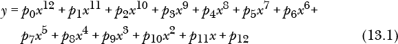

太好了！我们如何找到这些系数呢？答案是使用*最小二乘法拟合*，这是一种找到 *p* 值的方法，该值最小化数据点与函数值之间的平方差。在本书的范围内实现最小二乘法拟合到多项式超出了讨论范围。幸运的是，我们可以利用 NumPy 的强大功能来为我们完成这项工作。顺便提一句，我们将在本章稍后遇到数据的最小二乘法拟合，当我们编写 Filska 程序来将数据拟合到一条直线时。

考虑一下 *hello.py* 中的 Python 程序。我们这里不展示代码，但请务必查看。该代码使用了 NumPy，特别是 `np.polyfit` 函数，来拟合数据集并生成所需的系数。相同的代码还计算了数据集和给定 *x* 值下的多项式值之间的差异，并生成了由此产生的多项式图。NumPy 找到了以下系数：

```
X**12, P = -4.6431994663395692e-05
X**11, P = 3.2633752799095354e-03
X**10, P = -1.0079445322316360e-01
X** 9, P = 1.7997278464174311e+00
X** 8, P = -2.0561041293073888e+01
X** 7, P = 1.5712412821126304e+02
X** 6, P = -8.1556740929381863e+02
X** 5, P = 2.8598281210109303e+03
X** 4, P = -6.5979225156803523e+03
X** 3, P = 9.4649124982355879e+03
X** 2, P = -7.5173478664143449e+03
X** 1, P = 2.4648319340174303e+03
X** 0, P = 7.2000000563347072e+01
```

这里，每个 `P` 是对应 *x* 的幂次的系数。该多项式的精度足够高，以至于所有显示的数字都是必要的。我们的 Filska 程序将使用这些常量，并完全保留它们。

图 13-1 显示了该多项式的形状。圆圈是我们希望多项式输出的实际数据点，而曲线则是多项式本身（方程 13.1）。

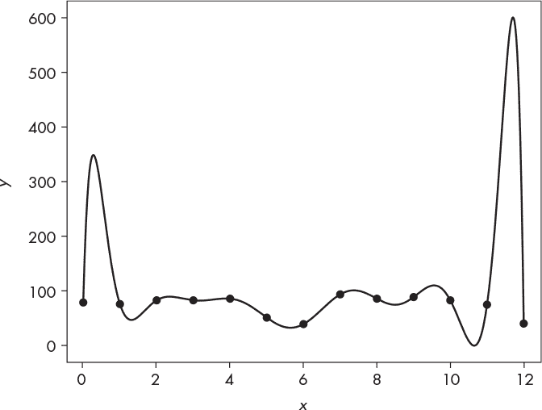

*图 13-1：方程 13.1 的多项式与实际数据点输出*

一眼看图 13-1，可以看到 12 次方多项式拟合正好击中了我们想要拟合的所有点，但该函数在这些点外的表现却非常不稳定，因此，如果我们想要了解数据的一般趋势，它并不是一个好的拟合。然而，幸运的是，我们并不是在做这个。相反，我们正在构建一个不必要复杂的 `HELLO, WORLD!` 实现，所以我们的 12 次方多项式完全足够。

#### ***Hello，Poly 实现！***

让我们开始设计 Filska 代码。我们需要生成与列表 13-2 中 Python 代码等效的代码。

```
from math import floor

def f(x):
    return -4.6431994663395692e-05*x**12 +  \
            3.2633752799095354e-03*x**11 +  \ -1.0079445322316360e-01*x**10 +  \
            1.7997278464174311e+00*x**9  +  \
           -2.0561041293073888e+01*x**8  +  \
            1.5712412821126304e+02*x**7  +  \
           -8.1556740929381863e+02*x**6  +  \
            2.8598281210109303e+03*x**5  +  \
           -6.5979225156803523e+03*x**4  +  \
            9.4649124982355879e+03*x**3  +  \
           -7.5173478664143449e+03*x**2  +  \
            2.4648319340174303e+03*x**1  +  \
            7.2000000563347072e+01*x**0 

for x in range(13):
    y = f(x)
    d = int(floor(y+0.5))
    print("%s" % chr(d), end="")
print()
```

*列表 13-2：使用多项式生成 HELLO, WORLD! 的 Python 代码*

函数 `f(x)` 实现了该多项式，返回任何给定 *x* 的 *y* 值。我们需要的 *x* 值是从 0 到 12 的数字。查看 `for` 循环，每个 *x* 都被传递给 *f* (*x*) 以生成 *y* 输出，这是一个浮动小数，我们需要将其四舍五入为最近的整数。四舍五入意味着 *y* = 72*.*04 将得到 *d* = 72，而 *y* = 72*.*54 则产生 *d* = 73。我们将 *d* 作为 ASCII 字符代码来输出，这正是 `print` 语句通过 `chr` 所做的。为了将 *y* 四舍五入得到整数 *d*，我们使用标准技巧，即加上 0.5 后再用 `floor` 来得到 *d*。没有这个四舍五入，输出就不会是 `HELLO, WORLD!`，而是 `HDKKN+VNQLD!`

为了生成与列表 13-2 等效的 Filska 代码，我们需要一个实现 *f* (*x*) 的子程序，以及一个对从 0 到 12 的整数进行主循环。在将每个整数传递给 *f* (*x*) 并四舍五入之后，我们将结果作为字符输出。完整的代码在 *hello2.filska* 中。我们将在列表 13-3 中展示重要部分，但请查看整个文件以查看所有源代码。

```
{ main
 ➊ set,0       " M = 0
    tmx         " X = M
 ➋ jmp,calc    " Y = f(X)
    jmp,dump    " dump Y as character
 ➌ inc         " M = M + 1
 ➍ cmp,13      " M == 13?
    tst,e,2     " yes, done
    gto,-6      " no, loop
    set,10      " done
    chr
    hlt }

{ dump tym chr jmp,main }
```

*列表 13-3：hello2.filska 的主循环*

清单 13-3 展示了 `main` 和 `dump`。我们先从 `dump` 开始。我们之前在 清单 13-1 中见过这个子程序。它获取寄存器的内容，这里是 Y，然后将其作为字符转储到控制台，然后返回到 `main`。

清单 13-3 中的 `main` 子程序实现了对 *x* 值的循环。在这种情况下，我们将使用 X 寄存器作为 *x*，因此我们将其初始化为 0 ➊。接下来，我们将控制权转交给 `calc` 子程序 ➋。这个子程序实现了 *y* = *f* (*x*) 并将 *y* 返回到 Y 寄存器。稍后我们会介绍 `calc` 的实现。通过 Y，我们可以获得当前 X 的 ASCII 值，然后调用 `dump` 来在控制台显示该字符。

我们希望 *x* 从 0 到 12，因此我们递增内存中保存的计数器 ➌，并检查是否已经达到 13 个字符 ➍。如果内存等于 13，`tst` 返回真，并且我们跳过两个指令。否则，*x* < 13，我们回到 `tmx` 指令，将新的 *x* 值从内存移到 X 寄存器。程序在 *x* = 13 时结束，输出换行符并调用 `hlt`。

我们剩下的就是实现 `calc`，这个子程序通过多项式将 X 映射到 Y。清单 13-2 为我们指明了方向。我们需要像 `f(x)` 这样的东西，它逐项计算多项式。如果我们创建一个 Filska 指令序列，来计算某个幂次 *px*^(*n*) 和某个系数 *p*，那么我们只需要对所有的幂次和系数累加各项，最终得到 *y*。我们还需要对 *y* 进行四舍五入，但这是在计算完它之后。

我们不会展示整个 `calc`，而是展示如何开始累加多项式的适当项，如何结束，以及如何在返回 `main` 之前进行四舍五入。请参见 清单 13-4。

```
{ calc
    " Y = P0*X**12
 ➊ set,12
    tmz
    pow,z=xz
    set,-4.6431994663395692e-05
    mul,y=mz

    " Y += P1*X**11
 ➋ set,11
    tmz
    pow,z=xz
    set,3.2633752799095354e-03
    mul,m=mz
    add,y=my
--snip-- " Y = floor(Y+0.5)
 ➌ set,0.5
    add,m=my
    flr
    tmy
    jmp,main
}
```

*清单 13-4：hello2.filska 的 calc 子程序*

代码被分成了几个块，每个块将 X 提升到某个幂次，将其与适当的系数相乘，并将乘积添加到 Y 中的总和。第一个块启动链条，最后一个块结束链条。我们从 X 的最高幂次开始，即 12 ➊。

为了计算 *y* = *f* (*x*)，我们将使用子程序内存和 Z 作为临时空间，并按项累加多项式的值到 Y 中。首先，我们将 12 移入 M 然后到 Z。回想一下，`set` 仅适用于当前子程序的内存。接下来，我们通过将 X 提升到 Z 次方来计算 *x*¹²，并将结果放回 Z 中。这就是 `pow` 指令。现在，我们需要将 *x*¹² 与适当的系数相乘，因此我们将 M 设置为所需的值，与 Z 相乘，并将结果存储在 Y 中，作为多项式的第一项。

多项式的下一个项以类似的方式计算 ➋。不同之处在于使用 11 作为指数，乘以*x*¹¹的适当系数，然后通过`mul,m=mz`和`add,y=my`指令将乘积加到 Y 中。多项式的其余项则通过同样的方式求得，每次将指数替换为 10、9，依此类推，直到 0，并每次乘以相应的系数。

此时，Y 保存着答案。剩下的就是将其四舍五入到最接近的整数 ➌。我们将 0.5 加到 Y 中，并将答案保存在 M 中。然后，我们调用`*flr*`，将结果返回到 Y，并跳回`main`以输出 Y 作为字符。

在本节中，我们开发了两种混淆的方式，将字符串`HELLO, WORLD!`输出到控制台。你能想到更多的方式吗？如果你创造了一个新的方法，请与我分享，我会将它发布到本书的 GitHub 网站上。

接下来我们来介绍下一个例子：它将引导我们通过 Filska 进行执行跟踪。

### **斐波那契数列，谁来挑战一下？**

在前一节中，我们花费了过多的精力开发了有趣的方式来输出字符串`HELLO, WORLD!`。本节将处理一个更直接的例子，并利用它来探索执行跟踪。我们的目标是生成尽可能多的斐波那契数列项，以适应 Python 浮点数的范围。

斐波那契数列使用递推关系：

*F*[1] = 1,    *F*[2] = 1

*F**[n]* = *F*[*n**–*1] + *F*[*n**–*2]

因此，*F*[3] = *F*[2] + *F*[1] = 1 + 1 = 2，*F*[4] = *F*[3] + *F*[2] = 2 + 1 = 3，依此类推。斐波那契数列的前几个项是：

1, 1, 2, 3, 5, 8, 13, 21, 34, 55, 89, 144, …

斐波那契数列以莱昂纳多·博纳奇的名字命名，他有时被称为比萨的莱昂纳多，或更常见的称呼是斐波那契。该数列在欧洲以外的地区已经为人所知超过千年，当斐波那契在他 1202 年的著作《算术书》（*Liber Abaci*）中将其作为理想化的兔子种群增长例子时，它已经广为流传。

有许多书籍讨论了斐波那契数列及其在数学中出现的各个地方。甚至有一本学术期刊，《斐波那契季刊》（*The Fibonacci Quarterly*），其期刊从 1963 年开始出版（见 *[`www.fq.math.ca/`](https://www.fq.math.ca/)*）。在这里，我们将仅列出一些关于该数列的有趣观察。

斐波那契数列与*ϕ*（黄金比例）密切相关。

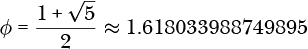

其中黄金比例是以下方程的解：

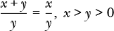

例如，如果我们设定 *y* = 1，我们得到：

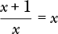

或者

*x*² *–* *x* *–* 1 = 0

使用二次公式，正解为：

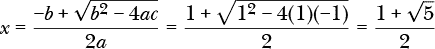

它是*ϕ*。与斐波那契数列一样，*ϕ*在数学和自然界中无处不在。与斐波那契数列的联系来自于这样的事实：当 *n* → *∞* 时，*n* + 1 项的斐波那契数与 *n* 项斐波那契数的比值接近 *ϕ*。

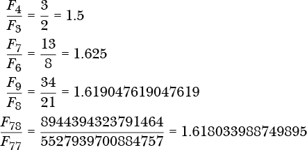

其中最后的比率是*ϕ*，以 Python 浮动精度表示。

有了*ϕ*，我们可以通过直接计算*F[n]*来获得第*n*个斐波那契数。

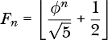

该代码对于小值的*n*有效，但当*n*变大时，由于精度问题，它会失败。

我们本可以用关于斐波那契数列的有趣事实和观察填满本书，但我们会回到编码问题，使用 Filska 实现该数列（参见清单 13-5）。代码本身位于*fib.filska*中。

```
{ main
 ➊ set,78      " number to generate
    dec         " dec twice, just printing the first two
    dec
    tmz         " Z is the counter
    set,1       " print '1' and '1'
    tmx         " X holds the i-2 value
    prt
    jmp,nl
    tmy         " Y holds the i-1 value
    prt 
    jmp,nl
 ➋ add,m=xy    " find i-th value
    swp,xy      " X <-- Y, new i-2 value
    tmy         " Y <-- M, new i-1 value
    prt         " print ith value
    jmp,nl
    tzm         " decrement Z
    dec
    tst,z,3     " if zero, done
    tmz         " Z <-- M
    gto,-9      " loop
    hlt         " quit
}

{ nl  set,10 chr jpr,main }
```

*清单 13-5：生成斐波那契数列*

在清单 13-5 中，我们初始化了一个计数器 Z，设置为 78 ➊。因此，我们将输出 78 个斐波那契数，每次将 Z 递减 1，直到它变为 0。为什么是 78？因为*F*[78] = 8,944,394,323,791,464 是最大一个可以容纳在 64 位浮动数中的斐波那契数。如果 Filska 扩展为处理整数（像 Python 整数而非 Python 浮点数），我们就可以生成斐波那契数，直到内存用尽。

要得到前两个数字，我们将 Z 递减两次，并打印常数`1`两次。乏味，但有效。接着，我们使用 X 和 Y 寄存器来

保留前两个斐波那契数及其和来生成下一个。递归循环通过计算下一个斐波那契数开始 ➋。X 和 Y 通过将当前 Y 值移到 X 并将新的斐波那契值存入 M 更新。然后，我们递减 Z 并在 Z 为 0 时跳转到`hlt`；否则，循环重复 ➋。清单 13-5 非常直观，因此是执行追踪的好例子。

要带追踪运行*fib.filska*，请使用如下命令行：

```
> python3 filska.py fib.filska -t
```

`-t`标志表示逐条指令追踪执行。这样会呈现给我们

```
CP:MAIN,PC:000,X:0.000000,Y:0.000000,Z:0.000000,M:0.000000,
   Z:0,E:0,L:0,G:0,  SET,78
<enter> or 'q' to quit:
```

并且出现一个提示，等待我们按 ENTER 键继续或按`q`退出。让我们来分解一下状态行：

| 显示文本 | 描述 |
| --- | --- |
| `CP:MAIN` | 当前子程序名称 |
| `PC:000` | 当前程序计数器 |
| `X:0.000000` | 寄存器值 |
| `Y:0.000000` |  |
| `Z:0.000000` |  |
| `M:0.000000` | 本地内存值 |
| `Z:0` | “零”标志 |
| `E:0` | “相等”标志 |
| `L:0` | “小于”标志 |
| `G:0` | “大于”标志 |

下一条指令是`set,78`。按下 ENTER 键后，我们得到

```
CP:MAIN,PC:001,X:0.000000,Y:0.000000,Z:0.000000,M:78.000000,
   Z:0,E:0,L:0,G:0,     DEC
<enter> or 'q' to quit:
```

显示我们本地内存现在是 78，并且下一条指令是`dec`。如果从这一条指令开始，我们按 ENTER 键正好七次，就会跳转到`jmp,nl`指令。

```
CP:NL,PC:000,X:1.000000,Y:0.000000,Z:76.000000,M:0.000000,
   Z:0,E:0,L:0,G:0,  SET,10
<enter> or 'q' to quit:
```

告诉我们即将执行子程序`nl`的第一条指令。我们怎么知道是第一条指令？因为程序计数器`PC`是 0。还要注意，X 寄存器的值是 1，这是之前通过`tmx`指令在`main`中设置的。

再按三次 ENTER 键后，我们得到

```
CP:MAIN,PC:008,X:1.000000,Y:0.000000,Z:76.000000,M:1.000000,
   Z:0,E:0,L:0,G:0,     TMY
<enter> or 'q' to quit:
```

显示我们回到了`main`，并即将执行第 8 条指令，将 1 从内存移动到 Y 寄存器。

六次按 ENTER 键后，再按一次 ENTER，结果给出

```
CP:MAIN,PC:011,X:1.000000,Y:1.000000,Z:76.000000,M:1.000000,
   Z:0,E:0,L:0,G:0, ADD,M=XY
<enter> or 'q' to quit: 
CP:MAIN,PC:012,X:1.000000,Y:1.000000,Z:76.000000,M:2.000000,
   Z:0,E:0,L:0,G:0,  SWP,XY
<enter> or 'q' to quit:
```

`add`指令将本地内存设置为 2：*M* ←*X* + *Y*。

重复按下 ENTER 键会跟踪剩余的递归循环，直到 Z 为 0 并且返回到 `gto` 指令，再回到 `add`，直到 Z 最终为 0。

追踪功能在开发 Filska 程序时非常有用。另一种有帮助的方法是分块编写代码——通常是独立的子程序——并确保它们按预期运行。

本章的其余部分展示了几个其他的 Filska 程序，供娱乐和学习使用。让我们来看一下 Filska 如何生成随机数。

### **随机数**

Filska 的 `rnd` 指令将子程序内存设置为一个随机的浮点数，范围为 [0,1)。当然，实际上这个数并不是随机的，而是一个伪随机的近似值。此外，这其实是作弊，因为 `rnd` 在后台使用了 Python 的 `random` 模块。Python 的 `random` 模块使用的是 Mersenne Twister 伪随机数生成器，这是一个相当好的生成器，足以满足除最苛刻任务之外的所有需求。评估伪随机生成器质量的一个指标是其 *周期*，即它在序列开始重复之前能够生成多少个数字。对于 Mersenne Twister 来说，周期为 2¹⁹⁹³⁷ *–* 1，这对于大多数人来说已经足够了。

在本节中，我们将编写代码来生成伪随机数，且不作弊，也就是不使用 `rnd` 指令。相反，我们将实现 Park 和 Miller 线性同余生成器，也叫 MINSTD。这个线性同余生成器是一个简单的算法，周期大约为 2³¹。虽然比 Mersenne Twister 的周期要短得多，但对于许多非关键任务，比如游戏，依然非常足够。

#### ***实现 MINSTD***

大多数伪随机数生成器都是迭代的，这意味着前一个伪随机值用于生成下一个。序列中的第一个值是从用户提供的种子值生成的。固定种子值就会固定生成的值序列。通过这种方式，可以创建一个通过随机性测试的确定性值序列，虽然听起来有些奇怪。

**注意**

*存在一些伪随机生成器能够在不生成前 *n – 1* 个值的情况下直接生成指定种子下的 *n* 值。要找到这样的生成器，可以搜索“基于计数器的随机数生成器”。*

Park 和 Miller 算法运行如下：

1.  选择一个种子值并将其命名为 *x*[0]。

1.  生成下一个种子值：*x*[*i*+1] ← 48271 *x*[*i*] mod (2³¹ *–* 1)。

1.  返回浮点版本：*x*[*i*+1] / (2³¹ *–* 1)。

1.  使用 *x*[*i*+1] 作为 *x*[*i*] 来生成下一个伪随机值。

该算法是一个递归关系，类似于我们上面用于生成斐波那契数的关系。因此，我们预计会有一个初始化部分，后面跟着一个循环，输出序列中的下一个浮动值。对于种子，*x*[0]，我们可以自由选择任何整数，范围是 1, 2³¹ *–* 1)。我们将使用 8,675,309，但你可以用任何你喜欢的数字替换它，以获得不同的值序列。我们需要的代码在*random.filska*中（请参见[清单 13-6）。

```
{ main
    set,8675309     " the seed
    tmx 
    set,48271
    mul,x=mx
    set,2147483647  " 2³¹ - 1 
    mod,x=xm
    jmp,make_float
    gto,-5
}

{ make_float
    set,2147483647
    div,m=xm
    prt 
    set,10
    chr 
    jmp,main
}
```

*清单 13-6：Filska 中的 Park 和 Miller LCG*

清单 13-6 初始化 X 为所需的种子，将乘数（48,271）存储在内存中，并启动循环来计算下一个种子值。递归关系是分阶段实现的。首先，X 中的种子乘以 48,271，结果存回 X 中。然后，2³¹ *–* 1 被加载到内存中，接着进行取模操作，结果再次存回 X 中。X 现在是序列中的下一个值。浮点版本通过`make_float`输出，它将 X 除以 2³¹ *–* 1，并将结果与换行符一起输出到控制台，以便每行得到一个伪随机浮点数。在`main`中，循环继续进行，因此程序会不断地输出浮点数。

运行程序并将输出重定向到一个文件，例如 *numbers.txt*。

```
> python3 filska.py random.filska >numbers.txt
```

让程序运行大约 15 分钟，或者直到文件中有超过 100 万行。我们需要许多值才能对输出的质量进行有意义的统计分析，值越多越好。当你等得不耐烦时，使用 CTRL-C 退出程序。

#### ***评估 MINSTD***

现在我们有了一个包含浮点值的大文本文件。它们看起来肯定足够随机，但它们真的是吗？我们如何判断？老实说，我们不能。我们不能*证明*这些是随机值，实际上我们知道它们不是，因为我们使用了确定性的方法来生成它们。计算机科学的创始人之一约翰·冯·诺依曼曾著名地调侃过，任何考虑使用确定性方法生成随机数的人都是“处于罪恶状态”。尽管如此，我们还是希望认为我们刚生成的序列至少是随机的——也就是说，知道一个值并不会对猜测下一个值有太大帮助。

事实上，有许多高度复杂的方法可以测试随机性。没有一种是结论性的，但作为一个整体，它们给人一种信念，即对于所有实际目的来说，值的序列是随机的。这些测试非常广泛，远超我们的需求，但幸运的是，有一种方法既简单、易于评估，而且包含在标准 Linux 发行版中。更棒的是，它有一个酷炫的托尔金式名字：`ent`。

然而，`ent`只适用于随机的*字节*，而不是浮点数。没关系；一个 Python 代码片段可以将我们包含随机浮点数的文件转换为包含随机字节的文件。

```
import numpy as np
d = np.loadtxt("numbers.txt")
b = []
for i in range(len(d)):
    b.append(int(np.floor(256*d[i])))
open("random.dat","wb").write(bytearray(b))
```

我们假设捕获的浮点数保存在文件*numbers.txt*中。字节版本则存储在*random.dat*中。数组 `d` 包含从 *numbers.txt* 读取的浮点数。循环生成一个整数列表 `b`，通过将浮点值乘以 256 并使用 `floor` 函数舍去任何小数部分来得到整数。最后，整数列表被转化为字节数组并写入输出文件。

让我们在*random.dat*上运行 `ent`

```
> ent random.dat
```

生成中

```
Entropy = 7.999803 bits per byte.

Optimum compression would reduce the size
of this 1044919 byte file by 0 percent.

Chi square distribution for 1044919 samples is 285.53, and randomly
would exceed this value 9.16 percent of the times.

Arithmetic mean value of data bytes is 127.5722 (127.5 = random).
Monte Carlo value for Pi is 3.138619490 (error 0.09 percent).
Serial correlation coefficient is -0.001688 (totally uncorrelated = 0.0).
```

当你运行代码时，你看到的值会略有不同，因为在按下 CTRL-C 之前生成的随机数数量不同，或者如果你改变了种子值的话。

如何解读 `ent` 的输出？我们跳过卡方部分，考虑其他度量：熵/压缩、算术平均值、*π*的估算和序列相关性。

*熵*是信息内容的度量，在这里以每字节比特数表示。一个字节有 8 位，所以最大可能的熵是 8.0。这意味着文件的表示没有简化的空间，因为没有冗余。我们的文件熵为 7.999803 比特每字节，接近最大随机性。这基本上就是关于最优压缩的说法所指的意思。

如果文件完全由随机字节组成，我们预计有一半的字节值会高于中位数 127.5 / 2，另一半低于中位数，因此算术平均值应该是 127.5。我们的文件平均值是 127.5722，这再次接近我们从随机序列中期望得到的值。

蒙特卡洛过程用于模拟某种事情。在这个例子中，它使用随机字节模拟掷飞镖，然后询问有多少个飞镖落在半径为 1 的圆内，有多少个落在圆内外接正方形的一边为 1 的正方形内。落在圆内的飞镖与落在正方形内的飞镖之比可以估算出*π*值。这里的估算结果接近真实值，但并不十分精准。此外，文件中只有大约 100 万个值。大多数随机性测试需要数亿到数十亿个样本才能得出结论，因此我们在这里也表现得不错。

最后的测试是序列相关性测试。之前的测试关注的是数值本身，而不考虑它们在文件中的顺序。序列测试则关注顺序。它要检查的是，知道一个字节的值是否可以帮助你推测下一个字节的值。对于随机序列，应该没有这种相关性。在这里我们得到的是轻微的负相关性，这同样是一个合理的说法，表明我们已经生成了一个（大部分）随机的序列。

上面的结果让我们有信心认为我们的 Filska 伪随机数生成器正常工作。接下来我们将进入下一个示例，它同样会生成数据并将其保存到文件中。

### **一个简单的分形**

在第十章中，我们简要接触过 Sierpiński 三角形。让我们看看如何在 Filska 中生成这个分形的点。算法是：

1.  定义三个三角形顶点：(*x*[0], *y*[0])、(*x*[1], *y*[1]) 和 (*x*[2], *y*[2])。

1.  随机选择一个顶点，例如 (*x*, *y*) = (*x*[0], *y*[0])。

1.  随机选择另一个顶点，例如 (*x*[1], *y*[1])。

1.  更新 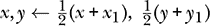。

1.  输出 (*x*, *y*) 以便稍后绘制。

1.  从步骤 3 开始，重复所需的点数。

本质上，我们绘制当前点与随机选择的三角形顶点之间的中点，并重复此过程，直到我们生成足够多的点来绘制。再一次，这是一个递归关系，其中 *n* + 1 个点是从 *n* 个点构造的，只不过现在我们是在二维空间中工作，而不是一维空间（参见 列表 13-7）。

```
x,y = 1,0
repeat for N points:
    r = RND
    if (r < 0.333333):
        x = 0.5*(x + 0) = 0.5*x
        y = 0.5*(y + 0) = 0.5*y
    elif (r < 0.666666):
        x = 0.5*(x + 0.5) = 0.5*x + 0.25
        y = 0.5*(y + 1) = 0.5*y + 0.5
    else:
        x = 0.5*(x + 1) = 0.5*x + 0.5
        y = 0.5*(y + 0) = 0.5*y
    print x,y
```

*列表 13-7：谢尔皮ński 三角形的伪代码*

让我们通过伪代码使算法更加明确。首先，我们选择三角形的顶点：(0,0)；(0.5,1)；(1,0)。然后，我们需要编码 列表 13-7，其中 `rnd` 返回一个随机浮点数，0, 1)。我们将 *x* 和 *y* 初始化为点 (1,0)。任意三个点都可以。

接下来，我们开始一个循环，重复所需数量的点 `N`。三个案例以相等的概率选择三个顶点中的一个。如果 `r` 中的随机值小于三分之一，我们选择第一个点 (0,0)，因此中点是 *x* 和 *y* 值的平均值，再加上 0 和 0。同样地，如果 `r` 是 0*.*333333 ≤*r* < 0*.*666666，我们选择顶点 (0.5,1)。最后，如果 `r` ≥ 0*.*666666，我们使用顶点 (1,0)。更新 *x* 和 *y* 后，我们将它们作为一对打印出来并重复循环。

中点公式简化如 [列表 13-7 所示。请注意，每次循环都会通过首先将 *x* 和 *y* 除以 2（即乘以 0.5），然后根据选定的顶点添加偏移量来更新 *x* 和 *y*。如果顶点是 (0,0)，则 *x* 和 *y* 的偏移量为 0。如果顶点是 (0.5,1)，则 *x* 的偏移量为 0.25，*y* 的偏移量为 0.5。最后，对于 (1,0)，*x* 的偏移量为 0.5，*y* 的偏移量为 0。

这一观察意味着我们可以重写循环，首先将 *x* 和 *y* 除以 2，然后我们可以加上偏移量——不需要像 列表 13-7 中那样计算 `0.5*x` 和 `0.5*y` 的重复实例。这一简化在编写 Filska 实现时大有帮助。

我们的实现使用了三个子程序：`main`、`loop` 和 `print`。此外，我们将当前的 *x* 值存储在 X 寄存器中，显然，当前的 *y* 值存储在 Y 寄存器中。我们将使用 `main` 来初始化 X 和 Y，设置用于输出点的计数器，我们将其存储在 Z 中，然后将执行转移到 `loop`（参见 列表 13-8）。

```
{ main
    set,1       " start at 1,0 
    tmx 
    set,0
    tmy 
    set,60000   " number of points to output
    dec 
    tmz 
    jmp,loop
}
```

*列表 13-8：sierpinski.filska 的主循环*

接下来，我们将使用 `print` 显示 X 和 Y 寄存器作为 (*x*, *y*) 对并输出到同一行（参见 列表 13-9）。

```
{ print
    txm
    prt
    set,32
    chr chr
    tym prt
    set,10
    chr
    jmp,loop
}
```

*清单 13-9：sierpinski.filska 的打印子程序*

清单 13-9 首先将 X 移动到本地内存中进行打印。然后它打印两个空格（字符 32），再打印 Y 并换行。

清单 13-10 包含了程序的大部分内容。它是清单 13-7 中的循环体。

```
{ loop
 ➊ set,2
    div,x=xm
    div,y=ym
 ➋ rnd
    cmp,0.333333
 ➌ tst,l,10
    cmp,0.666666
 ➍ tst,l,4

 ➎ set,0.5
    add,x=xm
    gto,5

 ➏ set,0.25
    add,x=xm
    set,0.5
    add,y=ym

 ➐ jmp,print

 ➑ tzm
    dec
    tst,z,3
    tmz
    jpr,loop
    hlt
}
```

*清单 13-10：sierpinski.filska 的循环子程序*

首先，我们将 X 和 Y 寄存器各自除以 2 ➊。然后，我们使用`loop`的内存来保存一个随机值 ➋。

如果随机值小于 0.333333，`tst,l,10`指令 ➌ 为真，执行将转到`jmp`指令去`print` ➐。这是(0,0)顶点，没有偏移量需要添加。如果内存值小于 0.666666 ➍，执行将转向向 X 添加 0.25 的偏移量，向 Y 添加 0.5 的偏移量 ➏。这是(0.5,1)顶点的情况。最后，如果内存值大于或等于 0.666666，我们就到了(1,0)顶点，因此只需要向 X 添加 0.5 的偏移量 ➎。打印出新的 X 和 Y 值 ➐后，Z 寄存器会递减并测试是否为 0 ➑。如果 Z 为 0，`hlt`指令停止程序。如果不是，`loop`子程序将从头开始执行，感谢`jpr`指令。

让我们运行程序并捕获输出结果。

```
> python3 filska.py sierpinski.filska >points.txt
```

在这里，*points.txt*变成了 60,000 个(*x*, *y*)点对的集合。

为了看到分形图形，我们需要绘制这些点。几行 Python 代码就能完成这一任务。

```
>>> import numpy as np
>>> import matplotlib.pylab as plt
>>> d = np.loadtxt("points.txt")
>>> plt.plot(d[:,0],d[:,1], linestyle='none', marker=',')
>>> plt.show()
```

结果应该与图 13-2 非常相似。注意，图 13-2 使用了 600,000 个点，是*sierpinski.filska*默认生成点数的 10 倍。


*图 13-2：带有 600,000 个点的谢尔宾斯基三角形*

### **深入问题的根本**

在代数课上，我们都花费了过多的时间去因式分解形式为*ax*² + *bx* + *c*的二次方程，以求得根值，也就是找到使得*ax*² + *bx* + *c* = 0 的*x*值。经过许多困惑和练习题之后，我们终于得知了可以直接找到根值的公式。这就是二次公式，我们在上面用它来求得*ϕ*的值，也就是黄金比例。

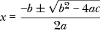

平方根下的值被称为*判别式*，Δ = *b*² – 4*ac*。判别式的符号告诉我们关于根值的一些有用信息。

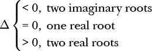

对于第一种情况，判别式为负数，负数的平方根是虚数。对于第二种情况，平方根为 0，唯一的根为*x* = *–b*/(2*a*)。对于第三种情况，判别式为正数，平方根存在，且有两个不同的实数根。

文件*roots.filska*包含了一个完整的程序，用于计算任意二次多项式的根。我们可以运行它几次，查看输出结果。接着，我们将研究与判别式和根相关的代码部分。其余的代码处理文本输出，主要是`set`和`chr`指令，这些指令对程序的格式化非常重要，但对于学习如何在 Filska 中实现计算并不帮助。

列表 13-11 显示了*roots.filska*三次独立运行的输出结果。

```
A? 1
B? 2
C? 4

Complex roots: -1+1.732050808i
               -1-1.732050808i
-------------------------------
A? 1
B? 4
C? 2

1st root: -0.5857864376
2nd root: -3.414213562
-------------------------------
A? -4
B? 12
C? -9

One root: 1.5
```

*列表 13-11：三次运行的 roots.filska*

提示要求用户输入二次方程的系数，*a*、*b*和*c*值。在第一个例子中，我们要求求解*x*² + 2*x* + 4 的根，并被告知它们是复数，因为判别式为负。在第二个例子中，我们要求求解*x*² + 4*x* + 2 的根，结果是实数根。最后一个例子涉及的是*- 4*x*² + 12*x - 9*，它的判别式为零，因此只有一个根。

这个程序的流程相当线性：用户输入系数，计算判别式，然后根据判别式的值计算相应的根。如果你查看*roots.filska*，你会看到关键的子程序有`main`、`positive`、`equal`和`negative`，以及三个用于获取系数的子程序：`getA`、`getB`和`getC`。

列表 13-12 展示了`main`子程序。

```
{ main
    "  Get a, b, and c
 ➊ jmp,getA
    jmp,getB
    jmp,getC

    "  Calculate D
 ➋ jmp,getA        " X=a 
    set,4           " M=4 
    mul,m=mx        " M = M*X  (4a)
    jmp,getC        " X=c 
    mul,m=mx        " M = M*X  (4ac)
    neg             " M = -M   (-4ac)
    tmz             " Z = M    (-4ac)
    jmp,getB        " X=b 
    txm             " M=b 
    mul,m=mx        " M = M*X  (b*b)
    add,m=mz        " M = M+Z  (b*b - 4ac)
    tmy             " Y = D    (disc)
    jmp,getA        " X = a 
    txm             " M = X 
    tmz             " Z = M    (a) 
    jmp,getB        " X = b    (b) 
    tym             " M = Y    (disc)
 ➌ cmp,0           " compare(M,0)
    tst,g,3         " D > 0  --> positive
    tst,e,3         " D == 0 --> equal
    tst,l,3         " D < 0  --> negative
    jmp,positive
    jmp,equal
    jmp,negative
}
```

*列表 13-12：主子程序*

从注释中我们可以看到，`main`请求输入*a*、*b*和*c*，然后计算判别式（`D`），接着根据判别式的值跳转到`positive`、`equal`或`negative`。

我们从`main`中的最后三条指令开始。乍一看，把它们一个接一个地放在一起似乎有些奇怪，但这只是由于我们习惯于从函数的角度思考所产生的错觉。我们需要将它们与上面的`cmp`和`tst`指令进行关联考虑。

`cmp`指令将`main`的内存（判别式）与 0 进行比较➌。如果判别式大于 0，我们通过使用`tst,g,3`指令向前跳转三条指令，转移控制到`positive`子程序。类似地，如果判别式为 0，我们将控制转移到`equal`，如果判别式小于 0，我们将控制转移到`negative`。这三个子程序最终都会执行`hlt`，且都不会将控制返回到`main`。

Filska 在其可以跟踪的数据上相当有限，这是一个故意的设计目标，旨在促使我们更多地思考如何安排程序，因此我们需要考虑哪些值必须存储以及何时存储。我们应该询问用户二次方程的系数。我们还需要将这些系数保存在某个地方，并根据需要提取它们。我们有三个寄存器，但如果将系数存储在其中，就只能使用每个子程序的单一内存位置进行计算。我们需要寄存器在子程序之间传输数据，并参与计算。

解决方案是创建一个作为小对象的子程序。子程序可以存储传递给它的值，然后根据需要返回该值。可以把这个子程序看作是一个简单类的实例，我们可能会像这样在 Python 中表达它：

```
class Store:
    def __init__(self, v):
        self.v = v
    def Get(self):
        return self.v
```

这个类的实例在创建时会被赋予一个存储的值，并且在通过 `Get` 方法请求时返回该值。这正是我们需要的：一次赋值，然后以后多次取回。

在 Filska 中，我们通过一个子程序，利用其内存存储值，从而获得相同的效果。考虑 `getA`。

```
{ getA
    set,65 chr
    set,63 chr
    set,32 chr
    ipt
    jmp,main
    tmx
    jmp,main
    gto,-2
}
```

`getA` 的前三行输出 `A?`，然后通过 `ipt` 请求用户输入一个数字。用户输入的任何数字都会被存储在本地内存中。随后，控制通过 `jmp` 转移回 `main`。接下来从 `main` 转移回 `getA`，首先通过 `tmx` 指令将用户的值存入 X 寄存器，然后再转移回 `main`。然而，任何未来的转移回 `getA` 都将以 `gto` 指令开始，跳回 2 重新从 `tmx` 开始。这个循环会无限重复：`getA` 现在只会将用户的值加载到 X 中。我们有一个“写一次，读多次”的位置来存储一个数字——正是我们所需要的。

再次查看 Listing 13-12，我们可以看到前面三次转移操作是为了获取系数 ➊。随后，在计算判别式时，当需要这些值时，会进行转移到 `getA`、`getB` 和 `getC`。

判别式的计算是一个处理数据值的练习，以避免我们用完存放它们的位置（参见 Listing 13-12 ➋）。让我们来走一遍代码。我们需要计算 *b*² *–* 4*ac*，并从计算 *–* 4*ac* 开始。

```
    jmp,getA        " X=a 
    set,4           " M=4 
    mul,m=mx        " M = M*X  (4a)
    jmp,getC        " X=c 
    mul,m=mx        " M = M*X  (4ac)
    neg             " M = -M   (-4ac)
    tmz             " Z = M    (-4ac)
```

我们将 *–* 4*ac* 暂时存储在 Z 中。现在我们需要计算 *b*² 并将 *–* 4*ac* 加到其中。

```
    jmp,getB        " X=b 
    txm             " M=b 
    mul,m=mx        " M = M*X  (b*b)
    add,m=mz        " M = M+Z  (b*b - 4ac)
    tmy             " Y = D    (disc)
```

现在我们已经将判别式存储在 Y 中。为了计算根，我们可以使用判别式 Δ 来重写二次方程。

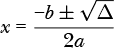

将方程写成这种形式能带来好处：我们只需要 *a*、*b* 和 Δ 就能计算根。很好！我们有三个寄存器可用，所以我们将 Z 用于 *a*，X 用于 *b*，Y 用于 Δ。

```
    jmp,getA        " X = a 
    txm             " M = X 
    tmz             " Z = M    (a) 
    jmp,getB        " X = b    (b) 
    tym             " M = Y    (disc)
```

在这里，最后一条指令将判别式移动到 `main` 的内存中，以供 Listing 13-12 ➌的 `cmp` 指令使用。

剩下的子程序 `positive`、`equal` 和 `negative` 以及它们使用的子程序，计算并输出具体的根。如前所述，许多指令与格式化输出有关。你可以自行查看这些指令，但让我们通过逐步解析 `positive` 来看看如何计算两个实数根。

```
{ positive
 ➊ set,2           " M = 2
    mul,m=mz        " M = 2a
    div,m=xm        " M = b/(2a)
    neg             " M = -b/(2a)
    jmp,rest        " X = sqr(Y)/(2a)
    jmp,?double
    add,y=mx        " Y = M + X    (-b/(2a)+sqr(D)/(2a))
    jmp,?double
    sub,y=mx        " Y = M - X    (-b/(2a)-sqrt(D)/(2a))
    jmp,?double
}

{ rest
    set,2
    mul,x=mz
    tym
    sqr
    div,x=mx
    jmp,positive
}
```

最后一次重写二次方程时，我们看到，对于一个正的判别式，两个根是：

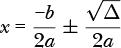

这意味着我们需要同时计算 *– b*/(2*a*) 和 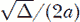，这样我们就可以对它们进行加减。第一项是一步步构建的，正如注释➊所示。它保留在 `positive` 的内存中。然后，转移到 `rest` 构建了 X 中的 。注意，做这一步时会销毁 *b*，它之前存储在 X 中。这没关系；我们不再需要它。当 `rest` 将执行转移回 `positive` 时，X 中有了我们需要的另一个项，因此我们首先将项相加，并调用 `?double`（读作“打印双精度”）来输出 Y 中的内容，再将项相减，调用 `?double` 来得到另一个根。还要注意，使用 Y 会销毁判别式，但我们也不再需要它。

呼！这些步骤对于一个更强大的语言来说可以很快实现。不过，挑战和乐趣就在于让一个受限的语言做一些有用的事情。

### **线性最小二乘法拟合直线**

之前，我们通过拟合一个多项式到一组数据点来得出一个傻乎乎的打印`HELLO, WORLD!`的方式。在这一节中，我们将再次使用最小二乘法拟合，但这次拟合的是一条直线，显然要简单得多。具体来说，我们有一组(*x*, *y*)点，我们想要找到一条最适合这些点的直线方程：

*y* = *b**x* + *a*

对于某些 *a* 和 *b*，我们需要从数据中计算出来。

与拟合多项式或其他函数的最小二乘法不同，拟合一条直线到数据集有一个封闭解；这意味着我们可以写出给我们 *a* 和 *b* 的方程（见方程 13.2）。

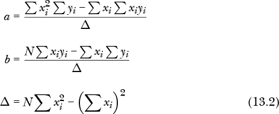

对于 *N*，即数据集中的点数。

方程 13.2 一开始看起来可能有点让人望而生畏。不要被它吓到。它表示我们必须对所有的 *x* 值和所有 *y* 值进行求和，还包括 *x*² 和 *x* 乘 *y* 的和。一旦我们有了这些求和结果，计算 *b*（斜率）和 *a*（截距）就很简单，因为 ∑ 项会变成简单的数字。

这个示例的代码在*linfit.filska*中。从编程角度看，我们将看到一种新的 Filska 子程序，它扩展了我们在上一节中使用的“写一次，读多次”的思想。但是，在编写代码之前，我们必须决定如何让 Filska 读取数据文件。通常，我们会将数据点存储为(*x*, *y*)对，每行一个对。然而，如果我们使用重定向将数据发送到 Filska 程序，`ipt`指令每行只会读取一个值。此外，我们还需要告诉 Filska 停止读取文件，以便完成计算。

解决方案是将数据以每行一个值的形式存储在文件中，首先是*x*值，然后是下行的对应*y*值。为了告诉 Filska 我们已经完成，我们将以一个标志值结束文件，这个值不会出现在我们的数据集中。我们将使用*–*999999，一个不太可能出现的数据值。

例如，如果我们的数据集是

(0, 0*.*5)，(1, 1*.*1)，(2, 2*.*4)，(3, 3*.*6)

我们将格式化为如下输入：

```
0
0.5
1
1.1
2
2.4
3
3.6
-999999
```

所以每个*x*后面跟着它的*y*，最后一个值`-999999`告诉我们没有更多数据可读。

就方程式 13.2 而言，我们得到以下关于示例数据集的总和：

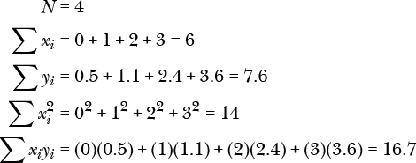

这意味着最佳拟合线是

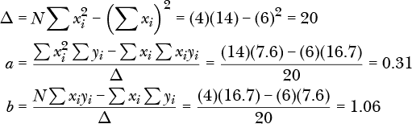

或者*y* = *bx* + *a* = 1*.*06*x* + 0*.*31。

让我们先看看代码的运行效果，然后再深入分析。我已经包含了一个示例数据集，*linfit_dataset.txt*。如果你使用*linfit_dataset.txt*作为输入运行*linfit.filska*，你会得到

```
> python3 filska.py linfit.filska <linfit_dataset.txt
A=10.46698813
B=2.272733952
```

这告诉我们最佳拟合线是*y* = *Bx* + *A*（见图 13-3）。拟合效果相当不错，因此我们可以放心代码正在正常工作。

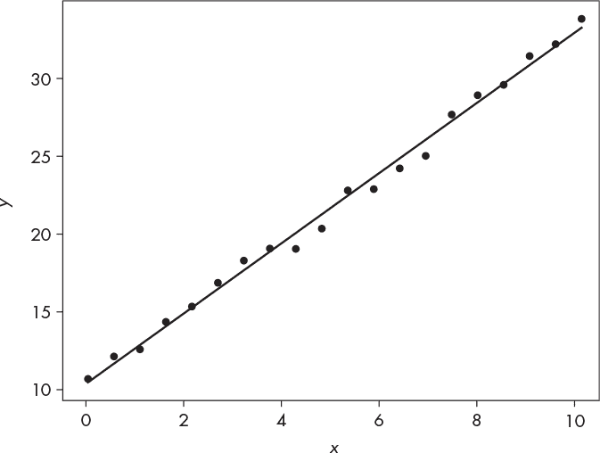

*图 13-3：最佳拟合线与示例数据集*

如果我们使用一种高级语言来编写这个示例代码，我们可能会将数据集存储在某种数组或列表中。然后我们会遍历列表来生成必要的总和。然而，Filska 没有数组。那么我们该如何做呢？解决方案来自于观察到我们只需要对数据集进行一次遍历，并在读取每个点时累积它。我们不需要先存储所有数据，然后再处理，因为我们可以在读取每个点时就进行处理。用算法形式表示，我们需要编写如下代码：

1.  从输入文件中读取一个点，(*x*, *y*)。

1.  将*x*值加到*x*值的累计总和中。

1.  将*x*²加到*x*²值的累计总和中。

1.  将*y*加到*y*值的累计总和中。

1.  将*xy*加到*xy*值的累计总和中。

1.  从步骤 1 开始重复，直到所有点都被读取完。

1.  使用累计总和计算*a*和*b*。

我们需要跟踪 *x*、*y*、*x*² 和 *xy* 的总和，以及读取的总点数 *N*。这些值太多，不能仅依靠内存和寄存器来存储。因此，我们需要一些类似上一节中的子程序，可以初始化、累积并最终报告它们的总和。使用我们之前提到的类的类比，我们需要类似以下的结构。

```
class Adder:
    def __init__(self):
        self.s = 0
    def Add(self, v):
        self.s += v
    def Get(self):
        return self.s
```

这个类在实例化时将其内部状态设置为 0，然后将传递给 `Add` 的值相加，并在调用 `Get` 时报告当前的总和。

我们可以在 Filska 中构建这个结构，使用子程序内存存储总和，使用寄存器提供值或返回值。我们将把当前点的 *x* 值保存在 X 寄存器中，将 *y* 值保存在 Y 寄存器中。我们将使用 Z 寄存器告诉子程序是否需要累积（Z = 0）或者将总和返回（Z ≠ 0）到 Y。

现在来看一下 Listing 13-13，它展示了来自 *linfit.filska* 的 `sumxy` 子程序。

```
{ sumxy
 ➊ set,0       " first call: zero sum 
    jmp,main    " and back to main
 ➋ swp,mz      " look at Z stashing M
    tst,n,8     " return value in Y
 ➌ swp,mz      " restore total
    mul,z=xy    " Z <-- X*Y 
    add,z=mz    " Z <-- M + X*Y 
    set,0       " M <-- 0
    swp,mz      " M <--> Z, restore Z and M
    jmp,main    " return to main
    gto,-8      " test again
 ➍ swp,mz      " Z=1, return M in Y
    tmy         " and put it in Y
    jmp,main    " and back to main
    gto,-2      " put sum in Y and return to main
}
```

*Listing 13-13: sumxy 子程序*

当第一次调用 `sumxy` 时，它将其本地内存设置为 0，并返回到 `main` ➊。后续调用从 ➋ 开始，并根据 Z 的值进行分支。此时，X 和 Y 分别包含当前点的 *x* 和 *y* 值。如果 Z 不为 0，`tst` 指令会跳转到 ➍，将本地内存中 *x* 和 *y* 的乘积总和移动到 Y。

目前代码有两个注意事项。首先，在 ➋ 处，为了测试 Z 是否为 0，我们必须交换内存和 Z，因此 Z 的值存放在内存中，而内存的值被暂存到 Z 中。毕竟，如果丢失了内存中的总和，整个子程序将变得无用。因此，在 ➍ 处必须再次交换，以恢复 *xy* 配对的实际总和，并确保 Z 的值保持不变。其次，当 Z ≠ 0 时，子程序处于一个永久状态，只是报告 Y 中的总和。这意味着它不再关注 Z 的状态。这样做对我们的程序有效，并且如果需要，还能释放 Z 供其他用途。`gto` 跳转回 `tmy` 使这一切发生。

如果 Z 为 0，`tst` 会失败，执行将继续到 ➌。首先，Z 和内存会交换，就像在 ➍ 处恢复总和一样。然后，Z 被用来保存 *x* 和 *y* 的乘积，并加到内存中，从而累积当前点的乘积。当然，以这种方式使用 Z 会改变它的值，因此在返回 `main` 之前，我们必须将 Z 重置为 0。`jmp` 跳转到 `main` 后，接着是一个 `gto`，用于跳转回测试 Z 的开始位置，以便从 `main` 转移到 `sumxy`。

在 `sumxy` 中设定的模式会重复用于 `sumx`、`sumy`、`sumx2` 和 `sum`，其中倒数第二个用于累积 *x*²，最后一个用于统计处理的点数。通过控制 Z 的状态，`main` 从累积状态切换到计算状态。改变状态的触发条件是读取 *x* 的标志值 `-999999`。

*linfit.filska*中的`main`子程序相当长，因此我们只会分析其中的一部分。清单 13-14 展示了第一部分，它初始化总和并处理数据点。

```
{ main
 ➊ jmp,sum
    jmp,sumx
    jmp,sumy
    jmp,sumxy
    jmp,sumx2

    set,0           " Z=0, accumulate mode
    tmz             "
    ipt             " read X
    cmp,-999999     " data done?
    tst,e,10        " yes, calculate
    tmx             " no, move to X register
    ipt             " read Y
    tmy             " move to Y register

 ➋ jmp,sum         " accumulate the x,y data
    jmp,sumx
    jmp,sumy
    jmp,sumxy
    jmp,sumx2

    gto,-11         " continue the loop
```

*清单 13-14：在 main 中累加总和*

第一块代码调用每个累加器子程序以初始化它们 ➊。接下来，主循环开始时将 Z 设置为 0，使每个子程序进入累加模式。第一个`ipt`指令读取*x*值，检查是否为`-999999`，如果是，程序跳转到前方以退出循环。然后代码将*x*放入 X 寄存器中。第二个`ipt`指令读取*y*值并将其放入 Y 寄存器中。

第二块`jmp`指令累加每个总和 ➋。最后，`gto`指令将程序跳转回主循环的开头，即第一个`ipt`指令。

当读取到标志值`-999999`时，输入文件已经处理完毕，程序进入计算模式，开始执行公式 13.2。若查看公式 13.2，我们会发现*a*和*b*都依赖于Δ。因此，我们将计算分为首先求出*a*和*b*的分子，然后再除以Δ。

清单 13-15 计算了*a*的分子。

```
    set,1           " Z = 1, return sums in Y mode
    tmz
    jmp,sumx2       " Y = sumx2
    tym             " M = sumx2
    jmp,sumy        " Y = sumy
    mul,z=my        " Z = sumx2*sumy
    jmp,sumx        " Y = sumx
    tym             " M = sumx
    jmp,sumxy       " Y = sumxy
    mul,m=my        " M = sumx*sumxy
    sub,z=zm        " Z = sumx2*sumy - sumx*sumxy
    jmp,numA        " store in numA
```

*清单 13-15：main 中的计算*

首先，将 Z 设置为 1，使得子程序将它们的和返回到 Y 中，然后一系列步骤计算我们在公式 13.2 中所需的*a*的分子。`numA`子程序（未展示）在第一次调用时存储 Z 中的值，并在以后的所有调用中将其返回到 Y。类似的步骤计算*b*的分子，存储在`numB`中，Δ本身则存储在`delta`中。`main`的最终指令计算`numA`除以`delta`并将结果打印为*a*，然后使用`numB`对*b*执行相同操作。程序最后通过`hlt`结束。

### **讨论**

很明显，Filska 是一种功能有限的语言，但对于特定任务非常有用。许多编程语言都发展出了一些惯用法，它们是经常出现的代码片段。我们通过使用子程序作为具有附加功能的存储位置，开发了一个 Filska 的惯用法，这类似于其他语言中的简单类。我们将这种惯用法用作“一次写入，多次读取”的内存，不管是否有额外的处理，或者通过寄存器中的标志作为读/写内存，正如我们在线性最小二乘拟合示例中所做的那样。

Filska 不支持数组，但可以通过使用子程序作为数组元素来模拟数组。我们不会在这里列出代码，但可以查看*array.filska*，这是一个创建 10 个值的数组示例。该演示通过索引存储数组中的值，然后按顺序输出数组。

最终，我们应该如何看待 Filska 呢？我们已经看到它实现了一些算法，甚至包括那些能够产生有用结果的算法。Filska 是图灵完备的吗？虽然大多数命令式编程语言很可能是图灵完备的，但 Filska 可能不是，因为它有着严格的内存限制。每个子程序只有三个通用寄存器和一个内存位置，这可能是其限制因素。然而，我们可以定义的子程序数量没有限制，而数组示例展示了如何利用这一特性来模拟一个理论上可以非常大的数组。因此，我们可以认为我们确实拥有了任意数量的数据。最终，判断 Filska 是否图灵完备，超出了我们在本书中能够合理讨论的范围。也许某位理论计算机科学家会接受这个挑战，并与我们分享他们的结果。如果是这样，请查看本书的 GitHub 网站。

### **摘要**

本章使用 Filska 实现了一些（希望是）有趣的数学相关例子。我们变得有些极客，使用曲线拟合生成了 `HELLO, WORLD!`。我们探索了斐波那契数列、伪随机数生成、分形、方程的根以及数据拟合直线。在每个案例中，我们都需要仔细思考数据和代码的结构，以便尽可能充分利用 Filska 严苛的编程限制。

Filska 被设计用于计算，我们所有的例子都或多或少涉及到数学。现在让我们稍微放松一下，考虑一下我们的第二种 esolang，它完全是为了娱乐而设计的，并且在各方面都要简单得多。让我们抛开数学，走到户外，观察萤火虫吧。
