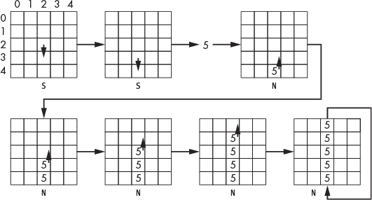
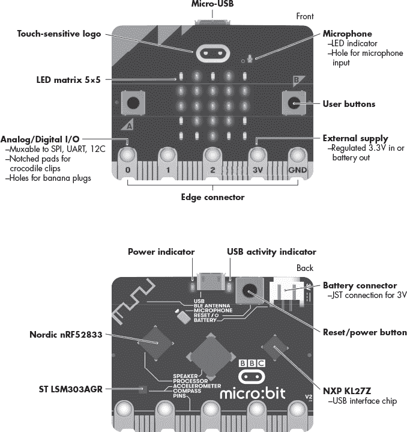
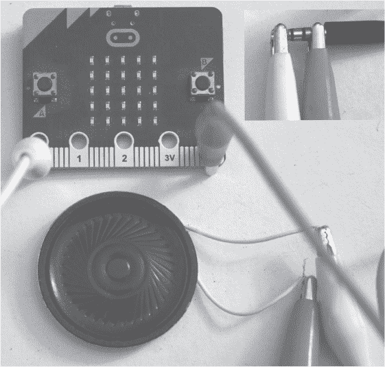

# 第十四章：FIREFLY


萤火虫是一种用于动画和声音的极简主义编程语言。萤火虫主要面向 BBC 的 micro:bit，但你并不需要一个 micro:bit 就能玩得开心——控制台版本也能正常运行。这门语言的灵感来自于 micro:bit 上形成显示屏的 5×5 LED 网格。该语言操作的是一个“萤火虫”，它在网格上飞行。当它飞行时，会留下光亮的轨迹。哦，萤火虫还会唱歌，因为为什么不呢？

本章介绍了该语言的哲学和设计，并随后介绍了它的实现。章节最后将介绍如何配置 micro:bit，以便你希望在第十五章的实验中使用它。再次强调，你并不需要一个 micro:bit；你可以通过使用解释器的控制台版本在命令行上顺利运行所有内容。不过，micro:bit 并不贵，它是一个有趣的小设备，并且它本身可以运行 Python。而且，控制台版的萤火虫可不会唱歌。

### **哲学与设计**

我们的环境是这样的：一只小萤火虫在一个微小的 5×5 网格上飞行。随着它飞行，会留下光亮的轨迹，有时它还会唱歌。

更具体地说，一段萤火虫程序操作的是一个 5×5 的数字网格。在 micro:bit 上，这些数字变成了 5×5 LED 网格的亮度。萤火虫可以通过让 micro:bit 发出某个特定音高和时长的音符来“唱歌”。

一段萤火虫程序是一系列单字符指令，这些指令要么移动萤火虫在网格上飞行，要么设置它的光亮轨迹如何变化，或者让萤火虫发出音符。萤火虫语言还支持一种叫做*双缓冲*的技术，这意味着它不仅仅是一个 5×5 的数字网格，而是有两个 5×5 的网格。程序控制哪个网格展示给用户，哪个网格上则是萤火虫在留下轨迹（即绘制）。双缓冲是计算机动画中常用的一种技术，用户看到一个显示画面，而程序则在更新另一个画面，然后切换视图。这样做可以避免用户看到绘制过程，提供更平滑的动画效果。如果你对双缓冲概念不太熟悉，别担心；我们将在第十五章中详细讲解它的应用。

一段萤火虫程序通过指导萤火虫的移动以及它何时、如何发声来指示萤火虫的行为。如果你从未听过萤火虫唱歌，你并不孤单，因为我也没听过。不过，假装它会唱歌还是挺有趣的。

萤火虫被限制在一个 5×5 的网格上移动。网格的左上角是位置 (0,0)，右下角是位置 (4,4)。位置的表示方式是先给出行号，再给出列号。萤火虫一次只能移动一个位置，可以向北（`N`）、向南（`S`）、向东（`E`）或向西（`W`）移动。当它越过网格的一边时，会绕回到另一边。例如，从位置 (1,4) 向东移动，萤火虫将到达位置 (1,0)。同样，从位置 (4,2) 向南移动，萤火虫将到达位置 (0,2)。

当萤火虫移动时，它会留下一个轨迹，意味着它会将它*刚刚离开的*位置设置为某个值。在 micro:bit 上，值是该位置的 LED 强度，0 表示关闭，9 表示最大亮度。控制台解释器显示 0 为空格，其他值显示为位置的数字值，但如果需要，控制台将显示 0 为 `0`。

因此，如果萤火虫当前位于位置 (2,2)，且强度设置为 3，则一条指令让萤火虫向西移动一个位置，也就是移动到 (2,1)，将会把位置 (2,2) 的强度设置为 3。同时，也有指令让萤火虫保持原地不动，因此可以在当前位置更新位置值。

5×5 的网格就是我们所拥有的所有内存。它也是显示器：我们可以看到每个网格单元的值，可以是数字（控制台）或 LED 的亮度（micro:bit）。因此，萤火虫程序没有变量。

使用内存作为显示并不新颖，但这让我们与优秀的前辈为伍。曼彻斯特婴儿，世界上第一台具有随机存取内存的存储程序计算机，诞生于 1948 年，它也使用内存作为显示（见图 14-1）。


*图 14-1：曼彻斯特婴儿的内存/显示*

婴儿的内存实际上就是照片中显示的阴极射线管。如果某个位打开，就显示一种模式；如果该位关闭，则显示另一种稍微不同的模式。图 14-1 展示了 1998 年曼彻斯特大学为庆祝原始婴儿 50 周年而制作的工作原型。

婴儿拥有 32 条 32 位指令的内存。它是一台冯·诺依曼机器，这意味着程序内存和数据存储是混合的，就像现代桌面计算机一样。而萤火虫更像是一台哈佛架构的计算机，因为数据内存和程序指令的内存是分开的。许多微控制器使用哈佛架构。在我们的例子中，显示是数据内存，而 Python 字符串表示程序内存。

我们有两个版本的萤火虫解释器可供使用。控制台版本用于程序创建。它知道如何解析输入文本以去除空格和注释。它还支持程序跟踪。当程序正常工作时，一个实用程序将源代码转换为可加载到微控制器的形式。微控制器运行一个单独的 Python 程序。对于萤火虫，程序是解释器，其中包含我们想要执行的源代码作为字符串常量。

或许理解萤火虫最简单的方法是详细说明其指令。了解指令的作用告诉我们如何使用它们。萤火虫的指令是单个字符且不区分大小写。这些指令可以分为不同的组别：移动、显示、音乐以及其他。大多数指令与移动有关，因此我们从这些指令开始讨论。

#### ***移动***

萤火虫的移动指令分为两组：移动萤火虫的指令以及定义萤火虫移动后位置变化的指令。我们将后者称为设置*模式*。移动可以是北、南、东或西，并可以选择留在原地（见表 14-1）。

**表 14-1：萤火虫移动命令**

| **指令** | **效果** |
| --- | --- |
| N | 向北移动 |
| S | 向南移动 |
| E | 向东移动 |
| W | 向西移动 |
| T | 留在原地（时钟的“滴答”声） |

萤火虫移动后位置的模式见表 14-2。注意，当程序开始时，萤火虫处于仅移动模式，位于位置（2,2）。

**表 14-2：萤火虫强度（模式）命令**

| **指令** | **效果** |
| --- | --- |
| 0–9 | 恒定的强度值 |
| I | 增加当前值 |
| D | 减少当前值 |
| M | 仅移动；值不变 |
| R | 随机值 1 到 9 |

让我们考虑一个以以下指令开始的程序：

```
SS5NNNNN
```

在这里，萤火虫将向南移动两次到达（4,2），设置强度为 5，然后向北移动五次返回到位置（4,2），在其后留下垂直轨迹，看起来像这样：

| 0 | 0 | 5 | 0 | 0 |
| --- | --- | --- | --- | --- |
| 0 | 0 | 5 | 0 | 0 |
| 0 | 0 | 5 | 0 | 0 |
| 0 | 0 | 5 | 0 | 0 |
| 0 | 0 | 5 | 0 | 0 |

图 14-2 说明了这个过程。



*图 14-2：萤火虫的移动方式*

第一个指令 `S` 将萤火虫从（2,2）向南移动到（3,2），如箭头所示。接下来的 `S` 将萤火虫移动到（4,2）。数字 `5` 设置轨迹强度为 5。最后的五个 `N` 指令按照示例移动萤火虫，留下轨迹，并最终停留在位置（4,2）。

请注意，无法查询当前位置的当前值。当程序启动时，所有位置的值为 0。如果移动模式是递增，向当前位置的值添加 1 会环绕，9 变为 0。同样，如果模式是递减，0 会环绕变为 9。使用模式 `R` 将值设置为 1 到 9 之间的随机整数。

#### ***显示***

双缓冲维护两个 5×5 的内存网格。一次只能显示一个网格，并且可以创建显示网格和萤火虫在其上绘制轨迹的网格的任何组合。我们将这两个网格称为 A 和 B。当程序启动时，显示网格 A，并且萤火虫在网格 A 上绘制。显示指令在 表 14-3 中。

**表 14-3：** 萤火虫显示命令

| **指令** | **效果** |
| --- | --- |
| X | 显示网格 A |
| Y | 显示网格 B |
| A | 在网格 A 上绘制 |
| B | 在网格 B 上绘制 |
| C | 清除活动网格 |
| V | 清除网格 A |
| Z | 清除网格 B |

指令 `C` 清除当前显示的网格，但 `V` 和 `Z` 会清除它们各自的网格，无论当前显示的是哪一个。因此，要显示网格 A 但让萤火虫在网格 B 上绘制，执行 `XB`，然后，当萤火虫绘制完成后，使用 `Y` 显示网格 B。我们将在 第十五章 中进一步探索动画。

#### ***音乐***

要让萤火虫发声，我们需要 表 14-4 中的三条指令。

**表 14-4：** 萤火虫音乐命令

| **指令** | **效果** |
| --- | --- |
| J | 设置音符时值 |
| G | 设置八度 |
| F | 播放音符 |

每个指令使用萤火虫当前位置的值来确定时值、八度或音符。

在底层，这些指令使用 MicroPython `music` 模块中的 `play` 函数。最容易理解的指令是时值和八度。micro:bit 的范围是八度 4 包含中音 C，这是默认值。因此，要将八度设置为 4，我们首先需要设置萤火虫的当前位置，然后设置八度：`4TG`。`4` 将模式设置为 4，意味着萤火虫的轨迹使用强度 4。接下来，我们使用 `T` 保持萤火虫在当前位置。最后，我们使用 `G` 设置八度。

请注意，时值是相对的，时值为 4 是四分音符的合理值。因此，时值为 2 表示八分音符，时值为 8 表示半音符。时值和八度是持久的，意味着一旦设置，它们的值将保持直到被更改。要将时值设置为四分音符，可以使用类似 `4TJ` 的指令。

要播放音符，我们需要使用 `F`。萤火虫当前位置的值表示根据 表 14-5 中的音符。

**表 14-5：** 萤火虫音符命令

| **值** | **音符** |
| --- | --- |
| 0 | 休止符 |
| 1 | C |
| 2 | D |
| 3 | E |
| 4 | F |
| 5 | G |
| 6 | A |
| 7 | B |
| 8 | 休止符（与 0 相同） |
| 9 | C（与 1 相同） |

举个例子，要播放中音 C 作为四分音符，我们需要类似`1TF`的代码来将移动模式或强度设置为 1（“通过停留在原地”进行移动）；这将当前位置设置为 1，`F`用来播放音符。假设八度和时值都保持默认值 4。由于 Firefly 内存一次只能保存一个数字，我们只能使用没有升降音的 C 大调音阶。

我们的歌唱萤火虫将在第十五章中有几个机会为我们献唱。

#### ***剩余部分***

只剩下三条指令。第一条是`H`，它停止程序。与`H`类似的是`L`，它进入一个永久循环（即让程序进入休眠状态）。两者的区别在于 micro:bit 上最为明显。如果执行`H`，程序停止，Python 会清除显示。如果我们执行`L`，程序将“永远”休眠，显示保持活动状态。

最后一条指令是`P`，它在继续之前暂停 0.1 秒。使用`P`可以添加时间效果。当我们实现茶时计和计数器时，会在第十五章看到`P`的使用。

表 14-6 作为所有 Firefly 指令的参考。

**表 14-6：** Firefly 指令集

| **指令** | **效果** |
| --- | --- |
| N | 向北移动 |
| S | 向南移动 |
| E | 向东移动 |
| W | 向西移动 |
| T | 保持原地（时钟的“滴答”） |
| 0–9 | 固定强度值 |
| I | 增加当前值 |
| D | 当前值减一 |
| M | 仅移动，不改变值 |
| R | 随机值 1 到 9 |
| X | 显示网格 A |
| Y | 显示网格 B |
| A | 在网格 A 上绘制 |
| B | 在网格 B 上绘制 |
| C | 清除活动网格 |
| V | 清除网格 A |
| Z | 清除网格 B |
| J | 设置音符时值 |
| G | 设置八度 |
| F | 播放音符 |
| P | 暂停 0.1 秒 |
| L | 永久循环 |
| H | 停止 |

现在，让我们开始动手，真正实现这个语言。

### **实现**

Firefly 是用 Python 编写的，既为了简便，又因为 micro:bit 只能运行一个 Python 程序。我们将在这里列出 micro:bit 版本的 Python 代码，但在第十五章中显示控制台版本的 Firefly 代码。这样做可以让我们使用空格和注释。在第十五章中，我们将带你走过开发过程，这通常包括控制台和 micro:bit 解释器。

Firefly 程序最终是一串大写字母和数字。对于 micro:bit 来说，这串字符串实际上嵌入在 Python 解释器的代码中，所有空格被去除后。micro:bit 确实有一个扁平文件系统，但将 Firefly 代码嵌入到解释器顶部会更简单。

控制台解释器允许空格和以感叹号（`!`）开头的注释，注释会持续到当前行的末尾。控制台解释器还支持执行跟踪，我们将在第十五章看到。

#### ***解释器结构与主循环***

Firefly 解释器由一组全局变量组成，包括显示屏、处理特定 Firefly 指令的几个函数以及执行程序字符串中一个个字符的主循环。该实现故意没有采用面向对象的方式，部分原因是为了可能减少开销并为 micro:bit 上的 Firefly 代码保留空间，部分原因是为了作为一种变换节奏的方式而采用复古风格。因此，解释器从一系列声明和必要的导入开始（见列表 14-1）。

```
PRG = """
1TJ0TITFTFTFTFTFTFTF5TG8TJ1TFH
"""

from microbit import display
from music import play
from time import sleep
from random import randint

DIGITS = ["0","1","2","3","4","5","6","7","8","9"]
MOVES = ["N","E","W","T","S","L"]
BUFS = ["A","B","X","Y"]

A = bytearray(25)
B = bytearray(25)
C = A
D = A
M = "M"
I = 12 dur = 4
oc = 4
display.clear()
```

*列表 14-1：Firefly 解释器前言*

全局变量`PRG`保存待执行的 Firefly 程序。列表 14-1 中的示例程序播放一个简单的音阶。

接下来是必要的 Python 导入。前两个函数是专门为运行在 micro:bit 上的 MicroPython 定制的，分别处理 LED 显示屏和播放音符。`time`和`random`模块是标准的 Python 模块。我们使用`sleep`来实现`P`指令，使用`randint`来实现`R`移动模式。

Firefly 显示屏是一个 5×5 的单数字值网格，存储在 Python 的`bytearray`中。共有两个显示屏，`A`和`B`。当前显示的是分配给`D`的数组，默认情况下是`A`。同样，当前由移动的萤火虫绘制的数组在`C`中，默认也是`A`。`M`保存当前的移动模式，默认值是`"M"`，表示“无尾迹移动”。

显示屏在`A`或`B`中，`I`表示火萤的索引或当前位置。当需要时，这个索引会转换成行和列。默认的音符时值保存在`dur`中，默认的音符八度保存在`oc`中。当程序开始时，实际的 micro:bit 显示屏会被清空（`display.clear()`）。

在列表 14-1 的前言之后，紧接着是七个函数定义。我们将在接下来的章节中介绍这些函数。主循环在最后出现。请注意，这里没有`main`函数，因为解释器作为脚本运行。主循环位于列表 14-2 中。

```
R = True
while R:
    for c in PRG:
        if c == "I":
            M = "I"
        elif c == "D":
            M = "D"
        elif c == "M":
            M = "M"
        elif c == "R":
            M = "R"
        elif c in DIGITS:
            M = c
        elif c == "H":
            R = False
            break
        elif c in MOVES:
            Move(c)
        elif c == "P":
            sleep(0.1) elif c == "C":
            Clear()
        elif c == "V":
            ClearA()
        elif c == "Z":
            ClearB()
        elif c in BUFS:
            Display(c)
        elif c == "J":
            dur = C[I]
        elif c == "F":
            Play()
        elif c == "G":
            oc = C[I]
        Update()

    C = A
    D = A
    M = "M"
    I = 12
    display.clear()
```

*列表 14-2：Firefly 解释器主循环*

主循环在`R`为`True`时运行。这意味着在执行完最后一条指令后，Firefly 程序将重新开始。这也意味着内存不会被擦除。这是 Firefly 唯一支持的循环方式。当我们在第十五章中实现计数器时，我们将看到如何使用它。

内部的`for`循环遍历表示 Firefly 程序（`PRG`）的字符。解释过程是一个直接的嵌套`if`语句。某些指令会直接在`for`循环中处理，比如将移动模式设置为递增（`I`）或递减（`D`）。如果当前字符`c`是数字（在`DIGITS`中），则将移动模式设置为该数字值，`M=c`。

完全退出萤火虫程序的唯一方法是执行 `H`，该指令将 `R` 设置为 `False`，然后使用 `break` 退出内层 `for` 循环。

移动指令（`MOVES`）、显示指令（`BUFS`）和播放音符（`F`）都调用外部函数来执行动作。

注意音符时长（`J`）和音符八度（`G`）指令。它们将全局变量 `dur` 或 `oc` 设置为 `C[I]`。索引 `I` 代表萤火虫当前在范围 [0,24] 内的位置，`C` 被赋值为萤火虫当前绘制的内存的 `bytearray`，可以是 `A` 或 `B`。

每执行一条指令后，都会调用 `Update` 函数来更新 micro:bit 显示器。`Update` 函数的实现如下：

```
def Update():
    i = 0
    while i < 25:
        display.set_pixel(i%5, i//5, D[i])
        i += 1
```

对全局变量 `D` 所分配的 `bytearray` 中 25 个元素的简单循环决定了 5×5 显示屏中每个 LED 的亮度。注意，从线性索引（`i`）到当前活动内存（`D`）的显示列（`i%5`）和行（`i//5`）的转换。

最后一组指令——清单 14-2 中显示的主循环底部——在程序结束时重置显示器，然后再次从头执行。请注意，默认的萤火虫位置为（2，2），并且显示并绘制在第一个内存 `A` 上。然而，内存本身并未重置为 0。

#### ***移动***

除非萤火虫“移动”，否则内存不会被更新。当萤火虫移动时，发生的事情由全局变量 `M` 的值决定，`M` 存储当前的移动模式。清单 14-3 显示了如何处理移动。

```
def Move(c):
    global I,C

 ➊ if M == "M":
        pass
    elif M == "I":
        C[I] += 1
        if C[I] > 9:
            C[I] = 0
    elif M == "D":
        if (C[I] == 0):
            C[I] = 9
        else:
            C[I] -= 1
    elif M == "R":
        C[I] = randint(1,9)
    else:
        C[I] = int(M)

 ➋ i = I//5
    j = I%5

 ➌ if c == "N":
        i -= 1
        if i < 0:
            i = 4
    elif c == "S":
        i += 1
        if i > 4:
            i = 0
    elif c == "E":
        j += 1 if j > 4:
            j = 0
    elif c == "W":
        j -= 1
        if j < 0:
            j = 4
    elif c == "T":
        pass
    elif c == "L":
        while True:
            sleep(1000)

    I = 5*i + j
```

*清单 14-3：萤火虫解释器的移动*

首先，将当前模式应用于*当前*的萤火虫位置 ➊。位置递增后会在 9 后环绕，而递减则会在小于 0 时反向环绕。如果模式是 `R`，则一个随机整数会被分配到当前内存位置 `C[I]`。最后，如果模式是数字，则该值用于更新内存。

接下来，解释器将线性索引 `I` 转换为内存中的行（`i`）和列（`j`）格式，以便我们可以应用实际的移动指令 ➋。通过整数除法 5，将 `I` 映射到 0 到 4，得到行位置。模运算，即整数除法后剩余的部分，给出代表列的余数。

现在应用当前的移动指令 ➌。请注意，只有在指令是移动指令时，才会调用 `Move`。主方向会相应更新行和列的位置，并在需要时进行环绕。例如，当处于第 4 列时，向东移动会回绕到第 0 列，依此类推。

有两个特殊的移动命令，`T`和`L`。前者类似于时钟的滴答。萤火虫实际上并不移动到新的位置，因此`pass`，但解释器会更新当前位置。后者指令`L`专门用于 micro:bit。它进入一个无限循环，在休眠 1,000 秒后短暂唤醒，然后再次休眠。如上所述，Firefly 程序执行`H`来停止程序，解释器退出。在 micro:bit 上，当程序退出时，显示被清除。调用`L`而不是`H`会保留显示。

在执行移动命令后，`i`和/或`j`已经更新。在返回主循环之前，通过将行号(`i`)乘以每行的元素数 5，并添加列号(`j`)，计算出`I`的新值。

#### ***显示***

四个函数控制显示，如列表 14-4 所示。

```
def Clear():
    global C k = 0
    while k < 25:
        C[k] = 0
        k += 1

def ClearA():
    global A
    k = 0
    while k < 25:
        A[k] = 0
        k += 1

def ClearB():
    global B
    k = 0
    while k < 25:
        B[k] = 0
        k += 1

def Display(c):
    global C,D
    if c == "A":
        C = A
    elif c == "B":
        C = B
    elif c == "X":
        D = A
    elif c == "Y":
        D = B
```

*列表 14-4：Firefly 解释器显示*

清除列表 14-4 中的三个功能，`Clear`，`ClearA`和`ClearB`，简单地将显示内存清零。第一个功能将当前显示清零，而最后两个则将给定的显示清零，即`A`或`B`。简单地将新的`bytearray`分配给这些全局变量是行不通的，因为这会打破与`A`和`B`的链接，它们是`bytearray`对象，而`C`和`D`则更像是引用`A`或`B`的指针。请记住，`C`引用着萤火虫正在更新的内存，而`D`则引用当前显示的内存。

`Display`函数根据参数`c`更新显示或绘制到内存。将参数设为`"A"`使`C`引用`*A*`。类似地，传递`"B"`将`C`指向`B`。传递`"X"`将显示内存更改为`A`，传递`"Y"`则将显示指向`B`。注意，这些函数使用`global`语句来正确更新全局变量。大多数 Python 程序使用对象，因此很少使用`global`关键字。我们决定严格实现 Firefly 的命令式实现，因此需要`global`语句。

#### ***音乐***

我们已经调查了主解释器循环、移动和显示。现在让我们通过实现音乐指令来完成 Firefly。

`J`和`G`指令分别设置音符持续时间和八度，位于主循环中（见列表 14-1）。播放指令`F`调用`*Play*`。

```
def Play():
    note = ["R","C","D","E","F","G","A","B"][C[I] % 8]
    play("%s%d:%d" % (note,oc,dur))
```

`Play`将当前萤火虫位置转换为音符字符串，然后通过 MicroPython 的`music`函数`play`以当前八度和持续时间播放音符。内存位置有 10 个可能的值，因此音符对 8 取模，以处理内存值为 8 或 9 的情况，将其循环至 0 和 1。

使用 `Play`，我们的 micro:bit 实现的 Firefly 编程已经完成。如前所述，控制台版本包含额外的代码来处理控制台光标位置、执行追踪，并通过 CTRL-C 捕获 SIGINT；请务必查看这些功能是如何实现的，阅读 *firefly.py* 文件，这是控制台版本解释器的名称。

我们差不多可以开始 Firefly 编程了。然而，如果我们使用的是实际的 micro:bit，至少应该熟悉如何配置扬声器并给它供电。我们将把编程 micro:bit 的内容留到第十五章。现在，让我们快速了解一下 micro:bit 硬件。

### **配置 Micro:bit**

BBC micro:bit (*[`microbit.org/`](https://microbit.org/)*) 是一款小型单板计算机。开箱即用，它运行 MicroPython（详细文档见 *[`microbit-micropython.readthedocs.io/en/v2-docs/`](https://microbit-micropython.readthedocs.io/en/v2-docs/)*）。micro:bit 旨在通过一款廉价的计算机系统让尽可能多的人接触编程。它有两个版本：旧版 v1，配备 16KB 内存；新版 v2 配备 128KB 内存。两个版本都适合硬件项目，并且有大量配件可供选择 (*[`microbit.org/buy/accessories/`](https://microbit.org/buy/accessories/)*)。想了解更多有关 micro:bit 本身支持的丰富硬件，请访问 [`tech.microbit.org/hardware/`](https://tech.microbit.org/hardware/)。最后，想要了解如何使用 micro:bit 实现硬件项目，可以参考 Simon Monk 的优秀著作 *Micro:bit for Mad Scientists*（No Starch Press, 2019）。

#### ***micro:bit 硬件概述***

图 14-3 详细介绍了 micro:bit 及其功能。



*图 14-3：micro:bit（版本 2）的硬件概述*

我们主要关注的是 5×5 LED 显示屏、扬声器和用于编程设备的 Micro-USB 连接器。如果你使用的是旧版 1 设备，那么没有内置扬声器。在这种情况下，你需要连接一个外部扬声器；请参阅下一个章节。

micro:bit 配备了一个小型电池包，支持两颗 AAA 电池。然而，当连接到计算机或 5V 电源时，它也能正常工作。早期版本的 micro:bit，特别是 1.3B 之前的版本，不应通过外部 5V 电源供电。如果你的 micro:bit 配有扬声器，那么就可以正常使用。如果没有扬声器，请检查版本号，版本号通常可以在连接器右侧附近的背面小字中找到，确保其至少为 1.3B 或 1.5。

#### ***使用外部扬声器***

如果你的 micro:bit 是带内置扬声器的版本 2，可以跳过此部分。对于版本 1 设备，我们需要添加外部扬声器，但不用担心：这个过程很简单。让我们一起看看如何操作。

首先，你需要某种扬声器。如果你有一只来自废弃电子设备的旧扬声器，比如旧收音机，可以使用它。过去，许多动手爱好者会从报废的晶体管收音机中取出很多这种扬声器。然而，在如今的时代，你可能没有一只裸露的扬声器。可是，并非一切都失去了！原来，一副耳机也可以完全适用。

micro:bit 边缘连接器是 micro:bit 与外部硬件设备之间的接口。要连接扬声器，将一根线连接到标有“0”的连接器，另一根线连接到标有“GND”的连接器。如果使用耳机，将耳机插头的尖端连接到连接器 0，插头最远端连接到 GND 连接器。使用鳄鱼夹连接最为简单，但如果你没有这些工具，扭在一起并绕过 micro:bit 插孔的裸线也能完成连接。图 14-4 展示了如何使用鳄鱼夹连接普通扬声器。插图显示了如何连接耳机。



*图 14-4：连接外部扬声器或耳机*

有些扬声器上标有正极（+）和负极（–）连接。如果是这样，将图 14-4 中的白色线连接到+端子，红色线连接到–端子。如果扬声器没有极性标记，也不用担心；无论如何连接线，它都会正常工作。对于耳机，插头最远端通常是接地端，因此将红色线连接到它，白色线连接到插头尖端。

### **总结**

本章向我们介绍了 Firefly，它的设计以及背后的理念。然后我们讲解了实现过程，因为我们很快就要在 micro:bit 上运行它，并且最后配置了 micro:bit 以便进行 Firefly 实验。Firefly 是目前最简单的编程语言之一。现在，让我们观察一些萤火虫，看看它们能做些什么。
