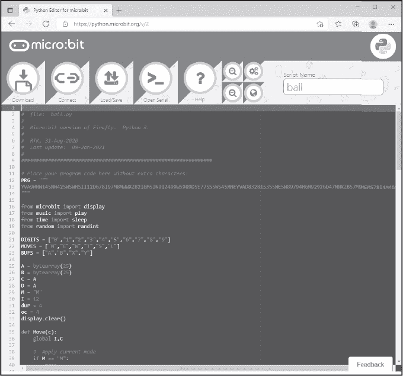
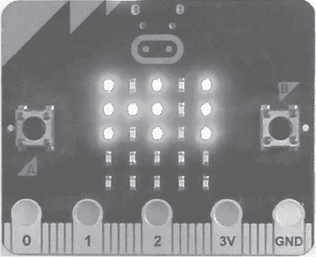
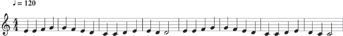
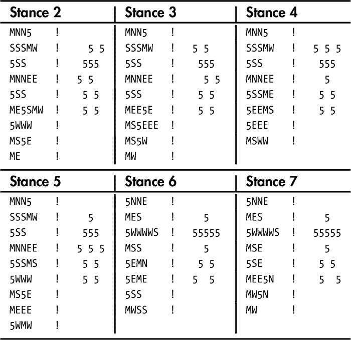
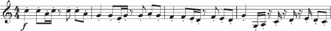
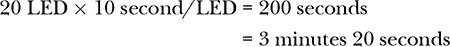

# 第十五章：使用 FIREFLY


第十四章向我们介绍了 Firefly。现在让我们看看它能做什么。首先，我们将介绍构建和测试 Firefly 程序的环境。然后，我们将看五个例子来测试 Firefly。第一个测试是让萤火虫计数（“飞行时间”）。接着，我们将模拟 1960 年代的科幻计算机显示（“太空漫游”）。然后，我们将更高雅一些，播放一些经典音乐（“灯光中的贝多芬”）。我们甚至会尝试动画效果（“舞蹈舞蹈”），最后做一些有用的事，设置一个茶水计时器（“茶时光”）。本章将以讨论 Firefly 作为编程语言结束。

### **流程**

Firefly 解释器有两个版本：一个是控制台版，一个是 micro:bit 版。第十四章介绍了 micro:bit 版本。在本节中，我们将演示开发 Firefly 程序、使用控制台解释器进行测试、通过执行追踪调试，并将代码部署到 micro:bit 上。最后一步对于本章的所有示例都是可选的，如果你没有 micro:bit 也可以跳过。不过，这样你就听不到萤火虫的歌声了。

该过程包括以下列出的步骤。步骤 4、5 和 6 是特定于 micro:bit 的，因此仅使用控制台的用户应在步骤 3 后停止。

1.  在文本编辑器中编写 Firefly 代码，包括注释和空白。

1.  使用控制台解释器 *firefly.py* 运行代码。

1.  可选地，通过执行追踪调试代码。

1.  使用 *fly_dump.py* 打包调试过的程序。

1.  构建一个 micro:bit 运行时，将压缩的 Firefly 代码与 micro:bit 解释器 *firefly_micro.py* 打包在一起。

1.  使用 *[microbit.org](http://microbit.org)* Python 编辑器将打包的运行时传输到 micro:bit，[`python.microbit.org/v/2/`](https://python.microbit.org/v/2/)。

如果你计划使用 micro:bit，我们将使用在线 Python 编辑器 *[`python.microbit.org/v/2`](https://python.microbit.org/v/2)*。它在 Windows 上表现最佳。我使用了 Microsoft Edge 浏览器，并且没有遇到任何问题。

在 Linux 上使用 micro:bit 时，我在使用版本 1 的 micro:bit 和 Mu 编辑器 1.0.2 版本时取得了一些成功。在编辑器的后续版本和版本 2 的 micro:bit 上，只有在直接从 GitHub 仓库运行编辑器（[`github.com/mu-editor/mu/`](https://github.com/mu-editor/mu/)）时，才能在 Ubuntu 18.04 上获得稳定的功能。你的情况可能有所不同。

图 15-1 显示了在 Microsoft Edge 浏览器中运行的 Windows 上的 Python 编辑器。



*图 15-1：micro:bit 的 Python 编辑器*

请注意，本书的 GitHub 网站包含了展示代码在 micro:bit 上运行的短视频。请查看，特别是如果你不打算亲自使用 micro:bit 的话。

#### ***编写 Firefly 代码***

我们的第一个示例是萤火虫版的 “Hello, world!” 程序，它在屏幕上绘制字母 `HI`。源代码位于 *hi.fly* 文件中，路径是 *firefly/console/examples* 目录（见 Listing 15-1）。

```
MNNWW5  ! move mode, go to (0,0), intensity 5
SSS     ! left side of the "H"
MNN5    ! up to (1,0)
EEE     ! crossbar of the "H"
MNW     ! move to (0,2)
5SSS    ! right side of the "H"
MEEN    ! move to (0,4)
5NNN    ! "I"
L       ! loop
```

*Listing 15-1: Firefly 中的 “Hello, world!”*

*hi.fly* 的第一行确保了移动模式（无轨迹），并将萤火虫从初始位置 (2,2) 移动到左上角 (0,0)。然后，模式设置为强度 5。

下一行将萤火虫向南移动三个位置，绘制字母 H 的左侧。此时，萤火虫位于 (3,0) 位置，因此切换到移动模式并向北移动两次，将萤火虫移至 (1,0) 位置。将模式设置为 5，并向东移动三次绘制字母 H 的横杆。接下来的两行完成了字母 H 的绘制，`MEEN` 将移动到 (2,4)。从 (2,4) 开始，设置模式为 5 并向北移动三次，绘制字母 I，最终萤火虫位于 (4,4) 位置。`L` 指令会永远循环，以保持 “HI” 显示在 micro:bit 上。

#### ***使用控制台解释器***

要执行 Listing 15-1，我们需要控制台解释器。运行以下代码：

```
> python3 firefly.py examples/hi.fly
```

以生成

```
    5   5   5
    5 5 5   5
    5   5   5
```

5×5 显示框缩进了四个空格，每个数字之间有一个空格。默认情况下，*firefly.py* 将 0 强度显示为空格。添加 `-z` 命令行选项后，0 强度将显示为 0。

```
    5 0 5 0 5 
    5 5 5 0 5 
    5 0 5 0 5 
    0 0 0 0 0 
    0 0 0 0 0
```

现在我们可以看到完整的 5×5 网格。

接下来，通过添加 `-t`（跟踪）命令行选项，逐步执行 *hi.fly*：

```
> python3 firefly.py examples/hi.fly -t
```

在跟踪模式下，一条指令被执行并且显示更新；然后，在执行下一条指令之前，解释器会显示状态行，并等待用户按下 ENTER 键或 Q 键退出程序。例如，在跟踪模式下运行*hi.fly*，我们会看到

```
I=(2,2)(12), SHOW=A, DRAW=A, M=M, INST=M
```

它告诉我们，最后执行的指令是 `M`（设置移动模式）。这是状态行中的 `INST` 部分。状态行的其余部分如下所述：

| **指令** | **解释** |
| --- | --- |
| `I=(2,2)(12)` | 萤火虫位于 (2,2) 位置（索引 12） |
| `SHOW=A` | 当前显示的是网格 A |
| `DRAW=A` | 当前绘制的是网格 A |
| `M=M` | 移动模式是 “M” |

索引指向当前活动内存网格的 `bytearray`。

按下 ENTER 键将我们带到

```
I=(1,2)( 7), SHOW=A, DRAW=A, M=M, INST=N
```

它告诉我们，萤火虫当前位于 (1, 2) 位置（索引 7），因为执行了一个 “向北移动” 指令。

持续按下 ENTER 键会跟踪整个程序的执行过程。

```
I=(0,2)( 2), SHOW=A, DRAW=A, M=M, INST=N
I=(0,1)( 1), SHOW=A, DRAW=A, M=M, INST=W
I=(0,0)( 0), SHOW=A, DRAW=A, M=M, INST=W
I=(0,0)( 0), SHOW=A, DRAW=A, M=5, INST=5
I=(1,0)( 5), SHOW=A, DRAW=A, M=5, INST=S
I=(2,0)(10), SHOW=A, DRAW=A, M=5, INST=S
I=(3,0)(15), SHOW=A, DRAW=A, M=5, INST=S
--snip--
```

我们继续到 `L` 指令，它将我们带入一个无限循环。使用 CTRL-C 来退出循环。

我们有了一个可以运行的程序。现在让我们将它打包以便在 micro:bit 上运行。

#### ***打包程序包***

我们不能直接使用 *hi.fly* 文件与 micro:bit 版本的 Firefly，因为我们需要首先去除注释和空白。我们可以手动去除这些内容，但为什么要麻烦自己呢？我们已经有了一个工具来帮助我们。与 *firefly.py* 位于同一 `console` 目录下的是 *fly_dump.py*。让我们运行它，以获取 *hi.fly* 的单行版本。

```
> python3 fly_dump.py examples/hi.fly ../micro/examples/hi.fly
```

第一个参数是带有注释和空格的代码的控制台版本。第二个是输出，在这种情况下，输出被发送到*micro*中 micro:bit 版本的*examples*目录。生成的输出为

```
MNNWW5SSSMNN5EEEMNW5SSSMEEN5NNNL
```

这个版本的代码仍然在控制台解释器中运行。试试看，亲自体验一下。

为了制作 micro:bit 捆绑包，我们需要完成以下步骤：

1.  将*firefly_micro.py*复制到*hi.py*。

1.  编辑*hi.py*并将*PRG*更新为*micro/examples/hi.fly*中的文本。

1.  运行 Python 编辑器并加载*hi.py*。

1.  通过 USB 连接 micro:bit。

1.  从在线 Python 编辑器对 micro:bit 进行编程。

步骤 1 和步骤 2 表示这些捆绑包是编辑过的 micro:bit 版本的解释器副本，包含了压缩后的 Firefly 代码。默认的*firefly_micro.py* 文件开始于

```
PRG = """
1TJ0TITFTFTFTFTFTFTF5TG8TJ1TFH
"""
```

它变成了

```
PRG = """
MNNWW7SSSMNN7EEEMNW7SSSMEEN7NNNL
"""
```

这会将代码嵌入到*hi.py*中。*hi.py* 的其余部分与第十五章的解释器代码相同。

要编程 micro:bit，首先在 Microsoft Edge 中运行编辑器，打开 *[`python.microbit.org/v/2/`](https://python.microbit.org/v/2/)*。然后，将 micro:bit 的 Micro-USB 端口连接到计算机的 USB 端口。micro:bit 可能会自动挂载。如果是这样，只需关闭任何打开的资源管理器窗口。

接下来，通过点击**连接**并从弹出的对话框中选择 micro:bit 来连接到 micro:bit。如果看到类似于 “‘BBC micro:bit CMSIS-DAP’ – 已配对” 的字符串，说明 micro:bit 已连接并正常工作。选择 micro:bit 并点击**连接**。

接下来，通过点击**加载/保存**然后点击**下载**来打开*hi.py*，以便对 micro:bit 进行编程。编程只需几秒钟。当完成时，程序会立即开始运行，并生成图 15-2。



*图 15-2：“你好，世界！” micro:bit 风格*

当程序运行时，你注意到什么了吗？按下 micro:bit 下方的重置按钮重新运行它。

如果你使用的是版本 1 的 micro:bit，你会看到消息从左到右在屏幕上绘制。*hi.fly* 程序在网格 A 上移动萤火虫并显示网格 A，因此我们可以看到每个指令的效果。在本章后面，我们将调整*hi.fly*，使用双缓冲（请参见下面的“太空旅行”）。

本章其余部分介绍了每个示例的代码，并在适用时在控制台上运行，然后在 micro:bit 上运行该代码。在每种情况下，我们都按照这里的方式对 micro:bit 进行编程：使用*fly_dump.py* 去掉注释和空格，将压缩后的 Firefly 程序文本粘贴到适当重命名的*firefly_micro.py*副本中，并通过 Python 编辑器将副本加载到 micro:bit 上。别忘了查看本书 GitHub 网站上的 micro:bit 视频。

让我们让我们的萤火虫开始工作。

### **飞行时间**

`P` 指令使程序暂停 0.1 秒。因此，`PPPPPPPPPP` 会让程序暂停一秒。我们以此为基础，设计一个计数器/计时器。我们的目标是编写一个 Firefly 程序，该程序能计数秒数，最多达到 1,000 秒，然后重新开始计数。Firefly 除了在程序结束后从头开始运行外，并没有其他的循环机制；因此，我们需要设计程序，使得每次从头开始时，计数器能重新从 0 开始。

如果 10 个 `P` 指令可以暂停一秒，那么 `PPPPPPPPPPT` 会先暂停一秒，然后通过保持当前位置“移动” Firefly。如果模式是 `I`（增量），则其效果是暂停一秒后递增当前 Firefly 位置。重复这种一秒暂停 10 次，每次暂停后执行 `T`，就得到了一个 10 秒的计时器。

为了计数，我们增加个位数字，直到其回绕到 0，然后将十位数字加 1。我们可以使用这种方法，通过一秒的计时器，构建一个两位数的计时器，方法是从当前的 Firefly 位置——个位数位置——向左移动并递增，然后再返回并重复此过程，持续 10 秒。

这个思路提示了一组重复的指令。程序从 Firefly 位置 (2,2) 开始。我们将位置 (0,4) 用作个位数位置，将位置 (0,3) 用作十位数位置。请参考 Listing 15-2 中显示的指令序列。

```
NNEE            ! move to (0,4)
I               ! increment mode
PPPPPPPPPPT     ! 1 second and increment
PPPPPPPPPPT     ! 
PPPPPPPPPPT     ! 
PPPPPPPPPPT     ! 
PPPPPPPPPPT     ! 
PPPPPPPPPPT     ! 
PPPPPPPPPPT     ! 
PPPPPPPPPPT     ! 
PPPPPPPPPPT     ! 
PPPPPPPPPPT     ! 
MWIT            ! move over 1 and increment
MEI             ! move back, set increment mode
```

*Listing 15-2: 一个 10 秒计时器*

第一行将 Firefly 从 (2,2) 移动到 (0,4)，即个位数位置。第二行设置增量模式。接下来是一个一秒的延迟，然后是一次“滴答”递增个位数位置。再接着是九次一秒的延迟，完成了 10 秒的延迟，个位数位置从 0 数到 9 然后回到 0。

`MWIT` 这一行将位置从 (0,4) 向左移动一格，至 (0,3)，并将十位数位置增加 1。我们来分解一下这些步骤：`M` 设置为移动模式（没有尾迹），`W` 向左移动一格，`I` 设置为增量模式，`T` 使位置 (0,3) 递增。该步骤块以 `MEI` 结束，将 Firefly 移回到个位数位置 (0,4)，该位置当前为 0，因为它已经回绕过，接着通过 `I` 重新设置增量模式。

Listing 15-2 用于计时 10 秒。如果将 Listing 15-2 重复九次，除了前两行 `NNEE` 和 `I`（用于设置初始 Firefly 位置和模式），我们就得到了一个 100 秒的计时器。

文件 *fly_time.fly* 位于 *console/examples* 中，包含我们需要的代码。大部分代码是像 Listing 15-2 中那样的重复块。然而，第 10 个块以 Listing 15-3 结束。

```
PPPPPPPPPPT     ! 1 second and increment
MWIT            ! move over 1 and increment
MWIT            ! move over 1 more and increment
MEEI            ! move back, set increment mode
```

*Listing 15-3: 第 10 个计时块结束*

最后进行一秒的暂停和递增，然后通过`MWIT`指令将位置从（0,4）移动到（0,3），并递增十位数值。由于这是第 10 个块，十位数值已经从 9 回滚到 0。因此，第二个`MWIT`将位置从（0,3）移动到（0,2），百位，并递增该位置。

这最后一步完成了从 0 到 100 的计数。如果萤火虫移动回（0,4）并且程序通过重新开始来循环，显示仍然会是`1 0 0`。最后一行是`MEEI`，将位置移回（0,4）并设置增量模式。由于没有`H`或`L`指令，程序重新开始。

请注意，当程序循环时，显示内存被保留，但萤火虫会被扭曲回其初始位置（2,2）。然而，这正是我们希望的效果。*fly_time.fly*中的第一条指令告诉萤火虫移动到（0,4），这是我们需要它的位置，以便再计时 100 秒。

百位位置（0,2）在经过另一个 100 秒后再次递增，显示为`2 0 0`。再过 100 秒，显示为`3 0 0`。这种方式持续到 1000 秒，之后显示会回滚为全 0。我们不会递增千位位置，但程序会继续循环，直到按下 CTRL-C，因此 1000 秒的计数器将重新开始，不断循环。

使用控制台解释器运行*fly_time.fly*并使用`-z`选项，将 0 内存显示为 0。

```
> python3 firefly.py examples/fly_time.fly -z
```

程序会一直计数，直到你按下 CTRL-C。通过在一个区间的开始启动程序，并在区间结束时使用 CTRL-C 停止程序，我们就得到了一个原始的秒表——虽然很极客，但功能完备。

这个例子利用了 Firefly 唯一的循环方式：重启程序。它自然是为控制台设计的，因此我们可以直接读取时间作为数字，但没有什么能阻止你将此代码运行在 micro:bit 上。如果你这么做，你会看到 LED 逐渐变亮的序列。如果你像我一样，你会看到 LED 变化并理解程序在递增，但却无法可靠地区分亮度为 3 的 LED 和亮度为 4 的 LED 之间的差异。

当然，*fly_time.fly*是以十进制计数的；然而，没有理由不能使用其他进制。如果我们使用二进制，那么 micro:bit 会很好地工作。或者，我们也可以使用三进制，用 0、5 和 9 的 LED 强度来区分不同的数字。更改进制会改变所使用的重复代码块，但总体思路保持不变。我们将不再使用十位（10⁰）、十位（10¹）和百位（10²），而是使用个位（3⁰）、三位（3¹）、九位（3²）以及可能的二十七位（3³）。

我们将在本章后面实现另一种类型的计时器，但现在，让我们学习如何使用 Firefly 的双重缓冲进行动画。

### **太空旅行**

我们已经多次提到萤火虫的双重缓冲了。现在让我们看看它的实际效果。本节中的示例在 micro:bit 上效果最好。根据机器的速度，使用控制台解释器时你可能会看到一些效果；然而，在 micro:bit 上它最为明显。

在本章的早些时候，我们玩了 *hi.fly* 并评论过，因为我们在绘制 A 网格时展示了 A 网格，所以我们可以看到字母在绘制时的样子。一个简单的修改使用双重缓冲，在字母被绘制完毕后才将其展示给我们。我们需要的代码在 *hi2.fly* 文件中，位于 *console/examples* 目录下。

列表 15-4 展示了更新后的代码。 列表 15-4 和 列表 15-1 之间唯一的区别是第一行的 `Y` 和倒数第二行的 `X`。

```
Y       ! show grid B, drawing on A
MNNWW5  ! move mode, go to (0,0), intensity to 5
SSS     ! left side of the "H" 
MNN5    ! up to (1,0)
EEE     ! crossbar of the "H" 
MNW     ! move to (0,2)
5SSS    ! right side of the "H" 
MEEN    ! move to (0,4)
5NNN    ! "I" 
X       ! now show grid A
L       ! loop
```

*列表 15-4：“HI”与双重缓冲*

我们展示 A 网格并对其进行绘制。执行 `Y` 显示 B 网格，B 网格是空的，同时继续绘制 A 网格。字母像以前一样被绘制，但用户看不见它，因为显示的是 B 网格。当字母绘制完成后，`X` 再次显示 A 网格，`L` 进入循环以保持 micro:bit 显示的内容。

将 *hi2.fly* 打包并加载到 micro:bit 上。当它运行时，你将不会看到字母被逐个绘制，直到完整的单词 `HI` 突然出现。如果你在控制台中使用 `-t` 选项运行 *hi2.fly*，你也会注意到 `HI` 会突然出现。

列表 15-4 是一个双重缓冲的最小示例。双重缓冲的核心概念是：在更新 A 网格时展示 B 网格，然后切换并展示 A 网格，在更新 B 网格时如此反复。我们根据需要重复此过程，以确保用户在网格绘制时永远看不到它。

让我们看一个稍微有趣一点的示例，在这里我们模拟了 1960 年代科幻剧集中常见的随机“计算机”显示。首先，我们将生成没有双重缓冲的实时显示。然后，我们会修改代码，使用双重缓冲。这两者之间的差异显而易见；不过，老实说，两种方法看起来都很酷。

列表 15-5 生成没有双重缓冲的随机显示。

```
WWNN        ! move to (0,0)
R           ! set random mode
EEEES       ! random row 0
WWWWS       ! random row 1
EEEES       ! random row 2
WWWWS       ! random row 3
EEEES       ! random row 4
```

*列表 15-5：随机计算机灯光*

第一行移动到 (0,0)，即显示的左上角。回想一下，不仅萤火虫从 (2,2) 位置开始，它还以“移动”模式（`M`）开始，所以没有拖影。第二行将模式设置为“随机”（`R`）。

第三行从 (0,0) 向东移动四次。每次移动都将前一个位置设置为随机强度。最后一次向东移动后，萤火虫位于 (0,4) 位置，因此向南移动将 (0,4) 位置设置为随机强度，并将萤火虫放置到 (1,4) 位置。

为了填充显示的第二行，我们需要四次向西移动，然后向南移动一次，最终到达第三行的起点。这种之字形移动会继续，直到最后的`S`将萤火虫移到(0,4)。最后一次移动将最后一个 LED 设置为(4,4)。

由于没有暂停指令，因此程序在填充显示后会继续循环。萤火虫被重置到(2,2)，然后立即移动到(0,0)，并且从上到下重新绘制网格。因此，显示会一行一行地被覆盖，之前的一组随机强度仍然存在。

控制台解释器运行得太快，无法看到覆盖效果，但在 micro:bit 上运行*random.fly*时，效果可以看得见，虽然只是勉强可见。即使在 micro:bit 上，代码也几乎太快了。这个效果令人着迷。不幸的是，无法在书中的静态图像中捕捉到这个效果。要查看效果，请访问 GitHub 网站上的视频。

我们可以引入双缓冲，而不是一次覆盖一行显示，这样可以在生成下一个网格时，显示一个完整的随机强度网格，然后切换并显示那个网格，依此类推。

列表 15-6 展示了我们*random2.fly*。

```
B           ! draw on B, showing A
WWNN        ! move to (0,0)
R           ! set random mode
EEEES       ! random row 0
WWWWS       ! random row 1
EEEES       ! random row 2
WWWWS       ! random row 3
EEEES       ! random row 4, end at (4,0)
M           ! move mode
NNNN        ! move to (0,0)
YA          ! show B, draw on A R           ! set random mode
EEEES       ! random row 0
WWWWS       ! random row 1
EEEES       ! random row 2
WWWWS       ! random row 3
EEEES       ! random row 4, end at (4,0)
X           ! show A
```

*列表 15-6：带双缓冲的随机计算机灯光*

代码分为两个不同的块。第一个块几乎与列表 15-5 相同，唯一的区别是增加了一个`B`指令，告诉萤火虫在显示网格 A 时，也在网格 B 上留下轨迹。在第一个块的底部，在更新完网格 B 的所有内容后，接下来是`M`和`NNNN`来设置移动模式，然后返回到(0,0)。

第二块代码现在接管。首先，`YA`显示网格 B，即第一个代码块刚刚用随机强度填充的网格，并切换到在网格 A 上绘制轨迹。接下来的六行填充网格 A，最后的指令是`X`，以显示网格 A。

在这一点，程序进入循环并重新开始，填充网格 B。最终的`X`使我们再次查看网格 A，就像当一个 Firefly 程序开始时一样，因此序列会重复：显示 A，绘制 B，显示 B，绘制 A，然后永远循环。

与列表 15-5 不同，它不断覆盖显示的唯一网格，列表 15-6 则在两个网格之间来回切换，因此用户只会看到最近填充的网格，而看不到正在绘制的网格。这个效果甚至可能更像旧时的科幻电影。没有从上到下的流动，强度似乎是同时改变的。

### **贝多芬之光**

我在第十四章中曾声称我们的萤火虫知道如何唱歌。现在，让我们通过编写一些 Firefly 音乐来证明这一点。当然，如果没有实际的 micro:bit，单纯在控制台上运行本节中的示例会令人失望。别担心！你总是可以通过书籍 GitHub 网站上的视频来聆听这首歌。

Firefly 支持在 C 调中演奏音符。中央 C（默认）是第 4 八度，而中央 C 本身是第 1 音符。因此，演奏 Firefly 中一个音符的最简单方法是执行`1TF`，该指令将强度设置为 1，“滴答”更新默认的萤火虫位置（2,2），并以四分音符的默认时值进行演奏。当然，代码会循环，并在短暂的重置暂停后，音符再次演奏。结果是一个在网格中央的暗 LED，随后发出中央 C 音高的嗡嗡声，反复进行，直到你切断电源。不过，从一个三字符的程序中发出声音，还是相当令人印象深刻的。

稍微长一点的程序听起来很有趣，有点像外太空的感觉：`1TJRTF`。首先，它将音符时值设置为 1，即四分之一音符的四分之一（十六分音符）。然后它将音符本身设置为随机音符并演奏。视觉上，音高越高，LED 越亮。`R`指令将位置设置为[1,9]范围内的随机值。然而，你会注意到在随机旋律播放时会有停顿。如果随机值是 8，它就作为音符 0，即休止符。为了好玩，可以尝试两个略有不同的版本：`RTJRTF`和`0TJRTF`。第一个使音符时值也变为随机，第二个将时值设置为 0，产生切分音效果。

我们会在适当的时候提到贝多芬，但在此之前，清单 15-7 展示了如何演奏一个实际的音阶。

```
1TJ     ! set note duration
0TI     ! set first note and increment mode
TF      ! increment and play note
TF      ! increment and play note
TF      ! increment and play note
TF      ! increment and play note
TF      ! increment and play note
TF      ! increment and play note
TF      ! increment and play note
5TG     ! set octave to 5 (default is 4)
8TJ     ! set duration
1TF     ! play note 1 of octave 5
H       ! halt
```

*清单 15-7：一个简单的 C 大调音阶*

第一行将时值设置为 1，就像我们在随机旋律中做的那样。接下来，我们将音符设置为 0，模式设置为增量。然后，`TF`增量到 1 并演奏音符（中央 C）。接下来的`TF`增量到 2 并演奏 D。这个过程对 E 到 B 音符重复进行。

要演奏高于中央 C 一个八度的 C 音，我们需要使用`5TG`更新八度，并记住中央 C 是第 4 八度。最后，`8TG`将时值设置为半音符（8），并在停止前演奏第 5 八度的第一个音符。

音阶演奏得很快，但在最后一个音符演奏之前会有一个明显的停顿。在这种情况下，这个停顿增添了一点戏剧效果，但实际上，停顿是因为 micro:bit 解释 Firefly 指令的速度较慢。演奏倒数第二个音符 B 和最后一个音符 C 之间有八个指令。解释这八个指令会导致你听到的停顿。

让我们来点经典的。我们想让代码让萤火虫“唱”贝多芬的*欢乐颂*（见图 15-3）。



*图 15-3：贝多芬的* 欢乐颂

如果不仅仅是在一个地方演奏音符，而是萤火虫在演奏音符时同时显示它们，那不是更好吗？除了唱歌，我们还希望萤火虫通过显示器上的灯光向我们展示音符。

图 15-3 中有 30 个音符，分成两个包含 15 个音符的音乐段落。micro:bit 显示器每行有五个 LED。对我们来说太方便了。我们将逐个位置显示音符，使用前 3 行 LED 来覆盖 15 个音符的段落。然后，我们清除屏幕，重复这个过程显示剩下的 15 个音符。我们需要的代码在 *ode.fly* 中。

让我们按照音乐段落逐步解析代码。第一段旋律在清单 15-8 中。

```
NNWW    ! move to (0,0)
3TFE    ! E 
3TFE    ! E 
4TFE    ! F 
5TFE    ! G 
5TFEMS  ! G 
4TFE    ! F 
3TFE    ! E 
2TFE    ! D 
1TFE    ! C 
1TFEMS  ! C 
2TFE    ! D 
3TFE    ! E 
3TFE    ! E 
2TFE    ! D 
B8TJ    ! draw on B, showing A
A2TF    ! draw on A, D8
```

*清单 15-8：欢乐颂，第一段旋律*

默认情况下，八度是中音 C，时值匹配四分音符，因此我们无需更改时值或八度。我们希望音符在播放时逐行显示，因此我们首先将萤火虫移动到位置 (0,0)。接下来的代码设置了一个我们将在每个音符上重复的模式。例如，`3TFE` 将当前位置设置为 3（`3T`），播放音符（`F`），然后将位置向东移动一个格子（`E`）。这个指令模式在整个乐曲的每个音符上都会使用。

接下来的四个音符 E-F-G-G 完成了第一行，并将萤火虫返回到位置 (0,0)。为了进入下一行，我们使用 `MS` 指令将萤火虫向南移动到 (1,0)，而不改变当前的 (0,0) 位置。接下来播放第二行的音符 F-E-D-C-C，然后进入第三行。

第三行的前四个音符依次为：D-E-E-D。然后，我们将时值从四分音符改为二分音符。如果我们直接进行更改，显示会出错，因为我们需要将位置设置为 8 以执行 `J` 指令。所以我们让萤火虫在未显示的 B 网格上绘制，并设置时值，然后再切换回 A 网格绘制并播放音符：`A2TF`。第一段旋律现在已经完成。

清单 15-9 播放第二段旋律。

```
CB4TJA  ! clear A, draw on B, set duration, draw on A
MNNE    ! back to (0,0)
3TFE    ! E
3TFE    ! E
4TFE    ! F
5TFE    ! G
5TFEMS  ! G
4TFE    ! F
3TFE    ! E
2TFE    ! D
1TFE    ! C
1TFEMS  ! C
2TFE    ! D
3TFE    ! E
2TFE    ! D
1TFE    ! C
B8TJ    ! draw on B, showing A
A1TF    ! draw on A, C8
H       !
```

*清单 15-9：欢乐颂，第二段旋律*

清单 15-9 与 清单 15-8 基本相同，唯一的区别是第一行。该行清除显示器 A 网格，切换到网格 B 重置时值为 4，然后再切换回网格 A 继续绘制。接下来的一行将萤火虫移动到 (0,0)，第二段旋律像第一段一样播放。最后一个音符后，程序执行 `H` 以结束。

自然，我们必须在 micro:bit 上运行这个程序，但如果你没有 micro:bit，可以播放相关视频来看演示。将这种技术应用于其他旋律是很简单的，尽管我们很幸运，《欢乐颂》由两段完全相同的 15 个音符组成，正好适合 5×5 的显示器。

如果你观看旋律播放，你会看到 LED 的亮度与音符的音高相关；较高的音符较亮，至少在同一个八度内是这样。

### **舞动舞动**

现在让我们利用 Firefly 的双缓冲能力做一些带有音乐的动画。我们将从动画开始，稍后再添加音乐。

我们的目标是让一个简单的图形“跳舞”。在一个 5×5 的显示屏上，重点肯定是“简单”这个词。图形的每个姿势都是一个显示内容。为了制作动画，我们将使用双缓冲和一组独立的姿势。我们将通过在代码中定义这些姿势，将它们组合成动画，并加入舞蹈音乐。我们的萤火虫在这个例子中将会非常忙碌。

#### ***姿势***

我们将让萤火虫在每个姿势的开始和结束位置 (2,2) 处跟踪图形。这使得我们可以随意将这些姿势串联在一起，并确保在程序循环并重新开始时处于正确的位置。

我们将从姿势 1 开始。随着图形的跳舞，每个动作都会回到姿势 1，然后再移动到下一个姿势。清单 15-10 展示了姿势 1 的代码和该姿势本身。

```
MNN5    !   
SSSMW   !     5
5SS     !   55555
MNNEE   !     5
5SS     !    5 5
MSE     !    5 5
5WWWWW  ! 
MWWS    !
```

*清单 15-10：姿势 1*

通过一点想象，你会看到一个张开双臂的图形。为了让图形跳舞，我们会按顺序移动手臂和腿。我们可以同时将两只手臂抬起或放下，或者将一只抬起另一只放下。同样，我们可以将右腿或左腿伸出，总共可以形成六种不同的姿势。表 15-1 提供了每种姿势的代码和外观。

**表 15-1：剩余姿势**



在开发这个例子时，使用控制台解释器的追踪模式非常有帮助。我首先独立生成了每个姿势的代码。下面我们将看到，这种做法如何通过直接复制和粘贴代码到正确的位置，帮助创建所需的动画序列。

#### ***舞蹈***

为了让图形动起来，我们从姿势 1 开始，每次移动后都回到姿势 1。这个序列是

1 → 2 → 1 → 3 → 1 → 4 → 1 → 5 → 1 → 6 → 1 → 7

最终我们以姿势 7 结束，并允许程序循环重新开始，回到姿势 1。

仔细观察姿势的顺序，并思考萤火虫的双缓冲技术。当程序启动时，我们查看网格 A，萤火虫正在向网格 A 绘制。我们会在网格 A 中绘制姿势 1，但这样做会让用户看到萤火虫绘制的过程，因此在绘制姿势 1 时，我们会显示网格 B。同样，当萤火虫在网格 A 中绘制完姿势 1 后，我们会显示网格 A，并告诉萤火虫在网格 B 中绘制。然后，我们将在网格 B 中渲染姿势 2。

此时，我们可能会想在网格 A 中绘制姿势 1；然而，姿势 1 已经在网格 A 中，所以我们不需要再绘制一次。这就是为什么图形总是回到姿势 1 再移动到另一个姿势——我们可以将姿势 1 留在网格 A 中，只绘制一次。当我们需要绘制新姿势时，我们会在网格 B 中进行绘制，同时显示网格 A 中的姿势 1。

因此，要实现动画，我们需要以下的序列，格式为 (*显示的*, *绘制的*)：

(*B*, *A*) → (*A*, *B*) → (*B*, ∗) → (*A*, *B*) → (*B*, ∗) → (*A*, *B*) →

(*B*, ∗) → (*A*, *B*) → (*B*, ∗) → (*A*, *B*) → (*B*, ∗) → (*A*, *B*)

这里，∗意味着我们不改变所绘制的网格，因为我们展示的是 Stance 1，它永远不需要重新绘制。在序列中的每一步，除了第一步，显示的网格将揭示最近绘制的姿势（或 Stance 1）。

列表 15-11 展示了动画代码的框架，显示了绘制的姿势序列以及不同网格的显示和绘制方式。要生成实际的代码，将“绘制 Stance 1”等实例替换为表 15-1 或列表 15-10 中的正确代码块。

```
YVA     ! show B, clear A, draw A
... draw Stance 1 ... 
PPPPP
XZB     ! show A, clear B, draw B
... draw Stance 2 ... 
PPPPP
Y       ! show B
PPPPP   ! pause
XZB     ! show A, clear B, draw B
... draw Stance 3 ... 
PPPPP
Y       ! show B
PPPPP
XZB     ! show A, clear B, draw B
... draw Stance 4 ... 
PPPPP
Y       ! show B
PPPPP
XZB     ! show A, clear B, draw B
... draw Stance 5 ... 
PPPPP
Y       ! show B
PPPPP
XZB     ! show A, clear B, draw B
... draw Stance 6 ... 
PPPPP
Y       ! show B
PPPPP
XZB     ! show A, clear B, draw B
... draw Stance 7 ... 
PPPPP
```

*列表 15-11：动画序列代码框架*

`PPPPP`块延迟 0.5 秒以控制动画的速度。这些也是我们稍后添加音乐的位置。要观看没有音乐的动画，可以执行*dance.fly*。

#### ***音乐***

让我们加入一些音乐。我们将使用的旋律是由电影和电视作曲家 Paul Kneusel 为我们特别创作的（见图 15-4）。



*图 15-4：“舞蹈舞蹈”由 Paul Kneusel 创作 (*[`www.paulkneusel.com/`](https://www.paulkneusel.com/)* )*

将乐谱转换成 Firefly 代码会得到列表 15-12。

```
!  first measure
5TG4TJ1TF 2TJ1TF 4TG1TJ6TF 5TG1TF 2TJ0TF 5TG1TF 1TF4TG2TJ 6TF

!  second measure
4TJ5TF 2TJ5TF 1TJ3TF 5TF 2TJ0TF 5TF6TF 5TF

!  third measure
4TJ4TF 2TJ4TF 1TJ3TF2TF 2TJ0TF 4TF 3TF 2TF

!  fourth measure
4TJ5TF 3TG1TJ5TF 6TF 0TF 4TG1TF 0TF 2TF 0TF 3TF 2TJ2TF 1TF
```

*列表 15-12：“舞蹈舞蹈”在 Firefly 中的实现*

你可以通过将*dance_loop.fly*加载到 micro:bit 上，或者通过观看 GitHub 网站上的视频来听到旋律。音乐在原地播放，因此 micro:bit 上的中央 LED 会随着旋律的播放而亮度波动。

为了完成这一部分，我们将旋律与动画代码结合起来。列表 15-11 中屏幕之间有暂停，`PPPPP`。对于音乐版本，我们将用旋律中的连续小节替换暂停，因此列表 15-11 中第一个`PPPPP`会被列表 15-12 中的第一个小节替换，依此类推。最终的结果是*舞曲 _music.fly*。我们不会在这里展示代码，但请务必阅读一遍。

如果你运行*dance_music.fly*，你会听到第一小节作为动画前的引子。在连续屏幕渲染时，缓冲区中会有明显的暂停，虽然没显示出来，但旋律和动画仍然有效。

### **茶点时间**

关于泡茶的时间并没有统一的标准，但我常用的经验法则是：一杯红茶大约泡三分半钟。在这一部分中，我们将使用 Firefly 编写一个茶叶计时器，运行大约三分半钟。一旦你掌握了模式，你就可以根据自己的口味调整延迟时间。

倒计时器通过 LED 显示屏倒计时。当倒计时完成时，程序会显示动画并播放警报声音，提醒我们茶已经准备好了。这个例子足够实用，值得将整个 micro:bit 专门用来完成这个任务。只需将茶包放入热水中，启动 micro:bit，等待视觉和音频警报响起——你的茶就做好了。

源代码在 *tea_timer.fly* 中。程序首先将显示器的前四行填充为最大强度。然后，从位置 (0,0) 开始，程序在每秒延迟后将 LED 的亮度减少 1。当当前亮度为 0 时，程序将移动到下一个位置并重复。LED 会依次变暗，直到所有四行的 LED 都变为 0。显示器完全变为 0 后，会播放一个简短的星形图案动画，并伴随着音频警报。

填充显示器的四行意味着我们有 20 个 LED 需要调暗。每个 LED 从最大强度到 0 需要 10 秒钟；因此，调暗显示器需要



动画和警报增加了几秒钟，给我们一个大约三分半钟的定时器。

定时器通过将网格 A 的前四行填充为 9（参见 清单 15-13）开始。

```
Y       ! show B while setting up the screen
WWNN    ! move from (2,2) to (0,0)
9       ! full power
EEEES   ! first row
WWWWS   ! second row
EEEES   ! third row
WWWWS   ! fourth row, at (4,0)
M       ! move mode 
NNNN    ! move to (0,0)
XD      ! screen ready, show A, decrement mode
```

*清单 15-13：填充显示器*

为了避免观看显示器的绘制过程，网格 B 会在网格 A 的前四行填满之前显示，之后在将萤火虫移动到位置 (0,0) 后再显示网格 A。

倒计时现在开始。这里就是 Firefly 简单性让我们稍微感到痛苦的地方。我们需要实现的模式是

```
for r in 0..3:
    for c in 0..4:
        for i in 0..9:
            wait one second
            M[r,c] = M[r,c] - 1
```

在这里，`M` 是 micro:bit 显示器的网格 A。虽然有一些循环结构会更好，但 Firefly 过于简陋，无法支持循环，因此我们需要展开循环，并在移动到下一个位置之前手动将每个位置递减到 0，然后按行重复。

幸运的是，一旦我们为当前的位置设置了模式，我们就可以在行内的几乎所有位置中重复使用它。一旦我们为一行设置好了所有内容，就能为所有四行设置好。因此，展开循环并不难，通过一些复制粘贴的技巧，操作相对简单。

例如，要处理第一行的第一列，也就是位置 (0,0)，我们需要

```
PPPPPPPPPPT ! show for one second, decrement
PPPPPPPPPPT
PPPPPPPPPPT
PPPPPPPPPPT
PPPPPPPPPPT
PPPPPPPPPPT
PPPPPPPPPPT
PPPPPPPPPPT
PPPPPPPPPPT
PPPPPPPPPP  ! show for one second
MED         ! move to the next column, restore decrement
```

第一行暂停一秒钟，然后使用 `T` 来递减当前的位置而不移动。这将强度从 9 降到 8。重复这个过程 8 次后，(0,0) 的强度变为 0。在移动到下一列之前，我们需要再等一秒钟，直到强度为 0，然后使用 `MED` 移动到下一个位置。此时我们已到达位置 (0,1)，并准备重复这段代码块。我们对位置 (0,2)、(0,3) 和 (0,4) 也做同样的操作。

在位置 (0,4) 结束时，我们需要移动到下一行。所以，我们不执行 `MED`，而是执行 `MESD`，到达 (1,0)。整个过程会在第 1 行、第 2 行和第 3 行重复。然而，在第 3 行结束时，定时器部分已完成，网格 A 已完全为空。我们通过 `MWWN` 移动到 (2,2)，这样我们就准备开始动画和警报。

动画非常简单：两个星形图案，每个图案存储在一个网格中。我们将在它们之间切换，同时播放警报。清单 15-14 显示了代码。

```
YA      ! show memory B, draw on A
7EM     ! (2,2) = 7
N5W     ! (1,3) = 5
MW5W    ! (1,1) = 5
MN3EM   ! (0,0) = 3
EEE3S   ! (0,4) = 3
MSSS3W  ! (4,4) = 3
MWWW3N  ! (4,0) = 3
ME5E    ! (3,1) = 5
ME5E    ! (3,3) = 5
MNWW    ! at (2,2)

XB      ! show memory A, draw on B
7E5E3S  ! (2,2)=7, (2,3)=5, (2,4)=3
MWW5W   ! (3,2)=5
MN5W3N  ! (2,1)=5, (2,0)=3
MEE5N   ! (1,2)=5
3E      ! (0,2)=3
MSSSSW  !
3W      ! (4,2)=3
MNNE    ! to (2,2)
1TJI    ! set duration and note
Y       ! show memory B

PTFXPTFYPTFX  ! animate for ~2 seconds
PTFYPTFXPTFY  ! while playing the scale
PTFXPTFYPTFX
PTFXPTFYPTFX
PTFYPTFXPTFY
PTFXPTFYPTFX
AC            ! showing A, work with A, clear
H
```

*清单 15-14：动画和警报代码*

这里有三个代码块。第一个在 A 网格上生成一个 X 形状，第二个在 B 网格上显示一个+形状。最后一个块在 A 网格和 B 网格之间切换，同时反复播放音阶。请注意，萤火虫位于位置(2,2)，所以在动画进行时，两个网格的中心像素都会发生变化。当程序完成时，它会退出，茶也泡好了。

泡茶计时器结束了我们对 Firefly 的示例。在附录 16 中，我们还有一个例子，使用遗传编程来演化 Firefly 程序，但由于其复杂性，我们将其移到了附录 16 中。请一定查看。 本章中的示例既有趣又充满奇思妙想。附录 16 中的示例展示了如何使用即使是最小的 esolangs 来实现更复杂的功能。

### **讨论**

Firefly 绝对*不是*图灵完备的。我们在第三章中了解到，图灵完备的命令式编程语言需要某种形式的条件分支和任意内存。Firefly 没有分支，无论是条件分支还是其他类型的分支，而且内存非常有限；因此，Firefly 不是图灵完备的，甚至在理论上也无法实现任意算法。

然而，正如本章的示例所示，Firefly 确实支持一些有用的程序。我们创建了一个适合计时的计数器。我们还创建了一个泡茶计时器和一些播放音乐的程序。即便是随机科幻背景，也能派上用场：想象一下，一排 micro:bit 每个都运行*random.fly*或*random2.fly*，并且它们被嵌入道具中。

Firefly 是否达到了它的全部潜力？绝对没有。micro:bit 有两个用于用户输入的按钮，但 Firefly 忽略了它们。这还只是冰山一角，micro:bit 支持许多其他先进功能。制作 Firefly 简化版的一个原因是第一版 micro:bit 的内存有限。另一个原因是在通过纸质书籍展示时需要简化。Firefly 迫切需要改进。我真心希望有一位或两位读者能接受挑战，改进这个语言。如果你做到了，请与我们分享。晦涩的编程语言的乐趣之一就在于它们如何相互发展——看看 BF 的众多变种就知道了。一个语言的创意会激发出对其他语言的新思考，并引发“如果...会怎样”的想法，这又会催生出新的 esolangs。

### **总结**

在本章中，我们展示了许多 Firefly 程序的例子。有些程序很简单，比如*hi.fly*，有些则具有视觉吸引力，比如*random.fly*，或者具有音乐性，比如*ode.fly*。有些很可爱，比如*dance.fly*，有些可能甚至有点实用，比如*fly_time.fly*和*tea_timer.fly*。不管怎样，所有这些（希望）都很有趣。毫无疑问，还有更多有趣的 Firefly 程序等待被从虚空中提取并记录下来。例如，Firefly 的显示效果和其紧凑的体积使得将 micro:bit 嵌入手工艺品或节日装饰品中成为值得考虑的选项。

Firefly 也总结了我们对电子语言和编程语言的一般探索。只剩下最后一章：接下来该怎么走。
