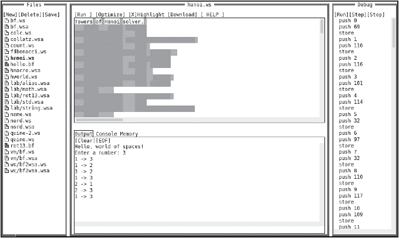

# 第十六章：进一步探索


我们已经到了最后部分，让我们以精彩的方式结束。我真诚地希望你在编程语言上的冒险继续下去。为了帮助你在这场旅程中，我提供了一些你可能想探索的 esolang 微型小插曲，一些能提升你编程语言能力的链接集合，以及简短的后记。

### **入围者**

目前有太多优秀的 esolang（极客语言）无法在一本书中一一列出，因此做出了选择。本节将展示那些未能入选的 esolang 微型小插曲。让它们激发你去探索、思考、设计和编程。

#### ***Malbolge***

一种编程语言能有多难用，但仍然是图灵完备的呢？1998 年，Malbolge 的创造者本·奥姆斯特德（Ben Olmstead）试图回答这个问题。最终的语言难度极高，以至于两年后，安德鲁·库克（Andrew Cooke）才展示了一个可以运行的“Hello, world!”示例。Malbolge 这个名字是 *Malebolge*（但丁《神曲》中的地狱第八圈）的一个（故意的？）拼写错误——这是专门为骗子和欺诈者保留的圈层。

Malbolge 在一个虚拟机上运行，使用三进制数字或 *三元数字*（trits）。Malbolge 的虚拟机采用冯·诺依曼架构，内存和代码共享同一空间，从而允许自我修改代码。

要尝试 Malbolge，请从 *[`esoteric.sange.fi/orphaned/malbolge/`](http://esoteric.sange.fi/orphaned/malbolge/)* 下载原始版本及相关文件，并将这些文件放入书籍仓库中的 *Malbolge* 目录。

构建解释器很简单。只需按如下方式编译 C 源文件：

```
> malbolge.c -o malbolge
```

在 Malbolge 中的 “Hello, world!” 示例是通过广泛的计算机搜索找到的，结果是：

```
(=<`#9]~6ZY327Uv4-QsqpMn&+Ij"'E%e{Ab~w=_:]Kw%o44Uqp0/Q?xNvL:`H%c#DD2^WV>gY;dts76qKJImZkj
```

你会在 *hello.mal* 中找到它。为了验证它的正确性，请运行以下命令：

```
> malbolge hello.mal
Hello, world.
```

虚拟机的描述可以在 *malbolge.txt* 中找到，也可以在 *[`esolangs.org/`](https://esolangs.org/)* 上的 Malbolge 页面找到另一种描述。真正敢于冒险的人可以通过阅读 *[`esolangs.org/wiki/Malbolge_programming`](https://esolangs.org/wiki/Malbolge_programming)* 上的 “Malbolge 编程” 文章来满足他们对冒险的渴望，这篇文章本身是 Lou Scheffer 最初研究的改编（请参见 *[`www.com/malbolge.shtml`](http://www.com/malbolge.shtml)*）。

很可能，Malbolge *确实*是世界上最难使用的编程语言。以地狱第八圈为名字，真是别出心裁。不过，Malbolge 真的是一种欺骗语言吗？对我来说，它是 esolang 的经典例子：它是一个特定、尖锐问题的产物。看起来 Malbolge 确实是图灵完备的，这也让它更具趣味性。

但丁的第九圈地狱是为叛徒准备的。或许可以想象 Malbolge 的继任者，即一个反映第九圈的语言，这种语言可能通过随机提供错误答案来背叛程序员的信任。

#### ***INTERCAL***

INTERCAL（“没有可发音缩写的编译语言”）由 Don Woods 和 James Lyon 于 1972 年开发。INTERCAL 原本是作为一个笑话开发的。例如，如果编译器遇到一个程序，其中 `PLEASE` 关键字使用得不够频繁，它会因为不礼貌而被拒绝。类似地，如果 `PLEASE` 使用得过于频繁，编译器会拒绝这个程序，认为它过于礼貌。INTERCAL 最有趣的部分可能是它那幽默的文档。

说到幽默，INTERCAL 是图灵完备的。为了使用它，我建议使用 Q. P. Liu 提供的 esolang 实现合集中的实现版本。安装方法如下：

```
> git clone https://github.com/qpliu/esolang.git
```

刘的实现使用 Go 语言，你可以通过如下方式安装：

```
> sudo apt-get install golang-go
```

要构建 INTERCAL，进入 INTERCAL 目录并运行 make。

```
> cd esolang/intercal
> make
```

刘的实现包括一个编译器和解释器，以及一些示例。我们将使用解释器。编译器在我尝试运行 *hello.i* 时抛出了一个错误。

要运行解释器，使用

```
> ./COMPILAC examples/hello.i
<code listing deleted>
GOOD BYTE, CRUEL WORLD!
```

给我留下深刻印象的是 INTERCAL 中的 *Adventure* 实现。*Adventure*，创建于 1970 年代中期，是第一个互动文字冒险游戏。它有时被称为 *The Colossal Cave*，并且在某些部分成为了 Infocom 的 *Zork* 系列微型计算机游戏的基础。*Adventure* 是由 Will Crowther 和 Don Woods 编写的，而 Don Woods 也是创建 INTERCAL 的人。让我们来运行它。

```
> ./COMPILAC examples/ADVENT.I
WELCOME TO ADVENTURE!!  WOULD YOU LIKE INSTRUCTIONS?
> no
YOU ARE STANDING AT THE END OF A ROAD BEFORE A SMALL BRICK BUILDING.
AROUND YOU IS A FOREST.  A SMALL STREAM FLOWS OUT OF THE BUILDING AND
DOWN A GULLY.
> go building
YOU ARE INSIDE A BUILDING, A WELL HOUSE FOR A LARGE SPRING.
THERE ARE SOME KEYS ON THE GROUND HERE.
THERE IS A SHINY BRASS LAMP NEARBY.
THERE IS FOOD HERE.
THERE IS A BOTTLE OF WATER HERE.
> take keys
OK
> take lamp
OK
> take food
OK > score
IF YOU WERE TO QUIT NOW, YOU WOULD SCORE  32 OUT OF A POSSIBLE 350.
DO YOU INDEED WISH TO QUIT NOW?
> yes
OK
YOU SCORED  32 OUT OF A POSSIBLE 350, USING    6 TURNS.
YOU ARE OBVIOUSLY A RANK AMATEUR.  BETTER LUCK NEXT TIME.
TO ACHIEVE THE NEXT HIGHER RATING, YOU NEED  4 MORE POINTS.
```

**注意**

*在第十一章中，我们讨论了 Befunge 程序 bridge.bf，其中包括了单词 xyzzy。如果你继续玩* Adventure，*你最终会发现 xyzzy 有用。*

INTERCAL 支持 16 位和 32 位整数，这些整数通过前缀和范围为 [1, 65535] 的十进制数字来标识。例如，`.123`（“点”）是一个 16 位整数，而 `:123`（“双点”）是一个 32 位整数。INTERCAL 还支持 16 位和 32 位数组，这些数组以 `,`（“尾部”）或 `;`（“混合”）作为前缀，并带有一个数字。常量以 `#`（“网格”）为前缀。

INTERCAL 有五个操作符，所有操作符都是位操作。包括两个二元操作符：“mingle”和“select”，以及三个一元逻辑操作符：AND、OR 和 XOR。

“选择”（`~`）根据第二个操作数中设置的位，从第一个操作数中选择比特，逐位从右到左构建结果。手册中的示例是 `#179~#201`，结果为 `9`。为了查看，首先将参数写成二进制：10110011[2] = 179 和 11001001[2] = 201。然后，找到 201 中的所有 1 位——位 7、6、3 和 0——并从 179 中相应的比特中构建结果，它们分别是 1、0、0 和 1，也就是 1001[2] = 9。

一元逻辑操作符很不寻常。INTERCAL 手册使用了 `#V77` 的例子来对常量值 77 应用逻辑 OR。 图 16-1 显示了该操作。


*图 16-1：INTERCAL 中的一元 OR 操作*

输入是一个 16 位整数 77，位于顶部。箭头显示了逐对的位被或运算（OR）合并在一起，从而产生标记的输出位。注意，输出的最高有效位是输入最后一位和第一位的逻辑或（OR）结果。

INTERCAL 的逻辑运算符映射到 Wolfram 的 1D 元胞自动机。1D *元胞自动机* 是一种规则，通过一次检查三个位来将输入映射到输出。对于字节来说，共有 256 种这样的规则，其中规则 30 足够混乱，可以作为一个很好的伪随机数生成器。这些规则的名称对应输出位的整数值。

INTERCAL 的 OR 运算符实现了规则 238。它可以写作：

```
111 110 101 100 011 010 001 000
 1   1   1   0   1   1   1   0  = 238
```

要找到给定输入的输出位值，请检查中心位及其两侧的两个相邻位。然后，将该位模式与规则表匹配，按指示设置输出位。输出是逐位构建的，也就是说，它不会就地修改输入。例如，如果输入位是 1，左右相邻位分别是 0 和 1，则规则 238 表示 011 → 1，意味着输出中对应的位被设置为 1。

将规则 238 表应用于图 16-1 中的输入。你会发现输出匹配。类似地，INTERCAL 的 AND 运算符（`&`）匹配规则 136，XOR 运算符（`?`）实现规则 102。

要了解更多关于 INTERCAL 的信息，或者仅仅是欣赏其幽默，可以查看完整手册 (*[`www.muppetlabs.com/~breadbox/intercal-man/`](http://www.muppetlabs.com/~breadbox/intercal-man/)*).

#### ***Whitespace***

INTERCAL 是一个笑话编程语言，但它足够强大，能够做有用的事情。Whitespace 也是另一个笑话编程语言。而且像 INTERCAL 一样，它也是图灵完备的：Whitespace 具有序列、无界堆存储、条件循环和子程序。

在 Whitespace 中，唯一有效的程序字符是空格、制表符和换行符（ASCII 10，换行符，LF）。其他所有内容都会被忽略。因此，一个有着过多空闲时间的聪明人可能会将 Whitespace 程序嵌入到另一种语言的代码中，也许是作为超级机密的间谍代码之类的东西。或者也许不是。

作为一种编程语言，Whitespace 相当典型。它有一个栈，类似于 Forth，并且有一个堆用于通用存储。输入和输出命令可以处理数字或字符，类似于 Befunge。实际上，Whitespace 唯一令人兴奋的部分是它选择的符号集。尽管如此，它仍然出现在大多数“尝试这些奇异的编程语言”列表中，所以至少值得快速浏览一下。

我在 GitHub 用户 Koturn 的 C 语言实现中做了一些实验。克隆它并按如下方式构建：

```
> git clone https://github.com/koturn/Whitespace.git
> cd Whitespace
> make
```

*t* 目录中有几个示例。使用短路径名值得称赞。例如：

```
> ./whitespace.out t/hworld.ws
Hello, world of spaces!
> ./whitespace.out t/fact.ws
Enter a number: 10 10! = 3628800
> ./whitespace.out t/hanoi.ws
Enter a number: 3
1 -> 3
1 -> 2
3 -> 2
1 -> 3
2 -> 1
2 -> 3
1 -> 3
```

Whitespace 的难点在于编写代码。你不能轻易使用普通文本编辑器，因为你需要能够输入空格并仍然看到你所输入的内容。例如，像 Befunge 一样，Whitespace 有两个输入命令和两个输出命令：

```
[tab][space]    read a character to the heap
[tab][tab]      read a number to the heap
[space][space]  output top of the stack as a character
[space][tab]    output top of the stack as a number
```

然而，查看每个命令的可视化效果是有问题的。幸运的是，Whitespaces IDE 确实存在；见 *[`vii5ard.github.io/whitespace/`](https://vii5ard.github.io/whitespace/)*。图 16-2 显示了一个典型的会话，其中 Whitespace 代码位于中间（打印时为灰色，在线为彩色），程序的文本版本位于最右侧。



*图 16-2：一个 Whitespace IDE*

这个简洁的 IDE 是 Henri Lakk 的作品。请查看主 GitHub 页面 *[`github.com/vii5ard/whitespace/`](https://github.com/vii5ard/whitespace/)*，以获取更多信息。该 IDE 包含一个用 Whitespace 编写的嵌入式 BF 解释器，简直是天才之作。

#### ***Shakespeare***

威廉·莎士比亚（1564-1616）通常被认为是最伟大的英语剧作家。为什么在一本关于编程语言的书中提到莎士比亚？莎士比亚编程语言登场，舞台右侧。莎士比亚编程语言由 Karl Wiberg 和 Jon Åslund 创造，它将看起来像莎士比亚戏剧的文本转换为可执行代码。

主要的莎士比亚页面位于*[`shakespearelang.sourceforge.net/`](http://shakespearelang.sourceforge.net/)*。在那里，下载莎士比亚的 tarball，*spl-1.2.1.tar.gz*，并安装它，忽略构建错误。

```
> tar spl-1.2.1.tar.gz
> cd spl-1.2.1
> make
```

SPL 是从莎士比亚编译到 C 的编译器。包括了几个示例，除了*fibonacci.spl*之外，所有示例都能很好地工作。要运行 SPL，请遵循以下模式：

```
> ./spl2c <examples/hello.spl >hello.c
> gcc hello.c -o hello -I. libspl.a -lm
> ./hello 
Hello World!
```

一个新的项目已经创建了一个 Python 解释器。该项目旨在简化莎士比亚代码的开发。GitHub 网站是 *[`github.com/zmbc/shakespearelang/`](https://github.com/zmbc/shakespearelang/)*，但最简单的安装方法是通过 `pip`。

```
> pip install shakespearelang
```

结果是*shakespeare*，能够运行上述 SPL 示例。

```
> shakespeare run primes.spl
> 10
2
3
5
7
```

莎士比亚将看起来像戏剧的文本

```
The Infamous Hello World Program.

Romeo, a young man with a remarkable patience. Juliet, a likewise young woman of remarkable grace.

Ophelia, a remarkable woman much in dispute with Hamlet.
Hamlet, the flatterer of Andersen Insulting A/S.

                    Act I: Hamlet's insults and flattery.
                    Scene I: The insulting of Romeo.

[Enter Hamlet and Romeo]
Hamlet:
 You lying stupid fatherless big smelly half-witted coward!
 You are as stupid as the difference between a handsome rich brave
 hero and thyself! Speak your mind!
--snip--
```

转换为 C 代码

```
--snip--
romeo = initialize_character("Romeo");
juliet = initialize_character("Juliet");
ophelia = initialize_character("Ophelia");
hamlet = initialize_character("Hamlet");

act_i:                     /* Hamlet ' s insults and flattery */
act_i_scene_i:             /* The insulting of Romeo */
enter_scene(13, hamlet);
enter_scene(13, romeo);

activate_character(30, hamlet);
assign(16, second_person, 2*2*2*2*2*2*(-1));
assign(18, second_person, int_sub(17, 2*2*2*1, value_of(18, second_person)));
char_output(18, second_person);
assign(22, second_person, int_add(20, 2*2*2*2*2*2*2*(-1), 2*2*2*2*2*1));
assign(23, second_person, int_sub(22, int_add(22, 2*2*1, 1), value_of(23, second_person)));
char_output(23, second_person);
assign(26, second_person, int_add(25, value_of(25, second_person), int_sub(26, 2*2*2*1, 1)));
char_output(26, second_person);
char_output(28, second_person);
--snip--
```

然后将其编译以构建一个独立的可执行文件。

莎士比亚的作品很有趣，阅读它很有趣，观看它更有趣：*[`www.youtube.com/watch?v=-e8oBF4IrgU`](https://www.youtube.com/watch?v=-e8oBF4IrgU)*。我想这可能是人类第一次将程序表演出来，更别提还带有如此精彩的侮辱了。

#### ***Whirl***

Whirl（以及下节中详细介绍的 Taxi）是 Sean Heber 创建的两种创新的 esolangs。我们将使用 Mateusz Chudyk 的 Python 实现来探索 Whirl。可以从 GitHub 获取它。

```
> git clone https://github.com/mateuszchudyk/whirl-interpreter.git
```

解释器开箱即用，但我推荐对 Python 源代码做两个简单的调整，使输出看起来更漂亮。根据需要，使用你喜欢的编辑器进行以下操作：

```
> cd whirl-interpreter
> vi whirl/commands.py
```

然后将第 194 行更改为：

```
print(int(program_state.get_memory_value()), end="")
```

同样，将第 214 行改为

```
print(chr(program_state.get_memory_value()), end="")
```

这些更改防止输出自动跳转到下一行。

如下所示验证 Whirl：

```
> python3 whirl-interpreter.py examples/fibonacci.whirl 
1,1,2,3,5,8,13,21
```

耶，Whirl 可用了。但它到底是什么？Whirl 只有两个指令：0 和 1。说真的，就只有这两个。Whirl 由两个环组成，每个环上有操作和功能；可以想象这些环是实际的圆形环，上面均匀地分布着操作和指令。第一个环是“操作环”，包含 12 种控制、逻辑和 I/O 操作。第二个环是“数学环”，包含 12 种数学函数。每个环还保存一个数据值。此外，还有一个通过内存指针访问的“无限”内存，就像图灵机的磁带一样。

Whirl 的两个指令是：

**0**  反转活动环的方向。如果上一个指令是 0，并且没有触发执行，则当前选中的命令在当前活动环上执行，另一个环变为活动状态。

**1**  旋转当前环，旋转方向可以是顺时针或逆时针。

表 16-1 显示了操作环的命令，顺时针运行。

**表 16-1：** Whirl 的操作环

| **指令** | **效果** |
| --- | --- |
| `Noop` | 不做任何操作 |
| `Exit` | 退出 |
| `One` | 环值 ← 1 |
| `Zero` | 环值 ← 0 |
| `Load` | 环值 ← 内存值 |
| `Store` | 环值 → 内存值 |
| `PAdd` | PC ← PC + 环值 |
| `DAdd` | MP ← MP + 环值 |
| `Logic` | 如果内存值为 0，则环值 ← 0；否则，环值 ← 环值 & 1 |
| `If` | 如果内存值不等于 0，则将环值加到 PC |
| `IntIO` | 如果环值为 0，则从 `stdin` 读取整数并赋给内存值；否则， |
|  | 将内存值作为整数打印到 `stdout` |
| `AscIO` | 如果环值为 0，则从 `stdin` 读取 ASCII 字符并赋给内存值；否则，将内存值作为 ASCII 字符打印到 `stdout` |

对于数学环，命令如下所示，同样是顺时针运行，详见 表 16-2。

**表 16-2：** Whirl 的数学环

| **指令** | **效果** |
| --- | --- |
| `Noop` | 不做任何操作 |
| `Load` | 环值 ← 内存值 |
| `Store` | 环值 → 内存值 |
| `Add` | 环值 ← 环值 + 内存值 |
| `Mult` | 环值 ← 环值 × 内存值 |
| `Div` | 环值 ← 环值 ÷ 内存值 |
| `Zero` | 环值 ← 0 |
| `<` | 如果环值 < 内存值，则环值 ← 1，否则环值 ← 0 |
| `>` | 如果环值 > 内存值，则环值 ← 1，否则环值 ← 0 |
| `=` | 如果环值 = 内存值，则环值 ← 1，否则环值 ← 0 |
| `Not` | 如果环值 ≠ 0，则环值 ← 0；否则，环值 ← 1 |
| `Neg` | 环值 ← –1 × 环值 |

当程序开始时，两个环都处于 `Noop` 位置，两个环值都为 0，且操作环处于激活状态。程序员需要跟踪程序当前的状态。无法查询环的对齐状态或哪个环是激活的。

原始的 Whirl 网站已经消失，但可以通过 Wayback Machine 访问：*[`web.archive.org/web/20130116204525/bigzaphod.org/whirl/`](http://web.archive.org/web/20130116204525/bigzaphod.org/whirl/)*。我已冒昧将该网站打印为 PDF。请参阅本书 GitHub 页面上的*Whirl.pdf*。

在 Whirl 中编程并非心脏脆弱者的工作，但 Whirl 并非 Malbolge。例如，来自原始网站的这个 Whirl 程序再次演示了 1 + 1 = 2：

```
00   run ops.noop, switch to math ring
0    math::ccw
11   rotate to math.not
00   run math.not, switch to ops ring
00   run ops.noop, switch to math ring
0    math::cw
1111 rotate to math.store
00   run math.store, switch to ops ring
00   run ops.noop, switch to math ring
1    rotate to math.add
00   run math.add, switch to ops ring
00   run ops.noop, switch to math ring
0    math::ccw
1    rotate to math.store
00   run math.store, switch to ops ring
11   rotate to ops.one
00   run ops.one, switch to math ring
00   run math.store, switch to ops ring
0    ops::ccw
1111 rotate to ops.IntIO
00   run ops.IntIO, switch to math ring
```

请注意，`00`会导致当前环上的当前命令执行，而单个`0`只会切换当前环的方向。在任何时候，`1`都会让当前环按照当前方向旋转，但不会执行命令。这些是 Whirl 编程中的关键概念。使用`1`在当前环上设置正确的命令，然后使用`00`来执行命令并自动切换到另一个环。最后，使用`0`切换当前环的旋转方向。

从原始 Whirl 页面收集的其他示例位于*examples*目录中。*whirl-interpreter*目录中也有其他示例。

Whirl 很聪明，我强烈怀疑它是图灵完备的，因为，归根结底，它是另一种命令式编程语言，尽管它在某些方面有着新颖的变化（双关语）。去吧，试试 Whirl。

#### ***出租车***

仿佛 Whirl 不够聪明一样，Sean Heber 再次出击，创造了 Taxi，一种编程语言，程序员必须在汤斯维尔中驾驶一辆载有最多三名乘客的出租车，同时保持足够的油量和购买油的资金。

和 Whirl 一样，原始的 Taxi 网站已经消失，但可以通过 Wayback Machine 访问。查看 URL，请查阅本书 GitHub 仓库中*Taxi*目录下的*README.txt*文件。Taxi 被标记为公共领域，因此我将其包含在书中。我还制作了一个归档网页的 PDF（见*Taxi.pdf*）。

图 16-3 展示了汤斯维尔（*taxi_map.png*）。


*图 16-3：汤斯维尔地图*

地图上标记的每个位置都是一个可能的目的地，每个目的地执行不同的功能。驾驶出租车需要燃料，因此程序员必须意识到出租车已经行驶了多远，并在适当的时候进行加油站停靠。当然，这假设出租车已经收取了足够的费用来支付燃料成本。乘客，无论是数字还是字符串，都按每英里 0.07 个信用单位的固定费用支付，但只有在到达目的地时才会支付。

目的地实现了语言的操作。需要加值吗？把乘客带到加法巷。想要一个随机整数？去海森堡那里，但要准备好应对他可能的犹豫。

一些目的地实现了数据结构。想要一个 FIFO 数据结构？可以访问 Joyless Park 或 Sunny Skies Park。更喜欢 LIFO？那就去 Narrow Path Park。油快用完了？最好去 Zoom Zoom，加最便宜的油。尽量避开 Fueler Up，那里油价太贵。目的地和相关操作的完整列表在 *Taxi.pdf* 中。享受这些富有创意的名字吧。

Taxi 代码冗长，几乎像纯文本，类似于 HyperCard 使用的 HyperTalk 语言，这是苹果公司早期的一个 Macintosh 编程环境。例如：

```
"Hello, World!" is waiting at the Writer's Depot.
Go to Writer's Depot: west 1st left, 2nd right, 1st left, 2nd left.
Pickup a passenger going to the Post Office.
Go to the Post Office: north 1st right, 2nd right, 1st left.
Go to the Taxi Garage: north 1st right, 1st left, 1st right.
```

这会输出，嗯，你知道它会输出什么。程序从 Taxi Garage 开始，最后在出租车返回车库时结束。第一行将一个字符串放入 Writer’s Depot，这里存放一个字符串常量。要使用这个字符串，你必须首先从 Taxi Garage 到达 Writer’s Depot。为此，你需要向西走，先左转，再右转，再左转，最后第二次左转。查看 *taxi_map.png*，你会看到这些路线确实能从 Taxi Garage 到达 Writer’s Depot。

接下来的这一行，`Pickup a passenger going to the Post Office`，获取了预定目的地的字符串。所以使用从当前位置到达邮局的路线。邮局会将乘客打印到 `stdout`（标准输出）。从邮局接乘客以获得用户的输入。要结束程序，回到 Taxi Garage。

如果你没有返回车库怎么办？程序会以一种糟糕的方式结束：`老板找不到你的出租车在车库里。你被解雇了！` 所以一定要回到车库，否则后果自负！

流程控制使用方括号括起来的标签和带有引用标签的 `Switch` 语句。例如，下面这行

```
Switch to plan "loop".
```

是一个无条件跳转到 `[loop]`，而

```
Switch to plan "end_loop" if no one is waiting.
```

是一个条件分支。

Taxi 的 C++ 源代码在 *taxi.cpp* 中。我建议注释掉第 472、1267 和 1268 行的启动和退出消息。或者也可以不注释，这完全是个人偏好。

使用 Taxi 时，首先用下面的命令构建它

```
> g++ taxi.cpp -o taxi
```

然后运行它：

```
> ./taxi examples/fib.taxi
1.000000 1.000000 2.000000 3.000000 5.000000 8.000000 13.000000 ...
```

注意，Taxi 支持浮动小数点数。一定不要错过 Nick Turner 的 RPN 计算器，位于 *rpn.taxi* 中。

Taxi 是计算语言社区无限创造力的一个优秀例子。可以想象，使用 Taxi 或基于它构建的东西来介绍编程概念。从更高层次看，Taxi 中的操作是有代价的：字面意义上。程序员习惯于操作除了内存和时间外没有固有的成本。而在 Taxi 中，操作的数量以及它们之间的相对关系，给传统的内存和时间之外引入了额外的成本。

Taxi 的开发已陷入停滞，但源代码是公开的。也许有人会接手，完善它，并以另一种形式重新推出。如果面向年轻程序员，我建议省略掉旅行费用这一部分。那新比喻如何？或许可以是飞机从城市到城市，或者是星际飞船在星系之间跳跃？

#### ***Dathanna***

1979 年的原版 Apple II+ 计算机内置了一颗 8 位 6502 微处理器，运行在一个 1 MHz 时钟的系统中，其中一半用于刷新 RAM。按现代标准，Apple II+ 的速度简直是大陆漂移的速度。然而，现代计算机能够以接近原生速度的 100 倍来模拟 Apple II+（在我的测试系统上是 84 倍）。这一事实为针对 Apple II 编写的程序打开了新的可能性，这些程序在原生系统上会太慢，但在全速运行的模拟器上却完全可用。

Dathanna，爱尔兰语中为“颜色”，就是这样的一个程序。Dathanna 是一种使用彩色块的诞生语言，这些块一个叠在另一个上面，用以指定命令。它的运作方式既像 Befunge-93，也像 Piet。然而，Dathanna 最重要的部分是其解释器是用 Applesoft BASIC 编写的，并且它在一个为 Apple II 模拟器设计的磁盘镜像上运行。

你可以在本书的 GitHub 网站上找到 Dathanna 及所有必要的文件和文档。我在这里展示的仅是一小段源代码，激起你对它的兴趣：一个用随机数估算 *π* 的程序，就像我们在本书早些时候用 ABC 做的一样。见图 16-4，它本应是彩色的。请查看文档，了解它是如何工作的。


*图 16-4：使用随机数估算 *π* 的 Dathanna 代码*

### **编程语言资源**

接下来是一个平实但有用的资源列表，帮助你增加对编程语言的了解。我尽量选择原作者提供的免费公开材料。自然，随着时间的推移，部分链接可能会失效，但互联网记得它们，无论好坏。如果某个链接不再有效，搜索标题很可能会再次找到该资源。

编程语言通常演变缓慢。如果这里的一些资源已经有十年以上的历史，那也没关系。保持最新的需求在这种情况下并不是那么关键。

以下部分将资源分为三组。第一组是关于编程语言的一般资源。这些资源类似于你在本科编程语言课程中通常会遇到的内容。第二部分涵盖数据结构，这是我们在第二章中不公平忽视的内容。第三部分与编译器和解释器相关——这些是实现编程语言的方法。

这些链接以标题和网址的形式呈现，并附有简短的评论。我审阅了所有材料，认为它们很有帮助，尽管仅通过阅读学习是有一定局限性的。在某个时刻，你必须进一步深入并实际构建一些东西。

#### ***编程语言***

这里的材料涵盖了本科水平的编程语言。当你阅读它时，回想一下我们在书中讨论的 esolangs 和其他语言，将它们与更一般的概念建立联系。

**编程语言的概念：统一方法**  由卡尔·亚伯拉罕森（Karl Abrahamson）著。书中的前五个部分介绍了编程语言的概念。书的后半部分深入探讨了函数式编程，尽管有一章讨论了我们在第八章中用来实现 FRACTRAN 的 Scheme 语言。(*[`www.cs.ecu.edu/~karl/3675/fall11/book.pdf`](http://www.cs.ecu.edu/~karl/3675/fall11/book.pdf)*)

**高级编程语言设计**  由拉斐尔·芬克尔（Raphael Finkel）著。我在 1990 年代末阅读了这本书，发现它非常有帮助。推荐。(*[`www.cs.uky.edu/~raphael/courses/CS655/Advanced_programming_language_design.pdf`](https://www.cs.uky.edu/~raphael/courses/CS655/Advanced_programming_language_design.pdf)*)

**编程语言与技术**  由史蒂夫·兹丹切维奇（Steve Zdancewic）和斯蒂芬妮·韦里奇（Stephanie Weirich）著。将这本书作为参考书，并回顾与编程语言相关的技术。然而，OCaml（一种函数式语言）的使用可能会使得技术直接迁移到其他语言时变得有些困难。(*[`www.seas.upenn.edu/~cis120/archive/20sp/notes/120notes.pdf`](https://www.seas.upenn.edu/~cis120/archive/20sp/notes/120notes.pdf)*)

**编程语言：应用与解释**  由施里拉姆·克里希纳穆尔蒂（Shriram Krishnamurthi）著。这些笔记是使用类型化 PLAI（Racket 支持的一种语言）对编程语言元素的另一种介绍。将其与上面的参考书结合使用。(*[`cs.brown.edu/courses/cs173/2012/book/book.pdf`](http://cs.brown.edu/courses/cs173/2012/book/book.pdf)*)

**编程语言的实用基础**  由罗伯特·哈珀（Robert Harper）著。这本书有近 600 页，深入探讨了编程的数学原理，比上述参考书更加理论化。(*[`thelackthereof.org/docs/library/book.pdf`](https://thelackthereof.org/docs/library/book.pdf)*)

**计算模型**  由约翰·E·萨维奇（John E. Savage）著。这不是一本关于编程语言的书，而是一本深入且高度理论化的计算探索，或者正如副标题所说，“探索计算的力量”。我们在第三章中对图灵机的讨论，作为对这本书内容的（简单）介绍。(*[`cs.brown.edu/people/jsavage/book/pdfs/ModelsOfComputation.pdf`](http://cs.brown.edu/people/jsavage/book/pdfs/ModelsOfComputation.pdf)*)

#### ***数据结构***

数据结构是编程语言用来存储和操作信息的工具。结构的形式是编程语言提供的元素的函数。实现特定数据结构的难易程度取决于所使用的语言。在 Python 中实现字典很简单，因为它是核心语言的一部分。在 Forth 中实现栈也很简单，原因相同。Pascal 和 C/C++ 都提供了对记录和结构的语法支持。然而，在 Forth 中实现相同功能，至少在简单的 Forth 系统中，要求自己设计数据结构并直接管理内存空间，通常是在字节级别上操作。

**Python 数据结构入门课程**  由 Donald R. Sheehy 编写。这是一本使用 Python 介绍数据结构的基础书籍。我建议从 第五章开始，如果不行，就从 第六章开始。 (*[`donsheehy.github.io/datastructures/fullbook.pdf`](https://donsheehy.github.io/datastructures/fullbook.pdf)*)

**数据结构与算法**  由 John Bullinaria 编写。这本参考书简洁地介绍了伪代码算法，并提供了 C 和 Java 的示例。如果上面的书籍太复杂，可以从这本书开始。 (*[`www.cs.bham.ac.uk/~jxb/DSA/dsa.pdf`](https://www.cs.bham.ac.uk/~jxb/DSA/dsa.pdf)*)

**数据结构与算法分析**  由 Clifford A. Shaffer 编写。本书涵盖了与上述书籍相同的内容，只不过使用的是 Java，并且包括了算法性能分析，并在最后一章讨论了计算的极限。 (*[`people.cs.vt.edu/shaffer/Book/Java3e20120102.pdf`](https://people.cs.vt.edu/shaffer/Book/Java3e20120102.pdf)*)

#### ***编译器与解释器***

在编程语言实现之前，它仅仅是一个心理构想。传统上，实现意味着编译器，因为当时计算机的速度通常太慢，使得解释型编程语言不过是一些奇特的存在。当然，现在情况已经不同，即便是简单的解释器在现代硬件上也非常快速，更不用说将高级语言编译成虚拟机上运行的代码的混合方式了。

在本节中，您将找到帮助您了解构建编译器或解释器过程的入门材料。当然，解释器更为直接，但构建编译器绝对值得努力，至少可以帮助您更深入地理解我们在 第二章中讨论的部分。

**打造解释器**  由 Robert Nystrom 编写。这个网站提供了一本关于打造解释器的在线书籍，值得一看。 (*[`craftinginterpreters.com`](https://craftinginterpreters.com)*)

**编程语言的实现** 由 Aarne Ranta 编写。将这本书作为入门书籍使用。它似乎是不完整的，而且鉴于 2012 年的出版日期，可能会一直保持如此。然而，前几章是完整的，并且非常有帮助。 (*[`www.cse.chalmers.se/edu/year/2012/course/DAT150/lectures/plt-book.pdf`](https://www.cse.chalmers.se/edu/year/2012/course/DAT150/lectures/plt-book.pdf)*)

**编译器设计基础** 由 Torben Ægidius Mogensen 编写。这本书介绍了编译器设计，其方式与著名的《龙书》相似，后者在第二章中有提及。处理是数学化的，所以你需要知道如何阅读集合符号，但这个层次不要求像研究生课程那样复杂。 (*[`hjemmesider.diku.dk/~torbenm/`](http://hjemmesider.diku.dk/~torbenm/)*)

**编译器简介** 由 D. Vermeir 编写。将这本书作为编译器设计主题的另一本参考书。示例代码是用 C 语言编写的。 (*[`tinf2.vub.ac.be/~dvermeir/courses/compilers/compilers.pdf`](http://tinf2.vub.ac.be/~dvermeir/courses/compilers/compilers.pdf)*)

**编译器与语言设计简介** 由 Douglas Thain 编写。这本书是**编译器设计基础**的替代性入门书籍。请看一下。 (*[`www3.nd.edu/~dthain/compilerbook/compilerbook.pdf`](https://www3.nd.edu/~dthain/compilerbook/compilerbook.pdf)*)

**使用 Flex 和 Bison 构建编译器** 由 Anthony A. Aaby 编写。Flex 和 Bison 是经典的编译器生成工具。虽然现在有更多的现代工具，但这本书包含了 Simple 语言的完整源代码。将其作为编译器设计的案例研究。 (*[`www.admb-project.org/tools/flex/compiler.pdf`](http://www.admb-project.org/tools/flex/compiler.pdf)*)

**编程语言及其编译器** 由 John Cocke 和 J. T. Schwartz 编写。这本历史性的文本，发表于 1970 年，详细介绍了当时的编译器。讨论的语言包括 FORTRAN、LISP 以及这本书非常喜欢的 SNOBOL。 (*[`www.softwarepreservation.org/projects/FORTRAN/CockeSchwartz_ProgLangCompilers.pdf`](http://www.softwarepreservation.org/projects/FORTRAN/CockeSchwartz_ProgLangCompilers.pdf)*)

### **后记**

你已经读到了本书的结尾，非常感谢。我希望你玩得开心，并学到了之前不知道的东西。也希望你对编程语言，尤其是那些奇怪、古怪、不寻常和深奥的语言感到兴奋。

我鼓励你开发自己的编程语言，即使你永远不实现它。创造一种全新的表达思维方式是非常令人满足的。我怀疑，每一种实现过的**另类语言**背后，可能有更多仅以计划、笔记或模糊概念存在的语言。如果你仅仅是把它写在纸上，并且享受这个过程，那么这个语言仅仅为了它的设计带来的乐趣，就是值得的。

然而，如果你*确实*实现了它，告诉我一声。我很乐意为它编写一些代码。

*Quando omni flunkus moritati.*
