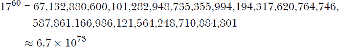
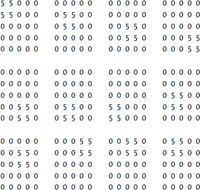
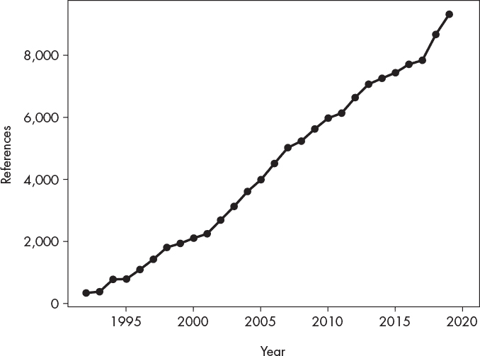

# 第十七章：使用 FIREFLY 进行遗传编程


在第十五章中，我们通过有趣的动画和音乐探索了 Firefly 语言。在本附录中，我们将结合使用 Firefly 和*遗传编程*，以进化出可以动画化的显示效果。

### **遗传编程简介**

遗传编程在 1990 年代初期广为人知。遗传编程通过模仿生物进化使用算法来创建程序。与其手动编写执行任务的代码，遗传编程通过生成并运行一组随机程序，来观察它们的表现如何。每个程序都会获得一个*适应度值*，通常称为目标函数值，用于决定哪些程序会交配以产生下一代程序。交配是通过程序对之间的*crossover*（交叉）完成的，交叉会混合“父母”程序的代码，从而生成新的“后代”程序。正如生物进化中一样，程序也有很小的概率发生随机突变。随机突变通过将新的“基因”插入到种群中来推动进化。生物进化还受到其他过程的驱动，如基因漂移，但为了简单起见，我们将依赖于表现良好的个体之间的交叉和随机突变。

### **遗传编程如何工作**

遗传编程的通用方法如下：

1.  创建一组随机生成的程序。

1.  运行种群中的每个程序，并根据其在解决目标任务中的表现赋予其适应度值。

1.  通过交配（交叉）和突变创建下一代程序。

1.  从第 2 步开始重复，直到我们得到一个能够令人满意地解决任务的程序，或者我们放弃。

对我们来说，这些程序是用于生成 LED 显示的 Firefly 代码。我们将指定我们想要的显示效果，并让遗传编程进化出一个能生成该显示效果的程序（希望如此！）。

通常，使用遗传编程有些棘手，因为生成实际运行的随机计算机代码是困难的。同样，由于语法问题，将两个程序混合生成一个新的程序也是具有挑战性的。然而，我们很幸运，因为 Firefly 非常简单。*任何*从允许的 Firefly 命令集中提取的字符字符串都是有效的 Firefly 程序，因此可以毫无错误地运行。

此外，由于我们寻求的是生成特定显示效果的代码，我们只需要考虑能操作 LED 的 Firefly 指令。因此，我们可以省略双缓冲、音乐和随机轨迹，因为它们是不可重复的。我们只需要指令来移动萤火虫并设置模式。

我们正在进行遗传编程，但我们将通过*遗传算法*（*GA*）实现进化部分。遗传算法比遗传编程更为通用，但对于我们的萤火虫代码，GA 非常适合实现遗传编程。我们不会深入讲解遗传算法代码的工作原理，而是直接使用该算法并观察它的效果。然而，GA 并不复杂，因此如果你阅读代码，会明白它在做什么。

因此，要尝试遗传编程和萤火虫，我们需要以下几个部分：

1.  一种定义我们想要创建的显示的方式。

1.  一个简化版的萤火虫解释器，仅处理移动和模式命令。

1.  GA 代码，用于演化一群萤火虫程序。

1.  一些将各部分组合在一起、运行搜索并输出结果代码的工具。

让我们一点一点地构建所需的部分。如果你现在想跳入 Python 代码，可以查看*fly_swarm.py*文件，位于*firefly/GP*目录下。注意，通过遗传编程演化的种群有时被称为*群体*，尽管群体一词通常与*群体智能*算法相关。我们会将“种群”和“群体”交替使用。

### **定义显示**

这个练习中最直接的部分是定义我们想要生成的显示。萤火虫的显示是一个 5×5 的 LED 亮度网格。因此，我们将使用一个存储在文本文件中的 5×5 数字数组来定义目标显示。例如，要指定一个位于显示屏左上角的“球”，可以创建一个包含以下内容的文本文件：

```
5 5 0 0 0
5 5 0 0 0
0 0 0 0 0
0 0 0 0 0
0 0 0 0 0
```

这会将一个中等强度（方形）的“球”放置在左上角，其他所有 LED 都关闭。文本文件存储了 5×5 数组的亮度，用于遗传编程代码作为目标。候选程序生成的显示与目标显示越相似，程序就越好。

### **一个小型萤火虫解释器**

我们需要一个只支持萤火虫移动和模式命令的小型解释器来运行我们的程序。我们将把这个解释器做成一个 Python 类，这样我们就可以轻松地实例化它。结果见清单 A-1。

```
class Firefly:
    def Move(self, c):
        if self.M == "M":
            pass
        elif self.M == "I":
            self.C[self.I] += 1
            if self.C[self.I] > 9:
                self.C[self.I] =0
        elif self.M == "D":
            if (self.C[self.I] == 0):
                self.C[self.I] = 9
            else:
                self.C[self.I] -= 1
        else:
            self.C[self.I] = int(self.M) i = self.I // 5
        j = self.I % 5

        if c == "N":
            i -= 1
            if i < 0:
                i = 4
        elif c == "S":
            i += 1
            if i > 4:
                i = 0
        elif c == "E":
            j += 1
            if j > 4:
                j = 0
        elif c == "W":
            j -= 1
            if j < 0:
                j = 4

        self.I = 5*i + j

    def Run(self):
        for c in self.prg:
            if c == "I":
                self.M = "I"
            elif c == "D":
                self.M = "D"
            elif c == "M":
                self.M = "M"
            elif c in self.DIGITS:
                self.M = c
            elif c in self.MOVES:
                self.Move(c)

    def GetDisplay(self):
        return self.C.reshape((5,5))

    def __init__(self, prg=None):
        self.prg = prg
        self.C = np.zeros(25)
        self.I = 12
        self.M = "M"
        self.DIGITS= ["0","1","2","3","4","5","6","7","8","9"]
        self.MOVES = ["N","E","W","S"]
```

*清单 A-1：一个小型萤火虫解释器*

对于种群中的每个程序，我们都会创建一个`Firefly`实例，并传入程序。然后，`Run`方法执行程序，`GetDisplay`返回生成的显示。例如，下面的代码加载`Firefly`类并运行一个程序，使其向北移动三次：

```
>>> from fly_swarm import Firefly
>>> ff = Firefly("5NNN")
>>> ff.Run()
>>> ff.GetDisplay()
array([[0., 0., 5., 0., 0.],
       [0., 0., 5., 0., 0.],
       [0., 0., 5., 0., 0.],
       [0., 0., 0., 0., 0.],
       [0., 0., 0., 0., 0.]])
```

我们将把`GetDisplay`返回的显示与我们期望的目标进行比较，以计算程序的适应度。

小型萤火虫解释器接受数字、字母`M`、`I`、`D`和基本方向作为指令。解释器运行给定的程序一次，不进行循环，并结束，保留结果显示。正如我们将看到的，我们的 GA 会运行成千上万到百万个萤火虫程序，寻找满足需求的程序。每次运行都会使用一个`Firefly`类的实例。

### **遗传算法**

`GA` 类实现了遗传算法。但在使用它之前，我们需要定义一些内容。首先，我们需要一个映射，将我们想要的 Firefly 代码与 GA 用来表示个体的数字向量之间建立关系。第二，我们需要一个类来限制搜索。第三，我们需要一个类来计算个体的适应度值。这里的适应度值就像高尔夫的得分：得分越低越好。如果得分为 0，我们就可以停止，因为我们已经找到了一个完全符合要求的程序。

我们的 Firefly 解释器支持 17 条指令。因此，我们将限制 GA 使用的向量范围为 [0,16]，以确保它们包含整数。这使我们可以将一个向量映射到一个 Firefly 程序。

列表 A-2 将 `FlyBounds` 定义为 `Bounds` 的子类。

```
class FlyBounds(Bounds):
    def __init__(self, ndim):
        lower = [0]*ndim
        upper = [len(ALLOWED)-1]*ndim
        super().__init__(lower, upper, enforce="resample")
    def Validate(self, p):
        return np.floor(p+0.5)
```

*列表 A-2：用于限制搜索的类*

`Bounds` 是 GA 使用的一个框架组件。对我们来说重要的是，子类定义了从 0 到 16（`len(ALLOWED)-1`）的允许值范围，`ndim` 是程序中的指令数量（即搜索空间的维度）。`Validate` 方法接受种群中的一个成员 `p`，并通过四舍五入将其转化为整数值。

我们需要的最后一件事是一个用来衡量程序适应度的类（见 列表 A-3）。

```
class FlyObjective:
    def __init__(self, target):
        self.target = target
        self.fcount = 0
    def Evaluate(self, p):
        self.fcount += 1
        prg = PositionToFirefly(p)
        fly = Firefly(prg)
        fly.Run()
        return ((self.target - fly.GetDisplay())**2).mean()

def PositionToFirefly(p):
    prg = ""
    for i in range(len(p)):
        prg += ALLOWED[int(p[i])]
    return prg
```

*列表 A-3：用于衡量适应度的类*

这里，`target` 是一个 5×5 的 NumPy 数组，表示我们试图通过进化代码生成的显示内容。`Evaluate` 方法接受种群中的一个成员，将其转换为实际的 Firefly 代码（通过 `PositionToFirefly`），创建一个 Firefly 解释器，然后执行代码。

最后一行计算程序的适应度。输出是一个 5×5 的数组，也就是显示内容。对于适应度，我们将使用 *均方误差*（*MSE*）。这是程序的显示与我们想要生成的显示之间的每个元素差异的平方的平均值。这个值越低，程序就越擅长生成我们想要的显示内容。当 MSE 为 0 时，程序已经精确生成了目标显示，因此当（如果）这种情况发生时，我们将停止搜索。

使用差异的平方代替差异的绝对值，可以更大程度地惩罚每个元素之间的较大差异，这正是我们想要的。我们希望将种群引导到差异较小的程序上。

`PositionToFirefly` 使用 `p` 中整数与 `ALLOWED` 中字符之间的一对一映射，返回程序字符串。

GA 依赖于交叉和随机变异。萤火虫程序表示为数字向量。为了实现两个程序*A*和*B*长度为*N*的交叉，GA 选择一个随机索引*i*，范围是[0, *N – 1]。新的后代向量是*C* = *A*[: *i*] + *B*[*i* :]，意味着*A*的前*i*个值，后接*B*的后*N – i*个值。变异则更简单。选择一个随机索引*j*，并将该索引处的值设为一个随机数，范围是[0,16]。

现在我们已经具备了使用`GA`类并搜索萤火虫程序的所有条件。让我们看看如何操作。

### **将一切整合在一起**

列表 A-4 显示了*fly_swarm.py*的`main`函数。

```
➊ target = np.loadtxt(sys.argv[1])
   npart = int(sys.argv[2])
   ndim = int(sys.argv[3])
   niter = int(sys.argv[4])

➋ b = FlyBounds(ndim)
   i = RandomInitializer(npart, ndim, bounds=b)

➌ obj = FlyObjective(target)

➍ swarm = GA(obj=obj, npart=npart, ndim=ndim, init=i, tol=1e-12, max_iter=niter,
           bounds=b)

   st = time.time()
➎ swarm.Optimize()
   en = time.time()

➏ res = swarm.Results()
   prg = PositionToFirefly(res["gpos"][-1])
   ff = Firefly(prg)
   ff.Run()
   d = ff.GetDisplay()
   x = ff.I // 5
   y = ff.I % 5

   print()
   print("Minimum MSE: %0.8f" % res["gbest"][-1])
   print()
   print("Program: %s" % prg)
   print()
   print("Target display:")
   print(np.array2string(target.astype("uint8")))
   print()
   print("Program display:")
   print(np.array2string(d.astype("uint8")))
   print()
   print("Firefly position (%d,%d)" % (x,y)) print("(%d particles, %d/%d iterations, %d best updates, %d function evals,
          %0.3f sec)" % (npart, res["iterations"], niter, len(res["gbest"]),
          obj.fcount, en-st))
   print()
```

*列表 A-4：主函数*

命令行被解析以加载目标显示、种群大小（`npart`）、每个程序的长度（`ndim`）和演化的代数（`niter`） ➊。

接下来，我们创建`FlyBounds`和`RandomInitializer`的实例，这些对象被 GA 用来随机生成程序的初始种群。

接下来是`FlyObjective`的一个实例 ➌，然后是 GA 本身 ➍。执行搜索只需要一行代码 ➎。当`Optimize`结束时，它要么找到了生成目标显示的程序，要么在运行完所有代数后放弃搜索。

搜索的结果以 Python 字典的形式返回 ➏。成功度逐渐提升的程序列表存储在`res["gpos"]`中，这意味着列表的最后一个元素是找到的最佳程序。我们将最佳位置转换为萤火虫代码，运行程序，并获取生成的显示，打印它到控制台，同时显示程序本身。我们还会打印程序结束时萤火虫的位置。我们将在下一节中使用这些信息，将显示屏组合在一起制作动画。

### **演化萤火虫程序**

我们来演化一些代码。首先，我们将动画化两个显示屏，创建一个闪烁的警告标志。接着，我们将动画化一个雷达扫描，并加入“滴滴”的声音效果。最后，我们将动画化一个弹跳的球。对于每个示例，我们将演化所需的显示屏，并使用双重缓冲将它们组合在一起以生成动画。

#### ***警告标志***

闪烁的警告标志由两个显示屏组成：

```
5 5 0 3 3       3 3 0 5 5
5 5 0 3 3       3 3 0 5 5
0 0 7 0 0  and  0 0 7 0 0
3 3 0 5 5       5 5 0 3 3 
3 3 0 5 5       5 5 0 3 3
```

这些显示屏分别存储在*flash0.txt*和*flash1.txt*中。

对于第一个显示屏，我们使用*fly_swarm.py*进行如下搜索：

```
> python3 fly_swarm.py flash0.txt 30 60 1000000
```

这意味着目标显示位于*flash0.txt*中。我们希望有一个由 30 个程序组成的种群，每个程序包含 60 条指令，并且在 1,000,000 代后停止，或者如果找到程序则提前停止。

我的运行大约花费了一个小时十五分钟才完成

```
Minimum MSE: 0.00000000

Program: 547WMSNMNI9W5NI5EI174D95S415NMN3NW1D3S3WSWES5DI3WN3NND5ESW5W

Target display:
[[5 5 0 3 3]
[5 5 0 3 3]
[0 0 7 0 0]
[3 3 0 5 5]
[3 3 0 5 5]]

Program display:
[[5 5 0 3 3]
[5 5 0 3 3]
[0 0 7 0 0]
[3 3 0 5 5]
[3 3 0 5 5]]

Firefly position (4,2)
(30 particles, 939087/1000000 iterations, GA, 49 best updates, 
 28172640 function evals, 4445.839 sec)
```

让我们来解释一下输出结果。首先，我们看到 MSE 为 0，太好了！我们找到了生成精确显示的程序。接下来是萤火虫代码。如果你使用控制台解释器运行这个程序，可以在末尾加上`H`来停止而不是循环，那么你就能得到*flash0.txt*中的目标显示。程序结束时，萤火虫位于(4,2)的位置。我们将利用这个信息把萤火虫移动回(2,2)的位置。

输出的最后一行告诉我们关于搜索本身的信息。在我们设定的 100 万代的上限中，939,087 代用于找到该程序。在此期间，测试了 28,172,640 个程序，最终对最好的程序进行了 49 次更新。没有人说过进化是迅速的！

我们现在有了第一个显示的代码。搜索第二个显示时得到的结果是

```
Minimum MSE: 0.00000000

Program: 7W20NE9I3ME5EEN33ESW556633W255NW5WI1MNW788M65NW5S9M55W3NW3SN

Target display:
[[3 3 0 5 5]
 [3 3 0 5 5]
 [0 0 7 0 0]
 [5 5 0 3 3]
 [5 5 0 3 3]] Program display:
[[3 3 0 5 5]
 [3 3 0 5 5]
 [0 0 7 0 0]
 [5 5 0 3 3]
 [5 5 0 3 3]]

Firefly position (3,3)
(30 particles, 22431/1000000 iterations, GA, 41 best updates, 672960 function
 evals, 106.111 sec)
```

同样，一个生成精确显示的程序找到了，意味着均方误差(MSE)为 0。然而，这次运行只经过了 22,431 代，且运行时间不到两分钟。有时候，进化也能非常迅速。

让我们稍微停一下，思考一下上面的结果代表了什么。我们告诉`GA`搜索一个包含 60 条指令的程序，结果显示我们想要的目标显示。可能有多少个 60 指令的小型萤火虫程序呢？解释器理解 17 条指令。因此，总共有



可能的 60 指令小型萤火虫程序，其数量之大几乎无法衡量。`GA`真的找到了生成目标显示的*唯一*60 指令程序吗？不是的。有大量的 60 指令萤火虫程序会生成相同的显示，任何一个都符合要求。到底有多少个呢？这是个好问题——我完全没有直觉来回答这个问题，也不知道该怎么计算。我猜这个数字比 1 大很多个数量级，尤其是在第二次运行时，快速找到了合适的例子。

在开发这个示例时，我注意到，显示越复杂，搜索所需的时间就越长——并且失败的概率也越高——尽管很多时候它们已经很接近，仅在几个地方的强度值相差一两点。这一结果是合理的。如果你尝试进化自己的显示（我强烈鼓励你这么做），最好将它们做得简单一些，而不是复杂，这样才能增加在合理时间内找到合适程序的机会。

现在我们继续使用花费大量 CPU 周期找到的代码。第十五章的“Dance Dance”动画展示了我们需要的代码模式来实现动画显示。我们这里有两个网格，因此我们会先在网格 A 上绘制第一个显示，然后切换到网格 A 展示，再在网格 B 上绘制第二个显示，最后进行循环。为了通过剪切和粘贴来使用显示代码，我们将利用上面报告的萤火虫位置信息，在开始绘制下一个显示之前将萤火虫移动到(2,2)。

例如，*flash0.txt*的结束位置是(4,2)。因此，我们通过`MNN`将其移回(2,2)。现在我们可以运行*flash1.txt*的代码。同样，那个代码的结束位置是(3,3)，所以我们通过`MNW`移回(2,2)。

清单 A-5 包含完整的萤火虫代码。

```
YA      ! show B, draw A
7W20NE9I3ME5EEN33ESW556633W255NW5WI1MNW788M65NW5S9M55W3NW3SN
MNW
XB      ! show A, draw B
547WMSNMNI9W5NI5EI174D95S415NMN3NW1D3S3WSWES5DI3WN3NND5ESW5W
MNN
```

*清单 A-5：动画闪光显示*

如果你用控制台解释器运行上述代码，它会以非常高的速率振荡；然而，你可以通过在`MNW`和`MNN`后加上`PPP`来减慢速度。对于 micro:bit，不需要暂停指令；请参阅 GitHub 网站上的视频。

#### ***雷达扫描***

我们接下来的例子在显示方面要简单得多。我们想做一个雷达显示，带有旋转的“扫描”和当“目标”存在时的蜂鸣。

我们需要八个显示来完成扫描：


如果你从左到右、从上到下查看这些显示，你会看到扫描完成一整圈。第四个显示中有一个目标位于(0,1)。我们将在显示动画时为目标添加一个“蜂鸣”。

显示本身位于*GP/radar*目录下，从*radar0.txt*到*radar7.txt*。要演化这些显示，请使用*search_radar* shell 脚本执行

```
> sh search_radar
```

脚本是多个*fly_swarm*运行的集合，用于演化 40 指令的萤火虫程序，生成上述八个显示。每次运行使用 30 个程序的种群，并搜索最多 500,000 代。

如果一个显示失败，意味着结果文件中报告的 MSE 不为 0，只需手动重新尝试那次。我需要运行*radar3.txt*显示两次。第一次运行没有找到包含(0,1)处目标的程序。第二次运行找到了，并且只用了 18 秒钟。

找到显示程序后，将完整代码拼接起来的过程，就是按照*flash.fly*中的动画模式操作，其中网格 B 在第一个显示*radar0.txt*绘制在网格 A 上时显示，然后网格 A 在*radar1.txt*绘制在网格 B 上时显示，以此类推，直到*radar7.txt*。

完整代码见清单 A-6。

```
YVA 5383149W7EE27MEIMEWME4IEM6W74M975W932785 MWW  PPPP
XZB 37N387IM381IMIMW7495N19W645E8M9M4M188ISW MSEE PPPP
YVA 852MM7W4699793554MNE6791594415NSI6N42961 MSS  PPPP
XZB MI57S49173ME83I613MN7MN6E18125IMN95EME5S MSE  PPPP
YVA 1TJ7TF  ! beep
744299818E488E52I4M66I7M1462I5WW7E122IE1     MWW  PPPP
XZB 7E42943MSM76S6617EM55WI36M9454I57I33M50W MNN  PPPP
YVA 527S43M2S127778795N8E45MW57923311776S277 MNN  PPPP
XZB 697SMW6W99857M662M377242MSI83W35ME2125E1 MNNE PPPP
```

*清单 A-6：雷达扫描动画*

请注意，你的代码无疑会有所不同。每次你为显示演化代码时，你会得到不同的程序，因为很可能有成千上万甚至数百万个 40 指令的萤火虫程序可以生成每一种扫描配置。不要忘记在开始下一个显示前添加代码，将萤火虫从结束位置移动回(2,2)。

在绘制并展示*radar3.txt*之后，*radar4.txt*之前会发生蜂鸣。蜂鸣与位于(2,2)的萤火虫一起播放，通过将持续时间设置为 1 并播放音符 7，即中音 C 上方的 B 音（`1TJ7TF`）。

#### ***弹跳球***

我们的最终示例展示了一个按 8 字形轨迹移动的球。屏幕非常简单：一个 2×2 的强度为 5 的 LED 方块，通过不同位置来移动一个“球”，从左上角到右下角，再到显示屏底部，沿着左下到右上的对角线向上，然后横跨顶部返回左上角，循环重复—共 12 个显示：



*GP*目录中的脚本*search_balls*执行每个显示的搜索。目标显示位于*ball*目录下，从*ball0.txt*到*ball11*.txt。在这个例子中，我们正在寻找 30 指令的程序，使用 30 个个体的种群，并最多进行 500,000 代搜索。由于显示足够简单，所有的搜索都成功，平均需要 966 代（最少 239 代，最多 2,010 代）每个显示。

列表 A-7 展示了包括每个球位置的 30 指令序列的完整代码。

```
YVA 9MNW145NM425WSWMSII12D678I97M8 MWW  ! (2,4)
XZB 2I6M5IN9I2499W5989D5E775S5WS45 MNE  ! (3,1)
YVA D83281S355NESW89794M6M92926D47 MN   ! (3,2)
XZB 57M9MEMS78I4M46MS6M95D5E5N25WS MNNW ! (4,3)
YVA MDIMS5E5S5SMW55NS749I4MD3250W9 MSSE ! (0,1)
XZB W3540SESWM735MII75N3298525ES5S MSS  ! (0,2)
YVA EWS56MW6DD4D55SIMI115WNS8279ME MENN ! (4,1)
XZB 89MDM4I972S5WEM57D5N5645WW2I4I MEE  ! (2,0)
YVA 2D764I319D9112615NEI7876SMM5NE MSWW ! (1,4)
XZB 1835MEN5ENW4S97D46NIS678DDSM68 MW   ! (2,3)
YVA 56647MN5E587795NWNMNNS5I331334 MN   ! (3,2)
XZB 78MNM4WN7E4MI85S94715W6N15S25S ME   ! (2,1)
```

*列表 A-7：动画移动的球*

注释指出了序列离开萤火虫的位置。该行的移动指令将萤火虫移回到(2,2)，以便进行下一个显示。没有包括暂停指令，以便在 micro:bit 上尽可能快速地运行。

对于控制台解释器，在每次将萤火虫移动回(2,2)后，添加`PPPP`以查看球的移动。

### **讨论**

上述示例展示了我们可以成功进化出萤火虫程序。在本节中，我们将更仔细地观察搜索活动中发生了什么，通过考虑初始种群和最终种群。它们看起来如何？接下来，我们将看看一组成功的搜索。找到的程序是否都相似？最后，虽然通常情况下我们不能知道萤火虫任务的最短程序是什么，但在简单的情况下我们可以。那么，遗传编程是否也能找到最短程序呢？

本节讨论的文件位于*GP/swarm_convergence*目录中。

#### ***种群效应***

遗传编程从一组随机生成的程序开始。随着搜索的进行，新程序会不断进化，而种群的大小保持不变。在搜索过程中，程序的多样性会发生什么变化？在这种情况下，“多样性”究竟意味着什么？

让我们看看两个搜索，一个是 10 指令的程序，另一个是 60 指令的程序。在这两种情况下，我们都试图生成*ball/ball0.txt*中找到的显示，即显示左上角的中等强度的方块。我们将使用一个 30 个程序的种群，并只考虑成功的搜索，也就是说，均方误差（MSE）为 0 的搜索。

文件*swarm_10.txt*包含找到的最佳 10 指令程序，接下来是初始种群的程序，再后面是最终种群。种群中有 30 个程序，因此*swarm_10.txt*中共有 61 行。

```
NW55NWS5E4  ! best program found
3596SW14M5  ! initial population
4N92DNW46D
1EIMIWD6M2
I7WM6I47M8
2467316I63
... 25 more lines ...
NW55NWS6E4  ! final population
NE55NWS6E4
NW55NWS6E4
NW55NWS6E4
NW55NWS6E4
... 25 more lines ...
```

从这个清单可以看出，初始种群与最终种群之间的差异相当大，且后者与找到的最佳程序非常相似。我们如何量化这种差异呢？一种方法是测量找到的最佳程序与每个初始和最终种群程序之间的距离。平均距离应该能告诉我们每个种群中程序的多样性。我们应该使用什么样的距离度量呢？我们可以将程序作为数值向量处理，并计算在 10 维空间中的向量之间的距离。这就是*欧几里得距离*。然而，使用欧几里得距离需要将程序文本转换为数字。

另一种选择是使用程序之间的编辑距离。两个字符串之间的*编辑距离*是将一个字符串转化为另一个字符串时需要更改的字母数。例如，“darwin”和“charles”之间的编辑距离是 5：我们需要五个字母将“darwin”转变为“charles”。类似地，“darwin”和“daniel”之间的编辑距离是 4，而“darwin”和“dorwin”之间的编辑距离只有 1——只需将*a*改为*o*。

我们需要`editdistance`库来计算 Python 中的编辑距离。可以通过`pip3`轻松安装：

```
> pip3 install editdistance
```

我们可以这样使用它：

```
>>> import editdistance
>>> editdistance.eval("darwin", "charles")
5
>>> editdistance.eval("darwin", "daniel")
4
>>> editdistance.eval("darwin", "dorwin")
1
```

两个字符串之间的距离越近，它们的编辑距离就越短。我们可以用它来计算*swarm_10.txt*和*swarm_60.txt*中最佳程序与初始和最终种群之间的平均编辑距离。我们需要的代码在*swarm_edit_distance.py*中。请参见清单 A-8。

```
import numpy as np
import editdistance

prg = [i[:-1] for i in open("swarm_10.txt")]
best = prg[0]
init = prg[1:31]
final= prg[31:]

i = []
for p in init:
    i.append(editdistance.eval(best, p)) i = np.array(i) / len(init[0])
f = []
for p in final:
    f.append(editdistance.eval(best, p))
f = np.array(f) / len(final[0])
print("Program length 10: %0.3f initial, %0.3f final" % (i.mean(), f.mean()))

#  Program length 60
prg = [i[:-1] for i in open("swarm_60.txt")]
best = prg[0]
init = prg[1:31]
final= prg[31:]

i = []
for p in init:
    i.append(editdistance.eval(best, p))
i = np.array(i) / len(init[0])
f = []
for p in final:
    f.append(editdistance.eval(best, p))
f = np.array(f) / len(final[0])
print("Program length 60: %0.3f initial, %0.3f final" % (i.mean(), f.mean()))
```

*清单 A-8：初始种群与最终种群之间的平均编辑距离*

该代码加载*swarm_10.txt*，计算最佳程序与每个初始程序之间的编辑距离，然后对最终种群的程序执行相同的操作，并报告两个种群的平均编辑距离。接着，它会使用*swarm_60.txt*重复这一过程。

如果我们运行清单 A-8 中的代码，我们会得到

```
Program length 10: 0.920 initial, 0.103 final
Program length 60: 0.857 initial, 0.066 final
```

请注意，我们将编辑距离除以程序长度（无论是 10 还是 60），以便在不同长度的程序之间进行有意义的比较。上述显示的数字就是程序长度的一个比例，无论程序的实际长度是多少。

初始种群的多样性明显高于最终种群。对于 10 条指令的程序，初始种群的平均差异为 92％，这意味着初始程序集与最佳程序之间的差异几乎是每条指令都有不同。然而，最终种群与最佳程序的平均差异只有 10％，也就是只有一条指令不同。种群已经崩溃，多样性消失，大多数程序与最佳程序几乎相同。对于 60 条指令的程序，崩溃效应更加显著。

上述结果考察了在单次成功搜索过程中种群发生了什么。如果我们多次运行搜索会怎样？我们每次都能找到相同的最佳程序吗？我们来试试看。

#### ***最终程序多样性***

搜索找到的最佳程序每次都相同吗？为了回答这个问题，我们再次搜索生成 *ball0.txt* 显示的程序。我们将使用 10 指令和 60 指令的程序，如上所示。

为此，我们运行 *fly_swarm.py* 10 次，将每次找到的最优程序保存在 *runs_10.txt* 或 *runs_60.txt* 中。每次运行的过程如下：

```
> python3 fly_swarm.py ball/ball0.txt 30 10 10000
```

最好的程序保存在*run_10.txt*中，每行一个。只有成功的搜索，即返回 MSE 为 0 的搜索，才会被保留。由于显示简单，大多数运行都成功。

现在我们有了 10 次搜索中最好的 10 个程序，我们将计算这些程序之间的平均编辑距离。如果每次搜索都生成相同的程序，那么平均编辑距离将是 0。平均编辑距离越高，程序的多样性越大，即使每个程序都能生成期望的显示效果。

清单 A-9 展示了 *final_program_distance.py* 的内容。

```
import numpy as np
import editdistance

prg = [i[:-1] for i in open("runs_10.txt")]
dist = []
for i in range(len(prg)):
    for j in range(len(prg)):
        if (i == j):
            continue
        dist.append(editdistance.eval(prg[i],prg[j]))
dist = np.array(dist) / len(prg[0])
print()
print("10-instructions: %0.4f +/- %0.4f" % (dist.mean(), dist.std(ddof=1)/np.sqrt(len(dist))))

prg = [i[:-1] for i in open("runs_60.txt")]
dist = []
for i in range(len(prg)):
    for j in range(len(prg)):
        if (i == j):
            continue
        dist.append(editdistance.eval(prg[i],prg[j]))
dist = np.array(dist) / len(prg[0])
print("60-instructions: %0.4f +/- %0.4f" % (dist.mean(), dist.std(ddof=1)/np.sqrt(len(dist))))
```

*清单 A-9：所找到的最佳程序对之间的平均距离*

此清单计算了 10 指令和 60 指令程序中每对最佳程序之间的编辑距离。自然地，程序与自身之间的编辑距离为 0，因此我们跳过这些情况。如上所述，编辑距离会被程序长度除以，得到一个分数，从而进行有意义的比较。

清单 A-9 生成了

```
10-instructions: 0.6467 +/- 0.0148
60-instructions: 0.8337 +/- 0.0037
```

如果你自己重新创建 *runs_10.txt* 和 *runs_60.txt*，你将得到稍微不同的结果。输出显示了平均编辑距离和 *均值标准误差*，或 *SE*。SE 是均值或平均值的不确定性度量。对于我们来说，相对于平均值的小 SE 表示这个平均值是比较准确的。

让我们来解读这些值。对于一个 10 指令的程序，我们得到的最优程序之间的平均差异大约是 65%。回想一下，每个程序都是成功的程序：每个程序都能生成期望的显示效果。所以，即使是短程序，也存在多种解决方案，不同的搜索运行会找到不同的可能解。最终找到哪个解取决于种群的大小、随机的初始种群以及交叉和变异中使用的随机因素。

正如我们可能猜测的那样，较长的程序有更多的可能解决方案。我猜这主要是由于“垃圾”代码；即那些既不有益也不有害的代码，因为其余的代码仍然能够生成期望的显示效果。我们可以看到，成功的 60 指令程序之间的平均距离约为 83%。这些程序都能解决问题，但它们之间差异很大。

让我们搜索 1,000 个 10 指令程序来生成*ball0.txt*，看看其中有多少是唯一的。我们将运行的代码在*ball_search.py*中。代码将程序转储到*ball_search_results.txt*文件中。

对输出文件进行一些处理，可以告诉我们生成了多少个唯一的 10 指令程序：

```
>>> d = [i[:-1] for i in open("ball_search_results.txt")]
>>> len(set(d))
985
```

请注意，我们将 10 指令程序的列表转换为集合，从而去除了重复项，然后再请求项目的数量。

在 1,000 次成功的运行中，寻找生成*ball0.txt*的 10 指令程序，其中 985 次（即 98.5%）是唯一的。换句话说，几乎没有重复。这强烈支持我们关于任何我们想生成的显示都有许多可能解决方案的信念。

#### ***遗传编程能找到最短的程序吗？***

我们通常不知道完成给定目标的最短程序是什么。然而，对于萤火虫显示器，至少在简单的情况下，我们是可以知道的。让我们继续处理*ball0.txt*显示器。

如果我们查看显示，知道萤火虫从位置(2,2)的移动模式开始，我们可以轻松地确信，生成此显示的最短程序包含七条指令。有多个七指令程序，但没有一个包含六条或更少指令的程序可以生成该显示。遗传编程能找到这些最短程序吗？让我们来找找看。

如下的命令行可以搜索生成*ball0.txt*显示的七指令萤火虫程序。

```
> python3 fly_swarm.py ball/ball0.txt 30 7 16000
```

如果在 16,000 代内没有找到能生成显示的程序，搜索将终止。我们将这些情况视为失败。

手动运行 10 次搜索得到了 7 次成功和 3 次失败。7 个成功的程序按字母顺序排列如下：

```
NW5NWSS
NW5NWSW
NW5WNEE
NW5WNEE
NW5WNEE
WN5WNEN
WN5WNES
```

请注意，同一个程序`NW5WNEE`出现了三次中的三次。

为了回答我们的第一个问题：是的，遗传编程可以找到生成该显示的最短程序。我们还有一个线索，可能某些程序比其他程序更可能出现。然而，10 次运行太少，无法就解决方案出现的频率做出任何确定的声明。

让我们重复上一节中的搜索，并收集 1,000 个成功的七指令程序，看看每个解决方案出现的频率（见*ball_search_7.py*）。七指令程序的可能空间小于十指令程序的空间，因此我们确实预期会有一个有限解集的分布，甚至通过 1,000 次试验我们也能完全列举出来。

*ball_search_7.py*的输出保存在*ball_search_7_results.txt*中，其中包含每次 1,000 次成功搜索中找到的最佳程序。如果我们将结果加载到 Python 中，并传递给 NumPy 的`np.unique`函数，我们将得到唯一最佳程序的列表，以及每个程序出现的次数。

```
>>> t = [i[:-1] for i in open("ball_search_7_results.txt")]
>>> prg, counts = np.unique(t, return_counts=True)
>>> prg
array(['NW5NWSE', 'NW5NWSN', 'NW5NWSS', 'NW5NWSW', 'NW5WNEE', 
       'NW5WNEN', 'NW5WNES', 'NW5WNEW', 'WN5NWSE', 'WN5NWSN', 'WN5NWSS', 'WN5NWSW', 'WN5WNEE', 'WN5WNEN', 'WN5WNES',
       'WN5WNEW'], dtype='<U7')
>>> counts
array([68, 58, 67, 62, 71, 80, 61, 54, 62, 58, 59, 61, 52, 62,
       60, 65])
```

我们看到有 16 个可能的七条指令程序能导致*ball0.txt*显示。每个程序都以`NW5`或`WN5`开始。这是有道理的，因为程序需要将四个位置设置为强度 5，而到达最近的球位置的最短方式是先向北然后向西，或者先向西然后向北。最后四条指令列举了如何移动到四个左上角的显示位置。

那么计数如何呢？结果显示了在 1,000 次搜索中每个结果的计数。我们没有强烈的理由认为任何一个可能的结果会比其他结果更有优势；因此，我们预期从长远来看，计数应该是相同的。计数虽然不同，但它们可能仍然与每个输出程序都有相等可能性的分布一致。我们如何测试这一点是否成立？

在统计学中，测试一组频率是否与每个频率相等的可能性一致的方法是使用*χ*²（卡方）检验。我们想要将观察到的频率，即计数，与另一组期望频率进行比较，期望频率是每个结果的可能性相等的集合。我们可以编写一些代码来完成这项工作，但幸运的是，SciPy 已经提供了我们所需要的工具。

```
>>> from scipy.stats import chisquare
>>> chisquare(counts)
Power_divergenceResult(statistic=10.911999999999999,
    pvalue=0.7588072298114652)
```

我们关心的`chisquare`返回值是 p 值 0.76。这个数字可以解释为计数与每个结果都有相等可能性的程度。如果 p 值较低，通常是远小于 0.05，我们可能认为结果并非都是同样可能的。在这种情况下，p 值 0.76 意味着没有理由相信任何一个结果，任何最佳的七条指令程序，比其他程序更可能通过遗传编程找到。

本节的要点是，遗传编程能够找到最小的程序，并且只要进行足够的搜索，它将找到所有可能的这样的程序。

### **最终思考**

本附录的示例展示了遗传编程在进化萤火虫程序中的实用性。虽然遗传编程如今不再广泛讨论，但随着时间的推移，它在学术出版物中的数量呈现出缓慢而稳定的增长，正如图 A-1 所示。该图展示了按年份统计的“遗传编程”在谷歌学术中的检索次数。



*图 A-1：每年“遗传编程”在谷歌学术的检索次数*

我们使用了 GA 作为遗传编程搜索的基础；然而，也有许多其他算法可以尝试替代它。GA 是一种进化算法，因为它在某种程度上模拟了进化。另一个强大的进化算法是差分进化。除了进化算法之外，还有各种各样的群体智能算法，如粒子群优化。

当配置正确时，上述遗传编程搜索可以通过将这些算法导入*fly_swarm.py*并进行替换，来取代`GA`。

```
swarm = GA(obj=obj, npart=npart, ndim=ndim, init=i, tol=1e-12,
           max_iter=niter, bounds=b)
```

使用所需的算法。例如，若要尝试差分进化，导入*DE.py*并使用

```
swarm = DE(obj=obj, npart=npart, ndim=ndim, init=i, tol=1e-12, 
           max_iter=niter, bounds=b)
```

差分进化和粒子群优化位于*GP*目录中。试试看，并告诉我结果如何。其他算法完全有效吗？如果是，它们与遗传算法相比如何？
