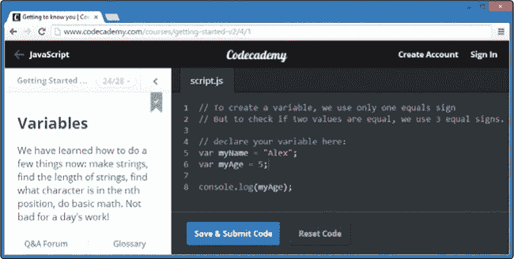
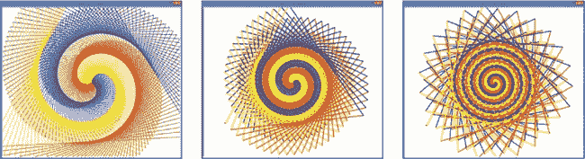

# 介绍：什么是编程，为什么它对你的孩子有益？

计算机编程或*编码*是每个孩子都应该学习的关键技能。我们使用计算机来解决问题、玩游戏、帮助我们更高效地工作、执行重复性任务、存储和回忆信息、创造新事物，并与朋友和世界连接。理解如何编码，让我们将所有这些力量掌握在自己手中。

每个人都可以学习编程；它就像解谜或者破解难题。你应用逻辑，尝试一种解决方案，再多做些实验，然后就能解决问题。现在就是开始学习编程的*最佳时机*！我们正处于一个前所未有的历史时期：以前从未有过像今天这样，数十亿人能够像现在这样每天通过计算机彼此连接。我们生活在一个充满新可能的世界里，从电动汽车、机器人护理员，到送货无人机，甚至是披萨外送。

如果你的孩子今天开始学习编程，他们可以帮助定义这个快速变化的世界。

# 为什么孩子们应该学习编程？

学习计算机编程有许多很好的理由，以下是我个人的两大理由：

+   编程很有趣。

+   编程是一项有价值的工作技能。

## 编程很有趣

技术正在成为日常生活的一部分。每家公司、慈善机构和事业都可以从技术中受益。现在有应用程序可以帮助你购物、捐赠、加入、玩耍、志愿、连接、分享——几乎任何你能想象的事情。

你的孩子们是否想为他们最喜欢的视频游戏创建自己的关卡？编码员就是这么做的！那他们是否想创建自己的手机应用程序呢？他们可以通过在计算机上编程将这个创意变为现实！他们见过的每一个程序、游戏、系统或应用，都使用了他们将在这本书中学到的相同编程构建模块。当孩子们进行编程时，他们积极参与到技术中——他们不仅仅是在*玩*，他们是在*创造*有趣的东西！

## 编程是一项有价值的工作技能

编程是 21 世纪的*核心*技能。今天的工作比以往任何时候都更加需要解决问题的能力，越来越多的职业将技术作为不可或缺的要求。

美国劳工统计局预测，在未来五年内，超过 800 万个科技岗位将被创造出来。2014-2015 年《职业展望手册》中，十个增长最快的职位中，有七个不要求硕士或博士学位的职位属于计算机科学或信息技术（IT）领域。

马克·扎克伯格在 2004 年还是一名大学生，他在宿舍里开发了 Facebook 的第一个版本。仅仅 10 年后，已有 13.9 亿人每月使用 Facebook（来源：* [`newsroom.fb.com/company-info/`](http://newsroom.fb.com/company-info/)*）。历史上从未有过任何一个创意、产品或服务能够在不到十年的时间里吸引十亿人。Facebook 展示了技术的力量，它比以往任何时候都更快地让更多人连接在一起。

# 孩子们可以在哪里学习编程？

本书仅仅是开始。如今，有比以往更多的地方可以学习编程；像 Code.org、Codecademy（参见图 1）以及无数其他网站，教授从基础到高级的编程，涵盖了各种需求量大的编程语言。一旦你和你的孩子完成了本书的学习，他们可以通过 EdX、Udacity 和 Coursera 等网站免费参加课程，进一步扩展他们的学习。

图 1. Codecademy 教你如何一步步用多种编程语言进行编程。

“编程俱乐部”是和朋友一起快乐学习的好方法。获得相关领域的大学学位仍然是为职业生涯做准备的最佳方式之一，但即使目前无法上大学，你的孩子也可以开始建立编程作品集，展示他们作为程序员和问题解决者的技能。

# 如何使用本书

本书不仅仅是为孩子们准备的——它同样适合父母、教师、学生以及那些希望了解计算机编程基础的成年人，无论是为了娱乐还是为了进入高科技行业的新工作。不论年龄多大，你都可以愉快地学习编程基础。最好的方法是通过实验和共同努力来学习。

## 探索！

学习编程是令人兴奋的，只要你愿意尝试新事物。当你和孩子们跟随本书中的程序一起学习时，尝试改变代码中的数字和文本，看看程序会发生什么。即使把它弄坏了，修复时你也能学到新东西。在最坏的情况下，你只需要重新输入书中的例子或打开最后保存的正常版本。学习编程的重点是尝试新事物，学习新技能，并以新方式解决问题。确保你的孩子们也在玩耍——通过改变某些内容、保存程序、运行它、看看发生了什么，并修复任何错误来测试他们的代码。

学习编程的重点是尝试新事物，学习一项新技能，并以一种新的方式解决问题。通过改变一些内容、保存程序、运行它、查看发生了什么，并在需要时修复错误，来测试你的代码。

举个例子，我写了一些代码做了一幅彩色图画（图 2），然后回过头，改了一些数字，再次运行程序。这给我带来了另一幅完全不同但同样惊艳的画作。我再次回去，改了其他数字，得到了又一幅美丽独特的图画。你看看，只是通过玩一玩就能做到这些吗？

图 2. 我通过在一个程序中的代码行尝试不同的数值所创建的三幅彩色螺旋图

## 一起做！

实验编程代码是学习程序如何运作的好方法，如果你和别人一起做会更加有效。无论你是在教孩子或学生，还是自己在学习，和别人一起玩代码不仅更*有趣*，而且也更*有效*。

例如，在铃木音乐教育法中，家长和孩子一起上课，甚至提前学习，以便在课程之间帮助孩子。早期开始是铃木方法的另一个特点；孩子们可以在三岁或四岁时开始正式学习。

我在我的两个儿子分别两岁和四岁时开始向他们介绍编程，我鼓励他们通过改变每个程序中的一些小部分，比如颜色、形状和形状的大小，来玩得开心。

我在 13 岁时通过输入书本中的程序示例并修改它们来让它们做一些新的事情，学习了编程。现在，在我教授的计算机科学课程中，我经常给学生一个程序，并鼓励他们动手修改代码，创造出新的东西。

如果你正在用这本书自学，你可以通过找到一个朋友一起练习示例，或者通过成立一个课后或社区编程俱乐部来与他人合作（可以参考*[`coderdojo.com/`](http://coderdojo.com/)* 或 *[`www.codecademy.com/afterschool/`](http://www.codecademy.com/afterschool/)* 获取创意和建议）。编程是一项团队运动！

## 在线资源

本书的所有程序文件都可以在*[`www.nostarch.com/teachkids/`](http://www.nostarch.com/teachkids/)*下载，此外还包括编程挑战的示例解答及其他信息。下载程序并进行实验，学习更多。如果卡住了，可以参考示例解答。赶紧去看看吧！

# 编程 = 解决问题

无论你的孩子是 2 岁在学习数数，还是 22 岁在寻找新的挑战，这本书及其介绍的概念都是通向一个有益、激励人心的兴趣爱好和更好职业机会的绝佳途径。能够编程的人——因此能够快速有效地解决问题——在今天的世界中是非常受重视的，他们可以做有趣且充实的工作。

并非所有世界上的问题都能仅靠技术解决，但技术能够在前所未有的规模和速度上促进沟通、协作、意识和行动。如果你能编程，你就能解决问题。解决问题的人有能力让世界变得更好，所以从今天开始编程吧。
