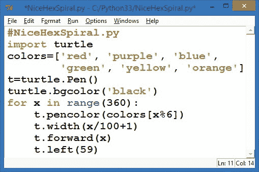
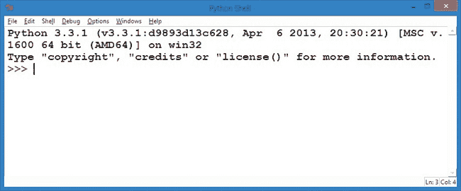
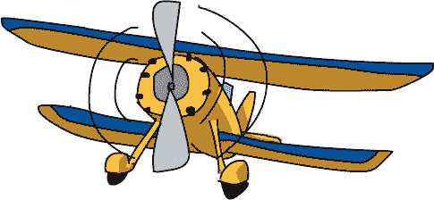
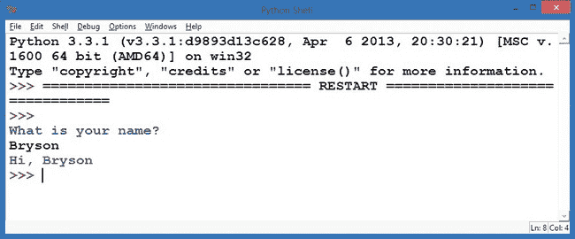

# 第一章 Python 基础：认识你的开发环境

几乎任何东西都有可能内置计算机——手机、汽车、手表、视频游戏机、健身器材、医疗设备、工业设备、贺卡或机器人。计算机编程，或者说是*编码*，就是我们告诉计算机如何执行任务的方式，理解如何编写代码能让你充分利用计算机的强大功能。

计算机程序——也称为*应用程序*，或*应用*——告诉计算机做什么。一个网页应用程序可以告诉计算机如何跟踪你喜欢的音乐；一个游戏应用程序可以告诉计算机如何显示一个史诗般的战场和逼真的图像；一个简单的应用程序可以告诉计算机如何绘制像图 1-1 中的六边形那样的美丽螺旋图。


图 1-1. 一幅色彩斑斓的螺旋图

有些应用由成千上万行代码组成，而有些应用则可能只有几行代码，比如图 1-2 中的程序*NiceHexSpiral.py*。



图 1-2. *NiceHexSpiral.py*，一段短小的 Python 程序，用于绘制图 1-1 中的螺旋

这个短小的程序绘制了图 1-1 中展示的色彩螺旋。我想要一幅漂亮的图像作为本书中的示例，所以我决定通过计算机程序来解决这个问题。首先，我草拟了一个想法，然后开始编写代码。

在本章中，我们将下载、安装并学习使用帮助我们编写代码的程序，以便构建任何你能想象的应用。

# Python 入门

要开始编写代码，我们必须学习计算机的语言。计算机需要逐步的指令，并且只能理解某些特定的语言。就像一个俄罗斯人可能听不懂英语一样，计算机只懂为它们设计的语言。计算机代码是用像 Python、C++、Ruby 或 JavaScript 这样的编程语言编写的。这些语言允许我们与计算机“对话”并向它发出命令。想想看，当你教狗狗做一些把戏时——当你给它下“坐下”的命令时，它就坐下；当你说“说话”时，它就叫。这只狗理解这些简单的命令，但你说的其他话它听不懂。


同样，计算机也有自己的局限性，但它们可以用它们的语言做你告诉它做的任何事情。我们在本书中使用的语言是 *Python*，一种简单而强大的编程语言。Python 在高中和大学的计算机科学入门课程中教授，它被用于运行一些世界上最强大的应用程序，包括 Gmail、Google Maps 和 YouTube。

为了让你开始在计算机上使用 Python，我们将一起完成这三个步骤：

1.  下载 Python。

1.  在你的计算机上安装 Python。

1.  使用一个简单的程序来测试 Python。


## 1\. 下载 Python

Python 是免费的，可以从 Python 官网轻松下载，如图 1-3 所示。


图 1-3. Python 官网让下载 Python 变得简单。

在你的网页浏览器中，访问 *[`www.python.org/`](https://www.python.org/)*。将鼠标悬停在顶部的 **Downloads** 菜单按钮上，然后点击以 **Python 3** 开头的按钮。

## 2\. 安装 Python

找到你刚下载的文件（它可能在你的 *Downloads* 文件夹中），双击它来运行并安装 Python 和 IDLE 编辑器。IDLE 是我们用来编写和运行 Python 程序的程序。有关详细的安装说明，请参见附录 A。

## 3\. 使用程序测试 Python

在你的开始菜单或 *Applications* 文件夹中，找到 IDLE 程序并运行它。你将看到一个基于文本的命令窗口，如图 1-4 所示。这就是 Python 终端。*终端*是一个窗口或屏幕，允许用户输入命令或代码行。



图 1-4. IDLE Python 终端—我们学习 Python 的指挥中心

`>>>` 被称为 *提示符*，意味着计算机已经准备好接受你的第一个命令。计算机在请求你告诉它该做什么。请输入

```
print("Hello, world!")
```

然后按键盘上的 ENTER 或 RETURN 键。你应该会看到 Python 终端通过打印你在括号中输入的文本来响应：`Hello, world!`。就这样——你已经写好了你的第一个程序！

# 用 Python 编写程序

通常你会想写一些比一行更长的程序，因此 Python 配备了一个 *编辑器* 用于编写更长的程序。在 IDLE 中，进入 *文件*菜单，选择 **File**▸**New Window** 或 **File**▸**New File**。一个空白屏幕将弹出，顶部写着 *Untitled*。

让我们编写一个稍微长一点的 Python 程序。在新的空白窗口中，输入以下三行代码：

```
# YourName.py
name = input("What is your name?\n")
print("Hi, ", name)
```

第一行叫做 *注释*。注释以井号 (`#`) 开头，是程序的备注或提醒，计算机会忽略它们。在这个例子中，注释只是一个提醒，提醒我们程序的名称。第二行要求用户输入他们的名字并将其存储为 `name`。第三行打印 `"Hi, "`，后面跟着用户的名字。注意，逗号（`,`）将引号中的文本 `"Hi, "` 与名字分开。

# 在 Python 中运行程序

进入程序上方菜单中的 **Run** 选项，选择 **Run**▸**Run Module**。这将 *运行*，或执行，你程序中的指令。它会首先要求你保存程序。我们将文件命名为 *YourName.py*。这告诉计算机将程序保存为名为 *YourName.py* 的文件，*.py* 部分表示这是一个 Python 程序。



当你保存文件并运行时，你会看到你的 Python Shell 窗口启动程序，显示问题 `What is your name?`。在下一行输入你的名字并按回车键。程序将打印 `Hi,`，后面跟上你输入的名字。由于这是你要求程序执行的唯一操作，程序会结束，你将再次看到 `>>>` 提示符，如 图 1-5 所示。



图 1-5. 计算机知道我的名字！

对于年轻的学习者，比如我三岁的儿子，他很喜欢知道程序要求他们输入自己的名字。Max 知道自己名字中的字母，所以他在键盘上输入 *m*-*a*-*x*，当我告诉他程序说 `Hi, max` 时，他很喜欢。问问你的年轻学习者是否希望程序说些不同的话。Max 说了“Hello”，所以我在第三行修改了之前的程序，改成 `Hello,` 而不是 `Hi,`。

然后我将第三行改为：

```
print("Hello, ", name, name, name, name, name)
```

Max 很喜欢程序回应他 `Hello, max max max max max`。尝试修改程序的第二行和第三行，让计算机问不同的问题并打印不同的答案。

# 你学到了什么

学习编程就像学习解决谜题、谜语或脑筋急转弯。你从一个问题开始，运用你所知道的，途中学到新的东西。当你完成时，你不仅锻炼了大脑，还解答了一个问题。希望你也玩得开心。

在这一章中，我们解决了第一个重大问题：我们在电脑上安装了 Python 编程语言，这样我们就可以开始编程了。这个过程就像下载文件、安装并运行一样简单。

在接下来的章节中，你将学习如何使用代码解决问题。你将从简单的视觉谜题开始，比如在计算机屏幕（或平板电脑或手机）上绘制图形，然后学会如何创建简单的游戏，如猜数字、石头剪子布和乒乓游戏。

通过这些初始程序，你将打下坚实的基础，之后你可以编写游戏、移动应用、网页应用等更多内容。

到目前为止，你应该...

+   拥有一个功能完备的 Python 编程环境和文本编辑器。

+   能够直接在 Python shell 中输入编程命令。

+   能够在 IDLE 中编写、保存、运行和修改短小程序。

+   准备好在第二章中尝试更高级、更有趣的程序。

编程挑战

在每一章的结尾，你可以通过尝试几个挑战来练习所学内容——并制作更酷的程序！（如果你卡住了，可以访问* [`www.nostarch.com/teachkids/`](http://www.nostarch.com/teachkids/)*查看样例答案。）

**#1: 疯狂填字游戏**

简单的*YourName.py*应用程序包含了构建一个更有趣程序所需的所有必要组件，比如老式的疯狂填字游戏（如果你以前从未尝试过，可以访问* [`www.madlibs.com/`](http://www.madlibs.com/)*）。

让我们修改程序*YourName.py*并将其保存为*MadLib.py*。我们将不再询问用户的名字，而是询问形容词、名词和过去式动词，并将它们存储在三个不同的变量中，正如我们在原程序中处理`name`一样。然后，我们将打印出类似“*adjective noun verb* over the lazy brown dog.”的句子。这里是修改后的代码应该是什么样的。

***MadLib.py***

```
adjective = input("Please enter an adjective: ")
noun = input("Please enter a noun: ")
verb = input("Please enter a verb ending in -ed: ")
print("Your MadLib:")
print("The", adjective, noun, verb, "over the lazy brown dog.")
```

你可以输入任何形容词、名词和动词。保存并运行*MadLib.py*后，你应该看到这样的内容（我输入了`smart`、`teacher`和`sneezed`）：

```
>>>
Please enter an adjective: **smart**
Please enter a noun: **teacher**
Please enter a verb ending in -ed: **sneezed**
Your MadLib:
The smart teacher sneezed over the lazy brown dog.
>>>
```

**#2: 更多的疯狂填字游戏！**

让我们让疯狂填字游戏变得更加有趣。通过将其保存为*MadLib2.py*，开始一个新的*MadLib.py*版本。添加另一行输入，询问一种动物类型。然后，修改`print`语句，去掉单词`dog`，在引号句子的末尾添加新的`animal`变量（在`print`语句内的新变量前加一个逗号）。你也可以进一步修改这个句子。你可能最终得到类似于`The funny chalkboard burped over the lazy brown gecko`的句子——或者更搞笑的内容！
