# 第二章. 海龟图形：用 Python 绘图

在这一章中，我们将编写简短、简单的程序来创建美丽而复杂的视觉效果。为此，我们将使用 *海龟图形*。在海龟图形中，你编写指令告诉一个虚拟的或想象中的海龟在屏幕上移动。海龟带着一支笔，你可以指示海龟在它走到的地方用笔画线。通过编写代码使海龟按照酷炫的模式移动，你可以让它画出惊人的图画。

使用海龟图形，你不仅可以用几行代码创建令人印象深刻的视觉效果，还可以跟随海龟观察每一行代码如何影响它的运动。这将帮助你理解代码的*逻辑*。

# 我们的第一个海龟程序

让我们用海龟图形写下我们的第一个程序。在 IDLE 中的新窗口中输入以下代码，并将其保存为 *SquareSpiral1.py*。（你也可以在*[`www.nostarch.com/teachkids/`](http://www.nostarch.com/teachkids/)*下载本书中的所有程序。）

## SquareSpiral1.py

```
# SquareSpiral1.py - Draws a square spiral
import turtle
t = turtle.Pen()
for x in range(100):
    t.forward(x)
    t.left(90)
```

当我们运行这段代码时，我们会得到一个相当不错的图像（图 2-1）。

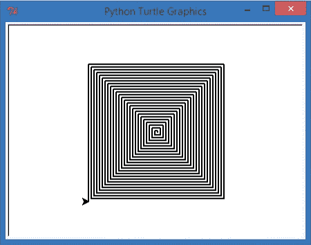

图 2-1. 一个催眠的方形螺旋，由短程序 SquareSpiral1.py 创建

## 它是如何工作的

让我们逐行分析这个程序，看看它是如何工作的。

*SquareSpiral1.py* 的第一行是注释。正如你在第一章中学到的，注释以井号（`#`）开始。注释让我们可以在程序中写下给自己或其他可能阅读程序的人的备注。计算机不会读取或尝试理解井号后的任何内容；注释只是用来写下关于程序正在做什么的说明。在这个例子中，我在注释中写了程序的名称，并简要描述了它的功能。

第二行 *导入*了绘制海龟图形的功能。导入已经编写好的代码是编程中最酷的事情之一。如果你编写了有趣且有用的东西，你可以与他人共享，甚至自己重复使用。有些酷炫的 Python 程序员开发了一个 *库*——一个可重用的代码集合——来帮助其他程序员在 Python 中使用海龟图形，尽管海龟图形最初来自 1960 年代的 Logo 编程语言。^([1]) 当你输入 `import turtle` 时，实际上是告诉程序你希望使用这些 Python 程序员编写的代码。图 2-1 中的小黑箭头代表了海龟，随着海龟在屏幕上移动，海龟用它的笔进行绘图。

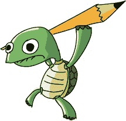

我们程序的第三行，`t = turtle.Pen()`，告诉计算机我们将使用字母 `t` 来代表海龟的笔。这将使得我们可以通过输入 `t.forward()` 来使用海龟的笔进行绘图，而无需每次都写出 `turtle.Pen().forward()`。字母 `t` 是我们告诉海龟做什么的快捷方式。

第四行是最复杂的一行。在这里我们创建了一个 *循环*，它会将一组指令重复执行若干次（它 *循环* 这些代码行，反复执行）。这个特定的循环设置了一个从 0 到 99 的 `range`（范围），也就是一个包含 100 个数字的列表。（计算机几乎总是从 0 开始计数，而不是像我们通常那样从 1 开始。）然后，循环将字母 `x` 依次遍历这些数字。因此，`x` 从 0 开始，然后变为 1，接着是 2，依此类推，直到 99，总共执行 100 步。

这个 `x` 被称为一个 *变量*。^([2])（在 第一章 的程序 *YourName.py* 中，`name` 是一个变量。）变量存储的是一个可以改变或变化的值，我们在程序执行过程中会不断改变它。几乎在我们编写的每一个程序中都会使用变量，所以早点熟悉它们是很有帮助的。

接下来的两行是缩进的，或者说是从左边空出的位置。这意味着它们是 *在循环中* 的，并且与上面那行一起执行，因此它们会在 `x` 每次得到从 0 到 99 的新数字时被重复执行，总共执行 100 次。

## 发生了什么

让我们来看一下 Python 第一次读取这组指令时会发生什么。命令 `t.forward(x)` 告诉海龟笔在屏幕上向前移动 `x` 个点。因为 `x` 为 0，所以笔根本没有移动。最后一行 `t.left(90)` 告诉海龟左转 90 度，也就是四分之一圈。

由于`for`循环的存在，程序会继续运行，并返回到我们循环的起始位置。计算机会加 1，将`x`移动到范围内的下一个值，并且由于 1 仍在 0 到 99 的范围内，循环继续进行。现在`x`为 1，所以画笔向前移动 1 个像素。然后，由于`t.left(90)`，画笔再次向左移动 90 度。这一过程会不断重复。当`x`达到 99 时，最后一次执行循环，画笔开始绘制外面长长的方形螺旋线条。


这是当`x`从 0 增长到 100 时，循环的逐步可视化过程：

```
for x in range(100):
    t.forward(x)
    t.left(90)
```

| 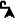 | *循环 0 到 4：绘制了前四条线（当 x = 4 时）。* |
| --- | --- |
| 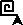 | *循环 5 到 8：又绘制了四条线；我们的方形开始出现。* |
| 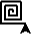 | *循环 9 到 12：我们的方形螺旋增长到 12 条线（三个方形）。* |

屏幕上的点，或者说是*像素*，可能太小了，以至于你很难看清楚它们。但是，当`x`接近 100 时，海龟绘制的线条会由越来越多的像素组成。换句话说，随着`x`的增大，`t.forward(x)`绘制的线条会越来越长。

屏幕上的海龟箭头绘制了一会儿，然后转向左边，继续绘制，转向左边，再次绘制，每次画的线都越来越长。

到最后，我们得到了一个催眠般的方形图案。向左转 90 度四次就能得到一个方形，就像围绕一栋建筑物转四圈，你就能绕一圈回到起点一样。

之所以在这个例子中会有螺旋，是因为每次转左时，我们都会走得更远。绘制的第一条线只有 1 步长（当`x` = 1 时），然后是 2 步（下一次进入循环时），接着是 3 步、4 步，以此类推，一直到 100 步，当时这条线有 99 个像素长。同样，屏幕上的像素可能太小，导致你无法轻易看到每个单独的点，但它们确实存在，而且你可以看到线条变得越来越长，包含的像素也越来越多。

通过将所有转角设为 90 度，我们得到了完美的方形。

# Turtle on a Roll

让我们看看当我们改变程序中的一个数字时会发生什么。了解程序的新方法之一就是观察当你改变程序的某一部分时会发生什么。你不总是能得到一个漂亮的结果，但即使出现问题，你也可以从中学习。

只需将程序的最后一行改为`t.left(91)`并将其保存为*SquareSpiral2.py*。

## SquareSpiral2.py

```
import turtle
t = turtle.Pen()
for x in range(100):
    t.forward(x)
    t.left(91)
```

我提到过，90 度左转可以画出完美的正方形。只转过 90 度多一点——在这个例子中，每次转动 91 度——会使正方形稍微偏离一点。因为在下次转弯时已经偏离了一点，我们的新形状在程序继续执行时会越来越不像正方形。实际上，它形成了一个漂亮的螺旋形状，开始像楼梯一样向左旋转，就像你在图 2-2 中看到的那样。

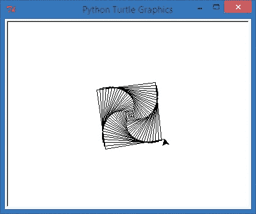

图 2-2。只需一个小小的改变，方形螺旋程序就变成了螺旋楼梯。

这也是一个很好的视觉效果，帮助你理解仅仅偏差一个数字是如何极大地改变程序结果的。一个度数看起来似乎不算什么大事，除非你偏差了一度 100 次（加起来就是 100 度），或者 1,000 次，或者你正在使用程序来着陆一架飞机……

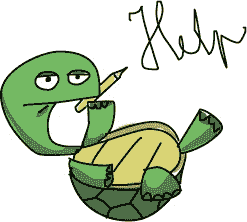

如果你还不理解度数是如何运作的，不用担心。现在只需玩一下数字，看看会发生什么。通过改变`range`后括号内的数字，可以将程序绘制的线条数量更改为 200、500 或 50。

还可以尝试将最后一行的角度改为 91、46、61 或 121 等等。记得每次都保存程序。然后运行它，看看你的更改如何影响程序绘制的内容。年长的读者可能对使用的角度看到一些熟悉的形状，甚至在程序运行之前就能预测出形状。年轻的读者可以尽情地玩玩这个，等到有一天上几何课时，这个练习可能会帮助他们。

# 海龟汇总

说到几何学，海龟图形不仅可以绘制直线，还能绘制更多有趣的形状。我们将在下一节中再次回到正方形，但现在让我们稍作偏离，探索更多 Python Turtle 库的内容。

让我们再修改一行代码：`t.forward(x)`。我们之前看到，这个命令，或者说是*函数*，将海龟的画笔向前移动`x`个像素并画出一段直线；然后海龟转身再来一次。如果我们修改这行代码，绘制一些更复杂的东西，比如一个圆呢？

幸运的是，绘制一定大小或*半径*的圆的命令和绘制直线的命令一样简单。将`t.forward(x)`改为`t.circle(x)`，如下面的代码所示。

## CircleSpiral1.py

```
import turtle
t = turtle.Pen()
for x in range(100):
    t.circle(x)
    t.left(91)
```

哇！仅仅将一个命令从` t.forward`改为` t.circle`就给我们带来了一个更复杂的形状，正如你在图 2-3 中看到的那样。`t.circle(x)`函数指示程序在当前的位置绘制一个半径为`x`的圆。请注意，这个图形与简单的方形螺旋形状有一些共同之处：这里有四组圆形螺旋，就像我们的方形螺旋有四个边一样。这是因为我们依然在使用` t.left(91)`命令，每次只向左转略多于 90 度。如果你学过几何，你会知道一个点周围有 360 度，就像方形的四个 90 度角（4 × 90 = 360）。海龟通过每次转过略多于 90 度，绘制出这个螺旋形状。

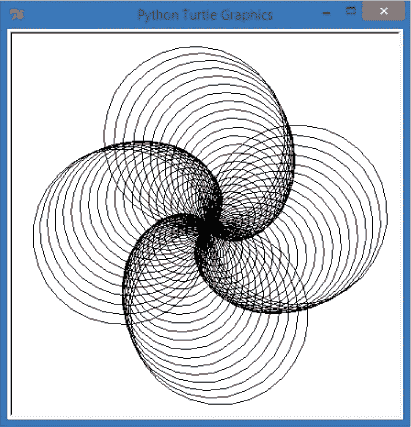

图 2-3. 再加一个变化，给我们带来了四个美丽的螺旋圆形。

你会发现一个区别：圆形螺旋比方形螺旋要大——实际上大约是方形螺旋的两倍。这是因为`t.circle(x)`将`x`作为圆的*半径*，即从圆心到圆边的距离，或者是圆的宽度的一半。

`x`的半径意味着圆的*直径*，即总宽度，将是`x`的两倍。换句话说，当`x`为 1 时，`t.circle(x)`绘制的圆的直径为 2 像素；当`x`为 2 时，直径为 4 像素；当`x`为 99 时，直径将达到 198 像素。那几乎是 200 像素，或是方形螺旋最大边长的两倍，因此圆形螺旋的大小大约是方形螺旋的两倍——也许它的酷度也是两倍！

# 增添一点色彩

这些螺旋形状很漂亮，但如果它们再多一些色彩，不是更酷吗？让我们回到方形螺旋的代码，并在` t = turtle.Pen()`行后面添加一行代码，将笔的颜色设置为红色：

## SquareSpiral3.py

```
import turtle
t = turtle.Pen()
t.pencolor("red")
for x in range(100):
    t.forward(x)
    t.left(91)
```

运行程序后，你将看到一个更有色彩的方形螺旋（图 2-4）。

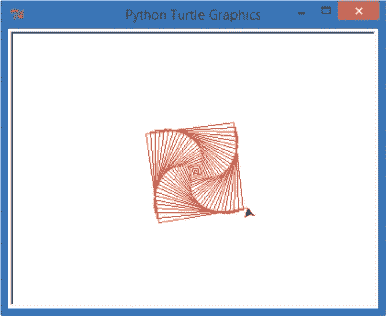

图 2-4. 方形螺旋变得更加丰富多彩。

尝试将`"red"`替换为另一个常见的颜色，如`"blue"`或`"green"`，然后重新运行程序。你可以使用 Turtle 库中的数百种不同颜色，包括一些奇怪的颜色，如`"salmon"`和`"lemon chiffon"`。（访问*[`www.tcl.tk/man/tcl8.4/TkCmd/colors.htm`](http://www.tcl.tk/man/tcl8.4/TkCmd/colors.htm)*查看完整列表。）将整个螺旋设置为不同的颜色是一个不错的步骤，但如果我们想让每一条*边*都使用不同的颜色呢？那将需要对程序做一些更改。

## 四色螺旋

让我们思考一下*算法*—也就是一系列步骤—将单色螺旋变成四色螺旋。大多数步骤与我们之前的螺旋程序相同，但有一些新增的变化：

1.  导入`turtle`模块并设置一只海龟。

1.  告诉计算机我们想使用哪些颜色。

1.  设置一个循环，在我们的螺旋图形中绘制 100 条线。

1.  为螺旋的每一条边选择不同的笔颜色。

1.  移动海龟向前绘制每一条边。

1.  将海龟转向左边，为绘制下一条边做准备。

首先，我们需要一个*颜色名称的列表*，而不是单一的颜色，因此我们将设置一个名为`colors`的列表变量，并将四种颜色放入该列表，如下所示：

```
colors = ["red", "yellow", "blue", "green"]
```

这四种颜色的列表将为我们的方形的每一条边提供一种颜色。注意，我们将颜色列表放在了方括号`[`和`]`内。确保每个颜色名称都在引号内，就像我们在第一章中打印的单词一样，因为这些颜色名称是*字符串*，或者说是文本值，我们稍后会将它们传递给`pencolor`函数。如上所述，我们使用一个叫做`colors`的变量来存储这四种颜色的列表，所以每当我们想从列表中获取颜色时，我们会用`colors`变量来代表笔的颜色。记住，变量存储的是会变化的值，正如它们的名字所示：它们是可变的！

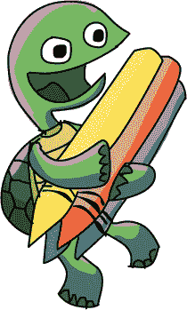

接下来我们需要做的是在每次执行绘图循环时，*每次*都更改笔的颜色。为此，我们需要将` t.pencolor()`函数移动到`for`循环下的指令组中。我们还需要告诉`pencolor`函数，我们希望使用列表中的某个颜色。

输入以下代码并运行它。

### ColorSquareSpiral.py

```
import turtle
t = turtle.Pen()
colors = ["red", "yellow", "blue", "green"]
for x in range(100):
    t.pencolor(colors[x%4])
    t.forward(x)
    t.left(91)
```

四种颜色的列表是合理的，我们可以在运行示例中看到它们（图 2-5）。到目前为止，一切顺利。

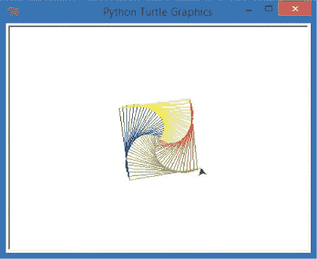

图 2-5. 我们方形螺旋程序的更彩色版本

唯一的新部分是 `pencolor` 函数中的 `(colors[x%4])`。语句中的 `x` 是我们在程序中其他地方使用的同一个变量。所以 `x` 将从 0 增长到 99，就像我们之前看到的那样。括号中的 `colors` 变量名告诉 Python 从程序中我们之前添加的颜色名称列表 `colors` 中选择一个颜色。

`[x%4]`部分告诉 Python 我们将使用 `colors` 列表中的前四个颜色，编号从 0 到 3，并且每次 `x` 改变时都会在这四个颜色中循环。在这个例子中，我们的颜色列表只有四个颜色，所以我们会一直在这四个颜色之间循环：

```
colors = ["red", "yellow", "blue", "green"]
          0        1        2       3
```

`[x%4]`中的`%`符号称为*取模*运算符，也叫做*模*运算符，它表示长除法中的*余数*（例如，5 ÷ 4 等于 1，余数为 1，因为 4 除以 5 得 1，剩下 1；6 ÷ 4 余数为 2，依此类推）。当你希望在列表中循环遍历一定数量的项时，模运算符非常有用，就像我们在操作四个颜色的列表时所做的那样。

在 100 步中，`colors[x%4]` 将循环遍历四种颜色（0、1、2、3，分别代表红色、黄色、蓝色和绿色），共计 25 次。如果你有时间（并且手边有放大镜），你可以在图 2-5 中数出 25 个红色、25 个黄色、25 个蓝色和 25 个绿色的段落。在第一次绘制循环中，Python 使用列表中的第一个颜色——红色；第二次使用黄色；依此类推。然后，在第五次循环时，Python 会回到红色，然后是黄色，依此类推，每四次循环后都会重新回到红色。

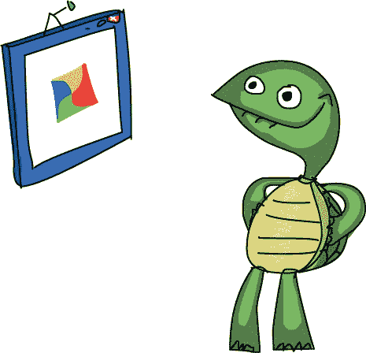

## 更改背景颜色

让我们再来点变化，看看是否能创造出比图 2-5 中更加美丽的效果。例如，正如我五岁的儿子 Alex 所指出的，黄色的边缘不容易看到。这是因为，就像在白色画纸上的黄色蜡笔一样，屏幕上的黄色像素在白色背景下不太明显。让我们通过将背景色改为黑色来解决这个问题。在程序中的 `import` 语句之后的任何位置输入以下代码行：

```
turtle.bgcolor("black")
```

增加这一行代码后，我们得到了一个更整洁的图形：所有的颜色在黑色背景下都更加鲜明。注意，我们并没有改变海龟的笔（在程序中由变量`t`表示）。相反，我们改变了海龟屏幕的一些设置，具体来说是背景颜色。`turtle.bgcolor()`命令允许我们将整个绘图屏幕的颜色更改为 Python 中任何命名的颜色。在` turtle.bgcolor("black")`这一行中，我们选择了黑色作为背景色，因此明亮的红色、黄色、蓝色和绿色显示得非常清晰。

在此过程中，我们还可以将循环中的`range()`改成`200`，甚至更多，这样就能让螺旋中的方形更大。请参见图 2-6，这张图显示了背景为黑色的 200 条线的新版本。

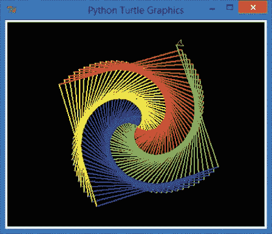

图 2-6。我们的方形螺旋图形已经经历了从简单起步到如今的巨大变化。

总是乐于帮助让我程序更加精彩的 Alex，又提出了一个改动：如果我们现在用圆形代替线段呢？那不就是最酷的图形吗？嗯，是的，我得同意——它确实更酷了。下面是完整的代码。

### ColorCircleSpiral.py

```
import turtle
t = turtle.Pen()
turtle.bgcolor("black")
colors = ["red", "yellow", "blue", "green"]
for x in range(100):
    t.pencolor(colors[x%4])
    t.circle(x)
    t.left(91)
```

你可以在图 2-7 中看到结果。

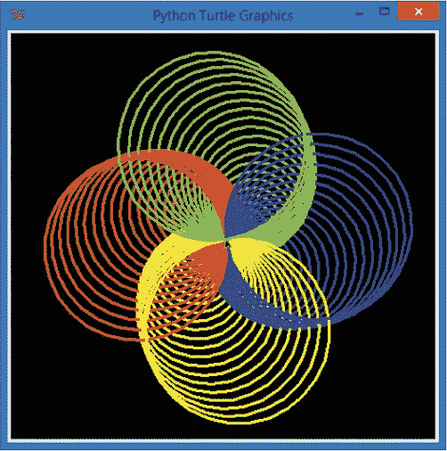

图 2-7。Alex 的酷炫彩色圆形螺旋——八行代码，简洁优雅

# 一种变量统治一切

到目前为止，我们已经用变量来改变螺旋图形的颜色、大小和转动角度。现在，我们再加一个变量，`sides`，来表示图形的边数。这个新变量会如何改变我们的螺旋图形呢？想知道答案，就试试这个程序，*ColorSpiral.py*。

## ColorSpiral.py

```
import turtle
t = turtle.Pen()
turtle.bgcolor("black")
# You can choose between 2 and 6 sides for some cool shapes!
sides = 6
colors = ["red", "yellow", "blue", "orange", "green", "purple"]
for x in range(360):
    t.pencolor(colors[x%sides])
    t.forward(x * 3/sides + x)
    t.left(360/sides + 1)
    t.width(x*sides/200)
```

你可以将`sides`的值从 6 改为 2（一个边不太有趣，除非你在程序的第六行中增加更多的颜色，否则无法使用更大的数字）。然后保存并运行程序，尽情多次尝试。图 2-8 展示了使用`sides = 6`、`sides = 5`直到`sides = 2`的图像，其中`sides = 2`是图 2-8（e）中显示的奇怪扁平螺旋形。你可以改变颜色列表中的颜色顺序，也可以在绘图循环中的任何函数中使用更大或更小的数字。如果你破坏了程序，只需返回到原始的*ColorSpiral.py*并再玩一会儿。

*ColorSpiral.py*程序使用了一个新命令，`t.width()`；这个命令改变了海龟画笔的宽度。在我们的程序中，画笔在绘制越来越大的形状时变得更宽（线条变厚）。我们将在第三章和第四章中再次讨论这个程序以及类似的程序，帮助你学习从零开始创建此类程序所需的技能。

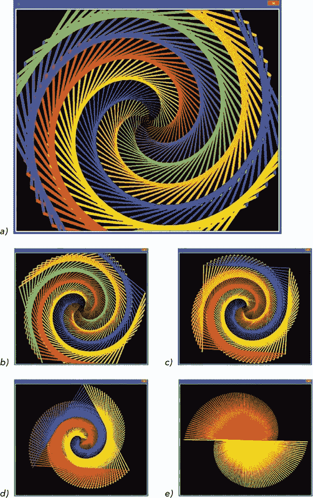

图 2-8. 通过将变量`sides`从 6（a）改变到 2（e）创建的五个彩色形状

# 你所学到的内容

在本章中，我们使用 Python 的 Turtle 工具库绘制了令人印象深刻的彩色图形。我们通过使用`import`命令将该库引入到程序中，你学会了以这种方式重复使用代码是编程中最强大的特点之一。一旦我们编写了有用的代码，或者借用了别人好心分享的代码，我们不仅节省了时间，还能利用这些导入的代码做出有趣的新事情。

你也已经在我们的程序中接触过像`x`和`sides`这样的变量。这些变量存储或记住一个数字或值，以便你可以在程序中多次使用它，并且在运行过程中修改其值。在下一章，你将进一步了解变量的强大功能，甚至 Python 还可以帮助你做数学作业！

到目前为止，你应该能够完成以下任务：

+   使用 Turtle 库绘制简单的图形。

+   使用变量来存储简单的数字值和字符串。

+   在 IDLE 中更改、保存并运行程序。

编程挑战

尝试这些挑战来练习你在本章学到的内容。（如果你卡住了，可以访问*[`www.nostarch.com/teachkids/`](http://www.nostarch.com/teachkids/)*获取示例答案。）

**#1：改变边数**

我们在《一个变量控制一切》的*ColorSpiral.py*程序中使用了变量`sides`，但是我们并没有大幅度变化它的值，除非编辑、保存并重新运行程序。试着将`sides`的值改为另一个数字，比如 5。保存并运行程序，看看这会如何影响你的绘图。现在试试 4、3、2，甚至是 1！现在，在程序第六行的颜色列表中添加两个或更多的颜色，用引号括起来，并用逗号隔开。增加`sides`的值，使用新的颜色数量——试试 8、10 或更多！

**#2: 多少条边？**

如果你希望在程序运行时让用户决定边数该怎么办？利用你在第一章学到的知识，你可以让用户输入边数，并将该输入存储在变量`sides`中。我们唯一额外的步骤是*评估*用户输入的数字。我们可以使用`eval()`函数来找出用户输入的数字，像这样：

```
sides = eval(input("Enter a number of sides between 2 and 6: "))
```

将 *ColorSpiral.py* 中的`sides = 6`行替换为上述行。你新的程序将询问用户想要显示多少条边。然后，程序将绘制用户要求的形状。试试看！

**#3: 橡皮筋球**

试着仅通过在绘图循环的末尾添加一个额外的转动，将 *ColorSpiral.py* 程序改为一个更复杂和抽象的形状。可以在`for`循环的底部添加一行像`t.left(90)`的代码，使角度更加尖锐（记得缩进，以保持语句在循环内）。如图 2-9 所示，结果看起来像一个几何玩具，或者可能是一个由彩色橡皮筋制成的球。


图 2-9. 在 *ColorSpiral.py* 中每次转动增加 90 度，会将其转变为 *RubberBandBall.py*。

将这个新版本保存为*RubberBandBall.py*，或者访问*[`www.nostarch.com/teachkids/`](http://www.nostarch.com/teachkids/)*，在第二章的源代码中找到该程序。

* * *

^([1]) Logo 编程语言于 1967 年创建，是一种教育用编程语言，五十年后，它仍然是学习编程基础的有用工具。酷吧？

^([2]) 年轻的读者可能会将*x*识别为*未知数*，就像他们在解方程*x* + 4 = 6 时找到未知数*x*一样。年长的读者可能会从代数课或其他数学课程中认识到*x*；这是早期程序员借用了变量的概念的地方。编程中有很多很好的数学知识：我们甚至会看到一些有趣的几何示例，随着课程的进行。
