# 第三章. 数字与变量：Python 做数学运算

我们已经使用 Python 做了一些非常有趣的事情，例如只用几行代码就画出了五彩斑斓的图画，但我们的程序还是有些局限。我们只是运行它们，观看它们画图。如果我们想要和我们的 Python 程序*互动*呢？在本章中，我们将学习如何让 Python 询问用户的名字，甚至提供做用户数学作业的帮助！

# 变量：我们存放东西的地方

在第一章和第二章中，我们使用了一些*变量*（你可能还记得在第一章中的`name`或在第二章中的`x`和`sides`）。现在让我们看看变量到底是什么以及它们是如何工作的。

*变量*是你希望计算机在程序运行时记住的内容。当 Python“记住”某个东西时，它会将该信息存储在计算机的内存中。Python 可以记住多种类型的*值*，包括数字值（如`7`、`42`，甚至是`98.6`）和字符串（字母、符号、单词、句子或任何你能在键盘上输入的内容，甚至更多）。在 Python 中，就像大多数现代编程语言一样，我们使用*赋值*操作符（`=`）将一个值赋给变量。像`x = 7`这样的赋值操作告诉计算机记住数字 7，并在我们每次调用`x`时将它还给我们。我们也可以使用等号将一串键盘字符赋给变量；只需要记得在字符串周围加上引号（`"`)就可以了，例如：

```
my_name = "Bryson"
```

在这里，我们将值`"Bryson"`赋给变量`my_name`。围绕`"Bryson"`的引号告诉我们它是一个字符串。

每当你将一个值赋给变量时，首先写出变量的名字，位于等号左侧，然后写出值，位于等号右侧。我们为变量取一个简单的名字，描述它的内容（比如当我存储我的名字时使用`my_name`），这样我们就能轻松记住它们并在程序中使用它们。在命名变量时，有几个规则需要牢记。


首先，我们总是以字母开始变量名。其次，变量名中的其余字符必须是字母、数字或下划线符号（`_`）；这意味着变量名中不能有空格（例如，`my name`会导致语法错误，因为 Python 认为你列出了两个变量，中间用空格分隔）。第三，Python 中的变量名是*区分大小写*的；这意味着，如果我们在变量名中使用全小写字母（如`abc`），那么只有在完全按相同的大小写方式输入变量名时，才能使用该变量存储的值。例如，要使用`abc`中的值，我们必须写成`abc`；不能使用像`ABC`这样的*大写*字母。所以，`My_Name`与`my_name`不同，而`MY_NAME`是完全不同的变量名。在本书中，我们将在变量名中使用全小写字母，并用`_`符号分隔单词。

让我们尝试一个使用变量的程序。在新的 IDLE 窗口中输入以下代码，并将其保存为*ThankYou.py*。

## ThankYou.py

```
my_name = "Bryson"
my_age = 43
your_name = input("What is your name? ")
your_age = input("How old are you? ")
print("My name is", my_name, ", and I am", my_age, "years old.")
print("Your name is", your_name, ", and you are", your_age, ".")
print("Thank you for buying my book,", your_name, "!")
```

当我们运行这个程序时，我们告诉计算机记住`my_name`是`"Bryson"`，并且`my_age`是`43`。然后我们要求用户（运行程序的人）输入他们的名字和年龄，并告诉计算机将这些作为`your_name`和`your_age`变量来记住。我们使用 Python 的`input()`函数告诉 Python 我们希望用户通过键盘输入（或*input*）某些内容。*Input*是我们称之为在程序运行时输入的信息——在这种情况下，就是用户的名字和年龄。括号内引号中的部分`("What is your name? ")`被称为*提示*，因为它提示用户，或者询问他们一个需要输入的的问题。

在最后三行中，我们告诉计算机打印出我们在`my_name`和其他三个变量中存储的值。我们甚至使用了`your_name`两次，计算机能够正确记住所有内容，包括用户输入的部分。

这个程序记住了我的名字和年龄，询问用户他们的名字和年龄，并向他们打印一个友好的信息，如图 3-1 所示。

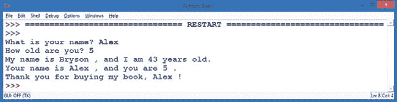

图 3-1. 一个包含四个变量及其输出的程序

# Python 中的数字和数学运算

计算机非常擅长记住值。我们可以在同一个程序中使用相同的变量数百次或数千次，只要我们编程正确，计算机总是能给我们正确的值。计算机在执行计算（加法、减法等）方面也很擅长。你的计算机每秒钟能够执行超过*十亿*（1,000,000,000，或十亿）次计算！

这比我们用脑袋算数字要快得多；虽然在某些任务上我们仍然比计算机更强，但快速的数学运算是计算机每次都能赢的比赛。Python 让你能够利用这种数学计算能力，它提供了两种主要的数字类型，并且让你使用一整套符号来进行数学运算，从 `+` 到 `-` 等等。

## Python 数字

Python 中的两种主要数字类型分别是 *整数*（包括负数的整数，例如 `7`、`-9` 或 `0`）和 *浮动点数*（有小数的数字，例如 `1.0`、`2.5`、`0.999` 或 `3.14159265`）。还有两种额外的数字类型，在本书中我们不会多用到。第一种是 *布尔值*，它表示真假值（有点像学校里“对错”测试的答案），第二种是 *复数*，它表示包含虚数的数值（如果你学过一些高级代数，可能会对它感到兴奋，但我们现在保持实际——开个玩笑）。

整数或自然数对于计数很有用（在 第二章中，我们的变量 `x` 就是用来计数我们画出的螺旋线的数量）以及进行基础的数学运算（`2 + 2 = 4`）。我们通常用整数表示我们的年龄，所以当你说自己 5 岁、16 岁或 42 岁时，你使用的就是整数。当你数到 10 时，你也在使用整数。

浮动点数或小数在我们需要表示分数时非常有用，例如 3.5 英里、1.25 个比萨饼或 25.97 美元。当然，在 Python 中，我们不包含单位（英里、比萨饼、美元），只有带小数的数字。所以如果我们想存储一个变量来表示我们的比萨饼费用（`cost_of_pizza`），我们可能会这样赋值：`cost_of_pizza = 25.97`。我们只需要记住，我们在这里使用的单位是美元、欧元或其他货币。


## Python 运算符

像 `+`（加）和 `-`（减）这样的数学符号被称为 *运算符*，因为它们对我们方程中的数字进行操作或计算。当我们大声说出“4 + 2”或在计算器中输入时，我们希望对数字 4 和 2 进行加法运算，得到它们的和 6。

Python 使用的运算符大多数与你在数学课上使用的相同，包括 `+`、`-` 和括号 `()`，如 表 3-1 所示。然而，一些运算符与学校里学到的不同，比如乘法运算符（星号 `*`，而不是 `×`）和除法运算符（正斜杠 `/`，而不是 `÷`）。我们将在本节中更好地了解这些运算符。

表 3-1. Python 中的基本数学运算符

| 数学符号 | Python 运算符 | 操作 | 示例 | 结果 |
| --- | --- | --- | --- | --- |
| + | `+` | 加法 | `4 + 2` | `6` |
| – | `-` | 减法 | `4 - 2` | `2` |
| × | `*` | 乘法 | `4 * 2` | `8` |
| ÷ | `/` | 除法 | `4 / 2` | `2.0` |
| 4² | `**` | 指数或幂 | `4 ** 2` | `16` |
| ( ) | `()` | 括号（分组） | `(4 + 2) * 3` | `18` |

## 在 Python Shell 中做数学题

现在是尝试 Python 数学的好时机；这次我们使用 Python shell。正如你可能从第一章记得的那样，Python shell 让你可以直接访问 Python 的强大功能，而无需编写整个程序。它有时被称为*命令行*，因为你可以逐行输入命令，并即时看到结果。你可以在 Python shell 的命令提示符（`>>>`符号，闪烁的光标）中直接输入一个数学问题（在编程中称为*表达式*），例如 `4 + 2`，然后按下回车键，你会看到这个表达式的*结果*，或者说是数学问题的答案。

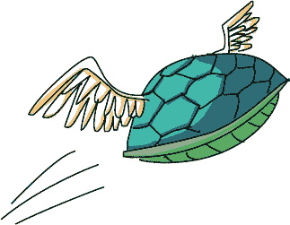

尝试输入表 3-1 中列出的一些示例，看看 Python 会怎么说；图 3-2 展示了一些示例输出。也可以尝试你自己的数学问题。

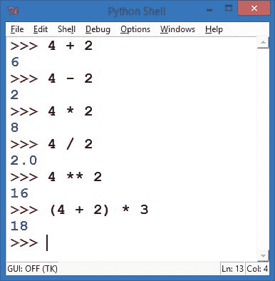

图 3-2. 从表 3-1 中输入示例数学问题（表达式），然后 Python 给出答案！

## 语法错误：你说了什么？

在 Python shell 中输入时，我们有机会学习关于*语法错误*的知识。每当 Python 或任何编程语言无法理解你输入的命令时，它可能会返回类似于“`语法错误`”的消息。这意味着你要求计算机做某件事情的*方式*出了问题，或者是你的语法不正确。

*语法*是我们在构建语言中的句子或*语句*时遵循的规则集合。当我们编程时，如果语句中有错误，我们称之为语法错误；而当我们在英语句子中犯错时，我们可能称之为语法不规范。不同之处在于，与英语使用者不同，计算机完全不能理解语法错误。像大多数编程语言一样，Python 在遵循语法规则的情况下非常擅长进行计算，但如果我们搞错了语法，它就无法理解我们说的任何内容。查看图 3-3，你可以看到一些语法错误的例子，随后是 Python 能理解的表达式。

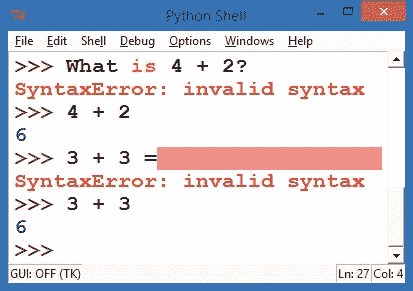

图 3-3. 学习讲述 Python 的语言

当我们用普通的英语问 Python“4 + 2 是多少？”时，Python 会回答 `"SyntaxError: invalid syntax"`，让我们知道它无法理解我们要求它做什么。当我们给 Python 正确的表达式 `4 + 2` 时，Python 每次都会正确回答：`6`。同样地，像等号这样的额外字符，在语句 `3 + 3 =` 末尾会让 Python 感到困惑，因为 Python 将等号视为赋值运算符，用于将值赋给变量。当我们输入 `3 + 3` 并按下回车键时，Python 就能理解，并且每次都会给出正确的答案：`6`。

我们可以依赖计算机每次正确且迅速地回答我们给出的合理输入，这是编程中最强大的方面之一。只要我们用计算机理解的语言正确地编程，我们就可以依赖计算机进行快速、准确的计算。这正是你在学习用 Python 编程时要做的事情。

## Python Shell 中的变量

正如我们讨论的那样，Python shell 使我们能够直接访问 Python 的编程功能，而无需编写完整的独立程序。我们甚至可以在输入 Python shell 时使用变量，如 `x` 和 `my_age`；我们只需为它们赋值，就像你在本章开头的示例中学到的那样。

如果你在命令提示符（`>>>`）下输入 `x = 5`，Python 会将值 `5` 存储在内存中作为变量 `x`，并会记住它，直到你告诉 Python 更改这个值（例如，通过输入 `x = 9` 来给 `x` 赋一个新的值 `9`）。请参见图 3-4 中的 Python shell 示例。

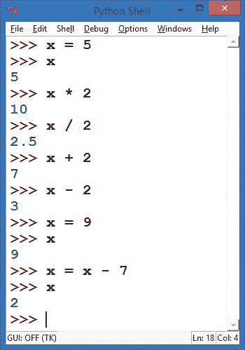

图 3-4. Python 会记住我们变量的值，只要我们希望。

注意，在最后的赋值语句中，我们在等号的*两边*都使用了 `x`：`x = x - 7`。在代数课上，这将是一个无效语句，因为 `x` 永远不可能等于 `x - 7`。但是在程序中，计算机会*先*计算等式右边的部分，先计算出 `x - 7` 的值，然后再将这个值赋给左边的 `x`。等号右边的变量会用它们的值替代；这里，`x` 的值是 `9`，所以计算机会将 `9` 代入 `x - 7`，得到 `9 - 7`，即 `2`。最后，等号左边的变量 `x` 被赋予右边计算结果的值。`x` 的值只有在赋值过程结束时才会发生变化。

在进入编程示例之前，让我们先了解一下 Python 数学的一项额外功能。在表 3-1、图 3-2 和图 3-4 中，我们使用了除法运算符——斜杠 (`/`)——并且 Python 给出了一个小数值。对于 `4 / 2`，Python 给我们的是 `2.0`，而不是我们可能期望的 `2`。这是因为 Python 使用了它所称的 *真除法*，它旨在更容易理解，并且不太容易导致错误。

当我们请求 Python 计算 `x / 2`，其中 `x` 等于 `5` 时，我们可以在图 3-4 中看到 Python 真除法的积极效果。Python 告诉我们，`5` 除以 `2` 等于 `2.5`，这是我们预期的结果。这个除法就像是将五个披萨平均分配给两个团队：每个团队得到 `2.5` 个披萨（即 `5 / 2` 的结果）。在一些编程语言中，除法运算符只返回整数（在这个例子中是 `2`）。只要记住，Python 做的是“披萨除法”。

## 使用运算符编程：一个披萨计算器

说到披萨，现在让我们假设你拥有一家披萨店。

让我们编写一个小程序来计算一个简单披萨订单的总费用，包括销售税。假设我们正在订购一个或多个价格相同的披萨，并且我们在美国乔治亚州的亚特兰大下单。这里有一个不包含在菜单价格中的销售税，会在购买结算时加上。税率为 8%，意味着每付一美元购买披萨，我们还需要额外支付 8 美分的销售税。我们可以用文字来描述这个程序如下：

1.  询问对方想要多少个披萨。

1.  请求每个披萨的菜单价格。

1.  计算披萨的总成本作为我们的小计。

1.  计算应付的销售税，按小计的 8% 计算。

1.  将销售税加到小计上，得到最终总额。

1.  向用户显示包括税费在内的总金额。

我们已经看过如何请求用户输入。为了对我们输入的数字进行计算，我们还需要一个函数：`eval()`。`eval()` 函数会 *评估* 或者说计算我们输入的内容的值。Python 中的键盘输入始终以文本字符串的形式接收，所以我们使用 `eval()` 将该输入转换为数字。如果我们在程序中输入 `"20"`，`eval("20")` 会给出数字 `20`，我们就可以在数学公式中使用它来计算新的数字，例如 20 个披萨的费用。`eval()` 函数在处理 Python 中的数字时非常强大。

现在我们已经知道如何将用户输入转化为可以进行计算的数字，我们可以将程序计划中的编号步骤转换成实际的代码。

### 注意

*对于每个编程示例，你可以先尝试自己编写程序，然后再查看书中的代码。首先编写注释（`#`），概述解决问题所需的步骤。然后在每个注释下填写编程步骤，当你需要提示时，查看书中的代码。*

在新窗口中输入此内容并将其保存为*AtlantaPizza.py*。

### AtlantaPizza.py

```
# AtlantaPizza.py - a simple pizza cost calculator

# Ask the person how many pizzas they want, get the number with eval()
number_of_pizzas = eval(input("How many pizzas do you want? "))

# Ask for the menu cost of each pizza
cost_per_pizza = eval(input("How much does each pizza cost? "))

# Calculate the total cost of the pizzas as our subtotal
subtotal = number_of_pizzas * cost_per_pizza

# Calculate the sales tax owed, at 8% of the subtotal
tax_rate = 0.08 # Store 8% as the decimal value 0.08
sales_tax = subtotal * tax_rate

# Add the sales tax to the subtotal for the final total
total = subtotal + sales_tax

# Show the user the total amount due, including tax
print("The total cost is $",total)
print("This includes $", subtotal, "for the pizza and")
print("$", sales_tax, "in sales tax.")
```

这个程序将你所学的变量和运算符知识结合成一个强大的程序。通读它，确保你理解每一部分是如何工作的。你会如何修改程序，使其适用于不同的销售税率？

请注意，我们已经将程序的步骤作为注释包含在内，使用了`#`（井号）。记住，注释是供人类阅读的；IDLE 编辑器将注释标红，以提醒我们 Python 会忽略这些部分。在构建更长且更复杂的程序时，先用文字一步步列出程序的步骤，再将这些步骤作为注释加入程序，能非常有帮助。这就是我们的算法，程序中需要遵循的步骤集合。算法就像食谱：如果我们按正确的顺序执行所有步骤，程序就会顺利完成！

当我们用文字（如`#`注释）*和*代码（如编程语句）来编写算法时，我们达成了两个目标。首先，我们通过确保不遗漏步骤来减少程序中的错误。其次，我们让程序变得更加易于我们自己以及他人以后阅读和理解。从一开始，你就应该养成在程序中写清晰注释的习惯，我们将在本书中经常这样做。如果你不想输入所有的注释，程序仍然会运行；它们只是帮助你理解程序在做什么。


当你编写完程序后，可以通过点击**运行**▸**运行模块**来运行并与其互动。图 3-5 展示了一些示例输出。

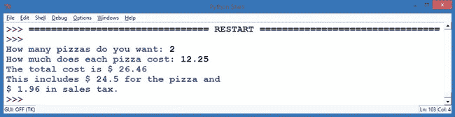

图 3-5。我们的*AtlantaPizza.py*比萨计算器程序的示例运行

# 字符串：Python 中的真实字符

我们已经看到 Python 在处理数字方面非常出色，但是当我们想与人交流时怎么办呢？人们更擅长理解单词和句子，而不仅仅是数字。为了编写人们可以使用的程序，我们需要另一种类型的变量，叫做*字符串*。字符串是我们在编程语言中所说的*文本*，或者说是键盘字符；它们是字母、数字和符号的组合（或“字符串”）。你的名字就是一个字符串，你最喜欢的颜色也是—甚至这段话（或这本书）也是由字母、空格、数字和符号混合组成的长字符串。

字符串和数字之间的一个区别是我们不能用字符串做计算；它们通常是名字、单词或其他不能用于计算器的资料。使用字符串的常见方式是打印。例如，我们在本章开始时让用户输入他们的名字，以便稍后打印出来。

让我们用一个新的程序再做一次。我们会让用户输入他们的名字，将名字存储在一个名为`name`的变量中，然后在屏幕上打印他们的名字 100 次。就像在第一章和第二章中的酷炫螺旋画例子一样，我们使用了一个*循环*来重复打印用户的名字 100 次。将以下代码输入到新的 IDLE 窗口中，并将其保存为*SayMyName.py*。

## SayMyName.py

```
# SayMyName.py - prints a screen full of the user's name

# Ask the user for their name
name = input("What is your name? ")

# Print their name 100 times
for x in range(100):
    # Print their name followed by a space, not a new line
    print(name, end = " ")
```

这个程序最后一行中的`print()`语句有一个新内容：它包含了一个*关键字参数*。在这种情况下，*关键字*是`end`，我们告诉程序将每个`print()`语句的结尾设置为空格（引号之间有一个空格：`" "`），而不是常规的行末字符。Python 中的`print()`语句通常以换行符结尾，就像按下键盘上的 ENTER 键一样，但通过这个关键字参数，我们告诉 Python 不希望每次打印名字时都换行。

为了更清楚地看到这一变化，将程序最后一行修改为以下内容，然后运行程序：

```
print(name, end = " rules! ")
```

如果你运行这个，你将看到`"`*`Your Name`* `rules!"`打印 100 次！关键字参数`end = " rules! "`让我们可以改变`print()`语句的工作方式。每个`print()`语句的结束现在是`" rules! "`，而不是默认的回车或换行符。


在编程语言中，*参数*并不是什么坏事；它只是我们告诉函数（如`print()`）做某事的方式。我们通过将额外的值放入该函数的括号中来实现这一点。`print()`语句括号中的那些值就是参数，特殊的关键字参数意味着我们正在使用关键字`end`来改变`print()`打印每一行时的结尾方式。当我们将行的结尾从换行符更改为简单的空格符时，单词会被添加到当前行的末尾，而不会*换行*，直到当前行填满并换到下一行。请查看图 3-6 中的结果。

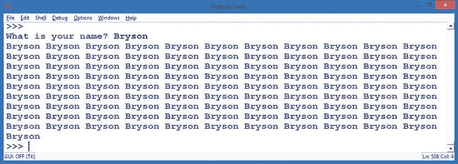

图 3-6. 当我运行*SayMyName.py*时，Python 会在屏幕上打印满我的名字。

# 使用字符串改进我们的彩色螺旋

字符串如此受欢迎，以至于即使是 Python 中的海龟图形也有函数来接受字符串作为输入并将其写入屏幕。海龟库中用于请求用户输入字符串或文本的函数是`turtle.textinput()`；它会弹出一个窗口，要求用户输入文本，并允许我们将其作为字符串值存储。图 3-7 展示了我们使用`turtle.textinput("Enter your name", "What is your name?")`时，海龟为我们弹出的漂亮图形窗口。海龟的`textinput()`函数有两个参数。第一个参数`"Enter your name"`是弹出窗口的标题。第二个参数`"What is your name?"`是提示用户输入我们想要的信息。

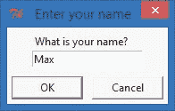

图 3-7. 海龟图形中的文本输入窗口

在海龟屏幕上写字符串的函数是`write()`；它会以海龟的笔颜色和当前位置在屏幕上绘制文本。我们可以使用`write()`和`turtle.textinput()`结合字符串的力量与丰富多彩的海龟图形。让我们试试！在下面的程序中，我们将像之前的螺旋图一样设置海龟图形，但不是在屏幕上绘制线条或圆圈，而是请求用户输入他们的名字，然后以彩色螺旋的形式将其绘制到屏幕上。将其输入到新窗口并保存为*SpiralMyName.py*。

## SpiralMyName.py

```
   # SpiralMyName.py - prints a colorful spiral of the user's name

   import turtle               # Set up turtle graphics
   t = turtle.Pen()
   turtle.bgcolor("black")
   colors = ["red", "yellow", "blue", "green"]

   # Ask the user's name using turtle's textinput pop-up window
➊ your_name = turtle.textinput("Enter your name", "What is your name?")

   # Draw a spiral of the name on the screen, written 100 times
   for x in range(100):
       t.pencolor(colors[x%4]) # Rotate through the four colors
➋     t.penup()               # Don't draw the regular spiral lines
➌     t.forward(x*4)          # Just move the turtle on the screen
➍     t.pendown()             # Write the user's name, bigger each time
➎     t.write(your_name, font = ("Arial", int( (x + 4) / 4), "bold") )
       t.left(92)              # Turn left, just as in our other spirals
```

*SpiralMyName.py*中的大部分代码与我们之前的彩色螺旋非常相似，但我们在➊处通过`turtle.textinput`弹出窗口询问用户的姓名，并将用户的回答存储在`your_name`中。我们还通过在➋处将海龟的画笔抬离屏幕来改变绘制循环，这样当我们在➌处移动海龟时，它不会留下痕迹或绘制正常的螺旋线。我们只想要在螺旋中显示用户的名字，所以在➌处海龟移动后，我们通过在➍处使用`t.pendown()`来告诉它重新开始绘制。然后，通过➎处的`write`命令，我们告诉海龟在每次循环时在屏幕上写下`your_name`。最终结果是一个漂亮的螺旋图案；我的儿子 Max 运行了图示中的一个，见图 3-8。

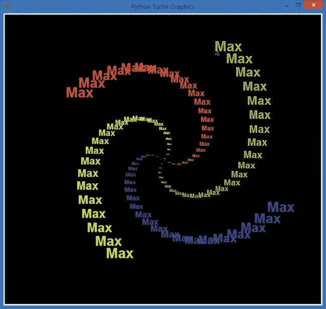

图 3-8. 一条彩色文本螺旋

# 列表：将一切集中在一起

除了字符串和数字值，变量还可以包含列表。*列表*是一组用逗号分隔的值，这些值被方括号`[]`包围。我们可以在列表中存储任何类型的值，包括数字和字符串；甚至可以拥有列表的列表。

在我们的螺旋程序中，我们将一个字符串列表—`["red", "yellow", "blue", "green"]`—存储在`colors`变量中。然后，当我们的程序需要使用颜色时，我们只需调用`t.pencolor()`函数，并告诉它使用`colors`列表来查找它应该使用的颜色名称。让我们将更多颜色名称添加到我们的颜色列表中，并学习 Turtle 包中的另一个输入函数：`numinput()`。

在红色、黄色、蓝色和绿色的基础上，我们再添加四种命名颜色：橙色、紫色、白色和灰色。接下来，我们希望询问用户他们的形状应该有多少条边。就像` turtle.textinput()`函数询问用户字符串一样，`turtle.numinput()`允许用户输入一个数字。

我们将使用这个`numinput()`函数来询问用户输入边的数量（在 1 到 8 之间），并为用户提供一个*默认*选择`4`，这意味着如果用户没有输入数字，程序将自动使用`4`作为边的数量。将以下代码输入到一个新的窗口中，并将其保存为*ColorSpiralInput.py*。

## ColorSpiralInput.py

```
  import turtle                      # Set up turtle graphics
  t = turtle.Pen()
  turtle.bgcolor("black")
  # Set up a list of any 8 valid Python
  color names colors = ["red", "yellow", "blue", "green", "orange", "purple", "white", "gray"]
  # Ask the user for the number of sides, between 1 and 8, with a default of 4
  sides = int(turtle.numinput("Number of sides",
                              "How many sides do you want (1-8)?", 4, 1, 8))
  # Draw a colorful spiral with the user-specified number of sides
  for x in range(360):
➊    t.pencolor(colors[x % sides])  # Only use the right number of colors
➋    t.forward(x * 3 / sides + x)   # Change the size to match number of sides
➌    t.left(360 / sides + 1)        # Turn 360 degrees / number of sides, plus 1
➍    t.width(x * sides / 200)       # Make the pen larger as it goes outward
```

该程序每次绘制新的一条边时都会使用用户输入的边的数量进行一些计算。让我们看看`for`循环内的四行带编号的代码。

在➊处，程序改变了海龟的画笔颜色，使颜色的数量与边的数量相匹配（三角形使用三种颜色，四边形使用四种颜色，依此类推）。在➋处，我们根据边的数量来改变每条线的长度（这样三角形在屏幕上就不会比八边形小得太多）。

在 ➌ 处，我们通过正确的角度转动海龟。为了得到这个角度，我们将 360 除以边数，这样可以得到*外角*，也就是我们需要转动的角度，才能绘制一个具有该边数的规则图形。例如，圆形的角度是 360 度，只有一个“边”；正方形由四个 90 度的角组成（总共也是 360 度）；要绕六边形转动六个 60 度的角（同样总共是 360 度）；依此类推。

最后，在 ➍ 处，我们随着距离屏幕中心的增大，增加笔的宽度或厚度。图 3-9 显示了输入八边形和三边形后的绘图结果。

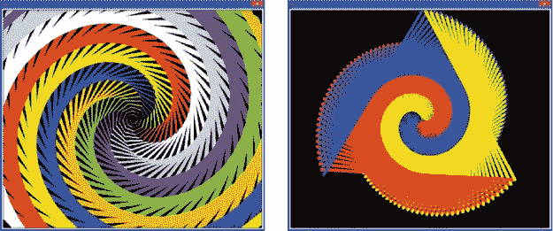

图 3-9. 来自 *ColorSpiralInput.py* 的图片，左侧是八边形，右侧是三边形

# Python 完成你的作业

我们已经看到，Python 是一种强大且有趣的编程语言，可以处理各种数据：数字、字符串、列表，甚至是复杂的数学表达式。现在，你将利用 Python 的强大功能做一些非常实际的事情：你的数学作业！

我们将编写一个简短的程序，结合字符串和数字，使用 `eval()` 函数将数学问题转换为答案。在本章的早些时候，我提到过 `eval()` 函数可以将字符串 `"20"` 转换为数字 20。正如我承诺的，`eval()` 可以做更多的事情：它还可以将 `"2 * 10"` 转换为数字 20。当 `eval()` 函数处理一个键盘输入的字符串时，它会像 Python shell 一样对其进行求值。因此，当我们将数学问题作为输入时，运行 `eval()` 就能给出该问题的答案。

通过打印用户输入的原始问题，然后输出 `eval(`*`problem`*`)`，我们可以将原始问题和答案显示在同一行。记得表 3-1 中的运算符：如果你需要 5 ÷ 2 的答案，你可以输入 `5 / 2`，而对于 4²，你可以输入 `4 ** 2`。以下是我们将程序 *MathHomework.py* 整合后的样子：

## MathHomework.py

```
print("MathHomework.py")
# Ask the user to enter a math problem
problem = input("Enter a math problem, or 'q' to quit: ")
# Keep going until the user enters 'q' to quit
while (problem != "q"):
    # Show the problem, and the answer using eval()
    print("The answer to ", problem, "is:", eval(problem) )
    # Ask for another math problem
    problem = input("Enter another math problem, or 'q' to quit: ")
    # This while loop will keep going until you enter 'q' to quit
```

这个 `while` 语句会一直询问问题并打印答案，直到用户按下 Q 键退出程序。

尽管这个简单的程序还不能帮我们解决代数问题，但它可以处理比基础数学更多的内容。还记得我们讨论过 Python 的真除法吗？我们称之为“披萨除法”，因为它让我们可以将披萨平均分给任何数量的人。好吧，Python 仍然可以进行整数除法（即整除）；我们只需要学习两个新的运算符。

你什么时候需要进行整数除法呢？假设你的老师给你和你三个朋友分发了 10 箱巧克力牛奶，大家想要公平地分配牛奶，让每个人获得相同数量的箱数。你们四个人（你加上三位朋友），所以 10 ÷ 4 等于 2.5。但不幸的是，你不能把一箱牛奶切成两半。如果有杯子，你可以把一箱牛奶分给两位朋友，但假设周围没有杯子。如果你想要公平，你就得每人拿两箱，剩下的两箱交还给老师。这听起来像长除法：剩下的两箱牛奶就是你用 10 除以 4 时的*余数*。在数学中，我们有时会像这样记录长除法的余数：10 ÷ 4 = 2 R2。换句话说，10 除以 4 的*商*是 2，余数是 2。这意味着 4 能均匀地除进 10 两次，剩下 2。

在 Python 中，整数除法是通过双斜杠运算符`//`来进行的。所以`10 // 4`等于`2`，而`7 // 4`等于`1`（因为 4 只能除进 7 一次，余数是 3）。`//`运算符给我们的是商，那余数呢？要得到余数，我们使用取模运算符，在 Python 中用`%`符号表示。不要把`%`和百分号混淆——在 Python 中，百分比是用小数表示的（5%变成 0.05），而`%`运算符*始终*是*模数*，也就是整数除法的余数。要得到长除法的余数，在 Python 中输入**`10 % 4`**（余数是`2`）或者**`7 % 4`**（余数是`3`）。图 3-10 展示了几种数学运算的结果，包括使用`//`和`%`运算符进行的整数除法和余数运算。

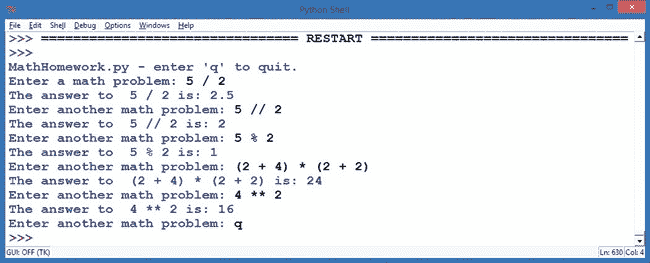

图 3-10. Python 帮你做数学作业。

随着我们继续阅读这本书，我们将在程序中使用`%`运算符，比如在我们的螺旋图形绘制中，用来将数字限制在某个范围内。

# 你学到了什么

在本章中，你学习了如何将不同类型的信息存储在变量中，包括数字、列表和字符串。你学会了在 Python 中命名变量的规则（字母、下划线、数字；区分大小写；不能有空格），以及如何用等号运算符（`my_name = "Alex"` 或 `my_age = 5`）为变量赋值。

你还学习了整数（整数）和浮点数（小数值）。你了解了 Python 中的各种数学运算符，以及它们与数学课本中使用的符号的不同。你看到了如何使用字符串，包括如何让 Python 理解并计算某些字符串，就像当我们想使用用户输入的数字来进行计算时。


你看到了一些语法错误的例子，并学习了如何在编程时避免其中的一些。你了解了列表变量类型，能够用它存储各种类型的值，例如 `colors = ["red", "yellow", "blue", "green"]`。你甚至发现了 Python 如何帮助你进行简单的计算，包括长除法。

在第四章中，你将深入理解变量和数据类型，学习如何使用变量创建你自己的循环；在第五章中，你将学习如何让计算机做出决策；甚至在第六章及之后的章节中，你将学习如何编写程序让计算机玩游戏。变量是我们解决从视频游戏到卫星，再到医疗软件等最复杂问题的首要编程工具，它们帮助我们将复杂问题拆解为可以用代码解决的小块。继续练习本章的示例，并创建自己的示例，直到你对变量足够熟悉，以便进入下一个章节。

到这一点，你应该能够做到以下几点：

+   创建自己的变量来存储数字、字符串和列表。

+   讨论 Python 中数字类型的区别。

+   使用 Python 中的基本数学运算符进行计算。

+   解释字符串、数字和列表之间的区别。

+   用英文写出简短的程序步骤，然后将这些步骤写成注释，帮助你构建代码。

+   在各种情况下请求用户输入，并在你的程序中使用这些输入。

编程挑战

为了练习本章所学内容，尝试这些挑战。（如果遇到困难，请访问 *[`www.nostarch.com/teachkids/`](http://www.nostarch.com/teachkids/)* 查阅示例答案。）

**#1: 圆形螺旋**

回顾一下第二章中的 *ColorCircleSpiral.py* 程序 (ColorCircleSpiral.py)，该程序在螺旋的每一侧绘制了圆圈，而不是线条。重新运行那个例子，看看你是否能够确定需要在哪些代码行中添加或删除内容，以便能够在 *ColorSpiralInput.py* 程序 (ColorSpiralInput.py) 中绘制具有任意边数（从一到八）的圆形螺旋。完成后，将新程序保存为 *CircleSpiralInput.py*。

**#2: 自定义名字螺旋**

试想一下，如果让用户输入他们想要的螺旋边数、输入名字，然后画出一个螺旋，按照正确的螺旋边数和颜色写出他们的名字，是不是很酷？看看你能不能找出 *SpiralMyName.py* (SpiralMyName.py) 中哪些部分可以融入到 *ColorSpiralInput.py* (ColorSpiralInput.py) 中，从而创造出这个新颖且令人印象深刻的设计。当你搞定了（或者做出更酷的东西），把新程序保存为 *ColorMeSpiralled.py*。
