# 第四章. 循环很有趣（你可以再说一遍）

从我们编写第一个程序开始，就一直在使用循环来绘制重复的图形。现在是时候学习如何从头开始构建我们自己的循环了。每当我们需要在程序中做一些重复的事情时，循环可以让我们在不需要单独输入每个步骤的情况下重复这些步骤。图 4-1 展示了一个视觉示例——由四个圆圈组成的花纹。

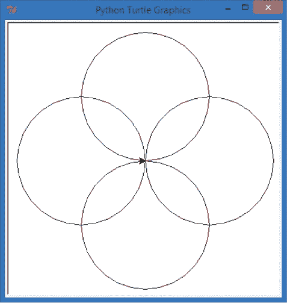

图 4-1. 四圈花纹图案

让我们思考一下如何编写程序来绘制四个重叠的圆圈，如图所示。正如你在第二章中看到的，Turtle 的`circle()`命令会根据我们在括号中指定的半径绘制一个圆形。这些圆形看起来像是位于屏幕的正北、正南、正东和正西，相距 90 度，我们知道如何将方向转 90 度。所以，我们可以编写四对语句来绘制一个圆圈，然后转 90 度，再绘制另一个圆圈，代码如下。将这段代码输入到一个新窗口，并将其保存为*Rosette.py*。

# Rosette.py

```
import turtle
t = turtle.Pen()
t.circle(100) # This makes our first circle (pointing north)
t.left(90)    # Then the turtle turns left 90 degrees
t.circle(100) # This makes our second circle (pointing west)
t.left(90)    # Then the turtle turns left 90 degrees
t.circle(100) # This makes our third circle (pointing south)
t.left(90)    # Then the turtle turns left 90 degrees
t.circle(100) # This makes our fourth circle (pointing east)
```

这段代码可以工作，但感觉是不是有点重复呢？我们编写了四次绘制圆形的代码，并且写了三次向左转的代码。通过我们之前的螺旋示例，我们知道应该能够将一段代码写一次，然后在`for`循环中重复使用。在本章中，我们将学习如何自己编写这些循环。现在就来试试吧！

# 构建你自己的`for`循环

为了构建我们自己的循环，首先需要确定重复的步骤。在前面的代码中，我们重复的指令是`t.circle(100)`，用来绘制半径为 100 像素的龟形圆圈，以及`t.left(90)`，用来在绘制下一个圆圈之前将龟形向左转 90 度。其次，我们需要弄清楚这些步骤需要重复多少次。我们想要绘制四个圆圈，所以从四开始。

既然我们已经知道了两个重复的指令和绘制圆形的次数，是时候构建我们的`for`循环了。

Python 中的`for`循环*遍历*一个项目列表，或者对于列表中的每个项目重复一次——例如数字 1 到 100，或 0 到 9。我们希望我们的循环运行四次——每个圆圈一次——因此我们需要设置一个包含四个数字的列表。

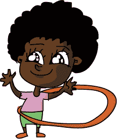

内建函数`range()`让我们能够轻松创建数字列表。构造*n*个数字范围的最简单命令是`range(n)`；这个命令会让我们生成一个从 0 到*n* – 1（从零到小于*n*的数字）的数字列表。

例如，`range(10)`允许我们创建一个包含从 0 到 9 的 10 个数字的列表。让我们在 IDLE 命令提示符窗口中输入一些示例`range()`命令，看看它是如何工作的。为了查看我们打印出的列表，我们需要在`range`周围使用`list()`函数。在`>>>`提示符下，输入这一行代码：

```
>>> list(range(10))
```

IDLE 会给出输出`[0, 1, 2, 3, 4, 5, 6, 7, 8, 9]`：一个包含 10 个数字的列表，从 0 开始。要获得更长或更短的数字列表，你可以在`range()`函数的括号中输入不同的数字：

```
>>> list(range(3))
[0, 1, 2]
>>> list(range(5))
[0, 1, 2, 3, 4]
```

如你所见，输入`list(range(3))`会给你一个包含三个数字的列表，从 0 开始，输入`list(range(5))`则会给你一个包含五个数字的列表，同样从 0 开始。

## 使用`for`循环绘制一个四圈花环

对于我们的四圈花环形状，我们需要重复画四次圆，`range(4)`可以帮助我们做到这一点。我们`for`循环的语法或词序将如下所示：

```
for x in range(4):
```

我们从关键字`for`开始，然后指定一个变量`x`，它将作为我们的计数器或*迭代器*变量。`in`关键字告诉`for`循环让`x`遍历范围列表中的每个值，而`range(4)`为循环提供从 0 到 3 的数字列表`[0,1,2,3]`，让循环按顺序执行。记住，计算机通常从 0 开始计数，而不是像我们一样从 1 开始。

要告诉计算机哪些指令需要重复执行，我们使用*缩进*；我们通过在新文件窗口中按下 TAB 键来缩进每个需要在循环中重复执行的命令。输入这个新版本的程序并将其保存为*Rosette4.py*。

### Rosette4.py

```
import turtle
t = turtle.Pen()
for x in range(4):
    t.circle(100)
    t.left(90)
```

这是我们*Rosette.py*程序的一个更简短版本，得益于`for`循环，它仍然产生和没有循环版本一样的四个圆。这个程序总共循环执行第 3、4 和 5 行四次，在窗口的顶部、左侧、底部和右侧生成一个四圈花环。让我们逐步回顾这个循环，看看它是如何一次绘制一个圆的。

1.  在第一次执行循环时，我们的计数器`x`的初始值是`0`，即`[0, 1, 2, 3]`范围列表中的第一个值。我们使用`t.circle(100)`在窗口的顶部画出第一个圆，然后使用`t.left(90)`将海龟向左转 90 度。

    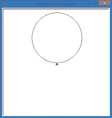

1.  Python 回到循环的开始，将`x`设置为`1`，即`[0, 1, 2, 3]`中的第二个值。然后，它在窗口的左侧画出第二个圆，并将海龟向左转 90 度。

    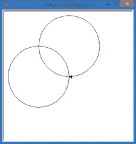

1.  Python 再次回到循环中，将`x`增大到`2`。它在窗口底部画出第三个圆，并将海龟向左转。

    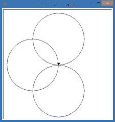

1.  在第四次也是最后一次通过循环时，Python 将`x`增加到`3`，然后执行`t.circle(100)`和`t.left(90)`来绘制第四个圆，并使海龟转动。玫瑰图案现在完成了。

    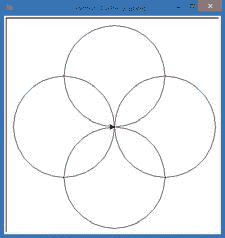

## 修改我们的 for 循环，制作六个圆的玫瑰图案

既然我们已经一起从头开始构建了自己的`for`循环，你能自己修改程序绘制一些新东西吗？如果我们想绘制一个有六个圆而不是四个圆的玫瑰图案，我们需要在程序中做什么改变呢？花点时间思考一下你如何解决这个问题。

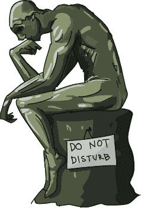

* * *

你想到了什么点子吗？我们一起走一遍这个问题。首先，这次我们需要六个圆而不是四个，所以我们的`for`循环中的范围需要更改为`range(6)`。但是如果我们仅仅做这个更改，图形上不会看到任何不同，因为我们还是会继续绘制四个相隔 90 度的圆。如果我们想要六个圆围绕着玫瑰图案，我们需要把玫瑰图案分成六个左转，而不是四个。我们绘图中心周围有 360 度：四个 90 度的转弯让我们走了 4 × 90 = 360 度一圈。如果我们将 360 度除以 6 而不是 4，我们得到 360 ÷ 6 = 60 度每次转弯。所以在我们的`t.left()`命令中，我们需要每次通过循环时左转 60 度，即`t.left(60)`。

修改你的玫瑰图程序，并将其保存为*Rosette6.py*。

### Rosette6.py

```
   import turtle
   t = turtle.Pen()
➊ for x in range(**6**):
➋     t.circle(100)
➌     t.left(**60**)
```

这次，➊中的 for 循环语句会让`x`遍历从`0`到`5`的六个值，所以我们将重复缩进部分的步骤➋和➌六次。在➋中，我们仍然绘制一个半径为`100`的圆。然而，在➌中，我们每次只转动 60 度，或者说是 360 度的六分之一，所以这次我们将绘制六个圆围绕着屏幕的中心，正如图 4-2 所示。

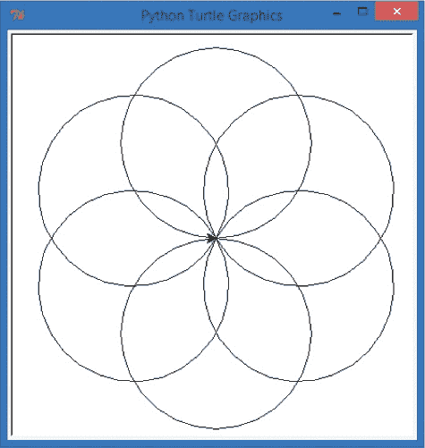

图 4-2。六个圆的玫瑰图案

六个圆的玫瑰图案比四个圆的更漂亮，感谢我们的`for`循环，我们无需再写更多的代码行来绘制六个圆——我们只改动了两个数字！由于我们更改了这两个数字，你可能会想用变量来代替它们。让我们顺从一下这个诱惑，给用户提供绘制*任意*数量圆的能力。

# 通过用户输入改进我们的玫瑰图程序

在本节中，我们将使用我们在第三章中看到的`turtle.numinput()`函数（见 ColorSpiralInput.py），编写一个程序，要求用户输入一个数字，然后用这个数字的圆圈数绘制玫瑰图案。我们将用户输入的数字作为`range()`构造函数的大小。然后，我们所要做的就是将 360 度除以这个数字，就能得到每次循环时要左转的度数。键入并运行以下代码，保存为*RosetteGoneWild.py*：

## RosetteGoneWild.py

```
   import turtle
   t = turtle.Pen()
   # Ask the user for the number of circles in their rosette, default to 6
➊ number_of_circles = int(turtle.numinput("Number of circles",
                                           "How many circles in your rosette?", 6))
➋ for x in range(number_of_circles):
➌     t.circle(100)
➍     t.left(360/number_of_circles)
```

在➊处，我们通过将几个函数组合在一起，给一个变量赋值，名为`number_of_circles`。我们使用 Turtle 的`numinput()`函数询问用户要绘制多少个圆圈。第一个值`Number of circles`是弹出窗口的标题；第二个值`How many circles in your rosette?`是将在输入框中显示的文本；最后，`6`是默认值，以防用户没有输入任何内容。`int()`函数位于`numinput()`外部，将用户输入的数字转化为整数，以便我们可以在`range()`函数中使用。我们将用户输入的数字存储为`number_of_circles`，用于作为绘图循环中`range()`的大小。

➋处的`for`语句是我们的循环。它使用`number_of_circles`变量让`x`遍历一个包含如此多数字的列表。绘制圆圈的命令在➌处仍然相同，它将绘制半径为 100 像素的圆圈。在➍处，我们将 360 度的完整旋转除以圆圈的数量，这样就可以将圆圈均匀地分布在屏幕中心周围。例如，如果用户输入`30`作为圆圈的数量，则 360 ÷ 30 将得到每两个圆圈之间的 12 度角，如图 4-3 所示。

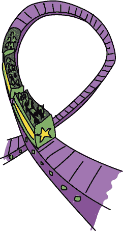

运行程序并尝试输入你自己的数字。你甚至可以创建一个包含 90 个圆圈的玫瑰图案，或者 200 个（但你可能得等一会儿，因为 Python 要画这么多圆圈！）。定制程序让它更符合你的需求：更改背景颜色或玫瑰图案的颜色，将圆圈做得更大或更小，或者同时做得更大*和*更小！在创建程序并思考你想要它们做的有趣事情时，尽情地玩弄你的程序。图 4-4 展示了我的五岁儿子 Alex 通过在*RosetteGoneWild.py*中仅增加三行代码所创作的内容。请访问*[`www.nostarch.com/teachkids/`](http://www.nostarch.com/teachkids/)*获取源代码。

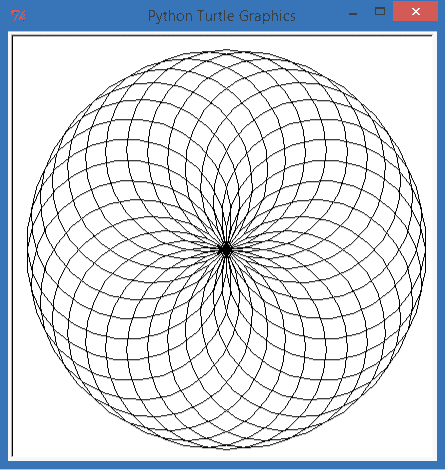

图 4-3. 用户定义的 30 个圆圈玫瑰图案

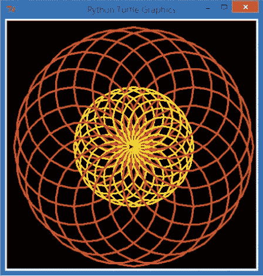

图 4-4。稍加想象和一小段代码就能将我们的玫瑰图程序变成五彩斑斓的有趣体验！

# 游戏循环与`while`循环

`for`循环很强大，但也有它的局限性。例如，假如我们希望在某个事件发生时停止循环，而不是遍历一个长长的数字列表，或者如果我们不确定要运行多少次循环呢？

例如，考虑一个*游戏循环*——当我们编写程序时，特别是游戏程序，用户可以选择继续玩还是退出。作为程序员，我们无法提前知道用户会选择玩多少次游戏或运行多少次程序，但我们需要给他们一个可以再次玩游戏而无需每次都重新加载和运行程序的能力。你能想象每次想再玩一次游戏时，都得重新启动 Xbox 或 PlayStation，或者每次玩游戏都必须准确玩 10 次，然后才切换到另一个游戏吗？那样可能会降低乐趣。

我们解决游戏循环问题的一种方法是使用另一种类型的循环——`while`循环。与`for`循环遍历预定义的值列表不同，`while`循环可以检查一个*条件*或情境，并决定是否继续循环或结束循环。`while`语句的语法如下：

```
while *condition*:
   *indented statement(s)*
```

这个条件通常是一个*布尔值*表达式，或是一个真/假测试。`while`循环的一个日常例子是吃饭和喝水。当你饿了，你就吃。当“我饿了吗？”这个问题的答案不再是“是”，这意味着“我饿了”的条件不再成立，你就停止吃饭。当你渴了，你就再喝一口水。当你不再感到渴时，你就停止喝水。饥饿和口渴是条件，当这些条件变为假时，你就退出吃饭和喝水的“循环”。`while`循环会在条件为真时继续重复循环中的语句（缩进的语句）。

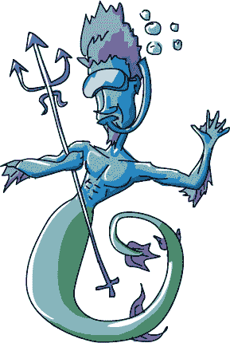

`while` 循环中的真/假条件通常涉及比较值。我们可能会说：“`x` 的值大于 10 吗？只要大于 10，就运行这段代码。当 `x` 不再大于 10 时，停止运行代码。”换句话说，当条件 `x > 10` 评估为 `True` 时，我们运行这段代码 *while*。大于号（`>`）是一个*比较运算符*，与算术运算符如 `+`（加号）和 `–`（减号）不同。比较运算符—如 `>`（大于）、`<`（小于）、`==`（等于）或 `!=`（不等于）— 允许你比较两个值，看看一个是否大于或小于另一个，或者它们是否相等或不相等。`x` 小于 7 吗？是或不是？`True` 还是 `False`？根据结果，`True` 或 `False`，你可以让程序运行不同的代码。

`while` 循环与 `for` 循环有一些相似之处。首先，像 `for` 循环一样，它会根据需要重复一组语句。其次，使用 `while` 循环和 `for` 循环时，我们通过使用 TAB 键将语句缩进到右侧来告诉 Python 哪些语句需要重复。

让我们尝试一个带有 `while` 循环的程序，看看它如何运作。键入以下代码（或从 *[`www.nostarch.com/teachkids/`](http://www.nostarch.com/teachkids/)* 下载它），并运行：

## SayOurNames.py

```
   # Ask the user for their name
➊ name = input("What is your name? ")
   # Keep printing names until we want to quit
➋ while name != "":
       # Print their name 100 times
➌     for x in range(100):
          # Print their name followed by a space, not a new line
➍        print(name, end = " ")
➎     print()  # After the for loop, skip down to the next line
       # Ask for another name, or quit
➏     name = input("Type another name, or just hit [ENTER] to quit: ")
➐ print("Thanks for playing!")
```

我们通过在 ➊ 处询问用户的名字并将其存储在变量 `name` 中来开始程序。我们需要一个名字来测试 `while` 循环的条件，所以我们必须在循环开始之前*先*询问一次。然后，在 ➋ 处，我们启动了 `while` 循环，它会一直运行，直到用户输入的名字不是空字符串（由两个双引号表示，中间没有任何内容：`""`）。空字符串是当用户按下 ENTER 键以退出时 Python 所看到的输入。

在 ➌ 处，我们开始了 `for` 循环，它将打印名字 100 次，而在 ➍ 处，我们告诉 `print()` 语句每次打印名字后打印一个空格。我们会不断回到 ➌ 检查 `x` 是否已经达到 100，然后在 ➍ 打印，直到名字填满几行屏幕。当我们的 `for` 循环完成打印名字 100 次后，我们打印一个空白行，且没有空格 ➎，将输出移到下一行。然后，就该询问另一个名字了 ➏。

因为 ➏ 是最后一行缩进在 `while` 循环 ➋ 下，所以用户输入的新名字会被传回到 ➋，以便 `while` 循环可以检查它是否为空字符串。如果不是空的，我们的程序会启动 `for` 循环，打印新名字 100 次。如果名字是空字符串，这意味着用户按下了 ENTER 键结束程序，那么 `while` 循环会跳到 ➐，我们会感谢用户的参与。图 4-5 显示了当我的儿子们运行程序时的输出。

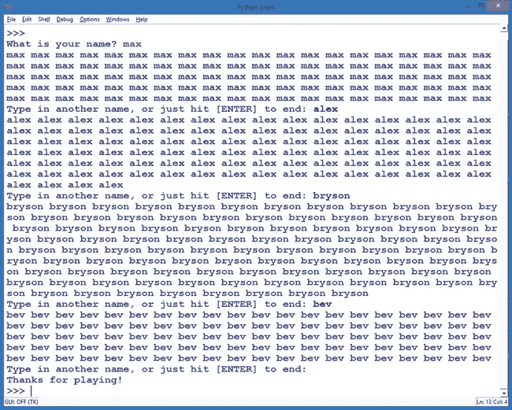

图 4-5. 我的儿子们运行了*SayOurNames.py*并输入了我们全家每个人的姓名！

# 家庭螺旋

现在我们可以请求姓名列表并将其打印到屏幕上，让我们将姓名打印循环与我们在第三章中的一个程序结合起来，在 SpiralMyName.py 中创建一个家庭或朋友姓名的彩色螺旋。

我们新的合并程序与*SayOurNames.py*中的名字重复器有一些不同，但最重要的区别是，我们不能仅仅一个一个地打印姓名；为了绘制我们的螺旋图形，我们需要一次性获取所有的姓名，以便在绘制螺旋时按顺序绘制每个姓名。

在*SayOurNames.py*中，我们能够一次请求一个姓名，但对于我们的图形螺旋姓名程序，我们需要将所有姓名保存在一个列表中，就像我们对待颜色一样。然后，在遍历循环时，我们可以在螺旋的每个角落同时改变姓名和颜色。为此，我们将设置一个空列表：

```
family = [] # Set up an empty list for family names
```

每当我们在程序中创建颜色列表时，我们通常知道自己想使用的颜色名称，如红色、黄色、蓝色等等。然而，在我们的家庭名单中，我们必须等到用户输入姓名后才能知道具体内容。我们使用一个空列表——一对方括号`[]`——告诉 Python 我们将使用一个名为`family`的列表，但在程序运行之前我们并不知道这个列表中会有什么内容。

一旦我们有了一个空列表，我们可以像在*SayOurNames.py*中那样通过`while`循环请求姓名，并将这些姓名添加到列表中。*append*意味着将项添加到列表的末尾。在这个程序中，用户输入的第一个姓名将被添加到空列表中，第二个姓名将添加到第一个姓名之后，依此类推。当用户输入了他们想要的所有姓名后，他们会按下 ENTER 键告诉程序他们已经完成了姓名输入。然后，我们将使用`for`循环以彩色螺旋形状在屏幕上绘制这些姓名。

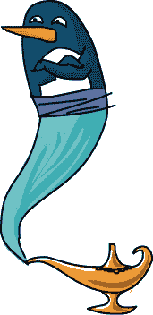

输入并运行以下代码，看看`while`循环和`for`循环如何一起完成一些美丽的工作：

## SpiralFamily.py

```
   import turtle     # Set up turtle graphics
   t = turtle.Pen()
   turtle.bgcolor("black")
   colors = ["red", "yellow", "blue", "green", "orange",
          "purple", "white", "brown", "gray", "pink" ]
➊ family = []      # Set up an empty list for family names
   # Ask for the first name
➋ name = turtle.textinput("My family",
                          "Enter a name, or just hit [ENTER] to end:")
   # Keep asking for names
➌ while name != "":
      # Add their name to the family list
➍    family.append(name)
      # Ask for another name, or end
      name = turtle.textinput("My family",
                          "Enter a name, or just hit [ENTER] to end:")
  # Draw a spiral of the names on the screen
  for x in range(100):
➎    t.pencolor(colors[x%len(family)]) # Rotate through the colors
➏    t.penup()                         # Don't draw the regular spiral lines
➐    t.forward(x*4)                    # Just move the turtle on the screen
➑    t.pendown()                       # Draw the next family member's name
➒    t.write(family[x%len(family)], font = ("Arial", int((x+4)/4), "bold") )
➓    t.left(360/len(family) + 2)       # Turn left for our spiral
```

在➊，我们设置了一个空列表`[]`，名为`family`，用于存储用户输入的姓名。在➋，我们通过`turtle.textinput`窗口请求第一个姓名，并在➌开始`while`循环收集所有的家庭成员姓名。将值添加到列表末尾的命令是`append()`，如在➍所示。该命令将用户输入的`name`添加到名为`family`的列表中。然后我们会请求另一个姓名，并继续重复`while`循环➌，直到用户按下 ENTER 键告诉我们他们已经完成输入。

我们的`for`循环与之前的螺旋相似，但在➎位置使用了一个新命令来设置笔的颜色。`len()`命令是*长度*的缩写，它告诉我们`family`列表中名字的数量。例如，如果你输入了四个家庭成员的名字，`len(family)`将返回`4`。我们使用取模运算符`%`和这个值来循环选择四种颜色，每个名字一个颜色。较大的家庭会循环更多的颜色（最多使用我们列表中的 10 种颜色），而较小的家庭则只需要更少的颜色。

在➏位置，我们使用`penup()`命令“抬起”海龟的笔，以便在➐位置前进时，海龟不会绘制任何东西；我们将在螺旋的角落绘制名字，而角落之间不会有线条。在➑位置，我们再次将海龟的笔放下，以便绘制我们的名字。

在➒位置，我们做了很多事情。首先，我们告诉海龟绘制哪个名字。请注意，`family[x%len(family)]`使用了取模运算符`%`，可以在用户输入的`family`列表中的名字之间进行循环。程序将从第一个输入的名字`family[0]`开始，然后依次是`family[1]`、`family[2]`，直到达到列表中的最后一个名字。这个语句中的`font =`部分告诉计算机我们想要使用 Arial 字体，并且采用粗体样式来绘制名字。它还设置了字体大小随着`x`的增长而增大；我们用`(x+4)/4`来计算字体大小，这意味着当循环结束时，`x = 100`，字体大小将是(100 + 4) / 4 = 26 磅——一个不错的大小。你可以通过修改这个公式来调整字体的大小。

最后，在➓位置，我们将海龟向左转`360/len(family)`度再加`2`度。对于一个有四个成员的家庭，我们会转 90 度再加 2 度，形成漂亮的正方形螺旋；六口之家的话，转 60 度再加 2 度，形成六边形螺旋，依此类推。额外的 2 度让螺旋稍微向左旋转，产生我们在其他螺旋中看到的漩涡效果。在图 4-6 中，我们运行了这个程序并输入了我们家庭的名字，包括我们的两只猫 Leo 和 Rocky，得到了一幅精彩的家庭螺旋图。

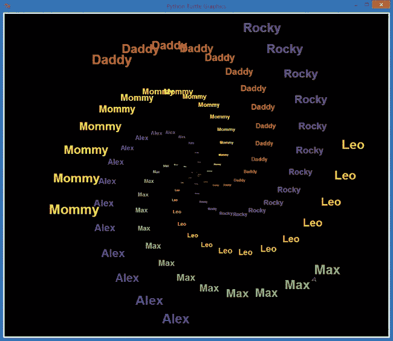

图 4-6。佩恩家庭螺旋，包括我们的两只猫 Leo 和 Rocky

# 综合运用：螺旋走红

我们已经看到了循环的强大功能：它们将一段代码重复执行，以完成我们不想手动做的重复工作，比如打 100 次名字。让我们进一步深入了解循环，构建我们自己的*嵌套循环*，即一个循环内部再包含另一个循环（就像俄罗斯套娃——看一个娃娃，里面还有一个娃娃）。

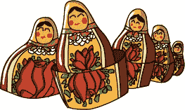

为了探索嵌套循环，让我们绘制一个不仅仅是名字或线条的螺旋，而是 *螺旋的螺旋*！我们可以在螺旋的每个角落画一个小螺旋，而不是像在 图 4-6 中那样画一个名字。为此，我们需要一个大循环来绘制大螺旋，同时在里面嵌套一个小循环来绘制围绕大螺旋的小螺旋。

在编写程序之前，让我们先学习如何将一个循环嵌套到另一个循环中。首先，像往常一样启动一个循环。然后，在该循环内部，按一次 TAB 键并启动第二个循环：

```
# This is our first loop, called the outer loop
for x in range(10):
    # Things indented once will be done 10 times
    # Next is our inner loop, or the nested loop
    for y in range(10):
        # Things indented twice will be done 100 (10*10) times!
```

第一个循环称为 *外部* 循环，因为它包围了我们的嵌套循环。嵌套循环称为 *内部* 循环，因为它位于另一个循环内部。注意，在我们的嵌套循环中，任何缩进了两次的代码行（也就是说，它们在第二个循环内）将会重复 `y` 10 次，`x` 10 次，总共重复 100 次。

让我们开始编写程序 *ViralSpiral.py*。我们将一步步写—完成的程序可以在 ViralSpiral.py 中查看。

```
   import
   turtle t = turtle.Pen()
➊ t.penup()
   turtle.bgcolor("black")
```

我们程序的前几行看起来像我们编写的其他螺旋程序，不同之处在于我们不会为大螺旋绘制线条。我们计划用较小的螺旋代替这些线条，因此在 ➊ 我们使用了 `t.penup()` 来一开始就把乌龟的笔抬离屏幕。然后我们将背景色设置为黑色。

继续输入：我们还没完成！接下来，我们将使用 `turtle.numinput()` 提示用户输入他们想要的边数，默认值为 4，如果用户没有选择其他值，我们将限制允许的边数范围在 2 到 6 之间。

```
sides = int(turtle.numinput("Number of sides",
            "How many sides in your spiral of spirals (2-6)?", 4,2,6))
colors = ["red", "yellow", "blue", "green", "purple", "orange"]
```

`turtle.numinput()` 函数允许我们为输入对话框指定一个标题、一条提示问题，以及默认值、最小值和最大值，顺序如下：`turtle.numinput(`*`title`*`,` *`prompt`*`,` *`default`*`,` *`minimum`*`,` *`maximum`*`)`。在这里，我们指定了默认值 `4`，最小值 `2` 和最大值 `6`。（例如，如果用户尝试输入 `1` 或 `7`，他们将收到警告，告知最小允许值是 `2`，最大允许值是 `6`。）我们还设置了六种颜色的 `colors` 列表。

接下来我们将编写外部螺旋循环。外部循环将把乌龟定位到大螺旋的每个角落。

```
➋ for m in range(100):
      t.forward(m*4)
➌     position = t.position() # Remember this corner of the spiral
➍     heading = t.heading()   # Remember the direction we were heading
```

我们的外部循环将 `m` 从 `0` 循环到 `99`，总共循环 `100` 次 ➋。在外部循环中，我们像其他螺旋程序一样前进，但当我们到达大螺旋的每个角落时，我们会停下来记住我们的 `position` ➌ 和 `heading` ➍。*position* 是乌龟在屏幕上的 (*x*, *y*) 坐标位置，*heading* 是乌龟正在移动的方向。

我们的海龟在大螺旋的每个位置上都会稍作偏离，去绘制小螺旋，因此在完成每个小螺旋后，它必须返回到该位置和朝向，以保持大螺旋的形状。如果我们在开始绘制小螺旋之前没有记住海龟的位置和方向，海龟就会在屏幕上乱窜，每个小螺旋都会从上一个小螺旋的位置出发，而不是按照大螺旋的形状。

告诉我们海龟位置和方向的两个命令是 `t.position()` 和 `t.heading()`。海龟的位置通过 `t.position()` 访问，它包括海龟在屏幕上的 *x*（水平）和 *y*（垂直）坐标，就像坐标图上的点一样。海龟的朝向通过命令 `t.heading()` 获取，方向的角度范围是从 0.0 度到 360.0 度，0.0 度指向屏幕顶部。我们将在每次开始绘制小螺旋之前，将这些信息存储在变量 `position` 和 `heading` 中，以便每次都能在大螺旋中准确接着上次的地方绘制。

现在是内循环的时间了。我们在这里的缩进更加深入。这个内循环将在大螺旋的每个角落绘制一个小螺旋。

```
➎     for n in range(int(m/2)):
           t.pendown()
           t.pencolor(colors[n%sides])
           t.forward(2*n)
           t.right(360/sides - 2)
           t.penup()
➏     t.setx(position[0])     # Go back to the big spiral's x location
➐     t.sety(position[1])     # Go back to the big spiral's y location
➑     t.setheading(heading)   # Point in the big spiral's heading
➒     t.left(360/sides + 2)   # Aim at the next point on the big spiral
```

我们的内循环 ➎ 从 `n = 0` 开始，在 `n = m/2` 时停止，即 `m` 的一半，以保持内螺旋比外螺旋小。内螺旋看起来与我们之前的螺旋相似，唯一的区别是我们在绘制每一条线之前放下笔，绘制完每条线后抬起笔，这样我们的外螺旋保持干净。

在我们从 ➎ 绘制内螺旋后，我们通过将海龟的水平位置设置为我们在 ➌ 存储的位置，继续执行到 ➏。水平轴通常称为 *x 轴*，所以当我们设置水平位置时，我们使用 `t.setx()`，即设置海龟在屏幕上位置的 x 轴坐标。在 ➐，我们设置 y 轴位置，即在 ➌ 存储的垂直位置。在 ➑，我们将海龟转向我们在 ➍ 存储的朝向，然后继续进行大螺旋的下一个部分，直到 ➒。

当我们的外循环结束时，`m` 从 `0` 到 `99`，我们将完成 100 个小螺旋，按大螺旋模式排列，形成一个漂亮的万花筒效果，如 图 4-7 所示。


图 4-7。一个正方形螺旋图，顶部是每个角落都有正方形螺旋的图形，底部是一个五边形（五角形）螺旋图，由我们的 *ViralSpiral.py* 程序生成

你会注意到，在等待程序运行时，嵌套循环的一个缺点：如图 Figure 4-7 and a five-sided (pentagonal) spiral of spirals (bottom) from our ViralSpiral.py program")所示的形状绘制比我们简单的螺旋要花费更长的时间。这是因为我们执行的步骤比简单螺旋多得多。事实上，当我们绘制六边形版本的*ViralSpiral.py*时，最终的图形由 2,352 条独立的线条组成！所有这些绘图命令，加上转动和设置画笔颜色，都需要大量的工作，即使是快速的计算机也需要时间。嵌套循环非常有用，但要记住，额外的步骤会拖慢程序的速度，因此只有当效果值得等待时，我们才使用嵌套循环。

这是*ViralSpiral.py*的完整代码。

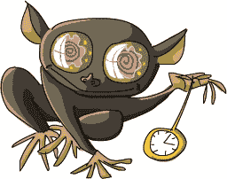

## ViralSpiral.py

```
import turtle
t = turtle.Pen()
t.penup()
turtle.bgcolor("black")
# Ask the user for the number of sides, default to 4, min 2, max 6
sides = int(turtle.numinput("Number of sides",
            "How many sides in your spiral of spirals? (2-6)", 4,2,6))
colors = ["red", "yellow", "blue", "green", "purple", "orange"]
# Our outer spiral loop
for m in range(100):
    t.forward(m*4)
    position = t.position() # Remember this corner of the spiral
    heading = t.heading()   # Remember the direction we were heading
    print(position, heading)
    # Our "inner" spiral loop
    # Draws a little spiral at each corner of the big spiral
    for n in range(int(m/2)):
        t.pendown()
        t.pencolor(colors[n%sides])
        t.forward(2*n)
        t.right(360/sides - 2)
        t.penup()
    t.setx(position[0])     # Go back to the big spiral's x location
    t.sety(position[1])     # Go back to the big spiral's y location
    t.setheading(heading)   # Point in the big spiral's heading
    t.left(360/sides + 2)   # Aim at the next point on the big spiral
```

# 你学到的内容

在本章中，你学会了通过识别程序中的重复步骤，并将这些步骤放入正确类型的循环中，来构建自己的循环。通过`for`循环，你可以让代码执行一定次数，例如使用`for x in range(10)`循环 10 次。通过`while`循环，你可以在满足条件或发生事件时运行代码，例如在用户没有输入任何内容时使用`while name != ""`。

你学到，通过你创建的循环可以改变程序的流程。我们使用`range()`函数生成数值列表，帮助我们控制`for`循环的重复次数，并使用模运算符`%`来遍历列表中的值，从而更改颜色列表中的颜色，选择名字列表中的名字，等等。

我们使用了一个空列表`[]`和`append()`函数将用户输入的信息添加到列表中，然后在程序中使用这个列表。你学到`len()`函数可以告诉你列表的长度——也就是列表中包含多少个值。

你学会了如何通过`t.position()`和`t.heading()`函数记住海龟的当前位置和方向，并学会了如何通过`t.setx()`、`t.sety()`和`t.setheading()`将海龟带回该位置和方向。

最后，你看到了如何使用嵌套循环在一个循环内部重复执行另一组指令，首先在屏幕上打印一组名字，然后在万花筒模式中创建螺旋状的螺旋图案。在这个过程中，我们在屏幕上画了线条、圆圈以及一串串的单词或名字。

到此为止，你应该能够完成以下任务：

+   创建你自己的`for`循环，将一组指令重复执行指定的次数。

+   使用`range()`函数生成数值列表来控制你的`for`循环。

+   使用`append()`函数创建空列表并向列表中添加元素。

+   创建你自己的 `while` 循环，在条件为 `True` 时重复，或直到条件为 `False`。

+   解释每种类型的循环是如何工作的，以及如何在 Python 中编写它。

+   举例说明每种类型的循环在什么情况下使用。

+   设计并修改使用嵌套循环的程序。

编程挑战

尝试这些挑战，练习你在本章中学到的内容。（如果卡住了，可以访问 *[`www.nostarch.com/teachkids/`](http://www.nostarch.com/teachkids/)* 查找示例答案。）

**#1: 螺旋玫瑰**

想想你如何修改 *ViralSpiral.py* 程序，将小螺旋替换为像 *Rosette6.py* 中的玫瑰花样（修改我们的 for 循环来绘制带有六个圆的玫瑰花）和 *RosetteGoneWild.py*（RosetteGoneWild.py）。提示：首先用一个内循环替换内层循环，这个内循环将绘制一个玫瑰。然后，添加代码来改变每个玫瑰中圆的颜色和大小。为了增添趣味，当圆变大时，稍微调整画笔的宽度。当完成时，将新程序保存为 *SpiralRosettes.py*。图 4-8 显示了一个解决方案绘制的图形。

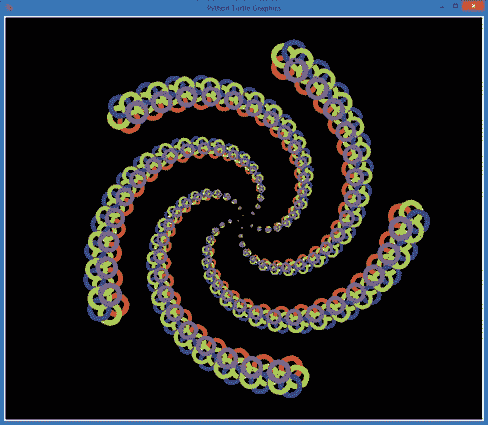

图 4-8。来自一个解决方案的螺旋玫瑰，解答编程挑战 #1

**#2: 一螺旋中的多个家庭螺旋**

绘制一个你家人名字的螺旋螺旋图形，岂不是很酷？看看 *SpiralFamily.py*（SpiralFamily.py），然后参考 *ViralSpiral.py* 的代码。在 *SpiralFamily.py* 中的 `for` 循环内创建一个内循环，用于绘制较小的螺旋。然后，修改外循环，在绘制每个小螺旋之前记住海龟的位置和朝向，并在继续到下一个大螺旋位置之前恢复它。当你完成后，将新程序保存为 *ViralFamilySpiral.py*。
