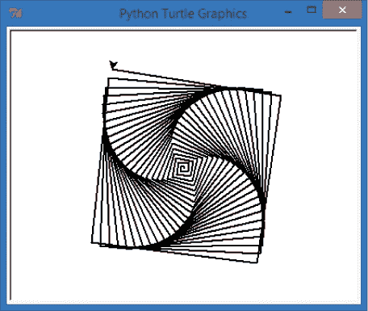
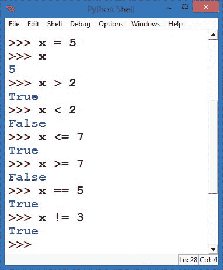
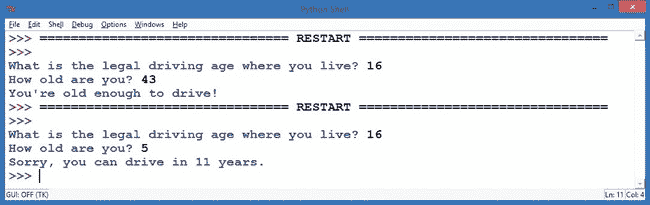
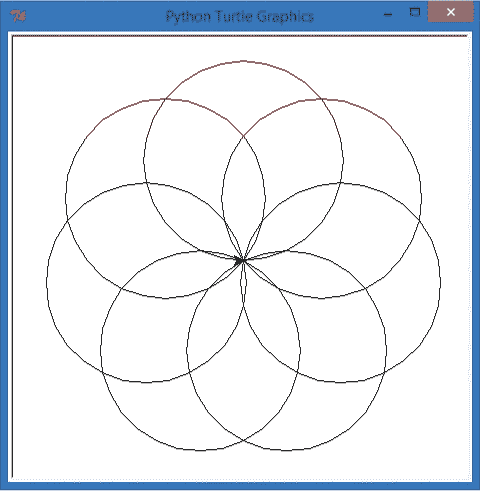
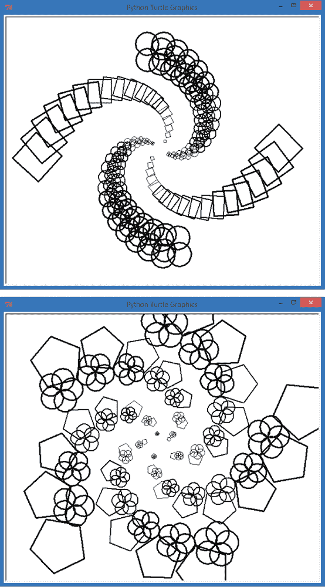
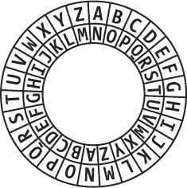
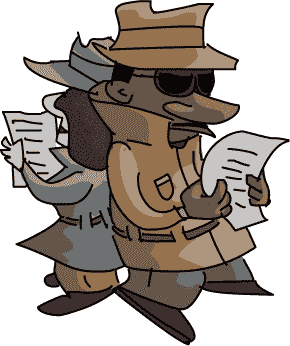

# 第五章 条件语句（如果？）

除了速度和准确性，计算机强大的另一个特点是它们能够快速评估信息并做出小的决策：温控器不断检查温度，并在温度高于或低于某个数值时迅速开启加热或制冷；新车上的传感器比我们反应更快，当前方有车突然停下时，它们会立即应用刹车；垃圾邮件过滤器会阻挡数十封电子邮件，以保持我们的收件箱清洁。

在这些情况下，计算机会检查一组条件：温度是否太冷？车前面是否有障碍物？电子邮件看起来像是垃圾邮件吗？

在第四章中，我们看到了一种使用条件做出决策的语句：`while` 语句。在那些例子中，条件告诉 `while` 循环应该执行多少次。如果我们想要根据*是否*执行一组语句来做决策会怎么样呢？想象一下，如果我们能编写一个程序，让用户决定他们是否希望在螺旋图案上使用圆形或其他形状。或者，如果我们想要圆形*和*其他形状，像图 5-1 中的那样呢？


图 5-1. 由 `if` 语句生成的玫瑰花形螺旋和更小的螺旋


使这一切成为可能的语句就是 `if` 语句。它询问*是否*某事为真，并根据答案决定是执行一组动作还是跳过它们。如果建筑物内的温度正常，暖气和空调系统不会运行，但如果温度过高或过低，系统会开启。如果外面下雨，你就带伞；否则你就不带。在本章中，我们将学习如何编程让计算机根据条件是否为真来做出决策。

# `if` 语句

`if` 语句是一个重要的编程工具。它允许我们根据一个或一组条件来告诉计算机是否运行一组指令。通过 `if` 语句，我们可以告诉计算机做出选择。

`if` 语句的语法——即我们编写 `if` 语句的方式，使计算机能够理解——如下所示：

```
if *condition*:
   *indented statement(s)*
```

我们在`if`语句中测试的条件通常是一个布尔表达式，或者是一个真/假测试。布尔表达式的结果是`True`或`False`。当你在`if`语句中使用布尔表达式时，你指定的是当表达式为真时要执行的动作或一组动作。如果表达式为真，程序将执行缩进的语句；如果为假，程序将跳过这些语句，并继续执行下一个未缩进的语句。

*IfSpiral.py*展示了一个`if`语句的代码示例：

## IfSpiral.py

```
➊ answer = input("Do you want to see a spiral? y/n:")
➋ if answer == 'y':
➌     print("Working...")
       import turtle
       t = turtle.Pen()
       t.width(2)
➍     for x in range(100):
➎         t.forward(x*2)
➏         t.left(89)
➐ print("Okay, we're done!")
```

我们的*IfSpiral.py*程序的第一行 ➊要求用户输入`y`或`n`，表示他们是否希望看到螺旋，并将用户的回答存储在`answer`中。在➋处，`if`语句检查`answer`是否等于`'y'`。请注意，测试“是否相等”的运算符使用的是两个等号`==`，以将其与赋值运算符（在➊处的单个等号）区分开来。`==`运算符检查`answer`和`'y'`是否相等。如果相等，`if`语句中的条件为真。我们在测试变量时，如果是单个字符（例如用户输入的字符），会在字母或其他字符周围加上一对单引号（`'`）。

如果我们在➋的条件为真，我们会在➌的屏幕上打印`Working...`，然后在屏幕上绘制一个螺旋。请注意，➌处的`print`语句以及绘制螺旋的语句一直到➏都被缩进了。这些缩进的语句只有在➋的条件为真时才会执行。否则，程序将跳过这些语句，直接跳到➐并打印`Okay, we're done!`。

我们在➔4 之后的语句被缩进得更深（➎和➏）。这是因为它们属于`for`语句。就像我们在第四章通过缩进嵌套循环将一个循环添加到另一个循环中一样，我们也可以通过缩进整个循环将一个循环放入`if`语句中。

一旦螺旋完成，我们的程序将继续从➐开始，并告诉用户我们已经完成。这也是程序在用户在➊输入`n`或其他任何不是`y`的字符时跳转到的行。记住，如果➋的条件为`False`，整个`if`块从➌到➏都会被跳过。

在新的 IDLE 窗口中输入*IfSpiral.py*，或者从*[`www.nostarch.com/teachkids/`](http://www.nostarch.com/teachkids/)*下载它，并运行几次，测试不同的答案。如果你在提示时输入字母`y`，你会看到像图 5-2 中的螺旋。



图 5-2。如果你在*IfSpiral.py*中回答`y`，你将看到一个像这样的螺旋图案。

如果你输入一个小写字母`y`以外的字符，或者输入多个字符，程序将打印出`Okay, we're done!`并结束。

# 认识布尔值

布尔表达式，或称*条件表达式*，是重要的编程工具：计算机做决策的能力依赖于它评估布尔表达式为`True`或`False`的能力。

我们必须使用计算机的语言告诉它我们想要测试的条件。Python 中条件表达式的语法是这样的：

```
*expression1 conditional_operator expression2*
```

每个表达式可以是一个变量、一个值或另一个表达式。在*IfSpiral.py*中，`answer == 'y'`是一个条件表达式，其中`answer`是第一个表达式，`'y'`是第二个表达式。条件运算符是`==`，用来检查`answer`是否等于`'y'`。除了`==`，Python 中还有许多其他的条件运算符。让我们来了解一些。

## 比较运算符

最常见的条件运算符是*比较运算符*，它让你测试两个值，看看它们如何互相比较。一个值是否大于或小于另一个值？它们是否相等？每次使用比较运算符进行比较时，都会产生一个条件，它的结果是`True`或`False`。一个现实世界中的比较例子是你输入密码来进入大楼。布尔表达式将你输入的密码与正确的密码进行比较；如果输入匹配（等于）正确的密码，表达式的结果为`True`，门就会打开。

比较运算符展示在表 5-1 中。

表 5-1. Python 比较运算符

| 数学符号 | Python 运算符 | 意义 | 示例 | 结果 |
| --- | --- | --- | --- | --- |
| `<` | `<` | 小于 | `1 < 2` | `True` |
| `>` | `>` | 大于 | `1 > 2` | `False` |
| `≤` | `<=` | 小于或等于 | `1 <= 2` | `True` |
| `≥` | `>=` | 大于或等于 | `1 >= 2` | `False` |
| `=` | `==` | 等于 | `1 == 2` | `False` |
| `≠` | `!=` | 不等于 | `1 != 2` | `True` |

正如我们在第三章中看到的，Python 中的一些运算符与数学符号不同，这是为了让它们在标准键盘上更容易输入。*小于*和*大于*使用我们熟悉的符号`<`和`>`。

对于*小于或等于*，Python 使用小于符号和等号符号一起，`<=`，中间没有空格。*大于或等于*也是如此，使用`>=`。记住*不要*在这两个符号之间加空格，否则会导致程序出错。

用于检查两个值是否相等的操作符是双等号 `==`，因为单个等号已经用作赋值操作符。表达式 `x = 5` 将值 `5` 赋给变量 `x`，而 `x == 5` 用来测试 `x` 是否 *等于* `5`。为了避免常见的错误，可以将双等号大声读作“等于”，这样就能避免错误地写出 `if x = 5`（错误的语句）而应写作正确的 `if x` **`==`** `5`（“如果 x *等于* 5”）。


用来测试两个值是否 *不相等* 的操作符是 `!=`，即感叹号后跟等号。你可以将其记为“*不等于*”，例如，看到 `if x != 5` 时，可以大声读作“如果 x *不等于* 5”。

涉及条件操作符的测试结果是布尔值之一，`True` 或 `False`。进入 Python shell，尝试输入图 5-3 中显示的一些表达式。Python 将返回 `True` 或 `False`。



图 5-3. 在 Python shell 中测试条件表达式

我们从进入 shell 开始，输入 **`x = 5`** 来创建一个名为 `x` 的变量，并赋值为 `5`。在第二行，我们通过单独输入 `x` 来检查其值，shell 会返回 `5`。我们的第一个条件表达式是 `x > 2`，也就是“x 大于 2”。Python 返回 `True`，因为 `5` 大于 `2`。接下来的表达式 `x < 2`（“x 小于 2”）在 `x` 等于 `5` 时为假，所以 Python 返回 `False`。剩余的条件表达式使用了 `<=`（小于或等于）、`>=`（大于或等于）、`==`（等于）和 `!=`（不等于）操作符。

每个条件表达式在 Python 中都会计算为 `True` 或 `False`。这两者是唯一的布尔值，而且 `True` 中的 *T* 和 `False` 中的 *F* 必须大写。`True` 和 `False` 是 Python 内置的常量值。如果你将 `True` 写成 `true`（没有大写的 *T*）或将 `False` 写成 `false`，Python 将无法理解。

## 你还不够年龄！

让我们编写一个程序，使用布尔条件表达式来检查你是否足够年龄开车。在新窗口中输入以下内容，并将其保存为 *OldEnough.py*。

### OldEnough.py

```
➊ driving_age = eval(input("What is the legal driving age where you live? "))
➋ your_age = eval(input("How old are you? "))
➌ if your_age >= driving_age:
➍     print("You're old enough to drive!")
➎ if your_age < driving_age:
➏     print("Sorry, you can drive in", driving_age - your_age, "years.")
```

在 ➊，我们询问用户所在地区的合法驾龄，评估他们输入的数字，并将该值存储在变量 `driving_age` 中。在 ➋，我们询问用户当前的年龄，并将该数字存储在 `your_age` 中。


在➌处的`if`语句检查用户当前年龄是否*大于或等于*驾龄。如果➌评估为`True`，程序将运行➍处的代码，并打印出 `"你足够大，可以开车！"`。如果➌的条件评估为`False`，程序将跳过➍，并转到➎。在➎处，我们检查用户的年龄是否*小于*驾龄。如果是，程序将在➏处运行代码，并通过从`your_age`中减去`driving_age`来告诉用户距离他们可以开车还需多少年，并打印结果。图 5-4 展示了我和我儿子运行此程序的结果。



图 5-4. 我足够大可以在美国开车，但我的五岁儿子不能。

唯一需要注意的是，在➎处的最后一个`if`语句显得有些冗余。如果用户在➌处已经足够大，我们就不需要再测试他们是否太年轻，因为我们已经知道他们不是。而如果用户在➌处*不够*大，我们也不需要在➎处测试他们是否太年轻，因为我们已经知道他们是。如果 Python 能有办法去掉这些不必要的代码就好了……嗯，恰好 Python*确实*有一种更短、更快的方法来处理像这种情况。

# `else`语句

我们常常希望程序在某个条件为`True`时执行一件事情，在条件为`False`时执行另一件事情。实际上，这种情况非常常见，以至于我们有了一个快捷方式——`else`语句，它允许我们在不需要再次测试条件是否为`False`的情况下，直接测试条件是否为`True`。`else`语句只能在`if`语句后使用，不能单独使用，因此我们有时将这两者一起称为`if-else`。其语法如下：

```
if *condition*:
   *indented statement(s)*
else:
   *other indented statement(s)*
```

如果`if`语句中的条件为真，则执行`if`下的缩进语句，跳过`else`及其所有语句。如果`if`语句中的条件为假，则程序将直接跳到`else`下的其他缩进语句并执行它们。

我们可以使用`else`语句重写*OldEnough.py*，从而去除多余的条件判断（`your_age < driving_age`）。这不仅使代码更简洁易读，还能帮助避免在两个条件中出现编码错误。例如，如果我们在第一个`if`语句中测试`your_age > driving_age`，而在第二个`if`语句中测试`your_age < driving_age`，我们可能会不小心漏掉`your_age == driving_age`的情况。通过使用`if-else`语句对，我们只需测试`if your_age >= driving_age`来判断你是否足够大可以开车，并告知你，如果可以，否则进入`else`语句并打印你需要等多少年才能开车。

这是*OldEnoughOrElse.py*，它是*OldEnough.py*的修订版，使用了`if-else`语句代替了两个`if`语句：

## OldEnoughOrElse.py

```
driving_age = eval(input("What is the legal driving age where you live? "))
your_age = eval(input("How old are you? "))
if your_age >= driving_age:
    print("You're old enough to drive!")
else:
    print("Sorry, you can drive in", driving_age - your_age, "years.")
```

两个程序的唯一区别是，我们将第二个`if`语句和条件替换为更短、更简单的`else`语句。

## 多边形或玫瑰花形

作为一个视觉示例，我们可以让用户输入他们是想绘制多边形（三角形、正方形、五边形等）还是玫瑰花形，指定边数或圆圈数。根据用户的选择（`p`表示多边形或`r`表示玫瑰花形），我们可以绘制准确的形状。

让我们输入并运行这个示例，*PolygonOrRosette.py*，它包含一个`if-else`语句对。

### PolygonOrRosette.py

```
   import turtle
   t = turtle.Pen()
   # Ask the user for the number of sides or circles, default to 6
➊ number = int(turtle.numinput("Number of sides or circles",
               "How many sides or circles in your shape?", 6))
   # Ask the user whether they want a polygon or rosette
➋ shape = turtle.textinput("Which shape do you want?",
                           "Enter 'p' for polygon or 'r' for rosette:")
➌ for x in range(number):
➍     if shape == 'r':       # User selected rosette
➎         t.circle(100)
➏     else:                  # Default to polygon
➐         t.forward (150)
➑     t.left(360/number)
```

在➊处，我们要求用户输入边数（对于多边形）或圆圈数（对于玫瑰花形）。在➋处，我们给用户一个选择，`p`表示多边形，`r`表示玫瑰花形。运行程序几次，尝试每个选项，并输入不同的边数/圆圈数，看看➌处的`for`循环是如何工作的。

注意，➍到➑是缩进的，所以它们是`for`循环的一部分，位于➌，并且根据用户在➊输入的行数或圆圈数执行相应次数。➍处的`if`语句检查用户是否输入了`r`来绘制玫瑰花形，如果为真，➎将被执行并在当前位置绘制一个圆圈，作为玫瑰花形的一部分。如果用户输入了`p`或其他任何非`r`的内容，则会选择➏处的`else`语句，默认绘制一条线段，在➐处作为多边形的一条边。最后，在➑处我们按正确的角度（360 度除以边数或玫瑰花形的数量）左转并保持循环从➌到➑，直到形状完成。请参见图 5-5，查看示例。



图 5-5。我们的*PolygonOrRosette.py*程序，用户输入`7`边和`r`表示玫瑰花形

## 偶数还是奇数？

`if-else`语句不仅可以测试用户输入。我们还可以用它来交替形状，就像在图 5-1 中那样，通过每次循环变量发生变化时，使用`if`语句测试它是偶数还是奇数。在每次偶数次通过循环时——当我们的变量等于`0`、`2`、`4`等——我们可以绘制一个玫瑰花形；在每次奇数次通过循环时，我们可以绘制一个多边形。

为了做到这一点，我们需要知道如何检查一个数字是奇数还是偶数。考虑一下我们如何判断一个数字是偶数；这意味着这个数字可以被 2 整除。有办法看一个数字是否可以被 2 平均整除吗？“平均整除”意味着没有余数。例如，4 是 *偶数*，因为 4 ÷ 2 = 2，没有余数。5 是 *奇数*，因为 5 ÷ 2 = 2，余数为 1。所以偶数除以 2 时余数为零，奇数除以 2 时余数为 1。还记得余数运算符吗？没错：就是我们熟悉的模运算符 `%`。

在 Python 代码中，我们可以设置一个循环变量 `m`，并通过测试 `m % 2 == 0` 来检查 `m` 是否为偶数——也就是说，检查当我们将 `m` 除以 2 时，余数是否为零：

```
for m in range(number):
    if (m % 2 == 0): # Tests to see if m is even
        # Do even stuff
    else:            # Otherwise, m must be odd
        # Do odd stuff
```

让我们修改一个螺旋程序，在大螺旋的偶数角绘制花形，在奇数角绘制多边形。我们将使用一个大的 `for` 循环来绘制大螺旋，使用 `if-else` 语句来检查是绘制花形还是多边形，并使用两个小的内部循环来绘制花形或多边形。这将比我们到目前为止的大多数程序都要长，但注释将帮助解释程序的功能。输入并运行以下程序，*RosettesAndPolygons.py*，并确保检查循环和 `if` 语句的缩进是否正确。

### RosettesAndPolygons.py

```
   # RosettesAndPolygons.py - a spiral of polygons AND rosettes!
   import turtle
   t = turtle.Pen()
   # Ask the user for the number of sides, default to 4
   sides = int(turtle.numinput("Number of sides",
               "How many sides in your spiral?", 4))
   # Our outer spiral loop for polygons and rosettes, from size 5 to 75
➊ for m in range(5,75):
       t.left(360/sides + 5)
➋     t.width(m//25+1)
➌     t.penup()       # Don't draw lines on spiral
       t.forward(m*4)  # Move to next corner
➍     t.pendown()     # Get ready to draw
       # Draw a little rosette at each EVEN corner of the spiral
➎      if (m % 2 == 0):
➏         for n in range(sides):
               t.circle(m/3)
               t.right(360/sides)
       # OR, draw a little polygon at each ODD corner of the spiral
➐     else:
➑         for n in range(sides):
               t.forward(m)
               t.right(360/sides)
```

让我们看看这个程序是如何工作的。在 ➊ 处，我们设置了一个从 5 到 75 的 `for` 循环；我们跳过了 0 到 4，因为很难看到大小为 4 像素或更小的形状。我们开始绘制螺旋；然后，在 ➋ 处，我们使用整数除法，使得每绘制 25 个形状后，画笔变宽（加粗）。图 5-6 显示了形状变大时，线条变得更粗。

在 ➌ 处，我们将海龟的画笔抬起并向前移动，这样就不会在花形和多边形之间画线了。到 ➍ 时，我们将画笔放下，并准备在大螺旋的角落处绘制一个形状。在 ➎ 处，我们测试循环变量 `m`，看看我们是否在偶数角绘制。如果 `m` 是偶数（`m % 2 == 0`），我们将在 ➏ 处使用 `for` 循环绘制花形。否则， ➐ 处的 `else` 告诉我们使用从 ➑ 开始的 `for` 循环绘制多边形。



图 5-6. 我们的 *RosettesAndPolygons.py* 程序的两次运行，用户输入为 `4` 边（上图）和 `5` 边（下图）

注意，当我们使用偶数边数时，交替的形状会形成螺旋的不同部分，如图 5-6 所示。但当边数为奇数时，螺旋的每一条腿都与偶数（玫瑰花形）形状和奇数（多边形）形状交替。通过加上颜色和一些思考，你可以让这个程序绘制出像图 5-1 这样的设计。`if-else`语句为我们的编程工具包增添了另一维度。

# Elif 语句

`if`语句还有一个有用的附加功能：`elif`子句。不是圣诞老人的助手哦！`elif`是一种将`if-else`语句串联在一起的方式，当你需要检查超过两个可能的结果时就能派上用场。关键字`elif`是“else if”的缩写。想想学校里的字母成绩：如果你在考试中得了 98 分，老师可能会根据评分标准给你 A 或 A+。但是如果你的分数较低，成绩不止 A 或 F（谢天谢地）。相反，老师可能会使用几个不同的成绩选项：A、B、C、D 或 F。

这是一个可以使用`elif`语句或一组`elif`语句的场景。我们以一个 10 分制的评分标准为例，90 分或以上为 A，80 到 89 分为 B，以此类推。如果你的分数是 95 分，我们可以打印字母成绩 A 并跳过其他选项。类似地，如果你得了 85 分，我们不需要再测试低于 B 的选项。`if-elif-else`结构帮助我们以直观的方式完成这一任务。尝试运行下面的程序，*WhatsMyGrade.py*，并输入不同的 0 到 100 之间的值。

## WhatsMyGrade.py

```
➊ grade = eval(input("Enter your number grade (0-100): "))
➋ if grade >= 90:
       print("You got an A! :) ")
➌ elif grade >= 80:
       print("You got a B!")
➍ elif grade >= 70:
       print("You got a C.")
➎ elif grade >= 60:
       print("You got a D...")
➏ else:
       print("You got an F. :( ")
```

在➊，我们通过`input()`提示要求用户输入一个 0 到 100 之间的数值，将其通过`eval()`函数转换为数字，并将其存储在变量`grade`中。在➋，我们将用户的成绩与 90 进行比较，90 是 A 的字母成绩临界值。如果用户输入的分数为 90 或以上，Python 会打印`You got an A! :)`，跳过其他`elif`和`else`语句，并继续执行程序的其余部分。如果分数不满 90，我们会进入➌，检查是否为 B 级成绩。同样，如果分数为 80 或以上，程序会打印正确的成绩，并跳过`else`语句。否则，➔ 语句检查 C 级成绩，➎检查 D 级成绩，最后，任何低于 60 的分数都会进入➏，并输出`else`语句中的`You got an F. :(`。

我们可以使用`if`-`elif`-`else`语句来测试一个变量在多个值范围内的情况。然而，有时我们需要测试多个变量。例如，在决定穿什么衣服时，我们想知道温度（温暖或寒冷）和天气（晴天或下雨）。要结合条件语句，我们需要学习一些新技巧。

# 复杂条件：if、and、or、not

有时单个条件语句不足以解决问题。如果我们想知道天气是温暖*而且*晴朗，还是寒冷*而且*下雨，怎么办？

回想一下我们在本章中的第一个程序，当我们想要绘制螺旋时，如果输入`y`，就会得到答案。前两行代码请求输入并检查输入是否为`y`：

```
answer = input("Do you want to see a spiral? y/n:")
if answer == 'y':
```

要看到螺旋，用户必须准确输入`y`；只有这个答案是被接受的。即使是类似的输入，比如大写`Y`或`yes`，也不起作用，因为我们的`if`语句只检查`y`。

解决`Y`和`y`问题的一种简单方法是使用`lower()`函数，它将字符串转换为全小写字母。你可以在 IDLE 中尝试：

```
>>> 'Yes, Sir'.lower()
'yes, sir'
```

`lower()`函数将`Yes, Sir`中的大写`Y`和`S`转换为小写字母，其他部分的字符串保持不变。

我们可以在用户输入上使用`lower()`，这样无论他们输入的是`Y`还是`y`，`if`语句中的条件都会是`True`：

```
if answer.lower() == 'y':
```

现在，如果用户输入`Y`或`y`，我们的程序会检查他们输入的答案的小写版本是否为`y`。但如果我们想检查完整的`Yes`这个单词，我们就需要使用*复合`if`语句*。

复合`if`语句就像复合句：“我要去商店，*而且*我要买些杂货。”当我们想要做的不仅仅是测试一个条件是否为真时，复合`if`语句非常有用。我们可能想要测试这个条件*和*另一个条件是否都为真。我们可能想测试这个条件*或*另一个条件是否为真。我们也可能想知道这个条件是否*不*为真。这些都是我们在日常生活中常做的事情。我们说：“如果天气冷*而且*下雨，我会穿上厚雨衣，” “如果刮风*或*很冷，我会穿上夹克，”或者“如果*不*下雨，我会穿上我最喜欢的鞋子。”

当我们构建复合`if`语句时，我们会使用表格 5-2 中展示的*逻辑运算符*。

表格 5-2. 逻辑运算符

| 逻辑运算符 | 用法 | 结果 |
| --- | --- | --- |
| `and` | `if(`*`condition1`* `and` *`condition2`*`):` | 仅当*`condition1`*和*`condition2`*都为`True`时为真 |
| `or` | `if(`*`condition1`* `or` *`condition2`*`):` | 如果*`condition1`*或*`condition2`*为`True`，则为真 |
| `not` | `if not(`*`condition`*`):` | 仅当*`condition`*为`False`时为真 |

我们可以使用`or`运算符来检查用户输入的是`y` *或* `yes`，两者都可以。

```
answer = input("Do you want to see a spiral? y/n:").lower()
if answer == 'y' or answer == 'yes': # Checks for either 'y' or 'yes'
```

现在我们正在测试两个条件中的任何一个是否为`True`。如果其中任何一个是`True`，用户将看到螺旋图案。注意，我们在`or`关键字的两边写出完整的条件表达式：`answer == 'y' or answer == 'yes'`。新手程序员常犯的一个错误是试图通过省略第二个`answer ==`来缩短`or`条件。要记住正确使用`or`语句的方法，可以将每个条件分开考虑。如果`or`连接的任何条件评估为`True`，整个语句就为真，但每个条件必须完整才能使语句生效。

使用`and`的复合条件看起来类似，但`and`要求语句中的*每个*条件都为真，整个语句才会评估为`True`。举个例子，我们来编写一个程序，根据天气决定穿什么。可以在新窗口中输入*WhatToWear.py*，或者从*[`www.nostarch.com/teachkids/`](http://www.nostarch.com/teachkids/)*下载并运行它：

## WhatToWear.py

```
➊ rainy = input("How's the weather? Is it raining? (y/n)").lower()
➋ cold = input("Is it cold outside? (y/n)").lower()
➌ if (rainy == 'y' and cold == 'y'):      # Rainy and cold, yuck!
      print("You'd better wear a raincoat.")
➍ elif (rainy == 'y' and cold != 'y'):    # Rainy, but warm
      print("Carry an umbrella with you.")
➎ elif (rainy != 'y' and cold == 'y'):    # Dry, but cold
      print("Put on a jacket, it's cold out!")
➏ elif (rainy != 'y' and cold != 'y'):    # Warm and sunny, yay!
      print("Wear whatever you want, it's beautiful outside!")
```

在➊，我们询问用户外面是否在下雨，在➋，我们询问是否寒冷。我们还通过在`input()`函数的两行末尾加上`lower()`函数来确保`rainy`和`cold`中存储的答案是小写字母。有了这两个条件（是否下雨以及是否寒冷），我们可以帮助用户决定穿什么。在➌，复合`if`语句检查是否既下雨又寒冷；如果是，程序建议穿雨衣。在➍，程序检查是否既下雨又不寒冷。对于下雨但不寒冷的天气，程序推荐带伞。在➎，我们检查是否*不*下雨（`rainy` *不等于* `'y'`），但仍然寒冷，需要穿夹克。最后，在➏，如果不下雨*并且*不寒冷，随便穿什么都行！

# 秘密信息

现在我们理解了如何使用条件语句，接下来我们将学习如何使用凯撒密码编码和解码秘密信息。*密码*是一个秘密的代码，或者是一种改变信息的方式，使其更加难以阅读。*凯撒密码*以尤利乌斯·凯撒命名，据说他喜欢通过在字母表中移动字母来发送私人信息：

```
SECRET MESSAGES ARE SO COOL! -> FRPERG ZRFFNTRF NER FB PBBY!
```

我们可以通过使用一个编码环来创建一个简单的凯撒密码，示例如图 5-7。要创建加密信息，首先决定*密钥*，即你想将每个字母移动多少个字母。在编码信息中以及在图 5-7 中，每个字母都被一个`13`的密钥值所移动，这意味着我们取一个想要编码的字母，然后在字母表中向后数 13 个字母，以得到我们的编码字母。*A*变成*N*，*B*变成*O*，依此类推。

我们有时称这种转换为 *旋转*，因为当我们到达 *M*（它变为 *Z*）时，我们已经到达字母表的末尾。为了能够编码 *N*，我们会重新回到 *A*。*O* 会变成 *B*，一直到 *Z*，它会变成 *M*。这里有一个凯撒密码查找表的示例，使用密钥值 `13`，每个字母都会按 13 个字母进行编码或解码：



图 5-7. 凯撒密码

```
A B C D E F G H I J K L M N O P Q R S T U V W X Y Z
N O P Q R S T U V W X Y Z->A B C D E F G H I J K L M
```

注意到一个模式了吗？字母 *A* 被编码为 *N*，而 *N* 被编码为 *A*。我们称这为 *对称密码* 或 *对称码*，因为它具有 *对称性*——它在两个方向上是相同的。我们可以使用相同的密钥 `13` 来编码和解码消息，因为英语字母表有 26 个字母，密钥值 `13` 意味着我们将每个字母正好偏移一半。你可以尝试用你自己的消息：`HELLO -> URYYB -> HELLO`。

如果我们能写一个程序，逐个查看秘密消息中的每个字母，然后通过将其向右偏移 13 个字母来编码该字母，那么我们就能将编码后的消息发送给拥有相同程序的人（或能够破解密码模式的人）。为了编写一个操作字符串中单个字母的程序，我们需要掌握更多处理字符串的技能。

## 操控字符串

Python 提供了强大的字符串处理函数。有内建函数可以将字符组成的字符串转换为全大写字母，函数可以将单个字符转换为其数字等价物，还有函数可以告诉我们一个字符是否是字母、数字或其他符号。

让我们从一个将字符串转换为大写字母的函数开始。为了让我们的编码器/解码器程序更容易理解，我们将把消息转换为全大写字母，这样我们只需编码一组 26 个字母（*A* 到 *Z*），而不是两组（*A* 到 *Z* 和 *a* 到 *z*）。将字符串转换为全大写字母的函数是 `upper()`。任何后跟点（`.`）和函数名 `upper()` 的字符串都将返回相同的字符串，字母变为大写，其他字符保持不变。在 Python shell 中，尝试输入你的名字或任何其他字符串并加上 `.upper()`，看看这个函数的效果：

```
>>> 'Bryson'.upper()
'BRYSON'
>>> 'Wow, this is cool!'.upper()
'WOW, THIS IS COOL!'
```

如我们之前所见，`lower()` 函数执行的是相反的操作：

```
>>> 'Bryson'.lower()
'bryson'
```

你可以使用 `isupper()` 函数检查一个字符是否是大写字母：

```
>>> 'B'.isupper()
True
>>> 'b'.isupper()
False
>>> '3'.isupper()
False
```

你也可以使用 `islower()` 函数检查一个字符是否是小写字母：

```
>>> 'P'.islower()
False
>>> 'p'.islower()
True
```

字符串是字符的集合，因此在 Python 中使用 `for` 循环遍历字符串会将字符串拆分为单个字符。这里，`letter` 将循环遍历字符串变量 `message` 中的每个字符：

```
for letter in message:
```

最后，我们可以使用常规的加法运算符 `+`（加号）将字符串连接起来，或将字母添加到字符串中：

```
>>> 'Bry' + 'son'
'Bryson'
>>> 'Payn' + 'e'
'Payne'
```

在这里，我们将第二个字符串附加到第一个字符串的末尾。将字符串连接在一起称为 *附加*。你可能还会看到字符串加法被称为 *连接*；只需记住，这是将两个或更多字符串相加的高级术语。

## 字符的值

我们构建编码器/解码器程序所需的最终工具是能够对单个字母进行数学运算，例如将字母 *A* 的值加 13 得到字母 *N*。Python 有一个或两个可以帮助实现这一功能的函数。

每个字母、数字和符号在计算机存储时都会转换为数字值。最流行的数字系统之一是 *ASCII（美国信息交换标准代码）*。 表 5-3 显示了某些键盘字符的 ASCII 值。

表 5-3：标准 ASCII 字符的数字值

| 值 | 符号 | 描述 |
| --- | --- | --- |
| 32 |   | 空格 |
| 33 | `!` | 感叹号 |
| 34 | `"` | 双引号 |
| 35 | `#` | 井号 |
| 36 | `$` | 美元符号 |
| 37 | `%` | 百分号 |
| 38 | `&` | 和号 |
| 39 | `'` | 单引号、撇号 |
| 40 | `(` | 左括号 |
| 41 | `)` | 右括号 |
| 42 | `*` | 星号 |
| 43 | `+` | 加号 |
| 44 | `,` | 逗号 |
| 45 | `-` | 连字符 |
| 46 | `.` | 句号、点、圆点 |
| 47 | `/` | 斜杠或除号 |
| 48 | `0` | 零 |
| 49 | `1` | 一 |
| 50 | `2` | 二 |
| 51 | `3` | 三 |
| 52 | `4` | 四 |
| 53 | `5` | 五 |
| 54 | `6` | 六 |
| 55 | `7` | 七 |
| 56 | `8` | 八 |
| 57 | `9` | 九 |
| 58 | `:` | 冒号 |
| 59 | `;` | 分号 |
| 60 | `<` | 小于 |
| 61 | `=` | 等号 |
| 62 | `>` | 大于 |
| 63 | `?` | 问号 |
| 64 | `@` | @ 符号 |
| 65 | `A` | 大写字母 A |
| 66 | `B` | 大写字母 B |
| 67 | `C` | 大写字母 C |
| 68 | `D` | 大写字母 D |
| 69 | `E` | 大写字母 E |
| 70 | `F` | 大写字母 F |
| 71 | `G` | 大写字母 G |
| 72 | `H` | 大写字母 H |
| 73 | `I` | 大写字母 I |
| 74 | `J` | 大写字母 J |
| 75 | `K` | 大写字母 K |
| 76 | `L` | 大写字母 L |
| 77 | `M` | 大写字母 M |
| 78 | `N` | 大写字母 N |
| 79 | `O` | 大写字母 O |
| 80 | `P` | 大写字母 P |
| 81 | `Q` | 大写字母 Q |
| 82 | `R` | 大写字母 R |
| 83 | `S` | 大写字母 S |
| 84 | `T` | 大写字母 T |
| 85 | `U` | 大写字母 U |
| 86 | `V` | 大写字母 V |
| 87 | `W` | 大写字母 W |
| 88 | `X` | 大写字母 X |
| 89 | `Y` | 大写字母 Y |
| 90 | `Z` | 大写字母 Z |
| 91 | `[` | 左括号 |
| 92 | `\` | 反斜杠 |
| 93 | `]` | 右括号 |
| 94 | `^` | 插入符号、抑扬符号 |
| 95 | `_` | 下划线 |
| 96 | `` ` `` | 重音符号 |
| 97 | `a` | 小写字母 a |

将字符转换为其 ASCII 数字值的 Python 函数是 `ord()`：

```
>>> ord('A')
65
>>> ord('Z')
90
```

反向函数是 `chr()`：

```
>>> chr(65)
'A'
>>> chr(90)
'Z'
```

这个函数将数字值转换为相应的字符。

## 我们的编码器/解码器程序

有了这些部分，我们可以组成一个程序，它接收一条消息并将其全部转换为大写。然后，它会遍历消息中的每个字符，如果字符是字母，则将其按 13 个字符偏移来编码或解码，最后将字母添加到输出消息中，并打印输出消息。

### EncoderDecoder.py

```
   message = input("Enter a message to encode or decode: ") # Get a message
➊ message = message.upper()          # Make it all UPPERCASE :)
➋ output = ""                        # Create an empty string to hold output
➌ for letter in message:             # Loop through each letter of the message
➍     if letter.isupper():           # If the letter is in the alphabet (A-Z),
➎         value = ord(letter) + 13   # shift the letter value up by 13,
➏         letter = chr(value)        # turn the value back into a letter,
➐         if not letter.isupper():   # and check to see if we shifted too far
➑             value -= 26            # If we did, wrap it back around Z->A
➒             letter = chr(value)    # by subtracting 26 from the letter value
➓     output += letter               # Add the letter to our output string
  print("Output message: ", output)   # Output our coded/decoded message
```

第一行提示用户输入要编码或解码的消息。在➊处，`upper()`函数将消息转换为全大写，以便程序更容易读取字母，并简化编码的编写。在➋处，我们创建一个空字符串（双引号之间没有任何内容，`""`），命名为`output`，我们将在其中逐个字母存储编码后的消息。➌处的`for`循环利用了 Python 将字符串视为字符集合的特性；变量`letter`将遍历字符串`message`中的每个字符，一次一个。

在➍处，`isupper()`函数检查消息中的每个字符，看看它是否是大写字母（`A`到`Z`）。如果是，在➎处我们通过`ord()`获取该字母的 ASCII 数值，并加上 13 来进行编码。在➏处，我们通过`chr()`将新的编码值转回字符，而在➐处，我们检查它是否仍然是`A`到`Z`的字母。如果不是，我们在➑处通过从编码值中减去 26 将字母循环回字母表的前面（这就是`Z`变成`M`的方式），然后在➒处将新的值转为其字母对应的字符。

在➓处，我们使用`+=`运算符将字母添加到`output`字符串的末尾（将字符附加到字符串末尾）。`+=`运算符是结合数学运算（`+`）和赋值（`=`）的快捷运算符之一，`output += letter`意味着将`letter`添加到`output`中。这是`for`循环中的最后一行，所以这个过程会对输入消息中的每个字符重复，直到`output`被逐个字母构建为整个消息的编码版本。循环完成后，程序的最后一行会打印输出消息。

你可以使用这个程序发送编码消息来娱乐，但你应该知道，它并不像现代的消息编码方法那样安全——任何能解开星期日报纸谜题的人都能读懂你发送的编码消息——因此只应在和朋友玩乐时使用。

通过网络搜索*加密*或*密码学*，了解如何让秘密消息更安全的科学原理。



# 你学到了什么

在本章中，你学会了如何编程让计算机根据代码中的条件做出决策。我们看到，`if`语句让程序只在条件为真时执行一系列语句（比如`age >= 16`）。我们使用布尔值（真/假）表达式来表示我们想检查的条件，并使用条件运算符如`<`、`>`、`<=`等来构建表达式。

我们将`if`和`else`语句组合在一起，以便在`if`语句不执行时执行`else`语句。我们进一步扩展了这一点，通过使用`if-elif-else`语句从多个选项中选择，如在我们的成绩程序中，根据输入的数字分数给出 A、B、C、D 或 F 的成绩。

我们学会了如何使用`and`和`or`逻辑运算符同时测试多个条件来组合条件（如`rainy == 'y' and cold == 'y'`）。我们使用`not`运算符来检查一个变量或表达式是否为`False`。

在本章末尾的秘密信息程序中，你学到了所有字母和字符在计算机中存储时都会转换为数值，并且 ASCII 是一种将文本存储为数字值的方法。我们使用了`chr()`和`ord()`函数来转换字符为其 ASCII 值并反向转换。我们使用`upper()`和`lower()`将字母串转换为全大写或全小写，并使用`isupper()`和`islower()`检查字符串是否为大写或小写。我们通过使用`+`运算符将字母逐个添加到字符串末尾，构建了一个字符串，并且学到了将字符串连接起来有时被称为*附加*或*连接*。

到此为止，你应该能够做到以下几点：

+   使用`if`语句根据条件做出决策。

+   使用条件语句和布尔表达式来控制程序流程。

+   描述布尔表达式如何评估为`True`或`False`。

+   使用比较运算符（`<`、`>`、`==`、`!=`、`<=`、`>=`）编写条件表达式。

+   使用`if-else`语句组合来选择两条不同的程序路径。

+   使用模运算符`%`测试一个变量是否为奇数或偶数。

+   编写`if-elif-else`语句，从多个选项中进行选择。

+   使用`and`和`or`一次测试多个条件。

+   使用`not`运算符检查一个值或变量是否为`False`。

+   解释字母和其他字符如何在计算机中存储为数值。

+   使用`ord()`和`chr()`将字符转换为其 ASCII 等价物，并进行反向转换。

+   使用各种字符串函数（如`lower()`、`upper()`和`isupper()`）操作字符串。

+   使用`+`运算符将字符串和字符连接在一起。

编程挑战

为了练习你在本章中学到的内容，尝试这些挑战。（如果遇到困难，可以访问* [`www.nostarch.com/teachkids/`](http://www.nostarch.com/teachkids/)* 获取示例答案。）

**#1: 彩色花环和螺旋**

对于更具视觉挑战性的任务，回顾图 5-1 中的彩色螺旋和罗塞塔图案图像。你应该能够修改 RosettesAndPolygons.py，使其更加多彩，并且如果你愿意，可以用小型螺旋替换多边形，以匹配图 5-1 中的插图。

**#2: 用户定义的密钥**

对于更具文本挑战性的任务，可以通过允许用户输入自己的密钥值（1 到 25 之间的数值）来创建我们*EncoderDecoder.py*程序的高级版本，以确定消息需要位移多少字母。然后，在*EncoderDecoder.py*中标记为➎的那一行（我们的编码/解码程序），不再每次位移 13，而是根据用户提供的密钥值进行位移。

为了解码使用不同密钥发送的消息（假设我们使用`5`作为密钥值，那么*A*变为*F*，*B*变为*G*，依此类推），接收消息的人需要知道密钥。他们通过再次使用反向密钥（26 减去密钥值，即 26 - 5 = 21）来恢复消息，这样*F*就会回绕到*A*，*G*变为*B*，依此类推。

如果你希望使这个程序更易于使用，可以首先询问用户他们是否希望编码还是解码（输入`e`或`d`），然后询问他们输入一个密钥值并将其存储为`key`（即字母位移的数量）。如果用户选择编码，就在➎处将密钥值加到每个字母上；如果选择解码，则将`26 - key`加到每个字母上。将这个程序发送给朋友，开始消息发送吧！
