# 第六章 随机的乐趣与游戏：大胆尝试，挑战一下！

在第五章中，我们编写了程序让计算机根据条件做出决策。在这一章中，我们将编程让计算机在 1 到 10 之间选择一个数字，进行石头剪刀布游戏，甚至掷骰子或抽牌！

这些游戏的共同元素是*随机性*的概念。我们希望计算机在 1 到 10 之间随机选择一个数字，我们猜测那个数字是什么。我们希望计算机随机选择石头、剪刀或布，然后我们选择出招并看看谁赢了。这些例子——加上骰子游戏、纸牌游戏等等——都叫做*机会游戏*。当我们掷五个骰子来玩 Yahtzee 时，我们通常每次掷出的结果都会不同。正是这种随机性让这些游戏充满乐趣。

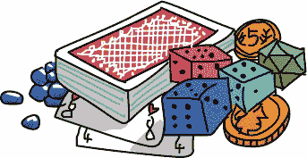

我们可以编程让计算机执行随机行为。Python 有一个叫做`random`的模块，允许我们模拟随机选择。我们可以使用`random`模块在屏幕上绘制随机形状，也可以编程制作机会游戏。让我们从一个猜数字游戏开始。

# 一个猜数字游戏

我们可以在经典的 Hi-Lo 猜数字游戏中使用随机数字。一个玩家选择一个 1 到 10 之间（或 1 到 100 之间）的数字，另一个玩家尝试猜测这个数字。如果猜测太高，猜测者就尝试一个更小的数字。如果猜测太低，他们会尝试一个更大的数字。当他们猜对时，他们就赢了！

我们已经知道如何使用`if`语句比较数字，也知道如何通过`input()`和`while`循环来保持猜测。我们唯一需要学习的新技能是如何生成一个随机数字。我们可以通过`random`模块来实现这一点。

首先，我们必须使用命令`import random`导入`random`模块。你可以在 Python Shell 中输入**`import random`**并按下 ENTER 键来试试。这个模块有几个不同的函数来生成随机数字。我们将使用`randint()`，它是*随机整数*的缩写。`randint()`函数期望我们在它的括号内提供两个参数——也就是两个信息——：我们想要的最低值和最高值。指定括号中的最低值和最高值将告诉`randint()`从什么范围中随机选择。请在 IDLE 中输入以下内容：

```
>>> import random
>>> random.randint(1, 10)
```

Python 将返回一个介于 1 到 10 之间的随机数字，*包括*（这意味着随机数字可以是 1 和 10）。尝试运行`random.randint(1, 10)`命令几次，看看返回的不同数字。（提示：你可以使用 ALT-P，或在 Mac 上使用 CONTROL-P，重复最近输入的行，而无需重新输入整个命令。）

如果你运行那行代码足够多次（至少 10 次），你会注意到数字有时会重复，但从你所见，它们没有任何规律。我们称这些为*伪随机*数，因为它们并不是*真正*随机的（`randint`命令基于复杂的数学模式告诉计算机接下来应该“选择”哪个数字），但它们*看起来*是随机的。

让我们在一个名为*GuessingGame.py*的程序中使用`random`模块。请在新的 IDLE 窗口中键入以下内容，或者从*[`www.nostarch.com/teachkids/`](http://www.nostarch.com/teachkids/)*下载该程序：

## GuessingGame.py

```
➊ import random
➋ the_number = random.randint(1, 10)
➌ guess = int(input("Guess a number between 1 and 10: "))
➍ while guess != the_number:
➎     if guess > the_number:
          print(guess, "was too high. Try again.")
➏     if guess < the_number:
          print(guess, "was too low. Try again.")
➐     guess = int(input("Guess again: "))
➑ print(guess, "was the number! You win!")
```

在➊处，我们导入了`random`模块，它为我们提供了对`random`中所有已定义函数的访问，包括`randint()`。在➋处，我们写下模块名称`random`，后面跟一个点和我们要使用的函数名`randint()`。我们将`1`和`10`作为参数传递给`randint()`，让它生成一个 1 到 10 之间的伪随机数字，并将该数字存储在变量`the_number`中。这将是用户尝试猜测的秘密数字。

在➌处，我们要求用户在 1 到 10 之间猜一个数字，评估这个数字并将其存储在变量`guess`中。我们的游戏循环从➍处的`while`语句开始。我们使用`!=`（不等于）运算符检查猜测是否不等于秘密数字。如果用户第一次猜对了，`guess != the_number`的结果为`False`，那么`while`循环就不会执行。

只要用户的猜测不等于秘密数字，我们会通过两个`if`语句在➎和➏处检查猜测是太高（`guess > the_number`）还是太低（`guess < the_number`），然后打印一条消息要求用户再次猜测。在➐处，我们接受用户的另一个猜测并重新开始循环，直到用户猜对为止。

在➑处，用户已经猜出了数字，所以我们告诉他们这是正确的数字，然后程序结束。有关程序的一些示例运行，请参见图 6-1。

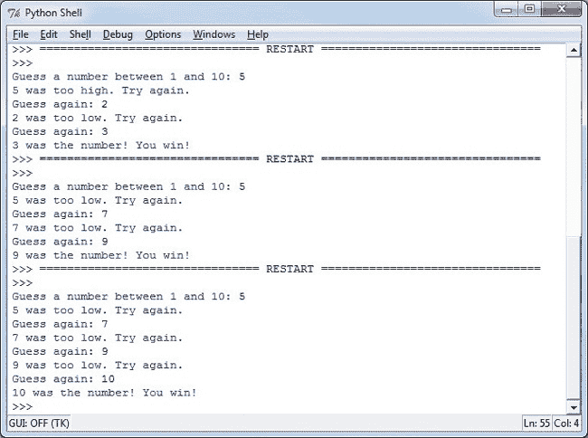

图 6-1. 我们的*GuessingGame.py*程序，要求用户猜测三个随机数字是更大还是更小

在图 6-1 中程序的第一次运行中，用户猜测了 5，计算机回应说 5 太高了。用户猜了 2，结果是太低了。然后用户猜了 3，正好！每次在最低和最高可能数字之间猜测一半的数字，就像图 6-1 中的例子一样，这种策略叫做*二分查找*。

如果玩家学会了使用这个策略，他们每次都可以在四次尝试内猜出 1 到 10 之间的数字！试试看吧！

为了使程序更有趣，你可以改变传递给`randint()`函数的参数，生成 1 到 100 之间的数字，或者更大的数字（记得也要修改`input()`的提示）。你还可以创建一个名为`number_of_tries`的变量，每次用户猜测时将其加 1，以跟踪用户的尝试次数。在程序结束时打印出尝试次数，让用户知道他们表现如何。为了增加额外的挑战，你可以添加一个外循环，在用户猜对数字后询问他们是否想重新开始游戏。自己试试这些，并访问*[`www.nostarch.com/teachkids/`](http://www.nostarch.com/teachkids/)*查看示例解决方案。

# 五彩斑斓的随机螺旋线

`random`模块除了`randint()`之外还有其他有用的函数。让我们使用它们来帮助我们创建一个有趣的视觉效果：屏幕上充满了像图 6-2 那样的随机大小和颜色的螺旋线。

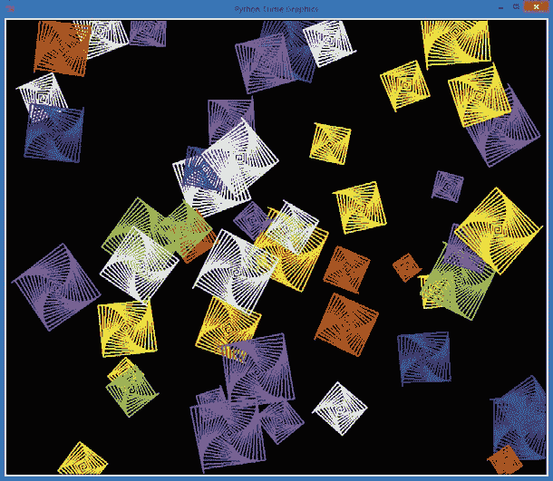

图 6-2. 屏幕上随机位置的随机大小和颜色的螺旋线，来自*RandomSpirals.py*

想想你如何编写一个程序，像创建图 6-2 那样的程序。你几乎*已经掌握*了绘制这些随机螺旋线所需的所有技巧。首先，你可以使用循环绘制不同颜色的螺旋线。你可以生成随机数，并使用其中一个来控制每个螺旋线的`for`循环运行的次数。这会改变它的大小：更多的迭代生成更大的螺旋，而较少的迭代生成较小的螺旋。让我们看看还需要什么，并一步一步构建程序。（最终版本是 RandomSpirals.py。）

## 选择一种颜色，任意颜色

我们需要的一个新工具是选择随机颜色的能力。我们可以使用`random`模块中的另一个方法`random.choice()`来轻松实现这一点。`random.choice()`函数将列表或其他集合作为参数（括号内的部分），并返回该集合中的随机选择元素。在我们的案例中，我们可以创建一个颜色列表，然后将该列表传递给`random.choice()`方法，为每个螺旋图形选择一个随机颜色。

你可以在 IDLE 的命令行窗口中尝试以下操作：

```
>>> # Getting a random color
>>> colors = ["red", "yellow", "blue", "green", "orange", "purple", "white", "gray"]
>>> random.choice(colors)
'orange'
>>> random.choice(colors)
'blue'
>>> random.choice(colors)
'white'
>>> random.choice(colors)
'purple'
>>>
```

在这段代码中，我们创建了我们以前的老朋友`colors`并将其设置为一个颜色名称的列表。然后我们使用`random.choice()`函数，将`colors`作为参数传递给它。该函数会从列表中随机选择一个颜色。第一次，我们得到了橙色，第二次是蓝色，第三次是白色，依此类推。这个函数可以为我们提供一个随机颜色，用来在绘制每个新螺旋图形之前设置我们的乌龟的笔颜色。

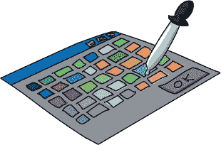

## 获取坐标

另一个剩下的问题是如何让螺旋图形在整个屏幕上展开，包括右上角和左下角。为了将螺旋图形随机放置在乌龟屏幕上，我们需要了解在我们的 Turtle 环境中使用的 x 和 y 坐标系统。

### 笛卡尔坐标

如果你曾经上过几何学课程，你一定见过在图表纸上绘制的(*x*, *y*)坐标，如同图 6-3 所示。这些是*笛卡尔*坐标，得名于法国数学家勒内·笛卡尔，他用一对数字标记网格上的点，这些数字我们称之为*x-坐标*和*y-坐标*。

在图 6-3 中的图表中，深色的横线叫做*x 轴*，它从左到右延伸。深色的竖线叫做*y 轴*，从下到上延伸。我们称这两条线相交的点(0, 0)为*原点*，因为网格上的所有其他点都是以该点为起点，按坐标测量而得的。可以将原点(0, 0)视为你的屏幕的中心。你想找到的每个其他点，都可以通过从原点出发，向左或向右、向下或向上移动来标记其 x 和 y 坐标。

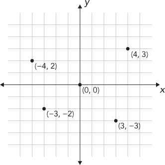

图 6-3. 一个包含四个点及其笛卡尔（x, y）坐标的图表

我们通过将一对坐标放在括号内并用逗号分隔来标记图上的点：（*x*，*y*）。第一个数字 x 坐标告诉我们要向左或向右移动多远，而第二个数字 y 坐标告诉我们要向上或向下移动多远。正的 x 值告诉我们从原点向右移动；负的 x 值告诉我们向左移动。正的 y 值告诉我们从原点向上移动，负的 y 值告诉我们向下移动。

看看图 6-3 中标记的各个点。右上方的点标注了 x 和 y 坐标(4, 3)。为了找到这个点的位置，我们从原点(0, 0)开始，向右移动 4 个单位（因为 x 坐标 4 是正数），然后向上移动 3 个单位（因为 y 坐标 3 是正数）。

要到达右下角的点(3, –3)，我们先回到原点，然后向右移动 3 个单位。由于这次 y 坐标是–3，所以我们向*下*移动 3 个单位。向右移动 3 个单位并向下移动 3 个单位后，我们到达(3, –3)的位置。对于(–4, 2)，我们从原点向*左*移动 4 个单位，再向上移动 2 个单位，最终到达左上方的点。最后，对于(–3, –2)，我们向左移动 3 个单位，再向下移动 2 个单位，最终到达左下方的点。

### 设置随机海龟位置

在海龟图形中，我们可以通过告诉计算机新位置的 x 和 y 坐标，使用`turtle.setpos(x, y)`命令将海龟从原点(0, 0)移动到任何其他位置。函数名`setpos()`是*设置位置*的缩写。它将海龟的位置设置为我们给定的 x 和 y 坐标。例如，`turtle.setpos(10,10)`将把海龟从屏幕中心向右移动 10 个单位并向上移动 10 个单位。

在计算机中，我们通常使用的单位是我们老朋友*像素*。所以`turtle.setpos(10,10)`将把海龟从屏幕中心向右移动 10 个像素并向上移动 10 个像素。由于像素非常小——在大多数显示器上大约是 1/70 英寸（0.3 毫米）或更小——我们可能希望一次移动 100 个像素或更多。`setpos()`可以处理我们给定的任何坐标。

为了将海龟移动到屏幕上的一个随机位置，我们将生成一对随机数字 `x` 和 `y`，然后使用 `turtle.setpos(x,y)` 将海龟移动到这些坐标。但在移动海龟之前，我们需要用 `turtle.penup()` 抬起海龟的笔。在设置新位置后，我们会调用 `turtle.pendown()` 将笔放下，允许海龟再次绘图。如果我们忘记抬起笔，海龟在通过 `setpos()` 移动到指定位置时会绘制一条线。正如你在图 6-2 中看到的那样，我们不希望螺旋之间有额外的线条。我们的代码看起来是这样的：

```
t.penup()
t.setpos(x,y)
t.pendown()
```

`setpos()` 函数结合几个随机数字作为 (*x*, *y*) 坐标，可以让我们把螺旋图形放置在不同的位置，但我们如何知道应该使用什么范围来生成随机数呢？这个问题引出了我们在寻找随机螺旋时必须解决的最后一个问题。

## 我们的画布有多大？

现在我们知道如何将螺旋图形随机放置在窗口或画布的不同位置，但仍然有一个问题：我们如何知道画布的大小呢？我们可以为一个位置生成随机的 x 和 y 坐标，并在该位置绘制一个螺旋，但我们如何确保所选的位置在可视窗口内，而不是位于窗口的右侧、左侧、顶部或底部之外呢？然后，我们如何确保从左到右、从上到下覆盖整个绘图窗口呢？

为了回答有关画布大小的问题，我们需要使用两个额外的函数，`turtle.window_width()` 和 `turtle.window_height()`。首先，`window_width()` 会告诉我们海龟窗口的宽度，单位是像素。同样，`window_height()` 会告诉我们从海龟窗口底部到顶部的像素数。例如，我们的海龟窗口在图 6-2 中宽度为 960 像素，高度为 810 像素。

`turtle.window_width()` 和 `turtle.window_height()` 将帮助我们确定随机的 x 和 y 坐标，但我们还面临一个障碍。记住，在海龟图形中，窗口的中心是原点，即 (0, 0)。如果我们只是生成介于 0 和 `turtle.window_width()` 之间的随机数，第一个问题是我们永远无法在窗口的左下角绘制任何东西：那里坐标在 x 轴和 y 轴上都是负数（向左和向下），但一个介于 0 和 `window_width()` 之间的随机数总是正数。第二个问题是，如果我们从中心开始，向右移动 `window_width()`，我们就会超出窗口的右边界。

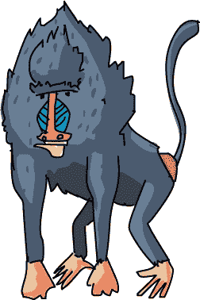

我们不仅需要弄清楚窗口的宽度和高度，还需要了解坐标的范围。例如，如果我们的窗口宽度为 960 像素，并且原点(0, 0)位于窗口的中心，我们需要知道可以向右和向左移动多少像素而不超出可视窗口。因为原点(0, 0)位于窗口的正中间，所以我们只需要将宽度除以二。如果原点位于一个宽度为 960 像素的窗口的中心，那么原点右侧有 480 像素，左侧也有 480 像素。x 坐标的范围将是从–480（从原点向左 480 像素）到+480（从原点向右 480 像素），换句话说，就是从–960/2 到+960/2。

为了使我们的范围适用于任何大小的窗口，我们可以这样写，x 坐标的范围从`-turtle.window_width()//2`到`+turtle.window_width()//2`。我们的原点也位于窗口从上到下的中间，所以原点上方和下方各有`turtle.window_height()//2`像素。我们在这些计算中使用整数除法，即`//`运算符，以确保在除以 2 时得到整数结果；因为窗口的宽度可能是奇数像素，我们希望保持所有像素测量值为整数。

现在我们知道如何计算画布的大小了，我们可以使用这些表达式来限制随机坐标的范围。这样，我们就能确保生成的任何随机坐标都能在我们的窗口中可见。Python 中的`random`模块有一个函数，可以让我们在指定的范围内生成一个随机数：`randrange()`。我们只需要告诉`randrange()`函数，以窗口宽度的一半负值作为范围的起始值，以窗口宽度的一半正值作为范围的结束值（我们需要在程序中导入`turtle`和`random`，才能让这些代码行生效）：

```
x = random.randrange(-turtle.window_width()//2,
                     turtle.window_width()//2)
y = random.randrange(-turtle.window_height()//2,
                     turtle.window_height()//2)
```

这些代码行将使用`randrange()`函数生成一对(*x*, *y*)坐标值，这些坐标始终位于视图窗口内，并覆盖视图窗口的整个区域，从左到右，从下到上。

## 将所有部分整合在一起

现在我们已经有了所有的部分——我们只需要将它们组合在一起，构建一个程序，用于在不同的颜色、大小和位置上绘制随机的螺旋线。以下是我们完成的*RandomSpirals.py*程序；仅用大约 20 行代码，它就能在图 6-2 中创建出类似万花筒的图像。

### RandomSpirals.py

```
  import random
  import turtle
  t = turtle.Pen()
  turtle.bgcolor("black")
  colors = ["red", "yellow", "blue", "green", "orange", "purple",
            "white", "gray"]
  for n in range(50):
      # Generate spirals of random sizes/colors at random locations
➊     t.pencolor(random.choice(colors)) # Pick a random color
➋     size = random.randint(10,40) # Pick a random spiral size
      # Generate a random (x,y) location on the screen
➌     x = random.randrange(-turtle.window_width()//2,
                            turtle.window_width()//2)
➍     y = random.randrange(-turtle.window_height()//2,
                            turtle.window_height()//2)
➎     t.penup()
➏     t.setpos(x,y)
➐     t.pendown()
➑     for m in range(size):
          t.forward(m*2)
          t.left(91)
```

首先，我们导入`random`和`turtle`模块，并设置我们的海龟窗口和颜色列表。在我们的`for`循环中（`n`将从`0`到`49`，总共绘制 50 个螺旋），事情变得有趣起来。在➊处，我们将`colors`传递给`random.choice()`，让这个函数从列表中随机选择一种颜色。然后我们将随机选择的颜色传递给`t.pencolor()`，以将海龟的笔颜色设置为该随机颜色。在➋处，`random.randint(10,40)`从 10 到 40 之间随机选取一个数字。我们将这个数字存储在变量`size`中，并在➑处使用它来告诉 Python 绘制螺旋的线条数。➌和➍处的代码正是我们之前编写的，用来生成一对随机坐标值（*x*，*y*），从而给我们提供一个随机位置，用于在视图窗口中显示螺旋。

在➎处，我们在将海龟移动到新的随机位置之前，先抬起海龟的笔。在➏处，我们通过设置海龟的位置为`x`和`y`，即之前通过`randrange()`选择的随机坐标，来将海龟移动到新位置。现在海龟已到达目标位置，我们在➐处放下笔，这样我们就能看到我们即将绘制的螺旋。在➑处，我们有一个`for`循环来绘制螺旋的每一条线。在`range(size)`中，海龟会前进`m*2`的距离，绘制一段长度为`m*2`的线段（`m`为`0`，`1`，`2`，`3`，以此类推，所以线段的长度分别为 0、2、4、6 等）。然后海龟会向左旋转 91 度，为绘制下一段线段做好准备。

海龟从螺旋的中心开始，绘制一个长度为 0 的线段，然后向左旋转；这就是第一次进入循环。下一次进入时，`m`为`1`，于是海龟绘制一个长度为 2 的线段，然后旋转。随着 Python 在循环中迭代，海龟将从螺旋的中心向外移动，绘制越来越长的线段。我们使用随机生成的`size`，它是一个介于 10 到 40 之间的整数，表示我们在螺旋中绘制的线条数。

在绘制完当前螺旋之后，我们回到外部`for`循环的顶部。我们选择一个新的随机颜色、大小和位置；抬起笔；将海龟移动到新位置；放下笔；然后进入内部`for`循环绘制一个新的随机大小的螺旋。绘制完这个螺旋后，我们返回外部循环并重复整个过程。我们这样做 50 次，最终得到 50 个颜色和形状各异的螺旋，随机分布在屏幕上。

# 石头剪刀布

现在我们已经掌握了编程的技能，可以编写一个游戏：石头剪刀布。两个玩家（或一个玩家和计算机）各自选择三个可能项之一（石头、剪刀或布）；然后双方展示各自的选择；胜者根据三个规则判定：石头压剪刀，剪刀剪布，布包石头。

为了模拟这个游戏，我们将创建一个选择列表（就像我们在 *RandomSpirals.py* 中的 `colors` 列表），然后使用 `random.choice()` 从列表中随机选择三个项目中的一个作为计算机的选择。接着，我们将询问用户的选择，并使用一系列 `if` 语句来确定胜者。用户将与计算机对战！

让我们进入代码吧。在 IDLE 中新建一个窗口，输入 *RockPaperScissors.py*，或者从 *[`www.nostarch.com/teachkids/`](http://www.nostarch.com/teachkids/)* 下载它。

## RockPaperScissors.py

```
➊ import random
➋ choices = ["rock", "paper", "scissors"]
   print("Rock crushes scissors. Scissors cut paper. Paper covers rock.")
➌ player = input("Do you want to be rock, paper, or scissors (or quit)? ")
➍ while player != "quit":                 # Keep playing until the user quits
      player = player.lower()              # Change user entry to lowercase
➎     computer = random.choice(choices)   # Pick one of the items in choices
      print("You chose " +player+ ", and the computer chose " +computer+ ".")
➏     if player == computer:
          print("It's a tie!")
➐     elif player == "rock":
          if computer == "scissors":
              print("You win!")
          else:
              print("Computer wins!")
➑     elif player == "paper":
          if computer == "rock":
              print("You win!")
          else:
              print("Computer wins!")
➒     elif player == "scissors":
          if computer == "paper":
              print("You win!")
          else:
              print("Computer wins!")
      else:
          print("I think there was some sort of error...")
      print()                              # Skip a line
➓     player = input("Do you want to be rock, paper, or scissors (or quit)? ")
```

在 ➊，我们导入 `random` 模块，以便访问帮助我们做出随机选择的函数。在 ➋，我们设置包含三项（石头、纸和剪刀）的列表，并将其命名为 `choices`。我们打印游戏的简单规则，确保用户了解它们。在 ➌，我们提示用户输入他们的选择：`rock`、`paper`、`scissors` 或 `quit`，并将他们的选择存储在变量 `player` 中。在 ➍，我们通过检查用户是否在输入提示中选择了 `quit` 来开始游戏循环；如果选择了，游戏结束。

只要用户没有输入 `quit`，游戏就开始了。在将玩家输入转换为小写以便在我们的 `if` 语句中进行比较后，我们让计算机选择一个项目。在 ➎，我们让计算机从列表 `choices` 中随机选择一个项目，并将该项目存储在变量 `computer` 中。计算机的选择存储后，就可以开始测试谁赢了。在 ➏，我们检查玩家和计算机是否选择了相同的项目；如果是这样，我们告诉用户结果是平局。否则，我们在 ➐ 检查用户是否选择了 `rock`。在 ➐ 的 `elif` 语句中，我们嵌套一个 `if` 语句来检查计算机是否选择了 `scissors`。如果玩家选择了石头，而计算机选择了剪刀，那么石头砸剪刀，玩家获胜！如果不是石头对石头，并且计算机没有选择剪刀，那么计算机一定选择了纸，并且我们会打印出计算机获胜。

在剩下的两个 `elif` 语句中，➑ 和 ➒，我们做相同的测试，以检查玩家选择纸或剪刀时谁获胜。如果这些语句都不成立，我们会告诉用户他们输入了一个无法识别的选项：要么是选择的项目不存在，要么是他们拼写错误。最后，在 ➓，我们让用户输入下一个选择，然后重新开始游戏循环（即新的一轮）。请参见 图 6-4，了解程序的示例运行。

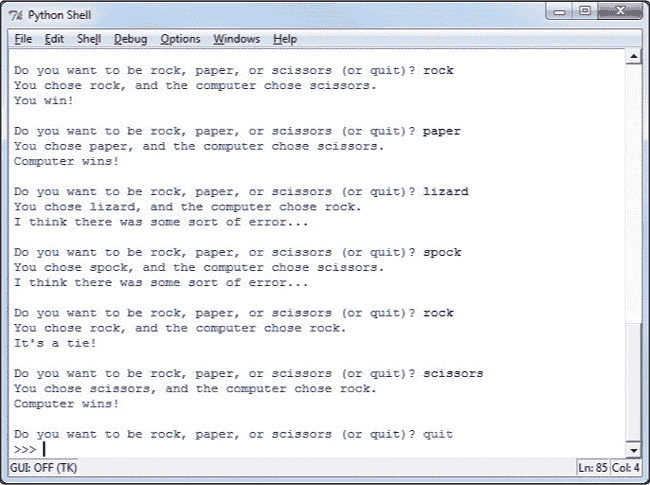

图 6-4。感谢计算机的随机选择，*RockPaperScissors.py* 是一款有趣的游戏！

有时用户获胜，有时计算机获胜，有时则是平局。由于结果具有一定的随机性，游戏足够有趣，可以用来打发一些时间。现在我们对两人对战的游戏如何利用计算机的随机选择有了初步的了解，接下来让我们尝试创建一个扑克牌游戏。

# 选一张牌，任意一张牌

让扑克牌游戏有趣的一件事就是随机性。每一轮的结果都不完全相同（除非你洗牌技术差），所以你可以一遍又一遍地玩，而不会觉得无聊。

我们可以用我们学到的技能编写一个简单的扑克牌游戏。我们第一次尝试时不会显示图形牌面（我们需要学更多技巧才能实现），但我们可以通过使用一个*数组*，或字符串列表，像在螺旋程序中使用颜色名称一样，生成一个随机的卡牌名称（比如“二点红心”或“黑桃国王”）。我们可以编写一个像“战争”游戏的程序，在游戏中两名玩家各自从牌组中抽一张随机卡牌，拥有更大卡牌的一方获胜；我们只需要找到一种方法来比较卡牌大小。让我们一步一步看看这个过程是如何工作的。（最终的程序是 HighCard.py。）

## 堆叠牌组

首先，我们需要考虑如何在程序中构建一个虚拟的牌组。正如我之前提到的，我们暂时不会绘制牌面，但至少需要卡牌的名称来模拟牌组。幸运的是，卡牌名称只是字符串（`"二点红心"`, `"黑桃国王"`），而且我们知道如何构建字符串数组——从第一章开始，我们就已经用颜色名称做过类似的事情了！

*数组*是一个有序的或编号的相似事物的集合。在许多编程语言中，数组是一种特殊类型的集合。然而，在 Python 中，列表可以像数组一样使用。在本节中，我们将看到如何将列表当作数组来处理，逐个访问数组中的元素。

我们可以通过创建一个数组名称（`cards`），并将其设置为包含所有 52 张卡牌名称的列表，来构建一个包含所有卡牌名称的列表：

```
cards = ["two of diamonds",
         "three of diamonds",
         "four of diamonds",
         # This is going to take forever...
```

但哎呀——我们得输入 52 个长字符串的卡牌名称！在我们甚至开始编写游戏部分之前，代码就已经有 52 行了，而且我们会因为输入太多而感到疲惫，甚至没力气玩游戏。肯定有更好的方法。让我们像程序员一样思考！这些输入是重复的，我们想让计算机来做这些重复的工作。花色名称（*方块*, *红心*, *梅花*, *黑桃*）每个会重复 13 次，因为每个花色有 13 张卡牌。面值（*二点*到*王牌*）每个会重复 4 次，因为有 4 种花色。更糟的是，我们还要输入 52 次*of*这个词！

当我们之前遇到重复时，我们使用了循环来简化问题。如果我们想生成整个卡牌堆，循环会做得很好。但我们并不需要整个卡牌堆来玩一局战争游戏：我们只需要两张卡牌，计算机的卡牌和玩家的卡牌。如果循环不能帮助我们避免重复所有这些花色和面值，我们需要进一步拆解问题。

在战争游戏中，每个玩家出一张卡牌，较高的卡牌获胜。所以，正如我们讨论过的，我们只需要两张卡牌，而不是 52 张。让我们从一张卡牌开始。卡牌名称由一个面值（从二到 A）和一个花色名称（从梅花到黑桃）组成。这些看起来非常适合用作字符串列表：一个列表存储面值，一个列表存储花色。我们不再使用包含 52 个重复条目的列表来表示每一张卡牌，而是从 13 个可能的面值中随机选择一个面值，然后从 4 个可能的花色中随机选择一个花色。这个方法应该能帮助我们生成卡牌堆中的任何一张卡。

我们将之前的长数组`cards`替换成了两个更短的数组，`suits`和`faces`：

```
suits = ["clubs", "diamonds", "hearts", "spades"]
faces = ["two", "three", "four", "five", "six", "seven", "eight", "nine",
         "ten", "jack", "queen", "king", "ace"]
```

我们把 52 行代码减少到了大约 3 行！这真是聪明的编程。现在让我们来看如何使用这两个数组发牌。

## 发牌

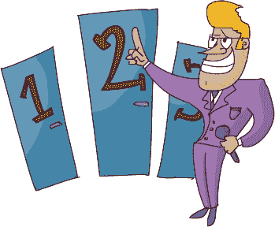

我们已经知道如何使用`random.choice()`函数从列表中随机选择一个项目。所以要发牌，我们只需使用`random.choice()`从花色列表中随机选取一个面值，并从套牌列表中随机选取一个花色。一旦我们有了随机的面值和花色，完成卡片名称的唯一操作就是在它们之间加上*of*这个词（例如，*two of diamonds*）。

请注意，使用`random.choice()`这种方式，我们可能会连续发出相同的卡牌。我们没有强制程序检查卡牌是否已经发出，所以你可能会连续两次发到黑桃 A。例如，计算机并没有作弊；我们只是没有告诉它只能从一副牌中发牌。这就像程序从一个*无限的牌堆*中发牌一样，它可以永远发下去而不会用完。

```
import random
suits = ["clubs", "diamonds", "hearts", "spades"]
faces = ["two", "three", "four", "five", "six", "seven", "eight", "nine",
         "ten", "jack", "queen", "king", "ace"]
my_face = random.choice(faces)
my_suit = random.choice(suits)
print("I have the", my_face, "of", my_suit)
```

如果你尝试运行这段代码，每次都会得到一张新的随机卡牌。要发第二张卡牌，你可以使用类似的代码，但你会把随机选出的值存储在名为`your_face`和`your_suit`的变量中。你需要修改`print`语句，以便打印这张新卡的名称。现在，我们离战争游戏的实现更近了一步，但我们还需要一种方法来比较计算机的卡和玩家的卡，看看谁赢了。

## 计数卡牌

我们将面牌值按升序排列的原因，从二到王牌，是希望卡牌的`faces`列表按从低到高的顺序排列，以便我们能相互比较卡牌，看看任意一对卡牌中哪一张的值更高。确定两张卡牌中哪一张更高很重要，因为在战争游戏中，较高的卡牌获胜。

### 在列表中查找项目

幸运的是，由于 Python 中列表和数组的工作方式，我们可以确定一个值在列表中出现的位置，并且可以利用这个信息来判断一张牌是否比另一张大。列表或数组中一个项的位置编号称为该项的*索引*。我们通常通过索引来引用数组中的每一项。

要查看 `suits` 数组及每个花色的索引的可视化表示，请参见 表 6-1。

表 6-1. `suits` 数组

| **值** | `"clubs"` | `"diamonds"` | `"hearts"` | `"spades"` |
| --- | --- | --- | --- | --- |
| *索引* | `0` | `1` | `2` | `3` |

当我们创建列表 `suits` 时，Python 会自动为列表中的每个值分配一个索引。计算机从零开始计数，因此 `"clubs"` 的索引是 `0`，`"diamonds"` 的索引是 `1`，以此类推。查找列表中某个项的索引的函数是 `.index()`，它可以用于 Python 中的任何列表或数组。

要查找花色名称 `"clubs"` 在列表 `suits` 中的索引，我们调用函数 `suits.index("clubs")`。就像我们在询问 `suits` 数组哪个索引对应于值 `"clubs"`。让我们在 Python shell 中试试这个操作。输入以下行：

```
>>> suits = ["clubs", "diamonds", "hearts", "spades"]
>>> suits.index("clubs")
0
>>> suits.index("spades")
3
>>>
```

在我们创建了花色值的数组 `suits` 后，我们向 Python 询问值 `"clubs"` 的索引是什么，它会返回正确的索引 `0`。同样，`"spades"` 的索引是 `3`，而 `"diamonds"` 和 `"hearts"` 分别位于索引 `1` 和 `2`。

### 哪张牌更大？

我们创建了一个从 `two` 到 `ace` 的 `faces` 数组，因此值 `two`（即 `faces` 中的第一个项）会得到索引 `0`，直到 `ace` 位于索引 `12`（从 0 开始的第 13 个位置）。我们可以通过索引来判断哪张牌的值更大——换句话说，哪个面值的索引更大。我们最小的牌是 `two`，它的索引是最小的 `0`；最大的牌是 `ace`，它的索引是最大的 `12`。

如果我们生成两个随机的面牌值（`my_face` 和 `your_face`），我们可以比较 `my_face` 的索引与 `your_face` 的索引，看看哪张牌更大，如下所示。

```
import random
faces = ["two", "three", "four", "five", "six", "seven", "eight", "nine",
         "ten", "jack", "queen", "king", "ace"]
my_face = random.choice(faces)
your_face = random.choice(faces)
if faces.index(my_face) > faces.index(your_face):
    print("I win!")
elif faces.index(my_face) < faces.index(your_face):
    print("You win!")
```

我们使用`random.choice()`两次，从`faces`数组中抽取两个随机值，然后将这些值存储在`my_face`和`your_face`中。我们使用`faces.index(my_face)`来查找`my_face`在`faces`中的索引，使用`faces.index(your_face)`来获取`your_face`的索引。如果`my_face`的索引较大，那么我的卡牌面值较高，程序会输出`我赢了！`。否则，如果`my_face`的索引低于`your_face`的索引，那么你的卡牌面值较高，程序会输出`你赢了！`。由于我们按顺序排列了列表，更高的卡牌总是对应较高的索引。有了这个方便的工具，我们几乎拥有了构建“高牌”游戏（如战争游戏）所需的一切。（我们还没有加入检测平局的功能，但我们会在完整程序整合部分添加这个功能。）

## 让游戏继续进行

我们需要的最终工具是一个循环，让用户可以继续玩游戏，直到他们愿意为止。我们将稍微不同地构建这个循环，以便能够在其他游戏中重用它。

首先，我们需要决定使用哪种类型的循环。记住，`for`循环通常意味着我们确切知道我们想要做某件事的次数。因为我们无法总是预测玩家会玩多少次游戏，所以`for`循环不适合我们的需求。`while`循环可以一直执行，直到某个条件为假——例如，当用户按下某个键以结束程序时。`while`循环将是我们游戏循环的选择。

`while`循环需要一个条件来检查，因此我们将创建一个变量，作为我们的*标志*，即结束程序的信号。我们将这个标志变量命名为`keep_going`，并将其初始值设置为`True`：

```
keep_going = True
```

由于我们开始时将`keep_going = True`，程序将至少进入一次循环。

接下来，我们会问用户是否想继续玩游戏。为了让用户不必每次都输入`Y`或`yes`，我们可以通过让他们按 ENTER 键来简化操作。

```
answer = input("Hit [Enter] to keep going, any other keys to exit: ")
if answer == "":
    keep_going = True
else:
    keep_going = False
```

在这里，我们将变量`answer`设置为一个输入函数。然后，我们使用`if`语句检查`answer == ""`，以判断用户是否仅按了 ENTER 键，还是在按 ENTER 键之前按了其他键。（空字符串`""`告诉我们用户在按 ENTER 之前没有输入其他字符。）如果用户想退出，他们只需让`answer`等于空字符串以外的任何值`""`。换句话说，他们只需要在按 ENTER 键之前按下任意键，布尔表达式`answer == ""`将评估为`False`。

我们的`if`语句检查`answer == ""`是否为`True`，如果是，它会将`True`存储在我们的标志变量`keep_going`中。但你注意到有些重复吗？如果`answer == ""`为`True`，我们将值`True`赋给`keep_going`；如果`answer == ""`评估为`False`，我们需要将值`False`赋给`keep_going`。

如果我们直接将`keep_going`设置为`answer == ""`的结果，那会更简单。我们可以用下面的更简洁的代码替换我们的代码：

```
answer = input("Hit [Enter] to keep going, any other keys to exit: ")
keep_going = (answer == "")
```

第一行没有变化。第二行将`keep_going`设置为布尔表达式`answer == ""`的结果。如果结果是`True`，则`keep_going`将为`True`，我们的循环将继续。如果结果是`False`，则`keep_going`将为`False`，我们的循环将结束。

让我们看一下整个循环：

```
keep_going = True
while keep_going:
    answer = input("Hit [Enter] to keep going, any key to exit: ")
    keep_going = (answer == "")
```

在这里，我们加入了`while`语句，因此只要`keep_going`的值为`True`，我们的循环就会继续。在最终的程序中，我们将“包裹”这个`while`循环，用来执行一次完整的游戏回合。我们通过将`while`语句放在选择卡片的代码前面，并在宣布谁赢之后放置提示信息来实现这一点。记得缩进循环中的代码！

## 将所有部分整合在一起

将所有这些组件组合在一起，我们可以构建一个类似于战争游戏的游戏，我们将其命名为*HighCard.py*。计算机会为自己和玩家各抽一张牌，检查哪张牌更大，并宣布胜者。输入*HighCard.py*的代码到一个新的 IDLE 窗口中，或访问*[`www.nostarch.com/teachkids/`](http://www.nostarch.com/teachkids/)*下载并开始游戏。

### HighCard.py

```
import random
suits = ["clubs", "diamonds", "hearts", "spades"]
faces = ["two", "three", "four", "five", "six", "seven", "eight", "nine",
         "ten", "jack", "queen", "king", "ace"]
keep_going = True
while keep_going: my_face = random.choice(faces)
    my_suit = random.choice(suits)
    your_face = random.choice(faces)
    your_suit = random.choice(suits)
    print("I have the", my_face, "of", my_suit)
    print("You have the", your_face, "of", your_suit)
    if faces.index(my_face) > faces.index(your_face):
        print("I win!")
    elif faces.index(my_face) < faces.index(your_face):
        print("You win!")
    else:
        print("It's a tie!")
    answer = input("Hit [Enter] to keep going, any key to exit: ")
    keep_going = (answer == "")
```

运行游戏，它将打印出计算机的卡片和你的卡片，接着宣布谁赢了，并提示你选择是继续玩还是退出。玩几轮后，你会注意到卡片的随机性足以让游戏结果变得有趣——有时计算机赢，有时你赢，但因为有了随机性，游戏充满了乐趣。

# 掷骰子：创建一个 Yahtzee 风格的游戏

在我们的纸牌游戏中，我们使用了数组来简化发牌所需的代码，并根据纸牌在卡片列表中的位置来测试哪张卡片更高。在这一部分中，我们将使用数组的概念来生成五个随机的骰子，并检查我们是否掷出了三同号、四同号或五同号，类似于简化版的骰子游戏 Yahtzee。

在 Yahtzee 中，你有五个骰子。每个骰子有六个面，每个面上显示从一到六的点数。在完整的游戏中，玩家掷出所有五个骰子，试图通过掷出三个相同的点数（我们称之为*三同号*）以及其他各种“组合”，类似于扑克牌游戏。在我们的简化版中，如果五个骰子都掷出相同的点数（比如全部是六点面朝上），那就叫做 Yahtzee，得分是可能的最高分。在我们简化的游戏中，我们只会模拟五个骰子的掷骰，并检查用户是否掷出了三同号、四同号或 Yahtzee，并告知他们结果。

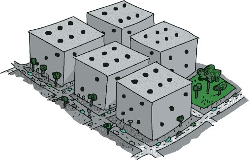

## 设置游戏

现在我们已经理解了游戏的目标，让我们来讨论如何编写这个游戏。首先，我们需要设置一个游戏循环，让用户可以一直掷骰子，直到他们想退出。其次，我们需要设置一个五个模拟骰子的手牌数组，该数组可以存储五个随机值，从 1 到 6，表示每个骰子的点数。第三，我们将通过为数组中的五个位置赋予从 1 到 6 的随机值来模拟掷骰子。最后，我们需要将五个掷出的骰子彼此比较，看看是否有三个、四个或五个相同的值，并告诉用户结果。

最后这一部分可能是最具挑战性的。我们可以通过检查是否所有五个骰子的值都为 1，或者是否所有五个骰子的值都为 2，以此类推来检查是否有一个 Yahtzee，但这将意味着需要一长串复杂的 `if` 条件。由于我们并不关心是否是五个 1、五个 2 还是五个 6——我们只关心是否有五个相同的骰子——我们可以通过检查第一个骰子的值是否等于第二个骰子的值，第二个骰子的值是否等于第三个骰子的值，一直到第五个骰子，来简化这一过程。这样，无论五个相同的骰子是什么值，我们都知道所有五个骰子都是一样的，我们就有了 Yahtzee。

五个相同的值似乎很容易测试，但让我们试着找出如何测试四个相同的值。四个相同的手牌可能是像 `[1, 1, 1, 1, 2]` 这样的数组（这里我们掷出了四个 1 和一个 2）。然而，数组 `[2, 1, 1, 1, 1]` 也是一个四个相同的手牌，里面有四个 1，数组 `[1, 1, 2, 1, 1]`、`[1, 2, 1, 1, 1]` 和 `[1, 1, 1, 2, 1]` 也是如此。这就有五种可能的配置来测试是否有四个 1！这听起来需要一长串复杂的 `if` 条件……

幸运的是，作为一名熟练的程序员，你知道通常有更简单的方法来做这件事。前一段中的五个数组共有一个特点：在值的列表中有四个 1；问题在于第五个值，2，可能位于五个不同的数组位置中的任何一个。如果这四个 1 能并排在一起，其他值（2）则单独放置，我们可以更轻松地测试是否有四个相同的值。例如，如果我们能按从低到高或从高到低的顺序对数组进行排序，所有的 1 将被分到一起，从而将五种不同的情况减少为仅两种：[1, 1, 1, 1, 2] 或 [2, 1, 1, 1, 1]。

## 投掷骰子

在 Python 中，列表、集合和数组有一个内置的排序函数`sort()`，允许我们按从小到大的顺序或反向排序数组中的元素。例如，如果我们的骰子数组叫做`dice`，我们可以通过`dice.sort()`来排序这些值。默认情况下，`sort()`会按从小到大的顺序，或按*升序*排列`dice`中的元素。

在我们测试数组是否包含四个相同的骰子时，排序数组意味着我们只需要测试两种情况：四个低值相同和一个高值（如`[1, 1, 1, 1, 2]`），或者一个低值和四个高值相同（如`[1, 3, 3, 3, 3]`）。在第一种情况下，我们知道如果骰子已经排序，并且第一和第四个骰子值相同，那么我们就得到了四个相同的骰子或更好的组合。在第二种情况下，同样是排序后的骰子，如果第二个和第五个骰子值相同，那么我们也得到了四个相同的骰子或更好的组合。

我们说四个相同的骰子*或更好*，因为在五个相同的骰子中，第一和第四个骰子也相同。这就引出了我们的第一个逻辑挑战：如果用户投出了五个相同的骰子，那么他们也投出了四个相同的骰子，我们只希望为他们计算更高的分数。我们将使用`if-elif`链来处理这个问题，这样如果用户投出了雅兹（Yahtzee），他们就不会同时得到四个相同和三个相同的骰子；只有最高的组合会获胜。将这个`if-elif`序列与我们关于排序骰子检查四个相同的知识结合起来，代码应该如下所示：

```
if dice[0] == dice[4]:
    print("Yahtzee!")
elif (dice[0] == dice[3]) or (dice[1] == dice[4]):
    print("Four of a kind!")
```

首先，如果我们已经对骰子数组进行了排序，我们可以发现一个快捷方式：如果第一个和最后一个骰子值相同（`if dice[0] == dice[4]`），那么我们就知道我们有一个“雅兹（Yahtzee）！”记住，我们的数组位置是从 0 到 4，分别代表第一到第五个骰子。如果我们没有五个相同的骰子，我们会检查两种四个相同的情况（前四个骰子相同，`dice[0] == dice[3]`，或者后四个骰子相同，`dice[1] == dice[4]`）。我们在这里使用布尔操作符`or`来判断四个相同的骰子是否存在，如果*任意*一种情况评估为`True`（前四个*或*后四个）。

## 测试骰子

我们通过索引或位置来引用数组中的每个骰子：`dice[0]`表示骰子数组中的第一个元素，`dice[4]`表示第五个元素，因为我们从零开始计数。这是我们检查任何一个骰子值的方法，或者将它们彼此比较。就像在我们之前的`suits[]`数组中一样，在表 6-1 中，每个`dice[]`数组中的条目都是一个单独的值。当我们调用`dice[0]`来检查它是否等于`dice[3]`时，我们是在查看第一个`dice`元素的值，并将其与第四个`dice`元素的值进行比较。如果数组已排序，并且这两个值相同，那么我们就得到了四个相同的骰子。

为了测试三张相同的骰子，我们添加另一个`elif`语句，并将三张相同的骰子测试放在四张相同的骰子测试之后，这样只有在没有五张相同和四张相同的情况下，才会测试三张相同的骰子；我们希望报告最高的组合。如果我们使用排序后的骰子，三张相同的骰子有三种可能的情况：前面三张骰子相同，中间三张骰子相同，或者最后三张骰子相同。在代码中，应该是：

```
elif (dice[0] == dice[2]) or (dice[1] == dice[3]) or (dice[2] == dice[4]):
    print("Three of a kind")
```

现在我们可以在骰子游戏中测试各种获胜组合，让我们添加游戏循环和`dice`数组。

## 将一切整合在一起

这是完整的*FiveDice.py*程序。可以在新窗口中输入代码或从*[`www.nostarch.com/teachkids/`](http://www.nostarch.com/teachkids/)*下载它。

### FiveDice.py

```
  import random
  # Game loop
  keep_going = True
  while keep_going:
      # "Roll" five random dice
➊     dice = [0,0,0,0,0]           # Set up an array for five values dice[0]-dice[4]
➋     for i in range(5):           # "Roll" a random number from 1-6 for all 5 dice
➌         dice[i] = random.randint(1,6)
➍     print("You rolled:", dice)   # Print out the dice values
      # Sort them
➎     dice.sort()
      # Check for five of a kind, four of a kind, three of a kind
      # Yahtzee - all five dice are the same
      if dice[0] == dice[4]:
          print("Yahtzee!")
      # FourOfAKind - first four are the same, or last four are the same
      elif (dice[0] == dice[3]) or (dice[1] == dice[4]):
          print("Four of a kind!")
      # ThreeOfAKind - first three, middle three, or last three are the same
      elif (dice[0] == dice[2]) or (dice[1] == dice[3]) or (dice[2] == dice[4]):
          print("Three of a kind")
      keep_going = (input("Hit [Enter] to keep going, any key to exit: ") == "")
```

在我们导入`random`模块并通过`while`语句开始游戏循环之后，接下来的几行代码值得稍作解释。在 ➊ 处，我们设置了一个名为`dice`的数组，包含五个值，并将这些值初始化为零。方括号`[`和`]`与我们在本章前面用于列出颜色、卡片面值和花色名称时所使用的方括号相同。在 ➋ 处，我们设置了一个`for`循环，循环五次，针对五个骰子，使用从 0 到 4 的范围；这些将是五个骰子的数组位置或索引号。

在 ➌ 处，我们将每个单独的骰子，从`dice[0]`到`dice[4]`，设为一个从 1 到 6 的随机整数，表示我们的五个骰子及其随机掷出的值。在 ➍ 处，我们通过打印`dice`数组的内容来展示玩家掷出的骰子；此`print`语句的结果显示在图 6-5 中。

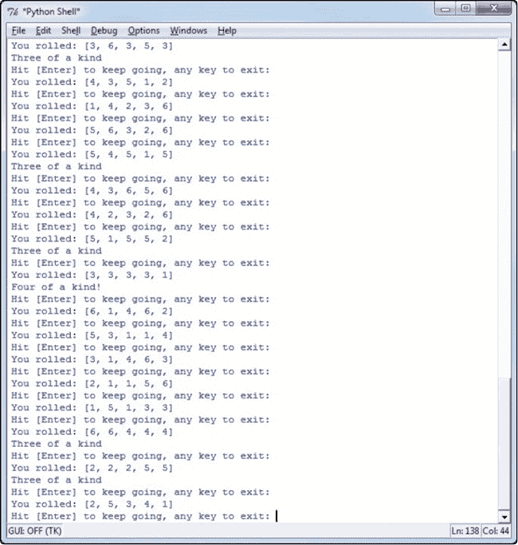

图 6-5. 我们骰子程序的示例运行。注意，我们掷出了几个三相同和一个四相同。

在 ➎ 处，我们对`dice`数组调用`.sort()`函数。通过将掷出的骰子值从小到大排序并将相同的值分组，这使得测试各种手牌变得简单——比如五个相同、四个相同，等等。所以，例如，如果我们掷出了`[3, 6, 3, 5, 3]`，`dice.sort()`函数会将其转为`[3, 3, 3, 5, 6]`。`if`语句检查第一个值是否等于第五个值；在这种情况下，由于第一个和第五个值（`3`和`6`）不相等，我们知道并非所有的骰子都落在相同的值上，所以它不是五个相同。第一个`elif`通过比较第一个和第四个值（`3`和`5`）以及第二个和第五个值（`3`和`6`）来检查四个相同；同样，这里没有匹配项，所以它不是四个相同。第二个`elif`检查三个相同；由于第一个和第三个值`3`和`3`相等，我们知道前三个值相等。我们通知玩家他们得到了三个相同，并提示他们根据是否继续玩游戏或退出游戏按下相应的键，如图 6-5 所示。

运行程序并按几次 ENTER 键查看你掷出的骰子结果。

你会注意到，你经常会掷出三张相同的点数，大约每五到六次掷骰子就能出现一次。四个相同点数则更为罕见，大约每 50 次掷骰子才会出现一次。在图 6-5 中，我们只在屏幕满是尝试的情况下掷出了四张相同的点数。雅兹更为罕见：你可能需要掷几百次才会得到雅兹，但由于随机数生成器的存在，你也许在前几次尝试时就能掷出雅兹。尽管它没有真正的游戏复杂，但我们简化版的雅兹依然足够有趣，因为它具有随机性。

我们已经看到，随机性如何通过为掷骰子、扑克牌游戏、剪刀石头布、猜谜游戏等增加运气元素，来让游戏变得有趣和好玩。我们也喜欢通过使用随机数生成器在屏幕上布置五光十色的螺旋，创造出万花筒般的图形。在接下来的章节中，我们将结合你学到的随机数、循环和一些几何知识，将随机螺旋程序转变为一个真正的虚拟万花筒，每次运行都会生成一组不同的反射图像！


计算雅兹的概率

如果你对雅兹背后的数学原理感兴趣，以及为什么五个相同点数这么罕见，下面是一个简要的解释。首先，有五颗骰子，每颗骰子有六个面，因此所有可能的组合数量是 6 × 6 × 6 × 6 × 6 = 6⁵ = 7,776。也就是说，掷出五颗正常六面骰子的方式一共有 7,776 种。要计算掷出五个相同点数（五个相同点数的概率），我们需要找出有多少种可能的雅兹：五个 1、五个 2，依此类推，直到五个 6。因此，我们可以掷出六种不同的五个相同点数的雅兹。将 6 种雅兹除以 7,776 种可能的结果，你就得到了掷出五个相同点数的概率：6/7,776，或者 1/1,296。

没错：你在一次掷骰子中掷出五个相同点数的概率只有 1/1,296。所以，如果你掷了很久才得到第一次五个相同的点数，不要灰心。平均来说，你大约每 1,300 次掷骰子能得到一次五个相同的点数。难怪“雅兹”会给 50 分！

# 万花筒

来自图 6-2 的随机螺旋色彩图形有点像万花筒。为了让它看起来更像真正的万花筒，我们来加入一个我们螺旋程序缺失的重要特性：反射。

在万花筒中，是镜子的定位使随机的颜色和形状变成一个美丽的图案。在这个结尾的示例中，我们将通过修改我们的 *RandomSpiral.py* 程序，将螺旋图案在屏幕上“反射”四次，从而模仿镜面效果。

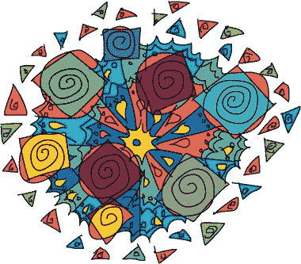

为了理解如何实现这种镜面效果，我们需要更详细地讨论笛卡尔坐标系。让我们看一下四个点：(4, 2)，(–4, 2)，(–4, –2)，(4, –2)，如图 6-6 开始")所示。

比较 (4, 2) 和 (–4, 2)，这两点位于顶部。如果竖直的 y 轴是镜子，那么这两点将是彼此的镜像；我们称 (4, 2) 为 (–4, 2) 关于 y 轴的反射。类似的情况发生在 (4, 2) 和 (4, –2) 之间，这两点位于右侧，但以水平的 x 轴作为假想的镜子：(4, –2) 是 (4, 2) 关于 x 轴的反射。

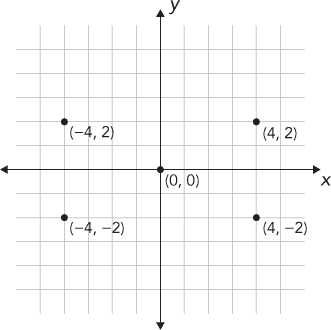

图 6-6. 四个关于 x 和 y 轴对称的点，从 (4, 2) 开始

如果你查看图 6-6 开始")中的每一对 (*x*, *y*) 坐标，你会注意到一些事情：所有四个 (*x*, *y*) 坐标都使用相同的数字，4 和 2，只是符号不同，+ 或 –，这取决于它们的位置。我们可以通过改变两个坐标的符号来创建任何四个关于 x 轴和 y 轴对称的点，方式如下：(*x*, *y*)，(*–x*, *y*)，(*–x*, *–y*)，(*x*, *–y*)。如果你愿意，可以尝试在一张坐标纸上绘制这些点，选择任意一对 (*x*, *y*) 坐标。例如，尝试 (2, 3)：(2, 3)，(–2, 3)，(–2, –3)，(2, –3) 是四个关于 x 轴上下、y 轴两侧对称的点。

有了这些知识，我们可以按照以下方式构建万花筒程序的框架：

1.  在屏幕右上角选择一个随机位置 (*x*, *y*) 并在该位置绘制一个螺旋图案。

1.  在屏幕左上角的 (*–x*, *y*) 位置绘制相同的螺旋图案。

1.  在屏幕左下角的 (*–x*, *–y*) 位置绘制相同的螺旋图案。

1.  在屏幕右下角的 (*x*, *–y*) 位置绘制相同的螺旋图案。

如果我们一遍又一遍地重复这些步骤，就能获得一个美丽的万花筒效果，配合我们的随机螺旋图案。

让我们通过完整的 *Kaleidoscope.py* 代码一步步演示，并看到这一效果的实现。

## Kaleidoscope.py

```
   import random
   import turtle
   t = turtle.Pen()
➊ t.speed(0)
   turtle.bgcolor("black")
   colors = ["red", "yellow", "blue", "green", "orange", "purple", "white", "gray"]
   for n in range(50):
       # Generate spirals of random sizes/colors at random locations on the screen
       t.pencolor(random.choice(colors)) # Pick a random color from colors[]
       size = random.randint(10,40) # Pick a random spiral size from 10 to 40
       # Generate a random (x,y) location on the screen
➋     x = random.randrange(0,turtle.window_width()//2)
➌     y = random.randrange(0,turtle.window_height()//2)
      # First spiral
      t.penup()
➍    t.setpos(x,y)
      t.pendown()
      for m in range(size):
          t.forward(m*2)
          t.left(91)
      # Second spiral
      t.penup()
➎    t.setpos(-x,y)
      t.pendown()
      for m in range(size):
          t.forward(m*2)
          t.left(91)
      # Third spiral
      t.penup()
➏    t.setpos(-x,-y)
      t.pendown()
      for m in range(size):
          t.forward(m*2)
          t.left(91)
      # Fourth spiral
      t.penup()
➐    t.setpos(x,-y)
      t.pendown()
      for m in range(size):
          t.forward(m*2)
          t.left(91)
```

我们的程序如常导入了` turtle`和`random`模块，但在➊处我们做了一些新的事情：我们通过`t.speed(0)`将海龟的速度设置为最快值。海龟图形中的`speed()`函数的参数范围从 0 到 10，其中`1`是慢动画设置，`10`是快动画设置，`0`表示没有动画（以最快速度绘制）。这是一个从 1 到 10 再到 0 的奇怪刻度，但只要记住，如果你想要最快的海龟，只需将速度设置为`0`。你会注意到，当你运行程序时，螺旋几乎是瞬间出现的。如果你想让海龟更快地移动，你可以对我们之前的绘图程序做相同的修改。

我们的`for`循环看起来和我们在*RandomSpirals.py*程序中使用的完全一样，直到到达➋和➌。在➋处，我们将随机数的横坐标范围缩小了一半，仅限于正的 x 坐标值（屏幕的右侧，从`x = 0`到`x = turtle.window_width()//2`），在➌处，我们将纵坐标范围限制为屏幕的上半部分，从`y = 0`到`y = turtle.window_height()//2`。记住，我们使用`//`运算符进行整数除法，以保持像素度量为整数。

这两行代码每次都会给我们一个随机的(*x*, *y*)坐标对，位于屏幕的右上角。在➋，我们将海龟画笔的位置设置到该点，然后立即通过`for`循环绘制第一个螺旋。接着，我们像在图 6-6")中做的那样，改变每个坐标值的符号，来创建该点的三个反射：左上角(*–x*, *y*)在➎，左下角(*–x*, *–y*)在➏，右下角(*x*, *–y*)在➐。请参见图 6-7，了解*Kaleidoscope.py*能够生成的图案示例。

你可以通过查看屏幕其他三个角落来找到每个螺旋的三个反射。这些不是严格的镜像：我们并不是从相同的角度开始每个螺旋，且在反射的螺旋中我们不会向右转，而在原始螺旋中我们也不会向左转。然而，如果你愿意，可以对程序进行调整。有关如何让这个万花筒程序更酷的想法，请参考本章的编程挑战部分。

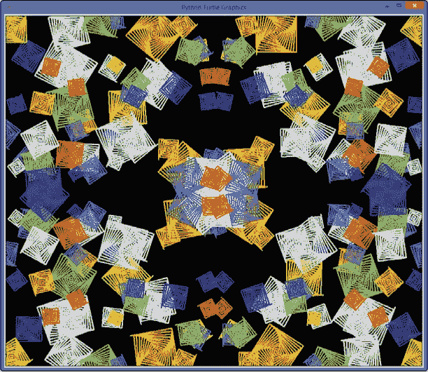

图 6-7. *Kaleidoscope.py*中的镜像/重复效果。

# 你学到了什么

在这一章之前，我们没有办法让计算机表现出随机行为。现在，我们可以让计算机掷骰子；从牌堆中抽取随机卡片；绘制随机颜色、形状、大小和位置的螺旋；甚至偶尔在石头剪子布游戏中赢我们一局。

使这些程序成为可能的工具是`random`模块。我们使用`random.randint(1, 10)`在猜数字游戏中生成 1 到 10 之间的随机数。在我们的随机螺旋程序中，我们加入了`random.choice()`函数，从列表中随机选择颜色。你还学习了如何使用`turtle.window_width()`和`turtle.window_height()`来获取海龟屏幕的宽度和高度。

你还学习了如何使用笛卡尔坐标来找出屏幕上的(*x*, *y*)位置，并使用`random.randrange()`函数在我们定义的左、右 x 坐标值和上下 y 坐标值之间生成一个随机数。然后，我们使用`turtle.setpos(x, y)`将海龟移动到绘图屏幕的任意位置。

我们将使用`random.choice()`从列表中随机选择项目的能力与使用`if`-`elif`语句来测试和比较变量的能力结合，构建了一个“用户对电脑”的猜拳游戏版本。

你学习了数组的概念，并通过构建一个花色名称数组和一个面值数组，使得我们的纸牌游戏更容易编码。我们在每个数组上使用了`random.choice()`来模拟发牌。我们将面值从小到大排序，并使用`.index()`函数来查找数组中元素的位置。我们使用每张牌的面值索引，比较哪个牌的索引值更大，从而判断哪个玩家赢得了“战争”纸牌游戏的一局。我们构建了一个可重用的游戏循环，包含用户输入、一个标志变量`keep_going`和一个`while`语句；我们可以将这个循环应用到任何用户想玩的游戏或应用中，或者在一系列游戏中多次运行。

我们通过构建简化版的“雅兹牌游戏”来扩展了对数组的理解。我们创建了一个包含从 1 到 6 的五个值的数组，模拟五颗骰子，使用`randint()`来模拟掷骰子，并对骰子数组使用`sort()`函数，使得检查获胜组合变得更容易。我们看到，在一个已排序的数组中，如果第一个和最后一个值相同，说明数组中的所有元素都相同。在我们的游戏中，这意味着我们得到了五个相同的点数。我们使用复合`if`语句，并通过`or`运算符将两种四个相同的情况和三种三个相同的情况结合。我们使用`if-elif`语句来控制程序逻辑，确保五个相同的点数不会被误判为四个相同的点数，依此类推。

我们在万花筒程序中更多地使用了笛卡尔坐标，并通过改变(*x*, *y*)坐标值的符号来模拟反射效果。我们在屏幕上重复每个随机大小、颜色和位置的螺旋形状四次，创造了万花筒效果。你学习了如何使用`t.speed(0)`来增加海龟的绘图速度。

随机数和随机选择为游戏增加了偶然性，使游戏更加有趣。你玩过的几乎每个游戏都有一定的偶然性。现在，你可以在程序中构建随机性，编写人们喜欢玩的游戏。

到此为止，你应该能够完成以下操作：

+   将 `random` 模块导入到你的程序中。

+   使用 `random.randint()` 在给定范围内生成一个随机整数。

+   使用 `random.choice()` 从列表或数组中随机选择一个值。

+   使用 `random.choice()` 从两个仅包含面值和花色的字符串数组中生成 52 张牌的值。

+   使用 `turtle.window_width()` 和 `turtle.window_height()` 确定绘图窗口的大小。

+   使用 `turtle.setpos(x,y)` 将乌龟移动到绘图屏幕的任何位置。

+   使用 `random.randrange()` 函数生成指定范围内的随机数。

+   使用 `.index()` 函数查找列表或数组中元素的索引。

+   使用布尔标志变量如 `keep_going` 构建一个 `while` 游戏循环。

+   构建一个包含相似类型值的数组，通过索引为数组中的元素赋值（例如 `dice[0] = 2`），并像使用常规变量一样使用数组元素。

+   使用 `.sort()` 函数对列表或数组进行排序。

+   通过改变点的 (*x*, *y*) 坐标值的符号来反射点关于 x 轴和 y 轴的对称。

+   使用 `.speed()` 函数来改变乌龟的绘图速度。

编程挑战

对于本章的挑战问题，我们将扩展 *Kaleidoscope.py* 和 *HighCard.py* 程序。（如果你卡住了，可以访问 *[`www.nostarch.com/teachkids/`](http://www.nostarch.com/teachkids/)* 获取示例答案。）

**#1: 随机边数和线条粗细**

通过添加两个随机变量来为 *Kaleidoscope.py* 增加更多随机性。添加一个名为 `sides` 的变量来表示边数，然后使用该变量每次在螺旋循环中改变转角（因此，螺旋的边数），通过 `360/sides + 1` 作为角度，而不是 `91`。接下来，创建一个名为 `thick` 的变量，用来存储一个 1 到 6 之间的随机数，表示乌龟笔的粗细。将 `t.width(thick)` 这一行添加到正确的位置，以改变每个螺旋线条的粗细。

**#2: 逼真的镜像螺旋**

如果你了解一些几何学，另外两个调整可以使这个万花筒更加逼真。首先，在绘制第一个螺旋之前，记录乌龟的方向（介于 0 到 360 度之间），通过调用 `t.heading()` 获取结果，并将其存储在一个名为 `angle` 的变量中。然后，在绘制每个镜像螺旋之前，通过使用 `t.setheading()` 将乌龟指向正确的镜像方向。提示：第二个角度将是 `180 - angle`，第三个螺旋的角度将是 `angle - 180`，第四个将是 `360 - angle`。

然后，尝试在第一和第三个螺旋图形每绘制一条线后向左转，而在第二和第四个螺旋图形每次绘制一条线后向右转。如果你实现了这些改进，你的螺旋图形应该在大小、形状、颜色、粗细和方向上真正成为彼此的镜像。如果你愿意，你还可以通过将 x 和 y 坐标值的范围改为`random.randrange(size,turtle.window_width()//2)`和`random.randrange(size,turtle.window_height()//2)`来减少形状之间的重叠。

**#3: 战争**

通过进行三项修改，将*HighCard.py*转变为完整的战争游戏。首先，记录分数：创建两个变量来追踪计算机赢得了多少局，用户赢得了多少局。其次，通过发牌 26 局（可以使用`for`循环代替`while`循环，或者通过记录已经玩过的局数）来模拟一副完整的牌，并根据哪一方的得分更高来宣布胜者。第三，处理平局情况：记住连续发生过多少次平局；然后，下次其中一方获胜时，将最近的平局次数加到该玩家的得分中，并将平局次数重置为零，进入下一轮。
