# 第七章：函数——有个名字

到目前为止，我们已经使用了许多*函数*——从`print()`到`input()`，再到`turtle.forward()`。但这些函数都是内置的或者从 Python 模块和库中导入的。在本章中，我们将编写自己的*函数*，做任何我们想做的事情，包括响应用户操作，比如鼠标点击和按键。

函数很有用，因为它们赋予我们组织可重用代码片段的能力，然后通过一个简短的名称或命令在程序中引用这些片段。以`input()`为例：它打印一个文本提示，询问用户输入，收集用户输入的内容，并将其作为字符串传递给我们的程序，我们可以将其存储在一个变量中。每次我们想从用户那里获取更多信息时，都可以重复使用`input()`函数。如果没有这个函数，每次我们想询问用户信息时，可能都需要自己做这些工作。

`turtle.forward()`函数是另一个很好的视觉示例：每当我们将乌龟向前移动以绘制螺旋的某一边时，Python 会在屏幕上按我们要求的精确长度，逐个像素地绘制，并朝着我们当前设置的方向前进。如果没有`turtle.forward()`函数，我们就需要搞清楚如何在屏幕上着色像素，跟踪位置和角度，并进行一些相当复杂的数学运算来绘制每次所需的距离。


如果没有这些函数，我们的程序将变得更长、更难以阅读，也更难编写。函数让我们能够利用许多其他程序员之前的编程工作。好消息是，我们也可以编写自己的函数，使我们的代码更简短、更易读且更具可重用性。

在第六章中，我们编写了绘制随机螺旋和万花筒图案的程序。我们可以使用函数来使这些程序中的代码更易读，并使代码的某些部分更具可重用性。

# 使用函数将内容组合起来

回顾一下 RandomSpirals.py。第一个`for`循环中的所有代码都是用来创建一个随机螺旋的。这个`for`循环利用这些代码绘制了 50 个随机颜色、大小和位置的螺旋。

假设我们想在另一个程序中使用那个随机螺旋代码，比如一个游戏或者屏幕保护程序。在*RandomSpirals.py*中，我们很难看出实际的螺旋绘制是从哪里开始或结束的，而我们几页前才写了那段代码。想象一下三个月后再回到这个程序！我们会很难弄清楚这个应用程序的功能是什么，以及如果我们想再次绘制随机螺旋，哪些代码行需要复制到新程序中。

为了使一段代码以后可以重用，或者让它现在更容易阅读，我们可以*定义一个函数*并给它一个易于理解的名字，就像`input()`或`turtle.forward()`一样。定义一个函数也叫做*声明*函数，它意味着我们告诉计算机我们希望函数做什么。让我们创建一个在屏幕上绘制随机螺旋的函数；我们称它为`random_spiral()`。我们可以在任何程序中随时重用这个函数来绘制随机螺旋。

## 定义 Random_Spiral()

打开*RandomSpirals.py*（第六章），将其另存为一个名为*RandomSpiralsFunction.py*的新文件，并在设置海龟的笔、速度和颜色之后但在`for`循环之前开始定义这个函数。（你可以参考最终的程序 RandomSpiralsFunction.py，看看它应该是什么样子的。）我们将`random_spiral()`的定义放在海龟设置之后，因为这个函数需要使用海龟笔`t`和颜色列表。定义应该放在`for`循环之前，因为我们将在`for`循环中使用`random_spiral()`，你必须先定义函数才能使用它。现在我们已经找到了程序中的正确位置，让我们开始定义`random_spiral()`函数吧。

我们使用关键字`def`（即*定义*的缩写）来定义一个函数，后面跟着函数的名称、括号`()`和冒号（`:`）。这是我们将要构建的`random_spiral()`函数的第一行：

```
def random_spiral():
```

其余的函数定义将是一个或多个语句，从左侧缩进，就像我们在`for`循环中分组语句一样。为了绘制一个随机螺旋，我们需要设置一个随机颜色、随机大小和一个随机的(*x*, *y*)位置，然后将笔移动到那里并绘制螺旋。下面是完成我们`random_spiral()`函数的代码：

```
def random_spiral():
    t.pencolor(random.choice(colors))
    size = random.randint(10,40)
    x = random.randrange(-turtle.window_width()//2,
                         turtle.window_width()//2)
    y = random.randrange(-turtle.window_height()//2,
                         turtle.window_height()//2)
    t.penup()
    t.setpos(x,y)
    t.pendown()
    for m in range(size):
        t.forward(m*2)
        t.left(91)
```

注意，当函数被定义时，计算机并不会*运行*这段代码。如果我们在 IDLE 中输入函数定义，我们不会得到螺旋图形——还没有。要实际绘制螺旋，我们需要调用`random_spiral()`函数。

## 调用 Random_Spiral()

函数定义告诉计算机当有人实际调用函数时我们希望做什么。在定义了一个函数后，我们可以在程序中使用函数名后面跟上括号来*调用*它：

```
random_spiral()
```

你必须记住括号，因为它告诉计算机你想要运行这个函数。现在我们已经将`random_spiral()`定义为一个函数，当我们在程序中像这样调用`random_spiral()`时，计算机将在海龟屏幕上绘制一个随机的螺旋。

现在，为了绘制 50 个随机螺旋，我们可以简化`for`循环，而不是使用*RandomSpirals.py*中的所有代码：

```
for n in range(50):
    random_spiral()
```

由于我们使用了自己构建的函数，这个循环更容易阅读。我们让代码更易于理解，并且通过复制和粘贴函数定义，可以轻松地将随机螺旋代码移到另一个程序中。

这是完整的程序；将其输入到 IDLE 中并保存为 *RandomSpiralsFunction.py*，或者从 *[`www.nostarch.com/teachkids/`](http://www.nostarch.com/teachkids/)* 下载。

## RandomSpiralsFunction.py

```
import random
import turtle
t = turtle.Pen()
t.speed(0)
turtle.bgcolor("black")
colors = ["red", "yellow", "blue", "green", "orange", "purple",
          "white", "gray"]
def random_spiral():
    t.pencolor(random.choice(colors))
    size = random.randint(10,40)
    x = random.randrange(-turtle.window_width()//2,
                         turtle.window_width()//2)
    y = random.randrange(-turtle.window_height()//2,
                         turtle.window_height()//2)
    t.penup()
    t.setpos(x,y)
    t.pendown()
    for m in range(size):
        t.forward(m*2)
        t.left(91)

for n in range(50):
    random_spiral()
```

除了更易读的程序，我们还得到了一个可重用的 `random_spiral()` 函数，我们可以将其复制、修改并轻松地在其他程序中使用。

如果你发现自己一次又一次地重复使用一段代码，将其转换成一个函数，就像我们用 `def` 定义的 `random_spiral()` 函数那样，你会发现将代码*移植*（即携带并在新应用中重用）到其他应用程序会更容易。

### 注意

*你甚至可以创建自己的模块，里面充满了函数，并像我们在程序中导入 `turtle` 和 `random` 一样导入你的模块（有关如何在 Python 中创建模块，请参见附录 C）。这样，你可以与朋友分享你的代码。*

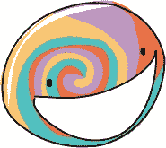

# 参数：为你的函数提供信息

在创建函数时，我们可以为该函数定义 *参数*。参数允许我们通过将值作为 *参数* 传递给函数的括号，将信息传递给函数。从我们第一次使用 `print()` 语句开始，我们就一直在给函数传递参数。当我们编写 `print("Hello")` 时，`"Hello"` 是一个代表我们希望在屏幕上打印的字符串值的参数。当我们调用海龟函数 `t.left(90)` 时，我们传递了值 `90`，表示我们希望海龟向左转 90 度。

`random_spiral()` 函数不需要参数。它所需的所有信息都在函数内部的代码中。但如果我们愿意，可以让我们构建的函数接受参数形式的信息。让我们定义一个函数 `draw_smiley()`，它将在屏幕上的随机位置画一个笑脸。这个函数将接受一对随机坐标，并在这些坐标处绘制笑脸。我们将在一个名为 *RandomSmileys.py* 的程序中定义并调用 `draw_smiley()`。完整程序见 Putting it all together —— 但让我们一步步构建它。

## 随机位置的笑脸

我们想编写一个程序，它不仅仅是画随机的螺旋，而是画笑脸。画笑脸比随机选一个颜色和大小然后画螺旋要多一些规划。让我们回到第六章，一张图表纸。因为我们以前的程序没有画过像笑脸这样复杂的东西，最好先在纸上画出来，然后再逐步转化为代码。图 7-1 展示了一个笑脸的图表纸网格，我们可以用它来规划我们的绘图。

我们的程序将像这样在屏幕上的随机(*x*, *y*)坐标处画笑脸。`draw_smiley()`的函数定义将接受两个参数，`x`和`y`，表示笑脸要画在的位置。如图 7-1 所示，我们将把笑脸画得仿佛它坐落在(*x*, *y*)的位置，所以可以想象将这个笑脸模板移动到屏幕上的任何其他点(*x*, *y*)，将它的原点(0, 0)放置在那个点上。让我们从给定的点开始，逐步弄清楚如何画出每个笑脸。

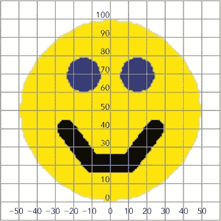

图 7-1. 我们首先通过在图表纸上画一个笑脸来规划我们的程序。

### 画一个头部

每个笑脸的头部是一个黄色的圆圈，眼睛是两个小蓝色圆圈，嘴巴是一些黑色的线条。给定屏幕上的一个点，我们的`draw_smiley()`函数需要在相对于给定点的正确位置画出头部、眼睛和嘴巴。为了弄清楚放入函数定义中的代码，让我们先单独规划头部、眼睛和嘴巴，从头部开始。我们先画头部，这样它就不会遮挡接下来要画的眼睛和嘴巴。

我们将图中的每条网格线视为 10 像素，因此我们绘制的笑脸的高度将是 100 像素；在大多数计算机屏幕上，这大约等于一英寸。由于圆形的*直径*，即高度和宽度，都是 100 像素，这意味着它的*半径*（直径的一半）是 50 像素。我们需要半径，因为`Turtle`模块的`circle()`命令需要半径作为参数。绘制半径为 50（即直径为 100）的圆形的命令是`t.circle(50)`。`circle()`函数会在海龟当前的(*x*, *y*)位置正上方绘制一个圆形。我们需要知道这一点，以便正确地放置眼睛和嘴巴，因此我将我的笑脸画在底边与原点(0, 0)对齐的位置。我们可以通过将每个部分的坐标加到起始(*x*, *y*)位置(0, 0)来确定其他部分的位置。

为了画出大黄头，我们将画笔颜色设置为黄色，填充颜色也设置为黄色，启用图形的油漆填充功能，画出圆形（由于启用了油漆填充，圆形会被填充为黄色），完成后关闭油漆填充功能。假设我们在程序中已经定义了一个名为`t`的海龟画笔，绘制笑脸的黄色圆头的代码看起来是这样的：

```
# Head
t.pencolor("yellow")
t.fillcolor("yellow")
t.begin_fill()
t.circle(50)
t.end_fill()
```

为了用黄色填充圆形，我们在`t.circle(50)`命令周围加上四行代码。首先，我们使用`t.pencolor("yellow")`设置画笔颜色为黄色。其次，我们用`t.fillcolor("yellow")`设置填充颜色。接着，在调用`t.circle(50)`命令绘制笑脸的圆形之前，我们告诉计算机我们希望填充所绘制的圆形。我们通过`t.begin_fill()`函数来实现。最后，绘制圆形后，我们调用`t.end_fill()`函数，告诉计算机我们已经完成了填充的形状。

### 绘制眼睛

首先，我们需要确定海龟的位置，以便在正确的位置绘制左眼，然后将填充颜色设置为蓝色，最后绘制正确大小的圆形。眼睛大约是 20 像素（两条网格线）高，我们知道直径为 20 意味着半径是直径的一半，即 10，因此我们将使用`t.circle(10)`命令绘制每只眼睛。难点是确定它们应该画在什么位置。

我们的（*x*, *y*）起点将是每个笑脸的局部原点，你可以在图 7-1 中找到左眼的位置。它看起来大约从原点上方 6 个网格线开始（即向上 60 个像素，沿 y 轴正方向），并且它位于 y 轴的左侧 1.5 个网格线处（或约 15 个像素，沿 x 轴负方向）。

为了告诉我们的程序如何到达正确的位置以绘制左眼，从大黄色圆圈的底部开始，给定的（*x*, *y*）作为一对参数传递给我们的函数，我们需要从*x*开始，向左移动 15 个像素，向上移动 60 个像素，或者移动到`(x-15, y+60)`。因此，调用`t.setpos(x-15, y+60)`应该会将乌龟放到我们需要开始绘制左眼的位置。以下是左眼的代码：

```
# Left eye
t.setpos(x-15, y+60)
t.fillcolor("blue")
t.begin_fill()
t.circle(10)
t.end_fill()
```

一个常见的错误是将`setpos`命令写成仅用（–15, 60）作为参数，但请记住，我们希望在屏幕上的不同（*x*, *y*）位置绘制多个笑脸；并不是所有的笑脸都会从（0, 0）开始。命令`t.setpos(x-15, y+60)`可以确保无论我们在绘制哪个黄色的笑脸，我们的左眼都会出现在那个笑脸的左上方。

绘制右眼的代码几乎与绘制左眼的代码相同。我们可以看到，右眼距离我们的位置（*x*, *y*）向右偏移了 15 个像素（1.5 个网格线），并且仍然是向上偏移了 60 个像素。命令`t.setpos(x+15, y+60)`应该能使右眼对称地放置。以下是右眼的代码：

```
# Right eye
t.setpos(x+15, y+60)
t.begin_fill()
t.circle(10)
t.end_fill()
```

填充颜色仍然是左眼的蓝色，所以我们只需将乌龟移动到正确的位置`(x+15, y+60)`，打开填充，绘制眼睛，并完成填充。

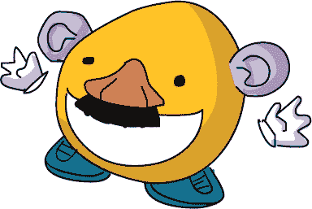

### 绘制嘴巴

现在让我们规划笑脸上最重要的部分：微笑。为了简化微笑的绘制，我们将用三条粗黑线来绘制嘴巴。嘴巴的左边看起来大约从距离我们点（*x*, *y*）左侧 2.5 个网格线并上方 4 个网格线的地方开始，所以我们会把乌龟放置在`(x-25, y+40)`位置开始绘制微笑。我们将把笔的颜色设置为黑色，宽度设置为 10，这样微笑就会很粗且容易看见。从微笑的左上角，我们需要移动到`(x-10, y+20)`，然后到`(x+10, y+20)`，最后到微笑的右上角`(x+25, y+40)`。注意，这些点对是以 y 轴为对称轴的镜像关系；这使得我们的笑脸看起来非常均衡。

以下是嘴巴的代码：

```
   # Mouth
   t.setpos(x-25, y+40)
   t.pencolor("black")
   t.width(10)
   t.goto(x-10, y+20)
   t.goto(x+10, y+20)
   t.goto(x+25, y+40)
➊ t.width(1)
```

在我们将海龟定位在嘴巴的左上角后，我们将画笔颜色更改为黑色，并将宽度设置为 10。我们开始绘制，通过告诉海龟前往笑容的其他三个点。`turtle`模块的`goto()`函数和`setpos()`做的事情一样：它将海龟移动到给定的点。我在这里使用它是为了让你看到`setpos()`的替代方法。最后，在➊处，`t.width(1)`将画笔宽度恢复为 1，这样在绘制下一个笑脸时，我们的形状就不会太厚。

### 定义和调用`Draw_Smiley()`

剩下的就是定义`draw_smiley()`函数，包含所有绘制笑脸的代码，设置一个循环来生成屏幕上 50 个随机的(*x*, *y*)位置，并调用`draw_smiley(x,y)`函数，在这 50 个位置绘制笑脸。

`draw_smiley()`函数的定义需要接受两个参数，`x`和`y`，用于指定笑脸绘制的位置，并且需要抬起海龟的画笔，将海龟移动到(*x*, *y*)位置，然后再将画笔放下准备绘制。之后，我们只需添加绘制大黄色脸、左右眼睛和嘴巴的代码片段。

```
def draw_smiley(x,y):
    t.penup()
    t.setpos(x,y)
    t.pendown()
    # All of your drawing code goes here...
```

最终的部分将是我们的`for`循环，用于生成 50 个随机位置的笑脸，并调用`draw_smiley()`函数绘制每个笑脸。它看起来是这样的：

```
for n in range(50):
    x = random.randrange(-turtle.window_width()//2,
                         turtle.window_width()//2)
    y = random.randrange(-turtle.window_height()//2,
                         turtle.window_height()//2)
    draw_smiley(x,y)
```

我们的随机 x 和 y 坐标值就像在第六章中看到的一样，从屏幕的左半部分到右半部分，从下半部分到上半部分生成随机点。通过`draw_smiley(x,y)`，我们将这些随机坐标作为参数传递给`draw_smiley()`函数，它将在该随机位置绘制一个笑脸。

## 将所有内容组合起来

将程序组合起来，它大致看起来是这样的：

## RandomSmileys.py

```
   import random
   import turtle
   t = turtle.Pen()
   t.speed(0)
   t.hideturtle()
   turtle.bgcolor("black")
➊ def draw_smiley(x,y):
       t.penup()
       t.setpos(x,y)
       t.pendown()
       # Head
       t.pencolor("yellow")
       t.fillcolor("yellow")
       t.begin_fill()
       t.circle(50)
       t.end_fill()
       # Left eye
       t.setpos(x-15, y+60)
       t.fillcolor("blue")
       t.begin_fill()
       t.circle(10)
       t.end_fill()
       # Right eye
       t.setpos(x+15, y+60)
       t.begin_fill()
       t.circle(10)
       t.end_fill()
       # Mouth
       t.setpos(x-25, y+40)
       t.pencolor("black")
       t.width(10)
       t.goto(x-10, y+20)
       t.goto(x+10, y+20)
       t.goto(x+25, y+40)
       t.width(1)
➋ for n in range(50):
       x = random.randrange(-turtle.window_width()//2,
                            turtle.window_width()//2)
       y = random.randrange(-turtle.window_height()//2,
                            turtle.window_height()//2)
       draw_smiley(x,y)
```

和往常一样，我们导入所需的模块并设置海龟，将它的速度设置为`0`（最快）。我们使用`hideturtle()`使海龟本身不出现在屏幕上，这样也可以加快绘制速度。

在➊部分，我们定义了`draw_smiley()`函数，使其任务是绘制笑脸的脸、左眼、右眼和微笑，使用我们之前写的所有代码。它只需要做这项工作的是一个 x 坐标和一个 y 坐标。

在我们`for`循环的➋部分，随机选择一个`x`和`y`值，并传递给`draw_smiley()`，然后它会在该随机点相对位置绘制一个带有所有特征的笑脸。

*RandomSmileys.py*程序将在绘图屏幕上随机位置绘制 50 个笑脸，正如图 7-2 所示。

你可以自定义程序来绘制几乎任何形状，只要你设计一个函数，从任何(*x*, *y*)位置开始绘制该形状。像我们在这个示例中那样从图纸开始，可以更容易地找到重要的点。如果你觉得一些笑脸半挂在屏幕的左右两侧，或者几乎挂到屏幕顶部，你可以在 `x` 和 `y randrange()` 语句中使用一些数学运算，确保笑脸完全留在屏幕上。可以访问 *[`www.nostarch.com/teachkids/`](http://www.nostarch.com/teachkids/)* 获取这个挑战的示例答案。

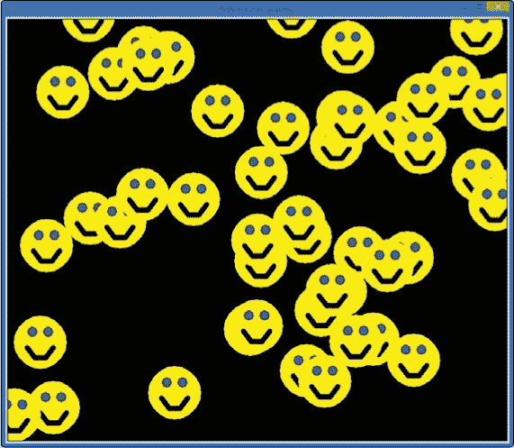

图 7-2. *RandomSmileys.py* 程序产生了一个愉快的结果。

# 返回：你所给的才是最重要的

我们可以通过参数将信息传递给函数，但如果我们想从函数中*接收*信息呢？例如，假设我们构建了一个将英寸转换为厘米的函数，并且我们希望将转换后的数字存储起来用于进一步的计算，而不是直接将其打印到屏幕上？为了将信息从函数传递回我们的程序，我们使用 `return` 语句。

## 从函数返回值

有很多时候我们需要从函数中获取信息。例如，假设我们实际构建了一个将英寸转换为厘米的函数，并将其命名为 `convert_in2cm()`。我们可以设想这个函数可能需要接受的参数：一个英寸的测量值。但是这个函数完全可以返回信息给程序的其他部分——即转换后的厘米值。

为了将英寸长度转换为等效的厘米长度，我们将英寸数乘以 2.54——这是每英寸大约对应的厘米数。为了将该计算的结果传递回程序，我们将使用 `return` 语句。`return` 关键字后面的值将作为函数的 *返回值* 或结果返回给程序。让我们定义我们的函数：

```
def convert_in2cm(inches):
    return inches * 2.54
```

如果你将这两行代码输入到 Python shell 中，然后输入`convert_in2cm(72)`并按下 ENTER，Python 会返回 `182.88`。72 英寸（或 6 英尺——我的身高）大约等于 182.88 厘米。函数返回的值是 182.88，在命令行中，当我们调用函数时，返回值会在下一行打印出来。

我们还可以进行另一个有用的转换：英镑转公斤。要将英镑转换为公斤，我们将英镑的重量除以 2.2，这是 1 公斤大约等于多少英镑的近似值。我们来创建一个叫做 `convert_lb2kg()` 的函数，它将以英镑为参数，并返回转换后的公斤值：

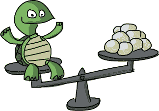

```
def convert_lb2kg(pounds):
    return pounds / 2.2
```

`return`语句有点像是反向使用参数，只不过我们只能返回*一个*值，而不是像我们传入的参数那样返回一组值。（不过，这个值可以是一个列表，所以通过一些操作，你可以在一个返回变量中传回多个值。）

## 在程序中使用返回值

使用这两个转换函数，我们来构建一个有趣的应用程序：乒乓球的身高和体重计算器。这个程序将回答“我有多少个乒乓球高？”和“我的体重大约相当于多少个乒乓球？”

一个官方的乒乓球重 2.7 克（0.095 盎司），直径为 40 毫米（4 厘米，或 1.57 英寸）。为了计算与我们的身高和体重相等的乒乓球数量，我们需要将身高（单位：厘米）除以 4，并将体重（单位：克）除以 2.7。但是并不是每个人都知道自己的体重（以克为单位）或身高（以厘米为单位）：在美国，我们通常以磅为单位测量体重，以英尺和英寸为单位测量身高。幸运的是，我们刚刚开发的两个转换函数将帮助我们将这些测量值转换为公制单位。然后我们可以使用这些数字进行乒乓球单位的转换。

我们的程序将定义两个转换函数`convert_in2cm()`和`convert_lb2kg()`。然后，它将请求用户输入身高和体重，计算出用户的身高和体重对应的乒乓球数量，并将计算结果显示在屏幕上。请键入并运行以下代码：

### PingPongCalculator.py

```
➊ def convert_in2cm(inches):
       return inches * 2.54

   def convert_lb2kg(pounds):
       return pounds / 2.2

➋ height_in = int(input("Enter your height in inches: "))
   weight_lb = int(input("Enter your weight in pounds: "))

➌ height_cm = convert_in2cm(height_in)
➍ weight_kg = convert_lb2kg(weight_lb)

➎ ping_pong_tall = round(height_cm / 4)
➏ ping_pong_heavy = round(weight_kg * 1000 / 2.7)

➐ feet = height_in // 12
➑ inch = height_in % 12

➒ print("At", feet, "feet", inch, "inches tall, and", weight_lb,
         "pounds,")
   print("you measure", ping_pong_tall, "Ping-Pong balls tall, and ")
   print("you weigh the same as", ping_pong_heavy, "Ping-Pong balls!")
```

在➊处，我们输入我们开发的两个转换公式。两个函数都接受一个输入参数（`inches`和`pounds`），并且每个函数都返回一个值。在➋处，我们请求用户输入身高和体重，并将这些值存储在`height_in`和`weight_lb`中。在➌处，我们调用`convert_in2cm()`函数，将`height_in`作为我们要转换的值，并将转换结果存储在变量`height_cm`中。在➍处，我们使用`convert_lb2kg()`函数进行另一项转换计算，将人的体重（以*磅*为单位）转换为等效的*千克*（kg）。

➎处的公式做了两件事：首先，它将用户的身高（单位为厘米）除以 4，得出以乒乓球为单位的身高；然后，它使用`round()`函数将这个结果四舍五入到最接近的整数，并将结果存储在变量`ping_pong_tall`中。到达➏时，我们做了类似的操作，将用户的体重（单位为千克）转换为克，通过乘以 1000，再除以 2.7——这就是一个标准乒乓球的质量（单位：克）。这个数字被四舍五入到最接近的整数，并存储在变量`ping_pong_heavy`中。

在➐和➑处，我们通过计算一个人的身高（以英尺和英寸为单位）进行稍微多一点的数学运算。正如我之前提到的，这通常是我们在美国表达身高的方式，它不仅是一个不错的收尾，而且也是一个让人检查自己是否输入了正确信息的方式。`//`运算符执行整数除法，因此 66 英寸，或者 5.5 英尺，将导致只将`5`存储在变量`feet`中，而`%`运算符（取余）则存储余数，`6`英寸。➒处的`print`语句会打印出用户的身高和体重，分别以标准单位和乒乓球的数量表示。

这里是乒乓球计算器程序的一些示例运行结果，包括我儿子 Max、Alex 和我自己的乒乓球数量（唯一的缺点是，现在我的孩子们想要 31,000 个乒乓球）。

```
>>> ================================ RESTART ================================
>>>
Enter your height in inches: 42
Enter your weight in pounds: 45
At 3 feet 6 inches tall, and 45 pounds,
you measure 27 Ping-Pong balls tall, and
you weigh the same as 7576 Ping-Pong balls!
>>> ================================ RESTART ================================
>>>
Enter your height in inches: 47
Enter your weight in pounds: 55
At 3 feet 11 inches tall, and 55 pounds,
you measure 30 Ping-Pong balls tall, and
you weigh the same as 9259 Ping-Pong balls!
>>> ================================ RESTART ================================
>>>
Enter your height in inches: 72
Enter your weight in pounds: 185
At 6 feet 0 inches tall, and 185 pounds,
you measure 46 Ping-Pong balls tall, and
you weigh the same as 31145 Ping-Pong balls!
>>>
```

我们创建的任何函数都可以返回一个值，就像我们定义的任何函数都可以接受参数作为输入一样。根据你希望函数执行的操作，使用这些功能之一或两者来编写你所需的函数代码。

# 一点交互

我们已经编写了一些好看的图形化应用程序，但距离构建下一个视频游戏或移动应用程序还有一两步的距离。我们需要学习的一个剩余技能是用户交互编程：让我们的程序对鼠标点击、按键等作出响应。

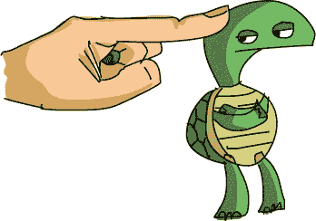

大多数应用程序是*交互式*的——它们允许用户触摸、点击、拖动、按下按钮，并感觉自己在控制程序。我们称这些应用程序为*事件驱动*应用程序，因为它们等待用户执行某个动作，或者*事件*。响应用户事件的代码，比如当用户点击图标时打开一个窗口，或者当他们点击按钮时启动游戏，称为*事件处理程序*，因为它处理或响应来自用户的事件。它也被称为事件*监听器*，因为就像计算机在耐心等待，倾听用户告诉它该做什么一样。我们将学习如何处理用户事件，使我们的程序更加引人入胜和互动。

## 事件处理：TurtleDraw

让应用程序处理用户事件有很多种方式。Python 的`turtle`模块包括一些处理用户事件的函数，包括鼠标点击和按键。我们将尝试的第一个函数是`turtle.onscreenclick()`。顾名思义，这个函数允许我们处理用户点击海龟屏幕时产生的事件。

这个函数与我们之前使用和构建的函数有所不同：我们传递给`turtle.onscreenclick()`的参数不是一个值——它是另一个函数的名字：

```
turtle.onscreenclick(t.setpos)
```

记得我们用过的`setpos()`函数吗？它可以将鼠标移动到屏幕上的某个(*x*, *y*)位置。现在，我们告诉计算机，当海龟屏幕接收到鼠标点击时，应该将海龟的位置设置为点击的屏幕位置。我们传递给另一个函数的函数有时被称为*回调*函数（因为它会被另一个函数“回调”）。注意，当我们将一个函数的名称作为参数传递给另一个函数时，内部函数不需要在名称后加括号。

通过将函数名`t.setpos`传递给`turtle.onscreenclick()`，我们告诉计算机我们希望屏幕点击事件执行什么操作：我们希望将海龟的位置设置为用户点击的位置。让我们在一个简单的程序中尝试一下：

### TurtleDraw.py

```
import turtle
t = turtle.Pen()
t.speed(0)
turtle.onscreenclick(t.setpos)
```

输入这四行代码到 IDLE 中，运行程序，然后点击屏幕上不同的位置。你刚刚用四行代码创建了一个绘图程序！图 7-3 展示了我绘制的一个示例草图。

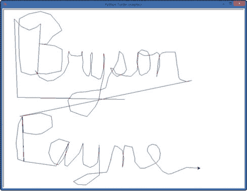

图 7-3. 一个*TurtleDraw.py*草图（我之所以是作者而不是艺术家是有原因的）

之所以能这样工作，是因为我们告诉计算机，当用户点击屏幕时，海龟的当前位置应该被设置为鼠标点击的位置。海龟的画笔默认是落下的，所以当用户点击绘图窗口时，海龟会移动到点击位置，并从旧位置绘制一条线到用户点击的位置。

你可以通过修改屏幕的背景颜色、海龟的画笔颜色、画笔的宽度等来定制*TurtleDraw.py*。看看我四岁儿子制作的版本（在爸爸的帮助下）：

### TurtleDrawMax.py

```
import turtle
t = turtle.Pen()
t.speed(0)
turtle.onscreenclick(t.setpos)
turtle.bgcolor("blue")
t.pencolor("green")
t.width(99)
```

Max 喜欢这个绘图程序（非常喜欢），但他希望屏幕是蓝色的，画笔是绿色的，而且要非常粗，所以我们将`bgcolor()`、`pencolor()`和`width()`分别设置为`blue`、`green`和`99`。我们任意选择在告诉计算机处理鼠标点击事件后设置这些。

这没问题，因为程序会持续运行，即使它在监听鼠标点击，因此在用户第一次点击时，屏幕和画笔已经正确地着色和调整大小，如图 7-4 所示。

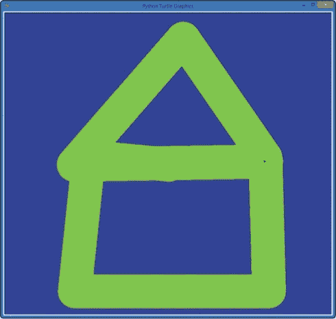

图 7-4. 我通过多次点击使用*TurtleDrawMax.py*绘制的图像

使用`setpos()`函数作为` turtle.onscreenclick()`的回调，我们已经构建了一个有趣的画图程序，当用户点击鼠标时，程序会通过画线与用户互动，画出用户点击的位置。尝试使用不同的颜色、线宽或任何你能想到的方式来自定义这个应用，使它更具个性。

## 监听键盘事件：ArrowDraw

在我们的乌龟绘图程序中，我们看到监听鼠标点击如何使用户感觉自己对程序有更多控制权。在本节中，我们将学习如何使用键盘交互给用户更多的选择。我们还将定义自己的函数，作为事件处理程序使用。

在*TurtleDraw.py*程序中，我们将`t.setpos`作为回调函数，告诉计算机在发生`onscreenclick()`事件时该做什么；我们希望将乌龟的位置设置为鼠标点击屏幕的位置。`setpos()`函数已经在`turtle`模块中提供了，但如果我们想创建自己的函数来处理事件呢？假设我们想构建一个程序，允许用户通过按下箭头键来移动屏幕上的乌龟，而不是点击鼠标按钮。我们该怎么做呢？

首先，我们需要为每个箭头键的按下事件构建相应的函数来移动乌龟，然后告诉计算机监听这些键的按下事件。我们来写一个程序，监听上（↑）、左（←）和右（→）箭头键，让用户通过这些键来控制乌龟向前移动或左右转动。

我们定义几个函数——`up()`、`left()`和`right()`——来移动和转动乌龟：

```
def up():
    t.forward(50)
def left():
    t.left(90)
def right():
    t.right(90)
```

我们的第一个函数`up()`将乌龟向前移动 50 个像素。第二个函数`left()`将乌龟向左转 90 度。最后，`right()`将乌龟向右转 90 度。

为了在用户按下正确的箭头键时运行这些函数，我们需要告诉计算机哪个函数与哪个键对应，并让计算机开始监听按键事件。为了设置键盘事件的回调函数，我们使用` turtle.onkeypress()`。这个函数通常需要两个参数：回调函数的名称（我们创建的事件处理函数）和要监听的特定键。为了将每个函数与相应的箭头键关联起来，我们可以这样写：

```
turtle.onkeypress(up,  "Up")
turtle.onkeypress(left,   "Left")
turtle.onkeypress(right,  "Right")
```

第一行将`up()`函数设置为“上”箭头键按下事件的处理函数；函数(`up`)在前，`"Up"`是上箭头键的名称，↑。左箭头和右箭头的键按事件也是如此。最后一步是告诉计算机开始监听按键事件，这一步我们通过这个命令来实现：

```
turtle.listen()
```

我们需要这一行代码有几个原因。首先，与鼠标点击不同，单纯按下一个键并不能确保我们的乌龟窗口接收到按键。当你点击桌面上的一个窗口时，该窗口会移到前面并获得*焦点*，意味着该窗口将接收来自用户的输入。点击乌龟窗口时，它会自动将该窗口设为焦点，接收后续的鼠标事件。但对于键盘，单纯按键并不会让某个窗口接收这些按键输入；`turtle.listen()` 命令确保了我们的乌龟窗口成为桌面的焦点，从而能够接收按键事件。其次，`listen()` 命令告诉计算机开始处理所有与 `onkeypress()` 函数关联的按键事件。

这是完整的 *ArrowDraw.py* 程序：

### ArrowDraw.py

```
   import turtle
   t = turtle.Pen()
   t.speed(0)
➊ t.turtlesize(2,2,2)
   def up():
       t.forward(50)
   def left():
       t.left(90)
   def right():
       t.right(90)
   turtle.onkeypress(up, "Up")
   turtle.onkeypress(left, "Left")
   turtle.onkeypress(right, "Right")
   turtle.listen()
```

在➊位置，*ArrowDraw.py* 中唯一新增的一行代码，我们将乌龟箭头的大小增大了两倍，并使用 `t.turtlesize(2,2,2)` 给它加上了更粗的轮廓。三个参数分别是水平拉伸（`2` 表示宽度是原来的两倍），垂直拉伸（`2` 表示高度是原来的两倍）和轮廓厚度（`2` 像素）。图 7-5 显示了结果。

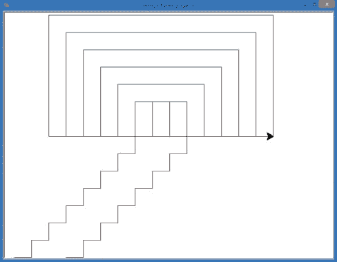

图 7-5. *ArrowDraw.py* 程序允许用户使用上、右和左箭头键进行绘图。更大的乌龟箭头使得更容易看出乌龟的移动方向。

这个应用程序有点像旧款的 Etch-A-Sketch 玩具：你只需要使用这三个箭头键就可以绘制有趣的形状，并且可以重绘你的步骤。随意定制这个应用程序，可以修改颜色、笔宽以及任何你想添加的其他功能。你可以加入一个额外的功能，这个功能作为本章结尾的挑战，允许点击来移动乌龟到一个新的位置。发挥创意，设计新功能并进行尝试——这是学习新事物的最佳方式！

## 处理带参数的事件：Clickspiral

在 *TurtleDraw.py* 中，我们通过告诉 `turtle.onscreenclick()` 监听器在用户点击屏幕时调用 `t.setpos` 函数来让用户点击进行绘图。现在，让我们编写一个新的程序 *ClickSpiral.py*，它将在用户点击的地方绘制螺旋线，如 图 7-6 所示。

`onscreenclick()` 监听器将每次鼠标点击的 x 和 y 坐标作为参数传递给我们指定的回调函数。当我们想要用自己的函数处理鼠标点击事件时，只需编写一个接受这些值（鼠标点击的 x 和 y 坐标）作为一对参数的函数。

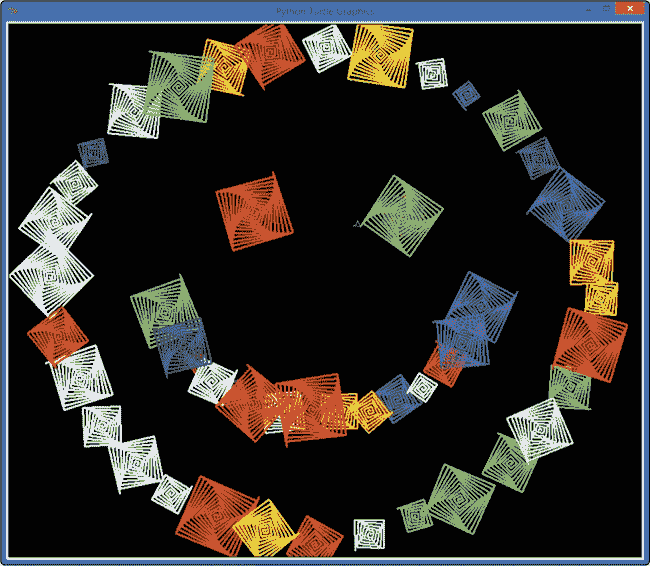

图 7-6. 使用 *ClickSpiral.py* 应用程序绘制的笑脸

*RandomSpiralsFunction.py* (RandomSpiralsFunction.py) 包含一个名为 `random_spiral()` 的函数，用于在屏幕上的随机位置绘制彩色螺旋。现在，我们不再希望在随机位置绘制螺旋，而是希望在用户点击鼠标的位置显示螺旋。为此，我们可以重写 `random_spiral()` 函数，接受来自 `turtle.onscreenclick()` 监听器的两个参数 `x` 和 `y`。我们将函数重命名为 `spiral(x,y)`：

```
def spiral(x,y):
    t.pencolor(random.choice(colors))
    size = random.randint(10,40)
    t.penup()
    t.setpos(x,y)
    t.pendown()
    for m in range(size):
        t.forward(m*2)
        t.left(91)
```

在这个新版本中，我们修改了函数的定义，以反映新的名称和我们将接收的两个参数，用于在屏幕上选择的位置绘制为 `spiral(x,y)`。我们仍然为每个螺旋选择一个随机的颜色和大小，但我们已经去除了生成随机 `x` 和 `y` 的两行代码，因为我们将从 `onscreenclick()` 监听器中获取 `x` 和 `y` 作为参数。与 `random_spiral()` 函数一样，我们将笔移动到正确的 (*x*, *y*) 位置，然后绘制螺旋。

剩下的唯一步骤是设置我们的海龟窗口和颜色列表，然后告诉 `turtle.onscreenclick()` 监听器在用户点击绘图窗口的鼠标按钮时调用螺旋函数。以下是完整的程序：

### ClickSpiral.py

```
   import random
   import turtle
   t = turtle.Pen()
   t.speed(0) turtle.bgcolor("black")
   colors = ["red", "yellow", "blue", "green", "orange", "purple",
             "white", "gray"]
   def spiral(x,y):
       t.pencolor(random.choice(colors))
       size = random.randint(10,40)
       t.penup()
       t.setpos(x,y)
       t.pendown()
       for m in range(size):
           t.forward(m*2)
           t.left(91)
➊ turtle.onscreenclick(spiral)
```

与 *TurtleDraw.py* 中一样，我们省略了回调函数的括号和参数 ➊：`turtle.onscreenclick(spiral)` 告诉我们的程序每次用户在屏幕上点击鼠标时都应该调用 `spiral(x,y)` 函数，并且事件监听器会自动将两个参数——鼠标点击的 x 坐标和 y 坐标——传递给 `spiral` 回调函数。在 *TurtleDraw.py* 中，发生了类似的事情，使用的是 `t.setpos` 回调，但这一次，我们创建了自己的函数，在鼠标点击的位置绘制一个随机颜色和大小的螺旋。

## 更进一步：Clickandsmile

让我们通过做一个小小的改变来扩展这个互动应用。假设我们不再绘制螺旋线，而是希望在用户点击绘图屏幕时绘制一个微笑脸。代码将与我们在《综合应用》中使用的*RandomSmileys.py*程序非常相似，但不同的是，这个程序会处理鼠标点击事件，在用户选择的位置绘制一个微笑脸，用户点击多少次就绘制多少次。

实际上，因为我们的`draw_smiley()`函数已经接受两个参数（我们希望绘制微笑脸的 x 和 y 坐标），所以*ClickAndSmile.py*的代码与*RandomSmileys.py*完全相同，唯一的区别是最后一部分。只需将绘制 50 个随机微笑脸的`for`循环替换为调用`turtle.onscreenclick(draw_smiley)`。记得`turtle.onscreenclick()`函数如何让我们将一个函数的名字（如`setpos`）作为鼠标点击事件的处理程序吗？我们可以传递`draw_smiley`，这样当用户点击时，`draw_smiley()`函数就会在点击的位置执行它的工作。在`turtle.onscreenclick()`的括号中，我们不需要包含`draw_smiley`的括号或任何参数。

### ClickAndSmile.py

```
import random
import turtle
t = turtle.Pen()
t.speed(0)
t.hideturtle()
turtle.bgcolor("black")
def draw_smiley(x,y):
    t.penup()
    t.setpos(x,y)
    t.pendown()
    # Face
    t.pencolor("yellow")
    t.fillcolor("yellow")
    t.begin_fill()
    t.circle(50)
    t.end_fill()
    # Left eye
    t.setpos(x-15, y+60)
    t.fillcolor("blue")
    t.begin_fill()
    t.circle(10)
    t.end_fill()
    # Right eye
    t.setpos(x+15, y+60)
    t.begin_fill()
    t.circle(10)
    t.end_fill()
    # Mouth
    t.setpos(x-25, y+40)
    t.pencolor("black")
    t.width(10)
    t.goto(x-10, y+20)
    t.goto(x+10, y+20)
    t.goto(x+25, y+40)
    t.width(1)
turtle.onscreenclick(draw_smiley)
```

现在，用户可以在屏幕上点击的任何地方绘制微笑脸，而不再是随机地绘制微笑脸；他们甚至可以用小的微笑脸绘制一个大的微笑脸，正如在图 7-7 中所示。

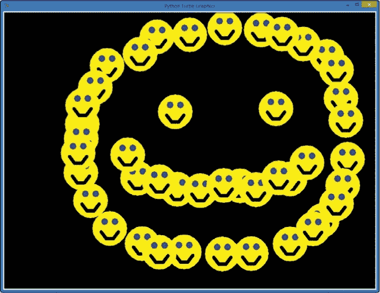

图 7-7. 我们让微笑程序变得更加互动，可以在用户点击的地方绘制。

无论你想构建什么样的应用程序，你可能都会依赖用户交互来驱动体验。想一想那些你花最多时间玩的游戏或其他应用程序：它们的共同点是你可以控制发生什么以及何时发生。不管是移动球拍来击打球；按下鼠标按钮或触摸并拖动来发射某物；还是点击、滑动和轻触来清除屏幕，你都在生成用户事件——而你喜欢的程序会通过做一些很酷的事情来处理这些事件。让我们再构建一个互动应用来练习一下，之后我们将构建更多我们每天玩的应用程序。

# ClickKaleidoscope

让我们将创建函数的能力和处理互动点击的能力结合起来，创造一个互动的万花筒。用户可以在屏幕上的任何位置点击，然后从用户点击的位置开始绘制四个反射的随机形状和颜色的螺旋线。最终效果将类似于我们在 Kaleidoscope.py 程序中的展示，但用户将能够使用这个万花筒创造出他们自己的独特图案。

## Draw_Kaleido() 函数

让我们谈谈构建定制化万花筒程序的挑战。我们知道我们想让用户点击屏幕以开始绘图过程，因此我们将使用前一节中的 `turtle.onscreenclick()` 函数。我们知道这个函数将给我们一个 (*x*, *y*) 的位置，我们可以在回调函数中使用这个位置。我们还可以回顾原始的万花筒程序，看到我们只需要在四个位置 (*x*, *y*), (*–x*, *y*), (*–x*, *–y*), 和 (*x*, *–y*) 绘制螺旋线，就能实现所需的反射效果。

我们的四个反射螺旋线应该具有相同的颜色和大小，以创造镜像效果。我们将调用函数 `draw_kaleido()` 并将其定义如下：

```
➊ def draw_kaleido(x,y):
➋     t.pencolor(random.choice(colors))
➌     size = random.randint(10,40)
       draw_spiral(x,y, size)
       draw_spiral(-x,y, size)
       draw_spiral(-x,-y, size)
       draw_spiral(x,-y, size)
```

在 ➊ 处，我们将函数命名为 `draw_kaleido`，并允许它从 `turtle.onscreenclick()` 事件处理器中获取两个参数 `x` 和 `y`，这样四个反射的螺旋线就会从用户点击的 (*x*, *y*) 位置开始。接着，在 ➋ 处，我们随机选择一个颜色作为四个反射螺旋线的颜色，从我们常用的颜色列表 `colors` 中挑选。

在 ➌ 处，我们为四个反射的螺旋线选择一个随机大小，并将其存储在 `size` 中。最后，我们通过一个尚未实际编写的新函数 `draw_spiral()`，在它们的 (*x*, *y*), (*–x*, *y*), (*–x*, *–y*), 和 (*x*, *–y*) 位置绘制这四个螺旋线。

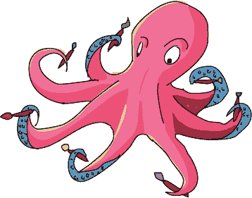

## Draw_Spiral() 函数

我们的 `draw_spiral()` 函数需要从屏幕上一个自定义的 (*x*, *y*) 位置开始绘制螺旋。Python 的海龟笔一旦设置了颜色，就会记住这个颜色，因此我们不需要将颜色作为参数传递给 `draw_spiral()` 函数，但我们确实需要传递螺旋的 (*x*, *y*) 位置和 `size`。因此，我们将定义 `draw_spiral()` 函数，接受三个参数：

```
def draw_spiral(x,y, size):
    t.penup()
    t.setpos(x,y)
    t.pendown()
    for m in range(size):
        t.forward(m*2)
        t.left(92)
```

这个函数接受参数 `x` 和 `y`，用于确定每个螺旋线的起始位置，以及 `size` 参数来指定螺旋线的大小。在函数内部，我们先抬起海龟的笔，使其可以在不留下痕迹的情况下移动，然后将笔移到给定的 (*x*, *y*) 位置，并重新放下笔准备绘制螺旋。我们的 `for` 循环将从 `0` 到 `size` 遍历 `m`，绘制一个边长为 `size` 的方形螺旋。

在我们的程序中，除了导入`random`和`turtle`模块并设置屏幕和颜色列表外，我们只需要告诉计算机监听海龟屏幕上的点击，并在每次点击事件发生时调用`draw_kaleido()`函数。我们可以通过命令`turtle.onscreenclick(draw_kaleido)`来实现这一点。

## 整合所有内容

这是完整的*ClickKaleidoscope.py*程序。你可以在 IDLE 中输入它，或者从 *[`www.nostarch.com/teachkids/`](http://www.nostarch.com/teachkids/)* 下载并运行。

### ClickKaleidoscope.py

```
import random
import turtle
t = turtle.Pen()
t.speed(0)
t.hideturtle()
turtle.bgcolor("black")
colors = ["red", "yellow", "blue", "green", "orange", "purple",
          "white", "gray"]
def draw_kaleido(x,y):
    t.pencolor(random.choice(colors))
    size = random.randint(10,40)
    draw_spiral(x,y, size)
    draw_spiral(-x,y, size)
    draw_spiral(-x,-y, size)
    draw_spiral(x,-y, size)
def draw_spiral(x,y, size):
    t.penup()
    t.setpos(x,y)
    t.pendown()
    for m in range(size):
        t.forward(m*2)
        t.left(92)
turtle.onscreenclick(draw_kaleido)
```

我们从正常的`import`语句开始，然后设置我们的海龟环境和颜色列表。接着，我们定义了`draw_spiral()`函数，然后是`draw_kaleido()`函数，最后我们告诉计算机监听海龟屏幕上的点击事件，并在发生点击事件时调用`draw_kaleido()`。现在，每当用户在绘图窗口中点击一个位置时，那里就会绘制一个螺旋图案，并且沿着 x 轴和 y 轴反射，总共生成四个相同的随机形状和大小的螺旋图案。

结果是我们螺旋万花筒程序的一个完全互动版本，允许用户通过点击屏幕的特定区域来控制反射图案，从而只在他们希望螺旋出现的地方生成图案。Figure 7-8 显示了程序运行时，螺旋构成的反射图案的样本。

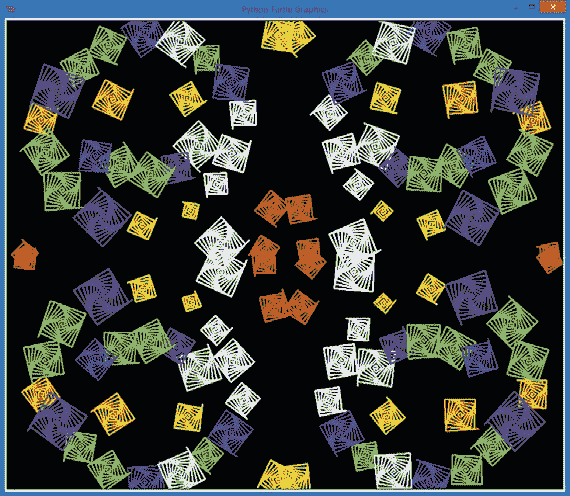

图 7-8. 使用我们的互动万花筒程序，你可以创建任何你想要的反射图案！

尝试你自己的图案（比如你的首字母！），并截图保存结果（在 Windows 中，按住 ALT 和 PRINT SCREEN 键将海龟窗口复制到剪贴板，然后粘贴到 Word 或你最喜欢的绘图程序中；在 Mac 上，按住 COMMAND、SHIFT 和 4 键，然后按空格键，再点击海龟绘图窗口，将图片保存到桌面，文件名为 *Screenshot <日期和时间>.png*）。在 Twitter 上用标签 #kidscodebook 将你最棒的截图发给我，@brysonpayne，我会尽力回复！

# 你学到了什么

在本章中，你学习了如何将可重用的代码块组织成函数，如何从程序的任何地方调用自己的函数，如何将信息作为参数传递给这些函数，以及如何通过返回值从函数中获取信息。我们通过告诉计算机监听鼠标点击和键盘按键，编写了第一个事件驱动的程序，并且你学会了如何编写自己的回调函数来响应用户事件。

我们已经开发了第一个完全互动的程序。运用你在本章中学到的技能，你已经准备好开始编写更先进的应用程序了。我们常用的应用程序通过响应点击、触摸、按键等方式，让用户体验到掌控程序的感觉。

在掌握本章概念后，你应该能够完成以下任务：

+   使用函数使代码更加可重用。

+   将代码组织和分组到函数中。

+   使用`def`关键字在 Python 中定义函数。

+   在你编写的程序中调用你自己的函数。

+   定义并使用接受参数作为输入值的函数。

+   编写函数，当调用时返回值。

+   将数学公式转换为一个返回公式值的函数。

+   解释事件驱动程序的一些特性。

+   编写一个基本的事件驱动应用程序，使用事件处理程序。

+   编写一个接受鼠标点击并在屏幕上绘图的应用程序。

+   编写键盘事件的事件处理程序。

+   编写接受参数的事件处理程序函数。

+   使用屏幕上的 x 和 y 坐标绘制特定的图案，例如万花筒。

编程挑战

这里有三个挑战，旨在扩展你在本章中学到的内容。对于这些挑战的示例答案，请访问*[`www.nostarch.com/teachkids/`](http://www.nostarch.com/teachkids/)*。

**#1: 镜像笑脸**

将*ClickAndSmile.py*和*ClickKaleidoscope.py*程序合并，在屏幕的四个镜像角落绘制笑脸，当你点击时，就像万花筒程序用螺旋图案那样。如果你想挑战更高难度，绘制两个翻转过来的笑脸，使它们真正看起来像是沿 x 轴镜像的。

**#2: 更多乒乓球计算**

修改乒乓球计算器，使其要求用户输入乒乓球的数量。并告诉用户这些乒乓球如果堆叠在一起会有多高，以及这些乒乓球的重量是多少。

**#3: 更好的绘图程序**

修改*ArrowDraw.py*程序，允许用户以更小的增量旋转海龟——例如 45 度（甚至 30 度或 15 度）——以便更精细地控制海龟。然后，添加更多的键盘选项，比如允许用户按下大于符号（>）使绘图长度变长，按下小于符号（<）缩短绘图长度，按下 W 键使画笔变宽，按下 T 键使画笔变细。为了让它成为一个出色的绘图程序，可以通过在屏幕上绘制一条字符串，展示笔宽、段长度和海龟的方向来提供反馈，每次变化后都显示这些信息。

最后，为程序添加一个功能，允许点击重新定位海龟。（提示：创建一个接受两个参数（*x*，*y*）的函数，抬起海龟的笔，移动到（*x*，*y*）位置，然后放下笔。然后，将这个函数的名字传递给`turtle.onscreenclick()`，完成应用程序。）
