# 第八章. 定时器与动画：迪士尼会怎么做？

我在青少年时期学习编程的一种方式是编写简短的游戏和动画，然后修改代码让它做些新事情。我很惊讶自己可以立即看到代码让图形出现在屏幕上，我相信你也会和我一样喜欢这种体验。

游戏和动画有几个共同点。首先，它们很有趣！其次，它们都涉及在屏幕上绘制图形，并随着时间的推移改变这些图形，从而产生运动的错觉。从本书开始，我们就能够绘制图形，但 Turtle 库对于大量的动画或移动对象来说太慢了。在这一章，我们将安装并使用一个新的模块，*Pygame*，它让我们能够绘制、动画化，甚至使用你到目前为止学到的技能创建街机风格的游戏。

# 使用 Pygame 获取所有图形界面

*图形用户界面*（*GUI*，有时读作“gooey”）包括你在计算机屏幕上看到的所有按钮、图标、菜单和窗口；它是你与计算机交互的方式。当你拖放一个文件或点击一个图标打开程序时，你正在享受 GUI。在游戏中，当你按键、移动鼠标或点击时，你之所以能够期待某些事情发生（例如跑步、跳跃、旋转视角等），是因为程序员设置了 GUI。

和 Turtle 库一样，Pygame 非常可视化，非常适合用于游戏、动画等的图形用户界面（GUI）。它几乎可以移植到所有操作系统，从 Windows 到 Mac，再到 Linux 等，因此你在 Pygame 中创建的游戏和程序几乎可以在任何计算机上运行。图 8-1 展示了 Pygame 网站，你可以在这里下载 Pygame。

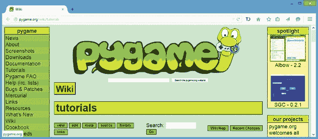

图 8-1. Pygame 是免费的，其网站上的教程和示例游戏也都是免费的。

要开始，首先通过从 *[`www.pygame.org/`](http://www.pygame.org/)* 下载安装程序来安装 `pygame` 模块。对于 Windows，你可能需要下载 *pygame-1.9.1 .win32-py3.1.msi*，如果遇到问题，可以参考附录 B 获取帮助。对于 Mac 和 Linux，安装过程更为复杂；请参见附录 B 或访问 *[`www.nostarch.com/teachkids/`](http://www.nostarch.com/teachkids/)* 获取逐步指导。

你可以通过在 Python shell 中输入以下内容来检查 Pygame 是否安装没有错误：

```
>>> import pygame
```

如果你收到一个常规的 `>>>` 提示符，说明 Python 能够正确找到 `pygame` 模块并没有出错，Pygame 库已经准备好可以使用了。

## 使用 Pygame 绘制一个点

一旦你安装了 Pygame，你可以运行一个简短的示例程序，在屏幕上绘制一个点，就像图 8-2 中的那样。

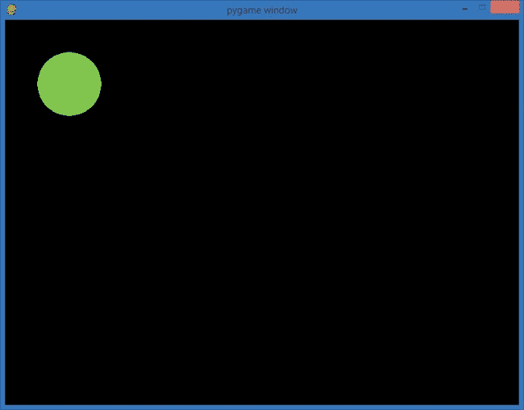

图 8-2. *ShowDot.py* 程序的运行

在一个新的 IDLE 窗口中输入以下代码，或者从 *[`www.nostarch.com/teachkids/`](http://www.nostarch.com/teachkids/)* 下载它：

### ShowDot.py

```
  import pygame

➊ pygame.init()
➋ screen = pygame.display.set_mode([800,600])

➌ keep_going = True
➍ GREEN = (0,255,0)    # RGB color triplet for GREEN
   radius = 50

➎ while keep_going:
➏     for event in pygame.event.get():
➐         if event.type == pygame.QUIT:
               keep_going = False
➑     pygame.draw.circle(screen, GREEN, (100,100), radius)
➒     pygame.display.update()

➓ pygame.quit()
```

让我们逐行分析这个程序。首先，我们导入 `pygame` 模块以访问其功能。在 ➊ 处，我们*初始化* Pygame，或者说为其设置使用环境。每次想使用 Pygame 时，都需要调用 `pygame.init()`，并且它总是紧跟在 `import pygame` 命令之后，位于其他任何 Pygame 函数之前。

在 ➋ 处，`pygame.display.set_mode([800,600])` 创建了一个宽 800 像素、高 600 像素的显示窗口。我们将其存储在名为 `screen` 的变量中。在 Pygame 中，窗口和图形被称为 *表面*，而显示表面 `screen` 是我们所有其他图形将被绘制的主窗口。

在 ➌ 处，你可能会认出我们的循环变量 `keep_going`：我们在第六章中的 *HighCard.py* 和 *FiveDice.py* 游戏循环中也使用了它，作为一个布尔标志来告诉程序继续游戏。在这个 Pygame 示例中，我们使用一个游戏循环来持续绘制图形窗口，直到用户关闭窗口。

在 ➍ 处，我们设置了两个变量，`GREEN` 和 `radius`，用于绘制我们的圆形。`GREEN` 变量被设置为 RGB 三元组值 `(0,255,0)`，一种明亮的绿色。（*RGB*，即 *红绿蓝*，是指定颜色的多种方式之一。选择颜色时，需选择三个数字，每个数字的范围是 0 到 255。第一个数字决定颜色中的红色成分，第二个是绿色成分，第三个是蓝色成分。我们将绿色的值设为 255，红色和蓝色的值设为 0，因此我们的 RGB 颜色是全绿色，且没有红色或蓝色。）我们的 `GREEN` 变量是一个常量。我们有时会将*常量*—即我们不打算改变的变量—写成全大写字母。由于该颜色在整个程序中应保持不变，因此我们为 `GREEN` 使用了全大写字母。我们将 `radius` 变量设置为 50 像素，用于绘制直径为 100 像素的圆形。

在 ➎ 处的 `while` 循环是我们的游戏循环，它将不断运行 Pygame 窗口，直到用户选择退出。➏ 处的 `for` 循环是我们处理用户在程序中触发的所有交互事件的地方。在这个简单的示例中，我们唯一需要检查的事件是用户是否点击了红色的 X 来关闭窗口并退出程序 ➐。如果是这样，`keep_going` 被设置为 `False`，我们的游戏循环结束。

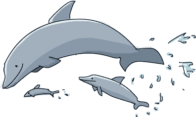

在➑处，我们在`screen`窗口中的位置(100,100)绘制一个半径为 50 的绿色圆圈：从窗口的左上角向右移动 100 像素，向下移动 100 像素（有关 Pygame 坐标系统如何不同于海龟图形的更多信息，请参见 What’s New in Pygame）。我们使用`pygame.draw`，这是 Pygame 的一个模块，用于绘制圆形、矩形和线段等形状。我们将四个参数传递给`pygame.draw.circle()`函数：我们要在其上绘制圆圈的表面（`screen`），圆圈的颜色（`GREEN`），圆心的坐标和半径。位于➒的`update()`函数告诉 Pygame 刷新屏幕并应用绘图的变化。

最后，当用户退出游戏循环时，位于➓的`pygame.quit()`命令会清除`pygame`模块（它撤销了➊中的所有设置），并关闭`screen`窗口，使得程序能够正常退出。

当你运行*ShowDot.py*时，你应该看到一个像图 8-2 中的图像。花些时间玩一下这个点程序——创建一个不同的 RGB 颜色三元组，改变点在屏幕上的位置，或者画第二个点。你将开始看到使用 Pygame 绘制图形的强大功能和简便性，同时也会玩得很开心。

这个第一个程序包含了我们将要基于其构建的基础，之后我们可以创建更复杂的图形、动画，最终制作游戏。

## Pygame 中的新变化

在我们深入探讨 Pygame 的激动人心的世界之前，值得注意的是 Pygame 和我们之前熟悉的海龟图形之间一些重要的区别：

+   我们有了一个新的坐标系统，如图 8-3 所示。在海龟图形中，原点位于屏幕的中心，*y*值随着向上移动而增大。Pygame 使用的是更常见的窗口坐标系统（在许多其他 GUI 编程语言中也会看到这种系统，包括 Java、C++等）。在 Pygame 中，窗口的*左上角*是原点(0, 0)。x 坐标值仍然随着向右移动而增大（但没有负的 x 坐标值，因为它们会在屏幕左侧消失）；y 坐标值随着向下移动而增大（负的 y 坐标值会消失在窗口的顶部）。

    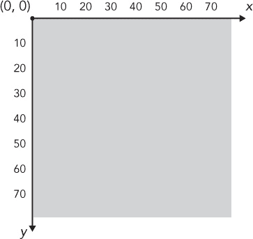

    图 8-3. Pygame 使用窗口坐标系统。

+   游戏循环在 Pygame 中总是被使用。在我们之前的程序中，只有在需要继续播放或者返回重新做某件事时才使用循环，但 Pygame 要求使用游戏循环来持续更新屏幕并处理事件（即使我们处理的唯一事件只是关闭窗口）。

+   我们通过调用 `pygame.event.get()` 来获取用户执行的事件列表，从而处理 Pygame 中的事件。这些事件可能是鼠标点击、按键、甚至是窗口事件，例如用户关闭窗口。我们使用 `for` 循环来处理来自 `pygame.event.get()` 的所有事件。在我们的海龟程序中，我们使用回调函数来处理事件。在 Pygame 中，我们仍然可以创建函数并在事件处理代码中调用它们，但我们可以仅通过 `if` 语句来处理我们关心的事件。

这些差异使得 Pygame 成为解决问题的新方法，这正是我们一直在寻找的！工具越多，我们能解决的问题就越多。

## 游戏的组成部分

在这一节中，我们将修改 *ShowDot.py* 程序，将其显示笑脸图片，而不是绿色圆形，如 图 8-4 所示。

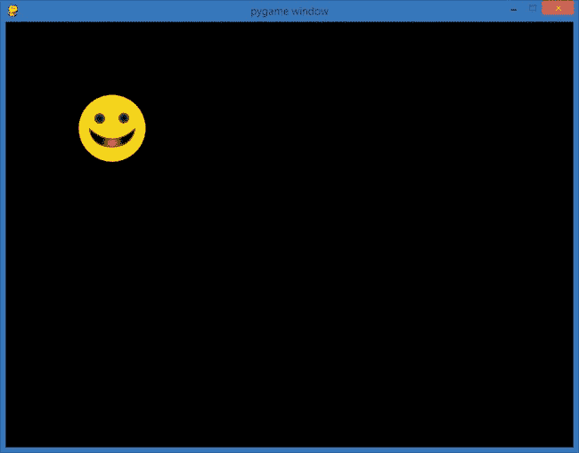

图 8-4. *ShowPic.py* 在屏幕上绘制了图片 *CrazySmile.bmp*。

在构建我们的 *ShowPic.py* 程序时，我们将了解 Pygame 中游戏或动画的三个主要部分。首先是设置阶段，我们在这里导入所需的模块，创建屏幕并初始化一些重要的变量。接着是游戏循环，它处理事件、绘制图形并更新显示。这个游戏循环是一个 `while` 循环，只要用户没有退出游戏，它就会一直运行。最后，我们需要一种方法来在用户退出游戏时结束程序。

### 设置

首先，下载笑脸图片，并将其保存在与 Python 程序相同的文件夹中。访问 *[`www.nostarch.com/teachkids/`](http://www.nostarch.com/teachkids/)* 下载源代码，并将图片 *CrazySmile.bmp* 保存到你保存 *.py* 文件的文件夹中。你保存 *.py* 文件的位置并不重要，只需确保将 BMP（即 *位图*，一种常见的图片文件格式）图片文件保存到相同的位置即可。

接下来，让我们处理设置：

```
   import pygame       # Setup
   pygame.init()
   screen = pygame.display.set_mode([800,600])
   keep_going = True
➊ pic = pygame.image.load("CrazySmile.bmp")
```

一如既往，我们导入 `pygame` 模块，然后使用 `pygame.init()` 函数进行初始化。接下来，我们设置 `screen` 为一个新的 Pygame 窗口，大小为 800×600 像素。我们创建布尔标志 `keep_going` 来控制游戏循环，并将其设为 `True`。最后，我们做了一些新尝试：在 ➊ 处，我们使用 `pygame.image.load()`，它从文件中加载一张图片。我们为图片文件创建一个变量，并加载 *CrazySmile.bmp*，在程序中我们将其称为 `pic`。

### 创建游戏循环

此时，我们还没有绘制任何东西，但我们已经设置了 Pygame 并加载了一张图片。游戏循环是我们实际在屏幕上显示笑脸图片的地方。它也是我们处理用户事件的地方。我们首先处理一个重要的事件：用户选择退出游戏。

```
   while keep_going:    # Game loop
       for event in pygame.event.get():
➊         if event.type == pygame.QUIT:
               keep_going = False
```

我们的游戏循环将持续运行，直到`keep_going`为`True`。在循环内，我们立即检查用户的事件。在高级游戏中，用户可能同时触发许多事件，比如按下键盘上的下箭头、同时移动鼠标向左，并滚动鼠标滚轮。

在这个简单的程序中，我们监听的唯一事件是用户是否点击了关闭窗口按钮来退出程序。我们在➊处进行检查。如果用户尝试关闭窗口并触发了`pygame.QUIT`事件，我们希望告诉游戏循环退出。我们通过将`keep_going`设置为`False`来实现这一点。

我们仍然需要将图像绘制到屏幕上并更新绘图窗口，以确保所有内容都能显示在屏幕上，因此我们将在游戏循环中添加这两行代码：

```
screen.blit(pic, (100,100))
pygame.display.update()
```

`blit()`方法将`pic`（我们从磁盘加载的图像，笑脸）绘制到我们的显示表面`screen`上。当我们希望将一个表面（比如从磁盘加载的图像）上的像素复制到另一个表面（如绘图窗口）时，我们会使用`blit()`。在这里，我们需要使用`blit()`，因为`pygame.image.load()`函数的工作方式不同于我们之前用来绘制绿色圆点的`pygame.draw.circle()`函数。所有`pygame.draw`函数都接受一个表面作为参数，所以通过将`screen`传递给`pygame.draw.circle()`，我们能够让`pygame.draw.circle()`绘制到我们的显示窗口上。但`pygame.image.load()`不接受表面作为参数；相反，它会自动为你的图像创建一个新的、独立的表面。除非你使用`blit()`，否则图像不会出现在原始的绘图屏幕上。

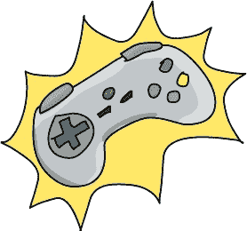

在这种情况下，我们告诉`blit()`，我们希望将`pic`绘制在位置`(100,100)`，即从屏幕左上角向右偏移 100 像素、向下偏移 100 像素（在 Pygame 的坐标系统中，原点是屏幕的左上角；请参见图 8-3）。

我们游戏循环的最后一行是调用`pygame.display.update()`。该命令告诉 Pygame 显示绘图窗口，并展示这一轮循环中所做的所有更改，包括我们的笑脸。当`update()`运行时，窗口将更新，显示所有`screen`表面上的更改。

到目前为止，我们已经完成了设置代码，并且有一个带有事件处理器的游戏循环，监听用户点击关闭窗口按钮的事件。如果用户点击关闭窗口按钮，程序将更新显示并退出循环。接下来，我们将处理程序退出的部分。

### 退出程序

我们代码的最后一部分将在用户选择退出游戏循环后退出程序：

```
pygame.quit()      # Exit
```

如果你的程序中没有这一行，显示窗口在用户尝试关闭时会保持打开状态。调用`pygame.quit()`可以关闭显示窗口，并释放存储图像`pic`的内存。

### 汇总

将所有代码组合在一起，你将看到我们的*CrazySmile.bmp*图像文件——前提是你已将图像保存在与*ShowPic.py*程序文件相同的目录下。以下是完整的代码：

#### ShowPic.py

```
import pygame        # Setup
pygame.init()
screen = pygame.display.set_mode([800,600])
keep_going = True
pic = pygame.image.load("CrazySmile.bmp")
while keep_going:    # Game loop
    for event in pygame.event.get():
        if event.type == pygame.QUIT:
            keep_going = False
    screen.blit(pic, (100,100))
    pygame.display.update()

pygame.quit()        # Exit
```

当你点击关闭窗口按钮时，显示窗口应该会关闭。

这段代码包含了我们将用来构建更加互动的程序的所有基本组件。在本章的其余部分以及在第九章中，我们将向游戏循环中添加代码，以响应不同的事件（例如，当用户移动鼠标时，屏幕上的图像也随之移动）。现在，让我们看看如何创建一个绘制动画跳跃球的程序！

# 恰到好处的时机：移动和弹跳

我们已经具备了创造动画的技能，或者说是运动的幻觉，只需对我们的*ShowPic.py*程序做一个小改动。我们不再每次都将笑脸图像显示在固定的位置，而是每帧稍微改变一下位置。这里的*帧*是指游戏循环中的每次循环。这个术语来源于动画制作的方式：他们绘制数千张单独的图片，使每张图片与前一张有所不同。一张图片被视为一帧。然后，动画师将所有的图片拼接在一条胶片上，并通过放映机播放。当这些图片以非常快的速度依次显示时，就看起来像是画中的人物在运动。

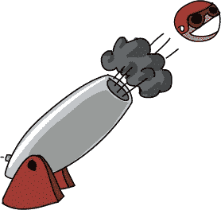

使用计算机，我们可以通过在屏幕上绘制一张图片、清空屏幕、稍微移动图片，然后重新绘制它，来创造出相同的效果。这个效果看起来有点像图 8-5。

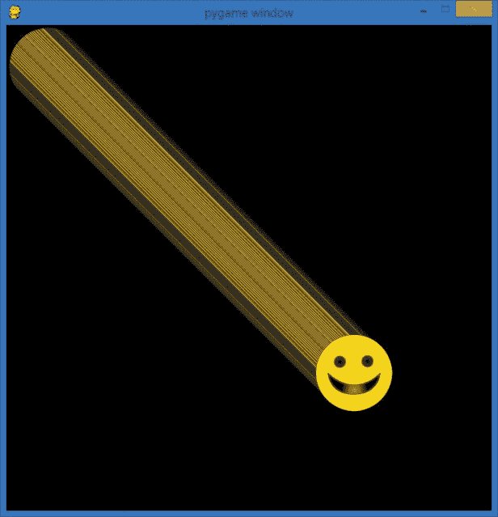

图 8-5。在第一次尝试动画时，我们的笑脸图像会从屏幕上滑出。

我们仍然称每一帧绘制为一个*帧*，动画的速度则是我们每秒绘制的*帧数 (fps)*。一款视频游戏可能会以每秒 60 到 120 帧的速度运行，就像高清电视一样。美国的老式标清电视运行在 30 fps，而许多电影放映机的帧率是 24 fps（新型的高清数字放映机可以运行到 60 fps 或更高）。

如果你曾制作或见过翻书动画（即在笔记本的角落上绘画，然后翻动它们以创建迷你卡通），你就知道，可以通过不同的帧率创建运动的错觉。我们的目标是约 60 帧每秒，足够快以创建平滑的动画。

## 移动表情符号

我们可以通过在`while`循环中绘制表情符号图像在不同位置上来实现简单的运动。换句话说，在我们的游戏循环中，我们只需要更新图片的(*x*, *y*)位置，并且每次循环时在新的位置绘制它。

我们将向*ShowPic.py*中添加两个变量：`picx`和`picy`，分别表示图像在屏幕上的 x 和 y 坐标。我们将在程序的设置部分末尾添加这两个变量，然后将程序的新版本保存为*SmileyMove.py*（最终版本见 SmileyMove.py）。

```
   import pygame       # Setup
   pygame.init()
➊ screen = pygame.display.set_mode([600,600])
   keep_going = True
   pic = pygame.image.load("CrazySmile.bmp")
➋ colorkey = pic.get_at((0,0))
➌ pic.set_colorkey(colorkey)
   picx = 0
   picy = 0
```

### 注意

*第* ➋ *行和* ➌ *行是一个可选的修复，解决了一个小问题。如果* CrazySmile.bmp *图像在您的屏幕上看起来有黑色方形角落，您可以包含这两行代码以确保这些角落看起来是透明的。*

请注意，我们也将窗口屏幕的尺寸更改为 600×600 像素，使窗口在➊处变为正方形。游戏循环将以与*ShowPic.py*中相同的方式开始，但我们会添加代码，每次循环运行时将`picx`和`picy`变量的值增加 1 像素：

```
while keep_going:    # Game loop
    for event in pygame.event.get():
        if event.type == pygame.QUIT:
            keep_going = False

    picx += 1        # Move the picture
    picy += 1
```

`+=`运算符将某些值加到左侧的变量（`picx`和`picy`）上，所以通过`+= 1`，我们告诉计算机每次循环时将图片的 x 和 y 坐标`(picx, picy)`分别改变 1 像素。

最后，我们需要将图像复制到新位置并显示，更新显示内容，并告诉我们的程序如何退出：

```
    screen.blit(pic, (picx, picy))
    pygame.display.update()
pygame.quit()        # Exit
```

如果你运行这些代码，你会看到我们的图像飞速移动！事实上，你得快点看，因为它会快速离开屏幕。

请回顾图 8-5，以了解表情符号图像在它滑出视野之前的样子。

第一个版本可能会在表情符号图像离开绘图窗口时，屏幕上仍留下像素痕迹。我们可以通过在每一帧之间清除屏幕来让动画看起来更干净。我们看到的表情符号背后留下的拖尾线是表情符号图像的左上角像素；每次我们在每一帧中向下和向右移动来绘制图像的一个新版本并更新显示时，我们都会留下上一张图像的一些散落像素。

我们可以通过在绘图循环中添加一个`screen.fill()`命令来解决这个问题。`screen.fill()`命令接受一个颜色作为参数，所以我们需要告诉它我们想要使用哪种颜色来填充绘图屏幕。我们为`BLACK`添加一个变量（使用全大写的`BLACK`表示它是一个常量），并将其设置为黑色的 RGB 色彩三元组`(0,0,0)`。在我们绘制每一帧新图像之前，先用黑色像素填充屏幕，从而有效地清除它。

在`picy = 0`之后立即在设置中添加这一行，以创建黑色背景填充颜色：

```
BLACK = (0,0,0)
```

并且在绘制我们的`pic`图像到屏幕上的`screen.blit()`语句前添加这一行：

```
screen.fill(BLACK)
```

我们的笑脸依旧飞速离开屏幕，但这次我们并没有在移动的图像后面留下像素的痕迹。通过用黑色像素填充屏幕，我们在每一帧中“擦除”旧的图像，然后在新位置绘制新图像。这就创造了更加流畅的动画效果。然而，在一台相对较快的电脑上，我们的笑脸飞出屏幕的速度太快了。为了解决这个问题，我们需要一个新的工具：一个计时器或时钟，可以保持我们每秒固定的帧数。

## 使用`Clock`类为笑脸动画添加动画效果

让我们的*SmileyMove.py*应用程序像游戏或电影中的动画一样表现出来的最后一块拼图是限制每秒绘制的帧数。目前，我们每次在游戏循环中只让笑脸图像向下移动 1 个像素，向右移动 1 个像素，但我们的电脑可以如此迅速地绘制这个简单场景，产生每秒数百帧，从而导致笑脸瞬间飞出屏幕。

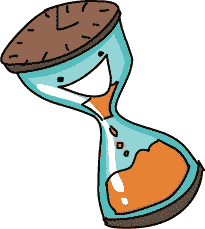

流畅的动画每秒需要 30 到 60 帧，因此我们不需要每秒数百帧的快速闪过。

Pygame 有一个可以帮助我们控制动画速度的工具：`Clock`类。*类*就像一个模板，可以用来创建某种类型的*对象*，这些对象具有一些功能和数值，帮助它们以特定方式运行。可以把类看作是饼干模具，而对象就是饼干：当我们想要做某种形状的饼干时，我们会制作一个可以随时用来做出同样形状饼干的模具。就像函数帮助我们将可重用的代码打包在一起一样，类允许我们将数据和函数打包成一个可重用的模板，我们可以用它来创建面向未来程序的对象。

我们可以通过以下这行代码在程序的设置中添加一个`Clock`类的对象：

```
timer = pygame.time.Clock()
```

这会创建一个名为`timer`的变量，链接到一个`Clock`对象。这个`timer`将允许我们在每次游戏循环时轻轻暂停，等待足够的时间，以确保我们不会绘制超过每秒设定帧数的图像。

在我们的游戏循环中添加以下行，将通过让我们名为`timer`的`Clock`每秒仅“tick” 60 次，保持帧率为 60 帧每秒：

```
timer.tick(60)
```

以下代码，*SmileyMove.py*，展示了整个应用程序的实现。它呈现了一个平滑、稳定的动画笑脸，慢慢滑出屏幕的右下角。

### SmileyMove.py

```
import pygame                # Setup
pygame.init()
screen = pygame.display.set_mode([600,600])
keep_going = True
pic = pygame.image.load("CrazySmile.bmp")
colorkey = pic.get_at((0,0))
pic.set_colorkey(colorkey)
picx = 0
picy = 0
BLACK = (0,0,0)
timer = pygame.time.Clock()  # Timer for animation

while keep_going:            # Game loop
    for event in pygame.event.get():
        if event.type == pygame.QUIT:
            keep_going = False

    picx += 1                # Move the picture
    picy += 1

    screen.fill(BLACK)       # Clear screen
    screen.blit(pic, (picx,picy))
    pygame.display.update()
    timer.tick(60)           # Limit to 60 frames per second

pygame.quit()                # Exit
```

剩下的问题是，笑脸仍然会在几秒钟内完全滑出屏幕。这并不有趣。让我们修改程序，使笑脸保持在屏幕上，并在角落之间反弹。

## 让笑脸从墙上反弹

我们通过改变每次游戏循环中绘制图像的位置，加入了从一帧到下一帧的运动。我们已经看到如何通过添加`Clock`对象并告诉它每秒`tick()`多少次来调节动画的速度。在这一部分，我们将看到如何让笑脸保持在屏幕上。效果将类似于图 8-6，笑脸似乎在绘图窗口的两个角落之间来回反弹。

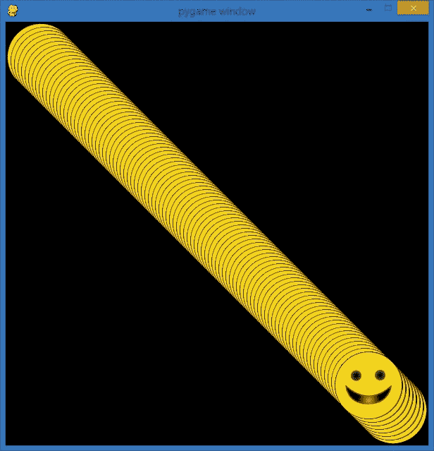

图 8-6。我们的目标是让笑脸在屏幕的角落之间“反弹”。

我们的图像之前跑出屏幕的原因是因为我们没有为动画设置*边界*或限制。我们在屏幕上绘制的一切都是*虚拟的*——意味着它们并不存在于现实世界中——因此物体并不会真正互相碰撞。如果我们希望屏幕上的虚拟物体进行交互，我们必须通过编程逻辑来创建这些交互。

### 撞墙

当我说我们希望笑脸“反弹”出屏幕的边缘时，我的意思是，当笑脸到达屏幕的边缘时，我们希望改变它的移动方向，使其看起来像是从屏幕的固体边缘反弹回来。为此，我们需要测试笑脸的`(picx,picy)`位置是否到达了屏幕边缘的虚拟边界。我们称这种逻辑为*碰撞检测*，因为我们正试图*检测*或注意到*碰撞*发生的时刻，比如笑脸图像“撞到”绘图窗口的边缘。

我们知道可以使用`if`语句来测试条件，所以我们可以通过检查`picx`是否大于某个值，来判断我们的图像是否与屏幕的右侧“接触”或*碰撞*。

让我们来推测一下这个值可能是什么。我们知道我们的屏幕宽度是 600 像素，因为我们通过`pygame.display.set_mode([600,600])`创建了屏幕。我们可以使用 600 作为边界，但笑脸依然会滑出屏幕的边缘，因为坐标对`(picx,picy)`是我们笑脸图像左上角的像素位置。

为了找到我们的逻辑边界——也就是 `picx` 必须到达的虚拟线，以使我们的笑脸看起来像是撞上了 `screen` 窗口的右边缘——我们需要知道图片的宽度。因为我们知道 `picx` 是图像的左上角，并且它会向右移动，我们只需将图片的宽度加到 `picx` 上，当这个和等于 600 时，我们就知道图像的右边缘触碰到了窗口的右边缘。

查找图像宽度的一种方法是查看文件的属性。在 Windows 中，右键点击 *CrazySmile.bmp* 文件，选择“属性”菜单项，然后点击“详细信息”选项卡。在 Mac 上，点击选择 *CrazySmile.bmp* 文件，按下  -I 获取文件信息窗口，然后点击“更多信息”。你将看到图像的宽度和高度，如 图 8-7 所示。

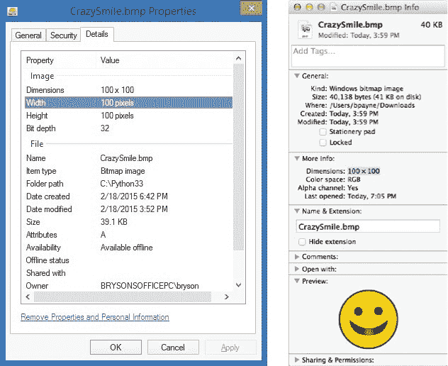

图 8-7. 为了确定我们的虚拟边界，以便让我们的笑脸能够反弹，我们需要知道图像文件的宽度。

我们的 *CrazySmile.bmp* 文件的宽度是 100 像素（高度也是 100 像素）。所以如果我们的 `screen` 当前是 600 像素宽，而 `pic` 图像需要 100 像素来显示完整图像，那么我们的 `picx` 必须保持在 x 方向上小于 500 像素。图 8-8 展示了这些测量值。

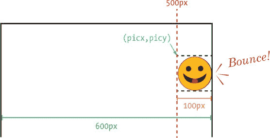

图 8-8. 计算与窗口右侧的反弹

但是，如果我们更改了图像文件或希望处理不同宽度和高度的图像怎么办呢？幸运的是，Pygame 在 `pygame.image` 类中提供了一个方便的函数，我们的图片变量 `pic` 就是利用这个函数。函数 `pic.get_width()` 返回存储在 `pygame.image` 变量 `pic` 中图像的宽度（以像素为单位）。我们可以使用这个函数，而不是将程序硬编码为只能处理宽度为 100 像素的图像。类似地，`pic.get_height()` 给出存储在 `pic` 中图像的高度（以像素为单位）。

我们可以使用如下语句测试图像 `pic` 是否已经超出了屏幕的右边缘：

```
if picx + pic.get_width() > 600:
```

换句话说，如果图片的起始 x 坐标加上图片的宽度大于屏幕的宽度，我们就知道图像已经超出了屏幕的右边缘，我们可以改变图像的运动方向。

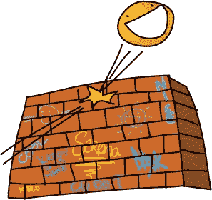

### 改变方向

“反弹”意味着在撞到屏幕边缘后朝相反的方向移动。图像的移动方向是由 `picx` 和 `picy` 的更新控制的。在我们以前的 *SmileyMove.py* 中，我们每次通过 `while` 循环时，都会用这两行代码给 `picx` 和 `picy` 各加 1 像素：

```
picx += 1
picy += 1
```

然而，这些代码每次都会让我们的图像向右和向下各移动 1 像素；没有出现“反弹”或者方向改变，因为我们从未改变过添加到`picx`和`picy`的数值。这两行代码意味着我们可以确保每一帧都会以每帧 1 像素的速度向右和向下移动，即使笑脸已经离开了屏幕。

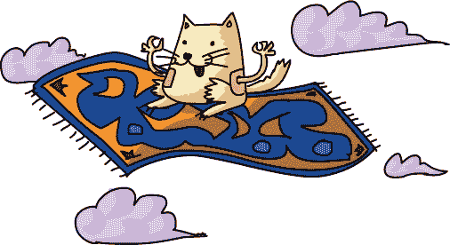

另外，我们可以将常量值 `1` 改为一个变量，来表示*速度*，即每一帧图像应该移动的像素数。速度是指在一段时间内的移动量。例如，在短时间内移动得很快的车在以*高速*行驶，而在相同时间内几乎不动的蜗牛则在以*低速*爬行。我们可以在程序的设置部分定义一个名为 `speed` 的变量，表示每一帧所希望的像素移动量：

```
speed = 5
```

然后，在我们的游戏循环中，我们只需要每次通过循环时，将 `picx` 和 `picy` 按照新的速度值（而不是常量 `1`）进行改变：

```
picx += speed
picy += speed
```

在 *SmileyMove.py* 中，60 帧每秒时，每帧 1 像素的速度显得有些慢，所以我将速度提高到了 5 像素，让它移动得更快。但我们仍然没有让图像从屏幕的右边缘反弹回来；我们只是很快地让它移出了屏幕，因为当碰到屏幕边缘时，`speed` 变量并没有发生变化。

我们可以通过添加碰撞检测逻辑来解决这个问题，也就是测试图像是否碰到了屏幕的左或右边缘：

```
if picx <= 0 or picx + pic.get_width() >= 600:
    speed = -speed
```

首先，我们通过检查`picx`是否试图绘制在负的 x 坐标值（也就是屏幕左侧，`x < 0`），或者`picx + pic.get_width()`是否超过了屏幕的 600 像素宽度（即图片的起始 x 坐标加上它的宽度已经超出了屏幕的右边缘）来检查屏幕的左右边界。如果发生其中任一情况，我们就知道图像已超出边界，需要改变方向。

注意我们在进行边界测试时使用的小技巧。如果其中任何一个边界测试的结果为`True`，通过设置`speed = -speed`，我们就通过将`speed`乘以-1，或者将它改为自身的相反数，来改变移动的*方向*。可以这么理解：如果我们继续以`speed`等于`5`的速度循环，直到我们的`picx`加上图片的宽度碰到屏幕右边缘（600 像素）（`picx + pic.get_width() >= 600`），设置`speed = -speed`会将`speed`从`5`变为`-5`（负五）。然后，每当我们的`picx`和`picy`在下一次循环中变化时，我们将会把`-5`加到我们的坐标上。这等于*减去* 5，意味着我们在屏幕上向*左和上*移动。如果这样工作的话，我们的笑脸就会从屏幕的右下角反弹开始，开始向*后*移动，回到屏幕的左上角（0，0）的位置。

但这还不是全部！因为我们的`if`语句还在检查左边界（`picx <= 0`），当我们的笑脸看起来像是撞到了屏幕的左侧时，它会再次将`speed`的值改为`-speed`。如果`speed`是`-5`，这会将其改为`-(-5)`，即`+5`。所以，如果我们的负值`speed`变量导致我们每帧向左和向上移动 5 个像素，一旦我们在屏幕的左边缘遇到`picx <= 0`，`speed = -speed`会把`speed`改回正值`5`，然后笑脸图像会重新开始向*右和下*移动，沿着正方向的 x 轴和 y 轴。

### 整合所有内容

尝试我们应用的 1.0 版本，*SmileyBounce1.py*，看看笑脸如何从窗口的左上角跳到右下角，再返回，始终不离开绘图区域。

#### SmileyBounce1.py

```
import pygame       # Setup
pygame.init()
screen = pygame.display.set_mode([600,600])
keep_going = True
pic = pygame.image.load("CrazySmile.bmp")
colorkey = pic.get_at((0,0))
pic.set_colorkey(colorkey)
picx = 0
picy = 0
BLACK = (0,0,0)
timer = pygame.time.Clock()
speed = 5

while keep_going:    # Game loop
    for event in pygame.event.get():
         if event.type == pygame.QUIT:
            keep_going = False
    picx += speed
    picy += speed

    if picx <= 0 or picx + pic.get_width() >= 600:
        speed = -speed

    screen.fill(BLACK)
    screen.blit(pic, (picx,picy))
    pygame.display.update()
    timer.tick(60)

pygame.quit()       # Exit
```

使用这个版本的程序，我们创建了一个看起来像是在两个角落之间平滑跳动的笑脸。我们之所以能够实现这个效果，恰恰是因为窗口是一个完美的正方形，大小为 600×600 像素，并且因为我们始终以相同的值（`speed`）来更改`picx`和`picy`——我们的笑脸只在* x = y*的对角线上移动。通过保持图像在这条简单的路径上，我们只需检查`picx`是否越过了屏幕左右边缘的边界值。

如果我们想要让笑脸从屏幕的四个边（上、下、左、右）反弹，并且窗口不是完美的正方形——比如说 800×600 的尺寸，我们需要添加一些逻辑来检查`picy`变量，看看它是否越过了上边界或下边界（屏幕的顶部或底部），并且我们还需要分别跟踪水平和垂直的速度。接下来我们会做这些。

## 让笑脸弹跳四个墙壁

在*SmileyBounce1.py*中，我们保持水平（左右）和垂直（上下）运动的锁定，使得每当图像向右移动时，它也会向下移动，而每当图像向左移动时，它也会向上移动。这在我们的正方形窗口中效果很好，因为屏幕的宽度和高度是相同的。让我们在这个例子基础上，创建一个弹跳动画，使其能在绘图窗口的四个边缘上真实地反弹。我们将把窗口大小设置为 800×600 像素，使用`screen = pygame.display.set_mode([800,600])`来使动画更加有趣。

### 水平和垂直速度

首先，让我们将速度的水平和垂直分量分开。换句话说，我们为*水平*速度（图像向左或向右移动的速度）创建一个速度变量`speedx`，为*垂直*速度（图像向上或向下移动的速度）创建另一个速度变量`speedy`。我们可以通过在应用程序的设置部分将`speed = 5`修改为初始化`speedx`和`speedy`，如下所示：

```
speedx = 5
speedy = 5
```

然后，我们可以在游戏循环中修改图像位置的更新：

```
picx += speedx
picy += speedy
```

我们通过`speedx`（水平速度）来改变`picx`（水平或 x 位置），通过`speedy`（垂直速度）来改变`picy`（垂直或 y 位置）。

### 碰撞四个墙壁

最后需要解决的是屏幕四个边缘（上下左右）的边界碰撞检测。首先，让我们修改左右边界，以匹配新的屏幕大小（宽度为 800 像素），并使用新的水平速度`speedx`：

```
if picx <= 0 or picx + pic.get_width() >= 800:
    speedx = -speedx
```

注意，左边界的情况仍然保持不变，即`picx <= 0`，因为当`picx`位于屏幕左侧时，0 仍然是左边界的值。不过，这次右边界的情况已经改为`picx + pic.get_width() >= 800`，因为我们的屏幕现在是 800 像素宽，而图像仍然从`picx`开始，然后向右绘制完整的宽度。所以，当`picx + pic.get_width()`等于 800 时，我们的笑脸就看起来像是碰到了绘图窗口的右侧。

我们稍微修改了左右边界触发的动作，将`speed = -speed`改为`speedx = -speedx`。现在我们有了两个速度分量，`speedx`将控制左右方向和速度（`speedx`的负值会让笑脸向左移动，正值则会让它向右移动）。所以，当笑脸碰到屏幕右边缘时，我们将`speedx`设为负值，让图像向左移动；当它碰到屏幕左边缘时，我们将`speedx`设为正值，让图像反弹回右边。


让我们对`picy`做同样的处理：

```
if picy <= 0 or picy + pic.get_height() >= 600:
    speedy = -speedy
```

为了测试我们的笑脸图标是否碰到了屏幕的顶部边缘，我们使用`picy <= 0`，这与测试左边缘的`picx <= 0`类似。为了判断笑脸图标是否碰到了屏幕的底部边缘，我们需要知道绘图窗口的高度（600 像素）和图像的高度（`pic.get_height()`），然后判断图像的顶部`picy`加上图像的高度`pic.get_height()`是否超过了屏幕的高度 600 像素。

如果`picy`超出了上下边界，我们需要改变垂直速度的方向（`speedy = -speedy`）。这样，笑脸图标看起来就像是从窗口的底部反弹并向上移动，或者从顶部反弹并向下移动。

### 整合全部功能

当我们将整个程序整合到*SmileyBounce2.py*中时，我们得到了一个令人信服的弹跳球，它能够在运行应用程序时，反弹穿过屏幕的四个边缘。

#### SmileyBounce2.py

```
import pygame        # Setup
pygame.init()
screen = pygame.display.set_mode([800,600])
keep_going = True
pic = pygame.image.load("CrazySmile.bmp")
colorkey = pic.get_at((0,0))
pic.set_colorkey(colorkey)
picx = 0
picy = 0
BLACK = (0,0,0)
timer = pygame.time.Clock()
speedx = 5
speedy = 5

while keep_going:    # Game loop
    for event in pygame.event.get():
        if event.type == pygame.QUIT:
            keep_going = False
    picx += speedx
    picy += speedy

    if picx <= 0 or picx + pic.get_width() >= 800:
        speedx = -speedx
    if picy <= 0 or picy + pic.get_height() >= 600:
        speedy = -speedy

    screen.fill(BLACK)
    screen.blit(pic, (picx, picy))
    pygame.display.update()
    timer.tick(60)

pygame.quit()        # Exit
```

弹跳效果看起来很真实。如果笑脸图标以 45 度角朝着底部边缘靠近，并且向右下方移动，它会以 45 度角反弹，向右上方移动。你可以通过改变`speedx`和`speedy`的不同值（例如，`3`和`5`，或者`7`和`4`）来观察每次反弹时角度的变化。

纯粹为了好玩，你可以注释掉`screen.fill(BLACK)`这一行代码，在*SmileyBounce2.py*中查看笑脸图标在每次与屏幕边缘反弹时所走的路径。当你*注释掉*一行代码时，通过在行首加上井号，你可以将该行代码变成注释，像这样：

```
# screen.fill(BLACK)
```

这告诉程序忽略该行指令。现在，屏幕在每次绘制笑脸图标后不会被清除，你会看到一个由你的动画留下的轨迹，像在图 8-9 中一样形成的图案。由于每个新的笑脸图标覆盖在前一个图标上，最终的效果看起来像是酷炫的复古 3D 屏幕保护程序艺术作品。

我们的碰撞检测逻辑使得我们能够创建一个逼真的笑脸图标，在一个完整的绘图屏幕上反弹并与四个边缘碰撞。相比于我们原来的版本，笑脸图标不再滑向无尽的空白，而是反弹回去。我们在创建允许用户与屏幕上的元素进行交互的游戏时，就会使用类似的碰撞检测和边界检查技术，例如在《俄罗斯方块》游戏中，我们也使用了这种碰撞检测。

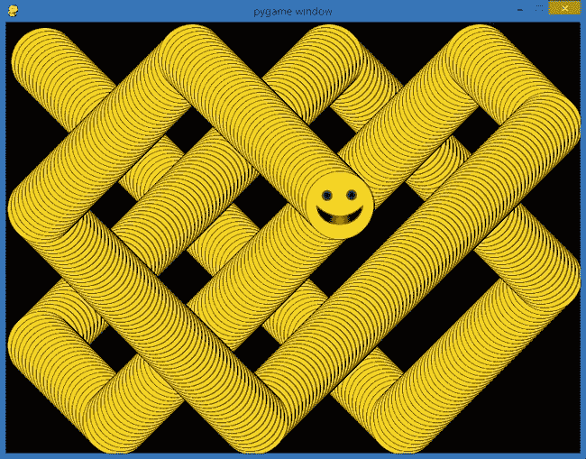

图 8-9。如果我们注释掉每帧后清除屏幕的那一行代码，笑脸图标在屏幕上留下一个有趣的弹跳轨迹。

# 你学到的知识

在这一章中，你学会了如何通过在屏幕上不断地绘制图像来创造运动的错觉，我们称之为*动画*。我们看到 Pygame 模块可以让编程游戏或动画变得更快速，因为它有成百上千个函数，可以让游戏应用中的几乎每一件事都变得更加简单，从绘制图像到创建基于计时器的动画——甚至是检测碰撞。我们在计算机上安装了 Pygame，以便利用其功能创建我们自己的有趣应用程序。

你学到了我们可能在 Pygame 中构建的游戏或应用程序的结构，包括一个设置部分；一个处理事件、更新和绘制图形、更新显示的游戏循环；以及最后的退出部分。

我们通过在屏幕上指定位置绘制一个简单的绿色圆点来开始 Pygame 编程，但我们很快转向从磁盘上的图像文件绘制图片，图像文件保存在与程序相同的文件夹中，并将其显示到屏幕上。你学到 Pygame 与 Turtle 库使用不同的坐标系统，屏幕的左上角为原点(0, 0)，y 坐标值随着向下移动而增大。

你学会了如何通过在屏幕上绘制物体、清除屏幕并在稍微不同的位置重新绘制物体来创建动画。我们发现`pygame.time.Clock()`对象可以通过限制每秒动画绘制次数来使我们的动画更加稳定，这个限制被称为*每秒帧数*，或*fps*。

我们构建了自己的碰撞检测来检查物体是否“撞到”屏幕边缘，然后我们添加了逻辑，通过改变物体的速度或速度变量的方向（通过将它们乘以-1）使物体看起来像是弹回去的。

本章编写这些酷炫应用程序让我们掌握了以下技能：

+   在我们的 Python 程序中安装并使用`pygame`模块。

+   解释 Pygame 应用程序的结构，包括设置、游戏循环和退出部分。

+   构建一个游戏循环，处理事件，更新和绘制图形，并更新显示。

+   使用`pygame.draw`函数在屏幕上绘制形状。

+   使用`pygame.image.load()`从磁盘加载图像。

+   使用`blit()`函数将图像和物体绘制到屏幕上。

+   通过不断地在不同的位置绘制物体来创建动画。

+   使用`pygame.time.Clock()`计时器的`tick()`函数来限制每秒帧数，使动画变得平滑、整洁且可预测。

+   通过构建`if`逻辑来检查边界情况，检测碰撞，比如图形碰到屏幕边缘时的情况。

+   通过改变每帧中物体在 x 和 y 方向的移动量，控制物体在屏幕上水平和垂直的运动速度。

编程挑战

这里有三个挑战问题，可以扩展你在本章中学到的技能。样例答案请访问 *[`www.nostarch.com/teachkids/`](http://www.nostarch.com/teachkids/)*。

**#1: 一个变色的点**

让我们进一步探索 RGB 颜色三元组。本章中我们已经使用了一些 RGB 颜色；记住，绿色是`(0,255,0)`，黑色是`(0,0,0)`，等等。在 *[`colorschemer.com/online/`](http://colorschemer.com/online/)* 上，输入不同的红色、绿色和蓝色值（0 到 255 之间），你可以查看通过组合不同的红、绿、蓝光来创建的颜色。首先，选择一个你自己喜欢的颜色三元组来用于 *ShowDot.py* 程序。然后修改程序，使得点可以更大或更小，并且位于屏幕的不同位置。最后，尝试使用 `random.randint(0,255)` 为每个颜色分量创建一个随机的 RGB 颜色三元组（记得在程序顶部 `import random`），使得每次绘制时点的颜色都会变化。效果将是一个变色的点。将你的新程序命名为 *DiscoDot.py*。

**#2: 100 个随机点**

作为第二个挑战，让我们用 100 个随机颜色、大小和位置的点替代单个点。为此，我们需要设置三个数组，分别能存储 100 个颜色、位置和大小的值：

```
# Colors, locations, sizes arrays for 100 random dots
colors = [0]*100
locations = [0]*100
sizes = [0]*100
```

然后，填充这三个数组，分别为 100 个随机点的颜色三元组、位置对和大小/半径值：

```
import random
# Store random values in colors, locations, sizes
for n in range(100):
    colors[n] = (random.randint(0,255),random.randint(0,255),
                 random.randint(0,255))
    locations[n] = (random.randint(0,800),
                    random.randint(0,600))
    sizes[n] = random.randint(10, 100)
```

最后，在我们的`while`循环中，不再绘制一个点，而是添加一个`for`循环，使用`colors`、`locations`和`sizes`数组绘制 100 个随机点：

```
for n in range(100):
    pygame.draw.circle(screen, colors[n], locations[n],
                       sizes[n])
```

将你的新创建命名为*RandomDots.py*。最终的应用程序完成后应该类似于图 8-10。

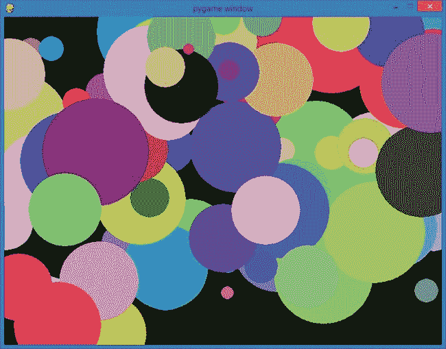

图 8-10. 我们的点程序的高级版本，*RandomDots.py*，展示了 100 个随机颜色、位置和大小的点。

**#3: 下雨的点**

最后，让我们将 *RandomDots.py* 进一步扩展，编程让这些点从屏幕的底部和右侧“下雨”，然后从顶部和左侧重新出现。你在本章中学到，通过随着时间变化改变物体的位置来创建动画。我们将每个点的位置保存在一个名为 `locations` 的数组中，所以如果我们改变每个点的 x 和 y 坐标，就能实现点的动画。将 *RandomDots.py* 中的 `for` 循环更改为，根据之前的值计算每个点的新的 x 和 y 坐标，如下所示：

```
for n in range(100):
    pygame.draw.circle(screen, colors[n], locations[n],
                       sizes[n])
    new_x = locations[n][0] + 1
    new_y = locations[n][1] + 1
    locations[n] = (new_x, new_y)
```

这个变化会在每次游戏循环中为每个点计算新的 x 和 y 坐标（`new_x`和`new_y`），但它允许这些点从屏幕的右侧和底部掉落。我们可以通过检查每个点的`new_x`或`new_y`是否超出了屏幕的右边或底边来修复这个问题，如果是的话，就将点移回到屏幕的顶部或左侧，然后再存储新的位置：

```
if new_x > 800:
    new_x -= 800
if new_y > 600:
    new_y -= 600
locations[n] = (new_x, new_y)
```

这些变化的综合效果是，随机点会稳定地“下落”并向右移动，消失在屏幕的右下角，然后从顶部或左侧重新出现。在图 8-11 中展示了这一序列的四帧图像；你可以跟踪这些点群在三张图像中向下和向右移动的过程。

将你的新应用保存为*RainingDots.py*。

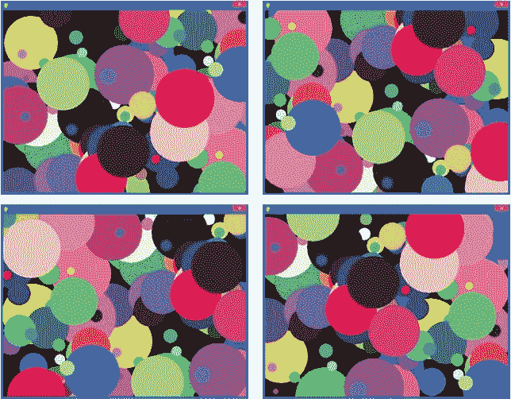

图 8-11. 四帧图像展示了 100 个随机点随着时间向右和向下移动穿过屏幕
