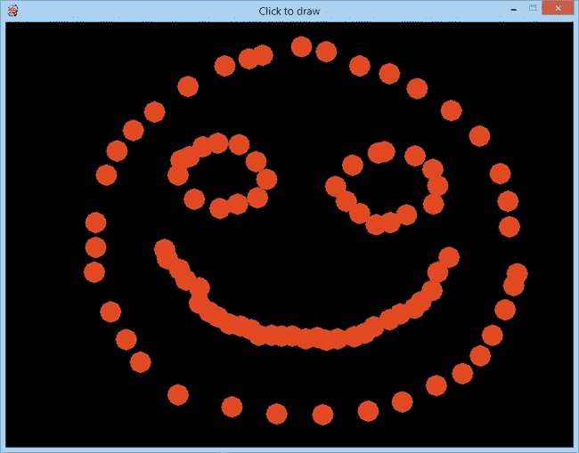
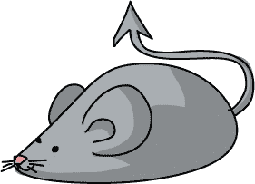
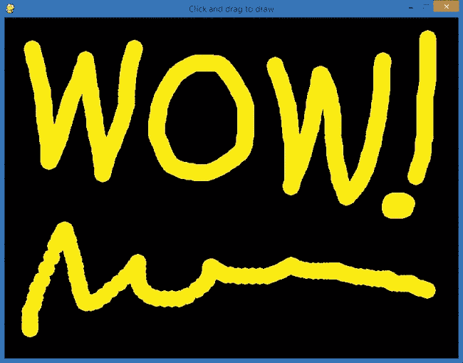
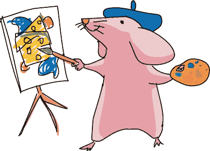
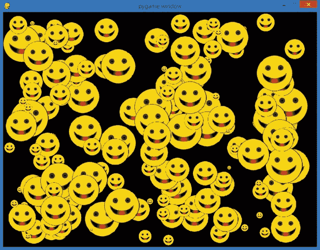
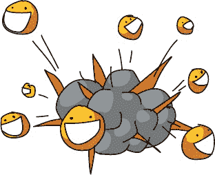
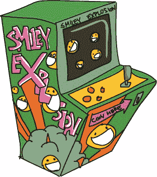
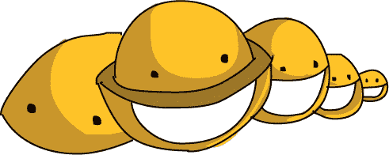
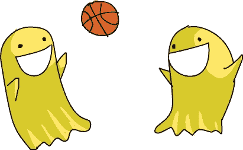

# 第九章 用户交互：进入游戏

在第八章中，我们使用了 Pygame 库的一些功能在屏幕上绘制形状和图像。我们还能够通过在不同的位置随时间绘制形状来创建动画。不幸的是，我们无法像在游戏中那样*与*动画对象进行交互；我们希望能够点击、拖动、移动、击打或弹出屏幕上的对象，从而影响或控制游戏的元素。

交互式程序给我们带来了在应用或游戏中控制的感觉，因为我们可以移动或与程序中的角色或其他对象互动。这正是你将在本章中学到的内容：我们将利用 Pygame 处理来自鼠标的用户交互，使我们的程序更加互动，更具吸引力。

# 添加交互：点击和拖动

让我们通过开发两个程序来添加用户交互，允许用户在屏幕上进行互动绘制。首先，我们将在 Pygame 基础上构建程序，处理鼠标按钮点击等事件，并让用户在屏幕上绘制点。然后，我们将添加逻辑，单独处理鼠标按钮的按下和释放，并让用户在按住按钮的情况下拖动鼠标进行绘制，类似于绘图程序。

## 点击绘制点

我们将使用与*ShowPic.py*相同的步骤来构建*ClickDots.py*程序（退出程序），包括设置、游戏循环和退出。请特别注意游戏循环中的事件处理部分，因为我们将在其中添加`if`语句来处理鼠标点击。

### 设置

以下是我们设置的前几行代码。创建一个新文件，并将其保存为*ClickDots.py*（最终程序见将所有内容整合）。

```
import pygame                           # Setup
pygame.init()
screen = pygame.display.set_mode([800,600])
pygame.display.set_caption("Click to draw")
```

我们的设置首先是像往常一样`import pygame`和`pygame.init()`，然后我们创建一个`screen`对象作为我们的绘图窗口显示。这一次，我们给窗口添加了一个标题或*字幕*，使用了`pygame.display.set_caption()`。这可以让用户知道这个程序是什么。我们传递给`set_caption()`的参数是一个字符串，显示在窗口的标题栏上，如图 9-1 所示。



图 9-1. *ClickDots.py*顶部的标题栏告诉用户，“点击以绘制。”

我们的其余设置将创建我们的游戏循环变量`keep_going`，设置一个颜色常量（我们将在本程序中用红色绘制），并为我们的绘图点创建一个半径：

```
keep_going = True
RED = (255,0,0)                     # RGB color triplet for RED
radius = 15
```

现在，让我们继续我们的游戏循环。

### 游戏循环：处理鼠标点击

在我们的游戏循环中，我们需要告诉程序何时退出以及如何处理鼠标按钮按下事件：

```
   while keep_going:                      # Game loop
       for event in pygame.event.get():   # Handling events
➊         if event.type == pygame.QUIT:
               keep_going = False
➋         if event.type == pygame.MOUSEBUTTONDOWN:
➌             spot = event.pos
➍             pygame.draw.circle(screen, RED, spot, radius)
```

在➊处，我们通过将循环变量`keep_going`设置为`False`来处理`pygame.QUIT`事件。

第二个`if`语句，在➋处，处理了一种新的事件类型：`pygame.MOUSEBUTTONDOWN`事件，它告诉我们用户按下了鼠标按钮中的一个。每当用户按下鼠标按钮时，这个事件将出现在我们通过`pygame.event.get()`获取的事件列表中，我们可以使用`if`语句来检查事件并告诉程序在事件发生时该做什么。在➌处，我们创建了一个名为`spot`的变量，用来存储鼠标位置的 x 和 y 坐标。我们可以通过`event.pos`获取鼠标点击事件的位置；`event`是我们`for`循环中的当前事件。我们的`if`语句已经验证了这个特定的`event`是`pygame.MOUSEBUTTONDOWN`类型，而鼠标事件有一个`pos`属性（在本例中为`event.pos`），它存储了告诉我们鼠标事件发生位置的(*x*, *y*)坐标对。

一旦我们知道用户点击鼠标按钮时屏幕上的位置，在➍处我们告诉程序在`screen`表面上，以我们设置中的`RED`颜色，在`spot`位置绘制一个填充圆圈，半径为我们设置中指定的 15。



### 综合起来

剩下要做的就是更新显示并告诉我们的程序在退出时应该做什么。下面是*ClickDots.py*的完整程序。

#### ClickDots.py

```
import pygame                           # Setup
pygame.init()
screen = pygame.display.set_mode([800,600])
pygame.display.set_caption("Click to draw")
keep_going = True
RED = (255,0,0)                         # RGB color triplet for RED radius = 15

while keep_going:                       # Game loop
    for event in pygame.event.get():    # Handling events
        if event.type == pygame.QUIT:
            keep_going = False
        if event.type == pygame.MOUSEBUTTONDOWN:
            spot = event.pos
            pygame.draw.circle(screen, RED, spot, radius)
    pygame.display.update()             # Update display

pygame.quit()                           # Exit
```

这个程序很简短，但它允许用户一笔一画地绘制图片，正如图 9-1 中所示。如果我们希望在按住鼠标按钮时拖动鼠标时连续绘制，我们只需要处理一种新的鼠标事件，即`pygame.MOUSEBUTTONUP`。让我们试试看。

## 拖动绘画

现在让我们创建一个更自然的绘画程序，*DragDots.py*，它允许用户点击并拖动以平滑地绘制，就像使用画笔一样。我们将得到一个平滑的互动绘画应用，如图 9-2 所示。



图 9-2。我们的*DragDots.py*程序是一个有趣的绘画方式！

为了实现这个效果，我们需要修改程序的逻辑。在*ClickDots.py*中，我们通过在鼠标按下事件的位置绘制一个圆圈来处理`MOUSEBUTTONDOWN`事件。为了实现连续绘制，我们需要同时识别`MOUSEBUTTONDOWN`和`MOUSEBUTTONUP`事件；换句话说，我们需要将鼠标点击事件分为*按下*和*释放*，以便知道鼠标何时在*拖动*（按下按钮）以及仅在按钮弹起时被移动。

一种实现方法是使用另一个布尔标志变量。我们可以在用户按下鼠标按钮时将名为`mousedown`的布尔值设置为`True`，而在用户释放鼠标按钮时将其设置为`False`。在我们的游戏循环中，如果鼠标按钮被按下（换句话说，当`mousedown`为`True`时），我们可以获取鼠标的位置并在屏幕上绘制圆圈。如果程序足够快，绘制应该像画笔应用程序那样流畅。



### 设置

让你的代码设置部分看起来像这样：

```
   import pygame                           # Setup
   pygame.init()
   screen = pygame.display.set_mode([800,600])
➊ pygame.display.set_caption("Click and drag to draw")
   keep_going = True
➋ YELLOW = (255,255,0)                    # RGB color triplet for YELLOW
   radius = 15
➌ mousedown = False
```

我们应用程序的设置部分看起来像*ClickDots.py*，除了不同的窗口标题 ➊，我们将使用的`YELLOW`颜色 ➋，以及最后一行 ➌。布尔变量`mousedown`将作为标志变量，告诉程序鼠标按钮已按下或被按住。

接下来，我们将在游戏循环中添加事件处理程序。这些事件处理程序将在用户按住鼠标时将`mousedown`设置为`True`，而在没有按住时将其设置为`False`。

### 游戏循环：处理鼠标按下和释放

让你的游戏循环看起来像这样：

```
   while keep_going:                        # Game loop
       for event in pygame.event.get():     # Handling events
           if event.type == pygame.QUIT:
               keep_going = False
➊         if event.type == pygame.MOUSEBUTTONDOWN:
➋             mousedown = True
➌         if event.type == pygame.MOUSEBUTTONUP:
➍             mousedown = False
➎     if mousedown:                         # Draw/update graphics
➏         spot = pygame.mouse.get_pos()
➐         pygame.draw.circle(screen, YELLOW, spot, radius)
➑     pygame.display.update()               # Update display
```

游戏循环开始就像我们其他的 Pygame 应用程序一样，但在 ➊ 处，当我们检查用户是否按下了鼠标按钮时，程序不会立即绘制，而是将`mousedown`变量设置为`True` ➋。这将是程序开始绘制所需的信号。

下一个在 ➌ 处的`if`语句检查用户是否已*释放*鼠标按钮。如果是，那么 ➍ 处的代码将`mousedown`重置为`False`。这将让我们的游戏循环知道，当鼠标按钮弹起时停止绘制。

在 ➎ 处，我们的`for`循环结束（如缩进所示），然后我们的游戏循环继续，通过检查鼠标按钮是否当前被按下（也就是说，`mousedown`是否为`True`）。如果鼠标按钮被按下，说明鼠标正在被拖动，我们希望允许用户在`screen`上绘制。

在 ➏，我们直接获取鼠标的当前位置，使用 `spot = pygame.mouse.get_pos()`，而不是获取最后一次点击的位置，因为我们希望在用户拖动鼠标的任何位置绘制，而不仅仅是在他们第一次按下按钮的位置。在 ➐，我们在 `screen` 表面上绘制当前的圆圈，颜色由 `YELLOW` 指定，位于鼠标当前被拖动的 (*x*, *y*) 位置 `spot`，半径为 15，这是我们在代码设置部分指定的。最后，在 ➑，我们通过 `pygame.display.update()` 更新显示窗口来结束游戏循环。

### 综合起来

最后一步是像往常一样使用 `pygame.quit()` 结束程序。下面是完整的程序。

#### DragDots.py

```
import pygame                           # Setup
pygame.init()
screen = pygame.display.set_mode([800,600])
pygame.display.set_caption("Click and drag to draw")
keep_going = True
YELLOW = (255,255,0)                    # RGB color triplet for YELLOW
radius = 15
mousedown = False

while keep_going:                       # Game loop
    for event in pygame.event.get():    # Handling events
        if event.type == pygame.QUIT:
            keep_going = False
        if event.type == pygame.MOUSEBUTTONDOWN:
            mousedown = True
        if event.type == pygame.MOUSEBUTTONUP:
            mousedown = False
    if mousedown:                       # Draw/update graphics
        spot = pygame.mouse.get_pos()
        pygame.draw.circle(screen, YELLOW, spot, radius)
    pygame.display.update()             # Update display

pygame.quit()                           # Exit
```

*DragDots.py* 应用程序非常快速且响应灵敏，以至于它几乎让我们感觉是在用连续的画笔而不是一系列点进行绘制；我们需要快速拖动鼠标才能看到点被单独绘制出来。Pygame 使我们能够比前几章中绘制的海龟图形构建更快速、更流畅的游戏和动画。

尽管 `for` 循环在每次通过保持应用程序打开的 `while` 循环时处理每一个事件，Pygame 的效率足够高，能够每秒执行几十次甚至几百次。这产生了即时运动和对我们每个动作和命令反应的错觉——这是我们构建动画和互动游戏时的重要考虑因素。Pygame 能够应对这一挑战，是满足我们图形密集型需求的正确工具包。

# 高级互动：笑脸爆炸

我的学生和儿子们喜欢构建的一个有趣动画是 *SmileyBounce2.py* 的放大版，名为 *SmileyExplosion.py*。它通过允许用户点击并拖动，创建出数百个大小随机、运动方向随机、速度随机的笑脸气球，将弹跳的笑脸提升到了一个有趣的新层次。这个效果就像是 图 9-3。我们将一步步构建这个程序；最终版本在 综合起来 中。



图 9-3. 我们的下一个应用程序看起来像一场笑脸气球的爆炸，在屏幕上四处弹跳。

正如你所见，我们将有几十到上百个笑脸气球在任何时候在屏幕上四处弹跳，因此我们需要快速且平滑地为每一帧上的数百个物体绘制图形。为此，我们将向工具包中添加一个新工具：精灵图形。

## 笑脸精灵

*精灵*这个术语可以追溯到视频游戏的早期。屏幕上移动的图形对象被称为精灵，因为它们像命名源于的幻想精灵一样漂浮在背景之上。这些轻巧、快速的精灵图形使得快速、流畅的动画成为可能，从而让视频游戏变得如此受欢迎。

Pygame 通过其`pygame.sprite.Sprite`类支持精灵图形。请记住，在第八章中，类就像一个模板，可以用来创建可重用的对象，每个对象都有自己完整的功能和属性。在 SmileyMove.py 中，我们使用了`Clock`类及其`tick()`方法，使我们的动画变得平滑和可预测。在笑脸爆炸应用程序中，我们将使用几个方便的 Pygame 类，并创建一个自己的类来跟踪每个笑脸在屏幕上的移动。



### 更多关于类和对象的内容

在第八章中，你学到了类就像饼干模具，对象就像用特定模具做出的饼干。每当我们需要几个具有相似功能和特征的项目（如具有不同大小和位置的移动笑脸图像），尤其是当我们需要每个项目包含不同信息（如每个笑脸的大小、位置和速度）时，类可以提供模板，帮助我们创建任意数量的该类型对象。我们说对象是某一特定类的*实例*。

Pygame 库有几十个可重用的类，每个类都有自己的*方法*（我们称之为类的函数）和*属性*或*数据*，即存储在每个对象中的变量和值。在第八章中的`Clock`类，`tick()`方法是我们用来使动画以特定帧率发生的函数。在这个应用程序中，针对浮动的笑脸`Sprite`对象，我们关心的属性包括每个笑脸在屏幕上的位置、它的大小，以及它在 x 轴和 y 轴方向上的移动速度，因此我们将创建一个具有这些属性的`Smiley`类。我们可以随时创建自己的类来作为可重用的模板。

将问题或程序拆解成对象，然后构建创建这些对象的类，是*面向对象编程*的基础。面向对象编程是一种利用对象解决问题的方法。它是软件开发中最流行的编程方式之一，流行的原因之一是代码重用的概念。*重用性*意味着一旦我们为一个编程项目编写了一个有用的类，我们通常可以在另一个程序中重用该类，而无需从头开始。例如，一个游戏公司可以编写一个`Card`类来表示标准扑克牌中的卡片。然后，每次公司编写一个新游戏——比如二十一点、战争、扑克、鱼来来等——它都可以重用这个`Card`类，通过在未来的应用程序中使用相同的代码来节省时间和金钱。

Pygame 中的`Sprite`类是一个很好的例子。Pygame 团队编写了`Sprite`类，包含了我们在编程游戏对象时需要的许多功能，从跑步角色到宇宙飞船，再到漂浮的微笑表情。通过使用`Sprite`类，我们这些程序员不再需要编写所有基本代码来在屏幕上绘制一个对象、检测对象之间的碰撞等。`Sprite`类为我们处理了这些功能，我们可以专注于在这个基础上构建应用的独特特性。

另一个方便的 Pygame 类是`Group`类。`Group`是一个*容器*类，它让我们将多个`Sprite`对象作为一个组存储在一起。`Group`类帮助我们将所有精灵保存在一个地方（通过一个`Group`对象访问），当我们有数十个甚至数百个精灵在屏幕上漂浮时，这一点非常重要。`Group`类还提供了方便的方法，用于更新组内所有精灵（例如将`Sprite`对象移动到它们的新位置），添加新的`Sprite`对象，从`Group`中删除`Sprite`对象，等等。让我们看看如何利用这些类来构建我们的微笑爆炸应用。

### 使用类来构建我们的应用

我们将为我们的微笑气球创建`Sprite`对象，利用`Sprite`类的属性在屏幕上实现快速动画，即使成百上千的精灵在同一帧中被移动。我提到过，Pygame 也支持精灵组，所有精灵可以作为一个集合一起绘制和处理；这个精灵组的类型是`pygame.sprite.Group()`。让我们来看看应用的设置部分：

```
   import pygame
   import random

   BLACK = (0,0,0)
   pygame.init()
   screen = pygame.display.set_mode([800,600])
   pygame.display.set_caption("Smiley Explosion")
   mousedown = False
   keep_going = True
   clock = pygame.time.Clock()
   pic = pygame.image.load("CrazySmile.bmp")
   colorkey = pic.get_at((0,0))
   pic.set_colorkey(colorkey)
➊ sprite_list = pygame.sprite.Group()
```

设置看起来像*SmileyBounce2.py*，但我们在➊添加了一个名为`sprite_list`的变量，它将包含我们的微笑表情精灵组。将精灵存储在`Group`中将使得执行类似于每帧绘制所有微笑、每步动画移动所有微笑，甚至检查微笑精灵是否与物体或彼此碰撞的操作更加快捷和容易。

为了创建用于复杂动画和游戏的精灵对象，我们将创建我们自己的`Sprite`类，它*扩展*了 Pygame 的`Sprite`类，添加我们为自定义精灵所需要的变量和函数。我们将命名我们的精灵类为`Smiley`，并添加变量来表示每个笑脸的位置（`pos`）、其 x 和 y 速度（`xvel`和`yvel`，记住*速度*是指速度的另一个词），以及其*缩放*，即每个笑脸的大小（`scale`）：

```
class Smiley(pygame.sprite.Sprite):
    pos = (0,0)
    xvel = 1
    yvel = 1
    scale = 100
```

我们的`Smiley`类定义以`class`关键字开始，后跟我们为类命名的名称，以及我们要扩展的类型（`pygame.sprite.Sprite`）。

## 设置精灵

在开始我们的`Smiley`类并列出我们希望每个笑脸精灵对象记住的数据变量后，接下来的步骤称为*初始化*，有时也称为我们类的*构造函数*。这将是一个特殊的函数，每次在程序中创建一个新的`Smiley`类对象时都会被调用，或者说是*构造*。就像初始化变量会给它一个起始值一样，`Smiley`类中的*初始化函数*`__init__()`将为我们的精灵对象设置所有所需的起始值。`__init__()`函数名两边的两个下划线在 Python 中有特殊含义。在这个情况下，`__init__()`是用于初始化类的特殊函数名称。我们在这个函数中告诉 Python 每个`Smiley`对象应该如何初始化，每次我们创建一个`Smiley`时，这个特殊的`__init__()`函数都会在后台执行其任务，为每个`Smiley`对象设置变量等。



我们需要在`__init__()`函数中设置多个项目。首先，我们需要确定传递给`__init__()`函数的参数。对于我们的随机笑脸，我们可能会传递一个位置和起始的 x 和 y 速度。因为我们的`Smiley`是一个类，所有的笑脸精灵都会是`Smiley`类型的对象，所以类中所有函数的第一个参数都会是笑脸精灵对象本身。我们把这个参数命名为`self`，因为它将`__init__()`和其他函数与对象自身的数据连接起来。请看一下我们的`__init__()`函数的代码：

```
   def __init__(self, pos, xvel, yvel):
➊     pygame.sprite.Sprite.__init__(self)
➋     self.image = pic
      self.rect = self.image.get_rect()
➌    self.pos = pos
➍    self.rect.x = pos[0] - self.scale/2
      self.rect.y = pos[1] - self.scale/2
➎    self.xvel = xvel
      self.yvel = yvel
```

我们的`__init__()`函数有四个参数，分别是对象本身`self`、我们希望笑脸出现的位置`pos`，以及`xvel`和`yvel`，即其水平和垂直的速度值。接下来，在➊处，我们调用主`Sprite`类的初始化函数，这样我们的对象就可以利用精灵图形的属性，而无需从头开始编写这些属性。在➋处，我们将精灵对象的图像（`self.image`）设置为从磁盘加载的`pic`图形（*CrazySmile.bmp*——你需要确保该文件仍然与这个新程序在同一个文件夹中），然后我们获取包含 100×100 图片的矩形的尺寸。

在➌处，语句`self.pos = pos`将传递给`__init__()`函数的位置存储在对象自己的`pos`变量中。然后，在➍处，我们将精灵绘制矩形的 x 和 y 坐标设置为存储在`pos`中的 x 和 y 坐标，并将它们按图像大小的一半（`self.scale/2`）进行偏移，以便使笑脸在用户点击的地方居中。最后，在➎处，我们将传递给`__init__()`函数的 x 和 y 速度值存储在对象的`xvel`和`yvel`变量中（`self.xvel`和`self.yvel`）。

这个`__init__()`构造函数将设置我们在屏幕上绘制每个笑脸所需的一切，但它并没有处理需要将精灵移动到屏幕上所需的动画。为此，我们将为我们的精灵添加另一个有用的函数，`update()`。

## 更新精灵

精灵是为动画设计的，我们已经了解到，动画意味着每一帧（每次通过游戏循环时）更新图形的位置。Pygame 的精灵自带一个`update()`函数，我们可以*重写*或自定义这个函数，以编写我们希望从自定义精灵中获得的行为。

我们的`update()`函数相当简单；每帧更新我们弹跳的笑脸精灵的唯一方式就是根据其速度更改精灵的位置，并检查它是否与屏幕边缘发生碰撞：

```
def update(self):
    self.rect.x += self.xvel
    self.rect.y += self.yvel
    if self.rect.x <= 0 or self.rect.x > screen.get_width() - self.scale:
        self.xvel = -self.xvel
    if self.rect.y <= 0 or self.rect.y > screen.get_height() - self.scale:
        self.yvel = -self.yvel
```

`update()`函数有一个参数——精灵对象本身`self`——并且移动精灵的代码看起来很像我们在*SmileyBounce2.py*中的动画代码。唯一的真正区别是，我们通过`self.rect.x`和`self.rect.y`引用精灵的（*x*，*y*）位置，将 x 和 y 的速度分别称为`self.xvel`和`self.yvel`。我们的屏幕边界碰撞检测也使用了`screen.get_width()`和`screen.get_height()`，因此它们可以适用于任何大小的窗口。

## 更大和更小的笑脸

我们将为这个应用程序的第一个版本添加的最后一个功能是改变图像的*比例*，即大小。我们将在设置`self.image`为`pic`后，修改`__init__()`函数。首先，我们将对象的`scale`变量更改为 10 到 100 之间的随机数（用于生成一个大小在 10×10 到 100×100 像素之间的完整笑脸精灵）。我们将使用`pygame.transform.scale()`函数应用这一比例变换（也称为*转换*），代码如下：

```
self.scale = random.randrange(10,100)
self.image = pygame.transform.scale(self.image, (self.scale,self.scale))
```

Pygame 的`transform.scale()`函数接受一个图像（我们的笑脸图像`self.image`）和新的尺寸（我们新的随机`self.scale`值作为图像的宽度和高度），并返回缩放后的（放大或缩小）图像，我们将其存储为新的`self.image`。

通过这个最后的修改，我们现在应该能够使用我们的`Smiley`精灵类在屏幕上绘制不同大小和速度的笑脸，绘制代码与我们的*DragDots.py*绘图应用类似，并做了一些修改。



## 综合总结

这是我们的完整*SmileyExplosion.py*应用：

### SmileyExplosion.py

```
   import pygame
   import random

   BLACK = (0,0,0)
   pygame.init()
   screen = pygame.display.set_mode([800,600])
   pygame.display.set_caption("Smiley Explosion")
   mousedown = False
   keep_going = True
   clock = pygame.time.Clock()
   pic = pygame.image.load("CrazySmile.bmp")
   colorkey = pic.get_at((0,0))
   pic.set_colorkey(colorkey)
   sprite_list = pygame.sprite.Group()

   class Smiley(pygame.sprite.Sprite):
       pos = (0,0)
       xvel = 1
       yvel = 1
       scale = 100

       def __init__(self, pos, xvel, yvel):
           pygame.sprite.Sprite.__init__(self)
           self.image = pic
           self.scale = random.randrange(10,100)
           self.image = pygame.transform.scale(self.image, (self.scale,self.scale))
           self.rect = self.image.get_rect()
           self.pos = pos
           self.rect.x = pos[0] - self.scale/2
           self.rect.y = pos[1] - self.scale/2
           self.xvel = xvel
           self.yvel = yvel

      def update(self):
          self.rect.x += self.xvel
          self.rect.y += self.yvel
          if self.rect.x <= 0 or self.rect.x > screen.get_width() - self.scale:
              self.xvel = -self.xvel
          if self.rect.y <= 0 or self.rect.y > screen.get_height() - self.scale:
              self.yvel = -self.yvel
   while keep_going:
       for event in pygame.event.get():
           if event.type == pygame.QUIT:
               keep_going = False
           if event.type == pygame.MOUSEBUTTONDOWN:
               mousedown = True
           if event.type == pygame.MOUSEBUTTONUP:
               mousedown = False
       screen.fill(BLACK)
➊     sprite_list.update()
➋     sprite_list.draw(screen)
       clock.tick(60)
       pygame.display.update()
       if mousedown:
           speedx = random.randint(-5, 5)
           speedy = random.randint(-5, 5)
➌         newSmiley = Smiley(pygame.mouse.get_pos(),speedx,speedy)
➍         sprite_list.add(newSmiley)

pygame.quit()
```

*SmileyExplosion.py*中的游戏循环代码与我们的绘图应用*DragDots.py*相似，但有一些显著的变化。在➊处，我们对存储在`sprite_list`中的笑脸精灵列表调用`update()`函数；这一行代码将调用更新函数，移动每个屏幕上的笑脸并检查边缘反弹。类似地，➋处的代码将在屏幕上按正确位置绘制每个笑脸。只需两行代码就可以对数百个精灵进行动画处理和绘制——这节省了大量时间，也是 Pygame 精灵图形强大功能的一部分。

在我们的`mousedown`绘图代码中，我们为每个新笑脸生成一个随机的`speedx`和`speedy`，用于控制笑脸在水平和垂直方向的速度，在➌处，我们通过调用`Smiley`类的构造函数来创建一个新的笑脸`newSmiley`。注意，我们不需要使用函数名`__init__()`；相反，我们在构造或创建新的`Smiley`类或类型对象时，直接使用类名`Smiley`。我们将鼠标的位置和刚刚创建的随机速度传递给构造函数。最后，在➍处，我们将新创建的笑脸精灵`newSmiley`添加到我们的精灵组` sprite_list`中。

我们刚刚创建了一个快速、流畅、互动的动画，可以展示数十个甚至数百个笑脸精灵图形，它们像气球一样在屏幕上漂浮，大小不一，随机速度四处移动。在这个应用程序的最后一次升级中，我们将看到一个更令人印象深刻、更强大的精灵图形功能，它能处理碰撞检测。

# SmileyPop，第 1.0 版

对于我们的结尾示例，我们将在 *SmileyExplosion.py* 程序中添加一个重要的有趣功能：通过点击右键（或者在 Mac 上按住 CONTROL 键并点击）来“爆破”笑脸气球/泡泡。这个效果类似于气球爆破游戏、蚂蚁打击、打地鼠等。我们可以通过拖动左键创建笑脸气球，然后通过右键点击一个或多个笑脸精灵来将其“爆破”（即从屏幕上移除）。

## 检测碰撞并移除精灵

好消息是，Pygame 中的 `Sprite` 类内置了碰撞检测功能。我们可以使用 `pygame.sprite.collide_rect()` 函数检查两个精灵的矩形是否相撞；我们可以使用 `collide_circle()` 函数检查两个圆形精灵是否接触；如果我们只是检查一个精灵是否与一个单一的点（例如用户刚刚点击的鼠标像素）发生碰撞，我们可以使用精灵的 `rect.collidepoint()` 函数来检查精灵是否与该点重叠或碰撞。

如果我们已经确定用户点击了一个触及一个或多个精灵的点，我们可以通过调用 `remove()` 函数将这些精灵从我们的 `sprite_list` 组中移除。我们可以在 `MOUSEBUTTONDOWN` 事件处理程序代码中处理所有爆破笑脸气球的逻辑。为了将 *SmileyExplosion.py* 转变为 *SmileyPop.py*，我们只需替换这两行：

```
if event.type == pygame.MOUSEBUTTONDOWN:
    mousedown = True
```

使用以下七行代码：

```
         if event.type == pygame.MOUSEBUTTONDOWN:
➊           if pygame.mouse.get_pressed()[0]:    # Regular left mouse button, draw
                 mousedown = True
➋       elif pygame.mouse.get_pressed()[2]:  # Right mouse button, pop
➌           pos = pygame.mouse.get_pos()
➍           clicked_smileys = [s for s in sprite_list if s.rect.collidepoint(pos)]
➎           sprite_list.remove(clicked_smileys)
```

`MOUSEBUTTONDOWN` 事件的 `if` 语句保持不变，但现在我们关心的是*哪个*按钮被按下。在 ➊ 处，我们检查是否按下了*左*鼠标按钮（第一个按钮，索引为 `[0]`）；如果是，我们启用 `mousedown` 布尔标志，游戏循环将绘制新的笑脸。在 ➋ 处，我们检查是否按下了*右*鼠标按钮，这开始了检查鼠标是否点击了我们 `sprite_list` 中一个或多个笑脸的逻辑。

首先，在 ➌ 处，我们获取鼠标的位置并将其存储在变量`pos`中。在 ➍ 处，我们使用编程快捷方式生成一个来自 `sprite_list` 的精灵列表，这些精灵与用户点击的位置 `pos` 相交或重叠。如果 `sprite_list` 中的某个精灵 `s` 的矩形与 `pos` 点相交，则将其组合为一个列表 `[s]` 并将该列表存储为 `clicked_smileys`。根据 `if` 条件从另一个列表、集合或数组中创建一个列表的能力是 Python 的一个强大特性，它使得我们的代码在这个应用中变得更加简洁。

最后，在 ➎ 处，我们调用了我们精灵列表 `sprite_list` 上的便捷 `remove()` 函数。这个 `remove()` 函数不同于 Python 的常规 `remove()` 函数，后者从列表或集合中移除一个单独的项。而 `pygame.sprite.Group.remove()` 函数可以从列表中移除任意数量的精灵。在这种情况下，它将移除所有与用户点击屏幕的点发生碰撞的精灵。一旦这些精灵从 `sprite_list` 中移除，当 `sprite_list` 在游戏循环中绘制到屏幕上时，被点击的精灵将不再出现在列表中，因此不会被绘制出来。就像它们消失了一样——或者我们像气球或泡泡一样把它们“弹出”！



## 综合起来

这是完整的 *SmileyPop.py* 代码。

### SmileyPop.py

```
import pygame
import random

BLACK = (0,0,0)
pygame.init()
screen = pygame.display.set_mode([800,600])
pygame.display.set_caption("Pop a Smiley")
mousedown = False
keep_going = True
clock = pygame.time.Clock()
pic = pygame.image.load("CrazySmile.bmp")
colorkey = pic.get_at((0,0))
pic.set_colorkey(colorkey)
sprite_list = pygame.sprite.Group()

class Smiley(pygame.sprite.Sprite):
    pos = (0,0)
    xvel = 1
    yvel = 1
    scale = 100

    def __init__(self, pos, xvel, yvel):
        pygame.sprite.Sprite.__init__(self)
        self.image = pic
        self.scale = random.randrange(10,100)
        self.image = pygame.transform.scale(self.image, (self.scale,self.scale))
        self.rect = self.image.get_rect()
        self.pos = pos
        self.rect.x = pos[0] - self.scale/2
        self.rect.y = pos[1] - self.scale/2
        self.xvel = xvel
        self.yvel = yvel

    def update(self):
        self.rect.x += self.xvel
        self.rect.y += self.yvel
        if self.rect.x <= 0 or self.rect.x > screen.get_width() - self.scale:
            self.xvel = -self.xvel
        if self.rect.y <= 0 or self.rect.y > screen.get_height() - self.scale:
            self.yvel = -self.yvel
while keep_going:
    for event in pygame.event.get():
        if event.type == pygame.QUIT:
            keep_going = False
        if event.type == pygame.MOUSEBUTTONDOWN:
            if pygame.mouse.get_pressed()[0]:   # Regular left mouse button, draw
                mousedown = True
            elif pygame.mouse.get_pressed()[2]: # Right mouse button, pop
                pos = pygame.mouse.get_pos()
                clicked_smileys = [s for s in sprite_list if s.rect.collidepoint(pos)]
                sprite_list.remove(clicked_smileys)
        if event.type == pygame.MOUSEBUTTONUP:
            mousedown = False
    screen.fill(BLACK)
    sprite_list.update()
    sprite_list.draw(screen)
    clock.tick(60)
    pygame.display.update()
    if mousedown:
        speedx = random.randint(-5, 5)
        speedy = random.randint(-5, 5)
        newSmiley = Smiley(pygame.mouse.get_pos(),speedx,speedy)
        sprite_list.add(newSmiley)

pygame.quit()
```

记住，你需要将 *CrazySmile.bmp* 图像文件与代码存储在同一个文件夹或目录中才能使其正常工作。一旦它正常工作，这个程序玩起来非常有趣，几乎让人上瘾！在下一章中，我们将学习使游戏有趣的游戏设计元素，并从零开始制作一个完整的游戏！

# 你学到了什么

在本章中，我们将用户交互与动画结合起来，在屏幕上创造了一个笑脸的爆炸效果，并使用精灵图形使得成百上千个笑脸图像的动画制作变得轻松而快速。我们学习了如何构建自己的 `Sprite` 类，以便自定义精灵的特性和行为，包括数据变量、初始化函数和自定义更新函数。我们还学习了如何在 Pygame 中缩放图像，以便我们的笑脸可以有各种不同的形状和大小，并学习了使用 `pygame.sprite.Group()` 来存储所有精灵，以便快速更新和绘制到屏幕上的优势。

在我们的结束示例中，我们添加了基于精灵的碰撞检测，看看用户是否在一个或多个笑脸精灵上右键单击了鼠标。我们展示了如何分别检测鼠标左键和右键的事件。我们还学会了 Python 在根据 `if` 条件从列表中选择项目时的强大功能，并展示了如何使用 `remove()` 函数从 `Group` 中移除精灵。

在本章中，我们创建了有趣的应用程序，最后制作了一个 SmileyPop 应用程序，在第十章中我们将把它变得更加像游戏。Pygame 给我们提供了编写超酷游戏所需的最终技能！

本章中编写的酷应用程序赋予了我们以下技能：

+   通过自定义 `pygame.sprite.Sprite()` 类使用精灵图形。

+   使用 `pygame.sprite.Group()` 及其函数访问、修改、更新并绘制精灵列表。

+   通过应用 `pygame.trasform.scale()` 函数来转换图像，增加或减少图像的像素大小。

+   使用 `rect.collidepoint()` 和 `Sprite` 类的类似函数来检测精灵碰撞。

+   使用 `remove()` 函数从 `Group` 中移除精灵。

编程挑战

这里有三个挑战问题，可以扩展本章所开发的技能。对于这些挑战的示例答案，请访问 *[`www.nostarch.com/teachkids/`](http://www.nostarch.com/teachkids/)*。

**#1: 随机颜色的点**

从选择你自己的颜色三元组开始，用于 *DragDots.py* 程序。然后修改程序，创建一个由三个在 0 到 255 之间的随机数字组成的三元组作为颜色，来绘制随机颜色的点。将你新创作的程序命名为 *RandomPaint.py*。

**#2: 用颜色绘画**

让用户使用以下任意选项，在两种或更多种一致的颜色中绘制：

+   每当用户按下一个键时，更改当前的绘图颜色，可以是每次随机颜色，或者对于某些特定的按键（如 R 为红色，B 为蓝色，等等），将颜色更改为特定颜色。

+   根据不同的鼠标按钮使用不同的颜色进行绘画（例如，左键为红色，中键为绿色，右键为蓝色）。

+   在屏幕底部或侧面添加一些彩色矩形，并修改程序，使得如果用户点击某个矩形，绘图颜色就会改变为该矩形的颜色。

尝试一种方法，或者三种方法都尝试，并将你的新文件保存为 *ColorPaint.py*。

**#3: 扔笑脸**

Pygame 有一个名为 `pygame.mouse.get_rel()` 的函数，它会返回 *相对* 移动的量，或者说自上次调用 `get_rel()` 以来，鼠标位置在 x 轴和 y 轴方向上变化的像素数。修改你的 *SmileyExplosion.py* 文件，使用相对鼠标移动的量作为每个笑脸的水平和垂直速度（而不是生成一对随机的 `speedx` 和 `speedy` 值）。这看起来像是用户正在扔笑脸，因为它们会朝着用户拖动鼠标的方向飞速移动！

为了增加另一个现实效果，通过将 `xvel` 和 `yvel` 乘以小于 1.0 的数字（如 0.95），使得每次笑脸碰到屏幕边缘时，笑脸的速度稍微变慢。笑脸会随着时间的推移而变慢，就像每次碰到墙壁的摩擦力让它们的速度逐渐减慢一样。将你新制作的应用保存为 *SmileyThrow.py*。
