# 第十章。游戏编程：为娱乐而编码

在第九章中，我们结合了动画和用户交互，制作了一个有趣的应用程序。在本章中，我们将在这些概念的基础上，加入游戏设计元素，从零开始创建一款游戏。我们将结合绘制屏幕动画的能力和处理用户交互（如鼠标移动）的能力，创建一款经典的 Pong 类型游戏，我们将其命名为*微笑 Pong*。

我们喜欢玩的游戏通常包含某些*游戏设计元素*。以下是我们微笑 Pong 设计的分解：

+   ****游戏场地或棋盘****。黑色屏幕代表乒乓球板的一半。

+   ****目标和成就****。玩家尝试得分并避免失去生命。

+   ****游戏角色（游戏人物和物体）****。玩家有一个球和一个挡板。

+   ****规则****。如果球击中挡板，玩家得分；但如果球击中屏幕底部，玩家会失去一条生命。

+   ****机制****。我们将通过鼠标控制挡板左右移动，防守屏幕底部；随着游戏进程，球的速度可能会增加。

+   ****资源****。玩家将有五条生命或五次机会来尽可能多地得分。

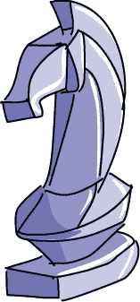

游戏通过这些元素来吸引玩家。一款有效的游戏将这些元素混合使用，使游戏容易上手，但又具有挑战性。

# 构建游戏框架：微笑 Pong，版本 1.0

Pong，如图 10-1 所示，是最早的街机电子游戏之一，起源于 1960 年代和 1970 年代。40 多年后，依然充满乐趣。

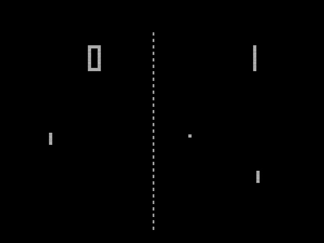

*维基媒体共享资源*

图 10-1。1972 年 Atari 的著名 Pong 游戏

单人版 Pong 的游戏玩法很简单。挡板沿屏幕的一侧移动（我们将挡板放在底部），并反弹一个球，在我们的游戏中是一个笑脸。每次击中球时，玩家得分；每次未能击中球时，玩家失分（或失去一条生命）。

我们将使用来自第八章的弹跳笑脸程序作为游戏的基础。以*SmileyBounce2.py*（将一切整合）为基础，我们已经有了一个平滑动画的笑脸球在窗口的边缘反弹，并且我们已经处理了`while`循环，保持动画继续，直到用户退出。为了制作 Smiley Pong，我们将添加一个追踪鼠标的底部屏幕上的挡板，并增加更多的碰撞检测，以便检测笑脸球何时碰到挡板。最后的润色将是从零分和五条生命开始，当玩家击中球时给他们加分，而当球从屏幕底部反弹时扣掉一条生命。图 10-2 展示了我们最终的目标。完成后，我们的最终程序将像将一切整合中的示例那样。

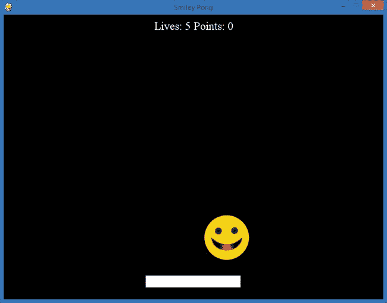

图 10-2. 我们将要构建的 Smiley Pong 游戏

我们将在原来的*SmileyBounce2.py*应用中添加的第一个功能是挡板。

## 绘制棋盘和游戏组件

在我们完成的游戏中，挡板将沿着屏幕底部移动，跟随鼠标的移动，帮助用户避免球撞到屏幕底部。

为了让挡板开始工作，我们将把这些信息添加到应用的设置部分：

```
WHITE = (255,255,255)
paddlew = 200
paddleh = 25
paddlex = 300
paddley = 550
```

这些变量将帮助我们创建一个挡板，它只是一个宽度为 200，高度为 25 的白色矩形。我们希望它的左上角坐标从(300, 550)开始，这样挡板就会稍微位于屏幕底部上方，并且水平居中在 800 × 600 的屏幕上。

但是我们还不会画出这个矩形。这些变量足以在第一次时在屏幕上绘制一个矩形，但我们的挡板需要跟随用户的鼠标移动。我们希望挡板在屏幕上根据用户在*x*方向（左右）移动鼠标的位置进行绘制，同时保持 y 坐标固定在屏幕底部附近。为了实现这一点，我们需要获取鼠标的 x 坐标。我们可以通过`pygame.mouse.get_pos()`来获取鼠标的位置。在这种情况下，由于我们只关心`get_pos()`的 x 坐标，而*x*在鼠标位置中排在前面，我们可以这样获取鼠标的 x 坐标：

```
paddlex = pygame.mouse.get_pos()[0]
```

但是记住，Pygame*从*我们提供的(*x*, *y*)位置开始绘制矩形，并且将矩形的其余部分绘制到该位置的右侧和下方。为了将挡板居中在鼠标位置，我们需要从鼠标的 x 位置中减去挡板宽度的一半，这样鼠标就会正好在挡板的中间：

```
paddlex -= paddlew/2
```

现在我们知道球拍的中心将始终在鼠标所在的位置，我们在游戏循环中需要做的就是在屏幕上绘制球拍矩形：

```
pygame.draw.rect(screen, WHITE, (paddlex, paddley, paddlew, paddleh))
```

如果你将这三行代码加到`while`循环中的`pygame.display.update()`之前，并在设置部分添加球拍颜色、`paddlew`、`paddleh`、`paddlex`和`paddley`，你会看到球拍跟随你的鼠标。但是球还不会从球拍上反弹，因为我们还没有添加检测球是否碰到球拍的逻辑。这是我们的下一步。

## 记录分数

记录分数是让游戏有趣的一部分。分数、生命、星星——无论你用什么方式来记录分数，看到分数增加都会带来一种成就感。在我们的笑脸乒乓游戏中，我们希望玩家每次球碰到球拍时获得一分，而当他们错过球并且球碰到屏幕底部时失去一条生命。接下来的任务是添加逻辑，使球能够从球拍反弹并获得积分，同时在球碰到屏幕底部时减少生命。图 10-3 展示了玩家获得一些积分后的游戏画面。注意，分数显示已经更新为 8。

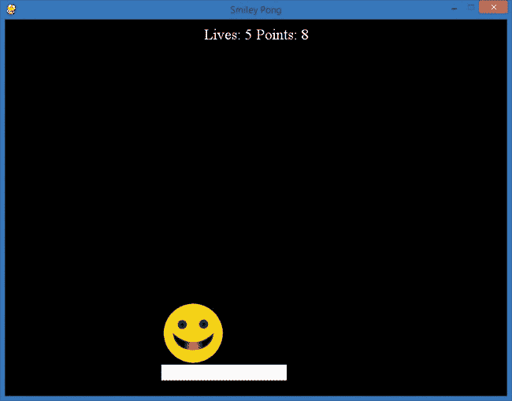

图 10-3. 当笑脸球从底部的球拍反弹时，我们会给玩家的分数加分。

如前所述，我们将从代码的设置部分开始，设置零分和五条生命：

```
points = 0
lives = 5
```

接下来，我们需要弄清楚什么时候增加`points`，什么时候减少`lives`。

### 减少生命

让我们从减少生命开始。我们知道，如果球碰到屏幕底部边缘，玩家就没有用球拍接住它，所以他们应该失去一条生命。

为了在球碰到屏幕底部时添加减少生命的逻辑，我们需要将判断球是否碰到屏幕顶部*或*底部的`if`语句（`if picy <= 0 or picy >= 500`）拆分为两个部分，分别处理顶部和底部。如果球碰到屏幕顶部（`picy <= 0`），我们只希望它反弹回来，所以我们会通过`-speedy`改变球在*y*方向上的速度。

```
if picy <= 0:
    speedy = -speedy
```

如果球从底部反弹（`picy >= 500`），我们希望从`lives`中扣除一条生命，然后让球反弹回来：

```
if picy >= 500:
    lives -= 1
    speedy = -speedy
```

扣除生命已经完成，现在我们需要添加得分。在 SmileyPop，版本 1.0 中，我们看到 Pygame 包含一些函数，可以更轻松地检测碰撞。但是，由于我们是从头开始构建这个 Smiley Pong 游戏，让我们看看如何编写自己的代码来检测碰撞。这段代码可能在未来的应用程序中派上用场，而编写它是一个有价值的解决问题的练习。

### 用挡板击打球

要检测球是否反弹到挡板上，我们需要查看球可能如何与挡板接触。它可能会撞到挡板的左上角，撞到挡板的右上角，或者直接从挡板的顶部反弹。

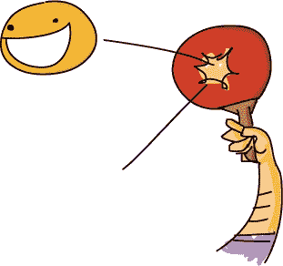

在你编写碰撞检测逻辑时，最好在纸上画出来，并标记出你需要检查是否发生碰撞的角落和边缘。图 10-4 显示了挡板和球的两个角落碰撞的草图。

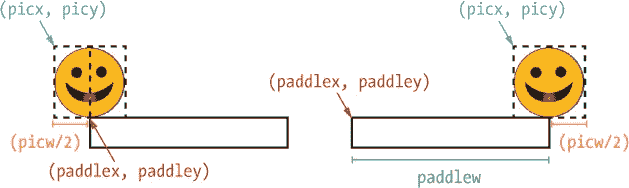

图 10-4. 挡板与我们微笑球的两种碰撞情况

因为我们希望球能现实地从挡板反弹，所以我们要检查球的底部中间是否正好接触到挡板的左边和右边的角落。我们希望确保玩家得分时，不仅仅是球从挡板的顶部反弹，还包括它从挡板的角落反弹时也能得分。为此，我们将检查球的垂直位置是否接近屏幕底部，即挡板所在的位置，如果是这样，我们还需要检查球的水平位置是否能够与挡板碰撞。

首先，让我们弄清楚什么范围的 x 坐标值可以让球与挡板碰撞。由于球的中间位置是从其 `(picx, picy)` 左上角开始，宽度的一半，我们将在应用的设置部分将球的宽度作为一个变量添加：

```
picw = 100
```

如图 10-4 所示，球可能会撞到挡板的左上角，当 `picx` 加上图片宽度的一半 (`picw/2`) 等于 `paddlex`，即挡板左角的 x 坐标时。在代码中，我们可以将这个条件作为 `if` 语句的一部分进行测试：`picx + picw/2 >= paddlex`。

我们使用*大于或等于*的条件是因为球可以位于右边（在*x*方向上大于`paddlex`）并且仍然会与球拍碰撞；边界情况就是玩家因球拍碰撞到第一个像素而获得得分的情形。球拍的左角到右角之间的所有 x 坐标值都是有效的击球区域，因此这些值应该奖励用户得分并将球反弹回去。

要找出右上角的边界情况，我们可以从图中看到，我们要求球的中点，其 x 坐标是`picx + picw/2`，小于或等于球拍右上角的 x 坐标，后者是`paddlex + paddlew`（即球拍的起始 x 坐标加上球拍的宽度）。在代码中，这将是`picx + picw/2 <= paddlex + paddlew`。

我们可以将这两个条件放在一个单一的`if`语句中，但这还不够。这些 x 坐标覆盖了从球拍的左角到右角，从屏幕的顶部到底部的整个屏幕。仅仅确定了 x 坐标，我们的球仍然可能出现在*y*方向上的任何位置，因此我们需要进一步缩小范围。仅仅知道我们的球在球拍的*水平*范围内是不够的；我们还必须知道球在可能与球拍碰撞的*y*坐标值的*垂直*范围内。

我们知道球拍的顶部位于*y*方向上的 550 像素处，接近屏幕底部，因为我们的设置中有`paddley = 550`这一行，且矩形从该 y 坐标开始，向下延伸 25 像素，这是我们在`paddleh`中存储的球拍高度。我们知道我们的图片高 100 像素，因此我们可以将其存储为变量`pich`（图片高度），并将其添加到我们的设置部分：`pich = 100`。

为了让我们球的 y 坐标能与球拍接触，`picy`位置加上图片的高度`pich`，需要至少等于`paddley`或更大，才能让图片的底部（`picy + pich`）触碰到球拍的顶部（`paddley`）。我们判断球是否在*y*方向上碰撞球拍的`if`语句的一部分是`if picy + pich >= paddley`。但是，仅仅这个条件会允许球出现在大于`paddley`的任何地方，甚至是屏幕的底边。我们不希望用户在球击中屏幕底边后，移动球拍让球再次与球拍碰撞并得分，因此我们需要另一个`if`条件来设置我们将为之得分的最大 y 坐标值。

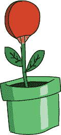

对于获得分数的最大 y 坐标值，自然的选择可能是挡板的底部，或者`paddley + paddleh`（挡板的 y 坐标加上它的高度）。但是，如果我们的球的底部越过了挡板的底部，玩家就不应该因为击中球而得分，所以我们希望`picy + pich`（球的底部）小于或等于`paddley + paddleh`——换句话说，`picy + pich <= paddley + paddleh`。

还有一个条件需要检查。记住，球和挡板是虚拟的；也就是说，它们并不存在于现实世界中，没有实际的边缘，也不像现实中的游戏棋子那样互动。即使球从底部反弹回去，我们也可以让挡板穿过球。我们不想在玩家明显错过球的时候奖励分数，因此在加分之前，我们要检查确保球不仅在垂直和水平范围内，还要确保球是朝下的。如果球的速度在*y*方向上（`speedy`）大于零，那么我们就可以知道球正在朝屏幕下方移动。当`speedy > 0`时，球是在*y*正方向上向下移动。

我们现在有了创建两个`if`语句所需的条件，这两个语句将检查球是否撞到挡板：

```
if picy + pich >= paddley and picy + pich <= paddley + paddleh \
   and speedy > 0:
    if picx + picw/2 >= paddlex and picx + picw/2 <= paddlex + \
       paddlew:
```

首先，我们检查球是否在垂直范围内能够接触到挡板，并且是否朝下而不是朝上。然后，我们检查球是否在水平范围内能够接触到挡板。

在这两个`if`语句中，复合条件使得语句太长，无法完全显示在我们的屏幕上。反斜杠字符`\`可以让我们通过换行继续写一行长代码。你可以选择将一行长代码全部写在一行内，或者通过在第一行末尾加上反斜杠`\`，按下 ENTER 键，再在下一行继续代码来使代码适应屏幕。我们在本章的游戏中有一些长的逻辑行，所以你会在几个代码列表中看到反斜杠。只需记住，Python 会把由反斜杠分隔的多行代码视为一行代码。

### 添加得分

让我们构建逻辑来弹跳球并加分。为了完成我们的挡板逻辑，我们在两个`if`语句之后添加两行代码：

```
if picy + pich >= paddley and picy + pich <= paddley + paddleh \
   and speedy > 0:
if picx + picw/2 >= paddlex and picx + picw/2 <= paddlex + \
   paddlew:
    points += 1
    speedy = -speedy
```

加分很简单：`points += 1`。改变球的方向，让它看起来像是从挡板反弹回去也很简单；我们只需要在*y*方向上反转速度，让它回到屏幕上方：`speedy = -speedy`。

你可以运行程序并查看球是否从挡板上反弹。每次挡板击中球时，你会得到一分，而每次球错过挡板时，你会失去一条生命，但目前我们还没有在屏幕上显示这些内容。接下来我们来做这件事。

## 显示分数

我们有了添加积分和扣除生命的逻辑，但在我们玩游戏时，屏幕上并没有显示积分。在这一部分，我们将向屏幕上绘制文本，以便在玩家游戏时为他们提供反馈，如图 10-5 所示。

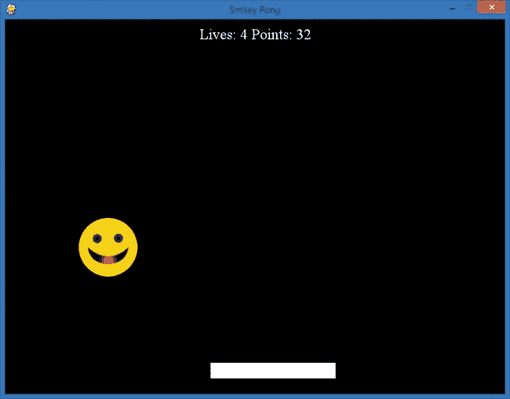

图 10-5. Smiley Pong 1.0 版本，正在成为一款真正的游戏！

第一步是将我们想要显示的文本字符串组合起来。在典型的电子游戏中，我们会看到我们的积分和剩余的生命或回合数——例如，*生命：4，积分：32*。我们已经有了表示生命数(`lives`)和总积分(`points`)的变量。我们只需要使用`str()`函数将这些数字转换为文本形式（比如`5`变为`"5"`），并在每次通过游戏循环时添加文本以指示这些数字的含义：

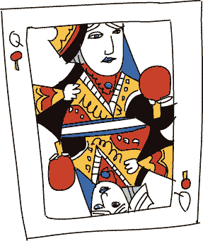

```
draw_string = "Lives: " + str(lives) + " Points: " + str(points)
```

我们的字符串变量将命名为`draw_string`，它包含了我们希望在屏幕上显示的文本，以便在玩家游戏时展示给他们。为了在屏幕上绘制该文本，我们需要一个与文本绘制模块`pygame.font`相关联的对象或变量。*字体*是*字形*的另一种名称，指的是字符绘制的样式，比如 Arial 或 Times New Roman。在你的应用的设置部分，添加以下代码：

```
font = pygame.font.SysFont("Times", 24)
```

这将创建一个名为`font`的变量，允许我们在 Pygame 显示屏上绘制 24 点的 Times 字体。你可以使文本变得更大或更小，但目前 24 点的字体大小就足够了。接下来，我们将绘制文本；这应该被加入到游戏循环中，在`draw_string`声明之后。为了在窗口上绘制文本，我们首先通过`render()`命令在我们创建的`font`对象上绘制字符串，绘制到一个独立的表面上：

```
text = font.render(draw_string, True, WHITE)
```

这将创建一个名为`text`的变量，用来存储一个表面，该表面包含了构成我们字符串中所有字母、数字和符号的白色像素。下一步将获取该表面的尺寸（宽度和高度）。较长的字符串会渲染或绘制得更宽，而较短的字符串会占用更少的像素来绘制。较大的字体和较小的字体也是如此。文本字符串将在一个矩形表面上渲染，因此我们将为存储我们绘制的字符串的矩形命名变量为`text_rect`：

```
text_rect = text.get_rect()
```

对我们`text`表面上的`get_rect()`命令将返回绘制字符串的尺寸。接下来，我们将通过`.centerx`属性将文本矩形`text_rect`水平居中，并将文本矩形的位置设置为离屏幕顶部`10`像素的位置，这样就能轻松看到。以下是设置位置的两条命令：

```
text_rect.centerx = screen.get_rect().centerx
text_rect.y = 10
```

现在是时候将`text_rect`图像绘制到屏幕上了。我们将像处理图片`pic`一样使用`blit()`函数来完成：

```
screen.blit(text, text_rect)
```

经过这些更改，我们的 Smiley Pong 游戏变得像经典版本的游戏一样，但球是我们的笑脸。运行应用程序，你会看到类似于图 10-5 的内容。我们正在向街机级游戏迈进！

## 将所有内容整合在一起

我们使用了许多编程技巧来制作这个游戏。变量、循环、条件语句、数学、图形、事件处理——几乎用尽了我们的全部工具包。游戏对程序员和玩家来说都是一场冒险。制作一个游戏既具有挑战性又充满成就感；我们可以构建自己想要的游戏玩法，然后与他人分享。我儿子们非常喜欢 Smiley Pong 游戏的 1.0 版本，并给了我很多想法，让我可以将它扩展到 2.0 版本。

这是完整的 1.0 版本，*SmileyPong1.py*：

### SmileyPong1.py

```
import pygame       # Setup
pygame.init()
screen = pygame.display.set_mode([800,600])
pygame.display.set_caption("Smiley Pong")
keepGoing = True
pic = pygame.image.load("CrazySmile.bmp")
colorkey = pic.get_at((0,0))
pic.set_colorkey(colorkey)
picx = 0
picy = 0
BLACK = (0,0,0)
WHITE = (255,255,255)
timer = pygame.time.Clock()
speedx = 5
speedy = 5
paddlew = 200
paddleh = 25
paddlex = 300
paddley = 550
picw = 100
pich = 100
points = 0
lives = 5
font = pygame.font.SysFont("Times", 24)

while keepGoing:    # Game loop
    for event in pygame.event.get():
        if event.type == pygame.QUIT:
            keepGoing = False
    picx += speedx
    picy += speedy

    if picx <= 0 or picx + pic.get_width() >= 800:
        speedx = -speedx
    if picy <= 0:
        speedy = -speedy
    if picy >= 500:
        lives -= 1
        speedy = -speedy

    screen.fill(BLACK)
    screen.blit(pic, (picx, picy))

    # Draw paddle
    paddlex = pygame.mouse.get_pos()[0]
    paddlex -= paddlew/2
    pygame.draw.rect(screen, WHITE, (paddlex, paddley, paddlew, paddleh))

    # Check for paddle bounce
    if picy + pich >= paddley and picy + pich <= paddley + paddleh \
       and speedy > 0:
        if picx + picw / 2 >= paddlex and picx + picw / 2 <= paddlex + \
           paddlew:
            points += 1
            speedy = -speedy

    # Draw text on screen
    draw_string = "Lives: " + str(lives) + " Points: " + str(points)

    text = font.render(draw_string, True, WHITE)
    text_rect = text.get_rect()
    text_rect.centerx = screen.get_rect().centerx
    text_rect.y = 10
    screen.blit(text, text_rect)
    pygame.display.update()
    timer.tick(60)

pygame.quit()      # Exit
```

我们的游戏玩法几乎完成：球从挡板上反弹，得分，玩家如果错过球并且球撞到屏幕底部，就会失去一条命。所有基本组件都已经到位，可以让这个游戏成为一款街机风格的游戏。现在，想想你希望看到哪些改进，理清逻辑，并尝试向 1.0 版本添加代码，让你的游戏更加有趣。在接下来的部分，我们将添加三个新特性，创造一个完全互动、像视频游戏一样的体验，并与他人分享。

# 添加难度和结束游戏：Smiley Pong，版本 2.0

我们的 Smiley Pong 游戏 1.0 版本是可玩的。玩家可以得分、失去生命，并在屏幕上看到自己的进度。现在我们还没有的一个功能是游戏结束的提示。另一个是随着游戏进行，提升挑战性。我们将为 Smiley Pong 1.0 版本添加以下功能，以便在 2.0 版本中创造一个更完整的游戏：当玩家失去最后一条命时，显示游戏结束，提供重新开始或启动新游戏而无需关闭程序的选项，并随着游戏进行增加难度。我们将一一添加这三个功能，最终制作出一个有趣、充满挑战的街机风格游戏！最终版本展示在将所有内容整合在一起中。

## 游戏结束

1.0 版本从未停止游戏，因为我们没有添加处理游戏结束的逻辑。我们知道需要测试的条件：当玩家没有剩余生命时，游戏结束。现在我们需要弄清楚，当玩家失去最后一条命时该怎么做。

我们要做的第一件事是停止游戏。我们不想关闭程序，但我们确实想停止球的运动。第二件事是更改屏幕上的文字，告诉玩家游戏结束并显示他们的得分。我们可以通过在`draw_string`声明生命和得分后添加一个`if`语句来完成这两个任务。

```
if lives < 1:
    speedx = speedy = 0
    draw_string = "Game Over. Your score was: " + str(points)
    draw_string += ". Press F1 to play again. "
```

通过将 `speedx` 和 `speedy`（分别是球的水平和垂直速度）设置为零，我们让球停止了移动。用户仍然可以在屏幕上移动挡板，但我们通过视觉效果结束了游戏，以让用户知道游戏已经结束。屏幕上的文字使这一点更加明确，并告诉玩家他们在这一局中的表现如何。

现在，我们告诉用户按下 F1 键重新开始游戏，但按下这个键目前没有任何反应。我们需要添加逻辑来处理按键事件并重新开始游戏。

## 重新开始

我们希望在玩家用完所有生命后，让他们开始新的一局游戏。我们已经在屏幕上添加了文本，告诉玩家按 F1 键重新开始游戏，那么接下来我们要添加代码来检测按键事件并重新开始游戏。首先，我们将检查是否有按键被按下，并且该按键是否是 F1 键：

```
if event.type == pygame.KEYDOWN:
    if event.key == pygame.K_F1: # F1 = New Game
```

在我们的游戏循环中的事件处理器 `for` 循环里，我们添加一个 `if` 语句来检查是否发生了 `KEYDOWN` 事件。如果有，我们检查事件中按下的键（`event.key`），看它是否等于 F1 键（`pygame.K_F1`）。跟随这个第二个 `if` 语句的代码将是我们的 *重新开始* 或 *新游戏* 代码。

### 注意

*你可以在* [`www.pygame.org/docs/ref/key.html`](http://www.pygame.org/docs/ref/key.html) *获取完整的 Pygame 键码列表，如 `K_F1`。*

“重新开始”意味着我们要从头开始。对于 Smiley Pong，我们从 0 分、5 条命开始，球从屏幕的左上角（0, 0）以每帧 5 像素的速度向我们移动。如果我们重置这些变量，就能得到新的游戏效果：

```
points = 0
lives = 5
picx = 0
picy = 0
speedx = 5
speedy = 5
```

将这些代码行添加到 F1 键 `KEYDOWN` 事件的 `if` 语句中，你就可以随时重新开始游戏。如果你希望仅在游戏已经结束时允许重新开始，可以添加一个额外的条件 `lives == 0`，但在我们的 2.0 版本中，我们将保持当前的 `if` 语句，这样用户就可以随时重新开始游戏。

## 更快更快

我们的游戏缺少一个最终的游戏设计元素：随着游戏进行，游戏的挑战性并没有增加，因此玩家可以玩得几乎永远，且注意力越来越分散。让我们随着游戏的进展增加难度，以吸引玩家并使游戏更具街机风格。

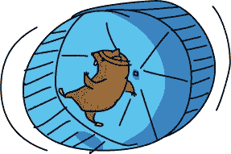

我们希望随着游戏的进行，稍微增加球的速度，但不能增加太多，否则玩家可能会感到沮丧。我们希望每次反弹后，游戏稍微加速。最自然的做法是在检查反弹的代码中进行修改。增加速度意味着让 `speedx` 和 `speedy` 的值更大，这样球在每一帧中就能向每个方向移动得更远。尝试将我们的碰撞检测 `if` 语句（我们在这里让球从屏幕的每个边缘反弹）更改为以下内容：

```
if picx <= 0 or picx >= 700:
    speedx = -speedx * 1.1
if picy <= 0:
    speedy = -speedy + 1
```

在第一个情况下，当球在水平方向上从屏幕的左右两边反弹时，我们通过将水平速度`speedx`乘以`1.1`来增加它的速度（我们仍然通过负号来改变方向）。每次左右反弹后，速度增加 10%。

当球从屏幕顶部反弹时（`if picy <= 0`），我们知道球的速度会变为正值，因为它会从顶部反弹并沿着正*y*方向向下移动，因此我们可以在改变方向时加上负号后，将`speedy`加 1。如果球以每帧 5 像素的速度朝顶部移动，那么它离开时的速度将是每帧 6 像素，接着是 7 像素，依此类推。

如果你做了这些修改，你会看到球的速度越来越快。但一旦球开始变得更快，它就不会再变慢了。很快，球的速度会快到玩家可能在一秒钟内就失去所有五条命。

我们通过在玩家失去一条命时重置速度，使我们的游戏更加可玩（并且公平）。如果球的速度太快，用户无法用球拍打到它，那么很可能是时候将速度重置为一个较慢的值，让玩家赶上。

我们的代码用于从屏幕底部反弹时会减少玩家的一条生命，因此在减去一条生命后，我们应该改变速度：

```
if picy >= 500:
    lives -= 1
    speedy = -5
    speedx = 5
```

这样可以使游戏更加合理，因为球不再失控并保持这种状态；当玩家失去一条命后，球的速度会减慢到足以让玩家再打几次球，然后才会加速。

然而，有一个问题是，球的速度可能会快到在屏幕底部“卡住”；玩几局游戏后，玩家可能会遇到这样一种情况：他们在一次从屏幕底部反弹后就失去了所有剩余的生命。这是因为如果球移动得非常快，它可能会远远超出屏幕底部的边缘，并且当我们重置速度时，下一帧可能无法将球完全带回屏幕内。

为了解决这个问题，让我们在那行`if`语句的末尾添加一行代码：

```
picy = 499
```

我们在失去一条命后将球完全移回屏幕上，方法是将`picy`设置为一个值，比如`499`，使球完全位于屏幕底部边界之上。这样可以确保无论球以多快的速度撞击底部边缘，都会安全地回到屏幕上。

在这些修改之后，版本 2.0 看起来像 图 10-6。

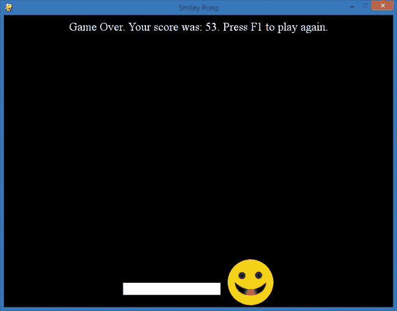

图 10-6。版本 2.0 的我们的笑脸乒乓游戏增加了更快的游戏玩法、游戏结束和重新开始功能。

版本 2.0 就像一个真正的街机游戏，配有游戏结束/再玩一次的屏幕。

## 整合所有内容

这是我们的完成版本 2.0，*SmileyPong2.py*。它的代码不到 80 行，是一款完整的街机风格游戏，你可以向朋友和家人展示。你也可以在此基础上继续开发，提升你的编码技能。

### SmileyPong2.py

```
import pygame       # Setup
pygame.init()
screen = pygame.display.set_mode([800,600])
pygame.display.set_caption("Smiley Pong")
keepGoing = True
pic = pygame.image.load("CrazySmile.bmp")
colorkey = pic.get_at((0,0))
pic.set_colorkey(colorkey)
picx = 0
picy = 0
BLACK = (0,0,0)
WHITE = (255,255,255)
timer = pygame.time.Clock()
speedx = 5
speedy = 5
paddlew = 200
paddleh = 25
paddlex = 300
paddley = 550
picw = 100
pich = 100
points = 0
lives = 5
font = pygame.font.SysFont("Times", 24)

while keepGoing:      # Game loop
    for event in pygame.event.get():
        if event.type == pygame.QUIT:
            keepGoing = False
        if event.type == pygame.KEYDOWN:
            if event.key == pygame.K_F1:     # F1 = New Game
                points = 0
                lives = 5
                picx = 0
                picy = 0
                speedx = 5
                speedy = 5
    picx += speedx
    picy += speedy

    if picx <= 0 or picx >= 700:
        speedx = -speedx * 1.1
    if picy <= 0:
        speedy = -speedy + 1
    if picy >= 500:
        lives -= 1
        speedy = -5
        speedx = 5
        picy = 499

    screen.fill(BLACK)
    screen.blit(pic, (picx, picy))

    # Draw paddle
    paddlex = pygame.mouse.get_pos()[0]
    paddlex -= paddlew/2
    pygame.draw.rect(screen, WHITE, (paddlex, paddley, paddlew, paddleh))

    # Check for paddle bounce
    if picy + pich >= paddley and picy + pich <= paddley + paddleh \
       and speedy > 0:
        if picx + picw/2 >= paddlex and picx + picw/2 <= paddlex + \
           paddlew:
            speedy = -speedy
            points += 1

    # Draw text on screen
    draw_string = "Lives: " + str(lives) + " Points: " + str(points)
    # Check whether the game is over
    if lives < 1:
        speedx = speedy = 0
        draw_string = "Game Over. Your score was: " + str(points)
        draw_string += ". Press F1 to play again. "

    text = font.render(draw_string, True, WHITE)
    text_rect = text.get_rect()
    text_rect.centerx = screen.get_rect().centerx
    text_rect.y = 10
    screen.blit(text, text_rect)
    pygame.display.update()
    timer.tick(60)

pygame.quit()       # Exit
```

你可以继续在这个示例中的游戏元素上进行扩展（参见编程挑战），或者你可以使用这些构建模块开发新的东西。大多数游戏，甚至其他应用程序，都具有像你在本章中添加的功能，我们通常会遵循一个类似于构建 Smiley Pong 时的过程。首先，规划出游戏的框架，然后构建一个可运行的*原型*，即版本 1.0。一旦它正常工作，再添加功能，直到达到你想要的最终版本。当你构建更复杂的应用程序时，你会发现*迭代版本控制*——一步一步添加功能，创造新版本——非常有用。

# 添加更多功能：SmileyPop V2.0

我们将再一次按照迭代版本过程，通过添加我和我的儿子 Max 在第九章中希望在 SmileyPop 应用程序中看到的功能来进行开发。首先，他希望每次鼠标点击气泡（或气球）时能够播放声音效果。其次，我们都希望有某种反馈和显示（比如已经创建了多少个气泡，已经爆破了多少个），我还希望有一个进度显示，比如我们已经爆破了多少个气泡的百分比。SmileyPop 应用程序已经很有趣了，但这些元素可以让它变得更好。

回顾一下 SmileyPop.py；我们将从这个版本的应用程序开始，并通过添加代码构建第二个版本（v2.0，版本 2.0 的简称）。最终版本，*SmileyPop2.py*，如图 10-7 所示。

我们将首先添加 Max 的请求：爆破声音。

## 使用 Pygame 添加声音

在*[`www.pygame.org/docs/`](http://www.pygame.org/docs/)*，你可以找到模块、类和函数，它们能让你的游戏更加有趣，编程也更简单。我们需要用到的声音效果模块是`pygame.mixer`。要使用这个混音模块为游戏添加声音，首先需要一个声音文件。对于我们的爆破声音效果，请从*[`www.nostarch.com/teachkids/`](http://www.nostarch.com/teachkids/)*下载*pop.wav*文件，它位于第十章的源代码和文件下。

我们将在*SmileyPop.py*的设置部分添加这两行代码，紧接在`sprite_list = pygame.sprite.Group()`之后：

```
pygame.mixer.init()    # Add sounds
pop = pygame.mixer.Sound("pop.wav")
```

我们首先初始化混音器（就像我们用`pygame.init()`初始化 Pygame 一样）。然后我们将*pop.wav*声音效果加载到`Sound`对象中，以便在程序中播放。

第二行将*pop.wav*加载为`pygame.mixer.Sound`对象，并将其存储在变量`pop`中，我们稍后将在需要播放弹出声音时使用它。与图像文件一样，你需要将*pop.wav*保存到与*SmileyPop.py*程序相同的目录或文件夹中，代码才能找到并使用该文件。

接下来我们将添加逻辑，检查是否点击了表情符号，如果表情符号被弹出，则播放我们的`pop`声音。我们将在游戏循环的事件处理部分执行此操作，放在处理右键单击事件的相同`elif`语句中（`elif pygame.mouse.get_pressed()[2]`）。在`sprite_list.remove(clicked_smileys)`移除被点击的表情符号后，我们可以检查是否真的有表情符号碰撞发生，然后播放声音。

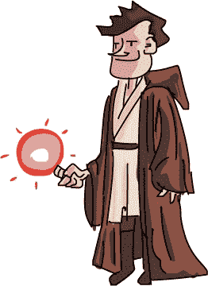

用户可能会在没有表情符号的屏幕区域右键单击，或者他们可能会在点击时错过一个表情符号。我们将检查是否有表情符号被实际点击，方法是查看`if len(clicked_smileys) > 0`。`len()`函数告诉我们列表或集合的长度，如果长度大于零，就说明有被点击的表情符号。记住，`clicked_smileys`是一个包含与用户点击点碰撞或重叠的表情符号精灵的列表。

如果`clicked_smileys`列表中有表情符号精灵，那么用户正确地右键单击了至少一个表情符号，因此我们播放弹出声音：

```
if len(clicked_smileys) > 0:
    pop.play()
```

请注意，这两行代码的缩进与我们处理右键单击的`elif`语句中的其他代码对齐。

这四行新增的代码就是当用户成功右键单击表情符号时播放弹出声音所需要的所有代码。为了实现这些更改并听到效果，请确保已将*pop.wav*声音文件下载到与修改后的*SmileyPop.py*文件相同的文件夹中，调整扬声器音量至适当水平，然后开始弹出吧！

## 跟踪和显示玩家进度

我们想要添加的下一个功能是某种方式来帮助用户感觉他们在取得进展。添加的声音效果提供了一种有趣的反馈（用户只有在实际点击了表情符号精灵时才会听到弹出声音），但我们也想跟踪用户创建和弹出的气泡数量，以及他们弹出了多少百分比的表情符号。

为了构建跟踪用户创建的表情符号数量和他们弹出的表情符号数量的逻辑，我们将首先在应用程序的设置部分添加一个`font`变量和两个计数器变量，`count_smileys`和`count_popped`：

```
font = pygame.font.SysFont("Arial", 24)
WHITE = (255,255,255)
count_smileys = 0
count_popped = 0
```

我们将`font`变量设置为 Arial 字体，大小为 24 号。我们希望以白色文字在屏幕上绘制文本，因此我们添加了一个颜色变量`WHITE`，并将其设置为白色的 RGB 三元组`(255, 255, 255)`。我们的`count_smileys`和`count_popped`变量将分别存储已创建和已弹出的笑脸数量，初始值都为零，当应用程序首次加载时。

### 已创建和已弹出的笑脸

首先，让我们在笑脸被添加到` sprite_list`时进行计数。为此，我们几乎要到达*SmileyPop.py*代码的底部，在那里`if mousedown`语句检查鼠标按钮是否按下并被拖动，且笑脸被添加到`sprite_list`中。只需将最后一行添加到该`if`语句中：

```
if mousedown:
    speedx = random.randint(-5, 5)
    speedy = random.randint(-5, 5)
    newSmiley = Smiley(pygame.mouse.get_pos(), speedx, speedy)
    sprite_list.add(newSmiley)
    count_smileys += 1
```

每次一个新的笑脸被添加到`sprite_list`时，将 1 加到`count_smileys`，将帮助我们跟踪绘制的笑脸总数。

我们将向播放点击音效的`if`语句中添加类似的逻辑，每当一个或多个笑脸被点击时，触发音效，但是我们不仅仅将 1 添加到`count_popped`—我们将添加实际被点击的笑脸数量。请记住，用户可能会点击屏幕上重叠的多个笑脸精灵。在处理右键点击事件时，我们将所有这些重叠的笑脸作为`clicked_smileys`列表来收集。为了找出应该添加多少分数到`count_popped`，我们再次使用`len()`函数来获取用户通过右键点击弹出的笑脸数量。将这行代码添加到你为弹出音效写的`if`语句中：

```
if len(clicked_smileys) > 0:
    pop.play()
    count_popped += len(clicked_smileys)
```

通过将`len(clicked_smileys)`添加到`count_popped`，我们可以确保在任何时刻都有正确的已弹出笑脸数量。现在，我们只需要向游戏循环中添加代码，显示已创建的笑脸数量、已弹出的笑脸数量以及已弹出笑脸的百分比，以衡量用户的进度。

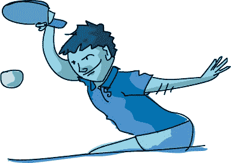

就像在我们的笑脸乒乓显示中一样，我们将创建一串文本在屏幕上绘制，并通过`str()`函数将数字作为字符串显示。将这些行添加到你的游戏循环中，紧接在`pygame.display.update()`之前：

```
draw_string = "Bubbles created: " + str(count_smileys)
draw_string += " - Bubbles popped: " + str(count_popped)
```

这些行将创建我们的`draw_string`，并显示已创建和已弹出的笑脸气泡数量。

### 已弹出笑脸的百分比

在两个`draw_string`语句后面添加这三行代码：

```
if (count_smileys > 0):
    draw_string += " - Percent: "
    draw_string += str(round(count_popped/count_smileys*100, 1))
    draw_string += "%"
```

为了得到已弹出笑脸占所有已创建笑脸的百分比，我们将`count_popped`除以`count_smileys`（`count_popped/count_smileys`），然后乘以 100 得到百分比值（`count_popped/count_smileys*100`）。但是如果我们尝试显示这个数字，会遇到两个问题。首先，当程序启动并且这两个值都为零时，我们的百分比计算将产生“除以零”的错误。为了解决这个问题，我们只会在`count_smileys`大于零时显示已弹出的百分比。

其次，如果用户创建了三个笑脸并弹出了其中一个——这是三分之一的比例，即 1/3——那么百分比将是 33.33333333……。我们不希望每次百分比计算有循环小数时，显示变得很长，因此我们可以使用`round()`函数将百分比四舍五入到一位小数。

最后一步是将字符串用白色像素绘制，将这些像素居中显示在屏幕的上方，然后调用`screen.blit()`将这些像素复制到游戏窗口的绘图屏幕中：

```
text = font.render(draw_string, True, WHITE)
text_rect = text.get_rect()
text_rect.centerx = screen.get_rect().centerx
text_rect.y = 10
screen.blit (text, text_rect)
```

你可以在图 10-7 中看到这些变化的效果。

较小的笑脸表情更难捕捉并弹出，尤其是当它们快速移动时，因此很难弹出超过 90%的笑脸。这正是我们想要的效果。我们利用这个反馈和挑战/成就组件，使应用程序更像是我们可能会玩的游戏。


图 10-7。通过添加声音和进度/反馈显示，SmileyPop 应用程序现在更像是一个游戏。

弹出声音和进度显示反馈让 SmileyPop 感觉像一个移动应用程序。当你通过右键点击弹出笑脸时，你可能能想象到在移动设备上用手指轻点笑脸来弹出它们。（想了解如何构建移动应用程序，可以访问 MIT 的 App Inventor：[`appinventor.mit.edu/`](http://appinventor.mit.edu/)。）

## 将一切整合起来

这是 SmileyPop 2.0 版本的完整代码。记得将*.py*源代码文件、*CrazySmile.bmp*图像文件和*pop.wav*声音文件都保存在同一个文件夹中。

这款应用程序几乎有 90 行代码，可能手动输入会有点长。你可以访问*[`www.nostarch.com/teachkids/`](http://www.nostarch.com/teachkids/)*下载代码以及声音和图片文件。

### SmileyPop2.py

```
import pygame
import random

BLACK = (0,0,0)
WHITE = (255,255,255)
pygame.init()
screen = pygame.display.set_mode([800,600])
pygame.display.set_caption("Pop a Smiley")
mousedown = False
keep_going = True
clock = pygame.time.Clock()
pic = pygame.image.load("CrazySmile.bmp")
colorkey = pic.get_at((0,0))
pic.set_colorkey(colorkey)
sprite_list = pygame.sprite.Group()
pygame.mixer.init()    # Add sounds
pop = pygame.mixer.Sound("pop.wav")
font = pygame.font.SysFont("Arial", 24)
count_smileys = 0
count_popped = 0

class Smiley(pygame.sprite.Sprite):
    pos = (0,0)
    xvel = 1
    yvel = 1
    scale = 100

    def __init__(self, pos, xvel, yvel):
        pygame.sprite.Sprite.__init__(self)
        self.image = pic
        self.scale = random.randrange(10,100)
        self.image = pygame.transform.scale(self.image,
                                            (self.scale,self.scale))
        self.rect = self.image.get_rect()
        self.pos = pos
        self.rect.x = pos[0] - self.scale/2
        self.rect.y = pos[1] - self.scale/2
        self.xvel = xvel
        self.yvel = yvel
    def update(self):
        self.rect.x += self.xvel
        self.rect.y += self.yvel
        if self.rect.x <= 0 or self.rect.x > screen.get_width() - self.scale:
            self.xvel = -self.xvel
        if self.rect.y <= 0 or self.rect.y > screen.get_height() - self.scale:
            self.yvel = -self.yvel

while keep_going:
    for event in pygame.event.get():
        if event.type == pygame.QUIT:
            keep_going = False
        if event.type == pygame.MOUSEBUTTONDOWN:
            if pygame.mouse.get_pressed()[0]: # Left mouse button, draw
                mousedown = True
            elif pygame.mouse.get_pressed()[2]: # Right mouse button, pop
                pos = pygame.mouse.get_pos()
                clicked_smileys = [s for s in sprite_list if
                                   s.rect.collidepoint(pos)]
                sprite_list.remove(clicked_smileys)
                if len(clicked_smileys) > 0:
                    pop.play()
                    count_popped += len(clicked_smileys)
        if event.type == pygame.MOUSEBUTTONUP:
            mousedown = False
    screen.fill(BLACK)
    sprite_list.update()
    sprite_list.draw(screen)
    clock.tick(60)
    draw_string = "Bubbles created: " + str(count_smileys)
    draw_string += " - Bubbles popped: " + str(count_popped)
    if (count_smileys > 0):
        draw_string += " - Percent: "
        draw_string += str(round(count_popped/count_smileys*100, 1))
        draw_string += "%"

    text = font.render(draw_string, True, WHITE)
    text_rect = text.get_rect()
    text_rect.centerx = screen.get_rect().centerx
    text_rect.y = 10
    screen.blit (text, text_rect)

    pygame.display.update()
    if mousedown:
        speedx = random.randint(-5, 5)
        speedy = random.randint(-5, 5)
        newSmiley = Smiley(pygame.mouse.get_pos(), speedx, speedy)
        sprite_list.add(newSmiley)
        count_smileys += 1

pygame.quit()
```

写得越多的程序，你的编程技能就会越好。你可以从编写你感兴趣的游戏开始，写一个解决你关心问题的应用程序，或者为其他人开发应用程序。继续编程，解决更多问题，编程能力会越来越强，你很快就能帮助创造出惠及全球用户的产品。

无论你是在编写移动游戏和应用程序；编写控制汽车、机器人或无人机的程序；还是构建下一个社交媒体网络应用程序，编程都是一项能够改变你生活的技能。

你拥有了这些技能，你也有能力。继续练习，继续编程，走出去去改变世界——改变你自己的人生，改变你关心的人的生活，甚至改变整个世界。

# 你学到了什么

在本章中，你了解了游戏设计的元素，从目标和成就到规则和机制。我们从零开始构建了一个单人《Smiley Pong》游戏，并将我们的 SmileyPop 应用转变为一个我们可以在智能手机或平板电脑上玩的游戏。我们结合了动画、用户互动和游戏设计，构建了《Smiley Pong》游戏的两个版本和 SmileyPop 的第二个版本，并随着进展不断增加更多特性。

在《Smiley Pong》中，我们绘制了棋盘和游戏棋子，添加了用户互动以移动挡板，加入了碰撞检测和计分功能。我们在屏幕上显示文本，提供用户关于其成就和游戏状态的信息。你学习了如何在 Pygame 中检测按键事件，添加了“游戏结束”和“重新开始”逻辑，并通过让球在游戏进程中加速完成了 2.0 版本。现在，你已经具备了构建更复杂游戏的框架和部分内容。

在 SmileyPop 中，我们从一个已经很有趣的应用开始，使用`pygame.mixer`模块添加了通过爆炸声反馈的用户反馈，然后添加了逻辑和显示来跟踪用户的进度，随着更多气泡的产生和爆炸。

你用编程技能创建的应用也将从一个简单的版本开始，一个*概念验证*版本，你可以运行并作为新版本的基础。你可以从任何程序开始，一次性添加一个新特性，并在此过程中保存每个新版本——这个过程叫做*迭代版本管理*。这个过程帮助你调试每个新特性，直到它正常工作，同时也帮助你在新代码出现问题时保留最后一个正常版本的文件。

有时候，一个新特性会非常合适，并成为下一个版本的基础。有时候你的新代码无法工作，或者特性没有你预期的那么酷。不管怎样，你通过尝试新事物并解决新问题来提升你的编程技能。

编程愉快！

掌握本章的概念后，你应该能够做到以下几点：

+   识别你所使用的游戏和应用中的常见游戏设计元素。

+   将游戏设计元素融入你编写的应用中。

+   通过绘制棋盘和游戏棋子并添加用户互动，构建一个游戏框架。

+   在应用或游戏中编写碰撞检测逻辑并保持得分。

+   使用`pygame.font`模块在屏幕上显示文本信息。

+   编写游戏逻辑以判断游戏是否结束。

+   在 Pygame 中检测和处理按键事件。

+   开发代码以启动新游戏或在游戏结束后重新开始。

+   使用数学和逻辑使游戏逐步变得更加困难。

+   使用`pygame.mixer`模块为应用添加音效。

+   显示百分比和四舍五入的数字，以便让用户了解自己在游戏中的进展。

+   理解迭代版本管理的过程：逐个添加特性并将其保存为新版本（1.0、2.0 等）。

编程挑战

要查看这些挑战的示例答案，并下载本章的音频文件，请访问 *[`www.nostarch.com/teachkids/`](http://www.nostarch.com/teachkids/)*。

**#1: 音效**

我们可以为 Smiley Pong 2.0 版本添加的一个功能是音效。在经典的 Pong 游戏机和街机游戏中，球在玩家得分时会发出“哔”声，错失时会发出“嗡嗡”声或“啪”的声音。作为你最终挑战之一，运用在 SmileyPop 2.0 版本中学到的技能，通过为得分和错失的反弹添加音效，将 Smiley Pong v2.0 升级为 v3.0。将这个新文件保存为 *SmileyPong3.py*。

**#2: 命中与错失**

为了让 SmileyPop 应用程序更具游戏性，添加逻辑来跟踪总点击次数中的命中和错失次数。如果用户在右键点击时命中了任何笑脸精灵，就将 `hits` 加 1（每次点击 1 次命中——我们不希望重复记录 `count_popped`）。如果用户右键点击但没有命中任何笑脸精灵，记录为一次 `miss`。你可以编写逻辑，在错失一定次数后结束游戏，或者给用户一个总点击次数，让他们尽可能获得最高的命中率。你甚至可以添加一个计时器，告诉玩家在比如 30 秒内尽可能多地创建和弹出笑脸气泡。将这个新版本保存为 *SmileyPopHitCounter.py*。

**#3: 清除气泡**

你可能想要添加一个“清除”功能（或者作弊按钮），通过按下功能键弹出所有气泡，类似于我们在 Smiley Pong 中的“重新开始”功能。你还可以通过在气泡每次碰到边缘时，将它们的速度乘以一个小于 1 的数值（比如 0.95），使得弹跳的笑脸逐渐减速。可能性无穷无尽。
