# 附录 A. Windows、Mac 和 Linux 上的 Python 设置

本附录将指导你完成在 Windows、Mac 或 Linux 上安装 Python 的每个步骤。根据你的操作系统版本，看到的内容可能与你屏幕上的有所不同，但这些步骤应该能帮助你顺利完成安装。

如果你在学校或工作场所的计算机上安装 Python，可能需要 IT 部门的帮助或许可来进行安装。如果你在学校安装 Python 时遇到问题，请寻求 IT 帮助并告诉他们你在学习编程。

# Windows 上的 Python

对于 Windows，我们将使用 Python 3.2.5 版本，这样我们的 Pygame 安装（见附录 B）将使 第八章到 第十章 中的程序更容易。

## 下载安装程序

1.  访问 *[`python.org/`](http://python.org/)*，将鼠标悬停在 **Downloads** 链接上。你将看到一个下拉选项列表，如图 A-1 所示。

    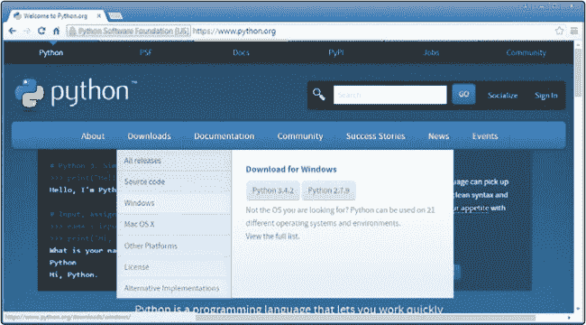

    图 A-1. 将鼠标悬停在 *Downloads* 上以显示选项列表。

1.  在下拉列表中，点击 **Windows** 链接。这将带你进入 Python Windows 版本下载页面，如图 A-2 所示。

    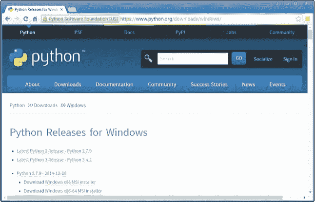

    图 A-2. Python Windows 版本下载页面

1.  向下滚动，直到看到以 *Python 3.2.5* 开头的链接。在该链接下方，你将看到几个项目，如图 A-3 所示。

    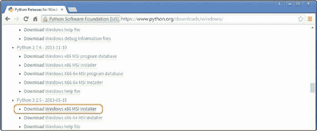

    图 A-3. 在 Python Releases For Windows 下找到 Python 3.2.5 安装程序。

1.  在 Python 3.2.5 下，点击 **Windows x86 MSI 安装程序**。这将下载安装程序文件。

## 运行安装程序

1.  等待下载完成后，打开 *Downloads* 文件夹。你应该能看到 *python-3.2.5* Windows 安装程序文件，如图 A-4 所示。

    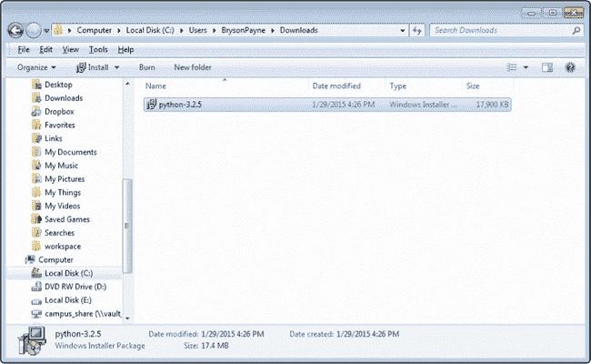

    图 A-4. 双击 *Downloads* 文件夹中的安装程序。

1.  双击 *python-3.2.5* Windows 安装程序文件以开始安装。

1.  可能会弹出一个安全警告对话框，如图 A-5 所示。如果你看到安全警告窗口，点击**运行**；Windows 只是通知你该软件正在尝试在你的计算机上安装某些内容。

    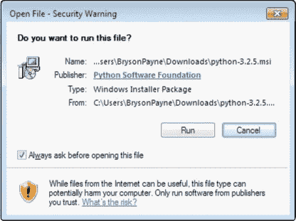

    图 A-5。点击**运行**以允许安装。

1.  安装程序可能会询问你是否希望为所有用户安装 Python 或仅为自己安装，如图 A-6 所示。通常选择**为所有用户安装**是最好的，但如果在学校或办公室无法允许此操作，或者你无法正常安装，尝试选择**仅为我安装**。然后点击**下一步 >**。

    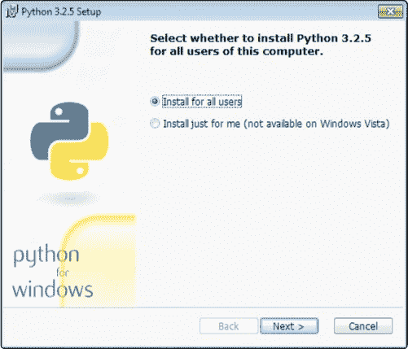

    图 A-6。为所有用户安装。

1.  接下来，你将看到一个选择目标文件夹的窗口，像图 A-7 所示。这是你可以选择安装 Python 的文件夹位置。程序会尝试将其安装到你的*C:\*驱动器下的一个名为*Python32*的文件夹中，这应该适用于你的笔记本电脑或家庭 PC。点击**下一步 >**继续安装。（如果你在学校或公司安装，遇到问题时，IT 部门可能会要求你安装到其他文件夹，比如*用户*或*桌面*。）

    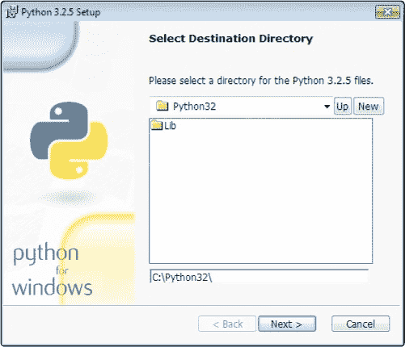

    图 A-7。选择一个文件夹安装 Python。

1.  现在你将看到一个像图 A-8 所示的窗口，要求你自定义 Python。这里无需更改任何内容。只需点击**下一步 >**。

    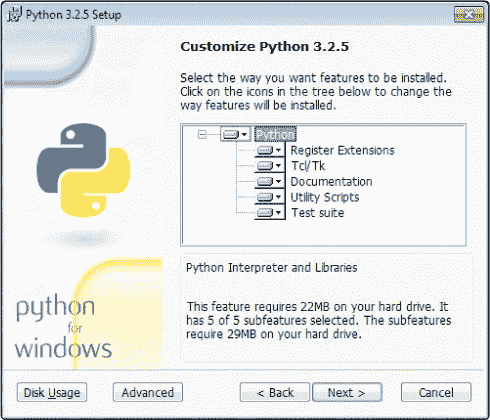

    图 A-8。不要更改任何设置，只需点击**下一步 >**。

1.  你现在已经完成了安装程序，应该会看到一个像图 A-9 所示的窗口。点击**完成**。

    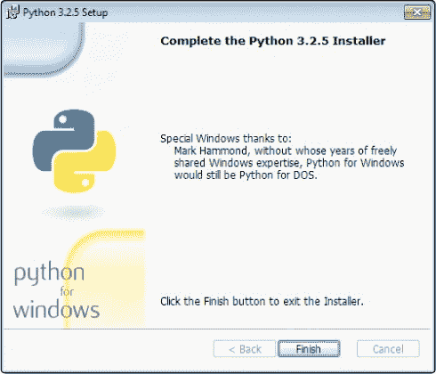

    图 A-9。点击**完成**退出安装程序。

    你已经安装了 Python！接下来，你可以尝试运行它，以确保它正常工作。

## 尝试 Python

1.  转到**开始**▸*程序*▸**Python 3.2**▸**IDLE (Python GUI)**，如图 A-10 所示。（在 Windows 8 及以后的版本中，你可以点击 Windows/开始按钮，进入搜索工具，然后输入**`IDLE`**。）

    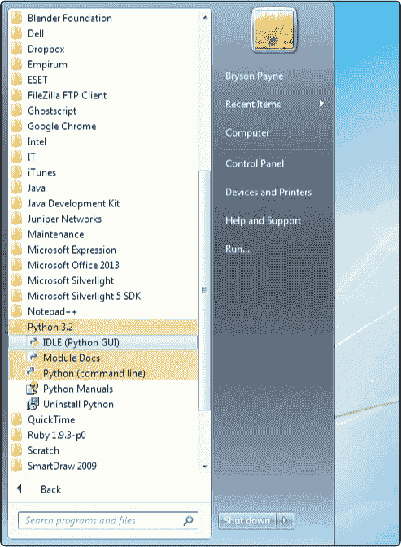

    图 A-10。从开始菜单打开 IDLE。

1.  Python Shell 编辑器界面应该会出现。这个 Python shell 程序是你可以输入代码并立即查看结果的地方。如果你感到好奇，可以开始尝试一些代码。输入 **`print("Hello, Python!")`** 并按回车键。Python shell 应该会返回 `Hello, Python!`，如图 A-11 所示。尝试一个加法语句，例如 **`2 + 3`**。按下回车键，Python 会返回答案！

    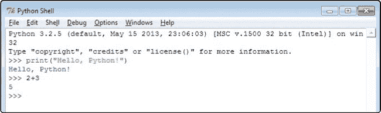

    图 A-11. 在 Python shell 中尝试一些命令

1.  最后，你可能想要调整 IDLE 中文本的大小，使其更容易阅读。转到 **选项** ▸ **配置 IDLE...**。在 **字体/标签** 下，如图 A-12 所示，将 **大小** 选项更改为 **18** 或任何对你来说最容易阅读的大小。你还可以勾选粗体选项，使文本更加粗体。自定义字体，使其适合你的眼睛。

    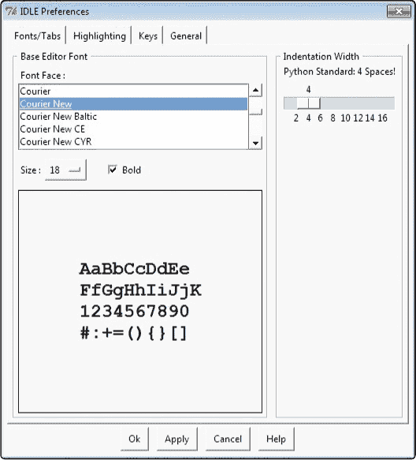

    图 A-12. 在 IDLE 中配置首选项

1.  选择了字体和大小选项以便让 IDLE 输入更易读后，点击 **应用**，然后点击 **确定** 返回到 IDLE Python shell 屏幕。现在当你输入时，应该会看到按照你选择的字体和大小显示的文本。

现在你已经准备好开始学习 第一章 到 第七章。要使用 第八章 到 第十章 中的程序，请转到附录 B 并按照步骤安装 Pygame。祝编码愉快！

# Python for Mac

大多数 Apple 电脑预装了早期版本的 Python，但我们要安装版本 3.4.2，以便使用 Python 3 的新特性来运行书中的示例代码。

## 下载安装程序

1.  访问 *[`python.org/`](http://python.org/)*，并将鼠标悬停在 **下载** 链接上，查看下拉列表中的选项。你会看到 Mac OS X 在此列表中，如图 A-13 所示。

    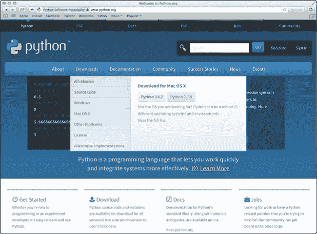

    图 A-13. 将鼠标悬停在下载链接上，你应该会看到下拉列表中有一个 Mac OS X 链接。

1.  点击下拉列表中的 **Mac OS X** 链接。这将带你到 Mac OS X 的 Python 发行版页面。

1.  在 Python Releases For Mac OS X 页面，找到以*Python 3.4.2*开头的链接并点击它。这将下载安装程序。

## 运行安装程序

1.  等待下载完成。然后打开你的*下载*文件夹，找到*python-3.4.2* Mac 安装程序文件，如图 A-14 所示。双击该文件开始安装。

    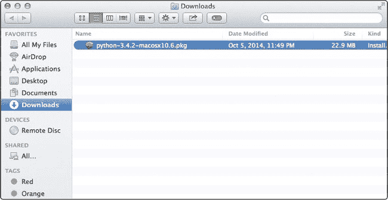

    图 A-14. 双击你的*下载*文件夹中的安装程序。

1.  双击安装程序文件将会打开一个安装 Python 的窗口。你会看到一个欢迎界面，如图 A-15 所示。点击**继续**。

    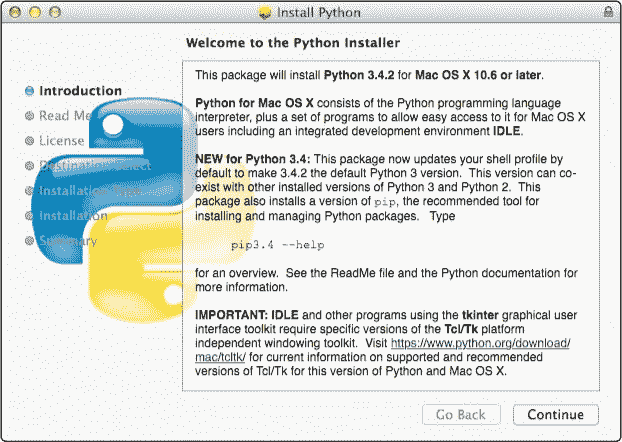

    图 A-15. 在欢迎屏幕上点击继续按钮。

1.  阅读并在软件许可协议弹出对话框中点击**同意**，如图 A-16 所示。

    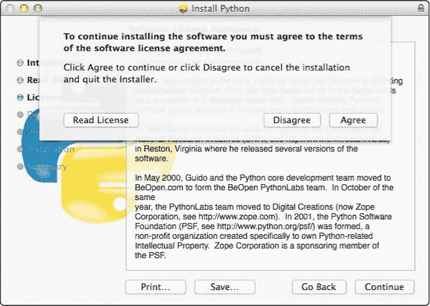

    图 A-16. 阅读并点击同意软件许可协议对话框。

1.  你将进入一个选择目标安装位置的屏幕，如图 A-17 所示，在这里你可以选择将 Python 安装到哪个磁盘。程序通常会安装到你的 Mac HD 硬盘上，这对你的 MacBook 或家用 Mac 应该没有问题。点击**继续**以继续安装。（如果你在学校或公司安装并遇到问题，IT 人员可能会告诉你安装到其他文件夹；如有需要，向他们寻求帮助。）

    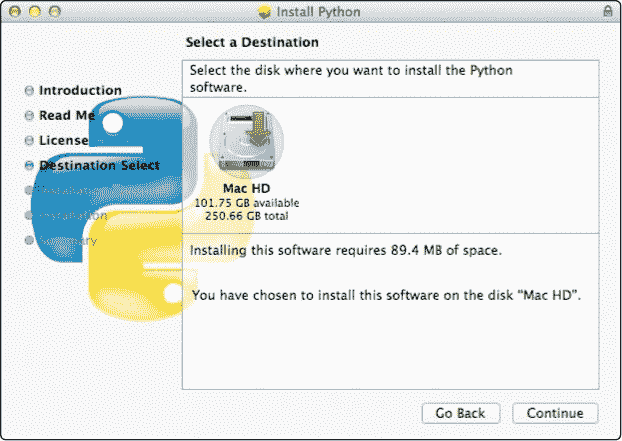

    图 A-17. 点击继续以继续安装。

1.  在下一个屏幕上点击**安装**，如图 A-18 所示。

    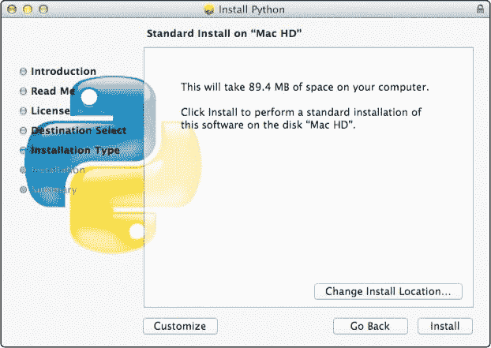

    图 A-18. 点击安装。

1.  你应该会看到一个确认安装完成的屏幕，如图 A-19 所示。点击**关闭**退出安装程序。

    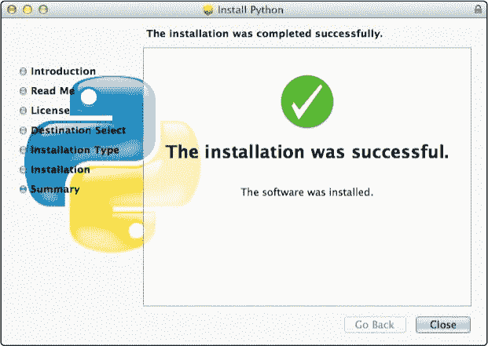

    图 A-19. 要退出安装程序，请点击关闭按钮。

    你已经成功安装了 Python！接下来，你可以尝试运行它看看是否正常工作。

## 尝试运行 Python

1.  打开启动台并点击**IDLE**，或者去**Finder**▸**应用程序**，双击*Python 3.4*文件夹，再双击**IDLE**打开 Python shell，如图 A-20 所示。

    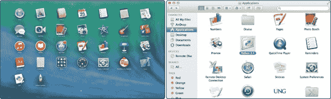

    图 A-20. 从启动台（左）或应用程序文件夹（右）打开 IDLE。

1.  Python shell 编辑器屏幕应该会出现。你已经准备好在 shell 中尝试编写代码了。输入**`print("Hello, Python!")`**并按回车；Python shell 应该会回应`Hello, Python!`，如图 A-21 所示。试试加法语句，比如**`2 + 3`**。按回车，Python 将给出答案。

    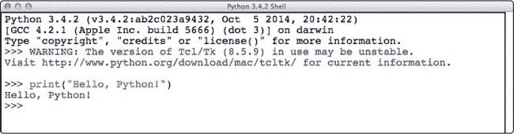

    图 A-21. 在 Python shell 中尝试一些命令

1.  你可能想调整 IDLE 窗口中文本的大小，使其在电脑上更容易阅读。进入**IDLE**▸**首选项...**。在**字体/标签**下，将**大小**选项更改为**20**，如图 A-22 所示，或者调整为更大或更小，直到你觉得易于阅读。如果需要，可以勾选加粗框，使文本更粗。根据需要自定义字体，选择适合自己眼睛的字体。

    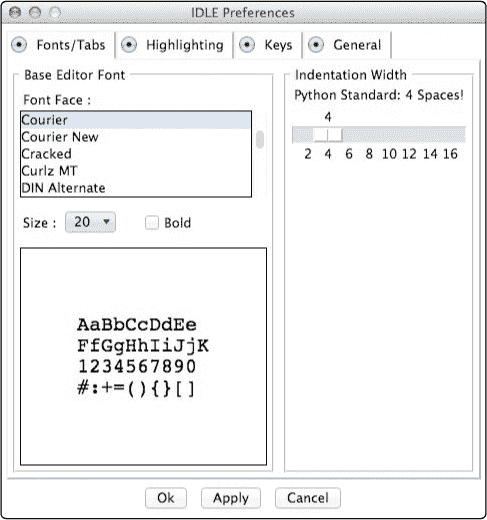

    图 A-22. 在 IDLE 中配置首选项

    现在你已准备好攻克第一章到第七章的内容。要使用第八章到第十章中的程序，请前往附录 B 并按照步骤安装 Pygame。祝编程愉快！

# Linux 上的 Python

大多数 Linux 发行版，包括 Ubuntu，甚至是 Raspberry Pi 自带的 Linux 操作系统，都已经预装了一个较早版本的 Python。然而，本书中的大多数应用程序需要 Python 3。要在 Linux 上安装 Python 3，请按照以下步骤操作：

1.  在 Dash 菜单中，进入系统工具并运行 Ubuntu 软件中心，或者根据你的 Linux 版本运行类似的应用程序。图 A-23 展示了在 Lubuntu 中运行的软件中心。

    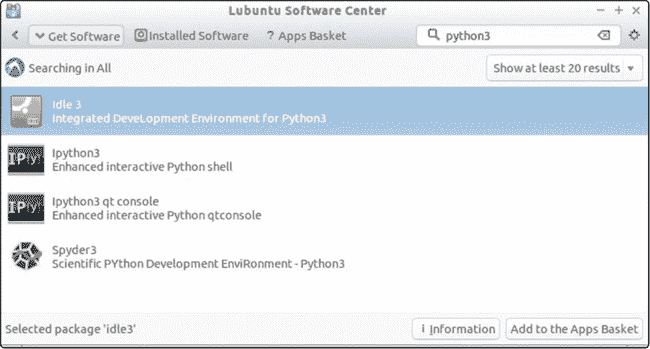

    图 A-23. 在运行 Lubuntu Linux 的计算机上安装 Python 3

1.  搜索 *python3* 并找到 *Idle 3*。点击 **添加到应用程序篮子**。

1.  打开应用程序篮子标签，点击 **安装软件包**，如 图 A-24 所示。

    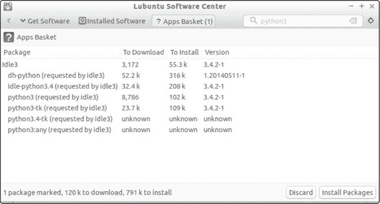

    图 A-24. 安装包含 Python 3 的 Idle 3 软件包。

1.  安装完成后，打开文件窗口，选择 **应用程序**，然后选择 **编程**，你应该能看到 **IDLE（使用 Python-3.4）**，如 图 A-25 所示。

    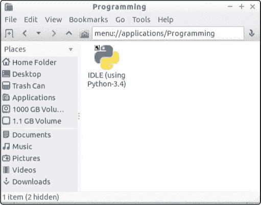

    图 A-25. IDLE，Python Shell 程序

1.  通过运行 IDLE 并输入 **`2 + 3`** 然后按 ENTER 键来测试 IDLE。输入 **`print("Hello, world.")`** 然后按 ENTER 键。IDLE 应该会如 图 A-26 所示进行响应。

    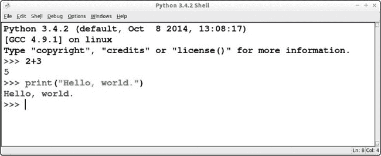

    图 A-26. 通过运行 IDLE 测试 Python。你已经准备好编写代码了！

    你已经准备好尝试 第一章 到 第七章 的所有程序。要使用 第八章 到 第十章 中的程序，参见附录 B 了解如何为 Linux 安装 Pygame。祝编程愉快！
